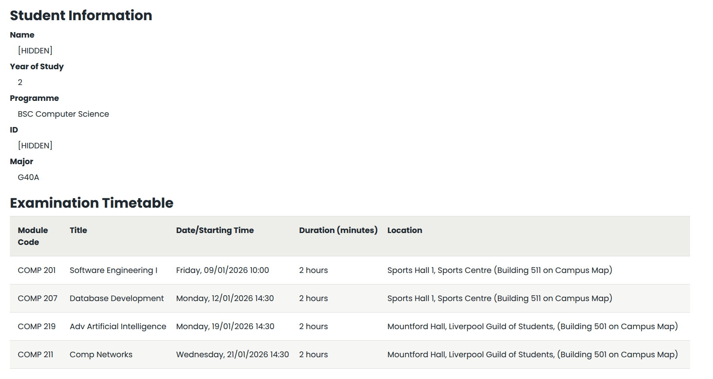

# University_of_Liverpool_Computer_Science_Y2_Note
这个仓库用于存放英国利物浦大学大三计算机专业的笔记

> **选课网址 [[Module Registration - My Liverpool]](https://my.liverpool.ac.uk/ModuleRegistration)**

# 第一学期

| 编号     | Mandatory | 英文名                           | 中文名       |
| -------- | --------- | -------------------------------- | ------------ |
| COMP 201 | 必修      | Software Engineering I           | 软件工程 I   |
| COMP 207 | 必修      | Database Development             | 数据库开发   |
| COMP 219 | **选修**  | Advanced Artificial Intelligence | 高级人工智能 |
| COMP 211 | **选修**  | Computer Networks                | 计算机网络   |

## 第一学期考试



# 第二学期

| 编号     | Mandatory | 英文名                   | 中文名           |
| -------- | --------- | ------------------------ | ---------------- |
| COMP 212 | 必修      | Distributed Systems      | 分布式系统       |
| COMP 232 | 必修      | Cyber Security           | 网络安全         |
| COMP 208 | 必修      | Group Software Project   | 软件工程小组作业 |
| COMP 202 | 必修      | Complexity of Algorithms | 算法复杂度       |


```apl
[4.0K]  .
├── [1.8K]  LICENSE
├── [ 29K]  README.md
└── [4.0K]  Semester I
    ├── [4.0K]  202526-COMP201 - Software Engineering I
    │   ├── [4.0K]  ASSIGNMENT I
    │   │   ├── [303K]  ASSIGMENT I SCORE.png
    │   │   ├── [221K]  Assignment1_2025_26.pdf
    │   │   ├── [300K]  ASSIGNMENT 1.pdf
    │   │   ├── [ 68K]  Assignment I.md
    │   │   └── [ 66K]  Assignment I 注意事项.md
    │   ├── [4.0K]  ASSIGNMENT II
    │   │   ├── [215K]  ASSIGMENT II SCORE.png
    │   │   ├── [239K]  Assignment2_2025_26-1.pdf
    │   │   ├── [9.3K]  AssignmentII_ZhibinJiang_201945844.md
    │   │   ├── [803K]  AssignmentII_ZhibinJiang_201945844.pdf
    │   │   ├── [   0]  Project
    │   │   │   └── [   0]  COMP201ASSIGNMENT2
    │   │   │       ├── [ 661]  pom.xml
    │   │   │       ├── [   0]  src
    │   │   │       │   └── [   0]  main
    │   │   │       │       └── [4.0K]  java
    │   │   │       │           ├── [3.9K]  AirlineReservation.java
    │   │   │       │           ├── [3.4K]  CarReservation.java
    │   │   │       │           ├── [2.4K]  Client.java
    │   │   │       │           ├── [3.5K]  HotelReservation.java
    │   │   │       │           ├── [2.6K]  InsuranceReservation.java
    │   │   │       │           ├── [2.6K]  Reservation.java
    │   │   │       │           ├── [6.1K]  Test.java
    │   │   │       │           └── [2.4K]  Traveller.java
    │   │   │       ├── [   0]  target
    │   │   │       │   └── [4.0K]  classes
    │   │   │       │       ├── [3.4K]  AirlineReservation.class
    │   │   │       │       ├── [3.3K]  CarReservation.class
    │   │   │       │       ├── [2.3K]  Client.class
    │   │   │       │       ├── [3.2K]  HotelReservation.class
    │   │   │       │       ├── [2.7K]  InsuranceReservation.class
    │   │   │       │       ├── [2.4K]  Reservation.class
    │   │   │       │       ├── [4.6K]  Test.class
    │   │   │       │       └── [2.1K]  Traveller.class
    │   │   │       └── [1.9K]  UML.puml
    │   │   ├── [9.1K]  source.zip
    │   │   └── [ 822]  案例分析.txt
    │   ├── [4.0K]  ELC
    │   │   ├── [2.8K]  Notes.md
    │   │   ├── [247K]  Session 1 - Use-case diagrams and descriptions - CLASS VERSION.pdf
    │   │   ├── [236K]  Session 1 - Use-case diagrams and descriptions.pdf
    │   │   └── [ 31K]  绘图1.vsdx
    │   ├── [4.0K]  PPT
    │   │   ├── [4.0K]  Week1 Introduction
    │   │   │   ├── [109K]  Comp201 Syllabus 课程大纲.pdf
    │   │   │   ├── [3.3M]  SE_L001.pptx
    │   │   │   ├── [1.1M]  SE_L002.pptx
    │   │   │   ├── [ 74K]  SE_L003.pptx
    │   │   │   └── [ 33K]  SpellChecker.zip
    │   │   ├── [4.0K]  Week2-4 Requirements Analysis
    │   │   │   ├── [189K]  SE_L0010.pptx
    │   │   │   ├── [211K]  SE_L0011_12.pptx
    │   │   │   ├── [ 90K]  SE_L004.pptx
    │   │   │   ├── [145K]  SE_L005.pptx
    │   │   │   ├── [ 94K]  SE_L006.pptx
    │   │   │   ├── [122K]  SE_L007_L008.pptx
    │   │   │   ├── [466K]  SE_L009.pptx
    │   │   │   └── [ 52K]  Workshop seminar 2.pdf
    │   │   ├── [4.0K]  Week5-6 Software design and OO design notation
    │   │   │   ├── [ 43K]  comp201_classes.pptx
    │   │   │   ├── [ 21K]  comp201_class_examples.zip
    │   │   │   ├── [185K]  SE_L013.pptx
    │   │   │   ├── [163K]  SE_L014.pptx
    │   │   │   ├── [125K]  SE_L015.pptx
    │   │   │   ├── [107K]  SE_L016.pptx
    │   │   │   ├── [197K]  SE_L017.pptx
    │   │   │   ├── [220K]  SE_L019.pptx
    │   │   │   ├── [159K]  SE_L020.pptx
    │   │   │   ├── [227K]  SE_L021.pptx
    │   │   │   └── [454K]  SE_L022.pptx
    │   │   ├── [4.0K]  Week8-9 Testing and quality assurance
    │   │   │   ├── [120K]  SE_L023.pptx
    │   │   │   ├── [254K]  SE_L024.pptx
    │   │   │   └── [154K]  SE_L025.pptx
    │   │   └── [4.0K]  Week9 Project management and software estimation
    │   │       ├── [160K]  SE_L026.pptx
    │   │       └── [406K]  SE_L027.pptx
    │   ├── [   0]  分数详情.md
    │   └── [182K]  笔记.md
    ├── [4.0K]  202526-COMP207 - Database Development
    │   ├── [4.0K]  Assignment I 25 percent
    │   │   ├── [204K]  ASSIGNMENT SCORE.png
    │   │   ├── [3.4K]  INSERT Statements for public test data (25-26).sql
    │   │   ├── [   0]  Model Solution
    │   │   │   ├── [3.4K]  hidden data for SQL assignment (25-26).txt
    │   │   │   └── [4.8K]  model_solution_supermarket.sql
    │   │   ├── [588K]  Practical SQL assignment (25-26).pdf
    │   │   └── [8.1K]  supermarket.sql
    │   ├── [ 20K]  MySQL基本操作.md
    │   ├── [4.0K]  PPT
    │   │   ├── [   0]  Part 1 Introduction
    │   │   │   └── [5.2M]  lecture 1.pptx
    │   │   ├── [4.0K]  Part 2 Basic SQL
    │   │   │   ├── [339K]  (Each animation step) SQL DDL.pdf
    │   │   │   ├── [456K]  intro to sql.pptx
    │   │   │   ├── [ 54K]  Sequence.png
    │   │   │   ├── [504K]  SQL DML except queries.pptx
    │   │   │   ├── [489K]  SQL Injections.pptx
    │   │   │   ├── [691K]  SQL Queries – misc.pptx
    │   │   │   ├── [497K]  SQL Queries – optional part.pptx
    │   │   │   └── [ 28M]  SQL Queries - required.pptx
    │   │   ├── [4.0K]  Part 3 Transaction Management
    │   │   │   ├── [479K]  2PL ensures conflict-serializability (no video).pptx
    │   │   │   ├── [520K]  ACID in details (no video)-1.pptx
    │   │   │   ├── [483K]  Being able to recover (no video).pptx
    │   │   │   ├── [510K]  Checkpoints (no video)-1.pptx
    │   │   │   ├── [485K]  Conflict-serializable schedules (no video).pptx
    │   │   │   ├── [477K]  Detecting deadlocks (no video).pptx
    │   │   │   ├── [470K]  Good schedules (no video).pptx
    │   │   │   ├── [750K]  Intro to transactions (no video).pptx
    │   │   │   ├── [824K]  Locking conflict-serializable schedules (no video).pptx
    │   │   │   ├── [508K]  More flexible locks (no video).pptx
    │   │   │   ├── [536K]  No cascading-rollbacks! (no video).pptx
    │   │   │   ├── [504K]  Other kinds of logging (no video).pptx
    │   │   │   ├── [492K]  Recognizing a conflict-serializable schedule (no video).pptx
    │   │   │   ├── [487K]  schedules (no video)-1.pptx
    │   │   │   ├── [543K]  Schedules that behaves nearly serial (no video).pptx
    │   │   │   ├── [167K]  Sequence.png
    │   │   │   ├── [662K]  Timestamp based schedules (no video).pptx
    │   │   │   ├── [529K]  Undo-Logging (no video).pptx
    │   │   │   ├── [486K]  What would the DBMS implementations do (no video).pptx
    │   │   │   └── [475K]  Why Might a Transaction Abort (no video).pptx
    │   │   ├── [4.0K]  Part 4 Query Processing
    │   │   │   ├── [4.2M]  Deletions and conclusions for B+-Trees (no video).pptx
    │   │   │   ├── [540K]  Executing a query plan (no video).pptx
    │   │   │   ├── [634K]  External memory merge-sort (no video).pptx
    │   │   │   ├── [2.2M]  Faster joins using sorting (no video).pptx
    │   │   │   ├── [4.7M]  Idea, searching and inserting in B+-tree  (no video).pptx
    │   │   │   ├── [545K]  Index (no video)-1.pptx
    │   │   │   ├── [615K]  Introduction to query processing (no video).pptx
    │   │   │   ├── [602K]  Optimising query plans (no video).pptx
    │   │   │   ├── [726K]  Physical query plans (no video).pptx
    │   │   │   └── [ 90K]  Sequence.png
    │   │   ├── [4.0K]  Part 5 Distributed System
    │   │   │   ├── [1.9M]  Basics of MapReduce (no video).pptx
    │   │   │   ├── [747K]  Fragmentation, replication and transparency (no video).pptx
    │   │   │   ├── [777K]  Introduction to distributed databases (no video).pptx
    │   │   │   ├── [993K]  More indepth look at MapReduce (no video).pptx
    │   │   │   ├── [912K]  Query processing for DDBMS (no video).pptx
    │   │   │   └── [802K]  Transaction management in DDBMS (no video).pptx
    │   │   ├── [4.0K]  Part 6 Beyond Relation Data
    │   │   │   ├── [509K]  Basics of XML (no video).pptx
    │   │   │   ├── [ 39M]  Basics of XPath (no video)-1.pptx
    │   │   │   ├── [487K]  Basic XQuery.pptx
    │   │   │   ├── [473K]  DTD (no video)-1.pptx
    │   │   │   ├── [774K]  Introduction to NoSQL.pptx
    │   │   │   ├── [5.0M]  Introduction to semi-structured data (no video).pptx
    │   │   │   ├── [483K]  Key-Value stores.pptx
    │   │   │   ├── [ 27M]  More advanced XPaths (no video)-1.pptx
    │   │   │   ├── [ 47M]  More advanced XQuery-1.pptx
    │   │   │   ├── [ 82M]  More examples and conditions for XPath (no video)-2.pptx
    │   │   │   ├── [493K]  Other NoSQL databases.pptx
    │   │   │   ├── [115K]  Sequence.png
    │   │   │   ├── [651K]  XML in SQL.pptx
    │   │   │   ├── [488K]  XML Schema (no video).pptx
    │   │   │   └── [485K]  XQuery examples.pptx
    │   │   └── [4.0K]  Part 7 Data
    │   │       ├── [539K]  Basics of market-basket model (no video).pptx
    │   │       ├── [470K]  Data-mining (no video).pptx
    │   │       ├── [743K]  Introduction to data-analysis (no video).pptx
    │   │       ├── [683K]  More about the market-basket model (no video).pptx
    │   │       ├── [472K]  More details about dataanalysis (no video).pptx
    │   │       └── [ 56K]  Sequence.png
    │   └── [210K]  笔记.md
    ├── [4.0K]  202526-COMP211 - Computer Networks
    │   ├── [4.0K]  JavaProject
    │   │   ├── [   0]  Programming Assignment 1 - Mailclient with Browser Capabilities
    │   │   │   ├── [4.0K]  main
    │   │   │   │   ├── [6.9K]  EmailClient.java
    │   │   │   │   ├── [4.1K]  EmailMessage.java
    │   │   │   │   ├── [5.6K]  HTTPInteraction.java
    │   │   │   │   ├── [   0]  Lab3
    │   │   │   │   │   └── [2.0K]  EmailSenderLab3.java
    │   │   │   │   ├── [   0]  META-INF
    │   │   │   │   │   └── [  50]  MANIFEST.MF
    │   │   │   │   └── [6.9K]  SMTPInteraction.java
    │   │   │   └── [   0]  out
    │   │   │       ├── [   0]  artifacts
    │   │   │       │   └── [   0]  COMP211_Lab_JavaSentThisEmail_jar
    │   │   │       │       └── [ 17K]  COMP211-Lab-JavaSentThisEmail.jar
    │   │   │       └── [   0]  production
    │   │   │           └── [4.0K]  COMP211-Lab-JavaSentThisEmail
    │   │   │               ├── [1.1K]  EmailClient$ClearListener.class
    │   │   │               ├── [1021]  EmailClient$GetListener.class
    │   │   │               ├── [ 669]  EmailClient$QuitListener.class
    │   │   │               ├── [2.4K]  EmailClient$SendListener.class
    │   │   │               ├── [3.8K]  EmailClient.class
    │   │   │               ├── [3.4K]  EmailMessage.class
    │   │   │               ├── [5.1K]  HTTPInteraction.class
    │   │   │               ├── [   0]  Lab3
    │   │   │               │   └── [2.2K]  EmailSenderLab3.class
    │   │   │               ├── [   0]  META-INF
    │   │   │               │   └── [  50]  MANIFEST.MF
    │   │   │               └── [4.6K]  SMTPInteraction.class
    │   │   ├── [   0]  Programming Assignment 2 - Reliable Data Transfer
    │   │   │   ├── [ 12K]  Assign2code.zip
    │   │   │   └── [4.0K]  ReliableDataTransfer
    │   │   │       ├── [ 663]  pom.xml
    │   │   │       ├── [ 20K]  ReliableDataTransfer.jar
    │   │   │       ├── [ 18K]  ReliableDataTransferStopAndWaitVer.jar
    │   │   │       ├── [   0]  src
    │   │   │       │   └── [   0]  main
    │   │   │       │       ├── [4.0K]  java
    │   │   │       │       │   ├── [8.2K]  Assignment2.java
    │   │   │       │       │   ├── [1.7K]  AutoTest.java
    │   │   │       │       │   ├── [1.8K]  Event.java
    │   │   │       │       │   ├── [2.7K]  EventList.java
    │   │   │       │       │   ├── [ 905]  Message.java
    │   │   │       │       │   ├── [6.9K]  NetworkHost.java
    │   │   │       │       │   ├── [8.0K]  NetworkSimulator.java
    │   │   │       │       │   ├── [2.0K]  Packet.java
    │   │   │       │       │   ├── [1.9K]  Receiver.java
    │   │   │       │       │   ├── [3.1K]  Sender.java
    │   │   │       │       │   └── [3.3K]  Testing.java
    │   │   │       │       └── [   0]  resources
    │   │   │       │           └── [   0]  META-INF
    │   │   │       │               └── [  47]  MANIFEST.MF
    │   │   │       ├── [ 12K]  src.zip
    │   │   │       └── [   0]  target
    │   │   │           └── [4.0K]  classes
    │   │   │               ├── [5.2K]  Assignment2.class
    │   │   │               ├── [2.5K]  AutoTest.class
    │   │   │               ├── [2.1K]  Event.class
    │   │   │               ├── [2.1K]  EventList.class
    │   │   │               ├── [ 882]  Message.class
    │   │   │               ├── [   0]  META-INF
    │   │   │               │   └── [  47]  MANIFEST.MF
    │   │   │               ├── [5.0K]  NetworkHost.class
    │   │   │               ├── [4.8K]  NetworkSimulator.class
    │   │   │               ├── [2.1K]  Packet.class
    │   │   │               ├── [2.1K]  Receiver.class
    │   │   │               ├── [ 858]  Sender$Verification.class
    │   │   │               ├── [2.9K]  Sender.class
    │   │   │               └── [3.4K]  Testing.class
    │   │   └── [ 95K]  PROJECT SCORE.png
    │   ├── [4.0K]  PPT
    │   │   ├── [324K]  COMP211-0-Preliminaries-canvas.pdf
    │   │   ├── [4.4M]  COMP211-1-Introduction-canvas.pdf
    │   │   ├── [2.6M]  COMP211-2-Application-canvas-3.pdf
    │   │   ├── [3.6M]  COMP211-3-Transport-2024-canvas.pdf
    │   │   └── [307K]  Tutorial_1_连接到学校SSH.pdf
    │   ├── [4.9K]  Week2Tutorial.md
    │   └── [279K]  笔记.md
    ├── [4.0K]  202526-COMP219 - Advanced Artificial Intelligence
    │   ├── [   0]  Assignment-Attack
    │   │   ├── [4.2K]  Attack_Data.md
    │   │   ├── [4.0K]  COMP219
    │   │   │   ├── [   0]  201945844
    │   │   │   │   ├── [   6]  byteorder
    │   │   │   │   ├── [4.0K]  data
    │   │   │   │   │   ├── [392K]  0
    │   │   │   │   │   ├── [ 512]  1
    │   │   │   │   │   ├── [ 32K]  2
    │   │   │   │   │   ├── [ 256]  3
    │   │   │   │   │   ├── [8.0K]  4
    │   │   │   │   │   ├── [ 128]  5
    │   │   │   │   │   ├── [1.2K]  6
    │   │   │   │   │   └── [  40]  7
    │   │   │   │   ├── [ 861]  data.pkl
    │   │   │   │   └── [   2]  version
    │   │   │   ├── [437K]  201945844.pt
    │   │   │   ├── [416K]  201945844.zip
    │   │   │   ├── [4.0K]  _attacks_internal
    │   │   │   │   ├── [2.4K]  attack_001.pyc
    │   │   │   │   ├── [1.4K]  attack_002.pyc
    │   │   │   │   ├── [2.3K]  attack_003.pyc
    │   │   │   │   ├── [2.0K]  attack_004.pyc
    │   │   │   │   ├── [1.6K]  attack_005.pyc
    │   │   │   │   ├── [1.6K]  attack_006.pyc
    │   │   │   │   ├── [1.0K]  attack_007.pyc
    │   │   │   │   ├── [1.1K]  attack_008.pyc
    │   │   │   │   ├── [1.6K]  attack_009.pyc
    │   │   │   │   ├── [1.1K]  attack_010.pyc
    │   │   │   │   ├── [1.6K]  attack_011.pyc
    │   │   │   │   ├── [2.4K]  attack_012.pyc
    │   │   │   │   ├── [ 985]  attack_013.pyc
    │   │   │   │   ├── [1.6K]  attack_014.pyc
    │   │   │   │   └── [ 798]  attack_015.pyc
    │   │   │   ├── [4.0K]  Attack_Version
    │   │   │   │   ├── [ 356]  Attack_Origin.txt
    │   │   │   │   ├── [2.1K]  Attack_V0.txt
    │   │   │   │   ├── [2.5K]  Attack_V1.txt
    │   │   │   │   ├── [5.0K]  Attack_V2.txt
    │   │   │   │   └── [4.7K]  Attack_V3.txt
    │   │   │   ├── [ 20K]  Competition.py
    │   │   │   ├── [   0]  data
    │   │   │   │   └── [4.0K]  FashionMNIST
    │   │   │   │       ├── [437K]  0.pt
    │   │   │   │       ├── [437K]  1.pt
    │   │   │   │       ├── [437K]  2.pt
    │   │   │   │       ├── [437K]  3.pt
    │   │   │   │       ├── [437K]  4.pt
    │   │   │   │       ├── [437K]  5.pt
    │   │   │   │       ├── [437K]  6.pt
    │   │   │   │       ├── [437K]  7.pt
    │   │   │   │       ├── [436K]  8.pt
    │   │   │   │       ├── [436K]  9.pt
    │   │   │   │       └── [4.0K]  raw
    │   │   │   │           ├── [7.5M]  t10k-images-idx3-ubyte
    │   │   │   │           ├── [4.2M]  t10k-images-idx3-ubyte.gz
    │   │   │   │           ├── [9.8K]  t10k-labels-idx1-ubyte
    │   │   │   │           ├── [5.0K]  t10k-labels-idx1-ubyte.gz
    │   │   │   │           ├── [ 45M]  train-images-idx3-ubyte
    │   │   │   │           ├── [ 25M]  train-images-idx3-ubyte.gz
    │   │   │   │           ├── [ 59K]  train-labels-idx1-ubyte
    │   │   │   │           └── [ 29K]  train-labels-idx1-ubyte.gz
    │   │   │   ├── [4.0K]  Defenders
    │   │   │   │   ├── [437K]  0_1_alpha.pt
    │   │   │   │   ├── [437K]  0_2_alpha.pt
    │   │   │   │   ├── [437K]  0.pt
    │   │   │   │   ├── [437K]  1_1_alpha.pt
    │   │   │   │   ├── [437K]  1_alpha.pt
    │   │   │   │   ├── [437K]  2_alpha.pt
    │   │   │   │   ├── [437K]  3_alpha.pt
    │   │   │   │   ├── [   0]  4_aplha
    │   │   │   │   │   └── [   0]  201945844
    │   │   │   │   │       ├── [   6]  byteorder
    │   │   │   │   │       ├── [4.0K]  data
    │   │   │   │   │       │   ├── [392K]  0
    │   │   │   │   │       │   ├── [ 512]  1
    │   │   │   │   │       │   ├── [ 32K]  2
    │   │   │   │   │       │   ├── [ 256]  3
    │   │   │   │   │       │   ├── [8.0K]  4
    │   │   │   │   │       │   ├── [ 128]  5
    │   │   │   │   │       │   ├── [1.2K]  6
    │   │   │   │   │       │   └── [  40]  7
    │   │   │   │   │       ├── [ 861]  data.pkl
    │   │   │   │   │       └── [   2]  version
    │   │   │   │   ├── [437K]  4_aplha.pt
    │   │   │   │   ├── [437K]  5_alpha.pt
    │   │   │   │   ├── [437K]  6_alpha.pt
    │   │   │   │   ├── [   0]  a0
    │   │   │   │   │   └── [   0]  201945844
    │   │   │   │   │       ├── [   6]  byteorder
    │   │   │   │   │       ├── [4.0K]  data
    │   │   │   │   │       │   ├── [392K]  0
    │   │   │   │   │       │   ├── [ 512]  1
    │   │   │   │   │       │   ├── [ 32K]  2
    │   │   │   │   │       │   ├── [ 256]  3
    │   │   │   │   │       │   ├── [8.0K]  4
    │   │   │   │   │       │   ├── [ 128]  5
    │   │   │   │   │       │   ├── [1.2K]  6
    │   │   │   │   │       │   └── [  40]  7
    │   │   │   │   │       ├── [ 861]  data.pkl
    │   │   │   │   │       └── [   2]  version
    │   │   │   │   ├── [   0]  diff
    │   │   │   │   │   └── [437K]  4.pt
    │   │   │   │   └── [4.0K]  hidden
    │   │   │   │       ├── [437K]  0.pt
    │   │   │   │       ├── [437K]  1.pt
    │   │   │   │       ├── [437K]  2.pt
    │   │   │   │       ├── [437K]  3.pt
    │   │   │   │       ├── [437K]  4.pt
    │   │   │   │       ├── [437K]  5.pt
    │   │   │   │       ├── [437K]  6.pt
    │   │   │   │       ├── [437K]  7.pt
    │   │   │   │       ├── [436K]  8.pt
    │   │   │   │       └── [436K]  9.pt
    │   │   │   ├── [ 10K]  Evaluate_attack.py
    │   │   │   ├── [7.4K]  Evaluate_defence.py
    │   │   │   ├── [2.2K]  Extended_attacks.py
    │   │   │   ├── [4.0K]  __pycache__
    │   │   │   │   ├── [5.9K]  Competition.cpython-38.pyc
    │   │   │   │   ├── [5.1K]  Evaluate_attack.cpython-38.pyc
    │   │   │   │   ├── [4.6K]  Evaluate_defence.cpython-38.pyc
    │   │   │   │   ├── [3.2K]  Extended_attacks.cpython-313.pyc
    │   │   │   │   ├── [2.1K]  Extended_attacks.cpython-38.pyc
    │   │   │   │   ├── [3.5K]  Reference_attacks.cpython-313.pyc
    │   │   │   │   └── [1.6K]  Reference_attacks.cpython-38.pyc
    │   │   │   ├── [2.0K]  Reference_attacks.py
    │   │   │   ├── [   0]  SUBMIT IN THIS FILE
    │   │   │   │   ├── [437K]  201945844.pt
    │   │   │   │   ├── [416K]  201945844.zip
    │   │   │   │   └── [ 13K]  Competition.py
    │   │   │   └── [   0]  Train_Version
    │   │   │       ├── [ 11K]  90RubustTrain
    │   │   │       ├── [8.2K]  DynamicEpsilon
    │   │   │       ├── [ 11K]  FirstVerTrain
    │   │   │       └── [   0]  GeneralPDF2040
    │   │   └── [ 58K]  PROJECT SCORE.png
    │   ├── [8.0K]  PPT
    │   │   ├── [4.6M]  10-Linear-Regression-1.pdf
    │   │   ├── [4.0M]  11-Gradient-Descent-1.pdf
    │   │   ├── [3.5M]  12-Naive-Bayes-1.pdf
    │   │   ├── [4.7M]  13-Attack-ML-1.pdf
    │   │   ├── [6.0M]  14-Assignment-Briefing-1.pdf
    │   │   ├── [8.6M]  15-DL-intro-2.pdf
    │   │   ├── [5.1M]  16-DL-Functional-View-and-Features-1.pdf
    │   │   ├── [6.7M]  17-DL-Forward-and-Backward-Computation-1.pdf
    │   │   ├── [4.9M]  18-DL-Convolutional-Neural-Networks-2.pdf
    │   │   ├── [3.9M]  19-DL-RNN-1.pdf
    │   │   ├── [7.6M]  1-Introduction-6.pdf
    │   │   ├── [3.6M]  20-DL-Transformer-1.pdf
    │   │   ├── [7.2M]  21-Model-Evaluation-3.pdf
    │   │   ├── [7.8M]  22-PGM-intro-1.pdf
    │   │   ├── [6.2M]  23-PGM-Distribution-and-Graph.pdf
    │   │   ├── [2.9M]  24-PGM-Reasoning-Patterns.pdf
    │   │   ├── [4.7M]  25-PGM-D-separation.pdf
    │   │   ├── [3.7M]  2-data-and-data-preprocessing-1.pdf
    │   │   ├── [5.6M]  3-Learning-basics-3.pdf
    │   │   ├── [6.7M]  4-Probability-Foundation-1da5485f-6a3d-46cb-9c23-d3a91e06d7da.pdf
    │   │   ├── [6.1M]  5-Safety-Reliability-2.pdf
    │   │   ├── [5.6M]  6-Decision-Tree-Learning-1-1.pdf
    │   │   ├── [3.8M]  7-Decision-Tree-Learning-2-1.pdf
    │   │   ├── [5.6M]  8-Overfitting-1.pdf
    │   │   ├── [7.2M]  9-knn-1.pdf
    │   │   ├── [4.0K]  Code
    │   │   │   ├── [4.3M]  Defenders.zip
    │   │   │   ├── [2.1K]  install_comp219.ipynb
    │   │   │   ├── [ 25K]  Lab1-1.ipynb
    │   │   │   ├── [531K]  Lab2.ipynb
    │   │   │   ├── [1.2K]  lab2_script.py
    │   │   │   ├── [652K]  Lab3_ans-1.ipynb
    │   │   │   ├── [134K]  Lab3.ipynb
    │   │   │   ├── [4.0K]  lab3_script.py
    │   │   │   ├── [8.4K]  Lab4.ipynb
    │   │   │   ├── [227K]  Lab5-1.ipynb
    │   │   │   ├── [796K]  Lab5_ans-1.ipynb
    │   │   │   ├── [ 28K]  Lab6.ipynb
    │   │   │   ├── [4.2M]  lab7_1_att.ipynb
    │   │   │   ├── [ 50K]  lab7_2_def.ipynb
    │   │   │   └── [ 73K]  Lab8.ipynb
    │   │   ├── [573K]  COMP219 Lab 6 slides-1.pdf
    │   │   └── [ 17M]  IJCAI21_TutorialSlides.pdf
    │   └── [ 86K]  笔记.md
    └── [   0]  Past Exam Paper
        ├── [4.0K]  COMP201 软件工程
        │   ├── [182K]  COMP201_Mock_Exam_Paper_Software_Engineering_1.pdf
        │   ├── [455K]  COMP201_Mock_Exam_Paper_Software_Engineering_2.pdf
        │   └── [   0]  过于老旧的试卷
        │       ├── [ 12K]  final_2001.pdf
        │       ├── [1.0M]  final_2002.pdf
        │       └── [ 12K]  resit_2001.pdf
        ├── [4.0K]  COMP207 数据库
        │   ├── [113K]  COMP207_Final_Exam_Paper_2019_2020_Database_Development.pdf
        │   ├── [ 96K]  COMP207_Mock_Exam_Paper_2022_2023_Database_Development.pdf
        │   └── [   0]  过于老旧的试卷
        │       ├── [904K]  final_2002.pdf
        │       └── [933K]  resit_2002.pdf
        ├── [4.0K]  COMP211 计算机网络
        │   ├── [436K]  COMP211_Final_Exam_Paper_2015_2016_Computer_Network.pdf
        │   ├── [147K]  COMP211_Final_Exam_Paper_2016_2017_Computer_Network.pdf
        │   ├── [441K]  COMP211_Final_Exam_Paper_2017_2018_Computer_Network.pdf
        │   ├── [ 61K]  COMP211_Mock_Exam_Paper_Computer_Network.pdf
        │   └── [4.0K]  过于老旧的试卷
        │       ├── [1.7M]  final_2004.pdf
        │       ├── [1.3M]  final_2005.pdf
        │       ├── [1.1M]  final_2006.pdf
        │       └── [1.7M]  final_2007.pdf
        └── [   0]  COMP219 高级人工智能
            ├── [558K]  COMP219_Final_Exam_Paper_2020_2021_Advanced_Artificial_Intelligence.pdf
            └── [495K]  COMP219_Final_Exam_Paper_2023_2024_Advanced_Artificial_Intelligence.pdf

```


