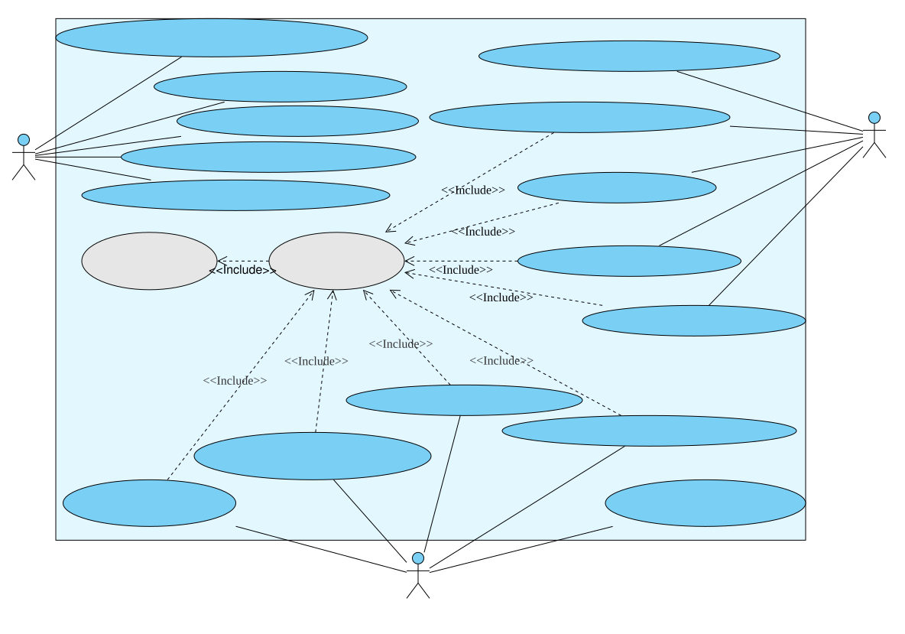

# Task 1

## [1] Use Case Diagram

## [2] Use Case Explanation

### [2.1] Customer

#### UC01

| Attribute      | **Details**                                                  |
| -------------- | ------------------------------------------------------------ |
| ID             | UC01                                                         |
| Actors         | Customer                                                     |
| Name           | Check Beverage Prices and Inventory Status                   |
| Description    | Provide customers with the function of querying beverage prices, and inform them whether the corresponding beverages are in stock or out of stock.  Specifically: All beverage prices and "ingredient out-of-stock" labels are displayed on the LED screen to help customers pre-judge the purchasability of beverages and improve their decision-making efficiency. This function is extended based on real-time data from the "16 beverage ingredient out-of-stock sensors". |
| Pre-conditions | 1. The vending machine is in normal operation mode (not in service mode, alarm mode, or maintenance mode);  2. The LED display functions normally and can clearly show text, lists, and labels;  3. The inventory sensors have completed real-time data collection and synchronized the data to the system's inventory management module. |
| Event flow     | 1. The customer approaches the vending machine and can view the LED display without inserting coins;  2. The display shows the complete list of beverages by default, with the corresponding price marked on the right side of each beverage name;  3. If the inventory of a certain beverage's ingredients is below the preset threshold (triggering the out-of-stock sensor), a red "Out of Stock" label will be displayed next to that beverage's name;  4. If the beverage list exceeds the display range of a single screen, the customer can press the number keys on the keypad to scroll through all beverage information (for example, press the number `2` to scroll up and the number `8` to scroll down, based on the image provided in the assignment);  5. After completing the check, the customer can either perform operations such as selecting a beverage or inserting coins, or abandon the purchase and leave the vending machine. The display remains on the beverage list interface until the next operation is triggered. |
| Post-condition | 1. There is no change to the system's inventory data and beverage price information;  2. The LED display maintains the display state of "beverage list + prices + out-of-stock labels" until the customer triggers other operations such as selecting a beverage or inserting coins. |
| Includes       | None                                                         |
| Extensions     | None                                                         |
| Triggers       | 1. The customer approaches the vending machine and views the LED display;  2. The customer can press the number keys on the keypad to scroll through all beverage information (if the list does not exceed the single-screen range, the customer does not need to press the keypad). |

#### UC02

| Attribute      | **Details**                                                  |
| -------------- | ------------------------------------------------------------ |
| ID             | UC02                                                         |
| Actors         | Customer                                                     |
| Name           | Select Beverages and Customize Options                       |
| Description    | Allow customers to select target beverages via the keypad, and further customize preferences of "whether to add milk" and "whether to add sugar" for two types of beverages (tea and standard coffee), so as to clarify the beverage preparation parameters. |
| Pre-conditions | 1. The customer has completed the "Check Beverage Prices and Inventory Status" process;  2. The target beverage is in stock;  3. The vending machine's keypad and LED display function normally, capable of receiving key commands and displaying customization prompts;  4. The vending machine is not in an occupied state such as "malfunction" or "beverage preparation in progress". |
| Event flow     | 1. The customer presses the key corresponding to the target beverage in the simplified list on the LED display and confirms the selection;  2. The system receives the command and highlights the selected beverage on the display. If the entered code does not exist, the system prompts "This beverage does not exist" and the LED display asks the user to re-enter until a correct code is input;  3. If the beverage corresponding to the code is out of stock, the system displays "This product is out of stock" and repeats Step 2;  4. If tea or standard coffee is selected, the display pops up "Add milk? " and indicates the keys corresponding to "add milk" and "no milk". The customer presses the specific key on the keypad to confirm, and the system temporarily stores the "milk parameter". If the key input is incorrect, the system prompts "Incorrect input" and asks for re-entry until a correct key is pressed;  5. If tea or standard coffee is selected, the display pops up "Add sugar? " and indicates the keys corresponding to "add sugar" and "no sugar". The customer presses the specific key on the keypad to confirm, and the system temporarily stores the "sugar parameter". If the key input is incorrect, the system prompts "Incorrect input" and asks for re-entry until a correct key is pressed;  6. The system displays "Selected: [Beverage Name] (with customization parameters if any), Price: XX Yuan. Please insert corresponding coins" on the LED display, and proceeds to the payment stage;  7. If the customer presses the "Cancel" key, the system clears the "selected beverage" and "customization parameters" and returns to the beverage list interface of the "Check" stage (Extension Use Case: Cancel Beverage Selection). |
| Post-condition | 1. The "Currently Selected Beverage" field in the system is updated to the name of the target beverage;  2. The "Customization Parameters" field is updated to the selection results of milk/sugar;  3. The LED display shows "Amount to Pay: XX Yuan. Please insert coins". |
| Includes       | None                                                         |
| Extensions     | None                                                         |
| Triggers       | The customer presses the selection key corresponding to the target beverage on the keypad, triggering the beverage selection and customization process. |

#### UC03

| Attribute      | **Details**                                                  |
| -------------- | ------------------------------------------------------------ |
| ID             | UC03                                                         |
| Actors         | Customer                                                     |
| Name           | Receive and Verify Coins                                     |
| Description    | Ensure that the "amount inserted" meets the price of the selected beverage, so as to realize the payment function. |
| Pre-conditions | 1. The system has temporarily stored the "selected beverage" and "customization parameters", and the display prompts "Amount to Pay: XX Yuan";  2. The vending machine's coin acceptor has no blockage or coin-jamming malfunction;  3. The coin verification module (including material and size detection components) functions normally and can recognize supported denominations. |
| Event flow     | 1. The customer inserts coins into the vending machine's coin acceptor according to the "amount to pay";  2. The system detects the coin insertion through the sensor and starts the verification process;  3. The system judges the authenticity and denomination of the coin via the coin sensor and detection module;  4. If verification is successful: the system adds the coin's denomination to the "current amount inserted" and the display updates the amount in real time;  5. If verification fails: the system returns the coin through the coin return channel, and the display prompts "Invalid coin, please reinsert";  6. The customer repeats the coin insertion until the "current amount inserted" is ≥ the amount to pay, and the display prompts "Amount sufficient, please confirm the order";  7. If the customer presses the key corresponding to refund due to special reasons, all received coins will be returned, and the screen will reset to the initial interface;  8. If no new coins are inserted within 30 seconds, the "amount inserted" will be cleared, the process will return to the "Selection" stage, and all received coins will be returned. |
| Post-condition | 1. The "current amount inserted" is ≥ the amount to pay, and the amount in the cash box increases synchronously;  2. The system calculates the "amount to be changed" = current amount inserted - amount to pay;  3. The LED display shows "Amount sufficient. Selected: [Beverage Name]. Please press the confirm key to start preparation". |
| Includes       | None                                                         |
| Extensions     | None                                                         |
| Triggers       | The customer inserts coins into the vending machine's coin acceptor according to the "amount to pay", triggering the payment process. |

#### UC04

| Attribute      | **Details**                                                  |
| -------------- | ------------------------------------------------------------ |
| ID             | UC04                                                         |
| Actors         | Customer                                                     |
| Name           | Confirm Order and Start Beverage Preparation                 |
| Description    | Following the "Payment" stage, after the customer confirms that the order information (beverage, customization parameters, and amount) is correct, the system deducts the corresponding amount and triggers the complete preparation process of "heating water, mixing ingredients, and cleaning the container" to ensure the beverage is made as required. |
| Pre-conditions | 1. The "current amount inserted" is ≥ the amount to be paid, and the system has calculated the "amount to be changed";  2. The inventory of ingredients for the selected beverage is sufficient (the out-of-stock sensor is not triggered);  3. The vending machine's heating, mixing, and cleaning modules function normally. |
| Event flow     | 1. The customer checks the "selected beverage + customization parameters + amount to be changed" displayed on the screen, and presses the "Confirm" key after confirming all information is correct;  2. The system deducts the amount to be paid and updates the "current amount inserted" to the "amount to be changed" (clears it if there is no change to be given);  3. The system sends an instruction to the heating module, sets the target water temperature according to the type of beverage, and starts heating;  4. After the water temperature reaches the target, the heating module feeds back "Heating completed", and the system releases ingredients into the mixing container according to the customization parameters (e.g., for "coffee + add milk + add sugar", it releases coffee powder, milk, and sugar);  5. The mixing module stirs for 30 seconds (the duration is adjusted according to the type of beverage) to mix the hot water and ingredients evenly;  6. After mixing is completed, the system dispenses the beverage into a disposable cup (or the customer's own cup) at the beverage outlet. If feasible, the system should ask the customer whether a disposable cup is needed at this time and allow the customer to complete the operation via the keypad;  7. After the beverage is dispensed, the system flushes the mixing container with hot water for 10 seconds to complete cleaning;  8. The screen prompts "Beverage preparation completed, please pick it up". |
| Post-condition | 1. The inventory of ingredients for the selected beverage is deducted according to the consumption amount, and the data of the inventory sensor is updated synchronously;  2. The mixing container is cleaned and in a ready-to-use state;  3. The LED screen displays "Beverage preparation completed, please pick it up", and the system enters the "waiting for beverage pickup" state. |
| Includes       | None                                                         |
| Extensions     | None                                                         |
| Triggers       | The customer presses the "Confirm" key after confirming the order information is correct. |

#### UC05

| Attribute      | **Details**                                                  |
| -------------- | ------------------------------------------------------------ |
| ID             | UC05                                                         |
| Actors         | Customer                                                     |
| Name           | Pick Up Beverage and Complete Transaction                    |
| Description    | As the final stage of the purchasing process, after the customer picks up the beverage, the system automatically returns the change (if any) and records the transaction. |
| Pre-conditions | 1. The system has completed beverage preparation, and the display prompts "Beverage preparation completed, please pick it up";  2. If there is change to be given, the vending machine's change-dispensing module functions normally and the change outlet is not blocked;  3. There is no cup-jamming fault at the beverage outlet, and the beverage can be picked up normally. |
| Event flow     | 1. The customer picks up the beverage cup from the beverage outlet;  2. The "cup pickup sensor" at the beverage outlet detects that the cup has been picked up and feeds back "Beverage picked up" to the system;  3. The system display shows "Transaction completed, welcome next time" for 5 seconds. (In most cases, coin-operated beverage vending machines are not equipped with change-dispensing functions. However, if change-dispensing is required, coin change-dispensing hardware should be provided. Since this assignment does not clearly specify whether such hardware is available, no further elaboration is made here);  4. After 5 seconds, the system clears the "selected beverage", "customization parameters", "current amount inserted" and "amount to be changed", and the display returns to the initial beverage list interface of the "Check" stage;  5. All information related to this transaction is recorded. |
| Post-condition | 1. All transaction-related fields in the system (selected beverage, customization parameters, amount, etc.) are reset to default values;  2. The amount in the cash box increases net by the amount of "received amount - change amount";  3. The vending machine returns to the "waiting for service" state to serve the next customer;  4. The transaction is recorded locally and synchronized to the cloud. |
| Includes       | None                                                         |
| Extensions     | None                                                         |
| Triggers       | The customer picks up the beverage from the beverage outlet, triggering the "cup pickup sensor" and initiating the transaction completion process. |

---

### [2.2] Service Operator

#### UC06

| Attribute      | **Details**                                                  |
| -------------- | ------------------------------------------------------------ |
| ID             | UC06                                                         |
| Actors         | Service Operator                                             |
| Name           | Receive System Fault/Alarm Notifications                     |
| Description    | Implement the function that when the vending machine triggers abnormal statuses (such as ingredient stock-out, full cash box, and abnormal door opening), it automatically pushes alarm notifications to the service operator via the network. This ensures the operator is promptly informed of equipment issues and arranges for handling. |
| Pre-conditions | 1. The vending machine has accessed the Internet via GPRS/3G/4G/5G or WiFi module, with a stable network connection;  2. The vending machine's fault detection modules (e.g., ingredient stock-out sensor, cash box full sensor, door opening sensor) function normally;  3. The operator's terminal device (e.g., computer, mobile phone) has logged into the system's early warning receiving platform, and the network is in normal condition. |
| Event flow     | 1. One of the vending machine's sensors detects an abnormal status (e.g., ingredient inventory below the threshold triggers "ingredient stock-out"; cash box capacity reaching 100% triggers "full cash box"; abnormally closed door triggers "abnormal door opening");  2. The vending machine system converts the abnormal status into standardized alarm information;  3. The system pushes the alarm information to the operator's terminal early warning platform through the established network connection;  4. After receiving the alarm information, the operator's terminal platform alerts the operator via pop-up windows, text messages, or APP notifications;  5. The operator checks the alarm information, and clicks the "Read" mark on the platform after confirming awareness;  6. The vending machine system receives the "alarm read" feedback and updates the local alarm status from "Unread" to "Read". |
| Post-condition | 1. The operator's terminal platform has stored this alarm record, with the status marked as "Read";  2. The "read status" of this alarm in the vending machine's local system is updated to "Read", while the abnormal status itself persists until the issue is resolved;  3. The operator has obtained the details of the alarm and can initiate subsequent handling processes (e.g., arranging for engineers to replenish stocks, empty the cash box);  4. At this point, the vending machine should be in a special status pending maintenance, and customers are not allowed to place orders or check beverage information. |
| Includes       | None                                                         |
| Extensions     | None                                                         |
| Triggers       | The vending machine's sensor detects an abnormal status (such as ingredient stock-out, full cash box, or abnormal door opening), triggering the system to generate and push an alarm notification. |

#### UC07

| Attribute      | **Details**                                                  |
| -------------- | ------------------------------------------------------------ |
| ID             | UC07                                                         |
| Actors         | Service Operator                                             |
| Name           | Remotely Query Inventory and Cash Box Status                 |
| Description    | Enable service operators to remotely obtain data on the vending machine's current raw material inventory (such as coffee powder, cups, etc.) and remaining cash box capacity through network connectivity. This allows operators to grasp the status of key equipment resources without on-site inspection. |
| Pre-conditions | 1. The vending machine has access to the Internet with a normal network connection;  2. The vending machine's inventory monitoring modules (16 beverage ingredient sensors, 1 cup stock-out sensor) and cash box capacity monitoring module function normally, and data has been synchronized to local storage in real time;  3. The operator has logged into the remote management platform using a username and password and completed authentication;  4. The operator has the operation permission to "query inventory and cash box", enabling free access to status and related information. |
| Event flow     | 1. After logging into the remote management platform, the operator can find the "Inventory and Cash Box Query" option on the platform;  2. The platform displays a list of network-connected vending machines, and the operator selects the device number of the target vending machine;  3. The operator clicks the "Query Current Status" button, and the platform sends a request command for "obtaining inventory and cash box data" to the target vending machine (generally, remote operations require authentication);  4. After receiving the request command, the vending machine extracts the latest raw material inventory data (remaining quantity of each raw material, whether it is out of stock), cup inventory data, and remaining cash box capacity from local storage;  5. The vending machine packages the extracted data in a standardized format and feeds it back to the remote management platform via the network;  6. After receiving the data, the platform can display it in the form of tables or charts;  7. The operator checks the data, and if necessary to save it, can click the "Export Data" button to save the current status data as an Excel file (optional). |
| Post-condition | 1. The remote management platform has cached the current inventory and cash box data of the target vending machine, with a cache validity period of 10 minutes (repeated queries within 10 minutes will directly use the cached data);  2. The operator has obtained the real-time resource status of the target vending machine and can determine whether to arrange for stock replenishment or cash box emptying based on the data;  3. There is no change to the local data of the vending machine, and only the "data reading - feedback" process is completed. |
| Includes       | Authentication                                               |
| Extensions     | None                                                         |
| Triggers       | The operator selects the target vending machine on the remote management platform and clicks the "Query Current Status" button, triggering the data query request. |

#### UC08

| Attribute      | **Details**                                                  |
| -------------- | ------------------------------------------------------------ |
| ID             | UC08                                                         |
| Actors         | Service Operator                                             |
| Name           | Download Account Data for a Specified Period                 |
| Description    | Enable service operators to select transaction account data of the vending machine within a specific period on the remote management platform, so as to meet the needs of financial statistics and account reconciliation. |
| Pre-conditions | 1. The vending machine has access to the Internet with a stable network connection;  2. The vending machine has stored the transaction account data within the specified period locally (without data loss);  3. The operator has logged into the remote management platform and has the permission to "download account data" (verified via Authentication);  4. The operator's terminal device (e.g., computer) has sufficient storage space for saving the downloaded file (which is generally available). |
| Event flow     | 1. The operator logs into the remote management platform, enters the "Financial Accounts" module, and selects the "Account Download" function;  2. The platform pops up a "Period Selection" window, and the operator sets the start date and end date via the date picker and selects the target vending machine number;  3. The operator clicks the "Confirm Download" button, and the platform sends an instruction to the vending machine to "obtain account data for [specified period]";  4. After receiving the instruction, the vending machine filters all transaction records within the specified period from the local account database (including transaction time, beverage name, transaction amount, and change amount);  5. The vending machine packages the filtered records into an account file in "CSV" or "Excel" format;  6. The vending machine uploads the account file to the temporary storage area of the remote management platform via the network;  7. After receiving the file, the platform sends a prompt to the operator: "File is ready, click to download";  8. The operator clicks the "Download" link in the prompt to save the account file to the local terminal device;  9. After the download is completed, the platform records an operation log stating "[Operator Name]-[Device Number]-[Period] Account Download Successful". |
| Post-condition | 1. The operator's terminal device has stored the account file for the specified period, with complete data and correct format;  2. The remote management platform has recorded the operation log of this download (including operator, time, device, and period);  3. There is no change to the local account data of the vending machine, and only the "data filtering - packaging - uploading" process is completed. |
| Includes       | Authentication                                               |
| Extensions     | None                                                         |
| Triggers       | The operator sets a specified accounting period, selects the target vending machine on the remote management platform, and clicks the "Confirm Download" button, triggering the process of extracting and downloading account data. |

#### UC09

| Attribute      | **Details**                                                  |
| -------------- | ------------------------------------------------------------ |
| ID             | UC09                                                         |
| Actors         | Service Operator                                             |
| Name           | Update Beverage Recipes Online                               |
| Description    | Realize the function that service operators can remotely push new beverage recipes or update existing ones to the vending machine via network connectivity, ensuring flexible adjustment of the vending machine's beverage preparation parameters. |
| Pre-conditions | 1. The vending machine has access to the Internet with a normal network connection;  2. The operator has logged into the remote management platform and has the permission for "recipe management";  3. The new recipe to be pushed or the recipe to be updated has been edited on the platform and its format meets the requirements of the vending machine system;  4. The vending machine is in normal operation mode and not in maintenance or fault state;  5. No customer is currently using the vending machine. |
| Event flow     | 1. The operator logs into the remote management platform, enters the "Recipe Management" module, and selects the "Online Update" function;  2. The platform displays the list of existing beverage recipes, and the operator can choose to "Add New Recipe" or "Edit Existing Recipe": if adding a new recipe, fill in all recipe parameters; if updating, modify the specified parameters of the target recipe;  3. After completing the recipe editing, the operator clicks the "Preview" button to confirm the parameters are correct, then clicks the "Push to Device" button;  4. The platform pops up a "Device Selection" window, the operator checks the device numbers of the vending machines that need recipe updates (multiple selections allowed, usually select all), and clicks "Confirm Push";  5. The platform packages the edited recipe data in a standardized format and sends a "Recipe Update" instruction along with the recipe file to the selected vending machines;  6. After receiving the instruction and file, the vending machine first verifies whether the file format is correct and the parameters are valid;  7. If the verification is passed, the vending machine waits for the current customer (if any) to finish using it, then writes the new recipe into the local recipe database;  8. After the recipe is successfully written, the vending machine sends a confirmation message of "Recipe Update Successful" to the platform;  9. After receiving the feedback, the platform displays a prompt "Recipe Update Successful for [Device Number]" to the operator and records the operation log. |
| Post-condition | 1. The local recipe database of the target vending machine has been updated (corresponding recipe records added/modified), and the new parameters will be used for subsequent preparation of the beverage;  2. The remote management platform has recorded the operation log of the recipe update (including operator, time, device, recipe name, and update type);  3. The operator has received the "Update Successful" feedback and confirmed that the recipe has taken effect. |
| Includes       | Authentication                                               |
| Extensions     | None                                                         |
| Triggers       | The operator completes the editing of a new recipe or modification of an existing recipe on the remote management platform, and clicks the "Confirm Push" button for the target vending machines, triggering the online beverage recipe update process. |

#### UC10

| Attribute      | **Details**                                                  |
| -------------- | ------------------------------------------------------------ |
| ID             | UC10                                                         |
| Actors         | Service Operator                                             |
| Name           | Create/Reset Operator Account                                |
| Description    | When the vending machine loses memory data (e.g., account information is cleared) due to hardware failure, the service operator can create a new operator account or reset the password of an existing account either locally on the vending machine or via the remote management platform by entering the master password. This ensures the normal restoration of the operator's management authority over the vending machine. |
| Pre-conditions | 1. The vending machine has access to the Internet (for remote operation scenario) or the operator performs operations locally on the vending machine (for offline scenario);  2. The operator has obtained the master password assigned by the system (with the highest account management authority);  3. The vending machine is in the "account data loss" state (e.g., the local account list is empty) or the account to be reset already exists;  4. The remote management platform (for remote operation scenario) functions normally, or the local operation interface of the vending machine (for local operation scenario) is usable. |
| Event flow     | **Remote Creation/Reset (Normal Network Connection)** 1. The operator logs into the remote management platform, enters the "Account Management" module, and selects the "Vending Machine Account Maintenance" function;  2. Selects the target vending machine number; the platform detects that the vending machine is in the "account data loss" state and prompts "Account operation requires verification via master password";  3. The operator enters the correct master password in the pop-up "Master Password Verification" window and clicks "Verify";  4. After successful verification, the platform displays two options: "Create New Account" and "Reset Existing Account";  5. If "Create New Account" is selected, fill in the username, initial password, and operation permissions for the new account; if "Reset Existing Account" is selected, choose the target account and set a new password;  6. After completing the information filling, the operator clicks "Confirm and Submit"; the platform sends the "Account Creation/Reset" instruction and account information to the vending machine;  7. After receiving the instruction, the vending machine verifies the legitimacy of the instruction, then creates a new account record locally or updates the password field of the existing account;  8. The vending machine feeds back "Account operation successful" to the platform; the platform prompts the operator with "Operation completed" and records the log.  **Local Creation/Reset (Network Disconnection)** 1. The operator enters the "Account Maintenance Mode" on the vending machine locally via physical keypad buttons; the system prompts "Please enter the master password";  2. The operator enters the master password via the vending machine keypad; after successful verification by the system, the options "Create New Account" and "Reset Existing Account" are displayed;  3. The operator selects the operation type as prompted and enters the new account information (username, password) or resets the password via the keypad;  4. After completing the input, the operator presses the "Confirm" key; the vending machine creates/updates the account record in local storage;  5. The system displays "Account operation successful" and automatically exits the "Account Maintenance Mode". |
| Post-condition | 1. A valid account record is added to the vending machine's local account database (for account creation scenario), or the password of the existing account is updated to the new password (for account reset scenario);  2. The remote management platform (for remote scenario) has recorded the account operation log (including operator, time, device, operation type, and account name);  3. The newly created account can log into the system normally (remotely or locally), and the reset account can log in with the new password. |
| Includes       | Authentication                                               |
| Extensions     | None                                                         |
| Triggers       | 1. Remote scenario: The operator selects the target vending machine on the remote management platform, and after completing master password verification, clicks the "Create New Account" or "Reset Existing Account" button;  2. Local scenario: The operator enters the "Account Maintenance Mode" locally on the vending machine, and after completing master password verification, selects the "Create/Reset" option. |

---

### [2.3] Service Engineer

#### UC11

| Attribute      | **Details**                                                  |
| -------------- | ------------------------------------------------------------ |
| ID             | UC11                                                         |
| Actors         | Service Engineer                                             |
| Name           | Open Cabinet Door and Enter Service Mode                     |
| Description    | Realize the function that after the service engineer opens the vending machine's rear door through physical operation, the system automatically switches from the normal operation mode to the service mode. This provides a modal foundation for subsequent identity authentication and maintenance operations (such as emptying the cash box, replenishing raw materials). |
| Pre-conditions | 1. The vending machine is in normal operation mode, without hardware failure or alarm status;  2. The mechanical lock of the vending machine's rear door functions normally, and the engineer holds the corresponding key;  3. The vending machine's cabinet door opening sensor works properly and can detect the status of the cabinet door. |
| Event flow     | 1. The engineer arrives at the vending machine site with the key and confirms that no customer is using the vending machine at present;  2. The engineer inserts the key into the mechanical lock of the vending machine's rear door, rotates it clockwise to unlock, and opens the rear door;  3. The cabinet door opening sensor detects that the rear door is open and sends a "cabinet door open" signal to the vending machine's control system;  4. After receiving the signal, the control system automatically terminates all pending tasks in the normal operation mode (e.g., pauses the beverage preparation process);  5. The system switches to the service mode, and the LED display switches from the "beverage list/operation prompt" interface to the prompt interface of "Entered service mode, please enter engineer password";  6. The system starts the "password input countdown" (e.g., 30 seconds) and records the current mode status as "Service Mode - Pending Verification";  7. The engineer performs password authentication, which can be done locally or via network authentication. At the same time, maintenance records are sent to the background to ensure synchronization with cloud services. |
| Post-condition | 1. The vending machine's system mode is updated from "Normal Operation Mode" to "Service Mode - Pending Verification";  2. The LED display shows the prompt of "Service Mode - Password to be Entered" and the countdown;  3. The system suspends all customer interaction functions and only retains the engineer's operation interfaces (keypad, display);  4. The cabinet door opening sensor continuously feeds back the "cabinet door open" status to the system;  5. The maintenance time record is logged in the cloud server or locally. |
| Includes       | Authentication                                               |
| Extensions     | None                                                         |
| Triggers       | The engineer opens the vending machine's rear door with the key, the cabinet door opening sensor detects the "cabinet door open" status, and authentication is performed, triggering the system mode switch. |

#### UC12

| Attribute      | **Details**                                                  |
| -------------- | ------------------------------------------------------------ |
| ID             | UC12                                                         |
| Actors         | Service Engineer                                             |
| Name           | Enter Engineer Password for Identity Verification            |
| Description    | Realize the function that the service engineer enters a unique identity password to complete verification within the specified time after the system enters service mode. This prevents unauthorized personnel from operating the vending machine and avoids the system entering alarm mode due to failed verification. |
| Pre-conditions | 1. The vending machine has entered the "Service Mode - Pending Verification" state through the "cabinet door opening" operation;  2. The system's "password input countdown" has not ended;  3. The vending machine's keypad functions normally and can receive password input;  4. The engineer holds a unique and valid identity password. |
| Event flow     | 1. The engineer checks the prompt "Please enter engineer password (countdown: XX seconds)" on the LED display;  2. The engineer enters their unique personal password sequentially via the vending machine's keypad;  3. For each character entered, the display shows `*` in real time to hide the actual password, and simultaneously updates the number of entered characters (e.g., "Entered: 3/5");  4. After completing the input, the engineer presses the "Confirm" key on the keypad to submit the password;  5. The system retrieves data from the locally stored "Engineer Password Database" and compares whether the entered password matches the record in the database;  6. If the passwords match: The system prompts "Identity verification passed, maintenance operations available", the countdown stops, and the mode is updated to "Service Mode - Verified";  7. If the passwords do not match: The system prompts "Incorrect password, please re-enter (2 attempts remaining)" and allows the engineer to re-enter. If the password is incorrect for 3 consecutive times, the countdown stops, the system triggers an alarm, and pushes a "Unauthorized identity verification failed" notification to the Service Operator. |
| Post-condition | 1. When verification is successful: The system mode is updated to "Service Mode - Verified", the display shows the maintenance operation menu (e.g., "Empty Cash Box", "Replenish Raw Materials", "Function Test"), and the engineer gains full access to all maintenance operations;  2. When verification fails (3 consecutive incorrect attempts): The system mode switches to "Alarm Mode", a local beeping alarm is activated, and an alarm message is pushed to the operator. All maintenance operations are suspended. |
| Includes       | Authentication                                               |
| Extensions     | None                                                         |
| Triggers       | The vending machine enters the "Service Mode - Pending Verification" state, the display shows the password input prompt, and the engineer starts entering the password via the keypad. |

#### UC13

| Attribute      | **Details**                                                  |
| -------------- | ------------------------------------------------------------ |
| ID             | UC13                                                         |
| Actors         | Service Engineer                                             |
| Name           | Empty Cash Box and Record Amount                             |
| Description    | Realize the function that after passing identity verification, the service engineer empties the vending machine's cash box on-site and records the amount of this emptying operation via the keypad, ensuring the traceability of funds in the cash box. |
| Pre-conditions | 1. The vending machine is in the "Service Mode - Verified" state, and the engineer has maintenance operation permissions;  2. The cash box full sensor has triggered the "cash box full" prompt (or the cash box needs to be emptied according to the maintenance cycle);  3. The mechanical structure of the cash box is normal and can be opened properly;  4. The vending machine's keypad and display function normally, enabling amount input and recording. |
| Event flow     | 1. The engineer selects the "Empty Cash Box" option via the keypad in the maintenance operation menu; the display prompts "Please open and empty the cash box, then record the amount after completion";  2. The engineer opens the internal lock of the cash box, takes out the cash box, and counts the total amount of coins inside on-site;  3. After counting, the engineer puts the empty cash box back to its original position and locks it;  4. The engineer enters the total amount of the emptied cash via the keypad on the "Amount Recording" interface of the display;  5. After completing the input, the engineer presses the "Confirm" key; the system compares the entered amount with the "cumulative cash box amount" stored locally;  6. If the amount is valid: The system prompts "Amount recorded successfully" and stores the "emptying time, engineer ID (by default associated with the verification password), and emptied amount" in the local account database;  7. The system resets the status of the cash box full sensor from "Full" to "Empty", and the display returns to the maintenance operation menu. |
| Post-condition | 1. The amount in the cash box is 0, and the status of the cash box full sensor is updated to "Empty";  2. A new "cash box emptying record" is added to the local account database, including information on time, amount, and operator;  3. The "cumulative cash box amount" field in the system is reset to 0, and subsequent transaction amounts will be accumulated from the beginning. |
| Includes       | Authentication                                               |
| Extensions     | None                                                         |
| Triggers       | The engineer selects the "Empty Cash Box" option in the maintenance operation menu, or the cash box full sensor triggers the "cash box full" prompt, prompting the engineer to start the emptying process. |

#### UC14

| Attribute      | **Details**                                                  |
| -------------- | ------------------------------------------------------------ |
| ID             | UC14                                                         |
| Actors         | Service Engineer                                             |
| Name           | Replenish Raw Materials/Cups and Update Inventory            |
| Description    | Realize the function that after passing identity verification, the service engineer replenishes the out-of-stock beverage raw materials (such as coffee powder, tea leaves) or cups of the vending machine on-site, and updates the inventory status through the system. This ensures the vending machine regains normal beverage supply capacity, and synchronizes inventory data to sensors to avoid false "out of stock" alerts. |
| Pre-conditions | 1. The vending machine is in the "Service Mode - Verified" state, and the engineer has maintenance permissions;  2. The out-of-stock sensors have detected the shortage of raw materials/cups, and "out-of-stock items" (e.g., "Coffee Powder Out of Stock", "Cups Out of Stock") are displayed in the maintenance menu;  3. The engineer has brought the corresponding raw materials (meeting the vending machine's specifications) or cups to be replenished;  4. The raw material bins and cup bins of the vending machine have normal structures and can be filled with materials properly. |
| Event flow     | 1. The engineer selects the "Replenish Inventory" option in the maintenance operation menu; the display lists the current out-of-stock raw materials/cups (e.g., "1. Coffee Powder 2. Tea Leaves 3. Cups");  2. The engineer selects the item to be replenished (e.g., presses "1" to select coffee powder); the display prompts "Please open the coffee powder bin, press Confirm after replenishment";  3. The engineer opens the lid of the corresponding raw material bin/cup bin and pours the brought materials into the bin (being careful not to exceed the maximum capacity line);  4. After replenishment, the engineer closes the bin lid and presses the "Confirm" key on the keypad;  5. The system sends an "Inventory Update Detection" instruction to the corresponding out-of-stock sensor, and the sensor detects the current material remaining quantity and feeds back the data;  6. If the sensor feeds back "sufficient remaining quantity" (above the out-of-stock threshold): The system prompts "[Item Name] Replenished Successfully, Inventory Normal" on the display, and updates the inventory status of the item from "Out of Stock" to "Sufficient";  7. The engineer repeats Steps 2-6 to replenish other out-of-stock items;  8. After all items are replenished, the engineer selects "Exit Inventory Replenishment" to return to the maintenance operation menu. |
| Post-condition | 1. The remaining inventory of the replenished raw materials/cups reaches the "sufficient" standard, and the status of the corresponding out-of-stock sensors is updated from "Out of Stock" to "Normal";  2. The system's local inventory database synchronously updates the current remaining quantity of each material;  3. The vending machine resumes the supply capacity of the corresponding beverages, and subsequent customers can select the beverages normally. |
| Includes       | Authentication                                               |
| Extensions     | None                                                         |
| Triggers       | The engineer selects the "Replenish Inventory" option in the maintenance operation menu, or the system prompts "There are out-of-stock items, please replenish", prompting the engineer to start the replenishment process. |

#### UC15

| Attribute      | **Details**                                                  |
| -------------- | ------------------------------------------------------------ |
| ID             | UC15                                                         |
| Actors         | Service Engineer                                             |
| Name           | Perform Vending Machine Function Tests                       |
| Description    | Realize the function that after passing identity verification, the service engineer selects test items via the keypad to verify the normal operation of all core modules of the vending machine. This helps identify potential faults in advance and ensures the vending machine can operate stably after maintenance. |
| Pre-conditions | 1. The vending machine is in the "Service Mode - Verified" state, and the engineer has maintenance permissions;  2. The vending machine has completed cash box emptying and raw material replenishment (if beverage preparation testing is required);  3. All modules (sensors, heating, stirring, display) are normally powered and free from obvious hardware damage;  4. The vending machine's keypad can normally select test items. |
| Event flow     | 1. The engineer selects the "Function Tests" option in the maintenance operation menu, and the display lists the test items;  2. The engineer selects "Sensor Detection": The system sequentially detects 16 raw material sensors, 1 cup sensor, 1 cash box sensor, 1 water temperature sensor, and 1 cabinet door sensor. The display shows the "Normal/Abnormal" status of each sensor in real time. If all sensors are normal, it prompts "Sensor Detection Passed";  3. The engineer selects "Heating Module Test": The system sends an instruction "Heat to 80℃" to the heating module. The water temperature sensor feeds back the temperature in real time. When the target temperature is reached, it prompts "Heating Module Test Passed"; if the temperature fails to reach the target within the time limit, it prompts "Heating Abnormal";  4. The engineer selects "Stirring Container Test": The system controls the stirring container to start an "idle test" (for 30 seconds). If there is no jamming, it prompts "Stirring Test Passed"; if there is abnormal noise or jamming, it prompts "Stirring Abnormal";  5. The engineer selects "Beverage Preparation Simulation": The system selects "Black Coffee (No Sugar, No Milk)" for simulation preparation (only starts the process without actually releasing raw materials), and sequentially executes the steps of "Heating - Stirring - Cleaning". After completion, it prompts "Preparation Process Test Passed";  6. After all test items are completed, the engineer selects "Generate Test Report", and the system stores the test results (passed/abnormal items) locally;  7. After the engineer confirms there are no abnormalities in the tests, they select "Exit Function Tests" to return to the maintenance operation menu. |
| Post-condition | 1. The system stores a complete report of this function test locally (including test time, items, results, and engineer information);  2. All modules that passed the tests are in the "Normal" state, and abnormal modules (if any) are marked in the report;  3. The vending machine meets the conditions for normal operation and can be switched back to "Normal Operation Mode" to serve customers subsequently. |
| Includes       | Authentication                                               |
| Extensions     | None                                                         |
| Triggers       | The engineer selects the "Function Tests" option in the maintenance operation menu, or needs to verify the equipment status after maintenance, thus initiating the test process. |

# Task 2

In fact, the non-functional requirements of a beverage vending machine system can be analyzed from the following three perspectives:

- Stability
- Usability
- Scalability

Therefore, the following 10 items are the non-functional requirements that I consider relatively important:

## [1] Keyboard Interaction Response Time Requirement 
### Requirement Description 
When customers perform specific key operations on the vending machine’s physical keypad (e.g., beverage selection keys, confirmation key, cancellation key, and amount confirmation feedback key triggered after coin insertion), the system must respond to key commands in real time. This avoids obvious delays between key presses and on-screen feedback, ensuring smooth operation. In the worst case, if customers perceive significant lag in the machine, they may suspect it has not been maintained for a long time and abandon their purchase. 

### Verification Criteria 
Under normal load (50 transactions per hour), test each key on the keypad 25 times (100 tests total). The response time from when a key is pressed to when the corresponding feedback is displayed on the screen (e.g., highlighting the selected beverage, popping up an operation prompt, or updating the inserted amount) must be ≤ 0.3 seconds per press. The average response time across 100 tests must be ≤ 0.2 seconds, and no single response time may exceed 0.5 seconds. This can be verified using high-speed cameras or specialized physical hardware for recording. 

> [!NOTE]
>
> This is a hypothetical example to illustrate that the requirement is verifiable; the same applies to the following requirements. 

## [2] Account Security Requirement 
### Requirement Description 
Accounts for Service Operators and Service Engineers must have identity authentication and anti-unauthorized access capabilities to avoid operational risks caused by account impersonation or password leakage. 

### Verification Criteria 
1. Account passwords must meet complexity requirements (at least 8 characters, containing both numbers and letters), and the system must reject passwords that do not comply with these rules. 

2. After 3 consecutive incorrect password entries (engineer password/operator master password), the account must be temporarily locked for 10 minutes, and an "abnormal login attempt" notification must be sent to the administrator. 
3. Remote login must use encrypted transmission; packet capture analysis must confirm that passwords and operation commands are not transmitted in plaintext. 

## [3] Power Consumption Control Requirement 
### Requirement Description 
The vending machine must control power consumption in standby and operating modes to avoid energy waste, meeting energy-saving standards for commercial equipment. Since foot traffic is generally lower at night, reducing screen brightness can help control costs. In specific scenarios such as airports, electricity costs can become a significant expense. 

### Verification Criteria 
1. In standby mode (no customer or maintenance operations, only the display screen is on), continuous 24-hour monitoring must show an average power consumption of ≤ 5W. 

2. In operating mode (when preparing beverages, including heating and stirring), the average power consumption for a single preparation process (e.g., coffee, approximately 30 seconds) must be ≤ 100W. 
3. In energy-saving mode (e.g., 23:00 to 6:00 the next day, with the display screen brightness reduced by 50%), power consumption must be ≥ 30% lower than in daytime standby mode. 

## [4] System Noise Control Requirement 
### Requirement Description
During the operation of the vending machine, the operating noise must be controlled to prevent excessive noise from affecting the surrounding environment. At the same time, it should improve the comfort of customers during use and reduce complaints caused by noise. Some places have quiet requirements, such as offices; therefore, this requirement helps the vending machine be deployed in more types of locations.

### Verification Criteria
1. Beverage preparation scenario: When preparing hot beverages (including heating and stirring) and cold beverages (including refrigeration and cup dispensing), use a sound level meter to measure the noise level 1 meter away from the vending machine. The noise level for hot beverage preparation shall be ≤ 55 decibels, and the noise level for cold beverage preparation shall be ≤ 50 decibels;

2. Maintenance operation scenario: When engineers perform "function tests", the noise level 1 meter away shall be ≤ 52 decibels, with no sharp or harsh abnormal sounds;
3. Standby heat dissipation scenario: When the vending machine is in standby mode (only the display screen and cooling fan are operating), the noise level 1 meter away shall be ≤ 40 decibels. Additionally, within 72 hours of continuous operation, the cooling fan shall not experience a sudden increase in noise. (These decibel values are for illustrative purposes only.)

## [5] Mixing Container Cleaning Effectiveness Requirement
### Requirement Description
After each beverage preparation, the vending machine’s mixing container must be cleaned via automatic rinsing to prevent residual ingredients from breeding bacteria or affecting the taste of the next beverage, ensuring beverage hygiene and safety. (This aligns with the "container cleaning" operation in engineer maintenance and extends to daily automatic cleaning scenarios.)

### Verification Criteria
1. After continuously preparing 10 cups of different beverages (e.g., coffee, milk tea, green tea), disassemble the mixing container for residue testing: solid residues (e.g., coffee powder, tea dregs) must be ≤ 0.1g, and no visible liquid residues (e.g., milk stains) shall be present under ultraviolet light.

2. Entrust a third-party testing agency to conduct microbial testing on the inner wall of the cleaned mixing container: the total number of colonies must be ≤ a specified value (using biological counting methods), and no common bacteria that may cause customer diarrhea shall be detected.
3. The duration of a single automatic cleaning process must be ≤ 15 seconds, without affecting the normal order-waiting time of the next customer.

## [6] Durability Requirement for High-Frequency Contact Hardware
### Requirement Description
High-frequency contact components of the vending machine—including the physical keypad (for customer selection/engineer operation), beverage outlet tray (for holding cups), and coin acceptor (for customer coin insertion)—must have sufficient durability to avoid damage or functional failure due to frequent use. (Core pain point for commercial equipment: maintenance frequency and replacement costs.) In public places, durability must be a top priority; otherwise, increased maintenance efforts will lead to higher costs and lower customer satisfaction.

### Verification Criteria
1. Physical keypad: Use a durability testing machine to simulate customer/engineer operations. After a single key is pressed continuously 500,000 times, the key must show no jamming or malfunction, and the trigger response rate must remain ≥ 99%. (Machine automated testing is typically used.)

2. Beverage outlet tray: Continuously place a 5kg weight at the center of the tray (simulating the weight of fully loaded beverage cups). After 24 hours, the tray must show no deformation or breakage, and its load-bearing stability must remain unchanged.
3. Coin acceptor: Continuously insert 1,000 coins of different denominations (e.g., 1 Pound, 5 Pence, including slightly worn coins). There must be no coin jamming or swallowing failures, and the coin recognition accuracy must remain ≥ 99.5%. Poor coin recognition accuracy will lead to customer complaints!

## [7] Voltage Adaptability Requirement
### Requirement Description
Vending machines are mostly used in commercial scenarios such as shopping malls, airports, and office buildings, where voltage fluctuations may occur (e.g., low voltage during peak power usage). The system must operate stably within a certain voltage range to avoid shutdowns or hardware damage caused by abnormal voltage. (Practical scenario: adaptation to unstable commercial power environments.) If hardware is damaged or the machine stops working due to voltage issues, maintenance efforts will increase, leading to higher costs and lower customer satisfaction.

### Verification Criteria
1. Operate continuously for 72 hours within the UK voltage fluctuation range. During this period, simulate 100 customer transactions; there must be no transaction interruptions, heating module failures, or screen blackouts caused by voltage issues.
2. When the voltage drops briefly to AC 160V (extreme low voltage), the system must automatically switch to a backup power supply (e.g., built-in capacitor) to maintain core functions (e.g., order saving, coin refund) for ≥ 30 seconds, with no data loss or coin jamming.
3. After the voltage returns to the normal range (AC 220V), the system must restart automatically and resume normal operation within ≤ 10 seconds, without requiring manual intervention.

## [8] Customer-Side Fault Tolerance and Prompt Clarity Requirement
### Requirement Description
When customers encounter minor faults during operation (e.g., beverage spillage due to unstable cup placement, or cup jamming due to delayed cup retrieval), the system must detect the fault and provide clear, easy-to-understand prompts for resolution. This prevents customer misoperation or purchase abandonment. (Key to improving user experience: reducing negative customer perceptions caused by faults.)

### Verification Criteria
1. Simulate a "beverage outlet cup jamming" fault (manually jam a cup in the outlet). The system must detect the anomaly within 5 seconds and display text-image prompts on the screen (e.g., "Cup jammed—please gently lift and remove the cup"). The recognition accuracy of the prompt content (tested with 50 randomly selected customers) must be ≥ 98%.

2. Simulate a "coin unrecognized" fault (insert a slightly worn coin). The system must trigger the prompt "Coin unrecognized—please remove and reinsert" within 3 seconds, and refund the coin via the coin return channel with a refund success rate of ≥ 99%.

3. After customers follow the prompts, the fault resolution rate must be ≥ 95% (e.g., the success rate of customers removing a jammed cup as instructed).

## [9] Local Data Backup and Recovery Requirement
### Requirement Description
Transaction records and inventory data (e.g., remaining raw material quantities) stored locally on the vending machine are critical for subsequent reconciliation and maintenance. The system must automatically back up this data regularly and enable quick recovery if local data is damaged (e.g., minor failure of the storage chip), to avoid data loss. (Practical risk: data loss due to local storage hardware failure.)

### Verification Criteria
1. The system must automatically back up local data every hour, with backup files stored in 2 independent local storage modules. The backup success rate must be ≥ 100%, with no backup omissions.

2. Simulate damage to the main local storage module (e.g., delete transaction records from the main storage). The system must automatically detect the issue, switch to the backup storage, and recover the latest backed-up data within ≤ 30 seconds.
3. After recovery, the integrity of transaction records (at least 100 transactions) from the past 24 hours must be ≥ 100% (no missing fields such as transaction time, beverage name, or amount), and the deviation between inventory data and actual remaining raw material quantities must be ≤ 5%.

## [10] Display Readability Requirement
### Requirement Description
The vending machine’s LED display must remain clearly readable under different ambient light conditions (e.g., strong light in shopping malls, low light at night). This ensures customers can quickly identify beverage lists, prices, and operation prompts. Additionally, the screen must not suffer from glare affecting visibility under direct strong light, and its brightness must not be dazzling in low-light environments. Many vending machines fail to attract customers due to dim screens, making this a critical requirement.

### Verification Criteria
1. Under strong light conditions, 50 randomly selected customers with normal vision (uncorrected visual acuity ≥ 1.0) must identify text on the screen from a distance of 1.5 meters with an accuracy rate of ≥ 98%, with no text blurring caused by glare.

2. Under low-light conditions (screen brightness adjusted to 30%-50%), the rate of customer feedback regarding eye discomfort (e.g., dazzling, eye strain) after 10 minutes of screen viewing must be ≤ 5%.  

3. Under extreme environments (high temperature/low temperature), the display must operate continuously for 24 hours without blackouts or screen glitches, and text clarity must remain consistent with that in normal temperature environments.

# Task 3

## [1] Solution

There are 13 modes to choose from (12 beverages + 1 engineer mode). There are 16 keys on the keyboard, from `0` to `9` and `A` to `F`.
Obviously, if only one key is bound to each mode, it is very likely that the customer will press the wrong key and select another product!
However, there is a feasible solution (BUT NOT PERFECT):

| Beverage/Mode                     | 2-digit Code |
| --------------------------------- | ------------ |
| Coffee (Sugar-free and Milk-free) | `00`         |
| Coffee (with Sugar, Milk-free)    | `11`         |
| Coffee (Sugar-free, with Milk)    | `22`         |
| Coffee (with Sugar and Milk)      | `33`         |
| Tea (Sugar-free and Milk-free)    | `44`         |
| Tea (with Sugar, Milk-free)       | `55`         |
| Tea (Sugar-free, with Milk)       | `66`         |
| Tea (with Sugar and Milk)         | `77`         |
| Flat White (Sugar-free)           | `88`         |
| Flat White (with Sugar)           | `99`         |
| Hot Chocolate                     | `AA`         |
| Soup                              | `BB`         |
| Enter Engineer Mode               | `CC`         |

**Completeness**: All 13 items above have unique codes, with no omissions or repetitions.

**Conciseness**: The code length is fixed at 2, and the number of key presses is minimized (single-key coding cannot meet the distance requirement).

**Hamming Distance $≥ 2$**:

- Examples: The difference between 00 and 11 (0≠1, 0≠1), the distance = 2.
- The difference between 00 and 22 (0≠2, 0≠2), the distance = 2.
- The difference between AA and BB (A≠B, A≠B), the distance = 2.
- All code pairs meet this condition.

> [!WARNING]
> However! This design has a serious flaw (even though it meets the requirements of the question). If the user wants to choose sugar-free and milk-free tea, when prompted to press `44`, the customer may unconsciously press `55` continuously. Although it is theoretically feasible, problems caused by "lazy" repeated key presses actually occur!

To solve this problem, the following is a better solution:
| Beverage/Mode                     | 2-digit Code |
| --------------------------------- | ------------ |
| Coffee (Sugar-free and Milk-free) | `0F`         |
| Coffee (with Sugar, Milk-free)    | `1E`         |
| Coffee (Sugar-free, with Milk)    | `2D`         |
| Coffee (with Sugar and Milk)      | `3C`         |
| Tea (Sugar-free and Milk-free)    | `4B`         |
| Tea (with Sugar, Milk-free)       | `5A`         |
| Tea (Sugar-free, with Milk)       | `60`         |
| Tea (with Sugar and Milk)         | `71`         |
| Flat White (Sugar-free)           | `82`         |
| Flat White (with Sugar)           | `93`         |
| Hot Chocolate                     | `A4`         |
| Soup                              | `B5`         |
| Enter Engineer Mode               | `C6`         |

$$
\text{Coding Design Principles}\\ \text{No repetition in the first digit, no repetition in the second digit, ensuring a Hamming distance of 2}
$$

## [2] Proof

The Hamming distance between any two modes is $2$. How to prove it?
Just ensure that each digit in the first position set is not repeated, and each digit in the second position set is not repeated. When either the first or the second digit is input incorrectly and the other is correct, there will definitely be no repetition. We can prove it by contradiction:
Suppose the two digits are $CB$, where $C$ is the incorrectly input digit (actually $A$), and $B$ is the correct digit. Then there must be a repeated $CB$, but since we have stipulated that the second digit cannot be repeated ($B$ and $B$ are repeated)! This leads to the contradiction of the assumption!
The same is true for the case where the second digit is wrong and the first digit is correct.

Therefore, in this case, for any two digits $AB$ and any other two digits $CD$, the following relationship must exist:
$$
A\ne C\\B\ne D
$$
This can ensure that the Hamming distance between any two modes is $2$, while also ensuring that the number of customer inputs is minimized (2 times).

