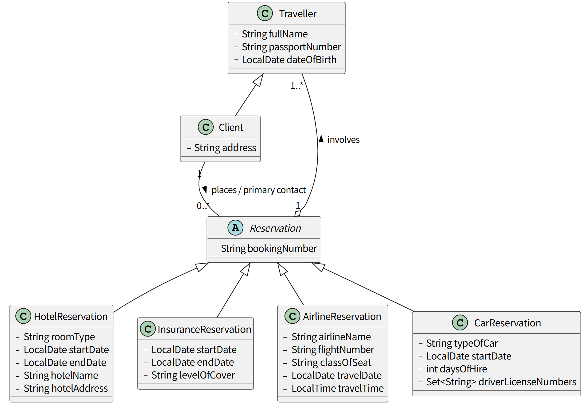
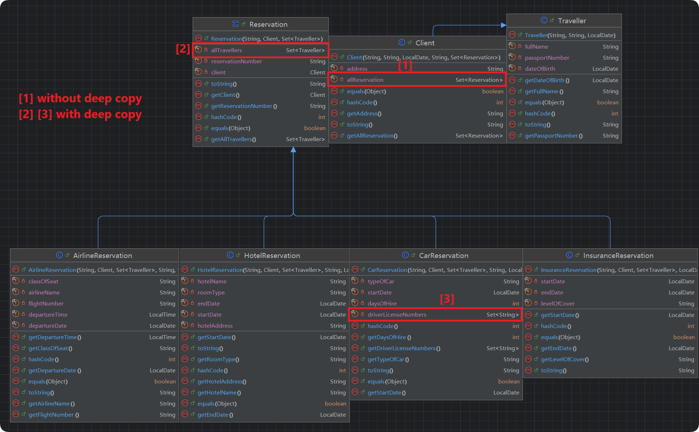
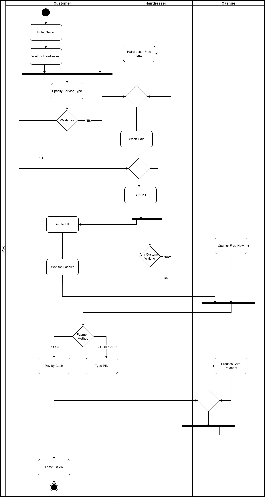
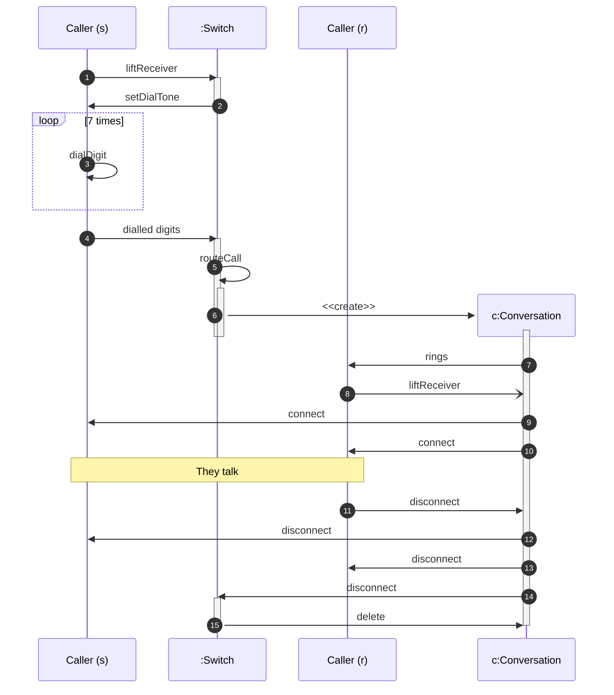

$$
\textbf{Student Name:}\textbf{~Zhibin Jiang}\\\\
\textbf{Student Id:}\textbf{~201945844}\\\\
\textbf{Courses:}\textbf{~COMP201: Software Engineering I}\\\\
$$

# TASK I

## [1] List the noun

First step for task I is listing the nouns and grouping them by some rules...

1. Travel agency, Reservation system, Internet
2. Client, Name, Address, Travelling companions, Primary client
3. Reservations, Booking number
4. Travellers, Passport numbers, Dates of birth
5. Airlines, Flight number, Class of seat, Travel date, Time
6. Hotel, Type of room, Start date, End date, Name (hotel), Address (hotel)
7. Rental cars, Type of car, Days of hire, Drivers' license numbers
8. Travel insurance, Level of cover

## [2] Categorise the nouns

For the above nouns, we can divide them into **3** categories, i.e., **Class**, **Attribute**, and **Outside Scope**

| Category         | Noun                                        | Reason                                                       |
| ---------------- | ------------------------------------------- | ------------------------------------------------------------ |
| Outside Scope    | Travel agency, Reservation system, Internet | These are **NOT** the data within the system. For example, a `Travel agency` is actually not participating in this system. The `Internet` is a necessary part, but not the one we want to focus on in this system... |
| (Abstract) Class | Reservation                                 | There are **4** different reservations, so we can extract some common attributes or features into one class, for example, the `Reservation number`. Each reservation must be bound to one `Client,` and the reservation will also include one or many `Travellers`. All the following classes related to reservation will extend this abstract class to reduce duplicate data. |
| Class            | Client                                      | The `Client` is actually like an account created by a travel agency. For a trip to country A, the agency creates one and for a trip to country B, the agency creates another one. Thus, every `Client` object owns all the reservations (for one trip), so the agency can check the reservation list. Client is also a traveller, so Class `Client` should extend `Traveller`. |
|                  | Traveller                                   | Traveller is the person who will go to travel in a trip, in this class including attributes like name, passport and so on. |
|                  | AirlineReservation                          | `AirlineReservation` class extended `Reservation`. Also, it includes airline number, flight number, class of seat, departure date and time. |
|                  | HotelReservation                            | `HotelReservation` class extends `Reservation` and it also includes room type, start and end date, hotel name, and hotel address. |
|                  | CarReservation                              | `CarReservation` extends `Reservation,` and it also includes attributes like type of card, start date, days of hire, and driver's license numbers (maybe more than one, so it should be a list or set). |
|                  | InsuranceReservation                        | Extends `Reservation` and extra attributes like start and end date, level of cover. |
| Attributes       | Name, Address, Date, Time... listed above.  |                                                              |

## [3] Design a UML

- All the subclasses related to reservation **extend** `Reservation`.
- The `Client` is also a traveller according to the document, so it extended `Traveller`.
  - The `Client` class is designed as a subclass of `Traveller` because, in this system, the primary client is considered a participant in the travel group. This **inheritance relationship** allows the Client to inherit core attributes such as `name`, `passportNumber`, and `dateOfBirth` directly from `Traveller`. This approach strictly follows the requirement to **avoid data duplication** across classes, ensuring that the client's personal details are not stored twice, while allowing the Client class to introduce its specific `address` attribute.
- A `Reservation`  (implemented class object) must be bound to a `Client`, so we use symbols `Client "1" -- ... **Reservation`
- One `Client` might have **NO** or more `Reservation`s, so we use symbols `... -- "0..*" Reservation`
- One `Reservation` (implemented class object) must have at least one `Traveller`, so we use symbols `Reservation ... --> "1..*" Traveller`

# TASK II

- The `Reservation` class is defined as `abstract` to serve as a **base class** for the specific booking types (Airline, Hotel, Car, Insurance). It encapsulates shared attributes such as the `bookingNumber` and the list of `Travellers`. It is marked abstract to **prevent the instantiation of an incomplete generic reservation**, ensuring that only valid, specific reservation types can be created in the system.

- To make sure it's immutable in Java:
  - use `final` to modify the attributes.
  - No `setter()` method provided in each Class.
  - For reference types such as `Set<>`, we return an unmodifiable view using `Collections.unmodifiableSet()`.
- Simple validation in the `Constructor`
  - For example, we have to check if the `passportNumber` is **NOT NULL**, if it is `null` and throw a new exception.
  - For dates, like the date of birth, check if it's after the current date (which is impossible).
- `Reservation` and `Traveller` are actually (physically) cannot be duplicated. So using a `set` (instead of a `list`) is a good idea. Thus, we have to `@Override` the `equals()` and `hashCode()` methods.
- For demonstration and test purposes (there is a `Test` class for testing), we have to `@Override` the `toString()` to print the message of this object.
- Necessary comments are provided in the `source.zip`
- **==Important NOTE:==** Due to the bidirectional dependency, the `Client` constructor retains the reference to the `reservations` Set without a deep copy. To mitigate the risk of external modification, the system design implies a **'Transfer of Ownership'** pattern:
  1. The `Set` is populated during the initialisation phase.
  2. Once passed to the `Client`, the external reference to this mutable `Set` should be discarded (e.g., by limiting its scope), effectively making the `Client` the sole owner.
  3. The `Client` class then protects this data by exposing it only via an **unmodifiable view** (`Collections.unmodifiableSet`).
  4. Demonstrated in `Test.java` Class.
  5. While this approach involves a **temporary mutable state** during construction in code block `{}`, it does not compromise the system's practical immutability. In a real-world development environment, this process would typically be **encapsulated within a static factory method (for example, like another system class)**. Such a pattern would "atomically" handle the population and instantiation, ensuring that no external reference to the mutable Set persists once the Client object is returned to the caller.

> The `toString()` method might trap in an infinite loop by default, so this method in `Client` will not return `Set<Reservation>`, but this actually will not affect any function because we can use `getAllReservation()` to get the set!

**Further see `source.zip`.**

# Task III

Based on the question, here is the UML activity diagram.

# Task IV

Based on the question, here is the UML Sequence Diagram (Using `mermaid` type.)

The `Switch` is unnamed class so it written `:Switch`.

