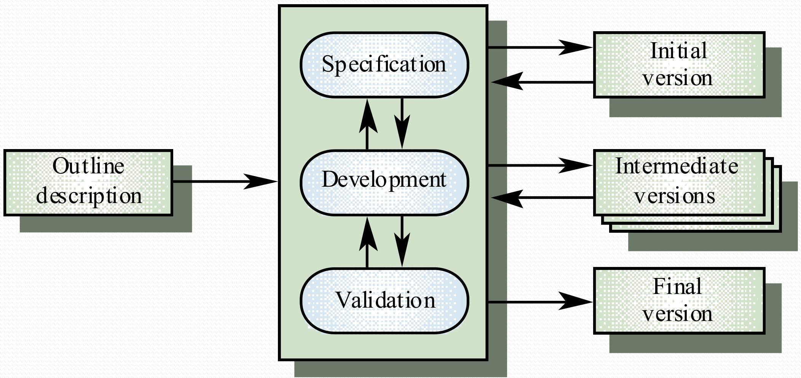

# COMP201-202526 Software Engineering

# Introduction

> Week 1 [SEL001-SEL003] Introduction + Software Process
>

## [1] 基本信息

| 姓名            | 办公地点                   | 电子邮箱                     |
| --------------- | -------------------------- | ---------------------------- |
| Sebastian Coope | Ashton Building, Room G.18 | `coopes@liverpool.ac.uk`     |
| Henry Forbes    | Ashton Building, Room G.17 | `H.J.Forbes@liverpool.ac.uk` |

软件工程就是要**管理代码的复杂性**，目标是：开发出出错概率低的软件

> **为何不侧重编程？**
>
> 1. 编程及编程技术（如 API）在其他课程中已覆盖。
> 2. 系统故障极少源于编程语言知识不足或 API 使用错误，多由以下问题导致：需求缺失 / 错误、软件设计糟糕（灵活性差、易出错）、测试问题（存在漏洞）、风险分析与项目管理薄弱（项目超期）、流程问题（无流程或流程不当，导致项目超期、取消）。

因此，为了做到这一步，应当：代码简洁、多测试。

## [2]评分

| 标题      |      | 分值占比 |
| --------- | ---- | -------- |
| 2小时考试 |      | 60%      |
| 课程作业  |      | 40%      |

> 课程作业：
>
> - Assignment 1 – Part 1 Requirements Engineering (20%)
> - Assignment 2 – Part 1 Design and implementation (5%)
> - Assignment 2 – Part 2 Modelling with UML (15%)

## [3] 软件流程

软件流程（Software Process）是**一组活动（Activity）**，其实就是为了开发软件。

**一组活动包括：**

- 规格说明（Specification）：明确这个系统要实现什么功能、并且约束开发（什么不应当开发）
- 开发（Development）：写代码
- 验证（Validation）：和客户对接，看看要求是否变更
- 演进（Evolution）：根据客户要求修改

这四个过程，就是产品的构建（Building），通常这个过程称为**生命周期（Life cycle）**。

什么是规格说明？

> [!IMPORTANT]
>
> 规格说明在很大程度上是任何软件工程项目中**最关键的阶段**。
>
> 什么是规格说明？
>
> 在程序设计中，**规格说明（Specification）** 是对软件系统、模块或功能的**详细描述和约束**，它明确了 “系统应该做什么”（而非 “如何实现”），是沟通需求、指导开发和验证成果的核心文档。**简单来说就是公司对接客户之后，记录客户需求，然后约束开发功能，最后两者达成一致的文件**
>
> 规格说明很重要，因为这是软件需求！了解软件真正需求，去除不需要的需求，可以节省成本和时间（对企业来说很重要）。对SAAS公司而言，他们就需要通过这个需求来分配员工工作，指定谁参与、谁解决某个模块问题。对购买SAAS的客户而言，这也是很重要的。
>
> 软件规格说明通常：
>
> 1. 不指定特定语言（编程语言）
> 2. 侧重于接口和行为
> 3. 规范能作为测试基础
> 4. 规范完整覆盖所有内容和需求

**软件工程**和**桥梁工程**都需要这样的规划，但是软件工程可以无限更改需求，但是随着需求变多，会导致软件难以维护。因此，好的软件应当：

- 有可维护性（Maintainability）
- 有可靠性（Dependability）：能够处理所有数据
- 有效率（Efficiency）：类似于复杂度，应当尽可能快
- 有可用性（Usability）：用户能用才行

### [3.1] 三种模型

#### [3.1.1] 瀑布模型

**The Waterfall Model（瀑布模型）：** 例如桥梁建造。**规格说明**和开发是独立的且不同阶段的。换言之：必须规划好，才能建造（开发），一旦开发就不允许更改需求。因此其缺点就是客户需求必须被完全充分理解。通常用于硬件、航天工业。优点是容易记忆。

#### [3.1.2] 演化式开发模型

**Evolutionary Development Model（演化式开发模型）**：例如SAAS。规格说明和开发是交错进行的。类似于：企业开发软件和客户对接需求，不断更改不断对接。缺点：过程可见性差、系统结构可能复杂糟糕（屎山代码）。

实际上，所有现代开发都有一定程度的演化式开发，但都是混合式的（稍后会讲到 Scrum）。

有时，规格说明在项目开始时大部分就已完成，然后在项目推进过程中再进行补充。

> 例如客户需要某网页系统需要500个确定的、订好了的需求**（称为用例 Use Case）**
>
> 那么实际上项目推进过程中，演化周期是预先确定的：
>
> 1. 500 个用例。
> 2. 在第一阶段，开发用例 1 - 50 的代码。
> 3. 在第二阶段，开发用例 51 - 100。
> 4. 在第三阶段...

#### [3.1.3] 敏捷开发框架

> “Scrum” 最初是一个橄榄球术语，指队员们为了重新开始比赛而围成一圈、共同争球的战术动作，核心是 **团队协作、同步行动**。后来，这一概念被应用到项目管理和软件开发领域，演变为一种流行的 **敏捷开发框架（Agile Framework）**，中文常译为 “敏捷冲刺” 或直接使用英文 “Scrum”。

**Agile Development Framework**：如今行业中广泛使用。他是**轻量级（lightweight）**的开发方法。敏捷开发包括：

1. Scrum
2. XP（极限编程 - eXtreme Programming）

敏捷开发框架侧重于：

1. 代码开发是核心互动
2. 测试驱动开发（先写测试，后写代码）
3. 常用**==结对编程（Pair Programming）==**
4. 自组织团队（团队成员自主认领任务）

> [!TIP]
>
> 什么是结？
>
> 结对编程（Pair Programming）是敏捷开发（尤其是极限编程 XP）中一种重要的协作开发方式，核心是**两名开发者共同参与同一代码的开发过程**，通过分工协作提升代码质量和开发效率。
>
> - **驾驶员（Driver）**：负责实际编写代码、操作键盘和鼠标，专注于 “如何实现当前功能” 的细节。
> - **导航员（Navigator）**：不直接写代码，而是从宏观角度观察代码，负责审查逻辑、提示潜在问题（如 bug、性能隐患）、思考整体设计，相当于 “实时代码评审员”。
>
> 通常每 20-30 分钟会互换角色，确保两人都能从不同视角参与开发。

**敏捷开发框架中的Scrum（增量）**

- Scrum通常译为增量开发。这种开发通常不是一次性交付整个系统，而是将  **开发**、**交付**  拆分为多个增量（Scrum 中的 “冲刺”），每个增量交付**部分所需功能**。
- 对用户需求进行优先级排序，优先级最高的需求会包含在早期增量中（救火先救最热的）
- 一旦某个增量的开发启动，该增量的需求就被冻结，但后续增量的需求可以继续演化（一个增量开始开工需求就不能变）

Scrum（增量开发）有什么优势呢？

1. 每次增量都能**交付客户价值**，因此系统功能可以更早投入使用
2. 早期的增量版本可作为原型，帮助获取后续增量版本的需求。（现在做出来了一版，以后的需求，客户根据这一版之上进行更改）
3. 降低整体项目失败的风险（至少前面几版已经给客户确认过了，不会出大差错）

因此，大多数软件开发流程都涉及：

1. 原型设计（Prototyping）
2. 迭代构建（Iterative building）

> **Prototyping（原型设计）**是正式开发完整软件系统前，构建简化的、具备核心功能或关键交互逻辑的版本。

## [4] 需求工程和软件规格说明

需求工程流程（四个阶段）：

1. 分析这个需求是否可行**（Executable）**（不行就和客户拉扯）
2. 需求获取与分析客户需求
3. 指定需求[**规格说明**](#3_1_what_is_specification)
4. 需求验证（给客户看）

软件规格说明：确定软件需提供的服务有哪些，确定系统运行和开发的**约束**（你这个网页要有什么功能，然后什么功能不该有）。

## [5] 软件设计与模型

软件确定了规格说明之后，就可以根据**规格说明**以开始设计实现了！

> 核心目标：将系统规格说明转化为可执行系统，设计与实现交叉进行（设计-实现-设计-实现）。

如何进行软件设计?

1. 架构设计（Architecture Design）：架构师干的，把需求拆分多个模块。
2. 抽象规格设计：类似于设计抽象接口，制定约束和规范，但是能扩展。
3. 接口设计：明确接口无歧义，并规范文档。
4. 组件设计：给组件分配服务，设计组件接口（类似于集群（Cluster）中的每个机器运行什么任务，例如机器A运行QWen模型，机器B运行Bert模型等）。
5. 数据结构与算法设计：详细设计系统数据结构及组件服务所需算法，例如，服务访问过多，用负载均衡算法，k8s这些之类的。

软件设计方法有很多模型，这个以后会讲到。

常用软件设计模型：

- 数据流模型（数据在进程间流动）

  > Data-flow model (data flows between processes)

- 实体 - 关系 - 属性模型（数据库或类设计）

  > Entity-relation-attribute model (data base or class design)

- 结构模型（展示主要子系统）

  > Structural model (shows major sub-systems)

- 对象模型（含对象状态与行为）

  > Object models (objects have state and behaviour)

- 状态转换模型（展示系统状态及触发条件）

  > A state transition model showing system states and triggers

## [6] 编程、调试与测试

Programming, debugging and testing.

### [6.1] 编程与调试

任务：将设计转化为程序，去除程序错误。

编程特点：多为个人活动，无通用流程，但需遵循良好实践与组织标准；程序员会通过测试找错，再调试修复。

良好编程模式：迭代式，即写小段代码→测试→归档（如 git 或 svn 提交）→新增代码→重复测试与归档。

### [6.2] 测试

流程：单元测试$\to$模块测试$\to$子系统测试$\to$系统测试$\to$验收测试（含组件集成测试、用户测试）。

各阶段重点：

- 单元测试：测试单个组件（面向对象编程时为类 / 方法级）。
- 模块测试：测试相互依赖的组件集合（OO编程时，与单元测试交叉，测试集成其他类的类）。
- 子系统测试：集成模块为子系统后测试，重点是接口（OO编程时，测试提供特定服务的类集合，如卡片支付、SMS 发送服务，常以包或 JAR 库形式存在）。
- 系统测试：测试整个系统，验证涌现性。
- 验收测试：用客户数据测试，确认系统是否可接受。

# **Requirements analysis**

**软件需求分析**

> Week 2 [SE_L004 - SE_L006] Hotel booking Case study
>
> Week 3 [SE_L007 - SE_L009] 
>
> Week 4 [SE_L012]

为什么需要需求？实际上在[**规格说明**](#3_1_what_is_specification)处已经提到了。接下来进一步了解...

## [1] 需求构成

需求的例子：

1. 这个系统只支持`.png`格式
2. 客户希望增添刷卡功能
3. ...

**需求的构成分为三种**

1. 用户需求：

   ​	自然语言表述，外加系统所提供服务及其运行约束的图表。面向客户编写。

   ​	例如：我想添加一个刷微信的支付方式

2. 系统需求

   ​	一份**结构化文档**，详细（且正式地）描述了系统要实现什么，类似于SAAS企业把用户的自然语言写成文档，以合同形式编写。 

   ​	例如：添加微信支付功能在主菜单界支付界面的最顶端，消费者通过...可以使用微信支付。（详细文档）

3. 软件规格说明

   ​	面向开发者的，可作为实现的基础。
   ​	例如：前端....后端...微信API之类的。（详细文档）

需求必须是可测试的！

需求不能够有歧义（特别是客户和开发者之间理解偏差），需求应当**完整且一致**。但是在实际操作中指定一个完整且一致的需求是很难的甚至不可能的。

## [2] 功能需求和非功能需求

### [2.1] 功能需求

**功能需求（Functional Requirement）：**

- 示例：前端页面加一个找回密码按钮。

### [2.2] 非功能需求

**非功能需求（Non-Functional Requirement）：**

- 示例：
  - 登录按钮点击后服务器必须在50ms内反应
  - 所有加密必须使用高级加密标准

- **产品需求**：规定交付产品的行为，如执行速度（“高峰时段用户信息请求响应时间 < 0.1 秒，正常时段 < 0.01 秒”）、可靠性、安全性。
- **组织需求**：源于组织政策流程，如指定开发工具（“用 Java 开发”）、遵循特定标准。
- **外部需求**：来自系统及开发过程之外，如互操作性（“网站需兼容 Chrome 128 及以上版本”）、合规性（“符合 FIPS 标准”）。

非功能性需求可能很难精确表述，而模糊的需求可能难以验证。

在复杂系统中，不同非功能需求之间的冲突很常见。哪个是最关键的需求？很难衡量！

1. 用户名/密码机制应便于用户使用
2. 所有密码都必须难以猜测，理想情况下还需要包含大小写字母和特殊符号，以确保高安全性。

## [3] 需求编写与核心要点

需求编写指南

- 统一格式：所有需求采用标准格式表述。
- 语言一致：用 “shall” 表示强制性需求（必须支持），“should” 表示期望性需求（非必需），参考 RFC 2119。
- 突出重点：用文本高亮标识需求关键部分。
- 规避术语：**避免使用计算机专业术语**，方便非技术人员理解。
- 文档自包含：包含术语表、完整示例等，确保独立性。

