# COMP201-202526 Software Engineering

# Exam

考试侧重点如下（这是老师发布的公告）

| **内容 (英文)**                                              | **内容 (中文)**    | **题目数量** |
| ------------------------------------------------------------ | ------------------ | ------------ |
| **[Finite state machines](#13_6_finite_state_machine)**      | 有限状态机         | 1            |
| **[Functional requirements &  Non-functional requirements](#2_functional_and_non_functional_requirement)** | 功能/非功能需求    | 4            |
| **[Use case](#3_1_2_what_is_use_case) analysis descriptions and diagrams** | 用例分析描述与图表 | 8            |
| **[Testing](#6_2_testing)**                                  | 测试               | 8            |
| **[Software cost estimation](#cost_estimation)**             | 软件成本估算       | 1            |
| **[UML](#what_is_UML)**                                      | 统一建模语言 (UML) | 3            |
| **[Methodologies](#methodologies)**                          | 方法论 / 开发方法  | 2            |
| **[Software Security requirements](#bell_lapadula)**         | 软件安全需求       | 5            |
| **[Petri nets](#petri_net_main)**                            | Petri 网           | 6            |
| **[Cohesion](#what_is_cohesion) and [coupling](#what_is_coupling)** | 内聚与耦合         | 4            |
| **[Class diagrams](#class_diagram)**                         | 类图               | 6            |
| **[OO programming](#object_oriented_programming)**           | 面向对象编程       | 5            |
| **Scheduling**                                               | 进度安排 / 调度    | 2            |
| **TOTAL (总计)**                                             | **--**             | **55**       |

# Introduction

> Week 1 [SEL001-SEL003] Introduction + Software Process
>

## [1] 基本信息

| 姓名            | 办公地点                   | 电子邮箱                     |
| --------------- | -------------------------- | ---------------------------- |
| Sebastian Coope | Ashton Building, Room G.18 | `coopes@liverpool.ac.uk`     |
| Henry Forbes    | Ashton Building, Room G.17 | `H.J.Forbes@liverpool.ac.uk` |

软件工程就是要**管理代码的复杂性**，目标是：开发出出错概率低的软件

> **为何不侧重编程？**
>
> 1. 编程及编程技术（如 API）在其他课程中已覆盖。
> 2. 系统故障极少源于编程语言知识不足或 API 使用错误，多由以下问题导致：需求缺失 / 错误、软件设计糟糕（灵活性差、易出错）、测试问题（存在漏洞）、风险分析与项目管理薄弱（项目超期）、流程问题（无流程或流程不当，导致项目超期、取消）。

因此，为了做到这一步，应当：代码简洁、多测试。

## [2]评分

| 标题      | 分值占比 |
| --------- | -------- |
| 2小时考试 | 60%      |
| 课程作业  | 40%      |

> 课程作业：
>
> - Assignment 1 – Part 1 Requirements Engineering (20%)
> - Assignment 2 – Part 1 Design and implementation (5%)
> - Assignment 2 – Part 2 Modelling with UML (15%)


## [3] 软件流程

软件流程（Software Process）是**一组活动（Activity）**，其实就是为了开发软件。

**一组活动包括：**为生命周期（Life cycle）。

- 规格说明（Specification）：明确这个系统要实现什么功能、并且约束开发（什么不应当开发）
- 开发（Development）：写代码
- 验证（Validation）：和客户对接，看看要求是否变更
- 演进（Evolution）：根据客户要求修改

这四个过程，就是产品的构建（Building），通常这个过程称为**生命周期（Life cycle）**。

<a id="3_1_what_is_specification"></a>

**什么是规格说明(Specification)？**

> [!NOTE]
>
> 规格说明在很大程度上是任何软件工程项目中**最关键的阶段**。
>
> 什么是规格说明？
>
> 在程序设计中，**规格说明（Specification）** 是对软件系统、模块或功能的**详细描述和约束**，它明确了 “系统应该做什么”（而非 “如何实现”），是沟通需求、指导开发和验证成果的核心文档。**简单来说就是公司对接客户之后，记录客户需求，然后约束开发功能，最后两者达成一致的文件**
>
> 规格说明很重要，因为这是软件需求！了解软件真正需求，去除不需要的需求，可以节省成本和时间（对企业来说很重要）。对SAAS公司而言，他们就需要通过这个需求来分配员工工作，指定谁参与、谁解决某个模块问题。对购买SAAS的客户而言，这也是很重要的。
>
> 软件规格说明通常：
>
> 1. 不指定特定语言（编程语言）
> 2. 侧重于接口和行为
> 3. **规范能作为测试基础**
> 4. 规范完整覆盖所有内容和需求

**软件工程**和**桥梁工程**都需要这样的规划，但是软件工程可以无限更改需求，但是随着需求变多，会导致软件难以维护。因此，好的软件应当：

- 有可维护性（Maintainability）
- 有可靠性（Dependability）：能够处理所有数据
- 有效率（Efficiency）：类似于复杂度，应当尽可能快
- 有可用性（Usability）：用户能用才行

### [3.1] 三种模型

<a id="water_fall_model"></a>

#### [3.1.1] 瀑布模型

**The Waterfall Model（瀑布模型）：** 例如桥梁建造。**规格说明**和开发是独立的且不同阶段的。换言之：必须规划好，才能建造（开发），一旦开发就不允许更改需求。因此其缺点就是客户需求必须被完全充分理解。通常用于硬件、航天工业。优点是容易记忆。


<a id="evolutionary_development_model"></a>

#### [3.1.2] 演化式开发模型

**Evolutionary Development Model（演化式开发模型）**：例如SAAS。规格说明和开发是交错进行的。类似于：企业开发软件和客户对接需求，不断更改不断对接。缺点：过程可见性差、系统结构可能复杂糟糕（屎山代码）。

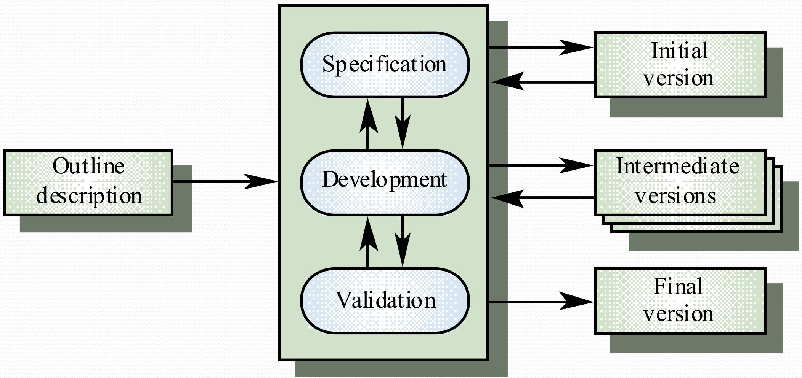

实际上，所有现代开发都有一定程度的演化式开发，但都是混合式的（稍后会讲到 Scrum）。

有时，规格说明在项目开始时大部分就已完成，然后在项目推进过程中再进行补充。

<a id="agile"></a>

#### [3.1.3] 敏捷开发框架

> “Scrum” 最初是一个橄榄球术语，指队员们为了重新开始比赛而围成一圈、共同争球的战术动作，核心是 **团队协作、同步行动**。后来，这一概念被应用到项目管理和软件开发领域，演变为一种流行的 **敏捷开发框架（Agile Framework）**，中文常译为 “敏捷冲刺” 或直接使用英文 “Scrum”。

**Agile Development Framework**：如今行业中广泛使用。他是**轻量级（lightweight）**的开发方法。敏捷开发包括：

1. Scrum
2. XP（极限编程 - eXtreme Programming）

敏捷开发框架侧重于：

1. 代码开发是核心互动
2. <a id="test_driven_development"></a>测试驱动开发（先写测试，后写代码）
3. 常用**==结对编程（Pair Programming）==**
4. 自组织团队（团队成员自主认领任务）

> [!TIP]
>
> 什么是结？
>
> 结对编程（Pair Programming）是敏捷开发（尤其是极限编程 XP）中一种重要的协作开发方式，核心是**两名开发者共同参与同一代码的开发过程**，通过分工协作提升代码质量和开发效率。
>
> - **驾驶员（Driver）**：负责实际编写代码、操作键盘和鼠标，专注于 “如何实现当前功能” 的细节。
> - **导航员（Navigator）**：不直接写代码，而是从宏观角度观察代码，负责审查逻辑、提示潜在问题（如 bug、性能隐患）、思考整体设计，相当于 “实时代码评审员”。
>
> 通常每 20-30 分钟会互换角色，确保两人都能从不同视角参与开发。


<a id="priorities_the_requirement_in_scrum"></a>

**敏捷开发框架中的Scrum（增量）**

- Scrum通常译为增量开发。这种开发通常不是一次性交付整个系统，而是将  **开发**、**交付**  拆分为多个增量（Scrum 中的 “冲刺”），每个增量交付**部分所需功能**。
- **对用户需求进行优先级排序，优先级最高的需求会包含在早期增量中（救火先救最热的）**
- 一旦某个增量的开发启动，该增量的需求就被冻结，但后续增量的需求可以继续演化（一个增量开始开工需求就不能变）

Scrum（增量开发）有什么优势呢？

1. 每次增量都能**交付客户价值**，因此系统功能可以更早投入使用
2. 早期的增量版本可作为原型，帮助获取后续增量版本的需求。（现在做出来了一版，以后的需求，客户根据这一版之上进行更改）
3. 降低整体项目失败的风险（至少前面几版已经给客户确认过了，不会出大差错）


因此，大多数软件开发流程都涉及：

1. 原型设计（Prototyping）
2. 迭代构建（Iterative building）

> **Prototyping（原型设计）**是正式开发完整软件系统前，构建简化的、具备核心功能或关键交互逻辑的版本。


敏捷开发工具 Cucumber 简单介绍可**[看此处](#agile_development_tool_cucumber)**


### [3.2] UML

<a id="what_is_UML"></a>

**什么是UML?**

UML - Unified Modeling Language

- **起源**：由面向对象分析与设计方法的开发者制定，已成为行业标准；
- **核心优势**：表达能力强、易用、无歧义，有丰富工具支持（含商业与开源 CASE 工具）。


UML 类图是**统一建模语言（Unified Modeling Language）**，可以用UML对系统进行建模！

| 大类                     | 解释                       | 包含的图                                                     |
| ------------------------ | -------------------------- | ------------------------------------------------------------ |
| **结构图 (Structural)**  | 描述系统的静态架构         | **[类图](#class_diagram)**<br />对象图<br />组件图<br />**部署图 (Deployment)**<br />包图 |
| **行为图 (Behavioral)**  | 描述系统的动态行为         | **[用例图 (Use Case)](#3_1_2_what_is_use_case)**<br />**[状态图 (State)](#state_diagram)**<br />**[活动图 (Activity)](#activity_diagram)** |
| **交互图 (Interaction)** | 行为图的子集，描述交互细节 | **[时序图 (Sequence)](#sequence_diagram)**<br />协作/通信图 (Communication) |


UML 是**[面向对象](#object_oriented)**的**符号标准（Standard notation）**。


<a id="3_1_2_what_is_use_case"></a>

### [3.3] Use case 用例

返回：[UML](#what_is_UML)

- **[Use case diagram 用例图](#4_what_is_use_case_diagram)**

- ###### **[Use case 例子](#5_use_case_example)**


例如客户需要某网页系统需要500个确定的、订好了的需求**（称为用例 Use Case）**

那么实际上项目推进过程中，演化周期是预先确定的：

1. 500 个用例。
2. 在第一阶段，开发用例 1 - 50 的代码。
3. 在第二阶段，开发用例 51 - 100。
4. 在第三阶段...

> [!NOTE]
>
> **用例（Use Case）**：用例是统一建模语言（UML）中一种基于场景的技术，它用于识别交互中的**参与者(Actors)**并描述交互本身。
>
> - 参与者可以是所有与系统交互的人，例如测试程序员、项目经理、客户等。参与者也可以是**非人**。
>   - 人：客户玩家司机经理...
>   - 非人：传感器（烟感报警）、支付服务、地理位置...
> - 一组用例（A set of use case）应当描述**所有**与系统可能的交互。

### [3.5] 类图

<a id="class_diagram"></a>

类的识别：采用 “名词识别技术”（Noun Identification Technique），选择重要的类，剔除不重要的类。

如何命名类？

- 驼峰命名
- 不要用复数
- 不要用动词

如何画类图？**[Link to Bilibili](https://www.bilibili.com/video/BV1Wu4y1Y7ya)**


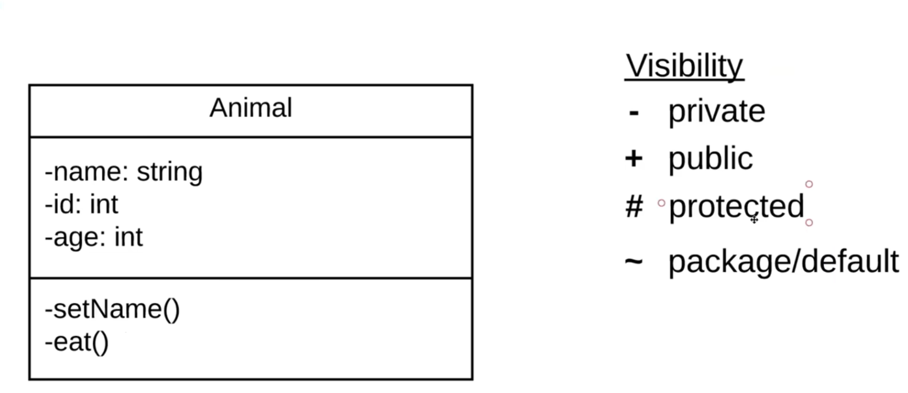

关系表示如下

数据字典：

- `use-a`
- `is-a`
- `has-a`
- `is-like-a`

**==关系具有传递性==**

#### [3.5.1] Dependency 依赖关系 [use-a]

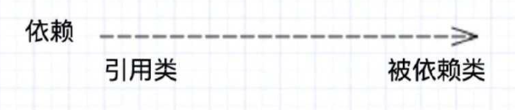

$\text A - - - - - - - > \text B$ 可以读作：A依赖B

在 UML 类图中，依赖关系是最弱的关系类型。之所以说它弱，是因为两端之间的关系只是**暂时的**，或者仅限于单个方法或构造函数。

机械师使用工具，这可以通过依赖关系来表达：

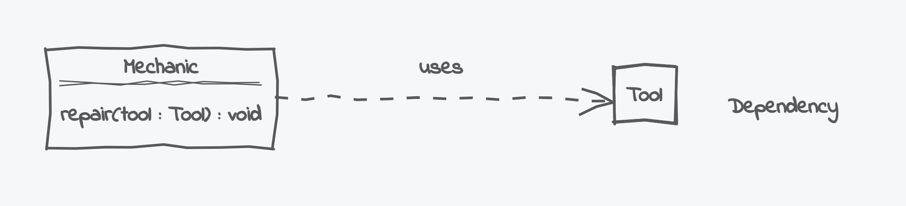

我们的 `Mechanic` 类有一个 `repair` 方法，该方法需要特定的 `Tool` ，因此方法参数 `tool` 在两个类之间建立了依赖关系。

然而，这两个类之间的依赖关系并不强，因为并非 `Mechanic` 方法都完全需要 `Tool` 对象。

依赖关系的优势在于：它们只会造成松耦合（Loose coupling）。理想情况下只需修改 `Mechanic` 类，让它不再依赖 `Tool` 类。这使得重构相对容易。


<a id="association_relation"></a>

#### [3.5.2] Association 关联关系 [has-a]

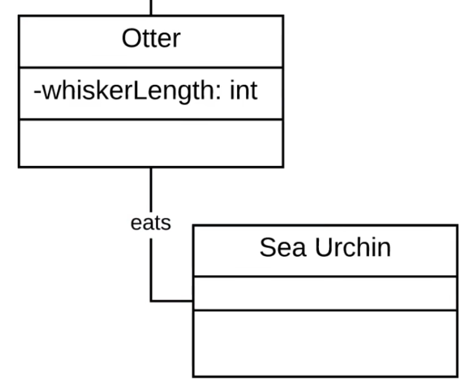


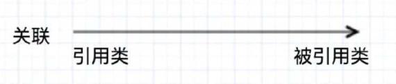

**关联关系（Associations）** 描述的是 **“有一个”（has a）** 的关系


UML 提供了*关联（Association）* 的概念，用于表达比*依赖（Dependencies）* 更持久、结构更强的关系。例如，关联可以用来建模一个类持有对另一个类的引用，例如通过属性或字段。

UML 关联具有不同的可导航端点：

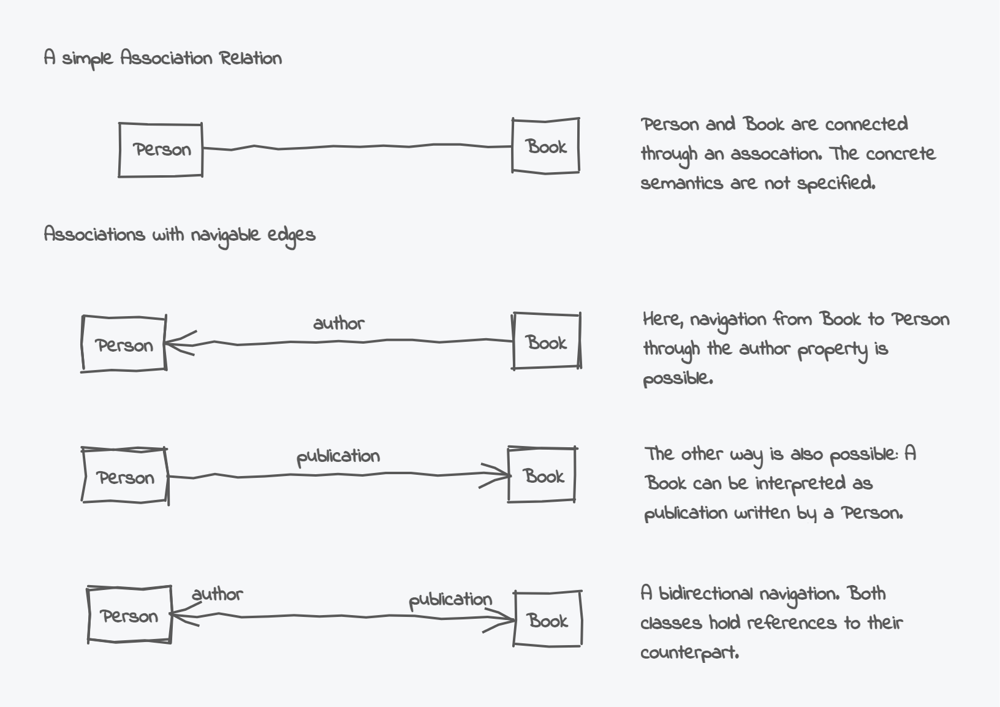


根据 UML 2.0 规范，关联可以进一步区分为**聚合（Aggregations）**和**组合（Compositions）** 。

<a id="association_aggregation_relation"></a>

##### Aggregation 聚合关系 [has-a/ is-part-of ]

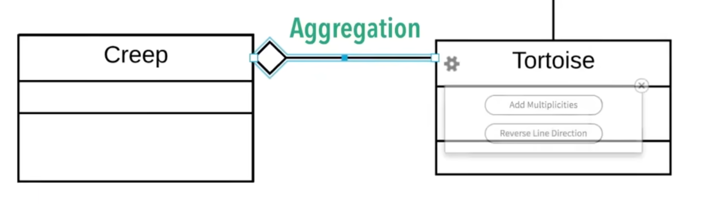

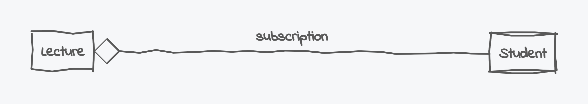

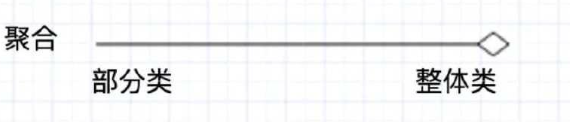


在这个例子中，乌龟（Tortoise）可以聚合到龟群（Creep）。

学生（Student）可以订阅课程（Lecture）。

> 即使其中一门课程被取消，该学生仍然保留学生身份。

画法是部分指向整体。

**弱拥有的独立性**：这是聚合最核心的特点。成员对象（乌龟）虽然属于整体（龟群），但它具有**独立的生命周期**。这意味着如果“整体”被销毁，“部分”仍然可以继续存在，它们可以被其他整体共享。


<a id="composition_relationship"></a>

##### Composition 组合关系 [has-a/ is-part-of]


组合关系和聚合很像，但是不同的是，如果整体没了，**个体也不允许存在。**

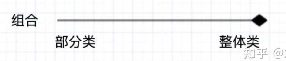

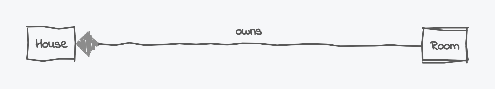

设想一栋由多个房间组成的房子。单个房间并非孤立存在，而是与周围的建筑紧密相连。如果拆除这栋房子，它的各个房间也会随之消失。

通常情况下，Composition 关系是互斥的。两个 Composition 指向同一个参考系在大多数情况下是没有意义的：一个房间只能属于一栋房子，所以，让几个房子共享同一个房间在概念上是有些反直觉的。


选择聚合还是组合取决于你的具体应用场景。例如，在一个简单的赛车游戏中，一个 `Car` 类包含多个 `Tire` 引用。轮胎很可能是汽车的固定部件，单个轮胎不会出现在其所属车辆之外。因此，汽车和轮胎之间的 Composition 关系是合理的。相反，如果你为汽车经销商设计一个资源管理系统，轮胎很可能是一个独立的概念，单独存储轮胎可能是一个非常合理的需求。在这种情况下，聚合更适合将车辆与其轮胎关联起来。

如果不确定对象的归属权和生命周期，也可以采用一般关联关系。在这种情况下是在表明对象归属权（目前）并不是当前的主要关注点。

<a id="inheritance_relationship"></a>

#### [3.5.3] Inheritance 继承关系 [is-a/ can-do ]

Generalization/ Inheritance 泛化/ 继承关系

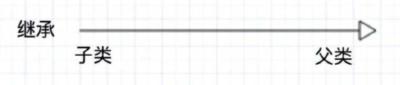


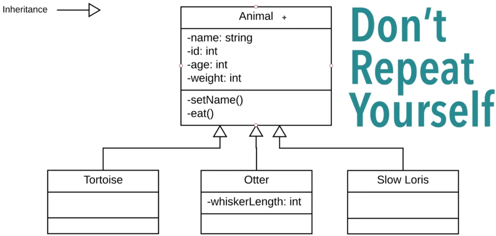


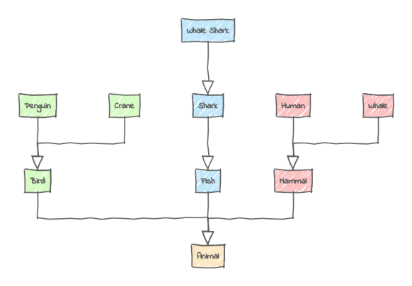

**泛化（Generalization）** 表达的是一种更强、更紧密的 **“是一个”（is a）** 的关系。

泛化在图示上表现为一条**实线**，带有一个**空心箭头**，从具体（专门化）类型指向更通用（泛化）的类型（例如：从“狗”指向“宠物”）。


#### [3.5.4] Implementation 实现关系 [is-like-a]

实现关系 Realization / Implementation 

虽然**实现**（Realization）在图示上看起来与**泛化**（Generalization）非常相似，但它们的目的完全不同。在使用**泛化**时，我们的目标是构建一种本体结构（Ontology），并复用基类中已经实现的代码。相反，当我们使用**实现**关系时，我们是在定义一个具有公共接口的“契约”，所有相关的类型都必须遵守这一契约。

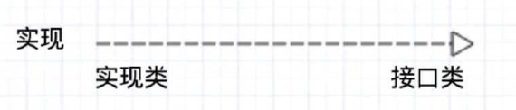

通过面向接口编程，我们的代码会变得更加灵活。只要我们的实现类都符合同一个接口，我们就可以轻松地在不同的实现之间进行切换。

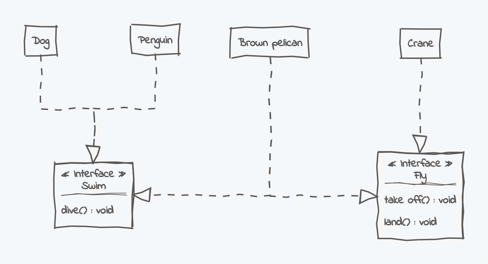

每一个动物类都可以通过实现相应的接口来提供其所需的所有行为。如果这些动物类都遵守同一个接口，客户端就可以对所有动物进行统一处理。


接口需要加上`<< Interface >>` 标注

#### [3.5.5] 类图的多重性

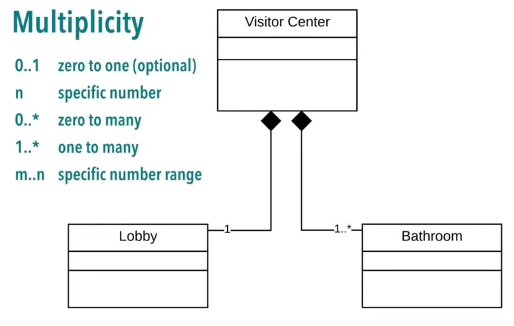

在[**类图**](#class_diagram)中，这些数字被称为 **多重性（Multiplicity）**。

这些数字逻辑会记录在 **[数据字典（Data Dictionary）](#data_dictionary)** 中


##### 例1

每个客户必须在我们银行至少拥有一个账户，且账户总数不得超过五个


连接末端的文本 `1 .. 5` 定义了可能的账户范围。要解读此图，我们需要从**左到右阅读（文本另一端）**：

> 一位客户必须拥有1至5个银行账户。

请注意，图中并未明确标明客户的基数——`1`

##### 例2

我们还可以描述**银行账户**和**客户**之间的关系。

假设每个账户必须至少属于一位客户，但对于联名账户，它可以有两个所有者：


> **反向多重性**

这里我们需要把下限和上限放在另一端，因此，我们现在必须从**右向左阅读（文本另一端）**：

> *一个*银行账户最多可以属于一个或两个客户。

##### 例3

最后，我们可以将两种多重性合并到同一个图中，以表达两个方向：


务必记住，此图将上述两个表达式合并成一个图表。 所以正确的读法应该是：

**一位客户拥有 1 至 5 个银行账户 ， 一个银行账户也属于一位或两位客户。**

而不是

~~一到两个客户拥有一到五个银行账户。~~

##### 例4

PPT例子：

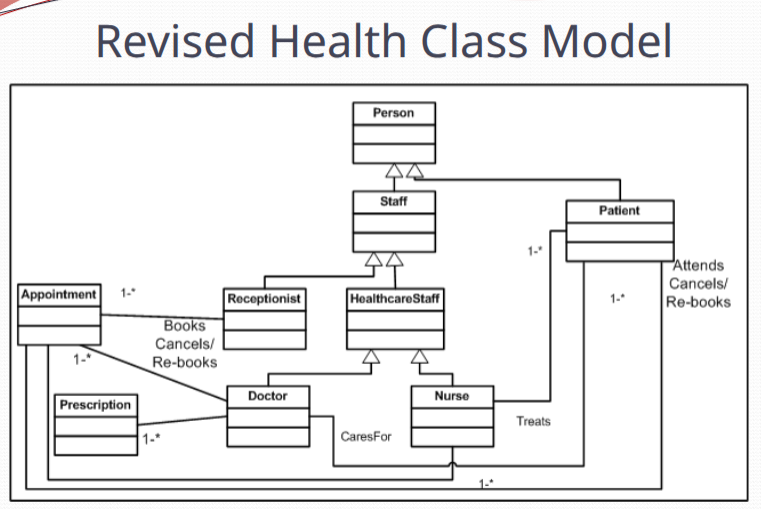

##### 例5

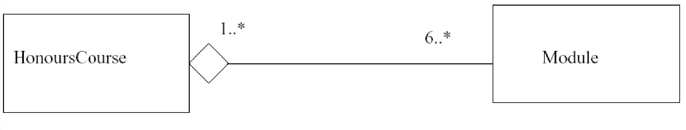

- `1..*`：一个 Module 可以被 1~N 个 HonoursCourse 使用
- `6..*`：一个 HonoursCourse 至少包含 6 个 Module


这里 Module 指向 HonoursCourse，并且是空心的菱形，那么这是[关联关系 Association relation](#association_relation)中的[聚合关系]

##### 例6

井字棋

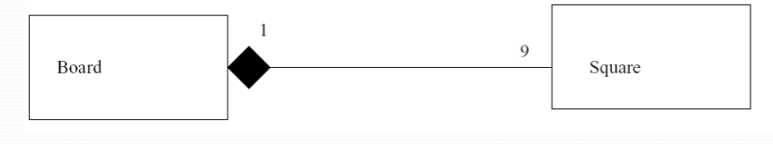

这里部分类是`Square`，整体类是`Board`，部分指向整体。

- `1`：Square 拥有 1个 Board
- `9`：Board 拥有 9 个 Square


##### 例7

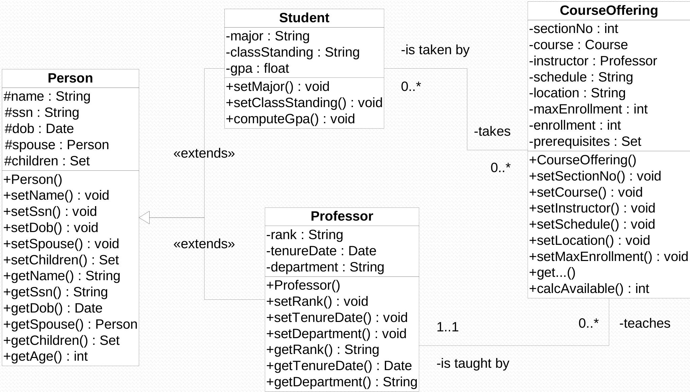


#### [3.5.6] 关于标识

##### Derived Associations 派生关系

这个不是 Class Diagram中的一个关系，但是PPT中，当两个类连线了，那么就自然会有派生关系：

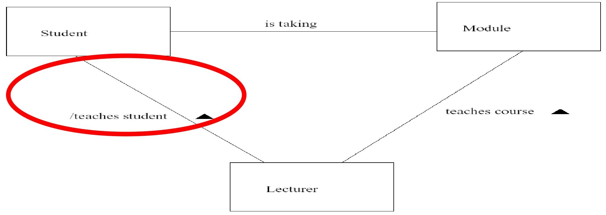

派生关联在其名称前用斜杠表示，比如红色部分，代表`Lecturer` **/teaches** `Student`

然后方向用黑色三角形标识。

##### XOR 异或

XOR是**Exclusive OR**（异或）的意思：`A XOR B` 指的是要么A要么B，**不可以同时**AB。
$$
A\oplus B
$$
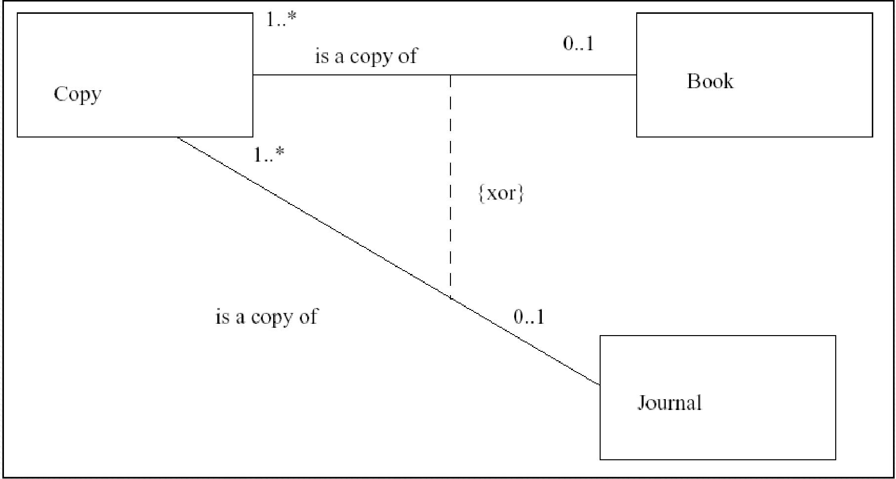

这图的意思是，Copy要么是`Book`的一个副本，要么是`Journal`的一个副本。

- `1..*` Book/ Journal 至少有1个副本
- `0...1` 一个 Copy 至多是 Book or Journal


##### 接口和抽象类

接口需要加上`<< Interface >>` 标注

抽象类需要加上`<< Abstract >>` 标注

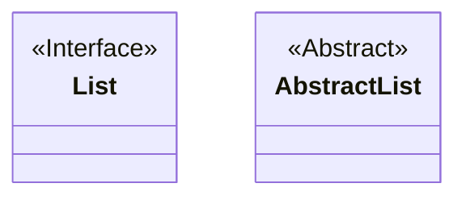
```mermaid
classDiagram
    class List {
        <<Interface>>
    }
    class AbstractList{
    	<<Abstract>>
    }
```


#### [3.5.7] CRC Card

如何判断一个类图设计的好不好？使用CRC卡片

> 虽然PPT说CRC不是UML的一个知识点，但是仍然不确定考不考

CRC全称：

- **C  **lass 类名：这个类的名字

- **R  **esponsibility 职责：这个类干什么？

  > 这个类主要干哪些事（1-2 个最好，最多 4 个，多了就说明这个类管太多，Low [cohension](#what_is_cohesion)，不好 ）；
  >
  > **一个类管的事越多、职责越杂，反而内聚越低；管的事越少、越集中，内聚才越高**。

- **C  ** ollaborators 合作者：和哪些Class合作？

  > 这个类要和哪些其他类配合才能完成职责（太多了说明 Tight [coupling](#what_is_coupling) ，不好）。


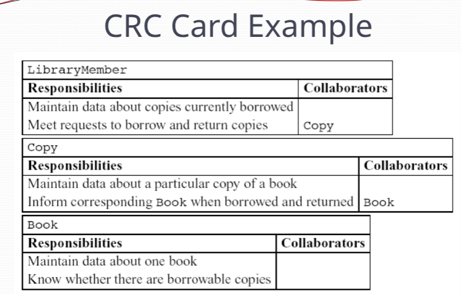


<a id="sequence_diagram"></a>

### [3.6] 时序图

Sequence Diagram

[Bilibili 视频](https://www.bilibili.com/video/BV1YM411f7dr)

[更详细的youtube 视频](#https://www.youtube.com/watch?v=gzKe7yt8qEo)

- 竖着的虚线：生命线
- 激活框（Activation Box）：对象激活时间
- 各种条件框

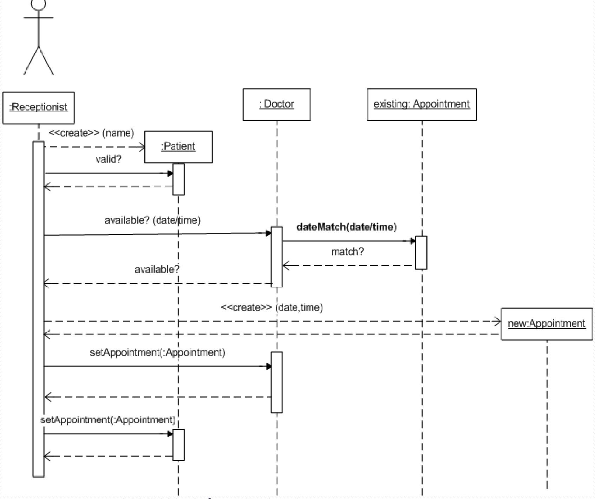

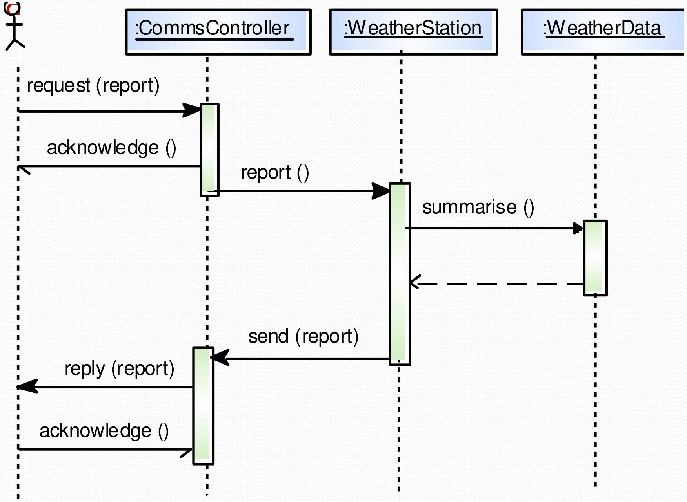


> ### 创建并验证患者信息
>
> - **创建对象**：接待员（`:Receptionist`）首先发出 `<<create>>(name)` 消息，动态创建了一个 `:Patient` 实例。注意此时 `:Patient` 的方框位于图中部，表示它是流程开始后才被实例化的。
> - **验证**：接待员随后向患者对象发送 `valid?` 消息，询问该患者信息是否合法，并收到了**返回确认（虚线箭头）**。
>
> ### 检查医生可用性
>
> - **咨询医生**：接待员向 `:Doctor` 发送 `available?(date/time)`，询问特定时间段是否有空。
> - **内部核对**：医生并没有直接回答，而是转而询问 `existing: Appointment`（现有的预约对象），通过 `dateMatch(date/time)` 检查该时间是否已被占用。
> - **反馈结果**：现有预约返回 `match?` 结果给医生，随后医生将最终的 `available?` 状态回传给接待员。
>
> ### 生成新预约
>
> - **创建新预约**：在确认医生有空后，接待员发出 `<<create>>(date, time)` 消息，创建了一个名为 `new: Appointment` 的新对象。
> - `existing: Appointment` 指的是**旧的**那个实例，而 `new: Appointment` 指的是**刚创建的**这个实例。
>
> ### 关联预约关系
>
> - **通知医生**：接待员调用医生的 `setAppointment(:Appointment)` 方法，将新生成的预约信息同步给医生。
> - **通知患者**：接待员同样调用患者的 `setAppointment(:Appointment)` 方法，完成患者侧的预约登记。

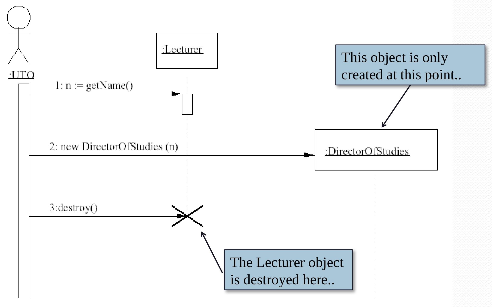

> ### **获取数据**
>
> - 控制对象 `:UTO` 首先调用 `:Lecturer`（讲师）的 `getName()` 方法，并将返回的名字存储在变量 `n` 中。
>
> ### **动态创建**
>
> - `:UTO` 发出 `new DirectorOfStudies (n)` 消息。
> - **注意**：`:DirectorOfStudies` 的方框位于图中部，且有标注说明“该对象仅在此处被创建”。
>
> ### **对象销毁**
>
> - `:UTO` 向 `:Lecturer` 发送 `destroy()` 消息。
> - 在讲师的生命线末端出现了一个明显的 **“X” 符号**，配合标注说明“讲师对象在此处被销毁”。这表示该对象占用的内存或资源已被释放，后续无法再接收消息。

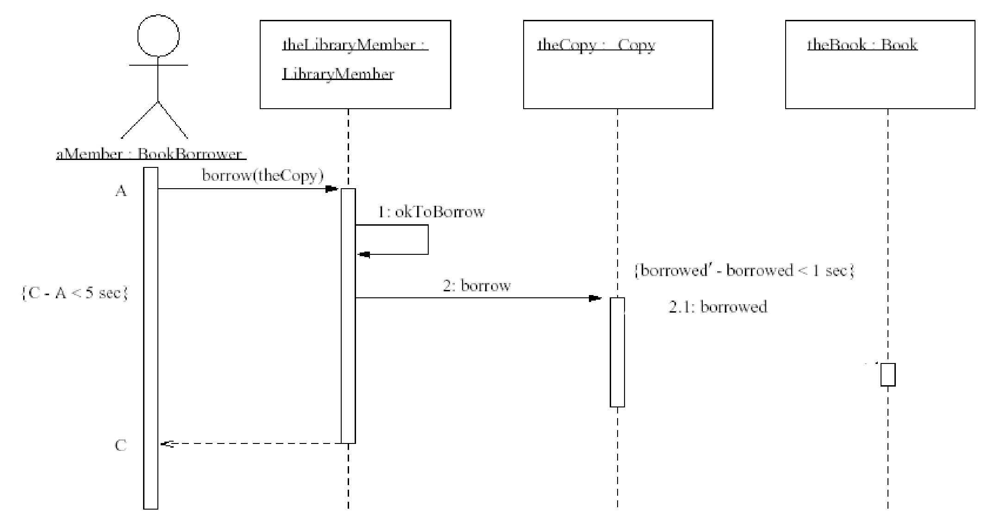

> ### 参与者与命名方式
>
> 图中使用了典型的 `实例名 : 类名` 命名格式：
>
> 
>
> **发起请求**：外部参与者 `aMember` 向 `theLibraryMember` 发送 `borrow(theCopy)` 消息。此时时间点标记为 **A**。
>
> **内部检查（嵌套激活框）**：`theLibraryMember` 接收到消息后，调用了自身的方法 `1: okToBorrow`。
>
> - **视觉表现**：在 `theLibraryMember` 的主激活框上叠放了一个稍小的激活框，这正是**自调用（Self-Invocation）**，代表对象在执行借书逻辑前先进行内部资格检查。
>
> **执行借书**：检查通过后，`theLibraryMember` 向 `theCopy` 发送 `2: borrow` 消息。
>
> **状态更新**：`theCopy` 随后向 `theBook` 发送 `2.1: borrowed` 消息，告知该书已被借出。
>
> **流程结束**：最后，控制权通过虚线返回给 `aMember`。此时时间点标记为 **C**。
>
> 
>
> 张图相比前两张图，增加了大括号 `{ }` 包围的表达式，这是 UML 中的**时间约束**：
>
> - **`{C - A < 5 sec}`**：这表示整个借书操作（从点 A 发起到点 C 返回）必须在 **5秒内** 完成。这通常用于描述非功能性需求或系统性能指标。
> - **`{borrowed' - borrowed < 1 sec}`**：这表示从 `theCopy` 接收到借书指令到 `theBook` 完成状态更新之间的时间间隔必须小于 **1秒**。
>
> - `'` 的含义：表示“结束时间”或“后状态”


> 时许图和协作/通信图如果有一个箭头指向自己，那么相当于`this`关键字。
>
> `theCopy : Copy`（完整命名）这种写法同时指明了**实例名**和**类名**。
>
> `:Lecture`（匿名对象）


序列图相较于协作图的主要优势在于，它能够以图形方式表示时间的流逝。

#### [3.6.2] 协作图/通信图

在 UML 2.0 之后，协作图（Collaboration Diagram）被更名为 **通信图 (Communication Diagram)**。

通信图是时序图（Sequence Diagram）的另一种表现形式

- 时序图强调时间结构
- 通信图强调空间结构

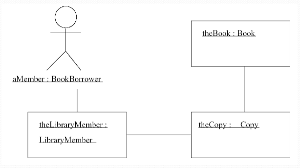

一种没有任何交互展示的协作，更像是类模型部分的一个实例。它展示了Object、Links 和 Actors 。

那么有交互的协作图是什么样的？

---

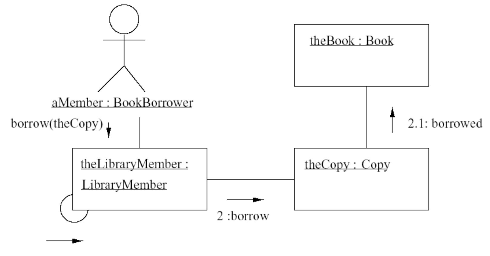

---

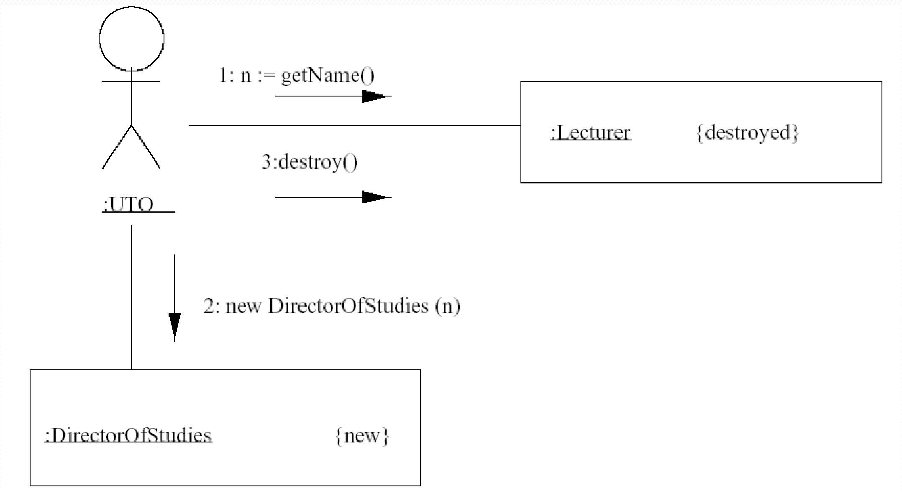

---


<a id="state_diagram"></a>

### [3.7] 状态图

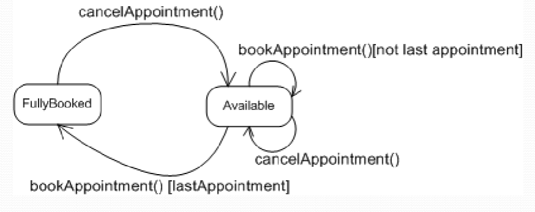

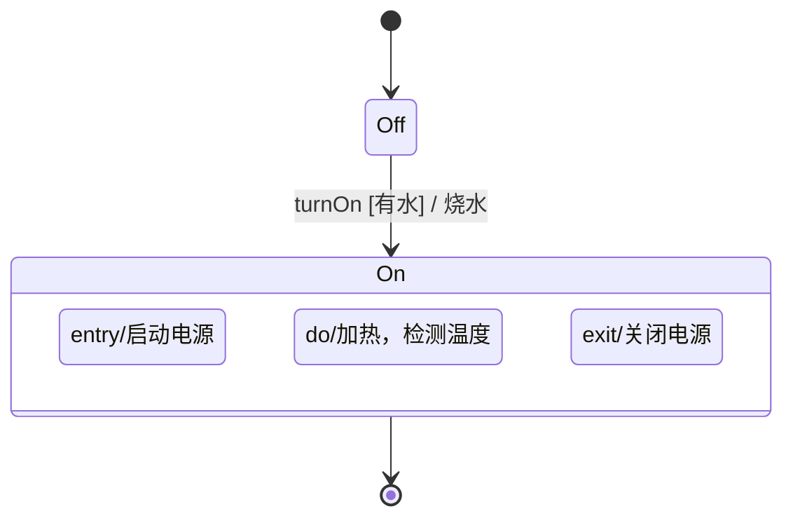
```mermaid
stateDiagram-v2
    %% 定义初始状态
    [*] --> Off

    %% 定义从 Off 到 On 的转移
    Off --> On: turnOn [有水] / 烧水

    %% 定义 On 状态及其内部活动
    state On {
        entry/启动电源
        do/加热，检测温度
        exit/关闭电源
    }

    %% 定义结束状态
    On --> [*]
```

**状态（States）**：用圆角矩形表示（如 `Off` 和 `On`）。

**转移（Transitions）**：连接状态的箭头。

**转移标签（Transition Label）**：格式通常为 `触发事件 [监护条件] / 动作`。

- 在本例中：`turnOn [有水] / 烧水`。
- 触发事件一般是一个外部指令或者系统内部事件，在这里，turnOn应该是外部指令，人区打开
- 监护条件指的是：在触发事件发生后，系统**必须满足**的boolean表达式，否则不允许触发
- 动作指的是：当满足跳转条件时，在状态切换瞬间所执行的一个原子操作。

**内部活动（Internal Activities）**：在状态框内定义的行为：

- **entry**: 进入该状态时立即执行一次。

- **do**: 处于该状态期间持续执行。

- **exit**: 退出该状态前执行一次。

  > 这个大框中，`On`是一个状态的名称。


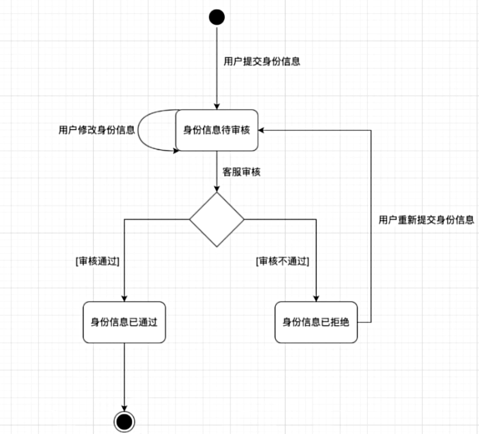


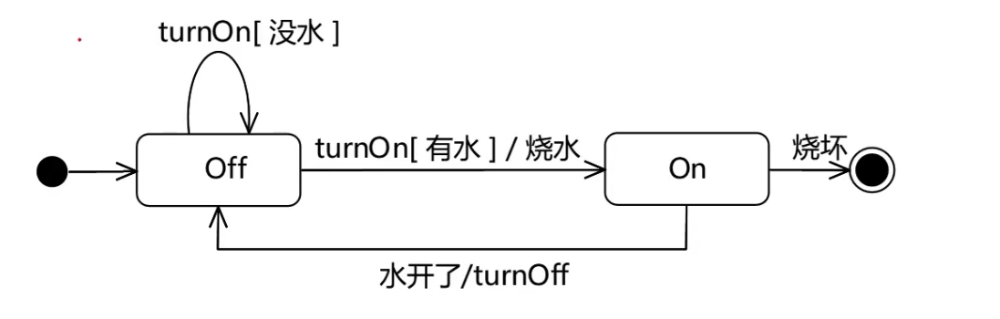

<a id="activity_diagram"></a>

#### [3.7.2] 活动图

活动图是为了方便而通过一些额外符号进行扩展的**状态图**。

活动图的元素包括：

- Activity 活动
- Transition 转换
- Synchronization bar 同步条
- Decision diamond 判定菱形
- Start/ Stop mark 开始/结束标记

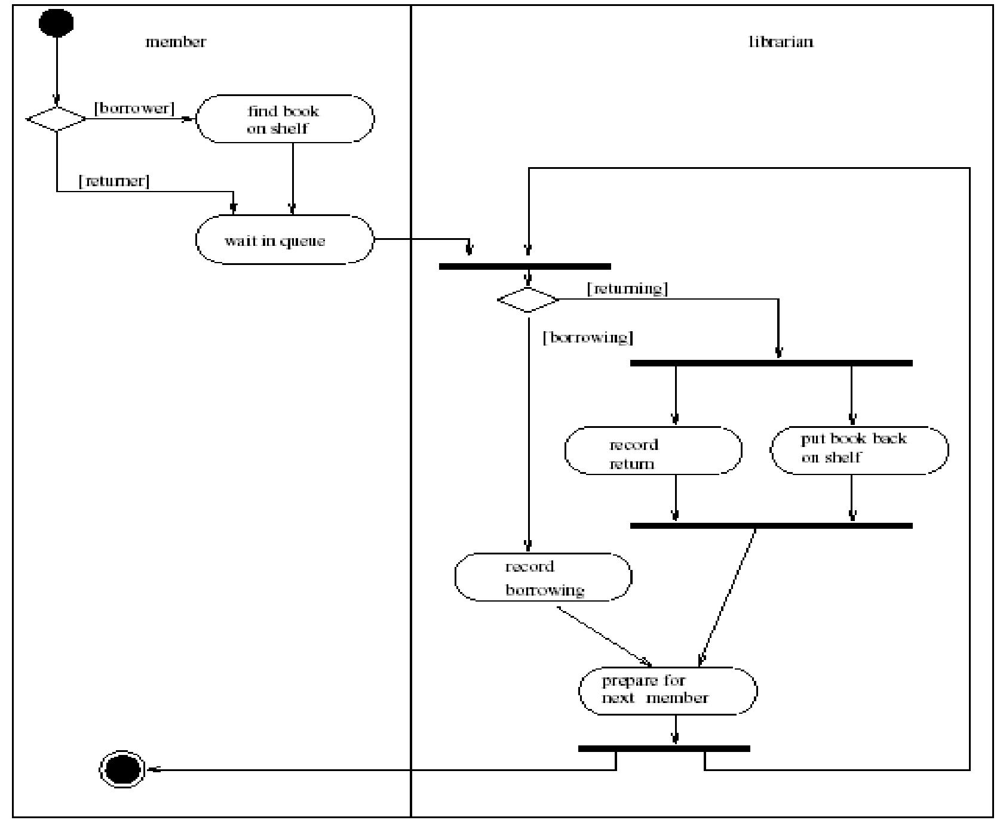


- 重要的地方是同步条。必须如果AB指向同步条，那么AB都需要完成后同步条才可触发。
- 同样的，同步条伸出的地方也是同步的。
- 菱形是条件判断的


我们可以看到活动图和状态图之间存在几个差异：

- 活动图通常不包含事件
- 活动应按照图表所描述的流程进行，不会陷入停滞
- 可以使用同步条符号对并发活动进行建模


## [4] 需求工程和软件规格说明

<a id="4_the_process_of_requirement_engineering"></a>

$\color{red}\bold{\text{===IMPORTANT===}}$

从**需求工程流程核心的角度看**，需求工程可以分为如下四个阶段：

1. 分析这个需求是否可行**（Executable）**，即[可行性研究](#6_2_1_feasibility_studies)（不行就和客户拉扯）
2. 需求获取与分析客户需求
3. 指定需求[**规格说明**](#3_1_what_is_specification)
4. 需求验证（给客户看）

> <a id="what_is_requirement_verification"></a>
>
> **什么是需求验证？（Requirement Validation）**
>
> 需求验证：拟定好了方案，这个方案能否满足需求呢？给客户看。

对于更广泛的需求工程，请查看[需求工程](#6_general_requirement_engeneering)章节

软件规格说明：确定软件需提供的服务有哪些，确定系统运行和开发的**约束**（你这个网页要有什么功能，然后什么功能不该有）。

## [5] 软件设计与模型

软件确定了规格说明之后，就可以根据**规格说明**以开始设计实现了！

> 核心目标：将系统规格说明转化为可执行系统，设计与实现交叉进行（设计-实现-设计-实现）。

如何进行软件设计?

1. 架构设计（Architecture Design）：架构师干的，把需求拆分多个模块。
2. 抽象规格设计：类似于设计抽象接口，制定约束和规范，但是能扩展。
3. 接口设计：明确接口无歧义，并规范文档。
4. 组件设计：给组件分配服务，设计组件接口（类似于集群（Cluster）中的每个机器运行什么任务，例如机器A运行QWen模型，机器B运行Bert模型等）。
5. 数据结构与算法设计：详细设计系统数据结构及组件服务所需算法，例如，服务访问过多，用负载均衡算法，k8s这些之类的。


软件设计方法有很多模型，这个以后会讲到。

常用软件设计模型：

- 数据流模型（数据在进程间流动）

  > Data-flow model (data flows between processes)

- 实体 - 关系 - 属性模型（数据库或类设计）

  > Entity-relation-attribute model (data base or class design)
  >
  > 这个模型属于**语义数据模型（Semantic Data Models）**的具体实现形式

- 结构模型（展示主要子系统）

  > Structural model (shows major sub-systems)

- 对象模型（含对象状态与行为）

  > Object models (objects have state and behaviour)

- 状态转换模型（展示系统状态及触发条件）

  > A state transition model showing system states and triggers

## [6] 编程、调试与测试

Programming, debugging and testing.

### [6.1] 编程与调试

任务：将设计转化为程序，去除程序错误。

编程特点：多为个人活动，无通用流程，但需遵循良好实践与组织标准；程序员会通过测试找错，再调试修复。

良好编程模式：迭代式，即写小段代码→测试→归档（如 git 或 svn 提交）→新增代码→重复测试与归档。

<a id="6_2_testing"></a>

### [6.2] 测试

流程：单元测试$\to$模块测试$\to$子系统测试$\to$系统测试$\to$验收测试（含组件集成测试、用户测试）。

各阶段重点：

- 单元测试：测试单个组件（面向对象编程时为类 / 方法级）。
- 模块测试：测试相互依赖的组件集合（OO编程时，与单元测试交叉，测试集成其他类的类）。
- 子系统测试：集成模块为子系统后测试，重点是接口（OO编程时，测试提供特定服务的类集合，如卡片支付、SMS 发送服务，常以包或 JAR 库形式存在）。
- 系统测试：测试整个系统，验证涌现性。
- 验收测试：用客户数据测试，确认系统是否可接受。


[测试计划](#test_planes)


# **Requirements analysis**

**软件需求分析**

> Week 2 [SE_L004 - SE_L006] Hotel booking Case study
>
> Week 3 [SE_L007 - SE_L009] 
>
> Week 4 [SE_L012]

为什么需要需求？实际上在[**规格说明**](#3_1_what_is_specification)处已经提到了。接下来进一步了解...

## [1] 需求构成

需求的例子：

1. 这个系统只支持`.png`格式
2. 客户希望增添刷卡功能
3. ...

**需求的构成分为三种**

1. 用户需求：

   ​	自然语言表述，外加系统所提供服务及其运行约束的图表。面向客户编写。

   ​	例如：我想添加一个刷微信的支付方式

2. 系统需求<a id="1_requirement_document"></a>

   ​	一份**结构化文档**，详细（且正式地）描述了系统要实现什么，类似于SAAS企业把用户的自然语言写成文档，以合同形式编写。 

   ​	例如：添加微信支付功能在主菜单界支付界面的最顶端，消费者通过...可以使用微信支付。（详细文档）

3. 软件规格说明

   ​	面向开发者的，可作为实现的基础。
   ​	例如：前端....后端...微信API之类的。（详细文档）

**需求必须是可测试的！**

需求不能够有歧义（特别是客户和开发者之间理解偏差），需求应当**完整且一致**。但是在实际操作中指定一个完整且一致的需求是很难的甚至不可能的。


那么这些需求的来源是哪儿呢？一般而言：

1. 复制/修改其他系统需求
2. 复制+修正历史遗留问题（Legacy Bug）
3. 研究竞争对手（Competitors）的做法并加以改进（抄袭）

<a id="2_functional_and_non_functional_requirement"></a>

## [2] 功能需求和非功能需求

<a id="2_functional_requirement"></a>

### [2.1] 功能需求

**功能需求（Functional Requirement）：**

- 示例：前端页面加一个找回密码按钮。

<a id="2_non_functional_requirement"></a>

### [2.2] 非功能需求

**非功能需求（Non-Functional Requirement）：**

- 示例：
  - 登录按钮点击后服务器必须在`50ms`内反应
  - 所有加密必须使用高级加密标准

- **产品需求**：规定交付产品的行为，如执行速度（“高峰时段用户信息请求响应时间 < 0.1 秒，正常时段 < 0.01 秒”）、可靠性、安全性。
- **组织需求**：源于组织政策流程，如指定开发工具（“用 Java 开发”）、遵循特定标准。
- **外部需求**：来自系统及开发过程之外，如互操作性（“网站需兼容 Chrome 128 及以上版本”）、合规性（“符合 FIPS 标准”）。

非功能性需求可能很难精确表述，而模糊的需求可能难以验证。


在复杂系统中，不同非功能需求之间的冲突很常见。哪个是最关键的需求？很难衡量！

1. 用户名/密码机制应便于用户使用
2. 所有密码都必须难以猜测，理想情况下还需要包含大小写字母和特殊符号，以确保高安全性。


## [3] 需求编写与核心要点

需求编写指南

- 统一格式：所有需求采用标准格式表述。
- 语言一致：用 “shall” 表示强制性需求（必须支持），“should” 表示期望性需求（非必需），参考 RFC 2119。
- 突出重点：用文本高亮标识需求关键部分。
- 规避术语：**避免使用计算机专业术语**，方便非技术人员理解。
- 文档自包含：包含术语表、完整示例等，确保独立性。

<a id="4_what_is_use_case_diagram"></a>

## [4] 用例图

Use Case Diagram

> ###### 返回：[Usee case 用例](#3_1_2_what_is_use_case)
>

ATM 机的用例图：

1. Bank Customer 能做三个事情（3个用例）
2. Bank Stuff 能做两个事情
3. Service Engineer 能做一个事情

图中一个圆圈代表一个用例。

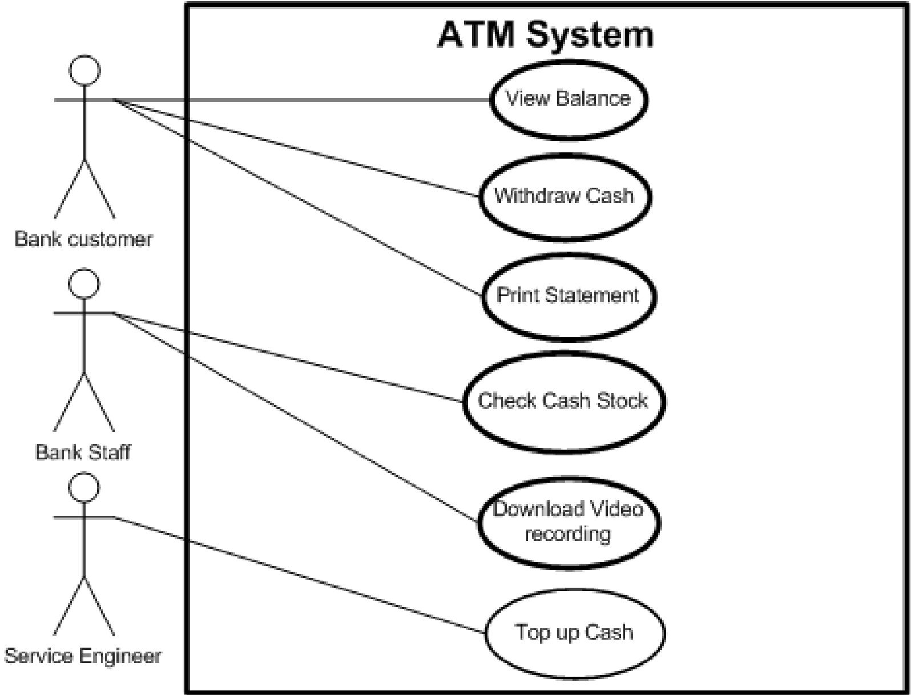

**继承（Inheritance）关系**：使用箭头，`Service Engineer` 继承 `Bank Staff`，类似于JAVA中的`extends`，代表 Service Engineer 比 Bank Stuff 还多了一些额外的功能权限。

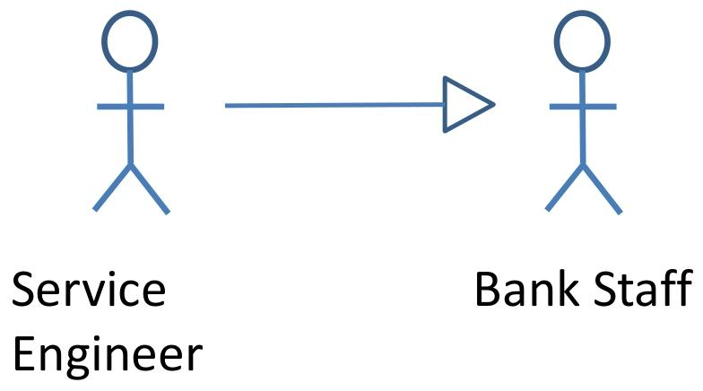

<a id="extends_and_include_in_use_case_diagram"></a>

### [4.1] 用例的扩展和包含关系

**Include (包含)**：表示“必须执行”。如果 A 包含 B，那么每当执行 A 时，B 也是其流程中不可或缺的一部分。

**Extend (扩展)**：表示“可选执行”或“异常情况”。只有在满足特定条件（扩展点）时，才会执行扩展用例。


用例可以**扩展（extends）**和**包含（include）**：

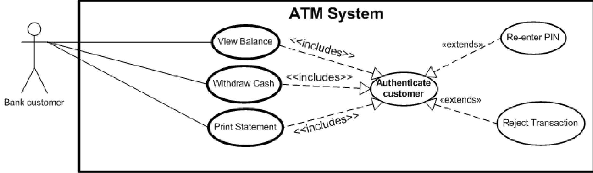

UML图中称 `extend` 为扩展而非继承。

例如`Authenticate Customer`这个用例：`Re-enter PIN` 和 `Reject Transaction` 这两个用例扩展了它，可以用它的功能，并且额外扩展自己的功能。

再对于`Authenticate Customer`这个用例：`View Balance`, `Withdraw Cash`, `Print Stataement` 这三个用例**包含了**它。

因此，`Authenticate Customer` 是被指向最多的，被用的最多的用例，是底层的基本用例。


### [4.2] 完整用例模板

| 字段              | 描述                                                         |
| ----------------- | ------------------------------------------------------------ |
| `ID`              | 短ID，对图表和参考有用，例如`ID=UC1`                         |
| `name`            | 名字，用例的全名，例如`name=Login`                           |
| `description`     | 这个字段的描述                                               |
| `pre-condiction`  | 前置条件，用例使用前必须满足的条件，例如：系统处于在线状态   |
| `event flow`      | 事件流，构成这个用例的流程，可能包含其他（包含、扩展关系的）用例。<br />例如：用户输入密码，如果凭证正确，则通过验证 |
| `post-condiction` | 后置条件，内部状态（变量这些）可能发生的条件。<br />例如：连续输3次错误密码把`FORBIDDEN_LOGIN`写成`TRUE`。 |
| `includes`        | 包含的用例（如果有）                                         |
| `extensions`      | 扩展的用例（如果有）                                         |
| `triggers`        | 触发条件，什么促使这个用例触发。                             |


## [5] 需求示例

例如现在要构建一个酒店系统，那么根据需求先列出**边界（Boundary）**图

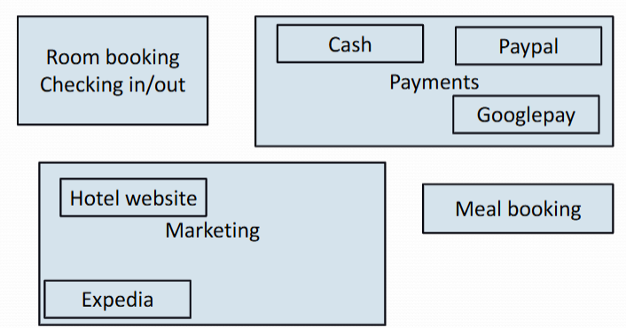

例如我们可以定义一个`Marketing`接口或者类，让子类实现或继承。

**[利益相关者（Stakeholders）](#6_1_2_about_stakeholders)**是：接待员、老板、清洁工、客人、管理等等

非人类参与者：Paypal，网站等

[非功能性需求](#2_non_functional_requirement)：这个系统兼容Safari，系统相应<500ms等

这个边界是重要的，有助于我们知道：这个系统什么东西需要，什么不需要，这和[规格说明(Specification)](#3_1_what_is_specification)很相似


<a id="5_use_case_example"></a>

### [5.1] 用例示例

> **返回：[Usee case 用例](#3_1_2_what_is_use_case)#3_1_2_what_is_use_case)**

其中，酒店系统的**用例（Use case）**示例如下

| 类别       | 内容                                                         |
| ---------- | ------------------------------------------------------------ |
| 参与者列表 | 任意用户和外部电子邮件服务                                   |
| **编号**   | UC1                                                          |
| 名称       | 用户注册                                                     |
| 描述       | 允许用户创建一个新账户                                       |
| 前置条件   | 系统必须处于运行状态，且电子邮件服务正常工作                 |
| 事件流     | 1. 用户输入其电子邮件地址、拟用用户名和角色（客人、接待员、经理、清洁工等），角色可能在网页中是固定的，用户还需输入密码。<br>2. 如果电子邮件无效，显示错误信息，然后返回步骤1。<br>3. 如果用户名已被使用，或者密码不符合非功能需求NFR5，显示错误信息并返回步骤1。<br>4. 对于新的客人账户，不需要权限；如果申请其他类型的账户，用户必须以系统管理员身份登录。<br>5. 用户查看其电子邮件收件箱并点击收到的链接，这会打开浏览器窗口，确认用户拥有该电子邮件。<br>6. 然后用户被引导至登录窗口。 |
| 后置条件   | 新用户的账户已创建                                           |
| 包含       | 无                                                           |
| 扩展       | 无                                                           |
| 触发条件   | 用户按下/点击了注册按钮                                      |


| 参与者列表 | 任意用户                                                     |
| ---------- | ------------------------------------------------------------ |
| 编号       | UC2                                                          |
| 名称       | 用户登录                                                     |
| 描述       | 允许用户登录                                                 |
| 前置条件   | 系统必须处于运行状态                                         |
| 事件流     | 1. 用户输入其用户名并输入密码。<br>2. 如果信息不正确，用户会被带回步骤1。<br>3. 根据角色，用户会被引导至主页，如客人主页、接待员主页、经理主页。 |
| 后置条件   | 如果错误密码输入5次，账户会被锁定；如果用户名和密码正确，那么用户状态为“已登录” |
| 包含       | 无                                                           |
| 扩展       | 无                                                           |
| 触发条件   | 用户按下/点击了登录按钮，或者尝试执行需要认证且当前处于登出状态的操作 |


## [6] 需求工程

需求工程首先必须要有需求。我们知道需求会被整理为[**文档**](#1_requirement_document)、[**规格说明（specification）**](#3_1_what_is_specification)等，但是需求从哪儿来？

一、访谈（Interviewing）

1. 在正式或非正式的访谈中，需求工程团队会向**利益相关者（Stakeholders）**询问他们正在使用的系统以及将要开发的系统相关问题有哪些
2. 访谈有两种类型
   1. 封闭式访问（Closed Interview）：即回答一套预先设定好的问题。
   2. 开放式访谈（Open Interview）：即没有预先设定的问题和议程（Agenda），需求工程团队会与利益相关者探讨一系列问题。
3. 理想情况下，面试官（需求工程团队）应该思想开放，愿意倾听利益相关者的意见（因为客户才是第一的），并且不应有先入为主的想法（Preconceived ideas）。

### [6.1] 两种视角下的需求工程

#### [6.1.1] 流程执行核心视角

> 在 [Introduction [4]](#4_the_process_of_requirement_engineering)中提及，需求工程的过程包含以下四个步骤，但是是从**需求工程 流程执行的核心来看**
>
> 需求工程流程（四个阶段）：
>
> 1. 分析这个需求是否可行**（Executable）**，或者叫[可行性研究](#6_2_1_feasibility_studies)（不行就和客户拉扯）
> 2. 需求获取与分析客户需求
> 3. 指定需求[**规格说明**](#3_1_what_is_specification)
> 4. [需求验证（Requirement validation）](#what_is_requirement_verification)
>
> 制定软件工程流程这一阶段的目标是**帮助创建和维护系统需求文档（例如维护客户需求）**。

#### [6.1.2] 更普遍经典视角的需求工程

需求工程在不同行业中，流程（Process）差异很大。例如桥梁工程和软件工程，他们都需要需求工程。=

但是因为差异大，我们求同存异，找出一些共同点进行探讨。因此，我们从**需求工程的经典活动模块** 重新拆解需求工程流程：

<a id="6_general_requirement_engeneering"></a>

**经典活动视角下的需求工程：**

1. 需求获取（Requirements elicitation）：最终需要哪些需求？

2. 需求分析（Requirements analysis）：如何对需求进行分类、**排序（重要优先级）**和协商需求（如果有需求不可行...）？

   > 比如 敏捷开发框架中的 [Scrum](#priorities_the_requirement_in_scrum) 增量 中就有对需求排序的。

3. **[需求验证（Requirement validation）](#what_is_requirement_verification)**：拟定好了方案，这个方案能否满足需求呢？

4. 需求管理（Requirement Management）：类似于运维，增删改查这个需求文档。


<a id="6_1_2_requirement_elicitation_and_analysis"></a>

第1、2点中**需求获取（elicitation）、需求分析**（analysis/ discovery）：

> 需求分析也叫需求**发现**

1. **领域理解（Domain Understanding）**：是技术员与客户的交谈，让双方了解应用领域（Application Domain）、系统应提供的服务、系统运行约束。

   - 比如通过[**民族志**](#8_what_is_ethnography)（Ethnography）深入观察用户实际工作场景，理解业务领域的真实情况，这也属于领域理解的一部分。

2. 涉及终端用户、管理人、运维人...这些人是**利益相关者（Stakeholders）**

3. 需求收集和分类：需求发现简而言之就是：收集关于**拟议系统（Proposed system）**和**现有系统**信息，并从这些信息中**提取（Distilling）**用户**需求**和系统**需求**的过程。结构化这些需求，对需求优先排序（参考 [Scrum](#priorities_the_requirement_in_scrum)）

4. 很显然，需求获取、需求分析阶段是一个迭代过程（Iterative process）。

   > 什么是拟议系统？就是希望达成的目标的、理想的系统是什么样的。
   >
   > 这里提到的**信息**包括：
   >
   > 1. 文档（此处应当指代系统需求[**文档**](#1_requirement_document)）
   > 2. 系统利益相关者（stakeholders）
   > 3. 系统[**规格说明（specification）**](#3_1_what_is_specification)

> [!NOTE]
>
> <a id="6_1_2_about_stakeholders"></a>
>
> 关于利益相关者：
>
> 1. 他们不知道他们真正想要什么
> 2. 他们会用**自己的语言**表述需求
> 3. 不同利益相关者的需求可能会冲突
> 4. 需求分析（analysis/ discovery）过程中的利益相关者可能会改变

### [6.2] 可行性研究和可行性报告

Feasibility Studies/ Feasibility Report

<a id="6_2_1_feasibility_studies"></a>

#### [6.2.1] 可行性研究

Feasibility Studies

可行性研究也即：分析这个系统是否值得开发。这个研究主要研究的是：

1. 这个系统是否有助于实现某个目标
2. 这个系统是否可以在现有技术（current technology）下研究，且在**预算范围内（这个挺重要的）**
3. 这个系统是否能与正在使用的其它系统集成（Can integrate with other system？）
4. 有没有更简单的方法来做（实现）这件事


比如： 我希望能开发一种真空管道交通，连接北上广深，真空管道埋藏于地下，因为无空阻，所以和飞机一样快，人坐在类似胶囊的移动工具里。我希望实现的目标是实现交通分流。预算1个亿

可行性研究如下：

1. 这个系统是否有助于实现某个目标？确实可以，用于交通分流。
2. 这个系统是否可以在现有技术（current technology）下研究？不行，真空管道难度技术大
3. 预算范围内？不行，1个亿资金不足。
4. 这个系统是否能与正在使用的其它系统集成？不行，很难连接传统交通枢纽，例如接入地铁高铁难度大，甚至可能和地铁冲突（地下）
5. 有更简单的方法实现这个事情（交通分流）吗？有，例如重规划道路，更多轻轨和高铁交通等等，或者扩展高速车道等。

综上，这个方案不太可行。

#### [6.2.2] 可行性报告

Feasibility Report

可行性报告和可行性研究类似，可行性报告（Report）注重以下4个方面

1. 技术可行性（Technical Feasibility）
2. 经济可行性（Economic Feasibility）
3. 法律可行性（Legal feasibility）
4. 进度可行性（Scheduling feasibility）

其中1、2点和Studies的第二点完全一样。因此同样用真空管道交通举例子。

3. 法律可行性：不太可行，涉及到土地权的问题，可以参考地铁。
4. 进度可行性：不太可行，竣工周期长。


## [7] Viewpoints 构建需求

viewpoints可以翻译为视角、观点。


什么是 Viewpoints？

1. **Viewpoints是一种构建需求的方式**，以体现不同**利益相关者（stakeholders）**的观点。通过Viewpoints，把他们的观点进行分类。

   > 当然这些分类可能是互斥的

2. 这种多视角分析（Milti-perspective analysis）的方法很重要：因为系统分析需求没有唯一正确的方法。


如何识别 Viewpoints呢？可以通过以下几个方面！

- 系统服务的**提供者（Providers）**与**接收者（Receivers）**

  > 一般而言，提供者是企业，接收者是客户。

- 与被指定系统直接交互的其他系统；

  > 看有哪些其他系统会和要开发的系统直接互动。比如去年的项目是 长安汽车客户舆情，那么今年的项目是电动车客户舆情，那么今年开发的系统，十有八九会和去年的系统互动：数据库这些。

- 相关的法规（Regulations）与标准（Standards）；

  > 看项目遵循哪些法规、符合什么**标准**。

- 业务（Business）需求和[非功能需求](#2_non_functional_requirement)的来源；

  > 看业务需求（比如赚钱、拓展业务）和非功能需求（比如系统要稳定、响应快）从哪来。

- 必须开发和维护系统的工程师；

- 营销（Marketing）以及其他业务视角。


<a id="8_what_is_ethnography"></a>

## [8] Ethnography

Ethnography 准确翻译为：民族志

软件工程需求分析中，民族志起着重要作用：

1. 挖掘**潜在需求（Potential ）**：通过观察实际，无需人们刻意解释或阐述工作内容。

民族志的范围：

- **从实际工作方式中提取需求**：也即根据经验提取。例如空中交通管制员可能会关闭冲突警报，因为他们能提前让飞机错开，警报反而会干扰工作。
- **从协作与对他人活动的认知中提取需求**：比如空管员会通过了解同事的工作情况，预测进入自己扇区的飞机数量，进而需要相邻扇区的可见性。


## [9] Security 安全

**安全分为四个主要问题**

### [9.1] 四个安全问题

1. **保密性（Confidentiality）**
   - 加密 Encryption（硬安全 Hard security）
   - 权限 Permission （软安全 Soft security）
   - 数据必须在储存和在有线、无线链路上保持安全 
2. **完整性（Integrity）**
   - 数据不得被恶意篡改（Data must not be maliciously tampered with）
   - 可以使用CRC校验（CRC-Checking），但是效果不好校验值（Check value）会被伪造（forge），哈希也存在这个问题。
   - 可以使用哈希值+秘密值（Hash value + Secret value）
     - 涉及到密钥分配问题（Key distribution problem）
   - 可以使用非对称密码加密的哈希值（Hash value encrypted using asymmetric cipher）
     - 这是迄今为止最好的方法！
   
   <a id="authentication_and_authorization"></a>
   
3. **认证/鉴权（Authentication）、授权（Authorization）**
   
   - ==认证/鉴权：告诉我你是谁？你的身份是什么？**Authentication = Identity！！**==
   - ==授权：你被允许做什么？**Authorization = Allowed to do what？**==
   - 通常认证鉴权和授权是攻击重点
4. **不可否认性（Non-repudiation）**
   - PPT 里讲的不可否认性，核心是**防止用户 / 实体做完操作后否认自己曾做过该操作**
   - 比如文档中举的例子：Bob 给经纪人发 “买大量股票” 的指令，事后却否认发过这封邮件，不可否认性就是要避免这种情况。
   - 有什么办法可以避免这种情况呢？
     - 可能需要第三方（Third party）例如可信经纪人（Trusted broker）
     - 需要建立在如下基础：
     - 认证、完整性、记录和时间戳、经纪商式服务（Broker style services）

### [9.2] 可用性

**安全包含一个辅助问题：**可用性Availability（性能安全 Performance Security）

#### [9.2.1] 9s 术语

“几个 9” 是行业里约定俗成的方式，用 “9” 的数量来表示系统**正常运行时间（Uptime）\**的比例，同时也能算出每年的\**最大停机时间（Maximum Downtime per Year）**：

- **Six nines（六个 9）**：系统正常运行时间比例达 99.9999%，意味着每年最多只能停机 31.5 秒。
- **Five nines（五个 9）**：正常运行时间 99.999%，每年最多停机约 5 分 35 秒。
- **Four nines（四个 9）**：正常运行时间 99.99%，每年最多停机约 52 分 33 秒。
- **Three nines（三个 9）**：正常运行时间 99.9%，每年最多停机约 8 小时 46 分。
- **Two nines（两个 9）**：正常运行时间 99.0%，每年最多停机约 87 小时 36 分。
- **One nine（一个 9）**：正常运行时间 90.0%，每年最多停机约 36 天 12 小时。


9s 术语并非总是有用

单纯用 “几个 9”（比如 “三个 9”“五个 9”）描述系统可用性，有时不能精准反映实际使用中用户感受到的系统表现，因为停机时间的**分布方式（Distribution pattern）**会影响用户体验：

- 例子 1：“三个 9” 的可用性（意味着系统全年停机约 8 小时 46 分），但如果是**每天停机 78 秒**，用户可能每天都能感知到系统短暂故障，体验很差。
- 例子 2：“五个 9” 的可用性（意味着系统全年停机约 5 分 35 秒），但如果是**每 10 年一次、一次停机 50 分钟**，虽然全年停机时间符合 “五个 9”，但单次长时间停机可能对业务造成重大影响（比如关键交易时段系统故障）。


所以，要更精准地定义可用性，理想情况下需要明确：

- **最坏场景（Worst case scenarios）**：系统可能遇到的最极端故障情况是怎样的。
- **最坏延迟与停机时间（Worst case delay as well as down time）**：不仅要考虑总停机时间，还要考虑故障时的延迟（比如请求响应变慢），以及单次最长停机时间等。
- **系统如何优雅降级（How the system can degrade gracefully）**：当系统无法全功能运行时，如何以 “降级” 的方式继续提供核心服务（比如电商系统故障时，至少能保证用户查看订单、支付等核心功能可用）。


### [9.3] 安全、日志和警报

Security、logs and alerts

系统安全如何通过各类日志记录与警报机制来保障安全稳定？具体如下：

#### [9.3.1] 各类日志的作用

- **标准日志（Standard log）**：记录所有登录/登出行为、数据库访问请求。比如谁什么时候登录了系统、谁请求访问了数据库里的哪些数据，都靠它记录。
- **登录失败日志（Failed login log）**：记录所有登录失败的情况。要是有人多次输错密码尝试登录，这里会有记录，方便排查是否有恶意登录尝试。
- **异常活动日志（Unusual activity log）**：记录账户上的大额交易等异常活动。比如某账户突然进行远超平常额度的交易，就会被记到这里。
- **警报日志（Alert log）**：记录高权限用户的登录失败情况。高权限用户（比如管理员）的登录失败可能更敏感，需要特别关注。

#### [9.3.2] 警报的作用

异常活动可以用来提醒操作人员，或者暂停账户等。比如系统通过异常活动日志发现某账户有可疑大额交易，就会触发警报，操作人员能及时处理，甚至直接暂停该账户，防止风险扩大。

<a id="bell_lapadula"></a>

### [9.4] Bell-LaPadula 模型

**贝尔 - 拉帕杜拉模型（Bell - LaPadula model）**，它是用于保障**系统机密性（System confidentiality）**的经典安全模型，核心内容如下


#### [9.4.1] 安全等级划分

所有项目（比如文档、数据等）都被赋予安全 clearance 级别，具体分为：

- Top - Secret（绝密，级别 4）；
- Secret（秘密，级别 3）；
- Sensitive（敏感，级别 2）；
- Unclassified（非机密，无特定级别或级别最低）。


#### [9.4.2] 两个规则


**一、no read - up（禁止上读）规则**

主体（可以理解为用户、进程等）不能读取安全级别高于自身 clearance 级别的文档。

- 举例：如果你的 clearance 级别是 2（Sensitive），就不能读取级别 3（Secret）或 4（Top - Secret）的文档。

  > **Clearance 翻译为：安全许可级别**

**二、no write - down（禁止下写）规则**

一个文档不能被复制或包含到安全级别更低的其他文档中。

- 举例 1：如果想把绝密（Top - Secret）内容添加到敏感（Sensitive）文档里，最终生成的文档安全级别会是绝密（Top - Secret）。
- 举例 2：如果你的 clearance 级别是 2（Sensitive），不能生成非机密（Unclassified）级别的文档。
- 此外：

  - **可信主体（Trusted Subject）** 可以违反 **no write - down（禁止下写）规则**！

  - 但必须被证明在安全策略方面是**可信的（Trustworthy）**，也就是要经过严格验证，确保不会滥用这种权限。


### [9.5] 安全设计

系统的安全设计应当**保持开放性**。因为旧的加密算法可能过时，因此，如果要替换成新的加密算法，那么保持开放就是很重要的！

```java
private -> public
```


安全策略（Security Policy）方面，设计公司必须：

1. **文档粉碎（Shredding Documents）**：通过粉碎机粉碎必要文件。
2. **安全处置（Secure Disposal）**：比如U盘和硬盘需要以安全方式处理避免公司数据泄露。
3. **密码重置协议（Password Reset Protocol）**：明确用户忘记密码时的重置流程，既要保证合法用户能顺利重置，又要防止他人冒用身份重置密码。
4. **安全培训（Security Training）**：对员工进行安全意识和技能培训。
5. **安全审计（Security Audits）**：定期检查系统的安全措施是否有效，排查潜在漏洞，确保安全策略被严格执行。
6. 一定的**标准合规（Standard compliance）**：例如，**支付卡行业数据安全标准（Payment Card Industry Data Security Standard，PCI DSS）**。


## [10] 需求检查

Requirements Checking

需求检查是验证需求是否合理、可行的关键环节，主要从 5 个维度展开：

- **有效性（Validity）**：系统提供的功能，能不能满足客户需求？
- **一致性（Consistency）**：客户的需求，有没有互相冲突的地方？
- **完整性（Completeness）**：这个系统是否涵盖了**所有的**客户需求？
- **现实性（Realism）**：钱（预算 Budget）够不够做这些需求？
- **可验证性（Verifiability）**：需求怎么测试能不能用？需要**[测试用例（见如下注释）](#10_testcase)**。


> **一种测试用例：**<a id="10_testcase"></a>
>
> **Scenario 场景** 可以理解为 “特定情境下的**测试用例**”。
>
> - **示例**：
>   - 用被盗信用卡尝试取现；
>   - 取款时机器现金库存不足；
>   - 用卡号 3456123245677 取现等。
> - **重要性**：
>   - 通过示例向开发者展示 “特定条件下系统会发生什么”；
>   - 可作为测试软件的基础；
>   - 让需求更清晰，减少歧义。


## [11] 敏捷需求工具 Cucumber 的应用

<a id="agile_development_tool_cucumber"></a>

Cucumber 是一款用于**敏捷开发**的**用户故事工具**，核心作用是帮助编写需求（这个需求可以直接关联测试！）。

它通过一种叫**Gherkin**的语言来描述系统功能，结构清晰且贴近业务场景：

> Gherkin 和 Cucumber 都是黄瓜，其中 Gherkin 一种用来腌制的小黄瓜

- **Feature（功能）**：描述一个业务功能的目标。例如 “Login（登录）” 功能，用自然语言说明：“为了证明我是谁，作为客户，我希望能登录系统”。这部分是给开发者传递功能意图，不参与代码解析。
- **Scenario（场景）**：是功能的具体测试用例。例如 “用测试账户 account1 登录” 的场景，遵循 **“Given（前提）- When（动作）- Then（结果）”** 的结构：
  - Given：我输入用户名 `account1`，且输入密码 `pass1234`；
  - When：我点击登录；
  - Then：结果应该是登录成功。


Cucumber 的场景会和 **测试代码（这里以 Java 为例）** 紧密关联，通过注解（`@Given`、`@When`、`@Then`等）将 Gherkin 的自然语言步骤映射到代码逻辑。

> Gherkin 语法使用五个不可或缺的语句来描述执行任务所需的操作：
>
> - 功能(`Feature`)：表示任何给定软件功能的高层次描述
> - 场景(`Scenario`)：描述具体示例
> - 假如(`Given`)：解释系统的初始上下文
> - 当(`When`)：指定事件或操作
> - 则(`Then`)：描述预期输出或结果
> - 而且(`And`)（或者 但是(`But`)）：增加文本流畅性
>
> 这些关键字可以使用任何语言
>
> 通过使用这些简单的关键字，客户、分析师、测试人员和软件程序员能够使用所有人都能识别的术语来交换想法。


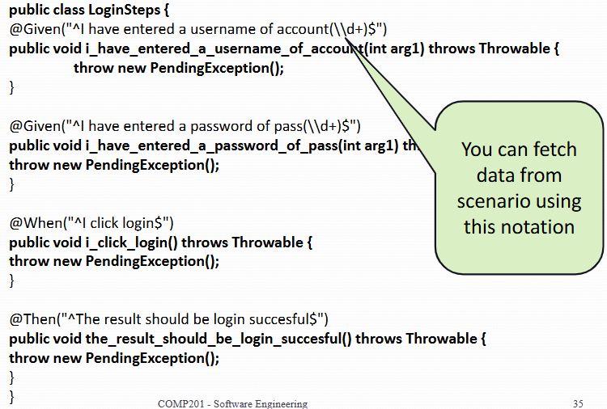


## [12] 重点

- 需求工程包括：[可行性研究、需求获取与分析、规格说明、需求管理](#4_the_process_of_requirement_engineering)。
- [**需求获取与分析阶段**是一个迭代过程，涉及领域理解、需求收集、分类、结构化、优先级排序和验证](#6_1_2_requirement_elicitation_and_analysis)。

- 系统有多个具有不同需求的**[利益相关者（Stakeholders）](#6_1_2_about_stakeholders)**
- 大多数系统的**安全性（Security）**是一项核心服务


## [13] 系统模型

> `SE_L009.pdf`

系统模型是对正处于需求分析阶段的系统的抽象描述，是需求工程（RE）过程的关键环节。其核心定位体现在两方面：**用户需求** + **系统需求**。

- **用户需求的表达**：用户需求必须以通俗的话讲。例如使用自然语言 $——$ 这是为了确保**非技术角色**能清晰表达需求
- **系统需求的表达**：详细的系统需求可以用更技术化的方式呈现。
  - 其中一种广泛使用的技术是将系统[**规格说明**](#3_1_what_is_specification)记录为**一组系统模型**。
  - 这些是描述**业务流程（Business Processes）**和待开发系统的**图形化表示（Graphical representations）**。
  - 它们是**分析过程（Analysis Process）**和**设计过程（Design Process）**之间的重要桥梁


---

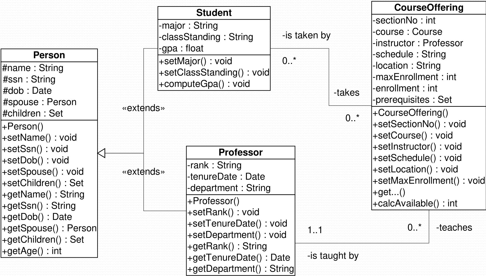

这是**[UML](#what_is_UML) 中的类图（Class Diagram）**，属于**对象模型**的一种，是系统建模中用于展示系统静态结构的重要工具。

---

### [13.1] 系统模型的优势

- 与冗长的自然语言描述相比，它们更容易理解（一图胜千言！**但也不一定！例如第四条劣势**）

- 系统模型可以省略系统中不必要的细节，这样我们就可以专注于重要的内容。
  - **系统表示（System representation）**应保留系统的**所有信息**（这句话是绝对的）。 
  - Abstraction （抽象） 会刻意简化系统，并提炼出其最显著的特征（如上图）。

不同的模型可以侧重于不同的抽象方法，例如上图侧重于对象的方法（JAVA）。

### [13.2] 系统模型的劣势

- 它们没有对**[非功能性系统需求](#2_non_functional_requirement)**进行建模
- 它们通常不包含关于某种方法是否适合特定问题的信息
- 它们可能会生成过多的文档
- 系统模型有时**过于详细**，用户难以理解


<a id="system_models"></a>

### [13.3] 有哪些系统模型

- 行为模型（Behavioural Model）：行为模型用于描述系统的整体行为。有两个子模型
  - 数据处理模型（Data Processing Model）：展示数据在不同阶段的处理方式
  - 状态机模型（State Machine Model）：展示系统对事件的响应
- 组合模型（Composition Model）：展示实体如何由其他实体组成
- **架构模型（Architectural Model）：展示主要的子系统**
- 分类模型（Classification Model）：展示实体如何具有共同特征
- 刺激/响应模型（Stimulus/ Response Model）：展示系统对事件的反应
- 语境模型（Context Model）：语境模型用于说明（Illustrate，划定边界）系统的边界。


**架构模型（Architectural Model）**

比如ATM机的系统架构模型：

主要是划定边界，具体有哪些板块，但是**不是详细的**。

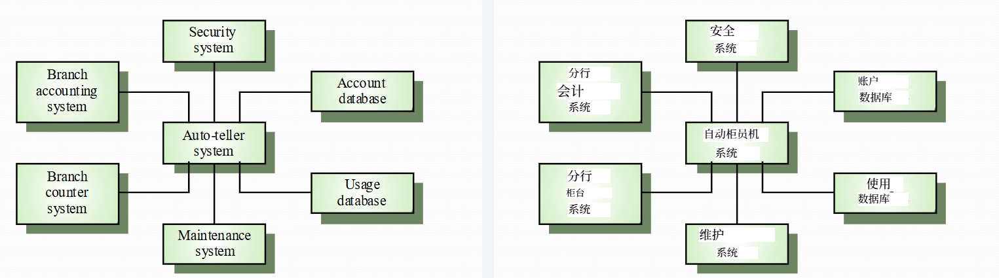


**行为模型**（Behavioural Model）

行为模型（Behavioural Model）：行为模型用于描述系统的整体行为。有两个子模型

- 数据处理模型（Data Processing Model）：展示数据在不同阶段的处理方式
- 状态机模型（State Machine Model）：展示系统对事件的响应

简单**直观的符号表示法（Intuitive Notation）**、展示数据的**端到端（End-to-End）**处理


### [13.4] DFD - 数据流程图

DFD - Data Flow Diagram 数据流程图

开发数据流图通常是一个**自顶向下的过程（Top-down Process）**

> 自顶向下何意味？
>
> 也就是：在考虑子流程之前，我们首先对想要建模的整体流程进行评估。从大的到小的。

DFD图的每一个转换（或者说箭头）都代表一个单一的功能或者过程，这是端到端的：


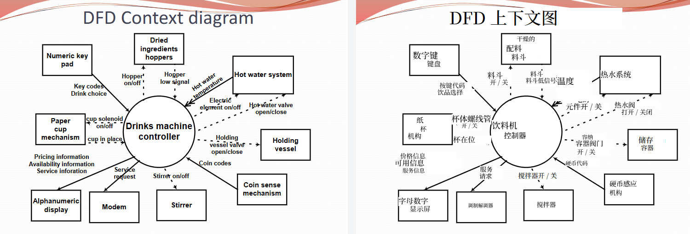


### [13.5] 状态图

状态图：Statechart Diagram 

也叫：State machine model（状态机模型）

什么是状态图？

- 状态图是用来展示**系统在遇到内部或外部事件时的行为变化**。

- 比如家里的微波炉，“用户按‘开始键’（外部事件）” 会让微波炉从 “待机状态” 变成 “加热状态”，这个过程就能用状态图画出来。

- 它特别适合两类场景：

  - 一是 “**嵌入式系统（Embedded System）**”（比如汽车的自动刹车系统、智能手表的功能模块）
  - 二是 “**数据通信软件（Data Communication APP）**”（比如手机和基站之间的信号传输软件）。
  - 另外，因为它能清晰体现 “收到刺激（事件）后做什么（动作）” 的逻辑（也就是文中说的 “**事件 - 动作范式**”），所以也常用在 “实时系统” 里 —— 比如工厂的流水线传感器，一旦检测到 “零件位置偏移”（事件），就会立刻触发 “流水线暂停”（动作），这种**实时响应（Real-time Systems）**的场景用状态图建模很直观。

  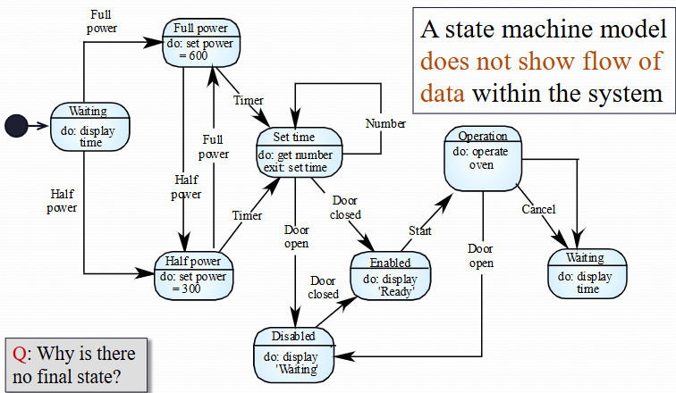

  > 图中没有 “最终状态”（带圆环的实心圆），原因是这个系统是 “持续运行” 的，没有明确的 “流程结束点”。比如微波炉在完成一次加热后，会回到 “Waiting” 状态等待下一次操作，不会完全停止运行，所以不需要最终状态。
  >
  > 状态机模型不展示系统内部的**数据流转（Data flow）**。在图上你也没有看到内部的数据流转！

- 至于它的基础画法：状态图里，**系统的每个 “状态 State”（比如微波炉的 “待机”“加热”“暂停”）用 “节点”（类似小圆圈或方框）表示**，而触发状态变化的 **“事件 Events”（**比如 “按开始键”“按取消键”）用 “连接节点的线（弧）” 表示。只要事件发生，系统就会从当前状态顺着线 “跳” 到下一个状态，比如 “按取消键” 会让微波炉从 “加热状态” 跳回 “待机状态”。

- 状态图是 UML（统一建模语言）里的重要组成部分 —— 也就是说，它是行业通用的画图标准，不管谁画，只要遵循这个规则，别人都能看懂。

  > 回顾：用例图是 UML 的一种图类型。
  >
  > **[Use case 的定义](#3_1_2_what_is_use_case)**
  >
  > **[Use case diagram](#4_what_is_use_case_diagram)**
  >
  > ###### **[Use case 例子](#5_use_case_example)**
  
- 状态图一般存在一个**空闲状态（Idle State）**，在这个状态下不活跃

- 所有状态都需要某种退出方式（即使在错误情况下也不会出现死锁）


此外，状态图还允许把模型分解为**子模型（Sub-models）**

每个状态中**`Do`（做了什么）**之后都包含对动作的简要描述（`Do`一词为可选）。

微波炉状态图：

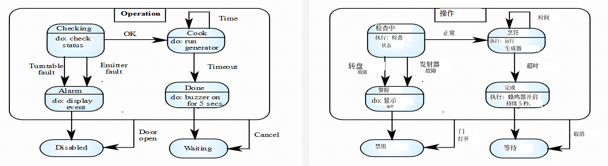


一个状态可以包含一个**子图**，也称为**复合状态（Composite state）**。例如，当我们希望对一个子系统或子状态进行建模时，这会很有用。比如打印机可以有运行、维护俩图：

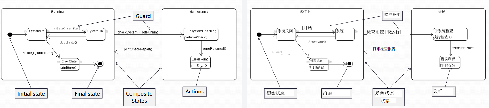


**操作 (Actions)**

在事件的`/`后添加动作：

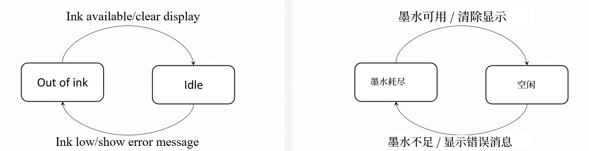


<a id="13_6_finite_state_machine"></a>>

### [13.6] 有限状态机

**FSM - Finite State Machine** 

有限状态机就像给系统定了一套 “行为规矩”—— 从哪个状态起步，遇到内 / 外部事件时，要满足什么条件才能变状态，变状态时要做什么动作，全程都按这套规矩来，而且系统的状态数量是有限的（比如自动门只有 “关闭、打开、正在开门、正在关门” 这几个有限状态

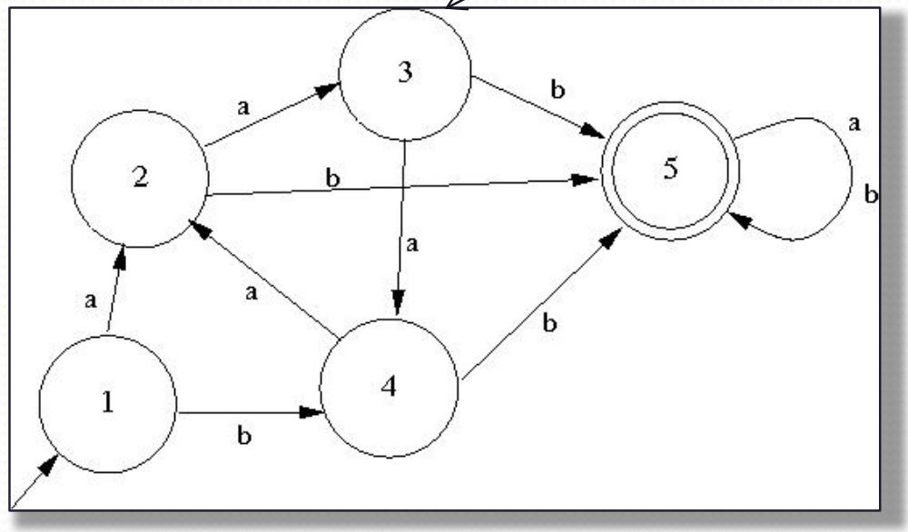

有限状态机是描述**系统状态变化（System State Changes）**的计算模型

| 部分 Component                  | 解释                                     |
| ------------------------------- | ---------------------------------------- |
| 初始状态（Start state）         | 系统启动后的默认状态                     |
| 转换函数（Transition function） | 核心规则：当前状态 + 输入信号 = 新状态   |
| 输入字母表（Input alphabet）    | 所有能触发状态变化的信号集合             |
| 状态集（a set of states）       | 系统所有可能的状态，每个状态都有对应行为 |

#### [13.6.1] FSM预测试的应用

FSM Predictive Test

这个FSM能够识别 `ALP`、`ALPINE`和`ALLIGATOR`，从当前路径到其他路径，可以看作是一个单词的建议或者预测！

有点像是数据结构里面的 **Trie**（字典树）。

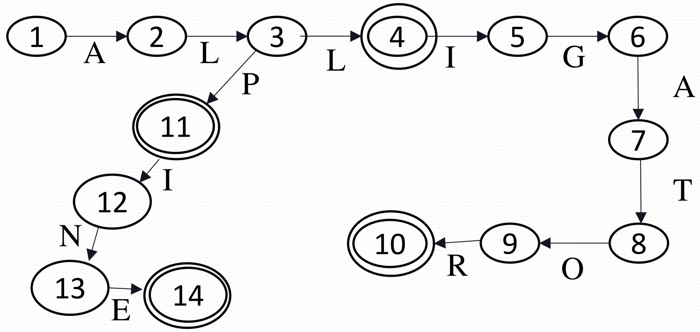


**FSM 关键变体：带输出的状态机（Mealy 机与 Moore 机）**

#### [13.6.2] 带输出的状态机 Mealy Moore Machine

> 传统 FSM 的核心功能是 “语言识别”，可以理解为 “判断输入的字符串是否符合某个规则”，输出只有两种结果：
>
> - **“是”**：输入符合规则（比如输入 “abc”，符合 “以 a 开头、c 结尾” 的规则）；
> - **“否”**：输入不符合规则（比如输入 “adc”，不符合上述规则）。
>
> 这种 “非黑即白” 的输出，无法满足需要 “具体反馈” 的场景（比如 “检测到`aab`就计数”“把输入的二进制反过来”）。
>
> 而 Mealy 机和 Moore 机正是为解决这个问题而生 $——$ 它们能产生 “与输入对应的、更丰富的输出”，且**二者能力等价**（能互相模拟实现），区别仅在于 **“输出和什么绑定”**。


二者的核心差异是 “输出由什么决定”，用表格对比最直观：

| 对比维度         | Moore 机（摩尔机）                                           | Mealy 机（米利机）                                           |
| ---------------- | ------------------------------------------------------------ | ------------------------------------------------------------ |
| **核心特征**     | 输出**唯一**由**状态**决定。<br />**Moore 机的输出：和状态本身关联**。<br />只要进入某个状态，不管怎么转进来的，都会输出这个状态对应的**固定结果**。<br />下图可见：输出是在==点中== | **输入 + 状态**共同决定输出。<br />**Mealy 机的输出：和状态转移关联。**<br />只有发生状态转移时，才会按 “输入字符→输出字符” 的规则输出。<br />下图可见：输出是在==x线上== |
| **关键集合**     | 有两个独立集合：<br />**输入字母表**（能接收的符号，如 {a,b}）<br />**输出字母表**（能输出的符号，如 {0,1}） | **无需单独的输出字母表**，输出由 “输入字符” 直接映射         |
| **输出规则**     | 只要进入某个状态，就自动输出该状态对应的固定结果<br />（先入状态，再出结果） | 发生状态转换时，按 “输入字符→输出字符” 的规则输出<br />（转换时同步出结果） |
| **输入输出长度** | **输出长度可能与输入长度不一致**<br />（比如输入 3 个字符，可能只输出 1 个结果） | 输出长度**一定与输入长度一致**<br />（输入 1 个字符，就输出 1 个字符） |
| **实例拆解**     | 示例1：<br />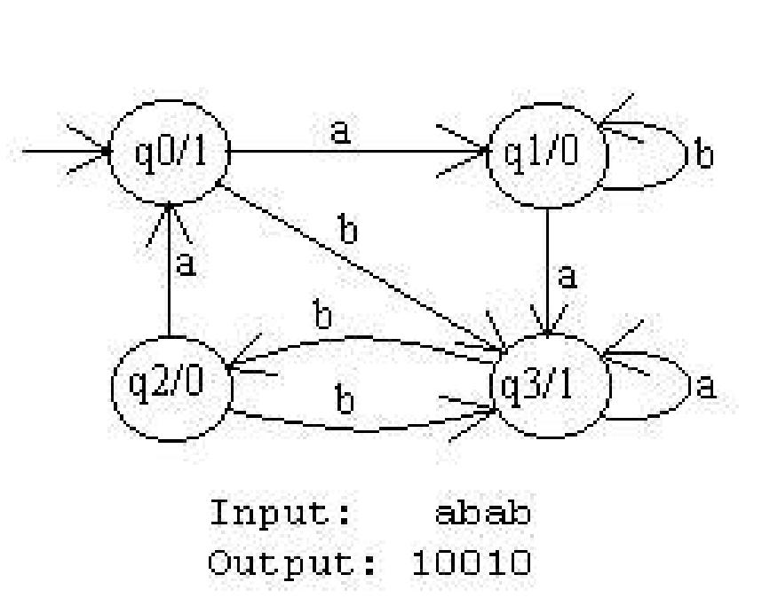<br />这里`q0/1`指的是：状态为`q0`的时候输出`1`，依此类推！<br />比如，在这个过程中：<br />1. 进入 `q0/1`，输出1<br />2. 因为一个字符是`a`，于是跟着箭头，到了状态`q1`，输出0...<br />示例2：<br />机器产生的输出中，输入字符串里每出现一次子字符串“aab”，就会包含一个1。<br />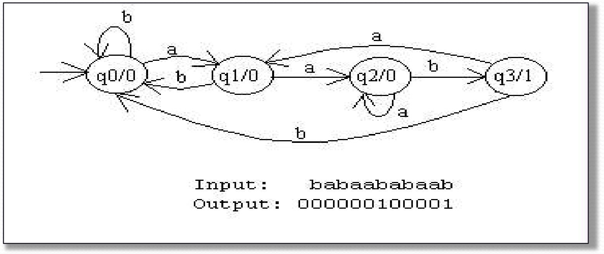 | 二进制取反（如 “输入 0 出 1，输入 1 出 0”）：<br />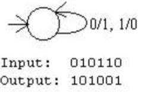<br />这里`i/o`中，`i`是输入字母表中的一个字符，`o`是输出字母表中的一个字符。 |

**完备的（Complete）**：这个名词指的是，**所有 “当前状态 + 输入信号” 的组合，都有对应的下一个状态**，没有 “无定义” 的情况。

- 显然，Mealy 和 Moore 机都是完备的。

**接收状态（Accept state）**：这个意思是，有限状态机中**预先指定的、表示 “输入序列被识别成功” 的状态**，通常用双圈标注。

- 显然，Mealy 和 Moore 机没有接受状态。他们书输出类型的FSM，但是对于预测试的机器（类似Trie哪种）才有接收状态。


### [13.7] 总结

- 模型是系统的抽象视图（abstract system view）。**互补类型（Complementary）**的模型提供不同的系统信息。
- 语境模型展示了一个系统在其环境中与其他系统和流程的位置关系。换言之：语境模型用于说明（Illustrate，划定边界）系统的边界。


- 数据流模型可用于对系统中的数据处理进行建模。

- 状态机模型对系统响应内部或外部事件时的行为进行建模。

<a id="petri_net_main"></a>

### [13.8] Petri 网模型

Petri 网最初用于模拟化学反应，后来得到了扩展。

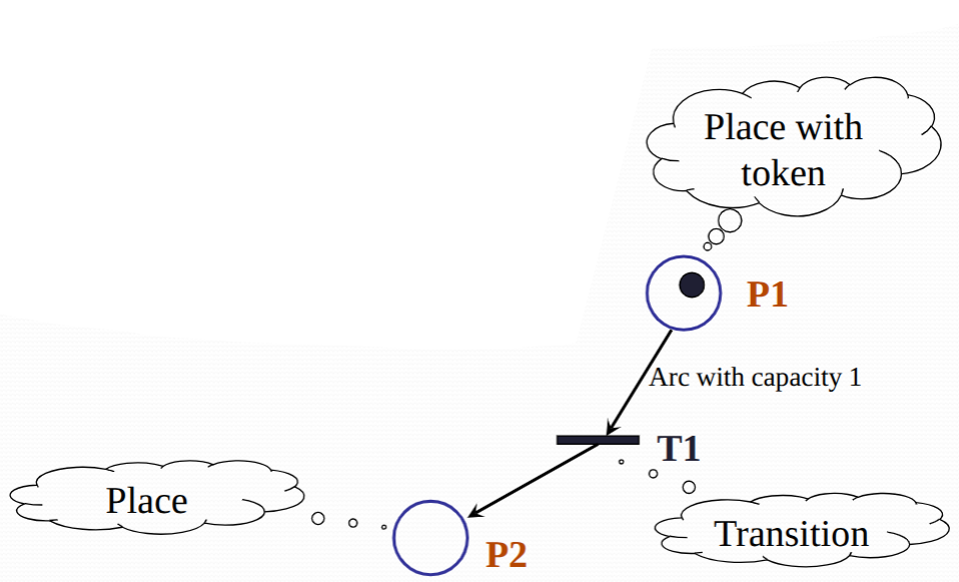

<a id="definition_in_petri_net"></a>

#### [13.8.1] Petri 网的定义

- 构成：**圆圈（Places）**+ **横线（Transition）**
- 规则：
  - Places 连接 Transition 或者反过来，**不允许** Places 之间相连，或者 Transition 之间相连。
  - 连接叫做 **Arcs（弧线）** 
  - Places 可能包含着 Tokens（可理解为资源，或者触发信号）
  - **State/Marking**：整个 Petri 网的 “当前情况”，可以看所有 Places 的令牌分布 
    -  比如 “库所 P1 有 2 个令牌、P2 有 0 个、P3 有 1 个”
    - 这组令牌分配情况就是网的一个状态 State 或者 Marking
  - **Arcs** 默认容量是1,也就是通过1个 Token
    - 要是想让它一次过多个（比如 3 个），要么直接在弧上标数字 “3”，要么画 3 条并排的线代表容量 3
  - **Places 默认的 Token 是无限个**
  - Transaction 没有Token容量的说法，他只负责转移Token


- Current state 当前状态：也称为当前标识。指的是 Tokens 在 Places 上的配置。
- Reachable state 可达状态：我们说B是一个可达状态当且仅当A可以通过一系列转换到达这个状态。
- Deadlock state 死锁状态：一个状态，但是这个状态已经到尾声了（没有下一步能执行，大概是这个意思）。
  - 进一步说，在 Petri 网中，**死锁**是指系统进入了一种没有任何变迁（Transition）可以触发（Enabled）的状态。 
  - 如果当前所有变迁都因为缺少足够的令牌（Tokens）而无法执行，系统就会“卡死”。


#### [13.8.2] Petri网是如何转移 Token 的

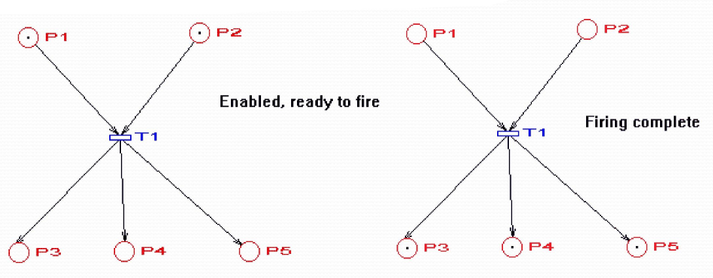

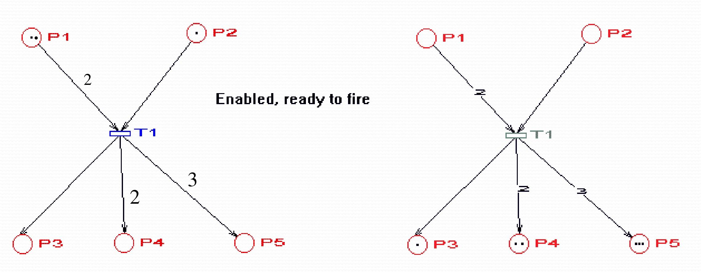

- 比如这里的 ==Arcs 没有标记，默认是1，那么 Arcs 的权重就是1==。
- **每个**指向这个Transition（T1）的 Input places 里的 Tokens，要**大于等于** 对应 Arcs权重。
- 如果符合，那么现在就是Enabled状态，可以随时**触发（Firing）**！


<a id="petri_net_firing"></a>

#### [13.8.3] 关于Firing

只要变迁处于 Enabled 状态，随时都能触发；一旦触发：

- Input places 里面的Tokens 按对应 Arcs 权重减少
- Output places 的 Tokens 按对应 Arcs 权重增加
- 整个 Petri 网进入新状态

一个特别的例子如下：

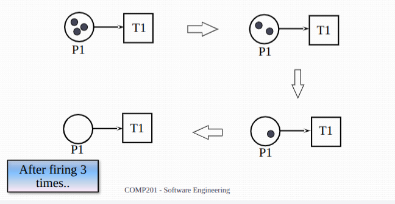

==如果一个Transition没有 output，那么 Tokens 也是会被消耗的！==

<a id="inhibition_in_petri_net"></a>

#### [13.8.4] Inhibition

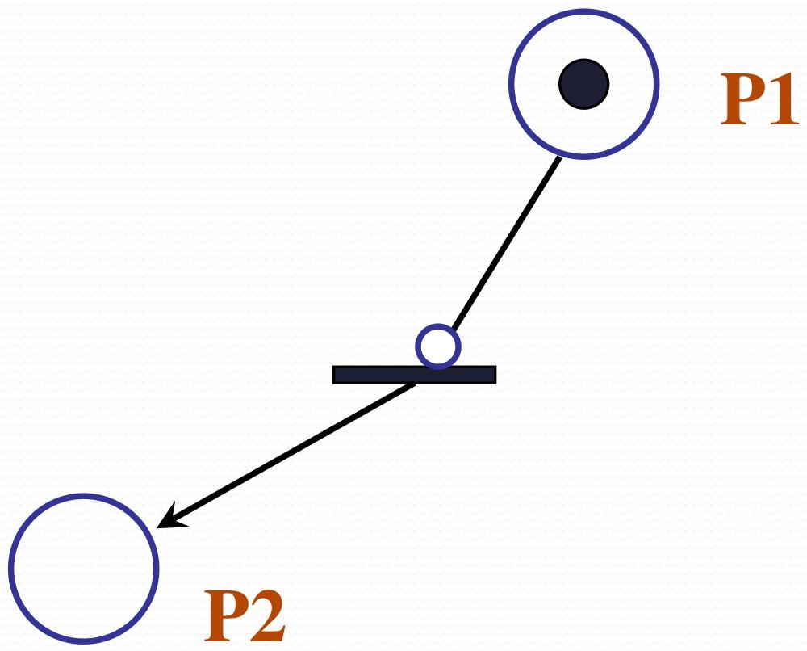

那么抑制（Inhibition）是怎么样的呢？

- 带有小圆圈的 Arcs 是抑制弧（Inhibition Arcs）
- Inhibition 的 Enabled 条件是：**Token 数量必须“少于”权重。**也就是和普通Arcs完全相反

重要特性：不消耗 Token

- **普通弧 (Normal Arc)：** 触发（Firing）时，会从 Input Place **拿走** 对应权重的 Token。
- **抑制弧 (Inhibitor Arc)：** 触发（Firing）时，**不会** 从 Input Place 拿走任何 Token。它只负责“检查”状态，不改变该 Place 的 Token 数量。

| **特性**            | **普通弧 (Normal Arc)** | **抑制弧 (Inhibitor Arc)**       |
| ------------------- | ----------------------- | -------------------------------- |
| **符号**            | ➝ (箭头)                | —○ (圆头/棒棒糖)                 |
| **Enabled 条件**    | $Tokens \ge 权重$       | $Tokens < 权重$                  |
| **逻辑含义**        | "必须有足够的资源"      | "必须**没有**（或少于）某种资源" |
| **触发后 (Firing)** | **消耗** (减去) Token   | **不消耗** Token (数量不变)      |


#### [13.8.5] 例子

<a id="petri_model_example"></a>

| **模式名称 (Name)**                | **行为逻辑 (Logic)**                                         | 图                                                           |
| ---------------------------------- | ------------------------------------------------------------ | ------------------------------------------------------------ |
| **Sequence** (顺序/串行)           | **一步接一步**。上一步触发产生Token，下一步才能开始。严格的因果关系。 | 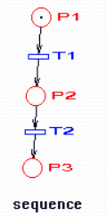 |
| **Conflict** (冲突/选择)           | **资源竞争**。P4里只有一个Token，如果T3拿走了，T4和T5就没得拿了。只能**三选一**。 | 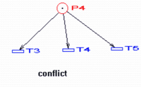 |
| **Concurrency** (并发/并行)        | **同时发生**。T6一旦触发，同时产生3个Token，后续的T7, T8, T9可以**互不干扰地并行执行**。 | 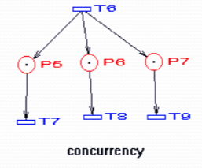 |
| **Synchronization** (同步)         | **等待集合**。T10 必须等到 P8、P9、P10 **全都有** Token 才能触发。缺一不可。 | 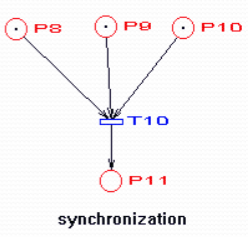 |
| **Confusion** (混淆)               | **复杂的非确定性**。T11和T13虽然看似无关，但它们都在抢夺T12需要的资源。T11的触发会剥夺T12的机会，从而改变系统的整体状态。 | 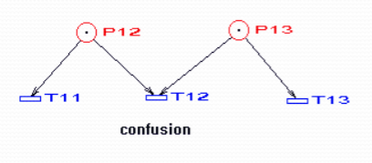 |
| **Merging** (合并)                 | **殊途同归**。无论哪个任务完成（T14或T15或T16），都会让系统进入同一个状态 (P14)。 | 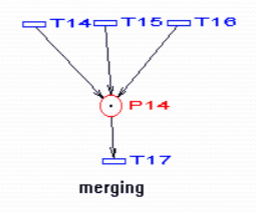 |
| **Priority/Inhibit** (优先级/抑制) | **条件阻断**。<br />• `T18`：只要P15有Token就能跑。<br />• `T19`：必须 P15有Token **且** P16 **没有** Token才能跑。<br /> **图中现状：** P16有Token，所以 **T19被抑制（无法运行）**。 | 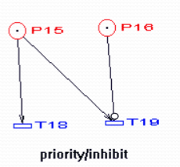 |


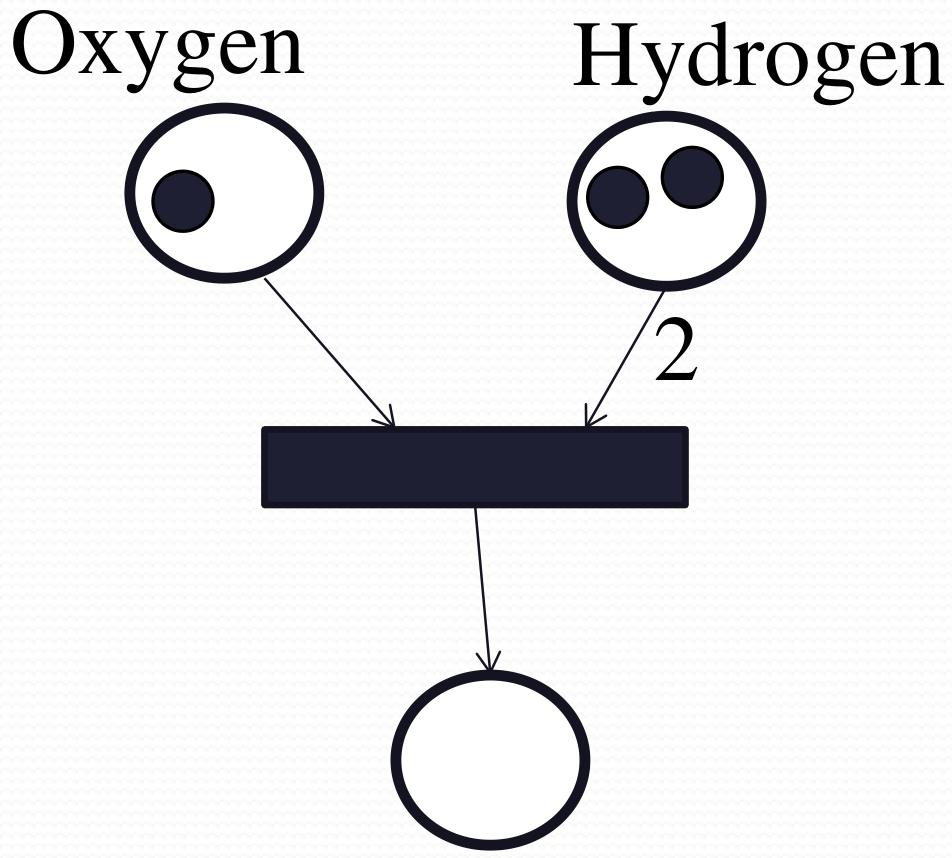

#### [13.8.6] 为什么使用 Petri 网

- 现实世界（特别是分布式系统）往往是混乱的，多个事件可能同时发生，或者顺序不确定
- Petri 网完美模拟了这种“不知道哪个先发生”的情况（例如上面的 **Conflict** （三选一）和 **Confusion** 模式）

- 严格的数学定义 ：Petri 网背后有一套数学公式。这意味着我们可以通过数学计算来**验证**系统会不会出 bug


#### [13.8.7] 使用 petri 网

在**[这个网址](https://pes.vsb.cz/petrineteditor/#/model)**可以画、运行 Petri网！

我们可以尝试建模一个红绿灯模型。

- 首先，红绿灯必须是`红色-->绿色-->黄色...`循环的。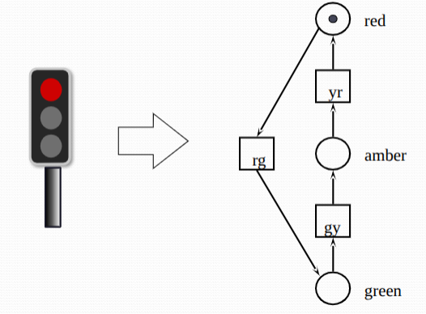
- 接着，我们尝试加多另一个红绿灯。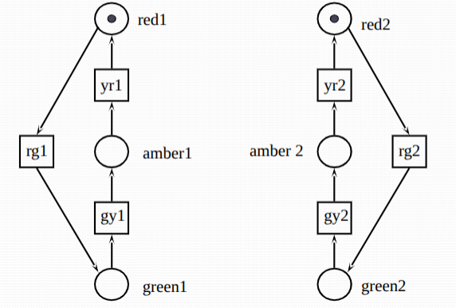
- 接下来可以构建一个互斥的红绿灯，也就是只有一方是绿灯，另一方必须是红灯：

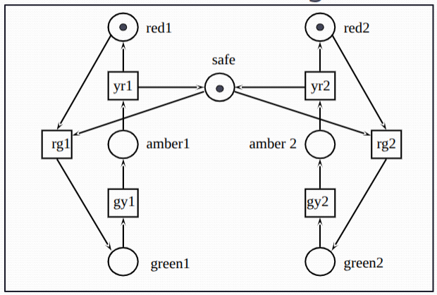

我肯可以看到， transistion `rg1` 和 transistion `rg2` 正在抢夺 safe 的 token， 抢到的才能变成绿灯。然后后面 `yr1` （或者`yr2`） 由黄变红的过程再重新返还给 safe token。

但是这个机制的问题就是，这个类似于CPU轮询，有可能很多轮都是 `rg1` 抢到，`rg2` 饥饿了怎么办？那么这是一个更加公平的方案：

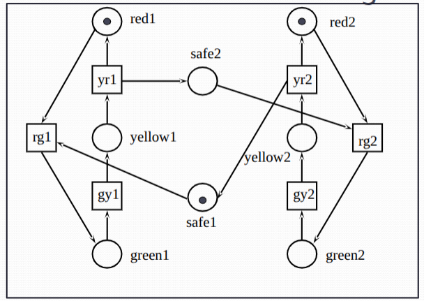

只要把safe拆分成两份，一份给 red1的transistion `rg1` 然后 另一份给 `rg2` 即可。

思考，如何证明这个模型不允许两个绿灯同时亮起？

> 可以使用**反证法（Proof by contradiction）**。
>
> 假设会同时亮起，也就是 `green1` 和 `green2` 同时有token，反推（Work backwards）上一步，就是`rg1`和`rg2`同时接收了 `red1+safe1` 和`red2+safe2`的 token，再反推...


<a id="petri_concurrent_problem"></a>

#### [13.8.8] Petri网中的并发导致不确定性问题

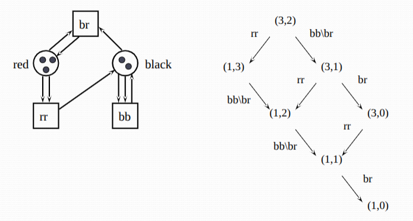

如图，假定符号表示为`(red, black)`，那么图上有 **7 个 Reachable State** 、**1个 Deadlock State**。

那么，请问下图：

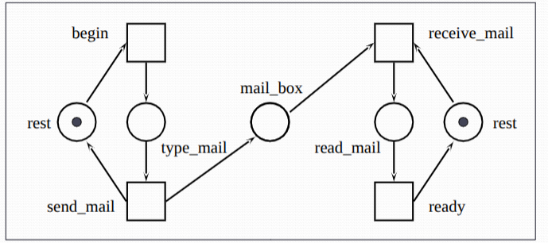 


1. 有多少个 Reachable State？
2. 存在 Deadlock State 吗？
3. 如何建模 有界邮箱 （缓冲区大小=4）？
4. 如何建模 2 writer 和 3 reader 的情况

我们可以画出这些状态

第一步：

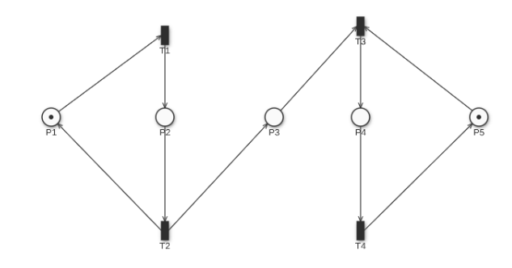

第二步：

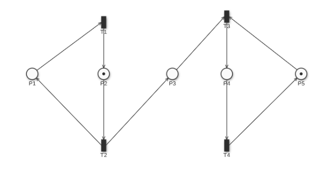


第三步：


注意！**==这个时候有并发的可能了！==**此时可以被点亮的是：P2、P4，那么

| P2   | P4   |
| ---- | ---- |
| 亮   | 不亮 |
| 不亮 | 亮   |
| 亮   | 亮   |

下一步一共有三种可能性。

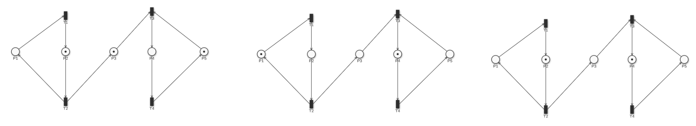


然后我们继续模拟！

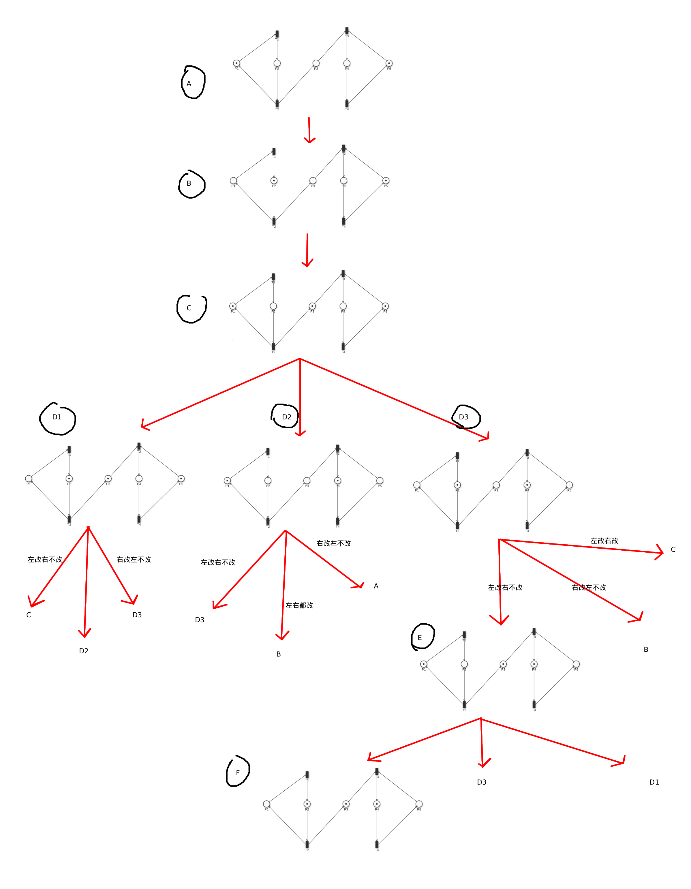

最后发现，状态`F`可以让P2多循环几次，然后出出现新的状态！

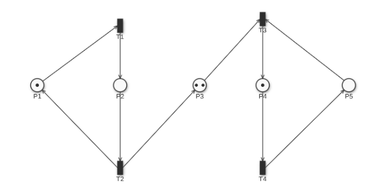

这里P3变成2个Tokens了！因此，我们可以一回答：

- 有无限个Reachable State！因为并发的原因
- 没有 Deadlock State！


那么，如何建模 有界邮箱 （缓冲区大小=4）的情况？

#### [13.8.9] 添加缓冲区

这是一个非常经典的问题。在 Petri 网中，要将一个“无界库所”（如之前的 `mail_box`）建模为“有界库所”（Bounded Place，容量为 $K$），最标准的方法是引入一个**互补库所（Complementary Place）**。

也就是在原来的基础上，直接添加一个互补库所。这样，Transition：Sender 会被限制，最多拿走4个，只有当Receiver还回来才可以继续生产！

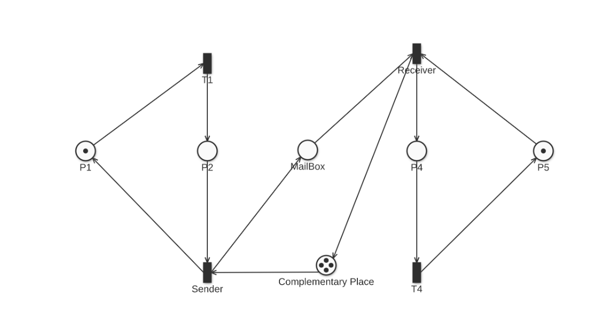

> 或者实际上可以添加一个反向抑制弧，具体来说，就是不要 Complementary Place，直接mainBox反过来给一个权重是4的**[抑制弧](#inhibition_in_petri_net)**
>
> 具体而言，可以查看**[模拟考试例题](#petri_net_inhibition_example_exam_001)**。

#### [13.8.10] 增加 Sender 和 Receiver

那么，如果我们除了加了缓冲区，我们还想添加更多 Sender 和 Receiver 怎么办呢？

我们需要重新构建整个架构吗？

不！我们只需要添加Tokens就好 ！例如，我们想要设置 sender是2个，receiver是3个，只需要：

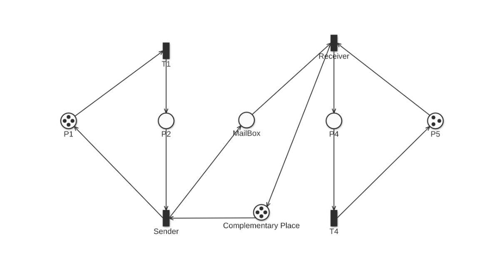

<a id="semantic_data_model"></a>

### [13.9] 高级 Petri 网

High-Level Petri Nets

高级 Petri 网扩展了三个方面

- Color（颜色）：属性建模
- Time（时间）：性能分析
- Hierarchy（层次结构）：模型构建


#### [13.9.1] 颜色扩展

为什么我们需要高级Petri网？因为，如果我们尝试建模一些复杂的东西，普通Petri网会带来很糟糕、很臃肿的架构！

高级Petri网中的Token不再是黑点，而是一个，类似于Java中对象的存在，他可以储存很多东西，比如：

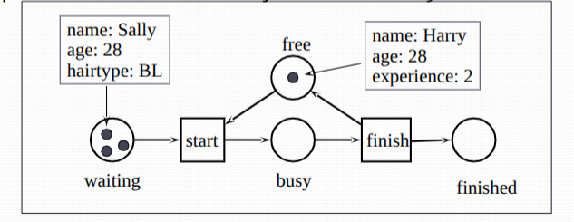

比如这个Token就可以代表一个 `Customer` 类的实例。

```java
class Customer{
    String name;
    int age;
    String hairtype;
    int experience;
    //...
}
```

同时，带颜色的扩展还可以让 Transition 带上条件！

比如：

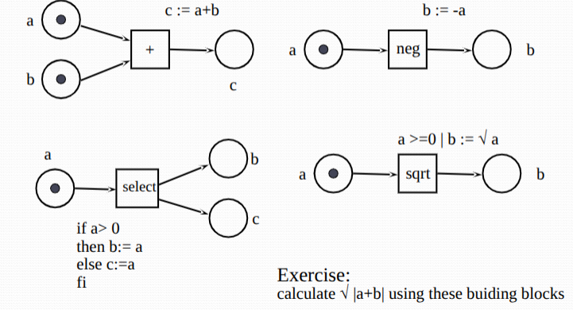

那么我们可以尝试一下使用如上模块，构建一个计算$\sqrt{|a+b|}$的Petri网！

显然，首先计算 `a+b=c` 然后通过 select 模块：

- 如果`c<0`那么`c=-c`
- 否则`c`（不变）

最后，再通过`sqrt`模块即可。


#### [13.9.2] 时间扩展

在标准 Petri 网中，变迁的触发是瞬时的，且没有明确的时间概念。就像之前，我们的生产者和消费者，每一个Reachable State我们都是一下子就完成了！但是，在化学反应，或者其他的比如理发店建模，这些地方，或许时间是有必要的！


我们要知道化学反应了多久？顾客等了多久？诸如此类的问题。


在Transition中，我们引入时间区间 $[t_{min}, t_{max}]$，这样可以帮助我们分析性能！

- **$t_{min}$ (最小触发时间)：** 变迁在==**被 Enabled **   后==**， ** **最少需要等待多久**才能触发。
- **$t_{max}$ (最大触发时间)：** 变迁在被使能后，**最多**可以等待多久。如果到达这个时间点变迁仍处于使能状态，它**必须**触发。

澄清：

- 假设 Transition 在时刻 $T$ 获得了足够的 Token（进入使能 Enabled 状态），它必须在 Enabled 状态下停留至少 $t_{min}$ 这么久。在时刻 $T + t_{min}$ 之前，它是**不能**触发的。
- $t_{max}$ 是一个**截止日期（Deadline）**。如果变迁在时刻 $T$ 被使能，且一直保持使能状态（没有被其他变迁抢走 Token），那么在 $T + t_{max}$ 这个瞬间，它**必须（Must）**触发。它不能在使能状态下停留超过 $t_{max}$ 的时间。

> 为什么Transition不在min那一刻触发呢？因为需要考虑到系统实际上具有不稳定性，包括我们提到的颜色扩展中，是带有运算的，这些运算也要消耗算力。
>
> 也包括我们之前提到[非确定性（Confusion）](#petri_model_example)。


#### [13.9.3] 层次扩展

既然我们提到，颜色扩展可以允许Transition带有运算，并且组装成模块，那么为什么我们不引入 Java 中的封装思想呢？


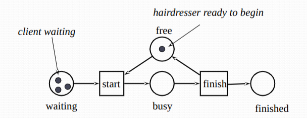

这是一个简单的顾客等待理发师的场景，那么，如果我们有多个理发师，除了增加free的token外，我们还可以封装他们：

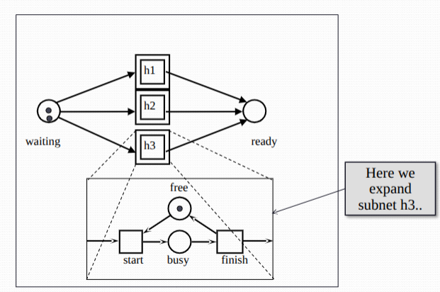

或者，更复杂的封装

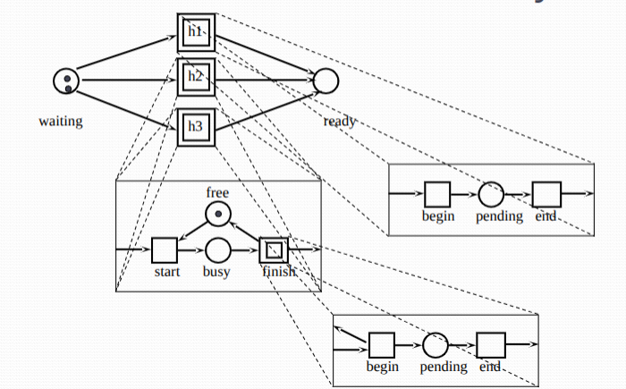

#### [13.9.4] 歧义识别

非形式化语言（如英语或中文）往往看似清晰，但在实际编写代码或设计 Petri 网模型时，你会发现许多边界情况没有定义。

这会产生**歧义（Ambiguities）**。

我们可以引入一个例子：

- 传输一个消息，这条消息必须一式三份（Triplicated，也就是复制三份）。这三份副本必须通过三个不同的物理渠道转发。
- 接收方根据三取二投票策略接收消息。（这里就出现了歧义了！到底怎么取？）

如果我们去设计Petri网，那么这就是一个**消歧异**的过程。我们可以设计成这样：

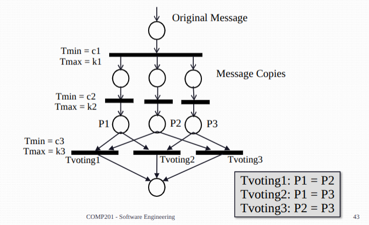

> **Tvoting1**：仅当通道 $P1$ 的消息等于 $P2$ 的消息时触发 ($P1 = P2$)。
>
> **Tvoting2**：仅当通道 $P1$ 的消息等于 $P3$ 的消息时触发 ($P1 = P3$)。
>
> **Tvoting3**：仅当通道 $P2$ 的消息等于 $P3$ 的消息时触发 ($P2 = P3$)。
>
> **竞争机制**：这是一种“先到先得”的竞争关系。只要任意两个通道的消息率先到达且内容一致，相应的 `Tvoting` 变迁就会被点亮并触发，系统随即输出结果。
>
> 比如`P1`和`P3`先到达，然后`Tvoting2`就会Enabled。


也可以设计成这样

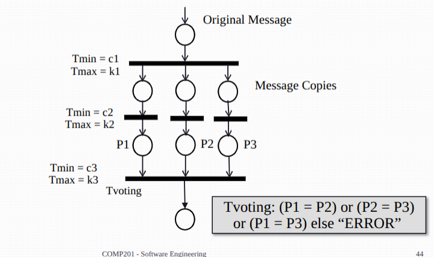

> 该变迁同时从三个通道（$P1, P2, P3$）提取 Token。它不再是两两竞争，而是等待消息**全部都到达后**进行统一评估。
>
> 利用高级 Petri 网的“颜色”特性，该变迁内部包含了一个复杂的逻辑表达式：
>
> `(P1 = P2) or (P2 = P3) or (P1 = P3) else "ERROR"`
>
> 与图 1 不同，图 2 明确定义了**失败情况**。如果三个通道的消息互不相同（无法达成二选三），变迁会走 `else` 分支并输出 `ERROR` 状态。这**直接解决了规范中未提及“如果投票失败该怎么办”的歧义**。


#### [13.9.5] 使用高级Petri网

- 想象一下，为一栋有 3 部电梯和 20 层楼的摩天大楼设计电梯系统模型。
- 我们可以确保，如果某一楼层有人按下电梯按钮（上行或下行），电梯最终会到达。
- 我们可以尝试对系统的时间约束进行建模（时间Petri网）。
- 我们也可以使用层次结构来简化系统。
- 最后，如果模型的性能不是最优的，我们可以尝试以某种方式对其进行优化。

...

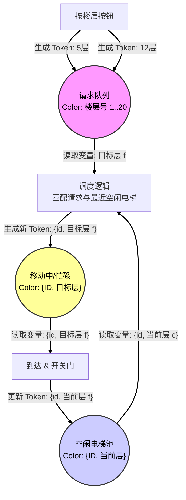
```mermaid
graph TD
    %% --- 定义带有“颜色集”（数据类型）的库所 ---

    %% 1. 请求库所
    P_Req(("请求队列<br>Color: 楼层号 1..20"))

    %% 2. 空闲电梯库所
    P_Idle(("空闲电梯池<br>Color: {ID, 当前层}"))

    %% 3. 忙碌电梯库所
    P_Busy(("移动中/忙碌<br>Color: {ID, 目标层}"))


    %% --- 定义变迁及其处理逻辑 ---

    %% A. 模拟乘客按按钮
    T_Push["按楼层按钮"] -->|"生成 Token: 5层"| P_Req
    T_Push -->|"生成 Token: 12层"| P_Req

    %% B. 核心调度逻辑
    P_Req -->|"读取变量: 目标层 f"| T_Dispatch["调度逻辑<br>匹配请求与最近空闲电梯"]
    P_Idle -->|"读取变量: {id, 当前层 c}"| T_Dispatch

    %% 调度成功
    T_Dispatch -->|"生成新 Token: {id, 目标层 f}"| P_Busy

    %% C. 到达逻辑
    P_Busy -->|"读取变量: {id, 目标层 f}"| T_Arrive["到达 & 开关门"]

    %% 更新状态回到空闲池
    T_Arrive -->|"更新 Token: {id, 当前层 f}"| P_Idle


    %% --- 样式美化 ---
    style P_Req fill:#f9f,stroke:#333,stroke-width:2px,color:black
    style P_Idle fill:#ccf,stroke:#333,stroke-width:2px,color:black
    style P_Busy fill:#ff9,stroke:#333,stroke-width:2px,color:black
    linkStyle default stroke-width:2px,fill:none,stroke:black
```


### [13.10] 语意数据模型

Semantic Data Model，语意数据模型：

- 描述系统中数据处理的**逻辑结构**


**核心是ERA（实体-关系-属性）模型：**

- **实体 (Entities):** 系统中的对象（如：用户、订单）。
- **关系 (Relationships):** 实体之间的联系（如：用户 **拥有** 订单）。
- **属性 (Attributes):** 实体的具体特征（如：用户的 **姓名**）。

> **应用场景：**
>
> - 广泛用于**数据库设计**，可以轻松转换为关系型数据库（Relational Databases）。
> - 在 UML 中虽然没有专门的符号，但通常通过 **[UML类图 (Class Diagrams)](#class_diagram)** 或**对象与关联 (Objects and Associations)** 来表达类似的思想。


语意数据模型（Semantic Data Model）中定义出的每一个**实体 (Entity)**、**关系 (Relation)** 和 **属性 (Attribute)**，都必须在**数据字典(Data Dictionary)**中有一个对应的**条目 (Entry)**。

那么，我们就把他搞成一个表，这个表就叫做 Data Dictionary Entry，也即数据字典条目。

**ERA是骨架，那么 Data Dictionary Entry就是血肉。**


<a id="data_dictionary"></a>

#### [13.10.1] 数据字典条目

Data Dictionary Entry Example

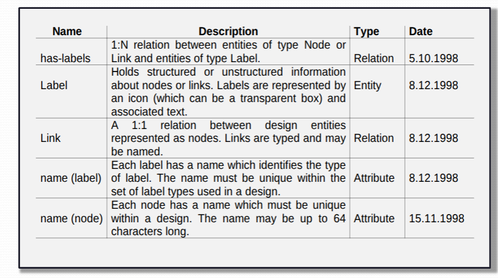


表头解释

- **Name (名称)**： 这个条目的名字（数据项或变量名）。
- **Description (描述)**： 详细解释这个东西是干嘛的，有什么规则（比如是一对多还是一对一，长度限制等）。
- **Type (类型)**： 它的身份分类。
  - **Entity (实体)** = 系统里的一个“东西”或“对象”（比如：人、商品、标签）。
  - **Relation (关系)** = 两个“东西”之间的连线或联系。
  - **Attribute (属性)** = “东西”身上的特征（比如：名字、颜色、大小）。
- **Date (日期)**： 这个条目最后一次被修改或定义的时间。

| **名称 (Name)**  | **类型 (Type)** | **约束与规则 (Constraints)**                                 |
| ---------------- | --------------- | ------------------------------------------------------------ |
| **has-labels**   | **Relation**    | **1:N 关系**：一个 Node / Link 可以对应多个 Label。          |
| **Label**        | **Entity**      | **表现形式**：由一个图标（可以是透明框）和关联文本组成。     |
| **Link**         | **Relation**    | **1:1 关系**：是 Node 之间的一对一连接，具有类型且可以被命名。 |
| **name (label)** | **Attribute**   | **唯一性**：在当前设计使用的 Label 类型集合中，名称必须是唯一的。 |
| **name (node)**  | **Attribute**   | **多重约束**：<br />1. 在设计中必须唯一；<br />2. 长度上限为 64 个字符。 |


### [13.11] 对象模型

Object Model

对象模型通过 **“对象类” (Object Classes)** 来描述系统：

- **属性 (Attributes)**：特征数据。
- **服务/操作 (Services/Operations)**：对象能提供的功能。


为了从不同角度描述系统，通常有3种对象模型：

- **继承模型 (Inheritance models)**：描述类之间的层级关系（父子关系）。
  - 例如Class Extends Class
- **聚合模型 (Aggregation models)**：描述整体与部分的关系（比如汽车与引擎）。
  - 例如Class 里成员变量包含另一个 Class
- **交互模型 (Interaction models)**：描述对象之间如何相互作用。
  - 例如Class 调用另一个Class


| **模型类型**                | **核心关系** | **关系口诀**       | **Java 实现方式**          | **备注**                                                     |
| --------------------------- | ------------ | ------------------ | -------------------------- | ------------------------------------------------------------ |
| **继承模型 (Inheritance)**  | 层级关系     | **Is-a** (是...)   | `class A extends B`        | 子类获得父类的所有非私有属性和方法。                         |
| **关联/聚合 (Aggregation)** | 组成关系     | **Has-a** (有...)  | `class A { private B b; }` | **重点：** B对象通常是从构造函数或Setter**传进来**的，B可以独立于A存在。 |
| **交互模型 (Interaction)**  | 行为关系     | **Uses-a** (用...) | `a.method(b)`              | **重点：** B不是A的属性，只是在方法执行期间**临时用一下**。  |


# Software design and OO design notation

实际上，在现实开发中，设计一般是在代码实现中不断完善完成的。

在面向对象设计中，子系统通常被分解为**类 (Classes)** 

<a id="methodologies"></a>

## [1] 方法论

软件设计有很多方法，第一课中讲到如下的一些方法论

### [1.1] 设计阶段

- 任何的设计都可以用**有向图（Directed Graph）**来建模，包含属性（Entities）和关系（Relationships）。

- 描述方案的**抽象**。

### [1.2] 自顶向下

采用**自顶向下（Top-down）**设计的设计：

> 不过，在实践中很难纯粹实现；往往产生的模块功能**过于具体**，不利于重用（即与“可组合性”冲突）
>
> 也就是：很难抽出公共父类

### [1.3] 数据交换模型

**数据交换模型（Data Exchange Models）**：

<a id="repository_model"></a>

- **仓库模型 (Repository Model)**：所有共享数据保存在中央数据库 。
  - 优点：
    - 高效共享大数据集
    - 子系统无需关心数据如何被他人使用
    - 许多标准操作（如备份、安全、访问控制、恢复和数据完整性）都是集中式的
    - 通过存储库模式可以看到数据模型。
  - 缺点：
    - 子系统必须就数据模型达成一致，这意味着必须做出一些妥协，例如在性能方面。
    - 由于会生成大量数据，**演进（系统更新、优化的意思）**可能会很困难。
    - 不同的系统对安全、恢复和备份策略有不同的要求，这在单个数据库中可能难以实施。
    - 难以实现分布式！

<a id="message_passing"></a>

- **消息传递模型（Message passing）**：每个子系统维护自己的数据库，通过消息交换数据

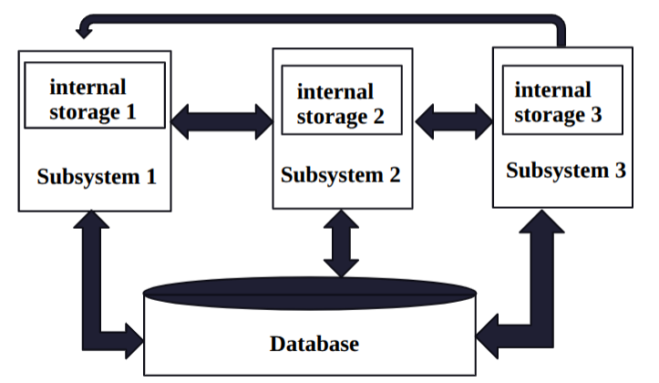

> 图：仓库模型和消息传递

当需要共享**大量数据时**，最常用的是共享仓库模型。

### [1.4] 良好设计的五大原则


1. **语言模块化单元（Linguistic modular units）**：模块需与所用语言的语法单元对应（如 Java 的方法和类），反例如 BASIC 的子程序仅通过行号调用，无法从代码本身识别。
2. **少接口（Few interfaces）**：模块间的通信通道应尽可能少，每个模块仅与少量其他模块交互，减少系统复杂度。
3. **小接口（Small interfaces）**：模块间通信时交换的信息应最少，即 “松耦合 Loose Coupling”。
   - 避免将所有实例变量声明为 public 等紧耦合做法
   - 松耦合可通过状态去中心化、参数传递或[消息传递](#message_passing)实现。
4. **显式接口（Explicit interfaces）**：模块间的通信需在文档中明确体现
   - 如果模块A和模块B进行通信，那么这一点必须在模块A、模块B或两者的文档中清晰体现。
   - 为什么呢？如果我们更改一个模块，就需要了解其他哪些模块可能会受到这些更改的影响。可追溯性矩阵可用于此目的。
5. **信息隐藏/信息封装（Information hiding/ Encapsulation）**：
   - 参考 Java


### [1.5] 逐步求精的设计方法

- 核心思路：从方法的高层需求描述出发，分解为少量子问题，再递归分解子问题，直至子问题可直接解决；
- 这个和[可分解性](#decomposability)问题很相似！
- 局限性：适用于方法设计，不适用于大规模分布式系统。


<a id="object_oriented_programming"></a>

<a id="object_oriented"></a>

## [2] OO编程


- 将系统视为一组相互作用的**对象 (Objects)** 。
- 系统状态是**去中心化 (Decentralized)** 的，每个对象管理自己的内部状态
- 系统通过**交换消息 (Exchanging messages)** 进行通信


在PPT中，对象的概念

- 没有`public`字段，全是`private`，`public`的只有方法，注重交互而非数据。
- 一个 Object 包括
  - Behaviour（行为）：
    - 差不多就是方法的意思
  - State（状态）：
    - 状态指的是当前对象**封装（Encapsulation）**的所有字段数据。
    - 包含**变量/可改变的（mutable）**和**常量/不可改变的（immutable）**
  - Identity（标识）：
    - 对象的唯一区分依据，不依赖属性值，属性变化不改变对象身份。
- 一个 Object 一定是一个 Class 的**实例（Instance）**


面向对象三大特征：**封装（Encapsulation）、继承（Inheritance）、多态（Polymorphism）**


**子类（SubClass）继承（is extended from）父类（SuperClass）**

子类继承父类所有方法，所以我们说这两各类是**耦合（Coupled）**的。

多态示例：

```java
List<Object> list;
list = new ArrayList<>();
list = new LinkedList<>();
```

`AbstractList`抽象类实现了`List`接口，`ArrayList`和`LinkedList`同时继承了抽象父类`AbstractList`。

`list` 变量此时的行为称为**动态绑定（Dynamic binding）**。


## [3] 内聚与耦合

Cohesion and coupling 

如何评估模块设计方法？

### [3.1] 设计评估准则

<a id="decomposability"></a>

#### [3.1.1] 可分解性

**可分解性 (Decomposability)**：支持将问题分解为独立子问题 。

如果一种设计方法支持将一个问题分解为更小的子问题，且这些子问题可以独立解决，那么该设计方法就满足这一标准。

一般来说，这种方法会是重复性的：子问题会被进一步划分。

自上而下的设计方法满足这一标准；逐步求精就是这种方法的一个例子。

> 简单说：就是 “大问题→中问题→小问题→可解决的最小问题” 的重复拆分过程，让每个子问题都能单独交给开发人员处理，符合 “4 名开发者拆分 500 页需求” 的核心诉求。


#### [3.1.2] 可组合性

**可组合性 (Composability)**：模块可自由组合以产生新系统（与 复用 相关） 。

- 如果一种方法能够生成可自由组合以产生新系统的模块，那么它就满足这一标准。

- ```java
  public static String initString(str){
      return removeSpace(removeNewLine(str)); // 新模块！
  }
  public static String removeSpace(String str){
      return str.replace(" ","");
  }
  public static String removeNewLine(String str){
      return str.replace("\n","");
  }
  ```

- Unix shell提供了一种称为**管道（pipe）**的功能，写作`|`，通过它，一个程序的标准输出可以重定向到另一个程序的标准输入；这种约定有利于组合性。

#### [3.1.3] 可理解性

**可理解性 (Understandability)**：模块是否能被独立理解 。

- 如果一种设计方法有助于开发易于理解的模块，那么它就满足这一标准。

  - 反例1：假设有一个包含一千行代码的程序，其中**没有任何过程**；它只是一长串的顺序语句。将其分成二十个块，每个块有五十条语句；并将每个块设为一个方法。

  - 反例2. “跳转”语句。

- 好的例子：

- ```java
  public static String reverseThisString(String str){
      // ...
  }
  ```

#### [3.1.4] 连续性

**连续性 (Continuity)**：需求的小改动仅引发少数模块的变动 。

- 如果一种方法能够生成这样的软件，即：问题规范的微小变化只会导致一个（或少数几个）模块发生改变，那么这种方法就满足这一标准。

- 类似于重构复杂度。

- 示例：

  - （好的实例）一些项目执行这样的规则，即程序中不应使用数字或文本字面量：只应使用符号常量。

    ```java
    // 1. 数字字面量：谁能直接看懂10代表什么？
    if (orderStatus == 10) { 
        System.out.println("订单处理中");
    }
    
    // 2. 文本字面量：多次重复写"pending"，后续要改拼写需逐个找
    if (orderStatusStr.equals("pending")) {
        sendNotice("pending订单需确认");
    }
    ```

    ```java
    // 1. 定义符号常量（集中管理，含义清晰）
    public static final int ORDER_STATUS_PROCESSING = 10; // 订单处理中（数字常量）
    public static final String ORDER_STATUS_STR_PROCESSING = "pending"; // 文本常量
    
    // 2. 代码中引用常量（无需记忆数字/文本，含义一目了然）
    if (orderStatus == ORDER_STATUS_PROCESSING) {
        System.out.println("订单处理中");
    }
    
    if (orderStatusStr.equals(ORDER_STATUS_STR_PROCESSING)) {
        sendNotice(ORDER_STATUS_STR_PROCESSING + "订单需确认");
    }
    ```

  - （坏的实例）静态数组！如果需求变了，数组长度要增加，代码可能需要彻底重构！！所以可以考虑使用动态数组。

#### [3.1.5] 保护性

**保护性 (Protection)**：运行时的异常错误效果被限制在少数模块内 。

- 如果一种方法产生的架构能使运行时异常情况的影响仅作用于一个（或极少数）模块，那么这种方法就满足该标准。
- 正例：在源头验证输入可防止错误在整个程序中蔓延（契约式设计）
- 反例：在适合使用子范围类型或短类型的地方使用整数类型。（阿丽亚娜5号太空发射器故障，该错误是由未处理的数值转换异常导致的数值**溢出（Overflow）**引起的。）


<a id="what_is_coupling"></a>

### [3.2] 什么是耦合

耦合（Coupling）：衡量系统组件间相互关联的强度：

- 松耦合 Loose coupling：组件变更不易影响其他组件，面向对象系统通过无共享状态、消息传递实现松耦合；
- 紧耦合 Tight coupling：通过共享变量或控制信息交换关联，组件变更易扩散影响，**通常应避免**；
- 继承的影响：子类与父类存在耦合，父类属性或操作的变更会传递给所有子类。


面向对象系统是**松耦合的**，因为**不存在共享状态**，并且对象通过消息传递进行通信。

<a id="what_is_cohesion"></a>

### [3.3] 什么是内聚合

内聚合：Cohesion

> **一个类管的事越多、职责越杂，反而内聚越低；管的事越少、越集中，内聚才越高**。

衡量组件内部**功能的关联性，内聚性越高**，组件设计越优

1. **弱内聚**：偶然内聚（组件部分随意组合）、逻辑内聚（相似功能组件分组）、时间内聚（同一时间激活的组件分组）；
2. **中等内聚**：通信内聚（组件元素操作同一输入或输出）、顺序内聚（组件部分的输出为另一部分的输入）；
3. **强内聚**：功能内聚（组件各部分为执行单一功能必需）、对象内聚（操作围绕对象属性的修改与查询）；
4. 注意点：
   - 继承父类属性会**削弱**子类内聚，理解组件需同时参考父类；
   - 内聚与封装不同，内聚是 “**无需关注模块内部”**，封装是 “**无法使用**模块隐藏信息”。


<a id="loose_coupling_tight_cohesion"></a>

### [3.4] 一个好的系统

其实就是...（这个很显然的）

- 低耦合（Loose Couling），高内聚（Tight Cohesion）！
- 复用性强！


## [4] 分布式系统架构

> 考纲没有，大概过一下


架构设计：

- System Structuring 系统结构化
- Control Models 控制模型
  - **[1] 集中式控制（Centralised Control）**：一个子系统负责整体控制，启动和停止其他子系统。
    - 比如**调用-返回（Call-Return）**模型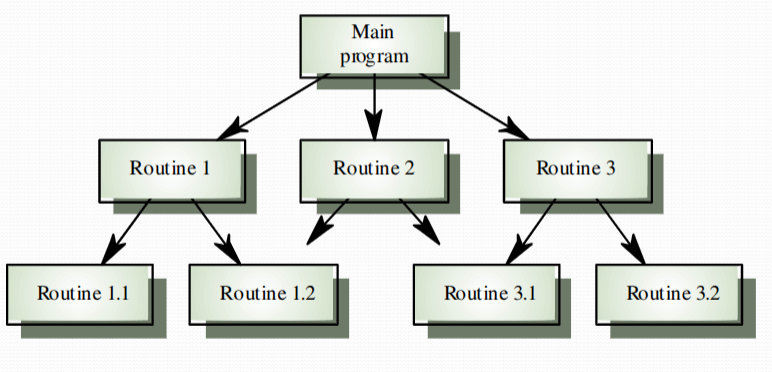
    - 比如**实时控制系统（Real-time Control System）**：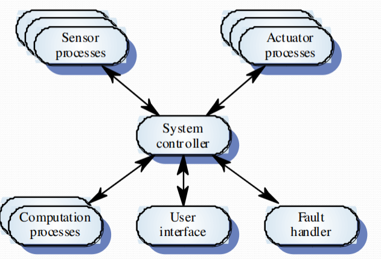
  - **[2] 基于事件的控制（Event-driven Systems）**：子系统响应外部生成的事件，事件时序不受处理子系统控制。
    - 比如**广播模型（Boardcasting）**：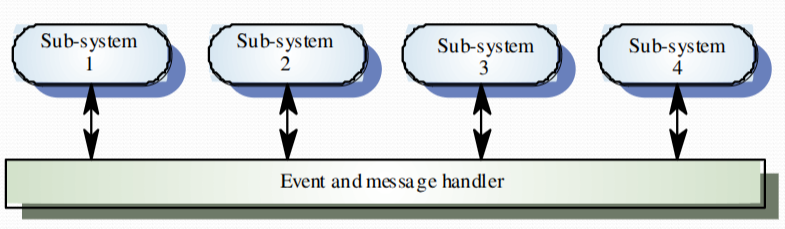
    - 比如**中断驱动系统（Interrupt-Driven Control）**：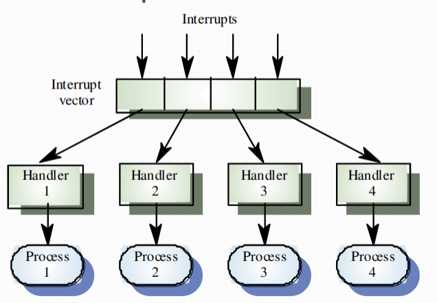
- Modular decomposition 模块化分解
  - **对象模型 （Object Model）**
    - 将系统分解为松耦合、接口明确的对象，需识别对象类、属性和操作，通过控制模型协调对象操作。
    - 比如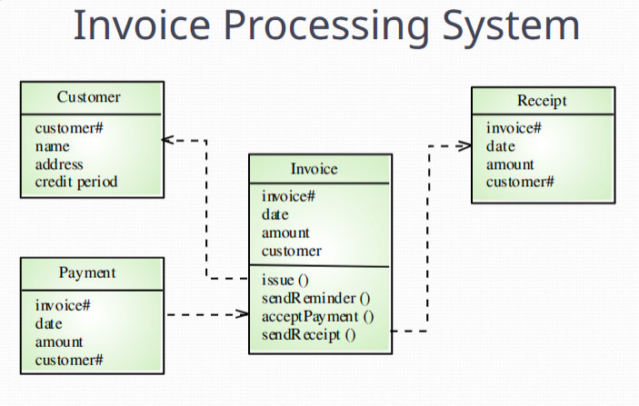
  - **数据流模型（Data-flow models）**
    - 系统分解为功能模块，模块将输入转换为输出，顺序转换时为批处理顺序模型，广泛应用于数据处理系统，不适用于交互式系统。
    - 比如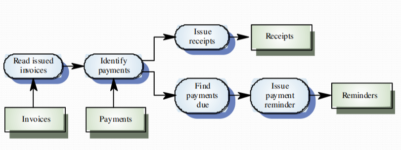

### [4.1] 分布式系统架构

#### [4.1.1] 多处理器架构

Multi-processor architectures 多处理器架构

- **这是最简单的分布式模型**
- 其实，就相当于现代的电脑，多个进程组成的一个系统。就是CPU调度很像分布式。

#### [4.1.2] 客户-服务器架构

Client-server architectures 客户-服务器架构

构成：服务器+网络+客户

好处：数据分布简便、能有效利用网络系统

不足：无共享数据模型导致数据交换低效、各服务器存在管理冗余...

客户-服务器架构实际上采用了**应用分层架构（Layered Application Architecture）**

- **表示层（Presentation Layer）**：涉及向Client展示结果，收集Client的输入

- **应用处理层（Application Processing Layer）**：处理数据

- **数据管理层（Data Management Layer）**：管理数据，比如数据库

  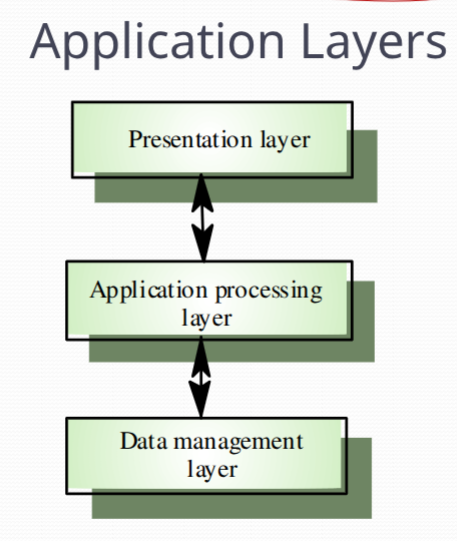

Client-server 架构中，细分还分为Thin-Client和Fat-Client

- Thin-Client：所有**应用程序处理**和**数据管理**都在 Server运行。Client仅仅呈现软件。

- Fat-Client：Server仅仅负责管理数据，其他都在Client运行。

  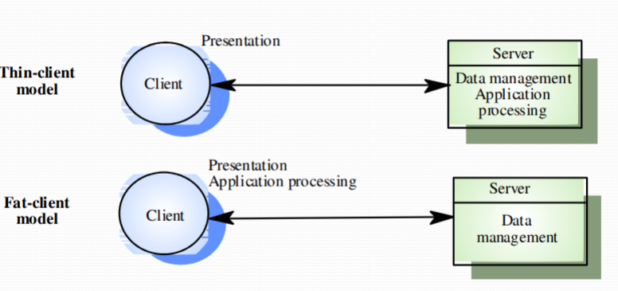

- 现在，我们几乎很难说，某个系统是纯纯的Thin或者Fat的，现在一般都是混合的。

**三层架构（Three-Tier Architecture）**：

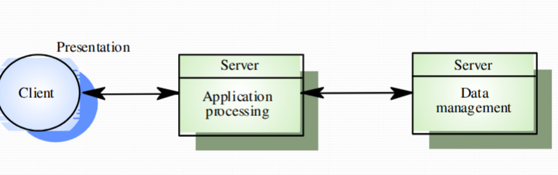

- 在三层架构中，每层都可以在独立的CPU上运行，性能比Thin-Client好，管理比Fat-Client强。

- 并且这种架构，显然，容易扩展。

- 比如，一个网上银行系统

  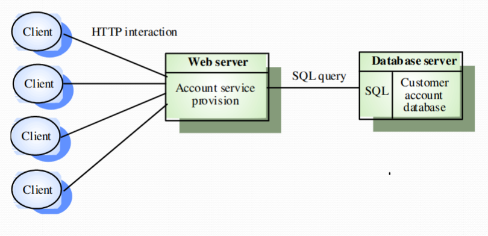

#### [4.1.3] 分布式对象架构

Distributed object architectures 分布式**对象**架构


客户端和服务器之间没有本质区别，每个对象都可以是服务器，也可以是客户端！

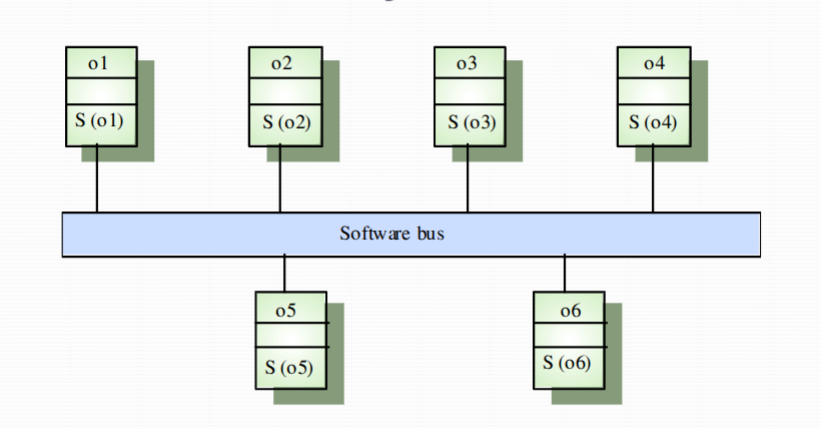

优势：

- 系统开放性高，支持按需添加新资源；

- 灵活性与可扩展性强，可动态添加、复制对象或实现对象迁移，适配波动的服务需求；

  > 例子：
  >
  > 设计一个电商的 “订单支付” 服务时，不用一开始就决定 “支付逻辑必须放在云端服务器”。
  >
  > - 初期用户少：把 “支付对象” 部署在本地小型服务器，够用就行；
  > - 双 11 用户暴增：不用改支付功能的核心代码，直接通过中间件把 “支付对象” 迁移到云端集群，或复制多个 “支付对象” 分担压力 —— 相当于早期没定死位置，后续按流量调整。

- 支持不同语言编写的对象通信。

  > 比如，提供一个通用接口，可以使用 Python 进行 `GET` 操作，也可以使用 Java，只是语法不同


**定义与定位**：架构设计是确定软件系统子系统构成及子系统控制与通信框架的过程，是连接需求规格说明与具体设计的关键环节，通常与部分规格说明活动并行开展。

**输出成果**：软件架构描述文档，包含多种从不同视角呈现架构的模型（静态结构模型、动态过程模型、接口模型、关系模型等）。


### [4.2] 什么是子系统

子系统本身就是一个系统，其运行**独立于其他子系统**提供的服务。

子系统必须交换数据，通过如下两种方式实现：

- 中央数据库，比如[仓库模型](#repository_model)
- 维护自己的数据库，比如[消息传递模型](#message_passing)
- 当需要共享大量数据时，最常用的是共享仓库模型。

> [!CAUTION]
>
> 模块（Module）是为**其他组件（Component）**提供服务
>
> 但通模块常不会被视为独立系统的系统组件。


现实中的子系统：

- `java.util.*`
- C++库
- MySQL Access
- ...


### [4.3] 架构设计核心

- 将系统分解为主要子系统，子系统又分为模块。
- 建立子系统间的控制流关系

比如：

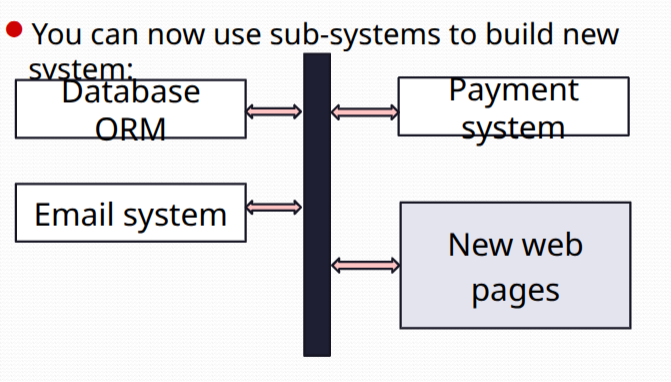


<a id="testing_and_quality_assurance"></a>

# Testing and quality assurance

测试和质量保证

测试的目的不是证明 “没 bug”，而是找出 “有 bug”—— 能发现问题的测试才是成功的。


**==验证（Verification）==：**“我们是不是把产品做对了？”

- 检查软件是否符合之前写好的[需求说明书(Specification)](#3_1_what_is_specification)、设计文档，比如功能、性能这些明确要求的内容。

**==确认（Validation）==：**“我们是不是做了用户真正需要的产品？”

- 就算软件符合文档要求，还要看它实际用起来**能不能满足用户的真实需求**（毕竟有时候文档可能没准确反映用户想法）。


> V & V Planning（验证与确认计划）是**在软件开发早期就提前规划 “怎么做验证（Verification）和确认（Validation）” 的工作方案**，核心是明确：
>
> - 要在哪些阶段做静态验证（比如什么时候审查需求、什么时候查代码）；
> - 要在哪些节点做动态验证（比如原型阶段、代码完成后怎么测试）；
> - 分配对应的时间、人力、工具资源（比如谁负责审查、用什么测试工具）；
> - 怎么关联需求和测试（确保每个需求都被验证 / 确认），以及怎么记录结果（方便后续审计）。
>
> 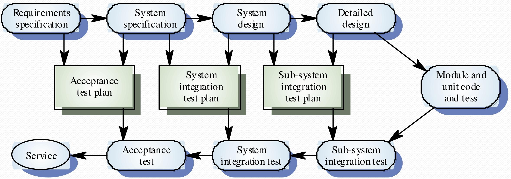


## [2] 两种验证方式

目标是发现系统中的缺陷，并且评估，这个系统在**生产环境**能不能用。

### [2.1] 静态验证

**Static Verification 静态验证**

不运行软件，直接查文档、代码。比如 “代码审查”（大家一起看代码找问题）、用工具分析代码漏洞，还能查是否符合编程规范、好不好维护。

### [2.2] 动态验证

**Dynamic Verification 动态验证**

运行软件，输入测试数据，看输出对不对。比如功能测试、回归测试（改了 bug 后，再测一遍之前的功能，防止新问题）。


> 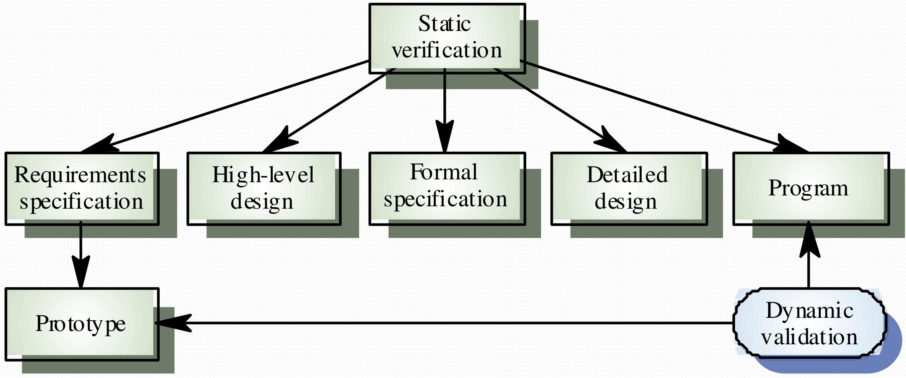
>
> 静态验证 (Static Verification)：
>
> - 通过人工评审、走查或工具分析，在**不运行程序**的情况下检查需求规格、设计文档及程序源码。
> - 贯穿开发全过程，包括**需求说明**、**概要设计**、**形式化说明**、**详细设计**以及程序代码。
>
> 动态确认 (Dynamic Validation)：
>
> - 通过**实际运行软件**（原型或最终程序），观察其输出结果并发现缺陷。
>   - **指向 Prototype（原型）**：通过运行原型系统，让用户直接操作，从而确认开发者理解的需求是否正是用户想要的。
>   - **指向 Program（程序）**：这就是传统的软件测试（黑盒/白盒测试）。通过给程序输入数据，观察输出结果是否符合预期。


## [3] 不同视角下的测试

程序测试不是证明没有bug，而是找出有bug，这个测试才是成功的。

程序测试（Program Testing）是[非功能性需求](#2_non_functional_requirement)的**唯一验证技术**。

### [3.1] 缺陷测试和统计测试

按照目标，测试分为**两种**

#### [3.1.1] 缺陷测试

缺陷测试 Defect Testing：专门找bug

- 缺陷测试的目标是发现程序中的缺陷

- 一次成功的缺陷测试是：使程序出现**异常行为（Anomalous way）**的测试

- 测试只能证明缺陷的存在，而**不能证明其不存在**。

- 缺陷测试流程：

  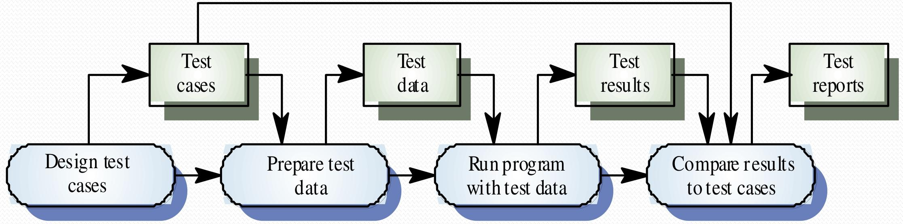

#### [3.1.2] 统计测试

统计测试（Statistical Testing）：模拟用户实际使用频率，估算软件可靠性

<a id="stress_testing"></a>

#### [3.1.3] 压力测试 

Stress Testing 压力测试 (非功能性验证：测试极限负载)

- 使系统承受超出其最大设计负荷的运行。对系统施加压力往往会使缺陷暴露出来。
- 强调系统测试的故障行为。系统不应发生灾难性故障。压力测试用于检查不可接受的服务中断或数据丢失情况。
- 这与分布式系统尤为相关，当网络过载时，分布式系统可能会出现严重的性能下降。


<a id="black_and_white_box_testing"></a>

### [3.2] 黑盒测试和白盒测试

按照技术，测试可以分为**两种**

#### [3.2.1] 黑盒测试

黑盒测试（Black-box Testing）：把软件当 “黑盒子”，不管内部代码逻辑，只看输入输出。

他主要是根据 **[Specification](#3_1_what_is_specification)** 给出输入样例的！

#### [3.2.2] 白盒测试

白盒测试（White-box Testing）：也叫做**结构测试  Structural Testing**，知道软件内部代码结构，设计测试用例去覆盖所有关键执行路径，确保每个核心语句都能被测试到

白盒测试可以使用**[路径测试 Path Testing](#path_testing)**，而最小的路径，我们可以使用**[环路复杂度（Cyclomatic Complexity）](#cyclomatic_complexity)**算出。

### [3.3] 组件测试和集成测试

按照阶段，测试可以分为**两种**

#### [3.3.1] 组件测试

组件测试（Component Testing）：测单个程序模块（比如一个登录功能），一般由**开发自己负责**，靠经验设计测试

#### [3.3.2] 集成测试

##### 普通集成测试

集成测试（Integration Testing）：把多个模块组合起来测（比如登录 + 支付功能联动），由**独立测试团队负责**，依据系统说明书来设计测试。

- 集成测试应该是**黑盒测试**，测试用例应该来自**[Specification](#3_1_what_is_specification)**。

- 集成测试的一个缺点是，因为他是集成的，所以很难定位到哪里出现了问题

  > 比如微信，这个软件十分臃肿，直播、支付、聊天、购物、几乎什么都包含了。某日，用户说他打开微信的时候闪退了，那么开发团队几乎不可能第一时间定位到到底是哪个模块初始化加载除了问题，


解决办法？有！增量集成测试（Incremental Integration Testing）可以减少此问题。

##### 增量集成测试（自顶向下/自底向上）

与其一次性组装所有模块，不如采用“先测 A+B，再测 (A+B)+C”的方式。这样一旦报错，问题通常就出在最后加入的那个模块或其接口上

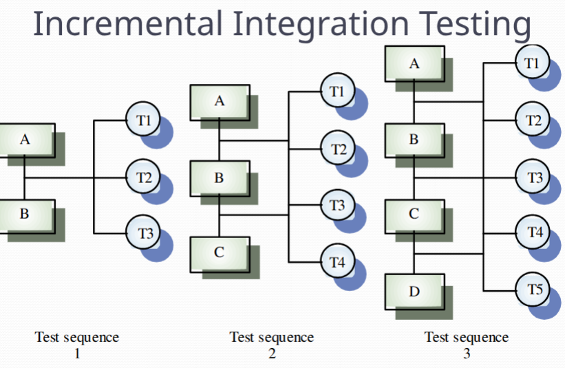

增量集成运用了[回归测试](#what_is_regression_test)的理念，即未来的测试也会再次测试之前的测试用例。

当添加一个新模块时，我们不仅会运行新的测试，还会确保新模块的添加不会“破坏”之前的测试用例。

> 有时可以通过使用测试工具（一种用于自动生成测试数据并记录结果的程序）来自动完成此操作。
>
> 如果对此感兴趣，请参阅Java的**Junit**


实际上，集成测试会包含Top-down Testing和Bottom-up Testing 两者的混合。

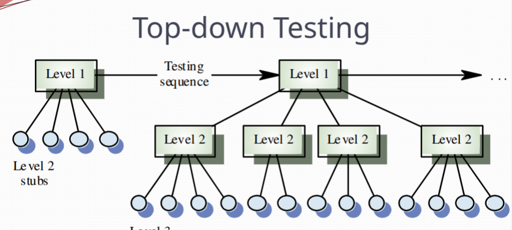

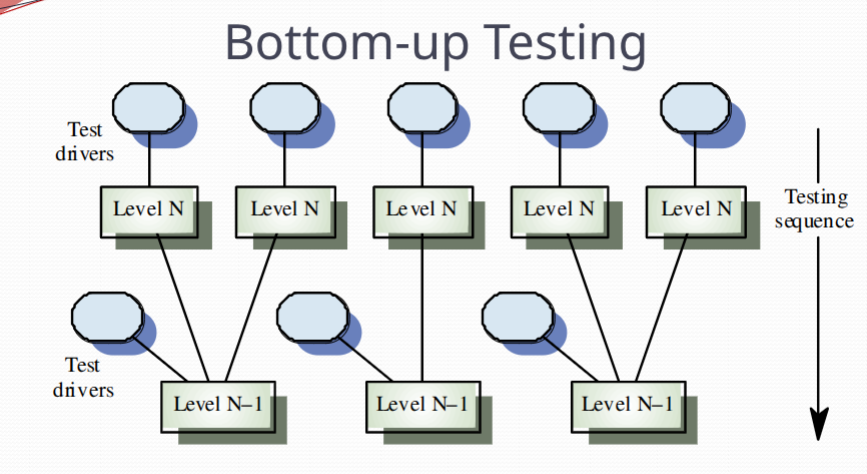

> 什么情况下会采用 Bottom-Up Testing？
>
> - 面向对象系统（OO System），因为可以分解为 Class 和 Method
> - 实施系统（Real-time System），因为可以更快的找到代码中运行的慢的地方
> - 严格要求性能的系统（Strict Performance Requirement System），这样可以从下向上测试性能


组件测试和集成测试过程一般是**组件到集成**：

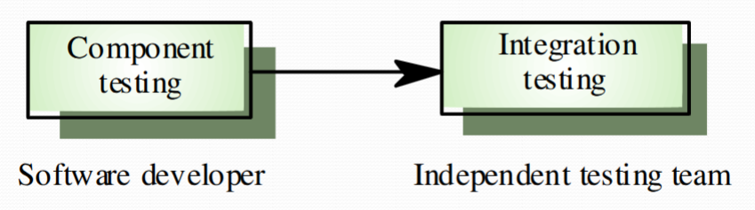


##### 接口测试

PPT也介绍了这个测试，我们归类为集成测试中的一环。

1. 测试目标：检测因接口错误或对接口的无效假设导致的故障（面向对象开发中尤为重要）
2. 接口类型：
   - 参数接口（Parameter Interfaces）
     - 就是最普通的接口
   - 共享内存接口（Shared Memory Interfaces）
     - 多个模块共同访问同一块内存区域（如全局变量、公共缓冲区或单例对象）。
   - 过程接口（Procedural Interfaces）
     - 提供服务的，这通常演变为我们常说的 **API**
   - 消息传递接口（Message Passing Interfaces）
     - 指一个子系统通过发送消息请求另一个子系统的服务。	


常见接口错误：

- **接口误用 Interface Misuse**（如参数顺序错误）

- 接口误解 **Interface Misunderstanding**（字面意思，就是比如调用接口`refund`误以为他是订购订单，实际上这是退款的接口 ）

-  **Timing Error**（调用双方速度不匹配）

  > 一个 “生成报表” 接口是异步的（需要 5 秒处理），但调用方调用后立刻去查询 “报表是否生成”，此时接口还在处理中，返回 “报表不存在”，调用方就误以为生成失败 —— 这是调用方 “等得太快”，没匹配接口的处理速度。


> ### 如何测试接口
>
> 假设我们有一个处理用户积分的接口 `PointService`：
>
> ```java
> public interface PointService {
>     // 过程接口：给指定账户增加积分
>     void addPoints(User user, int amount);
> }
> ```
>
> 我们可以根据准则编写如下测试逻辑：
>
> #### 边界值测试 (Extreme Ends)
>
> 测试 `int` 类型的最大值和最小值，看计算是否溢出。
>
> ```java
> // 准则：使用极端值
> service.addPoints(validUser, Integer.MAX_VALUE); 
> service.addPoints(validUser, Integer.MIN_VALUE); 
> ```
>
> #### 空指针测试 (Null Pointers)
>
> 这是接口测试中最基础且最重要的步骤。
>
> ```java
> // 准则：测试 null 指针
> service.addPoints(null, 100); 
> ```
>
> #### 诱发失败测试 (Cause to Fail)
>
> 输入不合逻辑的业务数据，观察系统是否能优雅报错而非崩溃。
>
> ```java
> // 准则：设计让组件失败的测试（例如增加负数积分）
> service.addPoints(validUser, -500); 
> ```
>
> 4. 压力测试 (Stress Testing - 消息传递)
>
> #### 模拟大量消息瞬时涌入接口。
>
> ```java
> // 准则：对消息传递系统使用压力测试
> for (int i = 0; i < 10000; i++) {
>     new Thread(() -> service.addPoints(validUser, 1)).start();
> }
> ```
>
> #### 顺序变化测试 (Vary Order - 共享内存)
>
> 如果系统依赖全局变量，测试不同的操作顺序。
>
> ```java
> // 准则：改变激活顺序。场景：先扣费还是先加分？
> // 测试 A 序列：调用 -> 修改内存 -> 返回
> // 测试 B 序列：多个组件同时读取同一内存块进行修改
> ```


---

别的一些要点：

<a id="exhaustive_testing"></a>

- 只有**穷尽测试（Exhaustive testing）**才能证明一个程序没有缺陷。然而，**穷尽测试是不可能的**。

- 测试应该检验系统的功能，而非其组件

  > Tests should exercise a system's **capabilities** rather than its **components**

- 测试旧功能比测试新功能更重要

- 测试**典型情况**比测试边界值情况更重要


敏捷开发里的测试：先写测试用例，再写代码，代码要能通过测试才行（比如 XP、SCRUM），这样代码更贴合需求，还能保证随时可测。


> [!NOTE]
>
> 测试和调试的区别
>
> - 测试（Testing）是 “找出 bug”
> - 调试（Debugging）是 “找到 bug 在哪，然后修复”。 调试没有固定流程，靠程序员经验，修复后还要做**回归测试**，避免引入新 bug。
>
> <a id="what_is_regression_test"></a>
>
> 什么是**回归测试（Regression Testing）**？
>
> - 修复缺陷后，使用所有先前的测试数据重新测试程序，以确保该“修复”没有引入新的问题
> - 由于成本原因，这并不总是可行的
> - 经验表明，很大一部分故障修复会引入新的错误，或者修复得不彻底
>
> 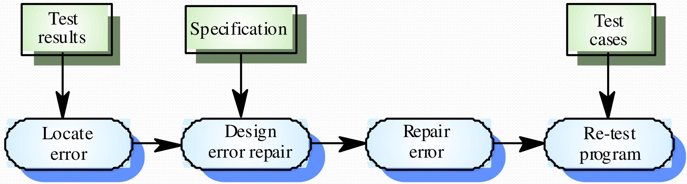


### [3.4] 面向对象测试

面向对象测试（Object-Oriented Testing）与传统测试最大的区别在于，测试的最小单元不再是单个函数，而是**类（Class）** 。由于对象具有封装、继承和多态等特性，测试变得更加复杂，因为测试信息往往不是局限在一个地方 。

测试有不同等级

- 对象（Object）测试
- 类（Class）测试
  - 测试这个类中所有的方法
- 集群（Cluster）测试
- OO System 测试

> 从小到大


## [4] 语法和语义错误

语法错误（Syntax Error）：通常会被编译器捕获，编译器会指出错误发生的位置以及错误类型。

```java
int a = "a"; // Syntax Error: Incompatible types. Found: 'java.lang.String', required: 'int'
```


**语义错误（Semantic error）**，也称为逻辑错误（Logical Error），可能出现在能够编译并运行的程序中，但在某些（或所有）输入下会产生不正确的输出！

比如，这里会导致溢出问题...

```java
public static int sum(long x, long y){
        return (int) (x+y);
}
```


<a id="test_planes"></a>

## [5] 测试计划

测试计划是用来指导测试过程的！

一个完整的测试计划包含以下七个核心部分

1. 测试流程（Testing Process）：它定义了从单元测试、集成测试到系统测试的整体流转路径。
2. 需求可追溯性（Requirement Traceability）：确保每一项需求都经过了单独的测试。
3. 被测项 (Tested items)：明确指定软件过程中需要被测试的产品。
4. 测试进度 (Testing schedule)：制定整体的时间表，并分配资源。
5. 测试记录程序 (Test recording procedures)：系统地记录测试结果，而不仅仅是运行测试。
   - 记录是为了实现**过程审计**，以检查测试是否正确执行。
   - 对于**安全关键系统（Safety Critical System）**，这种审计程序通常是法律或行业规范要求的必备项。
6. 硬件与软件需求 (Hardware and software requirements)：列出所需的测试工具和预计的硬件资源占用情况。
7. 约束条件 (Constraints)：预估并列出任何影响测试过程的限制因素。


<a id="useful_testing_technique"></a>

## [6] 实用的测试技巧

- 等价类划分（Equivalence Partitioning）：
  - 把输入 / 输出分成几类（比如 “5 位整数” 分成 “小于 10000”“10000-99999”“大于 99999”）
  - 每类选几个典型值 ，比随机测试高效。
  - 如果你测试了某个区间内的一个代表性数值，**那么该区间内的所有其他数值的运行结果应该是相同的**。

<a id="path_testing"></a>

- 路径测试（Path Testing）：
  - 路径测试的目标是确保测试用例集能够使程序中的每条路径都**至少被执行一次。**
  - 路径测试的起点是一个**程序流程图**，该图用节点表示程序判断，用弧线表示控制流。
  - 用 **“环路复杂度（Cyclomatic Complexity）”** 算出：需要多少测试用例才能覆盖关键路径。
  - 显然，这属于白盒测试！
- 边界值测试（Boundary Testing）
  - 边**界值测试（Boundary Value Test）**
  - 包含**下限无效**、下限有效、上限有效、**上限无效**。这是最完整的边界测试方案。
  - 简而言之，如果说，允许的范围是`[a,b]`那么测试应当包含`a-1`，`a`，`b`，`b+1`！


> [!NOTE]
>
> 环路复杂度计算公式如下：
> $$
> c=\text{边数}-\text{节点数}+2
> $$
> 

<a id="cyclomatic_complexity"></a>

### [6.1] 环路复杂度

Cyclomatic Complexity

如下二分查找代码：

```java
public static int searchIndex(int key, int[] elementArray) {
    int bottom = 0; // 底部index
    int top = elementArray.length - 1; //顶部 index
    int mid; // 中间值
    while (bottom <= top) {
        mid = (top + bottom) / 2;
        if (elementArray[mid] == key) {
            return mid;
        }
        if (elementArray[mid] < key) bottom = mid + 1;
        else top = mid - 1;
    }
    return -1; // 没找到
}
```

可以画出这个代码程序流程图

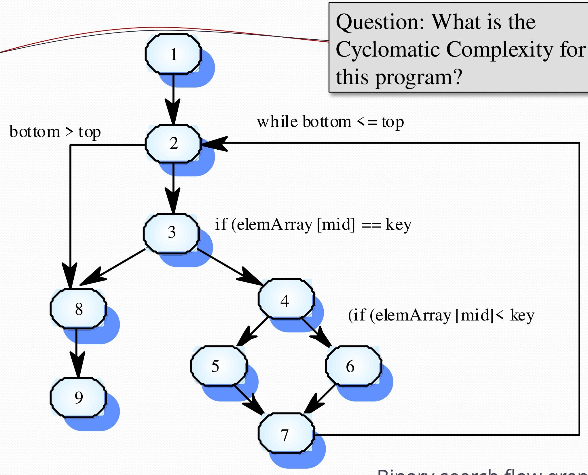


因此环路复杂度
$$
\begin{align}
c&=\text{边数}-\text{节点数}+2\\
&=11-9+2\\
&=4
\end{align}
$$


> 如果只给出代码，难道还要画出流程图才能判断环路复杂度？
>
> 这样容易出错。
>
> > [!CAUTION]
> >
> > 实际上，PPT给出的是控制流图（CFG-Control Flow Graph）法，他的原公式是这样的
> > $$
> > c = 边数 - 节点数 + 2*组件数
> > $$
> > 只不过这里组件数量是1
>
> 可以引入一个新的方法：
>
> #### 判定节点法（最简便）
>
> Desition Point
>
> 环路复杂度 $V(G)$ 可以通过计算代码中的**判定节点（Decision Points）**数量来获得。
>
> 公式为：
> $$
> c = 判定节点数 + 组件数
> $$
> 
>
> 其中 $P$ 是代码中的谓词节点（判断语句）数量。
>
> 1. **判定点 1**：`while (bottom <= top)` —— 这是一个循环判定。
> 2. **判定点 2**：`if (elementArray[mid] == key)` —— 这是一个条件判定。
> 3. **判定点 3**：`if (elementArray[mid] < key)` —— 这是另一个条件判定。
>
> 计算：
>
> $$3 \text{ (判定点)} + 1 = 4$$


如果组件数量不是1呢？

**例题：包含三个方法的简单模块**

```java
class OrderManager {
    // 方法 A：简单的折扣判定 (1个判定点)
    public int applyDiscount(int price) {
        if (price > 100) return price - 10; // P1
        return price;
    }

    // 方法 B：无分支的直接赋值 (0个判定点)
    public void logOrder(String msg) {
        System.out.println("Order: " + msg);
    }

    // 方法 C：循环处理项 (1个判定点)
    public void processItems(int count) {
        while (count > 0) { // P2
            count--;
        }
    }
}
```

方法1，使用节点判定法：
$$
c = 判定节点数+组件数 = 2+3=5
$$
这里判定节点一共有2个，一共3个组件。


方法2就是PPT介绍的方法，比较复杂。但是算出来也是 $c=5$。


算出来的结果，也就是环路复杂度 $c$ 有什么意义？

- 它确定白盒测试的最小工作量！
  - 如果 $c = 4$，说明程序中存在 4 条独立的线性路径。你至少需要设计 4 个不同的测试用例来确保每一行代码、每一个分支都被执行过。
- 评估代码的可维护性与风险
  - 通常认为 $V(G) > 10$ 时，代码的逻辑就过于复杂了。这种代码极难理解、极易出错，且后期维护成本极高。
  - 如果一个方法的复杂度过高，通常暗示着应该将该方法拆分为多个更小、更简单的组件，以降低每个组件的 $P$ 值（判定点数）。


## [7] 软件程序审查

Software Programme Inspections（软件程序审查）可以简单理解为 **“多人一起‘找茬’的静态检查”**

程序审查在发现错误方面非常有效

- 不运行软件，通过人工（或辅助工具）集体审查文档、代码等产物，找出问题的过程。
- 审查的是需求文档、设计图、代码等 “静态产物”，不用编译或运行程序；
- 通常是开发、测试、产品等不同角色的人一起参与，从不同角度找问题；
- **查的是 “全类型问题”**：不仅能找 bug，还能查文档逻辑矛盾、代码规范问题、设计不合理（比如难维护）等；
- **早期就能做**：从需求阶段（文档）到代码阶段都能开展，不用等软件做出来再查。


# Project management and software estimation

> 这个大章节涵盖的两个考点应该是**Scheduling**和**Software cost estimation**
>
> 他的PPT讲的很乱，但是这两个点应当会单独拿出来
>
> 其他省略了，感觉和八股文差不多

项目管理工具：Zoho


## [1] Scheduling

将项目分解为任务，并估算完成每项任务所需的时间和资源，这就是 Project Scheduling

Project Scheduling 有时候会遇到很多问题...

1. 难估算（Hard to estimate）任务难度与开发成本

   > 比如以为开发一个简单的用户登录功能要5天，实际做的时候发现要对接3个第三方账号，还得处理安全验证，最后花了12天，成本也跟着超了。

2. 效率和参与人数不成正比

   > 一个数据整理任务，1个人做要10天，不是加1个人就变成5天——两个人要花时间对接分工、核对结果，最后可能要7天，人多未必快。

3. 项目延期时加人反拖更

   > 项目本应20天完成，第15天还剩一半活，临时加2个新成员，老员工得花3天教他们熟悉项目、理清逻辑，新成员融入后又要磨合沟通，最后项目反而多花了5天收尾。

4. 意外频发需留**应急措施（Contigency）**

   > 原本计划8天完成接口开发，结果中途合作的服务器突然故障，修了2天，幸好提前留了3天应急时间，没影响整体进度；要是没留缓冲，就直接导致项目延期。
   >
   > Always allow for **CONTIGENCY！**


| Task | Duration (days) | Dependencies |
| ---- | --------------- | ------------ |
| T1   | 8               |              |
| T2   | 15              |              |
| T3   | 15              | T1(M1)       |
| T4   | 10              |              |
| T5   | 10              | T2,T4 (M2)   |
| T6   | 5               | T1,T2 (M3)   |
| T7   | 20              | T1 (M1)      |
| T8   | 25              | T4 (M5)      |
| T9   | 15              | T3,T6 (M4)   |
| T10  | 15              | T5,T7 (M7)   |
| T11  | 7               | T9(M6)       |

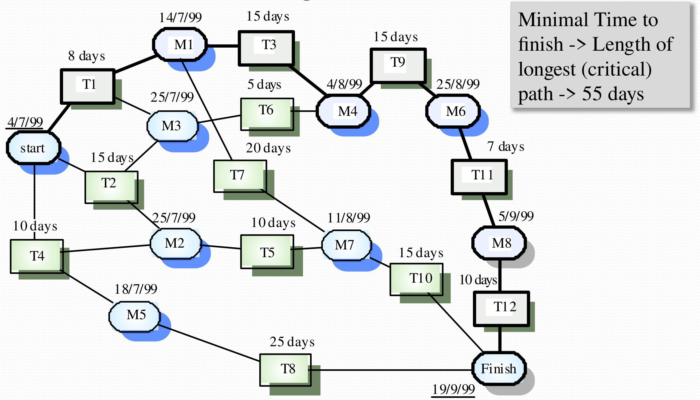

活动时间线：

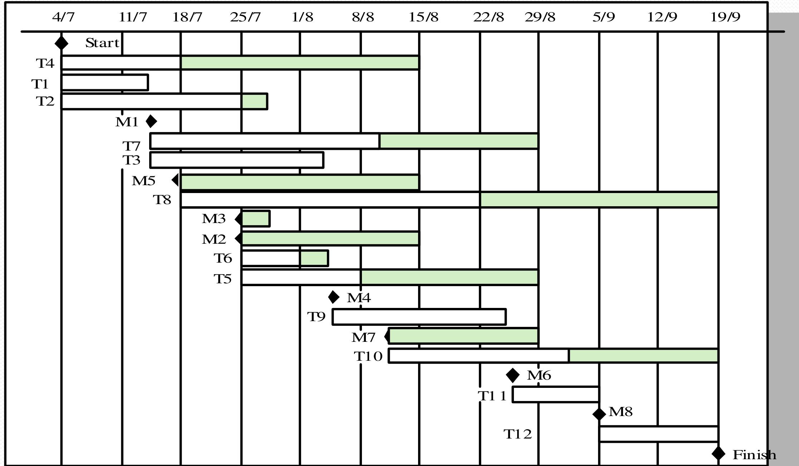

人员分配：

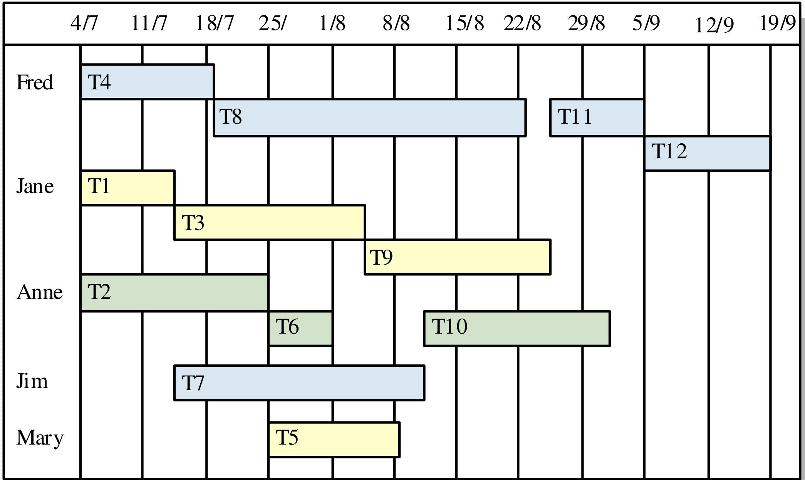


<a id="cost_estimation"></a>

## [2] Cost Estimation

软件成本估算

### [2.1] 背景介绍

1. 先明确估算要解决的问题：得知道做每个环节要花多少精力、多少日历时间，以及总成本是多少，而且估算和项目排期是绑在一起的，得一起考虑。
2. 软件成本主要包括这些：买软硬件的钱、出差和培训的钱，最主要的是 “人力成本”—— 不仅是工程师工资，还得算上办公室房租、水电、网络、公共设施（如图书馆、员工餐厅）这些间接开销。另外，开发成本和给客户的报价不是一回事，报价会受很多因素影响。
3. 报价不是只看成本，还得考虑这些：比如想进新市场就报低价赚后续生意；不确定成本就多加一笔备用金；如果客户允许软件代码复用，报价可能低些；客户需求容易变，可能先低价拿单，后续改需求再高价；公司资金紧张时，哪怕少赚或不赚也会接单，总比倒闭强。
4. 怎么衡量程序员效率？主要看单位时间能做出多少有用的功能。常用两种方法：一种是算 “代码行数”（比如每月写多少行代码），另一种是算 “功能点”（比如软件有多少个输入输出、用户交互、外部接口等，加权求和），还有 “对象点”（算屏幕显示数、报告数、要开发的模块数）。不过要注意，低级语言写同样功能要多写代码，所以用低级语言的程序员，按行数算效率反而可能更高。
5. 估算时会遇到不少麻烦：比如没法准确预估软件最终大小、不知道合作团队（比如文档组）的效率；算代码行数也没统一标准 —— 有的代码一行跨多行，有的一行写好几句，还不确定哪些程序要算进系统；而且只看代码行数或功能数，没法体现软件质量，有时候为了多写代码提 “效率”，反而会牺牲质量。
6. 不同软件的效率参考：实时嵌入式系统（比如智能设备里的软件），每月大概能写 40-160 行代码；系统程序（比如操作系统相关）每月 150-400 行；商业应用（比如办公软件）每月 200-800 行。按对象点算的话，每月大概 4-50 个对象点，具体看软件类型、工具好不好用、开发人员能力。
7. 哪些因素会影响程序员效率？一是对行业的熟悉度 —— 懂行的工程师做事更顺；二是开发流程规范不规范；三是项目大小 —— 项目越大，团队沟通花的时间越多，实际开发时间就少，效率变低；四是工具好不好用（比如有没有辅助开发的 CASE 工具）；五是工作环境 —— 安静、有私人空间的环境能提高效率。

### [2.2] 常用估算方法

#### [2.2.1] 专家判断

Expert Judgement

找懂开发和行业的专家，凭经验估算，直到大家达成共识，优点是便宜，缺点是没专家就完全不准。

#### [2.2.2] 类比估算

Estimation by Analogy

#### [2.2.3] Parkinson 定律

Parkinson's Law

**按现有资源算成本** 

比如有 5 个人，默认给定**12 个月时间**，就按 60 人月（5 人 ×12 月）算，优点是不会超支，缺点是软件**可能做不完**。

但是也可能完全能做完，然后剩下几个月都在摸鱼。


#### [2.2.4] 低价抢单

Pricing to win

该项目的成本取决于**客户必须在其上花费的金额**。

按客户能花的钱来定成本，优点是能拿到合同，**缺点是客户大概率得不到想要的软件（因为你要价低，那一分钱一份货）**，成本和实际工作量不匹配。

> 这种方法可能看起来不道德且不符合商业规范？
>
> 参考房地产...


#### [2.2.5] 算法成本建模

Algorithmic Cost Modelling

**核心公式**：大多数算法成本模型都遵循一个基本公式
$$
Effort = A \times Size^{B} \times M
$$

- **$A$**：一个取决于组织机构的常数
- **$Size$**：软件的规模，最常用的是代码行数（LOC）
- **$B$**：反映大型项目所需额外工作量的指数。当 $B > 1$ 时，意味着随着系统规模增大，工作量并非线性增长，而是不成比例地增加
- **$M$**：一个乘数，反映了产品质量要求、开发过程属性、硬件限制和人员经验等因素的影响
- 

**计算示例**

假设一家软件公司根据其历史数据确定了以下参数，用于估算一个新的商业应用项目：

- **$A$（组织常数）**：2.4
- **$Size$（预估规模）**：10 KLOC（即 10,000 行代码）
- **$B$（规模指数）**：1.05（表示大型项目由于沟通等因素工作量略有增加）
- **$M$（综合乘数）**：1.2（假设因为使用了新技术或开发团队经验较少，导致工作量增加 20%）

计算过程：
$$
Effort = 2.4 \times 10^{1.05} \times 1.2 \approx 32.3 \text{ 人/月（Person-months）}
$$
这意味着该项目预计需要大约 **32.3 个人月** 的工作量	


> [!CAUTION]
> $$
> Effort = A \times Size^{B} \times M
> $$
> 如果当前开发的软件没有先前参考，那么这种成本估算方法其实不太管用。
>
> 公式中的 $A$（比例因子）和 $B$（指数，代表规模经济或不经济）并不是随手填写的数字。在实际工程中，它们需要根据企业过去类似项目的历史数据进行回归分析和校准。
>
> 题目如果明确说明“**没有可比软件**”。这意味着你无法通过历史经验来确定 $A$ 和 $B$ 的值。如果你直接借用教科书上的通用值（例如 $A=2.4$），往往会产生巨大的偏差，因为不同团队和环境的生产率完全不同。
>
> 

### [2.3] 两种估算思路

- 自上而下（Top-down）：先看整个系统的功能，再拆分到子系统估算。
- 自下而上（Bottom-up）：先算每个组件要花的精力，再汇总出总估算。


# Exam

```sql
[4.0K]  .
├── [182K]  example_1_answer.pdf
├── [455K]  example_2_answer.pdf
└── [   0]  过于老旧的试卷
    ├── [ 12K]  final_2001.pdf
    ├── [1.0M]  final_2002.pdf
    └── [ 12K]  resit_2001.pdf

2 directories, 5 files
```


## [1] example_1_answer.pdf

<a id="example_1_answer"></a>

### Question 1

> 考点：[软件测试中的确认（Validation）和验证（Verification）的区别](#testing_and_quality_assurance)

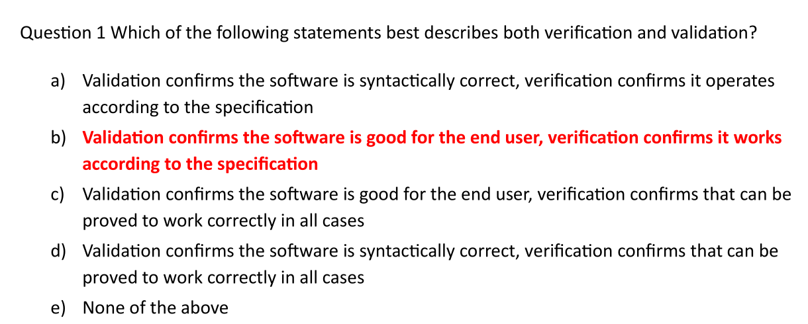


这里考的是 Validation 和 Verification的区别。

- Verification 和 [Specification](#3_1_what_is_specification)挂钩，测试样例就是从Specification来的！Verifi**cation** --- Specifi**cation**
- Validation 和 用户的真实需求有关


### Question 2

> 考点：[类图](#class_diagram) 中的关系
>
> | **Relation (关系)**                | **Identifier (标识)** | **Arrow (箭头样式)**           |
> | ---------------------------------- | --------------------- | ------------------------------ |
> | **Dependency** (依赖)              | use-a                 | `....>` (虚线开放箭头)         |
> | **Association** (关联)             | has-a                 | `────>` (实线开放箭头) 或 `──` |
> | **Association-Aggregation** (聚合) | has-a / is-part-of    | `────◇` (带空心菱形的实线)     |
> | **Association-Composition** (组合) | has-a / is-part-of    | `────◆` (带实心菱形的实线)     |
> | **Inheritance** (继承/泛化)        | is-a                  | `────▷` (带空心三角形的实线)   |
> | **Implementation** (实现)          | is-**like**-a         | `....▷` (带空心三角形的虚线)   |
>
>  

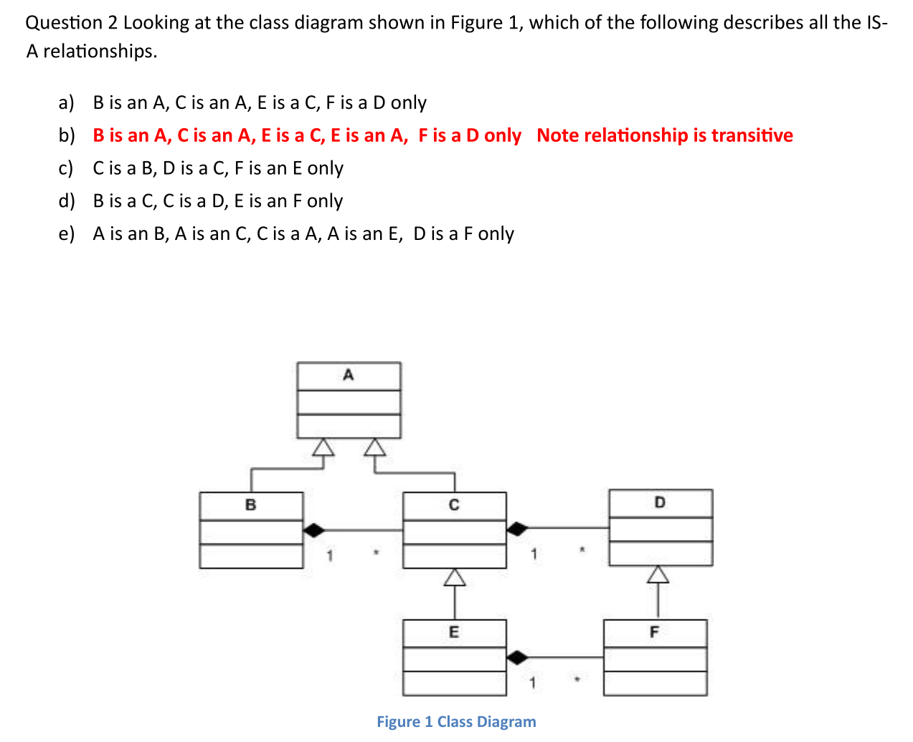

这里是类图，白色箭头是**[继承关系[is-a]](#inheritance_relationship)**，黑色菱形箭头是[关联关系](#association_relation)中的**[组合关系[has-a]](#composition_relationship)**。

因此，只有白色箭头是 `is-a` 关系。同时，**Relationship is transitive（关系是传递的！）**


### Question 3

> 考点：[类图](#class_diagram) 中的关系
>
> | **Relation (关系)**                | **Identifier (标识)** | **Arrow (箭头样式)**           |
> | ---------------------------------- | --------------------- | ------------------------------ |
> | **Dependency** (依赖)              | use-a                 | `....>` (虚线开放箭头)         |
> | **Association** (关联)             | has-a                 | `────>` (实线开放箭头) 或 `──` |
> | **Association-Aggregation** (聚合) | has-a / is-part-of    | `────◇` (带空心菱形的实线)     |
> | **Association-Composition** (组合) | has-a / is-part-of    | `────◆` (带实心菱形的实线)     |
> | **Inheritance** (继承/泛化)        | is-a                  | `────▷` (带空心三角形的实线)   |
> | **Implementation** (实现)          | is-**like**-a         | `....▷` (带空心三角形的虚线)   |

 

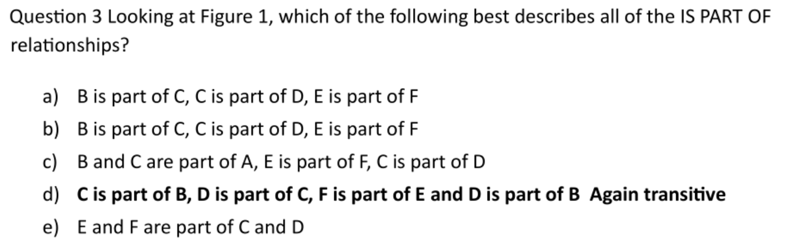


### Question 4

> 考点：[用例图中的扩展（Extends）和包含（Include）关系](#extends_and_include_in_use_case_diagram)

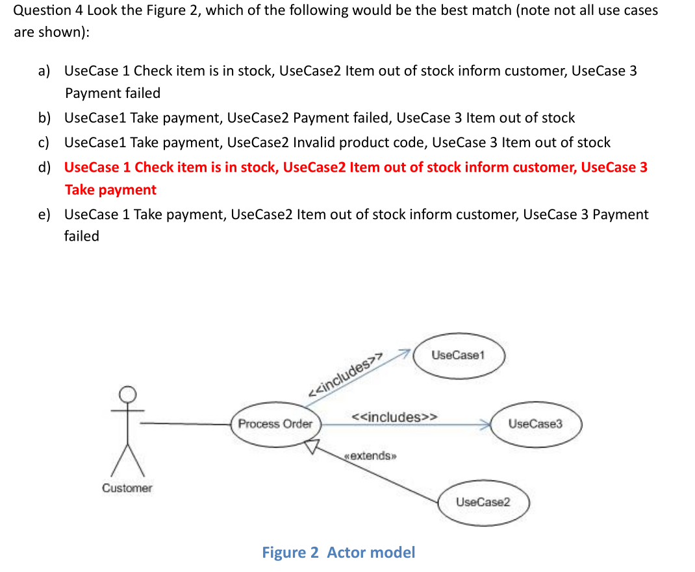


**Include (包含)**：表示“必须执行”。如果 A 包含 B，那么每当执行 A 时，B 也必须执行。

**Extend (扩展)**：表示“可选执行”或“异常情况”。只有在满足特定条件（扩展点）时，才会执行扩展用例。


选项A：Payment failed 使用了 Include（必须执行），这是错误的，因为支付失败是有条件的！

选项B：Item out of stock 使用了Include（必须执行），这是错误的，因为商品不一定每次都缺货！

选项C：同选项B

选项D：正确的，必须执行的是 Check item is in stock和 Take payment，特殊情况是 Item out of stock inform customer

选项E：同选项A


### Question 5

> 考点：[Petri网](#petri_net_main) 中的激活

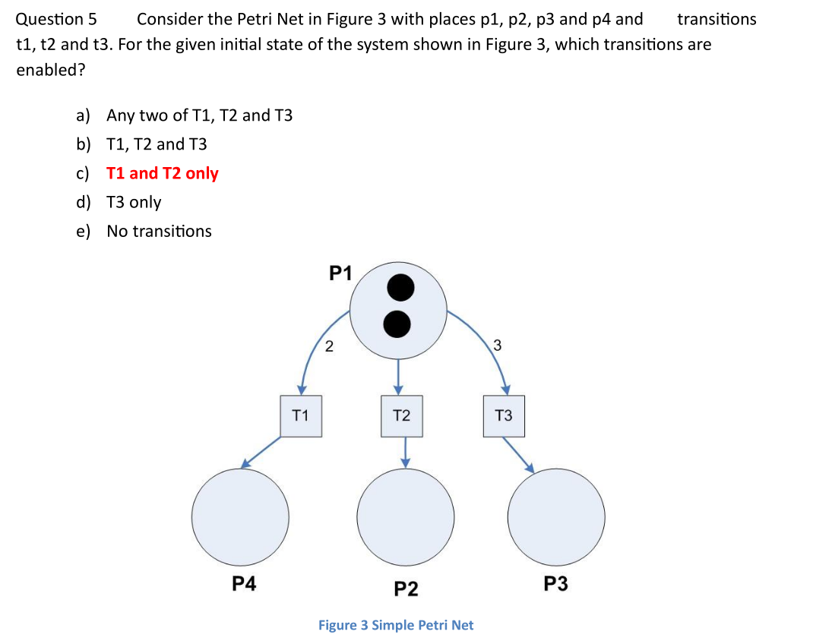


显然，transitions T1 需要2个tokens， T2需要1个tokens，都小于等于P1的tokens，因此激活


### Question 6

> 考点：[Petri网](#petri_net_main) 中的[firing](#petri_net_firing)

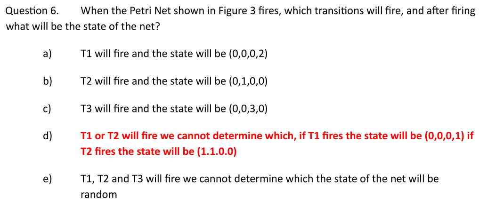


这里题目中**After Firing**其实指的是1步Firing，所以我们只需要考虑1步即可。

d选项更全面，实际上我们确实无法判断是T1还是T2开火，因为他们属于竞争关系。

### Question 7

> 考点：[Cohesion 内聚](#what_is_cohesion) 与 [coupling 耦合](#what_is_coupling)

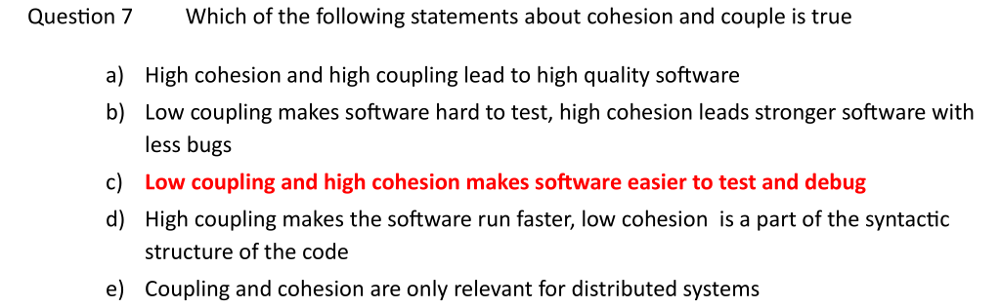


我们说过，[一个好的软件应该是高内聚，低耦合（High cohensive, low coupling）](#loose_coupling_tight_cohesion)。

> Note：
>
> 一个类管的事越多、职责越杂，反而**内聚越低**；
>
> 管的事越少、越集中，**内聚才越高**。 


### Question 8

> 考点：[黑盒、白盒测试](#black_and_white_box_testing)，[路径测试](#path_testing)

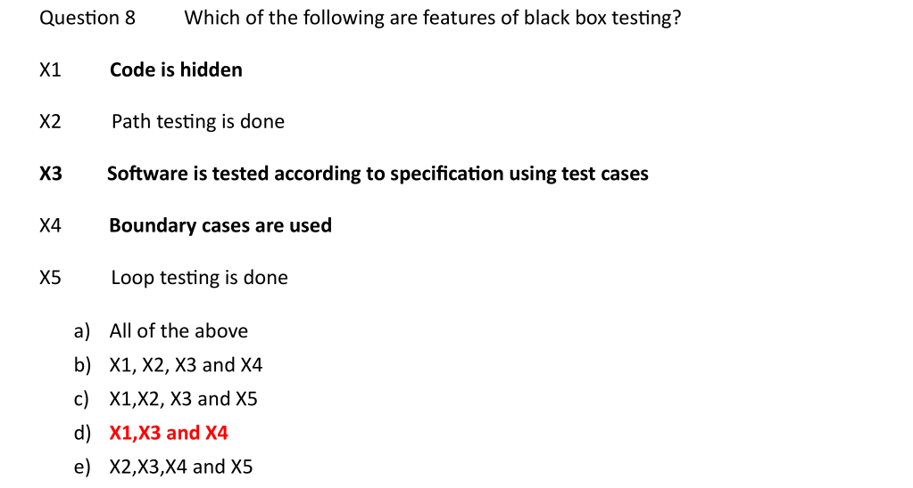


| **编号** | **特征描述**                                                 | **是否属于黑盒测试？** | **原因分析**                                                 |
| -------- | ------------------------------------------------------------ | ---------------------- | ------------------------------------------------------------ |
| **X1**   | **Code is hidden** (代码是隐藏的)                            | **是**                 | 测试者像普通用户一样操作，看不到内部源代码。                 |
| **X2**   | **[Path testing](#path_testing) is done** (进行路径测试)     | **否**                 | 路径测试需要分析代码的逻辑分支和执行路径，属于**白盒测试**。 |
| **X3**   | **Software is tested according to specification using test cases** (根据规格说明书使用测试用例) | **是**                 | 黑盒测试的核心就是验证软件行为是否符合“规格说明（Specification）”。 |
| **X4**   | **[Boundary cases are used](#useful_testing_technique)** (使用边界值案例) | **是**                 | **边界值分析 (BVA)** 是黑盒测试中最经典的技术，用于测试输入范围的边缘。 |
| **X5**   | **Loop testing is done** (进行循环测试)                      | **否**                 | 循环测试需要检查代码中 `for/while` 等循环结构的执行情况，属于**白盒测试**。 |

> 注：循环测试，顾名思义，就是测试代码中的循环，显然，黑盒测试是不涉及代码的，因此，循环测试属于白盒测试
>
> PPT中没有涉及到这个测试。


### Question 9

> 考点：软件的鲁棒性

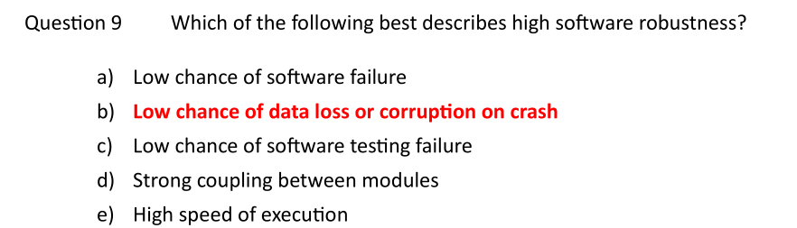


这个考点没有在PPT中讲到，但是根据常识，**鲁棒性**说人话就是抗干扰能力。

- 鲁棒性越强，抗干扰越强
- 鲁棒性越弱，抗干扰越弱

很容易选出B：崩溃时数据丢失或**损坏（Corruption）**的概率很低


| **选项** | **描述**     | **为什么不选？**                                             |
| -------- | ------------ | ------------------------------------------------------------ |
| **A**    | 低软件故障率 | 这是**可靠性 (Reliability)**。可靠性关注“正常运行不坏”，**而鲁棒性关注“万一坏了，能不能扛住”**。 |
| **C**    | 低测试失败率 | 这是**测试质量或代码质量**。测试失败率低可能意味着测试用例太简单，或者软件质量好，但并不直接定义“鲁棒性”。 |
| **D**    | 模块间强耦合 | 这是**差的设计方案**。                                       |
| **E**    | 高运行速度   | 这是**性能 (Performance)**。跑得快的软件不一定扛得住错误输入。 |


### Question 10

> 考点：[非功能性需求](#2_functional_and_non_functional_requirement)


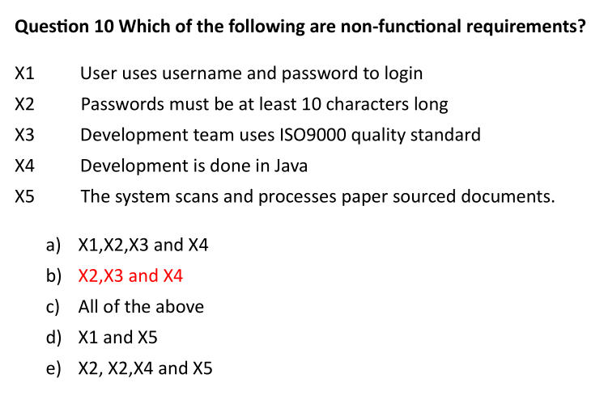

**功能性需求**通常

- 可以用“**用户可以...**”或“**系统应当执行...**”来描述
- ==如果删掉这个需求，系统就少了一个功能==

**非功能性需求**通常

- 带有数字（如 99.9%, 3秒, 256位）
- 描述标准（如 ISO, Java, RESTful）
- 如果删掉这个需求，系统**功能还在**，但可能变得很慢、很不安全或很难维护。

我们用如上方法来尝试！


| **编号** | **描述**                      | **类型**     | **原因解释**                   |
| -------- | ----------------------------- | ------------ | ------------------------------ |
| **X1**   | 用户使用用户名和密码登录      | **功能性**   | 删除了这个，就少了一个登陆功能 |
| **X2**   | 密码必须至少 10 个字符长      | **非功能性** | 删除了这个，不影响功能         |
| **X3**   | 开发团队使用 ISO9000 质量标准 | **非功能性** | 删除了这个，不影响功能         |
| **X4**   | 开发工作使用 Java 完成        | **非功能性** | 删除了这个，不影响功能         |
| **X5**   | 系统扫描并处理纸质源文档      | **功能性**   | 删除了这个，少了一个处理功能   |


## [2] example_2_answer.pdf

### Question 1

> 考点：[环路复杂度计算](#cyclomatic_complexity)

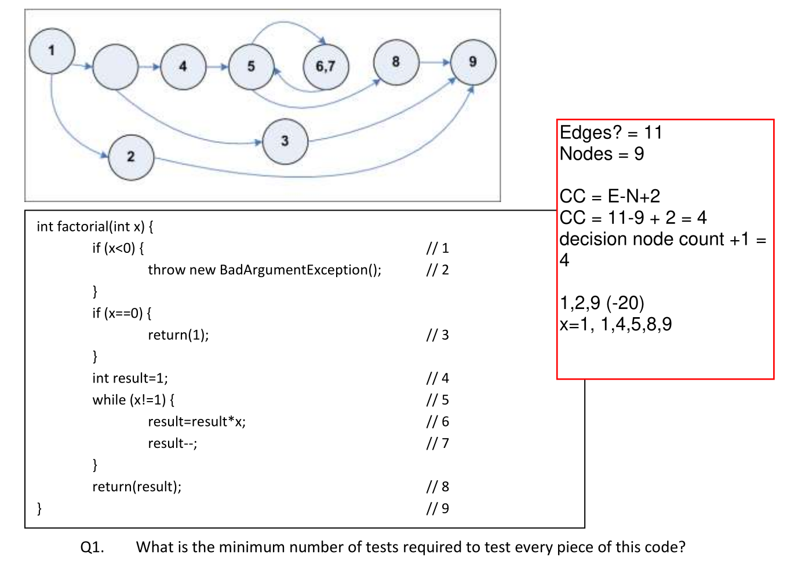

我们有两个方法计算这个环路复杂度，第一个方法是CFG：
$$
c = 边数 - 节点数 + 2*组件数
$$
根据图，我们可写出
$$
c=11-9+2*1=4
$$


当然我们也可以使用节点判定法：
$$
c = 判定节点数 + 组件数
$$
这里有2个`if` ， 1个`while`，一个三个节点，1个组件，因此
$$
c=3+1=4
$$

### Question 2

> 考点：模拟[路径](#path_testing)

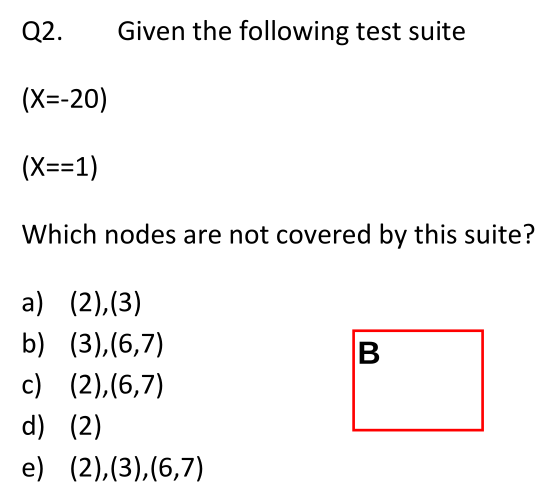 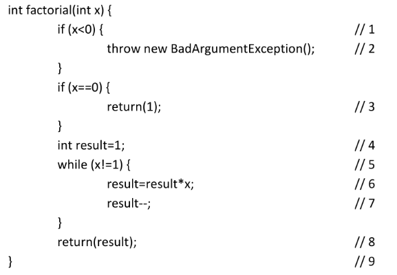


（代码一样）

要判断哪个环路没有被检测，直接带入，这个很简单。


### Question 3

> 考点：[黑盒、白盒测试](#black_and_white_box_testing)，

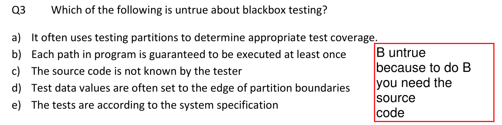


**a) 经常使用测试分区来确定合适的测试覆盖范围**： 这是正确的。黑盒测试常用**“[等价类划分法”（Equivalence Partitioning）](#useful_testing_technique)**，将输入数据分为不同的分区，从每个分区选一个代表进行测试。

**c) 测试人员不知道源代码**： 这是正确的。黑盒测试的核心定义就是把软件看作一个“黑盒子”，只关注输入和输出，不考虑内部代码结构。

**d) 测试数据值通常设置在分区边界的边缘**： 这是正确的。这被称为**[“边界值分析”（Boundary Value Analysis）](#useful_testing_technique)**，是黑盒测试中最有效的找错手段之一。

**e) [根据系统规格说明书（System Specification）进行测试](#black_and_white_box_testing)**： 这是正确的。黑盒测试又叫“功能测试”或“数据驱动测试”，其测试用例完全是根据需求文档或规格说明书来编写的。


### Question 4

> 考点：**[“边界值分析”（Boundary Value Analysis）](#useful_testing_technique)**

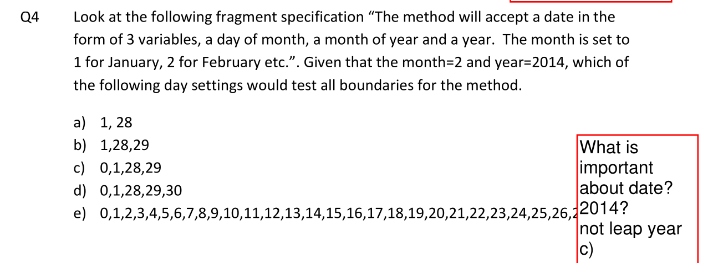


> 背景知识：
>
> | **特征**     | **平年 (Common Year)**   | **闰年 (Leap Year)**     |
> | ------------ | ------------------------ | ------------------------ |
> | **二月天数** | 28 天                    | **29 天**                |
> | **全年天数** | 365 天                   | **366 天**               |
> | **出现频率** | 通常每 4 年里有 3 个平年 | 通常每 4 年里有 1 个闰年 |
>
> 计算是否为闰年：
>
> ```java
> public static boolean isLeapYear(int x){
>    	// (能被4整除 并且 不能被100整除)  或者  (能被400整除)
>    	return (x % 4 == 0 && x % 100 != 0) || x % 400 == 0;
> }
> ```


如何测试2014年2月所有情况？首先我们必须算出2014年是不是闰年（Leap Year）：

- `2014 % 4 != 0`
- `2014 % 400 != 0`

因此 2014不是闰年，是平年。平年2月份只有28天，相比闰年29天少了一天。

允许的范围：
$$
[1,28]
$$
因此，我们为了测试所有情况 ：

c) **0**, 1, 28, **29**：包含了**下限无效**、下限有效、上限有效、**上限无效**。这是最完整的边界测试方案。


### Question 5

> 考点：**[类图中的名词甄别技术](#class_diagram)**

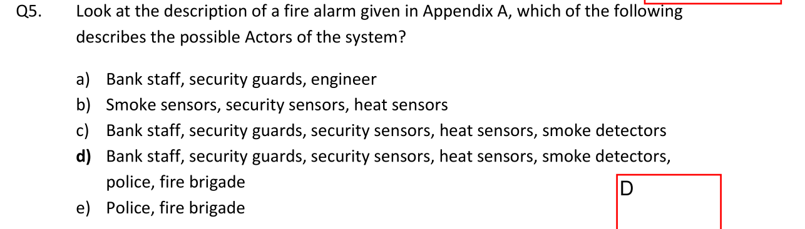

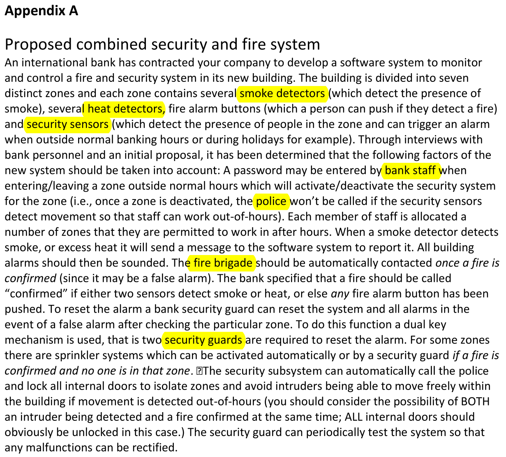


在软件需求分析中，**参与者**必须包含所有与系统有**输入**或**输出**关系的实体。选项 **d** 最全面地涵盖了文本中提到的所有交互对象（人、硬件传感器、外部紧急服务机构），因此是最准确的描述。


### Question 6

> 考点：[用例图中的扩展（Extends）和包含（Include）关系](#extends_and_include_in_use_case_diagram)

What would be the role of the use case “Fire confirmed”

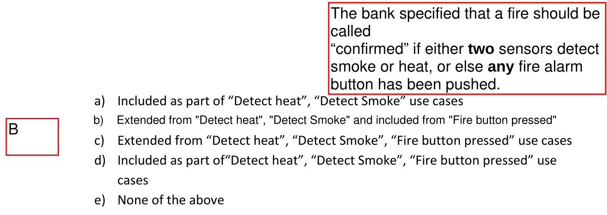

> 英语语法：
>
> `CONTIDCTION if neither A or B` 是
>
> ```java
> if(!A && !B) 
>     condiction;
> ```
>
> 
>
> `CONDICTION if either A or B` 是
>
> ```java
> if(A || B) 
>     condiction
> ```

在原提到了

一个火灾会被 CONFIRM 当且仅当： either 两个传感器检测到烟雾或者热量 **或者** 任意的火警按钮被按下，也就是

```java
boolean sensorA; // true if detected SMOKE or HEAT;
boolean sensorB; // true if detected SMOKE or HEAT;
boolean buttonPressed;
boolean confirmed = ( sensorA && sensorB ) || buttonPressed;
```


那么这里 include（一定执行）就是 buttonPressed， extended（条件执行）就是 sensorA 和 sensorB检测到 SMOKE 或者 HEAT。

因此选择B；

> **包含（Include）：**
>
> - **定义：** 基础用例（Base Use Case）在执行过程中**必须**调用被包含的用例。
> - **逻辑：** 如果 A 发生，B **一定会**发生。
>
> **扩展（Extend）：**
>
> - **定义：** 基础用例在特定条件下**可以选择性地**触发扩展用例。
> - **逻辑：** 如果 A 发生，在满足特定条件时，B **才会**发生。
>
> 当一个传感器检测到烟雾（Detect Smoke）时，系统**不一定会**进入“确认火灾”状态（因为可能只有一个传感器报警）。因此这个是扩展。


### Question 7 - 9

> 考点：**[安全模型（Bell-LaPadula Model）](#bell_lapadula)**

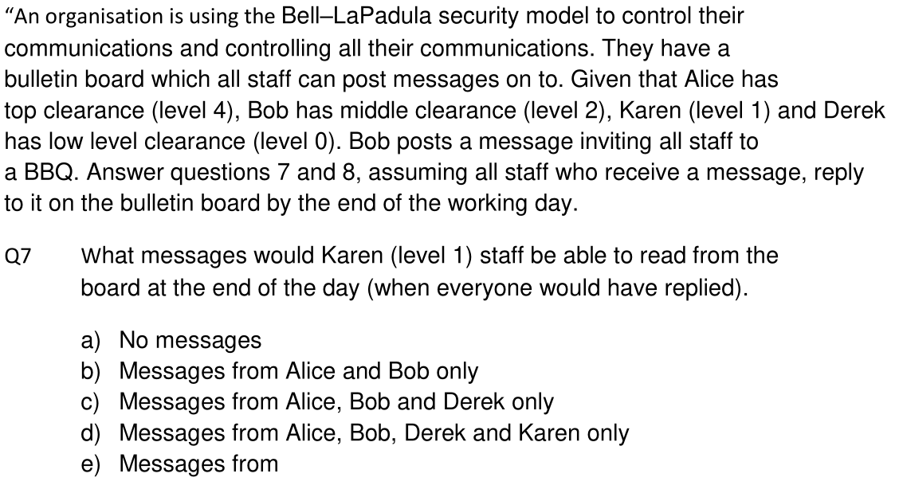

> e选项印刷错请忽略


Bell-Lapadula 模型就是禁止上度和禁止下写，根据题目描述，等级由高到低排列如下：

- **Alice:** Level 4（最高）
- **Bob:** Level 2（中等）
- **Karen:** Level 1
- **Derek:** Level 0（最低）

所以Bob发了个消息，只有Bob和Alice看得到，下面两个看不到。即便他们俩回复了，回复的消息也是如此，无法被下读。显然选A。


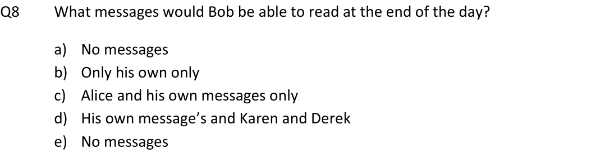

Bob能读到什么？你会发现，因为他下面的人没受到邀请，自然也没有回复，所以实际上Bob除了他自己的，谁也收不到。显然，选B。


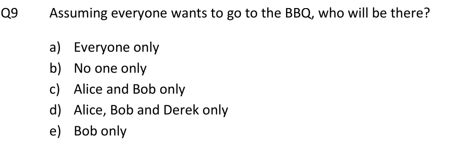


所以，Bob发了邀请，最终只有他自己和Alice能去，下面的两个人不知情，因此选C。


### Question 10

> 考点：[鉴权（Authentication）和授权（Authorization）](#authentication_and_authorization)

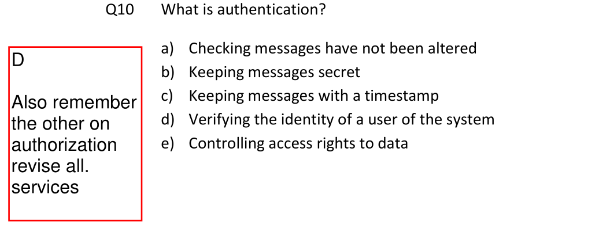

**认证/鉴权（Authentication）、授权（Authorization）**

- 认证/鉴权：告诉我你是谁？你的身份是什么？**Identity！！**
- 授权：你被允许做什么
- 通常认证鉴权和授权是攻击重点

> 可以这样记：微软有一个软件叫做 Authenticator 专门记录两步认证的，他就是告诉别的网站你是谁。
>

### Question 11

> 考点：各种测试的定义

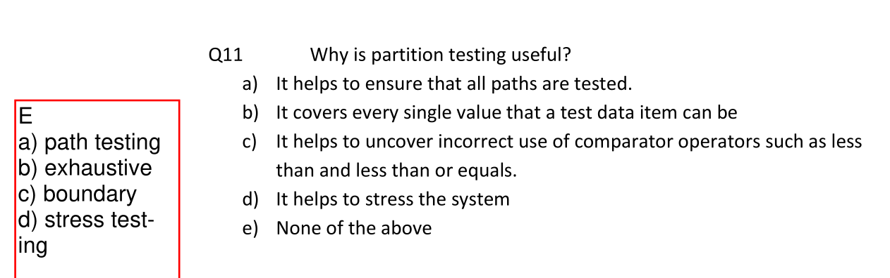


为什么划分测试（或者说是[等价类划分](#useful_testing_technique)）很有用？

A：是**[路径测试（Path Testing）](#path_testing)**：确保每个路径都被测试过了，也提到过，这是个白盒测试。

B：是**[穷尽测试（Exhausting Testing）](#exhaustive_testing)**：理想化的，但是是不可能的测试，包括了每一种可能的情况

C：是**[边界值测试（Boundary Testing）](#useful_testing_technique)**：测试了边缘情况，但这不是等价类划分测试。

D：是**[压力测试](#stress_testing)**；


因此选择E。


<a id="petri_net_inhibition_example_exam_001"></a>

### Question 12 - 20

> 考点：[Petri网](#petri_net_main) 中的[并发导致不确定性问题](#petri_concurrent_problem)、Petri网[抑制](#inhibition_in_petri_net)


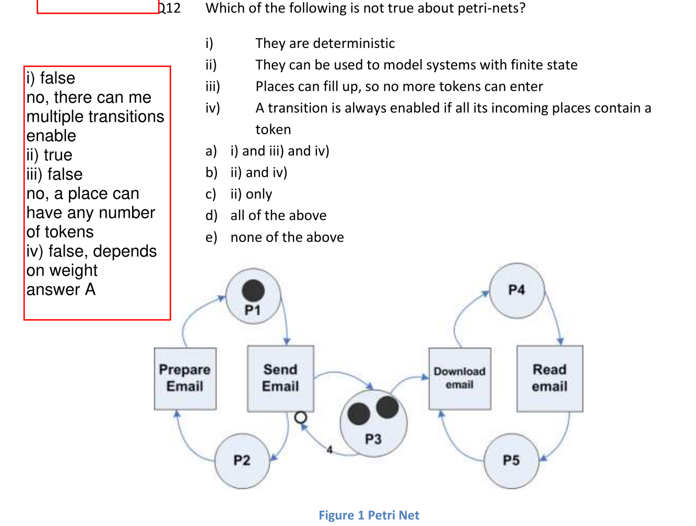


一个非常简单的方法就是我们让左边直接陷入循环，P1 token环绕一圈回到原来的位置，我们发现，这时候 P3 的token增加了。

如果P3 的token到达4，那么他就会抑制Sender，除非 reader开始消费。

所以这个状态必然是有限的，但是这个Petri网因为并发的问题，他的下一步是不确定的。

因此（i）错误，（ii）正确

（iii）错误，参考Petri网中的[定义](#definition_in_petri_net)，库所的tokens无上限

（iv）错误，首先这个transition对应的places都有足够的token并且这个transition没有被抑制。

如果说一个Transition被**Enabled**了，他不一定能**Firing**


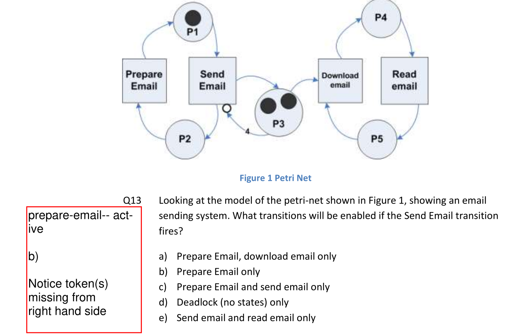


记住，一个Transition 被**Enabled**，他不一定能**Firing**。在这题目中， Send Email 这个Transition已经是属于Enabled的状态了，题目现在允许其Firing。

那么P2就会得到Token=1，P3就会得到Token=3； 但是此时可以发现被Enabled的Transition只有Prepare Email。


> 顺带一提，这个模型存在死锁的情况，因为右边Reader个数是0个


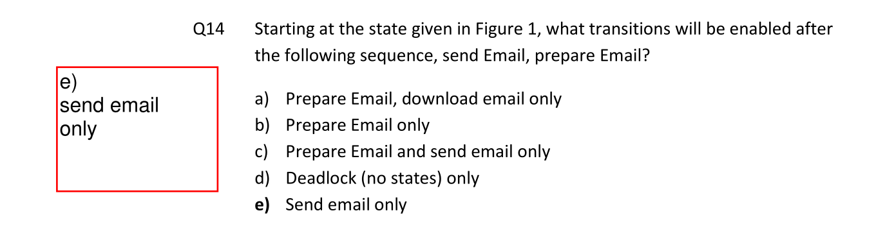

所以，因为死锁的存在，实际上右边的Transition**都不会**被Enabled，选e，模拟一下，不难。


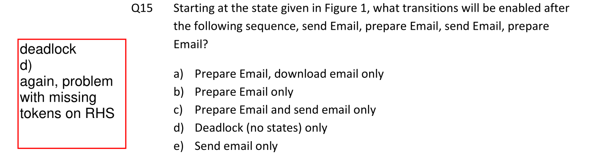


执行完毕之后就是（1，0，4，0，0），死锁，选择 D。

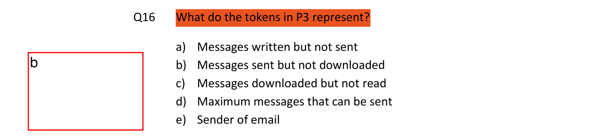

P3实际上是一个限制，类似于缓冲，它规定了上限。所以选择 B。

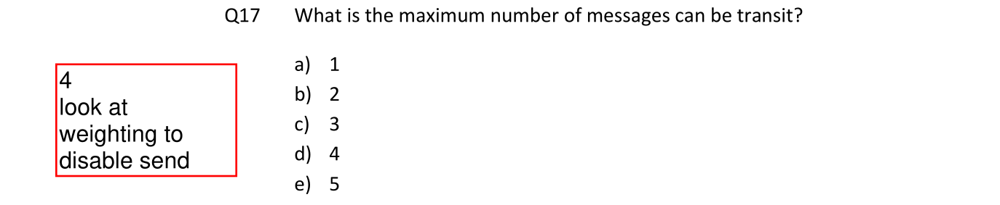


最大传输（Transit）信息就是取决于上限，也即抑制弧权重。这个题目中抑制弧权重是4，答案就是4。


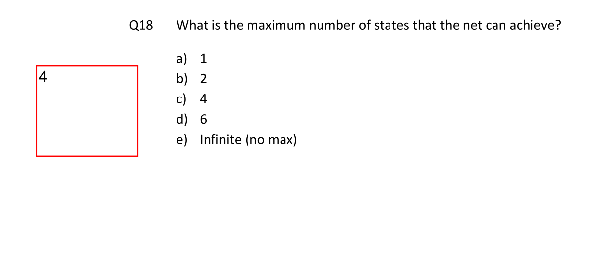

所有的状态？（Finite State）。

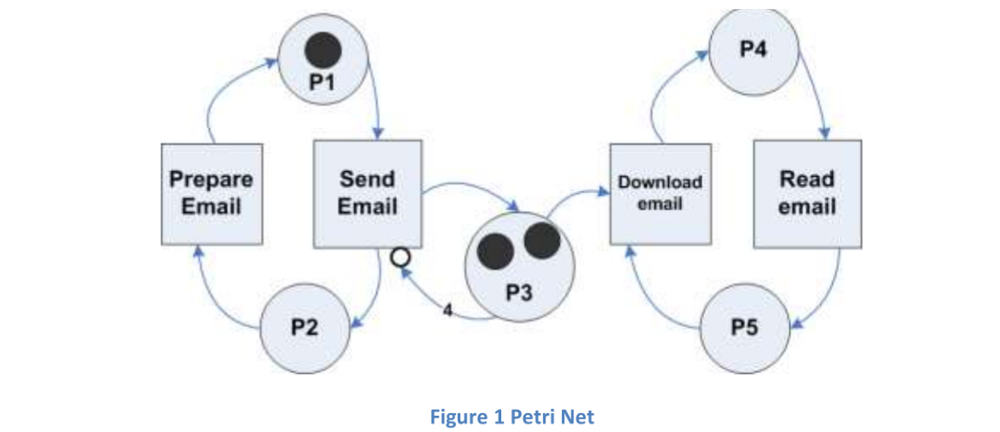
$$
\begin{align}
&(1,0,2,0,0)\\
&(0,1,3,0,0)\\
&(1,0,3,0,0)\\
&(0,1,4,0,0)\text{......Now it deadlock here}\\

\end{align}
$$
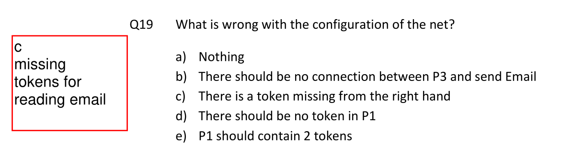

问题出在于少了一个Reader

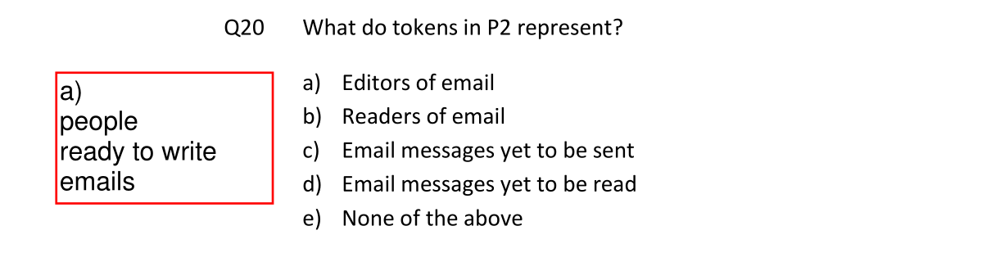


P2的Tokens代表了有多少个 Writer，显然，选 A

### Question 21

> 考点：问题的**可验证性**

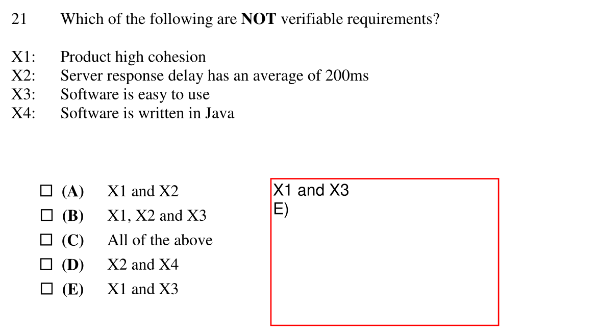

> PPT并没有详细说明什么样的问题是可验证的，但是我们只需要从字面意思理解即可。


| **需求项** | **描述内容**                                                 | **是否可验证** | **原因分析**                                                 |
| ---------- | ------------------------------------------------------------ | -------------- | ------------------------------------------------------------ |
| **X1**     | **Product high cohesion** (产品高内聚)                       | **否**         | “高（High）”是一个相对且主观的概念。如果没有具体的度量指标（例如：LCOM数值），则无法客观判定多高才算“高”。 |
| **X2**     | **Server response delay has an average of 200ms** (服务器平均响应延迟为200ms) | **是**         | 这是一个量化的性能指标。可以通过性能测试工具收集数据并计算平均值，结果是明确的。 |
| **X3**     | **Software is easy to use** (软件易于使用)                   | **否**         | “易用（Easy to use）”是高度主观的。对专业人士容易的操作对新手可能很难。除非定义为“90%的用户能在2分钟内完成任务A”，否则不可验证。 |
| **X4**     | **Software is written in Java** (软件用Java编写)             | **是**         | 这是一个约束性需求。通过检查源代码或编译产物，可以非常明确地判断是否使用了Java。 |


### Question 22

> 考点：[软件成本估算](#cost_estimation)

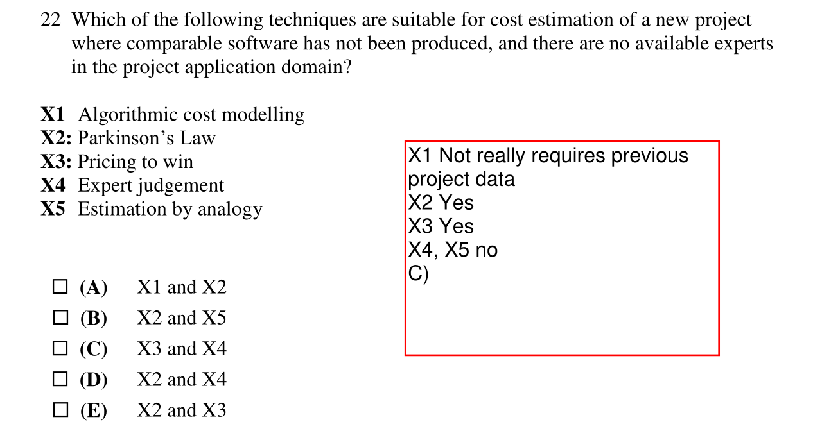

题目说明：

- 没有可类比的软件（这个软件是新板块，没有可以参考的）
- 没有专家


因此直接排除掉了**类比估算（选项X5）**和**专家判断（选项X4）**，同时，因为**算法成本建模（选项X1）**需要一些常数，这些常数是需要参考的，这里没有参考，因此也被排除了！


### Question 23

> 考点：[软件成本估算](#cost_estimation) 分类

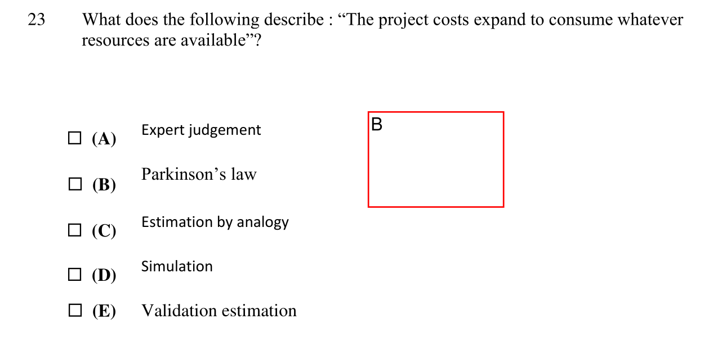

哪项描述了**“项目成本会扩张到消耗掉所有可用资源“**这一现象？答案是帕金森定律，因为他的核心是**按现有资源算成本**。

> 在软件工程和项目管理中，**帕金森定律**（Parkinson’s Law）通常被视为一种“非技术性”或“经验主义”的估算方法。
>
> - **原理：** 它假设项目所需的成本或时间并不取决于工作本身的复杂程度，而是取决于**有多少预算或时间可用**。
> - **现象：** 如果你给一个开发团队 6 个月时间完成一个任务，即使该任务实际上只需要 3 个月，该项目最终往往还是会拖够 6 个月才交付。因为团队会利用剩余的时间进行不必要的优化、增加不必要的功能或降低效率，直到消耗完所有可用资源。
> - **估算应用：** 在极度缺乏信息的情况下，估算者可能会直接说：“我们有多少钱，这就估算多少钱。”


### Question 24

> 考点：三种开发模型中的**[瀑布模型](#water_fall_model)**

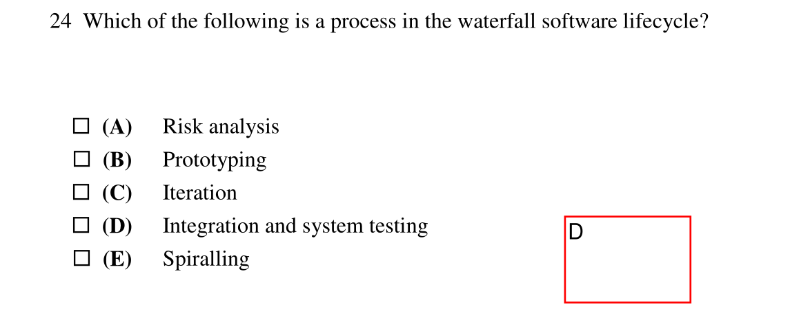

对**瀑布模型（Waterfall Model）**而言，以下哪个选项是其生命周期的一个过程？

> 回顾瀑布模型：**规格说明**和开发是独立的且不同阶段的。
>
> 换言之：必须规划好，才能建造（开发），一旦开发就不允许更改需求。因此其缺点就是客户需求必须被完全充分理解。通常用于硬件、航天工业。优点是容易记忆。


| **选项**              | **描述**   | **归属的模型**                                               | **为什么不是瀑布模型？**                                     |
| --------------------- | ---------- | ------------------------------------------------------------ | ------------------------------------------------------------ |
| **(A) Risk analysis** | 风险分析   | **螺旋模型 (Spiral Model)**                                  | 螺旋模型每一轮迭代都从风险分析开始。                         |
| **(B) Prototyping**   | 原型制作   | **[演化式开发 (Evolutionary)](#evolutionary_development_model)** | 原型 Prototyping 是为了获取**模糊的需求**，这与瀑布模型“需求必须在开始前完全确定”的假设相冲突。 |
| **(C) Iteration**     | 迭代       | **敏捷/演化式 ([Agile](#agile)/Evol.)**                      | 瀑布模型是“一次性完成”，不支持重复循环的迭代过程。           |
| **(E) Spiralling**    | 螺旋式上升 | **螺旋模型 (Spiral Model)**                                  | 这是螺旋模型特有的结构，代表着风险驱动和不断重复的周期。     |


正确答案：**(D) Integration and system testing (集成与系统测试)**

在传统的瀑布模型中，开发被划分为一系列固定的、线性的阶段。测试（通常包括集成测试和系统测试）是一个独立的阶段，发生在编码（Implementation）之后。


> 思考题，如果本题目答案是敏捷开发（Agile），那么题目会怎么改？
>
> ---
>
> 
>
> 下列哪项是敏捷开发框架（Agile Development Framework）中的典型过程？
>
> - (A) 预先确定所有详细需求 (Fixed requirements upfront)
> - (B) **短周期的迭代开发 (Short iterations/Sprints)** —— **[正确答案]**
> - (C) 漫长的集成与系统测试阶段 (Long integration phase)
> - (D) 严格遵守初始项目计划 (Strict adherence to initial plan)
>
> ---
>
> 敏捷开发鼓励以下哪些做法？
>
> - **X1: 频繁交付可运行的软件 (Frequent delivery of working software)**
> - X2: 通过正式文档进行沟通 (Communication via formal documents)
> - **X3: 欢迎甚至在开发后期变更需求 (Welcome changing requirements)**
> - X4: 只有在项目结束时才进行测试 (Testing only at the end)
>
> **选项：**
>
> - (B) **X1 和 X3** —— **[正确答案]**
>
> 在考试中，以下关键词通常指向**敏捷开发**：
>
> 1. **Iterative and Incremental** (迭代与增量)
> 2. **Sprints / Scrum** (冲刺/Scrum)
> 3. **Customer Collaboration** (客户协作)
> 4. **Responding to change** (响应变更)
> 5. **User Stories** (用户故事)
> 6. **Continuous integration** (持续集成)


## [3] 其他

网上找的一些题目，不一定具有参考性

### Q1

Determining the main components of the system and the relationships between them is ____________ ?

> 确定系统的主要组成部分及其相互关系是____？

**Architectural design**

> 架构设计。
>
> **Architectural design** is the **critical** link between **design** and **requirements engineering** , as it identifies the main structural components in a system and the relationships between them.


### Q2

Concerning class diagrams and in a **generalization**, the attributes and operations associated with higher-level classes are also associated with the lower-level classes. True or False?

**True**

> Generalization = Inheritance. 
>
> 泛化=继承，higher-level class = superclass（父类），lower-class=subclass（子类）
>
> 子类继承父类所有方法和属性。


### Q3

A successful test is done to

- Discover that software is free from errors
- Discover missing requirements
- **Discover that software contains one or more errors**

> 一个好的测试是找出问题，而不是证明没有问题！
>
> 在缺陷测试（Defect Testing）中，一个好的测试是让系统运行出错。
>
> 在 Validation Test 中，一个好的的测试是证明系统**满足真实需求。**
>
> 再次回顾：
>
> > **==验证（Verification）==：**“我们是不是把产品做对了？”
> >
> > - 检查软件是否符合之前写好的[需求说明书(Specification)](#3_1_what_is_specification)、设计文档，比如功能、性能这些明确要求的内容。
> >
> > **==确认（Validation）==：**“我们是不是做了用户真正需要的产品？”
> >
> > - 就算软件符合文档要求，还要看它实际用起来**能不能满足用户的真实需求**（毕竟有时候文档可能没准确反映用户想法）。


### Q4

Regarding requirements:

there should be **no conflicts** or **contradictions** in the descriptions of the system facilities. This is best known as:

- **Requirements consistency**
- Requirements completeness

> 需求检查是验证需求是否合理、可行的关键环节，主要从 5 个维度展开：
>
> - **有效性（Validity）**：系统提供的功能，能不能满足客户需求？COVER REQUIREMENT ?
> - **一致性（Consistency）**：客户的需求，有没有互相冲突的地方？ ANY CONFLICT ?
> - **完整性（Completeness）**：这个系统是否涵盖了**所有的**客户需求？ COVER **ALL** REQUIREMENT ?
> - **现实性（Realism）**：钱（预算 Budget）够不够做这些需求？ ENOUGH MONEY ?
> - **可验证性（Verifiability）**：需求怎么测试能不能用？HOW TO TEST ? TEST CASE --> **SPECIFICATION**
>


### Q5

White Box testing is testing that ?

- **Need the existence of source code of the software.**
- Need the existence of an executable version of the software.
- Need both executable and source code of software.


> A是白盒测试
>
> B是黑盒测试
>
> C是混合起来，一般而言白盒测试只需要代码即可


### Q6

What testing type where we test **each individual function** in **isolation?** 

- Validation testing
- **Unit testing**
- System Testing
- Integration Testing

> 单元测试测试每个独立单元


### Q7

Which of the following is true about Regression testing

- Test that doesn't need automated tool to reduce time
- **Test to ensure that change don't break the system**
- Test code that already tested

> 回归测试，是测试修改完代码之后不破坏系统原来的功能


### Q8

**[State Diagram]** is a type of diagrams that describes dynamic behavior of the system at runningtime. 

**[Coupling]** is the degree to which a component is connected to other components and to the external world. 

**[Cohesion]** implies that a component or class encapsulatesonly the attributes and operations closely related to one another and to the class itself. 


### Q9

We used the following diagrams to describe their interactions between the user and system being designed and users “……missed” 

- **Use case diagram**
- Activity Diagram

> 用例图描述了**用户（Users）** 和 系统 之间的交互情况！


### Q10

Ensuring that software meets what the user really wants is called

- Verification
- **Validation**
- Unit Testing
- Interface Testing

> **==验证（Verification）==：**“我们是不是把产品做对了？”
>
> - 检查软件是否符合之前写好的[需求说明书(Specification)](#3_1_what_is_specification)、设计文档，比如功能、性能这些明确要求的内容。
>
> **==确认（Validation）==：**“我们是不是做了用户真正需要的产品？”
>
> - 就算软件符合文档要求，还要看它实际用起来**能不能满足用户的真实需求**（毕竟有时候文档可能没准确反映用户想法）。


### Q11

A combination of `input, expected output, real output` is called

- Test Plan
- Test Validation
- Test Specification
- **Test Case**

> 测试用例就是测试系统能否对于指定 **input** 给出正确 **output**


### Q12

Anyone who has direct or indirect interest in the system is called

- **Stakeholder**
- Developer
- Actor
- Customer

> 在软件工程和项目管理中，**Stakeholder (利益相关者)** 是一个最广泛的定义，用来指代任何与系统有利益关系的人或团体。
>
> 对于Actor： 在 UML 或用例分析中，Actor 特指在系统外部与系统直接进行交互的对象。它侧重于“交互”，而不是“利益”。


### Q13

> 之前提到的[行为模型](#system_models)
> 行为模型（Behavioural Model）：行为模型用于描述系统的整体行为。有两个子模型
>
> - 数据处理模型（Data Processing Model）：展示数据在不同阶段的处理方式
> - 状态机模型（State Machine Model）：展示系统对事件的响应

In behaviour model, what are the best two types of **stimuli（刺激）**?

- **Data and events**

- Class and object
- Boundary and use cases


### Q14

The process of Developing test case before writing code is called:

- Test User Requirements
- Test Agile Development
- Test after Development
- **Test Driven Development**

> 在写代码前就写好测试用例，这属于测试驱动开发


### Q15

Software metric（指标） that includes `responsiveness, processing time, memory utilization` is

- Responsibility
- Dependability
- **Efficiency**
- Utility

> **a. Responsibility（责任）：** 这通常不是一个标准的软件技术性能度量指标，更多用于描述组织架构或代码设计模式（如单一职责原则）。
>
> **b. Dependability（可靠性/信赖性）：** 侧重于系统的可用性、可靠性、安全性和保密性，即系统在长时间运行中不失效的能力。
>
> **d. Utility（效用/实用性）：** 这是一个较广义的概念，指软件满足用户需求的能力，而不是具体的资源和时间消耗指标。

 


