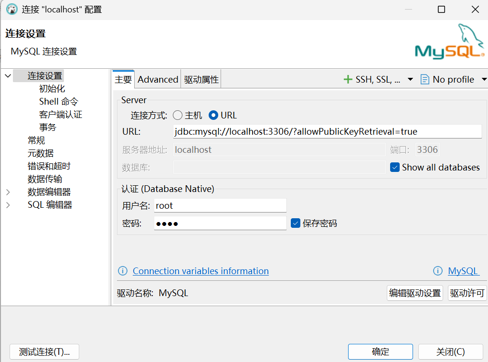
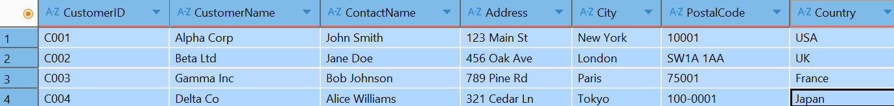
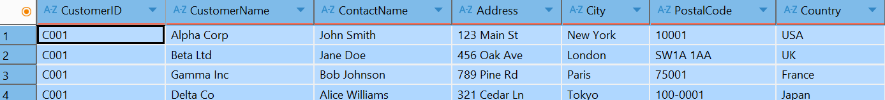
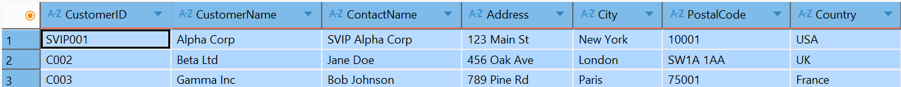
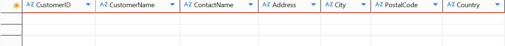
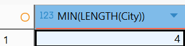
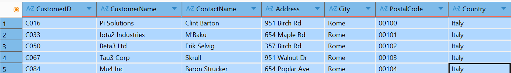
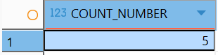

# MySQL 控制台操作

## [1] **使用cmd登录mysql**

> 需要保证mysql服务开启，搜索服务>mysql>手动>连接开启

```sql
mysql -u root -p
```

> - `-u root`：`-u` 是 `--user` 的缩写，后面跟着的 `root` 是要登录的 MySQL 用户名（这里使用的是 MySQL 默认的超级管理员账号 `root`）。
> - `-p`：`-p` 是 `--password` 的缩写，表示需要输入密码才能登录。


---


## [2] 退出mysql

```sql
quit
```


---


## [3] 更改数据库密码

在cmd中运行

```sql
USE mysql;
```

> 此处需要选择`mysql`数据库，因为`information_schema`、`mysql`、`performance_schema`、`sys` 是 MySQL 自带的系统数据库，用于存储系统信息和配置。
>
> 此外，通过
>
> ```sql
> SHOW DATABASES;
> ```
>
> 可以查看数据库：


查看用户名

```mysql
SELECT USER();
```

```sql
+----------------+
| USER()         |
+----------------+
| root@localhost |
+----------------+
1 row in set (0.00 sec)
```


更改密码

```sql
ALTER USER 'root'@'localhost' IDENTIFIED BY 'root';
```

```sql
Query OK, 0 rows affected (0.01 sec)
```

## [4] 忽略密码检测和链接DBeaver




```url
jdbc:mysql://localhost:3306/?allowPublicKeyRetrieval=true
```

# SQL语句

## [1] 选择 SELECT

```sql
SELECT CustomerID, City FROM USER_DATA;
```

`DISTINCT` 去重（类似Excel去重）

```sql
SELECT DISTINCT Country FROM USER_DATA;
```

`COUNT` 计数

```sql
SELECT COUNT(DISTINCT Country) FROM USER_DATA;
```

条件`COUNT`计数

```sql
SELECT COUNT(*) AS COUNT_NUM FROM (SELECT DISTINCT City FROM USER_DATA)
```

> 报错： SQL 错误 [1248] [42000]: Every derived table must have its own alias
>
> 这个错误发生的原因是 SQL 要求每个派生表（子查询）都必须有自己的别名。你的查询中，子查询`(SELECT DISTINCT City FROM USER_DATA)`没有指定别名，导致了这个错误。
>
> 解决方法很简单，只需要给子查询添加一个**别名**即可

```sql
SELECT COUNT(*) AS COUNT_NUM FROM (SELECT DISTINCT City FROM USER_DATA) AS DISTINCT_CITY
```


## [2] 条件 WHERE

语法

```sql
SELECT {column1}, {column2}, ... FROM {table_name} WHERE {condition};
```

`WHERE` 不仅用于`SELECT`还用于`DELETE`和`UPDATE`。


| Operator | Description                                                  |
| :------- | :----------------------------------------------------------- |
| =        | Equal                                                        |
| >        | Greater than                                                 |
| <        | Less than                                                    |
| >=       | Greater than or equal                                        |
| <=       | Less than or equal                                           |
| <>       | **Not equal.** **Note:** In some versions of SQL this operator may be written as `!=` |
| BETWEEN  | Between a certain range                                      |
| LIKE     | Search for a **pattern**                                     |
| IN       | To specify multiple possible values for a column             |


此外，对于`NULL`值还有两个运算：`IS NULL`和`IS NOT NULL`。**[请看此处](#7_the_null_value)**

## [3] 排序 Order By

语法

```sql
SELECT {column1}, {column2}, ...
FROM {table_name}
ORDER BY {column1}, {column2}, ... {ASC|DESC};
```

`ASC` - ascending 升序

`DESC` - descending 降序

 对于字符串值， `ORDER BY` 关键字将按字母顺序排序（默认升序）：

```sql
SELECT * FROM USER_DATA ORDER BY  CustomerName ASC;
```

```sql
A	A2
A	A1
A	A3
B	B2
B	B1
B	B3
```


可选择多行升序、降序

```sql
SELECT * FROM USER_DATA ORDER BY  CustomerName, ContactName ASC;
```

```sql
A	A1
A	A2
A	A3
B	B1
B	B2
B	B3
```


可选择某行升序、某行降序结合

```sql
SELECT * FROM USER_DATA ORDER BY  CustomerName ASC, ContactName DESC;
```

```sql
A	A3
A	A2
A	A1
B	B3
B	B2
B	B1
```

## [4] 条件与 AND 和 条件或 OR

`WHERE` 子句可以包含一个或多个 `AND` 运算符。

`AND` 运算符用于根据多个条件过滤记录

选择客户名长度小于7且不是伦敦的用户：

```sql
SELECT * FROM USER_DATA WHERE LENGTH(CustomerName) < 7 AND City <> "London";
```


`AND`运算符一般可结合`OR`，例如

```sql
SELECT * FROM USER_DATA WHERE TRUE AND (FALSE OR TRUE);
```

`AND` 优先级 $>$ `OR` ，也就是 `AND` 需要先被运算：

```sql
... WHERE TRUE AND FALSE OR TRUE AND FALSE OR TRUE AND FALSE
```

也即：

```sql
... WHERE (TRUE AND FALSE) OR (TRUE AND FALSE) OR (TRUE AND FALSE)
```


## [5] 条件非 NOT

条件NOT其实和`<>`、`!=`类似，但是有些非运算符的情况无法使用，此时就需要使用条件`NOT`。

选择名字不是 D 开头的所有用户：

```sql
SELECT * FROM USER_DATA WHERE NOT CustomerName LIKE "D%";
```


选择名字不是D开头的且以D结尾的用户：

```sql
SELECT * FROM USER_DATA WHERE (NOT CustomerName LIKE "D%") AND (CustomerName LIKE "%D");
```

并计算个数

```sql
SELECT COUNT(*) AS COUNT_RESULT FROM 
(SELECT * FROM USER_DATA WHERE (NOT CustomerName LIKE "D%") AND (NOT CustomerName LIKE "%D")) AS TEMP;
```

## [6] 插入 INSERT INTO

### [6.1] 单行插入

有多种插入方式，例如插入列名和值

```sql
INSERT INTO table_name (column1, column2, column3, ...)
VALUES (value1, value2, value3, ...);
```

或者直接插入，按照默认列顺序

```sql
INSERT INTO table_name
VALUES (value1, value2, value3, ...);
```


```sql
INSERT INTO user_data (PostalCode) VALUES ("L35AA");
```

这样插入，其他值为`NULL`，只有`PostalCode`是 L35AA 。


### [6.2] 多行插入

```sql
INSERT INTO Customers (CustomerName, ContactName, Address, City, PostalCode, Country)
VALUES
('Cardinal', 'Tom B. Erichsen', 'Skagen 21', 'Stavanger', '4006', 'Norway'),
('Greasy Burger', 'Per Olsen', 'Gateveien 15', 'Sandnes', '4306', 'Norway'),
('Tasty Tee', 'Finn Egan', 'Streetroad 19B', 'Liverpool', 'L1 0AA', 'UK');
```

<a id="7_the_null_value"></a>

## [7] NULL 值

`NULL` 值不能被比较运算符（例如`=`、`<=`）等运算比较。

但是，`NULL`仍然有两种运算：

- `IS NULL` 判断这个是否是NULL值。
- `IS NOT NULL` 判断这个是否不是NULL值。


```sql
SELECT * FROM user_data WHERE CustomerID  IS NULL;
```


## [8] 更新 UPDATE

基本语法

```sql
UPDATE table_name
SET column1 = value1, column2 = value2, ...
WHERE condition;
```

> [!CAUTION]
>
> 注意：`UPDATE` 必须和`WHERE` 一起用否则整个表都会更新！
>
> 反例：
>
> 更新前：
>
> 
>
> ```sql
> UPDATE user_data SET CustomerID = "C001";
> ```
>
> 


正确的`UPDATE`语句

```sql
UPDATE user_data SET CustomerID = "SVIP001", ContactName = "SVIP Alpha Corp" 
WHERE CustomerName = "Alpha Corp";
```


##  [9] DELETE 和 Drop

基本语法

```sql
DELETE FROM table_name WHERE condition;
```

> [!CAUTION]
>
> 和`UPDATE`语句一样，必须指定`WHERE`条件。除非确定要删除整个表（但保留表）。
>
> 反例：
>
> 
>
> ```sql
> DELETE FROM user_data;
> ```
>
> 

DELETE示例：删除所有SVIP客人

```sql
DELETE FROM user_data WHERE ContactName LIKE "SVIP%";
```


彻底删除表：

```sql
DROP TABLE user_data;
```


## [10] LIMIT

MySQL 不支持 `TOP`，`FETCH FIRST 3 ROWS ONLY`等关键字。

```sql
SELECT * FROM user_data LIMIT 3;
```

`LIMIT`关键字应当放在末尾，例如不能放在`ORDER BY` 之前

```sql
SELECT * FROM user_data ORDER BY CustomerID DESC LIMIT 3;
```

如果要在`ORDER BY`前使用`LIMIT`：

```sql
SELECT * FROM (SELECT * FROM user_data LIMIT 3) AS TEMP1 ORDER BY CustomerID;
```

## [11] 聚合函数 

聚合函数（Aggregate Functions）

> [!NOTE]
>
> 聚合函数忽略空值（ `COUNT(*)` 除外）。

### [11.1] MIN() 和 MAX()

查看表格中城市名长度最小有多少，最大有多少：

```sql
SELECT MIN(LENGTH(City)) FROM user_data;
```



`MAX()`同理。这代表这个表中最短成市是4个字的，但是可能不止一行，例如`town`，`TAZA`,`lidl`等


如果希望**查看**具体行，那么使用：

```sql
SELECT * 
FROM user_data 
WHERE LENGTH(City) = (SELECT MIN(LENGTH(City)) FROM user_data);
```




可以使用`COUNT`语句计数

```sql
SELECT COUNT(*) AS COUNT_NUMBER
FROM user_data 
WHERE LENGTH(City) = (SELECT MIN(LENGTH(City)) FROM user_data);
```



可以和`GROUP BY`方法一同使用。


