# MySQL 控制台操作

## [1] **使用cmd登录mysql**

> 需要保证mysql服务开启，搜索服务>mysql>手动>连接开启

```sql
mysql -u root -p
```

> - `-u root`：`-u` 是 `--user` 的缩写，后面跟着的 `root` 是要登录的 MySQL 用户名（这里使用的是 MySQL 默认的超级管理员账号 `root`）。
> - `-p`：`-p` 是 `--password` 的缩写，表示需要输入密码才能登录。


---


## [2] 退出mysql

```sql
quit
```


---


## [3] 更改数据库密码

在cmd中运行

```sql
USE mysql;
```

> 此处需要选择`mysql`数据库，因为`information_schema`、`mysql`、`performance_schema`、`sys` 是 MySQL 自带的系统数据库，用于存储系统信息和配置。
>
> 此外，通过
>
> ```sql
> SHOW DATABASES;
> ```
>
> 可以查看数据库：


查看用户名

```mysql
SELECT USER();
```

```sql
+----------------+
| USER()         |
+----------------+
| root@localhost |
+----------------+
1 row in set (0.00 sec)
```


更改密码

```sql
ALTER USER 'root'@'localhost' IDENTIFIED BY 'root';
```

```sql
Query OK, 0 rows affected (0.01 sec)
```

## [4] 忽略密码检测和链接DBeaver

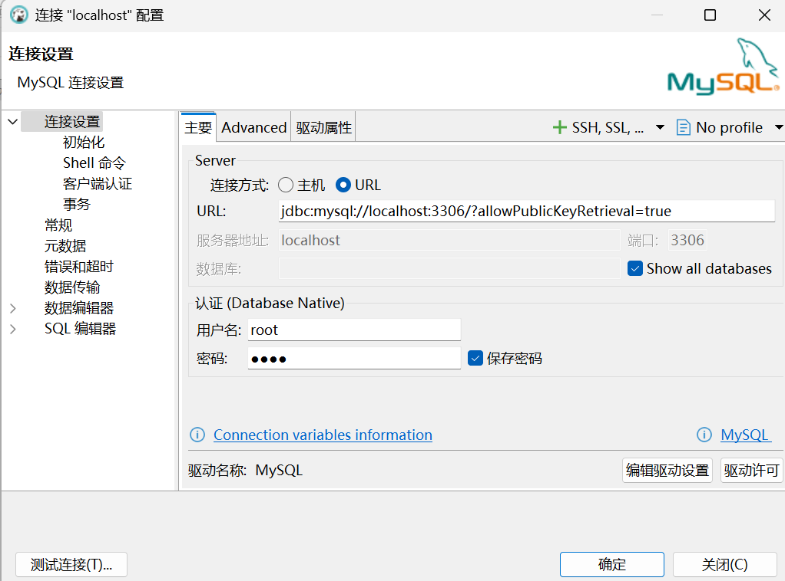


```url
jdbc:mysql://localhost:3306/?allowPublicKeyRetrieval=true
```


# 创建表

```sql
-- 删除已存在的表
DROP TABLE IF EXISTS PRODUCT_DATA;

-- 使用Liverpool数据库
USE Liverpool;

-- 创建PRODUCT_DATA表
CREATE TABLE PRODUCT_DATA (
    id INT PRIMARY KEY AUTO_INCREMENT,
    product_name_cn VARCHAR(100) NOT NULL,
    product_name_en VARCHAR(100) NOT NULL,
    price DECIMAL(10, 2) NOT NULL
);
```

如果初始表插入100行数据，`id`字段自动1-100，但是删除`id`=1之后再插入会插入在100后。 

# SQL语句

## [1] 选择 SELECT

```sql
SELECT CustomerID, City FROM USER_DATA;
```

`DISTINCT` 去重（类似Excel去重）

```sql
SELECT DISTINCT Country FROM USER_DATA;
```

`COUNT` 计数

```sql
SELECT COUNT(DISTINCT Country) FROM USER_DATA;
```

条件`COUNT`计数

```sql
SELECT COUNT(*) AS COUNT_NUM FROM (SELECT DISTINCT City FROM USER_DATA)
```

> 报错： SQL 错误 [1248] [42000]: Every derived table must have its own alias
>
> 这个错误发生的原因是 SQL 要求每个派生表（子查询）都必须有自己的别名。你的查询中，子查询`(SELECT DISTINCT City FROM USER_DATA)`没有指定别名，导致了这个错误。
>
> 解决方法很简单，只需要给子查询添加一个**别名**即可

```sql
SELECT COUNT(*) AS COUNT_NUM FROM (SELECT DISTINCT City FROM USER_DATA) AS DISTINCT_CITY
```


## [2] 条件 WHERE

语法

```sql
SELECT {column1}, {column2}, ... FROM {table_name} WHERE {condition};
```

`WHERE` 不仅用于`SELECT`还用于`DELETE`和`UPDATE`。


| Operator | Description                                                  |
| :------- | :----------------------------------------------------------- |
| =        | Equal                                                        |
| >        | Greater than                                                 |
| <        | Less than                                                    |
| >=       | Greater than or equal                                        |
| <=       | Less than or equal                                           |
| <>       | **Not equal.** **Note:** In some versions of SQL this operator may be written as `!=` |
| BETWEEN  | Between a certain range                                      |
| LIKE     | Search for a **pattern**                                     |
| IN       | To specify multiple possible values for a column             |


此外，对于`NULL`值还有两个运算：`IS NULL`和`IS NOT NULL`。**[请看此处](#7_the_null_value)**

## [3] 排序 Order By

语法

```sql
SELECT {column1}, {column2}, ...
FROM {table_name}
ORDER BY {column1}, {column2}, ... {ASC|DESC};
```

`ASC` - ascending 升序

`DESC` - descending 降序

 对于字符串值， `ORDER BY` 关键字将按字母顺序排序（默认升序）：

```sql
SELECT * FROM USER_DATA ORDER BY  CustomerName ASC;
```

```sql
A	A2
A	A1
A	A3
B	B2
B	B1
B	B3
```


可选择多行升序、降序

```sql
SELECT * FROM USER_DATA ORDER BY  CustomerName, ContactName ASC;
```

```sql
A	A1
A	A2
A	A3
B	B1
B	B2
B	B3
```


可选择某行升序、某行降序结合

```sql
SELECT * FROM USER_DATA ORDER BY  CustomerName ASC, ContactName DESC;
```

```sql
A	A3
A	A2
A	A1
B	B3
B	B2
B	B1
```

## [4] 条件与 AND 和 条件或 OR

`WHERE` 子句可以包含一个或多个 `AND` 运算符。

`AND` 运算符用于根据多个条件过滤记录

选择客户名长度小于7且不是伦敦的用户：

```sql
SELECT * FROM USER_DATA WHERE LENGTH(CustomerName) < 7 AND City <> "London";
```


`AND`运算符一般可结合`OR`，例如

```sql
SELECT * FROM USER_DATA WHERE TRUE AND (FALSE OR TRUE);
```

`AND` 优先级 $>$ `OR` ，也就是 `AND` 需要先被运算：

```sql
... WHERE TRUE AND FALSE OR TRUE AND FALSE OR TRUE AND FALSE
```

也即：

```sql
... WHERE (TRUE AND FALSE) OR (TRUE AND FALSE) OR (TRUE AND FALSE)
```


## [5] 条件非 NOT

条件NOT其实和`<>`、`!=`类似，但是有些非运算符的情况无法使用，此时就需要使用条件`NOT`。

选择名字不是 D 开头的所有用户：

```sql
SELECT * FROM USER_DATA WHERE NOT CustomerName LIKE "D%";
```


选择名字不是D开头的且以D结尾的用户：

```sql
SELECT * FROM USER_DATA WHERE (NOT CustomerName LIKE "D%") AND (CustomerName LIKE "%D");
```

并计算个数

```sql
SELECT COUNT(*) AS COUNT_RESULT FROM 
(SELECT * FROM USER_DATA WHERE (NOT CustomerName LIKE "D%") AND (NOT CustomerName LIKE "%D")) AS TEMP;
```

## [6] 插入 INSERT INTO

### [6.1] 单行插入

有多种插入方式，例如插入列名和值

```sql
INSERT INTO table_name (column1, column2, column3, ...)
VALUES (value1, value2, value3, ...);
```

或者直接插入，按照默认列顺序

```sql
INSERT INTO table_name
VALUES (value1, value2, value3, ...);
```


```sql
INSERT INTO user_data (PostalCode) VALUES ("L35AA");
```

这样插入，其他值为`NULL`，只有`PostalCode`是 L35AA 。


### [6.2] 多行插入

```sql
INSERT INTO Customers (CustomerName, ContactName, Address, City, PostalCode, Country)
VALUES
('Cardinal', 'Tom B. Erichsen', 'Skagen 21', 'Stavanger', '4006', 'Norway'),
('Greasy Burger', 'Per Olsen', 'Gateveien 15', 'Sandnes', '4306', 'Norway'),
('Tasty Tee', 'Finn Egan', 'Streetroad 19B', 'Liverpool', 'L1 0AA', 'UK');
```

<a id="7_the_null_value"></a>

## [7] NULL 值

`NULL` 值不能被比较运算符（例如`=`、`<=`）等运算比较。

但是，`NULL`仍然有两种运算：

- `IS NULL` 判断这个是否是NULL值。
- `IS NOT NULL` 判断这个是否不是NULL值。


```sql
SELECT * FROM user_data WHERE CustomerID  IS NULL;
```


## [8] 更新 UPDATE

基本语法

```sql
UPDATE table_name
SET column1 = value1, column2 = value2, ...
WHERE condition;
```

> [!CAUTION]
>
> 注意：`UPDATE` 必须和`WHERE` 一起用否则整个表都会更新！
>
> 反例：
>
> 更新前：
>
> 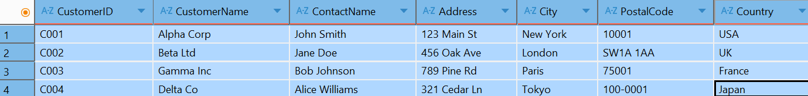
>
> ```sql
> UPDATE user_data SET CustomerID = "C001";
> ```
>
> 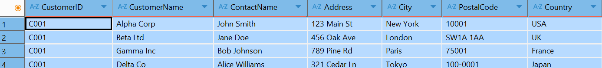


正确的`UPDATE`语句

```sql
UPDATE user_data SET CustomerID = "SVIP001", ContactName = "SVIP Alpha Corp" 
WHERE CustomerName = "Alpha Corp";
```


##  [9] DELETE 和 DROP

基本语法

```sql
DELETE FROM table_name WHERE condition;
```

> [!CAUTION]
>
> 和`UPDATE`语句一样，必须指定`WHERE`条件。除非确定要删除整个表（但保留表）。
>
> 反例：
>
> 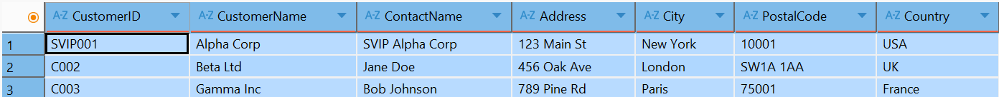
>
> ```sql
> DELETE FROM user_data;
> ```
>
> 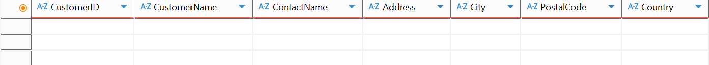

DELETE示例：删除所有SVIP客人

```sql
DELETE FROM user_data WHERE ContactName LIKE "SVIP%";
```


彻底删除表：

```sql
DROP TABLE user_data;
```


## [10] LIMIT

MySQL 不支持 `TOP`，`FETCH FIRST 3 ROWS ONLY`等关键字。

```sql
SELECT * FROM user_data LIMIT 3;
```

`LIMIT`关键字应当放在末尾，例如不能放在`ORDER BY` 之前

```sql
SELECT * FROM user_data ORDER BY CustomerID DESC LIMIT 3;
```

如果要在`ORDER BY`前使用`LIMIT`：

```sql
SELECT * FROM (SELECT * FROM user_data LIMIT 3) AS TEMP1 ORDER BY CustomerID;
```

## [11] 聚合函数 

聚合函数（Aggregate Functions）

> [!NOTE]
>
> 聚合函数忽略空值（ `COUNT(*)` 除外）。

### [11.1] MIN() 和 MAX()

查看表格中城市名长度最小有多少，最大有多少：

```sql
SELECT MIN(LENGTH(City)) FROM user_data;
```

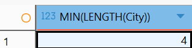

`MAX()`同理。这代表这个表中最短成市是4个字的，但是可能不止一行，例如`town`，`TAZA`,`lidl`等


如果希望**查看**具体行，那么使用：

```sql
SELECT * 
FROM user_data 
WHERE LENGTH(City) = (SELECT MIN(LENGTH(City)) FROM user_data);
```

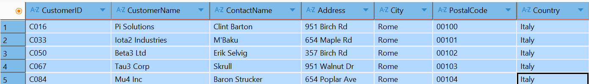


可以使用`COUNT`语句计数

```sql
SELECT COUNT(*) AS COUNT_NUMBER
FROM user_data 
WHERE LENGTH(City) = (SELECT MIN(LENGTH(City)) FROM user_data);
```

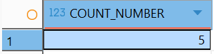

可以和`GROUP BY`方法一同使用。后面介绍。


### [11.2] COUNT() 函数

#### [11.2.1] 忽略NULL值

`COUNT()`已经并不陌生，但是有一些细节：

如果指定列名而不是 `(*)` ，**则不会计算 NULL 值。**

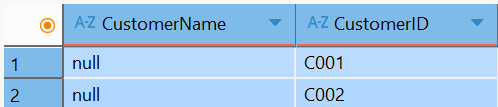

```sql
SELECT COUNT(CustomerName) FROM user_data;
```

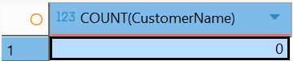


```sql
SELECT COUNT(CustomerID) FROM user_data;
```

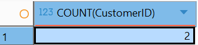


#### [11.2.2] COUNT 中的 DISTINCT 关键字

可以使用 `DISTINCT` 关键字来忽略重复项 `COUNT()` 函数。

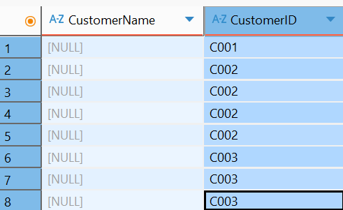

不使用`DISTINCT`：包含重复

```sql
SELECT COUNT(CustomerID) AS COUNT_NUMBER FROM USER_DATA;
```

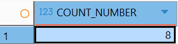

使用`DISTINCT`：不包含重复

```sql
SELECT COUNT(DISTINCT CustomerID) AS COUNT_NUMBER FROM USER_DATA;
```

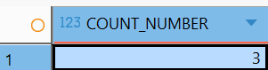


#### [11.2.3] COUNT 中 GROUP BY 的使用


```sql
SELECT CustomerID,COUNT(CustomerID) AS COUNT_NUMBER FROM USER_DATA GROUP BY CustomerID;
```

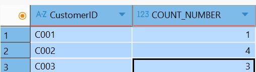


### [11.3] SUM() 函数

计算这个表格中**所有（当然可以加WHERE）** CONTACT_NAME 长度和。

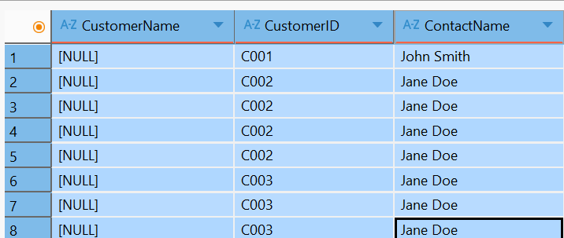

```sql
SELECT SUM(LENGTH(ContactName)) AS TOTAL_USER_NAME_LENGTH FROM user_data;
```


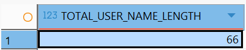


#### [11.3.1] SUM 中 GROUP BY 使用

假设我们希望分组获取，那么分组的依据是CustomerID（显然是三组），然后这三个小组，每个小组各自统计自己组内队员的CONTACT_NAME 长度。

```sql
SELECT CustomerID,SUM(LENGTH(ContactName)) AS TOTAL_USER_NAME_LENGTH
FROM user_data GROUP BY CustomerID;
```

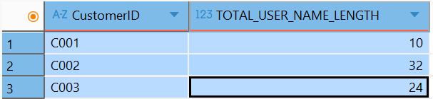


#### [11.3.2] 带表达式的SUM

举办一个比赛：对于每个CustomerID相同的用户，算作一个小组。

选举出一个小组：小组中的所有人的 CustomerName 和 ContactName 长度相加在所有小组中是最小的！所在小组作为获胜者！

```sql
SELECT CustomerID,SUM(LENGTH(CustomerName) + LENGTH(ContactName )) AS MIN_OF_EACH_GROUP 
FROM user_data GROUP BY CustomerID;
```

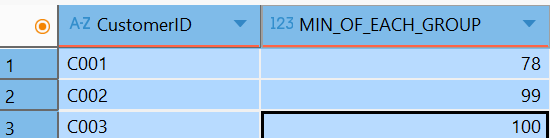

把这个结果作填入：

```sql
SELECT MIN(MIN_OF_EACH_GROUP) FROM 
-- 上一个SQL查询填入下方
(SELECT CustomerID,SUM(LENGTH(CustomerName) + LENGTH(ContactName )) AS MIN_OF_EACH_GROUP FROM user_data GROUP BY CustomerID)
-- 添加别名
AS RESULT;
```


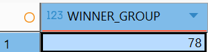


更进一步，如果希望找到这个78对应的组名：

```sql
SELECT CustomerID, MIN_OF_EACH_GROUP
FROM (
    SELECT 
        CustomerID,
        SUM(LENGTH(CustomerName) + LENGTH(ContactName)) AS MIN_OF_EACH_GROUP 
    FROM user_data 
    GROUP BY CustomerID
) AS RESULT
WHERE MIN_OF_EACH_GROUP = (
    SELECT MIN(MIN_OF_EACH_GROUP) 
    FROM (
        SELECT 
            SUM(LENGTH(CustomerName) + LENGTH(ContactName)) AS MIN_OF_EACH_GROUP 
        FROM user_data 
        GROUP BY CustomerID
    ) AS SUB_RESULT
);
```


> 分析：
>
> ```sql
> SELECT CustomerID, MIN_OF_EACH_GROUP
> FROM (
>     表A
> ) AS RESULT
> WHERE MIN_OF_EACH_GROUP = 78;
> ```
>
> 表A：
>
> ```sql
> SELECT CustomerID,SUM(LENGTH(CustomerName) + LENGTH(ContactName)) AS MIN_OF_EACH_GROUP FROM user_data 
> GROUP BY CustomerID;
> ```
>
> 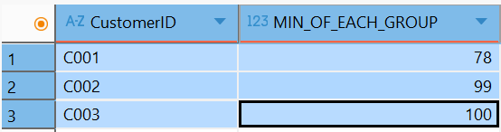
>
> 那么 78 怎么找呢？
>
> ```sql
> SELECT MIN(MIN_OF_EACH_GROUP) FROM (表A) AS SUB_RESULT
> ```
>
> 这样就可以了


### [11.4] AVG() 函数

也即平均函数，和`SUM()`函数差不多的用法。 

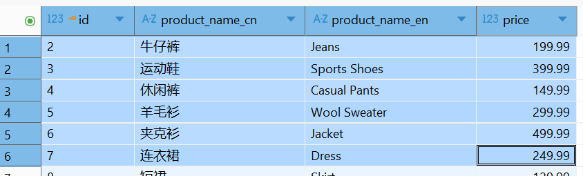

尝试从`PRODUCT_DATA`中选出所有高于平均数的商品！

```sql
SELECT * FROM PRODUCT_DATA  WHERE price > (SELECT AVG(price) FROM PRODUCT_DATA);
```

首先，`prive > 表A`这里`表A`是：

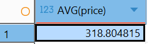

然后

```sql
SELECT * FROM PRODUCT_DATA  WHERE price > 表A;
```

这样就可以筛选出了！

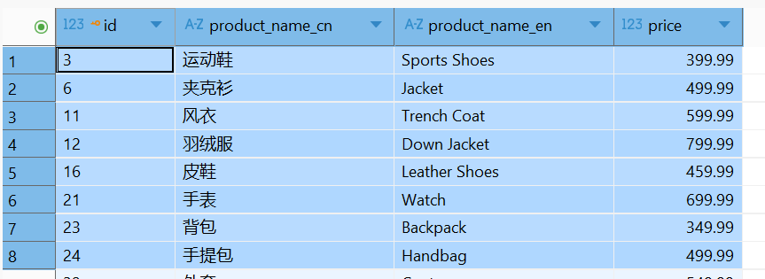


 ```sql
 SELECT * FROM PRODUCT_DATA  WHERE price >= (SELECT MAX(price) FROM PRODUCT_DATA);
 ```


## [12] LIKE 函数

`LIKE` 运算符用于 `WHERE` 子句中，以在列中搜索指定的模式。

有两个通配符经常与 `LIKE` 运算符一起使用：

1. 百分号 `%` 表示零个、一个或多个字符

2. 下划线符号 `_` 表示一个字符


练习：选取价位高于平均数的，英文名包含`ac`的产品

```sql
SELECT * FROM 表A AS AVG_RESULT 
WHERE AVG_RESULT.product_name_en LIKE '%ac%';
```

表A:

```sql
(SELECT * FROM PRODUCT_DATA  WHERE price >= (SELECT AVG(price) FROM PRODUCT_DATA))
```

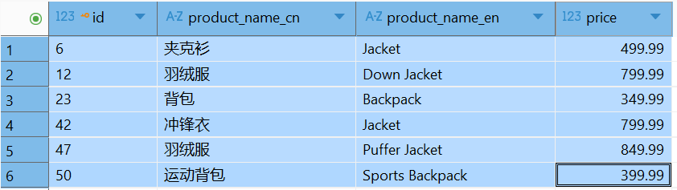

LIKE 可以不适用统配字符。


## [13] IN()

常规用法

```sql
SELECT * FROM PRODUCT_DATA WHERE product_name_en NOT IN 
(SELECT product_name_en FROM PRODUCT_DATA WHERE product_data.product_name_en LIKE "%" AND price < 1000);
```

如果要使用 `NOT IN(SELECT)`那么子`SELECT`必须返回单一列！也就是：

要这样：

```sql
... NOT IN (SELECT COL_A FROM ...)
```

不能这样

```sql
... NOT IN (SELECT * FROM ...)
```

## [14] BETWEEN

`BETWEEN` 运算符用于选择给定范围内的值。这些值可以是数字、文本或日期。

`BETWEEN` 运算符是包含性的（左开右开区间）：包括开始值和结束值。

`BETWEEN` 可以和 `NOT` 一起用：

```sql
SELECT * FROM product_data WHERE Price BETWEEN 10 AND 20;
```

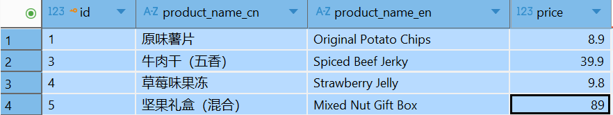


`BETWEEN` 对于字符串的原理：

首先看如下SQL

```sql
SELECT * FROM (SELECT * FROM product_data ORDER BY product_data.product_name_en ASC) AS RESULT 
WHERE RESULT.product_name_en BETWEEN "Carrots" AND "Fuji Apples";
```

`RESULT`表是根据`product_name_en`字符串排序好的，如下：

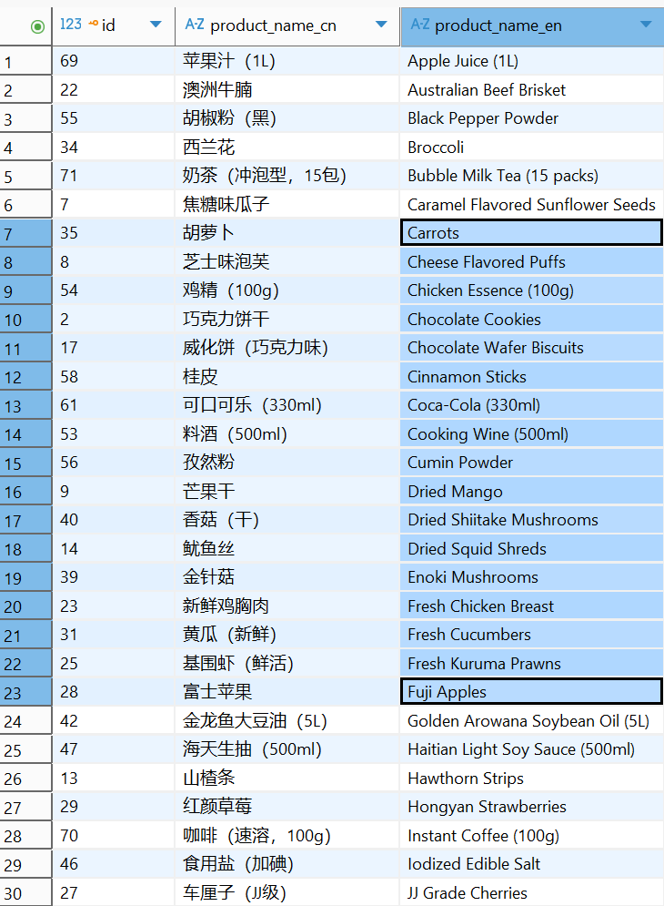

要BETWEEN框选的内容，因此整个SQL输出是：

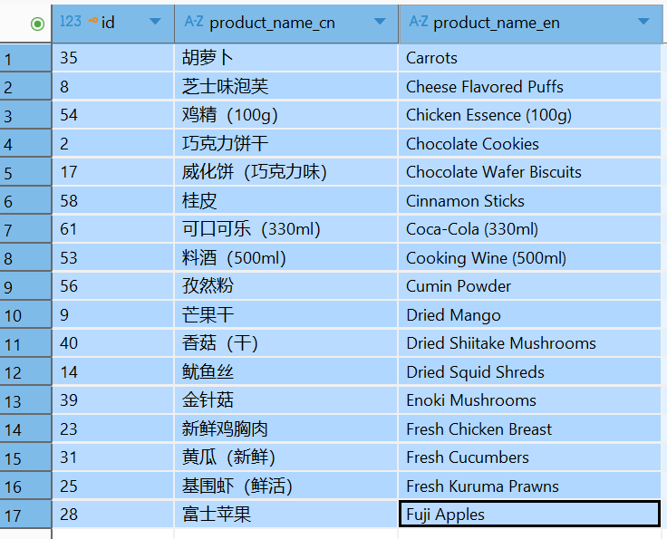

如果不排序数据库，数据库能否还是这样分类呢？

```sql
SELECT * FROM PRODUCT_DATA WHERE product_name_en BETWEEN "Carrots" AND "Fuji Apples";
```

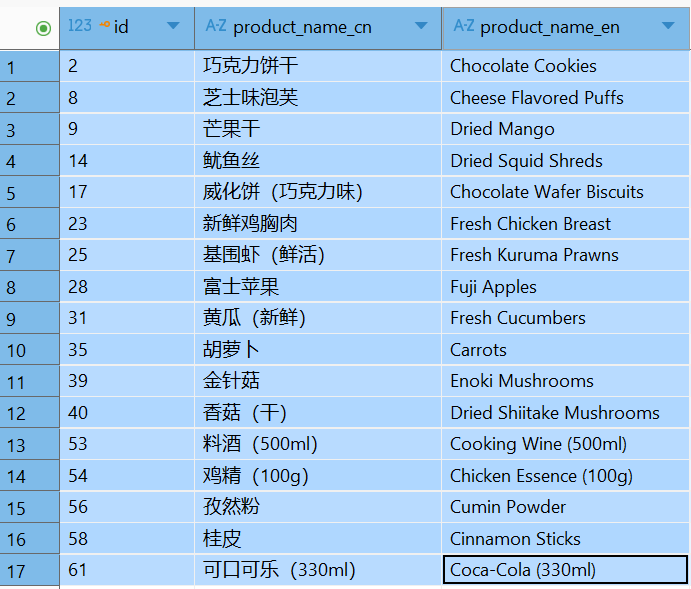

答案是可以的！不过结果没有排序。

因此，先筛选后排序 优于 先排序后筛选。

> [!NOTE]
>
> BETWEEN 比较字符串逻辑
>
> - 比较从字符串的**第一个字符**开始，按字符的编码值（如 ASCII、UTF-8）依次对比；
> - 若第一个字符相同，则对比**第二个字符**，以此类推；
> - 若一个字符串是另一个的前缀（如 `'apple'` 和 `'app'`），则**长度更短的字符串更小**（如 `'app' < 'apple'`）。


比较日期，找出2026年国过期的所有食品，并且按照过期时间升序。

```sql
SELECT * FROM PRODUCT_DATA 
WHERE expiration_date 
BETWEEN '2026-01-01' AND '2026-12-31'
ORDER BY expiration_date ASC;
```


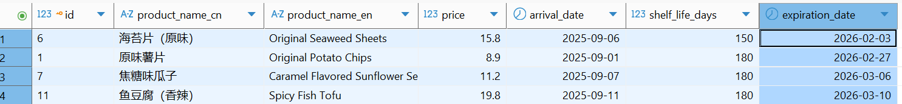

## [15] 别名AS

别名已经很熟悉了：

1. 别名`AS`关键字是可以省略的

2. 多重SELECT要给别名

3. 对于有空格的别名，使用`" "`括住或者使用`[ ]`括住。

   > 此方法不适用于MySQL！

4. 别名一般用于多表

## [16] CONCAT() 函数

 连接：Concatenate

```sql
SELECT id,CONCAT(product_name_cn ,' 英文名： ',product_name_en ) FROM PRODUCT_DATA;
```

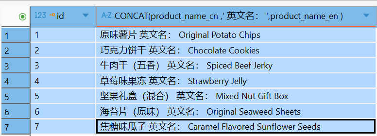

## [17] JOIN

首先我们创建商品表

```sql
-- 1. 删除已存在的表（避免重复创建报错）
DROP TABLE IF EXISTS PRODUCT_DATA;

-- 2. 使用Liverpool数据库
USE Liverpool;

-- 3. 创建PRODUCT_DATA表
CREATE TABLE PRODUCT_DATA (
    id INT AUTO_INCREMENT PRIMARY KEY,
    product_name_cn VARCHAR(100) NOT NULL,
    product_name_en VARCHAR(100) NOT NULL,
    category_id INT NOT NULL,
    -- CHECK (category_id BETWEEN 1 AND 4) -- 确保品类ID只能是1-4，但为了演示特殊情况，不加上
);
```

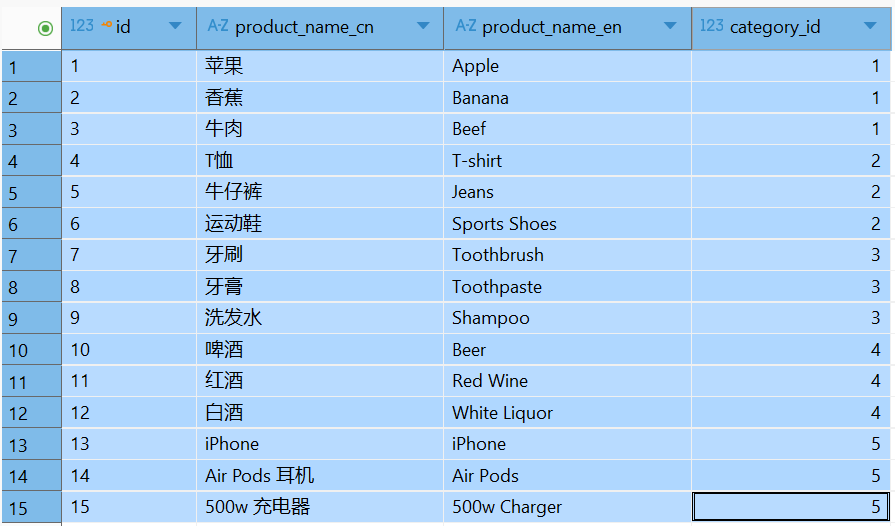

在创建一个对应的品类表：

```sql
CREATE TABLE PRODUCT_CATEGORY_DATA (
    category_id INT PRIMARY KEY,
    category_name_cn VARCHAR(50) NOT NULL,
    category_name_en VARCHAR(50) NOT NULL
);
```

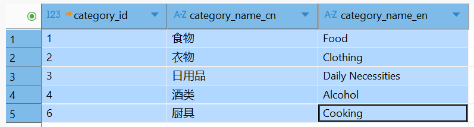


`JOIN` 子句用于根据两个或多个表之间的**相关列**来组合它们中的行。

主表（商品表）中有12345这几个种类，但是附表（品类表）有12346这几种品类！


 
