# COMP207-202526 Database Development

# 课程介绍

> 2025-2026 不考 b+-
>
> QUIZ 都是往年的测试题，会放在对应的地方。

## [1] 课程模块划分与重点安排

1. **课程介绍**
   - **不纳入考试范围**。第一堂课时将对该部分内容进行更深入的讲解

2. **结构化查询语言（SQL）**
   - 第1-2周

3. **事务管理与Transact-SQL（Transaction Management/TransactSQL）**
   - 第3-5周
   - Transact-SQL（常简称为T-SQL）是SQL的扩展语言，主要用于Microsoft SQL Server数据库管理系统，在基础SQL功能上增加了事务控制、流程语句等进阶功能。

4. **查询处理（Query processing）**
   - 第6周
   - 涉及数据库对用户查询**请求的解析**、**优化**与**执行过程**

5. **分布式数据库（Distributed databases）**
   - 第7周
   - 数据存储在多个物理位置、通过网络协同管理的数据库系统，核心涉及数据分布策略、一致性维护等问题。

6. **关系型数据之外的扩展（Beyond relational data）**
   - 第8-9周
   - 通常涵盖非关系型数据库（NoSQL）、图数据库、文档数据库等，适用于处理海量、非结构化或半结构化数据的场景。

7. **数据仓库、数据分析与数据挖掘（Data warehousing/analysis/mining）**
   - 第10周（此外，第20堂课还将包含课程总结内容）
   - 三者为数据处理的递进环节
     - 数据仓库：**整合+存储**海量历史数据。
     - 数据分析：通过统计等方法**提取信息**。
     - 数据挖掘：旨在从数据中**发现潜在规律与关联**。

## [2] 关于讨论

可以选择在实验课上向助教提问，或者联系 `R.Ibsen-Jensen@Liverpool.ac.uk` 提问。

也可以选择在 [Discussion Board](https://canvas.liverpool.ac.uk/courses/84467/discussion_topics) 提问

## [3] 关于实验课

每周有2个Lecture和1个实验课。每周的实验练习通常只会在同周的**周一左右添加**。


> Lecture 1 到 Lectrue 5 是介绍SQL语句
>
> 以下为 Lecture 6 开始

# Introduction

SQL 有很多种数据类型

- `INT`
- `FLOAT`
- `CHAR(X)`
  - `X` 是一个固定整数，代表这个字符串的长度，不足补空格，超过则截断
- `VARCHAR(X)`
  - `X` 是一个固定整数，不足则按**照实际写入**，超过则截断
- `DATE` 日期
  - `YYYY-MM-DD`
- `DATETIME` 日期和时间
  - `YYYY-MM-DD HH:MM:SS`
- `XML` XML文件
- `BLOB` 二进制文件

SQL是**关系型数据库（Relation Database）**，数据被存放在 **Tables** （或者叫做 **Relations** ） 里面。

- Attributes（或 Columns）：一列	
- Tuples（或 Rows）：一行

每一个 Tables 都都一个 **Schema**，比如：

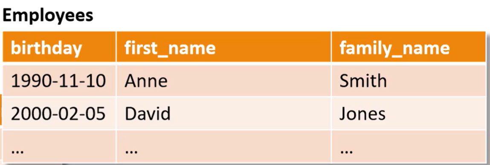

`Employees` 的 Schema 是 `Employees(bitrhday, first_name, family_name)`

假想以下这个情况：

```mysql
-- Mysql
行 1：学号 = 1001，姓名 = 张三，年龄 = 20
行 2：学号 = 1001，姓名 = 张三，年龄 = 20
```

```java
Student s1 = new Student(1001, "张三", 20);  
Student s2 = new Student(1001, "张三", 20);  
```

在 OOP 中，`s1`和`s2`是不同的对象（因为是`new`出来的），但是在数据库中一般认为这是一个对象（因为主键值相同）。


关系型数据库通过**SQL（Standard Query Language 结构化查询语言）**访问。

## [1] 简单SQL

### [1.1] 创建表格

```sql
CREATE TABLE table_name(
	column1 datatype,
    column2 datatype,
    column3 datatype
);
```

### [1.2] 指定唯一性

可制定某个/某些属性具有唯一性：

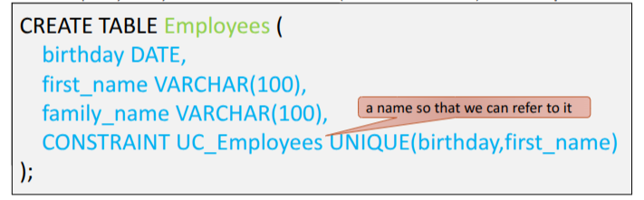

> 我们可以有两个名字相同的员工，但不能有两个**名字和生日都相同**的员工。


### [1.3] 指定主键

可以通过定义主键来指定数据在存储中的物理排序方式

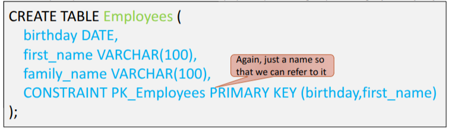

主键必须是唯一的，并且每个表**只能有一个主键**（可以有许多唯一的属性/属性集）。


### [1.4] 指定外键和删除

外键用于明确地将**两个表链接在一起**，它从一个表（子表）中的某些属性指向另一个表（父表）的主键。


```sql
CREATE TABLE A(
    a_id INT,
    name VARCHAR(10),
    CONSTRAINT PK_A PRIMARY KEY (a_id)
);

CREATE TABLE B(
    b_id INT,
    b_id_ref_a INT, -- 对 A 的引用
    CONSTRAINT FK_B FOREIGN KEY (b_id_ref_a) REFERENCES A(a_id)
);
```


> 如果表 A 中只有 ID 为 `1, 2, 3` 的学生，往表 B 插入一条 `b_id_ref_a = 99` 的记录时，**MySQL 会直接报错并拒绝写入**。这保证了表 B 不会出现“来历不明”的数据。


```sql
DROP DATABASE A;

DROP TABLE A;

ALTER TABLE Employees ADD email VARCHAR(100); -- 增加列

ALTER TABLE Employees MODIFY email VARCHAR(200); -- 从 VARCHAR(10) 改为 VARCHAR(100)

ALTER TABLE Employees DROP COLUMN email; -- 删除列 注意有个 COLUMN 关键字，这个会出题考

DELETE FROM Students
WHERE name IN (‘John’,’Sebastian’);

UPDATE Students
SET programme=‘G402’ -- 这里的=是赋值语句而不是
WHERE name=‘Oliver’; -- 这里的=是判断语句
```


### [1.5] 插入

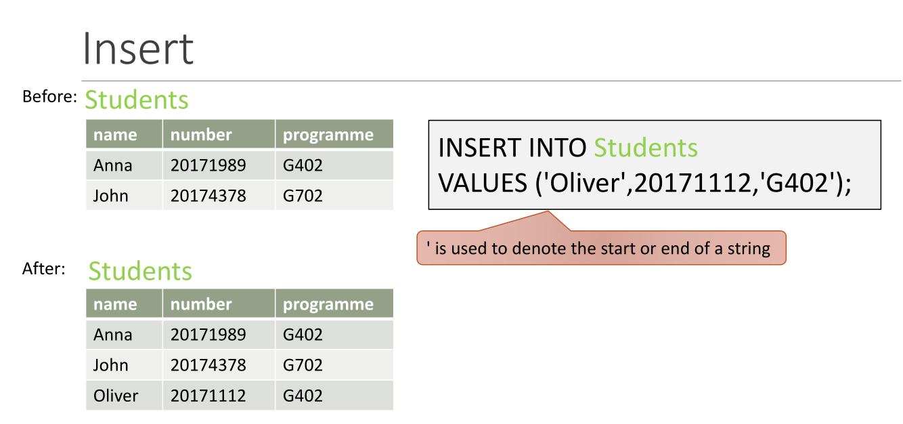

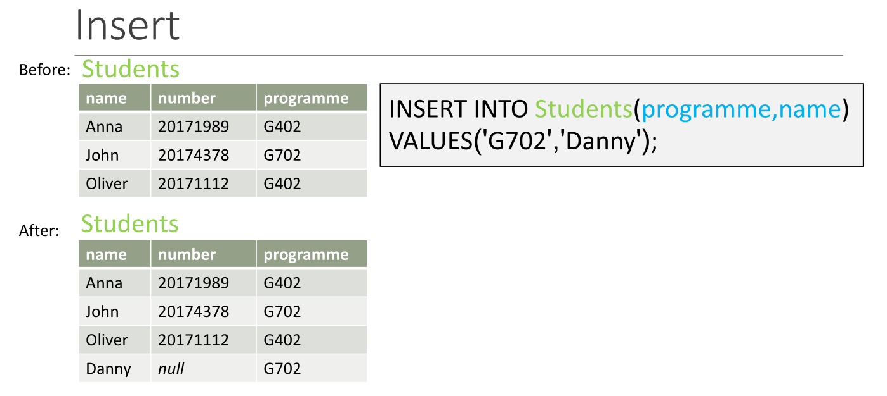


### [1.6] SQL 注入（不考）

假设注入字段`Robert'); DROP TABLE students; --` 这样会导致：

```sql
INSERT INTO Students(programme,name)
VALUES('G702','Robert'); DROP TABLE students; --');
```

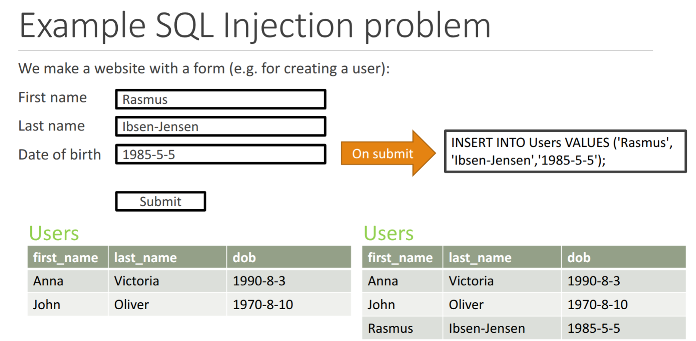

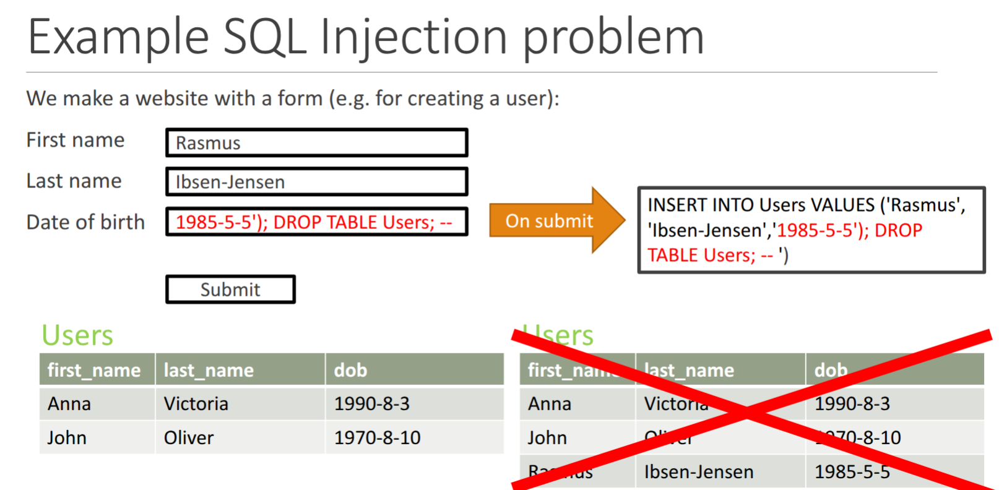


### [1.7] SQL 条件语句

```sql
AND -- 且
OR -- 或
NOT -- 非
BETWEEN 10 AND 20 -- [10,20]
LIKE -- 字符串匹配，其中 _ 代表匹配一个字符， % 代表匹配任意多个字符
= < <= >= > <> 
-- 其中<>可以写作 !=
```


### [1.8] 去重

```sql
SELECT DISTINCT -- 去重
name FROM Student;
```


## [2] QUIZ

### 基础

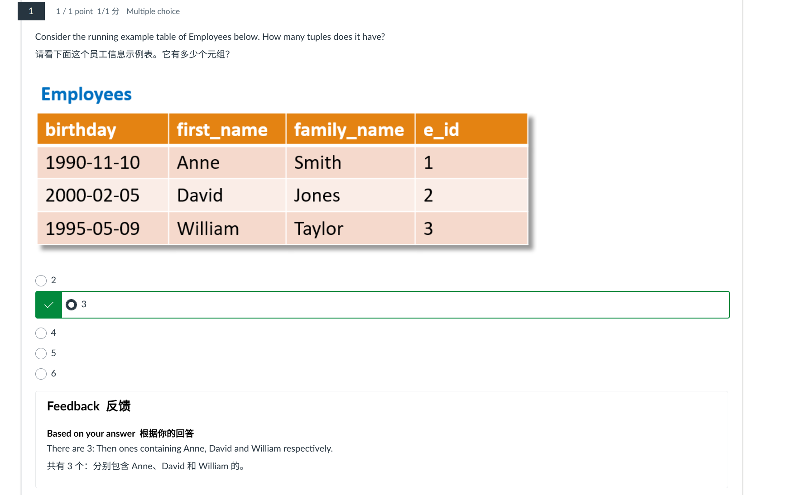

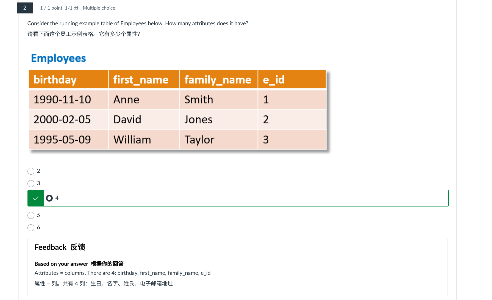

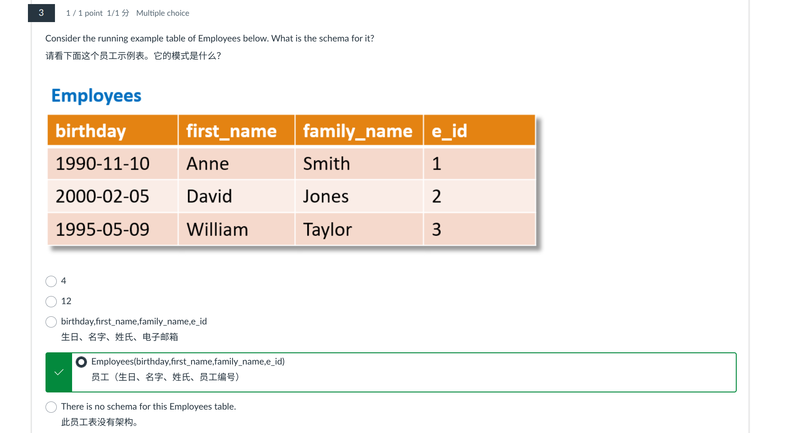


### 创建表格 1

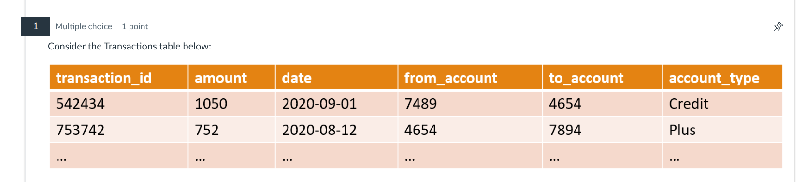

Which command could have been used to create such a table?

```sql
CREATE TABLE ( -- 没有表名，错误
transaction_id INT,
amount INT,
date DATE,
from_account INT,
to_account INT,
account_type VARCHAR(50)
);


CREATE TABLE Transactions (
transaction_id VARCHAR(50),
amount VARCHAR(50),
date VARCHAR(5), -- 5太少了，错误
from_account VARCHAR(50),
to_account VARCHAR(50),
account_type VARCHAR(50)
);


CREATE TABLE Transactions ( 
transaction_id VARCHAR(5), -- 5 太少了，错误
amount VARCHAR(5),
date VARCHAR(5),
from_account VARCHAR(5),
to_account VARCHAR(5),
account_type VARCHAR(5)
);


CREATE TABLE Transactions ( -- 顺序错了
transaction_id INT,
amount INT,
date DATE,
to_account INT,
from_account INT,
account_type VARCHAR(50)
);
```

> [!caution]
>
> 注意！在创建表格的时候，**attribute** 的顺序不能错

### 创建表格 2

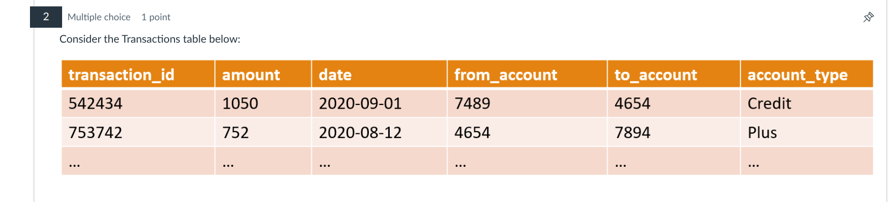


```sql
CREATE TABLE ( -- 没有表名
transaction_id INT,
amount INT,
date DATE,
from_account INT,
to_account INT,
account_type VARCHAR(50)
);


CREATE TABLE Transactions ( -- 正确
transaction_id VARCHAR(50),
amount VARCHAR(50),
date VARCHAR(50),
from_account VARCHAR(50),
to_account VARCHAR(50),
account_type VARCHAR(50)
);


CREATE TABLE Transactions (
transaction_id VARCHAR(5), -- 5 太少了
amount VARCHAR(5),
date VARCHAR(5),
from_account VARCHAR(5),
to_account VARCHAR(5),
account_type VARCHAR(5)
);


CREATE TABLE Transactions ( 
transaction_id INT,
amount INT,
date DATE,
to_account INT,          -- 顺序错了
from_account INT,
account_type VARCHAR(50)
);
```

### 创建表格 3 

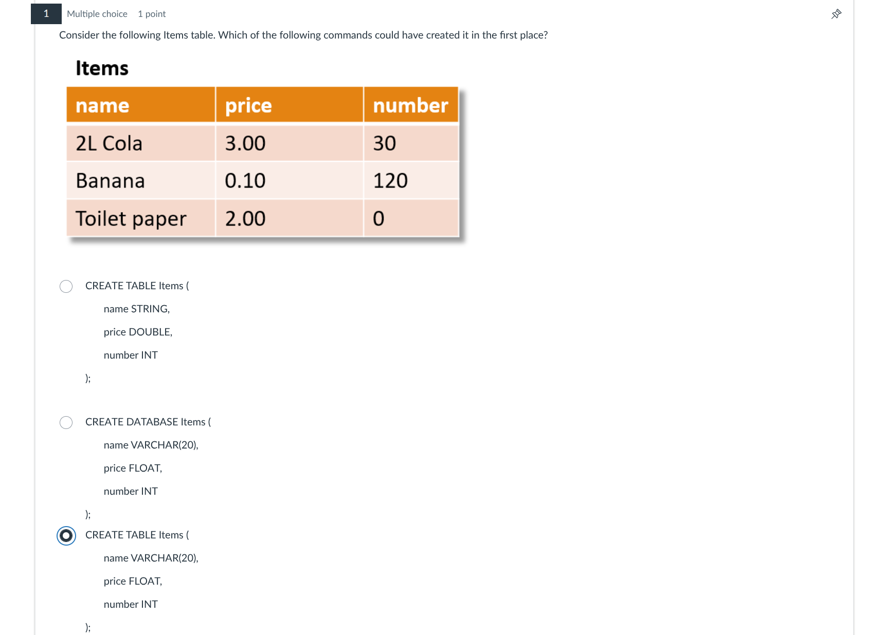

### 删除列属性


```sql
ALTER TABLE Items DROP COLUMN price;
```


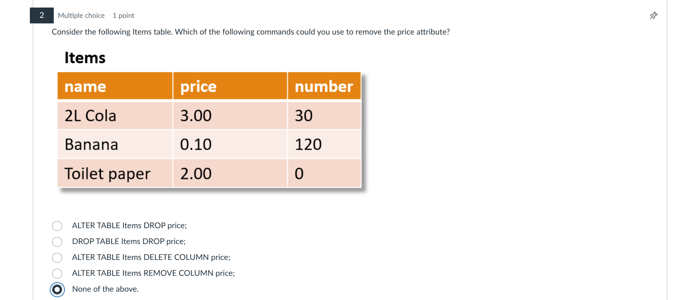

> [!CAUTION]
>
> 注意A选项少了一个`COLUMN`关键字

### 外键

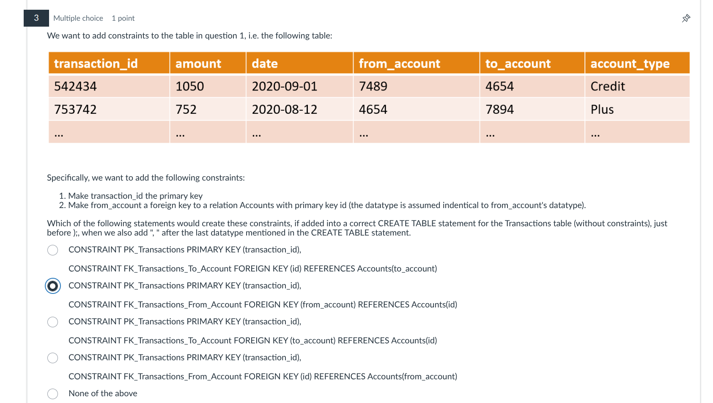


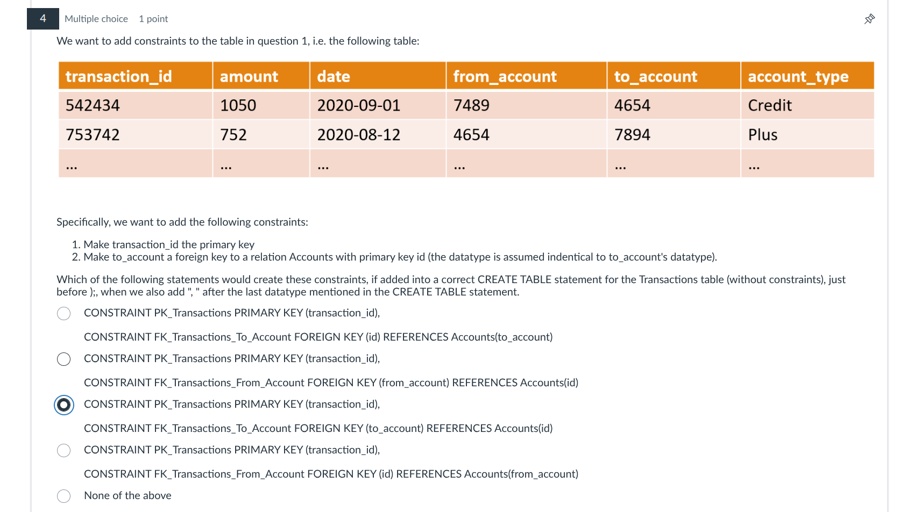

### 外键2

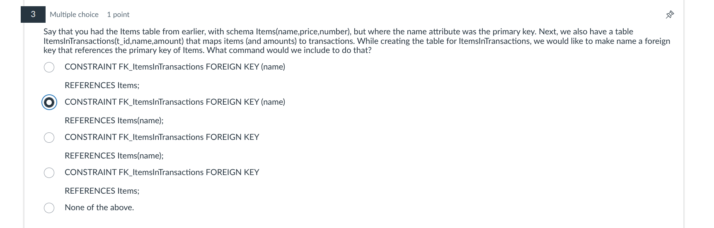

### 插入

> 如何插入Date格式？
>
> ```sql
> INSERT INTO employees (name, hire_date) 
> VALUES ('张三', '2023-10-25')
> ```

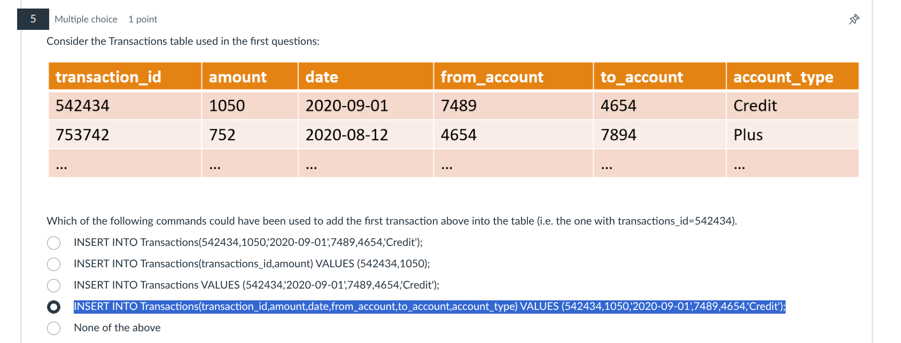


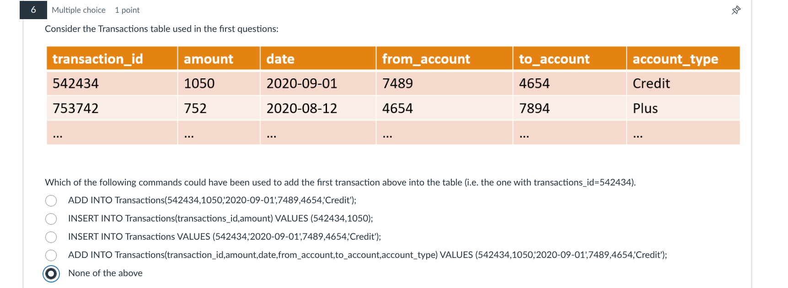

> 少了一个Column！小心坑


### 查询

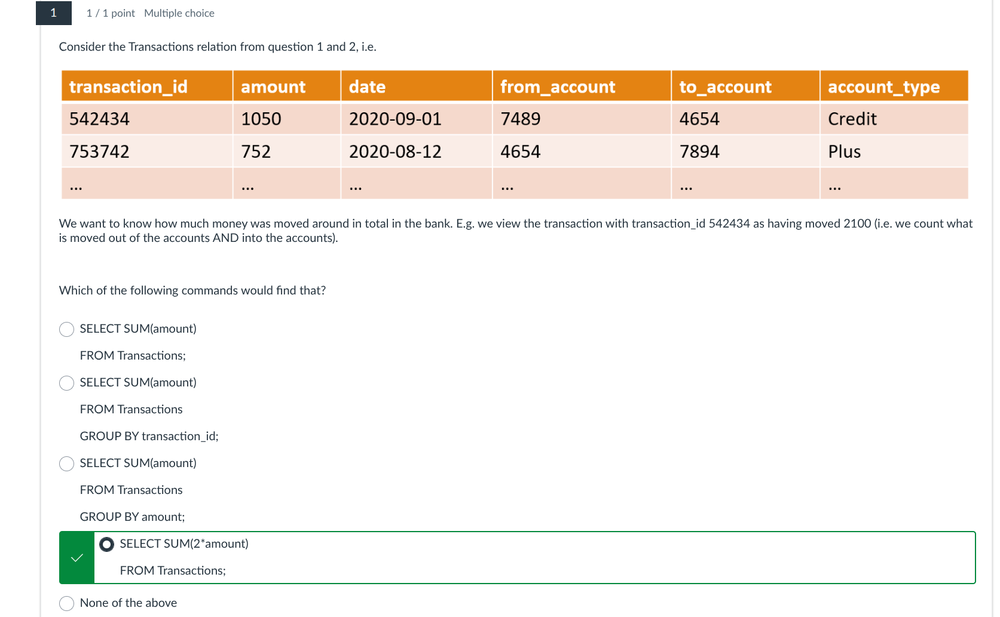

> 这里只是一个小细节要 $\times$ 2，因为一条记录只是记录 A 转给B多少钱，如果要考虑实际上银行输入输出，那要乘以2。


### 查询 2

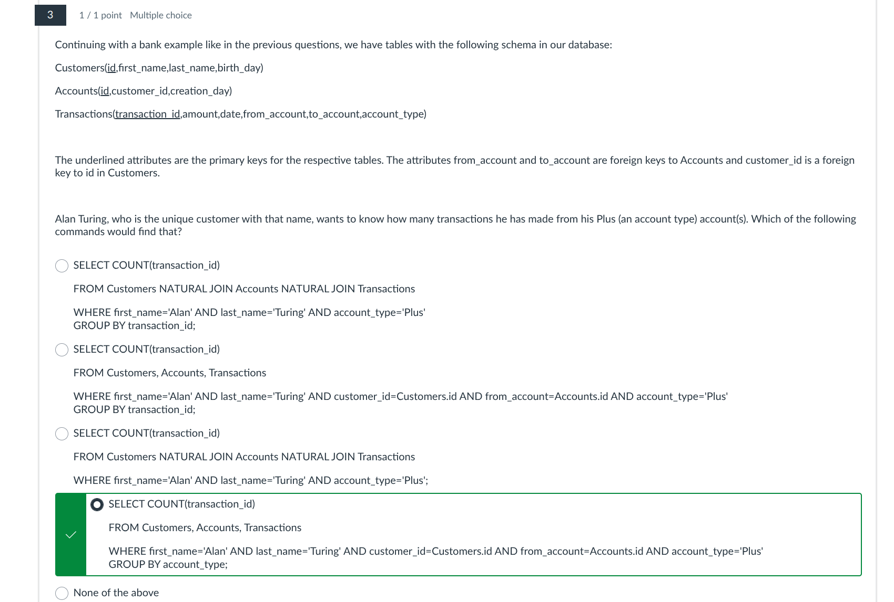

> 这个题目中，其实就是把三张表格完全 Join 之后严格参照条件选择
>
> 这里的Group By绝对不允许Group 那个 `Plus` 因为最上层使用的是 `COUNT(transaction_id)`
>
> 因为`SELECT` 不允许使用Group By没有的字段
>
> 哪怕 `SELECT COUNT(account_type) GROUP BY account_type` 也是错误的，因为这会压缩，而 `COUNT` 是选择行数。
>
> **注意这一题有变体，坑是把`Accounts.id` 直接写成了 `id`** ！！ 考试一定注意这个问题！


## [3] 更多语句

### [3.1] JOIN

将两个表的所有行两两组合

结果行数 = 表 1 行数 × 表 2 行数，无关联条件，常需配合 WHERE 筛选有效数据。

`FROM Employees, Items;`


### [3.2] NATURAL JOIN 

自动根据两表的**共同列**（如都有 e_id）进行关联，仅保留共同列值匹配的行，且共同列只显示一次；

`FROM Employees E, Transactions T WHERE E.e_id = T.e_id;`

自然连接通常**不需要你指定连接条件**（如 `ON A.id = B.id`）。它会自动寻找两张表中**所有名称相同**的列，并要求这些列的值必须全部相等。

如果没有名称相同的列，会退化为**笛卡尔积**

> [!CAUTION]
>
> 如果希望 Nature join 表 `A` 和 表 `B` 中共有字段`id`， 但是两个表**此外**还存在共有字段`name` 这时候Nature Join也会强制要求两个name相等，者会导致非预期的结果。
>
> 为了解决这个问题，可使用：
>
> ```sql
> SELECT * FROM A JOIN B USING(id);
> ```
>
> 或者
>
> ```sql
> SELECT * FROM A JOIN B ON A.id = B.id; -- 注意不是使用 WHERE
> ```
>
> > 使用两个或多个 `USING` 关键字：
> >
> > ```sql
> > SELECT * FROM A JOIN B USING(id,name);
> > ```


### [3.3] EXIST

**`EXISTS` 是 `IN` 的推广：** 虽然 `IN` 常用于检查某个值是否在列表中，但 `EXISTS` 更加灵活，尤其是当涉及到多个条件的匹配时。

**运作机制：** 你在 `EXISTS` 后面写一个子查询。对于主查询中的**每一行数据，数据库都会运行这个子查询**：

- 如果子查询**返回了任何结果**（至少有一行），则条件为“真”，当前行会被保留。
- 如果子查询**没有返回任何结果**，则条件为“假”，当前行会被丢弃。


```sql
-- NOTE：这个语句就是接下来要提到的半连接（Semi Join）
SELECT *
FROM Students
WHERE EXISTS (
    SELECT 1
    FROM Lecturers
    WHERE Students.name = Lecturers.name 
    AND Students.last_name = Lecturers.last_name
);
```

找出那些与某位讲师（Lecturer）“名”和“姓”都相同**的学生（Student）**。


### [3.4] SEMI JOIN

> 半连接后面课程会详细讲解

大多数类型的连接都在`FROM`子句中完成，不过有一个例外，那就是半连接，它们是在`WHERE`子句中完成的。

简单来说，半连接的主要目的是**根据另一个表的存在性来过滤主表的数据**。

例子如下，

**Employee**

| birthday   | first\_name | family\_name | e\_id |
| ---------- | ----------- | ------------ | ----- |
| 1990-11-10 | Anne        | Smith        | 1     |
| 2000-02-05 | David       | Jones        | 2     |
| 1995-05-09 | William     | Taylor       | 3     |


### [3.5] **Transactions**

| t\_id | c\_id | e\_id |
| ----- | ----- | ----- |
| 1     | 3     | 1     |
| 2     | 6     | 1     |
| 3     | 19    | 3     |


```sql
SELECT * FROM Employees E
WHERE EXISTS (
    SELECT 1 
    FROM Transactions T 
    WHERE E.e_id = T.e_id
);
```


### [3.6] GROUP BY

交易表如下：

| t\_id | c\_id | e\_id |
| ----- | ----- | ----- |
| 1     | 3     | 1     |
| 2     | 6     | 1     |
| 3     | 19    | 3     |


现在，我想知道 `e_id=1` 的员工到底有多少个交易：

```sql
SELECT e_id, COUNT(t_id)
FROM Transactions
WHERE e_id=1;
```

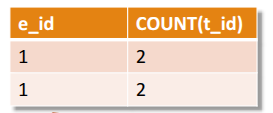


但是如果我想对每个员工都这样做呢？

```sql
SELECT e_id, COUNT(t_id) 
FROM Transactions 
GROUP BY e_id;
```


**如果我们使用`GROUP BY`，那么在`SELECT`中只能包含我们用于GROUP BY的属性或聚合函数。**

```sql
SELECT first_name, e_id, COUNT(t_id)  -- 但这是行不通的，因为first_name不在GROUP BY中
FROM Employees NATURAL JOIN Transactions 
GROUP BY e_id;
```

正确做法是：

```sql
SELECT first_name, e_id, COUNT(t_id) 
FROM Employees NATURAL JOIN Transactions 
GROUP BY first_name, e_id; -- 我们多添加这个即可！
```


### [3.7] HAVING

Having 语句在 `Group By` 后使用，类似于`WHERE`

**`WHERE`** $\rightarrow$  **`GROUP BY`** $\rightarrow$  **`HAVING`**


```sql
SELECT first_name, COUNT(t_id)
FROM Employees NATURAL JOIN Transactions
WHERE birthday >= '1990-01-01'  -- 1. 先筛选掉生日早于90年的员工
GROUP BY first_name, e_id      -- 2. 将剩下的员工按姓名和ID拆分成子表
HAVING COUNT(t_id) > 1;        -- 3. 只保留交易次数大于1的那些子表 (组)
```


### [3.8] ORDER BY

**`WHERE`** $\rightarrow$  **`GROUP BY`** $\rightarrow$  **`HAVING`**  $\rightarrow$ **`ORDER BY`**


```sql
SELECT first_name
FROM Employees
ORDER BY family_name;
```


**关键点：** 虽然你只选择了显示 `first_name`（名字），但你依然可以根据 `family_name`（姓氏）来对结果进行排序。


当 `ORDER BY` 后面跟着多个字段时的情况：

- **语法示例：** `ORDER BY family_name, first_name`
- **逻辑：** 这种排序称为**字典序（Lexicographical order）**。
  - 首先按照第一个属性（`family_name`）排序。
  - 如果两个人的姓氏相同，则按照第二个属性（`first_name`）在这些姓氏相同的人中进行内部排序。


- ASC ：升序
- DESC：降序

### [3.9] UNION

`UNION` 就像数学中的“集合”，或者简单理解为将一个查询的结果列表**“堆叠”在另一个查询结果的下面**。

> [!CAUTION]
>
> **两个硬性条件**：
>
> 1. 参与联合的查询必须拥有**相同数量的列**。
> 2. 对应位置的列必须具有**相似的数据类型**。


例子：

| birthday   | first\_name | family\_name | e\_id |
| ---------- | ----------- | ------------ | ----- |
| 1990-11-10 | Anne        | Smith        | 1     |
| 2000-02-05 | David       | Jones        | 2     |
| 1995-05-09 | William     | Taylor       | 3     |


```sql
SELECT first_name AS name
FROM Employees

UNION

SELECT family_name
FROM Employees;
```

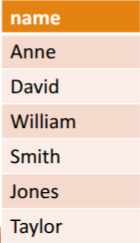


```sql
SELECT first_name AS name, e_id 
FROM Employees 

UNION 

SELECT family_name, e_id 
FROM Employees;

-- 当然这里也可以加上 ORDER BY name;
```

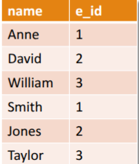


### [3.10] 视图


这是一个SQL语句：

```sql
SELECT first_name, e_id, COUNT(t_id) 
FROM Employees 
NATURAL JOIN Transactions 
GROUP BY first_name, e_id;
```

我们可为其添加视图！

```sql
CREATE VIEW Employee_transaction_count AS -- 如此简单的语句！

SELECT first_name, e_id, COUNT(t_id) 
FROM Employees 
NATURAL JOIN Transactions 
GROUP BY first_name, e_id;
```


之后我们可以引用这个视图 `Employee_transaction_count` 把他当作一张表格！


```sql
SELECT first_name, COUNT(t_id) 
FROM Employee_transaction_count;
```


关于视图：

- 默认情况下，视图中的数据无法修改（即无法更新、删除或插入）

  - 这可以通过触发器（Triggers）来实现，但本模块不涉及这部分内容

- 如果重复创建视图，会报错，因此

  ```sql
  CREATE OR REPLACE VIEW Employee_transaction_count AS
  SELECT ...
  ```

- 删除视图

  ```sql
  DROP VIEW Employee_transaction_count;
  ```


## [4] 更多QUIZ

### Natural Join

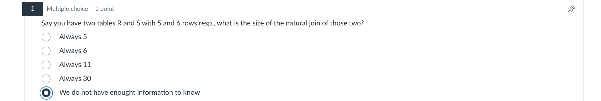


因为我们不知道他们的别名有多少相同，可能没相同别名（退化为笛卡尔积，结果就是30），或者有相同别名，我们无法确定


### Natural Join 2

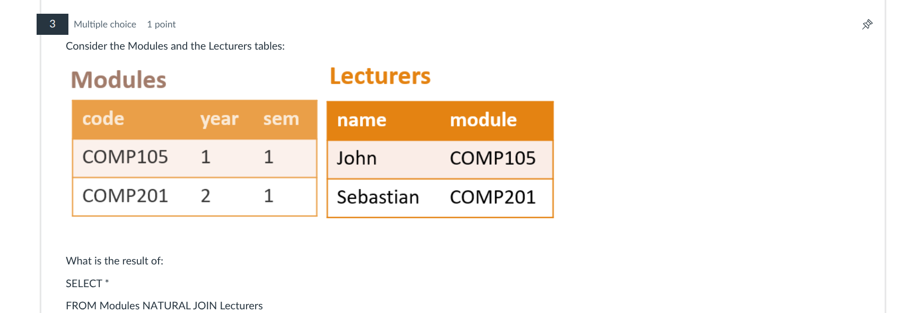


这里考察的是当自然连接没有遇到名称相同列的情况，这种情况会退化为笛卡尔积：

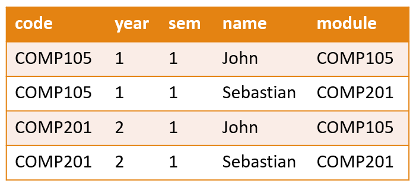


### COUNT

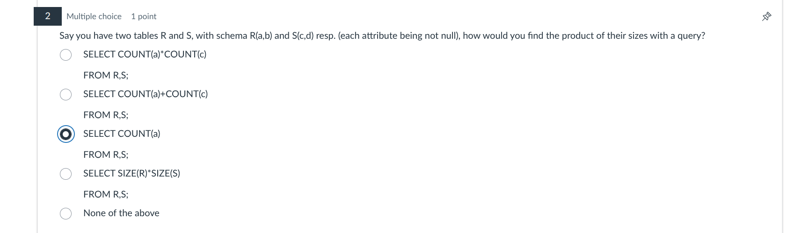

这里使用普通笛卡尔积，然后列就变成了 `a b c d ` 只需要任意统计一列的数量即可！


或者写成 `COUNT(*)`


### Semi Join

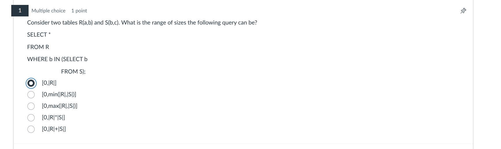

这个属于半连接，因此最多是左表的大小！


### GROUP BY

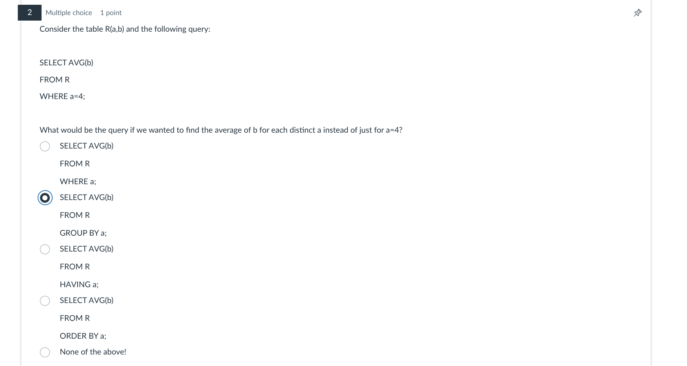


### 综合错误判断

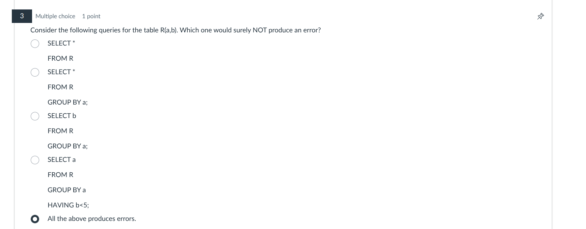

- 选项A少了 `;`
- 选项B，考察Group By知识点，因为Group By `a` ，因此如果选择`*` 包含了没有在Group By中的元素`b` 这回导致报错！！
- 选项C，同选项B，错误
- 现象D，`HAVING` 引用了`b`，这是不在 Group By 结果中的！


### 视图

Consider a university database that has a Grades table, `Grades(grade,student_id)`. 

We want to find the student id of the student with the **highest average grade**.

We could do it using the following query:

```sql
SELECT student_id
FROM V
WHERE avg_grade=MAX(avg_grade);
```


Where `V` is some view. Which of the following definitions would produce a view and be such that the output of the above query was what we wanted?


需要找到有最高平均分的学生，那么视图`V` 应当含有字段均分 `avg_grade` 然后是Group By的，但是无需排序，通过AVG关键字SELECT

```sql
SELECT student_id, AVG(grade) as avg_grade
FROM Grades
GROUP BY student_id; -- 默认升序
-- 当然这里排序不影响结果，如果是选择题，没有这个选项，那么就选择加上排序的选项！
```

然后创建视图

```sql
CREATE VIEW V AS
SELECT student_id, AVG(grade) as avg_grade
FROM Grades
GROUP BY student_id;
```


# SQL Transaction Management

**SQL 中的事务管理**

## [0] 非关系型数据库

NoSQL称为非关系型数据库，他的的核心类别包括：

- **键值存储（Key-value stores）**：以 “键 - 值” 对形式存储数据，如 **Redis**，是典型 NoSQL 类型。
- **图数据库（Graph databases）**：专注于存储实体间的关联关系（如社交网络中 “用户 - 好友” 关系），如 Neo4j，属于 NoSQL 范畴。
- **半结构化数据库（Semistructured database）**：处理非固定 schema（结构）的数据（如 JSON、XML 格式），无需预先定义表结构，符合 NoSQL “灵活存储” 的特点，属于 NoSQL 类型。

## [1] ACID

### [1.1] Transaction

**Transaction**：

- 在数据库语境中固定译为 **“事务（Transaction）”**，指数据库操作的基本单位，**具有 ACID四大特性**
  - **Atomicity 原子性**

  - **Consistency 一致性**

  - **Isolation 隔离性**

  - **Durability 持久性**

- 例如 “转账” 操作就是一个典型事务（扣钱和加钱需同时成功或同时失败）。
- **单次**查询也是一个Transaction。
- Transaction 以`START TRANSACTION;`开始，当你写入`COMMIT;`或`ROLLBACK;`时结束。
- Transaction 必须是有**原子性**的

比如如下是一个Transaction的例子：

```sql
START TRANSATION;
INSERT INTO A VALUES (1);
ROLLBACK; -- 手动回滚，事件结束。
SELECT * FROM A;
```


Transaction 正确写法：

```sql
START TRANSACTION;
-- SQL STATEMENT
COMMIT;
```


当然Transaction也是可以并行多线程的！

只要你没写`COMMIT`所有在Transaction中的语句都是**暂时的**，遇到任何异常（包括服务器宕机、断电），其**恢复后都会触发回滚。**


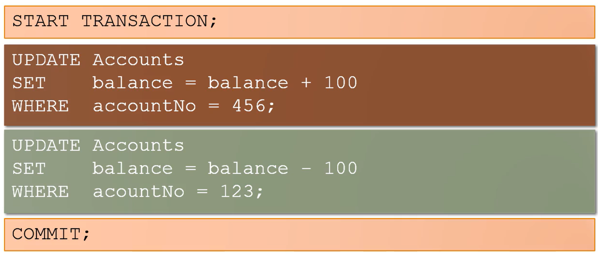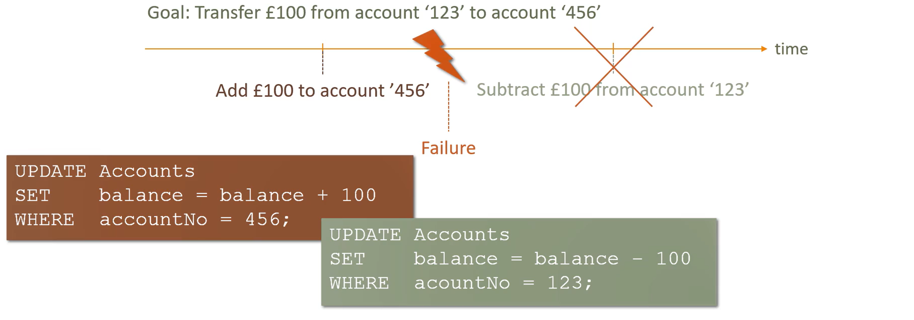


### [1.2] Management

**Management**：

- 结合 “事务” 的技术场景，译为 “管理”，指对事务的创建、提交、回滚、隔离级别设置等操作的管控
- 确保数据库数据的完整性和一致性。

### [1.3] ACID 

Transaction具有ACID四大特性：

- Atomic（原子性）：要么一下子全完成，要么不完成。
  - **核心作用**：避免 “部分操作生效” 导致的数据混乱，例如转账时若只扣了付款方的钱、却没给收款方加钱，原子性会触发回滚，让双方账户恢复原样，保障交易完整性。
- Consistency（一致性）：核心可分为两类：
  - 基础层面：**事务执行后必须满足数据库的预设约束（如主键唯一、账户余额不能为负）**，若违反约束（如向主键重复的表插入数据），事务会失败，数据不会被修改；（定义A）
  - 业务层面：事务结果需符合现实世界的逻辑（如 “订单支付” 需同时满足 “扣减用户余额” 和 “生成订单记录”，二者需匹配真实交易场景）。（定义B）
- Isolation（隔离性）：按选中内容，隔离性要求多个事务并发执行时，每个事务的操作都 “仿佛没有其他事务在运行” $——$ 即一个事务的中间结果不会被其他事务读取或干扰，事务之间相互独立。
  - 核心作用：类似于解决并发修改异常。
- Durability（持久性）：如选中内容所述，持久性指事务执行`COMMIT`（提交）后，其对数据的修改会 “永久生效”，后续即使发生系统崩溃、断电等故障，已提交的修改也不会被撤销或丢失，==除非已提交的事务被**回滚**或以其他方式**撤销**==。
  - **核心作用**：保障事务结果的 “可靠性”，例如用户完成存款并收到 “提交成功” 反馈后，即使银行系统突然故障，重启后该笔存款记录仍会保留，不会因故障导致 “存款消失”。


<a id ="consistency_explain"></a>

#### [1.3.1] 对于 Consistency

> 在课程讲解中，一致性 Consistency 通常被 “跳过重点考察”，核心原因有两点：
>
> - 定义差异大：不同数据库理论来源对 “一致性” 的定义不同
> - 与隔离性关联紧密：**课程默认 “==若调度满足可串行化（Serializability），则视为满足一致性==”，**而可串行化是隔离性的核心判断标准，因此单独考察一致性的意义不大。
>

注意：一致性并非由可串行化定义，但在本课程中，我们将认为==可串行化**隐含**一致性==

> 隐含：imply
>
> 也就是可串行化可以推导出一致性，写作**可串行化** $\subseteq $ 一致性。


课程中对于一致性大概有两种定义：

- 定义A $——$ 数据库不违反一致性，当：这些数据不违反主键、外键等规则（比如不能重复主键）
- 定义B $——$ 数据库不违反一致性，当：它和现实存在正确映射（例如数据库中，因意外，一个座位被两个人订购了，这就违反了一致性）

也就是：

- 定义A $——$ 弱版本：Transaction 不得违反**约束**
- 定义B $——$ 强版本：Transaction  应当正确转换数据库状态，以反映现实世界事件的影响


Transaction（若独立运行）始终将一个**一致的数据库状态**转换为另一个**一致的数据库状**态。


**它们产生两种结果之一**

- `COMMIT`（即成功）
  - 执行成功，数据库最终处于一致状态
- `ABORT`（即失败）
  - 事务执行过程中遇到错误（如逻辑错误、死锁或硬件故障）时，系统会执行 `ABORT` 操作。
  - 触发 `ABORT` 后，数据库会执行 **回滚（Rollback）**，利用 Undo Log 将该事务已经执行的所有修改撤销，使数据库恢复到该事务开始前的状态。
  - 这是为了实现 ACID 中的 **原子性 (Atomicity)**——确保事务中的操作要么全做，要么全不做。


<a id='bank_example'></a>

**这意味着[串行调度 Serial Schedule](#what_is_serializable)是Consistant的！** 因为每个事务**自身能保证一致性**（独立执行时从一致状态到一致状态）


什么样的 Transaction 会破坏一致性？

- 比如两个人订购了同一个座位的**[例子](#not_isolated_transaction)**。

- 另一个破坏一致性的例子是系统故障：**事务执行过程中发生故障，导致事务操作未全部完成，违反了原子性，进而引发数据不一致**。

  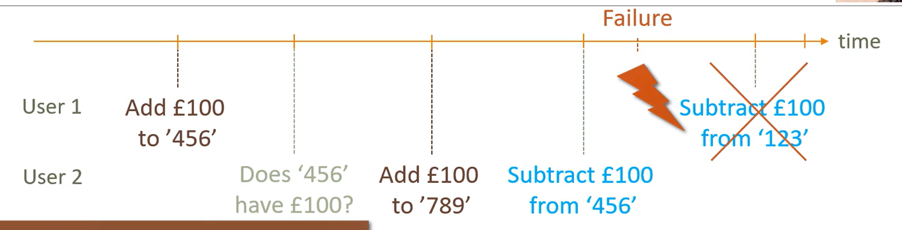


> 这个图片将会在后续Recoverable 一章用到，来证明 Recoverable Schedule 能保证 Durability


#### [1.3.2] 对于 Isolation

隔离性：一个事务的中间结果不会被其他事务读取或干扰，事务之间相互独立。

在未明确指定 “隔离级别” 的前提下，**==隔离性  等价于 可串行化（Serializability）==** $——$ 即多个事务并发执行的结果，需与 “按顺序逐个执行这些事务” 的结果完全一致。
$$
\text{隔离性}\iff\text{可串行化}
$$
因为隔离要求不被干扰，必须要满足**[可重复读和防幻读](#what_is_repeatable_read_and_phantom_read)**，这恰好就是可串行化要干的事情。


比如这样的重叠查询的两个 Transaction 他们 **不是  隔离的（Not Isolated）**。


##### Example 1

**不隔离的 Transaction 导致一致性被破坏：<a id="not_isolated_transaction"></a>**

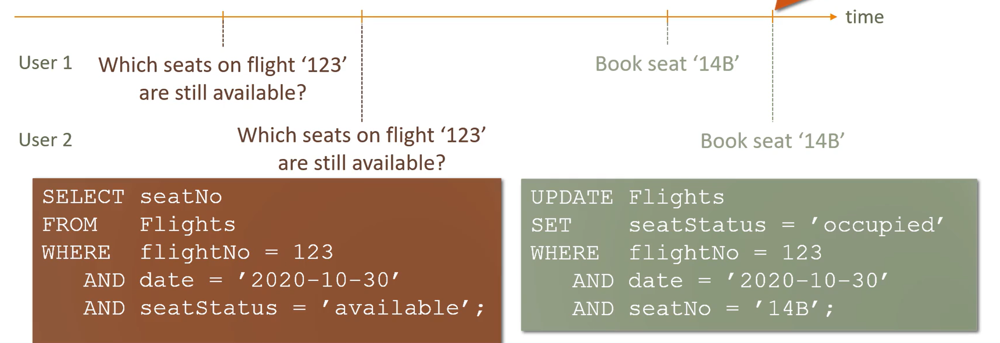


这样的结果会导致现实中的**不一致性（Inconsistent）**！

解决方法是：事务 2 **中止（abort）**，回滚其所有操作。


##### **Example 2<a id="example_of_isolation"></a>**

和 Example 1 一样，但是分为了多个Transaction

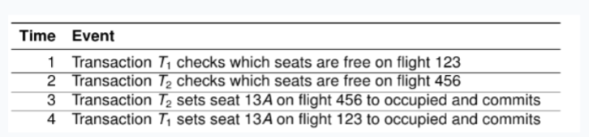

这个违反隔离性因为T1下一个跟着应当T1。

> 在这个场景中，事务 T1 检查了 123 航班上是否有空位，但在它完成操作之前，事务 T2 将座位 13A 设置为已占用并提交。然后，T1 将座位 27B 设置为已占用并提交。这会导致两个事务可能分配相同的座位（如果 T1 也选择了 13A），从而破坏数据库的一致性。此外，由于缺乏适当的隔离，**T1 和 T2 之间可能会相互干扰，因为 T1 在 T2 提交后无法看到更新后的状态。**
>
> 这类似于设计不恰当的锁。T1和下一个T1两个有逻辑的事物应当放在一起。
>
> 或者更简单的方法：此处脏写+脏读，违反了Serializable（也即隔离性）


##### **Example 3**

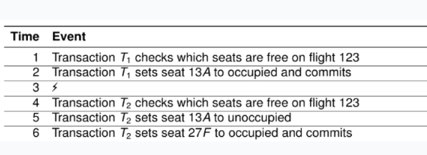

这里 闪电标志代表宕机，当恢复后系统无变化。这个不违反ACID中的任何一条！因为T1和T2这些有逻辑的Transaction都排在一起。

> 或者更简单的方法：此处保证了无脏读、无脏写、无幻读，符合Serializable（也即隔离性）
>
> 再或者：此处是串行调度，必然属于可串行化

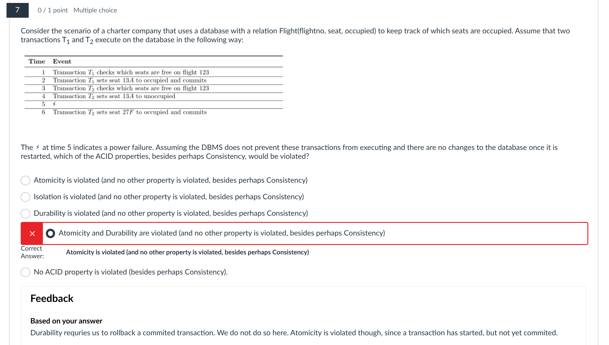

>  此处，没有回滚T2导致Atomic被破坏
>
> 为什么持久性（Durability）没有被破坏？
>
> - **持久性定义：** 一旦事务**提交（Commit）**，它对数据库的改变就应该是永久性的，即使发生系统崩溃也不会丢失。
> - **在本题中：** 只有 $T_1$ 是提交了的。
> - 断电发生时，$T_1$ 的结果已经写入了数据库。只要重启后 $T_1$ 的结果还在（即 13A 最初被设为占用的状态），持久性就是满足的。
> - **持久性只针对“已提交”的事务**。由于 $ T_2 $ 根本没提交，它的数据丢了或者乱了，不属于持久性的范畴。

题目这里，其实不太好（因为是分开的），但是也可以用。更正确的写法应当是这样：查询+订购放在一起。


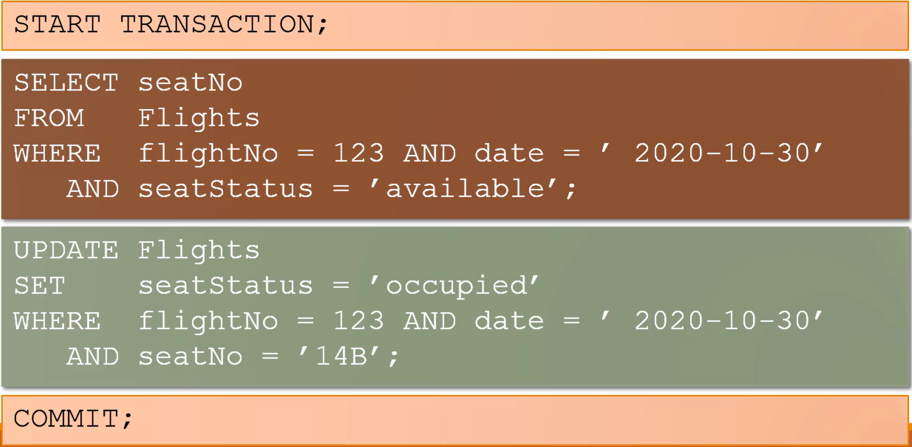

<a id="consistency"></a>

#### [1.3.3] 对于 Durability

**判断方法**：若已提交的事务因意外情况（如电源故障、系统崩溃）导致修改丢失，**或被后续操作回滚**，则持久性被破坏；若提交后的修改始终保留（即使经历故障恢复），则持久性满足。

**回滚（Rollback）本身并不破坏持久性，它是为了实现原子性（Atomicity）而设计的核心机制。**

只有在一种特定且极其危险的情况下，回滚才会演变成“破坏持久性”的行为：那就是**撤销了一个已经向用户确认过“提交成功（Committed）”的事务**。比如，**脏读**，具体请查看**[级联回滚导致破坏持久性](#cascading_rollback_violate_durability)**的例子。


> 事务 T1 提交 “座位 13A 设为已占用” 后，因电源故障重启系统，若 13A 的 “已占用” 状态消失，则持久性被破坏。
>
> 否则不破坏持久性

### [1.4] MySQL中的 Atomicity

本质上，MySQL通过回滚未完成的事务来满足原子性。但是MySQL的做法很奇怪！示例：

```mysql
CREATE TABLE G (g int, CONSTRAINT pk_g PRIMARY KEY (g)); 
INSERT INTO G VALUE (1); 
START TRANSACTION; 
INSERT INTO G VALUE (2); 
INSERT INTO G VALUE (1); 
ROLLBACK;
```


**判断事物是否有原子性的方法**：关键看每个事务是否有明确的`COMMIT`（提交）或`ROLLBACK`（回滚）操作 $——$ 若所有事务均有这两类终结操作，说明事务未出现 “部分执行” 的情况，原子性满足；若存在事务既未提交也未回滚（如中途中断），则原子性被破坏。


### [1.5] MySQL中 Isolation 的4个级别

课程中将隔离性分为两类：

1. **“纯粹的隔离性”（Isolation on its own）**

   要求事务必须满足**[可串行化（serializability）](#what_is_serializable)**

   - 即多个并发事务的执行结果，必须与 “按顺序逐个执行这些事务” 的结果完全一致。
   - 通俗来说，就是事务之间仿佛 “排队执行”，**彼此不会产生任何干扰。**

2. **“隔离级别”（Levels of isolation）**

   是对隔离强度的分级设定（共 4 级），允许根据业务需求选择不同的隔离程度，平衡 “数据一致性” 和 “并发效率”。

| **隔离级别**                    | **脏读** | **不可重复读** | **幻读** | **并发性能** |
| ------------------------------- | -------- | -------------- | -------- | ------------ |
| **读未提交 (Read Uncommitted)** | 允许     | 允许           | 允许     | 强           |
| **读已提交 (Read Committed)**   | **禁止** | 允许           | 允许     |              |
| **可重复读 (Repeatable Read)**  | **禁止** | **禁止**       | 允许     |              |
| **可串行化 (Serializable)**     | **禁止** | **禁止**       | **禁止** | 弱           |

| **隔离级别**                | **脏写 (Dirty Write)** | **脏读 (Dirty Read)**         | **不可重复读 (Non-Repeatable Read)** | **幻读 (Phantom Read)**                                    | **并发性能**            |
| --------------------------- | ---------------------- | ----------------------------- | ------------------------------------ | ---------------------------------------------------------- | ----------------------- |
| **读未提交** (RU)           | **禁止**               | <font color="red">允许</font> | <font color="red">允许</font>        | <font color="red">允许</font>                              | **极高** (几乎无锁)     |
| **读已提交** (RC)           | **禁止**               | **禁止**                      | <font color="red">允许</font>        | <font color="red">允许</font>                              | **高** (MVCC快照读)     |
| **可重复读** (RR)           | **禁止**               | **禁止**                      | **禁止**                             | <font color="#f39c12">允许 (标准) 基本禁止 (InnoDB)</font> | **中** (间隙锁/快照读)  |
| **可串行化** (Serializable) | **禁止**               | **禁止**                      | **禁止**                             | **禁止**                                                   | **低** (强制全并发加锁) |

隔离级别**最高到最低**排序：

<a id="what_is_serializable"></a>

#### [1.5.1] SERIALIZABLE

- 可串行化

- 最高级别

- 什么是可串行化？可串行化指：**并发执行的事务调度，其结果与这些事务 “逐个串行执行” 的结果完全一致**
  - 串行执行：事务一个接一个地执行，无操作交错，结果确定且一致。
  - 可串行化调度：多个事务的操作可交错执行，但最终效果等价于某一种串行执行的顺序
- 是隔离级别中最严格的一级，要求同时满足 “可串行化” 和 **“可重复读（REPEATABLE READ）”**。

- 效果：并发事务的执行等价于串行执行，几乎能避免所有并发问题，但可能导致性能降低（因限制严格）。

  > <a id="what_is_repeatable_read_and_phantom_read"></a>
  >
  > **可串行化 = 可重复读 + 禁止幻读+禁止脏读 = 禁止脏读+禁止脏写+禁止幻读**
  >
  > 
  >
  > **幻读（Phantom Read）**？
  >
  > - 幻读是数据库并发操作中常见的问题之一，特指在同一事务内，多次执行相同条件的**查询（`SELECT`）**，由于其他事务插入或删除了符合该条件的行，导致后续查询结果集中的==**行数**==发生变化。
  >
  > <a id="what_is_dirty_read"></a>
  >
  > **脏读（Dirty Read）：**
  >
  > - **==读取了“虚假”的数据。==** 当事务 A 修改了数据但**尚未提交**时，事务 B 读取了这一修改。如果事务 A 随后发生错误并执行了回滚（Rollback），那么事务 B 之前读到的数据实际上从未真正存在过。
  >
  > <a id="what_is_non_repeatable_read"></a>
  >
  > **Non-Repeatable Read（不可重复读）**
  >
  > - **前后两次读取同一行，结果的==内容==不一样。** 在一个事务内，先后两次读取同一条记录。在两次读取之间，另一个事务修改并**提交**了这条记录，导致你第二次读到的数据和第一次不一致。
  >
  > 
  >
  > REPEATABLE READ（可重复读）
  >
  > **在同一个事务中，多次读取同一批数据时，结果的==内容==始终保持一致**，不受其他并发事务对数据的修改影响。
  >
  > - 事务执行期间，即使其他事务修改了数据并提交，当前事务再次读取时，**仍能看到事务开始时的数据状态。**
  > - **可重复读不能解决幻读问题。**因为可重复度仅仅保证内容多次读取一致，而不能保证行数一致。
  > - 可以推导，可重复读=禁止脏读+禁止脏写

<a id="what_is_repeatable_read"></a>

#### [1.5.2] REPEATABLE READ

- 可重复读

- 核心特点：在同一个事务中，对同一数据的多次**读操作**（如 `SELECT`）结果始终一致，不受其他并发事务的插入、修改、删除操作影响。

- 例如：事务 A 第一次读取某商品库存为 10，即使事务 B 此时修改库存为 8 并提交，事务 A 再次读取时仍会得到 10，确保 “重复读” 结果不变。


#### [1.5.3] READ COMMITTED

- 读已提交

- 核心特点：只能读取其他事务**已经提交**的数据，无法读取未提交的中间结果（避免 **“脏读（Dirty Read）”**）。

  > 在实际操作中，隔离性往往没有得到完全执行（￫可能会发生“脏读”）
  >
  > 原因：效率！
  >
  > - 减少用于防止“脏读”的时间
  > - 通过执行一些原本需要等待以防止“脏读”的事务，获得“更高的并行性”
  >
  > 当事务不得不中止时，“脏读”会减慢系统速度。

- 例子：

  - 事务 T1 修改数据 A（执行`UPDATE`操作），但未提交时，数据 A 处于 “中间未提交状态”；
  - 此时事务 T2 读取数据 A，会直接读取**T1 修改前的已提交值**（旧值），无需等待 T1 提交，**因为它读取不了中间值**；
  - 只有当 T1 提交后，事务 T2 再次读取数据 A 时，才会看到 T1 修改后的新值。

- 在 **读已提交（Read Committed）** 隔离级别下，当一个值 A 正在被事务 T1 修改（未提交）时，另一个事务 T2 读取到 A 的**旧值（修改前的已提交值）**，这恰恰是**满足读已提交**的表现


#### [1.5.4] READ UNCOMMITTED

-  读未提交

- 最低级别

- 隔离强度最低，理论上允许读取其他事务**未提交**的**中间数据（可能产生 “脏读”）。**
- 课程中特别说明：MySQL 对此级别有少量约束（并非完全无限制），但整体仍属于隔离性最弱的级别。


以下这个例子符合**读未提交**，但不符合**读已提交**。

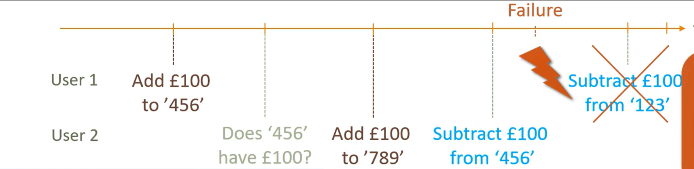

为什么？因为读未提交允许脏读，读已提交不允许脏读（因此只能读取前一个数据），此处`DOES 456 HAVE 100` 就是属于脏读。


那么在 MySQL 中如何设置这些级别呢？

```mysql
SET tx_isolation='Serializable';
```


如果不提及隔离级别，那么隔离性**等价于[可串行化（serializability）](#what_is_serializable)**。


尝试使用四个级别的隔离来模拟：

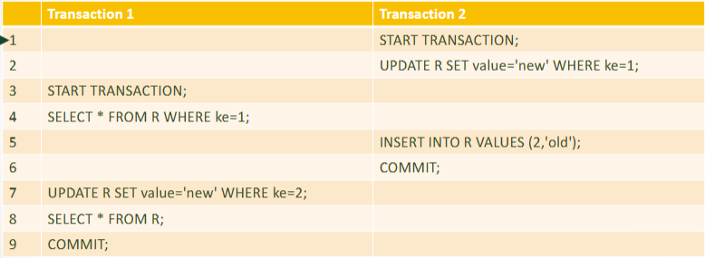

> 这是关系型数据库
>


## [2] 锁

### [2.1] 基本锁

一个项目上的基本锁包括对该项目的锁定和解锁操作。

若 Transaction 请求获取某个数据项的 “挂锁（Padlock）”（即申请加锁）：

- 如果这把锁当前是 “空闲” 的（没有被其他 Transaction 占用），调度器会把锁分配给该事务；
- 如果锁已被其他事务占用，该事务必须**等待**，直到锁被释放（“comes back”）；
- 事务必须持有这把锁，**才能对该数据项执行读（read）或写（write）操作**。

简记法：
$$
\text{Transaction 1 中X的锁定：}l_1(x)\\
\text{Transaction 1 中X的解锁：}u_1(x)\\
$$
其中 $l$ 即 Lock， $u$ 即 Unlock

<a id="share_lock_exclusive_lock"></a>

### [2.2] 共享锁、排他锁、更新锁

> 行级锁（Row-level Lock）：它是数据库锁机制中的一种，锁定粒度为数据表中的**单行数据（所以叫做行锁）**，主要用于在并发操作（如数据修改、删除）时，**只限制对特定行的访问，而不影响表中其他行的读写**，能有效提高数据库的并发性能。常见于支持事务的数据库（如 MySQL）。Transaction 隔离级别至少为 `Repeatable Read`。
>
> 行级锁下分**共享锁**和**排他锁**。
>
> InnoDB中，默认`UPDATE`、`DELETE`、`INSERT`都会自动涉及数据加上**排他写锁**。`SELECT`语句则**不会**加任何锁类型。
>
> 如果`SELECT`需要加锁，请使用：
>
> ```mysql
> -- 添加共享锁
> SELECT * FROM table_A WHERE ... LOCK IN SHARE MODE;
> -- 添加排他锁
> SELECT * FROM table_A WHERE ... FOR UPDATE;
> ```
>


什么是共享锁和排他锁？

- **共享锁（Shared Locks）/ 读锁**：共享锁用于锁定读取
  - S Lock
  - 允许多个 Transaction 同时持有共享读锁，但是完全释放完共享读锁之前，所有与 Transaction 无法获取排他写锁
- **排他锁 （Exclusive Locks）/ 写锁**：排他锁用于锁定写入。当然你可以用写锁进行读取。
  - X Lock
  - 排他锁只允许被**一个 Transaction 持有**，排他锁可以**读+写**

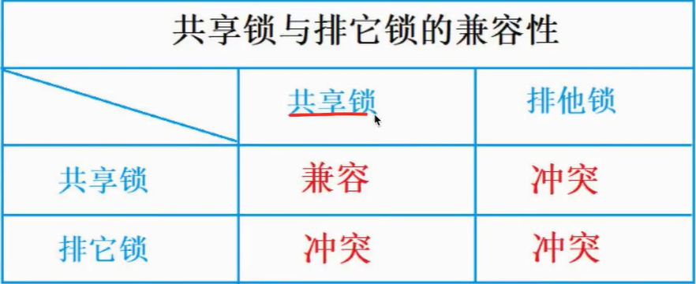

<a id="upgrade_lock"></a>

那**更新锁（Updates Lock）**是什么呢？

更新锁是一种**特殊的锁机制**。

更新锁是为 **“先读$\to$后写” 场景 ** 设计的（比如 “查询$\to$决定是否操作”），它的作用是：

- 先以 “共享锁” 的方式保护 “读操作”（允许多个事务读，但限制写）；
- 后续可直接升级为 “排他锁” 执行 “写操作”（无需释放锁再申请，提升效率）。


| 持有锁类型 \ 请求锁类型 | 共享锁（S）               | 排他锁（X）               | 更新锁（U）               |
| ----------------------- | ------------------------- | ------------------------- | ------------------------- |
| 共享锁（S）             | √（多事务可同时读）       | ×（读和写冲突）           | ×（更新锁与共享锁不兼容） |
| 排他锁（X）             | ×（写和读冲突）           | ×（写操作独占）           | ×（更新锁与排他锁不兼容） |
| 更新锁（U）             | ×（更新锁与共享锁不兼容） | ×（更新锁与排他锁不兼容） | ×（更新锁之间不兼容）     |

 那么，更新锁和排他锁一样，不兼容别人，也不兼容自己。

从 “读” 到 “写” 的区别：

- **共享锁（S）→ 排他锁（X）**：必须**先释放共享锁**，再申请排他锁。
  - 中间可能被其他事务插入操作，导致 “**[不可重复读](#what_is_non_repeatable_read)**”。什么意思呢？
  - 共享读锁到排他写锁一般是为了：查询A330飞机A32是不是空的 $\to$ 如果为空修改这个座位为乘客**ABC**。
    - 假设现在共享读锁S查询到确实，这个座位是空的，现在我要写入了，那么就必须释放共享锁
    - 但是一旦共享锁释放，有可能就无共享锁了！另一个Transaction可能就可以拿起排他写锁进行写入，假设恰好也是写入A32这个位置，就会导致原本 Transaction `SELECT`的时候遭遇**不可重复读**。
    - 比如[这个例子](#example_of_isolation)。
- **更新锁（U）→ 排他锁（X）**：可**直接升级**（无需释放锁，保证 “读→写” 的原子性，避免中间被干扰）。
  - 从U升级到X，可以直接解决不可重复读！同时也解决幻读问题。增删改全部保证。


更新锁的不对称性示例：

> 假设你是Facebook上有很多好友的用户，你的个人页面会被频繁“读取”（比如好友查看你的动态）；同时你偶尔需要“写入”（比如发布新动态）。
>
>
> ### 两种锁策略的对比
> 为了实现“读的并发性”和“写的独占性”，有两种锁策略：
>
> | 策略                                             | 操作流程                                                     | 问题                                                         |
> | ------------------------------------------------ | ------------------------------------------------------------ | ------------------------------------------------------------ |
> | **直接申请排他锁（X锁）**                        | 发布动态时，直接申请“排他锁”，要求独占页面的读写权限         | 若有大量好友持续读取（持有共享锁S），你会一直等待他们释放锁——可能永远等不到（这种情况叫**饥饿（Starvation）**） |
> | **先申请更新锁（Upgrade Lock），再升级为排他锁** | 步骤1：申请“更新锁”，此时仅阻止其他“更新锁”或“排他锁”，但允许已有共享锁（即已开始读取的好友仍能继续读）；<br>步骤2：等所有“在你申请更新锁前开始的读取操作”完成后，将更新锁升级为“排他锁”，独占页面进行写入 | 利用更新锁的“不对称规则”，只需等待“申请更新锁前已开始的读操作”，避免了“永远等待”的饥饿问题 |
>
>
> ### 核心结论
> 更新锁的“不对称性”（与共享锁不兼容、与排他锁不兼容，但允许“申请前已存在的共享锁完成”），使得在“读多写少”的场景（如社交平台个人主页）中，写操作不会因持续的读请求而无限等待（饥饿），保证了写操作的及时性。
>
> Transaction A 申请到更新锁后，其他事务**既不能申请新的更新锁，也不能申请新的共享锁（S 锁）和排他锁（X 锁）**
>
> 如果Transaction A 申请了排他锁，虽然排他锁一旦被申请，其余Transaction就不再允许申请排他锁。但是由于现在还有共享锁存在，共享锁和共享锁兼容，因此不断添加的共享锁会导致排他锁的申请被饥饿。


### [2.3] 多粒度锁

一般来说，锁粒度越大（锁例如表），管理成本越低，但是并发支持更少。反之，锁粒度越小（例如上面的行锁），管理成本越高，支持并发更多。

因为数据库的操作也是有粒度的，例如我查询一行、查询一整张表这种粒度是不同的，因此引入多粒度锁是必要的。

从上到下粒度粗到细，并发支持从低到高。顺带一提，文件级别锁不太常见，一般我们讨论**表锁**和**行锁**

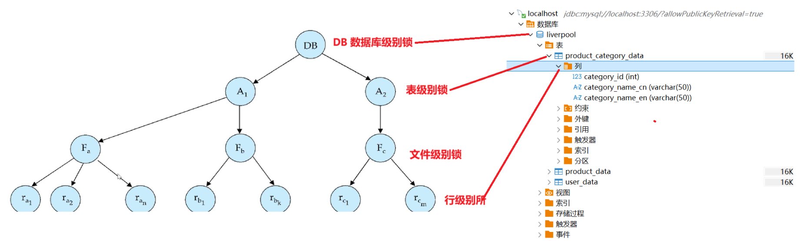

根据这个图，我们趁热打铁。假设我现在要读取 $r_{a_2}$ 行数据，那么这一瞬间，另一个 Transaction 需要给整个DB上一个排他锁，难道说这个Transaction需要遍历每一个节点吗？这样时间复杂度太大了！

因此我们引入**意向锁（Intension Lock）**！

#### [2.3.1] 意向锁

意向锁其实只是个前缀称呼，我们举两个例子即可知道！

**意向共享锁（读取数据）：**

例如假设我现在要读取 $r_{a_2}$ 行数据，现在我们需要给  $r_{a_2}$ 上**共享锁**，那么其父节点都应当设置为**意向共享锁（IS Lock）**！

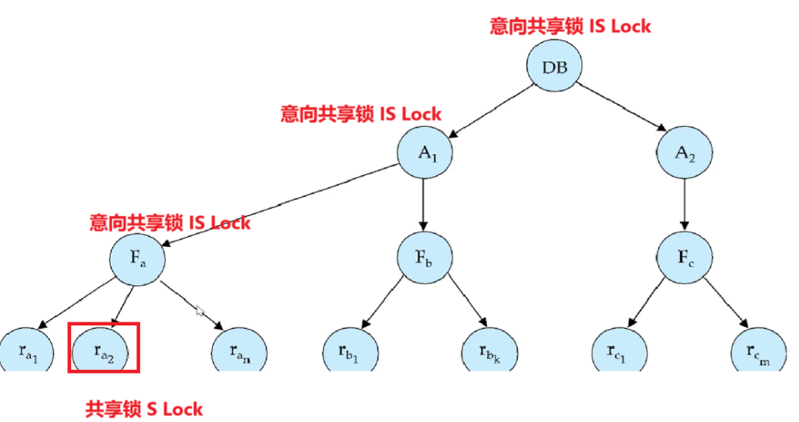

这样，当另一个 Transaction 需要给整个DB上一个排他锁，他直接可以知道当前DB有 IS Lock，那么他就会等待申请排他锁！

**意向排他锁（写入数据（也可读））：**

同上！

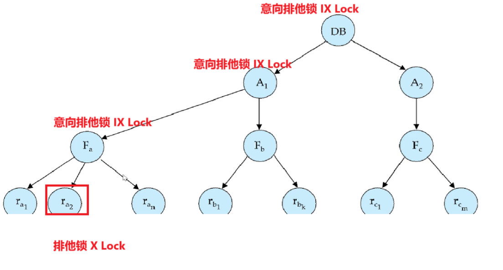

> **共享意向排他锁（混合）** 这个课件没有，所以不拓展。

**锁相容互斥矩阵：**

|               | Shared (S) | Exclusive (X) | IS                        | IX                        |
| ------------- | ---------- | ------------- | ------------------------- | ------------------------- |
| Shared (S)    | **yes**    | no            | **yes**                   | no                        |
| Exclusive (X) | no         | no            | no                        | no                        |
| IS            | **yes**    | no            | **$\color{red}\star$yes** | **$\color{red}\star$yes** |
| IX            | no         | no            | **$\color{red}\star$yes** | **$\color{red}\star$yes** |

> **注：这个表是对称的！**

解释 `IS` 和 `IS` 为 yes 是什么意思？

“`IS` 对 `IS=yes`” 意思是：两个事务可以同时对同一张表持有 “意向共享锁（`IS`）”，**二者互不冲突**。


解释为什么 `X` 对 `IX` 是 no？

`IX`实际可以被认为是计划写。其肯定有一张子表（元素）要被`X`的！假设现在一个Transaction 正在写入$A_1$ 上 `X` ，那么就不允许给 $A_1$ 上 `IX`，因为上 `IX` 意味着 $A_1$ 下的某个元素为 `X`，这可能导致**并发修改异常**。


解释为什么`IS`和`IX`是yes?

或许有疑问：读写不是不允许共存的吗？是的，读（S）写（X）是不允许共存的。但是注意，这里的`IS` 和 `IX` 只是一种声明！

声明当前表下某个表可能存在读（S）操作，某个表可能存在写（X）操作。虽然他们可能指向同一张表，但是数据库无需在声明阶段就不要允许共存。因为最后如果精确到：子表 $A$ 确实已经在 读（S），那么计划写（IX）下的写操作（X）就会失败，但是计划写（IX）仍可存在。

可见，实际上计划读（IS）和计划写（IX）是自上而下粒度从粗到细安排的。

### [2.4] 2PL

2PL（Two-Phase Locking，两阶段锁协议）是数据库并发控制的核心协议，目的是保证事务调度满足**冲突[可串行化（serializability）](#what_is_serializable)**（即并发执行结果与事务逐个串行执行一致），避免数据不一致问题。	

因为PPT只有1页，因此接下来都是拓展。

#### [2.4.1] 两个阶段的具体规则

1. **第一阶段：加锁阶段（Growing Phase）**
   - 事务可根据需求，对需要操作的数据项（表、记录等）申请加锁（共享锁 S、排他锁 X、更新锁 U 等）。
   - 此阶段**只能加锁，不能解锁**—— 即使某数据项用完，也需等到第二阶段才能释放。
   
2. **第二阶段：解锁阶段（Shrinking Phase）**
   - 事务可释放之前申请的所有锁。
   - 此阶段**只能解锁，不能加锁**—— 一旦开始释放第一个锁，后续就不能再申请任何新锁。


- 2PL 是 “冲突可串行化” 的**充分条件而非必要条件**—— 满足 2PL 一定可串行化，但可串行化的调度不一定都满足 2PL。
- 主流数据库（如 MySQL InnoDB）默认遵循 2PL，是保障事务隔离性的底层机制之一。


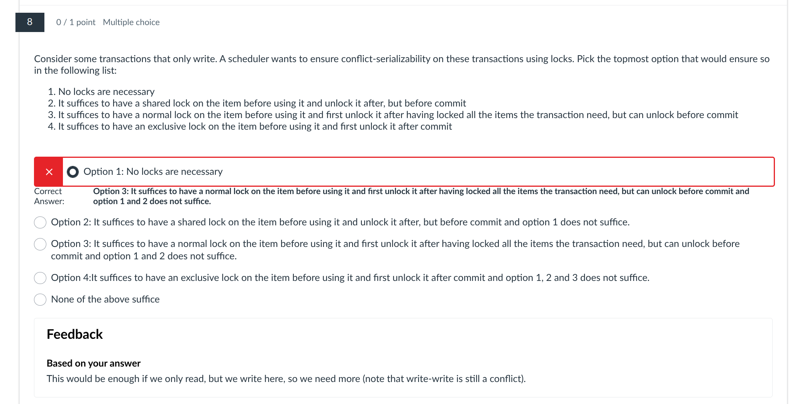

在这一题中，要保证冲突串行化，并且全都是写操作

- 选项1是无锁，不符合
- 选项2是share lock，这是读锁，错误，即使换为exclusive lock也是错误的，因为“随用随关”不符合 2PL。如果在获得所有需要的锁之前就释放了某个锁，其他事务可能趁虚而入修改数据，导致逻辑混乱。
- 选项3是**基本的两阶段锁协议 (Basic 2PL)**，满足
- 选项4是严格2PL，满足，因此选择选项3即可


## [3] Schedules

考虑以下SQL语句：

```sql
UPDATE employees
SET salary = salary + 100
WHERE e_id = 1234;
```

过程可以看作：

1. 读：读取到对应的`e_id`的员工的工资（变量X）
2. 计算：把 X 加上100
3. 写入：把更新后的 X 写入数据库


**Schedules 管理多个事务的执行**

构成 Transaction 的操作由 Schedules 按某种顺序执行
- 必须**保证每个事务内部的操作按正确顺序发生**！

**两种类型Schedules：**

- **串行 Schedules（Serial Schedules）**
  事务逐个执行（即先执行第一个事务的所有操作，再执行第二个事务的所有操作，依此类推）

- **并发 Schedules（Concurrent Schedules）**
  可交错执行来自不同事务的操作（但仍需保证每个事务内部的操作按正确顺序发生）$——$ 形式上，串行 Schedules 也属于并发 Schedules 的一种…

> **核心区别**
>
> - 串行 Schedule：事务 “排队” 执行，无并发冲突，但效率低。
> - 并发 Schedule：事务操作 “交错” 执行，提升效率，但需通过调度规则（如 2PL）确保结果等价于**串行执行（可串行化）**。


Schedules 用符号简记法应该是长这样的：
$$
S_a=r_1(X);w_1(X);r_1(Y);w_1(Y);c_1;\\r_2(X);w_2(X);r_2(Y);w_2(Y);c_2;
$$

| 符号                       | 含义说明                                                     |
| -------------------------- | ------------------------------------------------------------ |
| \( S_{id} \)               | 调度（\( id \) 为调度标识符）                                |
| \( \text{r}_i(\text{X}) \) | 事务 \( i \) 中对 \( \text{X} \) 的读操作（\( \text{read(X)} \)） |
| \( \text{w}_i(\text{X}) \) | 事务 \( i \) 中对 \( \text{X} \) 的写操作（\( \text{write(X)} \)） |
| \( \text{c}_i \)           | 事务 \( i \) 中的提交操作（\( \text{commit} \)）             |
| \( \text{a}_i \)           | 事务 \( i \) 中的中止操作（即“回滚（rollback）”）            |


例子：

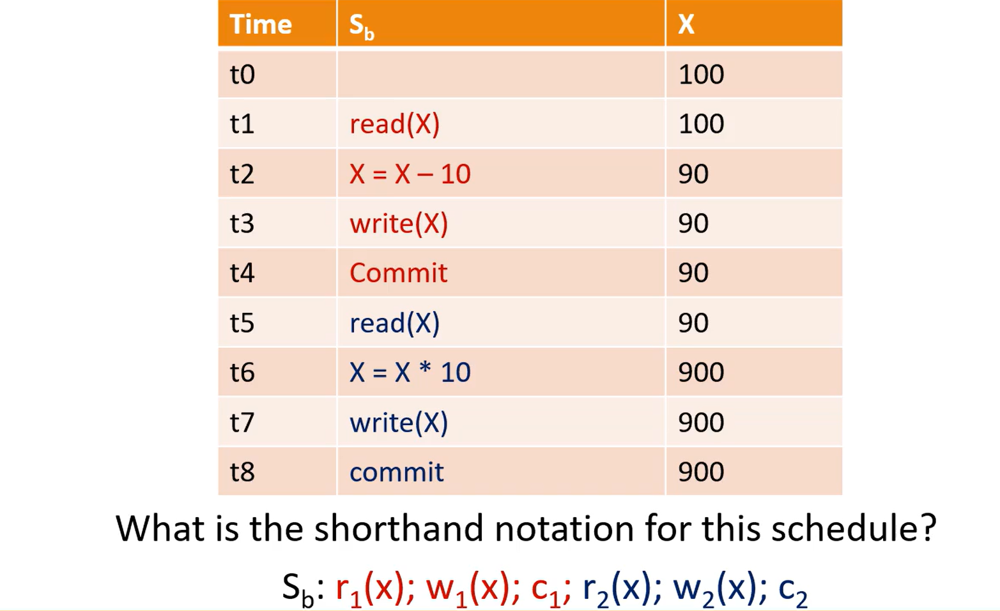

### [3.1] Schedules 的小练习


假设Transaction A 有 a 个操作， Transaction B 有 b个操作，那么他们所有的并发方案数量怎么计算？

**总兵发最大公式：<a id="total_concurrent_formular"></a>**


$$
Concurrent={\dfrac{(a + b)!}{a! \cdot b!}}
$$

#### [3.1.1] 计算总并发

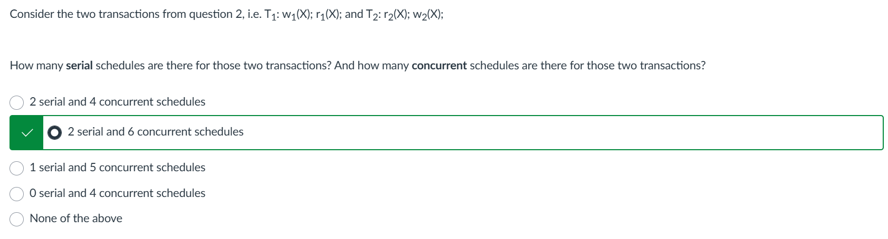

解释：Transaction A 有 a 个操作， Transaction B 有 b个操作，套公式就得出总并发方案6个。当然这个总并发也包含串行（Serial）的。串行的方案就是2个，要么AB要么BA。

#### [3.1.2] Notation 表示

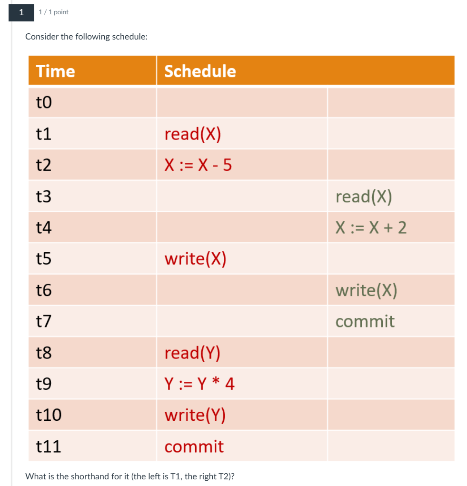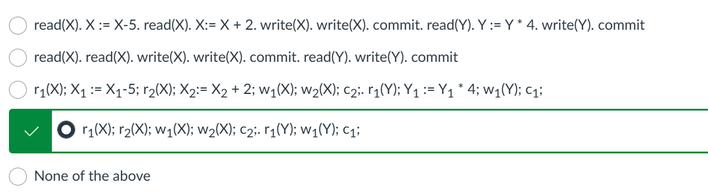

这个很简单，直接看着写就行

#### [3.1.3] 判断是否为Schedules


因为 $S_c$ 改变了Transaction 内部顺序，所以他不是 schedule for that Transaction.


### [3.2] Schedules 是否可串行化

Schedule 是调度的意是。

回顾，可串行调度（Serial Schedules）是Transaction一个一个执行，效率低，但是一定可以正确执行。

并发调度（Concurrent Schedules，也就是非串行调度）则反之，效率搞，但是不一定可以正确执行。

那么如何来权衡利弊，找到最合适的Schedules 方法呢？也就是，寻找到一个最大的并发，并且满足 Isolation 和 Consistency。


如下图：$S$ 是非串行调度，但是因为他等价于 $ S' $ （串行调度）的效果，所以我们说 $S$ 是可串行化的。


那么不可串行化的 Schedule长什么样？这是一个不可串行化的 Schedule：


你会发现，假设左边是Transaction A，右边是Transaction B，你无论是 AB 还是 BA 都无法达到这个效果。

因为实际这个并发有并发修改异常，所以串行调度肯定是无法达到这种“错误效果”的，所以，这个Schedule S 是不可串行化的。


**可串行化调度本质上就是我们所寻求的调度！**

可串行调度必须保证**正确性（Correctness）**和**一致性（Consistency）**

- 正确性：保证逻辑正确

#### [3.2.1] 可串行化调度和串行调度的差别

但是：**可串行化调度（并发的、效果等价于串行的调度）本身的执行机制不一定满足隔离级别 4（即串行调度），但可通过优化达到类似效果。**什么意思呢？举个例子：

> ### 例子 1：串行调度（天然满足隔离级别 4）
>
> 假设有两个事务 T1（给账户 A 转账 100 元）和 T2（查询账户 A 余额），串行调度的执行顺序是 **T1 完全执行完毕后，T2 才开始**：
>
> - T1：`read(A)=1000` → `A:=1000+100` → `write(A)=1100` → `commit`
> - T2：`read(A)=1100` → `返回余额1100` → `commit`
>
> 在这个过程中，T2 只能看到 T1 执行完毕后的最终状态，**完全没有并发干扰**，所以天然满足 “隔离级别 4（串行化）”—— 事务之间完全隔离，不存在脏读、不可重复读、幻读。
>
> ### 例子 2：可串行化调度（需优化才能满足隔离级别 4）
>
> 还是 T1（给账户 A 转账 100 元）和 T2（查询账户 A 余额），但这次是**并发调度**，执行顺序如下：
>
> - T1：`read(A)=1000`
> - T2：`read(A)=1000`（此时 T1 还没写回数据）
> - T1：`A:=1000+100` → `write(A)=1100` → `commit`
> - T2：`再次read(A)=1100` → `返回余额1100` → `commit`
>
> 这个调度的**最终效果**和 “T1→T2” 的串行调度完全一致（T2 最终看到的是 T1 转账后的余额），所以它是**可串行化调度**。
>
> 但在**执行过程中**，T2 一开始读取了 T1 未提交的 “中间状态”（虽然最终结果正确），这在严格的 “隔离级别 4” 定义中是不允许的 $——$ 隔离级别 4 要求事务完全串行，不能有任何并发读取。因此，这个可串行化调度**本身的执行机制不满足隔离级别 4**，但我们可以通过技术手段优化（比如让 T2 等待 T1 提交后再读取，或者使用多版本数据），使其达到隔离级别 4 的效果。


#### [3.2.2] QUIZ

WEEK 1 QUIZ

If you had some transactions T1 and T2 and two serializable schedules over them what can you say about that?
如果您有一些事务 T1 和 T2 以及对应的两个可串行化的计划，您对此有何看法？

- They both satisfies Isolation level 4
  它们都满足隔离级别 4

  > 这是不正确的，上面说过，他们在执行过程中不一定满足最高的隔离级别4，虽然结果可能是一样，但是过程不一定是一样的！

- The schedules effect on the database is the same
  时间表对数据库的影响是一样的

  > 这是不正确的，T1 和 T2 执行的顺序，也就是 T1T2 还是 T2T1，对数据库的影响是不一样的！

- Both satisfies [Consistency](#consistency)
  两者都满足一致性

  > 这是正确的，请看[3.2.1]末尾。

---


Say you have two transactions, with two operations each. What is the best estimate on the number of serializable schedules? (like, if there are at least 2 but at most 6 always, then the answer would be [2,6] and not e.g. [0,6] or [4,6])
假设有两个事务，每个事务包含两个操作。那么，可串行化调度的数量最佳估计是多少？

首先，先算最低的，也就是这两个 Transaction 绝对不允许并发，那么要么AB，要么BA（也即$A^2_2=2$种）。

然后，再算最高的，也就是这两个 Transaction 完全可以并发，并且Schedule种的操作可以随意穿插。因此，参考[总并发公式](#total_concurrent_formular)，得出 6 种。


---


考虑如下例子，结果表明，它并不总是满足一致性。对于 N 和 M 的所有值，这都是正确的吗？

> 回顾，[**一致性**](#consistency_explain)是什么？**满足可串行化就满足一致性！**（也就是这个Schedule不是可串行化的）
>
> 显然，对于 N 和 M 的所有值，这**不一定正确！**
>
> 因为 N = 0 ， M 取任意值，就满足一致性了！


对于这种问题，我们只需要用 Serial Schedule 来判断就行。

Serial Schedule 中，两个 Schedule 对于 X、Y 两个值的操作叠加起来是这样的：

`X` -> `X+M+N`

`Y` -> `Y+N`

显然，只要 N=0，M为任何值，都满足一致性。

也就是：**对于 N 的某些值，但不是N所有值和 M 的所有值**。


<a id='conflict_serializable_schedule'></a>

### [3.3] 冲突可串行化调度

Conflict-Serializable Schedule

冲突可串行化是一种**更强形式的可串行化**，被大多数商业数据库管理系统（DBMS）采用和实施，其核心是基于 “冲突（conflict）” 的概念。

可串行化调度实在是太复杂了，那么DBMS是怎么做的呢？

我们现在急需一种方法：我们需要能够快速验证某些并发，这些并发满足 Isolation 和 Consistency


<a id="what_is_conflict_operation"></a>

#### [3.3.1] 什么是冲突操作


两个操作如果满足以下 3 个条件，就称为 “冲突操作”：

1. 属于**不同事务**；
2. 操作**同一数据项**；
3. 至少有一个是**写操作**（读写、写读、写写）。


- 冲突操作的顺序会**直接影响数据库的最终状态**
- 而非冲突操作的顺序不影响结果


如何找到所有冲突操作呢？先找出写操作


对于每一个写操作：

- 先看`w_1(x)` 那就要找 `?_2(X)` 的操作：


- 再看 `w2_(x)`那就要找`?_1(x)`，出去重复的：


- 最后看`w_1(Y)`，发现没有`?_2(Y)`

因此一共有2+1=3个冲突操作！


#### [3.3.2] 冲突等价

如果调度 $S$ 和调度 $ S’ $ 满足以下条件，则它们是**冲突等价（Conflict-equivalent）**的：$ S’ $ 可以通过交换 $S$ 中任意数量的==非==冲突操作得到。

比如这两操作是非冲突操作，交换他们，得到 $ S' $ ，那么 $ S' $ 和原来的 Schedule 就是冲突等价的


当然，这样的操作可以换非常多轮：


最后的 $ S' $ 我们惊讶的发现，他是 Serial Schedule！也就是 T1T2！因此：

==如果一个并发 Schedule，通过**交换非冲突操作的顺序**，能转换成某个Serial Schedule，那么它就是Conflict-Serializable Schedule==

也就是该Schedule 为 冲突可串行化的

小练习：


如果在草稿纸上，你只需要考虑 `?_1` 全部移动到最前或者最后即可，非常简单。


再比如，这个能冲突可串行化吗？


这里有 T1 T2 T3 三个事物。

首先考虑 T1 T2 T3 这种串行化Schedule，发现 T1 是无法移动到 T2 前面的。然后又发现， T1 也无法移动到 T2 后面！

这下矛盾了，甚至不需要理会T3，我们即可判断出这个 Schedule 不是冲突可串行化的


Schedules、Serializable Schedules、Conflict Schedules的关系如下：

Schedules（最大） `>>` Serializable Schedules `>>` Conflict Schedules（最小）

> 注：这里的Schedule是Concurrent的Schedule


一个 Serializable Schedule但不是 Conflict Schedule 的例子：


这里全是写操作，最终是由 `w_1(Y)` 和 `w_3(X)` 决定的，因此，这个 Schedule 等价于串行化： T1 T2 T3

但是不允许冲突可串行化。当然，这个可串行化Schedule 也显然不满足隔离等级4，但是其结果和串行化是一样的！


#### [3.3.3] QUIZ

WEEK 2 QUIZ

先来一个比较难的题目，只需要略读即可：

Say you have two transactions, one with n operations and one with m operations. Consider any schedule over them and the range from the least number of conflicts in that schedule to the most (for any pair of transactions with that many operations and any schedule). Is each of the numbers in that range equal to the number of conflicts for some pair of transactions with that many operations and some schedule?

> 略读，无需理解：
>
> ### 题目解释  
>
> 假设有两个事务，一个包含 \( n \) 个操作，另一个包含 \( m \) 个操作。考虑这两个事务的任意调度（即保持各自内部操作顺序的所有可能排列），可以得到一个“冲突数量的范围”——从所有调度中可能出现的**最少冲突数**到**最多冲突数**。  
> 问题是：在这个范围内的**每一个整数**，是否都能找到对应的“两个事务（分别含 \( n \) 和 \( m \) 个操作）的某个调度”，使得该调度的冲突数恰好等于这个整数？  
>
>
> ### 回答  
> 是的，该范围内的每个整数都能找到对应的调度。  
>
>
> ### 关键逻辑  
> 冲突的核心是“不同事务、同数据项、至少一个写操作”的操作对，其数量可通过控制“操作的数据项”和“调度顺序”灵活调整，从而覆盖范围内的所有整数：  
>
> **冲突数的最小值为 0**  
>
> - 当两个事务操作完全不同的数据项（例如，T1 操作 X，T2 操作 Y），且所有操作均无跨数据项的冲突时，任何调度的冲突数都是 0。  
>
> **冲突数的最大值为 \( n \times m \)（极端情况）**  
>
> - 当两个事务的所有操作都针对同一数据项，且每个操作对（T1 的任一操作与 T2 的任一操作）均为冲突操作（例如，所有操作都是写操作，或读写混合且满足冲突条件），此时总冲突数为 \( n \times m \)（每对跨事务操作都是冲突）。  
>
> **中间值均可实现**  
>
> - 对于 0 到最大值之间的任意整数 \( k \)，可通过以下方式构造调度：  
>    - 让 \( k \) 对操作针对同一数据项且构成冲突（例如，前 \( k \) 对操作设计为 读写/写读/写写 冲突）；  
>    - 剩余操作针对不同数据项（无冲突）。  
>    - 通过调整冲突操作对的数量和顺序，可精确控制总冲突数为 \( k \)。  
>
> 举一个k的例子：
>
> > 假设 \( n=2 \)（事务T1有2个操作：`w1(X)`、`w1(Y)`），\( m=2 \)（事务T2有2个操作：`r2(X)`、`r2(Y)`），我们来构造不同冲突数 \( k \) 的调度：
> >
> > #### 例子1：\( k=0 \)（无冲突）
> >
> > 调度：`w1(X); w1(Y); r2(X); r2(Y)`
> > - 分析：T1操作X、Y，T2操作X、Y，但T1的操作都是写，T2的操作都是读。且T1先完成所有写操作，T2再读。此时**所有操作对均不构成冲突**（T2读时，T1已写完成，属于“读已提交”的无冲突场景），冲突数为0。
> >
> >
> > #### 例子2：\( k=1 \)（1个冲突）
> > 调度：`w1(X); r2(X); w1(Y); r2(Y)`
> > - 分析：仅`w1(X)`和`r2(X)`构成冲突（不同事务、同数据项X、含写操作），其余操作（`w1(Y)`和`r2(Y)`）操作数据项Y，无冲突。总冲突数为1。
> >
> >
> > #### 例子3：\( k=2 \)（2个冲突）
> > 调度：`w1(X); r2(X); r2(Y); w1(Y)`
> > - 分析：`w1(X)`与`r2(X)`冲突（X的读写），`w1(Y)`与`r2(Y)`冲突（Y的读写，因为T2先读Y，T1后写Y，交换顺序会改变T2读的结果）。总冲突数为2。
> >
> >
> > #### 例子4：\( k=3 \)（3个冲突，\( n=m=2 \)时最大值为 \( 2×2=4 \)，这里取中间值）
> > 假设T1操作：`w1(X)`、`w1(X)`（两个写X）；T2操作：`r2(X)`、`r2(X)`（两个读X）。
> > 调度：`w1(X); r2(X); w1(X); r2(X)`
> > - 分析：`(w1(X), r2(X))`冲突（第1对）、`(w1(X), r2(X))`冲突（第2对）、`(w1(X), r2(X))`冲突（第3对，T1的第二个写X与T2的第二个读X）。总冲突数为3。
> >
> >
> > #### 例子5：\( k=4 \)（最大值，\( n=m=2 \)时）
> > 调度：`r2(X); w1(X); r2(X); w1(X)`
> > - 分析：`(r2(X), w1(X))`冲突（第1对）、`(r2(X), w1(X))`冲突（第2对）、`(w1(X), r2(X))`冲突（第3对）、`(w1(X), r2(X))`冲突（第4对）。总冲突数为4，达到最大值 \( 2×2=4 \)。
> >
> >
> > 通过调整操作的数据项、类型（读/写）和调度顺序，我们可以构造出冲突数为0到最大值之间任意整数 \( k \) 的调度，因此题目中的每个数都能被覆盖。
>
>
> 因此，该范围内的每个整数都能被某个调度的冲突数实现。


---

Consider this list of pairs: 

`(w1(X),w2(X)), (w1(X),w2(Y)), (w1(X),w1(X)), (r1(X),w2(X)), (r1(X),r2(X)), (r1(X),w2(Y))`.

How many of these pairs 6 in the list are conflicts?

> Ans: 2
>
> 这个很简单

---

Consider two transactions with two operations each. What is the best range on the number of conflicts?

> Ans: [0,4]
>
> 就是上面的例子。最少是0个冲突，最多是 $a\times b =2\times 2 = 4$ 个冲突

---

Consider the following schedule

Is it conflict-serializable and if so, which serial schedules are it conflict-equivalent to?


>Ans: Yes, and conflict-equivalent to the serial schedule that starts with T1, but not conflict-equivalent to the serial schedule that starts with T2.
>
>这里显然，如果 Schedule = T1 T2 是冲突可串行化的Schedule ， 但是 T2 T1 是不行的，因为有冲突操作。

<a id="precedence_graph"></a>

### [3.4] 优先图辨识冲突可串行化调度

优先图：Precedence Graph

优先图是有向图，我们判断，如果存在**环**，那么这个Schedule就不是冲突可串行化的了。

> 为什么存在环就不是冲突可串行化的了？

`A -> B` 意思是必须执行 Transaction A 才能执行 Transaction B

我们需要找出全部冲突操作，然后画图即可：


你会发现，绿色线的部分构成了环。因此就不是冲突可串行化的了。


再来一个例子：

对于这个 Schedule  我们找到全部冲突操作。画图后发现，T1 始终在 T2 之前。没有环。因此这个 Schedule 是冲突可串行化的。


最后，在草稿纸上试一试这个例子：


1. 先找出所有 `W`
2. for each `w`： 寻找 conflict，画图
3. 完成

### [3.5] 用于可串行化调度的锁


> 离线计算是指在事务执行前，先收集所有操作，再一次性规划出可串行化的调度。
>
> 但实际数据库中，事务是**持续不断提交操作**的（比如用户随时发起转账、查询），无法提前收集全所有操作再计算，所以不能只靠离线方式。
>
> 调度器必须在操作**实时产生的过程中**，动态决定每个操作是 “立即执行” 还是 “延迟执行”。例如通过**加锁机制**


#### [3.5.1] 简单加锁极致

Transaction 在访问某个数据项之前，必须**锁定**该数据项

锁由**调度器（Scheduler）**负责请求和授予：
- 每个数据项在同一时间最多被一个 Transaction 锁定。
- Transaction 需等待直到锁被授予。

每个锁最终必须被**释放（解锁）**。


用符号简记法：
$$
l_i(X) :\text{Transaction i 请求 item X 的锁}\\
u_i(X) :\text{Transaction i 解锁 item X }
$$
比如：


三条规则：

1. 读写前必须加锁，并且加锁后，锁还没解开才能操作item
2. 加锁者最终必须解锁
3. 同时加锁，前一个事物必须解锁后者才可加锁


这个是不可串行化的，因为和串行执行的效果是不同的。那么也就意味着，我们需要加锁，虽然不能满足隔离等级4，但是至少必须要和串行执行的结果一致！

> 此处，不可串行化，因为x、y 值会变。


那么我们如何修改才能让其可串行化呢？

只需要把 `lock()` 和 `unlock()` 交换位置！


可以发现， 1 3 4 5 6 这几个顺序中，其实 4 5 的顺序是可以缓过来的，因为他们非冲突操作（`X`、`Y` 变量不同）。因此，如果换了他们的顺序，这个 Schedule 就是冲突可串行化的了！


### [3.6] 2PL 进一步

之前我们讲过 2PL（Two-Phrase Locking, 2PL）

这是对简单加锁机制的一种**简单修改**，能够保证冲突可串行化。


在每个事务中，**所有加锁操作都先于所有解锁操作**。（就是上面那个图！）

换句话说：两个阶段：

- **阶段 1：请求锁**
- **阶段 2：解锁**

（当然这两段操作虽然叫请求锁、解锁，但实际上可以执行其他操作，比如读写等）


#### [3.6.1] 如何判断是否为2PL

如何判断一个 Transaction 是不是二段锁（Two-Phrase Lock）的？

也就是：

- **阶段 1（加锁阶段）**：从事务开始，到 “==第一个解锁操作==” **之前**的所有操作。

  此阶段可以执行**加锁、读、写**等操作，但**不能执行解锁**（直到第一个解锁操作出现）。即事务在这个阶段 “只进不出”—— 不断获取所需的锁，不释放任何锁。

- **阶段 2（解锁阶段）**：从 “第一个解锁操作” 开始，到事务结束的所有操作。

  此阶段可以执行**解锁、读、写**等操作，但**不能再执行加锁**。即事务在这个阶段 “只出不进”—— 可以释放已有的锁，但不能再获取新锁。


公式：
$$
\text{A schedule is 2PL} \iff \text{Its transactions are 2PL}
$$


#### [3.6.2] QUIZ


> 答案是 T1 T3
>
> 可能会想，为什么 T2 不是 2PL 呢？ 其解释为
>
> - T2 忘记锁定 `Z`，因此没有正确使用锁。更确切地说，它不是两级锁 (2PL)。
> - 因此，认为2PL需要对所有操作的item进行上锁（尽管2PL没有强制这个要求）


> [Locking conflict-serializable schedules](https://canvas.liverpool.ac.uk/courses/84467/assignments/319968)
>
> **这个太难了**
>
> There are a number of concurrent schedules over these two transactions, but the locks removes quite many of them. Let us try to see what we have:
>
> We have the serial schedule, T_5 T_4. Apart from that schedule, we cannot start T_5 until after having unlocked X in T_4 (because otherwise, the locks get violated).
>
> Thus, we can consider T_4': lock(Y); read(Y); write(Y); unlock(Y); (ommiting the part about X and the non-database operation, which is not relevant for the schedules). and see how many concurrent schedules there are with that and T_5
>
> The key thing is that in T_5, we lock(Y) in step 2 and first unlock it second to last and the first thing we do in T_4' is to lock Y and then unlock it at the end. 
>
> We can either do the part about lock on Y (i.e. until unlock(Y)) in T_5 after T_4' or before (because otherwise, we violate the locks, since T_4' locks Y at the start and unlocks it at the end). In the first case, we have five options, one for each location of lock(X) from T_5, (i.e. it could come before each of the four operations of T_4' or after the last - the latter making it the serial schedule T_4' T_5). In the second case, we have again five options, specifically in regards to where we put unlock(X) from T_5, corresponding to each of the ones for the other case.
>
> In total, that gives us 11 concurrent schedules. They are:
>
> 
>
> S1: l_5(X); l_5(Y); r_5(X) r_5(Y); w_5(Y); ul_5(Y); ul_5(X); l_4(X); r_4(X); ul_4(X); l_4(Y); r_4(Y); w_4(Y); ul_4(Y);
>
> 
>
> S2: l_4(X); r_4(X); ul_4(X); l_5(X); l_5(Y); r_5(X) r_5(Y); w_5(Y); ul_5(Y); ul_5(X); l_4(Y); r_4(Y); w_4(Y); ul_4(Y);
>
> 
>
> S3: l_4(X); r_4(X); ul_4(X); l_5(X); l_5(Y); r_5(X) r_5(Y); w_5(Y); ul_5(Y); l_4(Y); ul_5(X); r_4(Y); w_4(Y); ul_4(Y);
>
> 
>
> S4: l_4(X); r_4(X); ul_4(X); l_5(X); l_5(Y); r_5(X) r_5(Y); w_5(Y); ul_5(Y); l_4(Y); r_4(Y); ul_5(X); w_4(Y); ul_4(Y);
>
> 
>
> S5: l_4(X); r_4(X); ul_4(X); l_5(X); l_5(Y); r_5(X) r_5(Y); w_5(Y); ul_5(Y); l_4(Y); r_4(Y); w_4(Y); ul_5(X); ul_4(Y);
>
> 
>
> S6: l_4(X); r_4(X); ul_4(X); l_5(X); l_5(Y); r_5(X) r_5(Y); w_5(Y); ul_5(Y); l_4(Y); r_4(Y); w_4(Y); ul_4(Y); ul_5(X); 
>
> 
>
> S7: l_4(X); r_4(X); ul_4(X); l_5(X); l_4(Y); r_4(Y); w_4(Y); ul_4(Y); l_5(Y); r_5(X) r_5(Y); w_5(Y); ul_5(Y); ul_5(X); 
>
> 
>
> S8: l_4(X); r_4(X); ul_4(X); l_4(Y); l_5(X); r_4(Y); w_4(Y); ul_4(Y); l_5(Y); r_5(X) r_5(Y); w_5(Y); ul_5(Y); ul_5(X); 
>
> 
>
> S9: l_4(X); r_4(X); ul_4(X); l_4(Y); r_4(Y); l_5(X); w_4(Y); ul_4(Y); l_5(Y); r_5(X) r_5(Y); w_5(Y); ul_5(Y); ul_5(X); 
>
> 
>
> S10: l_4(X); r_4(X); ul_4(X); l_4(Y); r_4(Y); w_4(Y); l_5(X); ul_4(Y); l_5(Y); r_5(X) r_5(Y); w_5(Y); ul_5(Y); ul_5(X); 
>
> 
>
> S11: l_4(X); r_4(X); ul_4(X); l_4(Y); r_4(Y); w_4(Y); ul_4(Y); l_5(X); l_5(Y); r_5(X) r_5(Y); w_5(Y); ul_5(Y); ul_5(X);

---


> Ans: Serial
>
> 开始和结束，两个端上锁，这样肯定是串行的。


<a id="2pl_satisfied_conflict_serializability"></a>

#### [3.6.3] 如何证明 2PL 满足冲突可串行化

[2PL ensures conflict-serializability: 202526-COMP207 - Database Development](https://canvas.liverpool.ac.uk/courses/84467/pages/2pl-ensures-conflict-serializability?module_item_id=2383021)


### [3.7] 更多灵活锁

简单锁很好，但是很多时候，是不必要的。比如 Read Read 的场景，这种情况其实无需锁。

2PL 确保冲突可串行化，但也会导致死锁问题：


使用[**共享锁、排他锁**](#share_lock_exclusive_lock)：


对于排他锁，也是会导致死锁风险的：


- 两者都先对 \( X \) 加共享锁（互相不阻塞，都能读 \( X \)）。
- 之后都尝试将共享锁升级为排他锁（`x-lock(x)`），但此时双方都持有共享锁，升级排他锁时会互相等待（\( T_1 \) 等 \( T_2 \) 释放共享锁，\( T_2 \) 等 \( T_1 \) 释放共享锁），最终形成**死锁**。

因此，就可以使用**[更新锁](#upgrade_lock)**来解决这个问题。


因为更新锁是排任何锁的，因此：


另一个例子：


#### [3.7.1] 灵活锁下的2PL

在每个事务中，所有加锁操作（即共享锁、排他锁或更新锁请求）都先于所有解锁操作。

- 阶段 1：请求锁 + 可能包含其他读 / 写操作
- 阶段 2：解锁 + 可能包含其他读 / 写操作

仍然保证冲突可串行化 —— 论证过程相同


#### [3.7.2] QUIZ

WEEK 3 QUIZ

---


---


---


### [3.8] 事务终止原因

一、DBMS 可控的事务中止原因

- 执行错误：事务运行中违反**完整性约束**，或出现其他运行时错误。

  > 比如主键约束冲突、数据类型不匹配

- 死锁问题：如使用两阶段锁时，多个事务相互等待对方释放资源，并发控制机制会要求中止事务。
- 显式请求：用户通过 `ROLLBACK` 语句主动请求撤销事务所有更改，导致事务中止。

二、DBMS 不可控的事务中止原因

- 介质故障：存储数据库的介质部分或完全不可读，比如比特位变化、磁头碰撞。
- 灾难性事件：存储介质被摧毁，例如爆炸、火灾等。
- 系统故障：活跃事务的状态信息丢失，常见例子有电源故障、软件错误。

三、不可控因素的防护措施

- 建立档案：包含完整备份和增量备份。
- 控制冗余：采用 **RAID** 技术，或在不同位置存储数据库副本。
- 安全存档：将档案存放在安全且不同的位置。


### [3.9] Undo-logging

**撤销日志**

Undo-Logging 是数据库中用于应对故障、保障事务**原子性**的日志技术

核心是记录关键操作并在故障时**回滚未完成事务**，恢复数据库**一致性（Consistency）**。

- 核心思路：将数据库关键操作写入日志，以便故障后恢复目标状态，支持系统故障场景下的恢复。
- 关键作用：主要保障事务的原子性，**即事务要么全部执行，要么全部撤销。**
- 关联技术：与保障持久性的 Redo Logging、兼顾两者的 Undo/Redo Logging 共同构成数据库日志体系。

**==UNDO 日志的恢复是从后往前，而 REDO 日志则相反（后面会讲）。==**

#### [3.9.1] **事务语法与关键操作扩展**

- 写操作变更：``write (X) ``仅写入**缓冲区**，不直接写入数据库。


- 新增核心操作：
  - output (X)：将缓冲区中数据库项 X **复制到数据库磁盘**。（数据：缓冲区写入磁盘）
  - flush_log：将内存缓冲区中的日志条目写入日志**磁盘**。（日志：缓冲区写入磁盘）


#### [3.9.2] **日志记录类型**

日志条目包含四类核心信息，全面覆盖事务生命周期与数据变更：

- `<START T>`：事务 T 开始执行。
- `<COMMIT T>`：事务 T 成功提交。
  - 如果事物 T 实际上已提交，那么必须要等待 T 所有修改的元素都写入硬盘后才能把`<COMMIT T>`写入硬盘。
  - 
- `<ABORT T>`：事务 T 中止。
- `<T, X, v>`：事务 T 更新数据库项 X，且 X 的旧值为 `v`
  - 先将 `<T, X, v>` 写入日志硬盘，再将 X 的新值写入数据库硬盘。
  - 

> [!CAUTION]
>
> **v 是旧值**

示例：


所有的`<T,X,v>`都必须在`output(X)`之前。然后`<COMMIT T>` 必须在完成更新后才能写。

也就是：

**Undo Logging 执行规则**

1. 数据更新规则：事务 T 更新 X 时，需先将 <T, X, v> 写入日志磁盘，再执行 output (X)（将 X 写入数据库磁盘）。
2. 事务提交规则：事务 T 提交时，需等其修改的所有数据库元素均写入磁盘后，再将 `<COMMIT T>`写入日志磁盘。


#### [3.9.3] **故障恢复流程**

系统故障后，恢复管理器通过反向遍历日志还原一致状态：

1. 识别事务状态：标记日志中已 `<COMMIT T>` 的成功事务、``<ABORT T>`` 的中止事务。
2. 处理未完成事务：对未标记成功 / 中止的事务，找到其所有 `<T, X, v>` 条目，将磁盘中 X 的值恢复为旧值 v。
3. 补充日志记录：为每个未提交且未中止的事务写入 `<ABORT T>`，并执行 flush_log。


来看例子：

**典型故障场景处理**

- 场景 1：日志中存在 `<COMMIT T>` → 事务已成功提交，无需恢复。
- 场景 2：日志中无 `<COMMIT T>` 但数据已写入磁盘 → 执行 undo 操作，恢复数据旧值。
  - 例如如下场景，磁盘日志中未出现`<COMMIT T>` 但是有一些（或者全部的）data已经更新了！
  - 
  - 解决办法：对于先前的**全部** 的 `<T, VAR, old>` 把所有 `VAR` 替换回旧值 `old` 即可。
  - 比如这里的例子，把 Y 改回10， 把 X 改回 1
- 场景 3：日志中无 ``<COMMIT T>`` 且数据未写入磁盘 → 无需额外操作，保持原有状态。
  - 
  - 在这种情况中，只要硬盘中对比，发现 X、Y 的值都不是1、10（新值），就可以确定，前面的 `write` 还没刷新到硬盘，都存在内存中，因此其实无需改动。


#### [3.9.4] **事务中止处理**

而事务中止处理仅聚焦于单个中止的事务 T，无需关注其他事务。

事务**主动中止**时，**仅针对该事务执行 undo 操作**：反向遍历日志，找到所有 <T, X, v> 条目，将 X 恢复为旧值 v，无需处理其他事务。


> 比如 T2 回滚，那么只要找到 T2 对应的 `<T2, VAR, old>` 把 `VAR` 改回成旧值 `old` 即可


### [3.10] 三种日志区别

Undo Logging、 Redo Logging 、 Undo/ Redo Logging


四个规则<a id='4_rules'></a>

首先需要明确两个关键规则的定义，它们是判断日志机制优劣的核心标准：

- **Force（强制写入）**：指事务在提交（commit）之前，必须把该事务对数据库的所有修改全部写入磁盘（而非仅存于内存缓冲区）。
- **No Force（非强制写入）**：与 Force 相反，事务提交时，其修改可暂存于内存缓冲区，无需立即全部写入磁盘，后续可批量处理写入 —— 这是更高效的方式，因为磁盘单次批量写入的成本远低于多次零散写入。
- **No Steal（禁止窃取）**：指绝对不能用 “未提交事务” 修改的数据，去覆盖磁盘上 “已提交事务” 保存的数据。简单说，未提交的临时修改不能污染已确认的正式数据。
- **Steal（允许窃取）**：与 No Steal 相反，允许未提交事务的修改暂存到磁盘（只要不破坏数据一致性），后续若事务中止，可通过日志回滚 —— 这种方式更灵活，无需为未提交数据单独预留大量内存空间。


**Undo Logging（仅撤销日志）：依赖 Force，成本高**

- **规则要求**：仅用 Undo 日志而不用 Redo 日志时，必须遵守**Force 原则**。也就是说，事务提交前，必须把所有修改写入磁盘 —— 因为 Undo 日志仅记录数据 “旧值”，只能回滚未提交的修改，若提交前修改没写入磁盘，故障后无法通过 Undo 日志恢复已提交的操作（缺乏 Redo 日志记录 “新值” 来重做）。
- **成本问题**：磁盘的特点是 “单次批量写入成本低，多次零散写入成本高”。而 Force 原则要求事务每提交一次就必须立即写入一次，无法等待多个事务的修改积累后批量处理，导致磁盘写入频率高、效率低，整体成本昂贵。


**Redo Logging（仅重做日志）：依赖 No Steal，成本高**

- **规则要求**：仅用 Redo 日志而不用 Undo 日志时，必须遵守**No Steal 原则**。因为 Redo 日志仅记录数据 “新值”，**只能重做已提交的操作**，若允许未提交数据写入磁盘（即不遵守 No Steal），一旦事务中止，Redo 日志无法回滚未提交的修改（缺乏 Undo 日志记录 “旧值”），会导致磁盘上的已提交数据被污染。

  >  如果不遵守No Steal，会导致无法回滚：
  >
  > `<T1, X , 200>`、**INTERRUPTED**、`<T2, Y, 300>`，因为 Redo Logging 是属于 `<T, VAR, new>` ，记录的是新值，如果在 `<COMMIT>` 之前就 `<output>` 刷新到磁盘，假设遇到问题，那么X的数据无法回滚。

  > [!CAUTION]
  >
  > Undo Logging 中 v 是旧值
  >
  > Redo Logging 中 v 是新值

- **成本问题**：为了遵守 No Steal，需要额外管理内存和磁盘空间，确保未提交数据始终不写入磁盘（或写入独立的临时区域，不影响正式数据）。但磁盘本身速度较慢，且批量处理修改更高效，这种 “小心翼翼避免未提交数据写入” 的操作会增加管理复杂度，最终导致成本昂贵。

- 遵循**预写日志（WAL）原则**：日志刷盘优先于数据刷盘，确保日志先于数据持久化。


**Undo/Redo Logging（撤销 - 重做混合日志）：无需 Force 和 No Steal，最优**

- **规则优势**：混合日志同时记录数据的 “旧值”（用于 Undo 回滚）和 “新值”（用于 Redo 重做），因此既不需要遵守 Force 原则（事务提交时修改可暂存内存，后续批量写入，符合 No Force），也不需要遵守 No Steal 原则（允许未提交数据写入磁盘，后续若中止，可通过旧值回滚，符合 Steal）。
- **成本优势**：由于摆脱了 Force 和 No Steal 的严格限制，它可以：① 积累多个事务的修改后批量写入磁盘（降低写入成本）；② 灵活利用磁盘空间存储未提交数据（减少内存压力），整体效率最高。
- **唯一劣势**：因同时记录旧值和新值，日志文件的存储空间会比单独的 Undo 或 Redo 日志更大。但通常情况下，存储空间的轻微增加，远小于效率提升带来的收益。
- 撤消重做日志中是这样的：`<T,VAR, old, new>`。`<COMMIT T>`可以在所有更改写入磁盘**之前或之后**写入磁盘


#### [3.10.1] 练习


> ### Undo Logging
>
> 从下到上，对于没有COMMIT的transaction进行回滚。
>
> 这里没有COMMIT的是 T1 和 T3
>
> 从下到上回滚，越往上优先级越高。最后 X = 2 、 Y = 3 、 Z = 1


> ### Redo Logging
>
> 从上到下，对于已COMMIT的transaction进行回滚。
>
> 这里已COMMIT的是 T2
>
> 因此 X = 4 、 Y = 10（原始值，T2没操作） 、 Z = 1


> ### Undo/ Redo Logging
>
> 结果和 Undo Logging一样。Undo/ Redo Logging 先执行 Undo Logging 再执行 Redo Logging


Undo Logging 要求数据 output 刷到硬盘才写入 log `COMMIT` 到磁盘

- 只要出现了 `COMMIT` 那么肯定这个数据100%刷到硬盘无任何问题。但是没出现COMMIT的Transaction可能正在执行`output`，他们可能已经刷入硬盘但是没有`COMMIT`！因此我们要做的就是，回滚。

Redo Logging 要求log `COMMIT` 到磁盘后才能 output 刷到硬盘。

- 同样的，Redo日志中 COMMIT操作后才刷到硬盘的，因此只要看哪些Transaction已经COMMIT即可，原理同上类似。


这就解释了为什么一个回滚是回滚没提交的，另一个则反之。

---


```sql
Consider the following Undo log file:

<Start T1>
<T1, X, 10>
<Start T2>
<T2, Y, 10>
<T2, X, 30>
<T1, Y, 40>
<Commit T2>
<Start T3>
<T3, Z, 50>
<T3, X, 50>
```

What is the value of X, Y and Z after we have processed the undo log?

答案：**X=10, Y=40, Z=50**

显然，这里 T2 已提交，对于 Undo Logging，从下到上只管 T1 和T3。

```sql
<T1, X, 10> -- 最早优先级最高
<T1, Y, 40>
<T3, Z, 50>
<T3, X, 50> -- 最晚优先级最低
```


$$
\text{Redo logging needs to start at the top and undo logging the end.}\\ \text{重做日志需要从顶部开始，撤销日志需要从末尾开始。}
$$


---

Which of the three logging schemes (undo, redo and undo/redo) can be used to satisfy **durability** with apropiate procedures? Which can satisfy **atomicty** with apropiate procedures?
三种日志记录方案（Undo、Redo和Undo/Redo）中，哪一种可以通过适当的过程满足**持久性**要求？哪一种可以通过适当的过程满足**原子性**要求？


Answer： All three can be used to satisfy both atomicity and durability
这三种方法都可以满足atomicity 和 durability 的要求。


---

<a id='ref_202511101139'></a>

Which of the following times is it required and sufficient to change the log when doing Redo logging
在执行重做操作时，以下哪些情况是必须且足以更改 Redo 日志的？

(I) At the **start** of a transaction
(II) On **committing** a ****transaction****
(III) On **aborting** a transaction
(IV) When we do a non-database operation in a transaction
(V) When a transaction reads an item
(VI) When a transaction **writes** an item


> 读情况无需考虑！因为读情况不更改数据库！


答案：**(I)-(III) and (VI)**。因为我们不关心非数据库操作。

```sql
 (I) At the start of a transaction
（I）在交易开始时
<START T1>

(II) On committing a transaction
（二）在进行交易时
 <T1,X,2>

 
 (III) On aborting a transaction
（三）中止交易时
<ABORT>

(VI) When a transaction writes an item
（六）当事务写入项目时
 <output X>
 <COMMIT T1>
```


#### [3.10.2] QUIZ

WEEK 4 QUIZ

##### 纯读/写上锁要求


> - **选项 1（无需上锁）**：
>
>   若不锁，多个写事务会对同一数据执行 “写 - 写” 冲突操作，调度会出现冲突，无法保证冲突可串行化。因此选项 1 不成立。
>
> - **选项 2（共享锁）**：
>
>   共享锁（S 锁）允许多个事务同时加锁，但 “写操作” 需要排他锁（X 锁）才能保证原子性（否则多个事务同时写会互相覆盖）。因此共享锁无法解决 “写 - 写” 冲突，选项 2 不成立。
>
> - **选项 3（普通锁 + 2PL）**：
>
>   这里是**排他锁（X 锁）**，且遵循 “两段锁协议”：
>
>   - 加锁段：事务在使用数据前加 X 锁，且在锁定所有需要的资源前不解锁；
>
>   - 解锁段：锁定所有资源后，可在提交前解锁。
>
>     2PL 能确保冲突可串行化（无论是否 “严格 2PL”），因为它强制事务的加锁 / 解锁顺序与串行执行的冲突顺序一致。因此选项 3 成立。
>
> - **选项 4（严格 2PL）**：
>
>   严格 2PL 要求 “事务提交后才解锁”，属于 2PL 的**严格变种**。但题目中只需 “冲突可串行化”，普通 2PL（选项 3）已能满足，无需严格 2PL。因此选项 4 过度严格，不选。


##### 日志规则定义


这两个考的是 Undo 和 Redo 需要遵守的**[规则](#4_rules)**。 


##### 足以改变日志的操作


**不论是 Undo、Redo还是 Undo/ Redo，我们都不关系非数据库操作。**参考**[此处](#ref_202511101139)**


##### 共享缓冲区


> 只有 `write()` 才会写入缓冲区


这两题其实，考的是共享缓区。和日志一样，write只是刷新到buffer里面，这个buffer还是共享的。当然，后`write`的会覆盖前面的。

得出来的是一个精确的结果，其实不是区间（区间只是题目这么设计）。


##### 日志操作


两个简单的日志操作题目


##### 冲突可串行化


这个只需要列一个表格即可。更好的解法是使用**[优先图 Precedence Graph](#precedence_graph)**。


- 2PL要求先加锁后解锁。加锁阶段不能解锁。解锁阶段不能加锁。
- 这里 $S_4$ 直接违反该原则。

- $S_1$ 没有解锁 Y，$S_3$ 没有锁定 Z （用要上锁！）


### [3.11] CheckPoint

#### [3.11.1] 检查点核心作用
- 缩短恢复时间，无需处理**检查点之前的事务日志**。
- 减少日志文件占用空间，检查点之前的日志部分可丢弃。

#### [3.11.2] 简单检查点

Simple Checkpoint

（适用于Undo Logging）

**核心思路**

定期执行检查点，可按固定时间间隔（每m分钟）或事务数量（累计t个事务）触发。

**执行步骤**

1. **停止接收新 Transaction **。
2. 等待所有活跃事务完成并写入`COMMIT`或`ABORT`记录。
3. 将日志缓冲区刷新到磁盘。（Log刷入磁盘）
4. 写入`<CHECKPOINT>`日志记录。
5. 再次刷新日志到磁盘。
6. 恢复接收新事务。


> `flish_log` 方法把所有在内存中的日志的记录刷到磁盘
>
> `output`方法把所有在内存中的X、Y值刷到磁盘
>
> 比如在最后一行添加检查点，也就意味着之前的操作完全成功。


**恢复机制**

- 反向处理 Undo logging ，遇到第一个检查点即停止。
- 检查点**之前的事务已无需撤销**，其修改已持久化到磁盘。

**局限**

- 检查点执行期间，新事务需等待直至流程完成。

#### [3.11.3] ARIES 检查点

（适用于 Undo/Redo Logging）

**核心要求**

- 依赖Undo/Redo日志机制。
- 事务未确定`COMMIT`前，不得向缓冲区写入数据。


**步骤**

- **步骤1**：记录并刷入 `<CHECKPOINT(T₁,T₂,...)>` 日志（刷入内存再刷入磁盘）
  这里的 `T₁,T₂,...` 是**活跃事务**（未提交且未中止的事务），刷入日志是为了在恢复时明确“哪些事务在检查点时还在执行”。

  这个语句把自己刷入log，同时所有的T1、T2在内存中的修改（脏页）也全部刷入磁盘。

- **步骤2**：记录并刷入 `<END CHECKPOINT>` 日志
  标记检查点流程结束，恢复时以此为“终点标识”。只是纯粹结束，没有额外含义和操作（除了把自己这个语句刷入内存再刷入硬盘）。
  
  为什么需要`<END CHECKPOINT>`这个步骤？如果系统刷入`<CHECKPOINT(T₁,T₂,...)>`后，开始给内存中的脏页刷入磁盘，但是此时若突然崩溃，那么就难以溯源了！一旦我们完成所有的操作，我们把`<END CHECKPOINT>` 刷入内存，这样就知道这个脏页确实成功刷入磁盘了。


在 ARIES 的`<CHECKPOINT(T1,T2,...)>`中，`T1,T2,...`指的是 **“未提交且未中止的活跃事务”**—— 即这些事务在检查点时刻还在执行（既没提交也没回滚）。其他事务（如果有的话）要么已经提交，要么已经中止，不再属于活跃事务。


**恢复的目标是：提交的 Redo， 未提交的 Undo**

- 让**已提交事务**的修改最终保存在磁盘（没刷盘的补做，即 Redo）；
  - 如果这个事务已提交：
    - 如果在检查点之前，那么已经成功刷入磁盘，可以不理会
    - 如果在检查点之后，那么他不一定刷入磁盘，因此需要从检查点开始
- 让**未提交事务**的修改全部回滚（不管改了多少，即 Undo）；
  - 检查未提交的事务。**未提交的事务必须回滚。**

> [!IMPORTANT]
>
> 综上所述，对于恢复，我们只需要
>
> - 判断检查点是否完整？完整，那么就继续，不完整，就必须寻找上一个完整检查点（如果没找到，就是从首行恢复）。
> - 判断有没有未提交的事务，如果有，寻找最早的未提交的事务的**开始行`<START T1>`**，这个需要**UNDO**
> - 判断有没有已提交的事务，如果有
>   - 判断他们提交是否是在`<CHECKPOINT T1, T2...>` 之后？如果是，那么只需要从`<CHECKPOINT T1, T2...>`开始**REDO**即可
>   - 如果他们提交是在`<CHECKPOINT T1,T2...>`之前，那么他们的脏页已经完全刷入内存，不需要理会


#### [3.11.4] 两种检查点对比

- 简单检查点：实现简单，无需复杂日志支持，但会阻塞新事务。
- ARIES检查点：更先进，不阻塞事务提交前的操作，需依赖Undo/Redo日志和严格的缓冲区写入规则。


#### [3.11.5] 练习

##### 使用检查点的理由


##### ARIES 恢复过程


答案：3

> 1. 判断检查点是否完整？完整，继续
> 2. 判断所有已提交的事务，这里T1已经提交，并且在检查点之前，因此能确保脏页已经刷入磁盘，不需要理会
> 3. 判断所有未提交的事务，这里T2和T3未提交，他们必须全部UNDO，寻找最初是的一行，因此找到第3行


这是一个需要Redo的例子：

在 `CHECKPOINT` 刷盘后他才 COMMIT，这时候还存在内存，还没刷盘。

（假设`CHECKPOINT`，然后COMMIT，现在最新数据在内存中，断电了，因此这时候虽然COMMIT但是硬盘是旧数据，就需要Redo，这很合理）

```sql
<START T1>
<T1,Y,7,13>  # T1把Y从7改成13
<COMMIT T1>   # T1提交
<START T2>
<T2,X,21,9>  # T2把X从21改成9
<START T3>
<T3,A,10,25> # T3把A从10改成25
<CHECKPOINT(T2,T3)>  # 检查点：活跃事务是T2、T3，此时T2/T3已做的修改（X=9、A=25）刷入磁盘
<T2,B,5,8>   # 检查点后：T2把B从5改成8（仅在内存，未刷磁盘）
<COMMIT T2>  # T2提交（但B=8仍在内存，没刷磁盘）
<T3,C,3,12> # 检查点后：T3把C从3改成12（仅在内存，未刷磁盘）
<END CHECKPOINT>
<START T5>   # 新事务启动
[故障发生]
```


**Redo 的核心前提就是 “事务的 COMMIT 日志在 CHECKPOINT 之后”**


##### Undo Logging


> Undo logging v是旧值 仅 Undo **not** commit 事务 ，**从下往上覆盖**
>
> 此处没提交的是T1和T3，因此从日志底部向上看，只处理属于 $T_1$ 和 $T_3$ 的记录：
>
> 1. **`<T_3, X, 3>`**：==$T_3$ 未提交，将 $ X $ 恢复为旧值 **3**。==
> 2. **`<Commit T_2>`**：跳过（$ T_2 $ 已提交）。
> 3. **`<T_3, Z, 89>`**：==$T_3$ 未提交，将 $Z$ 恢复为旧值 **89**。==
> 4. **`<T_1, Y, 22>`**：==$T_1$ 未提交，将 $Y$ 恢复为旧值 **22**。==
> 5. **`<T_2, X, 11>`**：跳过（$ T_2 $ 已提交）。
> 6. **`<T_2, Z, 36>`**：跳过（$T_2$ 已提交）。
> 7. **`<T_2, Y, 15>`**：跳过（$T_2$ 已提交）。
> 8. **`<T_1, X, 19>`**：==$T_1$ 未提交，将 $ X $ 恢复为旧值 **19**。注意，这里 $ X $ 之前被 $T_3$ 恢复成了 3，现在被更早的 $T_1$ 记录覆盖，最终变为 **19**。== （覆盖）


### [3.12] 可恢复调度和级联回滚

> 在这个小结中，会介绍...
>
> - 可恢复调度（以及其相反的不可恢复调度）
> - 级联回滚调度和无级联回滚调度
>
> 不可恢复调度的问题是：无法回滚！为了解决这个问题，我们需要调整事物提交顺序，变为可恢复调度
>
> 可恢复调度解决了无法回滚的问题，但是他引入了级联回滚！
>
> 为了解决级联回滚的问题，我们通过禁止脏读，变为无级联回滚调度。


一个调度被称为是**可恢复的**，必须满足以下规则：

对于每一对事务 $T_i$ 和 $T_j$，如果 $T_j$ **读取**了由 $T_i$ **写入**的数据项，那么 $T_i$ 的 **提交（COMMIT）** 操作必须出现在 $T_j$ 的提交操作之前。

可恢复调度要求，依赖了其他Transaction数据的Transaction必须后提交！

- 它的核心目的是：**确保当一个 Transaction 失败需要回滚时，不会导致数据库处于一种“无法通过回滚操作回到正确状态”的境地。**

- 它的缺点是，可能引发 **Cascading Rollbacks（级联回滚）**！


#### [3.12.1] 级联回滚

首先，让我们看以一下什么是级联回滚。级联回滚大概是这样：

若事务 T 中止，**所有读取过 T 写入数据的事务需递归中止**，既耗时又可能破坏 Durability；若不中止则违反 Isolation。


如下这个例子中，这是一个不可恢复调度。因为T2依赖了T1的数据，脏读了，还先提交了，这直接违反了可恢复调度的定义。因此它是一个不可恢复调度！


还是这个[银行转账的例子](#bank_example)。

- 如果什么都不做：违反 **Atomicity**。因为你违反了“要么都不做，要么一下全完成”。

- 撤销 T1，但是不撤销 T2。不过这样一来，第二笔交易可能就不太有效了，因为原本User 2 的钱可能就不足以支持转账。这违反一致性：因为我们违反 **Consistency** 约束。（因为撤销T1，不撤销T2，这就相当于现实中T2本身没有任何钱，但是他被允许购买100元的商品，数据库和现实不符合，因此违反一致性）
  - 这也会破坏隔 **Isolation**：
  - 这个例子是一个非常经典的幻读问题，其撤回T1的转账100元，在现实中应当保证T2不知情，但是现在T2读取到了根本不应当存在的数据100元（因为撤回了），因此，这导致了脏读。 脏读在冲突可串行化中是被禁止的，因此，这破坏了隔离性。
  
  <a id="cascading_rollback_violate_durability"></a>

- 那如果撤销这两笔交易呢？可能你已经用100磅买完东西走了！！
  - 这会破坏 **Durability（持久性）**！我们说过，回滚是为了保证 Atomicity， 通常并不会破坏Durability，但是有一种特殊情况。
  - 当**回滚了一个已经向用户确认过“提交成功（Committed）”的事务**，这会破坏 Durability ，因为在用户视角，你撤销了T2，我的现实世界中已经买完东西，你承认这没问题，我COMMIT了，但是最后你撤销了，这违背了数据库信任，违背了Durability


这个问题似乎怎么都无法解决！事务执行中若发生故障，无论不处理、仅撤销部分事务还是全部撤销，都会破坏原子性、一致性、隔离性或持久性中的**至少一项**。这就是**部分执行与货币问题**。


还有另一个例子！

**Isolation 与 Durability 冲突**：读取了其他事务数据的事务（下图T2）若**先提交**，后续原事务（下图T1） `ABORT` 会导致二者属性冲突，难以兼顾！也就是T1回滚会遇到一些和T2相关的问题！


这张图展示了一个典型的 **不可恢复调度 (Unrecoverable Schedule)**。这里的核心矛盾在于：为了维护一个特性，你不得不破坏另一个特性。

具体来说，T1 为了维护Atomicity，在12时间点遇到硬件故障的时候主动`ABORT ROLLBACK`，这使得`X = 101` 这一更改回滚回 `X=1` 初始值，但是因为T2对`X`进行了脏读（读取了未提交的X），并且`COMMIT`告知用户修改完毕，这导致Durability被破坏。

图中使用了基础2PL，会导致如上的问题

- 允许在事务结束前释放锁（如图 点 5 释放了 X）。

要解决这个问题，可以使用严格2PL彻底解决这个问题

- 要求事务持有的**排他锁（X-lock）**必须在 **COMMIT 或 ABORT 之后**才能释放。


#### [3.12.2] 可恢复调度

Recoverable Schedule

级联回滚中破坏 “Durability” 的关键场景是：

事务`T2`先读取了事务`T1`写入的数据，随后`T2`完成提交（符合 “持久性” 要求，提交后结果应永久保留），但后续`T1`**意外中止**。

- 此时若要恢复`T1`，需撤销`T2`已提交的操作 $——$ 这直接违背  Durability ”；
- 若不撤销`T2`，又会因`T1`的数据无效导致`T2`结果错误，违背 “ Consistency ”。

这种进退两难的局面，类似于银行转账的例子。


可恢复调度的设计目标，就是通过**规范事务提交顺序**，**避免** “先提交的事务依赖后中止的事务” 的矛盾。

==**即，如果我们遵循这些规则，就可以避免破坏 Durability ！**==

调度 $S$ 是可恢复的调度，当：

- 如果Transaction  $ T_2 $ 提交，并且依赖 $T_1$（这里的依赖可以理解为读取了$T_1$之前写入的项，例如 $ X $ ）。
- $T_1$ 必须早于 $ T_2 $ 提交。

> 简而言之，我用了你的，我要等你提交了，我才能提交。

也就是：

- T1 `writes` X

- T2 `reads` X

  ......

- T1 `commit`
- T2 `commit`

不允许出现大包小的情况。


##### 可恢复调度示例


`read` 依赖 先前的 `write`


> 要理解**可恢复调度如何保证持久性**，我们可以通过一个具体示例分析：
>
> | Transaction 1                   | Transaction 2        |
> | ------------------------------- | -------------------- |
> | 修改`X`，对`X`写入：`X = X + 1` |                      |
> |                                 | 读取 `X`             |
> |                                 | 对 Y 写入: `Y = 2*X` |
> | `COMMIT`                        |                      |
> |                                 | `COMMIT`             |
>
> 
>
> **持久性的保障**：
>
> - 若 `T₁` 提交后发生故障（如系统崩溃），`T1`已经提交，但是`T2`没有提交，此时只需要对`T1`使用 **REDO**，对 `T2`使用 **UNDO** 即可。
>
> 
>
> **反例：不可恢复调度的持久性破坏**
>
> | Transaction 1                   | Transaction 2        |
> | ------------------------------- | -------------------- |
> | 修改`X`，对`X`写入：`X = X + 1` |                      |
> |                                 | 读取 `X`             |
> |                                 | 对 Y 写入: `Y = 2*X` |
> |                                 | `COMMIT`             |
> | `COMMIT`                        |                      |
>
> 
>
>
> 综上，可恢复调度通过**“被依赖事务先提交”的约束**，确保已提交事务的依赖关系是“安全的”，从而在故障恢复时不会因级联回滚破坏已提交事务的持久性。

### [3.13] 无级联回滚调度

Cascadeless Schedules

无级联回滚调度：如果一个调度中每个事务**只读取已提交事务所写入的值**，那么这个调度就是无级联的。

可以认为，无级联回滚相当于不允许**脏读**的级联回滚。

> [!CAUTION]
>
> Cascadeless Schedule 不允许脏读，但是允许**脏写**，即，允许写入未提交的数据。
>
> 可恢复调度仍可能导致**级联回滚**，因此，无级联回滚比可恢复调度更高一层，他仅禁止脏读！
>
> | **调度类型**                     | **禁止脏读 (Dirty Read)** | **禁止脏写 (Dirty Write)** | **目的**                           |
> | -------------------------------- | ------------------------- | -------------------------- | ---------------------------------- |
> | **可恢复调度** (Recoverable)     | ❌                         | ❌                          | 确保系统崩溃后可恢复               |
> | **无级联回滚调度** (Cascadeless) | ✅                         | ❌                          | 避免一个事务失败导致一连串事务回滚 |
> | **严格调度** (Strict)            | ✅                         | ✅                          | 彻底解决撤销操作时的覆盖问题       |
>
> 

可恢复调度仍然会导致级联回滚！例子：


| Transaction 1 | Transaction 2 |
| ------------- | ------------- |
| write( X )    |               |
| write( Y )    |               |
|               | write( X )    |
|               | read( Y )     |
|               | write( Y )    |
| `COMMIT`      |               |
|               | `COMMIT`      |


此处是可恢复调度，因为 T1 比 T2 先提交！

如果此处T1发生故障需要回滚


| Transaction 1                 | Transaction 2 |
| ----------------------------- | ------------- |
| write( X )                    |               |
| write( Y )                    |               |
|                               | write( X )    |
|                               | read( Y )     |
|                               | write( Y )    |
| **--------ROLL BACK--------** |               |
| `COMMIT`                      |               |
|                               | `COMMIT`      |


既然 $T1$ 的结果没了，那么基于 $T1$ 的结果进行计算的 $T2$ 也就成了“无源之水”。$T2$ 刚才算的 $Y = Y * 2$ 是错误的，为了保证数据一致性，数据库**必须强制 $T2$ 也跟着回滚**。


为了挽救T1的错误，我们不得不同时级联回滚T2。但是想要避免级联回滚，应通过提高隔离级别来实现**无级联调度**（即不允许读取未提交的数据）

如下是两个无级联回滚调度的例子

第一个例子，我们修改之前的级联回滚，让他不允许脏读`Y`

| Transaction 1 | Transaction 2 |
| ------------- | ------------- |
| write( X )    |               |
| write( Y )    |               |
|               | write( X )    |
| `COMMIT`      |               |
|               | read( Y )     |
|               | write( Y )    |
|               | `COMMIT`      |


| Transaction 1 | Transaction 2 |
| ------------- | ------------- |
| write( X )    |               |
|               | write( Y )    |
|               | write( X )    |
|               | `COMMIT`      |
| read( Y )     |               |
| write( Y )    |               |
| `COMMIT`      |               |


为什么无级联回滚调度是可恢复调度？

- 可恢复调度要求，如果 $T_B$ 读取了 $T_A$ 写入未提交的数据，那么必须 $T_A$ 先提交！
- 那么无级联回滚调度要求，不允许脏读，也就是如果$T_B$想读取$T_A$写入的数据，那么必须等待$T_A$先提交，这恰好符合恢复调度的要求

因此，我们可以认为无级联回滚调度是不允许脏读的**可恢复调度**。


无级联回滚调度通常是**不可串行化调度**

> 什么是可串行化调度？
>
> 如果一个并发调度的执行结果，与某一种按顺序（一个接一个）执行这些事务的结果完全相同，那么这个调度就是可串行化的。
>
> 这是PPT上写的，但是一般而言，这两者没有必然的联系。


我们能否两者兼得（无级联回滚调度 + 可串行化）？


### [3.14] 严格调度

Strict Schedules

严格调度相比无级联回滚调度的区别是，他增加了禁止**赃写**。


这是无级联回滚调度：

| Transaction A | Transaction B |
| ------------- | ------------- |
|               | write( X )    |
| write ( X )   |               |
|               | `COMMIT;`     |
| read ( X )    |               |
| `COMMIT;`     |               |


严格 调度需要调整为


| Transaction A | Transaction B |
| ------------- | ------------- |
|               | write( X )    |
|               | `COMMIT;`     |
| write ( X )   |               |
| read ( X )    |               |
| `COMMIT;`     |               |

#### [3.14.1] 严格 2PL


**严格2PL** 在普通两阶段锁（2PL）的基础上增加了一个核心约束：

- **所有事务持有的排他锁（X-lock，即写锁），必须在事务提交（COMMIT）或终止（ABORT）==之后==，并且要等到 COMMIT / ABORT 日志写入磁盘之后，才能释放。**


| **协议类型**                  | **核心规则**                                           | **特点**                                                     |
| ----------------------------- | ------------------------------------------------------ | ------------------------------------------------------------ |
| **普通 2PL**                  | 锁分为加锁阶段和解锁阶段。一旦开始解锁，不能再加新锁。 | 保证**冲突可串行化**，但可能导致级联回滚。                   |
| **严格 2PL (Strict 2PL)**     | **排他锁（写锁）**必须持有到事务结束。                 | 保证**冲突可串行化**且**调度是严格的**（杜绝脏写、脏读）。   |
| **强严格 2PL (Rigorous 2PL)** | **所有锁（写锁和读锁）**都必须持有到事务结束。         | 最简单粗暴，目前主流数据库（如 MySQL, SQL Server）在高隔离级别下多采用此方案。 |


| **事务 T (普通 2PL)**        | **事务 T′ (强严格 2PL)**       |
| ---------------------------- | ------------------------------ |
| ==lock(X)==                  | ==lock(X)==                    |
| `read(X)`                    | `read(X)`                      |
| `write(X)`                   | `write(X)`                     |
| ==lock(Y)==                  | ==lock(Y)==                    |
| ==**unlock(X)** (提前释放)== | `read(Y)`                      |
| `read(Y)`                    | `write(Y)`                     |
| `write(Y)`                   | **`commit`**                   |
| ==unlock(Y)==                | ==**unlock(X)** (提交后释放)== |
| `commit`                     | ==**unlock(Y)** (提交后释放)== |


在 Strict 2PL 中，**共享锁（Shared Lock，也即读锁）是不要求必须持有到事务结束的**。只要符合 2PL 的规则（即释放锁后不再申请新锁），共享锁可以提前释放。


**严格2PL是冲突可串行化的。**

> 因为普通2PL就是冲突可串行化的。
>
> [**所有的 2PL（两段锁协议）调度都是冲突可串行化（Conflict-Serializable）的**](#2pl_satisfied_conflict_serializability)


### [3.15] 各种调度的关系


> 请务必甄别图中的 Serial Schedule 和 Serializable Schedule，他们是不同的两个概念


> 回顾：
>
> **串行调度（Serial Schedule）**：
>
> - 事务一个接一个执行，没有重叠（如 $T_1$ 结束后 $ T_2 $ 才开始）。
> - 这是绝对安全的，但效率极低。
>
> **可串行化调度**：
>
> - 允许事务的操作交织（Interleaving），但最终数据库的状态和各事务读到的数据，必须等价于某个串行调度的结果
>
> **冲突可串行化 (Conflict Serializability)**：
>
> - 如果一个调度可以通过**交换非[冲突](#what_is_conflict_operation)操作**的顺序，变成一个串行调度，那它就是冲突可串行化的。


可串行化的调度包含了冲突可串行化调度。造成这两者的区别是脏写。

假设有三个事务：

- $T_1: W(X)$ (写X)
- $T_2: W(X)$ (写X)
- $T_3: W(X)$ (写X)

这是客串行化的，他等价于 T2 T1 T3，但是他并不是冲突可串行化的。


对于计算机而言，冲突可串行化的时间复杂度是$O(n^2)$，但是客串行化判断的时间复杂度会，更大，指数级别的。


#### [3.15.1] 练习

> 附表：
>
> | **调度类型**                     | **禁止脏读 (Dirty Read)** | **禁止脏写 (Dirty Write)** | **目的**                           |
> | -------------------------------- | ------------------------- | -------------------------- | ---------------------------------- |
> | **可恢复调度** (Recoverable)     | ❌                         | ❌                          | 确保系统崩溃后可恢复               |
> | **无级联回滚调度** (Cascadeless) | ✅                         | ❌                          | 避免一个事务失败导致一连串事务回滚 |
> | **严格调度** (Strict)            | ✅                         | ✅                          | 彻底解决撤销操作时的覆盖问题       |
>


判断如下调度：

- 是不是可串行化调度？（一个调度如果可以变为串行调度）
  - 如果是，它是不是冲突可串行化调度？（交换非冲突操作，优先图！）
- 它是不是可恢复调度？（依赖者后提交！）
  - 如果是，它是不是无级联回滚调度？（禁止脏读！）
    - 如果是，它是不是严格调度？（禁止脏写！）

> 注意，任何**串行调度**都是可恢复的，因为可恢复调度提交顺序的要求，在串行调度中必然满足！
>
> > [!CAUTION]
> >
> > Serial Schedule 不等于 Serializable Schedule
> >
> > 串行调度一定是可恢复的，因为T1,T2,T3完全顺序执行完全隔离
> >
> > 但可串行化的调度不一定是可恢复的，因为交换非冲突操作并没有涉及到commit操作，commit在可恢复调度中是很重要的判断点，导致脏读，哪怕这个调度是可串行化的。


例子：`w2(x) w1(x) w1(y) w2(y) r3(y) w3(x) c3 c2 c1`

> 首先，x变量最后由T3更新，y变量最后由T3更新，因此T1、T2可以更换顺序，是可串行化调度
>
> 但是，他不是冲突可串行化调度，因为优先图成环。
>
> 他也不是可恢复调度，因为T3依赖T2但是T3先提交了，因此也不可能是无级联回滚调度了


例子：`w1(x) w1(y) w2(x) w2(y) r3(y) w3(x) c3 c2 c1`

> 可串行调度
>
> 优先图证明，是冲突可串行化调度
>
> 但不是可恢复调度，因为T3依赖T2的y但是T3先提交了！


例子：`w1(x) w1(y) w2(x) w2(y) c2 r3(y) w3(x) c3 c1`

> 是可串行调度
>
> - 是冲突可串行化的
>
> 是可恢复调度
>
> - 是无级联回滚调度
>   - 不是严格调度！因为`x`脏写了


此外，即便是使用了严格2PL的严格调度，**仍然会产生死锁。**

对此有两种应对方法：

- 检测死锁并修复（Detect & Fix Deadlock）
- 强制无死锁调度（Enforce Deadlock-free Schedules 这个不是基于2PL的）


#### [3.15.2] QUIZ

#### 串行化和串行调度的区别

Which of the following statements are true?

- Any recoverable schedule is cascadeless

  > 错误的，cascadeless 无级联回滚调度比可恢复调度更严格

- Any **serializable** schedule is also recoverable

  > 错误的，正如上面提到的，可串行化调度不等于串行调度，他并不一定是可恢复的调度

- Any recoverable schedule is also serializable

  > 错误的，可恢复调度不一定可串行化，因为可恢复调度只是要求提交顺序的问题

- ==Any **serial** schedule is also recoverable==

  > 正确的，串行调度一定是可恢复的

- Any recoverable schedule is also serial

  > 错误的


#### 拯救Durability

Which kind of schedule is required and sufficent (with some appropiate logging) to satisfy durability?

- Serial
- Serializable
- Strict
- Cascadeless
- ==Recoverable==

我们提到，级联回滚的操作会导致破坏Durability，因此我们引入了可恢复调度去解决这个问题，虽然可恢复调度仍然会导致级联回滚，但是他通过规范提交顺序，已经可以确保不破坏Durability


#### 无级联回滚调度的问题

What property does cascadeless schedules satisfy

- Dirty reads can be done

  > 错误，无级联回滚调度禁止脏读

- Deadlocks can happen

  > 正确，即便是最严格的使用严格2PL的严格调度也会存在死锁问题

- Cascading rollbacks can happen

  > 错误的，无级联回滚不会导致级联回滚

- The schedule can't be serial

  > 错误的，因为Serial Schedule就是无级联回滚的，因此，反过来，无级联回滚调度也可以是Serial的


#### 判断调度类型

Consider the schedule S: `w1(X); r2(Y); w2(Y); w1(Z); w3(X); c1; r3(Z); c3; r2(X); c2`;

Consider this list of types of schedules:

1. Serial
2. Strict
3. Cascadeless
4. Recoverable

What is the smallest number, so that the schedule belongs to that type?

> 这里有坑
>
> 这个调度实际上是：
>
> - 冲突可串行化（因此他是可串行化的）
> - 他是可恢复的
>   - 他是无级联回滚的
>     - 但是他不是严格的（存在脏写）
>
> 但是，**==冲突可串行化调度不等于串行调度==**，冲突可串行化（Serializable）是交换非冲突操作可以等价串行执行，但是他本身**不一定是（在这一题中不是）串行调度！！**


#### 最严格的调度

什么调度是最严格的？严格调度？

不，当然是串行调度（Serial），务必**牢记此图**


### [3.16] 死锁检测

不论是普通2PL还是严格2PL,都存在死锁问题！

| **事务 T (普通 2PL)**          | **事务 T′ (强严格 2PL)**       |
| ------------------------------ | ------------------------------ |
| ==lock(X)==                    | ==lock(X)==                    |
| `read(X)`                      | `read(X)`                      |
| `write(X)`                     | `write(X)`                     |
| ==lock(Y)==                    | ==lock(Y)==                    |
| ------------------------------ | ------------------------------ |
| ==**unlock(X)** (提前释放)==   | `read(Y)`                      |
| `read(Y)`                      | `write(Y)`                     |
| `write(Y)`                     | **`commit`**                   |
| ==unlock(Y)==                  | ==**unlock(X)** (提交后释放)== |
| `commit`                       | ==**unlock(Y)** (提交后释放)== |


我们以上半部分为例，

| T1      | T2      |
| ------- | ------- |
| lock(X) | lock(Y) |
| ...     | ...     |
| lock(Y) | lock(X) |

在这种情况下，如果发生`l1(x) ... l2(y)...` 此时，如果 T1 需释放X，就必须拿到T2占有的Y，但是反过来，T2需要释放Y，就必须拿到T1占有的X。总而言之，他们互相持有对方的锁，同时期望对方释放。


#### [3.16.1] Timeouts 超时法

如果一个Transaction超过给定的时间限制，那么我们认为这个Transaction处于死锁状态。

#### [3.16.2] Wait-for Graph 等待图

如果T1等待T2释放锁，那么就画一个边

**死锁对应循环**


#### [3.16.3] Timestamp-based 基于时间戳

使用时间戳来决定哪些事务可以进一步等待，哪些事务必须中止以防止死锁。

在事务启动时，系统会为其分配一个唯一的时间戳 $TS(T)$。

- **较早启动的事务**：时间戳更小，被视为“老事务”，拥有**高优先级**。
- **较晚启动的事务**：时间戳更大，被视为“年轻事务”，拥有**低优先级**。

请注意：

- 如果 **T2** 比 **T1** **后**到达，那么我们要求 **TS(T2) > TS(T1)**
- 事务（如Transaction **T2**）重启后，他的时间戳**不变**。


##### **Wait-Die** 协议

**Wait-Die** 是一种**非抢占**方式（老事务很谦让，选择等待）。

- 老事务等待则Wait
- 新事物等待则Die

| **情况**   | **条件**            | **动作**        | **逻辑描述**                                                 |
| ---------- | ------------------- | --------------- | ------------------------------------------------------------ |
| **老等新** | $TS(T_i) < TS(T_j)$ | **等待 (Wait)** | 如果 $T_i$ 比 $T_j$ 老，则允许 $T_i$ 等待 $T_j$ 释放资源。   |
| **新等老** | $TS(T_i) > TS(T_j)$ | **死亡 (Die)**  | 如果 $T_i$ 比 $T_j$ 年轻，则 $T_i$ 必须自杀（回滚），并在一段时间后重启。 |


##### Wound-Wait 协议

**Wound-Wait** 是一种**抢占**方式（老事务很霸道，直接踢走年轻事务）。

- 老事务等待则Wound（踢走新事务）
- 新事物等待则Wait

| **情况**   | **条件**            | **动作**         | **逻辑描述**                                                 |
| ---------- | ------------------- | ---------------- | ------------------------------------------------------------ |
| **老抢新** | $TS(T_i) < TS(T_j)$ | **受伤 (Wound)** | 老事务 $T_i$ 更有“特权”，它会直接将持有锁的年轻事务 $T_j$ **击伤（强行回滚）**并抢走资源。 |
| **新等老** | $TS(T_i) > TS(T_j)$ | **等待 (Wait)**  | 年轻事务 $T_i$ 发现对方比自己老，只能乖乖排队**等待** $T_j$ 运行结束。 |


#### [3.16.4] QUIZ

Which of the following are **not** used for **detecting** deadlocks?

- 
  Wait-for graphs
- Time-outs
- Wait-die
- Wait-wound
- ==All the above are used to prevent deadlocks==

> 他这里有坑，应该是**Wound-wait**而不是Wait-wound
>
> 考点可能暗示**必须牢记名字**
>
> - Timeouts
> - Wait-for Graph
> - Timestamp-based
>   - Wait-Die
>   - Wound-Wait


In the wait-die scheme for deadlock detection/prevention, what would be a reason for a transaction to **die** (i.e. abort and restart)?

- ==If a younger transaction requests an item hold by an older transaction, the young transaction "dies"==
- If a younger transaction requests an item hold by an older transaction, the old transaction "dies"
- If an older transaction requests an item hold by a younger transaction, the young transaction "dies"
- If an older transaction requests an item hold by a younger transaction, the old transaction "dies"
- None of the above

> - Wait-Die
>   - 老等新则Wait
>   - 新等老则Die
> - Wound-Wait
>   - 老等新则踢走新
>   - 新等老则Wait

Wait-for graphs imply there are no deadlocks, if and only if the graph:

- Is a tree
- ==Is a DAG (directed, acyclic graph)==
- Is planar (i.e. can be drawn without lines crossing)
- Contains a cycle
- None of the above

> 如果这个图没有死锁，那么等待图（Wait-for Graph）就应当是有向（Directed）无环图（Acyclic Graph）


> 对于 S1，已经执行了 `l1(x)` ，如果 T2 继续执行，当T2执行到`lock(X)` 会卡死，然后继续轮到T1执行，然后执行到`lock(Y)`卡死
>
> 对于S2，同理
>
> 对于S3，此时T1持有两个锁，不会出现 T1 持有X等待Y，T2持有Y等待X的情况
>
> 对于T4，同理
>
> 因此S1和S2会导致死锁。
>
> 这里使用的是2PL


> 在这里，不是2PL，在持有锁的时候不会再申请锁，不论如何都不会死锁。


### [3.17] 时间戳调度

基于时间戳的调度能防止死锁，因此他也叫做 Deadlock-free Schedules


我们需要给每一个Transaction都分配一个 **从小到大**  **单调** 的时间戳

- 先执行的 Transaction 拥有小时间戳，他们更老
- 后执行的 Transaction 拥有更大的时间戳，他们更年轻


基于时间戳的调度本质上是**可串行调度**，并且大多数属于**冲突可串行调度**！

因此我们必须幻想，将调度转化为串行调度，然后分配时间戳。

我们认为，当一个事务被分配到一个时间戳的时候，他就已经**瞬间完成。**


等价于串行调度。

但是和[3.16.3] Timestamp-based 不同的是，如果一个Transaction重启了，那么它必须**重新分配一个时间戳**。


#### [3.17.1] 核心概念

数据库中的每个数据项 $Q$ 都会维护两个关键的时间戳：

- $WT(Q)$：成功对 $Q$ 执行 **写操作** 的事务中，时间戳最大的那个。

  > WT = Write Timestamp

- $RT(Q)$：成功对 $Q$ 执行 **读操作** 的事务中，时间戳最大的那个。

  > RT = Read Timestamp

#### [3.17.2] 读写规则（核心逻辑）

当事务 $T_i$ 尝试操作数据项 $Q$ 时，系统会执行以下检查：

##### **读操作 Read(Q)**

- **冲突情况**：如果 $TS(T_i) < WT(Q)$。
  - **含义**：说明 $Q$ 已经被一个“更年轻”的事务改写过了，$T_i$ 尝试读取的是一个**过时的版本**。
  - **处理**：拒绝读请求，**回滚 $T_i$**。
- **正常情况**：如果 $TS(T_i) \ge WT(Q)$。
  - **处理**：允许请求（Grant Request），并将 $RT(Q)$ 更新为 $\max(RT(Q), TS(T_i))$。

##### **写操作 Write(Q)**

- **冲突情况 A**：如果 $TS(T_i) < RT(Q)$。
  - **含义**：说明 $Q$ 已经被一个“更年轻”的事务读取过了。如果 $T_i$ 现在写入，就会让那个年轻事务读到错误的数据（读不一致）。
  - **处理**：拒绝写请求，**回滚 $T_i$**。
- **冲突情况 B**：如果 $TS(T_i) < WT(Q)$。
  - **含义**：说明 $Q$ 已经由一个“更年轻”的事务写入了。
  - **处理**：拒绝写请求，**回滚 $T_i$**。
- **正常情况**：若上述均不满足。
  - **处理**：允许写入，并将 $WT(Q)$ 更新为 $TS(T_i)$。

#### [3.17.3] 与 Wait-Die Wound-Wait 的关系

**Wait-Die** 和 **Wound-Wait** 实际上是**将时间戳引入锁机制**的混合产物。

- **纯时间戳调度**：没有锁，通过比较时间戳决定是否回滚。
- **Wait-Die / Wound-Wait**：有锁，但在申请锁发生冲突时，利用时间戳来决定是“等锁”还是“回滚”，从而**预防**死锁。


#### [3.17.4] 例子

比如，下图中展示了 T1 尝试读取 Y 的时候遇到了更年轻的程序 T2！那么T1此时必须回滚。


> [!CAUTION]
>
> 回滚后对应X的RT值也应当回滚会**上一个状态**，因为这里上一个状态是0，那么就回滚回0！

此时，我们让T1重启，**分配了新的时间戳 3**


但是，时间戳调度在某些特殊的情况下会引发持续的级联回滚，这个会导致不必要的资源消耗！！

回滚之后分配新的时间戳...


> 在**基础时间戳协议**中，饥饿发生的根本原因是 **“写-写冲突”** 或 **“读-写冲突”** 导致事务不断重启。
>
> - **冲突规则：** 如果 $T_i$ 尝试写入 $ X $，但发现已经有一个更年轻的事务（$TS$ 更大的事务）读过或写过 $ X $ 了，那么 $T_i$ 必须回滚并重启
>
> 在这个例子中，T1老，T2年轻，他们先后使用了X、Y, 如果回滚一方，另一方依赖，则发生级联回滚，就可以导致饥饿。
>
> 也就是`T1 X Y,  T2 Y X` 这种反向重叠的例子

#### [3.17.5] 优势和劣势

优势：

- 强制冲突可串行化的调度
- 不存在死锁

劣势：

- 级联回滚
- 会导致饥饿！（比如上面的例子，事务不断循环终止后重启...）


其实最主要的问题就是这个饥饿问题！但是，通过一些手段是可以解决的，但是不是本模块的内容。

基于时间戳的调度他**不是严格调度，除非**

- 延迟**读、写**的请求
  - 比如希望读、写数据**X**，就必须等到**写入** X的==最新的== Transaction 终止才可批准


### [3.18] 多版本并发控制

**多版本并发控制（Multiversion Concurrency Control, MVCC）**是对基础时间戳协议的一次重大升级

核心目标是实现：**“读不阻塞写，写不阻塞读”**。


MVCC（多版本并发控制）的规则大概如下：

- 如果事务 $T_A$ 需要**写入** ，那么就创建一个对应的时间戳版本，这个版本存储所有数据

  > 我们况且先这样理解

- 如果事务 $T_A$ 需要**读取** 数据X，那么就寻找一个时间戳版本，这个时间戳版本 $\le$ 自己时间戳（也就是基于自己而言最新的，比如事务时间戳是2,现有版本1,3,那么应当寻找版本1而非版本3）

- 启动时默认版本0


显然，读操作绝对会被允许，而对于写操作，则：

- 如果事务 $T_B$ 希望写入 X，发现 X已经被未来的（比自己年轻、时间戳更大的）$T_C$ 读取了，这个时候才需要回滚，否则不需要回滚。
- 也即，当 $RT(X) > TS(T_B)$ 才回滚


#### [3.18.1] 例子

MVCC 回滚当且仅当特定的写操作发生时。

例如如下的例子：


发现，Y 被时间戳更大更年轻的T2**读取**了，因此回滚。

> 注意，MVCC对写-写冲突没有硬性要求，因为写通常创建新版本。
>
> 我们要理解的只有写-读冲突

我们让T1重启，分配新的时间戳3


#### [3.18.2] 总结

除了使用严格2PL来确保所有的ACID特性并避免死锁，我们还可以沿用时间戳的思路，也就是给每个Transaction一个时间戳，这个时间戳开始我们假定他已经完成，如果存在矛盾，则重启。


虽然这样做，调度的等级是冲突可串行化的，但是我们可以通过如下严格的操作，让他升级为严格调度

- 读操作必须等待写入X的最新的那个Transaction终止，才能读


​				

#### [3.18.3] QUIZ


我们有一个经典的例子，会让时间戳调度陷入饥饿的，那就是数据反向重叠。上文有提到，也即

`T1: X Y, T2: Y X`


如果我们使用**MVCC**，这种饥饿的风险被大幅度降低，因为MVCC回滚的条件是写入者发现更年轻的事务读取了数据X。

在这个例子中并没有读取选项，每次写入都是创建一个新的时间戳版本因此根本不可能存在死锁和饥饿现象。


同样的考点，MVCC回滚的唯一可能就是写入者发现更年轻的事务**读取**了数据X。


### [3.19] QUIZ

> Week 5 QUIZ

#### 并发调度


这里有一句话可能有点难以理解：but otherwise do no use locks

意思是，除了每个Transaction各自锁一些没有被其他Transaction占用的数据外，其他数据不使用锁


这意味着，这样的调度是允许**脏读、脏写、幻读...** 上述没有任何一种调度能够匹配！

- 可串行化吗？不一定，有可能全部是冲突操作
- 不一定Revocerable，不一定Strict！

因此这一题选 None of the above


#### 无冲突的调度


如果一个调度是没冲突的，那么也就是：

对于任意数据X，要么对于他全是读，要么之多有一个Transaction A对其写，并且仅Transaction A对其读

1. 是可恢复的吗？可恢复要求依赖者后提交，显然，这里不可能存在依赖，因此必须满足可恢复的要求
2. 是严格调度吗？严格调度不允许脏读、脏写，因为这里不存在冲突写操作，因此肯定不可能存在脏读和脏写，因此是严格调度
3. 是冲突可串行化的吗？显然是，因为没有冲突操作，交换这些非冲突操作即可变为串行调度
4. 是串行调度吗？不一定！


#### ARIES1


> 1. 判断检查点完整性，不完整，因此寻找上一个完整检查点，没找到，那么从首行开始


#### ARIES 2


==**答案是4**==

> 1. 判断检查点是否完整？完整
> 2. 找出所有已提交的事务，这里找到T1和T2，判断有没有在检查点之后提交的？有，T2，因此我们需要从检查点开始REDO T2，最早的行是检查点，也即7。对于T1而言，他在检查点之前已提交，因此可确保脏页全部刷入磁盘，不需要理会。
> 3. 找出所有未提交的事务，这里找到T3，因此我们需要UNDO T3，找到最早的T3行，也即第4行
> 4. 综上，最早需要寻找到第四行

#### 调度判断


1. 这个调度不是串行调度
2. 因为存在脏读，因此不是可恢复的，不是无级联回滚调度的，不是严格调度


选择最后一个选项

#### 调度判断 2


1. 这个调度不是串行的
2. 不存在脏读、不存在脏写，依赖者后提交，因此符合严格调度


#### 调度判断3


- 选项1，这是错误的，我们说并发调度，意思是通过排列的方法**任意**穿插，因此有很多种可能，但是，不允许改变Transaction内部顺序！也就是T1执行ABCD四个操作，不允许打乱他们的相对位置！所以shuffle的方法是错误的。
- 选项2，对于任意两个Transaction，可以 AB BA 两种串行调度
- 选项3，如果一个调度是可恢复的，他不一定是严格调度
- 选项4，即便是严格2PL，也会存在死锁现象！
- 因此，上述都不对


#### 成环图1

我们在这个模块提到过两个成环操作。

- 一个是优先图（用于判断这个调度是不是冲突可串行化调度），如果成环，那么就不是冲突可串行化的。

- 另一个是死锁检测，如果**等待图（Wait-for Graph）** 中出现了


#### 时间戳调度1


回顾时间戳调度回滚条件：

- 如果是读，当前**写**操作由更年轻的更改了，回滚
- 如果是写，那么这个变量被更年轻的事务**读、写**，都回滚


- 选项1，`TS(T1) = 1 > WT = 0 ? True` 不触发回滚
- 选项2，`TS(T1) = 1 > WT = 0 && TS(T1) = 1 > RT = 2 ? False` 触发回滚
- 选项3... 因为T3是最年轻的所以T3不可能回滚，选项4同理

#### 时间戳调度2


这里`WT = RT = 2` ，因此，让T1去读写其实都会触发回滚，但是T3是最新的，不会回滚。

答案是More than one of them causes a restart

#### 多版本并发调度1

回顾多版本并发调度，只有当**写入**操作并且写入数据被更年轻的事务**读取** （写-读冲突）的时候才回滚

> 写-写不冲突，前面提到过了


这里出事时间戳是2，`Z` 读写，`Y`读。

- 选项1，读操作，不会回滚
- 选项2，写X，但是X时间戳是0，所以不会回滚
- 选项3，写Y，`TS(T1) = 1 < RT(Y) = 2` 因此回滚
- 选项4，写Z，`TS(T1) = 1 < RT(Z) = 2` 因此回滚

> 题目中Z的写不会用到，因为，多版本并发控制不处理写写冲突

#### 多版本并发调度2


这里只看读，`Y`和`Z`的读时间戳都是`2`，那么只要`T1`写，一定回滚

选择操作1


# Query Processing

Query ： 查询

Query Processing 查询处理


我们所处的位置：


Query Compiler 和 Execution Engine 的职责主要是把SQL查询转化为数据库操作！

我们在SQL中的Query是什么样子的？

```sql
SELECT * FROM ...
INSERT ...
UPDATE ...
DELETE ...
```


SQL 是**声明式（Declarative）**语言，也就是你只需要用 SQL 描述**「最终想要的结果是什么样的」**

> 至于「怎么找到这些数据」，完全由数据库管理系统（DBMS）自动决定和执行，不需要你手动编写步骤。


## [1] 查询是如何工作的

一个SQL查询

- 先解析和预处理
- 然后通过 **关系代数（Relational Algebra）** 处理上述结果
- 然后优化，选择，执行


### [1.1] 关系代数 和 查询计划

Relational Algebra 关系代数

如下是一些基础的关系代数：

- **`SELECT` 的条件`WHERE/ HAVING`** 记作 $\sigma$
  - `SELECT * FROM Employees WHERE id = 123;`

  - $\sigma_{\text{id=123}}(\text{Employees})$

- **Projection/`SELECT`（投影）** 记作 $\pi$
  - 选择需要的列，丢弃其他列
  - 如`SELECT family_name, birthday FROM Employees;`只输出姓氏和生日
  - $\pi_{\text{family\_name, birthday}}(\text{Employee})$

- **Renaming（重命名/ 别名 `AS`）** 记作 $\rho$
  - 用`AS`给列改名
  - 如`SELECT family_name AS surname FROM Employees;`将 family_name 改为 surname
  - $\rho_{\text{family\_name}\rightarrow \text{surname}} (\text{Employees})$

- 自然连接 `JOIN` 记作 $\bowtie$


- 交叉连接（笛卡尔积） $\times$

- ⋉/⋊ 左/右 连接


查询计划是什么？


**查询计划通常表示为树（Trees）的形式**


再例如：


可以使用关系代数的**等价定律（Equivalance Law）**为同一个查询生成一个能更快执行的查询计划！


> **$\bowtie$ (连接, Join)：** 这是关系代数中最耗时的操作之一。它的作用是将两个表（$R_1$ 和 $R_2$）根据某种关联条件合并成一个大表。如果没有任何过滤条件，它本质上接近于两个表的笛卡尔积，产生的数据量可能非常庞大。
>
> **$\sigma$ (选择, Selection)：** 这是一个过滤操作。它根据指定的 `condition`（如：`年龄 > 20`）从表中筛选出符合条件的行。
>
> **左侧（优化前）：** 先将 $R_1$ 和 $R_2$ 进行**连接 ($\bowtie$)**，生成一个巨大的临时结果，然后再对这个结果进行**选择 ($\sigma$)**。
>
> **右侧（优化后）：** 先对 $R_1$ 和 $R_2$ 分别进行**选择 ($\sigma$)**，过滤掉不相关的行，然后再对剩下的“精简版”数据进行**连接 ($\bowtie$)**。
>
> 数学等价式：
> $$
> \sigma_{condition}(R_1 \bowtie R_2) = \sigma_{condition}(R_1) \bowtie \sigma_{condition}(R_2)
> $$
> (注：这通常适用于连接条件和选择条件相互独立或可分解的情况)


```sql
SELECT *
FROM (SELECT a AS z, b, c, d
		FROM (SELECT *FROM R, S)
)NATURAL JOIN T;
```

我们可以从内往外，最后写成：
$$
\rho_{\text{a}\rightarrow \text{z}}(R\times S) \bowtie T
$$


判断如下查询最终的attribute有哪些？

> Consider tables R(a,b), S(b,c) and T(a,b,d). 


R 自然连接 S 后改名： `abc --> zbc`

右侧：`a`

综合`abcz`


把如下关系代数转化为SQL：

> Consider tables R(a,b) and S(b,c). 


```sql
SELECT a AS z, b, c -- 注意！这里要选全！因为关系代数中选择并不会删除其他列！！
FROM R NATURAL JOIN S
WHERE a=5;
```


## [2] 查询计划的执行


查询计划的执行其实逻辑相当简单，从下到上执行即可！


## [3] 关于 Join


Nature Join 是怎么工作的？这是Naive Join，也就是朴素的方法：

```python
for r in A:
    for s in B:
        if A.id == B.id :
            output r join s
```


更快速的办法是使用 **排序连接（Sort Join）**

很显然，上述朴素方法时间复杂度是 $O(n^2)$，但是我们可以对 `id` 排序，然后输出即可！

这样时间复杂度就变成 $O(n+n+输出时间)\ =  O(n)$

> 可以使用一些特殊的数据结构，在`INSERT`时构建，查询时则有序。


同理，对于$\sigma _{\text{id=123}} (A)$ 而言，我们除了使用排序的方法，我们还可以使用 **index**！


时间复杂度 $O(\log k+ 输出时间) $

在创建表的时候可制定数据结构，例如默认的 **b+树** 或者指定为哈希表。


| **特性**                       | **Hash 索引**                  | **B+ 树索引**          |
| ------------------------------ | ------------------------------ | ---------------------- |
| **等值查询（Equality） (`=`)** | **极快** ($O(1)$)              | 快 ($O(\log n)$)       |
| **范围查询 Ranges (`> / <`)**  | 不支持                         | **支持**               |
| **排序 (`ORDER BY`)**          | 不支持                         | 支持                   |
| **应用场景**                   | 仅需精确匹配的内存表或特定缓存 | 绝大多数通用数据库场景 |

例题：


- A 存在**范围查询（Ranges）** 和**等值查询（Equality）**，因此需要使用 **b+-树**
- B只存在**等值查询（Equality）**,两者都可以使用！


## [4] 查询优化

Why Optimise Query Plans?

初始查询计划可能并非最优计划


我们可以优化原始的查询，通过如下三种**启发式（heuristics）**的方法替换

### [4.1] 选择级联


$$
\sigma_{A=a \text{ AND } B=b}(R) = \sigma_{A=a}(\sigma_{B=b}(R))
$$


下面变小了，向上 join 自然也会变小。 适用于多条件**`AND`**的时候：


### [4.2] 选择下推


$$
\sigma_{A=a}(R \times S) = \sigma_{A=a}(R) \times S
$$


### [4.3] 转换为连接

这个是判断是否相等才Join，如果直接join再判断会浪费很多CPU资源。
$$
\sigma_{A=B}(R \times S) = R \bowtie_{A=B} S
$$
在图表中主要体现在把 $\times$ 转换为 $\bowtie _{\text{condiction}}$ 


例题：


## [5] 物理查询


如何判断一个 Transaction 到底需要使用哪种查询更好？

一个方法是生成各种查询，然后**估算**他们的成本谁最低


包括很多方面，但最重要的一个方面是 **中间结果的大小！** （数据库管理系统最具挑战性的任务之一）

根据如下参数

- Relation 的大小**（Relation 可视作 Table）**
- 每个 Relation 中每个 Attribute的**不同项数**

但是这样还是非常耗时...


### [5.1] 估算选择操作的大小

在数据库执行查询之前，系统需要预测查询结果的大小，以便选择最高效的执行计划（例如，决定是先做连接还是先做过滤）。

这张图片展示了数据库查询优化中一个非常重要的概念：**估算选择操作（Selection）的大小**。

在数据库执行查询之前，系统需要预测查询结果的大小，以便选择最高效的执行计划（例如，决定是先做连接还是先做过滤）。

以下是详细的解析：


当我们要执行一个选择操作  $\sigma_{A=a}(R)$ 时，我们需要估算结果的大小。

- 估算元组（行）数量：
  $$
  rows = \dfrac{|R|}{\text{column } A \text{ 的不同取值个数}}
  $$
  

  - **原理：** 假设数据是**均匀分布**的。如果表中有 100 行，列 $A$ 有 5 个不同的值，那么平均每个值对应的行数就是 $100 / 5 = 20$ 行。
  - 注：$|R|$ 表示关系 $R$ 中的元组总数。

- 估算所需的存储块（Blocks）数量：
  $$
  blocks = \dfrac{\text{关系 } R \text{ 占用的数据块总数}}{\text{column } A \text{ 的不同取值个数}}
  $$
  

  - **用途：** 这有助于数据库计算磁盘 I/O 的成本。

- **重要前提：** 幻灯片底部提到，这种估算在“数据分布均匀”的情况下效果很好，但如果数据分布极不均匀（例如某个城市有 90% 的商店，其他城市只有 1%），这种估算就会产生很大误差。


#### [5.1.1] 计算示例


- `Stores` 表共有 **80 个元组（行）**。
- 存储这 80 个元组需要 **20 个数据块**。
- `city` 属性（城市列）恰好有 **4 个不同的值**（例如：伦敦、利物浦、曼彻斯特、伯明翰）。

**计算过程：**

- 筛选利物浦商店 $\sigma_{city=Liv}(Stores)$ 的结果行数：
  $$
  rows = \dfrac{80}4 = \mathbf{20}
  $$
  
- 存储这些结果所需的块数：
  $$
  blocks = \dfrac {20} 4 =\mathbf{5}
  $$
  


### [5.2] 估算连接操作的大小

如何估算 $R \bowtie S$ 呢？


这张图片展示了数据库查询优化中另一个核心环节：**估算连接操作（Join）的大小**。当数据库需要合并两个表（$R$ 和 $S$）的数据时，准确预估结果集的大小对选择最优的连接算法（如 Hash Join 或 Merge Join）至关重要。

假设 $A$ 是唯一公共属性时的简单估算公式：
$$
\text{估算大小} = \dfrac{|R| \times |S|}{A这个值在R或者S中\text{ distinct }的最大大小}
$$


- **$|R| \times |S|$**：这是 $R$ 和 $S$ 的**笛卡尔积**（Cartesian Product），即在没有任何匹配条件的情况下，所有可能的组合总数。
- **分母 $\max(\dots)$**：表示属性 $A$ 在表 $R$ 或表 $S$ 中**不同取值个数（Distinct Values）的最大值**。


假设我们有两个表：

- **表 $R$ (学生)**：有 1000 人，$|R| = 1000$。所属专业（属性 $A$）有 **10 个** 不同取值。
- **表 $S$ (专业描述)**：有 20 个专业，$|S| = 20$。属性 $A$ 有 **20 个** 不同取值。

估算连接结果：
$$
\frac{1000 \times 20}{\max(10, 20)} = \frac{20000}{20} = 1000 \text{ 条记录}
$$


**这种简单估算并不总是准确的**


### [5.3] 连接顺序

连接顺序也很重要，这决定了中间大小

---


---


### [5.4] 信息传递 

$$
\pi_{title,year }\left(\sigma_{length >=100 AND studio='Fox' }(Film)\right)
$$


### [5.5] QUIZ


> 这里因为 R（AB）   S（CD），需要查询 B = C ， 最后只用A，因此D不需要，S上面选择C即可


# Distributed Database

分布式数据库

## [1] 分片/复制/透明

### [1.1] 分片

**Fragmentation 分片**

将数据库分割成不同的部分，这些部分随后可以存储在不同的节点上

有**水平分片（Horizontal Fragmentation）** 和 **垂直分片（Vertical Fragmentation）** 


垂直分片就是类似于按照Attribute的划分

水平分片就是类似于按照Row的划分


**冗余（Redundancy）提高韧性（Resilience）**

比如现在曼彻斯特的CloudFlare服务器炸了


那么还希望查询，怎么办呢？

在分布式系统中，数据不会只存储在一个地方。其他站点保留了存储在曼彻斯特（Manchester）的数据分片的副本（copies of fragment）

- 这意味着曼彻斯特的销售数据不仅存在于曼彻斯特本地，也同步备份到了利物浦（Liverpool）、伦敦（London）或中心办公室（Central Office）。
- 虽然冗余（很臃肿），但是当服务器瘫痪的时候，其他服务器可以救急


### [1.2] 复制

**Replication**


这张图片展示了分布式数据库系统中的**数据复制（Replication）**概念。简单来说，复制就是决定在不同地点（站点）保存多少份数据副本。

**全复制 (Full Replication)**

这是最极端的冗余策略，即**每个站点都拥有所有数据的完整副本**。

- **特点**：因为每个站点都有完整数据，所以实际上不再需要将数据“分片”（Fragments）。
- **优点**：**查询速度极快**。无论用户连接到哪个站点，都可以直接在本地完成查询，无需跨网络读取。
- **缺点**：**更新速度极慢**。每当数据发生变化时，必须同步更新网络中的**每一个**副本，以保证一致性。


**无复制 (No Replication)**

这是另一个极端，即**每个数据片段只存储在一个唯一的站点上**。

- **特点**：没有任何冗余。
- **优点**：节省存储空间，且更新数据时只需要操作一个点，速度快。
- **缺点**：**容错能力极差**（Crashes are a big problem）。如果存储某个片段的站点宕机，该部分数据将完全不可用，存在单点故障风险。


**部分复制 (Partial Replication)**

这是目前大多数实际应用中采用的**折中方案**。

- **策略**：
  - 限制每个片段的副本数量（例如只在 3 个站点中保存 2 份）。
  - 只对核心、高频访问的数据片段进行复制，而对冷数据不进行复制。
- **目的**：在“读取性能”、“更新成本”和“存储空间”之间寻找最佳平衡点。


### [1.3] 透明

**Transparency**


简单来说，“透明性”意味着复杂的底层逻辑对用户是“透明”的（即**不可见**的）。用户在操作数据库时，感觉就像在操作一个普通的本地数据库，而不需要关心数据实际上是如何分布、存储或命名的。

> （回忆大二的计算机操作系统，是不是某个知识点也是这样？对于某个软件而言，他看到的内存空间是连续的......）


| **透明性等级**                                             | **用户不需要关心的事情**                       | **核心价值**                                   |
| ---------------------------------------------------------- | ---------------------------------------------- | ---------------------------------------------- |
| **分片透明性（最高等级）**<br />Fragmentation Transparency | 表是被横着切还是竖着切的（分片逻辑）。         | 像操作**一张完整表**一样操作数据。             |
| **复制透明性**<br />Replication Transparency               | 数据在其他服务器上有没有**备份**、有多少备份。 | 无需担心**数据冗余和一致性**维护。             |
| **位置透明性**<br />Location Transparency                  | 数据具体存在哪个城市的哪个服务器机架上。       | 只需知道**逻辑名称**，无需知道物理地址。       |
| **命名透明性**<br />Naming Transparency                    | 自己身处哪个接入点或节点。                     | 全局范围内**名称统一**，换个地方登录结果一样。 |


### [1.4] QUIZ


> 
>
> 这一题中可以使用 Union 操作 `append` 数据库 U、V和W
>
> 使用 Natural Join 操作 横向拼接 S和T
>
> > [!CAUTION]
> >
> > 在分布式系统中，表格S和T通常不是独立的表格，他们存在主键约束，因此Natural Join **并非演变为笛卡尔积**


> 注意那四个名称，没有 Backup Transparency


> 双垂直或者双横向的情况

## [2] Transaction in DDBMS

分布式数据库管理系统的**事务**


### [2.1] 并发控制

在分布式中，怎么管理并发？

#### [2.1.1] 获取锁

**集中式：** 只有一台计算机负责管理所有数据的锁。

> **优点：** 逻辑简单。
>
> **缺点：** 容易产生单点故障（一旦该机崩溃，整个系统停摆）；在高并发下会成为性能瓶颈（所有请求都要挤在一起）。


**分布式 ：** 不同的数据项由不同的计算机负责管理锁。

> - **优点：** 负载均衡，减少单一瓶颈。
> - **缺点：** 复杂度增加，事务需要花时间寻找“谁才是负责这个数据的管家”。


一种不需要“单一指定管家”的替代方案：**投票机制 (Voting)**


核心思路 (The Idea)：

1. **本地锁：** 每一个拥有数据副本的站点都有一个“本地锁”。
2. **多数派原则 (Majority)：** 一个事务如果想获得某个数据的“全局锁”，必须获得**超过半数**站点的本地锁。
3. **告知义务：** 一旦获得全局锁，必须通知所有相关站点。
4. **超时机制：** 如果申请锁的时间过长，事务必须放弃，以避免死锁。

优缺点分析：

- **优点 (+)：** 更加去中心化 (Distributed)。即使部分节点宕机，只要剩下的节点超过半数，系统依然能正常工作，容错性极强。
- **缺点 (-)：** **通信开销巨大**。为了达成共识，节点之间需要频繁发送大量的投票请求消息。


分布式的操作可能导致**违反Atomic性**


#### [2.1.2] 二阶段提交

**二阶段提交协议（Two-Phase Commit, 2PC）**

> 和2PL无关


它是为了保证在分布式环境下，多个节点上的操作要么全部成功（Commit），要么全部失败（Abort），从而维持数据的一致性。

##### 准备阶段

这个阶段的主要目的是“投票”和“预演”。

- **协调者（Coordinator, $T_0$）的角色：**
  - 向所有参与节点发送“准备（prepare T）”请求，询问大家是否可以提交事务。
- **参与节点（Nodes, $T_1, T_2$）的角色：**
  - **同意提交：** 如果节点认为自己可以执行该操作，它会锁定资源，将事务信息记入日志，进入**预提交状态（precommitted）**，并向协调者返回“就绪（ready T）”。
  - **拒绝提交：** 如果节点因为某种原因（如死锁、错误）无法执行，它会直接中止本地事务，并返回“不提交（don't commit T）”。

> 一旦节点进入了“预提交”状态并回复了“ready”，它就**失去了自主决定权**。哪怕它现在想反悔，也必须等待协调者的最终指令。

##### 执行阶段

这个阶段是协调者根据第一阶段收集到的反馈，下达最终指令。

- **协调者的决策逻辑：**
  1. **全票通过 $\rightarrow$ 提交：** 只有当**所有**节点都回复了“ready T”，协调者才会发送“提交（commit T）”指令，所有节点正式完成操作。
  2. **有人反对 $\rightarrow$ 中止：** 只要有**任何一个**节点回复了“don't commit T”，或者某个节点在规定时间内**超时（timeout）**没有回应，协调者就会发送“中止（abort T）”指令。


#### [2.1.3] 二阶段提交的日志


> 尝试询问是否允许 COMMIT
>
> 协调者：
>
> - 日志写入 `<PREPARE T>`
> - 发送 prepare T
>   - 确保不会中断
>     - 刷log进磁盘
>     - 日志写入`<READY T>`
>     - 发送 ready T
>   - 确保会中断（有人反对）
>     - log最后一行写入`<DON'T COMMIT T>`
>     - 发送 don't commit T
>     - 终止


---


> 收集所有节点的回复
>
> - 如果所有节点同意 COMMIT，协调者：
>   - log 最后 写入`<COMMIT T>`
>   - 发送 commit T
> - 如果有人反对，协调这：
>   - log 最后 写入`<ABORT T>`
>   - 发送 abort T


**三阶段提交协议 (Three-Phase Commit, 3PC)**

在 2PC 中，如果协调者和部分节点在第二阶段突然宕机，存活的节点可能处于“预提交”状态但不知道最终该提交还是中止，导致系统被锁定。

解决方法是将原有的第二阶段拆分为两部分：

- **阶段 2(a) "Prepare to Commit"**：协调者先告知大家最终决定（提交或中止），所有节点进入“准备提交”状态。
- **阶段 2(b) "Commit"**：执行真正的提交操作。


### [2.2] 查询


在分布式系统中，数据存储在不同的物理站点（如 A、B、C）。当用户发起查询时，系统面临的核心挑战是**减少网络传输**。

- **本地化优先原则：** 尽量在发起查询的站点（图中为站点 B）直接完成查询。
- 如果本站数据不足，必须向其他站点请求。这通常很**慢**，因此数据库设计的核心目标是尽量减少跨站点的数据流动。
- **最昂贵的操作：** 在所有操作中，跨节点的 **Joins（连接操作）** 是开销最大的，因为它往往涉及大量数据的传输。


- **场景：** 站点 **B** 想要计算 $R \bowtie S$（表 R 和表 S 的连接）。

- **现状：** 站点 **A** 存储表 $R$，站点 **B** 存储表 $S$。

- **传统（笨）方法：** 站点 B 让站点 A 把**整个表 $R$** 发送过来，然后在站点 B 本地计算。

  > 如果表格有上百GB，对网络负载非常大，而匹配的可能只有数百行


#### [2.2.1] 半连接

Semi Join
$$
R \ltimes S := R \bowtie \pi_{\text{common attributes of R and S}}(S)
$$


我们可过滤掉 Modules 中的 `COMP207 2` 这一行（最后一行） 因为 Lectures 中没有这个讲师对应这个module


具体怎么做呢？


- B首先筛选出 `S'` ，这个表内的Attribute 都是AB共有的！

  - 如下图

    

  - B会返回只有 module 列的表 `S'`

- A 根据`S'`本地计算 B 会用到的行有哪些，像是`COMP207 2` 这一行，就不需要

- A返回 A去除无用行的表 `R'`

  - 如下图

    

- B 本地 Natural Join即可


通讯成本（Communication Costs）计算方式如下：


### [2.3] QUIZ

#### 计算1


R（A5，B6）、S（B6，C7）


> 为了找到“最佳算法”，我们需要对比常见的分布式连接策略：
>
> #### 方案 A：直接将 R 传输到 Site 2 (Obvious 1)
>
> > 传输全部有**必要的字段（属性）**
>
> 这是最简单的方案，直接把 Site 1 的数据搬到 Site 2。
>
> - **通信内容:** 整个关系 $R$。
>- **计算:** $5000 \times (5 + 6) = 5000 \times 11 = \mathbf{55,000}$ **字节**。
> 
>#### 方案 B：使用半连接算法 (Semijoin Algorithm)
> 
> 由于目标是在 Site 2 计算，半连接的步骤如下：
>
> 1. **Site 2 发送 $\Pi_B(S)$ 到 Site 1:**
>   - 由于 $B$ 是 $S$ 的主键，共有 400 个不同的 $B$ 值。
>    - 代价 = $400 \times 6 (\text{size of } B) = 2,400$ 字节。
>2. **Site 1 计算 ==$R' = R \ltimes S$== 并发送回 Site 2:**
>    - 已知 $|R \ltimes S| = 300$ 条记录。
>    - 每条记录包含属性 $(A, B)$，大小为 11 字节。
>    - 代价 = $300 \times 11 = 3,300$ 字节。
> 
> - **总代价** = $2,400 + 3,300 = \mathbf{5,700}$ **字节**。
> 
> #### 方案 C：将 S 传给 R，计算完后传回结果 (Obvious 2)
>
> > 传输S有必要的字段（最终需要的）给R，让R计算，R返回结果给S
>
> 1. **Site 2 发送 $S$ 到 Site 1:** $400 \times 13 = 5,200$ 字节。
>2. **Site 1 发送连接结果 $R \bowtie S$ 到 Site 2:**
>    - 结果记录数 = $|R \ltimes S| = 300$（这里全连接行数等价半连接）。
>   - 结果属性 $(A, B, C)$ 大小 = $5 + 6 + 7 = 18$ 字节。
>    - 代价 = $300 \times 18 = 5,400$ 字节。
> 
> - **总代价** = $5,200 + 5,400 = \mathbf{10,600}$ **字节**。
> 
> ------
>
> ### 3. 结论
>
> 对比以上方案：
>
> - 直接传输 R: 55,000
>- 传输 S 并返回结果: 10,600
> - **半连接算法: 5,700**
>
> 最优算法的通信代价是 **5,700 字节**。
> 
> 这个数值落在了范围 **[5000; 10000]** 之间。
>
> **正确答案是：第 3 个选项 [5000; 10000]**。

#### 计算2


> 
>
> #### 方案 A：直接将 Products 传到站点 B (Obvious Algorithm 1)
>
> > 直接传输**有必要的字段**
>
> 这是最简单粗暴的方法，将 A 站所有相关的 Products 数据传到 B 站进行连接。
>
> - 传输内容：$\pi_{product\_name, quantity, store\_id}(Products)$
> - 传输量：$100,000 \text{ 行} \times 35 \text{ 字节} = \mathbf{3,500,000 \text{ 字节}}$
>
> #### 方案 B：将过滤后的 Stores 传到 A 站，再传回结果 (Obvious Algorithm 2)
>
> > 在站点 A 完成所有连接操作，生成最终的完整结果，再发回站点 B。
> >
> > 因此必须传输最终包含的结果 store_name
> >
> > 此外，因为需要连接，必须加上主键 store_id
>
> 1. **B $\rightarrow$ A：** 发送利物浦商店的信息。
>    - 传输内容：$\pi_{store\_id, store\_name}(\sigma_{city='Liverpool'}(Stores))$
>    - 传输量：$10 \text{ 行} \times 25 \text{ 字节} = 250 \text{ 字节}$
> 2. **A $\rightarrow$ B：** 在 A 站连接后，将最终结果传回 B。
>    - 传输内容：查询结果（共 10,000 行，包含四个字段）
>    - 传输量：$10,000 \text{ 行} \times (35 + 20) \text{ 字节} = 550,000 \text{ 字节}$
>
> - **总计：** $250 + 550,000 = \mathbf{550,250 \text{ 字节}}$
>
> #### 方案 C：半连接算法 (Semijoin Algorithm)
>
> 1. **B $\rightarrow$ A：** 发送利物浦商店的 ID，用于过滤 Products。
>    - 传输内容：$\pi_{store\_id}(\sigma_{city='Liverpool'}(Stores))$
>    - 传输量：$10 \text{ 行} \times 5 \text{ 字节} = 50 \text{ 字节}$
> 2. **A $\rightarrow$ B：** 发送 Products 中匹配到的元组（即半连接的结果）。
>    - 传输内容：$\pi_{product\_name, quantity, store\_id}(Products \ltimes \dots)$
>    - 传输量：$10,000 \text{ 行} \times 35 \text{ 字节} = 350,000 \text{ 字节}$
> 3. **B 站处理：** 在 B 站本地完成与 Stores 的最终连接（获取 `store_name`）。
>
> - **总计：** $50 + 350,000 = \mathbf{350,050 \text{ 字节}}$
>
> ------
>
> ### 3. 结论
>
> 通过对比：
>
> - 方案 A: 3,500,000
> - 方案 B: 550,250
> - 方案 C (Semijoin): **350,050** (最小)
>
> 最小传输量约为 **350,050 字节**。
>
> 这个数值落在了范围 **$[10000, 1000000)$** 之间。


> 这个例子恰好反过来
>
> #### 方案 A：显式算法 (Obvious Algorithm 1)
>
> 由于查询结果要在 **Site A** 生成，最直接的方法是将 Site B 中符合条件的数据传送到 Site A。
>
> 1. 在 Site B 执行过滤：找出 `city = 'Liverpool'` 的商店（共 10 个）。
> 2. 传输必要列：为了在 Site A 完成连接（Join）并输出结果，我们需要传输 `store_id`（用于 Join）和 `store_name`（用于最终投影显示）。
>    - 每条记录大小 = `store_id`(5) + `store_name`(20) = **25 bytes**。
> 3. **总通信量** = $10 \text{ 条} \times 25 \text{ bytes/条} = \mathbf{250 \text{ bytes}}$。
>
> #### 方案 B：在 B 站连接并将结果传回 A （Obvious Algorithm 2）
>
> 为了在 B 站完成 `Products` 和 `Stores` 的连接，Site A 必须把 `Products` 表中参与连接和投影的列传过去。
>
> - **需要传输的列**：`product_id` (或 `store_id` 用于连接)、`product_name`、`quantity`。
>
> - **每条记录大小**：$20 (\text{product\_name}) + 10 (\text{quantity}) + 5 (\text{store\_id}) = 35 \text{ bytes}$。
>
> - 总传输量：因为 A 站并不知道哪些产品符合 Liverpool 的商店条件，它必须发送所有记录。
>   $$
>   100,000 \text{ 条} \times 35 \text{ bytes/条} = 3,500,000 \text{ bytes}
>   $$
>   
>
> #### 
>
> 此时 B 站拥有了 A 站传来的 `Products` 数据片段和本地的 `Stores` 数据。
>
> - 它执行：$\pi_{...}(Products \bowtie \sigma_{city='Liverpool'}(Stores))$。
> - 根据题目已知条件，连接后的结果集大小为 **10,000 条**。
>
> 
>
> 连接后的每一条结果都需要传回 A 站以完成查询。
>
> - **每条结果大小**：`product_name`(20) + `quantity`(10) + `store_id`(5) + `store_name`(20) = **55 bytes**。
>
> - 总传输量：
>   $$
>   10,000 \text{ 条} \times 55 \text{ bytes/条} = 550,000 \text{ bytes}
>   $$
>   
>
> #### 方案 C：半连接算法 (Semijoin Algorithm)
>
> 半连接通常用于减少参与连接的元组数量，标准的步骤如下：
>
> 1. 将 A 站的 Join 列投影并传给 B：$\pi_{store\_id}(Products)$。
>    - 根据题目，$|\pi_{store\_id}(Products)| = 1,000$ 个唯一 ID。
>    - 传输量 = $1,000 \times 5 \text{ bytes} = 5,000$ bytes。
> 2. 在 B 站做半连接，过滤 Stores。
> 3. 将过滤后的 Stores 传回 A 站。
>    - 即便只传回 10 条数据，第一步的 5,000 bytes 已经远超方案 A。


# Beyond Relational Data

## [1] Semi-structured data

半结构化的数据有很多类型，例如：

- XML（E**x**tensible **M**arkup **L**anguage）
  - 树状数据
- JSON（**J**ava**S**cript **O**bject **N**otation）
- Key-Value
- Graphs

## [2] XML

XML 和 HTML 很相似


> 气泡中提出的问题是：“这个隐喻有一个问题。什么问题？”
>
> **答案是：命名唯一性限制（Uniqueness of Names）。**
>
> - **在文件系统中：** 在同一个父文件夹下，你**不能**创建两个名称完全相同的子文件夹或文件。例如，你不能在同一个目录下拥有两个都叫 `lecturer` 的文件夹，操作系统会提示冲突。
> - **在 XML 中：** 拥有多个**同名的同级元素（Sibling Elements）**不仅是**允许的**，而且是非常常见的。在 XML 中，你可以拥有成百上千个 `<lecturer>` 标签并排存在，用来表示一个列表或集合。
>
> 除此之外，XML应当只有1个父节点


元素可以是空的

```xml
<!-- 这
是
注释
-->
<a></a>
```


```xml
<lecturer name="J. Fearnley">
    <module code="COMP105" title="Programming Paradigms" />
</lecturer>
```

> **自闭合标签**：`<module ... />` 使用了斜杠结尾，这在 XML 中是表示该元素没有子元素或文本内容的合法简写方式。
>
> 如果不使用这种写法，完全展开，那会是：
>
> ```xml
> <lecturer>
>     <name>J. Fearnley</name>
>     <module>
>         <code>COMP105</code>
>         <title>Programming Paradigms</title>
>     </module>
> </lecturer>
> ```


如上 `code` 和 `title` 都是module`的属性`

- `lecture` 是父元素
- `module` 是子元素
  - `name` 是`lecture`的**属性（Attribute）**
  - `code` 和 `title` 是 `module` 的属性


```xml
<lecturer name="J. Fearnley">
    <module code="COMP105" title="Programming Paradigms" />
    <module code="COMP211" title="Internet Technologies" />
</lecturer>
```


## [3] DTD

Document Type Definition 文档类型定义

XML 是数据内容，而 DTD是数据归杂而


- `name`：=1
- `name?`：= 0 / 1
- `name*`：>=0
- `name+`：`>=1`

- Parsed Character Data ： 纯文本

在这个图中，`!ELEMENT` 意思是，这是一个元素，并且规范了这个元素里面装的是什么

- 比如`lecturers` 元素能装 `lecturer`，并且是一个或多个
- 比如`lecturer` 能装 `name, phone?, email?, teaches*`
- ...

回顾之前的xml

```xml
<lecturer name="J. Fearnley">
    <module code="COMP105" title="Programming Paradigms" />
</lecturer>
```

这里有父**元素** `lecture` 和子元素 `module`

我们完全可以通过`!ELEMENT` 字段定义`lecturer`和`module`元素！

- `<!ELEMENT lecturer (module)>`

此外，我们还需要定义属性`name`和`code`、`title`，此时需要使用`!ATTLIST` 字段

具体操作如下


**定义属性列表 (Defining Attributes)**

- 使用 `<!ATTLIST>` 语句来为元素关联属性。其基本语法格式为： `<!ATTLIST 元素名称 属性名称 数据类型 默认值修饰符>`

  ```dtd
  <!ATTLIST module code CDATA #IMPLIED>
  <!--module元素里面的属性 code 他是 CDATA 的并且可选择出现-->
  <!ATTLIST module title CDATA #IMPLIED>
  ```

- **CDATA**：代表“字符数据”（Character Data），表示该属性的值可以是任何字符文本。

  - 当然也有**ID**：用于给文档中的某个元素起一个“独一无二”的名字。在整个 XML 文档中，所有的 ID 值都不能重复。必须以字母或下划线开头，不能以数字开头

  - **IDREF / IDREFS (引用)**

    - **IDREF**：指向**一个** ID

    - **IDREFS**：指向**多个** ID（用空格隔开）。

      > 比如你本想指向一个 `teacher` 的 ID，但如果你不小心指向了一个 `student` 的 ID，只要那个 ID 存在，DTD 就会认为它是合法的。它只检查“ID 存在性”，不检查“类型一致性”。

- **#IMPLIED**：表示该属性是**可选的**（Optional）。`code?`

  - 当然也有 **#REQUIRED** `code`


| **特性**         | **元素 (Element)**                          | **属性 (Attribute)**                               |
| ---------------- | ------------------------------------------- | -------------------------------------------------- |
| **DTD 定义语法** | `<!ELEMENT 名字 内容模型>`                  | `<!ATTLIST 元素名 属性名 类型 修饰符>`             |
| **XML 表现形式** | `<name>内容</name>`                         | `<tag name="内容" />`                              |
| **结构复杂度**   | **可嵌套**：可以包含子元素、文本内容。      | **扁平**：只能包含简单的字符串，不能包含其他标签。 |
| **重复性**       | **可重复**：通过 `+` 或 `*` 可以出现多次。  | **唯一性**：在同一个标签内，同名属性只能出现一次。 |
| **顺序**         | **有顺序**：在 DTD 中可以规定子元素的顺序。 | **无序**：多个属性的排列顺序不影响结果。           |
| **特殊类型支持** | 主要是结构控制。                            | 支持 `ID` (唯一性检查)、`IDREF` (引用)等功能。     |


```dtd
<!ATTLIST lecture staffNo ID #REQUIRED>
<!--符合的xml为-->
<lecture staffNo="2">
```


```xml-dtd
<!ATTLIST department head IDREF #IMPLIED>

<department head=“2”>
<!-- is valid but -->
<department head=“2 3”>
<!-- would not be valid because IDREF can only accept ONE->
```


```xml-dtd
<!ATTLIST department staff IDREFS #IMPLIED>

<department staff=“2 3 5 7”>
<!-- would be valid but -->
<department staff=“1 3 5 7”>
<!-- would not be valid if without someone with staffNo=1-->
```


### [3.1] QUIZ


题目得到的信息是，现在有这样的关系

```xml
<teachers attributeOfTeacher="123">
    <title attributeOfTitle="456">
    </title>
</teachers>
```


需要把`title`从Element改为Attribute，那么对应的DTD就需要把`<!ELEMENT title (#PCDATA)>` 改为 `<!ATTLIST teachers title CDATA #REQUIRED>`。 

如果 `title` 已经从**子元素**变成了**属性**，那么它就不再是 `teaches` 的内容。原本DTD

`<!ELEMENT teachers (code, title, year?)>` 就需要更改为 `<!ELEMENT teachers (code, year?)>`


## [4] XPath

XPath 有很多用途，比如 Java 中使用 Selenium 自动化测试网页时可以选择 XPath 选中元素！


如何选择全部学生`student`？

```apl
/students/student
```

> 这是绝对路径，从头开始，如果是相对路径，则开头**无需** `/`
>
> 
>
> 例如在这个例子中，`student/name` 即可定位到 "Anna"


```xml
<name>J. Fearnley</name>
<name> M. Gairing </name>
```


使用如下通配符

- `*` 代表返回所有元素，例如 `/students/student/*` 返回学生下的所有元素

- `@` 例如 `/students/student/module/@*`代表返回module的**所有属性（Attribute）**

  > 不允许写成`/students/student/module/@`
  >
  > 除非 `/students/student/module/@id` 就返回`id`属性

### [4.1] 高级的 XPath

基本语法为：`/axis₁::E₁/axis₂::E₂/.../axisₙ::Eₙ`

| **组成部分**     | **说明**                                                     |
| ---------------- | ------------------------------------------------------------ |
| **axis (轴)**    | 确定在 XML 树结构中移动的导航方向。                          |
| **::**           | 轴与节点测试之间的分隔符。                                   |
| **E (节点测试)** | 指定节点的名称。可以是**标签名**、**属性名**或通配符 **`\*`**。 |
| **注意限制**     | 属性（Attributes）通常只能出现在路径表达式的**末尾**。       |


axis 决定了路径中“下一步”要寻找的对象。

`/axis₁::E₁/axis₂::E₂/.../axisₙ::Eₙ`

| **轴名称 (axis)**                 | **Ei 的含义（选择范围）**                                    | **简写形式 (Shorthand)**                  |
| --------------------------------- | ------------------------------------------------------------ | ----------------------------------------- |
| **attribute**                     | 一个属性                                                     | `@` (例如 `@name` 代替 `attribute::name`) |
| ==**child**==                     | 任何子节点                                                   | **默认项**（**可以省略** `child::`）      |
| **descendant**                    | 任何“真”后代节点（不含自身）                                 | -                                         |
| **descendant-or-self**            | 任何后代**==节点==**（含自身）                               | ==`//E` (代替 `/descendant::E`)==         |
| （反转输出）**ancestor**          | 任何“真”祖先节点：沿着树结构向**根节点**（上方）搜索。它会选中当前节点的所有父节点、祖父节点，直到根节点。 | -                                         |
| **following-sibling**             | 当前节点**右侧的所有同级节点**                               | -                                         |
| （反转输出）**preceding-sibling** | 当前节点**左侧的所有同级节点**                               | -                                         |
| （反转输出）**parent**            | 父节点                                                       | `..` (相当于 `parent::*`)                 |
| **self**                          | 自身节点                                                     | `.` (相当于 `self::*`)                    |

> 当你使用 `ancestor::*` 时，结果集中的第一个节点是**直接父节点**（最近的），最后一个节点是**根节点**（最远的）。


在这个例子中 `/students//*` **也包含自己** 


### [4.2] 条件


$$
\text{/axis}_1\text{::E}_1[C_1]\text{/axis}_2\text{::E}_2[C_2]\text{/.../axis}_n\text{::E}_n[C_n]
$$


| **组成部分**     | **说明**                                                     |
| ---------------- | ------------------------------------------------------------ |
| **$C_i$ (条件)** | 原则上，任何可以判断为**真 (True)** 或 **假 (False)** 的表达式都可以作为条件。 |
| **核心逻辑**     | 只有当当前步骤的条件为“真”时，解析器才会沿着路径继续向下执行。 |


图片中详细说明了构成条件的基本元素和逻辑：

- 支持使用比较运算符：`=`, `<`, `>`, `<=`, `>=`, `!=`。
- 支持使用 **`and`** 和 **`or`** 关键字将多个比较条件组合在一起。
- `[1]` 第1个元素
- `[last()]` 最后一个元素


请看如下例子


> 一个错误的写法：`/products/book[ebook/format = "epub" and ebook/title="Databases"]/author`
>
> **错误场景：** 如果一本书有两个不同的 ebook 版本：
>
> - 版本 A：格式是 `epub`，标题是 `Cooking`。
> - 版本 B：格式是 `pdf`，标题是 `Databases`。

除了这个答案，我们还可以利用布尔值的方法


```apl
/products
/book/[ebook[format = "epub" and title="Databases"]]
/author
```

> **`[ebook[format = "epub" and title="Databases"]]`**: 这是一个**谓词（Predicate）/ 过滤器**。
>
> - 它作用在 `book` 节点上。意思是：“只保留那些拥有 `ebook` 子节点的 `book`”。
> - 并且，这个 `ebook` 子节点必须同时满足两个条件：`format` 属性为 "epub" 且 `title` 属性为 "Databases"。
>
> 但是一般写成
>
> ```apl
> /products
> /book[ebook[format = "epub" and title="Databases"]]
> /author
> ```


| **表达式**       | **匹配对象**                            | **含义**                                                     |
| ---------------- | --------------------------------------- | ------------------------------------------------------------ |
| `//*[.='Maths']` | **任何 属性 为 Maths 的（不检查元素）** | 查找文档中**文本内容恰好等于** "Maths" 的任意节点（如 `<subject>Maths</subject>`）。 |
| `//Maths`        | **名为 Maths 的元素（不检查标签）**     | 查找文档中**标签名本身就是** `<Maths>` 的节点（如 `<Maths>Grade 10</Maths>`）。 |

> 标签tag就是元素
>
> 文本内容就是属性

### [4.3] QUIZ


#### 考 @


- **`doc("mydoc.xml")`**: 这一步是打开名为 "mydoc.xml" 的目标文档。
- **`//lecturer`**:
  - 由于根**元素**是 `<lecturers>`（复数），如果只用单斜杠 `/lecturer` 会找不到任何内容。
  - 双斜杠 `//` 表示在文档中寻找**任何位置**的 `lecturer` 元素。
- **`[teaches/year=2]`**:
  - 这是**谓语（过滤条件）**。
  - 它在 `lecturer` 元素下查找：是否存在一个子元素 `teaches`，且该 `teaches` 下有一个子元素 `year` 的值为 `2`。
- **`/name`**:
  - 最后，从符合条件的 `lecturer` 节点中，提取出他们的 `<name>` 元素。

> **选项 C & D: 包含 `@name/data()`**
>
> - **关键错误：** 在 XPath 中，`@` 符号用于访问**属性 (Attribute)**。


#### 考逻辑语句 []


`doc("mydoc.xml")/movies/serie/movie[title="..."]`

- 这一步是在 XML 文档中定位到那个标题为“Star Wars Episode VI: Return of the Jedi”的 `<movie>` 元素。

`/preceding-sibling::*`

- `preceding-sibling` 指的是**“之前的同级节点”**。
- 它会选取当前 `<movie>` 节点之前、且拥有相同父节点（即同一个 `<serie>`）的所有元素。

`[1]`

- 这是最关键的一点。在 XPath 中，对于**逆向轴**（Reverse Axis，如 `preceding-sibling`、`ancestor`、`preceding`），索引 `[1]` 表示**最靠近当前节点**的那一个。
- 换句话说，如果当前电影前面有三部电影，`preceding-sibling::*[1]` 指的是紧挨着它的前一部，而 `preceding-sibling::*[last()]` 才是该系列的第一部。


#### 考倒序和逻辑语句存在性


- `doc("mydoc.xml")/movies/serie`：先定位到所有的 `serie` 元素。
- `[...]`：这是一个**谓词（Predicate）**，用于过滤符合条件的系列。
- `movie[3]`：在当前的 `serie` 节点下，尝试寻找它的**第 3 个** `movie` 子元素。
  - **逻辑**：在 XPath 中，如果谓词内部返回了一个节点集（Node-set），且该集合不为空，则条件为真（True）。如果一个系列有至少 3 部电影，那么 `movie[3]` 就会存在；如果只有 1 或 2 部，`movie[3]` 就是空的。因此，这个表达式能准确选出包含 3 个或更多电影的系列。

#### 考DTD构造


> 这一题写法比较非常规，一般我们写作 `<!ELEMENT movies(movie+)>` 但是这里写成 `<!ELEMENT movies(movie,movie)>` 也是对的！


#### 考DTD细节


> 这里 **character** 在 **characters** 中


## [5] XQuery

XQuery = XML Query

### [5.1] 查询例子


`for` 类似于编程中的循环（迭代），而 `let` 类似于变量赋值。


```xquery
<!--这是最简单的合法 XQuery。它没有数据处理过程，直接强制返回一个特定的 XML 元素。-->
return <greeting>Hello World!</greeting>

<!--这个例子使用了变量绑定。它先定义了一个变量 $hello 并赋值，然后通过 return 语句输出该变量的值。-->
let $hello := <greeting>Hello World!</greeting> 
return $hello

<!--$s/module 返回的是一个列表（序列），只要这个序列中存在至少一个项的值等于 "COMP207"，整个条件就成立（返回 True）。-->
$s/module = "COMP207"  

<module>COMP207</module> = "COMP207" <!--会被视为 True-->

$s1/name = $s2/name <!--如果多对多，有匹配则可以返回True-->

<!--在 XQuery 的 where 子句中，你可以直接放一个路径表达式（如 $s/module），而不需要显式的比较符号（如 = 或 >）-->
<!--如果该表达式的结果是非空的（即至少找到了一个匹配的节点），则被视为 true；如果结果为空，则为 false -->
where $s/module
return $s/name

<!--Every 和 Some 关键字：前者要求全部，后者只要求1个即可-->
let $uni_doc := doc("mydoc.xml")
for $l in $uni_doc/university/lecturer
where every $m in $l/teaches satisfies $m/year <= 2
return $l/name
```


### [5.2] 更多查询例子


#### [5.2.1] pair返回


这个查询例子是错误的，因为这样返回的元素很多，无法定位到到底是哪个`$s`


但是这样输出仍然不对！我们需要用`{}` 括住


#### [5.2.2] 重复值情况


如果这个 `$b` 存在多个重复的 `author` 那么不能这样写！
需要进一步引入一个新的变量


#### [5.2.3] 例子


#### [5.2.4] 更多语法

##### ORDER BY

我们可以使用 `ORDER BY` ， 就像SQL里面的一样。


##### GROUP BY

也可以使用`GROUP BY`


我们在 group by 后赋值，然后返回的时候使用聚合函数，同时加`{}`

##### DISTINCT

当然也可以使用`DISTINCT`


`DISTINCT` 可以使用在**全局**


### [5.3] QUIZ

#### 考 Ancestor


> 祖先存在book即可，
>
> 这里 `books -- serie -- [book] -- author` 和 `books -- serie -- author` 无法选中 series


> 只要祖先节点中“存在” `serie` 即可
>
> 这里 `books -- [serie] -- book -- author` 和 `books -- [serie] -- author` 无法选中 series
>
> 因此是全部的author


#### 考DTD语法


> 考点：`for` 后面用 `in` 而不是 `from`


#### 考返回


> 考点：需要返回`characters` 而不是 `book` 


#### 构造XQuery


我们需要编写一个 XQuery 来寻找满足以下条件的讲师（lecturer）：

1. **同一年（same year）**：讲师教授的两个或多个模块（modules）必须年份相同。
2. **两门或以上（two or more）**：同一个讲师至少有两门符合年份条件的课程。
3. **唯一返回（exactly once）**：每个符合条件的讲师只在结果中出现一次。

```xquery
distinct-values(
  let $doc:=doc("mydoc.xml")
  for $l in $doc/lecturers/lecturer
  for $t1 in $l/teaches
  for $t2 in $l/teaches
  where $t1/year=$t2/year and $t1!=$t2
  return $l
)
```

**逻辑严密**：使用两个变量 `$t1` 和 `$t2` 遍历同一讲师的所有课程，并通过 `where` 子句判断：

- `$t1/year = $t2/year`：确保年份相同。
- `$t1 != $t2`：确保这是两门**不同**的课程（如果不加这个条件，同一门课程会和自己匹配，导致所有有年份的课程都符合条件）。

**唯一性**：最外层的 `distinct-values()` 确保了如果一个讲师有多组符合条件的课程，他也不会在结果中重复出现。


> 对于
>
> ```xquery
> return distinct-values($l)
> ```
>
> **错误原因**：`distinct-values` 被放在了循环内部。这意味着对于每一个匹配项，它都会执行一次返回。如果一个讲师有三门课在同一年，循环会产生多条记录，内部的 `distinct-values` 只能处理单次返回，无法实现跨循环的全局去重。


#### 转 SQL


> 这里 XQuery 错误因为他返回结果没有包裹


## [6] 杂项

> NO QUIZ

在 SQL 中创建 XML 主要有三种方式

- 作为属性存储 (Storing XML in an Attribute)
- 独立于模式的表示 (Schema-Independent Representation)
- 分片存储 (Storing XML in Shredded Form)


我们无法同时实现这三个特性：


NoSQL 摒弃了 ACID，提供了较弱的BASE保证

- **B**asically **A**valiable（基本可用）
- **S**oft state（软状态）
- **E**ventually consistency（最终一致性）

> 软状态与最终一致性：数据库状态可能偶尔会不一致……但最终会变得一致
>
> 数据项X已更新，但该更新尚未传播到某些副本。


## [7] Key-Value


由于对键建立了索引，因此速度很快，没有其他索引，也不支持 Transaction


### [7.1] 分布式键值存储


本质上是**对键使用了哈希**：如果将\((k, v)\)分配给整数`i`，它会存储在环上`i`后面的节点处。


**一致性哈希环**：圆环代表了哈希值的空间（通常是 $0$ 到 $2^{n}-1$）。所有的服务器节点（A, B）和数据键（Keys）都被哈希到这个环上。


**添加新节点（蓝色节点 C）**：

- 在传统哈希中，增加节点会导致几乎所有数据重新映射。
- 在一致性哈希中，新节点 C 被加入到环的“空白区域”。
- **数据迁移**：只有原本属于 C 顺时针方向之后一小部分范围内的数据（原本由 A 或 B 处理的数据）需要移动到 C。
- **自动水平分片**：这意味着系统可以自动将数据“切片”并均匀分布到新节点上，从而实现系统的横向扩展（Scalability）。


分布式数据库（通常指 NoSQL 键值对存储）的四大优势和一个核心矛盾：

- **可扩展性 (Scalability)：**通过增加新节点可以轻松提升容量。
  - **自动水平切分 (Horizontal fragmentation)：** 数据会自动分布在不同的服务器上（分片）。
- **可用性与容错性 (Availability & fault-tolerance)：**
  - **副本机制 (Replication)：** 数据在多个节点上都有备份。
  - 即使存储该键（Key）的某些节点发生故障，系统依然能返回数据。
- **高性能 (High performance)：**
  - **检索快：** 通过哈希函数（Hash function）直接计算出数据所在的节点，然后直接向该节点请求，效率极高。
  - **写入快：** 同理，写入操作也非常迅速。
- **核心矛盾：**
  - **一致性与可用性的冲突：** 幻灯片提到了 **CAP 定理**。在分布式系统中，很难同时完美保证强一致性（Consistency）和可用性（Availability）。


### [7.2] QUIZ

考点是Hash


这道题目考查的是分布式键值存储系统中常用的**一致性哈希（Consistent Hashing）**算法。

在分布式哈希环中，数据的存储遵循以下逻辑：

- **顺时针查找：** 一个键（Key）在哈希环上找到自己的位置后，会**顺时针**寻找遇到的第一个节点，该节点即为主存储节点。
- **副本策略 (Replication Level)：** 如果副本级别为 3，则该数据会存储在顺时针遇到的**前三个**节点上。

- **哈希空间：** $n=63$（即环的范围是 0 到 62）。
- **节点位置：** 1, 7, 11, 15, 28, 32, 53。
- **键的哈希值：** **12**。

我们在环上从 12 开始**顺时针**寻找：

1. 第一个遇到的节点是 **15**（因为 $15 > 12$）。
2. 第二个遇到的节点是 **28**。
3. 第三个遇到的节点是 **32**。

因为副本级别是 3，所以该键值对将存储在节点 **15, 28, 32** 上。

- **正确选项：** 第二项 (**15, 28, 32**)。


# Data Mining

> 因为最后一周的课程出QUIZ只围绕这些，因此概念的省去直接做题


## [1] 项集的支持度

(Support of an Itemset)

支持度是指在给定的交易集合 $B$ 中，包含特定子集 $J$ 的交易次数占总交易次数的比例。

计算公式
$$
\text{Support}(J) = \frac{\text{包含 } J \text{ 中所有物品的购物篮数量}}{\text{购物篮总数 } B}
$$

| **购物篮 ID** | **购买的物品**                          |
| ------------- | --------------------------------------- |
| 101           | **milk**, **bread**, cookies, **juice** |
| 792           | **milk**, **juice**                     |
| 1130          | **milk**, **bread**, eggs               |
| 1735          | **bread**, cookies, coffee              |


- **支持度 {milk, juice}**：
  - 在 ID 101 和 792 中同时出现了 milk 和 juice（共 2 次）。
  - 计算：$\frac{2}{4} = 0.5$ (或 **50%**)。
- **支持度 {bread, juice}**：
  - 仅在 ID 101 中同时出现了 bread 和 juice（共 1 次）。
  - 计算：$\frac{1}{4} = 0.25$ (或 **25%**)。


> 为什么要计算支持度？
>
> 在商业分析中，支持度非常重要，因为它：
>
> - **衡量普遍性**：帮助商家了解某些商品组合在一起购买的频繁程度。
> - **过滤无效规则**：如果一个组合的支持度极低，说明这种关联可能只是随机发生的，不具商业推广价值。
> - **发现热门组合**：高支持度的项集通常是进行捆绑销售或货架布局调整的重点对象。


## [2] 置信度


在数据挖掘的关联规则中，置信度的计算公式如下：
$$
\text{Confidence}(X \rightarrow Y) = \frac{\text{包含 } X \cup Y \text{ 的交易数量}}{\text{包含 } X \text{ 的交易数量}}
$$


## [3] QUIZ

> 这里省略了10道去年的QUIZ，因为题型完全一致

### 支持度计算


这里是通过Transaction id，因此 Group By **Transaction id**，但是因为id唯一，直接计算即可，1和5存在，因此选择 $\dfrac28$


这里 Group By Customer ID

| **客户 ID** | **涉及的交易 ID** | **购买的所有商品汇总**                     | **是否包含 {Kiwi, Strawberry}？** |
| ----------- | ----------------- | ------------------------------------------ | --------------------------------- |
| **Anna**    | 1, 4, 8           | Apple, **Kiwi**, **Strawberry**, Pineapple | **是**                            |
| **Brian**   | 2, 7              | Apple, **Strawberry**, **Kiwi**            | **是**                            |
| **Chloe**   | 3                 | Grape, Pineapple                           | 否                                |
| **Emma**    | 5                 | **Kiwi**, Pineapple, **Strawberry**        | **是**                            |
| **Fred**    | 6                 | Cherry, Strawberry                         | 否                                |


答案为 $\dfrac35$


### 置信度计算

同理，需要 Group By


> 答案为$1$


### 置信度反推


