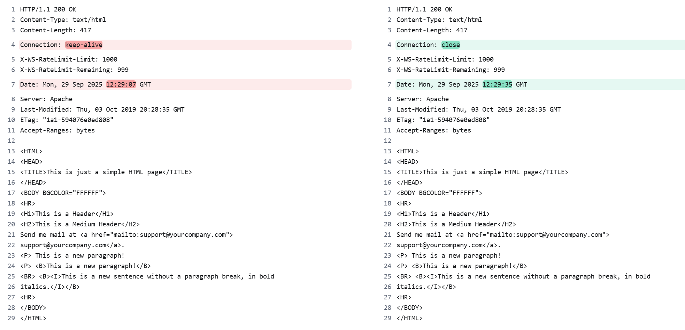

# 连接到学校Linux

查看这个文件：`../PPT 课件/Tutorial_1_连接到学校SSH.pdf`

```cmd
ssh {userName}@lxfarm{NN}.csc.liv.ac.uk
```

其中`{NN}`需要为`01`到`08`之间任意数字，保留0，一般为08，且`{userName}`是你的学校IT邮箱名。

# 使用nc链接服务器


第一步：建立链接

```bash
nc comp211.gairing.com 80
```

- `nc`：调用 netcat 工具；
- `comp211.gairing.com`：你要连接的目标 Web 服务器地址；
- `80`：HTTP 协议的默认端口（必须指定，否则服务器不知道你要 “访问网页”）。端口 80 是默认的 HTTP 服务器套接字。

如果连接成功，终端会 “卡住”（没有任何提示）—— 这是正常的！因为此时你已经和服务器建立了连接，就等你发送 “要获取文件” 的请求了。

**第二步：手动发送 HTTP 请求（关键！）**

连接成功后，你需要向服务器发送一段 **标准的 HTTP 请求文本**。格式必须严格按照要求，否则服务器会返回 “错误”。

你需要复制粘贴以下两行内容（注意：两行都要，且顺序不能错），然后 **连续按两次回车键**：

```bash
GET /Welcome.html HTTP/1.1
Host: comp211.gairing.com
```


对比：

```bash
nc comp211.gairing.com 80

GET /Welcome.html HTTP/1.1
Host: comp211.gairing.com
```


```bash
nc comp211.gairing.com 80

GET /Welcome.html HTTP/1.0
Host: comp211.gairing.com
```


| 特性 | HTTP 1.0 | HTTP 1.1|
| -------- | ---------------------------- | --------------------------------- |
| 连接方式 | 默认短连接（一次请求一连接） | 默认持久连接（复用TCP连接） |
| 管道化 | 不支持（串行请求） | 支持（并行发送多个请求）|
| Host头 | 无（不支持虚拟主机） | 必须包含（支持多域名共享服务器）|
| 缓存机制 | 仅Expires和Pragma| 新增Cache-Control、ETag等精细控制 |
| 状态码 | 基础状态码（如200、404） | 新增100、409、410等细分状态码 |
| 带宽优化 | 不支持部分请求 | 支持Range头（断点续传） |
| 请求方法 | 仅GET、POST、HEAD| 新增OPTIONS、PUT、DELETE等|

左边`HTTP/1.1`右边`HTTP/1.0`



# 使用nc发邮件

```bash
nc 35.246.112.180 1025
```


```bash
HELO alice
MAIL FROM: <sender@example.com>
RCPT TO: <receiver@example.org>
DATA
SUBJECT: Hello

Hi Bob, How's the weather? Alice.1523
.
QUIT
```


这段话的核心是：**你需要按照 SMTP 协议规定的格式，手动输入命令并发送给邮件服务器，服务器会根据协议规则解析你的命令并返回响应**——既是“按格式写”，也是“把命令包发送给服务器”，两者是一体的（格式是前提，发送是动作）。


具体拆解：
1. **“按格式写”是前提**：
 你输入的 `HELO`、`MAIL FROM`、`DATA` 等不是随意写的文本，而是 **SMTP 协议（简单邮件传输协议）统一规定的“命令关键词”**——所有邮件服务器（如 Gmail、企业邮件服务器）都遵守这个协议，只认这种格式的命令。
    比如：
 - 必须先用 `HELO`/`EHLO` 向服务器“自我介绍”（告诉服务器你的身份）；
 - 必须用 `MAIL FROM` 声明发件人，用 `RCPT TO` 声明收件人；
 - 用 `.`（单独一行的英文句号）表示邮件内容结束——这都是 SMTP 协议的硬性规则，格式错了服务器会返回错误代码（比如 `500 Syntax error`，表示“命令格式无效”）。


2. **“发送给服务器”是动作**：
 当你在 `nc` 连接（比如 `nc 邮件服务器地址 25`，25是SMTP默认端口）中逐行输入这些命令并按回车时，`nc` 会把你输入的每一行命令**封装成网络数据包**，发送到目标邮件服务器。
    服务器收到数据包后，会按 SMTP 协议解析命令：比如收到 `MAIL FROM: <sender@example.com>`，就会记录“发件人是这个地址”；收到 `DATA` 就知道“接下来是邮件内容”，直到收到 `.` 才会停止接收内容并准备发送邮件。


简单说：SMTP 协议是“通用语言”，你按这个“语言格式”写命令（相当于“说正确的话”），`nc` 帮你把这些“话”传给服务器（相当于“递话”），服务器能听懂并回应——整个过程就是“按协议格式发命令包给服务器”。

[邮件网页。](http://35.246.112.180:1080/)


```baash
[sgzjia24@lxfarm08 ~]$ nc 35.246.112.180 1025
220 EventMachine SMTP Server
HELO alice
250 Ok EventMachine SMTP Server
MAIL FROM: <sender@example.com>
250 Ok
RCPT TO: <receiver@example.org>
250 Ok
DATA
354 Send it
SUBJECT: Hello
LINE 1
LINE 2
LINE ...
.
250 Message accepted
QUIT
221 Ok
```


