# COMP211-202526 Computer Network

---
[TOC]
---


# 课程介绍

## [1] 分数组成

| 项目            | 占比 | 说明                  |
| --------------- | ---- | --------------------- |
| A1 JAVA Project | 10%  | DDL 17 October, 17:00 |
| A2 JAVA Project | 10%  | DDL 31 October, 17:00 |
| Exam            | 80%  | 2小时50个选择题       |

## [2] 教学大纲

| **Weeks 周次** | **Topics 主题**            | **Textbook Chapters 教科书章节** |
| -------------- | -------------------------- | -------------------------------- |
| 1              | Introduction 简介          | KR1, T1                          |
| 1.5            | Application Layer 应用层   | KR2, T7                          |
| 2              | Transport Layer 传输层     | KR3, T6                          |
| 1.5            | Network Layer 网络层       | KR4, KR5, T5                     |
| 1.5            | Link Layer 链路层          | KR6, KR7, T2.1, T3.2             |
| 1.5            | Internet Security 网络安全 | KR8, T8                          |

课程侧重探讨：互联网的架构（architecture）和协议（protocols）为主要工具来研究**计网的基本概念**。

学习成果：

1. 描述+论证（Describe  + Justify）OSI参考模型、计网**关键协议**
2. 网络编程
3. 加密技术

# Introduction

## [1] 互联网构成

### [1.1] 组件视角

互联网的组件视角由以下四方面组成：

1. 终端系统（主机）：互联网数据的**发送端和接收端，是边缘设备/网络边缘（Network Edge）。**

   > 主机（Host）也叫做终端系统（End System）
   >
   > 主机：hosts

2. 分组交换机（Packet switches）：路由器（routers）+交换机（switches）组成。负责转发数据块。

3. 通信线路：例如铜线光纤等。

4. 网络：由相互连接的互联网服务提供商（ISP）构成。

   > Internet Server Provider


### [1.2] 协议视角

**协议的定义：**协议定义了网络中设备间通信的规则，定义了：

1. 消息的格式
2. 发送与接收顺序
3. 消息传输或接收时应采取的操作


**计网协议的作用：**贯穿互联网，控制消息的发送与接收，常见协议有 **HTTP**（网页）、**TCP**、**IP**、**WiFi**、**4/5G**、**以太网**等。

**协议标准体系：**由互联网工程任务组制定，以 “请求评论”（RFC）文档形式发布，确保互联网技术规范统一。

> 互联网工程任务组 Internet Engineering Task Force IETF。
>
> RFC - Request For Comment


## [2] 互联网结构

### [2.1] 网络边缘

网络边缘（Network Edge）、网络设备、终端（Network End）、主机（Hosts）可以理解为一个意思。网络边缘有：客户端（各种设备）、服务器。

网络边缘的特点就是：他们**不是**主要**转发网络的中转站**。

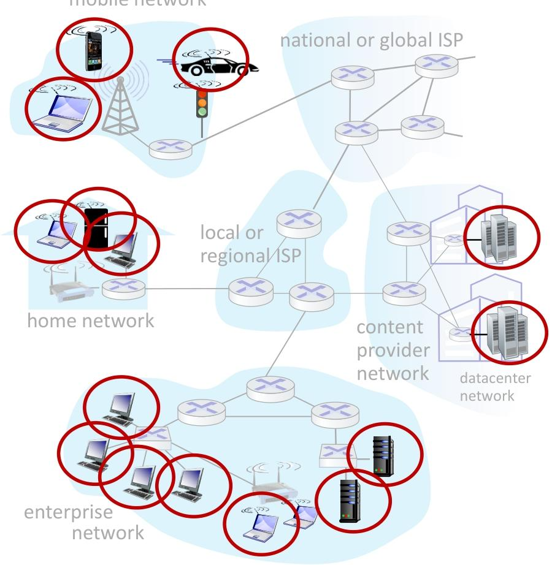

Network Edge、Network End、Host、End System 都可以理解为一个意思！就是接入的最后一者！

### [2.2] 接入网

接入网（Access Network）

---

**第一种接入网形式是：电缆（Cable）接入**

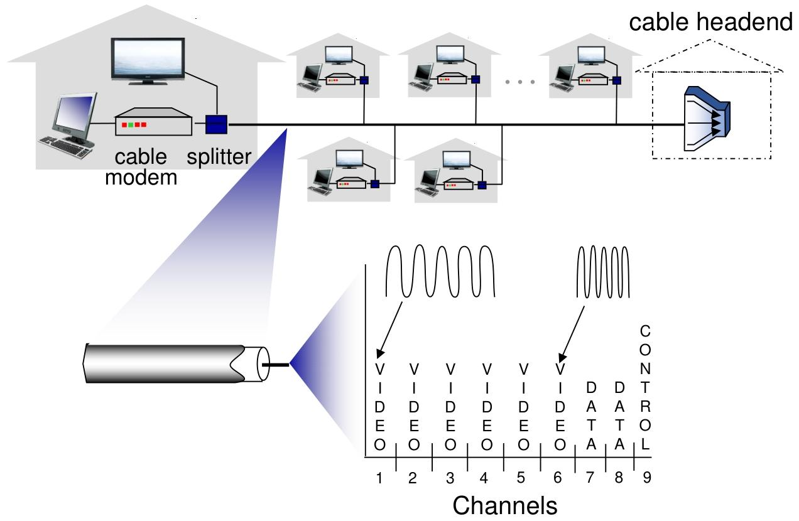


- **Cable Headend（电缆前端）**：互联网连接核心枢纽。负责接收数据，收集用户发送的数据。（同时还承担着电视信号的处理、调制等工作）

- **Cable Modem（电缆调制解调器）**：它的作用是将用户设备（如电脑、电视等）产生的**数字信号转换为**适合在**电缆中传输的模拟信号** 或反之。

- **Cable Splitter（电缆分路器）**：用于将一根电缆的信号分配到多个用户端，这样多个用户可以共享同一段电缆线路，同时不影响各自信号的传输。

  > Cable Splitter 下行（从headend到end）中是直接分配即可，可同时共享。
  >
  > Cable Splitter 上行（从end到headend）中是使用**频分复用（FDM）**技术（如图，分为9个Channel，每个Channel互不影响）：不同信号在不同频段传输。对于这个FDM技术，请查看 **[频分复用](#3_2_2_what_is_fdm_and_tdm)**

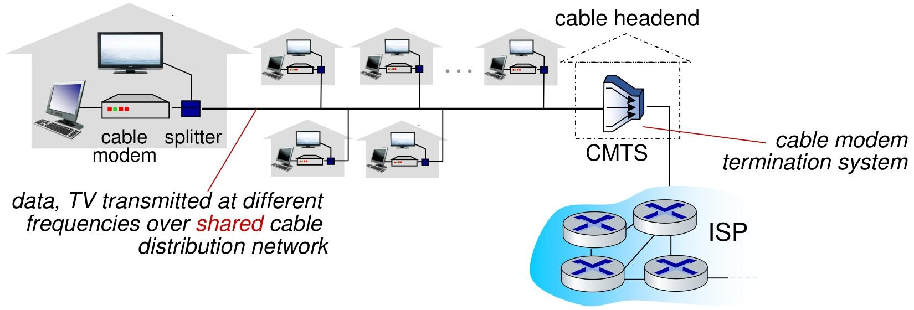

上面这张图是**混合光纤同轴（Hybrid Fiber Coax，HFC）网络**（也是**电缆接入网络的一种**），它是有线电视网络（CATV）用于提供互联网接入等宽带服务的典型架构。	

HFC网有非对称性：下行速率 40 Mbps - 1.2 Gbps，上行速率 30 - 100 Mbps

更详细一步、CMTS同时处理电视信号和ISP（网络服务提供商）的信号，整合到一起。

> CMTS（Cable Modem Termination System，电缆调制解调器终端系统）：
>
> 整合如下信号：
>
> - 电视信号频率：50 - 550MHz
> - ISP信号频率：550-750MHz

此处有光纤和电缆的转换。

---

**第二种接入网形式是：数字用户线路（DSL - Digital Subscriber Line）接入**

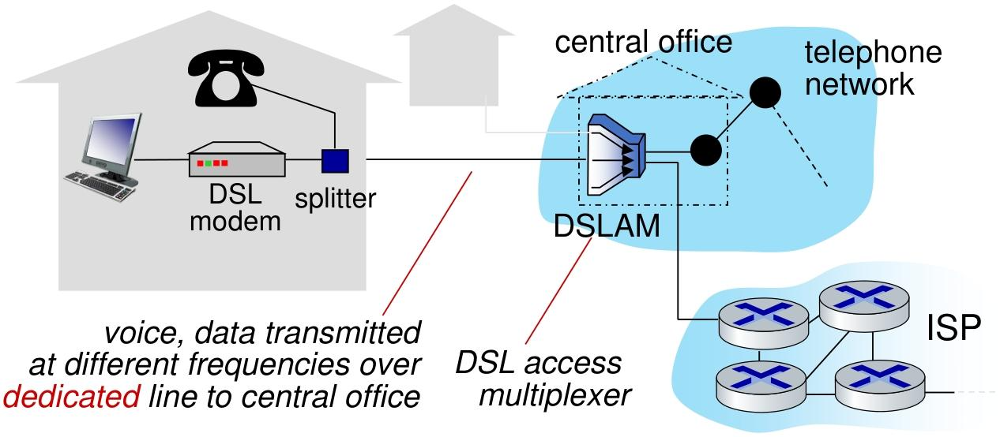

DSL 是一种利用现有**电话线路**向用户提供宽带互联网接入和传统语音通信的技术。

**用户端设备**：

- **DSL Modem（DSL 调制解调器）**：数字信号、语音信号 互转。
- **Splitter（分路器）**：用于分离电话线路中的语音信号和数据信号，使语音通话和宽带上网可以同时进行且互不干扰。

**中心局设备**：

- **Central Office（中心局）**：电话公司的核心节点，集中了 DSLAM 等设备，是电话线路和网络的交汇点。
- **DSLAM（DSL Access Multiplexer，DSL 接入复用器）**：**位于电话公司的中心局**，负责汇聚多个用户的 DSL 连接，将用户的数据信号转发到互联网服务提供商（ISP）的网络，同时将语音信号转发到电话网络。

---

**第三种接入网形式是：家庭网（Home Networks）接入**

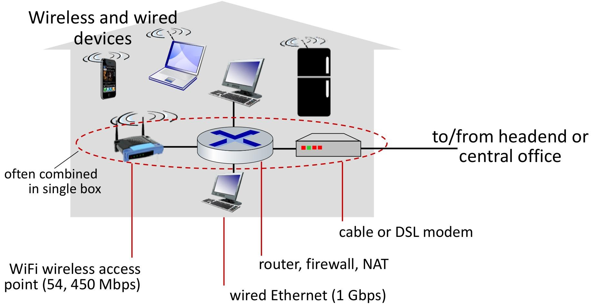


家庭网这里有**无线网（Wireless Access Network）接入**，分为两种

1. 无线局域网（WiFi）

   > Wireless local area networks

2. 广域蜂窝接入网络（流量）

   > Wide-area cellular access networks
   >
   > 4G: 150/300 Mbps (15km)
   >
   > 5G: 10Gbps (300m)

---

**第四种接入网形式是：企业网（Enterprise Network）接入**

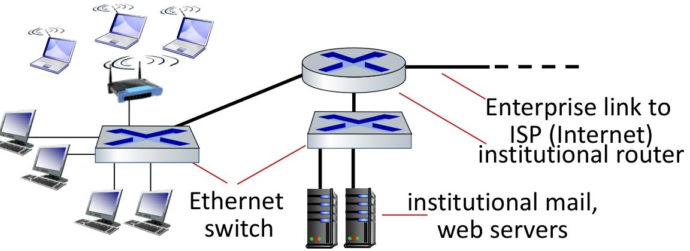


企业网内部有很多交换机、无线网，但是输出一般都是经过汇总的。

---

**第五种接入网形式是：数据中心网（Data Center Network）接入**

把各服务器链接，通常10s - 100s （数十到数百）Gbps。


### [2.3] 物理介质

> Link 链路， 也就是传输数据线 

- 主机（Hosts）接收应用程序消息
- 将其拆分为更小的块，即长度为 $L$ 位的**数据包（Packets）**
- 以传输速率（Transmission Rate） $R$ 将数据包传输到接入网络
  - 链路传输速率（Transmission Rate），也称为**链路容量（Link Capacity）**，或称**链路带宽（Link Bandwidth）**

$$
数据包传输延迟 = 将 L 位的数据包传输到链路所需的时间 = \dfrac{L(位)}{R(位 / 秒)}
$$

- bit是数据传输的基本单位。
- 物理链路（physical link）：指发射机和接收机之间的物理连接部分，是数据传输的物理通道。

- **导引型介质（guided media）**：信号在固体介质中传播，常见的固体介质有**铜缆（如双绞线）**、**光纤(Optical Fiber)**、**同轴电缆(Coaxial Cable)**等。这些介质能 “引导” 信号在固定的路径内传输。
- **非导引型介质（unguided media）**：信号可以自由传播，例如无线电（像 WiFi、手机通信使用的无线电波等），不需要固体介质来引导信号，信号在空间中传播。


**引导型介质例子：**

---

> **引导型介质：双绞线 Twisted pair (TP)**
>
> 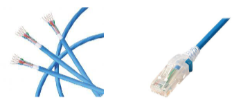
>
> 5类线：100Mbps和1Gbps**以太网（Ethernet）**
> 6类线：能支持 10 Gbps 的以太网传输
>
> ---
>
> **引导型介质：同轴电缆 Coaxial cable**
>
> 
>
> **结构**：由两根同心的铜质导体组成（内层铜芯传输信号，外层铜质屏蔽层起到抗干扰等作用）。
>
> **传输特性**：
>
> - **双向性（bidirectional）**：能同时进行双向的数据传输，即可以同时发送和接收数据。
> - **宽带特性（broadband）**：
>   - 电缆上可存在多个频率通道（multiple frequency channels on cable），不同的频率通道可用于传输不同的信号或数据。
>   - 每个通道能支持每秒数百兆比特（100’s Mbps per channel）的传输速率。
>
> ---
>
> **引导型介质：光纤（Optical Fiber）**
>
> 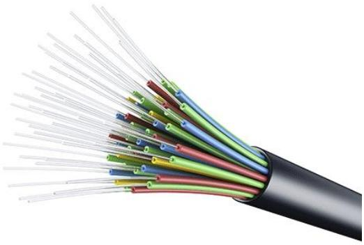
>
> - **传输原理**：通过玻璃纤维传输光脉冲，每个光脉冲代表一个比特（bit）。
> - **优势特点**：
>   - **高速运行（high - speed operation）**：
>     - 支持高速的点对点传输（high - speed point - to - point transmission），传输速率可达数十吉比特每秒到数百吉比特每秒（10’s - 100’s Gbps）。
>   - **低错误率（low error rate）**：
>     - 中继器（repeaters，用于放大或再生信号以延长传输距离）的间隔可以很大（repeaters spaced far apart）。
>     - 不受电磁噪声（electromagnetic noise）的影响，因为是通过光信号传输，而非电信号，所以电磁干扰对其传输质量影响极小。

---


**非引导型介质例子：**

---

**无线射频（Wireless radio）**

- **信号传输**：信号在**电磁波谱（Electromagnetic Spectrum）**的不同 “**频段（Bands）**” 中传输（Carried），利用无线电波（Ratio waves）来传递数据。
- **无物理线路**：不需要像网线、光纤那样的物理 “导线（wire）”，通过空气等空间介质传输信号。
- **传输方式**：采用 **广播、半双工（broadcast, “half - duplex”） 模式**，即信号从发送方到接收方单向广播，同一时间通常只能进行 “发送” 或 “接收” 操作（不能同时双向传输）。
- **传播环境影响**：无线信号的传输会受到多种环境因素影响：
  - **反射（reflection）**：信号遇到物体（如建筑物、山脉）会反射，可能导致信号叠加或失真。
  - **物体遮挡（obstruction by objects）**：树木、墙壁等物体遮挡会削弱信号强度。
  - **干扰 / 噪声（Interference/noise）**：其他无线信号或电磁噪声会干扰传输，影响信号质量。

> 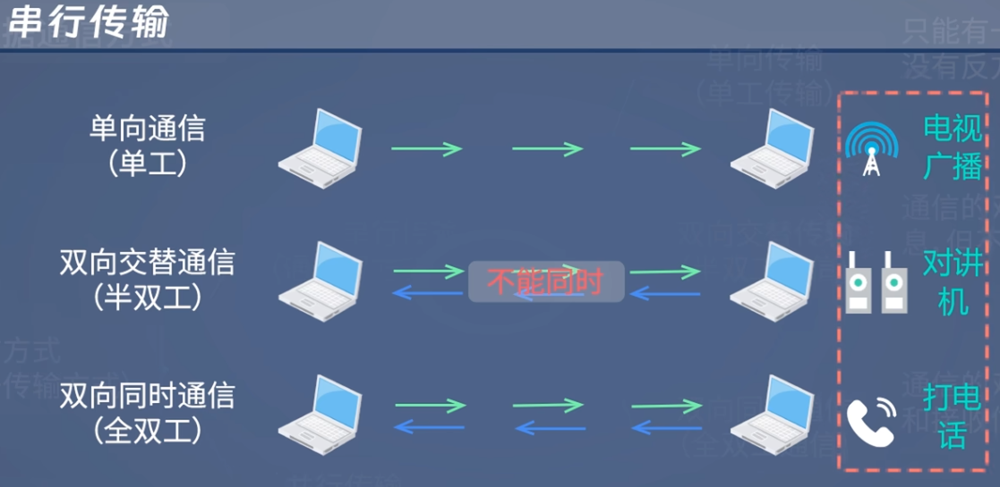
>
> 单工：Simplex
>
> 半双工：Half-Duplex
>
> 全双工：Full-Duplex

**无线射频链路类型（Radio link types）**

- **无线局域网（Wireless LAN, WiFi）**：
  - 传输速率：10 - 数百 Mbps（10 - 100’s Mbps）。
  - 覆盖范围：数十米（10’s of meters），适用于家庭、办公室等小范围无线组网。
- **广域无线（wide - area，如 4G/5G 蜂窝网络）**：
  - 以 4G 为例，传输速率约数十 Mbps（10’s Mbps），覆盖范围可达约 10 公里，用于大范围的移动网络接入。
- **蓝牙（Bluetooth）**：
  - 定位：“线缆替代方案（cable replacement）”，用于短距离设备间的无线连接（如耳机与手机、键盘与电脑）。
  - 特点：短距离（short distances）、传输速率有限（limited rates）。
- **地面微波（terrestrial microwave）**：
  - 传输方式：**点对点（point - to - point）**，常用于固定地点间的高速数据传输。
  - 单通道速率：45 Mbps 的通道（45 Mbps channels）。
- **卫星（satellite）**：
  - 以星链（Starlink）为例，下行速率可达不到 100 Mbps。
  - 延迟：地球同步卫星的端到端延迟约 270 毫秒（270 msec end - end delay (geostationary)），信号往返卫星的距离远，导致延迟较高。


## [3] 网络核心

Network Core

### [3.1] 网络结构的核心

**网络核心的结构**：

- 网络是**相互连接的路由器组成的网状结构**。如图蓝色部分。

- 从示意图能看到，不同类型的网络（家庭网络、企业网络、移动网络等）通过各级 ISP（本地 / 区域 ISP、全国 / 全球 ISP）的路由器网络相互连通。

  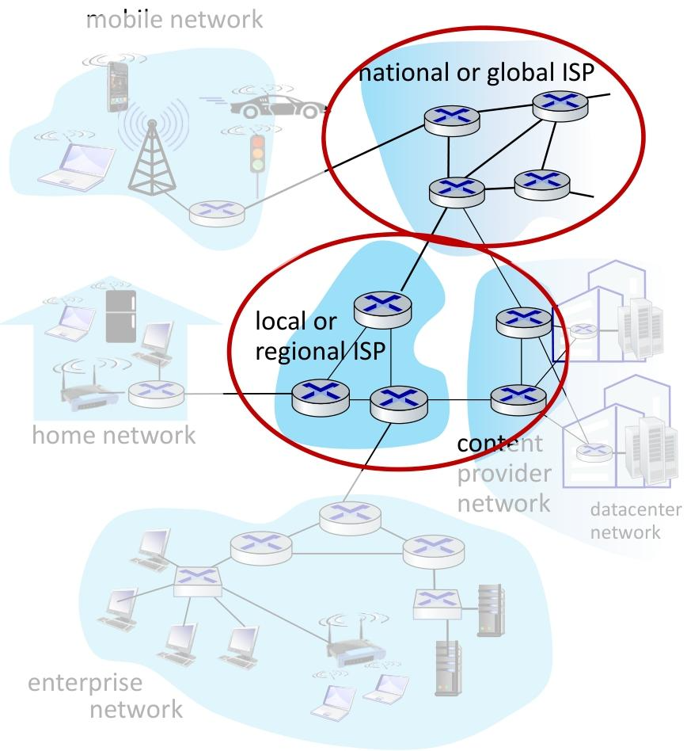

> mesh - 网状结构
>
> interconnected  - 相互连接的
>
> routers - 路由器


- **分组交换（packet - switching）**：
  - 主机（hosts）会把应用层的消息拆分成**分组（packets）**。
  - 网络通过 “逐跳转发” 的方式，将分组从一个路由器传递到下一个路由器，沿着从源地址到目的地址的路径传输。

### [3.2] 网络核心的两大关键功能

网络核心有两个核心操作：**转发（Forwarding）**和 **路由（Routing）**，二者协同实现数据的高效传输。

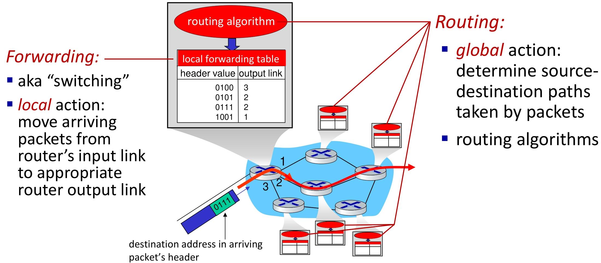

#### [3.2.1] 转发/交换

> Forwarding/Switching

- 性质：**本地操作（local action）**，即每个路由器独立完成的动作。
- 功能：根据路由器的**本地转发表（local forwarding table）**，将到达路由器输入链路的分组，移动到合适的输出链路。
- 示例：图中显示，当带有目的地址的分组到达路由器时，路由器查看转发表（根据分组头部的 “header value” 匹配 “output link”），把分组转发到对应的输出链路。

##### 分组的交换

**分组转发/交换 （Packet-switching）** 一共两步骤

---

**步骤一、储存转发（Store-and-forward）**

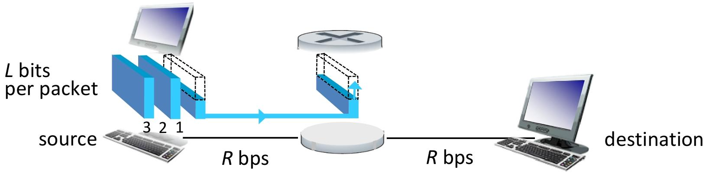

这里的Packet是分组的意思。

分组传输延迟公式：
$$
\text{Packet Transmission Delay}=\dfrac{L}{R}
$$
其中 $L$ 是：每个分组 $L$ 比特。

端源（Source，也就是发送者）速率是 $R$ 比特$/sec$ 

目的端（Destination，也就是接收方）速率也是 $R$ 比特$/sec$ 

---

**步骤二、排队（Queueing）**

储存后，我们需要转发，把这些转发的东西看作工作（Work）。当工作的到达速度 $>$ 处理速度的时候，就会在路由器那里发生排队。

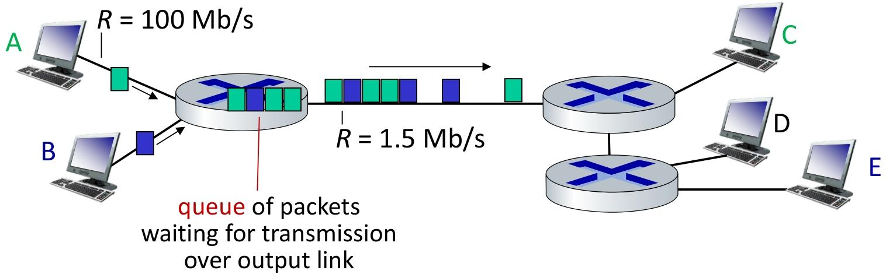

丢包：如果排队队伍过长，路由器缓冲区满了（Buffer），那么后面新来的排队的就会发生**丢包**。

> **[延迟和丢包](#4_how_delay_occure)**

##### 电路的交换

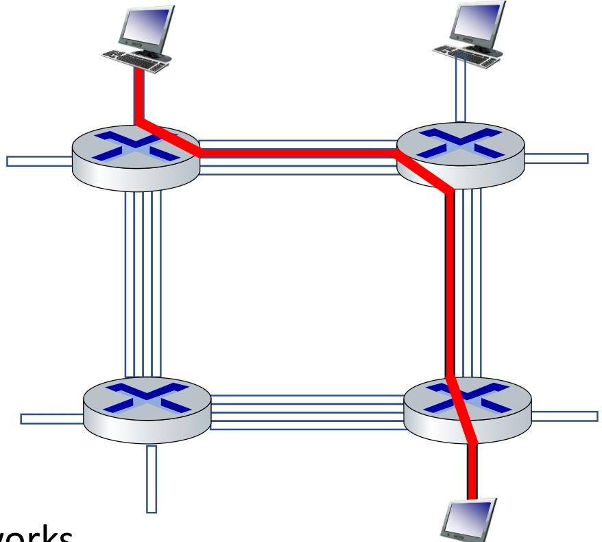

电路交换的关键在于为通信的两端（源和目的）在整个通信过程中，**预先分配并独占端到端的资源**。就像打电话时，从你拨号开始，到通话结束挂断，这条通话的 “电路” 资源（包括沿途的链路、交换机的处理资源等）是专门为你和对方预留的，**不会被其他通信占用**。

从源设备（图中上方的计算机）到目的设备（图中下方的计算机）的 “呼叫”（可以理解为一次通信连接，比如传统的电话呼叫），会被分配并预留端到端的资源。这里的 “端到端（End-to-End）” 意味着**从源到目的的整个通信路径上的资源都被预留**。例如上图$\color{red}\bold{\text{红色线}}$。


此外，一个很明显的问题就是：电缆就这么多，但是数据越来越多，怎么才能让一根电缆利用率达到极致呢？

因此引入了**频分复用（FDM）**和**时分复用（TDM）**技术！	

<a id="3_2_2_what_is_fdm_and_tdm"></a>

#### [3.2.2] FDM 和 TDM

---

**FDM - Frequency Division Multiplexing 频分复用** ：

1. 光、电磁频率被划分为（窄）频段
2. 每个呼叫分配有**自己的频段**，能够以该窄带的最大速率进行传输

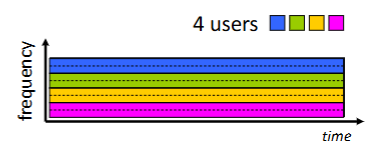

---

**TDM - Time Division Multiplexing 时分复用：** 

时间被划分为多个时隙，每个呼叫被分配到周期性的时隙，只能在其时隙内以（更宽的）频段的最大速率进行传输

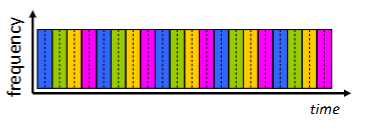

---

**FDM和TDM对比**

| 对比维度         | FDM                                                          | TDM                                                          |
| ---------------- | ------------------------------------------------------------ | ------------------------------------------------------------ |
| **信号类型**     | 主要传输**模拟信号**，需通过调制技术将信号映射到对应频段     | 主要传输**数字信号**，依赖时间片分割与排序实现复用           |
| **资源分配核心** | 以“**频段**”为单位分配资源，每个用户长期占用固定频段         | 以“**时间片**”为单位分配资源，每个用户周期性占用固定时间片   |
| **关键技术要求** | 需大量滤波器（分离不同频段）、调制解调器，**且需预留“保护带宽”（防止频段间干扰）** | 需高精度**时钟同步**（确保时间片分配与接收准确），需缓存器暂存不同时间片的数据 |
| **资源浪费情况** | **保护带宽会占用部分信道资源，导致频谱利用率降低；**若用户无数据，其频段仍空闲 | 无数据传输的用户，其专属时间片会直接空闲                     |
| **抗干扰能力**   | 抗干扰能力较弱，易受频段重叠、信道非线性失真影响             | 抗干扰能力较强，仅需保证时钟同步，信号在时域分离不易相互干扰 |
| **典型应用场景** | **传统广播/电视、有线电视网络**、早期模拟电话系统、卫星通信的多频段传输 | **数字电话系统（如E1/T1线路）、计算机网络骨干链路**、IP电话实时语音传输、工业数据采集 |
| **设备复杂度**   | 设备复杂（需处理多频段滤波与调制），成本较高                 | 设备相对简单（核心是时钟同步与时间片调度），但对同步精度要求极高 |

#### [3.2.3] 分组交换和电路交换例题

> [!CAUTION]
>
> ### ==重要提醒：数量级区分==
>
> 计算机存储（硬盘、内存）中，$\text{KB、MB、GB、TB}$ 数量级是$2^{10}=1024$
>
> 通信带宽（链路、网络速率）中，数量级是 $10^3=1000$，因此 $\text{1 Gbps = 1000 Mbps}$

假设：

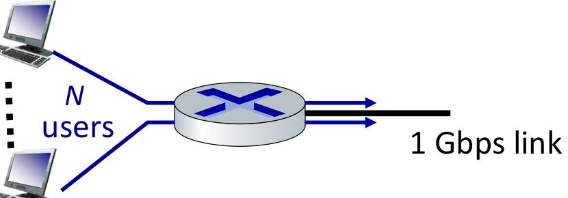

我们有 $\text{1 Gbps}$ 的链路（Link），每个用户 $\text{100 Mb/s}$ 的峰值（例如他们在下载电影），但是一天中只有$10\%$的时间在下电影。

问：在分组交换、电路交换两种情况下，这个网络能供给多少个用户使用呢？

答：

1. 对于电路交换而言，是固定的，只能10个用户，因为
   $$
   n=\dfrac{1Gbps}{100Mbps}=\dfrac{1\times10^{3}Mbps}{100Mbps}=10
   $$
   电路交换相当于是专属VIP，用、不用都是占有一条唯一的专属线路

2. 对于分组交换而言，知道答案还需要一个前置限定条件：降网的概率不大于0.0004。可以算出来35个人某时间刻同时在线人数超过10人的概率不大于0.0004（独立实验，通过二项分布计算）。所以共享的网络可以更高并发！


#### [3.2.4] 分组和电路两种交换模式对比

分组交换好处：

1. 适合突发性的数据（例如普通网民，时而上网，时而离线）
2. 有利于资源共享并且更简单，无需呼叫建立

分组交换坏处：

1. 路由超出缓冲区会导致丢包，延迟产生等...（因此考虑结合电路交换的技术）


#### [3.2.4] 路由 Routing 

- 性质：**全局操作（global action）**，需要考虑整个网络的拓扑结构。
- 功能：确定分组从源地址到目的地址所走的路径。
- 实现：通过**路由算法（Routing Algorithms）**来计算最优路径，并将路径信息更新到各个路由器的本地转发表中，为转发操作提供依据。


### [3.3] 互联网结构

主机必需接入**互联网服务提供商（ISP）**才能实现任意两台主机（Hosts）能相互发送分组。

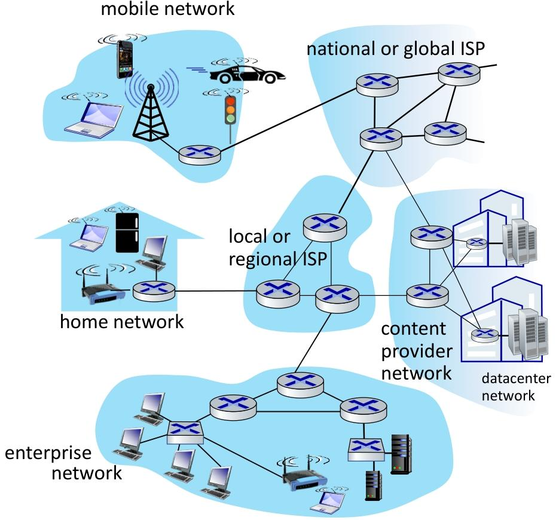

如果任意主机点对点，那么将会是非常复杂的电路链接，因此，为了简化电路，必须使用ISP。

最终网络结构：

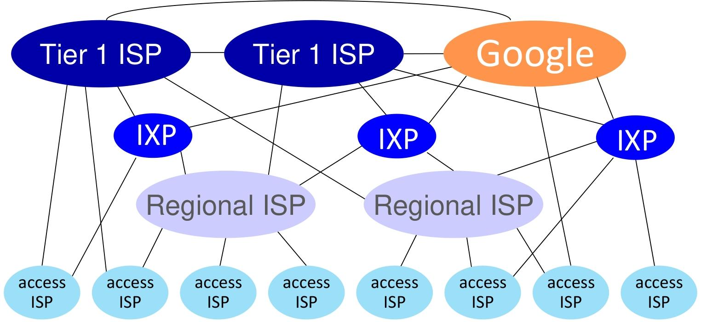

核心组成部分

- **Tier 1 ISP（第一层商业互联网服务提供商）**：处于互联网核心位置，是连接性很好的大型网络，具有全国乃至国际范围的覆盖能力，例如 Level 3、Sprint、AT&T、NTT 等。它们在互联网的核心通信中起到关键的枢纽作用，为其他网络提供广泛的连接服务。

  例如：中国移动、联通、电信

- **IXP（互联网交换点 Internet eXchange Point）**：是不同网络（如 Tier 1 ISP、Regional ISP 等）相互连接、交换流量的关键节点。通过 IXP，不同的网络可以高效地传递数据，避免了数据绕远路，提升了网络通信的效率。

- **Regional ISP（区域互联网服务提供商）**：服务于特定的区域范围，连接着众多的接入 ISP，起到区域内网络汇聚和与核心网络（Tier 1 ISP 等）连接的作用。

- **Access ISP（接入互联网服务提供商）**：直接为终端用户（如家庭、小型企业等）提供互联网接入服务，是用户连接到互联网的 “最后一公里” 环节。

<a id="4_how_delay_occure"></a>

## [4] 数据包延迟和丢失

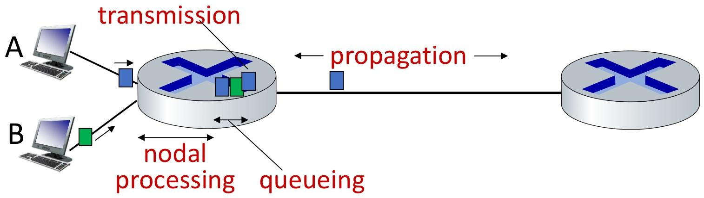

延迟的产生：数据包到达路由器的速率 $>$ 传输链路容量，正在等待，就产生延迟。

丢包的产生：因为延迟的数据包占用路由器内存，路由器缓存溢出则导致丢包。 当丢包产生后，丢失的数据包可以由前一个节点、端源系统重新传，或者根本不重传。

 

**分组交换**延迟的产生更详细分为2种：

一、路由器的问题（排队）

二、节点处理（Nodal Processing）：**检查数据比特错误+确定传输链路**的时间，通常是小于微秒级别的。

### [4.1] 分组交换产生的延迟

综上，分组交换的延迟可以体现为四种：
$$
delay = 处理延迟+排队延迟+传输延迟+传播延迟
$$

---

**处理延迟：**指路由器检查分组头部、判断输出链路等操作的时间

---

**排队延迟：**指分组在输出链路的缓冲区中等待传输的时间

---

**传输延迟（Transmission Delay）：**

- 定义：将分组 “推” 到通信链路上所需的时间。

  
  $$
  d_{trans}=\dfrac LR
  $$

- 其中 $L$ 是**分组长度**，$R$ 是传输**速率**。

- 这个传输速率是路由器的**性质**（硬件这些）决定的。

---

**传播延迟（Propagation Delay）：**

- 定义：信号（承载分组的电磁波等）在物理链路上**从一个节点传播到下一个节点**所需的时间。
  $$
  d_{prop}=\dfrac ds
  $$

- 其中 $d$ 是物理链路长度，$s$ 是信号传播速度（大约$2\times10^8m/s$接近光速）。

---

所以传输延迟和传播延迟是不一样的！


测量互联网中实际的延迟，**核心工具是 `traceroute` 程序：**

`traceroute` 用于测量从**源主机**到**目的主机**的端到端路径上，每个路由器的延迟：

> ### TTL 字段的基本定义和作用
>
> 在 IP 协议中，每个 IP 分组都包含一个 TTL（Time - To - Live，生存时间）字段 ，它本质上是一个计数器。其最初的设计理念是限制分组在网络中的生存时间，**避免分组因为路由环路等问题在网络中无休止地循环**。
>
> ### TTL 字段的工作过程
>
> - **分组发送时**：源主机在构造 IP 分组并发送时，会给 TTL 字段设置一个初始值， 比如在 `traceroute` 程序中，会根据探测的跳数（即 *i* ）来设置 TTL 的初始值。
> - **经过路由器时**：当分组到达一个路由器后，路由器首先会将分组的 TTL 字段值减 1 。如果减 1 后 TTL 的值大于 0 ，路由器会根据路由表信息，将分组转发到下一跳路由器；如果减 1 后 TTL 的值变为 0 ，路由器就不会再转发这个分组，而是向源主机发送一个 ICMP 超时报文 。
>
> ### `traceroute` 利用 TTL 机制实现 “恰好” 探测
>
> `traceroute` 程序在向目的主机发送探测分组时，会从 TTL = 1 开始，逐次增加 TTL 的值。
>
> - 当 TTL = 1 时，分组从源主机发出，经过第一跳路由器，路由器将 TTL 减 1 变为 0 ，然后返回 ICMP 超时报文给源主机，源主机就知道了第一跳路由器的信息。
> - 当 TTL = 2 时，分组可以顺利通过第一跳路由器（因为 TTL 减 1 后为 1 ，大于 0 ），到达第二跳路由器，在第二跳路由器处 TTL 减 1 变为 0 ，第二跳路由器返回 ICMP 超时报文给源主机，源主机就获取了第二跳路由器的信息。
> - 以此类推，随着 TTL 值逐次增加，分组就能 “恰好” 到达路径上对应的第 *i* 个路由器，当 TTL 在该路由器处减为 0 时，就能得到该路由器的延迟等信息。
>
> 源主机可以通过计算发送分组和接收 ICMP 超时报文之间的时间间隔，来间接得到延迟信息

### [4.2] 流量强度

Traffic Intensity

公式为
$$
intensity =\dfrac{L\cdot a}R
$$

- $a$：平均分组到达率（单位时间内到达的分组数）。
- $L$：分组长度（单位：比特）。
- $R$：链路带宽（比特传输速率，单位：bps）。

**如果值接近0，那么流量强度很轻。反之，如果接近1，那么流量越来越强，接近满载，如果大于1，那么会导致丢包。**


### [4.3] 吞吐量

Throughput

**吞吐量**：指从发送方到接收方的**比特传输速率**（单位：比特 / 时间单位，如 bps）。

**瓶颈链路（bottleneck link）**：简而言之，如果 $R_s$ > $R_c$ 那么瓶颈就是接收端（S代表Sender，C代表Receiver）。

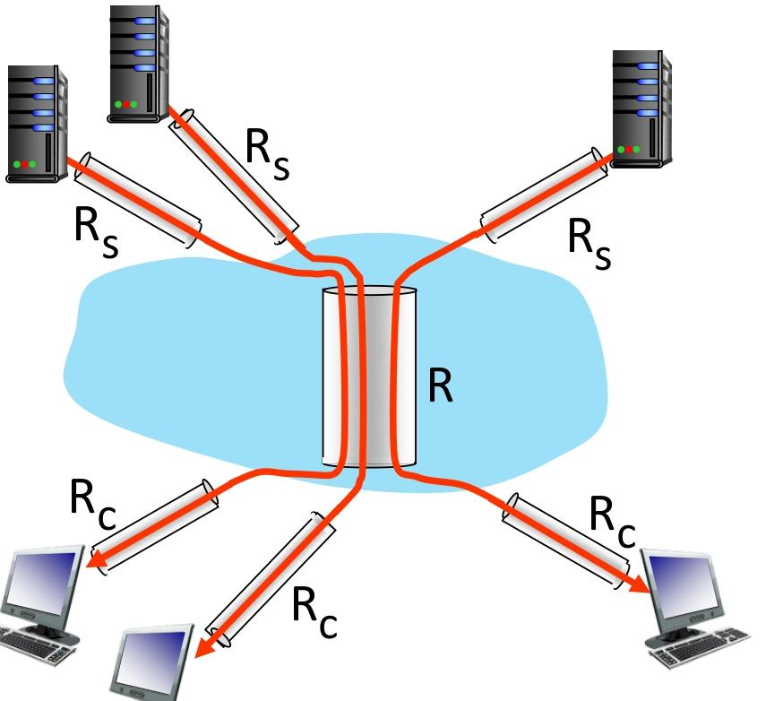

## [5] 网络安全

Security

**数据包嗅探**

Packet Sniffing

广播媒体（例如共享以太网，无线）的混杂模式网络接口会读取/记录所有经过的数据包（包括敏感数据包如密码等）

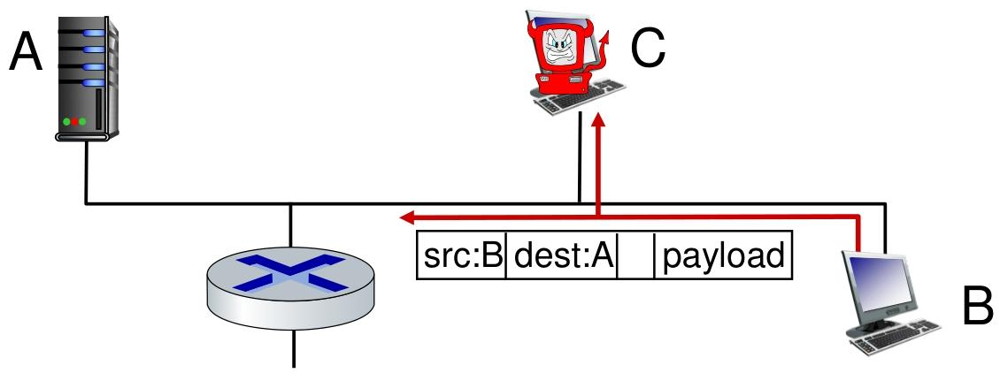


比如使用`Wireshark`这款软件去嗅探数据。

**IP欺骗**

IP Spoofing

注入带有虚假源地址的数据包

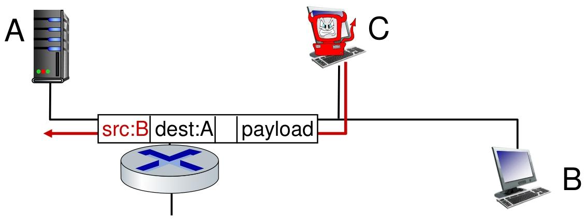


还有例如最常见的拒绝服务（Denial of Service - DoS）

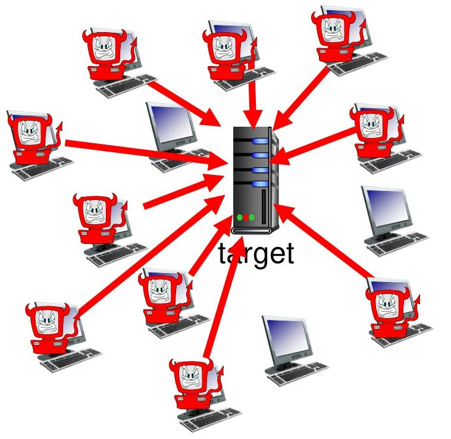

## [6] 协议层和服务模型

协议层：Protocol Layer

服务层：Service Model

分层是必要的：就像为什么程序设计要分层。这样可以明确各层的作用，便于运维。

## [6.1] 网络协议栈（分层模型） 与 OSI模型

### [6.1.1] 分层模型

- **应用层 Application**：支持网络应用
  - 示例：HTTP、IMAP、SMTP、DNS
- **传输层 Transport**：进程到进程的数据传输
  - 示例：TCP、UDP
- **网络层 Network**：将数据报从源地址路由到目的地址
  - 示例：IP、路由协议
- **链路层 Link**：相邻网络设备之间的数据传输
  - 示例：以太网、802.11（WiFi）、PPP
- **物理层 Physical**：“线路上的”比特（负责比特的物理传输）

信息 $M$ 从应用层逐渐到物理层的过程中，会**套娃**套住这个信息，一层套一层，这是封装（Encapsulation）思想。

1. 消息 $M$ 通过传输层变为：
2. 段（Segment） $[H_t|M]$，然后通过网络层变为：
3. 报（Datagram）$[H_n|H_t|M]$，然后通过链路层封装为：
4. 帧（Frame）$[H_l|H_n|H_t|M]$ 最后这个数据通过物理层传输到相邻主机。


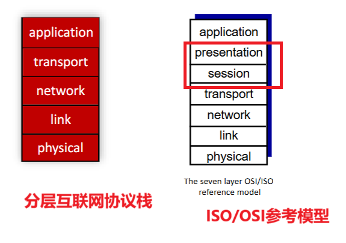


### [6.1.2] ISO/OSI 参考模型

互联网协议栈中**没有以下两层**！
- **表示层 Presentation**：允许应用程序解释数据的含义，例如加密、压缩、特定于机器的约定
- **会话层 Session**：数据交换的同步、检查点设置与恢复
- 互联网协议栈“缺少”这些层！
  - 如果需要这些服务，必须在应用层中实现！（但是现实需要吗？）

# 应用层 Application Layer

## [1] 应用层原理

### [1.1] 应用层架构

应用层有2种架构

#### [1.1.1] 客户端-服务器架构

Server-Client Paradigm Architecture

| 服务器                                                       | 客户端                                                       |
| ------------------------------------------------------------ | ------------------------------------------------------------ |
| 1. 是始终在线的主机（Hosts）<br/>2. **永久的IP地址**<br/>3. 常位与数据中心 | 1. 与服务器进行联系，通信是断断续续的<br/>2. 可能有动态IP地址<br/>3. 不直接相互通信<br/>4. 例如HTTP，IMAP，FTP等 |

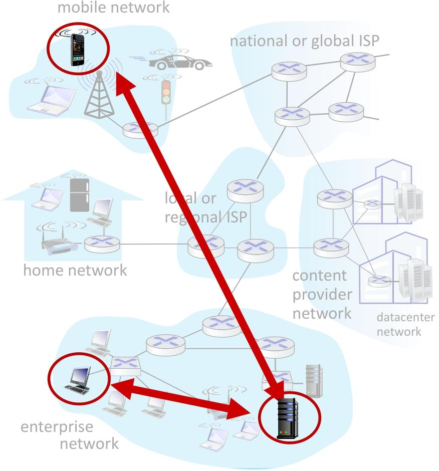

#### [1.1.2] 对等架构

Peer-peer Architecture

对等架构

1. 没有始终在线的服务器，任意端系统可直接通信，节点既从其他节点请求服务，也向其他节点提供服务，具有自扩展性（新节点带来新的服务能力和服务需求）。

2. 节点间歇性连接且 IP 地址会变化，管理复杂，例如 BitTorrent 等 P2P 文件共享应用采用这种架构。


### [1.2] 进程间通信

Processes communicating

> 进程（计算机基本原理知识）是在主机内运行的程序

在同一主机内，两个进程通过进程间通信（由操作系统定义）进行通信

不同主机中的进程通过**交换消息（Exchanging messages）**进行通信

> 注：采用P2P架构的应用程序包含客户端进程和服务器进程

### [1.3] 套接字 Socket

Socket

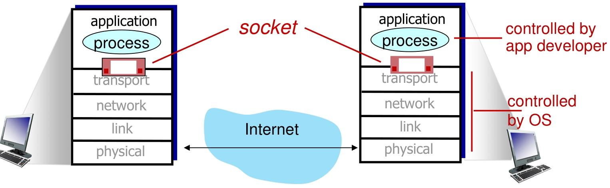

进程通过其Socket发送/接收消息。 Socket ：

1. 类似于大门，发送进程把消息推出门外
2. 通信双方都有各自的Socket

- 应用（Application Layer）进程部分由应用开发者控制
- 而传输层（Tranport Layer）及以下（transport、network、link、physical）由操作系统（OS）控制。

> 采用P2P架构的应用程序包含**客户端进程**和**服务器进程**（Client and Server Process）
>
> “P2P” 是 **Peer-to-Peer**（点对点）的缩写，核心是 “不通过中心机构，直接实现个体间的连接与交互”。这一模式广泛应用于金融、网络传输、共享经济等多个领域，不同领域的 P2P 含义和运作逻辑差异较大，以下是最常见的三大应用场景解析：
>
> 但P2P不是端对端（End-to-End）


### [1.4] 进程寻址

Adressing Processes

1. 要接收消息，进程必须有**标识符（Identifier）**。

   > 标识符是用来**唯一确定**网络中接收消息的进程的标识，它由主机的**IP 地址**和进程对应的**端口号**共同组成。
   >
   > 因为同一台主机上可能运行多个进程，仅靠 IP 地址无法区分不同进程，结合端口号才能准确标识出要接收消息的那个进程。
   >
   > 比如要向`gaia.cs.umass.edu`的 Web 服务器发送 HTTP 消息，就需要用 IP 地址`128.119.245.12`和端口号`80`共同作为标识符。

2. 主机设备具有**唯一的**32位IP地址

   > 每一台连接到网络中的主机（比如电脑、服务器等设备），都会被分配一个专门的 IP 地址，这个 IP 地址是由 32 个二进制位组成的。在 Internet 体系中，这样的 32 位 IP 地址（也就是 **`IPv4`** 地址）是全球唯一的，通过它能够在网络里准确地定位到这台主机。
   >
   > 具体拆解 `10.100.20.50` 如下：
   >
   > 每个十进制数对应 8 位二进制：
   >
   > - 10 → 00001010（8 位二进制）
   > - 100 → 01100100（8 位二进制）
   > - 20 → 00010100（8 位二进制）
   > - 50 → 00110010（8 位二进制）
   >
   > 拼接后得到完整的 32 位二进制地址：`00001010.01100100.0010100.00110010`（去掉小数点后共 32 位）。
   >
   > 所以说是32位IP地址。
   >
   > IPv4地址已经用完了（2019年宣布）！现在引入了IPv6地址。

Q: Does IP address of host on which process runs suffice for identifying the process?

> 进程所运行的主机的IP地址足以识别该进程吗？
>
> 不能，只知道主机IP，没有端口，是不行的，因为一台主机有很多进程，需要端口号进行通讯。


## [2] 应用层定义了什么

应用层定义了：

1. **交换消息的类型**：比如 `REQUEST`（请求）、`RESPONSE`（响应）。

   比如：向浏览器向 Web 服务器发请求，服务器回响应。

2. **消息语法（Message Syntax）**：规定消息里有哪些字段，以及这些字段是如何划分（比如用分隔符、固定长度等方式区分不同字段）的。

3. **消息语义（Message Semantics）**：明确消息字段中信息的含义，比如某个字段的值代表 “请求资源的路径” 还是 “用户身份标识”。

4. **进程发送和响应消息的规则**：定义进程

   - 什么时候发送消息
   - 如何响应消息（比如收到请求后多久必须回响应，响应的格式要符合什么要求）


### [2.1] 开放协议

Open Protocols

开放协议是：

- 定义在 **RFC（Request for Comments，请求评论，是互联网技术标准的文档系列）** 中，所有人都能获取的协议。
- 支持**互操作性（Interoperability）**，即不同厂商、不同系统的设备，只要遵循同一个开放协议，就能相互通信。

例子：HTTP（超文本传输协议，用于 Web 通信）、SMTP（简单邮件传输协议，用于邮件发送）。


### [2.2] 专有协议

Proprietary Protocols

- 是私有的，协议定义不公开，由特定公司或组织掌握。
- 例子：**Skype（网络通话等功能）**、**Zoom（视频会议等功能）**。


## [3] 传输服务

一个应用程序需要什么样的传输服务？

1. 数据完整性（Data Integrity）
   - 有的必须100%完整传输，比如银行交易系统
   - 有的允许少量丢包，比如网络游戏
2. 延迟（Timing）
   - 银行系统不要求实时低延迟
   - 网络游戏要求低延迟
3. 吞吐量（Throughput）
   - 有些应用程序比如 Bilibili 需要最低吞吐量以保证程序运行（看视频）
   - 但是有些程序则允许任何大小的吞吐量（称为**弹性**程序 **Elastic** APP）
4. 安全性...

举个例子：

| 应用          | 数据丢失     | 吞吐量                                    | 对时间敏感？                         |
| ------------- | ------------ | ----------------------------------------- | ------------------------------------ |
| 文件传输/下载 | 无丢失       | 弹性（按需使用可用吞吐量）                | 否                                   |
| 电子邮件      | 无丢失       | 弹性                                      | 否                                   |
| 网页文档      | 无丢失       | 弹性                                      | 否                                   |
| 实时音视频    | 容忍数据丢失 | 音频：5Kbps - 1Mbps；视频：10Kbps - 5Mbps | 是，几十毫秒内                       |
| 流媒体音视频  | 容忍数据丢失 | 同上述实时音视频                          | 是，几秒内                           |
| 交互式游戏    | 容忍数据丢失 | 千比特每秒以上                            | 是，几十毫秒内                       |
| 短信          | 无丢失       | 弹性                                      | 是且否（部分场景需实时，部分可延迟） |


## [4] 互联网传输协议

Internet transport protocols services

### [4.1] TCP

**TCP**：全称是 **Transmission Control Protocol**，中文译为**传输控制协议**。

1. 发送、接收是可靠的传输
2. 流量控制：发送方不会让接收方流量**过载（Overwhelmed）**
3. 拥塞控制（Congestion Control）：网络过载时限制发送方
4. 面向连接（Connection-Oriented）：客户端和服务器之间需要建立连接（握手）
5. 不会提供
   - Timing（延迟）
   - Minumum throughput guarantee（最低吞吐量保证）
   - Security（安全性）

> 为什么说可靠传输，但是不提供安全性？这不是矛盾的吗？
>
> ---
>
> 可靠传输指的是：**保障数据传输的 “完整性、有序性、不丢失”**
>
> - 按序交付：TCP 会给发送的字节流编号，接收方**按编号重组数据**，避免数据乱序（比如文件传输时不会出现 “后半段内容先到、前半段后到” 的情况）。
>
> - 无丢失 / 无重复：通过 “确认应答（ACK $——$ **Acknowledgment，确认帧 / 确认信号**）” 和 “重传机制”，若接收方未收到数据或收到错误数据，发送方会重新发送，确保数据不丢失、不重复。
>
>   > ACK 的核心价值就是**让接收方给发送方发一个 “回执”**，明确告知：“你之前发的某段数据，我已经成功收到且校验无误，请继续发下一段（或可以重发丢失的部分）”。
>
> - 流量控制（Flow Control）：通过 “滑动窗口” 机制限制发送方速率，避免接收方因处理速度不足导致数据堆积（即 “不过载”），进一步保障数据能被接收方正常处理，而非丢失。
>
> ---
>
> TCP 的 “不提供安全性” 是针对**数据内容的保护**而言，即 TCP 不会对传输的数据本身进行加密或安全验证
>
> - 数据明文传输：TCP 传输的字节流是 “明文” 形式，若被第三方拦截（如网络嗅探），可直接读取数据内容（比如未加密的 HTTP 请求通过 TCP 传输时，用户名、密码等信息可能被窃取）。
> - 无防篡改机制：TCP 仅保障 “数据传输过程中不丢失、按序”，但无法判断数据是否被第三方修改（比如传输的文件内容被篡改后，TCP 仍会将其完整交付给接收方，接收方无法通过 TCP 知晓数据已被改动）。
> - 无身份认证：TCP 无法验证通信双方的真实身份，可能出现 “伪装发送方 / 接收方” 的风险（比如第三方伪装成目标服务器与客户端建立 TCP 连接，窃取数据）。
>
> 这种 “无安全性” 意味着 TCP 本身不解决 “数据是否被偷窥、篡改、伪装” 的问题，若应用需要安全性（如网银登录、微信聊天），需在 TCP 之上额外叠加安全协议（如文档中提到的 **TLS**，通过加密 TCP 连接实现数据机密性和完整性）。


### [4.2] UDP

**UDP**：全称是 **User Datagram Protocol**，中文译为**用户数据报协议**。

1. 发送、接收是**不可靠**的传输
2. 不会提供
   - Timing（延迟）
   - Minumum throughput guarantee（最低吞吐量保证）
   - Security（安全性）
   - Reliability（可靠传输）
   - **Flow control（流量控制）**
   - **Connection setup（连接建立）**

> 也就是TPC不提供的UDP也不提供，甚至多了两个粗体。


**为什么需要UDP**

- TCP 的核心是 “可靠传输”，适合 “文件传输、电子邮件、网页文档” 这类 “no loss（无丢失）、对时间不敏感” 的场景；
- 而 UDP 的核心是 “低延迟、轻量、适配容忍丢失”，恰好满足表格中 “实时音视频、交互式游戏、流媒体音视频” 这类 “对时间敏感、容忍丢失” 的场景 —— 二者互补，共同覆盖了不同网络应用的需求，因此 UDP 有不可替代的存在价值。 


| 应用<br />（application）                     | 应用层协议<br />（application layer protocol）               | 传输层协议（未来讲）<br />（transport protocol） |
| --------------------------------------------- | ------------------------------------------------------------ | ------------------------------------------------ |
| 文件传输/下载<br />（file transfer/download） | 文件传输协议（FTP）[RFC 959]                                 | 传输控制协议（TCP）                              |
| 电子邮件<br />（e-mail）                      | 简单邮件传输协议（SMTP）[RFC 5321]                           | 传输控制协议（TCP）                              |
| 网页文档<br />（Web documents）               | 超文本传输协议（HTTP）[RFC 7230, 9110]                       | 传输控制协议（TCP）                              |
| 网络电话（Internet telephony）                | 会话发起协议（SIP）[RFC 3261]、实时传输协议（RTP）[RFC 3550]或专有协议（proprietary） | 传输控制协议（TCP）或用户数据报协议（UDP）       |
| 流媒体音视频<br />（streaming audio/video）   | 超文本传输协议（HTTP）[RFC 7230]、动态自适应流媒体技术（DASH） | 传输控制协议（TCP）                              |
| 交互式游戏<br />（interactive games）         | 魔兽世界（WOW）、第一人称射击游戏（FPS）相关专有协议（proprietary） | 用户数据报协议（UDP）或传输控制协议（TCP）       |


### [4.3] TLS

传输层安全 $——$ Transport Layer Security

TLS 是什么？为什么我们需要TLS？

#### [4.3.1] 普通 TCP 和 UDP  Socket 的安全问题

- **无加密（No Encryption）**：数据在传输过程中是**明文的（Cleartext）**。
- **明文密码（Cleartext Passwords）风险**：如果把密码通过普通 Socket 发送，这些密码会以明文形式在互联网上传输，存在被第三方拦截、窃取的巨大风险。

这是非常严重不可取的！

#### [4.3.2] TLS 的核心功能

TLS 是解决上述问题的方案，它为 TCP 连接提供了**三项关键安全保障**：

- **加密的 TCP 连接（Encrypted TCP Connections）**：让数据在**传输过程中被加密**，避免明文泄露。
- **数据完整性（Data Integrity）**：确保数据在传输过程中**没有被篡改**。
- **端点认证（End-point Authentication）**：验证通信双方（比如客户端和服务器）的真实身份，防止 “伪装通信”。

简而言之，TLS核心功能是：**加密、防篡改、端点认证**

#### [4.3.3] TLS 的实现逻辑

TLS 是在**应用层**实现的安全协议，工作逻辑如下：

- 应用程序（如浏览器、邮件客户端）会使用 TLS 库，而这些 TLS 库底层依赖 TCP 进行传输。
- 当应用把明文数据送入 “ Socket ” 后，TLS 会先对数据进行加密，再通过 TCP 传输到互联网上 —— 这样原本的明文数据在传输时就变成了加密形式，保障了安全性。

## [5] Web 和 HTTP

一个网页（Web Page）是由多个**对象**组成的。这里的对象可以是视频、音频、JAVA小程序等。

这些对象可以存储在不同的服务器。

网页的结构如下：

- 一个**基础HTML文件（Base HTML File）**，这个文件中包含多个引用，引用谁呢？引用那些在网页中**被引用的对象（Referenced Object）**。
- 每个被引用的对象都可以通过 **URL（统一资源定位符）** 来寻址，从而被浏览器获取。


以 `www.someschool.edu/someDept/pic.gif` 为例：

- **主机名（host name）**：`www.someschool.edu`，用于定位存储该对象的 Web 服务器。
- **路径名（path name）**：`/someDept/pic.gif`，用于在服务器上定位具体的对象（这里是一张名为`pic.gif`的图片，存储在`someDept`目录下）。


### [5.1] HTTP 概述

HTTP：**H**yper**t**ext **T**ransfer **P**rotocol $——$ 超文本传输协议

HTTP 是 Web 的**应用层协议**。简而言之，HTTP负责在客户端和服务器之间传输网页资源。如下图：

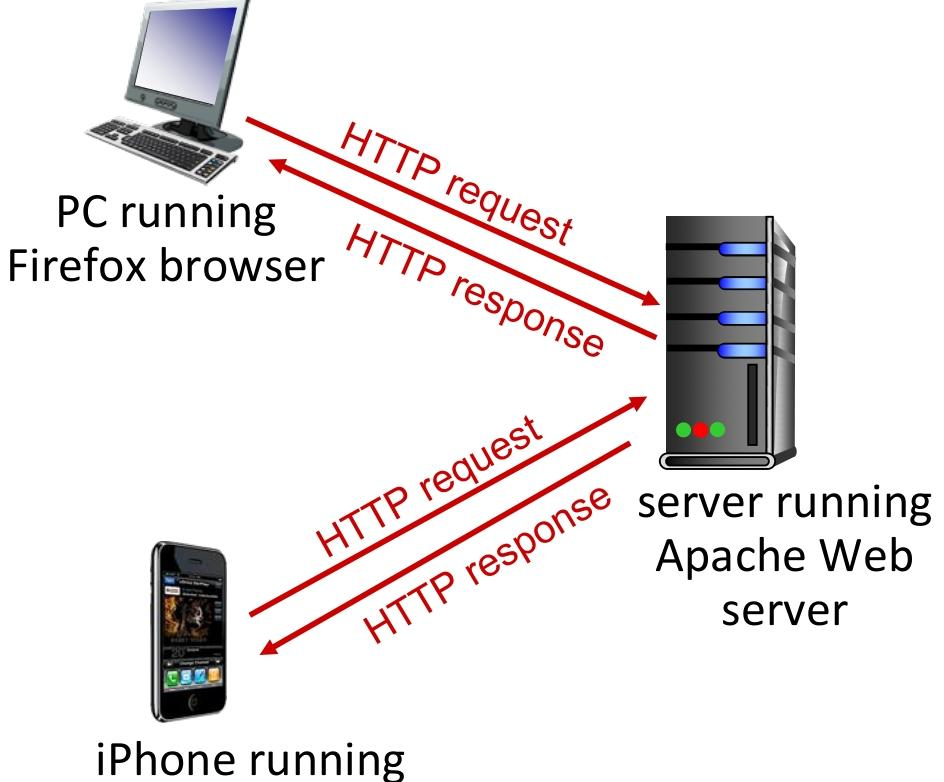

> 客户端向服务器发送`HTTP request（HTTP请求）`，服务器返回`HTTP response（HTTP响应）`，如此完成一次资源传输。


#### [5.1.1] HTTP 底层传输

HTTP 依赖 **TCP（传输控制协议）** 来实现可靠的数据传输，流程如下：

1. 客户端**主动**发起 TCP 连接，向服务器的**80 端口**（HTTP 默认端口）创建 Socket 。
2. 服务器接受该 TCP 连接。
3. 客户端和服务器通过 TCP 连接**交换** HTTP 消息（请求和响应）。
4. 消息交换完成后，TCP 连接关闭。

**建立80、接受、传输、关闭。**

<a id="stateless_http"></a>

#### [5.1.2] HTTP 的无状态特性

**Stateless Nature of HTTP**

- 服务器**不保存任何关于客户端过往请求的信息**。
  - 例如，你第一次访问某网站和第十次访问该网站，服务器不会因为 “记得你之前来过” 而改变响应逻辑 $——$ 每次请求都是独立的。
- 补充说明：维持 “状态” 的协议将会很复杂（如需要保存历史记录、处理客户端 / 服务器崩溃后的状态一致性问题），而 HTTP 的无状态设计让协议更简单、易扩展。


HTTP 本身无状态，要维持状态需从两方面入手：

- 在协议端点（At Protocol Endpoints）：在客户端 / 服务器的 “端点”（如浏览器和 Web 服务器）上，跨多次交互保存状态。
- 在消息中（In Messages）：通过 HTTP 消息中的 **[Cookie](#cookies)** 携带状态信息，实现客户端与服务器的状态同步。


<a id="two_type_of_http_connection"></a>

### [5.2] HTTP 连接的两种类型

#### [5.2.1] 非持久 HTTP

1. **建立 TCP 连接**：客户端先与服务器建立一条 TCP 连接。
2. **传输单个对象**：在这条 TCP 连接上，最多只传输**一个对象**（比如一张图片、一个 HTML 文件）。
3. **关闭 TCP 连接**：传输完成后，TCP 连接关闭。
4. **多对象需多连接**：如果要下载多个对象（比如一个网页包含 HTML、图片、音频等多个资源），就需要建立**多个 TCP 连接**，每个连接只传一个对象。


**非持久HTTP的响应时间**

首先明确 **RTT（Round-Trip Time，往返时间）** 的定义：一个小包从客户端到服务器再返回客户端的时间。

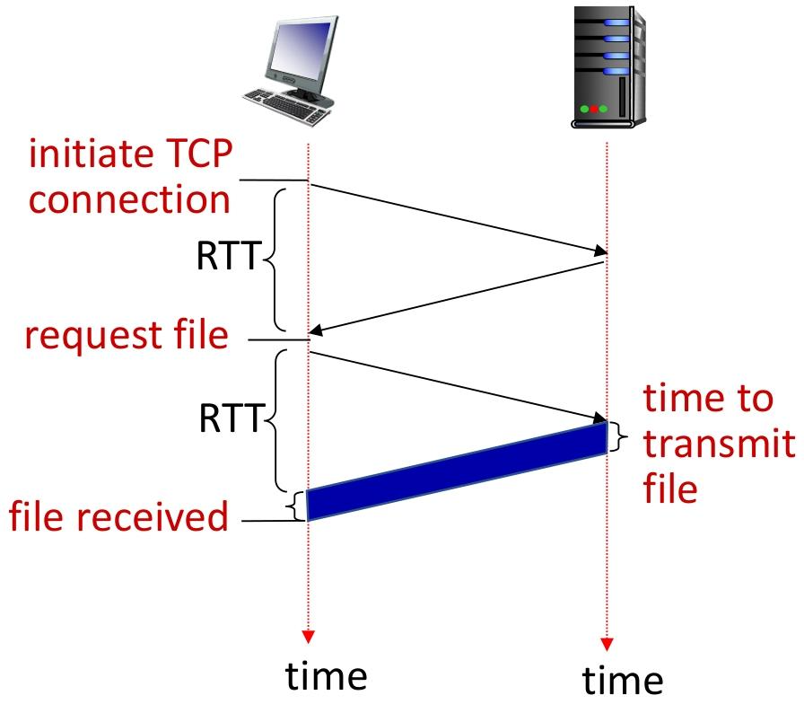

非持久 HTTP 传输单个对象的响应时间由三部分组成：

1. **建立 TCP 连接的 RTT**：客户端发起 TCP 连接，服务器确认，耗时 1 个 RTT。
2. **HTTP 请求 - 响应的 RTT**：客户端发送 HTTP 请求，服务器返回响应的前几个字节，耗时 1 个 RTT。
3. **对象传输时间**：服务器将完整对象（如文件）传输给客户端的时间。

因此，**非持久 HTTP 的响应时间公式为：==2RTT + 文件传输时间==**。


示例：

用户访问 URL `www.someSchool.edu/someDepartment/home.index`（该网页包含 1 个 HTML 文件和 10 张 JPEG 图片），流程如下：

**步骤 1-5：传输 HTML 文件**

1. **建立 TCP 连接**：
   - 客户端向服务器的 80 端口发起 TCP 连接。
   - 服务器接受 TCP 连接，通知客户端。
2. **发送 HTTP 请求**：客户端通过 TCP 连接发送包含 URL 的 HTTP 请求，请求 HTML 文件。
3. **服务器返回响应**：服务器接收请求，生成包含 HTML 文件的响应消息，通过 TCP 连接发送给客户端。
4. **关闭 TCP 连接**：服务器发送完 HTML 后，关闭 TCP 连接。
5. **客户端处理 HTML**：客户端接收并显示 HTML，解析后**发现其中引用了 10 张 JPEG 图片。**

**步骤 6：传输 10 张图片（重复步骤 1-5）**

- 对于每一张 JPEG 图片，客户端都要 **重复执行“建立 TCP 连接→发送请求→接收响应→关闭连接”** 的流程，总共需要为 10 张图片建立 10 次独立的 TCP 连接。


**总结：非持久 HTTP 的核心特点**

- 每次只传输**一个对象**就关闭 TCP 连接。
- 传输多个对象时，需要建立**多个独立的 TCP 连接**，导致额外的 RTT 开销（每次都要花 2RTT 建立 / 处理连接），这也是它相比持久 HTTP“效率较低、延迟较高” 的根本原因。


#### [5.2.2] 持久 HTTP

1. **建立 TCP 连接**：客户端与服务器建立一条 TCP 连接。
2. **复用连接传多对象**：在这**同一条 TCP 连接**上，可以传输**多个对象**（比如一个网页的 HTML、图片、音频等资源都通过这一条连接传输）。
3. **按需关闭连接**：所有对象传输完成后，TCP 连接才会关闭。


> 你知道吗？
>
> 现在，`HTTP/1.1`采用持久HTTP；`HTTP/2`、`HTTP/3` 则是在持久HTTP基础上进一步优化。
>
> 但是老旧的系统使用`HTTP/1.0` 这种就是非持久 HTTP。
>
> 简言之，现代 Web 应用（基于 HTTP/1.1 及以上）几乎都默认使用持久 HTTP，非持久连接仅在少数兼容或特殊场景中存在。


HTTP 有两种核心消息类型：**请求（request）**和 **响应（response）**

### [5.3] HTTP 请求报文

HTTP Request **Message（报文）**

HTTP 请求消息是**ASCII 格式**（人类可读），由三部分组成：

---

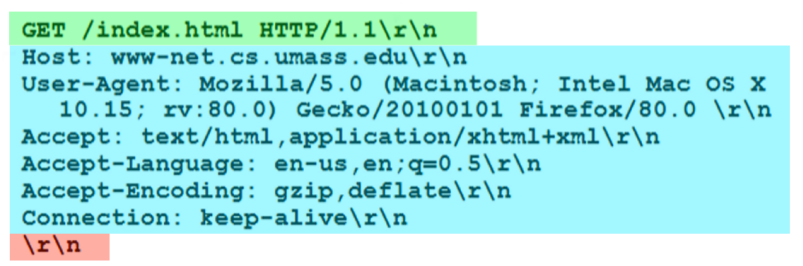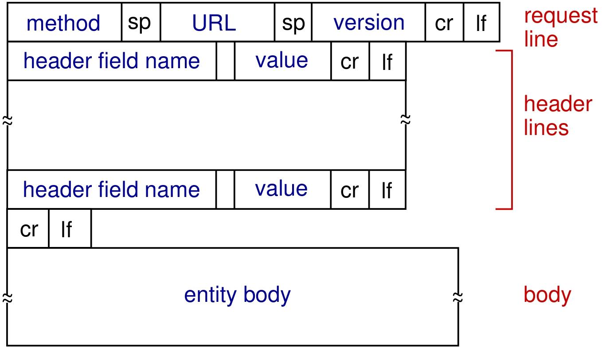

---

- **请求行（Request Line）**
  - `GET`：请求方法（常见的还有 `POST`、`HEAD` 等），表示 “获取资源”
  - `/index.html`：请求的资源路径（服务器上的文件路径）
  - `HTTP/1.1`：HTTP 协议版本
  - `\r\n`：回车换行符，用于分隔请求行和后续的头部行

- **头部行（header lines）**
  - `Host: www-net.cs.umass.edu\r\n`：指定请求的服务器主机名。
  - `User-Agent: Mozilla/5.0...\r\n`：标识发起请求的客户端（浏览器类型、版本等）。
  - `Accept: text/html,application/xhtml+xml\r\n`：客户端可接受的响应内容类型。
  - `Accept-Language: en-us,en;q=0.5\r\n`：客户端偏好的语言。
  - `Accept-Encoding: gzip,deflate\r\n`：客户端可接受的压缩编码方式。
  - `Connection: keep-alive\r\n`：表示希望保持 TCP 连接（持久连接）。

- **头部结束标记**
  - 一个单独的`\r\n`（回车换行符），表示头部行结束，若有请求体（如 `POST` 请求的表单数据），则紧跟在该标记之后。


| HTTP请求方法 | 功能描述                                 | 数据位置                                     | 典型场景                                                     | 注意事项                                        |
| ------------ | ---------------------------------------- | -------------------------------------------- | ------------------------------------------------------------ | ----------------------------------------------- |
| `POST`       | 向服务器提交数据（如表单内容）           | 包含在请求消息的**实体体（entity body）** 中 | 提交登录信息、订单数据、用户注册表单等                       | 数据不暴露在URL中，适合传输敏感信息，安全性较高 |
| `HEAD`       | 仅请求资源的头部元信息（不返回实际内容） | -                                            | 快速获取文件大小、修改时间等元信息，减少带宽消耗             | 不返回资源主体，仅用于获取头部信息              |
| `GET`        | 向服务器传递查询数据                     | 附加在URL中（跟在“?”之后，作为查询参数）     | 搜索引擎搜索<br />（如`www.baidu.com/s?wd=计算机网络&ie=utf-8`） | 数据暴露在URL中，不适合传输敏感信息（如密码）   |
| `PUT`        | 向服务器上传或替换文件                   | 包含在请求消息的实体体中                     | 开发者上传新网页资源、更新服务器上的文件内容                 | 会完全替换指定URL下的已有文件                   |


### [5.4] HTTP 响应报文

HTTP Response Message

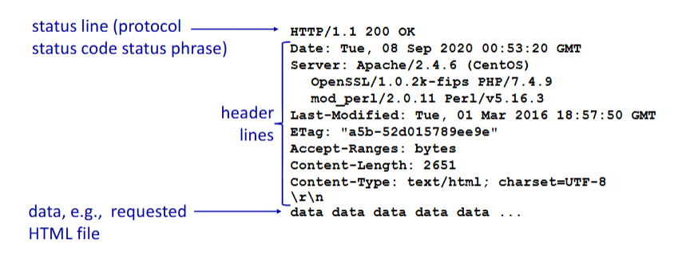

一些常见的状态码：

| 状态码 | 状态描述                   | 含义说明                                                     |
| ------ | -------------------------- | ------------------------------------------------------------ |
| 200    | OK                         | 请求成功，请求的资源会在消息后续部分返回                     |
| 301    | Moved Permanently          | 请求的资源已永久迁移，新的位置会在消息的`Location:`字段中指定 |
| 400    | Bad Request                | 服务器无法理解客户端发送的请求消息                           |
| 404    | Not Found                  | 服务器上未找到请求的文档                                     |
| 505    | HTTP Version Not Supported | 服务器不支持请求中使用的HTTP协议版本                         |


状态码分为不同类别（如2xx表示成功，3xx表示重定向，4xx表示客户端错误，5xx表示服务器错误），表格中为部分示例。


<a id="cookies"></a>

### [5.5] Cookies

Cookie 如何让**[无状态的 HTTP](#stateless_http)** 协议具备 “记忆能力”，具体分为**四个组件**和**实际流程**：

#### [5.5.1] Cookies 的四个组件

1. **HTTP 响应中的 Cookie 头部行**

   - 你第一次访问某电商网站（如www.shop.com）并点击 “登录”，输入账号密码后，服务器验证通过，会在 HTTP 响应中添加：
     ```plaintext
     Set-Cookie: user_id=12345; expires=...; path=/
     ```

     这里的`user_id=12345`就是服务器生成的唯一 Cookie 标识，用于关联你的账号。

2. **后续 HTTP 请求中的 Cookie 头部行**：

   - 你后续浏览该网站时，每次发送 HTTP 请求（如点击 “查看商品详情”），浏览器都会自动在请求中带上：
     ```plaintext
     Cookie: user_id=12345
     ```

     服务器通过这个 Cookie，就能识别出你是 “用户 12345”。

3. **用户主机上的 Cookie 文件**：

   - 你的浏览器（如 Chrome）会在本地存储一个 Cookie 文件，其中会记录：
     ```plaintext
     网站：www.shop.com
     Cookie：user_id=12345; 过期时间=...
     ```

     即使你关闭浏览器，这个文件也会保留（直到过期或被清除）。

4. **网站的后端数据库**：

   - 电商网站的后端数据库中，会有一条记录关联user_id=12345和你的信息：
     ```plaintext
     user_id: 12345
     用户名：XXX
     购物车：商品A、商品B
     浏览历史：...
     ```

     当你再次访问时，服务器通过 Cookie 查到user_id=12345，就能从数据库中调取你的购物车和偏好，实现 “记住你” 的效果。


#### [5.5.2] 实际流程示例

1. **首次访问**：你第一次用笔记本浏览器访问某电商网站，服务器会：

   - 生成一个**唯一 ID（即 Cookie）**（比如`1678`）。

   - 在后端数据库中为该 ID 创建一条记录（存储 Susan 的后续行为、偏好等）。

   - 通过 HTTP `RESPONSE`的`Set-Cookie: 1678`头部，将 Cookie 发送给你的浏览器。

   - 浏览器将该 Cookie（`1678`）存储到本地 Cookie 文件中。

     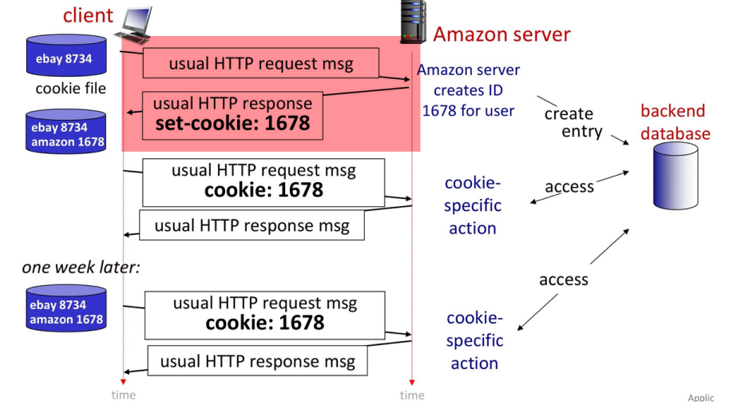

2. **后续访问**：

   - 你之后再访问该电商网站时，浏览器会在 HTTP 请求中带上`Cookie: 1678`头部
   - 服务器通过该 Cookie 值，在后端数据库中找到对应的用户记录，从而 “识别” 出你，实现个性化服务（如显示历史订单、推荐商品等）

   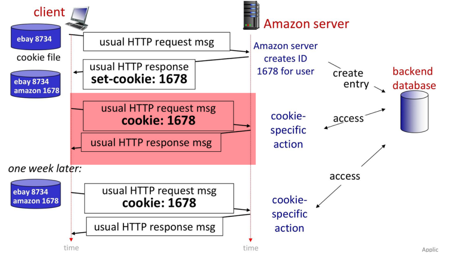

3. **长期有效**：

   - 即使一周后访问，浏览器仍会携带 Cookie`1678`，服务器也能通过它识别你，维持状态

     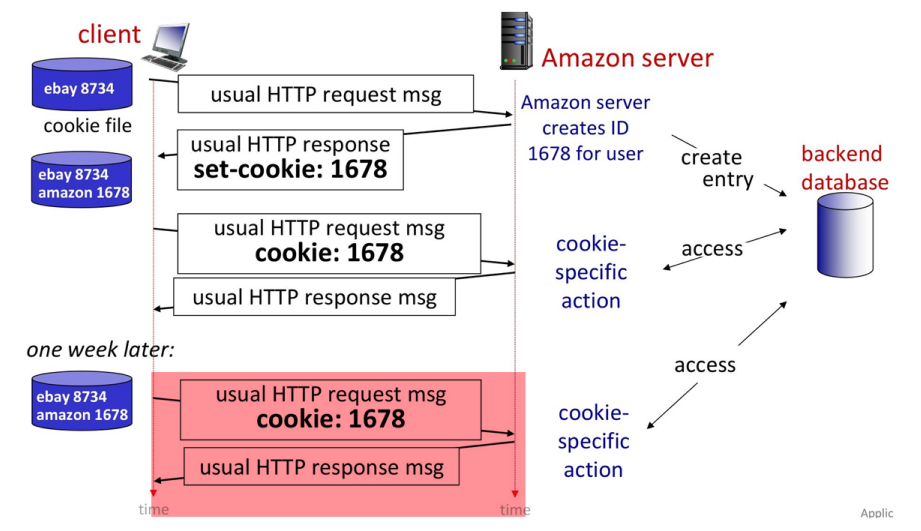

### [5.6] Web Cache

Web缓存，又名代理服务器（Proxy Server）。

**目标**：在不涉及源服务器（Origin Server）的情况下满足客户端请求，提升访问效率。

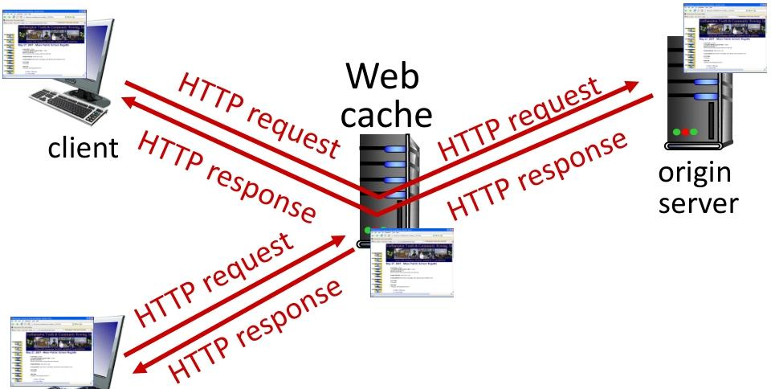

#### [5.6.1] Web 缓存工作流程

1. 用户将浏览器配置为指向本地 Web 缓存。
2. 浏览器将所有 HTTP 请求发送到缓存。
3. **若缓存中有请求的对象**：缓存直接将对象返回给客户端。
4. **若缓存中无请求的对象**：缓存向源服务器请求该对象，将其缓存后，再返回给客户端。


服务器会通过响应头部告知缓存对象的可缓存规则，例如：

- `Cache-Control: max-age=<seconds>`：指定对象在缓存中可保留的最长时间（秒数）。
- `Cache-Control: no-cache`：指示缓存不得直接使用该对象，需向源服务器验证后再使用。


#### [5.6.2] Web 缓存的价值

简单来讲，就是你本地缓存了，就不需要再向服务器要资源了。这肯定是减少网络带宽的。

因此，Web 缓存也叫做 **代理服务器（Proxy Server）**

- **减少客户端请求的响应时间**：缓存通常更靠近客户端，无需绕远路向源服务器请求，提升访问速度。
- **减少机构接入链路的流量**：若一个机构内多个用户请求同一资源，缓存可直接提供，避免重复向互联网请求，节省带宽。
- **提升内容交付效率**：互联网中广泛分布的缓存，让资源提供方（即使是 “小型” 内容提供商）也能更高效地交付内容。


#### [5.6.3] 条件 GET缓存机制


核心是：未更新的资源不用传输，这样减少带宽。

工作流程：

1. 缓存（cache）的请求
   - 缓存在 HTTP 请求中添加头部 `If-modified-since: <date>`，指定自己缓存的资源最后修改时间。

2. 服务器（server）的响应

   - **若资源未更新**：服务器返回 `HTTP/1.0 304 Not Modified`，表示缓存中的版本已是最新，无需传输资源。

   - **若资源已更新**：服务器返回 `HTTP/1.0 200 OK` 并**附带最新资源数据**。

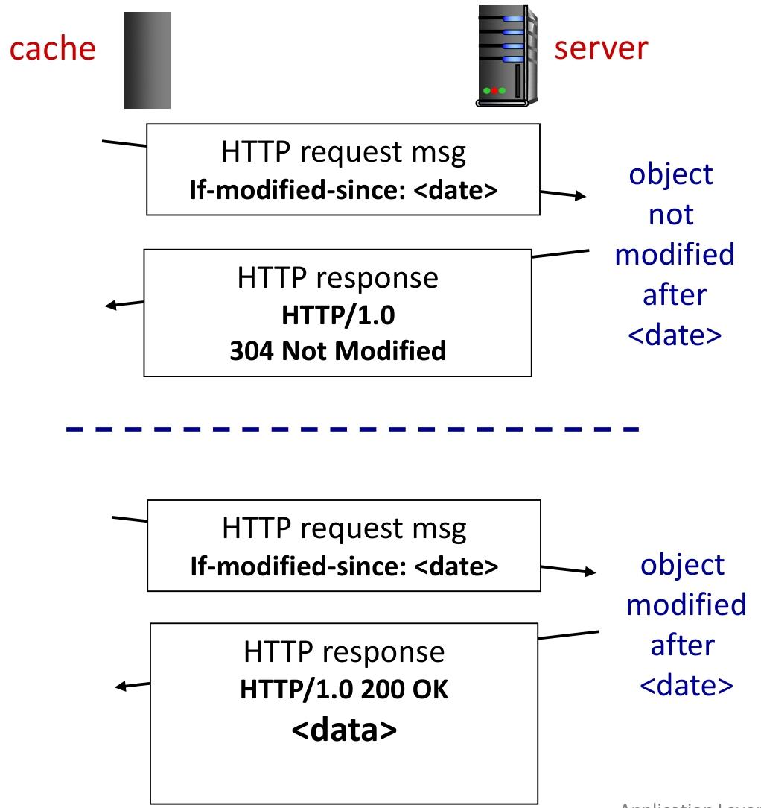

## [6] Email

Email是由3个部分组成的：

1. **用户代理（User Agent）**
   - 其实就是你写邮件的地方，比如Gmail、Outlook等。
   - 收发邮件会存储在邮件服务器上，而非仅在本地。
2. **邮件服务器（Mail Servers）**
   - 包含**用户邮箱（mailbox）**：存储用户的**收件。**
   - 包含**待发消息队列（message queue）**：存储待发送的邮件，直到成功投递。
3. **简单邮件传输协议（SMTP）**
   - 传输邮件的协议，负责邮件的 “发送” 。


过程是怎么样的呢？

1. 用户先用**用户代理（User Agent）**比如Gmail写一个邮件

2. 邮件先发送到自己的**邮件服务器**的 “待发队列” 中（比如你用的是Gmail的服务器）

   >  To Be Sent Queue

3. 发送方邮件服务器通过**SMTP 协议**，将邮件转发到接收方的邮件服务器（比如发送到学校服务器）

4. 接收方的邮件服务器将邮件存入对应用户的**邮箱**，用户再通过自己的**用户代理**读取邮件。

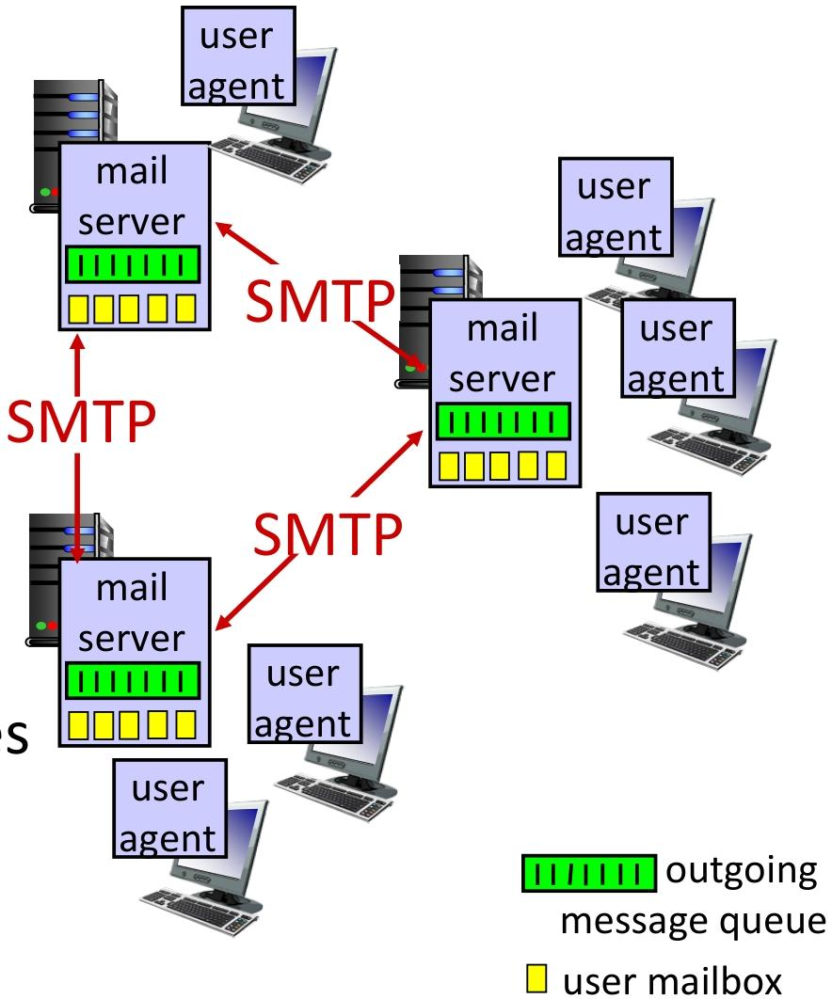

### [6.1] SMTP RFC 5321

SMTP（简单邮件传输协议）是邮件服务器之间传输邮件的核心协议。

比如现在我用Gmail（使用Gmail服务器）写邮件给UoL学校，SMTP其工作机制如下：

- **基于 TCP 可靠传输**
  - **使用 TCP 协议**（端口 `25`）实现邮件的可靠传输，发送方Gmail服务器**主动向**接收方UoL服务器（作为 SMTP 服务器）发起**连接**。
- **直接传输模式**
  - Gmail服务器直接与UoL服务器通信，完成邮件转发。
- **传输三阶段**：
  - **SMTP 握手（Handshaking/ Greeting）**
    - 双方建立连接后，通过 “`HELO`” 等命令完成身份问候（如示例中 “220”“HELO”“250 Hello” 的交互）。
  - **邮件传输 Message Transfer**
    - 正式传递邮件内容。
  - **连接关闭 SMTP Closure**
    - 传输完成后关闭连接。
- **命令 - 响应交互（Command-response Connection）**
  - 类似 HTTP，SMTP 通过 ASCII 文本命令（如 HELO、MAIL FROM、RCPT TO 等）和状态码响应（如 250 表示成功）实现通信。


大概就是这样子的：

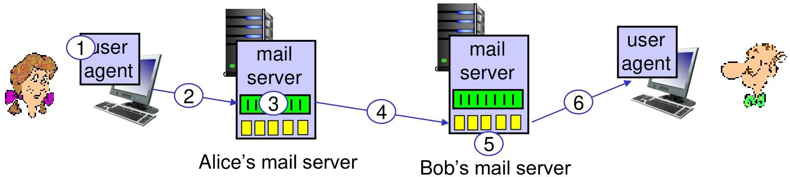

### [6.2] SMTP 交互

**具体看 [Week2Tutorial.md](Week2Tutorial.md)**

### [6.3] HTTP 和 SMTP 对比

- HTTP是客户端**拉取（Client Pull）**，SMTP是客户端**推送（Push）**

- 两者都采用**ASCII 格式的**

- 都通过**状态码（Status Code）**反馈结果（如 SMTP 的 `250`、HTTP 的 `200` 等）

- 资源封装不同：

  - HTTP 的每个资源都封装**在独立的响应消息中**

  - SMTP的多个对象（如带附件的邮件）可封装在 **多部分消息（multipart message）** 中传输。

    > 解释如下：
    >
    > ### HTTP：每个资源独立封装在响应消息中
    >
    > HTTP 是 “**一资源一响应**” 的模式。比如你访问一个网页，页面里的 HTML 文档、每张图片 都会作为**独立的资源**，由服务器分别封装在不同的 HTTP **响应消息（Response Message）**中返回给客户端。
    >
    > 举个例子：打开一个包含 1 个 HTML 页面、2 张图片的网站，客户端会收到 3 条独立的 HTTP 响应 ——1 条对应 HTML，2 条分别对应两张图片。每个响应都有自己的请求 - 响应周期，相互独立。
    >
    > 不过！你还记得HTTP的[持久和非持久吗](#two_type_of_http_connection)？这容易混淆。
    >
    > 这里的 HTTP 特性描述**与 “持久 / 非持久连接” 无关**，是从**资源封装的维度**对比 HTTP 和 SMTP，无论 HTTP 是持久连接还是非持久连接，“每个资源独立封装在响应消息中” 这一逻辑都成立。
    >
    > ### SMTP：多部分消息（multipart message）封装多个对象
    >
    > SMTP 是 “**一消息多对象**” 的模式。当邮件包含多个对象（比如正文 + 附件）时，SMTP 会把这些对象**打包在同一个邮件消息里**，用 “多部分消息” 的格式分隔。
    >
    > 比如你发送一封带 Word 附件的邮件，邮件的 “头部（收件人、主题等）”“正文内容”“Word 附件” 会被封装在**同一个 SMTP 消息**中，通过边界标识（如 `--boundary`）区分不同部分。这样只需一次 SMTP 传输，就能把所有关联对象（正文 + 附件）发送给收件人。

此外，SMTP：

- SMTP还采用持久连接（Persistent Connection）：一次 TCP 连接可传输多封邮件。
- 要求消息（头部和正文）必须是**7 位 ASCII 格式**。
- 服务器通过`CRLF.CRLF`（回车换行 + 回车换行）判断邮件消息的结束。


**头部（header）**：包含邮件的元信息，如：

- `To:`：收件人地址。

- `From:`：发件人地址。

- `Subject:`：邮件主题。

  >  注意：这些头部字段与 SMTP 协议中的`MAIL FROM`、`RCPT TO`命令**不同**，是邮件**内容里的元信息**。

**正文（body）**：邮件的实际内容，仅支持 ASCII 字符。

**空行（blank line）**：用于分隔头部和正文。


```
To: friend@example.com  // 收件人（邮件内容里的元信息）
From: you@yourdomain.com  // 发件人（邮件内容里的元信息）
Subject: 周末聚会照片  // 邮件主题（邮件内容里的元信息）
```

但是如下的这种是SMTP 命令

```sql
HELO alice
MAIL FROM: <sender@example.com>
RCPT TO: <receiver@example.org>
DATA
SUBJECT: Hello

Hi Bob, How's the weather? Alice.1523
.
QUIT
```

这种SMTP不会出现在邮件里面，只是用于服务器交互的。


## [7] DNS

DNS - Domain Name System 域名系统


- 对于互联网中的主机 / 路由器：
  - 用 **IP 地址（32 位）** 标识，用于数据报的寻址（机器间通信的 “数字地址”）。
  - 用 **域名（如 `cs.umass.edu`）** 标识，方便人类记忆和使用（机器的 “易读名称”）。
- 问题：**如何在 IP 地址和域名之间相互映射**？


DNS 提供以下核心服务：

- **主机名到 IP 地址的翻译**：最基础功能，将易记的域名（如`www.baidu.com`）转换成 IP 地址（如`180.101.50.212`）。
- **主机别名**：支持 “规范名（Canonical Name）” 和 “别名（Alias Names）” 的映射，比如一个主机可以有多个别名，统一指向其规范名。
- **邮件服务器别名**：为邮件服务器提供别名映射，方便邮件系统的灵活配置。
- **负载分配**：支持多 IP 对应一个**域名（Domain Name）**，比如大型网站的多台冗余服务器可以共享同一个域名，实现流量负载均衡（如复制的 Web 服务器，一个域名对应多个 IP 地址）。

​	

**为什么 DNS 不采用中心化设计**

如果把 DNS 设计成中心化（只有一个中心数据库），会存在以下致命问题：

- **单点故障**：中心数据库一旦故障，整个互联网的域名解析都会瘫痪。
- **流量压力**：全球 DNS 查询量极大（如 Comcast 的 DNS 服务器每天处理 6000 亿次查询，Akamai 的 DNS 服务器每天处理 2.2 万亿次查询），中心化数据库无法承载如此大的流量。
- **距离问题**：中心化数据库距离全球用户过远，会导致解析延迟极高。
- **维护难题**：中心化数据库的维护成本和复杂度会高到无法管理。

所以 DNS 必须采用分布式、层级化的结构设计。

### [7.1] DNS 层级化结构

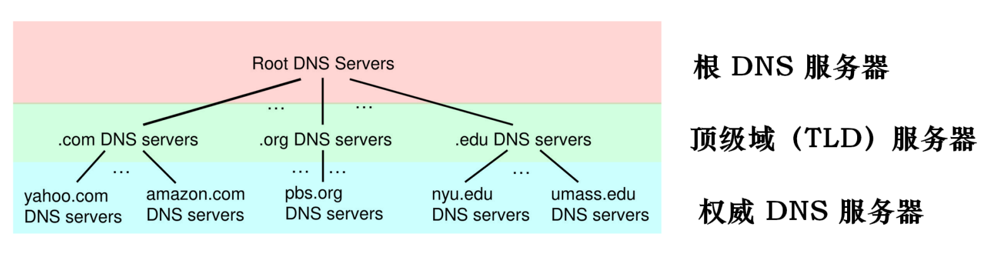

`Root DNS Servers` --> `Top Level Domain` -->`Authoritative DNS Servers`


- **根 DNS 服务器（Root DNS Servers）**：是整个 DNS 系统的 “顶层”，负责管理顶级域（如.com、.org、.edu 等）的服务器地址。
- **顶级域（TLD）服务器**：按域名后缀分类（如.com、.org、.edu），负责管理其下二级域名的服务器地址。这里包含很多顶级国家域名，比如`.cn`、`.uk`等。顶级域是不同的顶级域机构负责管理的。
- **权威 DNS 服务器（Authoritative DNS Servers）**：负责存储具体域名（如`amazon.com`、`umass.edu`）的 IP 映射信息，是域名解析的 “最终数据源”。权威DNS服务器是某个组织自己的DNS服务器，一般是自己管理的。


> 举个例子：
>
> 我们以查询`www.taobao.com`的IP地址为例，完整走一遍DNS的层级解析流程：
>
> #### 根DNS服务器（Root DNS Servers）
>
> 你在浏览器输入`www.taobao.com`后，本地DNS客户端首先向**Root DNS Server**发起查询：
>
> - “请问，负责`.com`这个顶级域的服务器在哪里？”r
> - **Rooot DNS Server**会返回所有`.com` **Top Level Domain**服务器的地址列表。
>
>
> #### 顶级域（TLD）服务器
> 本地DNS客户端接着向其中一台`.com`顶级域服务器发起查询：
>
> - “请问，`taobao.com`这个**Authoritative DNS Server**在哪里？”
> - `.com`服务器会返回`taobao.com` **Authoritative DNS Server**的地址。
>
>
> #### 权威DNS服务器（Authoritative DNS Server）
> 本地DNS客户端最后向`taobao.com`的**Authoritative DNS Server**发起查询：
> “请问，`www.taobao.com`对应的IP地址是什么？”
> 权威服务器会直接返回`www.taobao.com`的IP地址（比如假设是`111.206.212.33`）。
>
>
> 这样，你的浏览器就通过这三级DNS服务器的协作，成功拿到了`www.taobao.com`的IP地址，进而可以建立连接访问网站了。


当主机（如你的电脑、手机）发起 DNS 查询时，请求会被发送到它的**本地 DNS 服务器**。本地 DNS 服务器是用户设备与 DNS 层级体系之间的 “中介”。

本地 DNS 服务器的响应来源有两种：

- **本地缓存**：如果它缓存了近期的 “域名 - IP 映射对”，会直接从缓存返回结果（但缓存可能过期）。
- **转发请求**：如果缓存中没有，会将请求转发到 DNS 层级体系（根服务器→TLD 服务器→权威服务器）进行解析，再将结果返回给主机。

- 每个互联网服务提供商（ISP）都有自己的本地 DNS 服务器。要查询自己的本地 DNS 服务器，可通过以下方式：
  - MacOS：在终端执行 `scutil --dns`。
  - Windows：在 CMD 执行 `ipconfig /all`。
- 本地 DNS 服务器**不属于 DNS 层级体系的严格组成部分**，它是 ISP 提供的 “**接入层（Access Layer）**” 服务，用于简化用户的 DNS 查询流程

> 域名 - IP 映射对： Domain Name-IP Address Mapping Pair
>
> 本地 DNS 服务器**不属于 DNS 层级体系的严格组成部分**，它是 ISP（互联网服务提供商） 提供的 “接入层” 服务，用于简化用户的 DNS 查询流程。


全球有**13 个逻辑上的根域名服务器**（通过字母 A 到 M 标识），但每个 “逻辑服务器” 都进行了大量的物理复制（比如仅美国就有近 200 台复制服务器），通过全球分布式部署保障可靠性和访问速度。这个比较难理解，记住就好。

根域名服务器的管理：**ICANN**（Internet Corporation for Assigned Names and Numbers）互联网名称与数字地址分配机构


### [7.2] DNS 迭代查询 

DNS Iterated Query

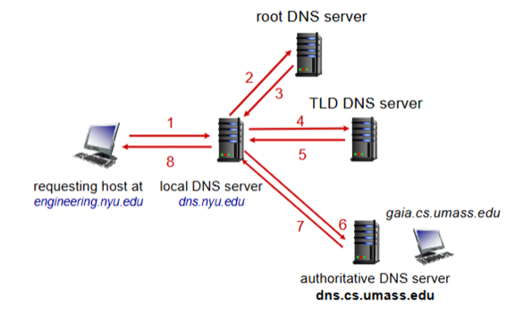

简而言之就是一级一级看！从 Root DNS Server，到 TLD DNS Server 最后到 Authoritative DNS Server。

也就是，当你本地的运营商 DNS 服务器无法解析某个域名的时候，就会求助**Root DNS Server**，这是一个最终的求助方案！


#### [7.2.1] 迭代查询的关键特点

- 每一步中，被查询的服务器会明确告知 “下一个该问谁”（例如根服务器会说 “我不知道这个域名，但你可以问.edu TLD 服务器”）。
- 整个过程由本地 DNS 服务器主动发起并迭代访问各层级服务器，直到获取结果。


### [7.3] DNS 缓存机制

- **缓存的触发与作用**：任何域名服务器一旦学习到 “域名 - IP 映射”，就会将其缓存，并在后续查询中**直接返回缓存结果**，以此**提升响应速度**。这就是所谓的Caching。
- **缓存的时效性**：缓存条目会在 “**生存时间（TTL，Time To Live）**” 到期后失效（消失）。例如，TLD 服务器的信息通常会在本地域名服务器中被缓存。
- **缓存的局限性**：缓存条目可能**过期（out-of-date）**。如果某主机的 IP 地址发生变更，全球范围内可能要等到所有缓存的 TTL 都过期后，新的 IP 映射才会被全网知晓。这也意味着 DNS 是 “**尽力而为（best-effort）**” 的域名 - IP 翻译服务。

> 缓存局限性的解释：
>
> 假设某网站 `www.old-site.com` 的 IP 原本是 `1.1.1.1`，后来因为服务器迁移，IP 变更为 `2.2.2.2`。
>
> - 此时，全球各地的 DNS 服务器里可能还缓存着 `www.old-site.com → 1.1.1.1` 这个映射（因为缓存的 TTL 还没到期）。
> - 所以，**部分用户会继续被引导到旧 IP（1.1.1.1）**，直到这些缓存的 TTL 全部过期，新的 IP（2.2.2.2）才会被全网的 DNS 服务器重新学习并缓存。
>
> 因此，DNS 并不能保证实时更新的。

### [7.4] DNS 资源记录

DNS Resource Record （DNS RR）

DNS 是一个存储 “资源记录（Resource Records, RR）” 的**分布式数据库**，每条 RR 的格式为 `(name, value, type, ttl)`，不同类型的 RR 承担不同功能：

| 类型       | 含义说明                                                     | 作用                                       | 示例                                                         |
| ---------- | ------------------------------------------------------------ | ------------------------------------------ | ------------------------------------------------------------ |
| type=A     | `name` 是主机名，`value` 是对应的 IP 地址                    | 实现主机名到 IP 地址的直接映射             | `name: www.baidu.com`，`value: 180.101.50.212`               |
| type=NS    | `name` 是域名，`value` 是该域名的**权威域名服务器**的 Host Name | 指定某个域名由哪台权威服务器负责解析       | `name: foo.com`，`value: dns.foo.com`（表示`foo.com`的权威服务器是`dns.foo.com`） |
| type=CNAME | `name` 是别名，`value` 是对应的规范名（真实名称）            | 实现主机别名映射，多个别名指向同一真实主机 | `name: www.ibm.com`，`value: servereast.backup2.ibm.com`     |
| type=MX    | `value` 是与域名关联的 SMTP 邮件服务器名称                   | 指定处理该域名邮件的邮件服务器             | `name: gmail.com`，`value: mail.google.com`（表示`gmail.com`的邮件由`mail.google.com`处理） |


简言之，DNS 缓存通过 “临时存储映射关系” 加速解析，而资源记录则通过不同类型的 RR（`A`、`NS`、`CNAME`、`MX` 等），实现了域名到 IP、服务器到域名、别名到真实名称、邮件服务器映射等多种核心功能。


## [8] P2P

P2P - Peer-to-Peer Architecture 对等网络架构

### [8.1] P2P 架构的核心特点

- **无始终在线的服务器**：不依赖中心化的服务器提供服务，所有节点（端系统）地位平等。
- **任意端系统直接通信**：参与的 “对等方（**peers**）” 之间可以**直接建立连接**，无需经过中心服务器转发。
- **对等方互供服务**：节点既可以向其他节点请求服务（如下载文件），也会向其他节点提供服务（如分享自己的文件资源）。


### [8.2] P2P 的扩展性与复杂性

- **自扩展性（Self Scalability）**：新节点加入时，既会带来新的服务需求（如请求资源），也会带来新的服务能力（如提供资源），系统可随节点数量增长自然扩展。
- **连接的间歇性与 IP 动态性**：节点可能**时连时断**，且 IP 地址可能变化，这导致 P2P 网络的管理较为复杂（需解决节点发现、资源定位等问题）。


最典型的就是 **BitTorrent**，迅雷。你肯定用过。


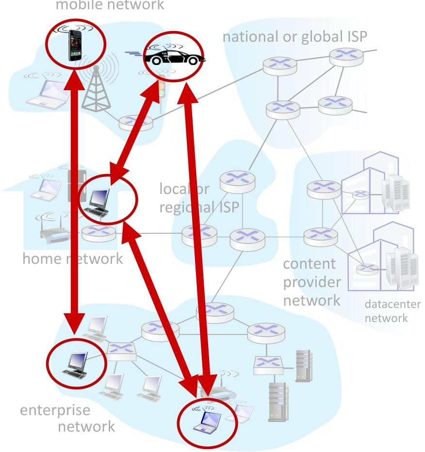


### [8.3] P2P 有意思的点

将一个大小为`F`的文件从 1 台服务器分发给`N`个对等方（peers），需要多少时间？

在**客户端 - 服务器架构（Client Server Architecture）**中，所有**文件副本（File Copies）**都由**中心化（）**的服务器依次发送

1. **服务器的传输时间**：

   服务器需要依次向`N`个对等方发送`N`份文件副本。

   - 发送 1 份副本的时间是 `F/u_s`（`u_s`是服务器的上传带宽，上传给每个客户端）。
   - 发送`N`份副本的总时间是 `N×F/u_s`。

2. **客户端的下载时间**：

   每个客户端必须下载完整的文件副本，其中下载速度最慢的客户端（即`d_min = min(d_1, d_2, ..., d_N)`，`d_i`是第`i`个客户端的下载带宽）决定了最小下载时间，为 `F/d_min`。

3. **总分发时间**：

   客户端-服务器架构的总分发时间由“服务器的总上传时间”和“最慢客户端的下载时间”中**较大的那个**决定，即：
   $$
   D_{c-s} \geq \max\left\{\dfrac{F}{d_{\min}}, \dfrac{NF}{u_s} \right\}
   $$

   这意味着，当`N`增大时，总时间会**随`N`线性增长**（因为`NF/u_s`项与`N`成正比）。

   （这里发送和下载是并行的所以直接取最大即可）


其实这个公式，不复杂，就是服务器发送N份副本，和客户端下载的意思而已！


**那么 P2P 架构呢？**

在P2P架构中，文件分发不再依赖中心化服务器单独提供所有副本，而是通过**对等方之间互相分享资源**来完成，关键要点如下：

- 首先，**服务器会先给其中一个 Peer 上传 1 份完整的文件副本**。
- 之后，这个已经拿到完整文件的 Peer，会把文件**分割成多个小片段**（比如把一个大文件分成几百个小 “块”），然后**同时向其他多个 Peer 分享这些片段**。比如分享给BCD的同时、BCD也会分享给其他Peer。
- 其他 Peer 在下载时，会从不同的 Peer 那里获取不同的片段，最后把这些片段**拼接起来**，就得到了完整的文件副本。


1. **服务器的传输时间**
   服务器至少需要上传**1份文件副本给一个Peer**（后续由对等方之间互相分享），因此发送1份副本的时间为 `F/u_s`（`u_s`是服务器的上传带宽）。然后这个Peer切分文件。

2. **客户端的下载时间**
   每个客户端仍需下载完整的文件副本，其中最慢客户端的下载时间为 `F/d_min`（`d_min`是所有客户端中最小的下载带宽）。

3. **对等方的聚合上传能力**
   所有 Peer 的**总上传带宽**（服务器上传带宽`u_s` + 所有对等方的上传带宽之和`Σu_i`）决定了系统的最大下载速率上限。
   因为所有客户端总共需要下载`N×F`大小的文件（`N`个对等方，每个下载`F`大小），所以这部分的时间限制为 `NF/(u_s + Σu_i)`。

**P2P的总分发时间**

P2P架构的总分发时间由以下三者中的最大值决定：
\[
D_{P2P} \geq \max\left\{ \frac{F}{d_{\min}} ,\frac{F}{u_s}, \frac{NF}{u_s + \sum u_i} \right\}
\]

- 第一项 `F/u_s`：服务器至少上传1份副本的时间。
- 第二项 `F/d_min`：最慢客户端的下载时间。
- 第三项 `NF/(u_s + Σu_i)`：系统总上传带宽支撑`N×F`下载量的时间。

**P2P的扩展性优势**

与客户端-服务器架构（时间随`N`线性增长）不同，P2P的第三项 `NF/(u_s + Σu_i)` 中，**对等方的总上传带宽`Σu_i`会随`N`的增加而线性增长**（每个新对等方都带来新的上传能力）。因此，`NF/(u_s + Σu_i)` 项的增长会被“总上传带宽的增长”抵消，使得P2P的分发时间**不会像客户端-服务器那样随`N`线性恶化**，从而具备更好的可扩展性。


简言之，P2P通过“对等方互享资源”的模式，将文件分发的瓶颈从“中心化服务器的上传带宽”转移到“系统总上传带宽（服务器+所有对等方）”，从而实现了更优的可扩展性。

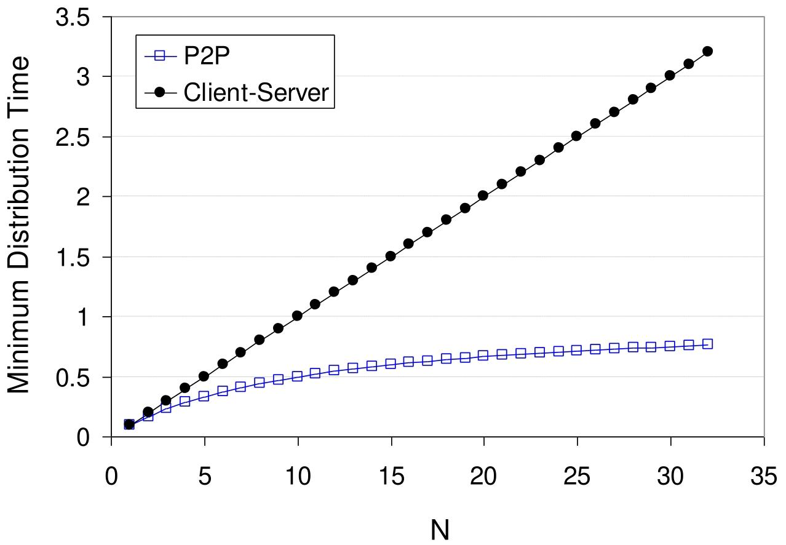


### [8.4] BitTorrent 协议的P2P文件分发机制

- **文件切分**：将文件分割成**256KB 大小的 “块（chunks）”**，便于对等方（peers）之间灵活分享不同片段。
- **Tracker（追踪器）**：一个中心化的小型服务器，负责**跟踪参与同一 “种子（torrent）” 的所有Peers**，并为新加入的对等方提供当前活跃的 Peer 列表。
- **Torrent（种子）**：指一组互相交换同一文件块的Peers群体，是 BitTorrent 网络的 “资源组” 单元。

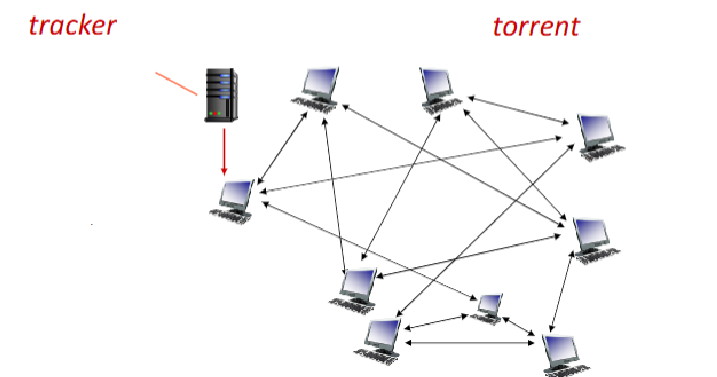

新节点加入的工作流程：

1. **获取 Peer 列表**：新节点向 Tracker 注册，获取当前参与该种子的 Peer 列表。
2. **连接邻居 Peer**：从 Peer 列表中选择一部分节点作为 “邻居（neighbors）”，建立连接。
3. **交换文件块**：初始时 Alice 没有任何文件块，但会通过与邻居 Peer 交换，**逐步积累不同的文件块**，最终拼接成完整文件。


**Peers 的行为与网络特性**

- **边下载边上传**：Peer 在下载文件块的同时，会将自己已有的块**上传给其他 Peer**，实现 “我为人人，人人为我” 的资源共享。
- **动态调整邻居**：Peer 会根据网络状况**动态更换交换块的对象**，以优化下载速度。
- **节点的动态性（Churn）**：Peer 可能随时加入或离开网络（比如用户关机、断网），这种动态性是 P2P 网络的典型特征。
- **完整文件后的选择**：当 Peer 下载完完整文件后，可选择 “自私地离开” 或 “利他地留在网络中继续分享”。


**文件块的请求逻辑（Requesting chunks）**

1. **节点的块分布差异**：在任意时刻，不同 Peer 拥有的文件块子集是不同的（有的 Peer 有块 A、B，有的有块 C、D）。
2. **周期性查询块列表**：Alice（某 Peer）会定期向每个邻居 Peer 询问 “你有哪些块”。
3. **优先请求稀有块**：Alice 会优先请求自己缺少的**最稀有块**（即全网拥有该块的 Peer 最少的块），这样能加速文件的完整度积累，也让整个网络的块分布**更均衡**。


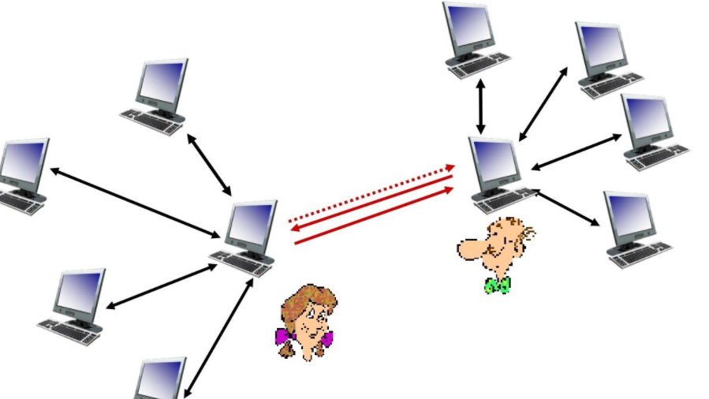


**文件块的发送策略：针锋相对（tit-for-tat）**

这是 BitTorrent 保障 “公平分享” 的关键机制，逻辑如下：

1. **核心规则**：Alice 只会向 “当前以最高速率给她发块的 4 个 Peer” 回传块；其他 Peer 会被 “阻塞（choked）”，暂时收不到 Alice 的块。
2. **动态评估**：每 10 秒重新评估一次 “给 Alice 发块最快的 4 个 Peer”，调整回传对象。
3. **乐观解除阻塞（optimistically unchoke）**：每 30 秒，Alice 会随机选一个 Peer，主动向它发块（即使该 Peer 当前没给她发块）。这是为了发现潜在的 “高速伙伴”—— 如果这个被选中的 Peer（比如 Bob）之后开始高速给 Alice 发块，就会加入她的 “Top 4”，形成长期互传。


## [9] UDP 和 TCP 的 Socket 编程

回顾：

根据底层传输协议的不同， Socket 主要分为两类：

- **UDP  Socket **：基于用户数据报协议（UDP），提供**不可靠的数据报服务**（不保证数据的可靠传输、顺序和完整性）。
- **TCP  Socket **：基于传输控制协议（TCP），提供**可靠的、面向字节流的服务**（保证数据的可靠传输、顺序和完整性，以连续字节流的形式传输数据）。


### [9.1] UDP  Socket 编程

**UDP 的核心特性**

- **无连接**：客户端和服务器之间没有 “连接” 过程：
  - 发送数据前**无需握手**。
  - 发送方需在每个数据包中**显式附加目标 IP 地址和端口号**。
  - 接收方从收到的数据包中**提取发送方的 IP 地址和端口号**。
- **不可靠传输**：传输的数据可能**丢失**或**乱序到达**。
- **应用层视角**：UDP 提供**不可靠的字节组（数据报，datagrams）传输服务**，在客户端和服务器进程之间传递数据。


**UDP 客户端 - 服务器的 Socket 交互流程**

1. **服务器端**：
   - 创建 UDP  Socket ：`serverSocket = DatagramSocket()`，并绑定到端口`x`。
   - 从`serverSocket`读取客户端发送的数据报。
   - 向客户端回复数据报（需指定客户端的 IP 地址和端口号）。
2. **客户端**：
   - 创建 UDP  Socket ：`clientSocket = DatagramSocket()`。
   - 构造包含服务器 IP 和端口`x`的数据报，通过`clientSocket`发送。
   - 从`clientSocket`读取服务器的回复数据报。
   - 关闭`clientSocket`。

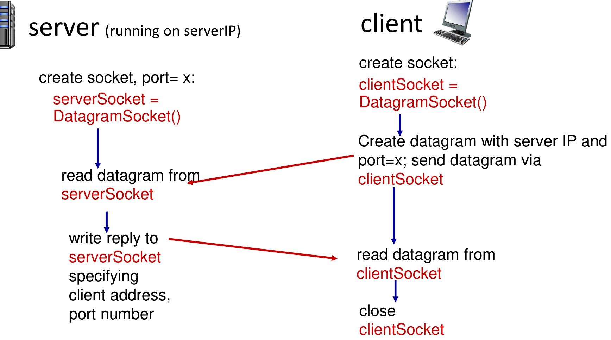

UDP Server Code

```java
import java.net.*;

class Server {
    public static void main(String args[]) throws Exception {
        // 创建数据报 Socket ，绑定到端口 9876
        DatagramSocket serverSocket = new DatagramSocket(9876);

        byte[] receiveData = new byte[1024];

        while (true) {
            // 创建用于接收数据报的空间
            DatagramPacket receivePacket = new DatagramPacket(receiveData, receiveData.length);
            // 接收数据报
            serverSocket.receive(receivePacket); // 程序会卡在这里（如果没有收到）

            // 获取发送方的 IP 地址和端口号
            InetAddress IPAddress = receivePacket.getAddress();
            int port = receivePacket.getPort();

            // 处理数据：将字符串转为大写
            // 大写 转 byte[]
            byte[] sendData = new String(receivePacket.getData()).toUpperCase().getBytes();

            // 创建要发送给客户端的数据报
            DatagramPacket sendPacket = new DatagramPacket(sendData, sendData.length, IPAddress, port);
            // 将数据报写入 Socket 发送
            serverSocket.send(sendPacket);
        }
    }
}
```


UDP Client Code

```java
import java.net.*;
import java.util.Scanner;

class Client {
    public static void main(String args[]) throws Exception {
        // 创建从用户输入读取数据的输入流
        Scanner sc = new Scanner(System.in);
        // 创建客户端 Socket 
        DatagramSocket clientSocket = new DatagramSocket();
        // 通过 DNS 将主机名转换为 IP 地址
        InetAddress IPAddress = InetAddress.getByName("127.0.0.1");


        // 从用户输入读取一行字符串
        String sentence = sc.nextLine();

        // 创建要发送到服务器的数据报（指定服务器 IP、端口 9876）
        DatagramPacket sendPacket = new DatagramPacket(sentence.getBytes(), sentence.length(), IPAddress, 9876);
        // 发送
        clientSocket.send(sendPacket);


        byte[] receiveData = new byte[1024];
        
        // 创建用于接收服务器回复的数据报
        DatagramPacket receivePacket = new DatagramPacket(receiveData, receiveData.length);
        // 接收服务器的回复
        clientSocket.receive(receivePacket);

        // 处理并打印服务器的回复
        String modifiedSentence = new String(receivePacket.getData());
        System.out.println("FROM SERVER: " + modifiedSentence);

        // 关闭客户端 Socket 
        clientSocket.close();
    }
}
```


### [9.2] TCP  Socket 编程

一、客户端与服务器的交互要求

- **服务器端准备**：
  - 服务器进程必须**先运行**。
  - 服务器需创建一个 **“欢迎 Socket **”，用于接收客户端的连接请求。
- **客户端发起连接**：
  - 客户端通过**创建 TCP  Socket **，并指定服务器的 IP 地址和端口号来联系服务器。
  - 当客户端创建 Socket 时，客户端的 TCP 会与服务器的 TCP**建立连接**。

二、服务器的多客户端处理机制

当服务器被客户端联系时，**TCP 会为该服务器进程创建一个新的 Socket **，专门用于与该客户端通信。这种机制允许服务器：

- 同时与**多个客户端**通信（每个客户端对应一个独立的 Socket ）。
- 通过客户端的**源端口号和 IP 地址**来区分不同的客户端（后续章节会详细讲解）。

三、TCP 的应用层视角

从应用层来看，TCP 提供**可靠的、有序的字节流传输服务**，就像在客户端和服务器进程之间建立了一条 “管道（pipe）”，确保数据无丢失、无乱序地传输。

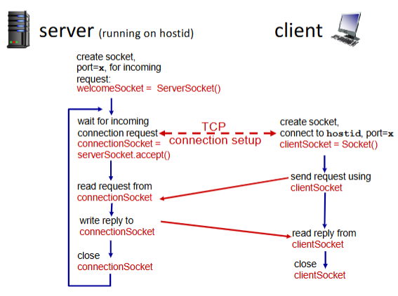


Server Code

```java
import java.io.*;
import java.net.*;

class Server {
    public static void main(String argv[]) throws Exception {
        String clientSentence;
        String capitalizedSentence;

        ServerSocket welcomeSocket = new ServerSocket(6789);

        while (true) {
            Socket connectionSocket = welcomeSocket.accept(); // 这里卡住直到有来自客户端的Connection

            BufferedReader inFromClient =
                    new BufferedReader(
                    new InputStreamReader(
                            connectionSocket.getInputStream()));

            BufferedWriter outToClient =
                    new BufferedWriter(
                    new OutputStreamWriter(
                            connectionSocket.getOutputStream()));

            clientSentence = inFromClient.readLine();

            capitalizedSentence = clientSentence.toUpperCase() + "\n";

            outToClient.write(capitalizedSentence);
            outToClient.flush();
        }
    }
}
```


Client Code

```java
import java.io.*;
import java.net.*;

class Client {
    public static void main(String argv[]) throws Exception {
        String sentence;
        String modifiedSentence;

        BufferedReader inFromUser = new BufferedReader(new InputStreamReader(System.in));
        Socket clientSocket = new Socket("127.0.0.1", 6789);
        BufferedWriter outToServer = new BufferedWriter(new OutputStreamWriter(clientSocket.getOutputStream()));
        BufferedReader inFromServer = new BufferedReader(new InputStreamReader(clientSocket.getInputStream()));

        sentence = inFromUser.readLine();
        outToServer.write(sentence + "\n");
        outToServer.flush();
        modifiedSentence = inFromServer.readLine();

        System.out.println("FROM SERVER: " + modifiedSentence);
        clientSocket.close();
    }
}
```


## [10] 回顾


### [10.1] 应用层核心内容回顾
1. **应用架构**
   - 客户端-服务器（client-server）：中心化架构，依赖始终在线的服务器提供服务（如Web服务器）。
   - 对等（P2P）：去中心化架构，节点之间直接通信、互供服务（如BitTorrent文件共享）。

2. **应用服务需求**
   设计应用时需考虑的关键指标：**可靠性**（数据是否能无丢失传输）、**带宽**（传输速率需求）、**延迟**（数据传输的时间延迟）。

3. **互联网传输服务模型**
   - TCP：面向连接、可靠的字节流传输（保证数据有序、无丢失）。
   - UDP：无连接、不可靠的数据报传输（不保证可靠性，但传输延迟低）。

4. **具体协议**
   - HTTP：超文本传输协议，用于Web资源的请求与传输。
   - SMTP、IMAP：电子邮件的发送（SMTP）和接收（IMAP）协议。
   - DNS：域名系统，负责域名到IP地址的解析。
   - P2P（BitTorrent）：对等文件分发协议，通过分块互传实现高效文件共享。

5. ** Socket 编程**
   应用通过**TCP Socket **或**UDP Socket **与传输层交互，实现网络通信（如之前的Java代码示例）。


### [10.2] 协议学习的核心要点
1. **请求-回复交互模式**
   典型的客户端-服务器通信流程：客户端请求信息或服务，服务器响应数据和状态码（如HTTP的请求-响应）。

2. **消息格式**
   网络消息通常包含：
   - 首部（headers）：描述数据的元信息（如HTTP头的`Content-Type`）。
   - 数据（data）：实际传输的有效载荷（如网页内容、文件片段）。

3. **重要主题**
   - 中心化 vs. 去中心化：如客户端-服务器（中心化）和P2P（去中心化）的架构差异。
   - 无状态 vs. 有状态：如HTTP是无状态协议（服务器不保存客户端历史），而IMAP是有状态的（服务器跟踪邮件读取状态）。
   - 可扩展性：系统随用户/数据增长的适应能力（P2P比客户端-服务器更具扩展性）。
   - 可靠 vs. 不可靠传输：TCP（可靠）和UDP（不可靠）的选择依据场景需求。
   - 网络边缘的复杂性：应用层的逻辑（如协议设计、数据处理）主要由终端设备（网络边缘）实现，而非核心网络。


# 传输层 Transport Layer

我们要怎么保证这封信能准确、高效地送到对方手里？

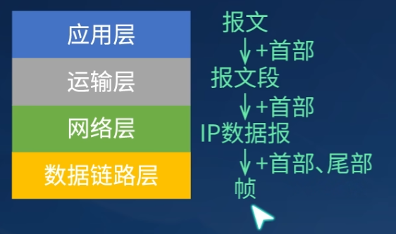

## [1] 多路复用/多路分解

- 多路复用：Multiplexing
- 多路分解：Demultiplexing

这是传输层最基础的工作。你的电脑同时运行着浏览器、微信、游戏，但网线只有一根。数据包从网络上来时，传输层怎么知道哪个包该给哪个程序？

**发送方的多路复用 (Multiplexing)：** 传输层从多个 Socket 收集数据，为每个数据块**添加上**包含控制信息的“传输层首部”（**Header**），然后将其传递给网络层。

**接收方的多路分解 (Demultiplexing)：** 传输层接收到网络层传来的报文段后，根据 **Header** 中的信息，将数据准确地投递到对应的 Soket 中。


每一个传输层的**数据报（Datagram）** 都包含**源端口号** 和 **目的端口号**：

- Host 收到 IP  Datagram 后，IP Datagram 包含源/目的 IP 地址。传输层则进一步提取出**端口号**，结合 IP 地址将导向正确的 Socket 。

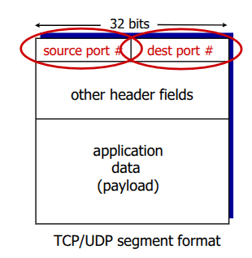


### [1.1] 无连接多路分解 (UDP)

Connectionless Demultiplexing

> Connectionless 的意思是不管源IP是什么，只处理目标端口。

**UDP** 协议是如何处理数据的：

- 创建 Socket ：**必须指定一个本地端口号**（host-local **port** #），这告诉操作系统：“我打算在这个端口等任何发向我的数据”
- 发送 Datagram ：**必须指定** 
  - **目的 IP 地址 (destination IP address)**
  - **目的端口号 (destination port #)**
- 接收与多路分解 (Receiving & Demultiplexing) ：
  - 当接收端主机收到一个 UDP 报文段时，它**只检查**报文段中的**目的端口号**。
  - 如果两个 IP 数据报具有**相同的目的端口号**，即使它们的**源 IP 地址**或**源端口号**不同，它们也会被导向**同一个套接字**。

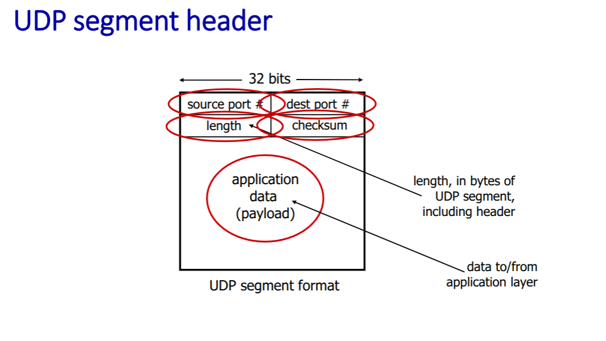


> UDP 校验和（Checksum） 用于 **检测数据在传输过程中是否发生了错误**

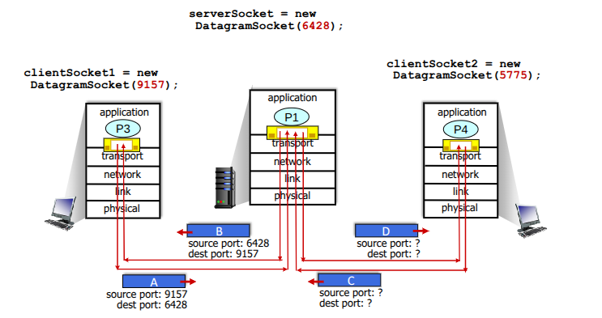

> 图示展示了主机 A 和主机 C 同时向服务器 B 发送数据。
>
> 尽管来源不同，但只要目的地是服务器 B 的 `6428` 端口，这些数据都会进入同一个处理进程。


UDP 一般用于流媒体（直播，允许丢失部分画面）、DNS、SNMP、HTTP/3 。

如果需要通过UDP实现可靠传输（例如，HTTP/3）：

- 应用层（Application Layer）添加可靠性（Reliablility）
- 应用层添加 Congestion Coltrol（拥塞控制）


#### [1.1.2] UDP 校验和

 **16 位反码求和 (1's complement sum)** 的原则：

1. **分组：** UDP 将段（包括头部、伪首部和数据）看作由许多 **16 位 (16-bit)** 的整数组成。
2. **求和：** 将这些 16 位的整数全部相加。**如果相加时最高位产生了进位，这个进位要加回到计算结果的最低位上（回卷）。**
3. **取反：** 将最终的和按位取反（0 变 1，1 变 0），这个结果就是填充在 UDP 首部中的 **校验和**。
4. **验证：** 接收方将收到的所有数据（包括校验和字段本身）全部相加。如果结果全为 **1**，则说明传输很可能没有错误。


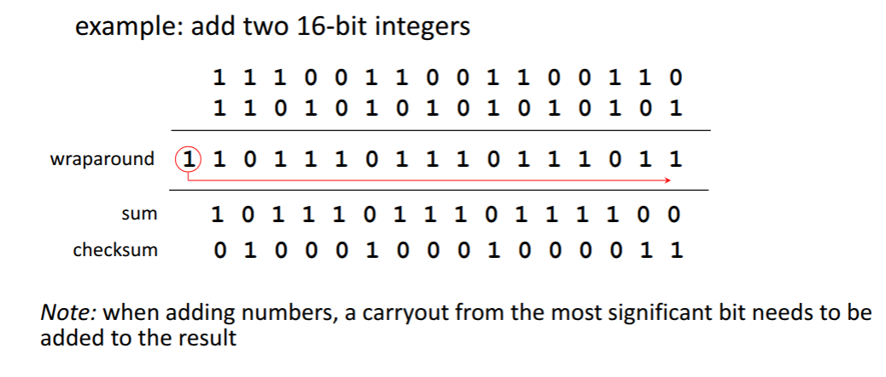

这里最高位进位（溢出）了，因此回加到末尾，变为 `sum`

==`sum` 按位取反则为`checksum`==

单纯的SUM是不需要取反的


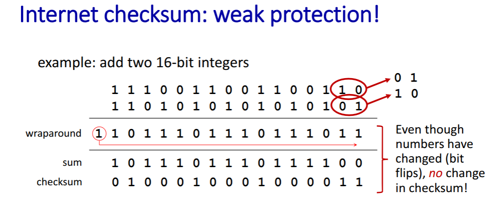


但是假设两行数据都损坏，他们损坏的部分恰好互补，导致校验和正确，这就说明这样的算法校验不太好！


### [1.2] 面向连接的多路分解（TCP）

与 UDP 不同，**TCP** 的识别更加精细！

TCP 套接字是由一个**四元组（4-tuple）**唯一标识的。只有这四个值完全匹配，数据才会被送入对应的套接字：

- **源 IP 地址 (Source IP address)**：发送端的 IP。
- **源端口号 (Source port number)**：发送进程的**端口**。
- **目的 IP 地址 (Dest IP address)**：接收端的 IP。
- **目的端口号 (Dest port number)**：接收进程的**端口**（例如 Web 服务器通常是 80 或 443）。

为什么要这样做？

如果有两位用户（A 和 B）同时访问 QQ 服务器：

- 用户 A 的连接：`{源IP_A, 源端口_A, 服务器IP, 80}`
- 用户 B 的连接：`{源IP_B, 源端口_B, 服务器IP, 80}`

虽然目的 IP 和目的端口（80）都一样，但因为**源 IP 或源端口不同**，服务器就能准确区分出哪条数据属于用户 A，哪条属于用户 B。


## [2] 可靠数据传输


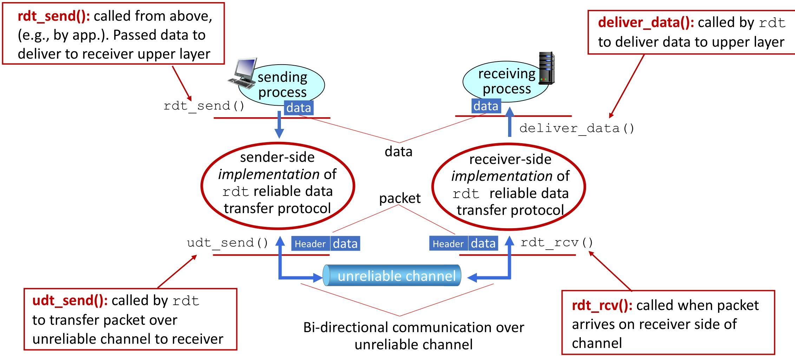


现实中的网络就是最底下的蓝色管道，他是不可靠的数据传输，可能丢包，可能延迟送达...

我们要做的就是在这一层之上创建一个可靠的数据传输。


### [2.1] RDT 1.0 理想情况

我们假设现实中那个`unreliable channel` 是完美的，这样：

- **发送端：** 只管接收应用层数据，打包成 `packet`，然后发送。
- **接收端：** 只管从信道接收 `packet`，解包成 `data`，交给应用层。

### [2.2] RDT 2.0 包错误

这个管道很完美，除了可能发生BIT错误（比如翻转）

在现实中，信道可能会受到干扰，导致分组里的 `0` 变成 `1`（位错误）。**rdt 2.0** 引入了反馈机制来解决这个问题。

- **新增机制：**
  1. **差错检测 (Checksum)：** 发送方在分组中加入“校验和”，接收方据此判断分组是否损坏。
  2. **接收方反馈 (Feedback)：**
     - **ACK (Positive Acknowledgment)：** 告诉发送方“收到了，没问题”。
     - **NAK (Negative Acknowledgment)：** 告诉发送方“收到了，但数据损坏了，请重传”。
  3. **重传 (Retransmission)：** 如果收到 NAK，发送方重新发送上一个分组。
- **这种模式被称为==“停-等”协议 (Stop-and-Wait)==：** 发送方发送一个分组后，必须**停下来**等待接收方的 ACK 或 NAK，**在收到反馈之前不能发送新数据。**

#### [2.2.1] RDT 2.1 ACK/ NAK 协议

但是，如果ACK/ NAK 本身错误了怎么办？

**rdt 2.1** 是对 2.0 的严谨补充。它的核心思想是：**给分组打上标签（序列号）**。

- **核心改进：序列号 (Sequence Number)**
  - 因为是“停-等”协议，发送方一次只发一个包，所以只需要 **0** 和 **1** 两个序列号就够了。
- **发送方的逻辑：**
  - 在分组中加入序列号（0 或 1）。
  - 如果收到的反馈（ACK/NAK）损坏了，发送方无法判断接收方是否拿到了数据，于是**直接重传**当前分组。
- **接收方的逻辑：**
  - **解决重复问题：** 如果接收方收到了一个序列号为 0 的包，**且它正在等待 0 号包**，则处理并反馈。
  - 如果它收到了 0 号包但它正等着 1 号包，说明这是个**重复包**，接收方会丢弃它，但**必须重发一个 ACK** 告诉发送方：“我收到 0 了，请发送下一个。” 也即发送 ACK 0（确认受到 0）

#### [2.2.2] RDT 2.2 仅ACK协议

无 NAK 协议（化繁为简）

其实不需要 NAK（否定确认），只用 ACK 就能完成任务。

- **核心改进：带编号的 ACK**
  - 接收方不再发送 NAK。
  - 取而代之的是，接收方在发送 ACK 时，必须明确说明**我是在对哪个序列号进行确认**。
- **工作机制：**
  - 如果发送方发了 1 号包，但接收方收到的是损坏的包，接收方不发 NAK，而是**重发上一个正确包的 ACK**（即发送 ACK 0）。
  - 发送方收到“重复的 ACK”（本等 ACK 1，却收到了 ACK 0），就知道 1 号包出事了，立即重传 1 号包。


### [2.3] RDT 3.0 包丢失

在之前的版本中，我们已经解决了“数据损坏”的问题。然而，现实世界的网络（如互联网）不仅会损坏数据，还会**丢弃数据**（Packet Loss）。比如，ACK丢失，怎么办？那就死锁了？因此我们必须引入一种超时机制！

**rdt 3.0** 也被称为**比特交替协议 (Alternating-bit protocol)**。

为了处理丢包，rdt 3.0 引入了==**超时重传**==机制。发送方在发送分组时启动一个定时器，如果：

1. **分组丢失：** 定时器到期，发送方重传该分组。
2. **ACK 丢失：** 定时器到期，发送方同样重传。虽然这会导致接收方收到重复包，但 rdt 2.2 的序列号机制能完美处理重复。
3. **分组只是延迟：** 如果分组没丢只是太慢了，定时器也会到期。发送方重传，接收方通过序列号识别并丢弃重复包。


rdt 3.0 的**四种运行场景**

- **无差错传输：** 发送 0 $\rightarrow$ 收到 ACK 0 $\rightarrow$ 发送 1 $\rightarrow$ 收到 ACK 1。
- **数据包丢失：** 发送 0 $\rightarrow$ 0 丢失 $\rightarrow$ 定时器超时 $\rightarrow$ **重传 0** $\rightarrow$ 收到 ACK 0。
- **ACK 丢失：** 发送 0 $\rightarrow$ 接收方发回 ACK 0 （确认接收到0）$\rightarrow$ ACK 0 丢失 $\rightarrow$ 定时器超时 $\rightarrow$ **重传 0** $\rightarrow$ 接收方收到重复包，丢弃它并重发 ACK 0。
- **过早超时：** ACK 还没到，定时器就响了。发送方重传 0 $\rightarrow$ 接收方丢弃重复包 0 $\rightarrow$ 发送方会陆续收到两个 ACK0，它需要有逻辑去忽略掉那个“迟到的”重复 ACK。


### [2.4] 利用率计算


> | **单位 (Abbreviation)** | **全称 (Full Name)** | **换算关系 (In bits per second)** |
> | ----------------------- | -------------------- | --------------------------------- |
> | **1 Gbps**              | Gigabit per second   | $10^9$ bps                        |
> | **1 Mbps**              | Megabit per second   | $10^6$ bps                        |
> | **1 Kbps**              | Kilobit per second   | $10^3$ bps                        |
>
> 网络传输是 1000 而不是 1024

假设 1Gbps 链路（link），15ms传播延迟（propagation delay），8000 bit数据包

我们怎么计算利用率？请看下图

- 利用率 = 上传时间 / （上传时间+往返时间）

  > RTT = Round-trip Time 也即往返时间

- 上传时间就是 $\dfrac{8\times 10^3 bit}{1\times 10^9 bit/s} = 8\times 10^{-6}s=8\times10^{-3}ms$ 
- RTT 就是 $15ms \times 2=30ms$
- 那么效率就是如下所计算的 $U=\dfrac{\dfrac{L}{R}}{RTT+\dfrac{L}{R}}$

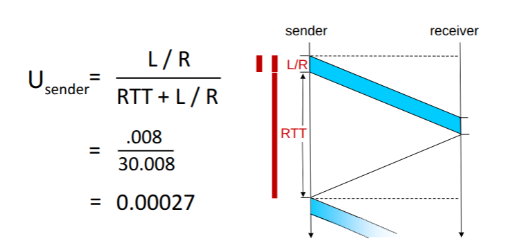

这是比较显而易见的公式！


### [2.5] Piplining

在 **rdt 3.0** 中，我们遇到了一个巨大的性能瓶颈：**停-等（Stop-and-Wait）**模式。发送方在发送一个分组后，必须等待一个往返时延（RTT）才能发送下一个。这种方式就像是你寄一个快递，必须等到对方收到并给你打完电话确认，你才寄第二个，效率极低。

为了解决这个问题，我们引入了**流水线技术（Pipelining）**。

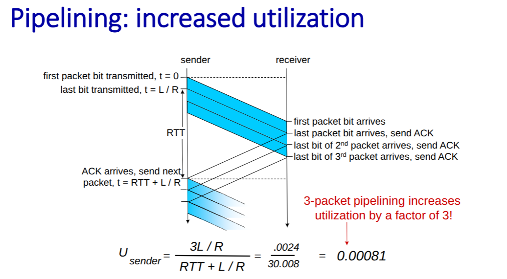

仍然假设完美的情况，在这次，我们一次性发送3个包，U居然大幅提升了，因为我们在之前等待的时间额外发送了2个数据包，因此是原来的3倍。

> 假设 1Gbps 链路（link），15ms传播延迟（propagation delay），8000 bit数据包


两大主流流水线协议：

#### [2.5.1] GO BACK N - GBN

**机制：** 发送方可以连续发 N 个包。如果中间某个包（比如 3 号包）丢了，即便后面的 4、5 号包安全到达，接收方也会丢弃它们。

**重传：** 发送方发现 3 号包超时，会**重传 3 号及之后所有的包**（3, 4, 5...）。

**特点：** 接收方逻辑简单，不需要缓存乱序包；但在丢包率高时，重传开销很大。

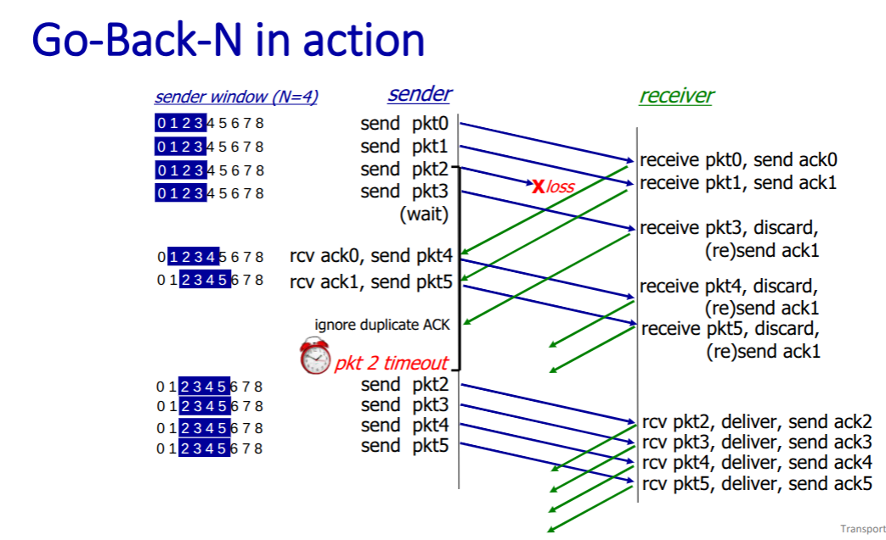

> ### 计时器的基本更新规则
>
> - **启动 (Start)：** 当发送方发送一个数据包，且当前**没有任何正在计时的包**（即计时器未运行）时，启动计时器。在图中，发送 `pkt0` 时计时器启动。
> - **停止 (Stop)：** 当发送方收到一个 ACK，且当前**所有已发送的包都已被确认**时，停止计时器。
> - **重启 (Restart)：** 当发送方收到一个有效 ACK，但**窗口内仍有其他已发送未确认的数据包**时，计时器会归零并重新开始计时，为下一个最早的包计时。
> - **超时处理 (Timeout)：** 如果计时器到期，发送方会重传**当前窗口内所有**已发送但未确认的包，并重新启动计时器。


#### [2.5.2] SELECTIVE REPEAT - SR

选择重传

**机制：** 接收方会单独确认每一个正确收到的分组，**并缓存乱序到达的分组。**

**重传：** 发送方只重传那个**真正丢失**的分组。

**特点：** 效率更高，不浪费带宽，但发送方和接收方的逻辑都更复杂，因为需要维护每个包的状态。


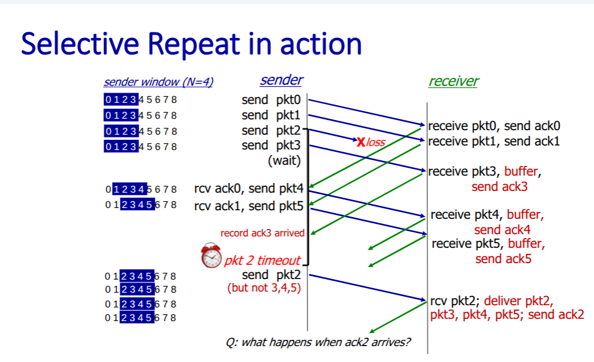

这里把接收到ACK的标记，然后能往右就往右，这里2还没有到达，一旦标记了，整个窗口尽可能向右....


但是这里有一个问题！

发送方：`[0 1 2] 0 1 2 0 1 2` 发送

接收方：`[0 1 2] 0 1 2 0 1 2` 没有问题，然后接收方调整窗口

接收方：`0 1 2 [0 1 2] 0 1 2`，并且返回所有ACK，不幸的是ACK全部丢失！

此时发送方察觉到超时，因此重传`[0 1 2] 0 1 2 0 1 2` ，接收方接收`[0 1 2]`

这里就有问题了！因为窗口大小和序列大小一致，让接收方误以为这是最新的一组！实际上是旧的一组！


为了解决这个问题
$$
序列大小 \ge 2\times窗口大小
$$
也就是

发送方：`0 1 2 3 4 5 0 1 2 3 4 5` 序列大小 6 $\ge 2\times$ 窗口大小3

接收方：`0 1 2 3 4 5 0 1 2 3 4 5` 

这样第二次的时候

`[0 1 2] 3 4 5 0 1 2 3 4 5  ----[0 1 2]----> 0 1 2 [3 4 5]` 就会察觉到之前 `[0 1 2]` 没有ACK返回成功！因此它就会返回`ACK 0 | ACK 1 | ACK 2`


## [3] 面向连接传输 TCP

Connection-oriented Transport TCP

在学习了 **rdt** 的理论模型后，我们将进入现实世界中最核心的传输层协议：**TCP (Transmission Control Protocol)**。TCP 是一个**面向连接的 (Connection-oriented)**、**可靠的**、**全双工**的传输协议。

> 全双工（Full Duplex）是通讯传输的一个术语。通信允许数据在两个方向上同时传输，它在能力上相当于两个单工通信方式的结合

### [3.1] TCP 报文段结构

TCP Segment Structure


​	

> ### Sequence Number
>
> 序列号是按**字节（Byte）的偏移量**来算的。 TCP 把数据看作一条长长的“字节流”。一个报文段的序列号，就是该报文段中**第一个数据字节**在整个字节流中的编号。
>
> > **例子：** 假设你要发送 3000 字节的数据，每个报文段限制 1000 字节：
> >
> > - **第一个段：** 序列号 = 0（包含第 0-999 字节）
> > - **第二个段：** 序列号 = 1000（包含第 1000-1999 字节）
> > - **第三个段：** 序列号 = 2000（包含第 2000-2999 字节）
>
> ### ACK Number
>
> 32 位。表示期望从对方收到的**下一个字节**的序列号。如果收到 ACK Number 为 500，说明 499 以前的字节都已正确收到。
>
> 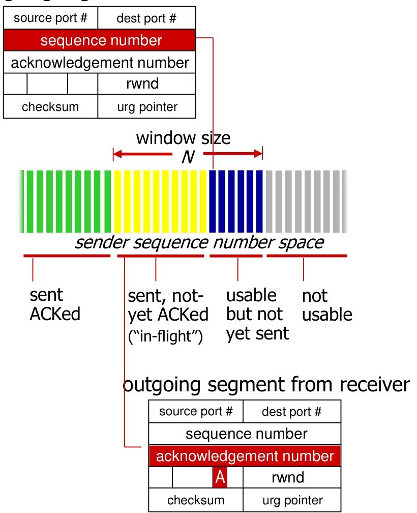
>
> ###  控制位与功能字段
>
> **C：** 拥塞窗口减小。发送方告知接收方，它已收到拥塞信号并降低了发送速率。
>
> **E：**如果路由器发生了拥塞，接收方通过此位告知发送方“路径上有拥塞”。
>
> > **U :** 紧急位。当 U=1 时，表示“紧急指针”字段有效，告诉接收方此报文段中有紧急数据，应优先处理（现在已很少使用）。
>
> **A:** 确认位（Acknowledgment）。当 A=1 时，首部中的“确认号”字段才有效。在连接建立后，几乎所有发送的分组都会将此位设置为 1。
>
> > **P:** 推送位（Push）。告诉接收方立即将数据交给应用层，而不是在缓冲区排队等待。
>
> **RST, SYN, FIN：** 用于连接管理。SYN 用于建立连接，FIN 用于释放连接，RST 用于强制重置出错的连接。


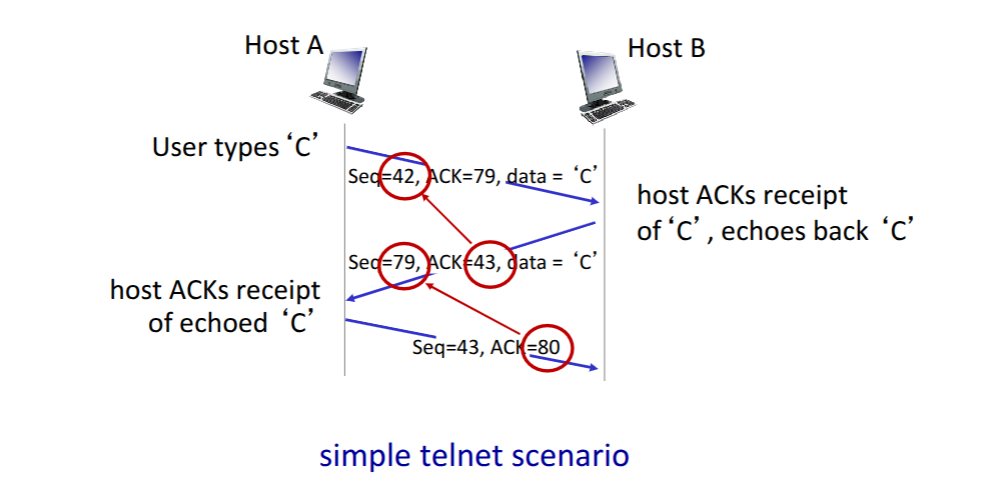

1. **Host A $\rightarrow$ Host B**：用户输入字符 'C'。
   - `Seq=42`（A 发出的第一个字节编号是 42），`ACK=79`（A 期待收到 B 的第 79 号字节），`data='C'`。
2. **Host B $\rightarrow$ Host A**：B 确认收到 'C'，并把 'C' 回显给 A。
   - `Seq=79`（符合 A 的期待），`ACK=43`（B 确认收到了 42，所以期待 A 的第 43 号字节），`data='C'`。
3. **Host A $\rightarrow$ Host B**：A 确认收到 B 的回显。
   - `Seq=43`（符合 B 的期待），`ACK=80`（A 确认收到了 79，期待 B 的第 80 号字节）。


> TCP 规范没有说明如何处理失序的 Segment
>
> TCP的超时时间一般设置为**比RTT稍长**，虽然RTT一般是变化的
>
> - 太短会导致过早超时，引发不必要重传
> - 太长会导致对丢失的数据**迟钝**

### [3.2] 预估 RTT

如何估计RTT呢？我们只需要发出一个报文段，然后开始计时，直到收到这个ACK（不计算超时重传这些情况，只考虑理想情况）

由于网络状况瞬息万变，单次测量的往返时间（**SampleRTT**）波动很大。为了得到一个平滑的、能反映当前网络趋势的数值，TCP 使用了**指数加权移动平均（Exponential Weight Moving AVG - EWMA）**。


$$
\text{EstimatedRTT}=(1-\alpha) \cdot\text{EstimatedRTT} + \alpha\cdot\text{sampleRTT}
$$


- **SampleRTT**：最近一次测量到的 RTT。
- **EstimatedRTT**：平滑后的平均 RTT。
- **$\alpha$ (Alpha)**：权值，通常取 **0.125**。

> 预测占大头，实际占小头


如果网络更烂呢？仅仅有平均值是不够的。如果网络非常不稳定，波动很大，我们需要一个更大的“安全余量”来防止不必要的重传。**DevRTT** 就是用来衡量 RTT 变化剧烈程度的。 


$$
\text{DevRTT} = (1 - \beta) \cdot \text{DevRTT} + \beta \cdot |\text{SampleRTT} - \text{EstimatedRTT}|\\
\text{TimeoutInterval} = \text{EstimatedRTT} + 4\cdot \text{DevRTT}
$$


- **$\beta$ (Beta)**：通常取 **0.25**。
- **意义**：如果网络波动大，DevRTT 就会变大；如果网络很稳定，DevRTT 就会变小。

> DevRTT 本身占大头，差值占小头


### [3.3] 重传场景

如下的场景会导致重传

#### [3.3.1] ACK丢失

ACK Lost

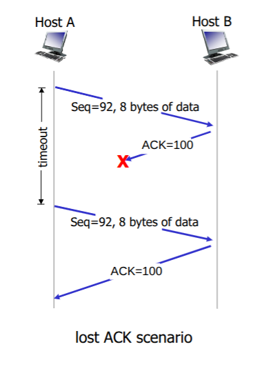

此时 `SEQ = 92` 并且是 8 字节 数据，因此B收到了之后，他期望收取`SEQ=100`的数据，因此发送 `ACK, 100` 也即`ACK=100`，意味着期望收到`SEQ=100`的数据。

可惜ACK=100丢失，因此A触发超时重传。


#### [3.3.2] 过早超时

Premature Timeout

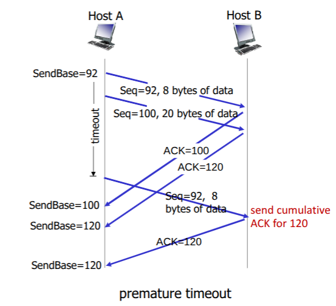


如果超时时间设置的不好，或者网络突然拥堵，则会导致过早超时。

此时B已经收到`[92,120]` 的数据了，B再次收到旧的`[92,100]`，他不会返回`ACK=100`而是`ACK=120`告诉A，期望收到的是`120`。


#### [3.3.3] 累计确认覆盖

Cumulative ACK

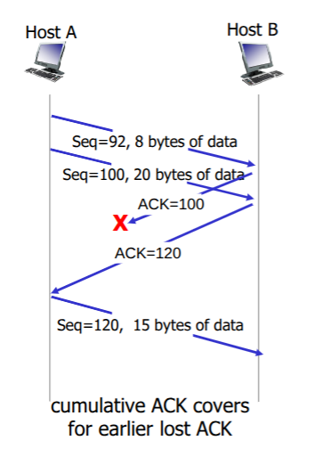

这里的意思是`ACK=100`这个旧的丢失，但是A收到了更新的`ACK=120`，意味着A能够确认B确实收到了`[92,100] - [100,120]`，因此就无需重传了！


### [3.4] 快速重传

Fast Retransmit

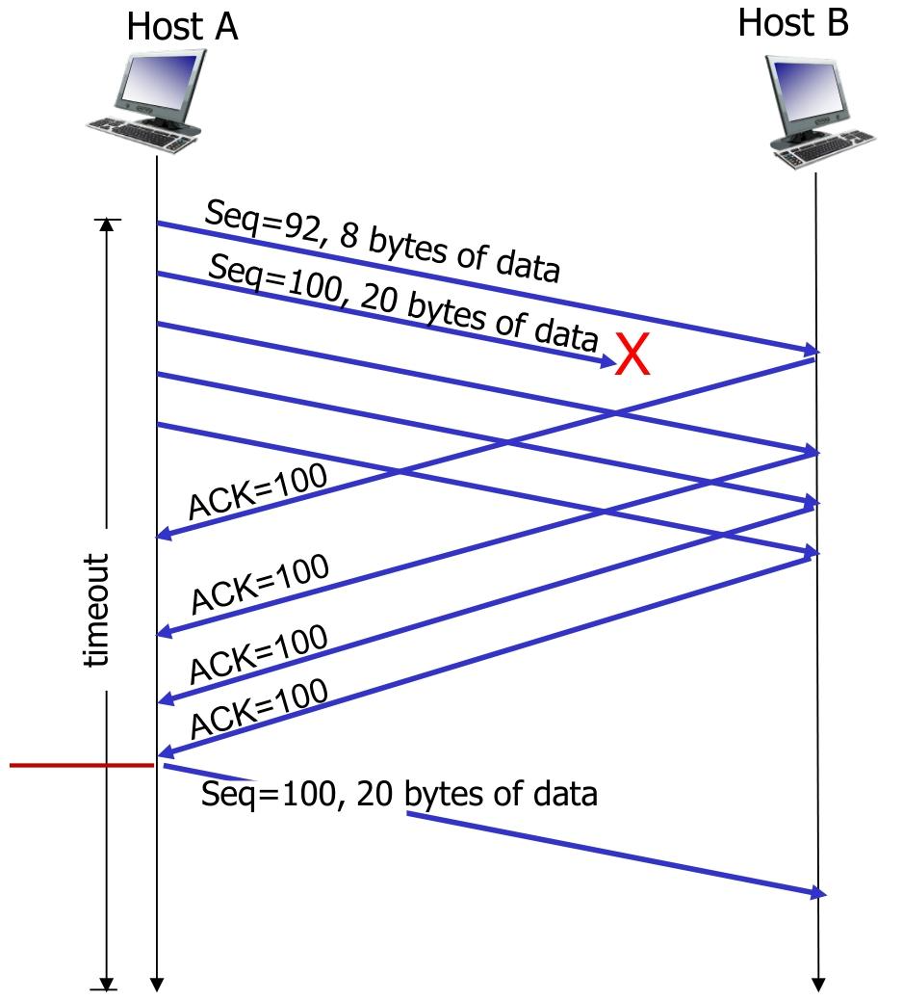

**核心触发条件**

- **三重重复 ACK (Triple Duplicate ACKs)：** 如果发送方连续收到了 **3 个==额外的==（重复的）** 确认号（ACK）相同的包，它就会认为该 ACK 所指向的下一个数据段已经丢失了。	
- **动作：** 立即重传那个缺失的数据段，而**不需要等待超时定时器（Timeout）到期**。


### [3.5] TCP 流量控制

TCP Flow Control

流量控制是为了防止“发送方发得太快，导致接收方处理不过来”而设计的一种机制。

> **思考：如果网络层交付数据的速度，快于应用层从套接字缓冲区（Socket Buffers）取出数据的速度，会发生什么？**
>
> **现象：** TCP 接收方有一块内存区域叫 **接收缓冲区 (Receive Buffer)**。如果数据源源不断地进来，但上层应用程序（如浏览器、下载软件）读取数据的速度很慢，缓冲区就会被填满。
>
> **后果：** 一旦缓冲区满了，后续到达的数据包将无处安放，只能被**丢弃 (Dropped)**。这会导致重传，浪费网络资源。


**接收方**在发回给发送方的确认包（ACK）中，放入 `receive window` 的数值。

**发送方**收到后，会限制自己“**已发送但未收到确认（也即正在传输中的）**”的数据总量，使其不超过接收方的窗口大小。

> 通常为 4096 bytes

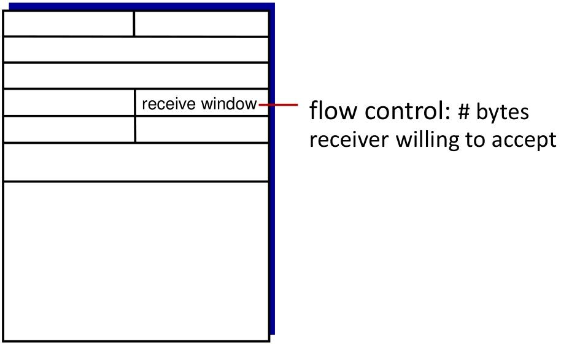


### [3.6] TCP握手

在正式传输数据之前，发送方和接收方必须进行“握手”。其核心目的有两个：

- **确认意愿：** 双方都同意建立连接（互相知道对方愿意通信）。
- **同步参数：** 协商连接所需的各项参数，例如初始序列号 (Starting seq #s)、接收缓冲区大小 (rcvBuffer size) 等。

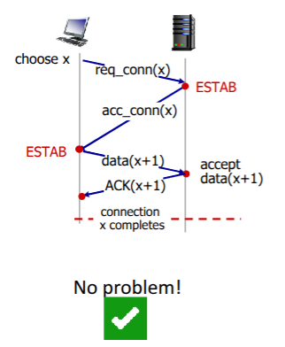

**两次握手在网络中总是有效吗？** 答案是 **否定** 的。

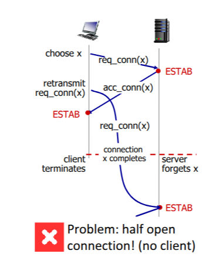


**故障情景分析：**

1. **超时与重传**：客户端发送了第一个请求 `req_conn(x)`，但由于网络延迟，客户端以为丢包了，于是
2. **连接建立**：客户端**重传**了一个请求：再次发送 `req_conn(x)`。这次网络很给力，回了 `acc_conn(x)`。客户端收到了想要的数据，直接断开。
3. **“幽灵”请求到达**：过了很久，那个**最初延迟的旧请求**终于到达了服务器。
4. **服务器误判**：由于是两次握手，服务器收到请求后直接回复 `acc_conn(x)` 并进入 `ESTAB` 状态。服务器认为这是一个**新**的连接。
5. **半开放连接 (Half-open connection)**：
   - **服务器端**：在等待客户端发数据，白白浪费系统资源。
   - **客户端**：根本不知道发生了什么（它可能已经关闭了，或者正在忙别的），因此不会理会服务器。
   - **结果**：产生了一个没有客户端的“死连接”。

### [3.7] TCP 三次握手

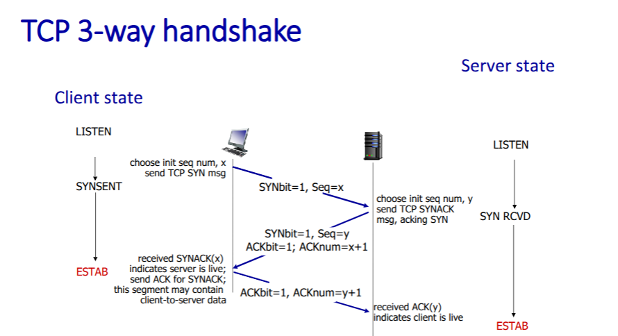

**第一步：客户端发送连接请求 (SYN)**

- **动作：** 客户端选择一个初始序列号 $x$（Initial Sequence Number），发送一个 **SYN** 报文段。
- **标志位：** `SYNbit=1`（表示请求建立连接）。
- **序列号：** `Seq=x`。
- **状态变化：**
  - **客户端：** 从 `LISTEN` 变为 **`SYNSENT`**（同步已发送）。
  - **服务器：** 此时处于 `LISTEN`（监听）状态，等待接收。

第二步：服务器确认并回送请求 (SYN-ACK)

- **动作：** 服务器收到 SYN 后，需要确认客户端的请求，并同时也发送一个自己的连接请求。
- **标志位：** `SYNbit=1`, `ACKbit=1`。
- **序列号：** 服务器选择自己的初始序列号 `Seq=y`。
- **确认号：** `ACKnum=x+1`（表示“我已收到你的 $x$，期待你下次发送 $x+1$”）。
- **状态变化：**
  - **服务器：** 从 `LISTEN` 变为 **`SYN RCVD`**（同步已接收）。

第三步：客户端确认服务器的请求 (ACK)

- **动作：** 客户端收到服务器的 SYN-ACK 后，最后发送一个确认报文。
- **标志位：** `ACKbit=1`。
- **确认号：** `ACKnum=y+1`（表示“我已收到你的 $y$，期待你下次发送 $y+1$”）。
- **特别注意：** 正如图片中所说，这个报文段已经可以携带客户端发往服务器的数据了。
- **状态变化：**
  - **客户端：** 进入 **`ESTAB`** (Established，已建立连接) 状态。
  - **服务器：** 收到这个 ACK 后，也进入 **`ESTAB`** 状态。


### [3.8] 关闭TCP连接

在网络通信中，建立连接需要“三次握手”，而关闭连接通常被称为**“四次挥手”**。

1. 双方独立关闭 (Independent Closure)

- **双向关闭**：在 TCP 连接中，客户端和服务器每一端都必须独立关闭自己那一侧的连接。
- **发送 FIN 报文**：想要关闭连接的一方会发送一个特殊的 TCP 报文段，其中 **FIN 位（Finish）被设置为 1**。这表示“我没有数据要发送给你了”。

2. 响应 FIN 报文 (Responding to FIN)

- **发送 ACK**：当一端收到对方发来的 FIN 报文时，必须回送一个 **ACK（确认）** 报文作为响应。
- **合并发送**：在接收到 FIN 后，ACK 报文可以和该端自己的 FIN 报文合并发送。这意味着如果双方都准备好关闭，原本的四个步骤可以简化。

3. 特殊情况处理

- **同时交换 FIN**：TCP 协议能够处理双方**同时**发起关闭请求（即双方同时发送 FIN 报文）的情况。


## [4] 拥塞控制

Congestion Control

拥塞一般是这两种情况

- Long Delay ：长时间延迟，这是在路由器（Router）缓冲区排队
- Packet Loss：丢包，溢出缓冲区


端到端（End-to-End）拥塞控制，通过观察Loss（丢包率）和Delay（延迟）来判断的（TCP的方法）

除了这个方法，还有**直接反馈**，也即上面提到的使用 **ECN** - 显式拥塞通知的方法。


### [4.1] AIMD

AIMD 的全称是 **Additive Increase Multiplicative Decrease**，即“加性增，乘性减”。它的基本逻辑是：**慢慢地增加速度，果断地减少速度。**

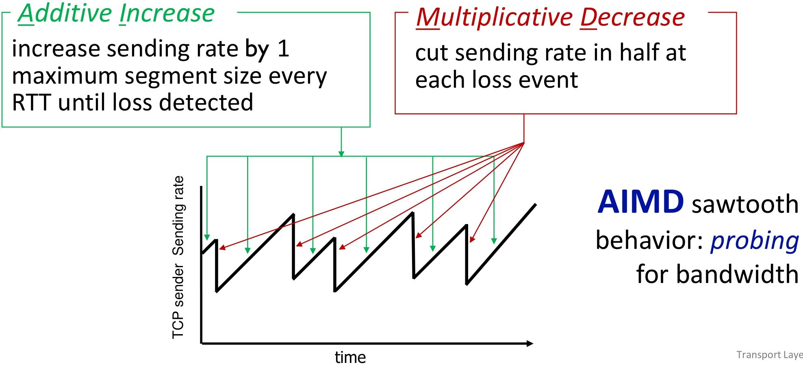

**加性增 (Additive Increase)**

- **做法：** 每经过一个往返时间（RTT），发送方将发送速率（拥塞窗口）增加 **1 个 MSS**（最大报文段大小）。
- **目的：** 这是一个“探测”（Probing）的过程。发送方不确定网络现在的承载能力，所以一点一点增加，试图寻找带宽的上限。
- **视觉特征：** 在第一张图的坐标系中，表现为斜向上升的直线。

**乘性减 (Multiplicative Decrease)**

- **做法：** 一旦检测到丢包（意味着网络发生拥塞），发送方立即将发送速率**减半**。
- **目的：** 迅速缓解网络压力。相比缓慢的增加，减少必须是大幅度的，否则无法在拥塞发生时及时保护网络。
- **视觉特征：** 在图中表现为垂直掉落，形成所谓的**锯齿状（Sawtooth）**图形。


根据不同的 TCP 版本和丢包信号，减少的幅度会有所不同：

- **收到 3 个重复确认 (Triple duplicate ACK)：**
  - **对应版本：** TCP Reno。
  - **处理方式：** 速率**减半**。这被视为“轻微拥塞”，因为至少还有 ACK 能回来。
- **发生超时 (Timeout)：**
  - **对应版本：** TCP Tahoe（或者是 Reno 在极度拥塞时的情况）。
  - **处理方式：** 速率直接降至 **1 MSS**。这被视为“严重拥塞”，需要重新开始慢启动过程。


### [4.2] 拥塞窗口

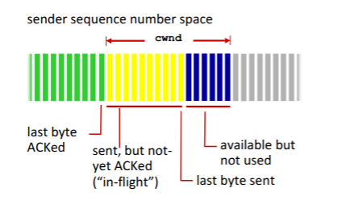

**发送限制**：TCP 发送方通过“拥塞窗口” (`cwnd`) 来限制发送的数据量。其核心公式为：
$$
LastByteSent - LastByteAcked \le cwnd
$$
**速率计算**：TCP 的发送速率大约等于 `cwnd / RTT`  bytes/s。

**动态调整**：`cwnd` 会根据观察到的网络拥塞情况（如丢包或 ACK 回复）动态调整。

### [4.3] TCP 慢启动

TCP Slow Start

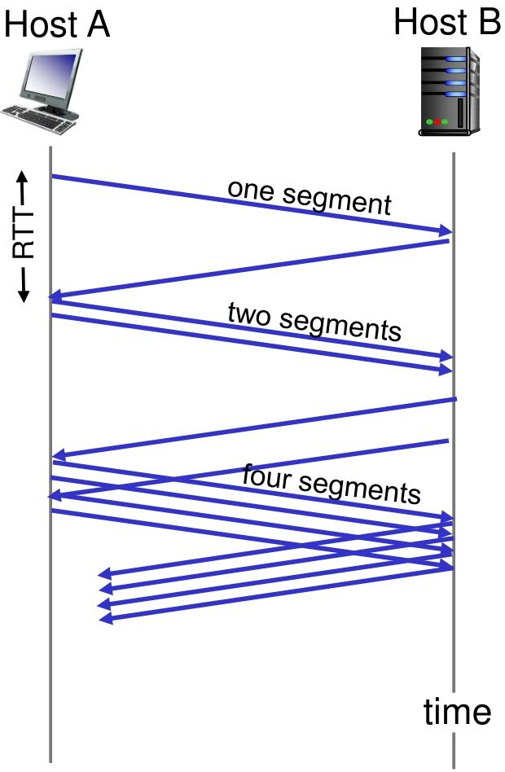

虽然名字叫“慢”启动，但实际上它的增长非常快：

- **初始状态**：当连接开始时，`cwnd` 初始值仅为 **1 个 MSS**（最大报文段大小）。
- **指数增长**：每经过一个 RTT，`cwnd` 就会**翻倍**。
- **实现逻辑**：发送方每收到一个 ACK，就将 `cwnd` 增加 1 个 MSS。
- **目的**：在连接刚开始时，迅速填满空闲的网络带宽。


#### [4.3.1] 慢启动阈值 SS-Thre-Sh

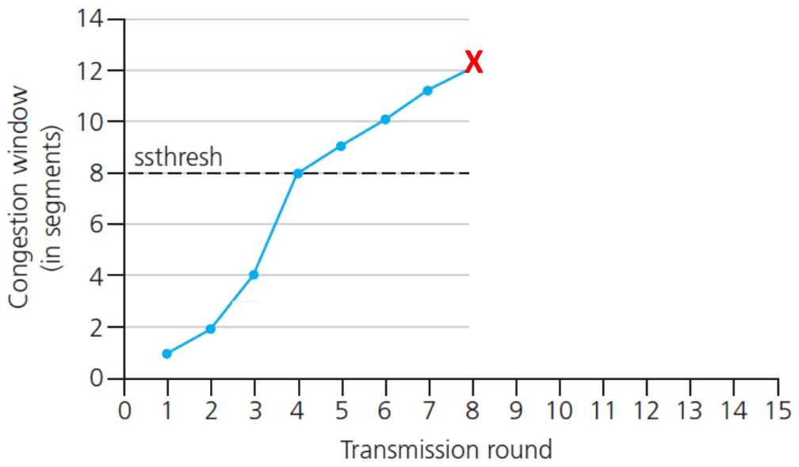

**从慢启动到拥塞避免：ssthresh**

为了防止指数增长导致严重的网络瘫痪，TCP 引入了 **ss-thresh (Slow Start Threshold 慢启动阈值)** 变量：

- **切换时机**：当 `cwnd` 达到 `ssthresh` 时，TCP 从指数增长（慢启动）切换为**线性增长**（拥塞避免阶段）。
- **动态更新**：一旦发生丢包事件，`ssthresh` 会被设置为当前 `cwnd` 值的 **1/2**。
- **图示意义**：在 `cwnd` 增长曲线中，`ssthresh` 是曲线由“陡峭”变“平缓”的分界点。


### [4.4] TCP 的公平性

 TCP Fairness

- **公平性目标**：如果 $K$ 个 TCP 会话共享带宽为 $R$ 的瓶颈链路，理想情况下每个会话应平均获得 $R/K$ 的带宽。
- **为什么 TCP 是公平的？**：通过 AIMD 机制（加性增、乘性减），多个连接会逐渐向“等分带宽线”靠拢。
- **理想假设**：TCP 的公平性建立在相同 RTT 和固定会话数量的假设之上。

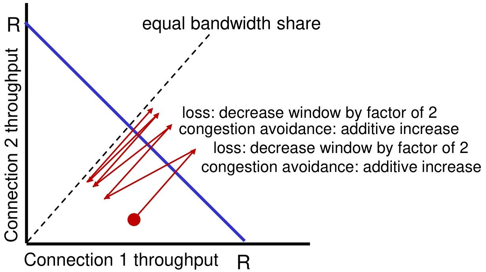


在实际互联网中，公平性经常被打破：

- **UDP 的影响**：多媒体应用（如视频、语音）通常使用 UDP，因为它们不希望被 TCP 的拥塞控制限制速率，即使丢包也会坚持发送。
- **并行 TCP 连接**：现代浏览器可以为一个网页打开多个并行 TCP 连接。
  - 例如：如果一个应用打开了 11 个连接而另一个只打开了 1 个，前者将抢占约 90% 的带宽。
- **缺乏监管**：互联网并没有“警察”来强制所有应用必须遵守拥塞控制协议


## [5] 传输层协议的演进

### [5.1] QUIC（快速 UDP 互联网连接）

在过去的 40 年里，**TCP** 和 **UDP** 是最核心的传输层协议。但随着网络环境的变化，TCP 在某些特定场景下遇到了挑战：

- **长肥管道（Long, fat pipes）**：在高带宽、高延迟的网络中，大量数据包在传输途中（In flight），一旦丢包，TCP 的拥塞控制机制会导致吞吐量骤降。
- **无线网络**：无线链路常因干扰（噪声）而非拥塞导致丢包，但 TCP 往往将其误判为拥塞，从而错误地减速。
- **高延迟链路**：RTT（往返时间）极长，导致 TCP 建立连接太慢。
- **数据中心网络**：对延迟极其敏感。

**核心趋势：** 为了绕过操作系统内核更新缓慢的限制，开发者开始将原本属于传输层（内核态）的功能移到**应用层（用户态）**，并基于 **UDP** 来实现。最典型的例子就是 **HTTP/3 采用的 QUIC 协议**。


**QUIC (Quick UDP Internet Connections)** 是由 Google 提出，并在后来由 IETF 标准化的协议。

- **架构位置**：它是一个**运行在 UDP 之上**的应用层协议。
- **设计目标**：提高 HTTP 的性能（即 HTTP/3）。
- **普及程度**：已广泛应用于 Google 的服务器、Chrome 浏览器及 YouTube 等移动端应用。

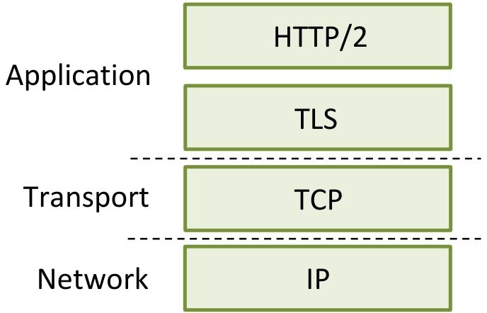


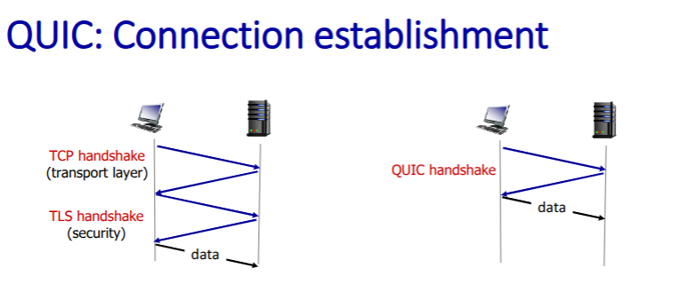


**QUIC 的核心优势与特性**

A. 极速的连接建立（Connection Establishment）

这是 QUIC 相对 TCP 最显著的改进。

- **传统模式 (TCP + TLS)**：
  - 需要进行 **2 次串行握手**。
  - 第一次：TCP 三次握手（建立可靠连接）。
  - 第二次：TLS 握手（建立身份验证和加密密钥）。
  - 结果：在发送实际数据之前，通常需要等待 **2 个 RTT**。
- **QUIC 模式**：
  - 将可靠性、拥塞控制与加密握手**合并**。
  - 结果：仅需 **1 个 RTT** 即可建立安全连接并开始发送数据。

B. 多路复用（Multiplexing）与流（Streams）

- QUIC 支持在一个连接中开启多个独立的“流（Streams）”。
- **优势**：每个流都有独立的可靠传输保障。在 TCP 中，如果一个数据包丢失，整个连接都会阻塞（队头阻塞 Head-of-Line Blocking）；而在 QUIC 中，**一个流的丢包不会影响其他流的数据传输**。

C. 拥塞控制与错误控制

- QUIC 吸收了 TCP 几十年来成熟的算法（如拥塞控制、丢包检测）。
- 由于 QUIC 在应用层实现，它可以比 TCP 更快地迭代和优化这些算法，而不需要等待操作系统内核更新。


## [6] 回顾

通信对象：

- 应用层（Application Layer）：终端用户（End-Users）
- 传输层（Transport Layer）：进程（Process）
- 网络（Network）：主机（Hosts）

两个主要协议：

- UDP（不可靠的数据包传输）
- TCP（可靠的数据包传输）


传输层协议的工作：

- 它将应用层的数据加上**报头（Header）**，形成**段（Segment）**。
- **移交网络层（Network Layer）：** 它把**段**交给网络层。注意，底层的 IP 协议是“不可靠”的（可能会丢包或乱序）。
- **复用与分解 (Multiplexing/Demultiplexing)：** 报头 Header 的作用之一是**根据端口号，把接收到的数据准确分发给对应的应用程序。**


### [6.1] QUIZ

#### [6.1.1] Why UDP

应用程序开发人员可能选择通过UDP而非TCP运行应用程序的原因。

开发者选择 **UDP (用户数据报协议)** 通常是出于以下考虑：

- **实时性要求高：** UDP 没有建立连接的延迟（无需三次握手），也没有拥塞控制，可以以恒定的速率发送数据。==这对于**视频会议、在线游戏和流媒体**至关重要==，因为少量的丢包比长时间的等待（TCP 重传导致的延迟）更好。
- **精细控制：** 开发者可以控制何时发送数据以及发送什么，而不会受到 TCP 拥塞控制机制的限制。
- **报头开销小：** **==UDP 报头仅 8 字节，而 TCP 报头至少 20 字节。==**
- **无需维持状态：** 服务器不需要像 TCP 那样维护连接状态（接收缓存、发送缓存、序号等），可以支持更多活跃客户。

#### [6.1.2] Is UDP Reliable

在 UDP 上实现可靠传输是可能的吗？如果可以，如何实现？

**是的，是可能的。**

- **实现方式：** 必须在**应用层**（Application Layer）实现可靠性机制。
- **具体做法：** 开发者可以在应用程序中加入确认机制（ACK）和重传机制。例如，Google 开发的 **QUIC 协议**（用于 HTTP/3）就是运行在 UDP 之上的，但在应用层实现了可靠性和流量控制。

#### [6.1.3] 反码求和运算 

1s complement sum

给定三个 8 位字节：`01010101`, `01110000`, `01001100`

What is the **1s complement sum（二进制反码求和）** of these 8bit-bytes?

步骤一：前两个数相加
$$
\begin{array}{r@{\quad}l}
  01010101 & (85) \\
+ 01110000 & (112) \\
\hline
  11000101 & (197)
\end{array}
$$
步骤二：将结果与第三个数相加
$$
\begin{array}{r@{\quad}l}
  11000101 & (197) \\
+ 01001100 & (76) \\
\hline
 100010001 & (发生溢出，最左边的 1 是进位)
\end{array}
$$
**步骤三：回卷相加 (Wrap around)** 将最高位的进位加到末尾：
$$
00010001 + 1 = 00010010
$$
**步骤四：取反码 (Checksum)** 将结果按位取反：`11101101`

**答案：** 1s complement sum 为 **11101101**。


为什么UDP和TCP要取**1的补码**？

> 为什么 UDP 和 TCP 使用1的反码？

**原因：** TCP 和 UDP 使用反码求和作为**校验和 (Checksum)**，用于检测数据在传输过程中是否发生了位错误。如果接收方计算出的结果不是全 1，则说明数据已损坏。


#### [6.1.4] 引入计时器

为什么在 rdt 协议中引入定时器 (Timers)？

引入定时器是为了解决**丢包 (Packet Loss)** 问题。 如果发送方发送了一个包，但由于网络拥塞导致包丢失（或者确认包 ACK 丢失），发送方将永远等不到回应。定时器允许发送方在等待一段时间后（超时），重新发送该包。


#### [6.1.5] 引入序列号

为什么在 rdt 协议中引入序号 (Sequence numbers)

引入序号是为了解决**重复包 (Duplicate packets)** 问题。 如果 ACK 包丢失，发送方会触发超时重传。接收方会再次收到同一个包，序号可以让接收方判断：“这是我没收到的新数据，还是已经收到的重复数据？”


#### [6.1.6] 为何乎可靠

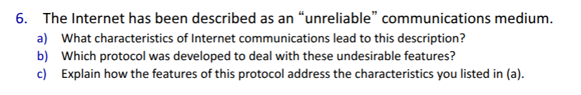

> 互联网是一个“不可靠”的通信媒介
>
> - **a) 哪些特性导致了这一描述？**
>   - **丢包 Packet Loss** 路由器缓冲区溢出导致数据丢失。
>   - **位出错 Bit Error** 传输链路中的电磁干扰导致 0 变 1 或 1 变 0。
>   - **乱序到达 Wrong Seq of Arrival** 不同数据包走不同路径，导致后发的先到。
> - **b) 哪个协议用于处理这些特性？**
>   - **TCP (传输控制协议)**
> - **c) 该协议如何解决这些问题？**
>   - **校验和 Internet Checksum** 检测位错误。
>   - **确认(ACK)与重传：** 修复丢包。
>   - **序号：** 重新排列乱序的包并去重。


#### [6.1.7] 判断

判断对错

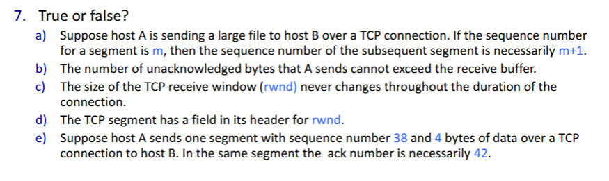

- **a) False.** TCP 序号是基于**字节流**的。如果当前段序号是 $m$，下一个段的序号应为 $m + \text{[当前段的数据字节数]}$，而不一定是 $m+1$。

- **b) True.** 这是流量控制的目的。发送方发送的**未确认（UnAcknowledge）**字节数不能超过接收方告知的接收窗口（rwnd），以防溢出接收缓冲区。

- **c) False.** `rwnd`（接收窗口）是**动态变化**的，取决于接收端应用程序读取数据的速度以及缓冲区剩余空间。

- **d) True.** TCP 报头中有一个 16 位的 "Window" 字段专门用于通告 `rwnd`。

- **e) False.** `ack` 字段表示**期望收到的下一个字节的序号**。

  > 但是不一定是42，有可能是**累计确认覆盖**


# 网络层 Network Layer - Data plane

网络层的功能：

- 路由（Router）
  - 接下来也会介绍路由算法
- 转发（Forwarding）

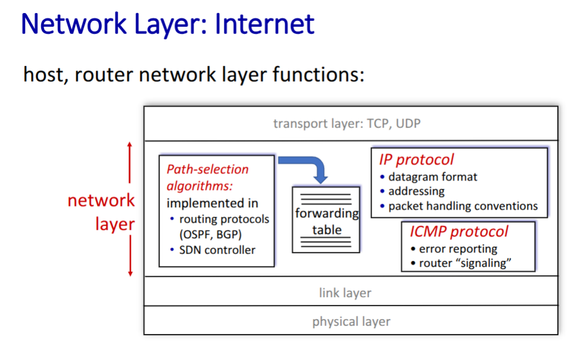

在网络层中，会涉及到 Path Selection，实现方式有 Routing Protocols 和 SDN控制平面。

他们使用 Forwarding Table 进行转发。

此外，该层也有 IP 协议

- 包括 Datagrams 格式
- 寻址
- 处理分组问题

以及ICMP 协议

- 包括错误报告
- 路由器指令

## [1] 网络层的服务与协议

网络层负责将**传输层段（Transport Segment）**从发送端 Host 传送到接收端 Host

- **发送方（Sender）**：将**传输层**的 Segment 封装进 Datagram 中，然后将其传递给下层的链路层 
- **接收方（Receiver）**：在接收到 Datagram 后，提取出其中的 Segment ，并将其交付给上层的**传输层**协议


路由器是网络层的核心设备，其工作包括：

- **检查 Header **：检查所有经过它的 IP 数据报的首部字段（Header Fields） 
- **数据转发**：根据 Header 信息，将数据报从路由器的**Input Ports**移送到合适的**Output ports**，从而确保数据报能沿着端到端的路径不断前进

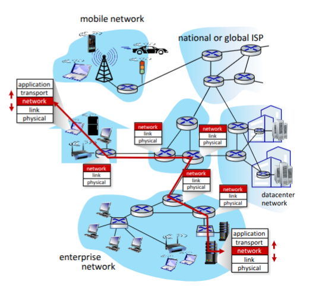


## [2] 数据平面和控制平面

### [2.1] 数据平面

 数据平面 (Data Plane)：局部转发

- **定义**：属于**局部、每台路由器**内部的功能 。
- **任务（转发/Forwarding）**：决定进入路由器输入端口的数据报如何被移动到合适的输出端口 。
- **处理级别**：通常在硬件中实现，处理速度极快（纳秒级） 。

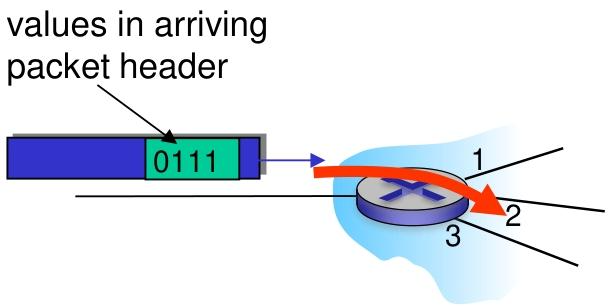

### [2.2] 控制平面

**定义**：属于**全网络范围**的逻辑 。

**任务（路由/Routing）**：确定数据报在从源主机到目的主机的端到端路径中，经过哪些路由器 。（确定路径）

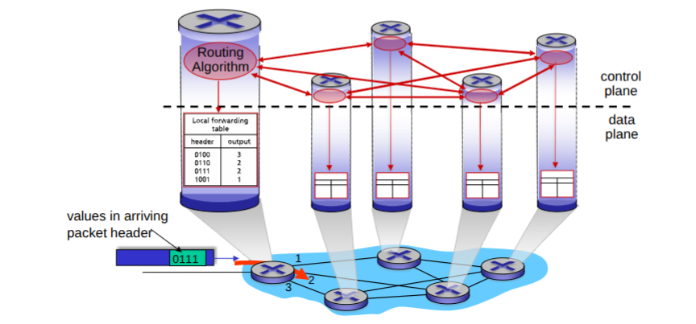


**两种实现方式**：

- **传统路由算法**：在每台路由器中运行，各路由器相互协作（如图二下半部分所示） 。
- **软件定义网络 (SDN)**：由远程服务器（控制器）统一计算并下发转发表给路由器 。

#### [2.2.1] SDN 控制平面

Software-Defined Network （SDN） Control Plane

属于远程控制，在路由器中安装转发表

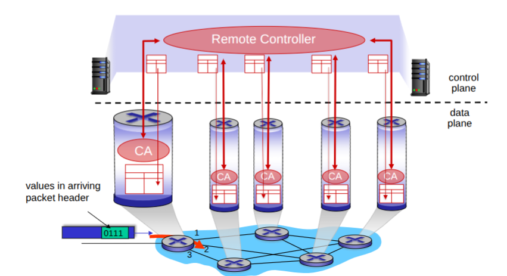


## [3] 网络层服务模型

**网络服务模型（Network Service Model）**定义了**网络层**在发送方和接收方之间传输 Datagrams 时，可以提供的不同类型的服务承诺和质量保障。


**针对单个 Datagrams 的服务 (Services for individual datagrams)**

这类服务关注的是**每一个独立的数据包**是否能成功、及时地送达。

- **保证交付 (Guaranteed delivery)：** 确保发送出的每一个数据包最终都能到达目的地，不会在中途丢失。
- **时延保障交付 (Guaranteed delivery with less than 40 msec delay)：** 不仅保证数据包能送到，还保证它能在特定的时间（如 40 毫秒）内送到。这对于实时性要求极高的应用（如远程医疗或工业控制）非常重要。


**针对 Datagrams 流的服务 (Services for a flow of datagrams)**

这类服务关注的是**一系列相关联的数据包**（即“流”，比如一段视频或一个文件下载）的整体传输特性。

- **按序交付 (In-order datagram delivery)**

  >  确保数据包按照发送的顺序到达接收方（例如，先发 1、2、3，接收也是 1、2、3）。

- **保证最小带宽 (Guaranteed minimum bandwidth to flow)**

  >  模拟一种类似于电路交换的效果，为特定的流预留固定的带宽（如 1 Mbps）。只要发送速率低于这个值，就不会发生丢包。

- **限制分组间间距的变化 (Restrictions on changes in inter-packet spacing)** 

  > 也就是控制**抖动（Jitter）**。确保发送端数据包之间的时间间隔，在到达接收端时保持相对稳定。这对于流媒体和语音通话至关重要，可以防止声音忽快忽慢。


### [3.1] 尽力而为

**尽力而为服务模型（Best-effort Service）**

“尽力而为”意味着网络层**不提供任何服务质量（QoS）保证**：

- **无丢包保证 (Loss)：** 不保证数据报一定能到达目的地（可能会在路由器拥塞时被丢弃）。
- **无时延/顺序保证 (Timing/Order)：** 不保证数据到达的时间，也不保证它们按发送顺序到达。
- **无带宽保证 (Bandwidth)：** 不保证端到端的最低传输速率。


互联网模型与 ATM 网络模型（一种较老的、面向连接的网络技术）：

| **网络架构**     | **服务模型**        | **带宽保证**  | **无丢包保证** | **顺序保证** | **时序保证** |
| ---------------- | ------------------- | ------------- | -------------- | ------------ | ------------ |
| ==**Internet**== | ==**Best effort**== | **None (无)** | **No**         | **No**       | **No**       |
| ATM              | CBR (恒定比特率)    | 恒定速率      | Yes            | Yes          | Yes          |
| ATM              | ABR (可用比特率)    | 保证最低带宽  | No             | Yes          | No           |
| Internet         | Intserv (集成服务)  | Yes           | Yes            | Yes          | Yes          |
| Internet         | Diffserv (区分服务) | 可能有        | 可能有         | 可能有       | No           |

> **Intserv 和 Diffserv** 是为了改进互联网而提出的方案，试图在“尽力而为”的基础上增加一些优先级或资源预留，但由于实现复杂，在大规模公网中应用有限。


既然没有保证，为什么“尽力而为”能成功

**机制简单 (Simplicity)：** 因为不需要复杂的资源预留和状态管理，这种模型极易部署，使得互联网能迅速扩张到全球规模。

**带宽充足 (Sufficient provisioning)：** 虽然没有理论保证，但随着光纤等技术的发展，带宽通常足够大。这使得实时应用（如语音、视频通话）在“大部分时间”里表现得“足够好”。

**复制的、分布式服务 (==Replicated==, distributed services)：** 通过数据中心和 **CDN（内容分发网络 Content Distribution Network）**，内容被放置在离用户物理距离很近的地方，极大地抵消了网络层不确定性带来的延迟。

**弹性服务的拥塞控制 (Elastic Congestion control)：** 像 TCP 协议这样的“弹性”服务可以根据网络拥塞情况自动调整速度，保护了网络的稳定性。


## [4] 路由器内部

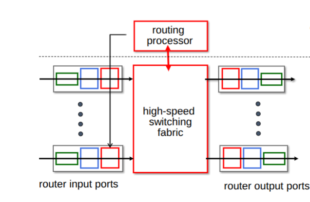

> High-speed Switching Fabric：高速交换**结构/矩阵**


进一步，在高速交换结构前后，有三个小方块，他们实际上是输入功能模块：


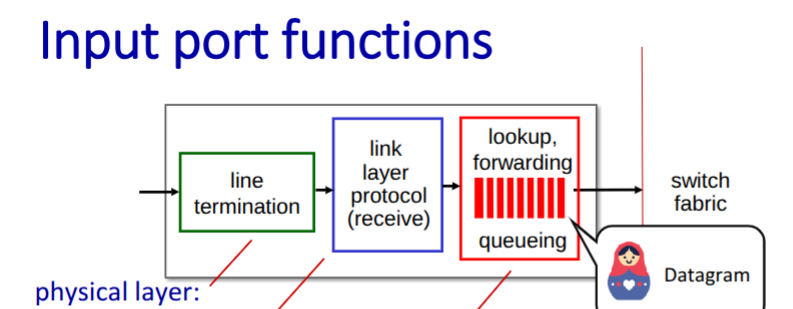


从左到右，数据流经三个关键模块：

- **线路端接 (Line Termination - 物理层):**
  - **功能：** 接收物理层信号（电信号、光信号等），将其还原为**比特流（bit-level reception）**。
- **链路层协议 (Link Layer Protocol - 链路层):**
  - **功能：** 实现特定的 **Linked Layer（下一章）** 协议（如 Ethernet 以太网）。它负责接收帧（Frame），检查错误，并解封出其中的数据包（Datagram）。
- **查找、转发与排队 (Lookup, Forwarding, Queueing - 网络层):**
  - 这是输入端口的“大脑”。
  - **查找/转发：** 查看 **Header** 信息，决定该报文应该通过交换矩阵（Switch Fabric）发往哪个输出端口。
  - **排队：** 如果报文到达的速度超过了交换矩阵处理的速度，报文就会在这里的缓存中排队。


### [4.1] 两种转发方式

为了提高效率，现代路由器不依赖中央处理器来决定每个包的去向，而是在每个输入端口都保存一份**转发表（Forwarding Table）**的副本。以下是两种转发方式：

**基于目的地的转发 (Destination-based forwarding):**

- **传统方式：** 仅仅根据 IP Datagrams 中的**“目的 IP 地址”来决定转发路径**。

**通用转发 (Generalized forwarding):**

- **现代/SDN方式：** 可以根据报文头部的**任何字段组合**进行转发

  > （例如：源/目的 IP、源/目的端口、协议类型等）。这为网络提供了极大的灵活性（如防火墙过滤、负载均衡等）。


#### [4.1.1] 基于目的地的转发

路由器维护一张**转发表 (Forwarding Table)**。

当一个数据包到达路由器时，路由器会查看其“目的地址”。

如果该地址落在表中的某个**地址范围 (Address Range)** 内，就将其通过对应的**链路接口 (Link Interface)** 发送出去。


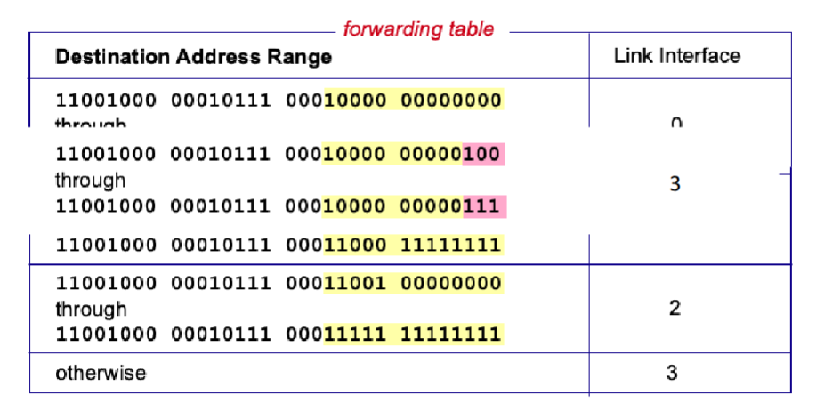

如果地址在第一个范围内，走接口 0。

如果地址在 `...00000100` 到 `...00000111` 之间，走接口 3。

如果不属于上述任何明确列出的范围，则走“否则 (otherwise)”选项，即接口 3。

**局限性**：随着互联网规模的扩大，IP 地址非常多。如果为每个可能的地址段都维护一个精确的起始和终止范围，转发表会变得异常庞大且难以维护。


##### 最长前缀匹配

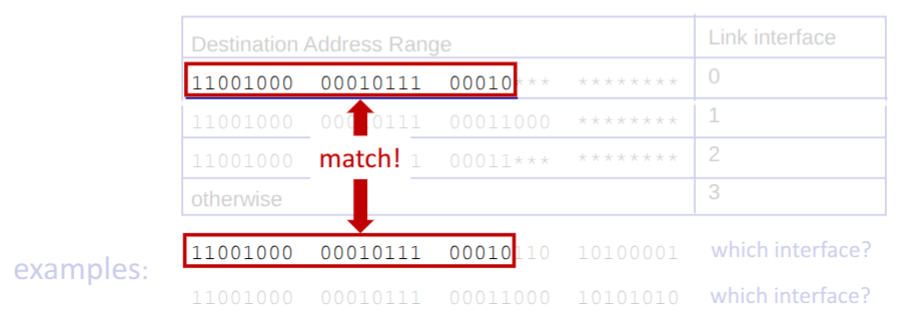


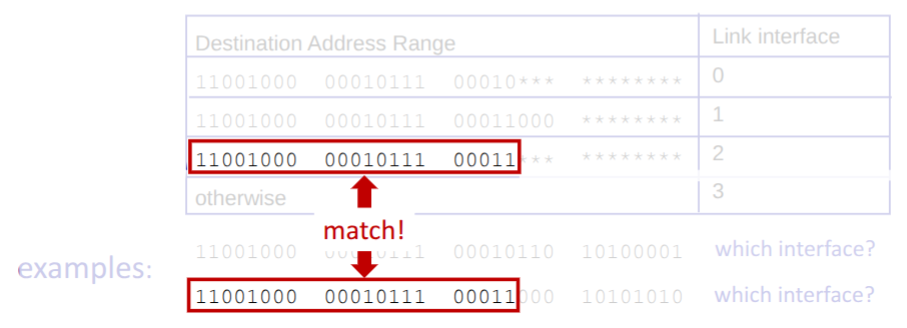

> 第二个例子也可以匹配到 Interface 1，因为`*`是任意匹配字符。
>
> 但是为了准确转发，通常**显式**优先于`*`


最长前缀匹配通常使用三态内容可寻址储存器（TCAMs - Ternary Content Addressable Memories）

- 内容可寻址（Content Addressable）：给TCAM提供地址，在一个时钟周期（One Clock Cycle）内就可以检索到目的地地址，和表大小无关！


#### [4.1.2] 通用转发

Generalized forwarding: match plus action（通用转发：**匹配+动作**）

基于目的地的转发是通过目标IP进行转发，而通用转发则是

- 在 Header 中的字段可能决定动作
- 有许多动作，比如 Drop / Copy/ Modify/ Log Packet（记录）

##### Flow Table / Openflow 开放流

Flow 这个字段是在Header中的一个字段，在 Link-/ Netowrk- / Transport- Layer中定义

- Match（匹配）：查看 Header 部分是否符合预设
- Action（动作）：如果匹配成功应该干什么？Drop / Copy/ Modify/ Log Packet（记录）
- Priority（优先级）：如果一个数据报同时匹配了多个规则，优先级最高的规则生效
- Counters（计数器）：统计信息。记录该规则匹配了多少个数据包（#packets）以及多少字节（#bytes）

Router 的 Flow table 决定了 Router 的 Match+Action 规则

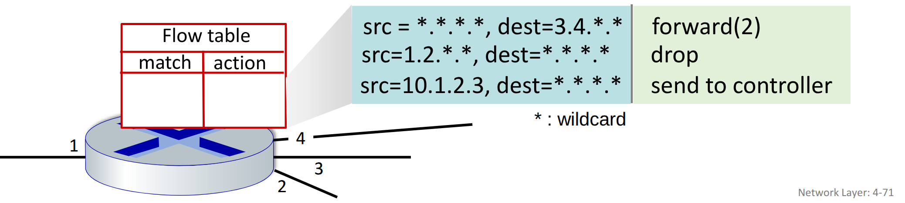

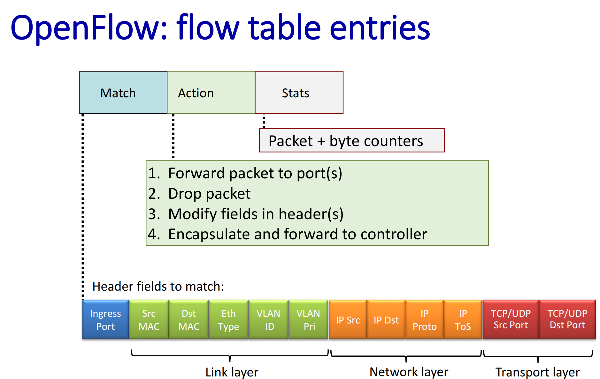


匹配+动作：抽象统一了不同类型的设备

设备：[Match]+[Action]：

- Router [最长前缀匹配IP]+[转发]
- Firewall [IP地址和TCP/UDP端口号]+[Permit / Deny]
- Switch [目的 MAC 地址] + [Forward / Flood]
- NAT [IP地址和端口] + [重写地址和端口]

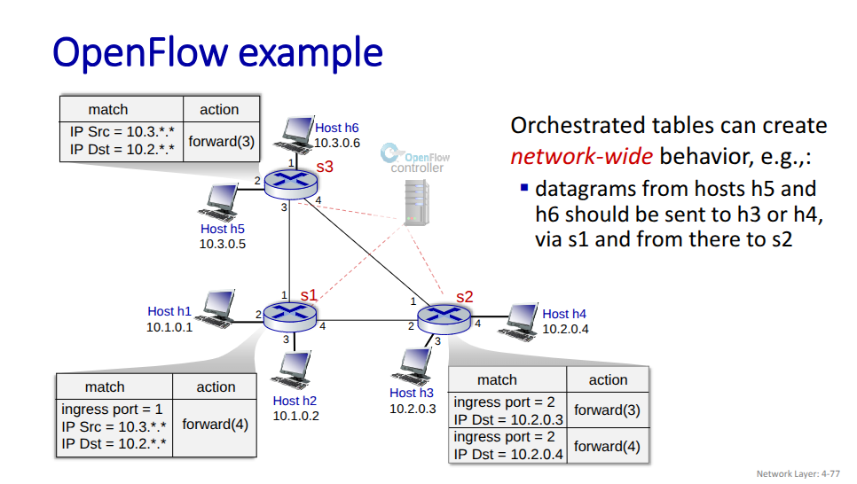


Openflow 协议

- 在SDN Controller 和 Switch 之间执行
- 用TCP
- 三种 OpenFLow 的消息：
  - Controller 到 Switch
  - 异步 Asynchronous （Switch 到 Controller ）
  - Symmertric


### [4.2] 交换结构

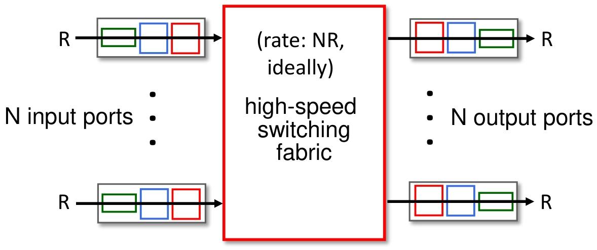

在交换结构中，**交换速率 = 输入速率 / 输出速率**

**理想状态 ($NR$)**：

- 假设路由器有 $N$ 个输入端口。
- 每个端口的线路速率为 $R$。
- **理想的交换速率应该是 $N \times R$**。
- **原因**：如果交换速率达到 $N \times R$，意味着即使所有 $N$ 个输入端口都在以最高速度接收数据，交换结构也能瞬间处理掉这些数据，不会在输入端造成排队和拥塞。


一共有三种主要的交换结构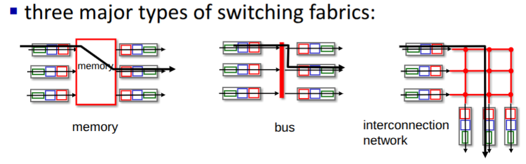

**内存、总线、互相连接的网络**

#### [4.2.1] 内存交换传输

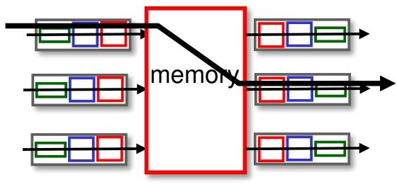

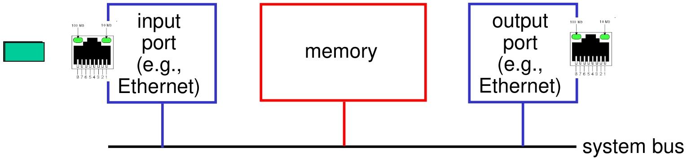


第一代路由器是在路由器中心主板上的CPU下进行交换的

- 数据包复制到系统内存，图中红色区域
- 显然，速度受到内存带宽（Memory Bandwidth）的限制（每个数据需要经过两次Bus传输）

> **第一次穿越**：从输入端口 $\rightarrow$ 系统总线 $\rightarrow$ 内存。
>
> **第二次穿越**：从内存 $\rightarrow$ 系统总线 $\rightarrow$ 输出端口。


显然，这样对总线Bus的消耗确实很大！


#### [4.2.2] Bus 总线传输

Datagrams 通过 Shared Bus从输入端口传输到输出端口

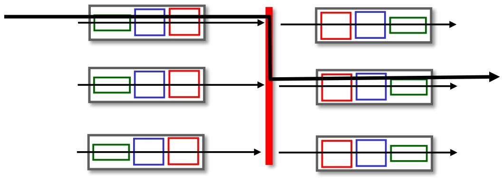


​	当然，这也会导致**总线竞争（Bus Contension）**的问题：交换速率受**总线带宽（Bus Bandwitch）**限制


#### [4.2.3] 相互连接的网络进行传输

Switching via interconnection network

**纵横开关 (Crossbar)、Clos 网络及其他互联网络**：最初是为连接多处理器系统中的处理器而开发的。

> **纵横开关 (Crossbar)**：这是一种简单的网格结构，每条水平线（输入）和垂直线（输出）的交叉点都有一个开关。它的优点是无阻塞，但扩展到大规模端口时成本很高。

**多级交换机 (Multistage switch)**：通过多个阶段的小型交换机组合而成的 $n \times n$ 交换机。

> **多级交换 (Multistage)**：为了解决大规模端口的成本问题，将大的交换机拆分成多个小模块连接。这种结构在大规模数据中心和高性能路由器中非常常见。
>
> 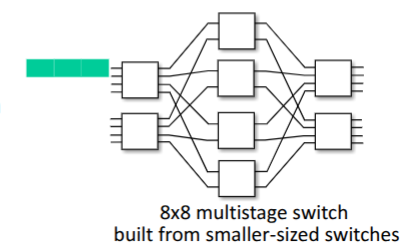

**利用并行性 (Exploiting parallelism)**：

- 在进入交换机时，将**数据报 (Datagram)** 分片为固定长度的**信元 (Cells)**。
- 信元通过交换矩阵（Fabric）进行并行传输，并在出口处重新组装成数据报。

> **切片并行传输**：为了提高效率，现代路由器通常不会直接传输变长的数据包，而是将其切成固定大小的“信元”，这样可以更均匀地利用内部的多个传输路径，实现并行处理。


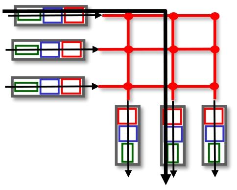


### [4.3] 排队和缓冲问题

这个之前讲过，如果 Swtich Fabric（交换结构）处理速度慢，就可能引发排队

有两个常见的现象

- 端口竞争（Contention）
- 队头堵塞（HOL Blocking / Head of Line Blocking）


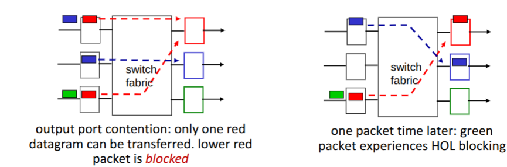


什么时候需要缓冲（Buffering）？

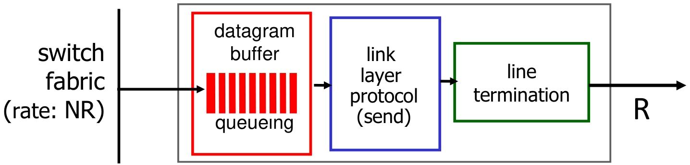


当 Switch Fabric 速度快于（图右侧R）Link传输速度，就需要Buffer！

当然如果Buffer满了就需要 Drop data，也可以通过Priority Schedule（优先级调度）的方法决定哪个包优先。

丢包的情况：

- 端口竞争（Contention）
- 队头堵塞（HOL Blocking / Head of Line Blocking）
- Switch Fabric 速度 > Output Link 速度

## [5] IP 分片

Internet Link （网络链路）有 最大传输大小单元（Max Transfer Unit -- **MTU**） 

当一个 IP Datagram 的大小超过了网络链路所能处理的最大限制时，就需要把它切成小块。

简单来说，大型IP Datagram 在网络内被分割（“分片”）

- 一个 Datagram 变成多个数据报
- 仅在目的地重组（Reassembled）
- IP Header bits 用于识别排序相关的东西


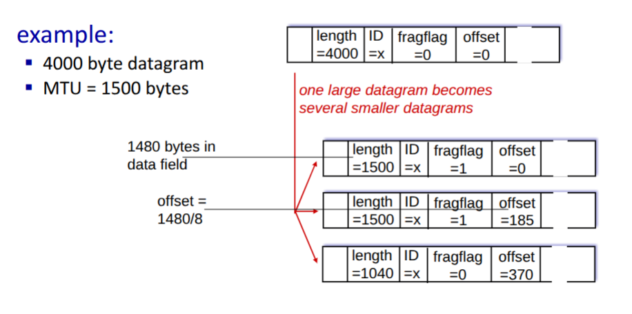

这里一个 Datagram 是 4000 bytes 但是 MTU 为 1500 Bytes！因此我们至少需要分为三片。

为了能让目的地把碎掉的片拼回去，IP 头部包含了三个关键字段：

1. **ID (标识符):** **同一个原始数据报分出来的所有片段，ID 都相同。**
2. **Flags (标志位):** 其中的 `MF` (More Fragments) 位：
   - `MF = 1`：代表后面还有碎片。
   - `MF = 0`：代表这是最后一个碎片。
3. **Offset (偏移量):** 记录**当前碎片的数据在原始数据报中的相对位置**。单位是 **8 字节**（因为**该字段长度限制**，必须通过这种比例缩放来表示大的偏移）。


## [6] IP

The Internet Protocol 互联网协议


### [6.1] 数据报格式

Datagram Format

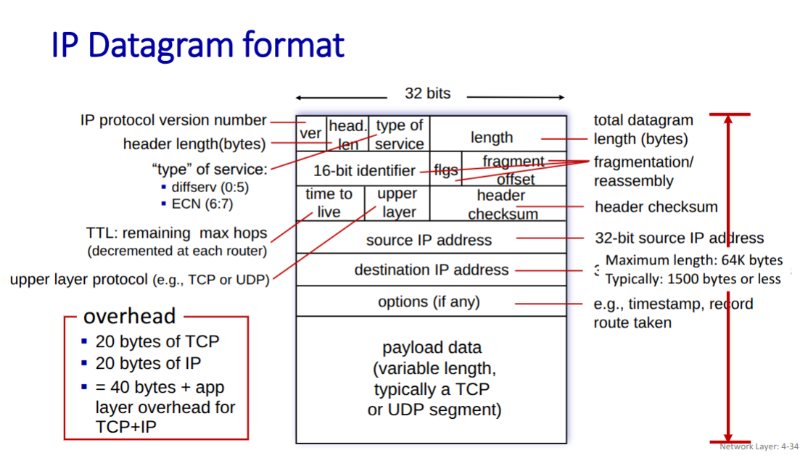

- `ver` 是协议的版本数字
- `head len` 就是 Header 的长度（单位Bytes）
- `type of service` 服务的类型
- `length` 就是datagram的总长度（单位Bytes）


第二行中的`16 bit identifier` 、`flgs` 、`fragment offset` 是用于IP分片的字段

第三行：

- `time to live -- TTL` 每经过一个路由器，该值减 1。当减到 0 时，数据报被丢弃，防止数据包在网络中无限循环。
- `upper layer` 上层协议，比如 TCP 或者 UDP
- `header checksum` Header 校验和


接下来的每一行

- 源IP
- 目的地IP
- 选项
- **实际数据**


### [6.2] Addressing

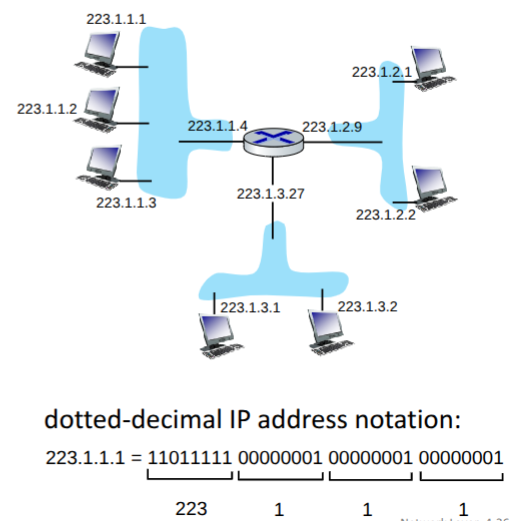

IP Address ：IP地址是一个 32 bit 的标识符，和 Host 或者 Router **Interface** 相关联

Interface指的是 Host/ Router 和物理链路（Physical Link）相连接的部分，物理意义上的接口

- Router一般有多个Interface
- Host一般有1～2个Interface


#### [6.2.1] 子网

**Subnets**

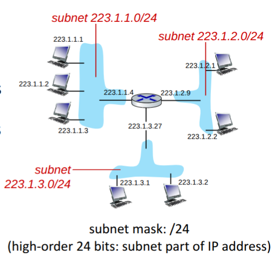

子网是设备接口，这个设备接口物理连接，**不通过路由器**

IP 地址具有**子网部分**：在同一个子网的设备，高位 bit 是相同的

剩余的低位 bit 就是 Host 部分了


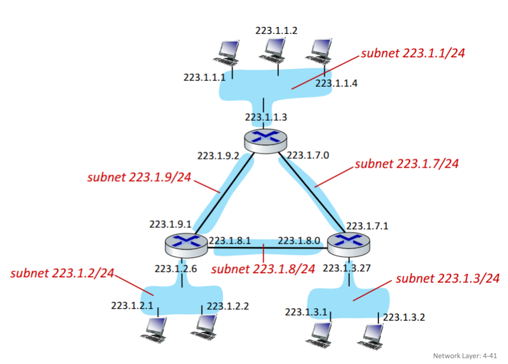


#### [6.2.2] 无类别域间路由 CIDR

CIDR - Classless InterDomain Routing （读作 cider ）

简单来说，CIDR 是一种更灵活的 IP 地址分配方法，取代了早期的“分类”地址分配

**特点**：它允许**任意长度**的子网部分。在过去，子网掩码只能是固定的 8位、16位或 24位，而 CIDR 可以是 1 到 31 位之间的任何数字。


地址格式：`a.b.c.d/x`

这是 CIDR 的标准表示法，也被称为“斜线记法”：

- **`a.b.c.d`**：传统的点分十进制 IP 地址。
- **`/x`**：代表 **网络前缀的长度**（也就是子网掩码中“1”的个数）。它告诉我们 IP 地址的前 `x` 位是属于**网络（子网）部分**，剩下的位属于**主机部分**。


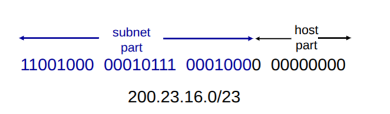

#### [6.2.3] 分层寻址

Hierachical Addressing

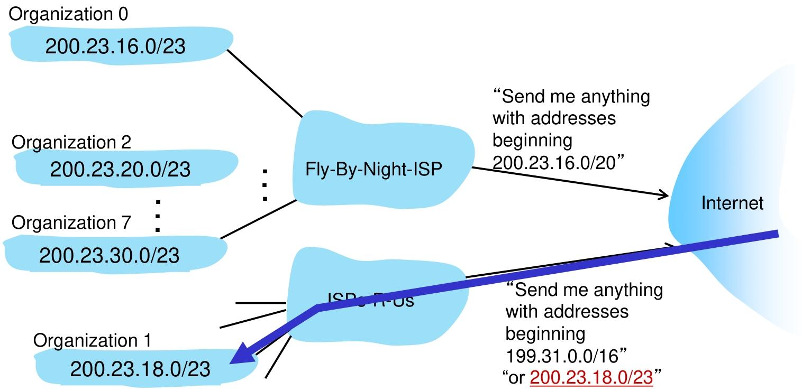


### [6.3] 获取IP地址

这实际上是两个问题

- 主机（Host） 如何获取IP地址？
- 网络如何获取IP地址？

#### [6.3.1] 主机如何获取 IP 地址

 How does a host get IP address?

> 这是指你的电脑、手机或打印机如何在它所属的局部网络（如家里或公司的 Wi-Fi）中获得一个独一无二的编号（主机部分）。

##### Hard-coded / Static IP

静态配置：由系统管理员手动将 IP 地址输入到设备的配置文件中。

**特点：** 地址是固定的，除非手动更改，否则永远不会变。

**例子：** **公司打印机：** 为了让所有人都能方便地连接，管理员会给打印机设置一个固定 IP（如 `192.168.1.50`）。

- **服务器：** 网站服务器需要固定地址，否则用户今天能访问，明天可能就找不到它了。


##### DHCP

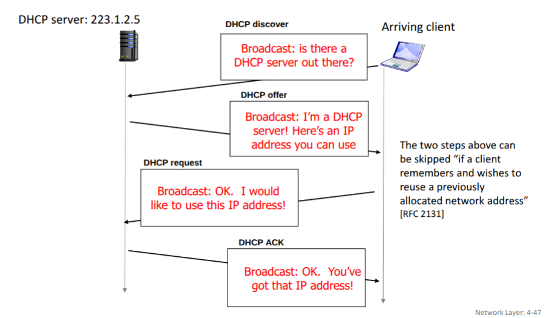

> **DHCP 四步交互过程**
>
> 刚接入网络的笔记本电脑（客户端）向网络内发送一个**广播消息**，询问：“这儿有 DHCP 服务器吗？”
>
> 因为客户端此时还没有 IP 地址，也不知道服务器在哪，所以必须通过广播让所有人都能听到。
>
> 处于地址 `223.1.2.5` 的 DHCP 服务器收到请求后，通过广播回应：“我是服务器！这儿有一个你可以使用的 IP 地址。”
>
> 客户端收到回应后，再次发送广播：“好的，我想正式请求并使用这个 IP 地址！”
>
> 即使它只收到了一个 Offer，**也要发送广播**。这样如果网络中有多个 DHCP 服务器，其他服务器看到这个广播后就会撤回它们之前提供的地址。
>
> 服务器最后发送一个广播回应：“没问题，那个 IP 地址现在归你了！”

动态获取 (DHCP: Dynamic Host Configuration Protocol)

设备连接网络时，自动向 **DHCP 服务器**（通常是你的路由器）“讨要”一个可用的临时地址。

- **特点：** “即插即用”（Plug-and-play），非常方便，地址可能会变。
- **例子：**
  - **星巴克 Wi-Fi：** 当你走进咖啡馆连上 Wi-Fi 时，你不需要进行任何设置。你的手机会自动发送一个请求，路由器的 DHCP 服务会从它的“地址池”里抓一个没被占用的地址分给你。当你离开后，这个地址会被收回分给下一个人。


DHCP 除了返回子网上的IP地址，还能返回

- 客户端**第一跳（First-hop）** Router 地址
- DNS服务器名称和IP地址
- 网络掩码 /  子网掩码 (Subnet Mask)（指示地址的网络部分和主机部分）

> 例如，给定一个 IP `192.168.1.130` 和掩码 `/25`：
>
> 1. `/25` 意味着网络号占了 25 位。
> 2. 最后 7 位是主机号 ($2^7 = 128$ 个地址)。
> 3. 你可以立刻判断出这个网段被分成了两半（0-127 和 128-255），而 `.130` 属于第二个子网。

 

#### [6.3.2] 网络如何获取 IP 地址

How does a network get IP address?

这是指整个公司或你家里的路由器，作为一个整体，如何从广域网（互联网）获取一个属于自己的 IP。

**获取方式：** 通常是从 **ISP（互联网服务提供商）** 处获得。

> **例子：**
>
> - **家庭宽带：** 当你向中国电信、中国联通或移动申请安装宽带时，他们会从他们拥有的巨大地址池中，分配一个（或一小组）IP 地址给你家的路由器。
> - **大型企业：** 像腾讯或阿里这样的公司，会向区域性的互联网注册机构（如 APNIC）直接申请一大块 IP 地址段（例如一万个连续的地址），供全公司的员工和服务器使用。


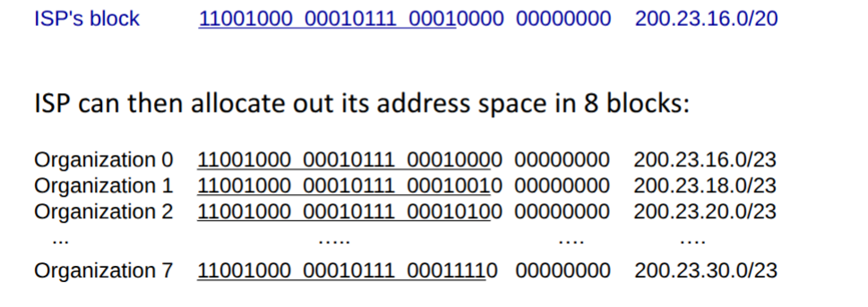

那么互联网提供商（ISP） 是如何获得地址的？

- 通过[ICANN - Internet Corporation for Assigned Names and Numbers](http://www.icann.org/)
  - ICANN 通过5个**区域注册机构（Regional Registries - RRs）**分配IP地址
  - RRs然后又分配给本地机构
  - 管理DNS root zone，包括各顶级域名（`.com`等）的管理者


32 位 IP 够用吗？

不够。2011年ICANN把最后一批IPv4分配给了RRs

**NAT有助于缓解IPv4地址空间耗尽的问题**

也可以使用IPv6（128位）


### [6.4] NAT 拯救 IPv4

NAT 的作用是让多台位于本地局域网（LAN）内的设备，能够通过共享**同一个**公网 IP 地址来访问互联网。

本地网络仅共享一个IPv4地址！

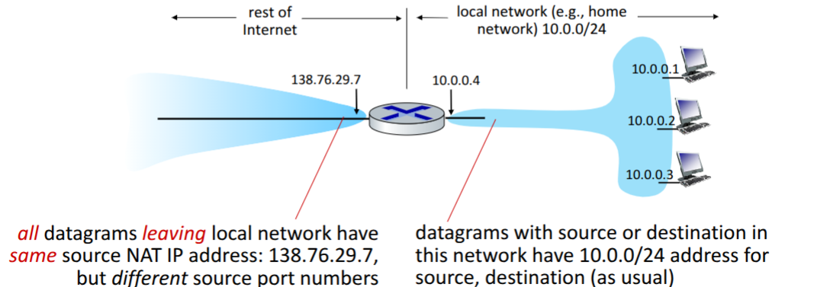

对外界而言，他们只关心`138.76.29.7` 即可！

所有离开本地网络的datagrams都有**相同的** NAT IP 地址：`138.76.29.7`，只不过端口号不同


局域网中的IP不可以和外面的网对接，但是这样做的好处就是所有设备只需要从ISP获取一个IP即可

安全性：本地网络内的设备无法被外部世界直接寻址和看见


对于 datagrams：

- 出站的Datagrams 必须做出替换：`源IP --> NAT IP`、`port --> new port`
- 远程Client把`NAT IP`、`new ip` 作他们的目的地址使用
  - 在NAT Translation Table中都有对应的**映射对**
- 传入的就反过来！

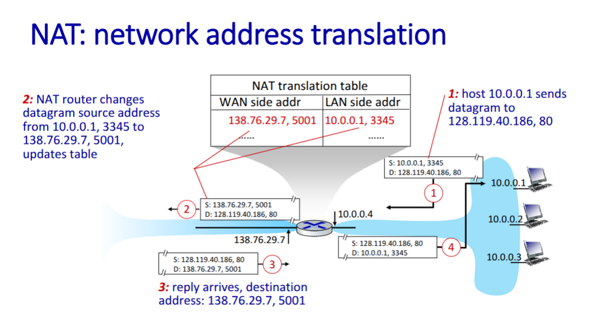

大概就是这个过程，WAN side address 就是互联网部分，LAN 部分就是内网部分！


NAT 也存在一些争议：

- 有人认为 IPv4短缺应当用IPv6解决而不是NAT
- 也有人认为路由器最多只处理三层
- 违反了端对端的原则（因为现在是网络层对port #操作）
- NAT Traversal（NAT 穿透）如果客户端想要连接NAT后的服务器怎么办？


### [6.5] IPv6

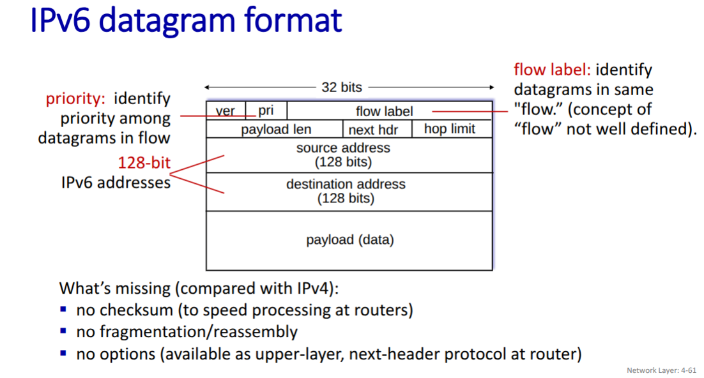

与IPv4相比缺少的内容：

- 无校验和（为了在Routers中更快）
- 无分片/组合部分
- 没有Options


为了让 IPv6 数据包能够通过只能识别 IPv4 的路由器区域，使用了**隧道技术（Tunneling）**。

- **基本原理：** 将整个 **IPv6 数据报**（Datagram）作为**有效载荷（Payload）**封装在一个 **IPv4 数据报**中。
- **形象比喻：** 就像是一辆载满货物的“IPv6 小货车”，开进了一辆巨大的“IPv4 运输卡车”里。对于中间的 IPv4 路由器来说，它只看外面那层 IPv4 的“车壳”，并不知道里面其实还装了一个 IPv6 的包。
- **术语：** 这种操作通常被称为 **“包中包” (Packet within a packet)**。

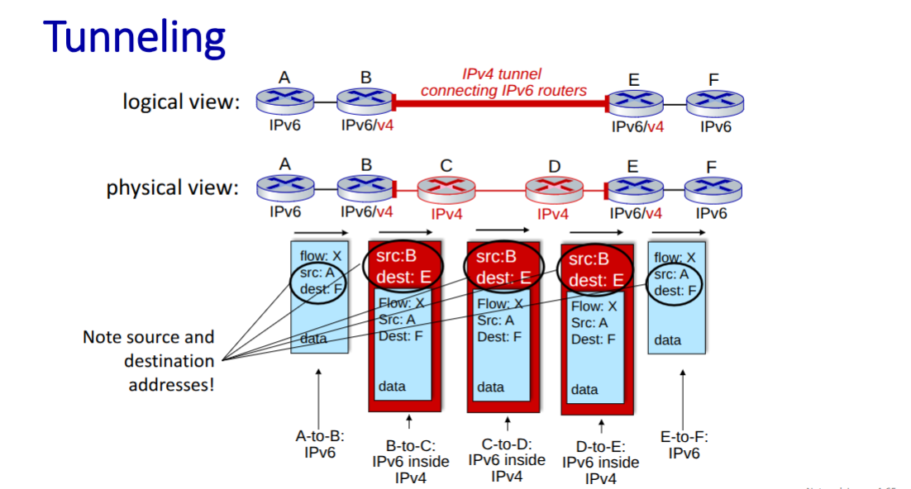


## [7] 详细的控制平面

网络层有两个功能

- Forwarding （转发） ： 数据平面曾
- Routing （路由）：控制平面

构建网络控制平面的两种方法

1. Pre-router Control  Plane（传统的方法）
2. Logically Centralized Control Plane （软件定义网络）

### [7.1] Pre-router Control Plane

**每个路由器**中的独立路由算法组件在控制平面中相互作用

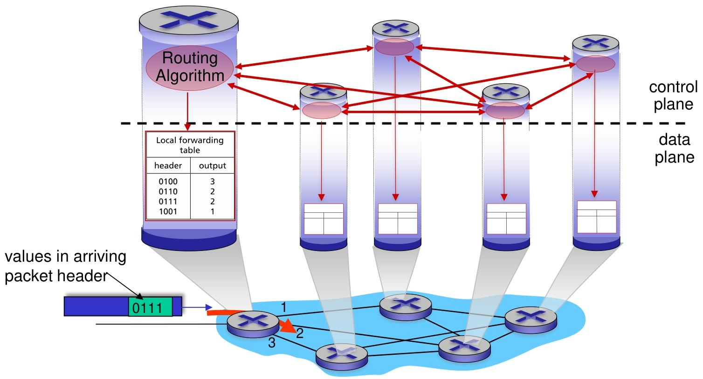


### [7.2] Logically Centralized Control Plane

软件定义网络（也就是之前提到的SDN Software Define Network）：远程控制器计算并在路由器中安装转发表

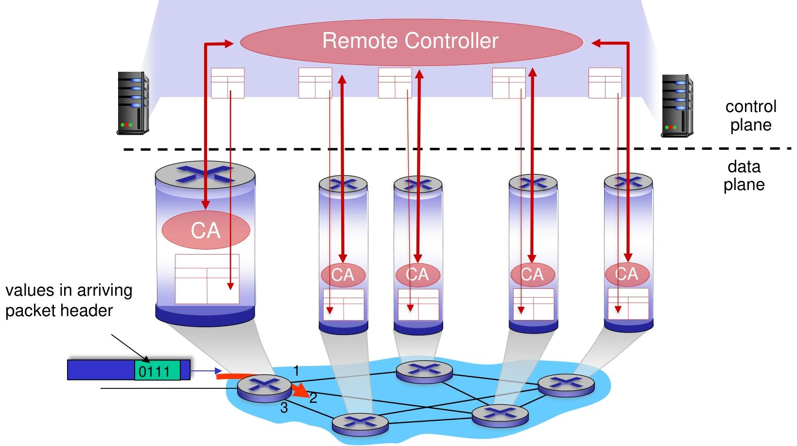


因此，我们介绍了两个方法：

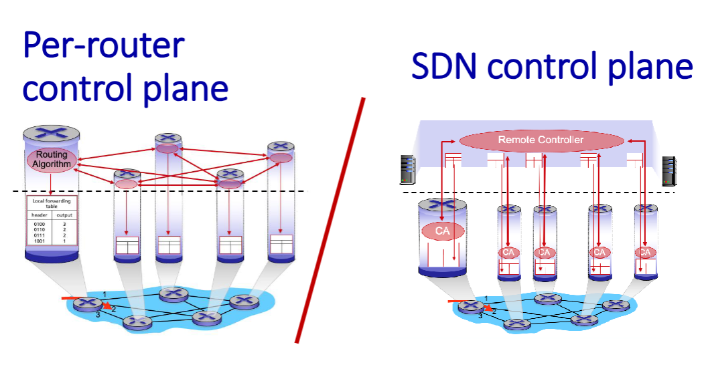


传统的方法和SDN

在 SDN 出现之前，互联网的网络层主要采用的是**分布式（Per-router control）**的方法。

> - **单体路由器 (Monolithic Router)：**  **软硬件绑定：** 路由器是一个“黑盒”。它既包含特定的交换硬件（转发数据），也运行着厂商私有的操作系统（如 Cisco 的 IOS）。
>   - **协议实现：** 路由器内部运行着各种互联网标准协议（如路由协议 RIP, OSPF, BGP 等），但这些协议的底层实现是厂商私有的。
>   - **难于更改：** 如果你想改变路由器的行为，你必须依赖厂商提供的更新，用户无法轻易通过编程来控制网络。
> - **“中间件”堆叠 (Middleboxes)：**  为了实现除了基础路由之外的功能（如安全、加速、地址转换），网络中充满了各种专用的硬件设备：**防火墙 (Firewalls)**、**负载均衡器 (Load balancers)**、**NAT 转换盒**等。
>   - 这导致网络架构非常复杂且难以维护。
>
> ---
>
> 指定路径的困难 (Path Control)
>
> 传统路由是基于“最短路径”算法（如 Dijkstra 算法）的。路由器根据链路权重（Link Weights）计算出到达目的地的总开销最小的路径。
>
> 如果网络管理员希望 $u$ 到 $z$ 的流量走路径 $u \rightarrow v \rightarrow w \rightarrow z$（上方的路径），而不是当前最短的 $u \rightarrow x \rightarrow y \rightarrow z$。
>
> **困难点：** * 管理员唯一的调节手段（“旋钮”）就是**修改链路权重**。
>
> - 为了让流量改道，你可能需要调低上方链路的权重或调高下方链路的权重。
> - **连锁反应：** 改变一个权重可能会影响到网络中其他成百上千个节点的路由计算，导致其他不相关的流量也发生不可预见的偏移。这被称为“牵一发而动全身”。
>
> 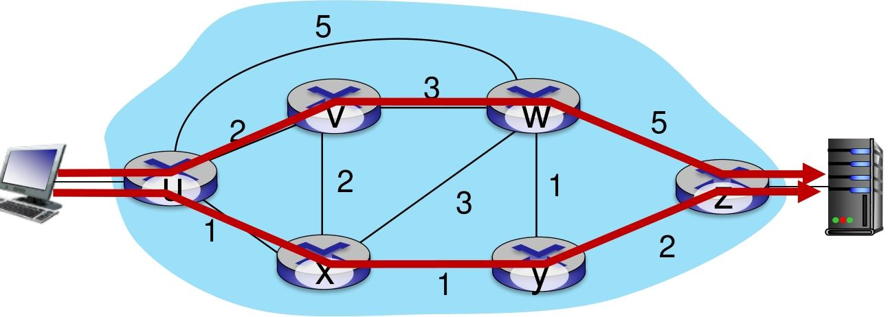
>
> 负载均衡的困难 (Traffic Splitting)
>
> 网络管理员希望将 $u$ 到 $z$ 的流量**同时**分摊到两条路径上（$u \rightarrow v \rightarrow w \rightarrow z$ 和 $u \rightarrow x \rightarrow y \rightarrow z$），以避免单条链路拥塞。
>
> **问题：** 传统路由通常只选择**一条**最佳路径。
>
> 除非两条路径的累积权重**完全相等**（即 ECMP，等价多路径路由），否则路由器只会选择其中开销最小的那一条。
>
> **局限性：** 在复杂的网络拓扑中，很难通过手动配置让不同的路径权值完全对等。传统路由协议缺乏一种灵活的机制来“按比例”或“跨非等值路径”分配流量。
>
> 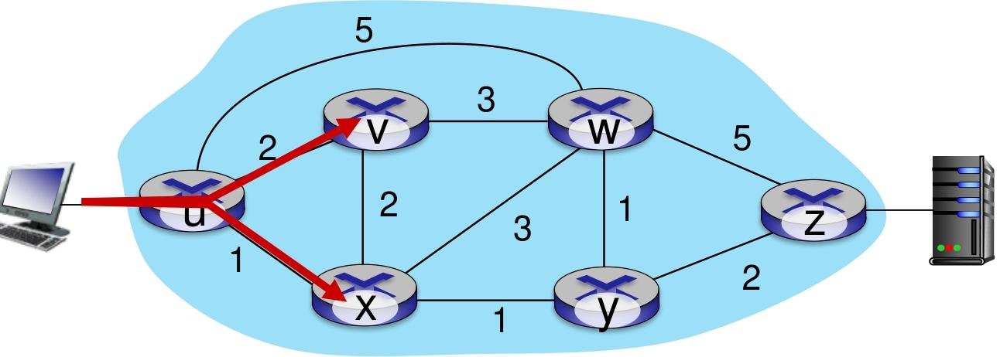
>
> ---
>
> 网络管理员希望 $w$ 对这两股流量采取不同的处理方式。例如，让红色流量直接走 $w \rightarrow z$，而让蓝色流量绕行 $w \rightarrow y \rightarrow z$。
>
> **传统路由的结论**：**做不到**。
>
> 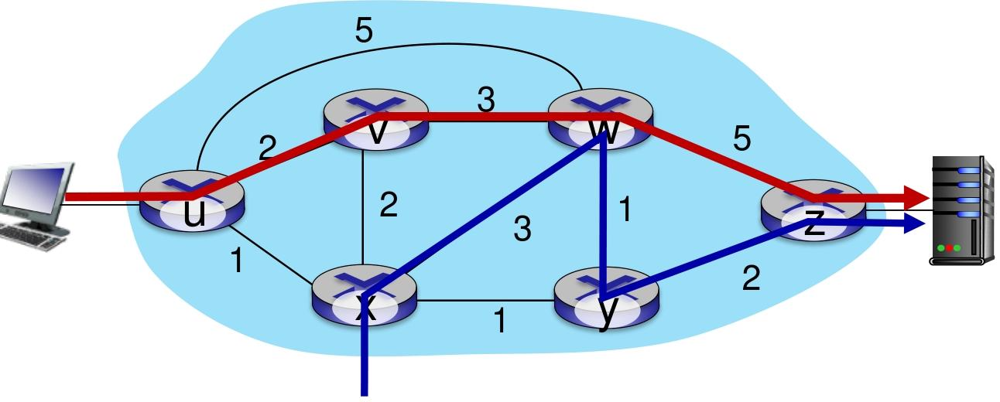
>
> ---
>
> 
>
> **从 2005 年左右开始**，业界开始重新思考**网络控制平面 (Network Control Plane)**。


SDN 是更简单的网，是逻辑集中的控制平面，能避免路由器配置错误，基于表的转发，允许编程路由器

1. 集中式编程更简单，集中计算表格并分发
2. 分布式变成难度更高，所以SDN改掉了这个问题


SDN 区别于传统网络的四个关键点：

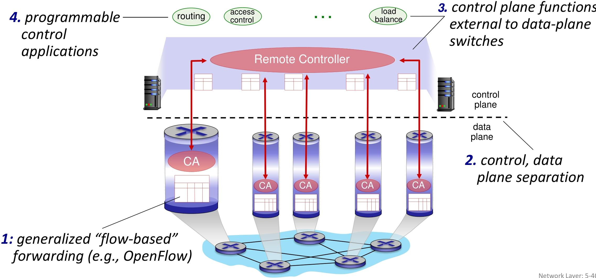

- 通用**“基于流”的转发 (Generalized "flow-based" forwarding)**

  > 不同于传统路由器仅根据目的 IP 地址转发，SDN 使用“流表” (Flow Table)。
  >
  > **OpenFlow** 是最著名的协议。它允许根据多种匹配条件（如 MAC 地址、IP 地址、端口号等）来决定数据包的去向。

- 控制面与数据面分离 (Control, data plane separation)

  > 图中有一条明显的虚线。**数据面 (Data Plane)** 负责快速搬运数据包，而 **控制面 (Control Plane)** 负责决定搬运的路径。

-  控制平面功能位于数据面交换机外部 (Control plane functions external)：

  > 网络不再由每台交换机独立计算路径，而是由一个**远程控制器 (Remote Controller)** 统一管理。这意味着交换机变“傻”了，只需要听从控制器的指令。

- **可编程的控制应用 (Programmable control applications)：**

  > 网络变得像计算机一样可以编程。你可以编写不同的应用程序（如路由程序、防火墙/访问控制、负载均衡）直接运行在控制器之上，灵活地改变网络行为。


SDN 控制器是整个网络的中枢核心，被形象地称为“网络操作系统 (Network OS)”。

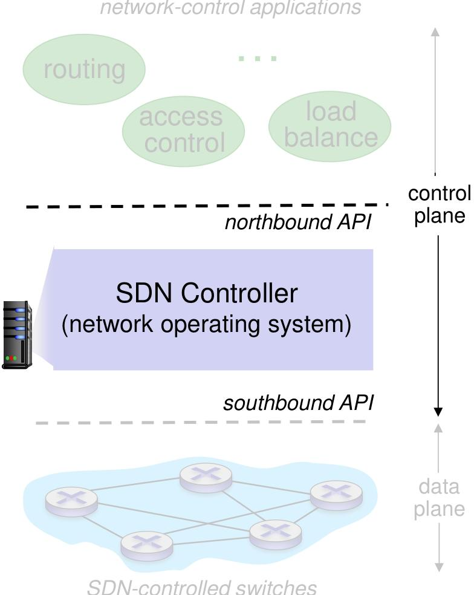

- **维护状态信息：** 控制器负责收集并维护整个网络的拓扑结构、链路状态、交换机信息等实时数据。
- **北向接口 (Northbound API)：** 向上与“网络控制**应用**”交互，为应用层提供统一的编程接口。
- **南向接口 (Southbound API)：** 向下与“**数据面**交换机”交互，将逻辑指令转化为硬件可执行的流表。
- **分布式实现：** 为了确保在大型网络中的高性能、可扩展性、容错性和鲁棒性，控制器通常采用**分布式系统**来实现，而不是单台服务器。

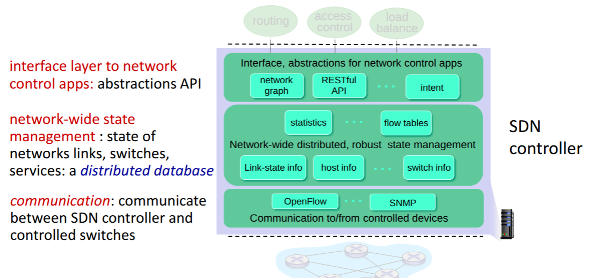

SDN Controller内部分为这些部分

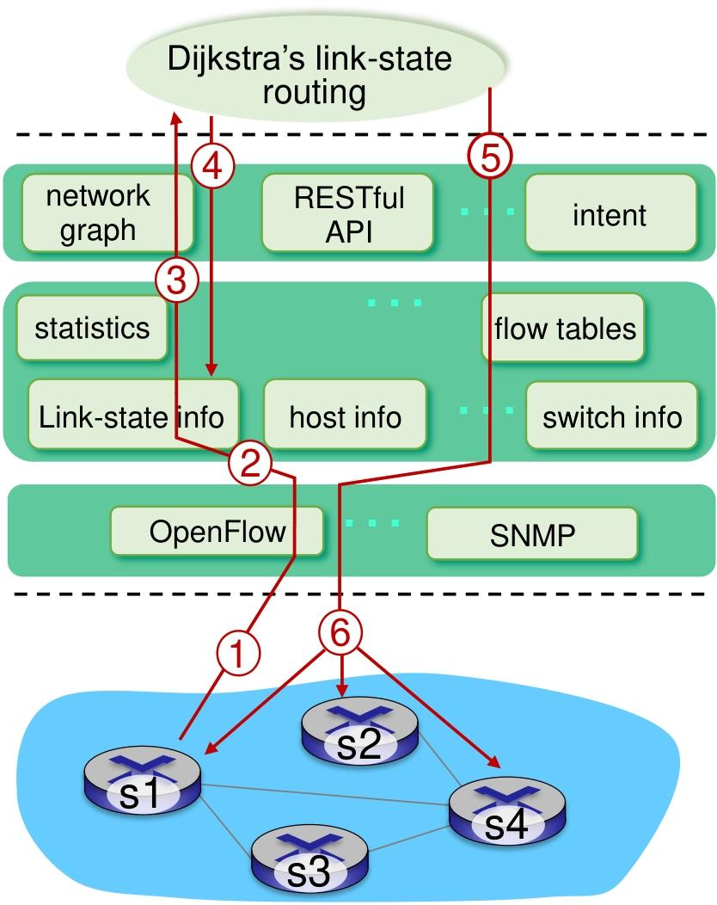

> 1. **故障上报**：交换机 $s1$ 发现链路断了，通过 OpenFlow 协议向控制器“打小报告”。
> 2. **更新状态**：控制器收到消息，更新自己手里的“网络状态手册”。
> 3. **触发算法**：控制器通知路由应用（Dijkstra 算法）：“路断了，快重新算一下”。
> 4. **计算路径**：路由应用调取最新的网络地图，计算出一条绕开故障的新路径。
> 5. **生成流表**：路由应用告诉流表组件新路径，组件将其转化成交换机能读懂的“规则（流表）”。
> 6. **下发规则**：控制器把这些新规则发给相关的交换机，网络恢复通畅。


此外，**网络控制应用**位于架构的最顶层，利用控制器提供的服务来实现具体的网络逻辑。

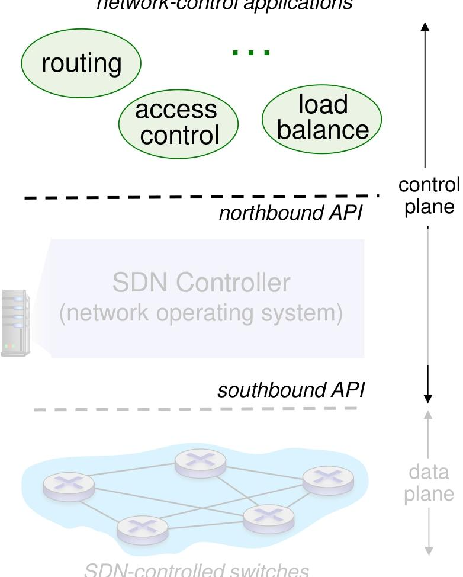

- **逻辑实现：** 它们是控制逻辑的真正“大脑”，通过调用控制器提供的 API 来实现路由选择、访问控制、负载均衡等功能。
- **解耦与开放 (Unbundled)：** 这是 SDN 的一大进步。这些应用可以由**第三方提供**，这意味着企业不再被特定的路由硬件厂商绑定，可以根据需求灵活更换或自定义控制逻辑。


### [7.3] 路由协议

路由协议的目标是找到一个**好的路径**。


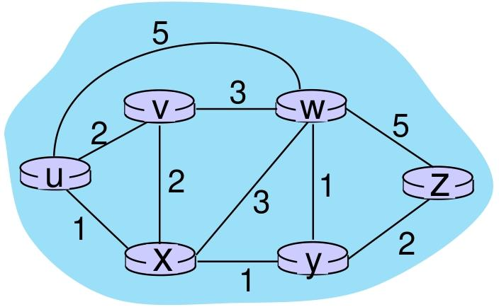

有很多路由，以及权重。算法考虑的维度

- 静态或者动态？
- 全局还是去中心化？


### [7.4] AS-Domain

把路由器**聚合（Aggregation）**到自治系统（Autonomous System, aka **AS** or **Domains**）。

- 在这个AS中，所有Router必须运行相同的 **domains protocols**
- 不同的AS之间连接的路由叫做 Gateway Router


**为什么我们要加上AS路由？**

第一个原因：

- **域外路由（Inter-AS）：**及到不同的商业实体（比如两个互相竞争的运营商）
  - 比如，运营商 A 可能不想为运营商 B 免费转发流量，除非对方付了钱。因此，路由决策更多是基于“商务协议”而非“技术最优”。
- **域内路由 (Intra-AS)：** 整个网络由同一个管理员控制
  - 因为是“一家人”，不需要担心安全或商业竞争，所以策略非常简单，主要目标就是把数据包送达。

第二个原因是：这是为了解决互联网过于庞大的技术难题。

- 如果全球数亿台路由器都跑同一个协议，路由表会变得无比巨大，网络更新也会拖慢整个互联网。

第三各原因是：性能

- **域内路由 (Intra-AS)：** **性能至上**。既然是自己的网络，管理员会使用如 OSPF 或 IS-IS 等协议，寻找“最短路径”或“最快路径”，专注于如何让数据传输得更有效率。
- **域外路由 (Inter-AS)：** **策略凌驾于性能**。即便通过某个邻居 AS 的路径更短、更快，但如果那个邻居是竞争对手或者经过它的费用太贵，管理员宁愿选择一条更远、更慢但更符合策略的路径。


互相连接的AS系统就像：

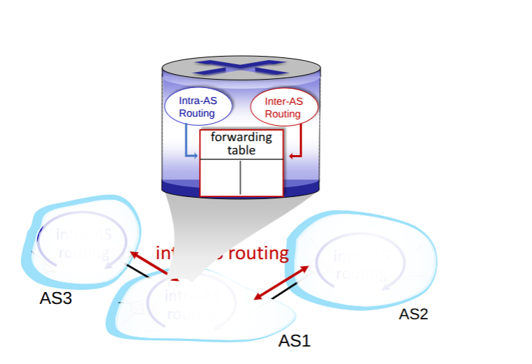


AS 内部的路由有什么协议呢？

- RIP - Routing Information Protocols （这个和DV有关，30s换一次DV，现在不常使用了）
- EIGRP - Enhanced Interior Gateway Routing Protocol （这个也是基于DV的）
- OSPF - Opeh Shortest Path First （链路状态路由，IS-IS本质上就是OSPF）


#### [7.4.1] OSPF

> OSPF（开放式最短路径优先）路由

- 开放：公共可用
- 传统方法：
  - 每个路由器都将OSPF链路状态通告（直接通过**IP**而不使用TCP/UDP）**泛洪（Flooded）**到整个自治系统中的所有其他路由器。
  - 使用 Dijkstra 算法
- 安全性：所有OSPF消息均经过认证（以防止恶意入侵）


**分层 OSPF （Hierarchical OSPF）**

- 两级层次结构：本地区域（Local）、骨干区域（Backbone）
- 链路状态通告仅在区域内或骨干网中**泛洪（Flooded）**
- 每个节点都有详细的区域拓扑（Topology）；只知道 到达其他目的地的方向


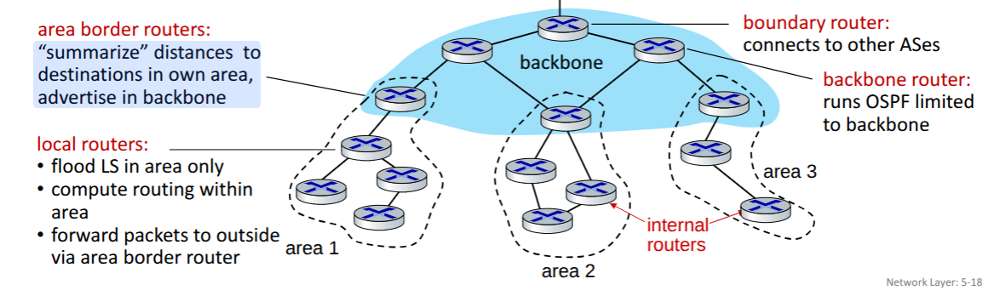


### [7.5] 边界网关协议

Boarder Gateway Protocol

它被誉为“将互联网缝合在一起的**胶水**”。没有 BGP，各个独立的网络（如中国电信、Google、亚马逊等）就无法互相通信。

BGP 允许一个子网（Subnet）向互联网的其他部分宣告自己的存在。

- **宣告内容**：“我就在这里，我可以到达这些目的地，具体的路径是这样的。”
- **目的**：确保全球互联网都知道如何找到特定的 IP 地址段。


| **功能点**              | **说明**                                                     |
| ----------------------- | ------------------------------------------------------------ |
| ==**获取信息 (eBGP)**== | 从相邻的 AS 获取目的地网络的可达性信息。这被称为 **eBGP** (External BGP)。 |
| **路径决定 (Policy)**   | 根据可达性信息和**策略（Policy）**来决定去往某个网络的最佳路径。注意：BGP 不仅仅看距离，更看重商业协议和安全策略。 |
| **内部传播 (iBGP)**     | 将获取到的路由信息传播给 AS 内部的所有路由器。这被称为 **iBGP** (Internal BGP)。 |
| **通告 (Advertise)**    | 向相邻的 AS 宣告自己的路由信息，告诉别人“你可以通过我来到达某些地方”。 |

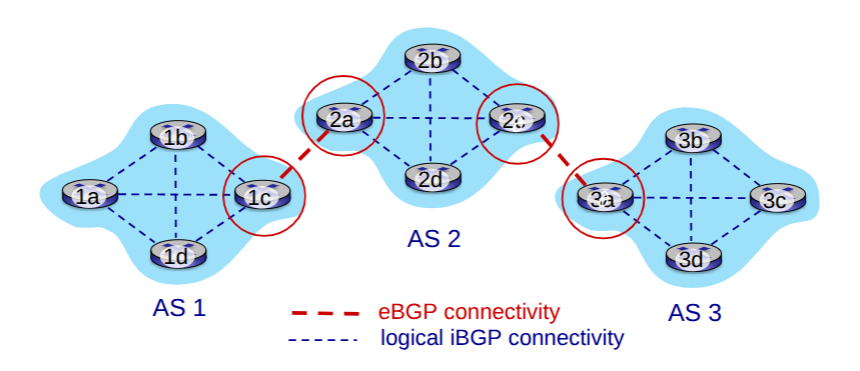


BGP会话：两个 BGP 路由器（称为 **“Peers” 或对等体**）通过半永久性的 **TCP 连接**交换 BGP 报文。

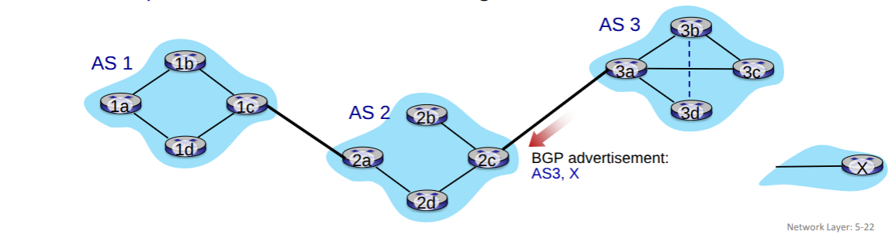

**传播内容**：它们交换的是通往不同目的网络前缀（Prefixes）的**路径 (Paths)**。

> **承诺含义**：当 AS3 向 AS2 发出这个通告时，AS3 实际上是在向 AS2 做出**承诺**：**“如果你把发往 X 的数据包给我，我保证会帮你转发到目的地 X。”**

除此之外还可能存在多路径


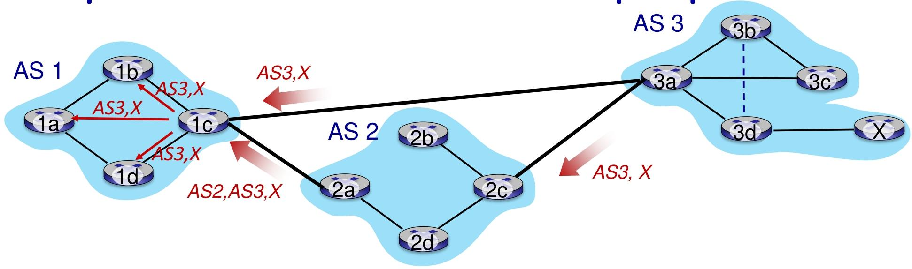


这里，1c 是 gateway router ， 它知道如果要发送X，应该发给谁，因此1c通过iBGP告诉了他们内部路由1a 1b 和1d

因此1d就记住了一个表格

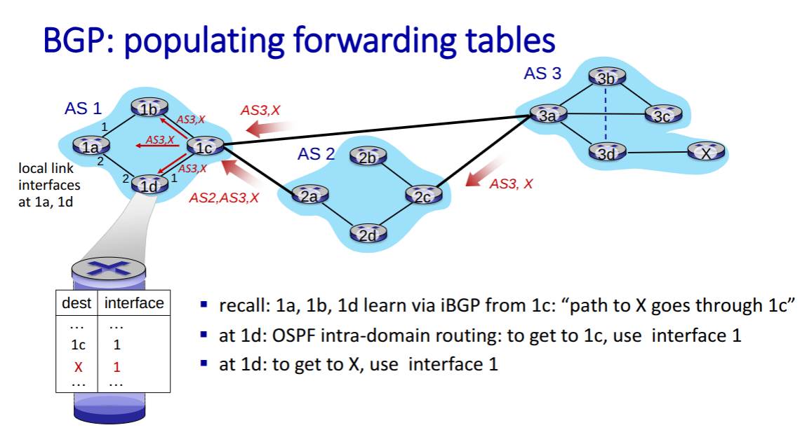


然后，1d也告诉了1a，1a也记住了，因此

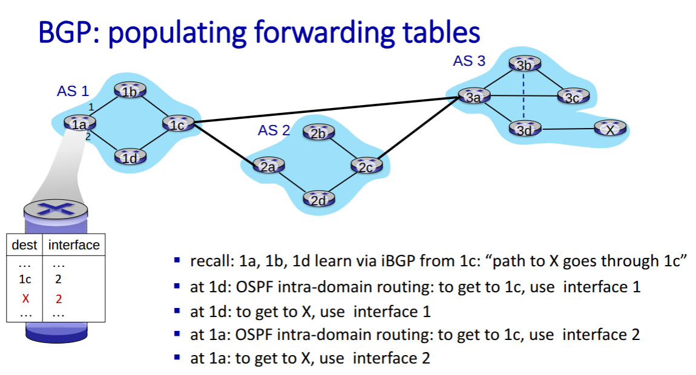


什么是**热土豆路由？（Hot Potato Routing）** 不在乎AS域**外**的转发，我只关心AS****

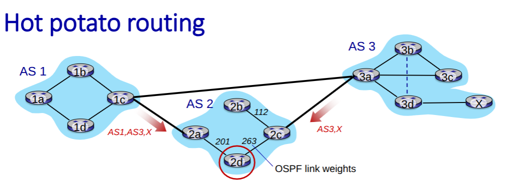

例如2d选择2a，内部成本低，外部成本高（但是不管）


BGP 通告由**前缀（Prefix）+属性（Attributes）**

- Prefix - 前缀，正在通告的目的地 例如 `192.168.0.0/16`
- 两个重要属性
  - AS-PATH ： 防止环路（如果路由器看到自己的 AS 已经在列表中，则拒绝该路由）并帮助选择最短路径。
  - NEXT-HOP ： 指向通往下一个 AS 的**特定内部路由器** IP 地址


BGP 与普通路由协议（如 OSPF）最大的不同在于，它不是单纯寻找“最短路”，而是根据**商业协议或安全政策**来决定路径


路由通常会学习多个路由给出的信息：

- 本地优先级优先
- 最短 AS-PATH 优先
- 最近 NEXT-HOP 优先：热土都服务器
- 其他乱七八糟的标准


# Link Layer

**链路 (Links)：** 指沿通信路径，连接**物理相邻**节点（即中间不经过网络层路由器）的通信通道。

- 包括：有线链路、无线链路。
- 以及：局域网 (LANs)。

> 链路层负责通过特定的链路，将数据报从一个节点传输到与其**物理相邻**的下一个节点。

**帧 (Frame)：** 链路层的分组单位，它封装了来自上层（网络层）的**数据报 (Datagram)**

- 将网络层的数据报封装进“帧”中，并添加**首部 (Header)** 和 **尾部 (Trailer)**。
- 在帧首部中使用 **“MAC”地址** 来标识**源节点和目的节点**（请注意，这与 IP 地址是完全不同的概念！）。


**数据报通过不同的链路，由不同的链路协议进行传输：**

- 例如：第一段链路可能使用 **WiFi** 协议，而下一段链路则使用**以太网 (Ethernet)** 协议。

**每种链路协议提供的服务各不相同：**

- 例如：某些协议可能提供链路上的**可靠数据传输**，而另一些协议则不提供（仅负责**尽力而为**的传输）。


**信道访问（Channel Access）：** 如果物理媒介是共享的（例如 WiFi），则负责协调多个节点对信道的访问。

**相邻节点间的可靠传输：**

- 我们已经掌握了实现可靠传输的技术（类似于传输层机制）。
- **应用场景：** 在低比特误码率（low bit-error）的链路（如光纤、有线电缆）上很少使用。
- **无线链路：** 由于无线信号干扰大、误码率高，因此在链路层通常需要提供可靠传输。
- **思考题：** 既然端到端（如 TCP）已经有了可靠性保证，为什么在链路层还要再做一遍？

> 链路层可靠性的意义在于**“尽早发现错误”**。
>
> 在每一跳就纠正错误，**比数据传到终点后再由传输层发现错误并要求全程重传要高效得多**，尤其是在高延迟或高误码率的链路上。


## [1] 链路层在计算机硬件中是如何存在的

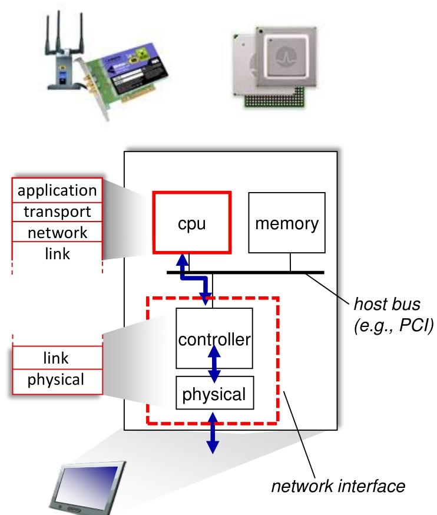

链路层**存在于每一台主机中：** 链路层是所有联网设备（主机）的基础配置。

**实现在芯片或网卡（NIC）上：** 链路层通常集成在专用的芯片组中，或者实现在网络接口卡（Network Interface Card, NIC）上。

- 它同时负责实现**链路层**和**物理层**的功能。

**连接至主机的系统总线：** 网卡通过主机的系统总线（例如 PCI 总线）与 CPU 和内存进行交互。

**硬件、软件与固件的结合：** 链路层的实现并非单一形式，而是由硬件电路、运行在芯片上的固件（Firmware）以及操作系统中的驱动软件共同协作完成。


## [2] 接口间的通信

Interfaces Communicating

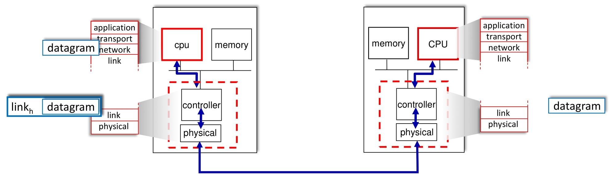

**发送端 (Sending Side)：**

- **封装：** 将来自网络层的**数据报（Datagram）**封装进链路层的**帧（Frame）**中。
- **增加控制信息：** 在帧中添加**检错位（Error Checking Bits）**、实现**可靠数据传输（RDT）的序列号**，以及流量控制等信息。

**接收端 (Receiving Side)：**

- **校验与控制：** 检查帧在传输过程中是否出错，处理可靠传输协议及流量控制等逻辑。
- **解封与解复用：** 从帧中提取出**数据报**，并将其向上交付给接收端的上层（即网络层）。

## [3] 错误检测


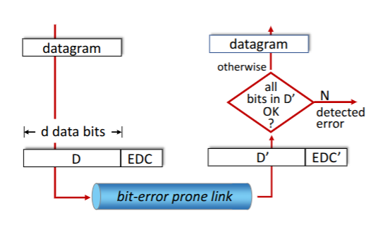

**EDC (Error Detection and Correction bits)：** 错误检测与纠正位

**D (Data)：** 受错误检查**保护**的数据，其中可能包含首部（Header）字段


> **并非 100% 可靠：** 协议偶尔可能会漏掉某些错误，但这种情况极少发生。
>
> **字段大小：** 使用**更大的 EDC 字段可以带来更强的检测与纠正能力**。


### [3.1] 奇偶校验

Parity Checking

奇偶校验能检查**单个**比特位错误，计算接收到的 $d+1$ 个比特位中“1”的数量。如果数量不符合奇偶规则（例如偶校验下出现了奇数个“1”），则说明发生了错误。

**局限性：** 只能检测出**奇数个**比特翻转的情况；如果同时有两个位翻转，单比特校验将失效。


**二维奇偶校验 (Two-Dimensional Parity)**

 不仅能检测错误，还能**纠正错误**（且无需重传！）

**原理：** 将数据排列成阵列，分别计算每一行（Row Parity）和每一列（Column Parity）的校验位。


### [3.2] Internet checksum

这个之前提到过，能校验出错误，但是正确不一定意味着没出错。


### [3.3] CRC

**循环冗余校验 (Cyclic Redundancy Check  - CRC)** 是一种更强大的**检错编码**技术

**特点：**

- 能够检测到所有小于 $r+1$ 位的**突发错误**（burst errors）。
- 在实际中应用广泛（如以太网、802.11 WiFi）。

本页通过一个具体例子展示了发送方如何计算校验位 $R$。

[视频](https://www.bilibili.com/video/BV123itBLEBN/?spm_id_from=333.337.search-card.all.click&vd_source=f8e38230bd39c416eae5184afb8c9a5a)

生成码：Generative Code 记作**G**

冗余码：Redunctant Code 记作 **R**

信息码：Information Code 记作**D**（data）


给定信息码 D = $1101011011_2$ 和多项式 $P(X)=X^4+X+1$ 求 冗余码 **R**

$P(X) = 1\cdot X^4 + 0 \cdot X^3 + 0 \cdot X^2 + 1\cdot X^1 + 1\cdot X^0 \to10011_2$ 因此生成码 $G=10011_2$

信息码D后面要补0，补冗余码个0，冗余码长度是 $G-1$ 因此需要补 $G+1$ 个0

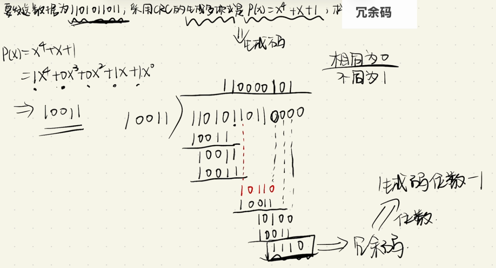


> 如果冗余码长度4，算出`100` 那么需要**前** 补0


## [4] 多路访问链路和协议

**链路的两种基本类型：**

**点对点链路 (Point-to-Point)**

- **定义：** 两个节点之间直接连接。
- **常见示例：**  以太网交换机与主机之间的物理链路。
  - 用于拨号上网的 **PPP (点对点协议)**。

**广播型链路 (Broadcast)**

- **定义：** 多个节点共享同一根导线或同一种传输介质。
- **常见示例：**
  - **早期以太网：** 使用集线器（Hub）连接的物理结构。
  - **有线电视网络：** 混合光纤同轴网（HFC）的上行链路。
  - **无线传输：** 802.11 无线局域网 (WiFi)、4G/5G 蜂窝网络、卫星通信。


问题：

- **单一共享广播信道：** 当多个节点共享同一个信道时，如果两个或更多节点**同时发送**信号，就会产生干扰。
- **冲突 (Collision)：** 如果一个节点在同一时间接收到两个或多个信号，就会发生“冲突”，导致数据无法被正确解析。

**多路访问协议 (Multiple Access Protocol)**

为了解决上述冲突问题，我们需要一套规则：

- **定义：** 这是一种**分布式算法**，用于决定各节点如何共享信道**，即确定每个节点在什么时候可以发送数据**。
- **关键特征：** **信道内协调 ！** 有关“信道共享”的通信信息必须在信道本身上传输。
  - **无带外（No out of band）：** 没有专门的独立通道用于协调（即没有“指挥官”在旁边指点，所有节点必须在同一信道内达成默契）。


### [4.1] 理想的多路访问协议

**已知条件：** 速率为 $R$ bps 的多路访问信道 (Multiple Access Channel, MAC)。

**设计目标 (Desiderata)：**

1. **高效性：** 当只有一个节点需要发送数据时，它可以以速率 $R$ 发送。
2. **公平性：** 当有 $M$ 个节点需要发送数据时，每个节点能以平均速率 $R/M$ 发送。
3. **完全去中心化 (Fully decentralized)：**
   - 无需特殊节点来协调传输任务。
   - 无需时钟或时隙 (Slots) 的严格同步。
4. **简单性：** 协议实现应当简单。


### [4.2] MAC 协议：分类

MAC protocols: taxonomy

多路访问协议主要分为三大类：

- **信道划分 (Channel partitioning)：**
  - 将信道划分为更小的“片段”（如：时隙 Timeslots 、频率 Freq 、 编码 Code）。
  - 将这些片段分配给特定节点**独占使用**。
- **随机访问 (Random access)：**
  - 信道不进行固定划分，允许碰撞 (Collisions)。
  - 能够从碰撞中“恢复 Recover”过来。
- **轮流访问 (“Taking turns”)：**
  - 各节点轮流使用信道，但待发送数据较多的节点可以获得更长的传输时间。


区别：

- **信道划分 MAC 协议 (channel partitioning MAC protocols)：**

  - 在高负载（high load）下能**高效且公平**地共享信道。
  - 在低负载（low load）下效率较低：存在信道访问延迟；即使只有一个活跃节点，也只能分配到 $1/N$ 的带宽。

- **随机访问 MAC 协议 (random access MAC protocols)：**

  - 在低负载下效率高：单个节点可以完全利用整个信道带宽。
  - 在高负载下：存在**碰撞开销 (collision overhead)**。

- **“轮流”协议 ("taking turns" protocols)：试图结合上述两者的优点！**

  - 显式分配信道，从而**避免碰撞 (no collisions)**。
  - 如果没有数据要发送，节点不会长时间占用信道。
  - 两种主要方法：**轮询 (polling)** 和 **令牌传递 (token passing)**。

  

#### [4.2.1] 信道划分 MAC 协议：TDMA

**时分多路访问 (Time Division Multiple Access)**

- 以“轮”(Rounds) 为单位访问信道。
- 每个站点在每一轮中都会分配到一个**固定长度的时隙** (Fixed length slot)，其长度通常等于一个分组 (Packet) 的传输时间。
- **资源浪费：** 未使用的时隙将保持空闲 (Idle)，无法被其他节点利用。
- **示例：** 在一个 6 站局域网 (LAN) 中，1、3、4 号站有分组要发送，而 2、5、6 号站对应的时隙则处于空闲状态。

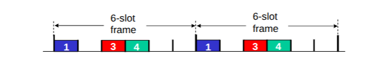

类似于固定的意思

#### [4.2.2] 信道划分 MAC 协议：FDMA

**FDMA：频分多路访问 (Frequency Division Multiple Access)**

- 信道频谱被划分为多个不同的**频段** (Frequency bands)。
- 每个站点被分配一个固定的频段。
- **资源浪费：** 即使某个站点当前没有数据传输，其所属频段的传输时间也会保持空闲。
- **示例：** 在一个 6 站局域网中，1、3、4 号站有分组发送，2、5、6 号频段则处于空闲状态。

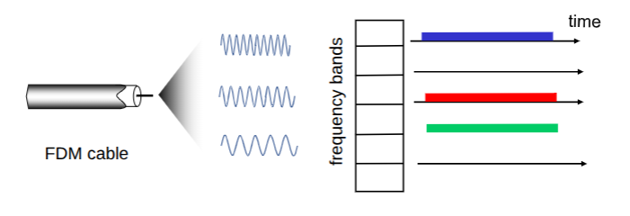


#### [4.2.3] 随机访问协议

**节点发送数据包时：**

- 以信道的全部数据速率 $R$ 进行传输。
- 节点之间**无需事先协调** (No *a priori* coordination)。

**冲突 (Collision)：** 当两个或多个节点同时发送数据时，会产生“冲突”。

**随机访问协议规定了：**

- 如何**检测冲突** (How to detect collisions)。
- 如何从冲突中**恢复** (How to recover)（例如：通过延迟重传）。

**常见的随机访问 MAC 协议示例：**

- ALOHA、时隙 ALOHA (Slotted ALOHA)。
- CSMA、CSMA/CD (带有冲突检测)、CSMA/CA (带有冲突避免)。


#### [4.2.4] 随机访问 MAC 协议：ALOHA

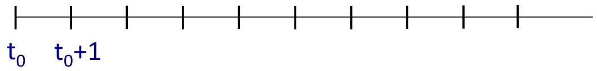

前提假设 (Assumptions)

- 所有**帧** (Frames) 大小相同。
- 时间被划分为等长的**时隙** (Slots)，每个时隙恰好够传输一帧。
- 节点之间是**同步的** (Synchronized)。
- 节点只能在**时隙开始时**启动传输。
- 如果在某个时隙内有 2 个或更多节点传输，所有节点都能检测到冲突。

**运行机制 (Operation)**

- 当节点获得新帧时，在下一个时隙尝试发送。
  - **如果没有冲突：** 节点成功发送，可以在下一个时隙发送新帧。
  - **如果发生冲突：** ==节点会在后续的每个时隙中，以**概率 $p$** 进行重传，直到成功为止。==
  - *注：这里引入随机概率 $p$ 是为了避免冲突的节点在下一时隙再次百分之百撞车。*

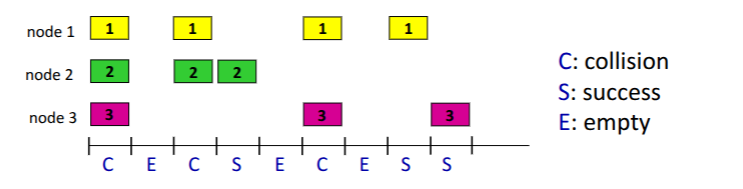

优缺点分析

**优点 (Pros)：**

- 单个活跃节点可以利用信道的全部速率持续发送。
- **高度去中心化** (Highly decentralized)：只需同步各节点的时隙起始点。
- 协议逻辑简单。

**缺点 (Cons)：**

- 存在冲突，会**浪费时隙** (Wasting slots)。
- 存在**空闲时隙** (Idle slots)（由于概率 $p$ 的存在，可能没人发送）。
- 节点可能在完成整帧传输前就能检测到冲突（但在该协议下仍传完，造成浪费）。
- 需要严格的**时钟同步** (Clock synchronization)。


#### [4.2.5] 随机访问 MAC 协议：CSMA

Carrier Sense Multiple Access，载波侦听多路访问

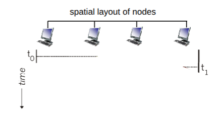

**基础 CSMA：** 在发送**之前先监听 (Listen before transmit)。**

- 如果侦测到信道**空闲 (Idle)**：发送整个帧 (Frame)。
- 如果侦测到信道**忙碌 (Busy)**：推迟发送 (Defer transmission)。

**人类类比：** 不要打断别人说话！

为什么仍会发生冲突 (Collisions)? 即使有载波侦听，冲突**仍然**可能发生：

- **传播时延 (Propagation delay)：** 意味着两个节点可能无法即时“听到”对方刚刚开始的传输。
- **冲突的后果：** 整个数据包的传输时间都被浪费了。
- **影响因素：** 节点间的距离和传播时延在决定冲突概率方面起着关键作用。


#### [4.2.6] 随机访问 MAC 协议：CSMA/CD

Collision Detection，带有冲突检测 的CSMA

**核心改进**

- **CSMA/CD：** 在 CSMA 的基础上增加了**冲突检测 (Collision detection)**。
- **快速反应：** 冲突在极短时间内就能被检测到。
- **减少浪费：** 一旦检测到冲突，立即中止 (Aborted) 正在进行的传输，从而减少信道时间的浪费。
- **环境差异：** 冲突检测在**有线 (Wired)** 网络中较易实现，但在**无线 (Wireless)** 网络中非常困难。
- **人类类比：** 有礼貌的交谈者（发现同时开口时会立即停下）。


##### 以太网 CSMA/CD 算法步骤

这是以太网处理数据传输的具体逻辑流程：

1. **准备阶段：** 以太网从**网络层 (Network layer)** 接收**数据报 (Datagram)**，并创建**帧 (Frame)**。
2. **侦听信道：** 如果信道**空闲 (Idle)**：开始传输帧。
   - 如果信道**忙碌 (Busy)**：**持续等待直到信道空闲，然后立即发送。**
3. **成功情况：** 如果整个帧都发送完毕且未检测到冲突，则任务完成！
4. **冲突处理：** 如果在发送过程中检测到其他节点的传输：
   - 立即**中止 (Abort)** 发送。
   - 发送一个**干扰信号 ( Jam signal )**（确保所有节点都意识到发生了冲突）。
5. **进入二进制指数退避 (Binary exponential backoff)：**
   - 在发生第 $m$ 次冲突后，从集合 $\{0, 1, 2, \dots, 2^m - 1\}$ 中**随机选择一个整数** $K$。
   - 以太网等待 $K \times 512$ 个**比特时间 (Bit times)**，然后返回步骤 2 重新尝试。
   - **规律：** 冲突次数越多，等待的**退避间隔 (Backoff interval)** 范围就越大，从而降低再次冲突的概率。


#### [4.2.7] 轮询访问 MAC 协议

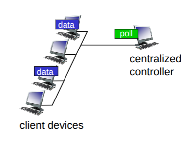

**轮询 (polling)：**

- 由一个**中央控制器 (centralized controller)** 按顺序“邀请”其他节点进行传输。
- 需要专门的协议来管理客户端设备 (client devices) 的**加入与离开**网络。
- **存在的担忧/缺点：**
  - **轮询开销 (polling overhead)：** 控制器发送邀请消息占用的带宽。
  - **延迟 (latency)：** 节点必须等待轮到自己。
  - **单点故障 (single point of failure)：** 如果控制器宕机，整个网络瘫痪。
- **应用实例：** **蓝牙 (Bluetooth)** 技术使用的是轮询机制。


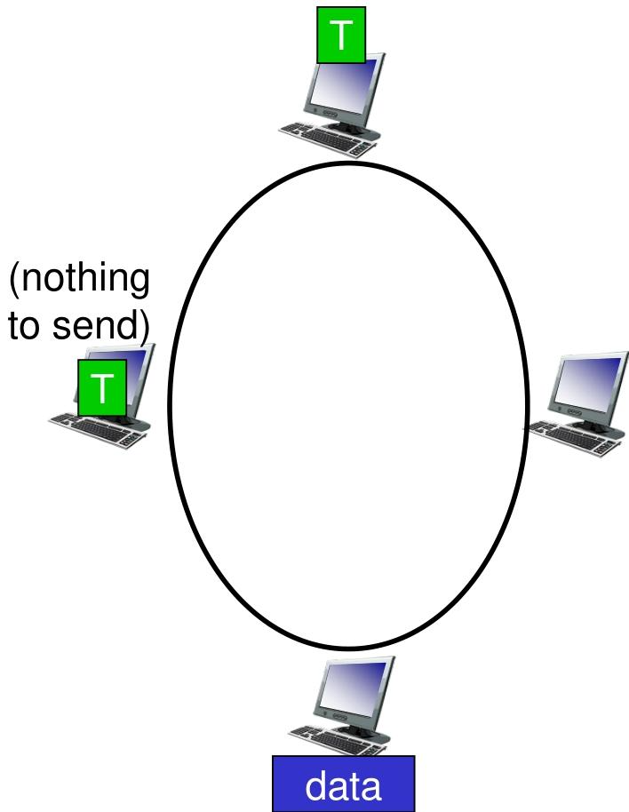


**令牌传递 (token passing)：**

- 一种被称为**控制令牌 (control token)** 的特殊消息按顺序在节点间显式传递。
- ==节点只有在**持有令牌**时才允许发送数据==。
- **存在的担忧/缺点：**
  - **令牌开销 (token overhead)：** 令牌本身在网络中循环占用的资源。
  - **延迟 (latency)：** 节点必须等待令牌传到自己手中。
  - **单点故障 (single point of failure)：** 如果令牌丢失（例如持有令牌的节点崩溃），整个网络将无法通信。


## [5] LANs

### [5.1] MAC 地址

**32位 IP 地址 (32-bit IP address)：**

- 接口的**网络层 (network-layer)** 地址。
- 用于**第 3 层 (layer 3)** 的网络转发。
- 例如：`128.119.40.136`

**MAC 地址（又称局域网地址 LAN、物理地址 Physical 或以太网 Ethernet 地址）：**

- **功能：** 用于在“本地”将**帧 (frame)** 从一个接口传输到另一个物理连接的接口（在 IP 寻址意义上的同一个**子网 (subnet)** 内）。
- **48位 MAC 地址：** 大多数局域网将该地址固化在**网卡 (NIC)** 的 **只读存储器 (ROM)** 中，有时也可以通过软件设置。
- 例如：`1A-2F-BB-76-09-AD`（十六进制表示法，每个数字代表 4 位）。

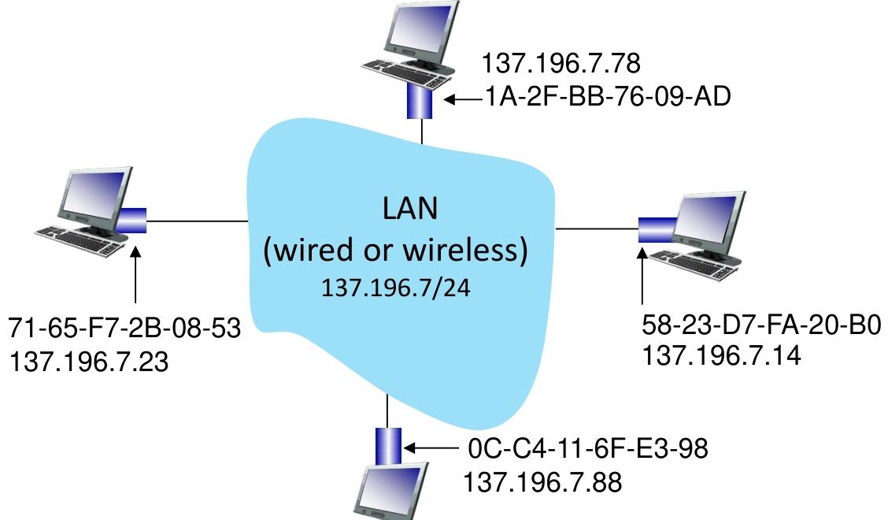


**主要特性**

- **分配与唯一性：** MAC 地址的分配由 **IEEE** 管理。制造厂商购买一部分 MAC 地址空间以确保其**唯一性 (uniqueness)**。
- **类比理解：**
  - **MAC 地址：** 类似于**身份证号 (Social Security Number)**，具有唯一性且跟随设备。
  - **IP 地址：** 类似于**邮寄地址 (postal address)**，取决于设备当前所处的网络位置。
- **便携性 (Portability)：** MAC 地址是“平面的”，具有便携性。你可以将网卡从一个局域网移动到另一个局域网而无需更改 MAC 地址；而 **IP 地址不可便携**，它取决于节点连接的具体 **IP 子网 (IP subnet)**。


### [5.2] 地址解析协议 ARP

Address Resolution Protocol

核心问题

**在已知接口 IP 地址的情况下，如何确定其对应的 MAC 地址？**

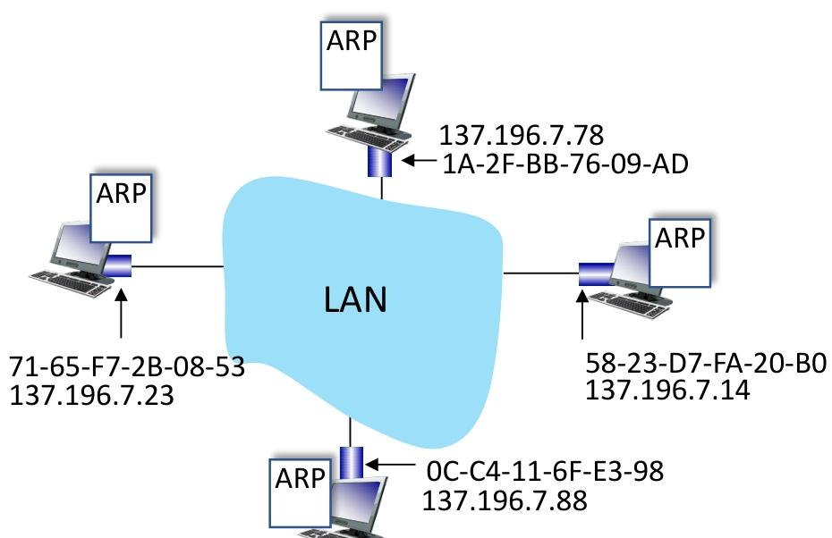

**ARP 表 (ARP table)**

局域网 LAN 内的每个 IP 节点（主机、路由器）都维护着一个 ARP 表。

- **映射关系：** 存储局域网内某些节点的 **<IP 地址; MAC 地址; TTL >** 映射。
- **TTL (Time To Live，生存时间)：** 该映射关系被从表中删除前的存储时间（通常为 20 分钟）。


#### [5.2.1] 运行流程


**场景：主机 A 想要向主机 B 发送数据报 (datagram)** *前提：B 的 MAC 地址不在 A 的 ARP 表中，因此 A 需要使用 ARP 来查找 B 的 MAC 地址。*

---

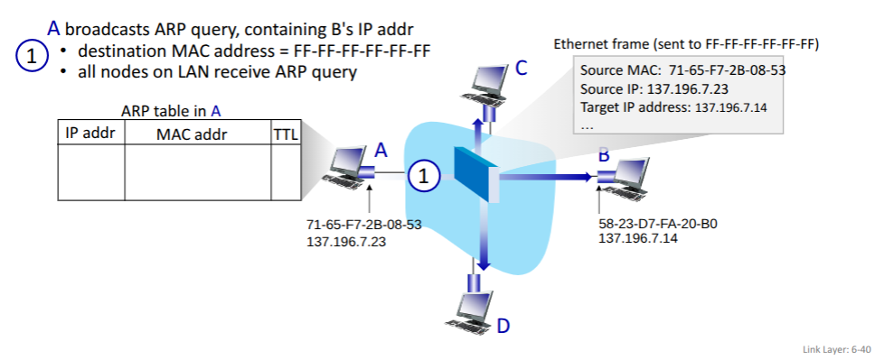

**第一步：广播查询 (Broadcast Query)**

1. **A 广播 ARP 查询包：** 其中包含 B 的 IP 地址。
2. **目的 MAC 地址：** 使用广播地址 `FF-FF-FF-FF-FF-FF`。
3. **接收范围：** 局域网上的**所有节点 (all nodes)** 都会收到此 ARP 查询。
   - *图中显示源 MAC 是 A 的地址，目标 IP 是 B 的地址。*

---

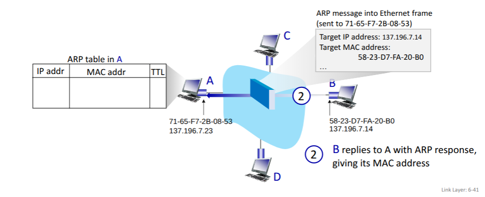

**第二步：单播响应 (Unicast Response)**

1. **B 响应 A：** B 收到查询后，向 A 发送 **ARP 响应 (ARP response)**，告知自己的 MAC 地址。
2. **发送方式：** 该帧直接发送给 A 的 MAC 地址（单播）。
   - *图中显示目标 MAC 地址已填入 B 的真实地址。*

---


**第三步：缓存结果 (Caching)**

1. **A 接收响应：** A 收到 B 的回复后，将 B 的 IP 和 MAC 地址映射条目添加到其**本地 ARP 表 (local ARP table)** 中。
2. **后续发送：** 现在 A 已经知道了 B 的 MAC 地址，可以直接封装并发送数据帧了。

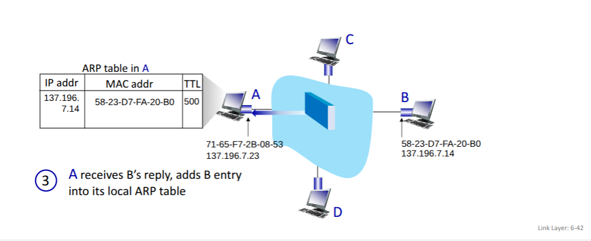

---


### [5.3] 以太网

Ethernet 以太网

**“主流”有线局域网技术 (Dominant wired LAN technology)：**

- 首个被广泛使用的**局域网（LAN）**技术。
- 更简单、更便宜。
- 紧跟速度竞赛：速率从 **10 Mbps** 跨越到 **400 Gbps**。
- 单芯片支持多种速度


---


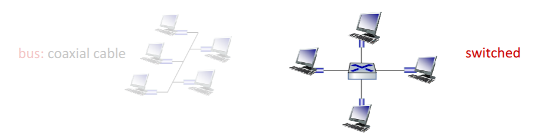

**以太网：物理拓扑 (Physical Topology)**

**总线型 (Bus)：** 流行至 90 年代中期。

- 所有节点处于同一个**冲突域 (Collision domain)** 中（节点之间可能会发生碰撞）。
- 使用同轴电缆 (Coaxial cable) 连接。

**交换型 (Switched)：** 现今的主流结构。

- 中心位置有一个活跃的**链路层交换机 (Link-layer switch)**。
- 每个“轮辐 (Spoke)”运行一个（独立的）以太网协议（节点之间不会发生碰撞）。


---


#### [5.3.1] 以太网结构

这些幻灯片详细介绍了以太网（Ethernet）的基础知识、拓扑结构、帧格式以及可靠性。以下是翻译与内容整理：

------

1. 以太网概览 (Ethernet)

- **“主流”有线局域网技术 (Dominant wired LAN technology)：**
  - 首个被广泛使用的局域网（LAN）技术。
  - 更简单、更便宜。
  - 紧跟速度竞赛：速率从 **10 Mbps** 跨越到 **400 Gbps**。
  - 单芯片支持多种速度（例如：博通 Broadcom BCM5761）。
- **人物背景：** 鲍勃·梅特卡夫 (Bob Metcalfe)，以太网共同发明人，2022 年图灵奖 (ACM Turing Award) 获得者。图中展示了他绘制的以太网草图。

------

2. 以太网：物理拓扑 (Physical Topology)

- **总线型 (Bus)：** 流行至 90 年代中期。
  - 所有节点处于同一个**冲突域 (Collision domain)** 中（节点之间可能会发生碰撞）。
  - 使用同轴电缆 (Coaxial cable) 连接。
- **交换型 (Switched)：** 现今的主流结构。
  - 中心位置有一个活跃的**链路层交换机 (Link-layer switch)**。
  - 每个“轮辐 (Spoke)”运行一个（独立的）以太网协议（节点之间不会发生碰撞）。

------

3. 以太网帧结构 (Ethernet Frame Structure)

发送接口将 **IP 数据报 (IP datagram)**（或其他网络层协议分组）封装在**以太网帧 (Ethernet frame)** 中。


- **前导码 (Preamble)：**
  - 用于同步接收方和发送方的时钟频率。
  - 由 7 个字节的 `10101010` 加上 1 个字节的 `10101011` 组成。
- **地址 (Addresses)：** 包含 6 字节的**源** MAC 地址和**目的** **MAC 地址**。
  - 如果适配器收到的帧目的地址与之匹配，或者是广播地址（如 ARP 分组），则将帧内数据传递给网络层协议。
  - 否则，适配器直接丢弃该帧。
- **类型 (Type)：** 指示高层协议类型。
  - 通常是 IP 协议，但也可能是其他协议（如 Novell IPX, AppleTalk）。
  - 用于在接收方进行**向上分用 (Demultiplex)**。
- **循环冗余校验 (CRC)：** 接收方用于检测错误。
  - 如果检测到错误，该帧将被丢弃。

---

4. 以太网特性：不可靠、无连接

- **无连接 (Connectionless)：** 发送方网卡和接收方网卡 (NICs) 之间没有握手过程。
- **不可靠 (Unreliable)：** 接收方网卡不会向发送方发送确认帧 (ACKs) 或否认帧 (NAKs)。
  - 只有当初始发送方使用了高层**可靠数据传输 (rdt)**（例如 TCP）时，丢弃帧中的数据才能恢复；否则，丢失的数据将无法找回。
- **以太网 MAC 协议：** 采用二进制指数退避算法 (Binary exponential backoff) 的非时隙 **CSMA/CD** 协议。

---

5. 802.3 以太网标准：链路层与物理层

**存在多种不同的以太网标准：**

- 拥有通用的 **MAC 协议**和帧格式。
- **不同速率：** 从 2 Mbps 到 80 Gbps 不等。
- **不同物理层介质：** 包括光纤 (Fiber) 和电缆 (Cable/Copper)。

**物理层区分：**

- **铜缆（双绞线 Twisted pair）：** 例如 100BASE-TX, 100BASE-T2。
- **光纤 (Fiber)：** 例如 100BASE-FX, 100BASE-SX。

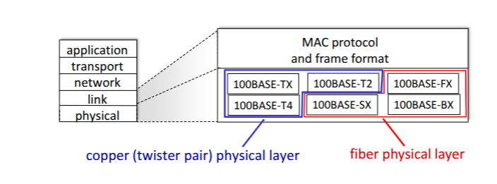

---


### [5.4] Switch

#### [5.4.1] 以太网交换机 (Ethernet Switch)

**交换机是链路层 (link-layer) 设备：** 扮演着积极的主动角色。

- **存储并转发 (store, forward)** 以太网帧 (Ethernet frames)。
- **检查 (examine)** 传入帧的 MAC 地址，当帧需要在网段上传输时，**选择性地 (selectively)** 将帧转发到一个或多个输出链路；使用 **CSMA/CD** 协议来访问网段。

**透明性 (transparent)：** 主机并不知道交换机的存在。

**即插即用 (plug-and-play)、自学习 (self-learning)：** 交换机不需要人工配置。


#### [5.4.2] 交换机：支持多路并行传输

multiple simultaneous transmissions

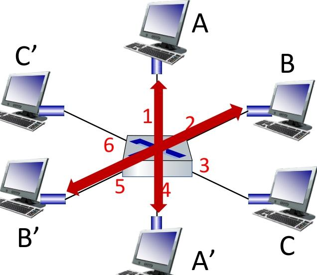

主机与交换机之间有**专用且直接 (dedicated, direct)** 的连接。

交换机会**缓存 (buffer)** 数据包。

每条传入链路上都运行以太网协议，因此：

- **无冲突 (no collisions)**；支持**全双工 (full duplex)** 模式。
- 每条链路都是一个独立的**冲突域 (collision domain)**。

**交换 (switching)：** A 到 A' 和 B 到 B' 的传输可以**同时进行**，不会发生冲突。

- *注：但 A 到 A' 和 C 到 A' 不能同时发生（因为目的地相同，输出端口冲突）。*


#### [5.4.3] 交换机转发表 (Switch Forwarding Table)

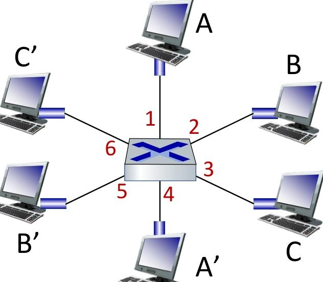

**问题：** 交换机如何知道 A' 可以通过接口 4 到达，B' 可以通过接口 5 到达？

**回答：** 每个交换机都有一个**交换表 (switch table)**，每个表项包含：

- （主机的 MAC 地址，到达该主机的接口，时间戳/生存时间 TTL）。
- 这看起来很像一张Router表！

**问题：** 交换表中的表项是如何创建和维护的？类似于某种路由协议吗？

> 简单来说，交换机表的维护**不是**依靠复杂的路由协议，而是依靠一种“**被动学习**”和“**自动老化**”的机制。
>
> ### 它是如何工作的？
>
> - **创建（学习）：** 只要有数据帧进来，交换机就盯着它的**源 MAC 地址**看，记下：“这个地址的主机连接在我的这个端口上。”
> - **维护（老化）：** 交换机给每个记录设一个“闹钟”（TTL）。如果一段时间（如 5 分钟）没再看到这个主机发数据，就认为它走了，**自动删除**该条目。
>
> ### 它类似于路由协议吗？
>
> **完全不同。**
>
> - **交换机（自学习）：** 像**“偷听”**。它不说话，只是默默记录谁从哪个门进来。它是**即插即用**的，不需要任何配置。
> - **路由器（路由协议）：** 像**“开会”**。路由器之间会互相交换信息，主动告诉对方：“我这里能通往哪些网段。”它需要复杂的**算法和人工配置**。

####  [5.4.4] 交换机：自学习 (Self-learning)

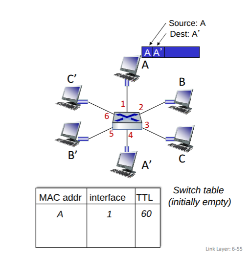

交换机会**学习 (learns)** 哪些主机可以通过哪些接口到达。

当接收到帧时，交换机会“学习”发送者的位置：即**传入的局域网网段 (incoming LAN segment)**。

它将“发送者/位置”这一对信息记录在交换表中。

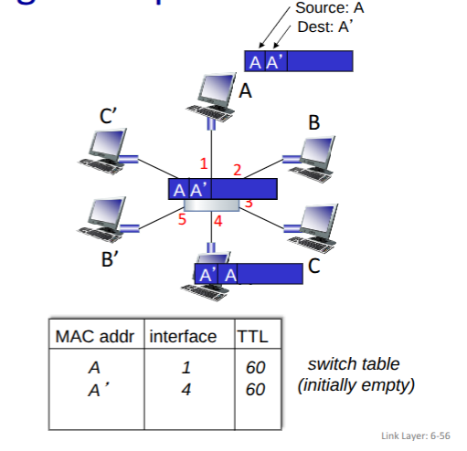

自学习与转发：示例

- **帧目的地未知：** 如果目的地 A' 的位置在表中找不到，交换机会进行**泛洪 (flood)**（向除来源接口外的所有接口发送）。
- **帧目的地已知：** 如果目的地 A 的位置已知，则**选择性地 (selectively)** 仅在对应的一条链路上发送。


#### [5.4.5] 交换机级联与机构网络 (Interconnecting Switches)

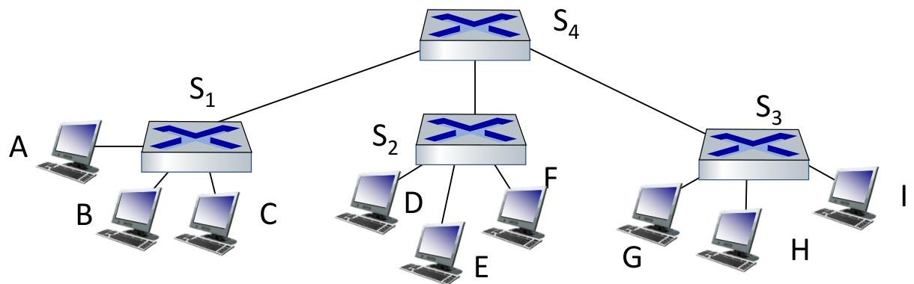

**自学习交换机可以连接在一起：**

- **问题：** 从 A 发送到 G 时，交换机 $S_1$ 如何知道通过 $S_4$ 和 $S_3$ 转发去往 G 的帧？
- **回答：** 依然依靠**自学习 (self-learning)**！其工作原理与单交换机情况完全相同。

**小型机构网络 (Small institutional network)：**

- 展示了一个典型的层级结构：包含路由器 (router)、邮件服务器 (mail server)、Web 服务器 (web server) 以及由多个交换机组成的 **IP 子网 (IP subnet)**。

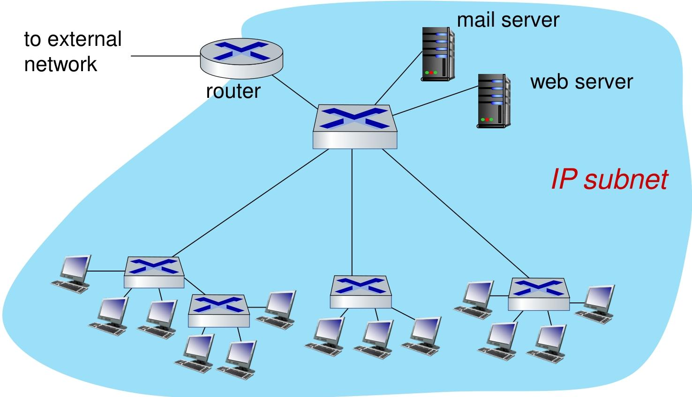


#### [5.4.6] 交换机和路由

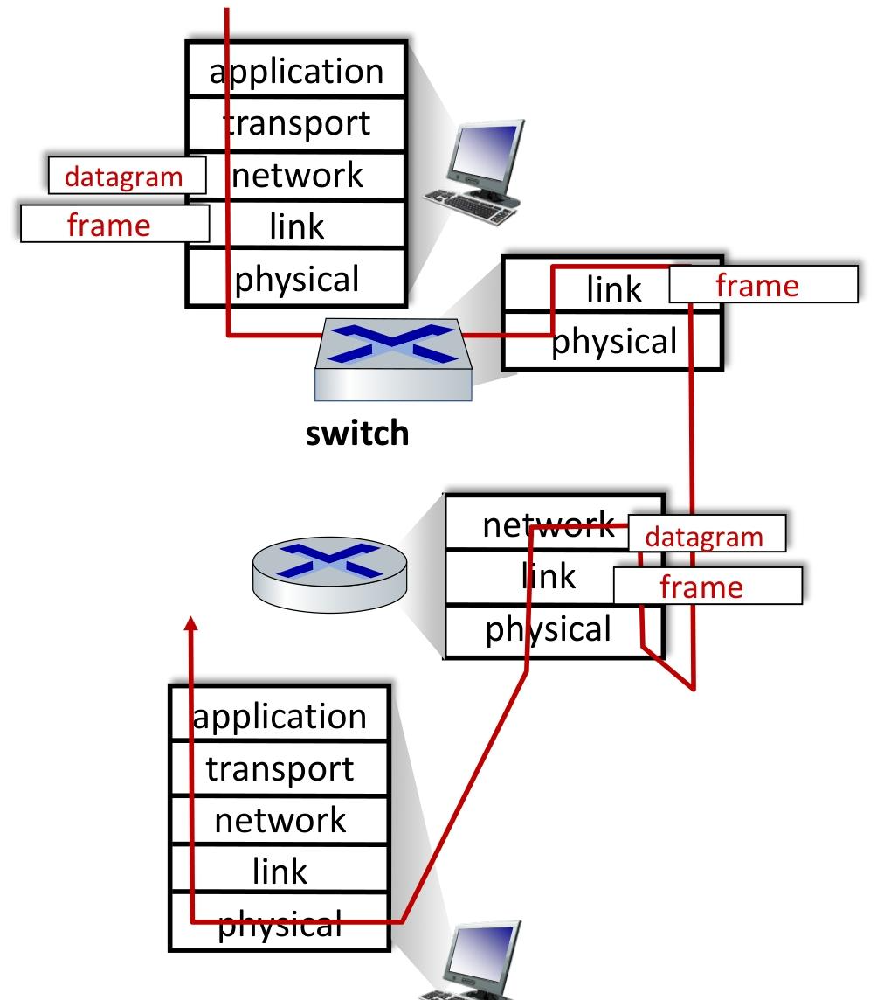

| **特性**     | **路由器 (Routers)**                                         | **交换机 (Switches)**                                        |
| ------------ | ------------------------------------------------------------ | ------------------------------------------------------------ |
| **转发模式** | 均为 **存储转发 (store-and-forward)**                        | 均为 **存储转发 (store-and-forward)**                        |
| **工作层级** | **网络层 (network-layer)** 设备（检查网络层首部）            | **链路层 (link-layer)** 设备（检查链路层首部）               |
| **转发表**   | 使用**路由算法 (routing algorithms)** 和 **IP 地址** 计算表项 | 通过**泛洪 (flooding)** 和 **自学习 (learning)**，利用 **MAC 地址** 构建表项 |

## [6] 无线与网络移动

### [6.1] 无线网络要素与链路特性

Wireless Link Characteristics

**无线网络的组成要素**

- **无线链路 (Wireless link)：** 通常用于连接移动设备与**基站 (Base station)**，也可作为骨干链路。
- **多路访问协议 (Multiple access protocol)：** 负责协调多个设备对链路的访问。
- **特性：** 具有不同的传输速率、传输距离以及**频段 (Frequency bands)**。


**衰减 (Fading / Attenuation)**

- **路径损耗 (Path loss)：** 无线电信号在传播过程中能量会减弱。
- **公式：** 自由空间**路径损耗**与频率 $f$ 和距离 $d$ 的平方成正比，即 $~ (fd)^2$。
- **结论：** **频率越高或距离越远，路径损耗越大**。

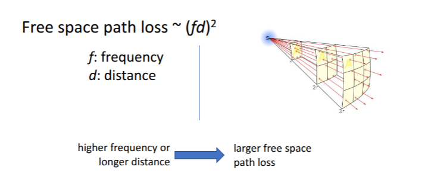


**噪声与信噪比 (Noise & SNR)**

- **干扰 (Interference)：** 来自其他无线源（如 WiFi、蜂窝网络、电机等）的干扰。
- **信噪比 (SNR: Signal-to-Noise Ratio)：** 信号与噪声的比值。SNR 越大，越容易从噪声中提取信号。
- **SNR 与误码率 (BER: Bit Error Rate) 的权衡：**
  - 在物理层确定的情况下，增加发射功率 -> 提高 SNR -> 降低 BER。
  - 由于移动性，SNR 会动态变化，因此需要物理层动态调整（如改变**调制技术 Modulation**和速率）。

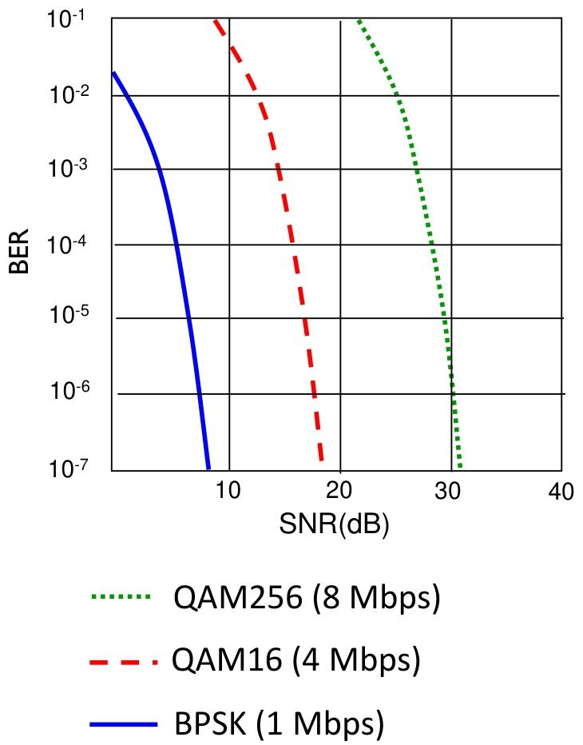


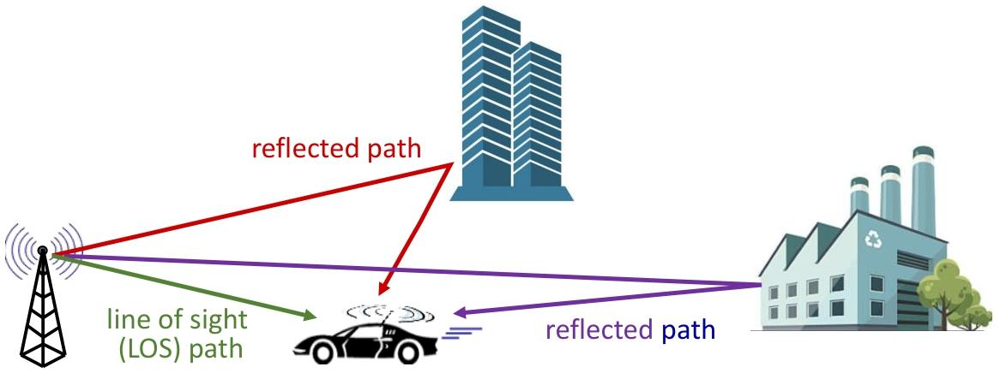

**多径传播 (Multipath Propagation)**

- **定义：** 信号由于地面或建筑物的反射，通过不同路径到达接收端，导致到达时间略有差异。
- **相干时间 (Coherence time)：** 指信道特性保持恒定的时间段。它限制了最大传输速率，且与频率和接收端移动速度成反比。


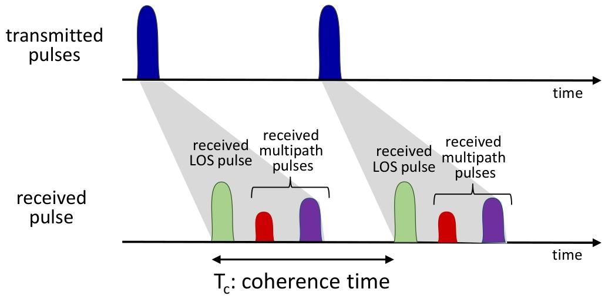


### [6.2] 隐蔽终端问题 

Hidden Terminal Problem

- **定义：** 节点 A 和 C 都能听到基站 B，但 A 和 C 之间由于物理障碍或距离太远互相听不到。
- **后果：** A 和 C 可能同时向 B 发送数据而意识不到彼此的存在，从而在 B 处产生冲突。
- **衰减导致隐蔽：** 信号强度的快速下降也会导致节点**无法感知远处的干扰**。


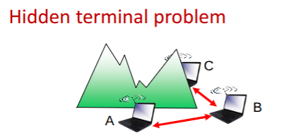

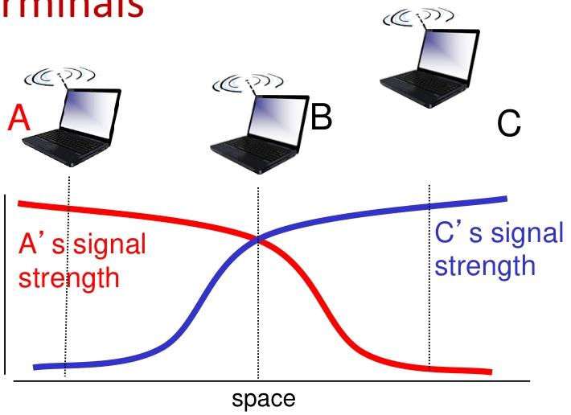


### [6.3] 多路访问控制 

Multiple Access Control

**CSMA/CA (冲突避免)**

由于无线网络难以检测冲突（发送信号强，接收信号弱，且存在隐蔽终端），802.11 采用的是 **CSMA/CA (Carrier Sense Multiple Access with Collision ==Avoidance==)** 而非以太网的 CSMA/CD。

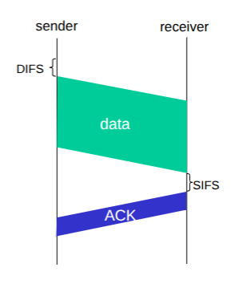

**发送方流程：**

1. 如果侦听到信道空闲持续 **DIFS** 时间，则发送整个帧。
2. 如果信道忙，则启动**随机退避时间 (Random backoff time)**。计时器在信道空闲时倒计时，失效时发送。
3. 如果没有收到 **ACK (确认帧)**，则增加退避范围并重复步骤 2。

**接收方流程：**

1. 如果帧接收正确，在等待 **SIFS** 时间后返回 ACK（ACK 是必须的，用于解决隐蔽终端导致的冲突感知失败）。


### [6.4] RTS-CTS 握手机制

Collision Avoidance: RTS-CTS

为了彻底解决隐蔽终端问题，发送方可以使用小的预约数据包：

- **RTS (Request-to-Send)：** 发送方先向基站发送一个小包，请求预约信道。
- **CTS (Clear-to-Send)：** 基站广播 CTS 回应。
- **效果：** 所有节点（包括隐蔽节点）都能听到 CTS。听到 CTS 的非发送节点将**延迟发送 (Defer)**，从而避免数据帧发生冲突。
- **注意：** 虽然 RTS 包本身可能发生冲突，但由于它们很短，浪费的带宽较少。


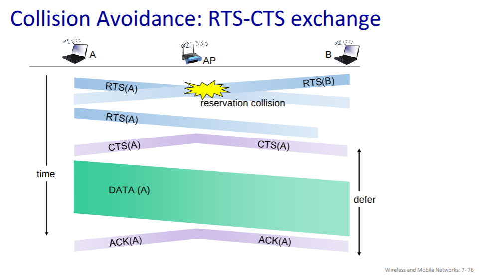


## [7] 综合例子

### 初始场景 (Scenario)

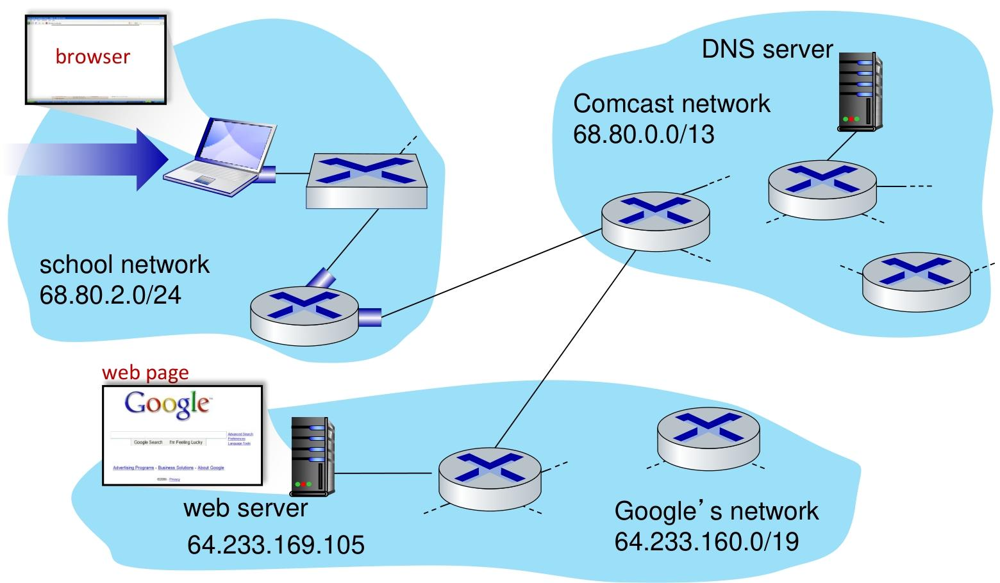

- **背景：** 一台新接入的移动客户端（**Arriving mobile client**）连接到了学校网络（**School network**）。
- **目标：** 用户在浏览器中请求访问 `www.google.com`。
- **现状：** 看起来很简单，但底层涉及复杂的协议交互。


### 接入互联网：DHCP 流程

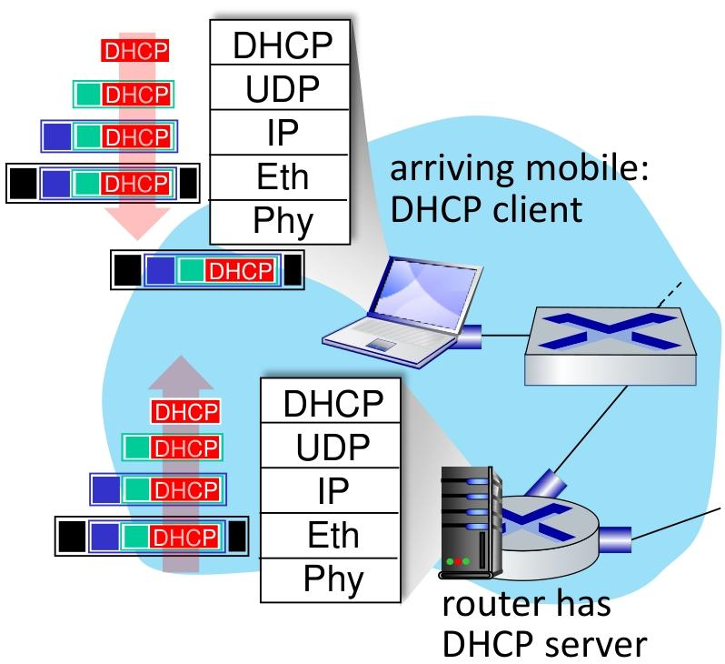

在发送请求前，笔记本电脑必须先获取自己的“身份信息”。

- **目的：** 获取自身的 **IP地址**、第一跳路由器（**First-hop router**）的地址以及 **DNS服务器** 的地址。
- **过程：**
  - 客户端发送 **DHCP请求**，该请求被封装在 **UDP** 段、**IP** 数据报和 **802.3 Ethernet**（以太网）帧中。
  - 以太网帧在局域网（**LAN**）上进行**广播**（**Broadcast**，目的地址为全F）。
  - 运行 **DHCP服务器** 的路由器收到该帧。
  - **解复用（De-muxed）：** 路由器依次剥离以太网头、IP头、UDP头，最后将 DHCP 报文交给 DHCP 服务器处理。


### DHCP 确认与配置

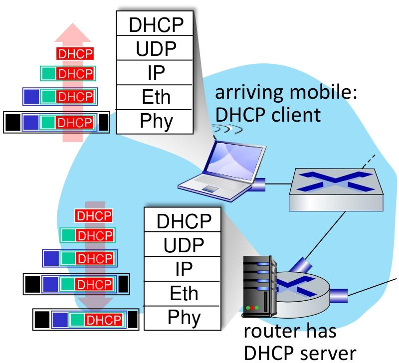

- **DHCP服务器** 构造一个 **DHCP ACK** 确认报文。
- **包含信息：** 分配给客户端的 IP 地址、第一跳路由器的 IP 地址、DNS 服务器的名称和 IP 地址。
- **传输：** 报文在 DHCP 服务器处封装，通过交换机转发（利用**交换机自学习 Switch learning**功能），最后在客户端进行解复用。
- **结果：** 客户端现在拥有了 IP 地址，并知道了默认网关和 DNS 服务器的位置。


### 寻找网关：ARP 协议

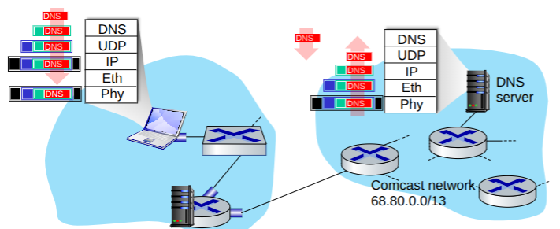

在发送 DNS 请求之前，客户端需要知道如何把包发给路由器。

- **痛点：** 客户端知道路由器的 IP，但不知道其硬件 **MAC地址**。
- **过程：**
  - 客户端广播一个 **ARP查询（ARP query）** 报文。
  - 路由器收到查询后，返回一个 **ARP响应（ARP reply）**，告知自己的接口 MAC 地址。
  - **结果：** 客户端现在可以构造以太网帧，将 **DNS查询** 发送给第一跳路由器。

### 域名解析：DNS 流程

- **过程：**
  - 客户端生成 **DNS查询** 报文，经过局域网交换机到达第一跳路由器。
  - **路由（Routing）：** IP 数据报从校园网出发，进入 Comcast 网络，根据 **RIP、OSPF、IS-IS** 或 **BGP** 等路由协议创建的路由表，转发至 DNS 服务器。
  - **解析：** DNS 服务器解复用报文，并回传包含 `www.google.com` 对应 IP 地址的响应报文。


### 建立连接：TCP 三次握手

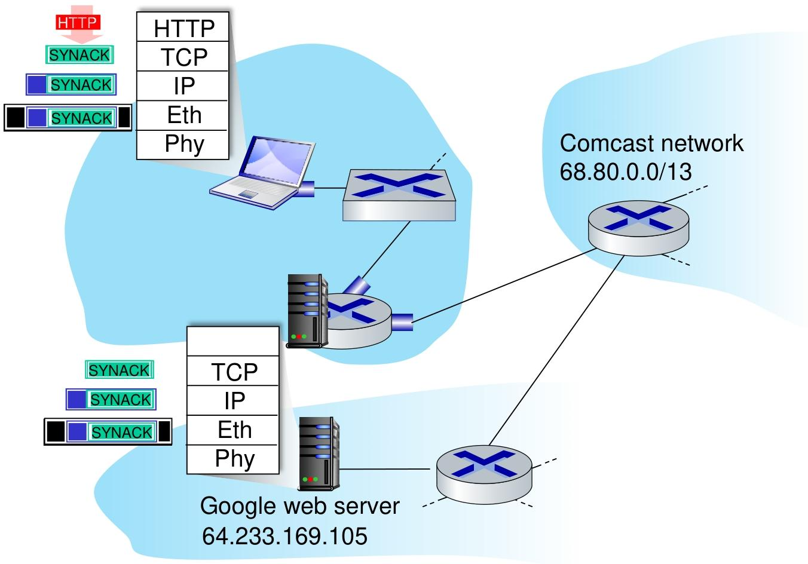

有了 Google 的 IP 地址后，客户端准备传输 HTTP 请求。

- **步骤：**
  1. 客户端打开一个 **TCP套接字（TCP socket）**。
  2. 发送 **TCP SYN** 段（三次握手的第一步）。
  3. Google 的 Web 服务器返回 **TCP SYNACK**（三次握手的第二步）。
- **结果：** **TCP连接正式建立（TCP connection established）**。

### 数据传输：HTTP 请求与响应

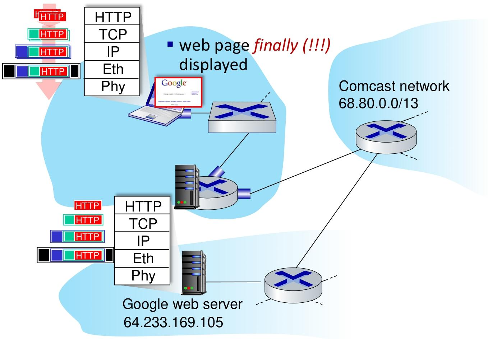

- **请求：** **HTTP request** 经由 TCP 套接字发出。
- **路由：** 包含 HTTP 请求的 IP 数据报被路由到 `www.google.com`。
- **响应：** Web 服务器返回 **HTTP reply**（包含网页内容）。
- **展示：** 数据报路由回客户端，浏览器解析后，**网页终于显示出来了！**


# Network Security


## [1] 对称密钥密码学

**Symmetric** Key Cryptography

Symmetric 在英文中是对称的意思，因此 Symmetric Key 就是 **相同的密钥**

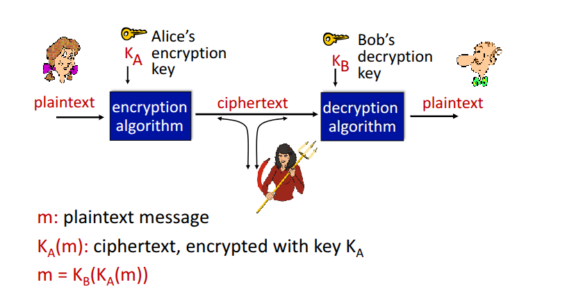

`m` 是**明文（Plaintext Message）**

$K_A(m)$：把明文通过密钥 A 加密

$m = K_B( K_A(m) )$ 解密


但是这种总方式非常容易被破解，我们只需要统计次数...暴力破解...


**什么是块密码（Block Ciphers）？**

**块密码**是一种对称加密算法，它将明文（Plaintext）分成固定长度的组，称为“块”（Block）。

它使用一种 **1对1映射**（双射），确保每一个可能的 $k$ 位明文块都唯一对应一个 $k$ 位密文块。这意味着加密过程是可逆的（即可以解密）。

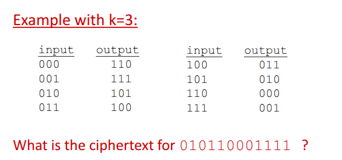

如果块大小 $k=3$，总共有 $2^3 = 8$ 种可能的输入。

这 8 个输入可以有多少种不同的 1对1 映射方案？答案是 $8!$（8的阶乘），即 **40,320** 种。对于计算机来说，这个数字非常小，很容易被暴力破解。

**推广到一般情况**：对于 $k$ 位块，可能的映射总数是 $(2^k)!$


**实际问题...表格太大了**：

- 当 $k=64$ 时（现代加密的常见量级），$(2^{64})!$ 是一个天文数字，理论上非常安全。
- **但是**，如果我们用“查找表”的方法来实现加密，我们需要存储一个拥有 $2^{64}$ 行的表格。
- **存储代价**：每一行 64 位，总共需要 $2^{64} \times 64$ 位存储空间。这超出了目前任何物理设备的存储极限。


由于无法存储巨大的查找表，现代密码学（如 **AES** 或 **DES**）不再使用静态表格，而是使用：

- **数学函数/算法**：通过复杂的代数运算和多轮变换，在内存中动态地计算出映射结果。
- **模拟随机性**：这些算法的目标是模拟出一个“随机排列的表格”，使得攻击者在没有密钥的情况下，无法找到输入和输出之间的规律。


当消息很长时，我们必须将其拆分为多个 64 位的块进行加密。

为什么不直接将消息分成64位的块，然后分别加密每个块呢？

如果两个明文块完全相同，它们产生的密文块也将完全相同。攻击者虽然无法直接破解单个块，但可以通过观察密文中的**重复模式**来推断信息的结构


### [1.1] DES 和 AES

DES: Data Encryption Standard

56-bit 对称密钥，64 bit为1块进行处理 , DES很快

提高安全性，3DES: encrypt 3 times with 3 different keys


AES: Advanced Encryption Standard

AES更安全，使用128,192或者256 bit key

128 blocks

> 暴力破解（尝试每个密钥）在DES上需要1秒，在AES上则需要149万亿年。


## [2] 公钥加密

Public Key Cryptography

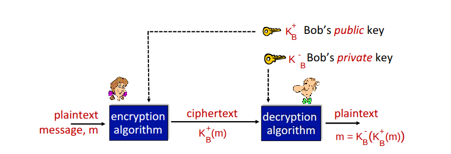


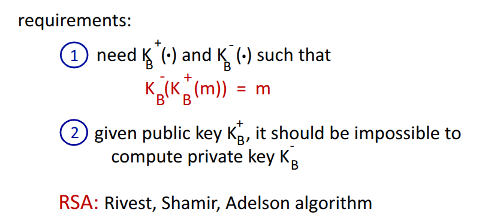


### [2.1] RSA

$$
\text{公钥(E,N)~|~私钥(}\color{red}\mathbf{D}\color{black}\text{,N)}\\
明文^E \text{~mod~} N = 密文\\
密文^D \text{~mod~} N = 明文\\
\text{E和N可对调不影响，仅私钥中的D不公开}
$$

 


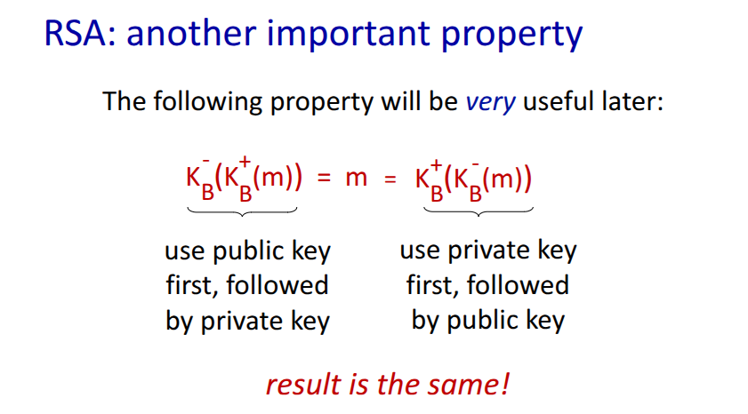


### [2.2] 数字签名 和 消息摘要

Bob 通过使用他的私钥\(K_{B}\)对m进行加密来签名，生成“已签名”消息\(K_{B}^{-}(m)\)。那么其他人用公钥 $K^+_B$ 则可验证这个确实是Bob

为什么需要**消息摘要（Message Digests）**？上述使用RSA公私钥加密实际上很耗时！因此我们需要将其哈希，对哈希进行RSA！这个就是消息摘要！

因此实际上数字签名是对消息摘要，也就是$H(m)$ 进行签名，而不是对$m$签名！

那么，公钥在哪儿获取呢？当然是**CA（Certification Authority）**！

**认证机构（CA）：**将公钥与特定实体绑定，实体E（个人、网站、路由器）向CA注册其公钥，并向CA提供“身份证明”

- CA 创建将身份E绑定到E的公钥证书的证书，该证书包含由CA进行数字签名的E的公钥：CA表明“这是E的公钥”

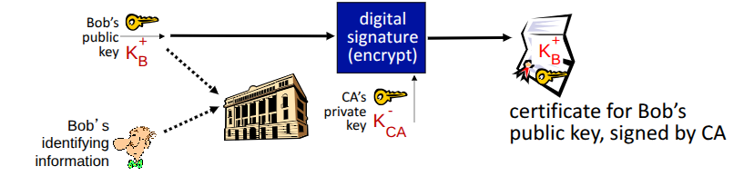

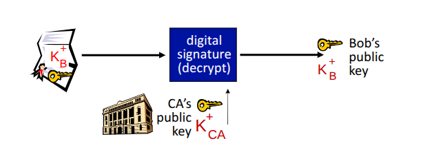

## [3] 对称+公私钥加密邮件


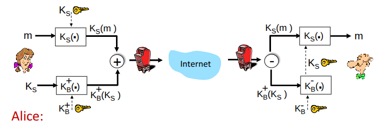


这里Alice对邮件使用Symmetric Key，但是 Symmetric Key 要传过去，就用到公私钥。

因此这是混合加密

完成了：Confidentially


但是，我们如何确保这个m确实是Alice写的呢？ 我们可以使用数字签名！

完成了：Integrety+Authentication

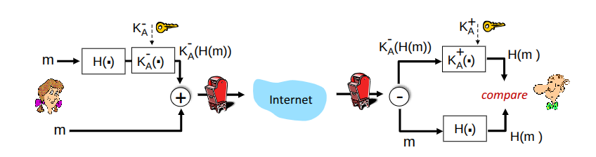


完整路径：

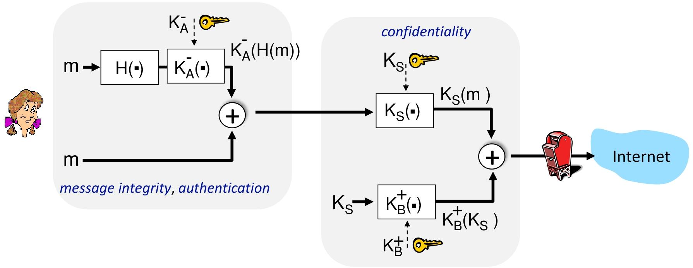

第一部分就是数字签名，产出一个包，这个包   包含了：

- m原文
- 数字签名 $K^-_A(H(m)$

第二部分就是对这个包进行对称加密，同时用接收方的公钥对Symmetric Key进行加密（Symmetric Key非常快！）

发送！

# Final Exam Review

## QUIZ

### [1] 关于 Protocols

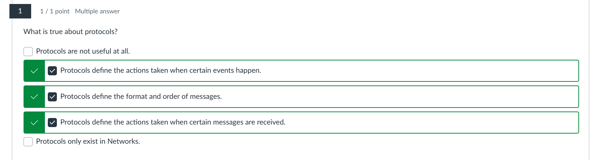

B：**(Protocols define the actions taken when certain events happen.)** 

> **例子：** 在 TCP 协议中，如果发生“超时”（Timeout）事件（即在规定时间内没收到确认信号），协议会规定发送端必须“重传数据包”。这就是针对特定事件（超时）定义的特定操作（重传）。

C：**(Protocols define the format and order of messages.)**

> **格式（Format）：** 规定数据的结构。例如，一个 HTTP 请求的第一行必须包含方法（如 GET 或 POST）。
>
> **顺序（Order）：** 规定交互的先后。就像人类社交：先打招呼（Hello），对方回应（Hi），然后才能开始交谈。网络握手（Handshake）就是典型的顺序定义。

D：**(Protocols define the actions taken when certain messages are received.)**

> **例子：** 当服务器收到一个 HTTP "GET" 请求时，协议规定服务器的操作应该是去查找对应的文件并将其返回。如果收到的是 "404" 错误消息，浏览器则知道应该显示“页面未找到”。


### [2] 接入网、分组交换和电路交换

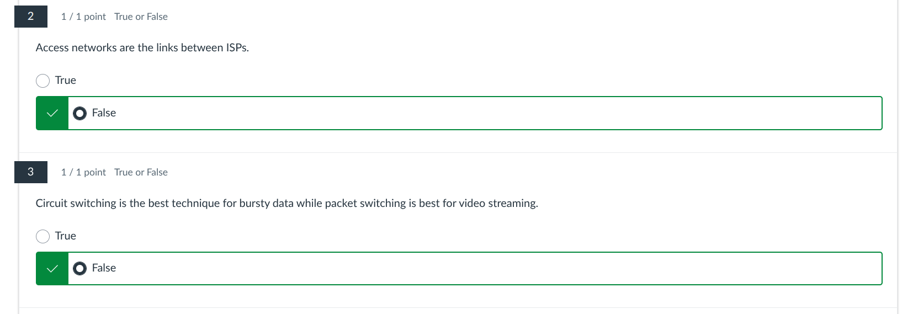

> **什么是接入网？** 接入网是指将**端系统**（End systems，如你的电脑、智能手机）连接到**边缘路由器**（Edge router）的物理链路。它是你连接到互联网的“第一公里”。
>
> 连接不同 ISP（互联网服务提供商）的链路属于**网络核心**（Network Core），通常通过分层结构的 ISP 网络和交换点（IXP）实现互联。
>
> 所以，接入网应该是 端系统（或者说Host，边缘设备）连接到边缘路由器的物理链路！而不是ISP之间的物理链路


> **突发性数据（Bursty Data）：** 指的是那些时有时无、流量不稳定的数据（例如浏览网页）。对于这种数据应当使用**分组交换！**
>
> **电路交换（Circuit Switching**）更适合“持续性/实时性流”，因为他是独占的

​	

### [3] ISO/OSI模型

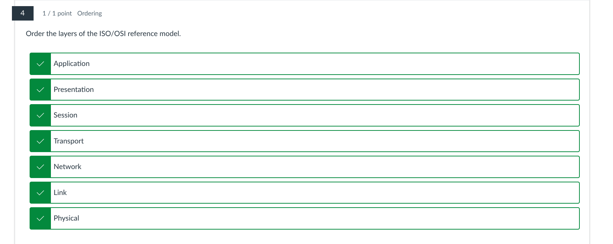

> 多了PS层


### [4] 网络层和Router

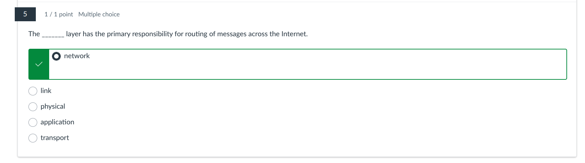

Switch ： Link

Router：Network

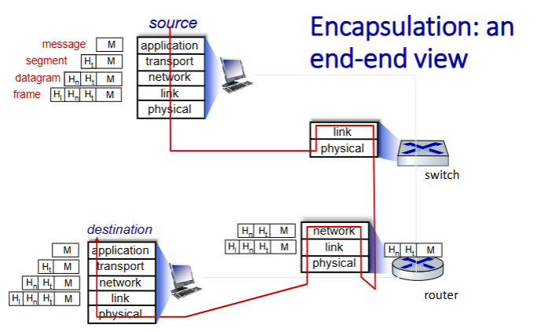


Network Layer 同时包含数据平面、控制平面，因此也有 Path Determination 功能


## REVIEW APPLICATION LAYER

### [1] HOST 连接

What information is used by a **process** running on one host to identify a process on another host?

要唯一标识另一台主机上的特定**进程**，通常需要以下**两个核心信息**：

**IP Address + Port Number**

> ### 1. 目标主机的地址 (IP Address)
>
> - **作用**：用于在互联网中定位那台特定的“机器”（Host）。
> - **解释**：IP 地址确保数据包能够被路由到正确的目的地。
>
> 2. ### 目标进程的标识符 (Port Number / 端口号)
>
> - **作用**：在一台主机内部定位特定的“程序”或“进程”。
> - **解释**：一台电脑上可能同时运行着 Web 浏览器、即时通讯工具和邮件客户端。端口号（如 HTTP 的 80 端口，HTTPS 的 443 端口）告诉操作系统应该把收到的数据交给哪个应用程序。


### [2] C-S 和 P2P

Explain the differences between the client-server and peer-to-peer models for distributed computing.


| **维度**     | **客户端-服务器 (C-S)**       | **对等网络 (P2P)**               |
| ------------ | ----------------------------- | -------------------------------- |
| **结构**     | 中心化                        | 去中心化 / 分布式                |
| **设备角色** | 明确区分（提供者 vs. 消费者） | 角色重叠（既提供也消费）         |
| **资源位置** | 集中在中心服务器              | 分散在各个对等节点               |
| **单点故障** | 有（服务器宕机则全网瘫痪）    | 无（单个节点故障影响微小）       |
| **典型应用** | HTTP (Web)、Email、网银系统   | BitTorrent、Skype (早期)、区块链 |
| **成本**     | 高（需昂贵的服务器硬件）      | 低（利用现有用户的闲置资源）     |


### [3] 区分 Client 和 Server

For a communication session between a pair of processes, which process is the **client** and which is the **server**?

在由一对进程组成的通信会话中，区分客户端（Client）与服务器（Server）主要取决于**谁发起了初始连接**：

- **客户端 (Client)**：在通信开始时**主动**发起连接请求的进程。
- **服务器 (Server)**：**被动**等待连接，并对客户端的请求做出响应的进程。


### [4] 两种 Mail Protocols

- **发送协议 (SMTP)**
  - 负责在发送方服务器与接收方服务器之间传递邮件。它需要解决的是如何将信件投递到目的地的邮箱服务器。
  - **SMTP：推（Push）协议**
- **接收/访问协议 (IMAP/POP3)**
  - 负责用户从自己的服务器上下载或查看邮件。因为用户通常不会时刻保持设备在线来直接接收邮件，所以邮件需要先存放在服务器的“用户邮箱”中，再由用户按需调取。
  - **拉（Pull）协议**。

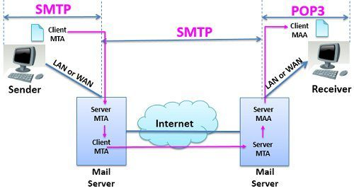

### [5] 持久/非持久 HTTP

Suppose a webpage consists of many small pictures. You have the choice of two browsers, one using persistent HTTP and the other one non-persistent HTTP. Which one would you choose? Why?

选择使用**持久 HTTP（Persistent HTTP）**的浏览器。

> 原因如下：
>
> - **减少 RTT 开销**：在**非持久 HTTP** 中，每传输一个图片对象都需要建立一个新的 TCP 连接，这意味着每个对象都要花费 **2 个 RTT**（1 个用于建立 TCP 连接，1 个用于请求/响应数据）。如果图片很多，累积的延迟会非常高。
> - **连接复用**：**持久 HTTP** 允许在同一条 TCP 连接上连续传输多个对象，只需在开始时建立一次连接。后续请求图片时，可以省去建立连接的 RTT，从而显著缩短网页的总加载时间。
> - **资源利用效率**：持久连接减少了服务器频繁建立和关闭 TCP 连接的压力，对网络资源的使用更加高效。


### [6] HTTP 建立过程协议

Consider an HTTP client that wants to retrieve(**fetch**) a Web document at a given URL. The IP address of the HTTP server is initially **unknown**. What **transport** and **application** layer protocols are needed in this scenario?

**应用层协议 (Application Layer)**

- **DNS (Domain Name System)**：由于 HTTP 服务器的 IP 地址最初是未知的，客户端首先需要使用 DNS 协议将 URL 中的主机名（Hostname）解析为对应的 32 位 IP 地址。
- **HTTP (Hypertext Transfer Protocol)**：一旦获取了服务器的 IP 地址，客户端将使用 HTTP 协议向服务器发送 `GET` 请求，以检索目标网页文档。

**传输层协议 (Transport Layer)**

- **UDP (User Datagram Protocol)**：**DNS 查询** 通常基于 UDP 协议进行。它能够快速完成域名到 IP 地址的翻译，且报头开销小。
- **TCP (Transmission Control Protocol)**：**HTTP 请求**必须在**可靠的传输服**务上运行，因此使用 TCP 协议。客户端会主动向服务器的 80 端口（或 443 端口）发起 TCP 三次握手来建立连接，以确保网页对象能完整、有序地传输。

### [7] 协议回顾

**应用层 (Application Layer)**

这一层负责支持网络应用，通过交换消息（Messages）实现进程间通信。

- **HTTP (超文本传输协议)**：用于 Web 资源请求与传输。
- **DNS (域名系统)**：负责域名到 IP 地址的解析。
- **SMTP / IMAP**：分别用于电子邮件的发送与接收。
- **FTP (文件传输协议)**：用于文件传输与下载。
- **P2P 协议**：如 BitTorrent，用于对等文件分发。


**传输层 (Transport Layer)**

这一层负责主机中进程到进程的数据传输，将消息打包为段（Segments）。

- **TCP (传输控制协议)**：提供面向连接、可靠的字节流传输，具有拥塞控制和流量控制功能。
- **UDP (用户数据报协议)**：提供无连接、不可靠的数据报传输，侧重低延迟。
- **TLS (传输层安全)**：虽然在应用层实现，但为 TCP 提供加密、防篡改和身份认证。
- **QUIC**：运行在 UDP 之上的现代协议，旨在提高 HTTP/3 的性能，Google。


**网络层 (Network Layer)**

这一层负责将数据报（Datagrams）从源地址路由到目的地址。

- **IP (互联网协议)**：包括 IPv4 和 IPv6，负责逻辑寻址和分片。
- **ICMP (互联网控制报文协议)**：用于路由器间的错误报告和指令。
- **路由协议**：如 **OSPF**（域内路由）和 **BGP**（域间路由），用于确定数据传输路径。


**链路层 (Link Layer)**

这一层负责相邻网络设备（物理相邻节点）之间的数据传输，将数据封装为帧（Frames）。

- **以太网 (Ethernet)**：最主流的有线局域网技术。
- **802.11 (WiFi)**：最常见的无线局域网协议。
- **PPP (点对点协议)**：用于点对点链路的连接。
- **ARP (地址解析协议)**：用于通过 IP 地址查询对应的 MAC 地址。


### [8] 为什么 HTTP/SMPT 需要TCP而非UDP

Why do HTTP and SMTP run on top of TCP rather than on UDP?

最根本的原因在于它们对**数据传输可靠性**的极高要求：

- **数据完整性与可靠性**：HTTP（网页传输）和 SMTP（电子邮件）都不允许数据丢失或损坏。TCP 提供**可靠的数据传输服务**，通过确认应答（ACK）和重传机制确保每一个字节都能无误地送达。如果使用 UDP，网页可能会丢失图片或文字，电子邮件可能会出现乱序或内容残缺。
- **按序交付**：网页文档和邮件通常包含大量的字符或对象。TCP 的序列号机制能保证这些数据片段在接收端按正确的顺序重新组装，而 UDP 并不保证数据的到达顺序。
- **拥塞控制与流量控制**：TCP 具有拥塞控制功能，当网络过载时会限制发送速率，防止网络崩溃；同时通过流量控制确保发送方不会让接收方过载。这对于传输体积较大的网页对象或带有附件的邮件至关重要。


### [9] UDP 1 Socket vs UCP 2 Socket

We discussed a UDP server and TCP server. The UDP server needed only one socket whereas the TCP server needed two sockets.

- Why?
- If the TCP server were to support n simultaneous connections, how many sockets would the TCP server need?

回顾 TCP

```java
ServerSocket welcomeSocket = new ServerSocket(6789);
while (true) {
	Socket connectionSocket = welcomeSocket.accept(); // 这里卡住直到有来自客户端的Connection
    ...
}
```


为什么 TCP 服务器需要两个（或更多）套接字？

- **功能分工**：TCP 区分了“监听”和“通信”两种职责。
- **欢迎套接字 (Welcome Socket)**：这是服务器运行后的第一个套接字，专门负责监听端口并接收来自客户端的初始连接请求。
- **连接套接字 (Connection Socket)**：每当服务器接受一个连接（通过三次握手），TCP 就会为该特定客户端创建一个全新的套接字。
- **多路分解**：TCP 通过**'4-tuple' (Source IP, Source Port, Destination IP, Destination Port)**来唯一标识连接。独立的连接套接字确保了服务器可以准确区分并同时处理来自不同客户端的数据流。


为什么 UDP 服务器只需要一个套接字？

- **无连接特性**：UDP 是**无连接的**，服务器不需要为每个客户端建立独立的通信管道。
- **数据报处理**：服务器通过同一个套接字接收所有来源的数据包。
- **显式寻址**：每个到达的数据包都包含了发送方的 IP 和端口号，服务器回复时只需将数据发往该特定地址即可。


如果 TCP 服务器要支持 $n$ 个并发连接，需要多少个套接字？

TCP 服务器总共需要 **$n + 1$** 个套接字：

- **1 个欢迎套接字**：用于持续监听新请求。
- **$n$ 个连接套接字**：每个活跃的客户端连接都对应一个专属的套接字。


## REVIEW NETWORK/ LINK LAYER

### [1] 协议栈不同层对数据包（Packet）的称呼

What is the name of a packet in each of the following layers?
(a) Transport Layer
(b) Network Layer
(c) Link Layer

**应用层（Application Layer）**：称为**消息 / 报文 (Message)**

**传输层 (Transport Layer)**：称为 **段 (Segment)**。

 **网络层 (Network Layer)**：称为 **数据报 (Datagram)**。

**链路层 (Link Layer)**：称为 **帧 (Frame)**。


### [2] 网络层的两个功能的区别

What is the difference between **routing** and **forwarding**?


| **特性**     | **转发 (Forwarding)**      | **路由 (Routing)**           |
| ------------ | -------------------------- | ---------------------------- |
| **主要功能** | 搬运数据包（从输入到输出） | 规划路径（从源到目的）       |
| **操作范围** | 局部（单台设备）           | 全局（整个网络）             |
| **对应平面** | **数据平面** (Data Plane)  | **控制平面** (Control Plane) |
| **速度需求** | 极快（通常由硬件完成）     | 相对慢（由软件/算法计算）    |


### [3] 路由架构

Draw a diagram illustrating the architecture of a router.


### [4] 三种Switching Fabric

We discussed 3 types of **switching fabrics**. Briefly describe each of them.

- Switch Via **Memory**
- Switch Via **Bus**
- Switch Via **InterConnection Network**

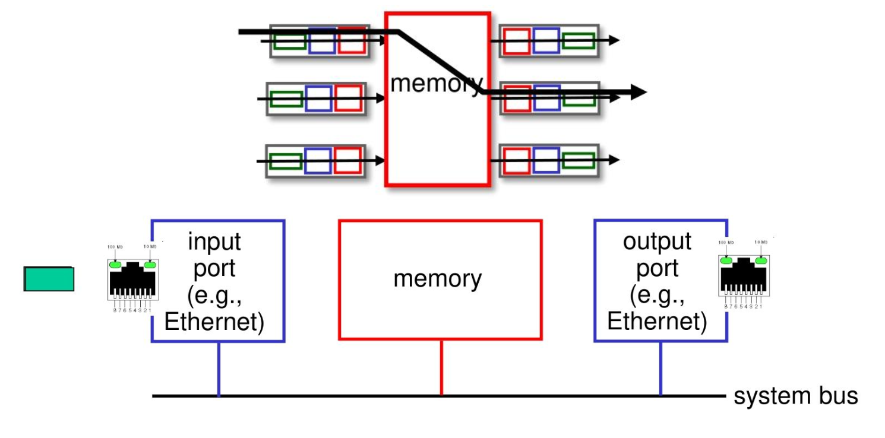 


$$
图\text{:内存（左）和总线（右）}
$$


$$
图\text{:相互连接的网络}
$$


### [5] Router Input/Output Port 丢包情况

Describe how packet loss can occur at input ports of routers.

Input port 丢包的情况：

- 缓冲区堆积+溢出
- HOL（Head of Line） Blocking


Output Port 丢包情况了：

- Switch Fabric 速度 > Output Link 速度（不过这个是在输出的时候）
- 缓冲区堆积+溢出


### [6] 什么是 HOL Blocking

What is HOL blocking? Does it occur in input ports or output ports?

### [7] 什么是队头堵塞 (HOL Blocking)？

队头堵塞 **发生在输入端口 (Input Ports)**

队头堵塞是指在路由器的 **FIFO（先入先出）队列**中，排在队首的数据包因为某种原因（例如目标输出端口正忙）而被迫在缓冲区等待，从而导致排在它后面的所有数据包也无法被转发的现象。

- **核心矛盾**：即使排在后面的数据包想要前往的输出端口目前是**空闲**的，它们也必须等待队首包被成功搬运后才能移动。
- **后果**：这会显著降低交换结构（Switching Fabric）的利用率，使得明明有空闲的传输路径却无法使用，增加了延迟并可能诱发丢包。


### [8] 分片

Consider sending a 3100 byte datagram into a link that has an MTU of 320 bytes. How many fragments are generated?


**原始数据报大小**：3100 字节（**包含 20 字节的 IP 首部 +==3080 字节数据==**）。

**链路 MTU**：320 字节（该链路允许通过的最大帧大小，包含 IP 首部）。

**每个分片的有效载荷上限**：**==由于每个分片都必须携带 20 字节的 IP 首部==**，因此每个分片最多能承载 $320 - 20 = 300$ 字节的数据。

**8 字节对齐规则**：IP 分片偏移量（Offset）的单位是 **8 字节**，**==因此每个分片（除最后一个外）的数据长度必须是 8 的倍数==**。在此例中，$300$ 字节不是 8 的倍数，最接近且小于 300 的 8 的倍数是 **296** 字节（即 $296 \div 8 = 37$ 个偏移单位）。

> **偏移量字段（Offset Field）==本身并不占用额外的 MTU 空间==**。它是一个 13 位的字段，已经包含在 20 字节的 IP 首部（Header）之中了。

我们需要将 **3080 字节** 的原始数据拆分为每块不超过 **296 字节** 的数据块：

1. **分片 1**：携带 296 字节数据（剩余 2784 字节数据）。
2. **分片 2 到分片 10**：每个分片继续携带 296 字节数据（$296 \times 10 = 2960$ 字节）。此时剩余数据为 $3080 - 2960 = 120$ 字节。
3. **分片 11**：携带剩下的 120 字节数据。

共生成 **11 个分片**。


### [9] 10进制IP转二进制

What is the 32-bit binary equivalent to the IP address `225.1.3.51`?

1. **225** $\rightarrow$ **11100001** ($128 + 64 + 32 + 1$)
2. **1** $\rightarrow$ **00000001**
3. **3** $\rightarrow$ **00000011**
4. **51** $\rightarrow$ **00110011** ($32 + 16 + 2 + 1$)


> 注意这里固定格式8 bit


### [10] 解析 IPv4 数据报

数据报 Datagram 是网络层 Network Layer 的

You have captured an IPv4 datagram and the first 160 bits are as follows:
```java
01000101 00000000 [00000000 11111010] //LENGTH
00001010 01111110 01000000 00000000  // Fragment stuff
10000000 00000110 10110101 10100010  // other stuff
[10101000 00100100 00000100 00010100]  // SOURCE IP ADD
[11001000 00101001 00000100 00011000]  // DEST IP ADDRESS
```

What is the destination IP address of this datagram in the **standard a.b.c.d notation?** **Source IP address? Length in bytes of the datagram?**


### [11] CIDR 划分子网

Consider a router that interconnects three subnets: A, B, and C. Suppose all of the interfaces in each of these subnets are required to have the prefix `223.200.0.0/20`. Suppose subnet A isrequired to support 2000 interfaces, and subnet B and C are each required to support 1000 interfaces. Provide network addresses for A,B and C (in the form a.b.c.d/x) that satisfy these constraints.

假设有一台路由器连接了三个子网：A、B 和 C。所有子网中的接口都必须共享前缀 **223.200.0.0/20**。已知子网 A 需要支持 **2000** 个接口，子网 B 和 C 各需要支持 **1000** 个接口。请为 A、B、C 提供满足这些条件的网络地址（格式为 `a.b.c.d/x`）。

`223.200.0.0/20`

- **可用位数**：IP 地址共 32 位，前缀占 20 位，剩余 $32 - 20 = 12$ 位用于主机和进一步划分子网。
- **总地址容量**：$2^{12} = 4096$ 个地址。


#### 1. 分析主网段资源

- **主网前缀**：`223.200.0.0/20`。
- **可用位数**：IP 地址共 32 位，前缀占 20 位，剩余 $32 - 20 = 12$ 位用于主机和进一步划分子网。
- **总地址容量**：$2^{12} = 4096$ 个地址。

#### 2. 为子网 A 分配地址（需 2000 个接口）

- **计算掩码**：要支持 2000 个接口，我们需要 $2^{11} = 2048$ 个地址（$2^{10}=1024$ 不够用）。
- **主机位与前缀**：主机位需要 11 位，因此子网前缀长度为 $32 - 11 = 21$ 位。
- **地址分配**：从主网起始处开始分配。
  - **子网 A 地址：223.200.0.0/21**

#### 3. 为子网 B 分配地址（需 1000 个接口）

- **计算掩码**：要支持 1000 个接口，我们需要 $2^{10} = 1024$ 个地址。
- **主机位与前缀**：主机位需要 10 位，因此子网前缀长度为 $32 - 10 = 22$ 位。
- **地址起点**：子网 A 占用了前 2048 个地址（即从 `223.200.0.0` 到 `223.200.7.255`）。子网 B 的起点为 `223.200.8.0`。
  - **子网 B 地址：223.200.8.0/22**

#### 4. 为子网 C 分配地址（需 1000 个接口）

- **计算掩码**：同样需要 1024 个地址，前缀长度为 **22** 位。
- **地址起点**：子网 B 占用了 1024 个地址（即从 `223.200.8.0` 到 `223.200.11.255`）。子网 C 的起点为 `223.200.12.0`。
  - **子网 C 地址：223.200.12.0/22**


| **子网** | **需求接口数** | **实际地址容量 (232−x)** | **网络地址 (a.b.c.d/x)** |
| -------- | -------------- | ------------------------ | ------------------------ |
| **A**    | 2000           | 2048                     | **223.200.0.0/21**       |
| **B**    | 1000           | 1024                     | **223.200.8.0/22**       |
| **C**    | 1000           | 1024                     | **223.200.12.0/22**      |


### [12] 路由有IP吗

Do routers have IP addresses? If so, how many?

**每一台路由器通常拥有多个 IP 地址**。如果一台路由器连接了 3 个不同的子网（如之前练习中的 A、B、C），那么它至少拥有 **3 个 IP 地址**，每个地址属于其连接的那个特定子网。


### [13] Datagram经过的接口和转发表

Suppose there are 5 routers between a source host and a destination host. Over how many **interfaces** will an IP datagram travel if it is sent from the source host to the destination host? How many forwarding tables will be looked up in the process?

假设在源主机（Source Host）和目的主机（Destination Host）之间有 **5 台路由器**。如果一个 IP 数据报从源主机发送到目的主机，它将经过多少个**接口 (Interfaces)**？在这个过程中，需要查找多少次**转发表 (Forwarding Tables)**？


要回答这个问题，我们需要理解数据包在网络层传输时的每一个“跳跃”点。

经过的接口数量：12 个（出一次，入一次，画一个图即可！） **总计**：$1 + 10 + 1 = \mathbf{12}$ **个接口**。

转发表查找发生在网络层需要决定“下一跳去哪里”的时候。**因此是6次。**总计**：$1 \text{ (源主机)} + 5 \text{ (路由器)} = \mathbf{6}$ **次查找**。**


### [14] 封装字节数

Suppose an **application** generates chunks of 20 byte of data every 20msec and each chunk gets encapsulated in a TCP segment and then an IPv4 datagram. What percentage of each datagram will be **application** data?
假设一个应用程序每隔 **20 毫秒** 生成一个 **20 字节** 的数据块。每个数据块都会先被封装进一个 **TCP 报文段**，然后再封装进一个 **IPv4 数据报**。请问在最终生成的每个数据报中，**应用程序数据所占的百分比**是多少？

这个问题考查的是**封装开销 (Encapsulation Overhead)** 对网络效率的影响。

**应用层数据 (Payload)**：20 字节。

**TCP 首部开销 (TCP Header)**：20 字节。

**IP 首部开销 (IP Header)**：20 字节。
$$
\text{百分比} = \frac{20}{60} \times 100\% = \mathbf{33.33\%}
$$


> 更详细、到Link Layer产生的开销：
>
> | **步骤**   | **协议层**             | **增加的额外数据 (典型值)**        | **说明**                                                     |
> | ---------- | ---------------------- | ---------------------------------- | ------------------------------------------------------------ |
> | **Step 1** | **传输层 (Transport)** | **UDP: +8 字节** **TCP: +20 字节** | UDP 只有 4 个字段；TCP 首部包含序号、确认号等，固定长度为 20 字节。 |
> | **Step 2** | **网络层 (Network)**   | **IPv4: +20 字节**                 | 包含源/目的 IP、TTL、校验和等关键字段，固定长度为 20 字节。  |
> | **Step 3** | **链路层 (Link)**      | **Ethernet Frame: +18 字节**       | 以太网帧包含 14 字节首部（MAC 地址等）和 4 字节的帧校验序列（FCS）尾部。 |

如果是 IPv6 则为 40 字节


### [15] IPv4 IPv6 MAC 地址空间

How big is the **IPv4** address space? The **IPv6** address space? The **MAC** address space?

IPv4 使用 **32 位（32-bit）** 二进制地址：$2^{32}$个地址

MAC 地址（局域网地址）使用 **48 位（48-bit）** 二进制地址：$2^{48}$

IPv6 为了彻底解决地址短缺问题，将地址长度扩展到了 **128 位（128-bit）**：1$2^{128}$


### [16] 下一个路由/ N 跳/ 接口

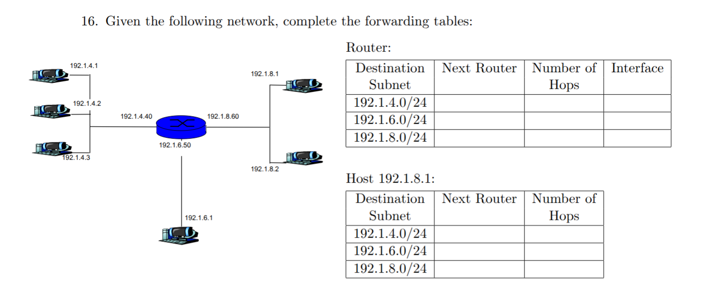

对路由器来说，这三个子网都是**直接相连**的，因此不需要“下一跳路由器”。

| **目的子网 (Destination Subnet)** | **下一跳路由器 (Next Router)** | **跳数 (Hops)** | **接口 (Interface)** |
| --------------------------------- | ------------------------------ | --------------- | -------------------- |
| **192.1.4.0/24**                  | 直接交付 (Direct)              | 1               | **192.1.4.40**       |
| **192.1.6.0/24**                  | 直接交付 (Direct)              | 1               | **192.1.6.50**       |
| **192.1.8.0/24**                  | 直接交付 (Direct)              | 1               | **192.1.8.60**       |


主机 `192.1.8.1` 位于右侧子网。它要访问**其他子网**，必须通过它的**默认网关 (Default Gateway)**，即路由器的右侧接口 `192.1.8.60`。

| **目的子网 (Destination Subnet)** | **下一跳路由器 (Next Router)** | **跳数 (Hops)** |
| --------------------------------- | ------------------------------ | --------------- |
| **192.1.4.0/24**                  | **192.1.8.60（出网关）**       | ==2==           |
| **192.1.6.0/24**                  | **192.1.8.60**                 | ==2==           |
| **192.1.8.0/24**                  | 直接交付 (Direct)              | 1               |

> 解析一下 `192.1.4.0/24`：
>
> IP 地址 `192.1.4.0` 由 32 位二进制组成：
>
> - **网络部分 (前 24 位)**：`11000000.00000001.00000100` (即 `192.1.4`)
> - **主机部分 (后 8 位)**：`00000000` (即 `.0`)
>
> 根据主机位（8 位）可以得出，**总地址数**：$2^8 = 256$ 个。
>
> - **网络地址 (Network Address)**：主机位全为 0，即 **`192.1.4.0`**。
> - **广播地址 (Broadcast Address)**：主机位全为 1，即 **`192.1.4.255`**。
> - **可用主机范围**：除掉**网络和广播地址**，剩下的即为可用 IP：**`192.1.4.1` 到 `192.1.4.254`**
>
> 广播地址：当你向这个地址发送数据包时，路由器和交换机会将其分发给该子网内的**所有**设备。比如ARP查找MAC
>
>  网络地址：作为子网的“唯一标识” (ID)
>
> | **项目**       | **数值**        | **解释**           |
> | -------------- | --------------- | ------------------ |
> | **CIDR 记法**  | `192.1.4.0/24`  | 前 24 位为网络号   |
> | **网络号**     | `192.1.4.0`     | 标识该子网本身     |
> | **可用主机数** | $256 - 2 = 254$ | 减去网络号和广播号 |
> | **子网掩码**   | `255.255.255.0` | 用于屏蔽主机位     |


### [17] 路由器根据转发表查询子网主机

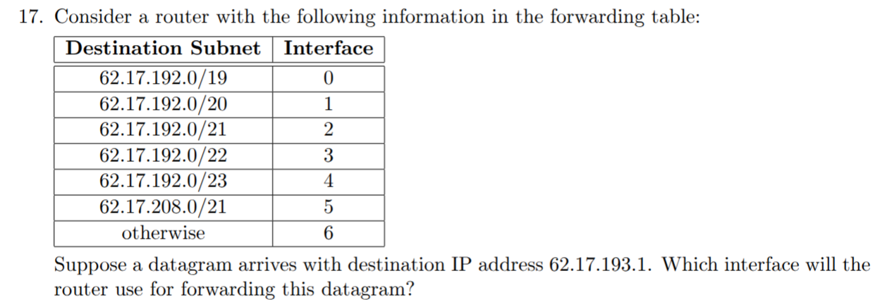


这道题考察的是路由器转发的核心原则：**最长前缀匹配 (Longest Prefix Matching)**。

当一个数据包到达路由器时，它的目的 IP 地址可能会同时匹配转发表中的多个条目。此时，路由器会选择**掩码长度（即 `/x` 中的数字）最长**、也就是最精确的那个条目进行转发。

| **转发表条目**     | **前缀长度要求**     | **目的 IP 第三字节匹配部分**                     | **是否匹配** |
| ------------------ | -------------------- | ------------------------------------------------ | ------------ |
| 62.17.192.0**/19** | 前 3 位必须匹配      | 193 的前三位是 **`110`**，192 也是 `110`         | **Yes**      |
| 62.17.192.0**/20** | 前 4 位必须匹配      | 193 的前四位是 **`1100`**，192 也是 `1100`       | **Yes**      |
| 62.17.192.0**/21** | 前 5 位必须匹配      | 193 的前五位是 **`11000`**，192 也是 `11000`     | **Yes**      |
| 62.17.192.0**/22** | 前 6 位必须匹配      | 193 的前六位是 **`110000`**，192 也是 `110000`   | **Yes**      |
| 62.17.192.0**/23** | 前 7 位必须匹配      | 193 的前七位是 **`1100000`**，192 也是 `1100000` | **Yes**      |
| 62.17.208.0/21     | 208 二进制是 `11010` | 193 是 `11000`，第 4 位不同                      | No           |

> `62.`（8）
>
> `17.`（8）
>
> `192` = `1 1 1 0 0 0 0 0 0`
>
> `193` = `1(17) 1(18) 1(19) 0(20) 0(21) 0(22) 0(23) 0 1`

目的 IP 同时匹配了 `/19`、`/20`、`/21`、`/22` 和 `/23` 这五个前缀。

根据**最长前缀匹配原则**，路由器会选择数值最大的掩码，即 **`/23`**。

- **对应接口**：**Interface 4**。


### [18] AS 内部协议是否相同

每一个自治系统（AS）都必须使用相同的**内部**（Intra-AS）路由协议吗？

**不需要。** 每一个自治系统（AS）都可以根据自己的需求自主选择不同的内部路由协议。

### [19] Inter和Intra路由协议不同原因

为什么自治系统间（Inter-AS）和自治系统内（Intra-AS）的路由协议不同？


这是两者最本质的区别：策略（Policy）

- **Intra-AS（内部）**：在同一个自治系统内部，所有路由器都属于同一个机构，管理目标是统一的。因此，不需要复杂的“政治”或“商业”策略，只需要高效转发。
- **Inter-AS（外部）**：在 AS 之间，路由决定往往涉及商业利益和安全政治。例如，一个 ISP 可能拒绝为**竞争对手（Competitors）**转发流量，或者希望流量优先经过与其有合作协议的网络。BGP（外部协议）的设计核心就是为了支持这种**基于策略的路由**。

Policy > Protocols


| **特性**     | **自治系统内 (Intra-AS)** | **自治系统间 (Inter-AS)**    |
| ------------ | ------------------------- | ---------------------------- |
| **首要目标** | 性能（最短路径）          | 策略（商业/政治利益）        |
| **管理权**   | 单一机构，完全自主控制    | 多个机构，需通过协议达成共识 |
| **可扩展性** | 关注内部节点，要求较低    | 关注全球前缀，要求极高       |
| **常见协议** | OSPF, IS-IS, RIP          | **BGP**                      |


### [20] CRC

Compute the CRC bits defined by the generator `1011` and the data bit string `110101`.

G = `1011`  D = `110101` 求R

R的长度是 `|G|-1=3` 因此D需要补3个0，然后算出余数（强制三位）是`111`

**最终发送的帧**：`110101` (数据) + `111` (CRC) = **`110101111`**。


### [21] 理想多路访问四大特征

An Ideal Multiple Access Protocol should have 4 characteristics. List them.

- **全速率吞吐 (Full Throughput)**
- 公平共享 (Fairness)
- 去中心化 (Decentralized)
- 简单易行 (Simple)


我们现实中使用的协议（如 CSMA/CD 或 ALOHA）很难同时完美满足这四个特征


### [22] ALOHA 画图

Sketch the operation of Slotted ALOHA.


### [23] APR MAC 广播和回传

Why is an ARP query sent within a **broadcast** frame? Why is an ARP response sent within a frame with **specific destination MAC address**?

**为什么 ARP 查询（Query）是在广播帧（Broadcast Frame）中发送的？而 ARP 响应（Response）则是通过带有特定目的 MAC 地址的帧发送的？**


为什么 ARP 查询使用广播？**因为“不知道”**：当主机 A 想要给主机 B 发送数据时，它只知道 B 的 IP 地址，但完全不知道 B 的 MAC 地址（甚至不知道 B 在不在这个网络里）。**寻找目标**：为了找到 B，主机 A 必须在整个局域网内发出“寻人启事”。它将 ARP 查询封装在一个目的 MAC 为 `FF:FF:FF:FF:FF:FF` 的广播帧中。

为什么 ARP 响应使用单播？**因为“已经知道了”**：当目标主机 B 收到查询包后，它不仅知道了 A 在找它，还从 A 的查询包里提取出了 **A 的 MAC 地址**。


### [24] Router 和 Switch 在哪层操作

At which layer do routers operate? Switches? 


### [25] 什么是 CSMA Protocol

**CSMA** 全称是 **Carrier Sense Multiple Access**（载波监听多路访问），它是计算机网络中一种非常基础的**介质访问控制（MAC）协议**。


| **特性**     | **CSMA/CD (Collision Detection)**      | **CSMA/CA (Collision Avoidance)**                |
| ------------ | -------------------------------------- | ------------------------------------------------ |
| **全称**     | **冲突检测**                           | **冲突避免**                                     |
| **核心机制** | 边听边说，一旦发现冲突立即停止发送。   | 尽量避免冲突，发送前先发送一个小信号预约。       |
| **应用场景** | **有线网络** (如早期的以太网)。        | **无线网络** (如 Wi-Fi)。                        |
| **打比方**   | 发现有人插话，立刻闭嘴并等一会儿再说。 | 说话前先举手示意，得到允许或确认没人举手后再说。 |

> CSMA/CA ： Minimize collisions by sending a **short control signal** to reserve the channel before transmission.


### [26] CSMA/CD 碰撞

Consider CSMA/CD with exponential backoff. After the 5’th collision, what is the probability that a node chooses $K=4$?
$$
[0, 1, 2, \dots, 2^n - 1]\\
p = \dfrac1{32}
$$


### [27] Partition Access 和 Random Access 情景

Is it true that at high load channel partitioning multiple access protocols are more efficient than random access multiple access protocols? Why or why not?

在**高负载 (High Load)** 情况下，信道划分协议（Channel Partitioning）确实比随机访问协议（Random Access）更有效率。

> #### A. 随机访问协议 (Random Access) —— 比如 CSMA/CD, ALOHA
>
> - **机制：** 所有人不分先后，想发就发。如果撞车了（Collision），就等一会儿再发。
> - **低负载时：** 非常高效。因为没人跟你抢，你想发就发，延迟几乎为 0。
> - **高负载时（灾难）：** 随着用户增多，冲突概率指数级上升。大部分带宽都被浪费在“冲突 -> 停止 -> 等待 -> 再次冲突”的死循环中。极端情况下，信道吞吐量会降至趋近于 0。
>
> #### B. 信道划分协议 (Channel Partitioning) —— 比如 TDMA, FDMA, CDMA（CD/CA）
>
> - **机制：** 把信道切成固定的小块（时间片、频率或代码）。不管你发不发，这一块都只属于你。
> - **低负载时：** 效率低下。如果你不发数据，你的那份空间就浪费了，别人也没法用。
> - **高负载时（优势）：** * **零冲突：** 因为每个人的位置是定死的，绝对不会发生碰撞。
>   - **公平且稳定：** 带宽被平分。当所有人都想说话时，每个人都能分到固定的 $1/N$ 带宽。
>   - **满载运行：** 信道可以达到 100% 的利用率，而不会因为人多而崩盘。


### [29] 802.11

Which multiple access protocol is used in **802.11** wireless LANs? Briefly explain its functionality.

802.11 无线局域网使用哪种多路访问协议？简要解释其功能。


在 802.11 无线局域网（Wi-Fi）中，使用的多路访问协议是 **CSMA/CA**

功能：

- Sense before Talk : Listen to the medium, check avaliablity
- Wait and Backoff（等待和退让）：Wait for **DIFS** and use random backoff to avoid synchronization
- Avoidance over（优先于） Detection： Use ACKs to confirm success because **CD** is not possible in wireless.
- Use **RTS/CTS** to mitigate（缓解） **Hidden Node Problem**

> **DIFS** 全称是 **Distributed Inter-frame Space**（分布式帧间间隙）。
>
> 它是 CSMA/CA 协议中为了**避免冲突**和**建立优先级**而设置的一种“等待时间”。简单来说，它是设备在尝试发送数据前，必须观察到信道保持空闲的**最短强制时间**。
>
> 确认机制：由于无法检测冲突，发送方无法知道数据是否撞车。因此，接收方在成功收到帧后必须返回一个 **ACK** 帧。如果发送方没收到 ACK，就认为发生了冲突，并启动重传。


# 2017-2018 EXAM

10 MCQ * 2分 = 20分

 5 T/F 问题 * 1 分 = 5 分

3个大题*25分=75分


## [1] 关于单表置换密码的破解

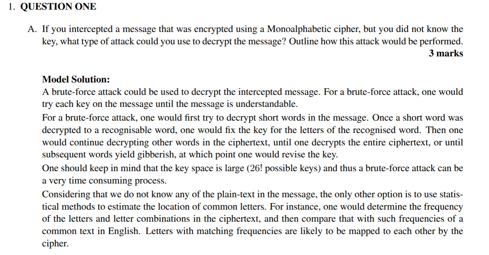


如果你**截获（Intercepted）** 了一个信息，使用**单表置换密码 (Monoalphabetic Cipher)** 加密，但是你不知道密钥是什么，有什么颁发可以解密呢？请概述这种攻击是如何实施的。

在课件中，提到了**暴力破解攻击 (Brute-force attack)** ，以及**统计方法（Statistic Method）**

需要注意的是，单表置换密码的**密钥空间非常大**（共有 $26!$ 种可能的密钥），因此纯粹的暴力破解会是一个非常耗时的过程。所以我们可以尝试短单词！


## [2] 关于邮件传输加密

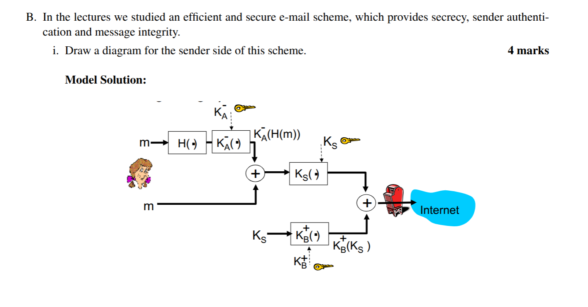

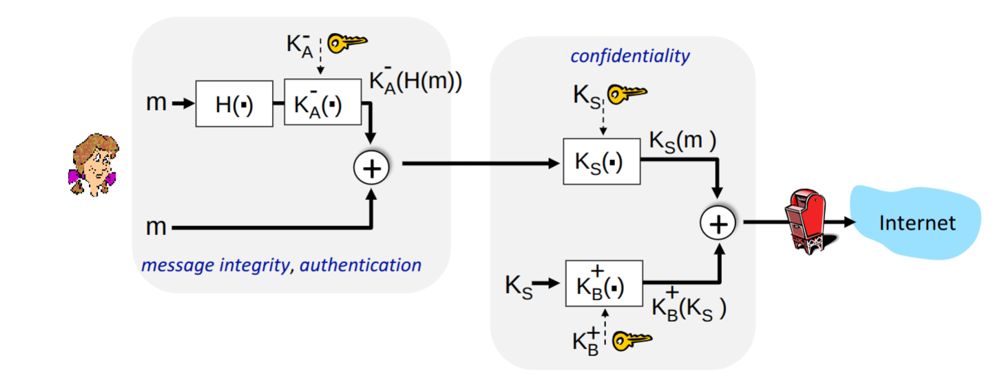

在课程中，我们学习了一个高效且安全的**电子邮件方案**，该方案能够提供**保密性 (Secrecy)**、**发送者身份验证 (Authentication)** 以及 **邮件完整性 (Integrity)**。

> 这个流程图展示了发送者（图中左侧的小人）如何处理邮件 $m$。我们可以将其拆解为三个主要阶段：
>
> #### 阶段一：确保完整性与身份验证 (Digital Signature)
>
> 1. **哈希 (Hashing)：** 将原始邮件 $m$ 通过哈希函数 $H(\cdot)$ 计算出摘要 $H(m)$。
> 2. **签名 (Signing)：** 发送者使用自己的**私钥** $K_A^-$ 对哈希值加密，生成数字签名 $K_A^-(H(m))$。
>    - *作用：* 只有 A 拥有私钥，这证明了身份（身份验证）；如果邮件被改动，哈希值对不上（完整性）。
> 3. **组合：** 将原始邮件 $m$ 与数字签名拼在一起。
>
> #### 阶段二：确保保密性 (Symmetric Encryption)
>
> 1. **生成会话密钥：** 发送者随机生成一个**对称密钥**（会话密钥）$K_s$。**（非公开）**
> 2. **加密内容：** 使用 $K_s$ 对“邮件 + 签名”的组合体进行加密，得到 $K_s(m + K_A^-(H(m)))$。
>    - *作用：* 对称加密速度快，适合加密大段的邮件正文，确保内容不被窃听（保密性）。
>
> #### 阶段三：密钥分发 (Key Distribution)
>
> 1. **加密密钥：** 使用接收者 B 的**公钥** $K_B^+$ 对会话密钥 $K_s$ 进行加密，得到 $K_B^+(K_s)$。
>    - *作用：* 确保只有拥有对应私钥的接收者 B 才能解开 $K_s$，从而解密邮件。
>
> **最终发送：** 将“加密后的邮件”和“加密后的会话密钥”一起发往互联网。


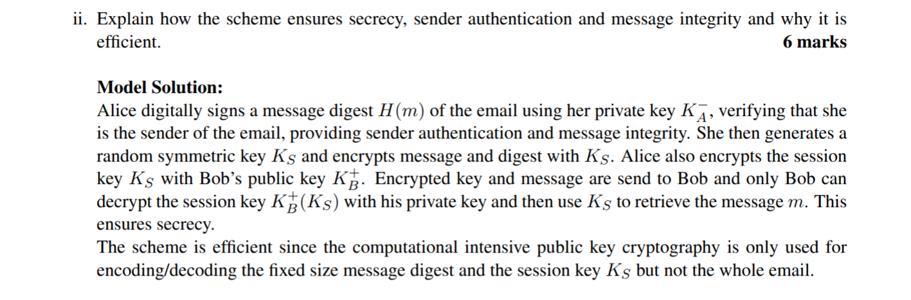

解释该方案如何确保**机密性 (Secrecy)**、**发送者身份验证 (Sender Authentication)** 和 **邮件完整性 (Message Integrity)**，以及为什么它是**高效 (Efficient)** 的。（6分）


- 身份验证与完整性 (Authentication & Integrity)：Digital Signiture = $K_A^-(H(m))$ 
  - Alice 拥有自己的私钥 $K_A^-$。既然这个签名能被 Alice 的公钥解开（Decrypted），那就证明这封信确实是 Alice 亲手发的。

- 机密性 (Secrecy)：数字信封（Digital Envelop）= $K_S(m+K^-_A(H(m)))+$$K_B^+(K_s)$ 
  - 邮件内容被 $K_S$ 加密，只有持有 $K^-_B$ 的人（也就是Bob）才能Decrypt 这个邮件
- 高效性 (Efficiency)
  - RSA 很慢，因此使用对称加密（AES）速度快，用AES处理$m$
  - 对$K_S$ 采用RSA

## [3] Symmertric + RSA 混合加密

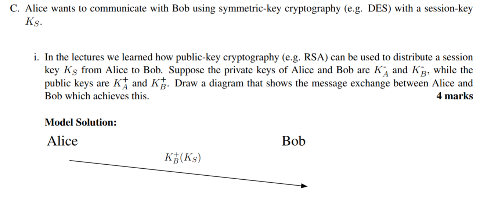


这是很简单的，只需要把 Symmetric Key 给加密就好了


## [4] KDC 密钥分发

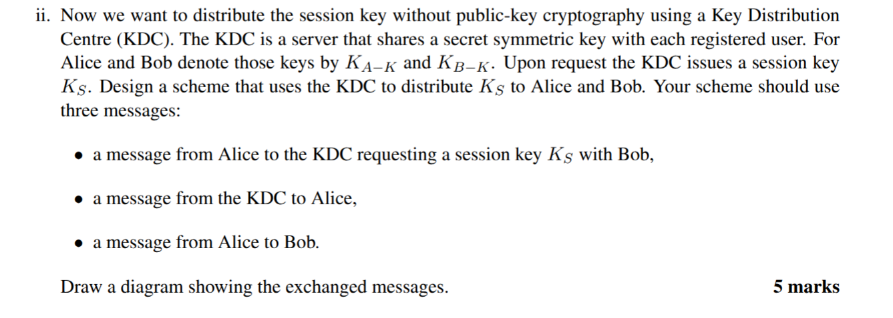

现在我们希望在==不使用公钥加密==的情况下，利用 **密钥分发中心 (KDC)** 来分发会话密钥。KDC 是一个服务器，它与每个注册用户共享一个秘密的**对称密钥**。对于 Alice 和 Bob，这些密钥分别记为 $K_{A-K}$ 和 $K_{B-K}$。根据请求，KDC 会签发一个会话密钥 $K_S$。请设计一个使用 KDC 向 Alice 和 Bob 分发 $K_S$ 的方案。你的方案应包含三条消息：

- 一条从 Alice 到 KDC 的消息，请求与 Bob 的会话密钥 $K_S$。
- 一条从 KDC 到 Alice 的消息。
- 一条从 Alice 到 Bob 的消息。

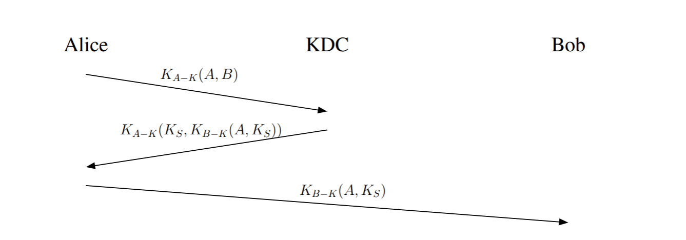

解释：

首先，Alice通过对称密钥$K_{A-K}$ 告诉KDC，希望A和B建立联系，然后KDC先认证是不是A。

KDC用$K_{A-K}$对称密钥解开，发现是A，B，对上了，然后创建一个$K_S$ 对称加密密钥

用B的对称密钥加密，这个包     包含：A想和你通话，你们的对称密钥是 $K_S$ 。这个包是给B的，当然，给A也要给一个对称公钥，然后交给A

A用$K_{A-K}$ 解开，拿到了 $K_s$ 然后把包发给B


## [5] 通信

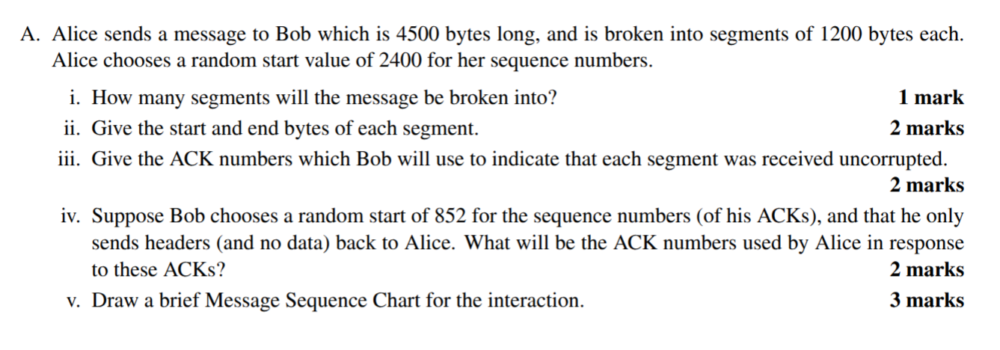

A. 4500 / 1200 = 4，答案是4个

B. [2400,**==3599==**] - [3600, 4799] - [4800, 5999] - [6000, **6899**]

C. 3600. 4800, 6000, **==6900==**

D. 假设 Bob 为他的序列号（即他发回的 ACK 报文的序列号）选择了一个随机起始值 **852**，并且他只向 Alice 发送**首部（不带数据）**。那么 Alice 在响应这些来自 Bob 的报文时，所使用的 **确认号 (ACK numbers)** 将会是多少？
$$
\text{发送方的确认号 (ACK)} = \text{接收到的报文序列号 (Seq)} + \text{接收到的数据负载长度 (Data Length)}
$$
**答案：** Alice 使用的确认号（ACK numbers）将始终是 **852**。


E. 画出MSC，包含SEQ，LEN、ACK

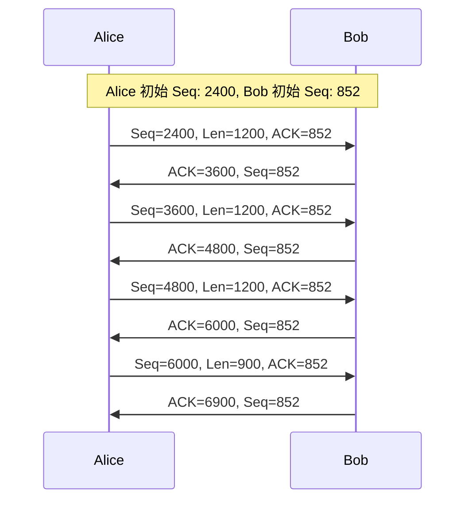
```mermaid
sequenceDiagram
    participant A as Alice
    participant B as Bob

    Note over A,B: Alice 初始 Seq: 2400, Bob 初始 Seq: 852

    A->>B: Seq=2400, Len=1200, ACK=852
    B->>A: ACK=3600, Seq=852

    A->>B: Seq=3600, Len=1200, ACK=852
    B->>A: ACK=4800, Seq=852

    A->>B: Seq=4800, Len=1200, ACK=852
    B->>A: ACK=6000, Seq=852

    A->>B: Seq=6000, Len=900, ACK=852
    B->>A: ACK=6900, Seq=852
```


## [6] Go Back N

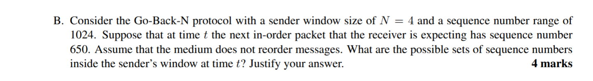

考虑 GBN 协议，窗口大小 $N=4$，序号范围 1024。假设当前接收方期望收到的序号是 650。请问此时发送方窗口内可能的序号集合是什么？

接收方现在确认接收了 `[646  647  648  649]`，但是这些 ACK 返回可能丢失！

最理想：`[650 651 652 653]`（ACK全送达）

最糟糕： `[646  647  648  649]`（ACK全丢失）

`[646,650]`


## [7] 子网划分

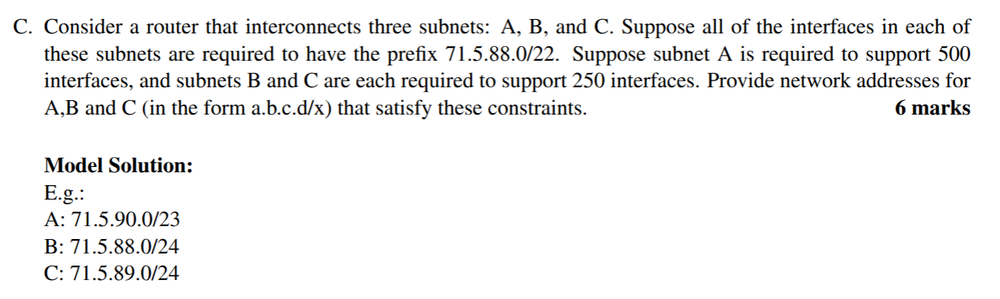

| **子网** | **需求** | **掩码** | **分配地址范围** | **解释**                                     |
| -------- | -------- | -------- | ---------------- | -------------------------------------------- |
| **B**    | 250      | /24      | **71.5.88.0/24** | 占用 71.5.88.0 - 71.5.88.255 (共 256 个地址) |
| **C**    | 250      | /24      | **71.5.89.0/24** | 占用 71.5.89.0 - 71.5.89.255 (共 256 个地址) |
| **A**    | 500      | /23      | **71.5.90.0/23** | 占用 71.5.90.0 - 71.5.91.255 (共 512 个地址) |


## [8] 网络拥堵

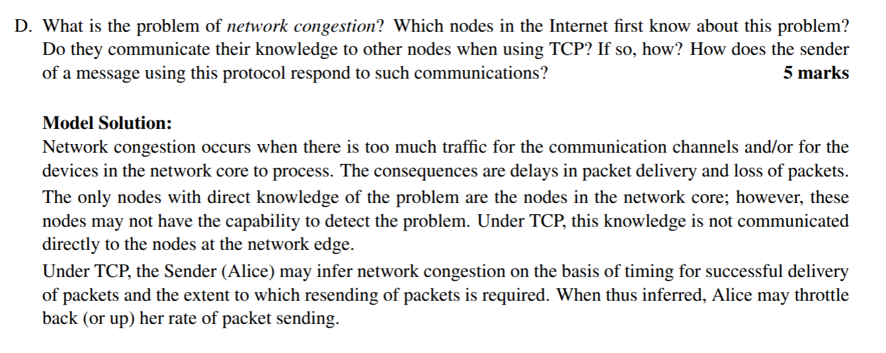

什么是网络拥塞问题？互联网中哪些节点最先知道这个问题？在使用 TCP 协议时，它们会将这些信息告知其他节点吗？如果告知，是如何告知的？使用该协议的消息发送者如何应对此类通信？（5 分）

**定义：** 当通信信道和/或网络核心设备（如路由器）无法处理过多的流量时，就会发生网络拥塞。

**后果：** 导致数据包传输延迟和丢包。

**谁先感知：** **只有网络核心中的节点（如路由器）能直接感知到该问题；**然而，这些节点可能没有检测该能力。在 TCP 协议下，这些信息**不会直接**传递给网络边缘的节点。

**发送者应对：** 在 TCP 协议下，发送者（Alice）会根据数据包成功交付的时间以及需要重传的程度来**推断**网络拥塞。一旦推断出拥塞，Alice 可能会降低（或提高）她发送数据包的速率。

> Network Congestion occure when there are too many data sent to the channels for the devices in the network core to process
>
> The first node directly knowledge of the congestion is the NODE in NETWORK CORE like router or switch
>
> They have NO ability to detect the congestion and they will NOT tell other node.
>
> 
>
> Sender  will infer（推断） the network congestion based on 
>
> - The timing of successfully delivered packet
> - The extend of the resending a packet is required
>
> After inferred Alice may increase/ decrease the rate she sending the packet


## [9] 子网画图k


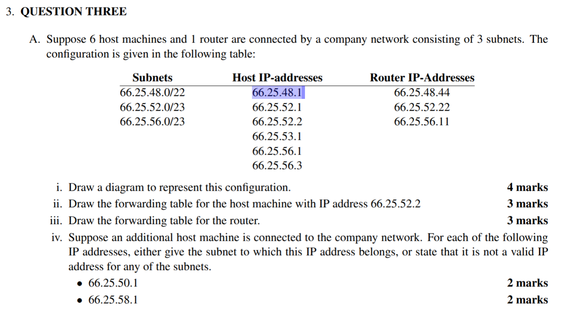

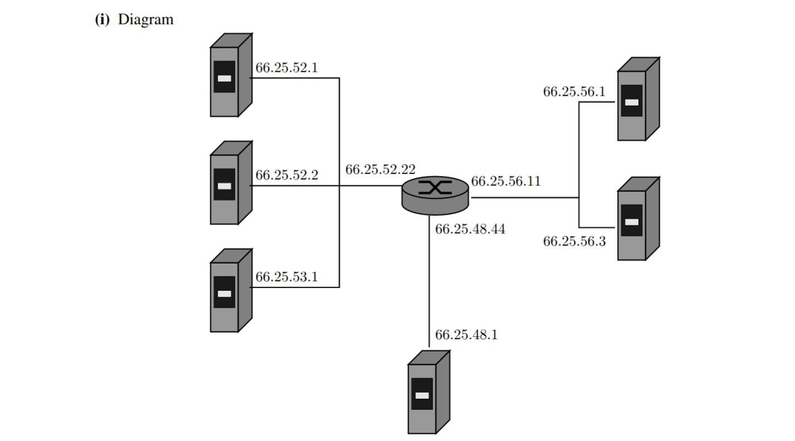

B. 画出 主机 `66.25.52.2` 的 Forwarding Table 主要包含 **Next Router 和 Number of H**ops

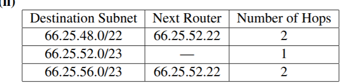


C. 画出路由的 Forwarding Table

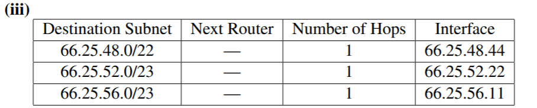

D. 判断是否在子网中

第一个没有超出到公网范围，属于！

> 66.25.50.1 will be connected to 66.25.48.0/22.

但是第二个超出了

> 66.25.58.1 is not in the IP address range of any of the 3 subnets.


## [10] ARP广播MAC步骤

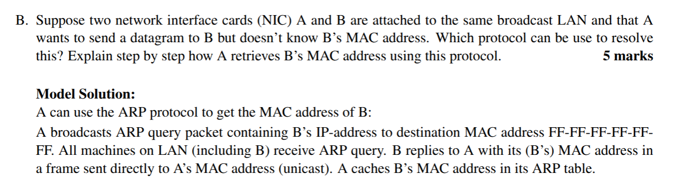

## [11] P2P

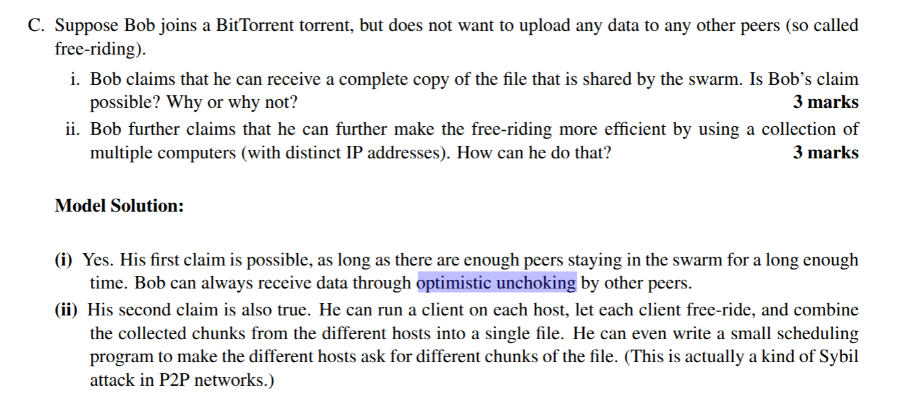


Optimistic Unchocking 就是之前提到的，即便B没有发送A数据，A也会尝试给B发送数据以找到潜在伙伴

> 在 BitTorrent 中，为了维持公平，通常采用“以德报德”（Tit-for-tat）策略。但为了发现新的合作伙伴，协议规定节点必须定期（例如每 30 秒）**随机**选择一个节点进行数据发送，这被称为**“乐观疏通”**。


第二点，也是对的

**提高中奖概率：** 如果网络中有 100 个节点在进行“Optimistic Unchock”，Bob 如果只有一个 IP，被抽中的概率很小；但他如果有 50 个不同的 IP，他被其他节点选为“随机赠送数据对象”的概率会大大增加。

 Bob 编写一个简单的调度程序，让这 50 台电脑分别去请求文件的不同部分（Chunks）。虽然每台电脑都只“骗”到了一点点数据，但 Bob 最后将所有电脑下载到的块汇总起来，就能拼成一个完整的文件。


## [12] 信号传输 香侬定律

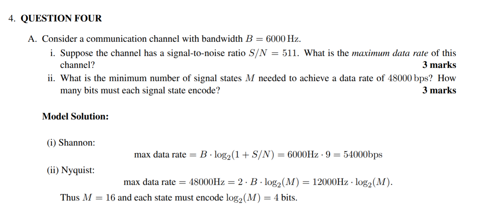

**A. 考虑一个带宽为 $B = 6000\text{ Hz}$ 的通信信道。**

- **i. 假设该信道的信噪比 $S/N = 511$。该信道的最大数据速率（maximum data rate）是多少？** (3分)
- **ii. 若要达到 $48000\text{ bps}$ 的数据速率，所需的最小信号状态数 $M$ 是多少？每个信号状态必须编码多少位（bits）？** (3分)


香农定理 (Shannon's Theorem) —— 考虑噪声的极限

**公式：** $C = B \cdot \log_2(1 + S/N)$ 其中B就是带宽Bandwidth， C 就是最大传输速率（bps）


奈奎斯特定理 (Nyquist Theorem) —— 考虑信号层级的极限

奈奎斯特定理用于计算在无噪声情况下，通过增加信号状态（电平数）可以达到的速率。$R = 2 \cdot B \cdot \log_2(M)$

得出 M = 16 以及 log(M)

$R$：数据速率（$48000\text{ bps}$）

$M$：信号状态数（即有多少种不同的信号波形/电平）

$\log_2(M)$：每个信号状态所携带的比特数


## [13] CRC

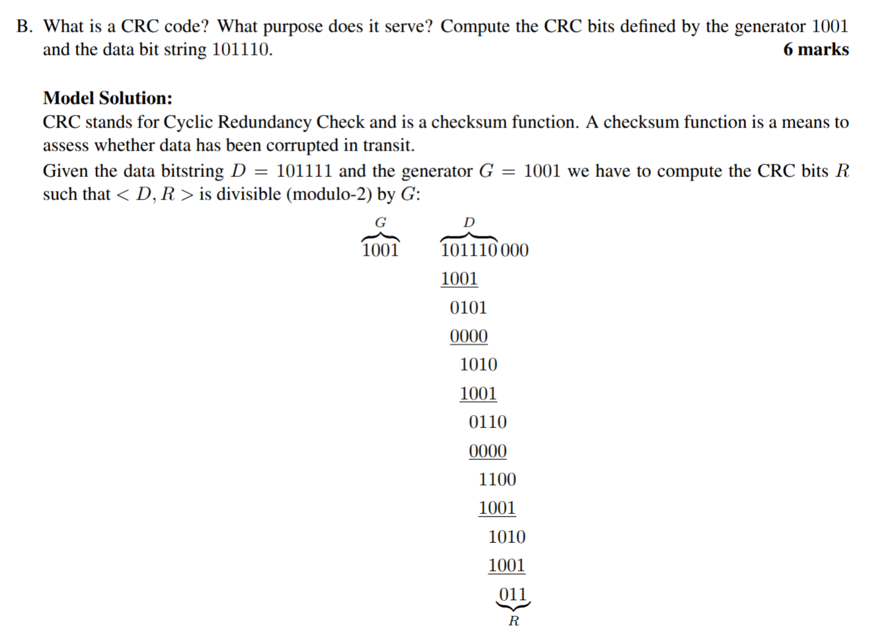


> 这里第二问答案写错了

## [14] C-S


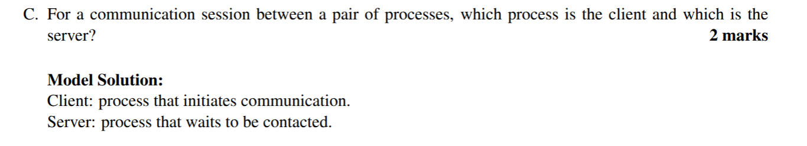


## [15] 持久 HTTP 和 非持久 HTTP

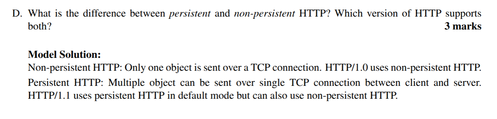

## [16] TDMA FDMA CSMA ALOHA

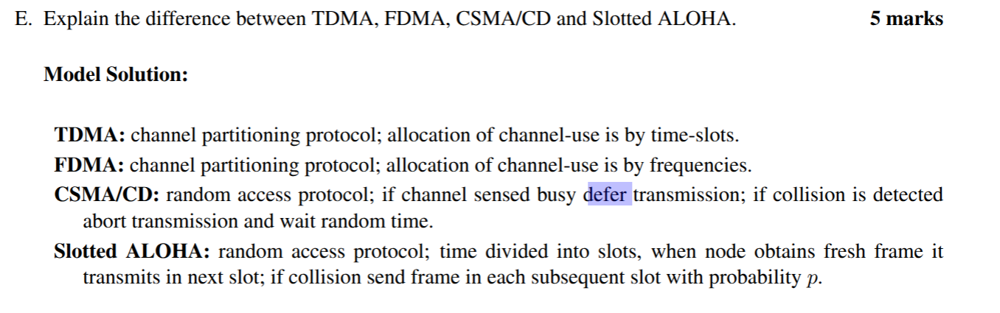


**TDMA (时分多址)**：一种**信道划分协议**；通过**时间片 (time-slots)** 来分配信道的使用权。

**FDMA (频分多址)**：一种**信道划分协议**；通过**频率 (frequencies)** 来分配信道的使用权。

**CSMA/CD (载波监听多路访问/冲突检测)**：一种**随机访问协议**；如果感应到信道忙，则**推迟 (defer)** 传输；如果检测到冲突，则立即中止传输并等待一段随机时间。

> Idle 发送，Busy等
>
> 发送失败则发送 Jam Signal 并等待 $512 \times \{0,1,...,2^n-1\}$

**Slotted ALOHA (分隙 ALOHA)**：一种**随机访问协议**；时间被划分为时隙，当节点获得新帧时，它在下一个时隙传输；如果发生冲突，则在随后的每个时隙中以概率 $p$ 发送该帧。


## [17] Intra和Inter AS 之间政策不同的原因

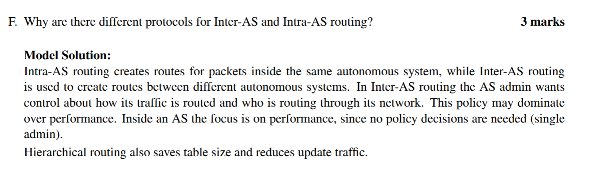


# 2016-2017 EXAM

## [1] 通信

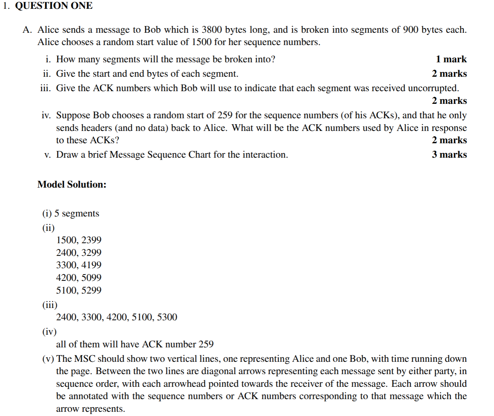


A. 3800 / 900 = 5 segment


## [2] Go Back N

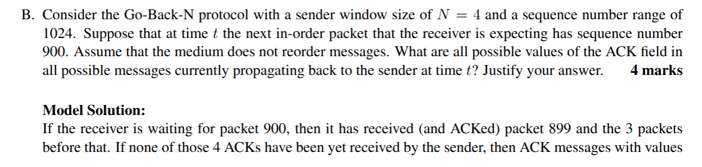

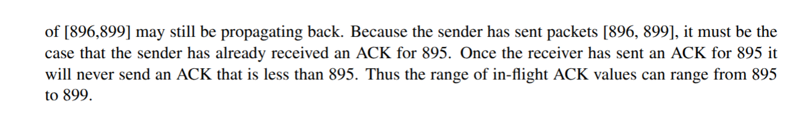

895 [ 896 897 898 899 ] **900**

此时能必然确定的是 896 - 899 发送了ACK，但是接收方可能发了多个 ACK 895，其中接收方接受了895才往后，但是仍然有一些在链路中	


## [3] 子网

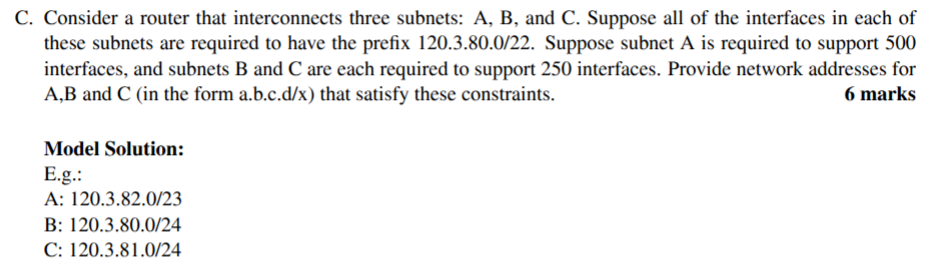


## [4] 协议解析

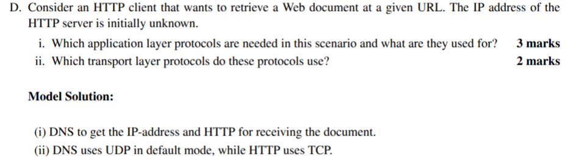


## [5] 子网画图


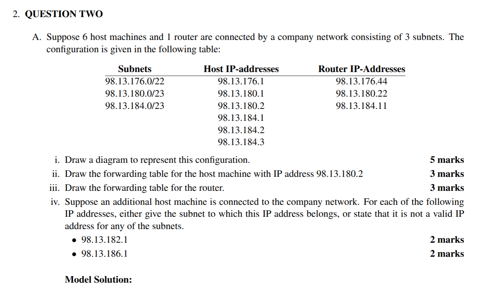

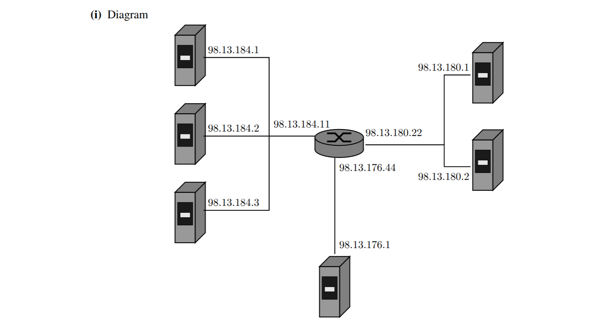

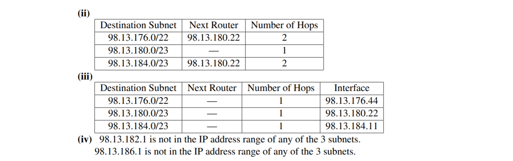


## [6] CRC

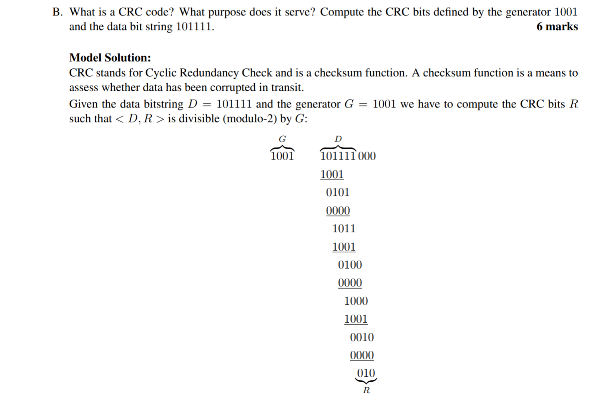


## [7] 应用层定义

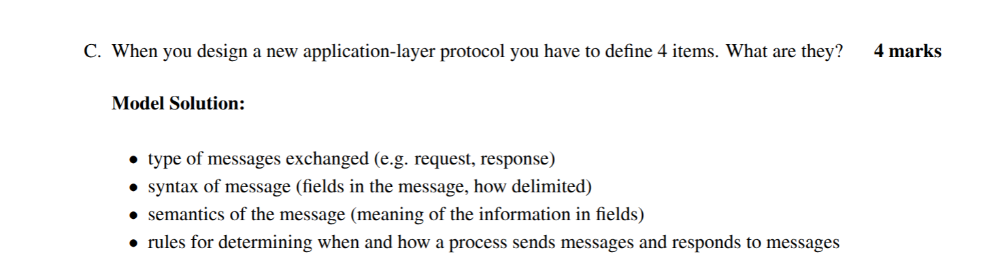

| **要素**             | **解释**                     | **例子**                                                     |
| -------------------- | ---------------------------- | ------------------------------------------------------------ |
| **消息类型 (Type)**  | 定义交换的消息是什么性质。   | 是一个“请求”（Request）还是一个“响应”（Response）？          |
| **语法 (Syntax)**    | 定义消息的结构和格式。       | 消息中有哪些字段？每个字段占多少位？如何区分字段（分隔符）？ |
| **语义 (Semantics)** | 定义字段中信息的具体含义。   | 比如某个字段的值是 "200"，它代表“成功”还是“文件大小”？       |
| **规则 (Rules)**     | 定义发送和响应的时机与方式。 | 进程在什么情况下发送消息？收到消息后必须如何回复？           |


## [8]信号传输 香侬定律

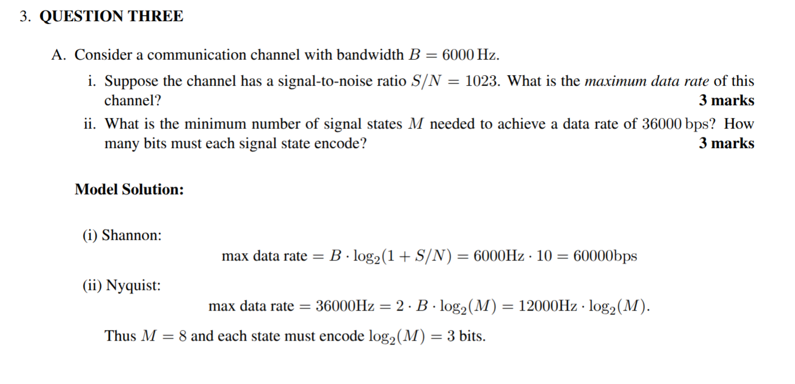

## [9] P2P

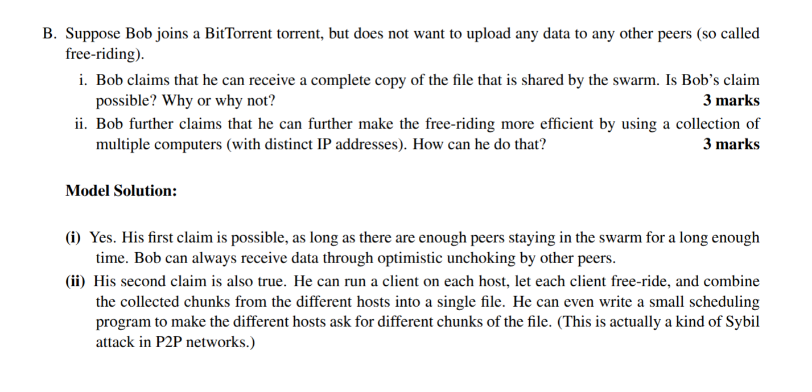


## [10] C-S

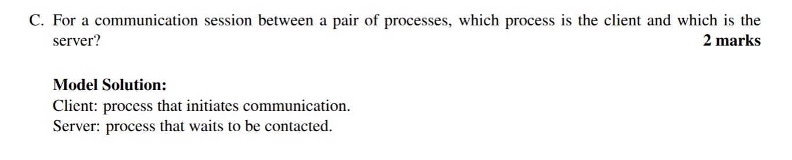

## [11] 持久和非持久HTTP

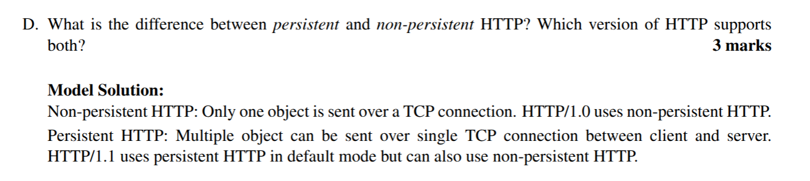


## [12] TDMA FDMA CSMA ALOHA

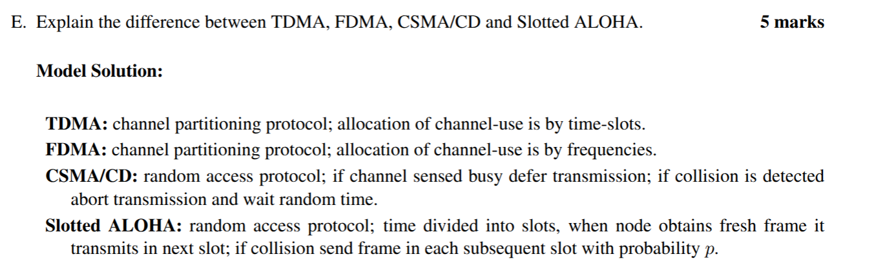


## [13] 多路访问协议的选择

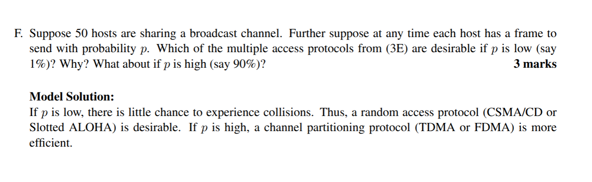

假设有 50 个主机共享一个广播信道。进一步假设在任何时刻，每个主机发送帧的概率为 $p$。

如果 $p$ 很低（例如 $1\%$），(3E) 中哪些多路访问协议是理想的？为什么？

如果 $p$ 很高（例如 $90\%$），情况又如何？

**当 $p$ 较低时：** 发生冲突的可能性很小。因此，**Random Access Protocols**（如 **CSMA/CD** 或 **时隙 ALOHA**）是理想的选择。

**当 $p$ 较高时：** **Channel Partition Protocols**（如 **TDMA** 时分多址或 **FDMA** 频分多址）会更加高效。


## [14] RSA

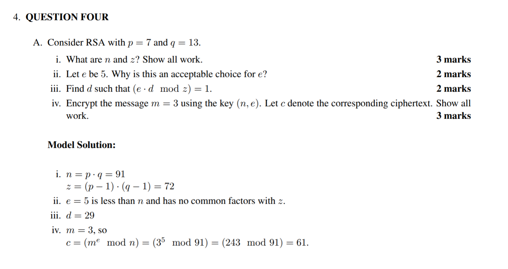

## [15] Monoalphabetic Cipher

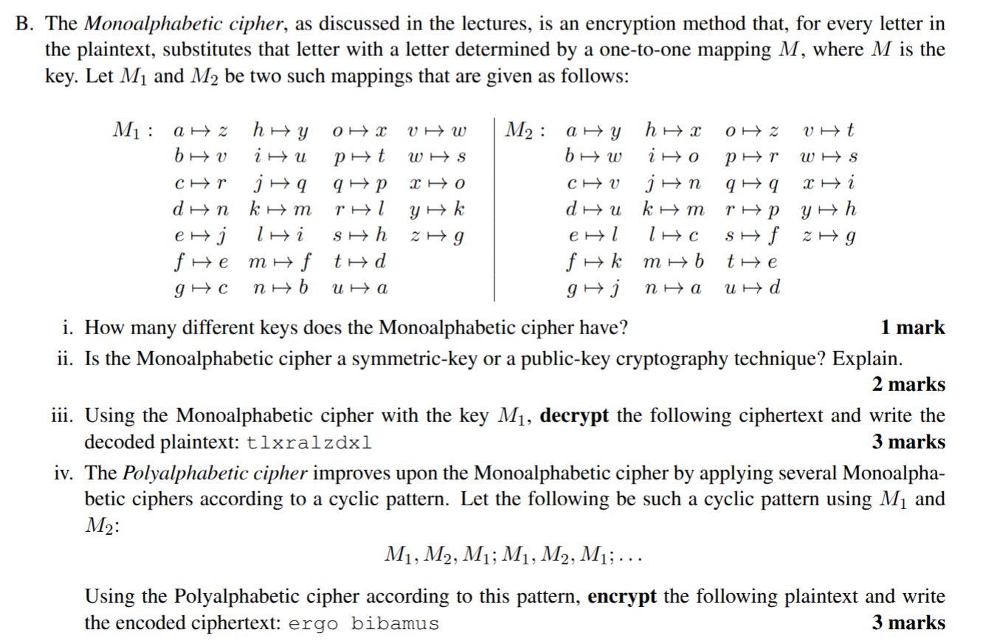


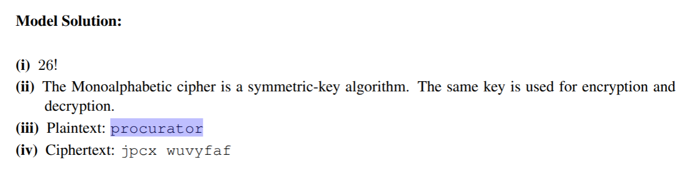

## [16] 为什么DES而非RSA


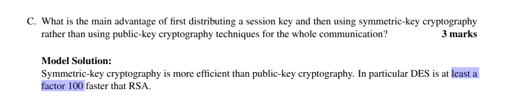


## [17] 关于单表置换密码的破解


如果你**截获（Intercepted）** 了一个信息，使用**单表置换密码 (Monoalphabetic Cipher)** 加密，但是你不知道密钥是什么，有什么颁发可以解密呢？请概述这种攻击是如何实施的。

在课件中，提到了**暴力破解攻击 (Brute-force attack)** ，以及**统计方法（Statistic Method）**

需要注意的是，单表置换密码的**密钥空间非常大**（共有 $26!$ 种可能的密钥），因此纯粹的暴力破解会是一个非常耗时的过程。所以我们可以尝试短单词！


# 2015-2016 EXAM


## [1] BDP

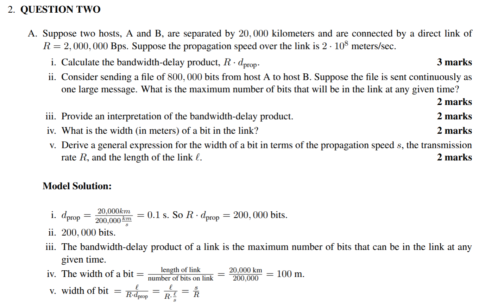

链路中同时存在的最大比特数（Maximum bits on the link）在计算机网络中被称为**带宽时延乘积（Bandwidth-Delay Product, 简称 BDP）**。

1. 计算 $R\cdot d_{\text{prop}}$
2. 求**Maximum bit on the link**（其实就是第一问）
3. 问你这个乘积含义？其实就是Maximum bit on the link
4. 一个比特在链路上的宽度（长度）
5.  推导（Derive）（一个）比特宽度的通用表达式


## [2] 波特率和比特率

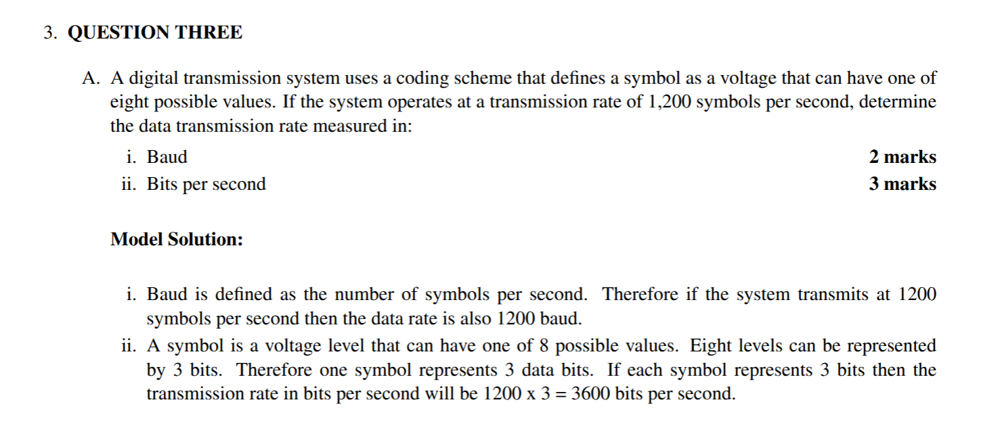

**符号（Symbol）：** 在这个系统中，一个“符号”表现为一个电压值。

**可能的状态数：** 该电压有 **8 种** 可能的取值。

**传输速率：** 系统每秒传输 **1,200 个** 符号。

## [3] 二进制IP

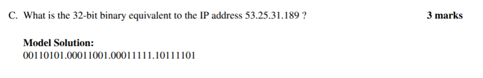


## [4] 信噪比

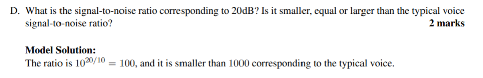
$$
R = 10^{\frac{SDN}{10}}
$$


计算出100远小于**标准1000** 因此虽然不清晰但是能听到，属于小SNR


# MOCK MCQ

## [1] Link Layer 连接设备

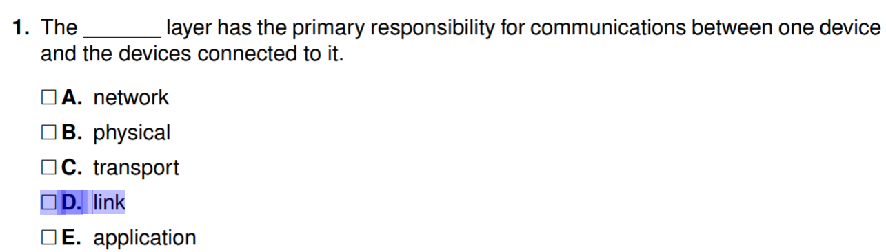

在 OSI（开放系统互连）参考模型或 TCP/IP 模型中，**数据链路层 (Link Layer)** 的主要职责是在**物理相邻**的设备（即直接连接的设备）之间实现可靠的数据传输。

## [2] Router 连接Network

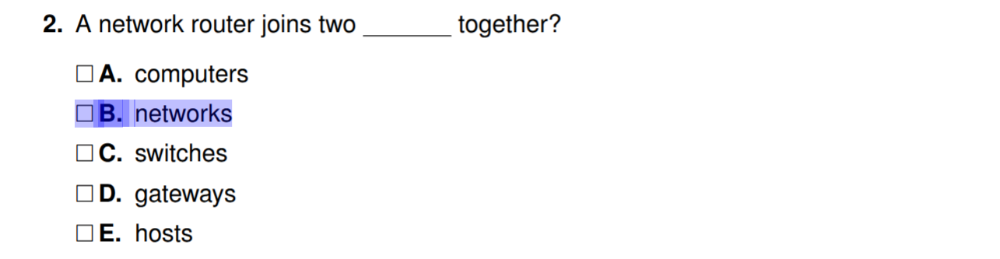


## [3] IPv4长32 IPv6 长 128 bits

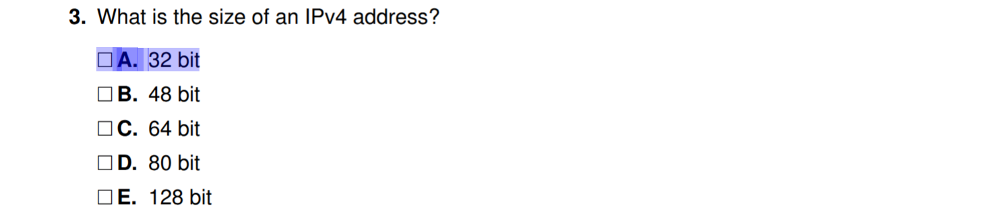


## [4] DEST PORT 在 Transport Layer添加

**传输层 (Transport Layer)** 的主要职责是实现**进程到进程 (Process-to-Process)** 的通信。

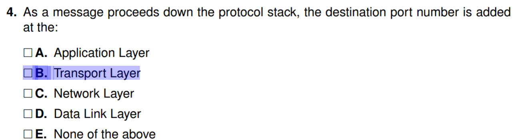


## [5] SMPT 端口号 25

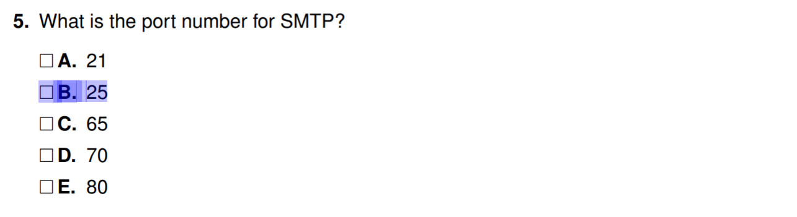


| **端口号** | **协议名称** | **用途说明**                                                 |
| ---------- | ------------ | ------------------------------------------------------------ |
| **A. 21**  | **FTP**      | 文件传输协议（控制连接），用于在客户端和服务器之间传输文件。 |
| **E. 80**  | **HTTP**     | 超文本传输协议，用于非加密的网页浏览。                       |


## [6] 域名 DNS 系统

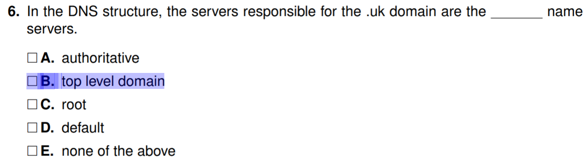


## [7] UDP


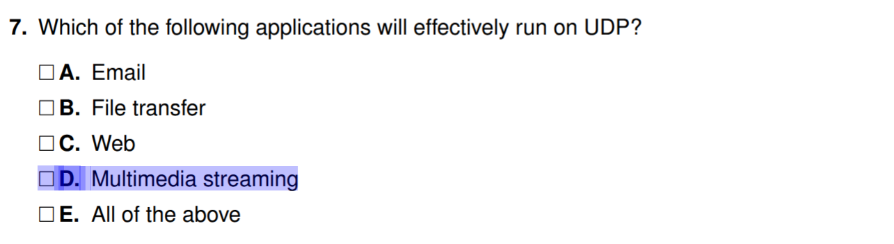


**DP (User Datagram Protocol)** 是一种“无连接”且“不可靠”的传输层协议。与 TCP 不同，UDP 不提供数据重传、流量控制或拥塞控制。它的优势在于**速度快、开销小、实时性强**。

> DNS也是UDP
>

## [8] 持久/非持久 HTTP


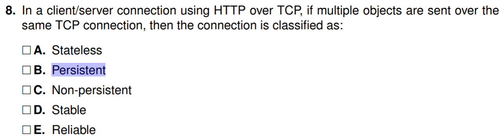


## [9] Go Back N

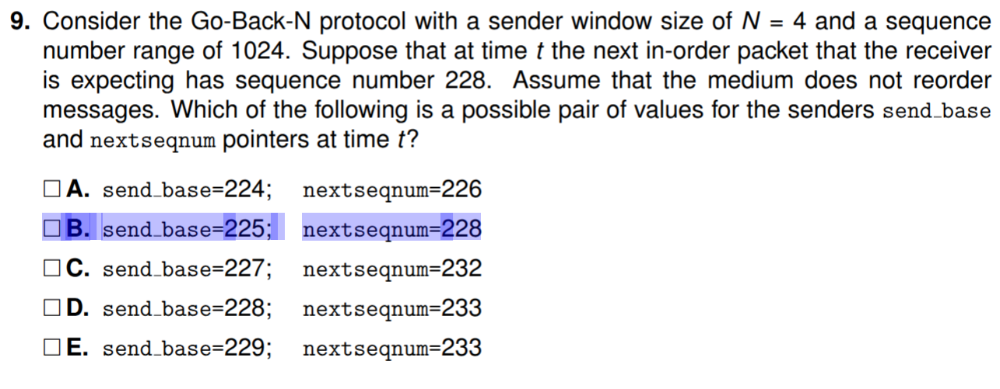

**$N = 4$**：发送窗口大小，即发送方最多只能有 4 个已发送但未确认（unacknowledged）的数据包。

**`send_base`**：发送窗口的起始位置，即当前最早的、尚未收到确认的数据包序列号。

**`nextseqnum`**：发送方下一个准备发送的数据包序列号。

**接收方期待的序列号 ($expected\_seqnum = 228$)**：这意味着接收方已经成功接收并确认了 $227$ 及之前的所有包。


既然接收方正在期待 $228$，说明接收方**已经收到了**直到 $227$ 为止的所有包：因此，发送方下一个要发送的包（`nextseqnum`）必须 **$\ge 228$**

根据 $N=4$ 的限制，发送方窗口内最多只能有 4 个包。即：$nextseqnum - send\_base \le N=4$。

| **选项** | **send_base** | **nextseqnum** | **检查 1: nextseqnum≥228**                 | **检查 2: nextseqnum−send_base≤4** | **结论**                               |
| -------- | ------------- | -------------- | ------------------------------------------ | ---------------------------------- | -------------------------------------- |
| **A**    | 224           | 226            | ❌ (发送方还没发 227，接收方不可能期待 228) | ✅                                  | 不可能                                 |
| **B**    | **225**       | **228**        | ✅ (正好发完 227)                           | ✅ ($228-225=3 \le 4$)              | **可能**                               |
| **C**    | 227           | 232            | ✅                                          | ❌ ($232-227=5 > 4$，超过窗口大小)  | 不可能                                 |
| **D**    | 228           | 233            | ✅                                          | ❌ ($233-228=5 > 4$，超过窗口大小)  | 不可能                                 |
| **E**    | 229           | 233            | ✅                                          | ✅                                  | ❌ (`send_base` 不可能超过接收方期待值) |


## [10] TCP 重传和拥塞控制有关

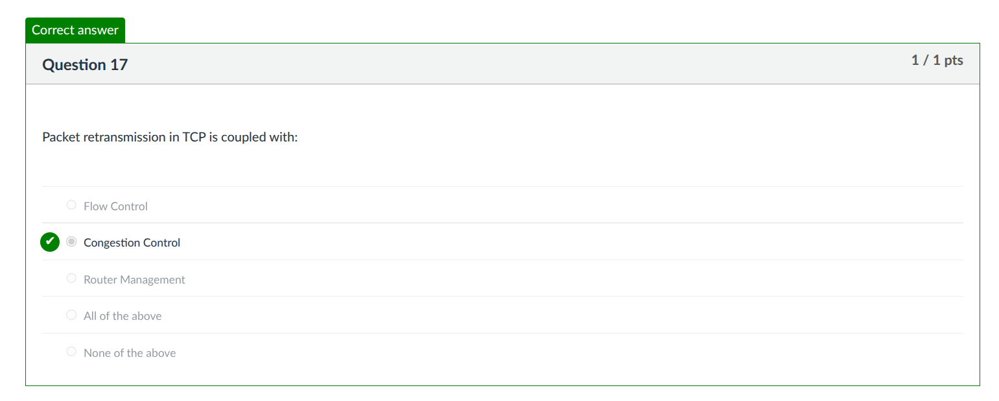


## [11] 1's Complement Sum 

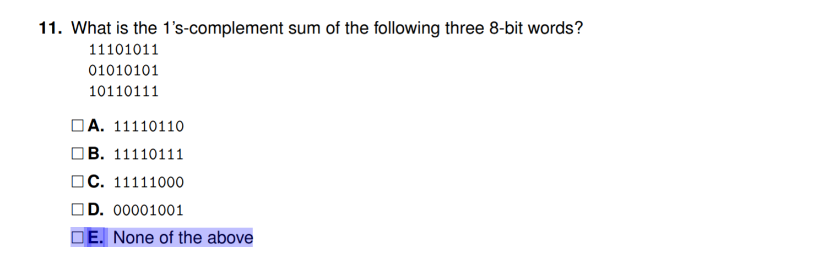

算出来是C，不需要取反，因为这是SUM不是算CHECKSUM


## [12] 子网

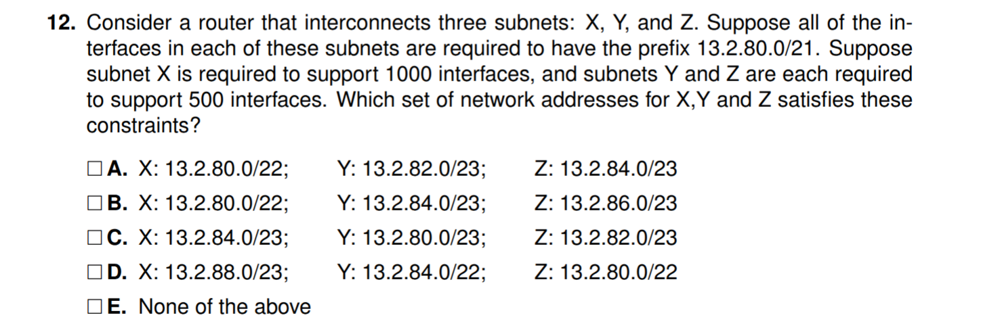 


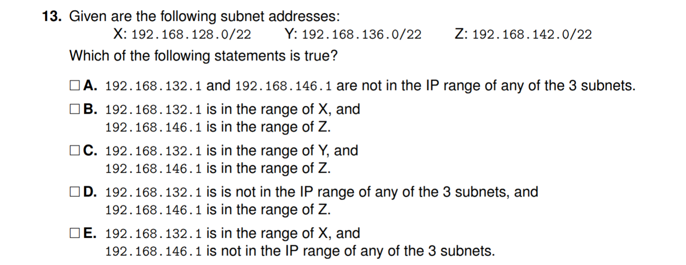


## [13] 丢包、延迟

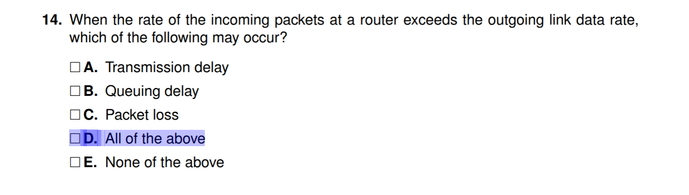

> 缓冲区排队会导致延迟、排队、重传
> 导致重传主要是因为拥塞发生


## [15] 以太网协议

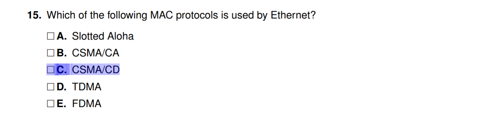


## [16] CRC

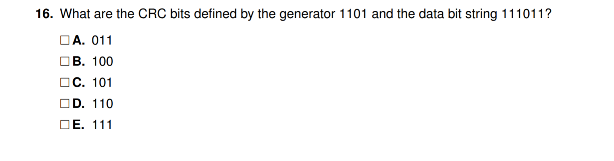


## [17] MAC 协议2

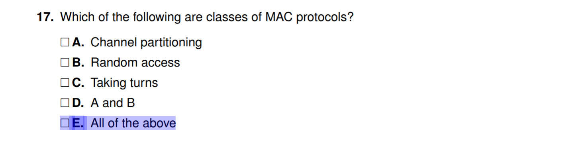


## [18] 现代混合加密

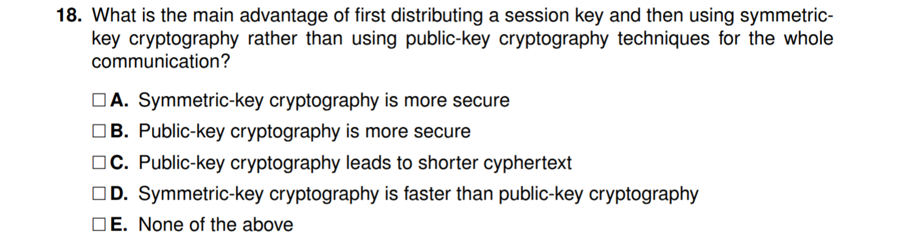


> D
>


## [19] RSA

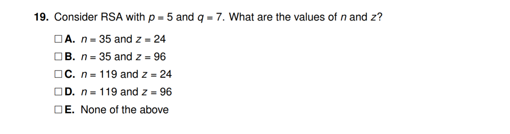


> A
>

## [20] 对称加密AES

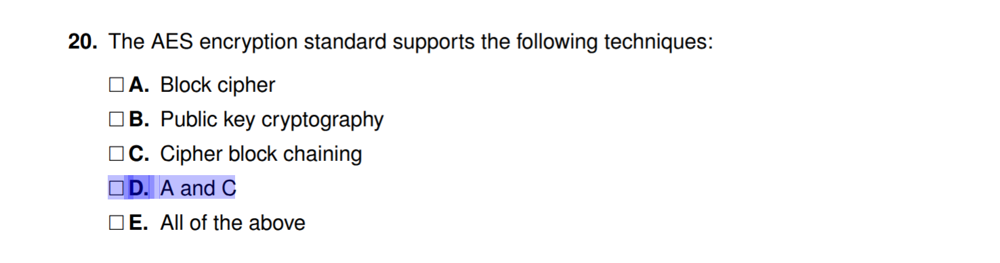

**A. Block cipher (分组密码)**：AES 的本质就是分组密码，它将明文切分为固定长度的块（128位）进行处理。

**C. Cipher block chaining (CBC，密码块链接)**：这是 AES 常用的**工作模式**之一。为了加密长于 128 位的数据，需要通过 CBC 等模式将各个块串联起来，增加安全性（防止相同的明文块产生相同的密文块）。

> 此外还需要实现对称加密（自身）
>

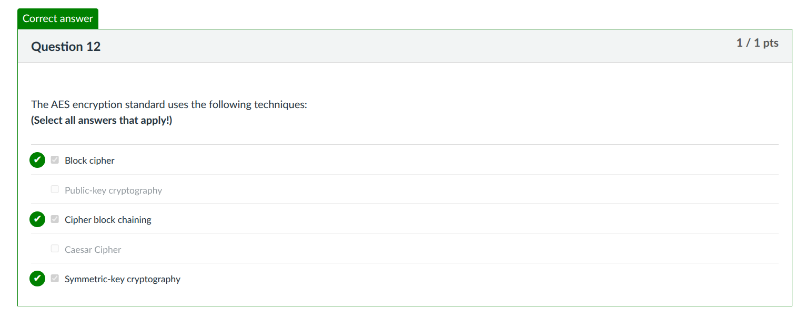


