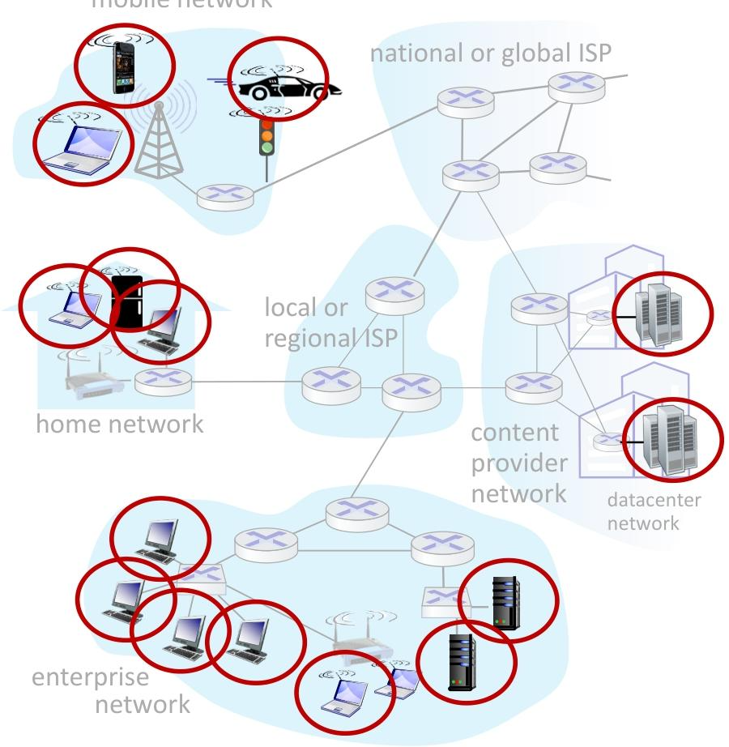

# COMP211-202526 Computer Network

---

[TOC]

---

# 课程介绍

## [1] 分数组成

| 项目            | 占比 | 说明                  |
| --------------- | ---- | --------------------- |
| A1 JAVA Project | 10%  | DDL 17 October, 17:00 |
| A2 JAVA Project | 10%  | DDL 31 October, 17:00 |
| Exam            | 80%  | 2小时50个选择题       |

## [2] 教学大纲

| **Weeks 周次** | **Topics 主题**            | **Textbook Chapters 教科书章节** |
| -------------- | -------------------------- | -------------------------------- |
| 1              | Introduction 简介          | KR1, T1                          |
| 1.5            | Application Layer 应用层   | KR2, T7                          |
| 2              | Transport Layer 传输层     | KR3, T6                          |
| 1.5            | Network Layer 网络层       | KR4, KR5, T5                     |
| 1.5            | Link Layer 链路层          | KR6, KR7, T2.1, T3.2             |
| 1.5            | Internet Security 网络安全 | KR8, T8                          |

课程侧重探讨：互联网的架构（architecture）和协议（protocols）为主要工具来研究**计网的基本概念**。

学习成果：

1. 描述+论证（Describe  + Justify）OSI参考模型、计网**关键协议**
2. 网络编程
3. 加密技术

# Introduction

## [1] 互联网构成

### [1.1] 组件视角

互联网的组件视角由以下四方面组成：

1. 终端系统（主机）：互联网数据的**发送端和接收端，是边缘设备/网络边缘（Network Edge）。**

   > 终端系统：End System
   >
   > 主机：hosts

2. 分组交换机（Packet switches）：路由器（routers）+交换机（switches）组成。负责转发数据块。

3. 通信线路：例如铜线光纤等。

4. 网络：由相互连接的互联网服务提供商（ISP）构成。

   > Internet Server Provider

### [1.2] 协议视角

**协议的定义：**协议定义了网络中设备间通信的规则，定义了：

1. 消息的格式
2. 发送与接收顺序
3. 消息传输或接收时应采取的操作

**计网协议的作用：**贯穿互联网，控制消息的发送与接收，常见协议有 **HTTP**（网页）、**TCP**、**IP**、**WiFi**、**4/5G**、**以太网**等。

**协议标准体系：**由互联网工程任务组制定，以 “请求评论”（RFC）文档形式发布，确保互联网技术规范统一。

> 互联网工程任务组 Internet Engineering Task Force IETF。
>
> RFC - Request For Comment

## [2] 互联网结构

### [2.1] 网络边缘

网络边缘（Network Edge）、网络设备、终端（Network End）、主机（Hosts）可以理解为一个意思。网络边缘有：客户端（各种设备）、服务器。

网络边缘的特点就是：他们**不是**主要**转发网络的中转站**。

### [2.2] 接入网

接入网（Access Network）

---

**第一种接入网形式是：电缆（Cable）接入**

- **Cable Headend（电缆前端）**：互联网连接核心枢纽。负责接收数据，收集用户发送的数据。（同时还承担着电视信号的处理、调制等工作）

- **Cable Modem（电缆调制解调器）**：它的作用是将用户设备（如电脑、电视等）产生的**数字信号转换为**适合在**电缆中传输的模拟信号** 或反之。

- **Cable Splitter（电缆分路器）**：用于将一根电缆的信号分配到多个用户端，这样多个用户可以共享同一段电缆线路，同时不影响各自信号的传输。

  > Cable Splitter 下行（从headend到end）中是直接分配即可，可同时共享。
  >
  > Cable Splitter 上行（从end到headend）中是使用**频分复用（FDM）**技术（如图，分为9个Channel，每个Channel互不影响）：不同信号在不同频段传输。对于这个FDM技术，请查看 **[频分复用](#3_2_2_what_is_fdm_and_tdm)**

上面这张图是**混合光纤同轴（Hybrid Fiber Coax，HFC）网络**（也是基于电缆接入网络），它是有线电视网络（CATV）用于提供互联网接入等宽带服务的典型架构。

HFC网有非对称性：下行速率 40 Mbps - 1.2 Gbps，上行速率 30 - 100 Mbps

更详细一步、CMTS同时处理电视信号和ISP（网络服务提供商）的信号，整合到一起。

> CMTS（Cable Modem Termination System，电缆调制解调器终端系统）：
>
> 整合如下信号：
>
> - 电视信号频率：50 - 550MHz
> - ISP信号频率：550-750MHz

此处有光纤和电缆的转换。

---

**第二种接入网形式是：数字用户线路（DSL - Digital Subscriber Line）接入**

DSL 是一种利用现有**电话线路**向用户提供宽带互联网接入和传统语音通信的技术。

**用户端设备**：

- **DSL Modem（DSL 调制解调器）**：数字信号、语音信号 互转。
- **Splitter（分路器）**：用于分离电话线路中的语音信号和数据信号，使语音通话和宽带上网可以同时进行且互不干扰。

**中心局设备**：

- **Central Office（中心局）**：电话公司的核心节点，集中了 DSLAM 等设备，是电话线路和网络的交汇点。
- **DSLAM（DSL Access Multiplexer，DSL 接入复用器）**：**位于电话公司的中心局**，负责汇聚多个用户的 DSL 连接，将用户的数据信号转发到互联网服务提供商（ISP）的网络，同时将语音信号转发到电话网络。

---

**第三种接入网形式是：家庭网（Home Networks）接入**

家庭网这里有**无线网（Wireless Access Network）接入**，分为两种

1. 无线局域网（WiFi）

   > Wireless local area networks

2. 广域蜂窝接入网络（流量）

   > Wide-area cellular access networks
   >
   > 4G: 150/300 Mbps (15km)
   >
   > 5G: 10Gbps (300m)

---

**第四种接入网形式是：企业网（Enterprise Network）接入**

企业网内部有很多交换机、无线网，但是输出一般都是经过汇总的。

---

**第五种接入网形式是：数据中心网（Data Center Network）接入**

把各服务器链接，通常10s - 100s （数十到数百）Gbps。

### [2.3] 物理介质

> Link 链路， 也就是传输数据线 

- 主机（Hosts）接收应用程序消息
- 将其拆分为更小的块，即长度为 $L$ 位的**数据包（Packets）**
- 以传输速率（Transmission Rate） $R$ 将数据包传输到接入网络
  - 链路传输速率（Transmission Rate），也称为**链路容量（Link Capacity）**，或称**链路带宽（Link Bandwidth）**

$$
数据包传输延迟 = 将 L 位的数据包传输到链路所需的时间 = \dfrac{L(位)}{R(位 / 秒)}
$$

- bit是数据传输的基本单位。
- 物理链路（physical link）：指发射机和接收机之间的物理连接部分，是数据传输的物理通道。

- **导引型介质（guided media）**：信号在固体介质中传播，常见的固体介质有**铜缆（如双绞线）**、**光纤**、**同轴电缆**等。这些介质能 “引导” 信号在固定的路径内传输。
- **非导引型介质（unguided media）**：信号可以自由传播，例如无线电（像 WiFi、手机通信使用的无线电波等），不需要固体介质来引导信号，信号在空间中传播。

**引导型介质例子：**

---

> **引导型介质：双绞线 Twisted pair (TP)**
>
> 
>
> 5类线：100Mbps和1Gbps**以太网（Ethernet）**
> 6类线：能支持 10 Gbps 的以太网传输
>
> ---
>
> **引导型介质：同轴电缆 Coaxial cable**
>
> 
>
> **结构**：由两根同心的铜质导体组成（内层铜芯传输信号，外层铜质屏蔽层起到抗干扰等作用）。
>
> **传输特性**：
>
> - **双向性（bidirectional）**：能同时进行双向的数据传输，即可以同时发送和接收数据。
> - **宽带特性（broadband）**：
>   - 电缆上可存在多个频率通道（multiple frequency channels on cable），不同的频率通道可用于传输不同的信号或数据。
>   - 每个通道能支持每秒数百兆比特（100’s Mbps per channel）的传输速率。
>
> ---
>
> **引导型介质：光纤（Fiber optic cable）**
>
> 
>
> - **传输原理**：通过玻璃纤维传输光脉冲，每个光脉冲代表一个比特（bit）。
> - **优势特点**：
>   - **高速运行（high - speed operation）**：
>     - 支持高速的点对点传输（high - speed point - to - point transmission），传输速率可达数十吉比特每秒到数百吉比特每秒（10’s - 100’s Gbps）。
>   - **低错误率（low error rate）**：
>     - 中继器（repeaters，用于放大或再生信号以延长传输距离）的间隔可以很大（repeaters spaced far apart）。
>     - 不受电磁噪声（electromagnetic noise）的影响，因为是通过光信号传输，而非电信号，所以电磁干扰对其传输质量影响极小。

---

**非引导型介质例子：**

---

**无线射频（Wireless radio）**

- **信号传输**：信号在**电磁波谱（Electromagnetic Spectrum）**的不同 “**频段（Bands）**” 中传输（Carried），利用无线电波（Ratio waves）来传递数据。
- **无物理线路**：不需要像网线、光纤那样的物理 “导线（wire）”，通过空气等空间介质传输信号。
- **传输方式**：采用 **广播、半双工（broadcast, “half - duplex”） 模式**，即信号从发送方到接收方单向广播，同一时间通常只能进行 “发送” 或 “接收” 操作（不能同时双向传输）。
- **传播环境影响**：无线信号的传输会受到多种环境因素影响：
  - **反射（reflection）**：信号遇到物体（如建筑物、山脉）会反射，可能导致信号叠加或失真。
  - **物体遮挡（obstruction by objects）**：树木、墙壁等物体遮挡会削弱信号强度。
  - **干扰 / 噪声（Interference/noise）**：其他无线信号或电磁噪声会干扰传输，影响信号质量。

**无线射频链路类型（Radio link types）**

- **无线局域网（Wireless LAN, WiFi）**：
  - 传输速率：10 - 数百 Mbps（10 - 100’s Mbps）。
  - 覆盖范围：数十米（10’s of meters），适用于家庭、办公室等小范围无线组网。
- **广域无线（wide - area，如 4G/5G 蜂窝网络）**：
  - 以 4G 为例，传输速率约数十 Mbps（10’s Mbps），覆盖范围可达约 10 公里，用于大范围的移动网络接入。
- **蓝牙（Bluetooth）**：
  - 定位：“线缆替代方案（cable replacement）”，用于短距离设备间的无线连接（如耳机与手机、键盘与电脑）。
  - 特点：短距离（short distances）、传输速率有限（limited rates）。
- **地面微波（terrestrial microwave）**：
  - 传输方式：**点对点（point - to - point）**，常用于固定地点间的高速数据传输。
  - 单通道速率：45 Mbps 的通道（45 Mbps channels）。
- **卫星（satellite）**：
  - 以星链（Starlink）为例，下行速率可达不到 100 Mbps。
  - 延迟：地球同步卫星的端到端延迟约 270 毫秒（270 msec end - end delay (geostationary)），信号往返卫星的距离远，导致延迟较高。

## [3] 网络核心

Network Core

### [3.1] 网络结构的核心

**网络核心的结构**：

- 是**相互连接的路由器组成的网状结构**。

- 从示意图能看到，不同类型的网络（家庭网络、企业网络、移动网络等）通过各级 ISP（本地 / 区域 ISP、全国 / 全球 ISP）的路由器网络相互连通。

  

> mesh - 网状结构
>
> interconnected  - 相互连接的
>
> routers - 路由器

- **分组交换（packet - switching）**：
  - 主机（hosts）会把应用层的消息拆分成**分组（packets）**。
  - 网络通过 “逐跳转发” 的方式，将分组从一个路由器传递到下一个路由器，沿着从源地址到目的地址的路径传输。

### [3.2] 网络核心的两大关键功能

网络核心有两个核心操作：**转发（Forwarding）**和 **路由（Routing）**，二者协同实现数据的高效传输。

#### [3.2.1] 转发/交换

> Forwarding/Switching

- 性质：**本地操作（local action）**，即每个路由器独立完成的动作。
- 功能：根据路由器的**本地转发表（local forwarding table）**，将到达路由器输入链路的分组，移动到合适的输出链路。
- 示例：图中显示，当带有目的地址的分组到达路由器时，路由器查看转发表（根据分组头部的 “header value” 匹配 “output link”），把分组转发到对应的输出链路。

##### 分组的交换

**分组转发/交换 （Packet-switching）** 一共两步骤

---

**步骤一、储存转发（Store-and-forward）**

这里的Packet是分组的意思。

分组传输延迟公式：
$$
\text{Packet Transmission Delay}=\dfrac{L}{R}
$$
其中 $L$ 是：每个分组 $L$ 比特。

端源（Source，也就是发送者）速率是 $R$ 比特$/sec$ 

目的端（Destination，也就是接收方）速率也是 $R$ 比特$/sec$ 

---

**步骤二、排队（Queueing）**

储存后，我们需要转发，把这些转发的东西看作工作（Work）。当工作的到达速度 $>$ 处理速度的时候，就会在路由器那里发生排队。

丢包：如果排队队伍过长，路由器缓冲区满了（Buffer），那么后面新来的排队的就会发生**丢包**。

**[延迟和丢包](#4_how_delay_occure)**

##### 电路的交换

电路交换的关键在于为通信的两端（源和目的）在整个通信过程中，**预先分配并独占端到端的资源**。就像打电话时，从你拨号开始，到通话结束挂断，这条通话的 “电路” 资源（包括沿途的链路、交换机的处理资源等）是专门为你和对方预留的，**不会被其他通信占用**。

从源设备（图中上方的计算机）到目的设备（图中下方的计算机）的 “呼叫”（可以理解为一次通信连接，比如传统的电话呼叫），会被分配并预留端到端的资源。这里的 “端到端（End-to-End）” 意味着**从源到目的的整个通信路径上的资源都被预留**。例如上图$\color{red}\bold{\text{红色线}}$。

此外，一个很明显的问题就是：电缆就这么多，但是数据越来越多，怎么才能让一根电缆利用率达到极致呢？

因此引入了**频分复用（FDM）**和**时分复用（TDM）**技术！

#### [3.2.2] FDM 和 TDM

---

**FDM - Frequency Division Multiplexing 频分复用** ：

1. 光、电磁频率被划分为（窄）频段
2. 每个呼叫分配有**自己的频段**，能够以该窄带的最大速率进行传输

---

**TDM - Time Division Multiplexing 时分复用：** 

时间被划分为多个时隙，每个呼叫被分配到周期性的时隙，只能在其时隙内以（更宽的）频段的最大速率进行传输

---

**FDM和TDM对比**

| 对比维度         | FDM                                                          | TDM                                                          |
| ---------------- | ------------------------------------------------------------ | ------------------------------------------------------------ |
| **信号类型**     | 主要传输**模拟信号**，需通过调制技术将信号映射到对应频段     | 主要传输**数字信号**，依赖时间片分割与排序实现复用           |
| **资源分配核心** | 以“**频段**”为单位分配资源，每个用户长期占用固定频段         | 以“**时间片**”为单位分配资源，每个用户周期性占用固定时间片   |
| **关键技术要求** | 需大量滤波器（分离不同频段）、调制解调器，**且需预留“保护带宽”（防止频段间干扰）** | 需高精度**时钟同步**（确保时间片分配与接收准确），需缓存器暂存不同时间片的数据 |
| **资源浪费情况** | **保护带宽会占用部分信道资源，导致频谱利用率降低；**若用户无数据，其频段仍空闲 | 无数据传输的用户，其专属时间片会直接空闲                     |
| **抗干扰能力**   | 抗干扰能力较弱，易受频段重叠、信道非线性失真影响             | 抗干扰能力较强，仅需保证时钟同步，信号在时域分离不易相互干扰 |
| **典型应用场景** | **传统广播/电视、有线电视网络**、早期模拟电话系统、卫星通信的多频段传输 | **数字电话系统（如E1/T1线路）、计算机网络骨干链路**、IP电话实时语音传输、工业数据采集 |
| **设备复杂度**   | 设备复杂（需处理多频段滤波与调制），成本较高                 | 设备相对简单（核心是时钟同步与时间片调度），但对同步精度要求极高 |

#### [3.2.3] 分组交换和电路交换例题

> [!CAUTION]
>
> ### ==重要提醒：数量级区分==
>
> 计算机存储（硬盘、内存）中，$\text{KB、MB、GB、TB}$ 数量级是$2^{10}=1024$
>
> 通信带宽（链路、网络速率）中，数量级是 $10^3=1000$，因此 $\text{1 Gbps = 1000 Mbps}$

假设：

我们有 $\text{1 Gbps}$ 的链路（Link），每个用户 $\text{100 Mb/s}$ 的峰值（例如他们在下载电影），但是一天中只有$10\%$的时间在下电影。

问：在分组交换、电路交换两种情况下，这个网络能供给多少个用户使用呢？

答：

1. 对于电路交换而言，是固定的，只能10个用户，因为
   $$
   n=\dfrac{1Gbps}{100Mbps}=\dfrac{1\times10^{3}Mbps}{100Mbps}=10
   $$
   电路交换相当于是专属VIP，用、不用都是占有一条唯一的专属线路

2. 对于分组交换而言，知道答案还需要一个前置限定条件：降网的概率不大于0.0004。可以算出来35个人某时间刻同时在线人数超过10人的概率不大于0.0004（独立实验，通过二项分布计算）。所以共享的网络可以更高并发！

#### [3.2.4] 分组和电路两种交换模式对比

分组交换好处：

1. 适合突发性的数据（例如普通网民，时而上网，时而离线）
2. 有利于资源共享并且更简单，无需呼叫建立

分组交换坏处：

1. 路由超出缓冲区会导致丢包，延迟产生等...（因此考虑结合电路交换的技术）

#### [3.2.4] 路由 Routing 

- 性质：**全局操作（global action）**，需要考虑整个网络的拓扑结构。
- 功能：确定分组从源地址到目的地址所走的路径。
- 实现：通过**路由算法（Routing Algorithms）**来计算最优路径，并将路径信息更新到各个路由器的本地转发表中，为转发操作提供依据。

### [3.3] 互联网结构

主机必需接入**互联网服务提供商（ISP）**才能实现任意两台主机（Hosts）能相互发送分组。

如果任意主机点对点，那么将会是非常复杂的电路链接，因此，为了简化电路，必须使用ISP。

最终网络结构：

核心组成部分

- **Tier 1 ISP（第一层商业互联网服务提供商）**：处于互联网核心位置，是连接性很好的大型网络，具有全国乃至国际范围的覆盖能力，例如 Level 3、Sprint、AT&T、NTT 等。它们在互联网的核心通信中起到关键的枢纽作用，为其他网络提供广泛的连接服务。

  例如：中国移动、联通、电信

- **IXP（互联网交换点 Internet eXchange Point）**：是不同网络（如 Tier 1 ISP、Regional ISP 等）相互连接、交换流量的关键节点。通过 IXP，不同的网络可以高效地传递数据，避免了数据绕远路，提升了网络通信的效率。

- **Regional ISP（区域互联网服务提供商）**：服务于特定的区域范围，连接着众多的接入 ISP，起到区域内网络汇聚和与核心网络（Tier 1 ISP 等）连接的作用。

- **Access ISP（接入互联网服务提供商）**：直接为终端用户（如家庭、小型企业等）提供互联网接入服务，是用户连接到互联网的 “最后一公里” 环节。

## [4] 数据包延迟和丢失

延迟的产生：数据包到达路由器的速率 $>$ 传输链路容量，正在等待，就产生延迟。

丢包的产生：因为延迟的数据包占用路由器内存，路由器缓存溢出则导致丢包。 当丢包产生后，丢失的数据包可以由前一个节点、端源系统重新传，或者根本不重传。

 

**分组交换**延迟的产生更详细分为2种：

一、路由器的问题（排队）

二、节点处理（Nodal Processing）：**检查数据比特错误+确定传输链路**的时间，通常是小于微秒级别的。

### [4.1] 分组交换产生的延迟

综上，分组交换的延迟可以体现为四种：
$$
delay = 处理延迟+排队延迟+传输延迟+传播延迟
$$

---

**处理延迟：**指路由器检查分组头部、判断输出链路等操作的时间

---

**排队延迟：**指分组在输出链路的缓冲区中等待传输的时间

---

**传输延迟（Transmission Delay）：**

- 定义：将分组 “推” 到通信链路上所需的时间。

  
  $$
  d_{trans}=\dfrac LR
  $$

- 其中 $L$ 是**分组长度**，$R$ 是传输**速率**。

- 这个传输速率是路由器的**性质**（硬件这些）决定的。

---

**传播延迟（Propagation Delay）：**

- 定义：信号（承载分组的电磁波等）在物理链路上**从一个节点传播到下一个节点**所需的时间。
  $$
  d_{prop}=\dfrac ds
  $$

- 其中 $d$ 是物理链路长度，$s$ 是信号传播速度（大约$2\times10^8m/s$接近光速）。

---

所以传输延迟和传播延迟是不一样的！

测量互联网中实际的延迟，**核心工具是 `traceroute` 程序：**

`traceroute` 用于测量从**源主机**到**目的主机**的端到端路径上，每个路由器的延迟：

> ### TTL 字段的基本定义和作用
>
> 在 IP 协议中，每个 IP 分组都包含一个 TTL（Time - To - Live，生存时间）字段 ，它本质上是一个计数器。其最初的设计理念是限制分组在网络中的生存时间，**避免分组因为路由环路等问题在网络中无休止地循环**。
>
> ### TTL 字段的工作过程
>
> - **分组发送时**：源主机在构造 IP 分组并发送时，会给 TTL 字段设置一个初始值， 比如在 `traceroute` 程序中，会根据探测的跳数（即 *i* ）来设置 TTL 的初始值。
> - **经过路由器时**：当分组到达一个路由器后，路由器首先会将分组的 TTL 字段值减 1 。如果减 1 后 TTL 的值大于 0 ，路由器会根据路由表信息，将分组转发到下一跳路由器；如果减 1 后 TTL 的值变为 0 ，路由器就不会再转发这个分组，而是向源主机发送一个 ICMP 超时报文 。
>
> ### `traceroute` 利用 TTL 机制实现 “恰好” 探测
>
> `traceroute` 程序在向目的主机发送探测分组时，会从 TTL = 1 开始，逐次增加 TTL 的值。
>
> - 当 TTL = 1 时，分组从源主机发出，经过第一跳路由器，路由器将 TTL 减 1 变为 0 ，然后返回 ICMP 超时报文给源主机，源主机就知道了第一跳路由器的信息。
> - 当 TTL = 2 时，分组可以顺利通过第一跳路由器（因为 TTL 减 1 后为 1 ，大于 0 ），到达第二跳路由器，在第二跳路由器处 TTL 减 1 变为 0 ，第二跳路由器返回 ICMP 超时报文给源主机，源主机就获取了第二跳路由器的信息。
> - 以此类推，随着 TTL 值逐次增加，分组就能 “恰好” 到达路径上对应的第 *i* 个路由器，当 TTL 在该路由器处减为 0 时，就能得到该路由器的延迟等信息。
>
> 源主机可以通过计算发送分组和接收 ICMP 超时报文之间的时间间隔，来间接得到延迟信息

### [4.2] 流量强度

Traffic Intensity

公式为
$$
intensity =\dfrac{L\cdot a}R
$$

- $a$：平均分组到达率（单位时间内到达的分组数）。
- $L$：分组长度（单位：比特）。
- $R$：链路带宽（比特传输速率，单位：bps）。

**如果值接近0，那么流量强度很轻。反之，如果接近1，那么流量越来越强，接近满载，如果大于1，那么会导致丢包。**

### [4.3] 吞吐量

Throughput

**吞吐量**：指从发送方到接收方的**比特传输速率**（单位：比特 / 时间单位，如 bps）。

**瓶颈链路（bottleneck link）**：简而言之，如果 $R_s$ > $R_c$ 那么瓶颈就是接收端（S代表Sender，C代表Receiver）。

## [5] 网络安全

Security

**数据包嗅探**

Packet Sniffing

广播媒体（例如共享以太网，无线）的混杂模式网络接口会读取/记录所有经过的数据包（包括敏感数据包如密码等）

比如使用`Wireshark`这款软件去嗅探数据。

**IP欺骗**

IP Spoofing

注入带有虚假源地址的数据包

还有例如最常见的拒绝服务（Denial of Service - DoS）

## [6] 协议层和服务模型

协议层：Protocol Layer

服务层：Service Model

分层是必要的：就像为什么程序设计要分层。这样可以明确各层的作用，便于运维。

## [6.1] 网络协议栈（分层模型） 与 OSI模型

### [6.1.1] 分层模型

- **应用层 Application**：支持网络应用
  - 示例：HTTP、IMAP、SMTP、DNS
- **传输层 Transport**：进程到进程的数据传输
  - 示例：TCP、UDP
- **网络层 Network**：将数据报从源地址路由到目的地址
  - 示例：IP、路由协议
- **链路层 Link**：相邻网络设备之间的数据传输
  - 示例：以太网、802.11（WiFi）、PPP
- **物理层 Physical**：“线路上的”比特（负责比特的物理传输）

信息 $M$ 从应用层逐渐到物理层的过程中，会**套娃**套住这个信息，一层套一层，这是封装（Encapsulation）思想。

1. 消息 $M$ 通过传输层变为：
2. 段（Segment） $[H_t|M]$，然后通过网络层变为：
3. 报（Datagram）$[H_n|H_t|M]$，然后通过链路层封装为：
4. 帧（Frame）$[H_l|H_n|H_t|M]$ 最后这个数据通过物理层传输到相邻主机。

### [6.1.2] ISO/OSI 参考模型

互联网协议栈中**没有以下两层**！
- **表示层 Presentation**：允许应用程序解释数据的含义，例如加密、压缩、特定于机器的约定
- **会话层 Session**：数据交换的同步、检查点设置与恢复
- 互联网协议栈“缺少”这些层！
  - 如果需要这些服务，必须在应用层中实现！（但是现实需要吗？）

# 应用层 Application Layer

## [1] 应用层原理

### [1.1] 应用层架构

应用层有2种架构

#### [1.1.1] 客户端-服务器架构

Server-Client Paradigm Architecture

| 服务器                                                       | 客户端                                                       |
| ------------------------------------------------------------ | ------------------------------------------------------------ |
| 1. 是始终在线的主机（Hosts） 2. 永久的IP地址 3. 常位与数据中心 | 1. 与服务器进行联系，通信是断断续续的 2. 可能有动态IP地址 3. 不直接相互通信 4. 例如HTTP，IMAP，FTP等 |

#### [1.1.2] 对等架构

Peer-peer Architecture

对等架构

1. 没有始终在线的服务器，任意端系统可直接通信，节点既从其他节点请求服务，也向其他节点提供服务，具有自扩展性（新节点带来新的服务能力和服务需求）。

2. 节点间歇性连接且 IP 地址会变化，管理复杂，例如 BitTorrent 等 P2P 文件共享应用采用这种架构。

### [1.2] 进程间通信

Processes communicating

> 进程（计算机基本原理知识）是在主机内运行的程序

在同一主机内，两个进程通过进程间通信（由操作系统定义）进行通信

不同主机中的进程通过**交换消息（Exchanging messages）**进行通信

> 注：采用P2P架构的应用程序包含客户端进程和服务器进程

### [1.3] 套接字

Socket

进程通过其Socket发送/接收消息。套接字：

1. 类似于大门，发送进程把消息推出门外
2. 通信双方都有各自的Socket

- 应用（Application Layer）进程部分由应用开发者控制
- 而传输层（Tranport Layer）及以下（transport、network、link、physical）由操作系统（OS）控制。

