> [!CAUTION]
>
> 因为课程课件复杂，考试（2025-2026年）按照往年题型出题，**因此只需要了解题目即可**

# [1] 数据预处理

## [1.1] 向量表示的两种方式

一种常见的做法是：使用固定长度的向量来表示每个**实例（Instance）**的特征（也称为属性）

> Training Example = Instance

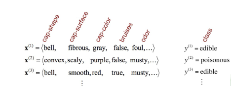

第二种方法是用一个数据表来表示

|            | feature 1 | feature 2 | feature d | class |
| ---------- | --------- | --------- | --------- | ----- |
| instance 1 | 0.0       | small     | red       | true  |
| instance 2 | 9.3       | medium    | red       | false |
| instance 3 | 8.2       | small     | blue      | false |
| ...        | ...       | ...       | ...       | ...   |
| instance n | 5.7       | medium    | green     | true  |

## [1.2] 均值归一化

Mean Normalization / Centering

每个数据样本执行：**减去整个数据集的平均值**
$$
x'=x-\text{avg(D)}
$$


## [1.3] 标准归一化 

Standardization or Normalization

每个数据样本执行：**减去整个数据集的平均值**，然后除以整个数据集的**标准差（Standard Deviation）**

解决特征数值差异过大的问题
$$
x'=\dfrac{x-\text{avg(D)}}{\text{sd(D)}}\\\\
\text{sd(D)}=\sqrt{\dfrac{\sum (x_i - \mu)^2}{N}}
$$


能够**解决特征数值差异过大的问题**

[4] 白化

白化的目的是将原始数据的特征进行线性变换，使得变换后的数据：

1. **特征之间不再相关**（协方差为 0）。
2. **每个特征的方差（Variance）都为 1**。

# [2] 数据收集

## [2.1] 独立同分布 IID

**独立同分布 (Independent and Identically Distributed, 简称 i.i.d.)**。

> Identical = 完全相同的


在概率论和机器学习中，如果我们说一组随机变量 $X_1, X_2, \dots, X_n$ 是 **i.i.d.** 的，它们必须满足两个条件：

- **独立性 (Independent)：** 每一个样本的出现都不会影响其他样本。换句话说，知道了一个样本的信息，并不能帮助你预测另一个样本的具体数值。
- **同分布 (Identically Distributed)：** 所有样本都是从**同一个**概率分布中抽取的。这意味着它们遵循相同的统计规律（例如具有相同的平均值和波动程度）。

**直观理解：** 想象你不断重复抛同一枚均匀的硬币。每次抛硬币的结果（正或反）是相互独立的（上一次结果不影响下一次），而且每次遵循的概率规律是一样的（都是 50% 概率），这就是 **i.i.d**.。


**现实中该假设往往并不成立**。当数据之间存在“依赖关系”时，i.i.d. 假设就失效了。

常见的非 i.i.d. 例子包括：

- **医学图像 (Medical Images)：** 如果你从同一张医疗 CT 图像中截取多个小块（instances），这些小块之间在空间上是紧密相关的（例如都属于同一个器官），它们并不是独立的。
- **时间序列 (Time Series)：** 股票价格、天气预报或语音信号。今天的数据通常取决于昨天的数据，存在时间上的先后依赖关系。
- **社交网络：** 你的行为往往受到你朋友的影响，用户之间的数据不独立。


## [2.2] 监督和无监督学习

### [2.2.1] 监督学习

监督学习模型：

- Decision Tree 决策树
- Neural Network 神经网络
- Linear/ Logistic Regression 线性/ 逻辑回归
- Bayesian Network 贝叶斯网络
- ...


### [2.2.2] 无监督学习

无监督学习任务

- Clustering 聚类
- **Anomaly Detection 异常检测**
- Dimensionally Reduction 降维

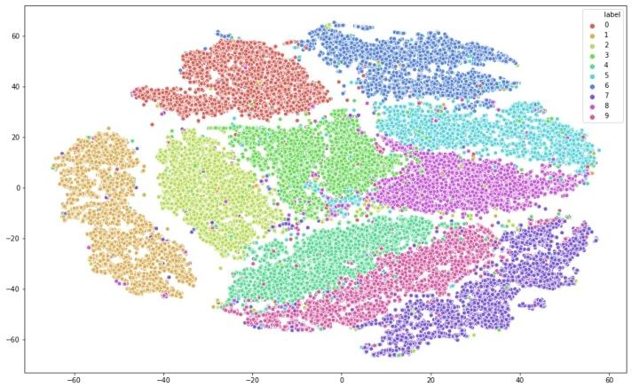

> 什么是异常检测？
>
> 异常检测的目标是识别出那些与“正常”数据模式显著不同的数据点。它通常分为两个任务阶段：
>
> - **学习任务 (Learning Task)：建立“正常”的标准**
>   - **给定：** 一组训练实例 $\{x^{(1)}, x^{(2)}, \dots, x^{(m)}\}$。这些通常被认为是“正常”的样本。
>   - **输出：** 一个模型 $h \in H$，该模型能够代表什么是“正常”的 $x$。简单来说，就是通过历史数据画出一个“正常范围”的边界。
> - **执行任务 (Performance Task)：进行判断**
>   - **给定：** 一个之前从未见过的全新数据点 $x$。
>   - **确定：** 这个 $x$ 看起来是“正常”的还是“异常”的。


> 核心背景：为什么要降维？
>
> - **原始表示：** 一张人脸图像通常由成千上万个像素组成。如果一张图是 $100 \times 100$ 像素，那么它就有 $10,000$ 个特征（每个像素点就是一个维度）。
> - **问题：** 维度太高会导致计算量巨大（维度灾难），且很多像素点之间是高度相关的（例如，左眼周围的像素通常和右眼是对称的），存在大量冗余信息。
>
> 什么是“特征脸”（Eigenfaces）？
>
> - **定义（右上图）：** “特征脸”是通过对大量人脸图像进行统计分析（PCA）提取出来的“核心模式”。
> - **视觉特征：** 你会发现这些特征脸看起来像“鬼影”。它们并不代表某个具体的人，而是代表人脸在不同方向上的**变化特征**。例如，有的特征脸捕捉光照变化，有的捕捉脸型，有的捕捉五官位置。
>
> 底部的幻灯片展示了如何利用这些“特征脸”来重新表示一个人：
>
> > 公式：
> > $$
> > Face \approx \alpha_1 \cdot Eigenface_1 + \alpha_2 \cdot Eigenface_2 + \dots + \alpha_{20} \cdot Eigenface_{20}
> > $$
> > 
>
> - **线性组合：** 任何一张具体的人脸都可以看作是这组“特征脸”的加权叠加。
> - **权重 ($\alpha$)：** 每个 $\alpha$ 值代表了对应特征脸在这张面孔中所占的比重。
> - **降维的结果：**
>   - 以前我们需要 $10,000$ 个像素值来描述一个人。
>   - 现在我们只需要记录这 20 个权重值向量 $\mathbf{x} = \langle \alpha_1, \alpha_2, \dots, \alpha_{20} \rangle$。
>   - **特征数量从几万个减少到了 20 个。**


### [2.2.3] 半监督学习

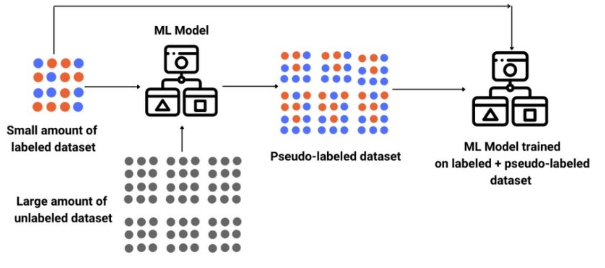

在**标注数据（Labeled data）极少**，但**未标注数据（Unlabeled data）很多**的情况下，利用大量低成本的数据来提升模型性能。


> 1. 准备阶段 (左侧)
>
> - **少量有标签数据集 (Small amount of labeled dataset)：** 包含经过人工精确标注的数据（图中彩色点），数量通常很少。
> - **大量无标签数据集 (Large amount of unlabeled dataset)：** 只有原始数据，没有分类标签（图中灰色点），获取成本低，数量庞大。
>
> 2. 初始模型训练 (中间)
>
> - 将少量的**有标签数据**输入到第一个机器学习模型（ML Model）中进行训练。
> - 由于数据量小，这个模型的精度可能还不是很高，但它已经具备了基本的识别能力。
>
> 3. 生成伪标签 (中间偏右)
>
> - 使用上面训练好的初始模型，对那批**大量的无标签数据**进行预测。
> - 模型会给这些灰色点分配它认为最可能的标签（变回彩色点）。因为这些标签是模型“猜”出来的，而不是人工标注的，所以被称为**伪标签 (Pseudo-labeled dataset)**。
>
> 4. 数据合并与最终训练 (右侧)
>
> - 将最初的**真实标签数据**与新生成的**伪标签数据**合并在一起。
> - 使用这个规模大得多的“混合数据集”重新训练一个更强大的模型。
> - **最终结果：** 得到的模型通常比仅用少量有标签数据训练出来的模型更加鲁棒、准确。


## [2.3] Batch 和 在线学习

Batch（Offline） and **Online Learning**


Batch（Offline Learing）

批量学习也被称为“离线学习”。它的核心特点是**一次性处理所有数据**。

- **工作原理：** 系统在训练时，会被提供完整的训练数据集 $(x^{(1)}, y^{(1)}) \dots (x^{(m)}, y^{(m)})$。模型在接触到所有这些数据后进行一次性的学习和优化。
- **特点：**
  - **计算量大：** 训练通常需要大量的计算资源和时间。
  - **非增量式：** 如果有新数据加入，通常需要将旧数据和新数据合并，然后从头开始训练一个新模型。
  - **稳定性高：** 因为模型看到了全局数据，容易找到全局最优解。


Online Learning

**工作原理：** 学习器不是一次性接收所有数据，而是**逐个（或以极小的小批次）**接收数据实例。每进来一个新样本 $(x^{(i)}, y^{(i)})$，模型就立即根据这个样本更新一次参数。

流程细节： 1.  接收输入 $x^{(i)}$。

2. 模型做出预测（有时在看到真实标签 $y^{(i)}$ 之前）。
3. 获取真实标签 $y^{(i)}$，计算误差。
4. 立即更新模型，然后丢弃或存储该样本，准备处理下一个。

**特点：**

- **快速且节省空间：** 适合数据量巨大（无法全部存入内存）或数据流源源不断的场景（如股市行情、网站点击流）。
- **自适应强：** 模型能迅速适应数据的最新变化（即“概念漂移”）。
- **对异常值敏感：** 如果进来一个错误的样本，模型可能会迅速受到偏离的影响。


## [2.4] RLHF 和 RLAIF


这一部分探讨了如何让 AI 模型的行为更符合人类的预期（即“对齐”问题）。

**RLHF (Reinforcement Learning from Human Feedback)**

- **定义**：**人工反馈强化学习**。这是目前大语言模型（如 ChatGPT）成功的核心技术。它通过人类对模型生成的多个回答进行排序或打分，告诉模型哪个更好。
- **核心痛点（云朵标注）**：**"How to scale it?"（如何规模化？）**
  - 依靠人类反馈非常昂贵且缓慢。人类专家的时间有限，无法为海量数据一一标注，这限制了模型进一步进化的速度。

**RLAIF (Reinforcement Learning from AI Feedback)**

- **定义**：**AI 反馈强化学习**。为了解决 RLHF 的规模化问题，研究者用一个“老师 AI”来代替人类，给“学生 AI”的行为打分。
- **核心痛点（云朵标注）**：**"How to ensure alignment?"（如何确保对齐？）**
  - 如果 AI 评价 AI，可能会产生“循环论证”或“幻觉叠加”。如果老师 AI 本身就有偏见或错误，学生 AI 会学得更偏，最终可能脱离人类的价值观和真实需求。


## [2.5] 泛化

Generalization

这是衡量一个机器学习模型好坏的最重要指标。

- 在监督学习中，我们的目标不是让模型“背诵”答案，而是找到一个能够**泛化（Generalizes）**的模型。
- **公式表达**：对于以前从未见过的输入 $x$（previously unseen $x$），模型依然能够准确预测出结果 $y$。

- **训练集**：假设你看了 100 张有毒蘑菇和 100 张无毒蘑菇的照片。
- **测试（泛化）**：当你走进森林，看到一个**不在**那 200 张照片里的新蘑菇时，你能判断它是否能吃吗？
- **解析**：
  - 如果模型只是**死记硬背**，它会因为没见过这个蘑菇而无法判断。
  - 如果模型具备**泛化能力**，它会学习到规律（比如：通常颜色鲜艳的有毒，有菌环的有毒），从而对新事物做出正确判断。


# [3] 机器学习概率

## [3.1] 随机变量

什么是随机变量？

随机变量是用来**表达不确定性**的工具。

- **背景**：假设我们有一群学生，我们想研究他们的成绩。
- **随机变量定义**：在这里，我们将“成绩”定义为随机变量，记作 $Grade$。
- **取值范围 (Val)**：随机变量可以取得的所有可能结果。在这个例子中，$Val(Grade) = \{A, B, C\}$。也就是说，成绩可能是 A、B 或 C。


**概率相加为1**

如果 $k$ 是随机变量 $X$ 所有可能取值的数量，那么将所有可能结果出现的概率相加，结果**必须等于 1**。这代表了所有可能性的总和是确定的。
$$
\sum_{i=1}^{k} P(X = x^i) = 1
$$


**多项分布 (Multinomial Distribution)**：当变量有多个（$k$ 个）可能的结果时（如 A、B、C），这种分布被称为多项分布。

**伯努利分布 (Bernoulli Distribution)**：如果变量只有两种可能的结果，例如 $\{false, true\}$（假或真、失败或成功），则称为伯努利分布。


在处理多个随机变量（如成绩和出勤率）时，如果你只关注**其中一个变量（如只看成绩 $P(X)$）**，而忽略其他变量的影响，那么这个单一变量的概率分布就叫做“**边缘分布 (Marginal Distribution)**”。


## [3.2] 边缘概率/ 联合概率/ 条件概率

边缘概率 (Marginal Probability)**：单个事件**

**定义：** 某个单一事件发生的概率，不考虑其他事件的影响。它也被称为“无条件概率”。

- **符号：** $P(A)$
- **例子：**
  - **抽到红牌的概率：** 一副牌有一半是红色的（红桃和方片），所以 $P(\text{red}) = 26/52 = 0.5$。
  - **抽到数字4的概率：** 一副牌有4个花色的4，所以 $P(4) = 4/52 = 1/13$。


---


联合概率 (Joint Probability)**：多个事件**

**定义：** 两个或多个事件**同时发生**的概率。在集合论中，这代表两个集合的“交集”。

- **符号：** $P(A \text{ and } B)$ 或 $P(A \cap B)$
- **例子：**
  - **抽到一张既是“4”又是“红色”的牌：** 全牌组中只有两张牌符合条件（红桃4和方片4）。
  - **计算：** $P(4 \cap \text{red}) = 2/52 = 1/26$。


---


 **条件概率 (Conditional Probability)**

**定义：** 在已知事件 B 已经发生的**前提下**，事件 A 发生的概率。它会缩小你观察的范围（样本空间）。

- **符号：** $P(A|B)$，读作“在 B 发生的条件下 A 的概率”。
- **例子：**
  - **已知抽到的是红牌，它是数字4的概率是多少？**
  - **分析：** 既然已知是红牌，我们的观察范围就从52张牌缩减到了那 **26张红牌** 中。在这26张红牌里，有2个是4。
  - **计算：** $P(num(4)|\text{red}) = 2/26 = 1/13$。

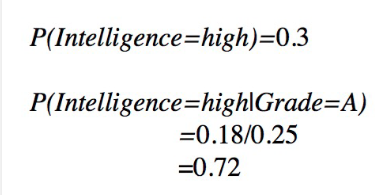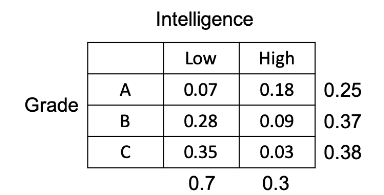


条件概率中的**链式法则（Chain Rule）**

简单来说，如果你想知道一系列事件 $A_1, A_2, \dots, A_n$ 同时发生的概率，你可以把它看作是一个接一个发生的序列：

- 首先，$A_1$ 发生。
- 然后，在 $A_1$ 发生的条件下，$A_2$ 发生。
- 接着，在 $A_1$ 和 $A_2$ 都发生的条件下，$A_3$ 发生。
- 以此类推。

通用递归形式：
$$
P(A_n, \dots, A_1) = P(A_n | A_{n-1}, \dots, A_1) \cdot P(A_{n-1}, \dots, A_1)
$$
展开后的完整形式（以4个变量为例）：
$$
P(A_4, A_3, A_2, A_1) = P(A_4 | A_3, A_2, A_1) \cdot P(A_3 | A_2, A_1) \cdot P(A_2 | A_1) \cdot P(A_1)
$$


链式法则是将**联合概率**转化为**边缘概率**与一系列**条件概率**乘积的桥梁。它是理解贝叶斯网络（Bayesian Networks）和马尔可夫模型（Markov Models）的基石。


$$
P(Y = y_i \mid E = e) = \frac{P(Y = y_i, E = e)}{P(E = e)}
$$


- **分子**：$Y$ 和 $E$ 同时发生的联合概率。
- **分母**：证据 $E$ 发生的总概率（起归一化作用）。


## [3.3] 查询 Query

幻灯片将查询分为两大类，它们的侧重点不同：

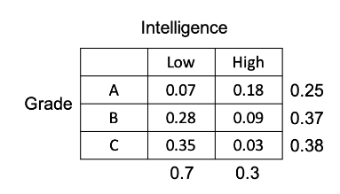

**A. 概率查询 (Probability Queries)**

- **目标**：给定一些证据（Evidence），计算另一组随机变量的**概率分布**。
- **直观理解**：关注的是“可能性有多大？”。
- **例子**：在给出的表格中，概率查询可能会问：**“已知学生智力高，他得到 A、B、C 各自的概率是多少？”**

**B. MAP 查询 (Maximum A Posteriori) **最大后验概率

- **目标**：寻找一组随机变量中**最可能（概率最大）的取值组合**。
- **别名**：也称为 **MPE (Most Probable Explanation)**，即最大可能解释。
- **直观理解**：关注的是“谁是赢家？”或“哪种组合最可能发生？”。
- **例子**：在表格中，数值最大的单元格是 $(C, \text{Low}) = 0.35$。因此，MAP 查询的结果会直接告诉你：最可能的组合是“低智力且成绩为 C”。

> max = 最大值
>
> argmax = 能达到最大值的**x的集合**


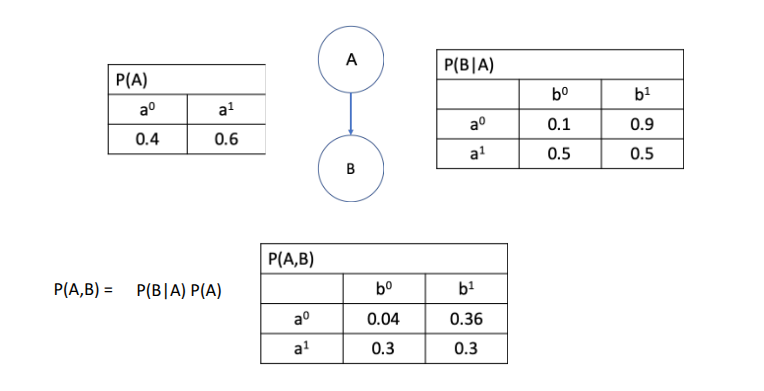

MAP 查询通常是要求某个变量或一组变量在什么取值下概率最大。绝大多数题目的突破口都是先算出**联合概率 $P(A, B)$**。

- **公式：** $P(A, B) = P(A) \times P(B|A)$
- **技巧：** 像图中那样画一个交叉表。
  - 将 $P(A)$ 的值分别乘进 $P(B|A)$ 对应行的每一个格子。
  - 例如：$P(a^0, b^0) = P(a^0) \times P(b^0|a^0) = 0.4 \times 0.1 = 0.04$。


- $MAP(A)$：直接看 $P(A,B)$ 把a行相加分别对比，$P(a^1)=0.6$ 最大，所以 $MAP(A) = a^1$

  > 当然直接看 P(A) 也行，为了记忆这里全部使用 P(A,B)

- $MAP(A, B)$ ：选择$P(A,B)$ 表中最大数字，最大值是 $0.36$，对应的组合是 $(a^0, b^1)$

- $MAP(B)$ ：看$P(A,B)$ 表，把b纵列相加分别对比，得到 $b_0<?>b_1\to(0.04+0.3)<?>(0.36+0.3)\to0.34<0.66$ 因此 $MAP(B)=b_1$


# [4] 线性代数

基础数据对象

- **标量 (Scalar)**：单个数值，通常用小写斜体表示（如 $x$）。

- **向量 (Vector)**：一列有序排列的数，表示空间中的一个点。通常用小写粗体表示（如 $\mathbf{x}$）。

  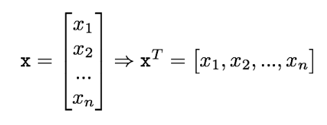

- **矩阵 (Matrix)**：二维数值阵列，通常用大写粗体表示（如 $\mathbf{A}$）。每个元素由两个索引确定。

  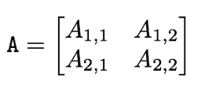

- **张量 (Tensor)**：超过二维的多维阵列。


## [4.1] 矩阵转置


- **转置 (Transpose, $A^T$)**：沿主对角线翻转矩阵。向量通常默认以列向量形式存在，其转置为行向量。

  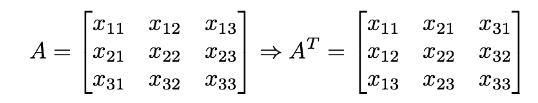

- **单位矩阵 (Identity Matrix, $I$)**：主对角线全为 1，其余全为 0。任何向量与单位矩阵相乘，结果保持不变 ($I\mathbf{x} = \mathbf{x}$)。

- **逆矩阵 (Matrix Inverse, $A^{-1}$)**：满足 $A^{-1}A = I$。只有方阵（Square matrix）才有逆矩阵的概念。


## [4.2] 线性变换

**线性变换**：矩阵 $\mathbf{A}$ 与向量 $\mathbf{x}$ 相乘可以看作是将 $\mathbf{x}$ 变换为另一个向量 $\mathbf{b}$ 的过程（即 $A\mathbf{x} = \mathbf{b}$）。

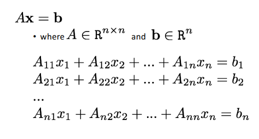

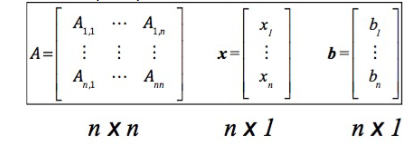


- **矩阵逆法**：若 $A^{-1}$ 存在，则解为 $\mathbf{x} = A^{-1}\mathbf{b}$。

  > 如果 $A^{-1}A=I$存在这样的$A^{-1}$那么才存在逆矩阵


## [4.3] LP-Norm

$$
||x||_p = (\sum_i|x_i|^p)^{\frac1p}
$$


$L_1$ Norm 也叫做曼哈顿距离：
$$
||x||_1 = \sum_i |x_i|
$$
$L_{\infin}$ 也叫做 Max Norm 最大范数
$$
L_{\infin} = \text{max}(\text{abs}(x))
$$


> [!CAUTION]
>
> 范数都有绝对值！

**二维点的范数**

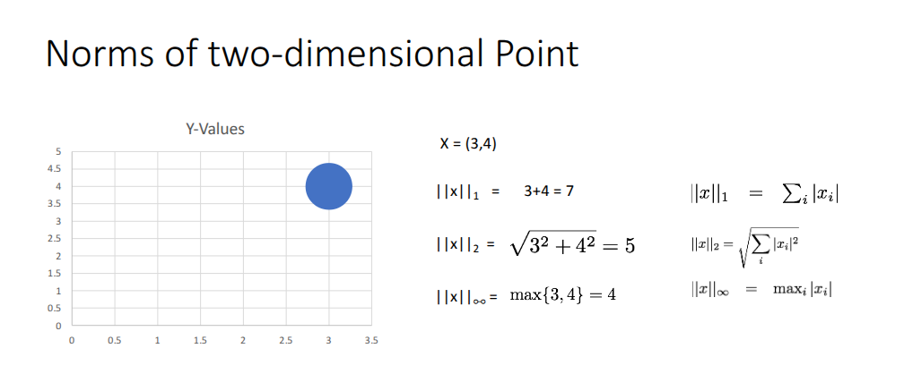

> Example
> $$
> L_\infty(P, Q) = \max(|x_1 - x_2|, |y_1 - y_2|)
> $$


# [5] NumPy 语法

## [5.1] array random

```python
A = np.array([[1, 2, 3],[4, 5,6]])
print A 
#[[123]
# [456]]
Af = np.array([1,2,3],float)

a = np.ones(5)
# 输出: array([1., 1., 1., 1., 1.])

b = np.ones((2, 3))
# 输出:
# array([[1., 1., 1.],
#        [1., 1., 1.]])

A = np.ones((3,3))
print 3 * A - 1
#[[2. 2. 2.] 
# [2. 2. 2.] 
# [2. 2. 2.]]

```


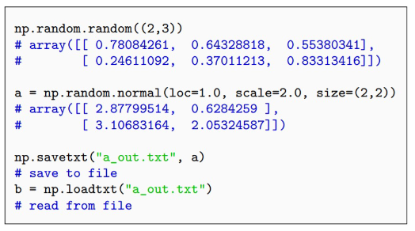


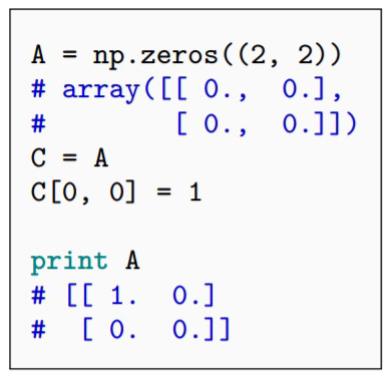

## [5.2] 数组属性

```python
np.arange(0, 1, 0.2)
# 生成 [0, 0.2, 0.4, 0.6, 0.8]（左闭右开）
np.arange(10)
# 生成 [0, 1, 2, 3, 4, 5, 6, 7, 8, 9] （左闭右开）
```


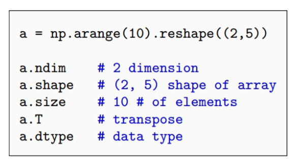

```python
a = [0, 1, 2, 3, 4, 5, 6, 7, 8, 9]
# reshape之后：
a = [[0, 1, 2, 3, 4],
     [5, 6, 7, 8, 9]]
# a.dim = 2 二维
# a.shape (2,5)
# a.size 10 一共有2*5=10个元素
# a.T 转置
a = [[0, 5], # 第 0 列的元素来自原第 0 行和第 1 行的开头
     [1, 6],
     [2, 7],
     [3, 8],
     [4, 9]]
# a.dtype 数据类型，数组中存储的数据的类型，通常是 int64 或 int32（取决于操作系统）。
```


## [5.3] 数组广播

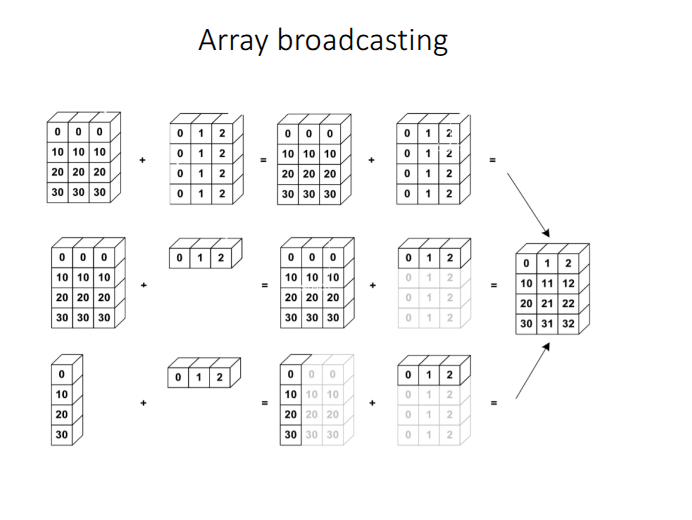


## [5.4] 切割数组

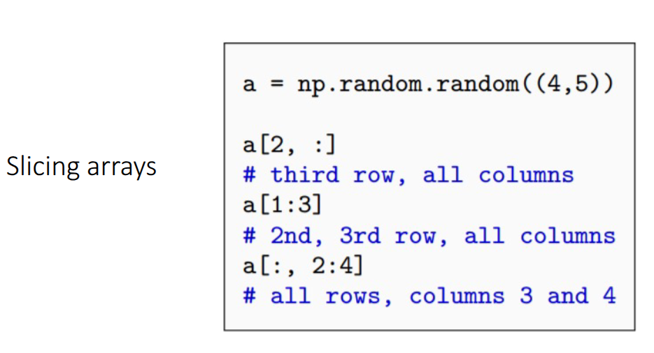

这里 `a[2,:]` 是下标`2`，下标遵循0开始。


```python
>>> A = np.array([[1,2,3,4],[5,6,7,8]])
>>> for i in A:
...     print(i)
...     
[1 2 3 4]
[5 6 7 8]
```


```python
>>> for i in A.flat:
...     print(i)
...     
1
2
3
4
5
6
7
8
```


## [5.5] reshape / resize

reshape之后大小 `a.size` 必须等于 `b.size`

但是resize不要求

```python
import numpy as np

a = np.array([[1, 2], [3, 4]]) # 2x2 数组，共 4 个元素
# 将其 resize 为 3x3 数组（需要 9 个元素）
b = np.resize(a, (3, 3))

print(b)
```


```
[[1 2 3]
 [4 1 2]
 [3 4 1]]
```


# 2023/2024

> 计算器操作：
> $$
> \log_a(b) = \frac{\ln(b)}{\ln(a)}
> $$


## [1] 关于异常检测

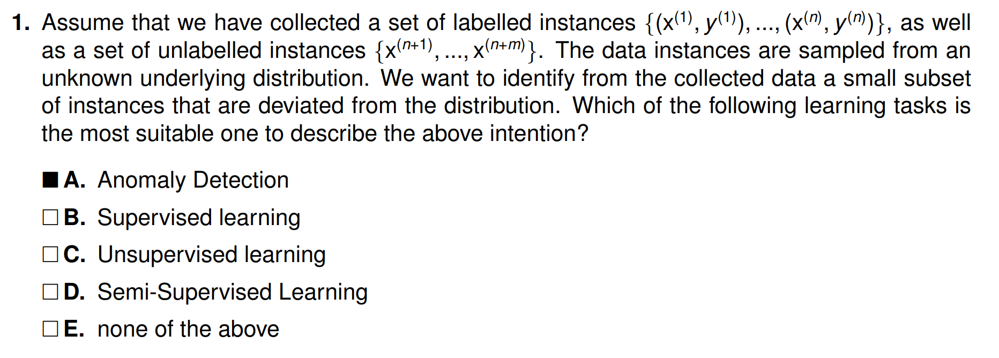

假设我们收集了一组有标记（labelled）的样本 $\{(x^{(1)}, y^{(1)}), \dots, (x^{(n)}, y^{(n)})\}$，以及一组无标记（unlabelled）的样本 $\{x^{(n+1)}, \dots, x^{(n+m)}\}$。这些数据样本是从一个未知的潜在分布中采样得到的。我**们想要从收集到的数据中识别出一小部分偏离（Deviated）该分布的样本。**

==**A. 异常检测 (Anomaly Detection)**  正确==

**B. 监督学习 (Supervised learning)**

**C. 无监督学习 (Unsupervised learning)**

**D. 半监督学习 (Semi-Supervised Learning)**

**E. 以上都不是**

>  异常检测（Anomaly Detection 或 Outlier Detection）的核心目标就是识别出那些与大多数数据显著不同、或者不符合预期模式/分布的稀少样本。


## [2] 概念

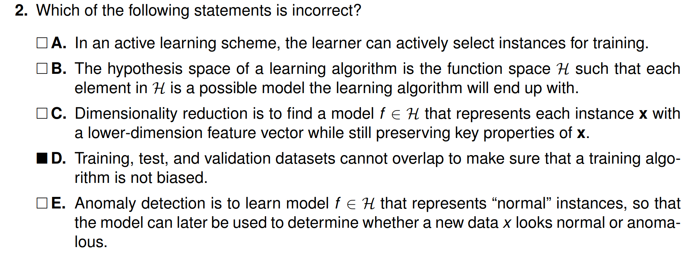

**下列哪项表述是错误的？**

- **A.** 在**主动学习（Active Learning）**方案中，学习器可以主动选择用于训练的实例。
- **B.** 学习算法的**假设空间（Hypothesis Space）**是一个函数空间 $\mathcal{H}$，其中的每一个元素都是学习算法最终可能得到的模型。
- **C.** **降维（Dimensionality Reduction）**是寻找一个模型 $f \in \mathcal{H}$，将每个实例 $\mathbf{x}$ 表示为一个低维特征向量，同时仍保留 $\mathbf{x}$ 的关键属性。
- ==**D.** 训练集、测试集和验证集**不能重叠**，以确保**训练算法是没有偏置（not biased）的**。==
- **E.** **异常检测（Anomaly Detection）**是学习一个模型 $f \in \mathcal{H}$ 来表示“正常”实例，以便随后利用该模型判断新数据 $x$ 是正常的还是异常的。

> #### A. 主动学习 (正确表述)
>
> 在传统监督学习中，模型是被动接收标注好的数据。而在**主动学习**中，算法可以从大量未标注数据中“挑选”出它认为**最有信息量**（例如最不确定）的样本，请求人工进行标注。这可以显著减少所需的标注数据量。
>
> #### B. 假设空间 (正确表述)
>
> **假设空间 $\mathcal{H}$** **包含了算法在给定约束条件下能够学习到的所有可能的函数集合**。例如，如果你的模型是线性回归，那么你的假设空间就是所有可能的线性函数的集合。
>
> #### C. 降维 (正确表述)
>
> 降维（如 PCA 或 Autoencoder）的目标是在减少特征维度（减少 $\mathbf{x}$ 的分量）的同时，尽可能多地保留原始数据的信息或结构特征。
>
> #### D. 数据集划分 (错误表述)
>
> 虽然训练集、测试集和验证集确实**不应该重叠**，但这样做的目的不是为了“确保训练算法没有偏置”。
>
> - **真正的原因：** 是为了实现**泛化能力的公正评估**。如果测试集和训练集重叠，模型会通过“背诵”已知数据来获得虚高的高分（即数据泄露），我们便无法得知模型在面对从未见过的真实数据时表现如何。
> - **关于“偏置（Bias）”：** 算法的偏置（如“偏置-方差权衡”中的偏置）是由模型本身的复杂度（如线性模型 vs 复杂神经网络）决定的，与数据集是否重叠无关。
>
> #### E. 异常检测 (正确表述)
>
> 这是异常检测的标准定义：**通过学习正常数据的分布特征，将不符合该分布的点标记为异常。**


## [3] 概率

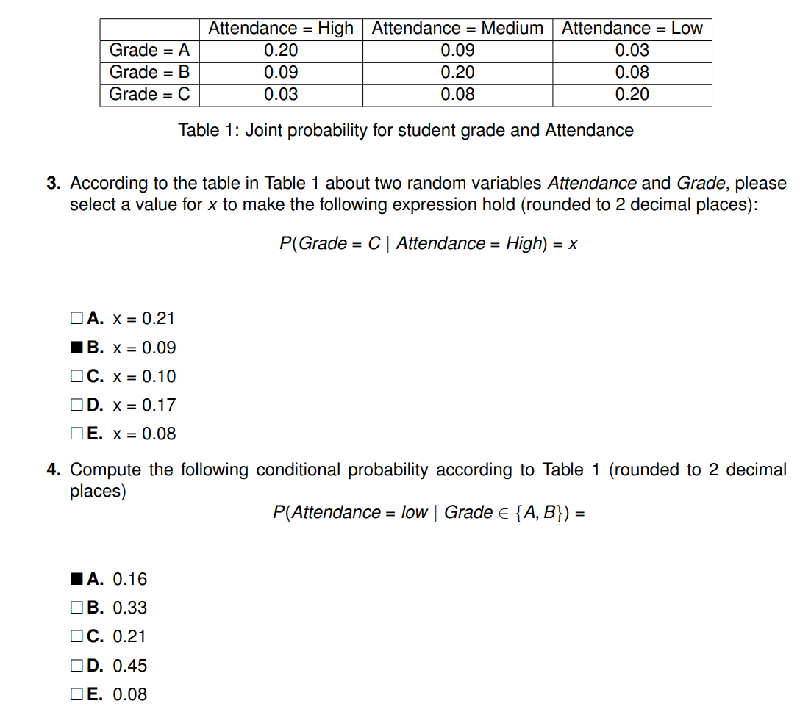

> 第一题 $0.03/0.32=0.09375$
>
> 第二题 $0.11/0.69 \approx 0.1594$
>
> 此处都是四舍五入


## [4] 高斯分布和简单概率

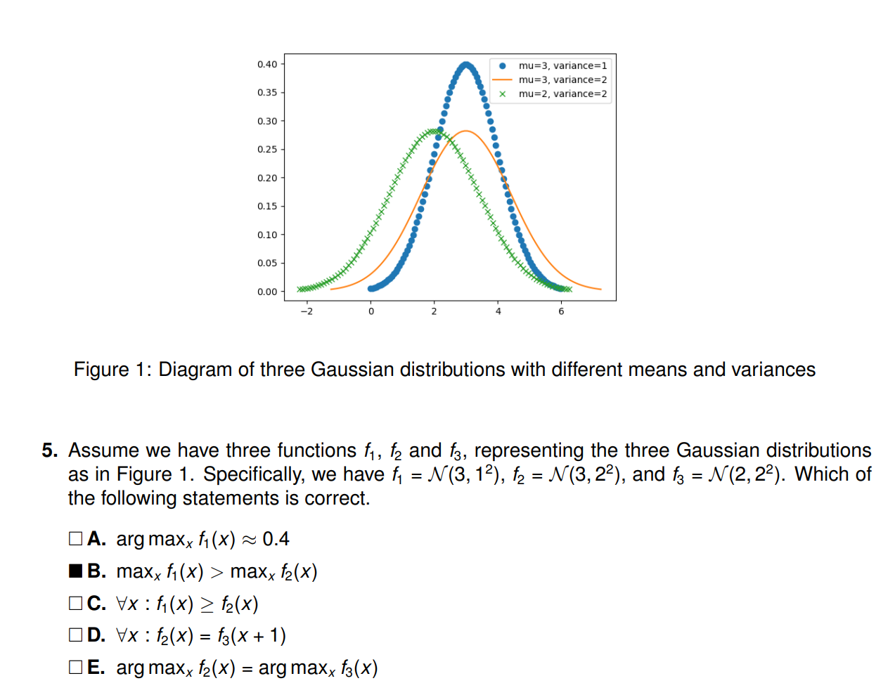

> $f = \mathcal{N}(\mu, \text{variance}^2)$
>
> 其中 $\mu$ 是均值，也就是最高点对应的x的地方
>
> 方差 $\text{variance}$ 越小，波峰越高，因此
>
> - $f_1$ 是蓝色
> - $f_2$ 是橙色
> - $f_3$ 是绿色
>
> 选项A：问的是$f_1$ 最高点对应的 $x$ 因此应该是 $\arg \max_x f_1(x) = 3$
>
> 选项B：看图，对的
>
> 选项C和D：看图：不对
>
> 选项E：错的，除非改成 $\text{argmax}_x f_2(x) = \text{argmax}_x f_3(x)$


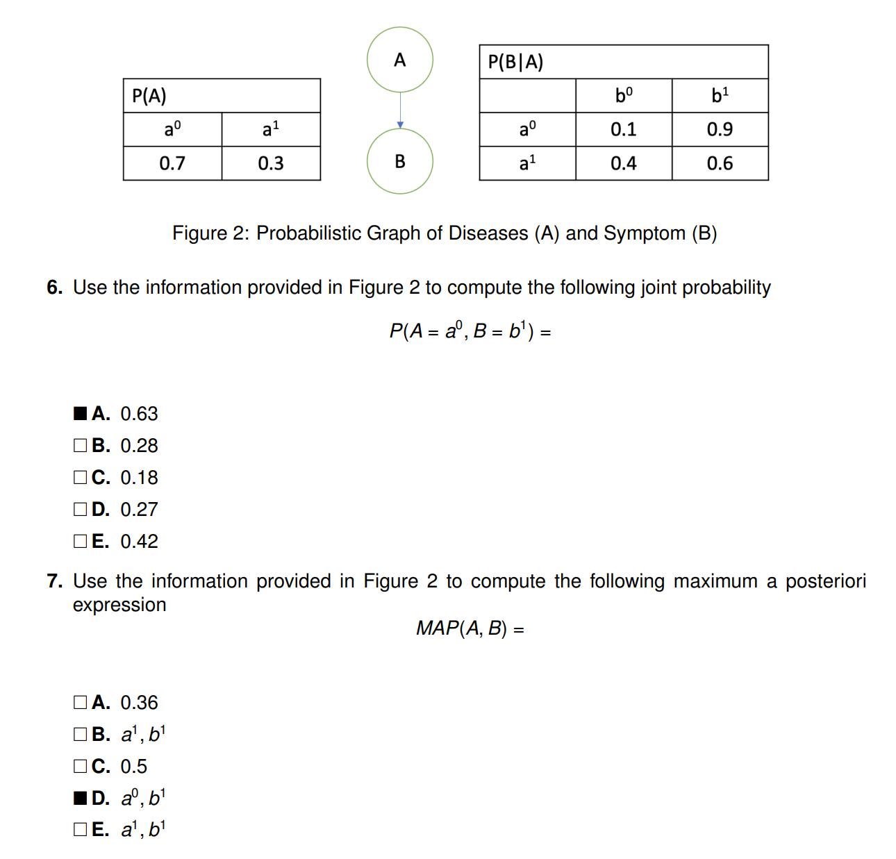


第六题，首先计算出 $P(A,B)$ 表格，$P(A,B)=P(A)P(B|A)$

| $P(A,B)$ | b0               | b1               |
| -------- | ---------------- | ---------------- |
| a0       | 0.7 * 0.1 = 0.07 | 0.7 * 0.9 = 0.63 |
| a1       | 0.3 * 0.4 = 0.12 | 0.3 * 0.6 = 0.18 |


因此第六题 $P(A=a_0,B=b_1)$ 就是上图的 0.63


第七题 $MAP(A,B)$ 就看$P(A,B)$ 表中的最大值**==对应的字母==**，显然是 0.63 对应的就是 $P(A=a_0,B=b_1)$ 

如果求$max_{a,b}P(A,B)$ 则是求最大值！


## [5] 数据预处理操作

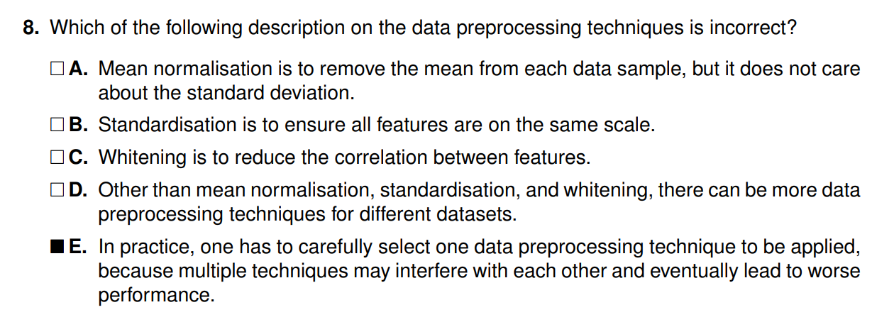

> A. **均值**归一化（Mean Normalization） 就是每个数据点**减去** 均值，确实不考虑标准差。除非是 Standard Normalization，在这个基础上除以**标准差**
>
> B. 标准化的核心目的就是消除特征间量纲的影响（比如身高是厘米，体重是公斤）。通过标准化，所有特征都会转化为均值为 0、方差为 1 的分布，使它们在模型中具有可比性。描述正确。
>
> C. 白化（如 PCA Whitening 或 ZCA Whitening）有两个主要目标：一是使特征的方差相同（通常为1），二是**消除特征之间的相关性**（使协方差矩阵为单位矩阵）。描述正确。
>
> D. 预处理技术非常多，对的
>
> E. 在实践中，必须谨慎地**只选择一种数据预处理技术**来应用，因为多种技术可能会相互干扰，最终导致性能下降。（错误）
>
> 在机器学习的实际操作中，**通常会组合使用多种预处理技术**，而不是只能选一个。例如，一个典型的流水线（Pipeline）可能包括：先处理缺失值，然后进行均值中心化，接着进行标准化，最后可能还会进行降维或白化。这些步骤是层层递进的，旨在为模型提供最干净、最有效的输入特征。因此，说“只能选择一种”是完全错误的。


## [6] NumPy 操作

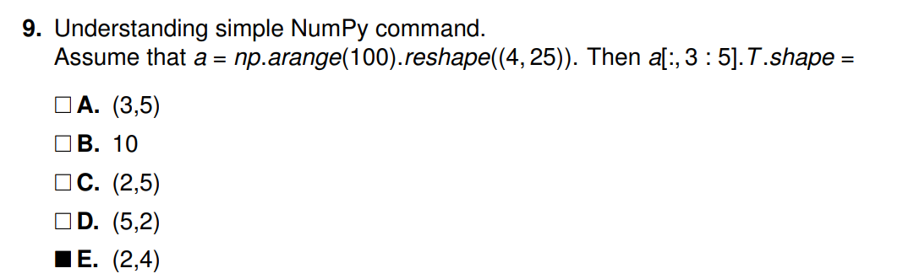


```py
a = np.arange(100).reshape((4, 25))
```

`np.arange(100)` 生成一个包含 0 到 99 的一维数组。

`.reshape((4, 25))` 将其转换为一个二维数组，有 **4 行** 和 **25 列**。

此时 `a.shape` 为 **(4, 25)**。


执行切片操作 `a[:, 3 : 5]`

这里使用了逗号分隔的切片语法 `[行切片, 列切片]`：

- **`:` (行切片)**：代表选取**所有行**，即 4 行。
- **`3 : 5` (列切片)**：代表选取从索引 `[3,5)` 的列。即选取第 3 列和第 4 列，共 **2 列**。
- 此时切片后得到的新数组形状为 **(4, 2)**。


## [7] 范数

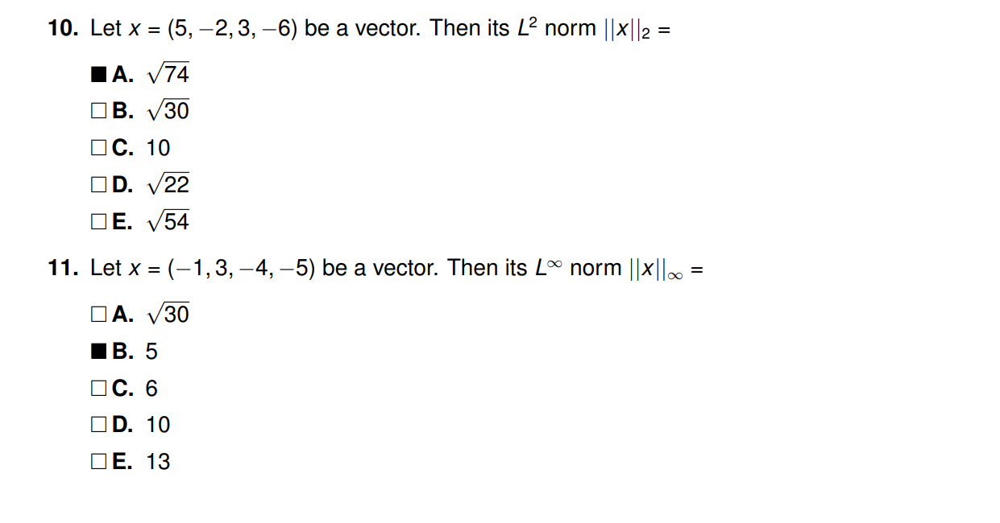

$L_2$ 范数：
$$
||x||_2 = \sqrt{5^2+(-2)^2+3^2+(-6)^2}=\sqrt{74}
$$


最大范数 $L_\infin$
$$
||x||_\infin = \text{max\{|-1|,|3|,|-4|,|-5|\}}
$$


## [8] 决策树

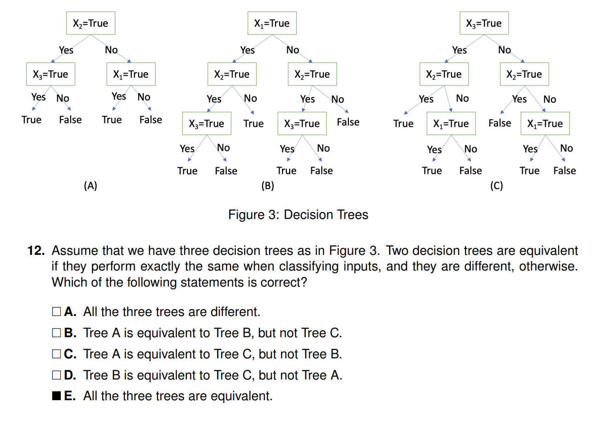

> 对于任意的输入，它们的分类结果始终保持一致。因此，这三个决策树是等价的。

## [9] 计算熵

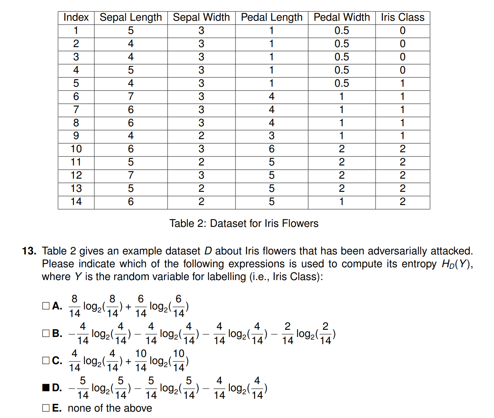

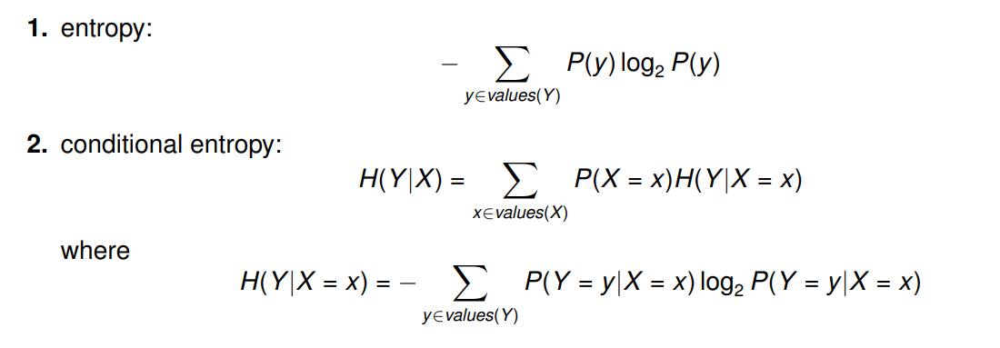


这个问题要求计算数据集 $D$ 中标签 $Y$（即 **Iris Class**）的熵 $H_D(Y)$。

熵是衡量数据不确定性或混乱程度的指标。根据图像中给出的公式：
$$
H(Y) = -\sum_{y \in \text{values}(Y)} P(y) \log_2 P(y)
$$
我们可以通过以下步骤得出正确答案：

### 统计数据分布、计算概率 $P(y)$

首先，我们需要看表 2 中的 **Iris Class** 列，统计每个类别出现的次数：

- **总样本数 ($N$):** 共有 14 个样本（索引 1 到 14）。
- **类别 0 的数量:** 出现了 **4** 次（索引 1, 2, 3, 4）。
- **类别 1 的数量:** 出现了 **5** 次（索引 5, 6, 7, 8, 9）。
- **类别 2 的数量:** 出现了 **5** 次（索引 10, 11, 12, 13, 14）。


根据频率计算每个类别的概率：

- $P(Y=0) = \dfrac{4}{14}$
- $P(Y=1) = \dfrac{5}{14}$
- $P(Y=2) = \dfrac{5}{14}$

### 代入熵公式

将概率代入公式 $H(Y) = - \sum P(y) \log_2 P(y)$：
$$
\begin{aligned}
H_D(Y) &= - \left[ P(0)\log_2 P(0) + P(1)\log_2 P(1) + P(2)\log_2 P(2) \right]\\\\
H_D(Y) &= - \left[ \frac{4}{14}\log_2(\frac{4}{14}) + \frac{5}{14}\log_2(\frac{5}{14}) + \frac{5}{14}\log_2(\frac{5}{14}) \right]\\\\
H_D(Y) &= -\frac{4}{14}\log_2(\frac{4}{14}) - \frac{5}{14}\log_2(\frac{5}{14}) - \frac{5}{14}\log_2(\frac{5}{14})
\end{aligned}
$$


## [10] 信息增益

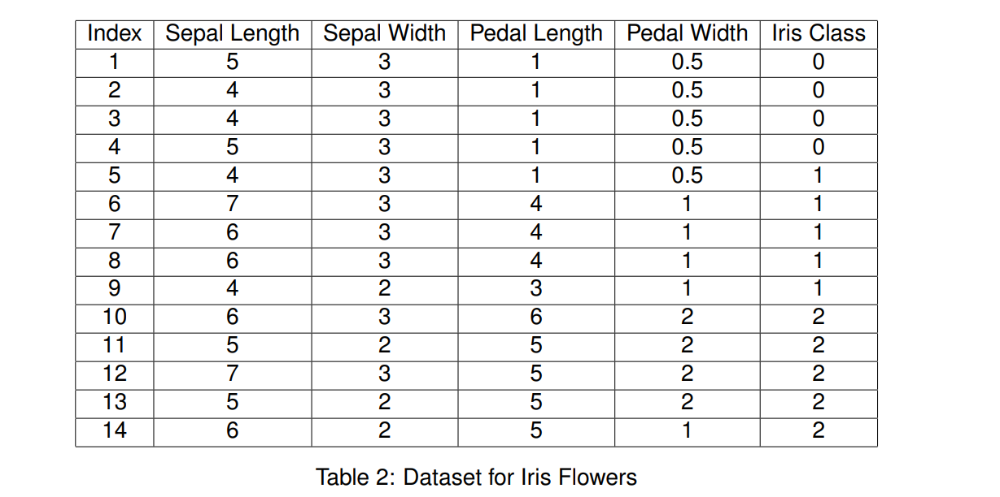


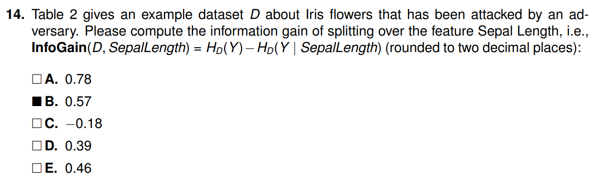


这个问题要求计算特征 **Sepal Length**的**信息增益 (Information Gain)**。

信息增益的计算公式为：
$$
\text{InfoGain}(D, \text{SepalLength}) = H_D(Y) - H_D(Y \mid \text{SepalLength})
$$
我们需要通过以下三个步骤来完成计算：

### 第一步：计算数据集的总熵 $H_D(Y)$

在第 13 题中，我们已经确定了类别分布：

- **总样本数 ($N$):** 14
- **类别 0:** 4 个
- **类别 1:** 5 个
- **类别 2:** 5 个

计算熵（目标的熵）：
$$
H_D(Y) = - \left( \frac{4}{14} \log_2 \frac{4}{14} + \frac{5}{14} \log_2 \frac{5}{14} + \frac{5}{14} \log_2 \frac{5}{14} \right) \approx \mathbf{1.577} \text{ bits}
$$


### 第二步：计算条件熵 $H_D(Y \mid \text{SepalLength})$

我们需要统计 **Sepal Length** （条件）每一个取值下，**Iris Class** （目标）的分布情况：

1. **Sepal Length = 4**: (索引 2, 3, 5, 9)
   - 类别分布：2个 Class 0，2个 Class 1。
   - 该子集熵：$- (0.5 \log_2 0.5 + 0.5 \log_2 0.5) = \mathbf{1.0}$
2. **Sepal Length = 5**: (索引 1, 4, 11, 13)
   - 类别分布：2个 Class 0，2个 Class 2。
   - 该子集熵：$- (0.5 \log_2 0.5 + 0.5 \log_2 0.5) = \mathbf{1.0}$
3. **Sepal Length = 6**: (索引 7, 8, 10, 14)
   - 类别分布：2个 Class 1，2个 Class 2。
   - 该子集熵：$- (0.5 \log_2 0.5 + 0.5 \log_2 0.5) = \mathbf{1.0}$
4. **Sepal Length = 7**: (索引 6, 12)
   - 类别分布：1个 Class 1，1个 Class 2。
   - 该子集熵：$- (0.5 \log_2 0.5 + 0.5 \log_2 0.5) = \mathbf{1.0}$

计算加权条件熵：

由于所有子集的熵都是 $1.0$，其加权平均值也必然是 $1.0$：
$$
H_D(Y \mid \text{SepalLength}) = \frac{4}{14}(1.0) + \frac{4}{14}(1.0) + \frac{4}{14}(1.0) + \frac{2}{14}(1.0) = \mathbf{1.0}
$$


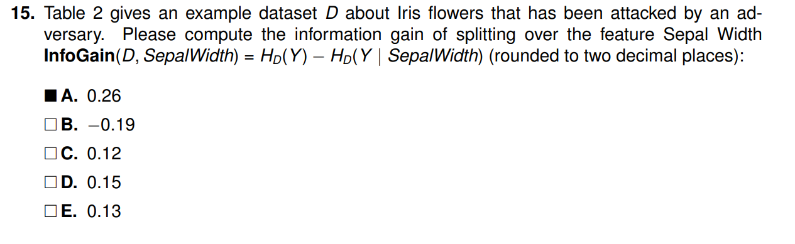

首先，统计整个数据集中各类别（Iris Class）的数量。总样本数 $N = 14$。（之前计算过了）

- **Class 0**: 4 个样本 (索引 1, 2, 3, 4)
- **Class 1**: 5 个样本 (索引 5, 6, 7, 8, 9)
- **Class 2**: 5 个样本 (索引 10, 11, 12, 13, 14)

$$
H_D(Y) = -\left( \frac{4}{14} \log_2 \frac{4}{14} + \frac{5}{14} \log_2 \frac{5}{14} + \frac{5}{14} \log_2 \frac{5}{14} \right)\approx \mathbf{1.577}
$$


特征 **Sepal Width** 有两个取值：**3** 和 **2**。

**情况 A: Sepal Width = 3**

共有 10 个样本 (索引 1, 2, 3, 4, 5, 6, 7, 8, 10, 12)。

- Class 0: 4 个
- Class 1: 4 个
- Class 2: 2 个

$$
H(D_{SW=3}) = -\left( \frac{4}{10} \log_2 0.4 + \frac{4}{10} \log_2 0.4 + \frac{2}{10} \log_2 0.2 \right) \approx \mathbf{1.522}
$$

**情况 B: Sepal Width = 2**

共有 4 个样本 (索引 9, 11, 13, 14)。

- Class 0: 0 个
- Class 1: 1 个 (索引 9)
- Class 2: 3 个 (索引 11, 13, 14)

$$
H(D_{SW=2}) = -\left( \frac{1}{4} \log_2 0.25 + \frac{3}{4} \log_2 0.75 \right) \approx \mathbf{0.811}
$$

**然后情况A、B加权**
$$
H_D(Y | SepalWidth) = \frac{10}{14} \cdot 1.522 + \frac{4}{14} \cdot 0.811 \approx 1.087 + 0.232 = \mathbf{1.319}
$$
**计算信息增益 (InfoGain)**
$$
InfoGain = H_D(Y) - H_D(Y | SepalWidth)\\\\InfoGain = 1.577 - 1.319 = \mathbf{0.258}
$$
取两位小数，结果为 **0.26**。


## [11] knn分类

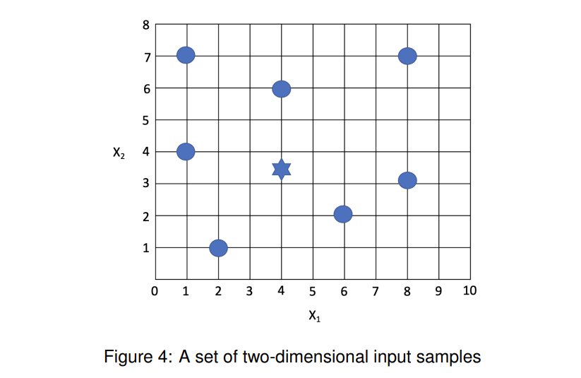


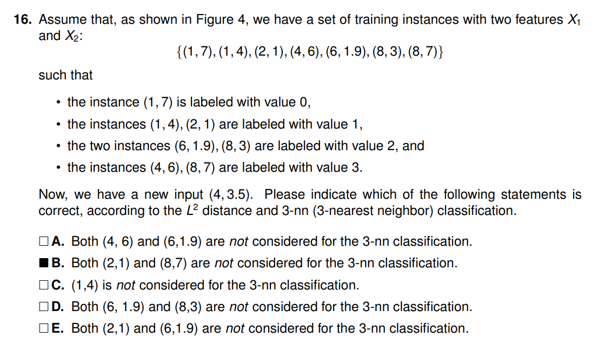


$L_2$ 也即 $||x||_2 = (\sum_i|x_i|^2)^{\frac12}$ ，是欧几里德距离

新输入点（图中星号）为 $Q(4, 3.5)$。我们计算它到所有训练点的距离平方：

| **训练点** | **计算过程 **                                        | **距离平方**     |
| ---------- | ---------------------------------------------------- | ---------------- |
| $(4, 6)$   | $(4-4)^2 + (6-3.5)^2 = 0^2 + 2.5^2$                  | **6.25** (第1近) |
| $(6, 1.9)$ | $(6-4)^2 + (1.9-3.5)^2 = 2^2 + (-1.6)^2 = 4 + 2.56$  | **6.56** (第2近) |
| $(1, 4)$   | $(1-4)^2 + (4-3.5)^2 = (-3)^2 + 0.5^2 = 9 + 0.25$    | **9.25** (第3近) |
| $(2, 1)$   | $(2-4)^2 + (1-3.5)^2 = (-2)^2 + (-2.5)^2 = 4 + 6.25$ | 10.25            |
| $(8, 3)$   | $(8-4)^2 + (3-3.5)^2 = 4^2 + (-0.5)^2 = 16 + 0.25$   | 16.25            |
| $(1, 7)$   | $(1-4)^2 + (7-3.5)^2 = (-3)^2 + 3.5^2 = 9 + 12.25$   | 21.25            |
| $(8, 7)$   | $(8-4)^2 + (7-3.5)^2 = 4^2 + 3.5^2 = 16 + 12.25$     | 28.25            |

> [!CAUTION]
>
> KNN，近邻，就是**==选择最小的（Min）==** 这样才是离自己最近的，而不是最大的


根据上面的计算结果，距离最近的三个点分别是：

1. **$(4, 6)$**
2. **$(6, 1.9)$**
3. **$(1, 4)$**

这三个点会被用于 3-nn 分类。 其余的点（如 $(2, 1), (8, 3), (1, 7), (8, 7)$）**不被考虑**。


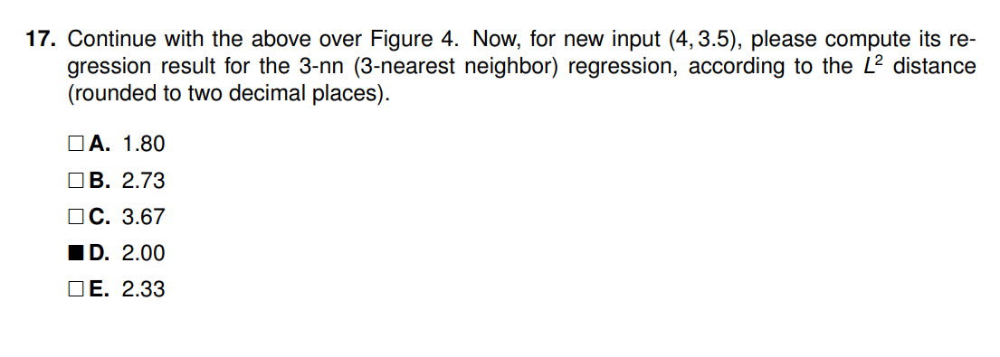

这个问题要求我们计算新输入点 $(4, 3.5)$ 的 **3-nn回归** 结果。

根据 $L^2$ 距离计算，最近的三个点分别是：

- **点 $(4, 6)$**：标签值为 **3**。
- **点 $(6, 1.9)$**：标签值为 **2**。
- **点 $(1, 4)$**：标签值为 **1**。

**3-nn** 回归的结果即为这三个点**==标签值==**的**算术平均数**：
$$
\text{回归结果} = \frac{3 + 2 + 1}{3}= 2.00
$$

> [!CAUTION]
>
> 注意！这里是标签值不是距离！！

## [12] 数据集划分（训练集、验证集、测试集）

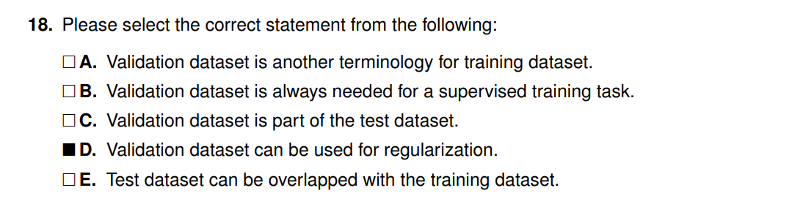

**18. 请从以下选项中选择正确的陈述：**

- **A.** 验证数据集是训练数据集的另一种术语。

  > #### 错误：验证集 $\neq$ ==训练集==
  >
  > - **==训练集==**是用来更新模型的权重和参数的。
  > - **验证集**是用来在训练过程中评估模型表现，从而调整**超参数**（如学习率、层数等）的。它们的功能完全不同。

- **B.** 监督学习任务总是需要验证数据集。

  > #### 错误：“总是”过于绝对
  >
  > 虽然在实践中为了防止过拟合，使用验证集是最佳做法，但从技术上讲，你可以在没有验证集的情况下完成监督学习任务（例如通过交叉验证，或者直接训练到底）。“总是”这个词在考试中通常意味着该表述不准确。

- **C.** 验证数据集是测试数据集的一部分。

  > #### 错误：它们应该是互斥的
  >
  > 验证集和测试集必须是独立的。
  >
  > - **验证集**用于模型选择和调优。
  > - **测试集**仅用于最终评估模型的泛化能力。如果它们有重叠，测试结果就会偏差，不能反映模型在真实未知数据上的表现。

- **D. 验证数据集可用于正则化（Regularization）。**

  > #### 正确：用于正则化（例如“提前停止”）
  >
  > 正则化是防止过拟合的
  >
  > 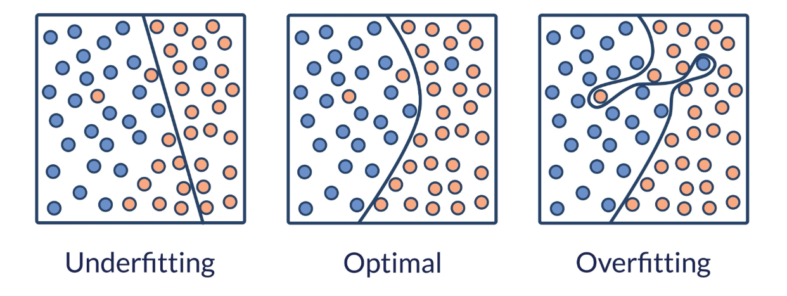
  >
  > 验证数据集在正则化中起着关键作用。最典型的例子是 **提前停止（Early Stopping）**：
  >
  > - 在训练过程中，我们会监控模型在验证集上的误差。
  > - 当模型在训练集上的误差继续下降，但在**验证集**上的误差开始上升时，说明模型开始过拟合了。
  > - 此时我们会停止训练。这种利用验证集来防止过拟合的技术就是一种**正则化**策略。

- **E.** 测试数据集可以与训练数据集重叠。

  > #### 错误：绝不能重叠
  >
  > 如果测试集包含训练数据，模型就会通过“死记硬背”获得高分。这被称为**数据泄露（Data Leakage）**，会导致评估结果完全失去意义。


总结：**Validation Set（验证集）对监督学习**不是必要的**，他通常是用于调整模型层和防止过拟合等作用的，它可以用来做正则化（提前早停防止过拟合），三个集合都不允许重叠！**


| **数据集类型**          | **主要作用**                             | **是否参与权重更新** |
| ----------------------- | ---------------------------------------- | -------------------- |
| **训练集 (Training)**   | 拟合模型，学习参数                       | 是                   |
| **验证集 (Validation)** | 调整超参数，进行**正则化**（防止过拟合） | 否                   |
| **测试集 (Test)**       | 评估最终的泛化能力                       | 否                   |

> 训练集：用于Epoch、Batch训练的集合，因此叫做Training Set
>
> 验证集：**验证集**用于模型选择和调优。比如模型训练完，拿出模型**没见过的**验证正确率，来确定神经网络层数等等，因此叫做 Validation Set
>
> **测试集 Test Set绝对不能参与训练和调优。** 如果你根据测试集的结果去修改模型模型，那么测试集也就变成了验证集，你得到的结果就不再客观，无法反映模型在现实世界中的真实表现。


## [13] 混淆矩阵

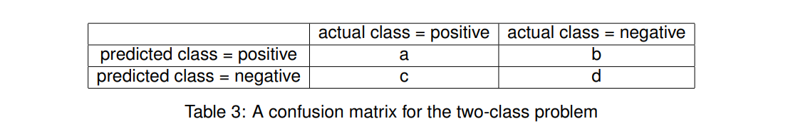

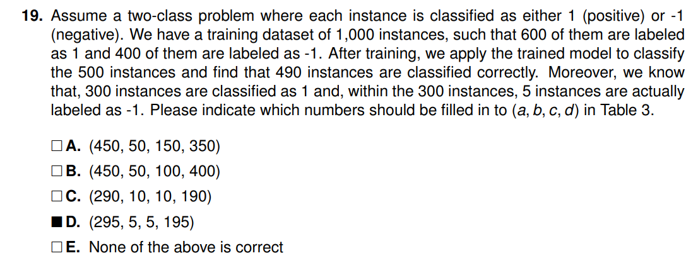


1000 个数据：600 标记为 `1`，400被标记为`-1`

训练后，我们试图分类500个数据：

- 490个数据正确
- 10各数据错误

此外，这500个数据中

- 300个分类为`1`（也即200个被分类为`-1`）
  - 在300个分类中：其中5个标签实际上是`-1`

推出200个分类中错误的有10-5=5个，也就是200个`-1`中实际上有5个标签是`1`

- a = 预测为1实际为1，一共有295个
- b = 预测为1实际为-1，一共有5个
- c = 预测为-1实际为1，一共有5个
- d = 预测为-1实际为-1,一共有195个


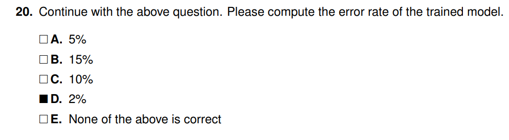
$$
\begin{aligned}
\text{Error Rate} &= \dfrac{\text{错误样本数}}{\text{总样本数}} \times 100\% \\\\
\text{Error Rate} &= \dfrac{10}{500} = \dfrac{2}{100} = 2\%
\end{aligned}
$$


## [14] 线性回归

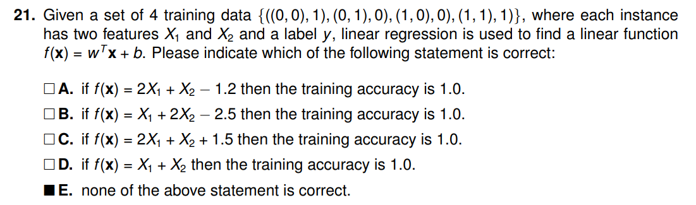

我们将题目给出的 4 个训练样本列出来：

- 样本 1: $(0, 0)$，标签 $y = 1$
- 样本 2: $(0, 1)$，标签 $y = 0$
- 样本 3: $(1, 0)$，标签 $y = 0$
- 样本 4: $(1, 1)$，标签 $y = 1$

显然，对于选项A-D，我们带入点 $(X_1,X_2)$ 发现他们都无法做到准确率 100%

> 由于该数据集在本质上是线性不可分的，任何线性函数 $f(\mathbf{x}) = w_1X_1 + w_2X_2 + b$ 都无法达到 1.0 的准确率。


> [!CAUTION]
>
> 如果 $f(\mathbf{x}) > 0$，预测类别为 **1**。
>
> 如果 $f(\mathbf{x}) \color{red}\mathbf{\le} \color{black} 0$，预测类别为 **0**。小于等于！


A. 代入（0，0） 错误

B. 代入（0，0） 错误

C. 代入（0，1） 错误

D. 代入（0，1） 错误


## [15] 梯度

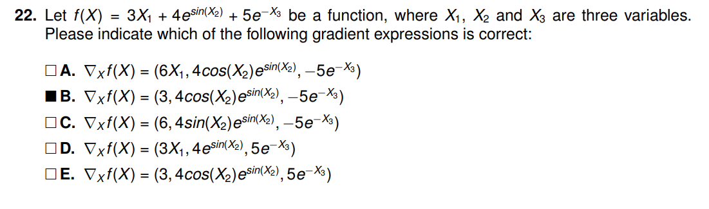

分别对不同项求偏导即可。
$$
\nabla_X f(X) = \left( \frac{\partial f}{\partial X_1}, \frac{\partial f}{\partial X_2}, \frac{\partial f}{\partial X_3} \right)
$$


| **序号** | **函数形式**              | **导数公式**                              |
| -------- | ------------------------- | ----------------------------------------- |
| (1)      | 常数 $C$                  | $(C)' = 0$                                |
| (2)      | 幂函数 $x^\mu$            | $(x^\mu)' = \mu x^{\mu-1}$                |
| (3)      | 正弦函数 $\sin x$         | $(\sin x)' = \cos x$                      |
| (4)      | 余弦函数 $\cos x$         | $(\cos x)' = -\sin x$                     |
| (5)      | 正切函数 $\tan x$         | $(\tan x)' = \sec^2 x$                    |
| (6)      | 余切函数 $\cot x$         | $(\cot x)' = -\csc^2 x$                   |
| (7)      | 正割函数 $\sec x$         | $(\sec x)' = \sec x \tan x$               |
| (8)      | 余割函数 $\csc x$         | $(\csc x)' = -\csc x \cot x$              |
| (9)      | 指数函数 $a^x$            | $(a^x)' = a^x \ln a$                      |
| (10)     | 指数函数 $e^x$            | $(e^x)' = e^x$                            |
| (11)     | 对数函数 $\log_a x$       | $(\log_a x)' = \dfrac{1}{x \ln a}$        |
| (12)     | 自然对数 $\ln x$          | $(\ln x)' = \dfrac{1}{x}$                 |
| (13)     | 反正弦 $\arcsin x$        | $(\arcsin x)' = \dfrac{1}{\sqrt{1-x^2}}$  |
| (14)     | 反余弦 $\arccos x$        | $(\arccos x)' = -\dfrac{1}{\sqrt{1-x^2}}$ |
| (15)     | 反正切 $\arctan x$        | $(\arctan x)' = \dfrac{1}{1+x^2}$         |
| (16)     | 反余切 $\text{arccot } x$ | $(\text{arccot } x)' = -\dfrac{1}{1+x^2}$ |


## [16] 朴素贝叶斯

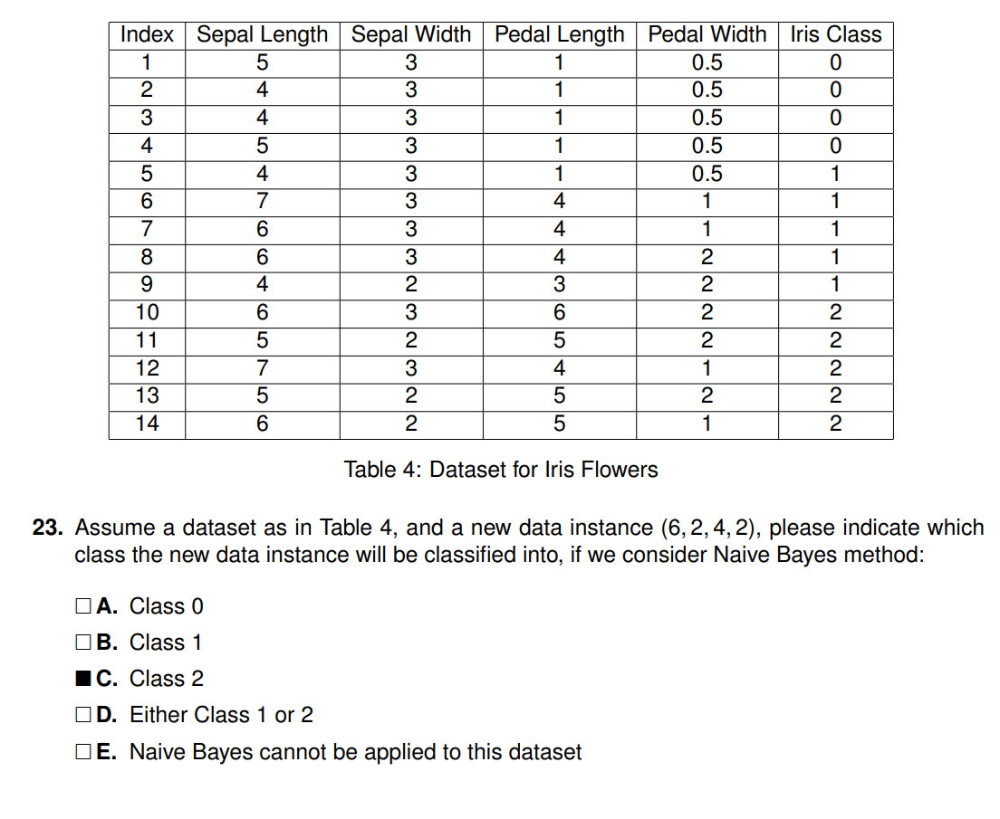

这个问题要求我们根据表4中的数据，使用**朴素贝叶斯（Naive Bayes）**方法对新样本 $X = (6, 2, 4, 2)$ 进行分类。
$$
Score(C_i) = P(C_i) \times P(x_1|C_i) \times P(x_2|C_i) \times P(x_3|C_i) \times P(x_4|C_i)
$$

### 计算先验概率 $P(C_i)$

数据集中共有 **14** 条记录：

- **Class 0**: 共有 4 条记录（Index 1-4）。$P(C_0) = \dfrac{4}{14}$
- **Class 1**: 共有 5 条记录（Index 5-9）。$P(C_1) = \dfrac{5}{14}$
- **Class 2**: 共有 5 条记录（Index 10-14）。$P(C_2) = \dfrac{5}{14}$

### 计算条件概率

针对新样本 $X = (6, 2, 4, 2)$

对于 Class 0：

- 对于 Class 0 ，（6，2，4，2）分别对应在 Class 0 的对应列都找不到
- **结论**：$Score(C_ 0) = 0$。

对于 Class 1 (Index 5-9)：

- $P(x_1=6 | C_1)$：记录 7, 8 的 Sepal Length 是 6。概率 = $\dfrac{2}{5}$
- $P(x_2=2 | C_1)$：记录 9 的 Sepal Width 是 2。概率 = $\dfrac{1}{5}$
- $P(x_3=4 | C_1)$：记录 6, 7, 8 的 Pedal Length 是 4。概率 = $\dfrac{3}{5}$
- $P(x_4=2 | C_1)$：记录 8, 9 的 Pedal Width 是 2。概率 = $\dfrac{2}{5}$

$$
\begin{aligned}
Score(C_1) &= P(C_1) \times P(x_1|C_1) \times P(x_2|C_1) \times P(x_3|C_1) \times P(x_4|C_1)\\
&= \dfrac{5}{14} \times \dfrac{2}{5} \times \dfrac{1}{5} \times \dfrac{3}{5} \times \dfrac{2}{5}\\ 
&= \dfrac{60}{14 \times 625}
\end{aligned}
$$


对于 Class 2 (Index 10-14)：

- $P(x_1=6 | C_2)$：记录 10, 14 的 Sepal Length 是 6。概率 = $\dfrac{2}{5}$
- $P(x_2=2 | C_2)$：记录 11, 13, 14 的 Sepal Width 是 2。概率 = $\dfrac{3}{5}$
- $P(x_3=4 | C_2)$：记录 12 的 Pedal Length 是 4。概率 = $\dfrac{1}{5}$
- $P(x_4=2 | C_2)$：记录 10, 11, 13 的 Pedal Width 是 2。概率 = $\dfrac{3}{5}$

$$
\begin{aligned}
Score(C_2) &= P(C_2) \times P(x_1=6|C_2) \times P(x_2=2|C_2) \times P(x_3=4|C_2) \times P(x_4=2|C_2)\\
&= \dfrac{5}{14} \times \dfrac{2}{5} \times \dfrac{3}{5} \times \dfrac{1}{5} \times \dfrac{3}{5}\\ 
&= \dfrac{90}{14 \times 625}
\end{aligned}
$$


由于 $Score(C_2) > Score(C_1)$（且 $Score(C_0) = 0$），该样本将被分类到 **Class 2**。 正确选项为 **C**。


## [17] ReLU/ Sigmoid 感知机

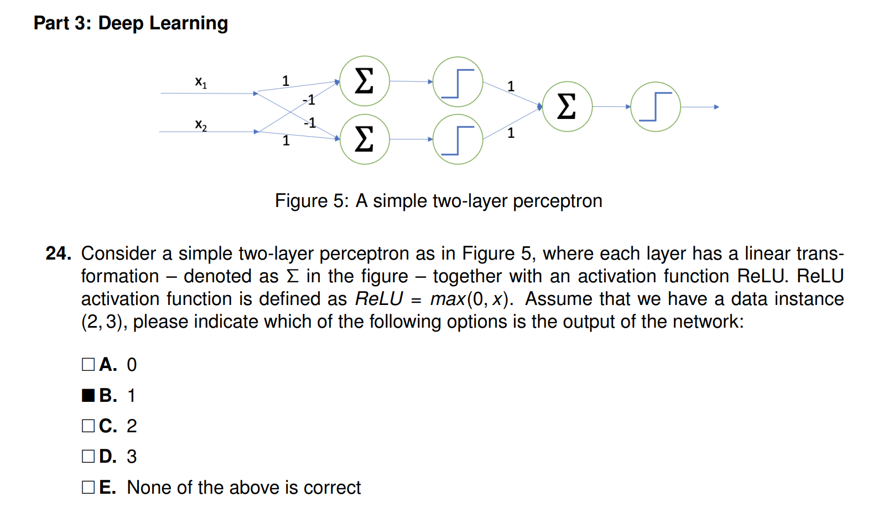

这张图展示了一个简单的两层**感知机（Perceptron）**的前向传播计算过程。我们需要根据给定的输入 $(x_1, x_2) = (2, 3)$ 和 ReLU 激活函数来计算最终的输出。

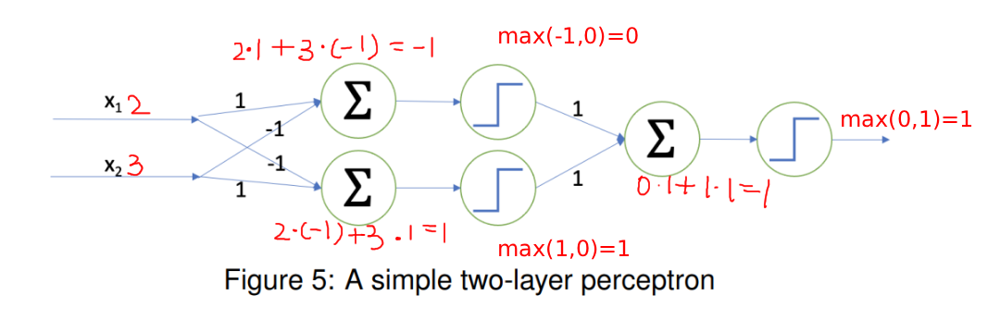


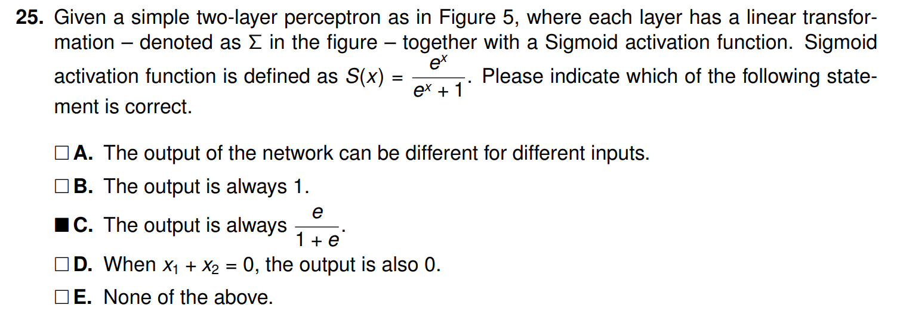

> Sigmoid 如下：
>
> 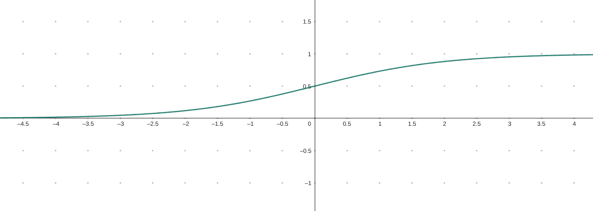


> [!CAUTION]
>
> Sigmoid 函数特性就是：
>
> - Sigmoid 函数最大值不会超过1（不论x多大）
> - Sigmoid 函数有一个非常重要的数学特性：$S(x) + S(-x) = 1$

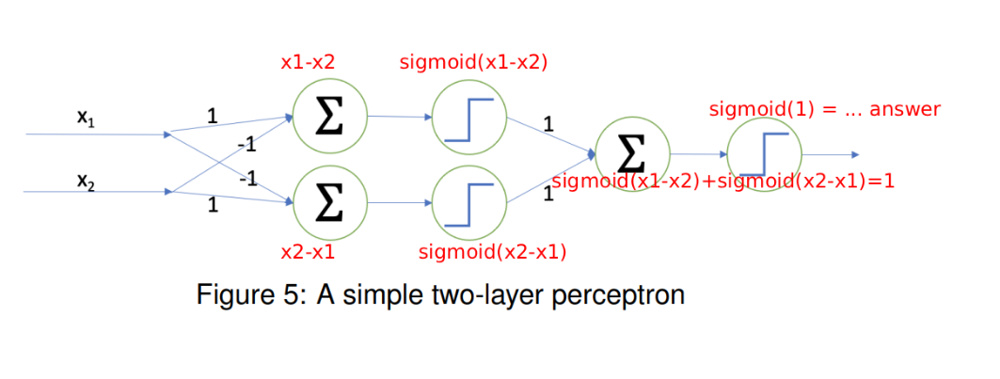

## [18] 正误判断

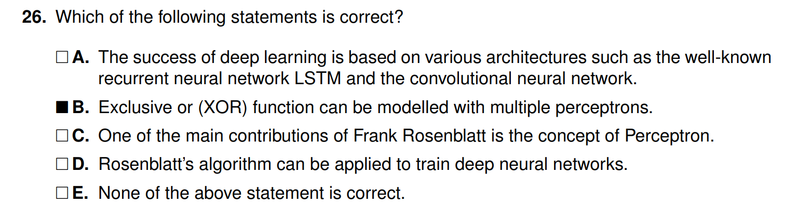

**26. 下列哪项陈述是正确的？**

- **A.** 深度学习的成功是基于各种架构，如著名的循环神经网络 LSTM 和卷积神经网络（CNN）。

  > **状态：正确。**
  >
  > **解析：** 卷积神经网络（CNN）在计算机视觉领域取得了巨大成功，而长短期记忆网络（LSTM，一种特殊的 RNN）在处理序列数据（如语音和文本）方面曾是标准架构。这两者确实是深度学习崛起的基石。

- **B.** 异或（XOR）函数可以通过多个感知机来建模。

  > **状态：正确（这是 AI 历史上的关键点）。**
  >
  > **解析：** 单层感知机只能处理“线性可分”的问题。异或（XOR）逻辑在坐标系中是线性不可分的（你无法用一条直线把结果为 0 和 1 的点分开）。马文·明斯基曾在 60 年代指出这一局限，导致了 AI 的第一个寒冬。解决办法就是使用**多个感知机**（即组合成隐藏层），通过多层结构来实现非线性分类。

- **C.** Frank Rosenblatt 的主要贡献之一是提出了“感知机”的概念。

  > **状态：正确。**
  >
  > **解析：** 1958 年，康奈尔大学的 Frank Rosenblatt 发明了感知机。这是现代神经网络的鼻祖，也是第一个可以从数据中学习权重的算法模型。

- **D.** Rosenblatt 的算法可以被应用于训练深度神经网络。

  > **状态：错误。**
  >
  > **解析：** Rosenblatt 原始的感知机学习算法只能训练单层网络。深度神经网络需要通过**反向传播（Backpropagation）算法**结合梯度下降来训练。感知机使用的阶跃函数不可导，无法直接用于深度学习的误差传递。

- **E.** 以上陈述皆不正确。


> 实际上这一题选择ABC？


## [19] 梯度计算

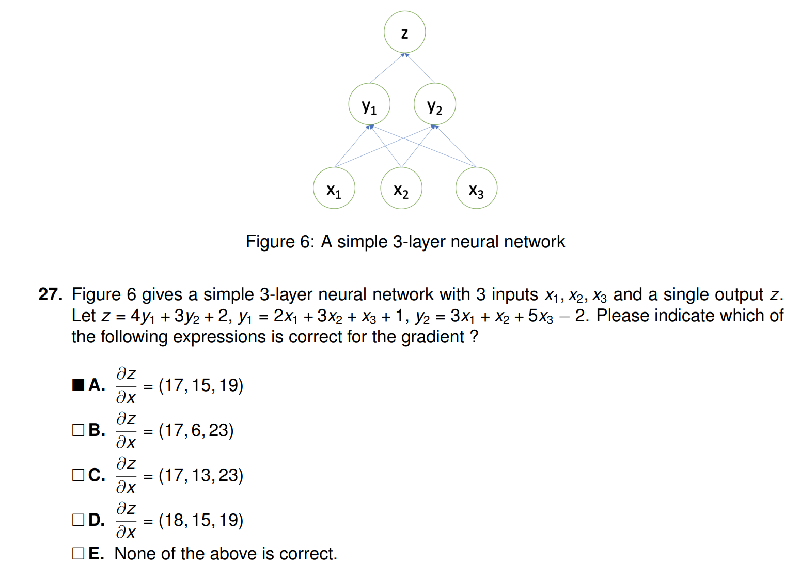


**已知公式：**

- $z = 4y_1 + 3y_2 + 2$
- $y_1 = 2x_1 + 3x_2 + x_3 + 1$
- $y_2 = 3x_1 + x_2 + 5x_3 - 2$


$$
\begin{aligned}
z&= 4(2x_1 + 3x_2 + x_3 + 1) + 3(3x_1 + x_2 + 5x_3 - 2) + 2\\
&= (8x_1 + 12x_2 + 4x_3 + 4) + (9x_1 + 3x_2 + 15x_3 - 6) + 2\\
&=17x_1 + 15x_2 + 19x_3 + 0
\end{aligned}
$$

> 实际上是链式法则，但是直接替换更方便。
>
> 这道题目考察的是**神经网络中的梯度计算**，本质上是多元函数的链式法则应用。


## [20] CNN

### 零填充 P>0

这是一道关于卷积神经网络（CNN）中**卷积输出尺寸计算**的题目

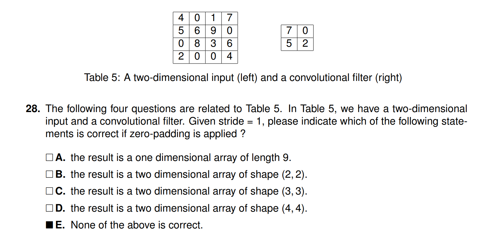

根据题目图表和文字描述，我们可以得到以下参数：

- **输入图像尺寸 (Input size, $N$):** $4 \times 4$
- **卷积核尺寸 (Convolutional Filter size, $F$):** $2 \times 2$
- **步长 (Stride, $S$):** $1$
- **零填充 (Zero-padding, $P$):** 题目提到应用了零填充，但未给出具体数值。

卷积后输出特征图尺寸的通用公式为：
$$
O = \frac{W - F + 2P}{S} + 1
$$
其中：

- $W$ 是输入尺寸
- $F$ 是卷积核尺寸
- $P$ 是填充层数（通常指在四周各填充几层 0）
- $S$ 是步长

> **No Padding (Valid Padding):** 对应 $P = 0$。即不对原始输入进行任何填充，卷积核只在图像内部移动。
>
> **Zero-padding:** ==对应 $P > 0$（通常为 $P=1, 2...$）。==它是指在图像边缘外围包裹一层或多层数值为 **0** 的像素点。

我们将不同的填充情况代入公式进行验证：

1. 情况 1：如果不填充 ($P = 0$) —— 这被称为 "Valid Padding"
   $$
   O = \frac{4 - 2 + 0}{1} + 1 = 3
   $$
   输出形状为 $(3, 3)$。这对应选项 C，**但题目明确说应用了零填充（$P> 0$）**，所以 C 错误。

2. 情况 2：如果填充 1 层 0 ($P = 1$) —— **这是最常见的零填充方式**
   $$
   O = \frac{4 - 2 + 2(1)}{1} + 1 = 5
   $$
   输出形状为 $(5, 5)$。该结果不在选项 A、B、C、D 中。


### P=0


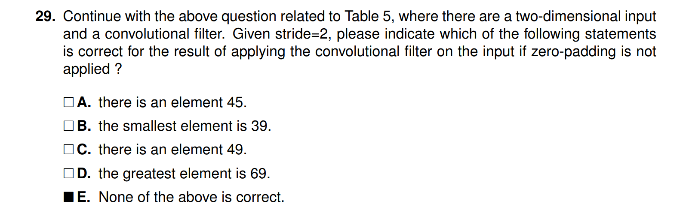

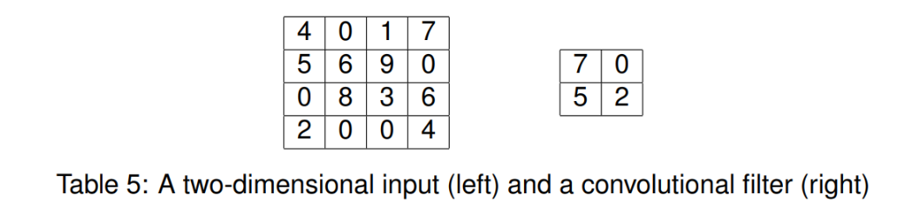

题目这里说了如果不使用 Zero-padding 也就是 $P=0$ 的情况下求结果最大元素

只需要进行卷积计算即可

```python
输出形状为: (2, 2)

位置 (0, 0) 的计算过程:
窗口:
[[4 0]
 [5 6]]
计算: (4*7 + 0*0 + 5*5 + 6*2) = 65

位置 (0, 1) 的计算过程:
窗口:
[[1 7]
 [9 0]]
计算: (1*7 + 7*0 + 9*5 + 0*2) = 52

位置 (1, 0) 的计算过程:
窗口:
[[0 8]
 [2 0]]
计算: (0*7 + 8*0 + 2*5 + 0*2) = 10

位置 (1, 1) 的计算过程:
窗口:
[[3 6]
 [0 4]]
计算: (3*7 + 6*0 + 0*5 + 4*2) = 29

最终计算结果矩阵:
[[65. 52.]
 [10. 29.]]
```


### 最大池化


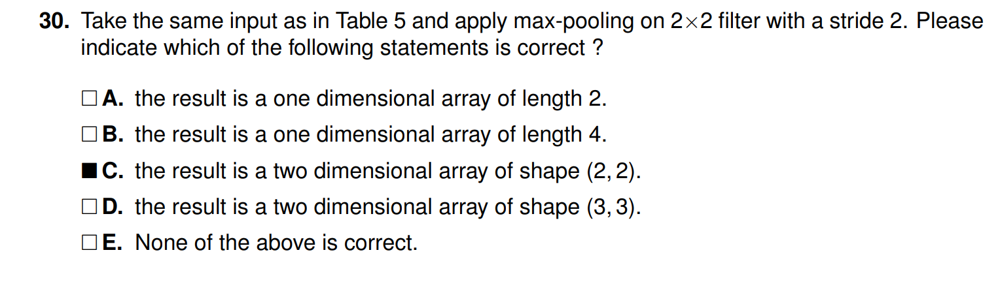

**最大池化（Max-pooling）**操作不涉及乘法，而是直接选取窗口内的**最大值**。步长为2

$P = 0$，这里要跳2步，因此

假设我们要对左上角的 $2 \times 2$ 窗口进行操作：

- 计算过程：$\max(4, 0, 5, 6) = \mathbf{6}$。 这里**没有任何乘法**，只是单纯的数值比较。
- 选择最大池化时，卷积核中的数值实际不参与计算

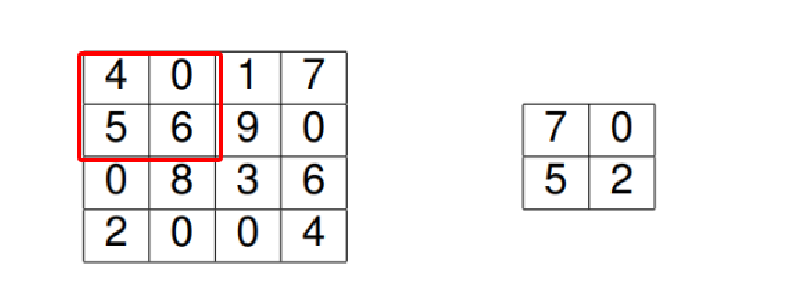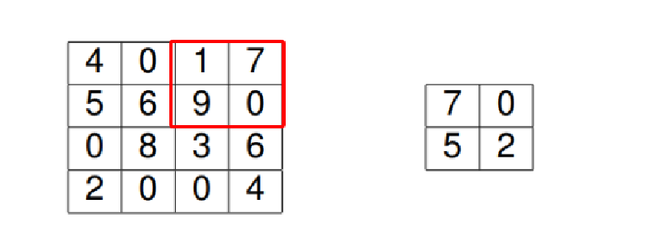


> stride = 2

### 计算最大池化

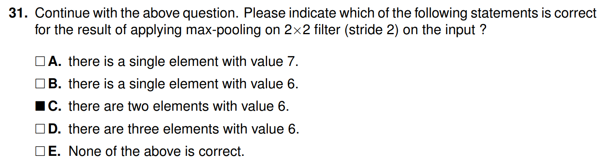

```python
[[6,9],
 [8,6]]
```


## [21] 特征和特征流形 (Feature Manifolds)

> **特征层级与端到端学习 (Feature Hierarchy & End-to-End)**
>
> 在深度学习（尤其是卷积神经网络 CNN）中，模型不是一次性识别出物体的，而是像“叠罗汉”一样分层理解：
>
> - **初始模块（底层）：** 识别简单的几何元素，如**线条、边缘、斑点**。
> - **中间模块（中层）：** 将线条组合成**形状或局部零件**（如眼睛、轮子）。
> - **最后模块（高层）：** 将零件组合成完整的**复杂概念或类别**（如人脸、汽车）。
> - **端到端学习 (End-to-End)：** 指的是你只需要给模型输入（原图）和输出（标签），中间这些特征层级是模型**自动学习**出来的，不需要人工去设计特征。
>
> **什么是流形 (Manifold) ？** 想象一张平整的 A4 纸。它是 **2 维**的。如果你把它揉成一个纸球，它在空间中看起来是一个 **3 维**物体，但本质上它仍然是一张 2 维的纸。 在机器学习中，**流形**就是指高维空间中这种“被扭曲的低维结构”。
>
> **流形假设 (Manifold Hypothesis)：** 该假设认为：现实世界中的高维数据（如 100 万个像素组成的图像）其实都分布在一个**极低维度的流形**上。
>
> > **例子：** 虽然人脸图像有几万个像素，但决定一张脸变化的其实只有几个变量：头转动的角度、光照、表情。这些变量构成的低维空间就是“人脸流形”。
>
> **特征流形是“非线性”的 (Non-linear)**
>
> 如果数据流形是线性的，我们用最简单的线性回归就能解决。正是因为现实数据（图像、语言）的流形是**高度卷曲、非线性**的，我们才需要神经网络这种强大的“非线性函数”来把这个流形“拉平”或“展开”。
>
> **降维技术：PCA 与 t-SNE**
>
> **PCA (主成分分析)：** 一种**线性**降维方法。保证数据尽可能多特征的同时降维。
>
> **t-SNE：** 一种著名的**非线性**降维方法。它能很好地保持数据在局部上的距离，常用于可视化。但它计算量很大，且在处理极其复杂的数据分布时也会失效（如选项 C 所述）。

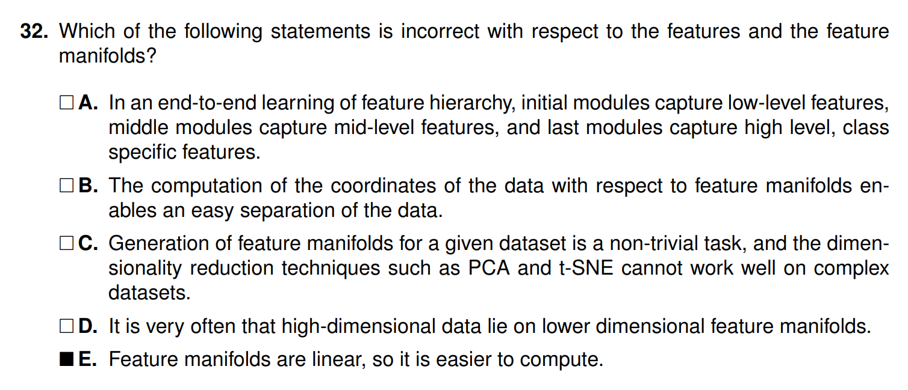

**关于特征和特征流形，下列哪项描述是错误的？**

- **A.** 在特征层级的端到端学习中，初始模块捕捉低级特征，中间模块捕捉中级特征，最后的模块捕捉高级的、类别特定的特征。

  > 这是深度学习（尤其是卷积神经网络 CNN）的核心原理。底层（靠近输入）学习边缘、纹理等基础特征；高层（靠近输出）学习复杂的对象部件或具体的类别特征。

- **B.** 计算数据相对于特征流形的坐标，可以使数据更容易被分离（分类）。

  > 特征流形学习的目标就是找到数据的“内在坐标”。一旦我们展开了扭曲的流形，原本在原始高维空间中线性不可分的数据，在流形坐标系下往往变得线性可分。

- **C.** 为给定数据集生成特征流形是一项非平凡的（复杂的）任务，且 PCA 和 t-SNE 等降维技术在处理复杂数据集时可能效果不佳。

  > 流形学习确实很难。**PCA** 是线性降维，无法处理弯曲的结构；**t-SNE** 虽然是非线性的，但在处理极大规模或极高复杂度的数据时，存在计算开销大、难以保持全局结构等局限性。

- **D.** 高维数据通常分布在较低维度的特征流形上。

  > 这就是著名的**流形假设 (Manifold Hypothesis)**。例如，一张 $256 \times 256$ 的彩色图片虽然有数十万个像素维度，但如果图片内容是“人脸”，其变化其实只受控于几十个参数（姿态、表情、光照等），因此它存在于一个极低维的流形上。

- **E.** 特征流形是线性的，因此更容易计算。

  > **非线性 (Non-linearity)：** 在现实世界的复杂数据（如图像、语音）中，特征流形几乎总是**非线性**的。如果流形是线性的，那么它就是一个简单的线性子空间，我们直接用线性代数就能解决。流形学习的核心意义就在于处理那些“扭曲”、“弯曲”在高维空间里的低维结构（例如经典的“瑞士卷”数据）。
  >
  > **局部线性 vs 全局非线性：** 流形的定义是在局部看起来像欧几里得空间（线性的），但在全局范围内通常是高度非线性的。


## [22] 概率图模型概念

Probabilistic Graphical Models

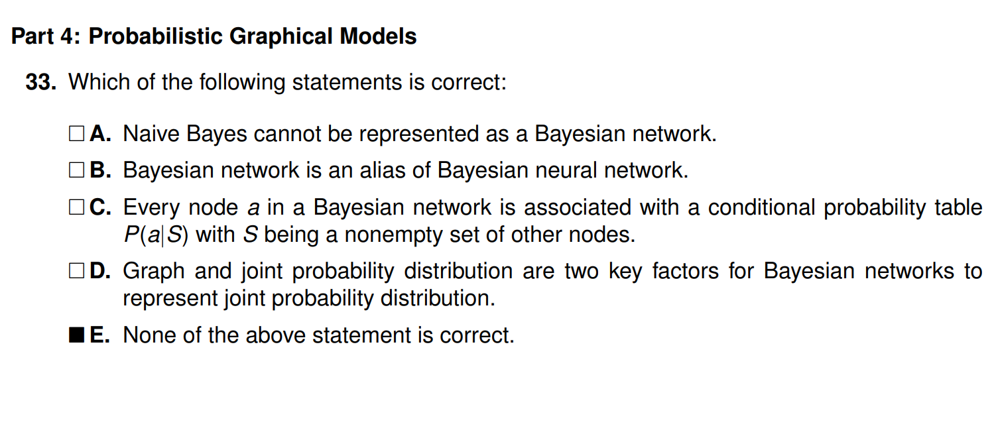

**以下哪项陈述是正确的：**

- **A.** 朴素贝叶斯（Naive Bayes）不能被表示为贝叶斯网络。

  > 错误！朴素贝叶斯**可以**被视为一种最简单的贝叶斯网络。
  >
  > 在朴素贝叶斯的图结构中，有一个中心节点（类别变量）作为父节点，所有的特征变量作为其子节点，且子节点之间在给定父节点的情况下是条件独立的。

- **B.** **贝叶斯网络（Bayesian network）是贝叶斯神经网络（Bayesian neural network）的别名。** （2020/2021又考了，不过换为了NOT）

  > 错误！
  >
  > - **贝叶斯网络**是一种概率图模型，用于表示变量间的因果/依赖关系。
  > - **贝叶斯神经网络**是指在人工神经网络中引入贝叶斯推断，将权重视为分布而非固定值。它们的研究领域和应用场景不同。
  >   - 贝叶斯网络（Bayesian network）**不是**贝叶斯神经网络（Bayesian neural network）的别名。

- **C.** 贝叶斯网络中的每个节点 $a$ 都与一个条件概率表 $P(a|S)$ 相关联，其中 $S$ 是其他节点的**非空**集合。

  > 虽然贝叶斯网络中的节点通常与条件概率表（CPT）相关联，但并非所有节点的父节点集合 $S$ 都是“非空”的。
  >
  > - **根节点（Root nodes）**没有父节点，因此它们的 $S$ 是空集。根节点关联的是先验概率 $P(a)$，而不是基于其他节点的条件概率。

- **D.** 图和联合概率分布是贝叶斯网络表示联合概率分布的两个关键因素。

  > 这句话的逻辑存在误导。贝叶斯网络确实使用**图（Graph）**结构，但它用来表示联合概率分布的另一个关键因素是**局部条件概率分布/表（Conditional Probability Tables, CPTs）**。
  >
  > - 贝叶斯网络的作用是利用结构和参数（CPTs）来**分解**联合概率分布，而不是用“联合概率分布”来“表示联合概率分布”（这在逻辑上是循环定义的）。

- **E.** 以上陈述均不正确。


## [23] 概率图模型联合概率

这个问题考察的是**概率图模型（Probabilistic Graphical Model）**中的联合概率分布计算。

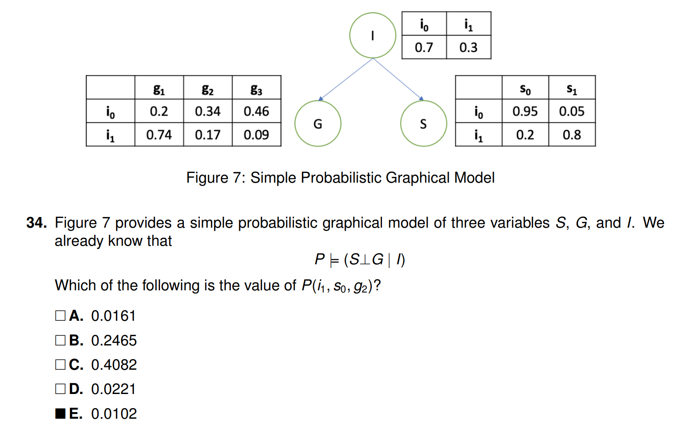

在这个贝叶斯网络中，变量 $I$ 是父节点，而 $G$ 和 $S$ 是它的子节点。根据图结构，联合概率可以进行如下因式分解：
$$
P(I, G, S) = P(I) \cdot P(G|I) \cdot P(S|I)
$$

> 因为：
> $$
> P(X_1, X_2, \dots, X_n) = \prod_{i=1}^n P(X_i \mid \text{parents}(X_i))
> $$


题目要求计算的是 $P(i_1, s_0, g_2)$ 的值

**$P(I)$ 表：** 查找 $P(i_1)$，其值为 **$0.3$**。

**$P(G|I)$ 表：** 查找 $P(g_2 | i_1)$。在 $i_1$ 这一行，$g_2$ 对应的概率是 **$0.17$**。

**$P(S|I)$ 表：** 查找 $P(s_0 | i_1)$。在 $i_1$ 这一行，$s_0$ 对应的概率是 **$0.2$**。


带入：
$$
P(i_1, s_0, g_2) = 0.3 \times 0.2 \times 0.17=0.0102
$$


## [24] 独立断言

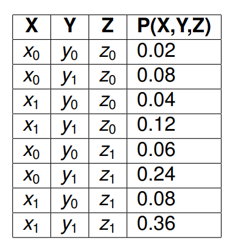

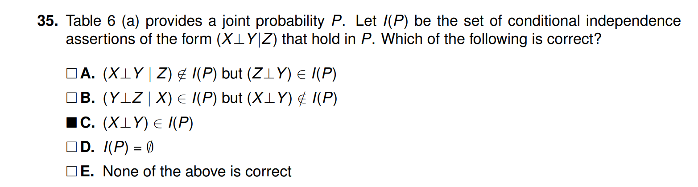

> $\perp$ 符号：独立性 (Independence)
> $$
> X \perp Y \iff P(X, Y) = P(X)P(Y)
> $$
> **$(X \perp Y) \in I(P)$** 的意思就是：“在分布 $P$ 中，$X$ 与 $Y$ 是独立的”这个命题是**成立的**。
>
> 反之，**$(X \perp Y) \notin I(P)$** 就表示在该分布中，$X$ 和 $Y$ 之间存在某种关联，独立性**不成立**。

> [!NOTE]
> $$
> \begin{aligned}
> 
> 
> (X \perp Y) \in I(P) &\iff P(X,Y)=P(X)\cdot P(Y)\\\\
> &\text{For every X and Y}\\\\\\
> 
> P(X, Y \mid Z) \in I(p) &\iff P(X,Y|Z)=P(X|Z)\cdot P(Y|Z)\\\\
> &\iff \dfrac{P(X,Y,Z)}{P(Z)} =\dfrac{P(X,Z)}{P(Z)}\dfrac{P(Y,Z)}{P(Z)} \\\\
> &\iff P(X,Y,Z)\cdot P(Z)=P(X,Z)\cdot P(Y,Z)\\\\
> &\text{For every X Y and Z}
> \end{aligned}
> $$

如何判断 $(X\perp Y) \in I(P)$ ？

要消除 $Z$ 的影响，求出 $X$ 和 $Y$ 的联合分布概率。即将 $Z=z_0$ 和 $Z=z_1$ 的对应项相加：

| **X** | **Y** | **计算过程**  | **P(X,Y)** |
| ----- | ----- | ------------- | ---------- |
| $x_0$ | $y_0$ | $0.02 + 0.06$ | **$0.08$** |
| $x_0$ | $y_1$ | $0.08 + 0.24$ | **$0.32$** |
| $x_1$ | $y_0$ | $0.03 + 0.09$ | **$0.12$** |
| $x_1$ | $y_1$ | $0.12 + 0.36$ | **$0.48$** |

也就是：

|       | $y_0$  | $y_1$  |
| ----- | ------ | ------ |
| $x_0$ | $0.08$ | $0.32$ |
| $x_1$ | $0.12$ | $0.48$ |

交叉相乘验证 $0.08\times0.48=0.32\times0.12$ ，因此他们是独立的！


如何判断 $(X\perp Y | Z) \in I(P)$？

我们只需要对于 $z_0$ 和 $z_1$ 分别裂开两个表格

 表格 $z_0$：

|       | $y_0$  | $y_1$  |
| ----- | ------ | ------ |
| $x_0$ | $0.02$ | $0.08$ |
| $x_1$ | $0.04$ | $0.12$ |

交叉相乘成立！

表格  $z_1$：

|       | $y_0$  | $y_1$  |
| ----- | ------ | ------ |
| $x_0$ | $0.06$ | $0.24$ |
| $x_1$ | $0.08$ | $0.36$ |

交叉相乘不成立！！因此不独立！也就是 $(X\perp Y | Z) \notin I(P)$

因此选择A

## [25] 独立断言2

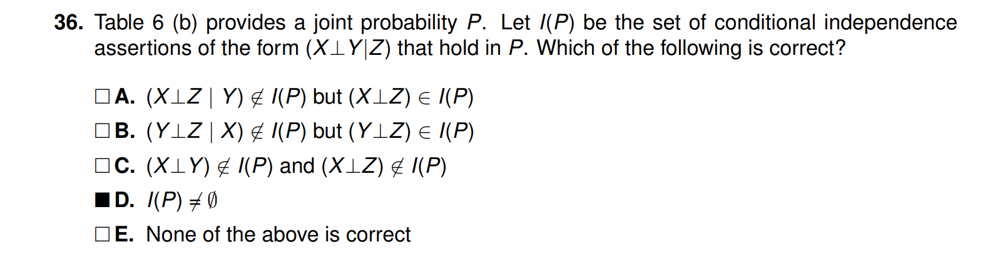

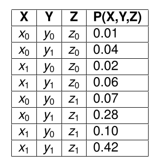

我们如果需要证明 $I(P)$ 是空集，就要证明下面6对都是**不独立的**

| **独立性断言**     | **符号表示**                                                 | **验证逻辑**           |
| ------------------ | ------------------------------------------------------------ | ---------------------- |
| **边缘独立 (3对)** | $(X \perp Y), (X \perp Z), (Y \perp Z)$                      | 检查全表的边缘分布     |
| **条件独立 (3对)** | $(X \perp Y \mid Z), (X \perp Z \mid Y), (Y \perp Z \mid X)$ | 检查给定某变量后的子表 |

利用24题的方法，可以练习一下！


## [26] 贝叶斯模型

知识点：

---

**什么是I-map？**

- 在贝叶斯网络中，我们使用 **d-分离（d-separation）** 规则来判断变量之间是否条件独立。
- 如果两个节点被 d-分离，那么它们在给定条件下是独立的，这种独立性关系属于 I-map。

### d-分离规则

> [!NOTE]
>
> ### https://www.youtube.com/watch?v=yDs_q6jKHb0

- **链式 (Chain) $X \to Z \to Y$**：==**给定**（或者叫做已知/ 观测，是写在`P(..|这里)` 的）==中间节点 $Z$ 时，$X$ 和 $Y$ 独立。
  - 反之就是不独立的
- **叉式 (Fork) $X \leftarrow Z \to Y$**：给定根节点 $Z$ 时，$X$ 和 $Y$ 独立。
  - 反之就是不独立的
- **V-结构 (V-structure) $X \to Z \leftarrow Y$**：
  - **不给定**中间节点 $Z$**（==且不给定其任何后代==）**时，$X$ 和 $Y$ 独立；
    - 注意！Z的后代指的是 $Z\to...\to N$ 是直接或者间接后代！
    - 这些后代一旦被给定那么XY就相关！只有Z和Z的子代都没有给定才不相关
  - 如果观测了 $Z$，它们反而变得相关。

> [!CAUTION]
>
> 不独立=联通
>
> 判断这个对不对：$(X\perp Y |N_1,N_2,...)$ 我们只需点亮 $N_1,N_2,...$ 然后查找 X 和 Y 之间是否存在路径
>
> **如果 X Y 直接相连（不论方向），不论观测什么，XY都不是独立的**
>
> 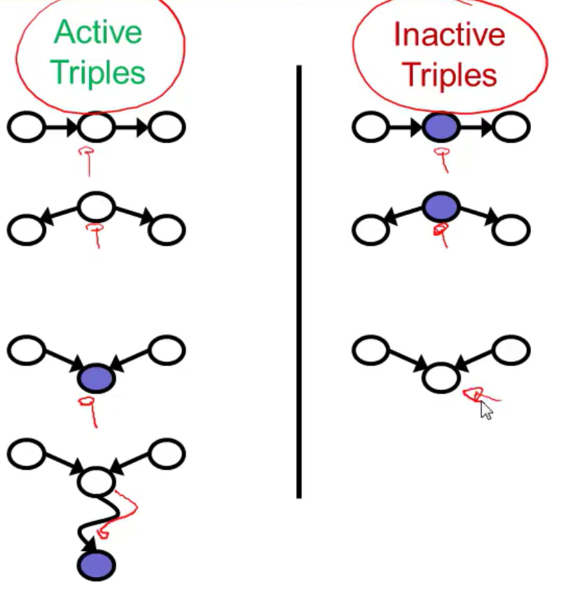

---


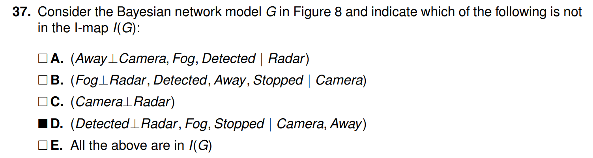

> 这张图片展示了一个贝叶斯网络（Bayesian Network）并要求找出**不属于**该模型的 I-map（独立图）的选项。

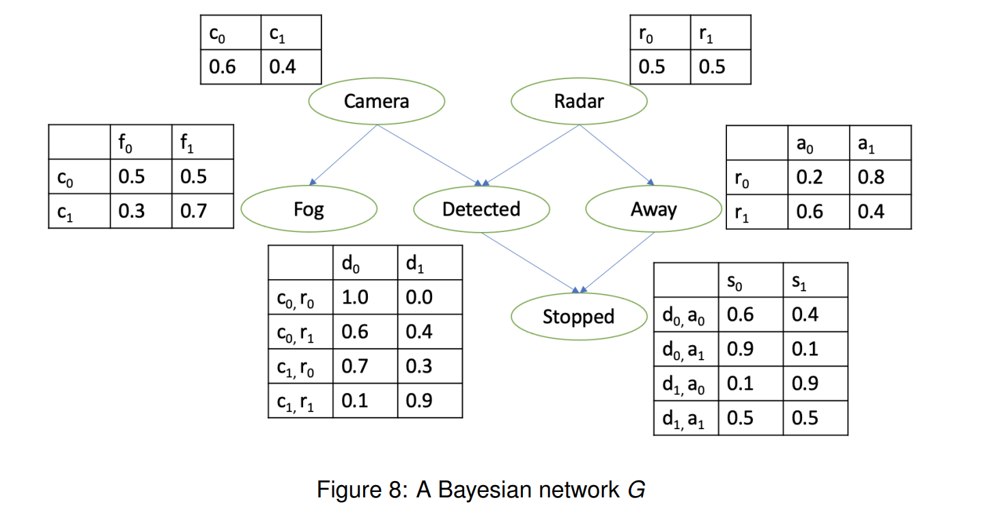

### 选项逐一分析

**A. $(Away \perp Camera, Fog, Detected \mid Radar)$ —— 正确 (在 I-map 中)**

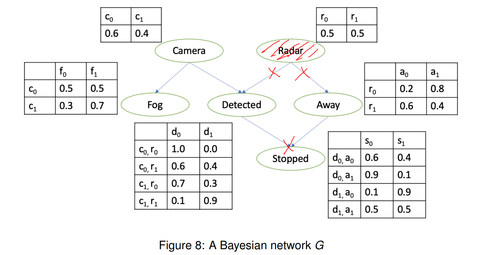

**B. $(Fog \perp Radar, Detected, Away, Stopped \mid Camera)$ —— 正确 (在 I-map 中)**

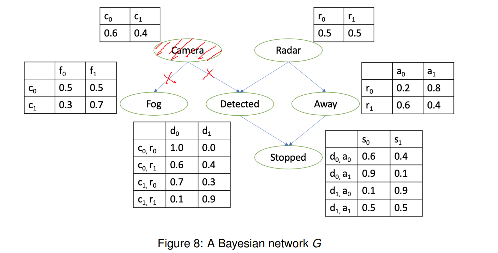

**C. $(Camera \perp Radar)$ —— 正确 (在 I-map 中)**

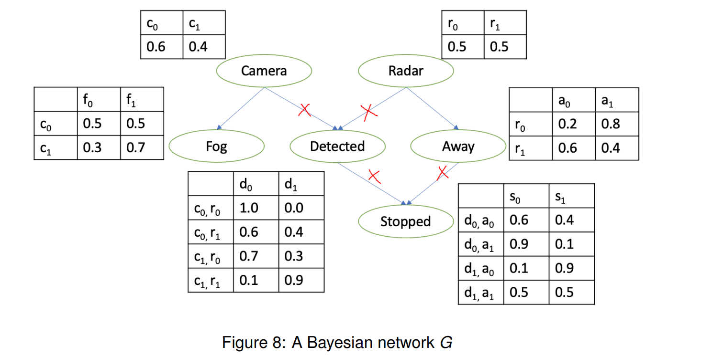

这里V结构为观测，因此都阻断了

**D. $(Detected \perp Radar, Fog, Stopped \mid Camera, Away)$ —— 错误 (不在 I-map 中)**

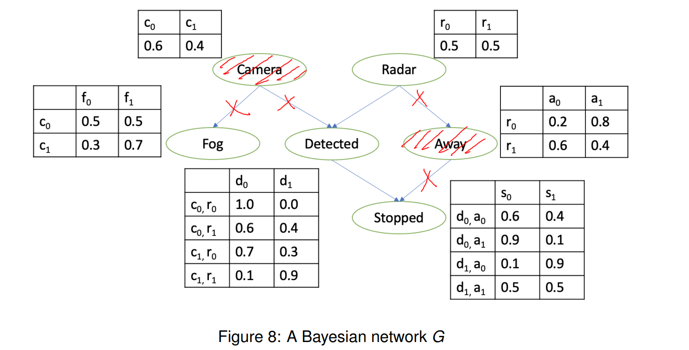

这里detect可以直接连接到stopped


## [27] 应用 d-分离规则化简联合概率


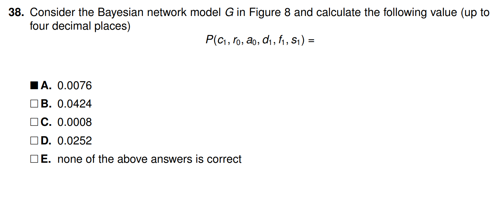


> [!CAUTION]
> $$
> P(X_1, X_2, \dots, X_n) = \prod_{i=1}^n P(X_i \mid \text{all\_parents}(X_i))
> $$

将其拆分之后，使用 D-分离化简。
$$
\begin{aligned}
P(C,R,A,D,F,S) =
&P(C)\cdot P(R)\\\\
&P(A|C,R)\cdot P(D|C,R)\cdot P(F|C,R)\cdot P(S | C,R,A,D)\\\\
=&P(C)\cdot P(R)\\\\
&P(A|R)\cdot P(D|C,R)\cdot P(F|C)\cdot P(S | A,D)\\\\
\end{aligned}
$$
因此：
$$
\begin{aligned} 
P(c_1, r_0, a_0, d_1, f_1, s_1) &= P(c_1) \cdot P(r_0) \cdot P(f_1|c_1) \cdot P(a_0|r_0) \cdot P(d_1|c_1, r_0) \cdot P(s_1|a_0, d_1) \\\\
&= 0.4 \times 0.5 \times 0.7 \times 0.2 \times 0.3 \times 0.9 \\\\
&= 0.00756 \end{aligned}
$$


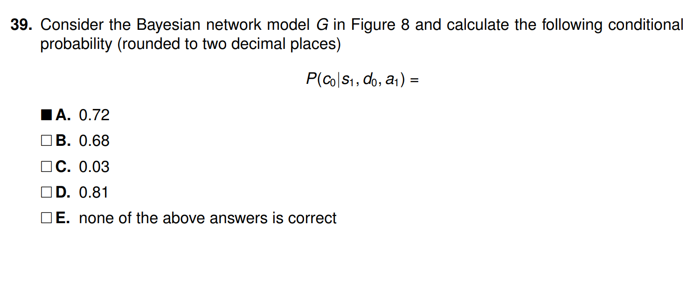

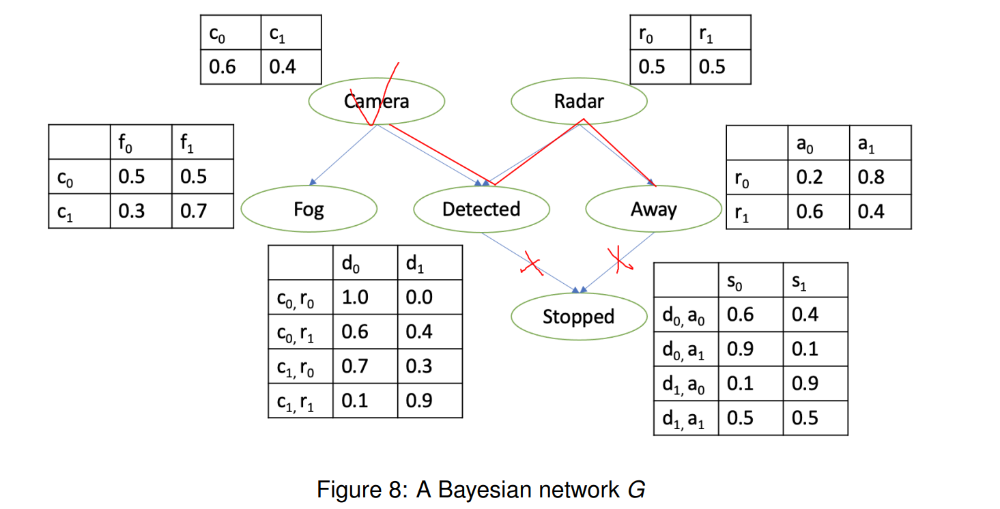


先应用 d-分离：

$$
\begin{aligned}
P(C|S,D,A)&=P(C|D,A)\\
\end{aligned}
$$
使用全概率公式套进去：
$$
P(c_0 | d_0, a_1) = \dfrac{P(c_0, d_0, a_1)}{P(d_0, a_1)} = \dfrac{P(c_0, d_0, a_1)}{P(\color{red}{\mathbf{c_0}}\color{black}, d_0, a_1) + P(\color{red}{\mathbf{c_1}}\color{black}, d_0, a_1)}
$$
其中，因为 $D$ 的双亲节点是 $C, R$，$A$ 的双亲节点是 $R$，我们需要通过全概率公式引入变量 $R$：
$$
P(c, d, a) = \sum_{r \in \{r_0, r_1\}} P(c) \cdot P(r) \cdot P(d|c, r) \cdot P(a|r)
$$
然后套表格即可：


$$
\begin{aligned}
P(c_0,d_0,a_1)=&P(c_0)P(r_0)P(d_0|c_0,r_0)P(a_1|r_0) + \\\\
&P(c_0)P(r_1)P(d_0|c_0,r_1)P(a_1|r_1) \\\\
=&0.6\times 0.5\times 1.0 \times 0.8 + \\\\
&0.6 \times 0.5 \times 0.6 \times 0.4 \\\\
=&0.24 +0.072 = 0.312
\end{aligned}
$$


$$
\begin{aligned}
P(c_1,d_0,a_1)=&P(c_1)P(r_0)P(d_0|c_1,r_0)P(a_1|r_0) + \\\\
&P(c_1)P(r_1)P(d_0|c_1,r_1)P(a_1|r_1) \\\\
=&0.4\times 0.5\times 0.7 \times 0.8 + \\\\
&0.4 \times 0.5 \times 0.1 \times 0.4 \\\\
=&0.112 + 0.008 = 0.12
\end{aligned}
$$


因此答案
$$
P(c_0 | d_0, a_1) = \frac{0.312}{0.312 + 0.12} = \frac{0.312}{0.432} \approx 0.7222
$$


## [28] 应用d-分离

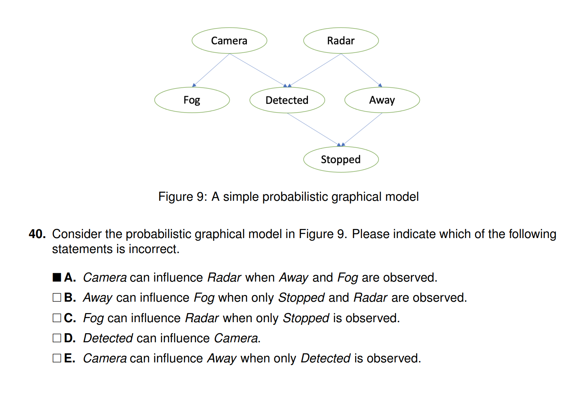

选项A错误。选A，因为：Camera 和 Radar 是独立的

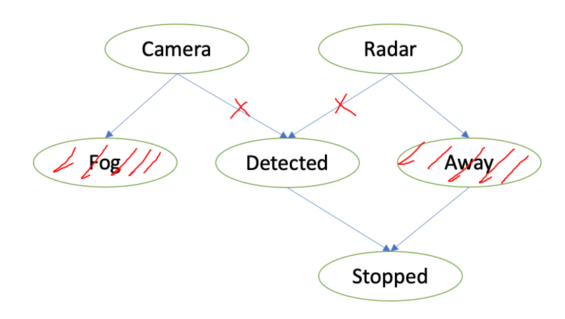

选项B正确，Away 和 Fog 会影响！

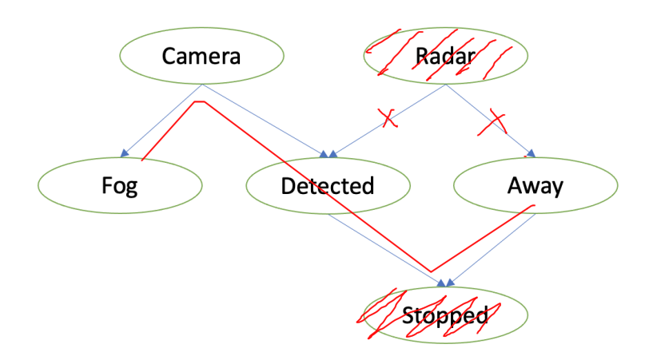

选项C正确，Fog可以影响Radar

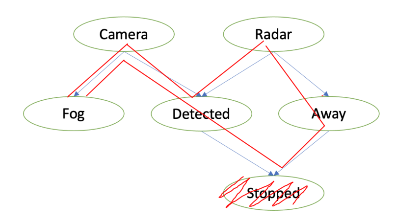

选项D正确，因为Camera 和 Detect 直接连接

选项E正确，Camera 会影响 Away

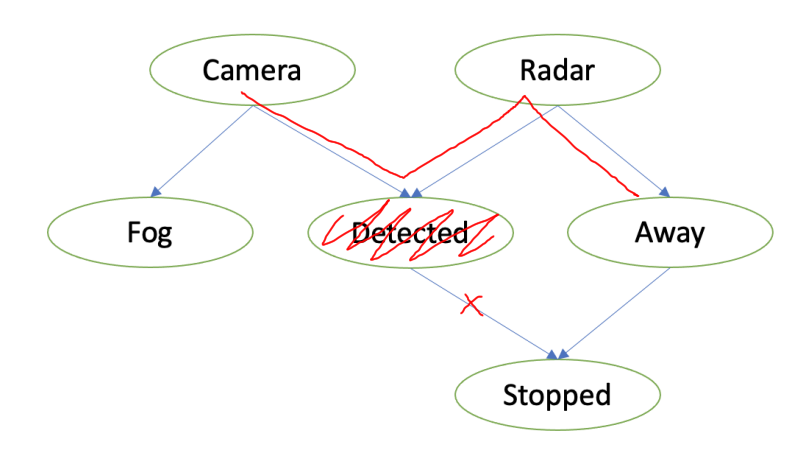


# 2020/2021

## [1] 关于聚类

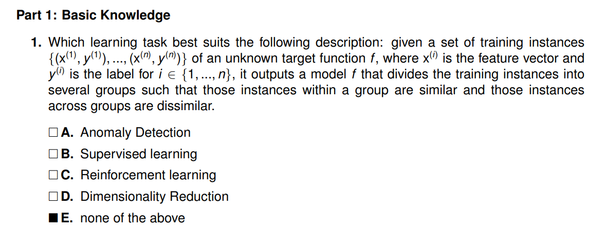


**输入**：一组训练实例 $\{(x^{(1)}, y^{(1)}), \dots, (x^{(n)}, y^{(n)})\}$, 其中 $x^{(i)}$ 是特征向量，$y^{(i)}$ 是标签。

**目标**：输出一个模型 $f$，将训练实例划分为几个**组（groups）**。

**要求**：使得**组内实例相似**，而**组间实例不相似**。

> 这个是聚类任务，选项没有，所以选择E！


**A. Anomaly Detection（异常检测）**：目的是识别与大多数数据显著不同的稀有项或观测值。

**B. Supervised learning（监督学习）**：虽然题干提到了标签 $y$，但监督学习的目标通常是**学习一个函数来预测新数据的标签**（分类或回归），而不是根据相似性进行分组。

**C. Reinforcement learning（强化学习）**：关注的是智能体如何在环境中通过采取行动来获得最大的累积奖励。

**D. Dimensionality Reduction（降维）**：目的是减少随机变量的数量，通过保留主要特征来简化数据。


## [2] -

省略，和2023/2024题目完全一致


## [3] 概率

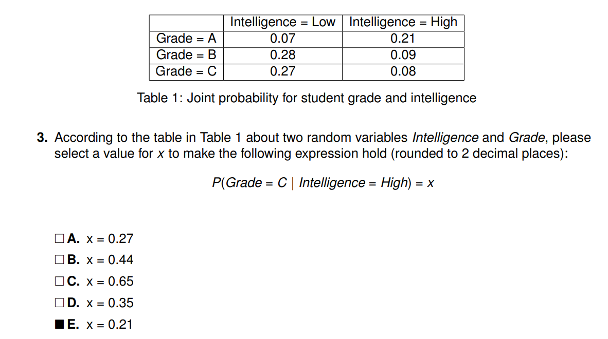


$$
P = \dfrac{0.08}{0.21+0.09+0.08}\approx 0.21052 \to 0.21
$$
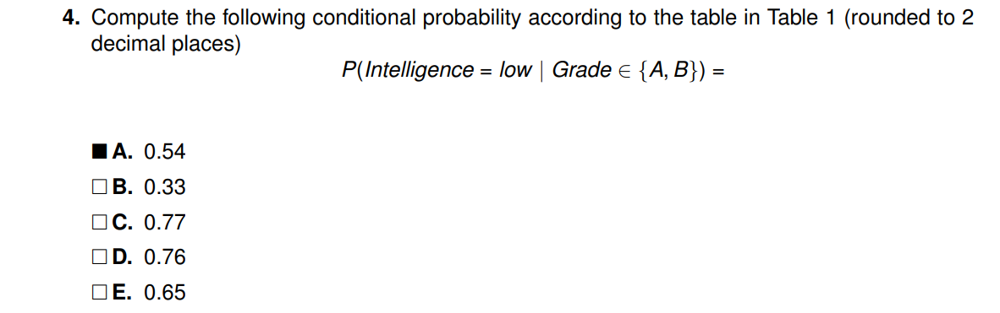
$$
P = \dfrac{0.07+0.28}{0.07+0.21+0.28+0.09}\approx 0.53846 \to 0.54
$$


## [4] 高斯分布和简单概率

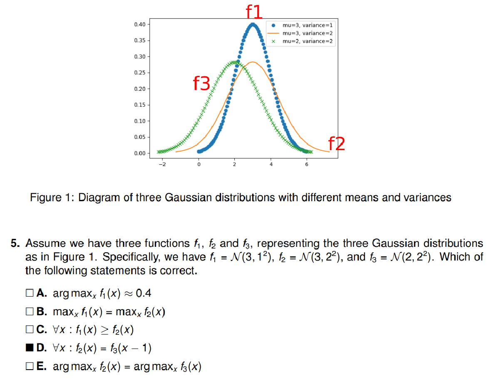

A 应该是3

B 应该是 argmax而不是max

C 错误

D 正确：左+右-

E 应该是max


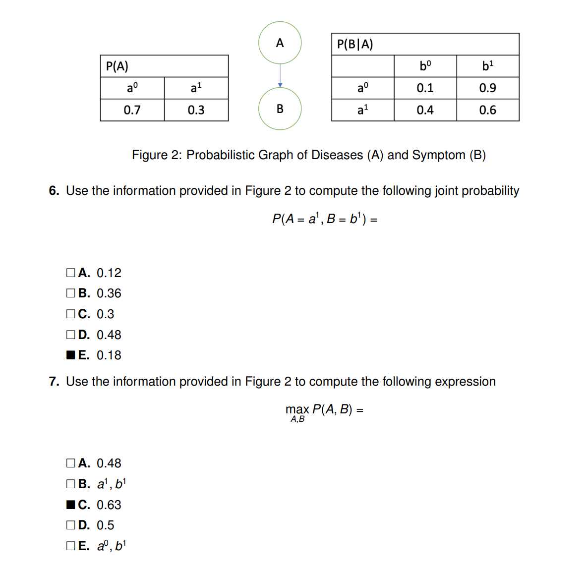

第六题 $P(a_1,b_1)=P(a_1)P(b_1|a_1)=0.3\times0.6=0.18$ 

如果第七题求 $MAP(A,B)$ 那就是求 $P(A,B)$ 表格最大值**对应的字母**

此处是求 $max_{A,B}P(A,B)$ 所以只需要求最大值即可


| P(A,B) | b0                     | b1                      |
| ------ | ---------------------- | ----------------------- |
| a0     | $0.7 \times$0.1 = 0.07 | $0.7 \times 0.9 = 0.63$ |
| a1     | $0.3\times0.4=0.12$    | $0.3\times0.6=0.18$     |


所以最大值是0.63


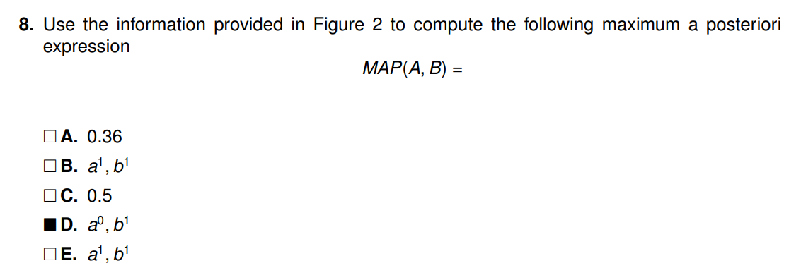


因此是 $a_0,b_1$

## [6] NumPy 操作

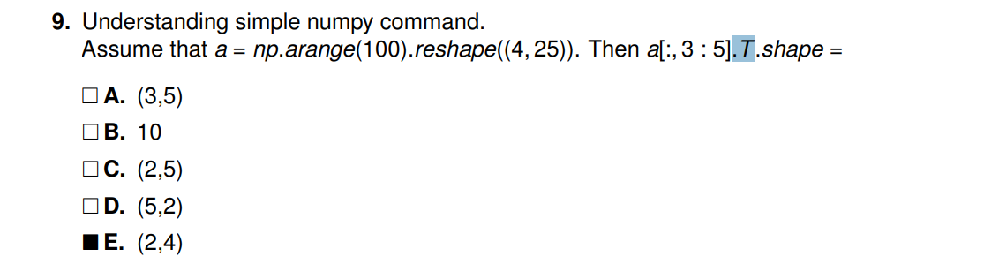

这里使用了 `.T` 因此是 `(2,4)` 不是 `(4,2)`


## [7] 范数

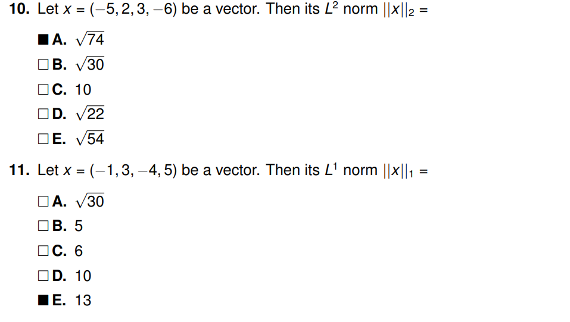

> ## LP-Norm
>
> $$
> ||x||_p = (\sum_i|x_i|^p)^{\frac1p}
> $$
>
> 
>
> $L_1$ Norm 也叫做曼哈顿距离：
> $$
> ||x||_1 = \sum_i |x_i|
> $$
> $L_{\infin}$ 也叫做 Max Norm 最大范数
> $$
> L_{\infin} = \text{max}(\text{abs}(x))
> $$
>
> 
>
> > [!CAUTION]
> >
> > 范数都有绝对值！


## [8] 决策树

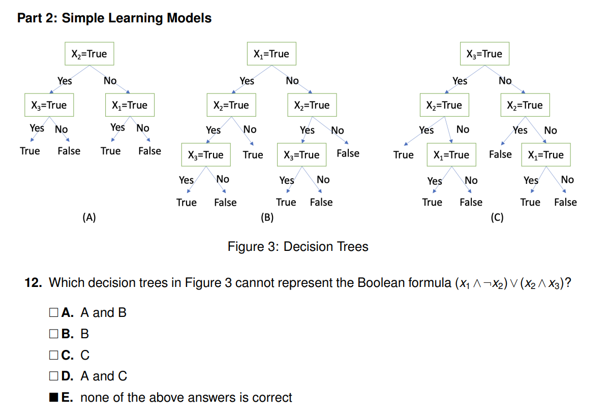

$\neg$ ：**非** (NOT)，表示取反。

$\wedge$ ：**与** (AND)，要求两边都为真结果才为真。

$\vee$ ：**或** (OR)，只要有一边为真结果就为真。


题目需要找到 `(x1 且 !x2) 或 (x2 且 x3)`

A 树中我们找到True的条件，然后发现可以表达 `(x1 且 !x2) 或 (x2 且 x3)`

B 树中找到True的条件，`(x1 且 x2 且 x3) 或 (x1 且 !x2) 或 (!x1 且 x2 且 x3)`  化简  ` (x2 且 x3) 或 (x1 且 !x2)`

C 树中找到True的条件，`(x2且x3)或(x1且!x2且x3)或(x1且!x2且!x3)` 化简 `(x2且x3)或(x1且!x2)`

因此答案是 ABC三颗树都符合条件。因此只能选E。


## [9] 计算熵

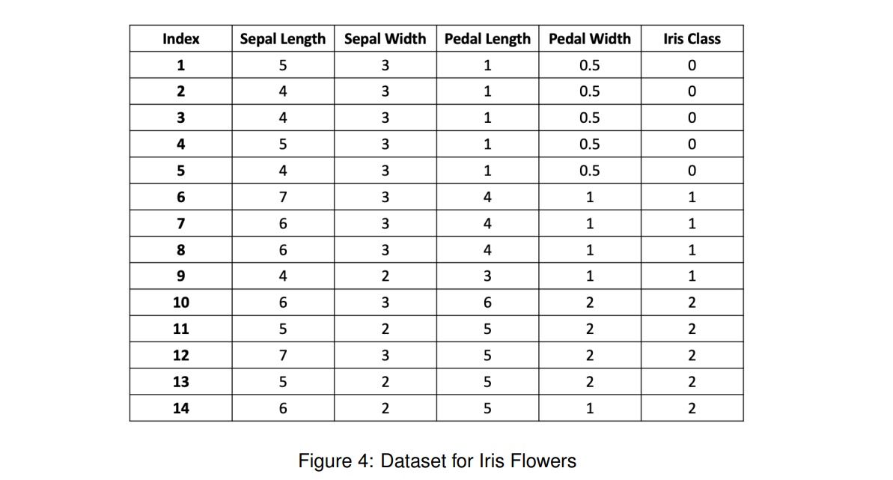

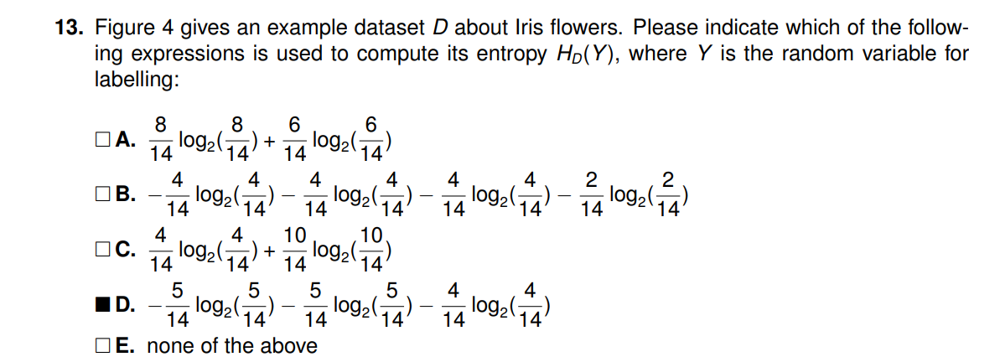


$$
H(Y)=-\sum P(y)\log{P(Y)}
$$
这里 `y0, y1, y2` 分别有 5、4、5 个，所以概率就是 $\dfrac5{14},\dfrac4{14},\dfrac{5}{14}$


## [10] 信息增益

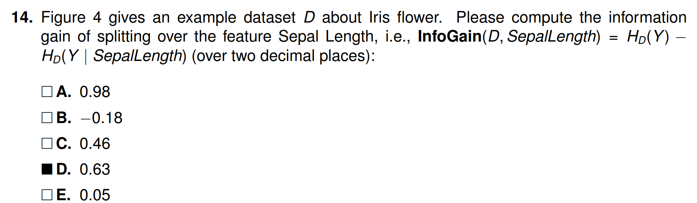


$$
\begin{aligned}
&H_D(Y) = - \sum p_i \log_2(p_i) = - \left( \dfrac{5}{14}\log_2\dfrac{5}{14} + \dfrac{4}{14}\log_2\dfrac{4}{14} + \dfrac{5}{14}\log_2\dfrac{5}{14} \right) &\approx \mathbf{1.577}\\\\
&H(SL=4) = -(\dfrac{3}{4}\log_2\dfrac{3}{4} + \dfrac{1}{4}\log_2\dfrac{1}{4}) &\approx \mathbf{0.811}\\
&H(SL=5) = -(\dfrac{2}{4}\log_2\dfrac{2}{4} + \dfrac{2}{4}\log_2\dfrac{2}{4}) &= \mathbf{1.0}\\\
&H(SL=6) &= \mathbf{1.0}\\
&H(SL=7) &= \mathbf{1.0}\\
&H_D(Y|SL) = \dfrac{4}{14}(0.811) + \dfrac{4}{14}(1) + \dfrac{4}{14}(1) + \dfrac{2}{14}(1) &\approx \mathbf{0.946}\\\\

&InfoGain = 1.577 - 0.946 &= \mathbf{0.631}
\end{aligned}
$$


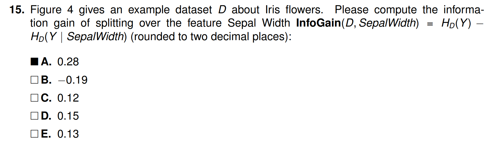


$$
\begin{aligned}
&H_D(Y) = - \sum p_i \log_2(p_i) = - \left( \dfrac{5}{14}\log_2\dfrac{5}{14} + \dfrac{4}{14}\log_2\dfrac{4}{14} + \dfrac{5}{14}\log_2\dfrac{5}{14} \right) &\approx \mathbf{1.577}\\\\\\
&H(SW=2) = -\left( \dfrac{1}{4}\log_2\dfrac{1}{4} + \dfrac{3}{4}\log_2\dfrac{3}{4} \right) &\approx 0.811\\
&\color{red}\mathbf{H(SW=3) = -\left( \dfrac{5}{10}\log_2\dfrac{5}{10} + \dfrac{3}{10}\log_2\dfrac{3}{10} + \dfrac{2}{10}\log_2\dfrac{2}{10} \right)} &\approx 1.485\\
&H_D(Y | Sepal Width) = \dfrac{4}{14} \times 0.811 + \dfrac{10}{14} \times 1.485 \approx 0.232 + 1.061 &= 1.293\\\\\\

&InfoGain = 1.58 - 1.293 &= 0.287
\end{aligned}
$$


## [11] KNN

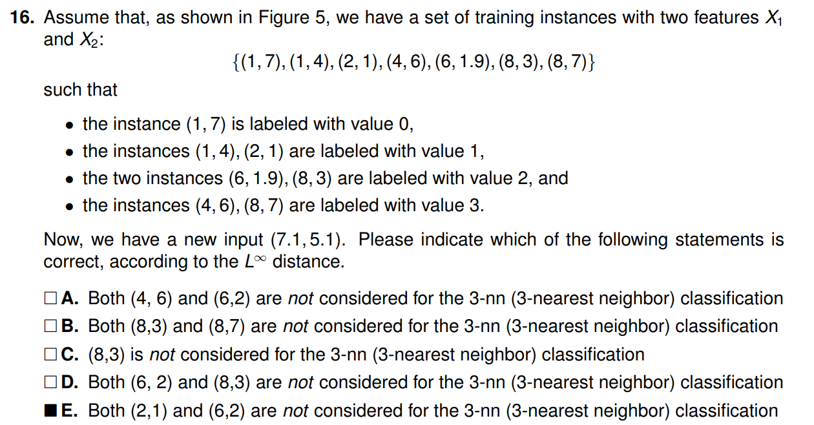


> 其实可以不用图

$$
L_\infty(P, Q) = \max(|x_1 - x_2|, |y_1 - y_2|)
$$

选择最小的，得到

1. **第一近邻**：$(8, 7)$，距离 1.9 | 标签值 3
2. **第二近邻**：$(8, 3)$，距离 2.1 | 标签值 2
3. **第三近邻**：$(4, 6)$，距离 3.1 | 标签值 3


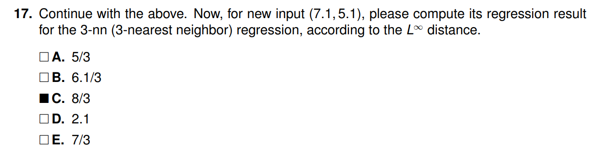

求该点 3NN 回归，也就是3近邻点的**==标签值加权平均==**
$$
回归 = \dfrac{3+2+3}{3}=\dfrac83
$$


## [12] 数据集划分（训练集、验证集、测试集）

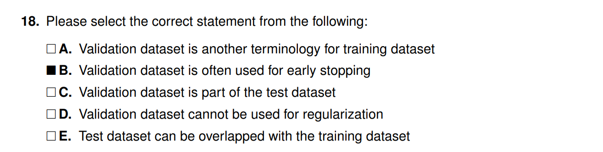


全部选项之前提过。

> 总结：**Validation Set（验证集）对监督学习**不是必要的**，他通常是用于调整模型层和防止过拟合等作用的，它可以用来做正则化（提前早停防止过拟合），三个集合都不允许重叠！**


## [13] 混淆矩阵

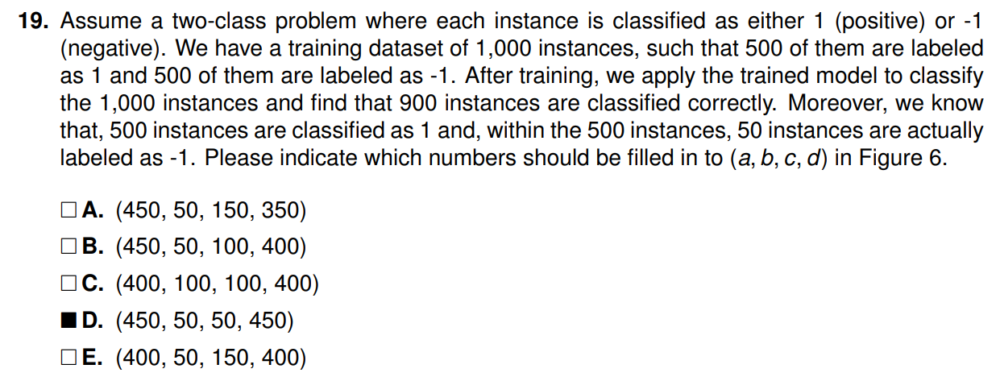


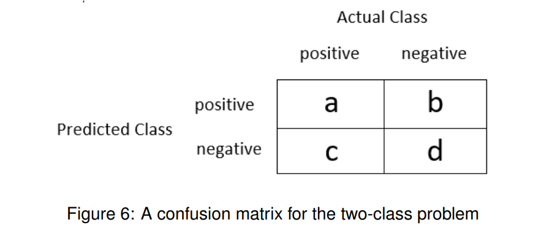

直接解析题目：

训练了1000个数据，500个`1` 和 500个`-1`，然后，我们尝试分类新的**1000个数据**：

- 900个数据分类正确
- 100个数据分类错误
- 500 个被分类为`1`
  - 50个数据实际上是`-1`，他们分类错误
- 500个被分类为`-1`
  - 50个数据实际上是`-1`，他们分类错误


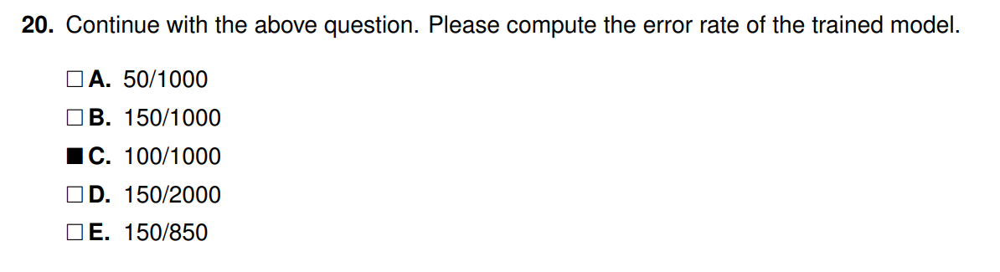


$$
\begin{aligned}
\text{Error Rate} &= \dfrac{\text{错误样本数}}{\text{总样本数}} \times 100\% \\\\
\text{Error Rate} &= \dfrac{100}{1000}
\end{aligned}
$$


## [14] 线性回归

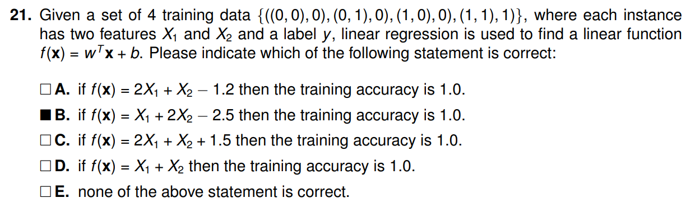

> 如果 $f(\mathbf{x}) > 0$，预测类别为 **1**。
>
> 如果 $f(\mathbf{x}) \le 0$，预测类别为 **0**。

A 选项，代入（1，0）结果错误

B 选项，全部正确

C 选项，代入（0，0）结果错误

D 选项，代入（0，1）结果错误


## [15] 梯度

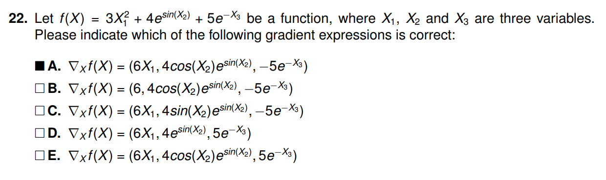

分别求偏导即可！


## [16] 朴素贝叶斯

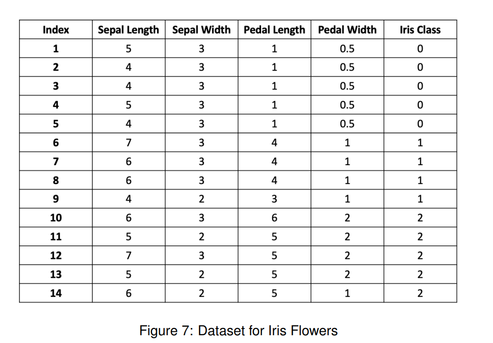


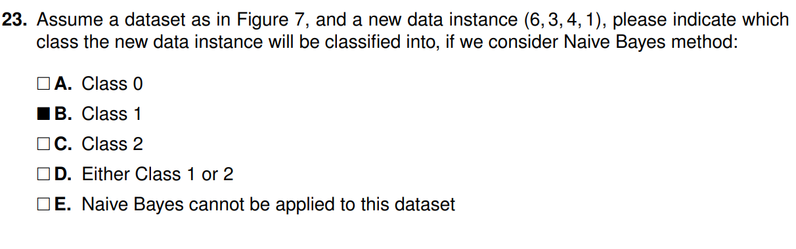


$$
\color{red}\mathbf{Score(C_i) = P(C_i) \times P(x_1|C_i) \times P(x_2|C_i) \times P(x_3|C_i) \times P(x_4|C_i)}
$$


步骤：需要计算出每一个分类的 Score，最高分就是最可能的

1. 计算 $P(C_i)$
2. 计算条件概率（在本类情况下） $P(x_{...}|C_i)$ 


$$
\begin{aligned}
Score(C_0) &= \dfrac{5}{14} \times \dfrac{0}{5} \times \dfrac{5}{5} \times \dfrac{0}{5} \times \dfrac{0}{5} &= 0\\\\
Score(C_1) &= \dfrac{4}{14} \times \dfrac{2}{4} \times \dfrac{3}{4} \times \dfrac{3}{4} \times \dfrac{4}{4} = \dfrac{18}{224} &\approx 0.0804\\\\
Score(C _ 2) &= \dfrac{5}{14} \times \dfrac{2}{5} \times \dfrac{2}{5} \times \dfrac{0}{5} \times \dfrac{1}{5} &= 0
\end{aligned}
$$


发现只能选择 C1


## [17] ReLU/ Sigmoid 感知机


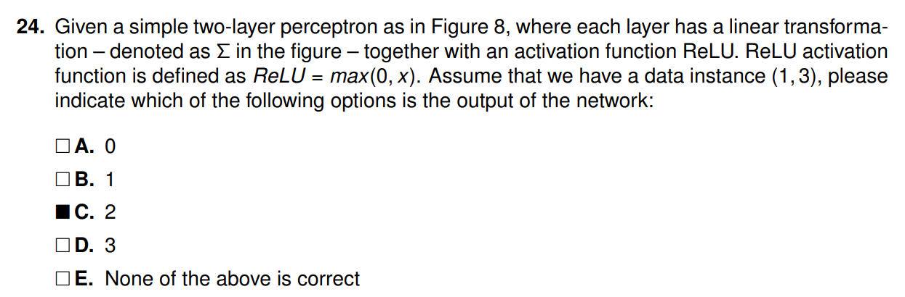


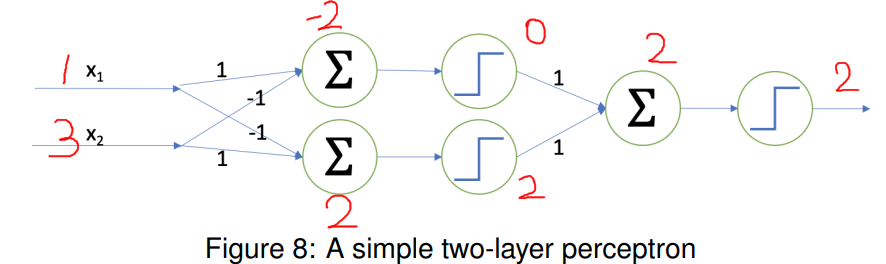


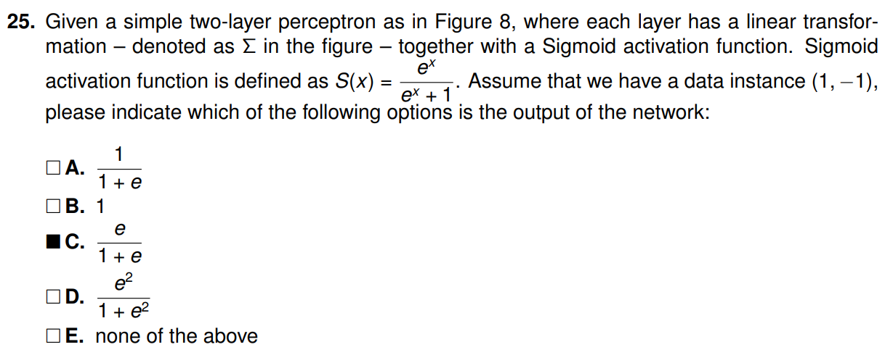


> Sigmoid 函数特性就是：
>
> - Sigmoid 函数最大值不会超过1（不论x多大）
> - Sigmoid 函数有一个非常重要的数学特性：$S(x) + S(-x) = 1$

用到了第二个特性
$$
ans = s(s(2)+s(-2))=s(1)=\dfrac{e}{1+e}
$$


## [18] 正误判断

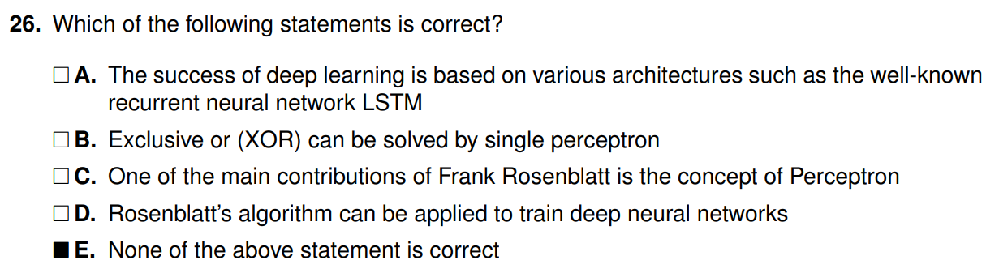

**A. The success of deep learning is based on various architectures such as the well-known recurrent neural network LSTM**

- **错误原因：** 虽然 LSTM（长短期记忆网络）是深度学习中非常重要且成功的架构（尤其是在处理序列数据方面），但深度学习的整体成功并不仅仅基于它。深度学习的成功源于大数据、计算能力的提升（如 GPU）以及卷积神经网络 (CNN)、Transformer 等多种架构的共同作用。这句话表述得过于片面。

**B. Exclusive or (XOR) can be solved by single perceptron**

- **错误原因：** 这是一个经典的结论。**单层感知机只能解决线性可分问题**。由于 XOR（异或）问题是线性不可分的，它无法用单个感知机来解决。这个局限性在 1969 年由 Minsky 和 Papert 指出，曾导致了神经网络研究的一个低潮期。

**C. One of the main contributions of Frank Rosenblatt is the concept of Perceptron**

- **正确：** 弗兰克·罗森布拉特 (Frank Rosenblatt) 在 1957 年发明了感知机 (Perceptron)。这是现代神经网络的雏形，也是他在人工智能领域最著名的贡献。

**D. Rosenblatt’s algorithm can be applied to train deep neural networks**

- **错误原因：** 罗森布拉特的感知机学习算法只适用于单层网络。**深度神经网络 (DNN)** 的训练主要依赖于**反向传播算法 (Backpropagation)** 和梯度下降。感知机算法无法处理多层架构中的权重更新问题。

> 此题有异议
>

## [19] 梯度计算

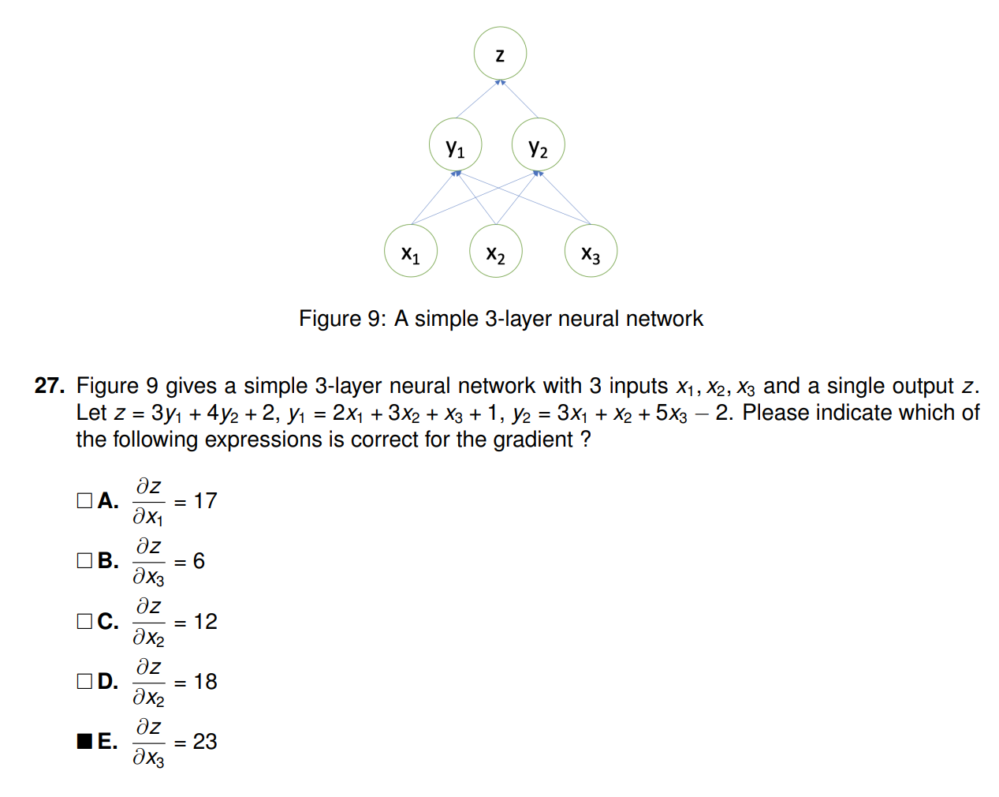


$$
z=18x_1+13x_2+23x_3-3\\
\dfrac{\partial z}{\partial x_1}=18\\
\dfrac{\partial z}{\partial x_2}=13\\
\dfrac{\partial z}{\partial x_3}=23
$$


## [20] CNN


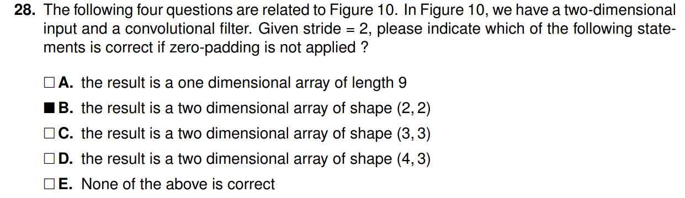

此处**不使用 零填充** 因此规定了 $P=0$

直接看，可以看出结果是 $2\times2$ 或者套公式

> 卷积后输出特征图尺寸的通用公式为：
> $$
> O = \frac{W - F + 2P}{S} + 1
> $$
> 其中：
>
> - $W$ 是输入尺寸
> - $F$ 是卷积核尺寸
> - $P$ 是填充层数（通常指在四周各填充几层 0）
> - $S$ 是步长


$$
O = \dfrac{4-2+2\times0}{2}+1=2
$$
结果$2\times2$


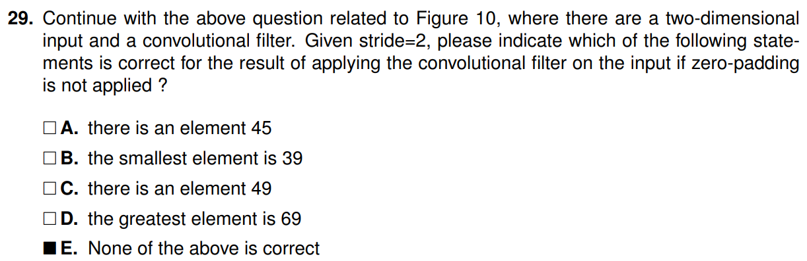

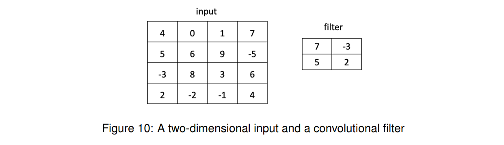

使用上一题的条件，求最大值，$P=0 , S = 2$

```python
--- 开始卷积运算 (Stride=2, No Padding) ---
步骤 1:
  当前窗口坐标: 行[0:2], 列[0:2]
  输入子矩阵:
[[4 0]
 [5 6]]
  计算过程: (4*7) + (0*-3) + (5*5) + (6*2)
  结果: 65
------------------------------
步骤 2:
  当前窗口坐标: 行[0:2], 列[2:4]
  输入子矩阵:
[[ 1  7]
 [ 9 -5]]
  计算过程: (1*7) + (7*-3) + (9*5) + (-5*2)
  结果: 21
------------------------------
步骤 3:
  当前窗口坐标: 行[2:4], 列[0:2]
  输入子矩阵:
[[-3  8]
 [ 2 -2]]
  计算过程: (-3*7) + (8*-3) + (2*5) + (-2*2)
  结果: -39
------------------------------
步骤 4:
  当前窗口坐标: 行[2:4], 列[2:4]
  输入子矩阵:
[[ 3  6]
 [-1  4]]
  计算过程: (3*7) + (6*-3) + (-1*5) + (4*2)
  结果: 6
------------------------------

最终输出矩阵:
[[ 65.  21.]
 [-39.   6.]]

矩阵中的所有元素: [ 65.  21. -39.   6.]
最大值: 65.0
最小值: -39.0

```


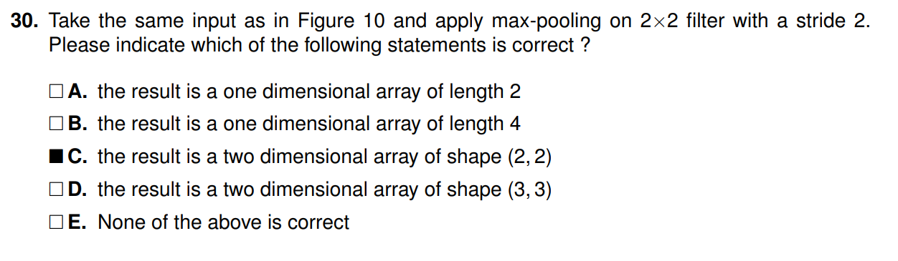

这里使用了 max-pooling 最大化池，但我们知道这个只会影响数值，不会影响大小！

> 在卷积神经网络（CNN）中，输出矩阵的形状（Shape）主要由**超参数**（卷积核大小、步长、填充）决定，而不是由具体的**运算逻辑**（求加权和还是取最大值）决定的。


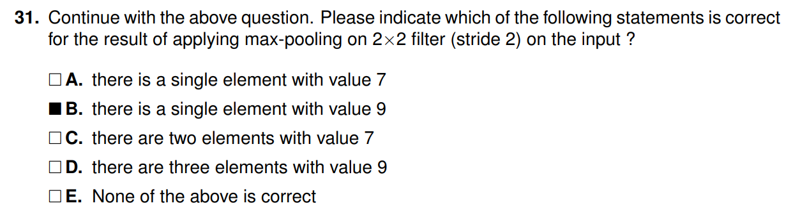


这里计算最大池化，**Filter就不需要看了（Filter 不参与计算）**

- 左上角 = 6
- 右上角 = 9
- 左下角 = 8
- 右下角 = 6


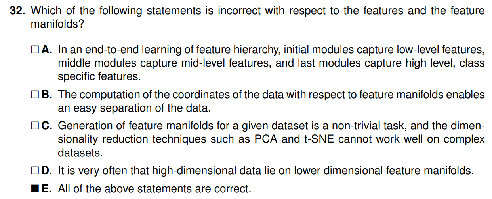


## [21] -

和2023/2024完全一致


## [22] -

和2023/2024完全一致


## [23] 概率图模型联合概率


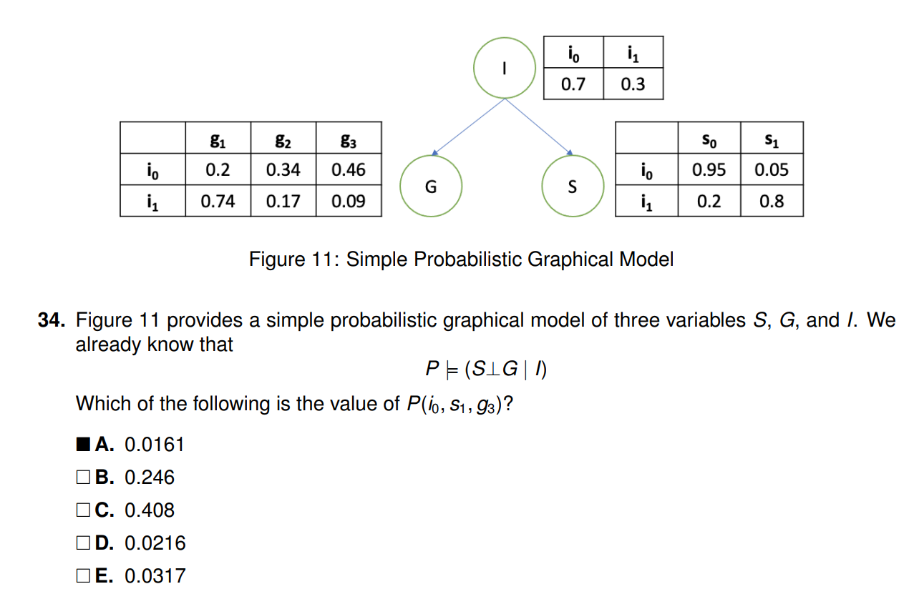


$$
\begin{aligned}
P(i_0,s_1,g_3) &= P(i_0)\cdot P(s_1|i_0)\cdot P(g_3|i_0)\\

&=0.7\times0.05\times 0.46 \\
& = 0.0161
\end{aligned}
$$


## [24] 独立断言

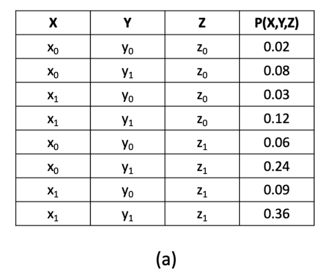

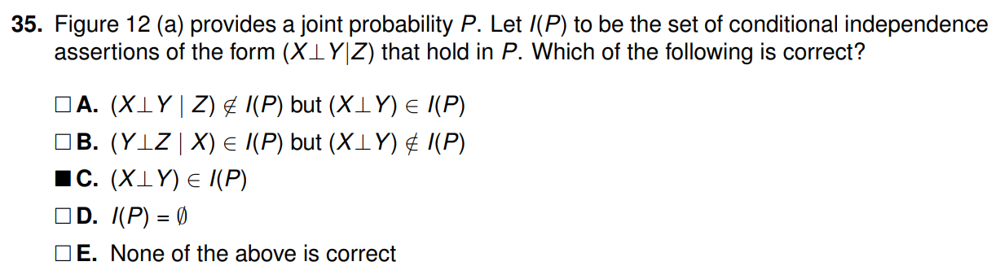

回顾：

> $$
> \begin{aligned}
> 
> 
> (X \perp Y) \in I(P) &\iff P(X,Y)=P(X)\cdot P(Y)\\\\
> &\text{For every X and Y}\\\\\\
> 
> P(X, Y \mid Z) \in I(p) &\iff P(X,Y|Z)=P(X|Z)\cdot P(Y|Z)\\\\
> &\iff \dfrac{P(X,Y,Z)}{P(Z)} =\dfrac{P(X,Z)}{P(Z)}\dfrac{P(Y,Z)}{P(Z)} \\\\
> &\iff P(X,Y,Z)\cdot P(Z)=P(X,Z)\cdot P(Y,Z)\\\\
> &\text{For every X Y and Z}
> \end{aligned}
> $$


判断 $(X\perp Y)\in I(P)$ 是否成立，也即验证 
$$
P(X,Y)=P(X)\cdot P(Y)\\
\text{For every X Y}
$$
我们只需要对于 $Z$ 相加，写出如下表格


|               | **Y=y0** | **Y=y1** |
| ------------- | -------- | -------- |
| **$X = x_0$** | $0.08$   | $0.32$   |
| **$X = x_1$** | $0.12$   | $0.48$   |

交叉相乘成立！所以$(X\perp Y)\in I(P)$


判断 $(X\perp Y | Z) \in I(P)$ 是否成立，直接对于$Z$ 拆表：

$z_0$ 表：

|               | **Y=y0** | **Y=y1** |
| ------------- | -------- | -------- |
| **$X = x_0$** | $0.02$   | $0.08$   |
| **$X = x_1$** | $0.03$   | $0.12$   |

**交叉乘积：** $0.02 \times 0.12 = 0.0024$；$0.08 \times 0.03 = 0.0024$。相等！

$z_1$ 表：

|               | **Y=y0** | **Y=y1** |
| ------------- | -------- | -------- |
| **$X = x_0$** | $0.06$   | $0.24$   |
| **$X = x_1$** | $0.09$   | $0.36$   |

**交叉乘积：** $0.06 \times 0.36 = 0.0216$；$0.24 \times 0.09 = 0.0216$。相等！

所以$(X\perp Y|Z)\in I(P)$


选 C

## [25] 独立断言2

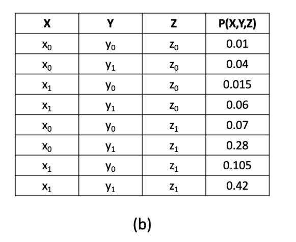

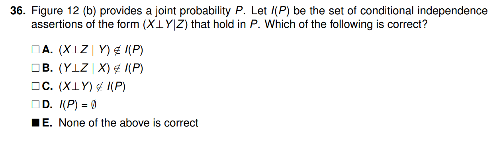


练习题！


## [26] 贝叶斯模型

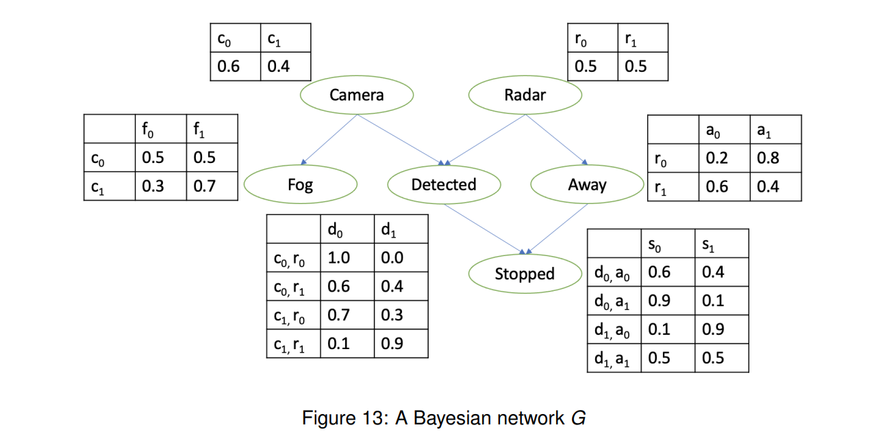

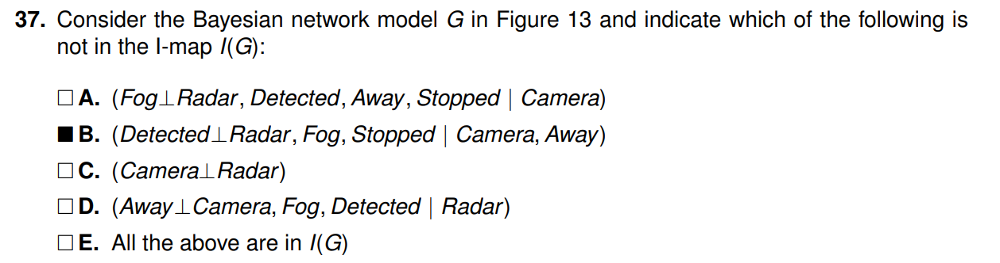


A选项，Fog 无法接触其他点，因此是独立的

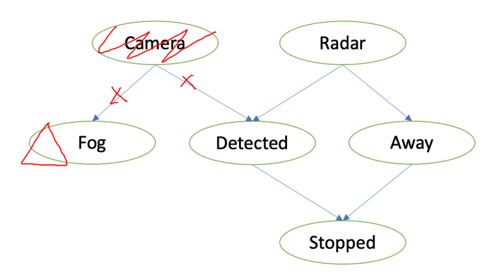

B选项，Detect 可以直接接触 Radar，因此不是独立的，选B

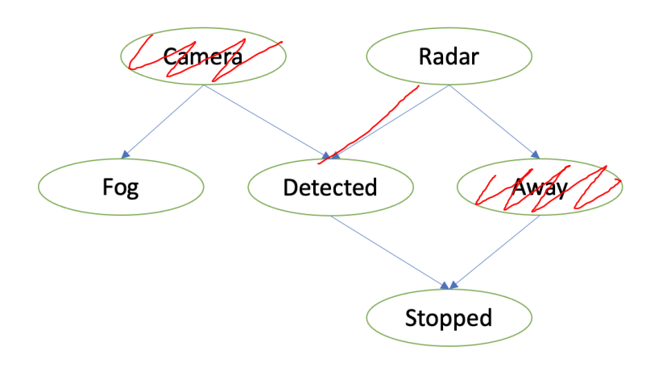

C选项，正确的，V结构没观测就是inactivated的

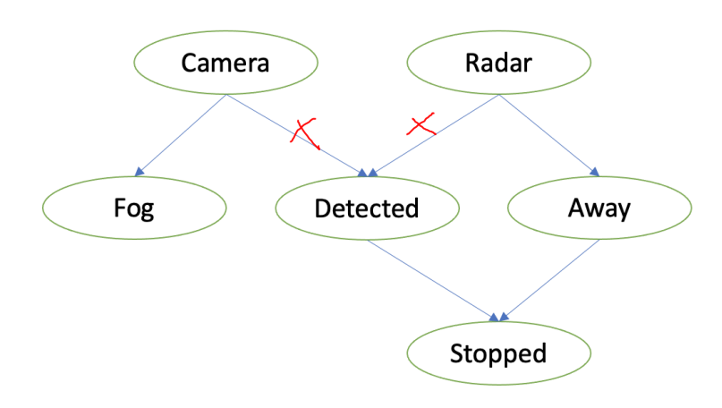

D选项，正确的

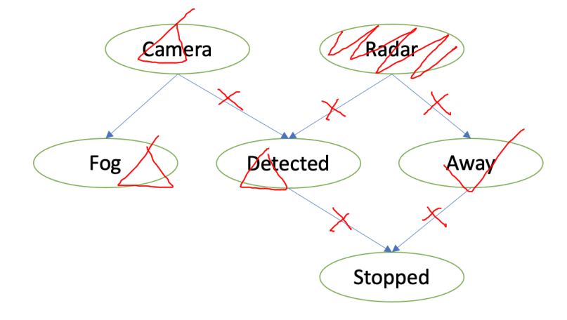

## [27] 应用 d-分离规则化简联合概率

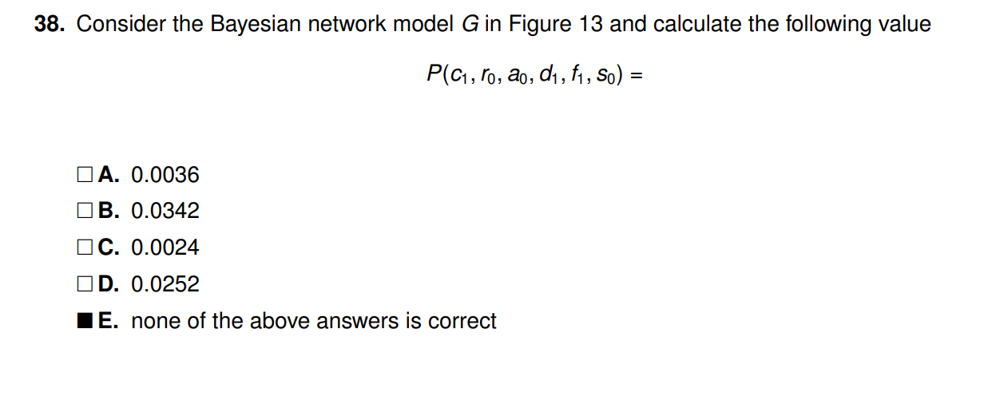

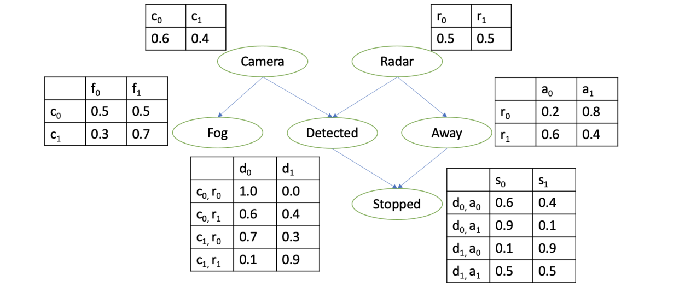


$$
\begin{aligned}
P(C,R,A,D,F,S) =
&P(C)\cdot P(R)\\\\
&P(A|C,R)\cdot P(D|C,R)\cdot P(F|C,R)\cdot P(S | C,R,A,D)\\\\
=&P(C)\cdot P(R)\\\\
&P(A|R)\cdot P(D|C,R)\cdot P(F|C)\cdot P(S | A,D)\\\\
\end{aligned}
$$
因此
$$
\begin{aligned}
P(c_1,r_0,a_0,d_1,f_1,s_0)&=P(c_1)\cdot P(r_0) \cdot P(a_0|r_0) \cdot P(d_1|c_1,r_0) \cdot P(f_1|c_1) \cdot P(s_0|a_0,d_1)\\\\
&=0.4\times0.5\times0.2\times0.3\times0.7\times0.1\\\\
&=0.0084
\end{aligned}
$$


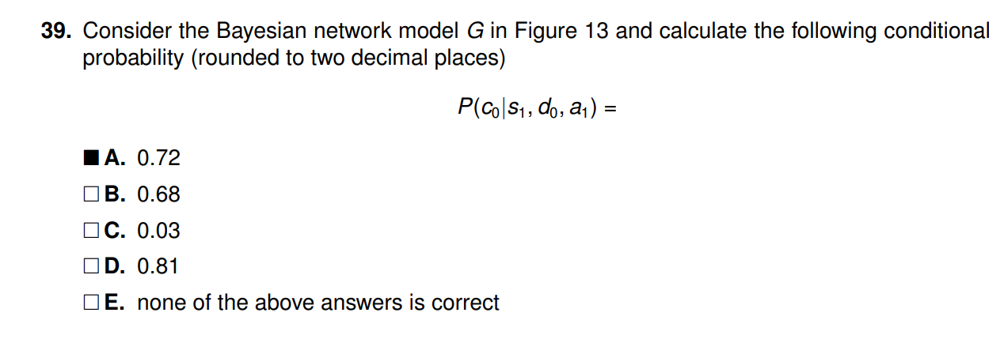


先应用 d-分离（d-separation）：
$$
\begin{aligned} P(C|S,D,A)&=P(C|D,A)\\ \end{aligned}
$$


使用全概率公式套进去：
$$
P(c_0 | d_0, a_1) = \dfrac{P(c_0, d_0, a_1)}{P(d_0, a_1)} = \dfrac{P(c_0, d_0, a_1)}{P(\color{red}{\mathbf{c_0}}\color{black}, d_0, a_1) + P(\color{red}{\mathbf{c_1}}\color{black}, d_0, a_1)}
$$


其中，因为 $D$ 的双亲节点是 $C, R$，$A$ 的双亲节点是 $R$，我们需要通过全概率公式引入变量 $R$：
$$
P(c, d, a) = \sum_{r \in \{r_0, r_1\}} P(c) \cdot P(r) \cdot P(d|c, r) \cdot P(a|r)
$$


然后套用题目给出的表格数据即可：
$$
\begin{aligned} P(c_0,d_0,a_1)=&P(c_0)P(r_0)P(d_0|c_0,r_0)P(a_1|r_0) + \\\\ &P(c_0)P(r_1)P(d_0|c_0,r_1)P(a_1|r_1) \\\\ =&0.6\times 0.5\times 1.0 \times 0.8 + \\\\ &0.6 \times 0.5 \times 0.6 \times 0.4 \\\\ =&0.24 +0.072 = 0.312 \end{aligned}
$$

$$
\begin{aligned} P(c_1,d_0,a_1)=&P(c_1)P(r_0)P(d_0|c_1,r_0)P(a_1|r_0) + \\\\ &P(c_1)P(r_1)P(d_0|c_1,r_1)P(a_1|r_1) \\\\ =&0.4\times 0.5\times 0.7 \times 0.8 + \\\\ &0.4 \times 0.5 \times 0.1 \times 0.4 \\\\ =&0.112 + 0.008 = 0.12 \end{aligned}
$$


因此最终答案为：
$$
P(c_0 | d_0, a_1) = \frac{0.312}{0.312 + 0.12} = \frac{0.312}{0.432} \approx 0.72
$$


对应选项 **A**。


## [28] 应用d-分离

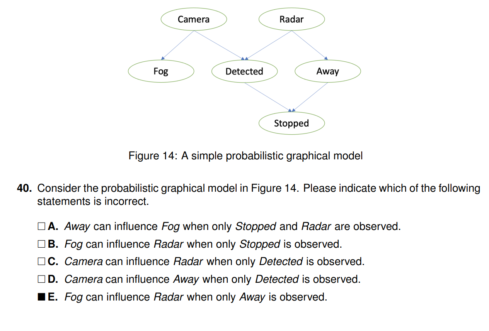


A 正确，Away 确实影响 Fog

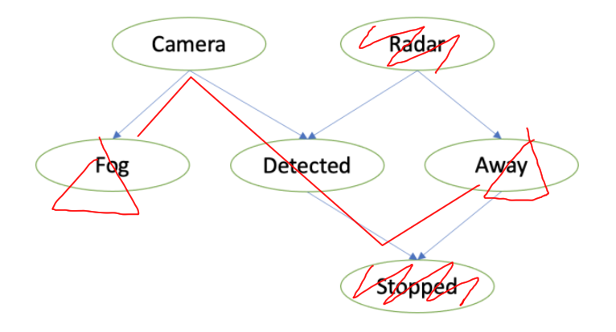

B 正确，Fog 确实影响Radar（激活V型）

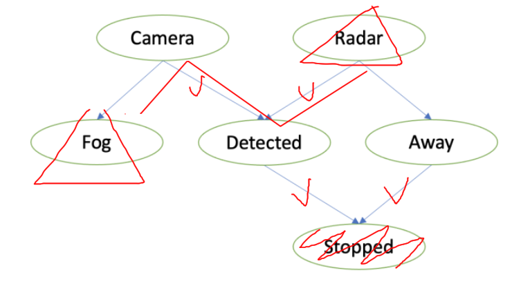


C 正确，Camera确实会影响Radar

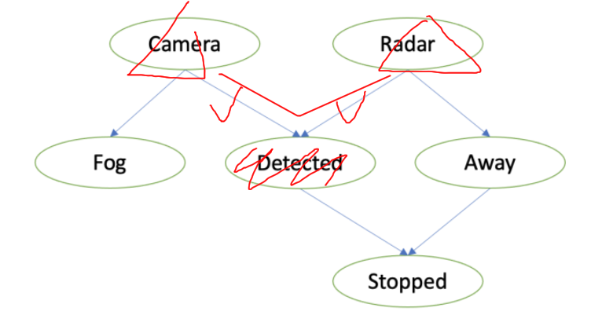

D 正确，Camera确实会影响Away

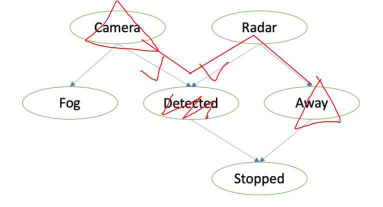


E 错误，V 未激活阻断

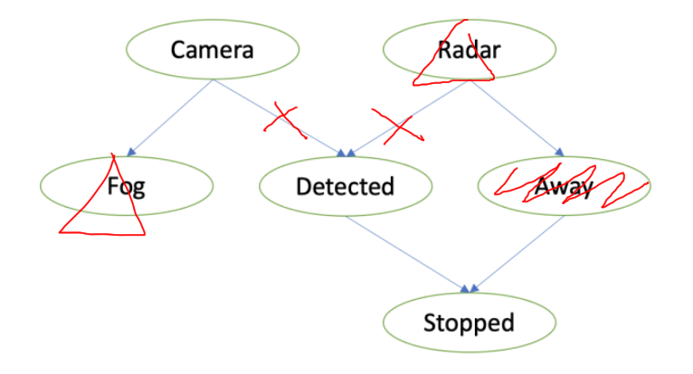


