# Mock Test

## [1] 渐进表示

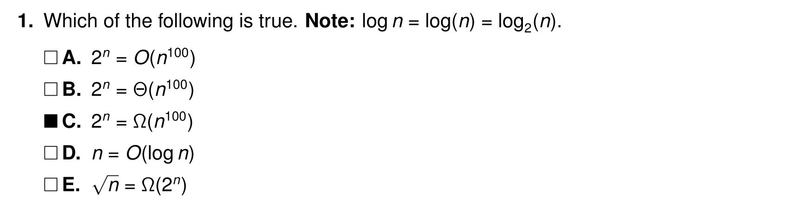

| **记号**                | **含义**                    | **关注点**                             |
| ----------------------- | --------------------------- | -------------------------------------- |
| **$O(g(n))$** 上界      | 运行时间 $\le$ 某个标准     | 保证算法不会比这更慢（最坏情况）       |
| **$\Omega(g(n))$** 下界 | 运行时间 $\ge$ 某个标准     | 保证算法至少需要这么多时间（最好情况） |
| **$\Theta(g(n))$**      | 运行时间 $\approx$ 某个标准 | 算法的精确增长水平                     |

$$
\begin{aligned}
证明上界 O~~~~~ & f(n) \le c\cdot g(n)&\\
证明下界 \Omega~~~~~&f(n) \ge c\cdot g(n)&\\
证明渐进\Theta ~~~~~&c_1 \cdot g(n) \le f(n) \le c_2 \cdot g(n)\\
复杂度 ~~~~~&O(1) < O(\log n) < O(n) < O(n \log n) < O(n^2) < O(n^k) < O(a^n) < O(n!)&
\end{aligned}
$$

对于A， $2^n \le c\cdot n^{100}$ 显然不可能，因为 **指数爆炸 > 多项式增长**

对于B，因为A都错误了，显然B也不可能正确

对于C，正确，因为 $2^n \ge c\cdot n^{100}$，恰好和A是相反的！

对于D，错误

对于E，错误，因为 $n^{0.5}$ 增长应当**慢于** $2^n$，因此 $2^n$应当是上界 $O$ 而不是下界 $\Omega$

## [2] 主定理 - 递归主导

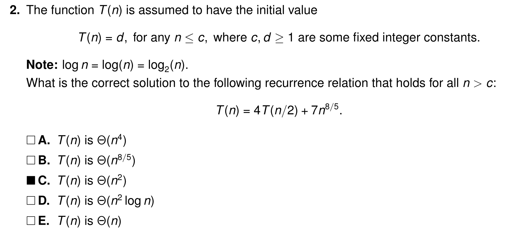

这里 $a = 4, b = 2$ 那么先算出 $n^{\log_ba}=n^2$，和额外工作 $n^\frac{8}{5} = n^{1.6}$ 比较，发现此处递归主导（$n^2$更大），因此选择C！

## [3] 主定理 - 额外工作主导

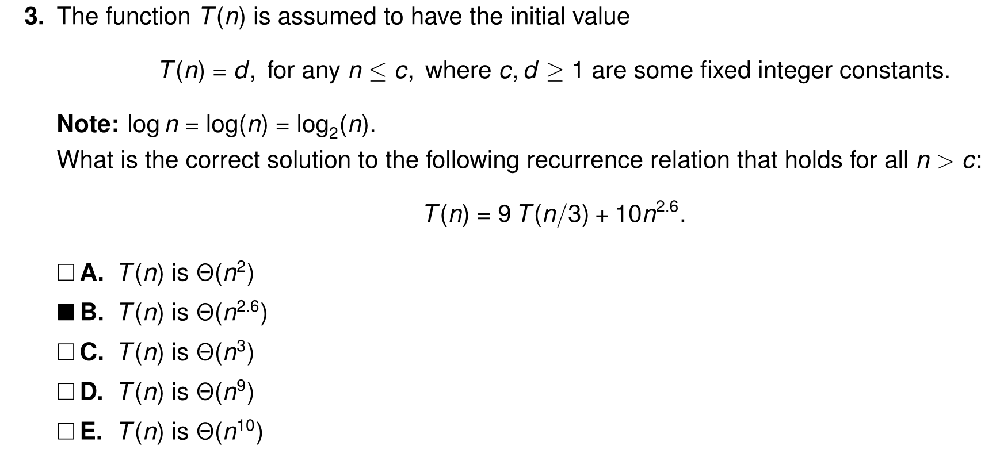

此处递归部分是 $n^2$，额外部分 $n^{2.6}$，额外部分更重，因此选择B！

##  [4] 主定理 - 平衡主导

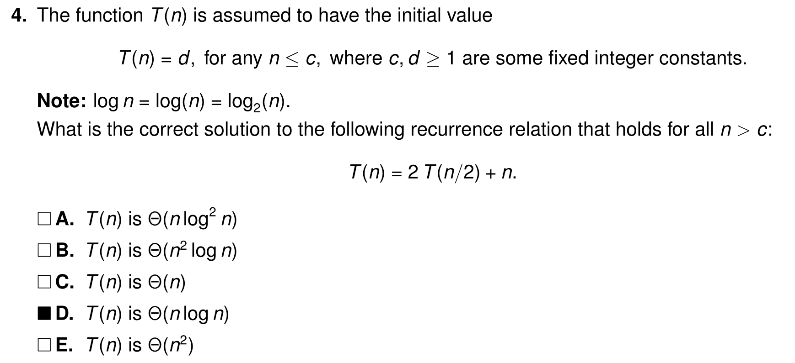

此处，递归部分是 $n$，额外部分也是$n$，他们相差 $k=0$ 个 $\log n$，因此时间复杂度是

$\Theta(主导\times\log^{\mathbf{k+1}}n)$ 因此选择D！

## [5] 快速矩阵时间复杂度考察

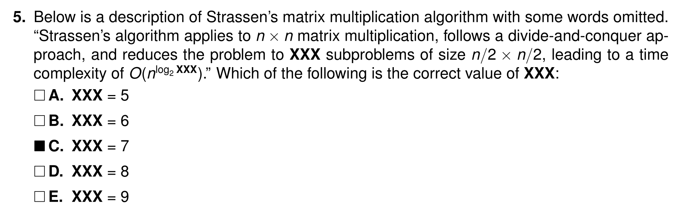

课程不要求知道具体原理，但是要求知道快速矩阵能从朴素算法的 $O(n^3)$ 转为 $O(n^{\log_27} ) \approx O(n^{2.7})$

选择C！

## [6] 数学期望

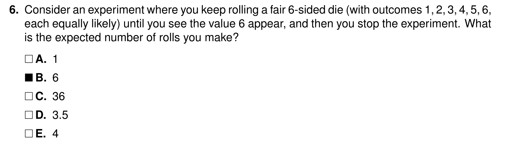

这里我们直接套用之前的公式
$$
\mathbb E(X) = 1\cdot p + (1-p)(1+\mathbb E(X))\iff \mathbb E(X) = \dfrac 1p
$$
那么带入此处的 $p=\dfrac16$ 则计算出是6，选择B！

## [7] 简单概率

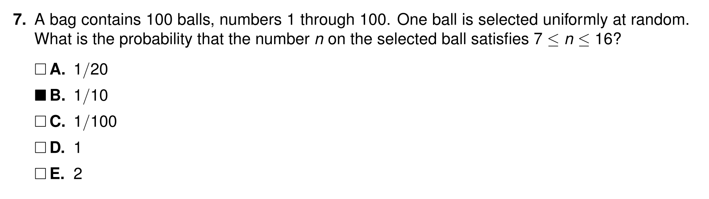

> Uniformly：均匀地

送分题。 

## [8] 快排复杂度

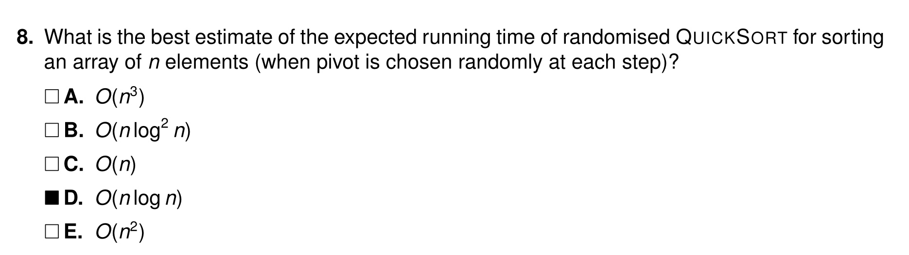

送分题。

## [9] 大根堆删除操作

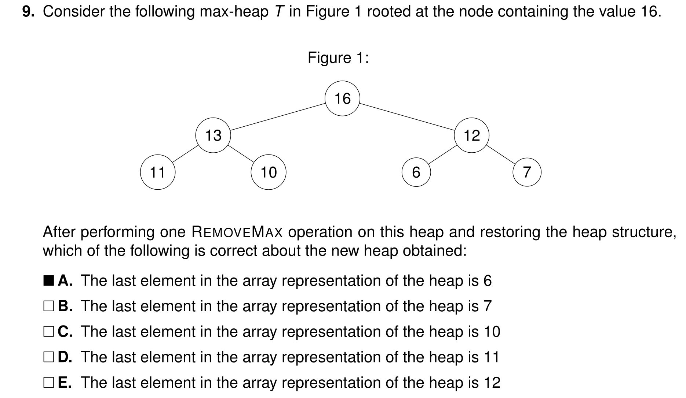

我们提到过，大根堆小根堆他们原理是差不多的。我们知道上滤和下滤操作。那么删除操作，就是优先队列里面的内容，直接弹出头部，然后尾巴补上，再下滤即可。模拟一下，就知道最后一个是6！

## [10] 堆插入时间复杂度

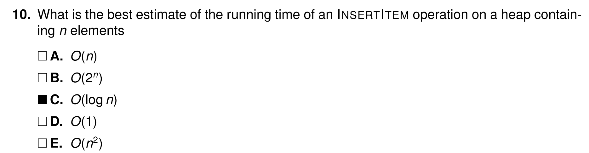

送分题，插入和删除都是 $O(\log n)$，但是建堆有两种方法，一个是上滤建堆$O(n \log n )$，一个是下滤建堆 $O(n)$，这两个有区别。

## [11] 计数排序时间复杂度

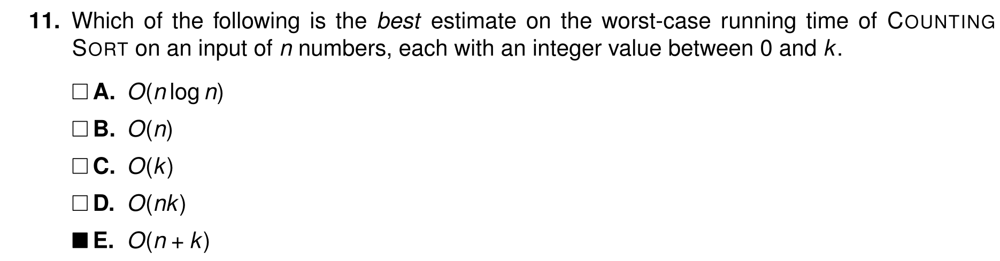

送分题。

## [12] 基数排序步骤

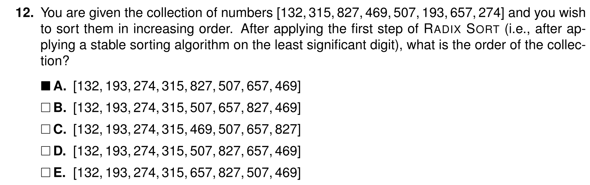

总分题，直接列出一个纵向表格，然后排序个位数。

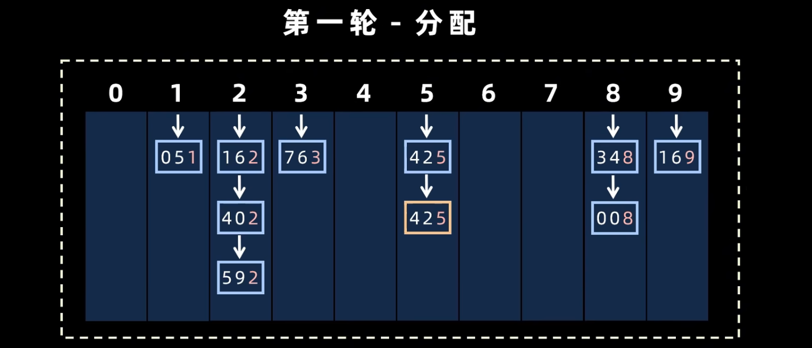

051 后面接的是162链表。因此，这一题的答案是A，简而言之，先出现的在前面！

## [13] 矩阵倍增发求斐波那契数列

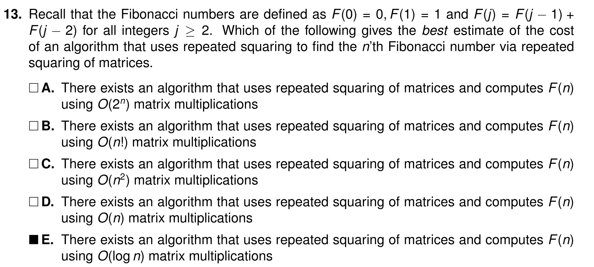

题目问：利用矩阵重复平方（Repeated Squaring）求第 $n$ 个斐波那契数，最好的复杂度估计是多少？

核心原理：斐波那契数列可以表示为矩阵形式！

斐波那契数列可以用矩阵乘法表示：
$$
\begin{pmatrix} F_{n+1} \\ F_n \end{pmatrix} = \begin{pmatrix} 1 & 1 \\ 1 & 0 \end{pmatrix}^n \begin{pmatrix} F_1 \\ F_0 \end{pmatrix}
$$

为什么是 $O(\log n)$？

- 计算一个数的 $n$ 次幂，最笨的方法是连乘 $n$ 次，时间复杂度是 $O(n)$。
- **重复平方（Repeated Squaring/快速幂）**：利用 $M^n = (M^{n/2})^2$ 的性质。每次平方都能让指数减半。
  - 例如求 $M^8$，只需计算 $((M^2)^2)^2$，总共只需 3 次矩阵乘法。
- 对于规模为 $n$ 的指数，只需要 $\log_2 n$ 次矩阵乘法即可完成。

正确选项是 **E**：**$O(\log n)$ matrix multiplications**。

| **方法**       | **时间复杂度** | **核心思想**               |
| -------------- | -------------- | -------------------------- |
| 暴力递归       | $O(2^n)$       | 直接翻译定义               |
| **记忆化 DP**  | $O(n)$         | 空间换时间，消除重叠子问题 |
| **矩阵快速幂** | $O(\log n)$    | 结合律 + 二进制拆分指数    |

## [14] 01 背包问题

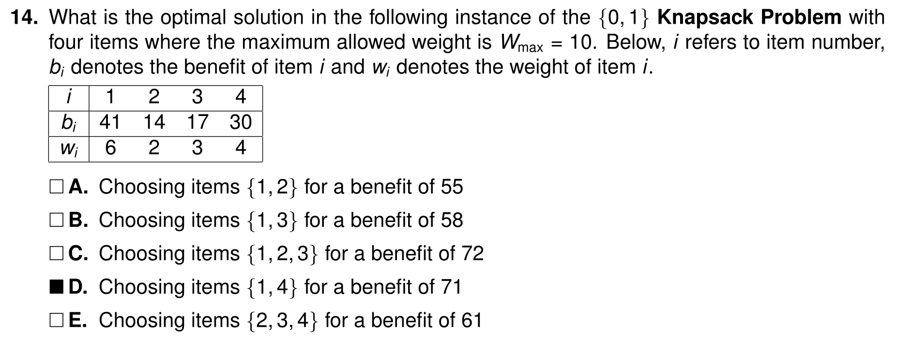

这里可以直接按照选项排除，无需手动模拟！除非题目不给你提示选哪个。

如果是01背包，那么当前状态需要额外空间读取之前的行（保证数据不重叠），如果是完全背包则无需额外空间

## [15] 分数背包问题

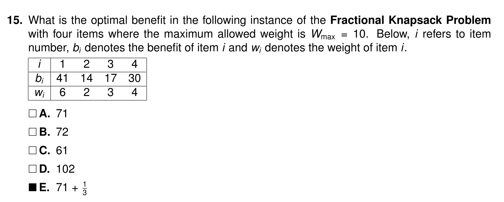

直接使用贪心

