# Week 1 练习

## [1] 大 $O$ 表示中归纳法

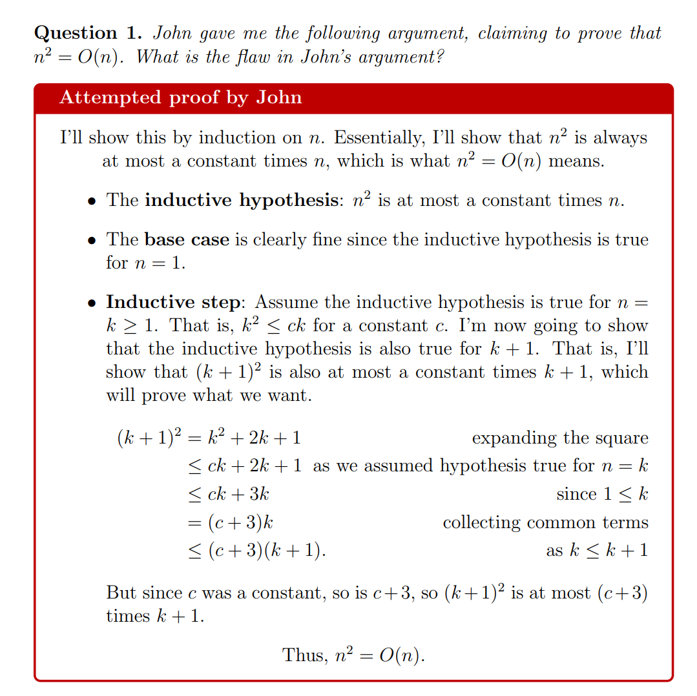

John 希望通过归纳法证明 $n^2 = O(n)$，首先从$O(n)$ 定义入手，也就是希望证明：
$$
f(n)\le c\cdot g(n)\\\\
n^2\le c\cdot n
$$
**基础假设（Inductive Hypothesis）**：$n^2$ 至多是常数倍的 $n$

> $n^2$ is at most a constant time $n$

**边界情况（base case）：** 如果 $n=1$ 那么 $1\le c\cdot 1$ 对于$c\ge1$ 显然成立

**假设：** $k^2\le c\cdot k$ ，现在需要证明对 $(k+1)$ 也成立

题目中最后得到了 $(k+1)^2 \le (c+3)(k+1)$ 这里的推到是对的，但是并不能就此说明 $(k+1)$ 也成立，因为在 $O(n)$ 表示定义中，$c$ 是常数，他是不可变的。

- 在 Base Case，我们得到常数是 $c$
- 第一步，$k$成立中，我们得到常数是 $k$
- 第二步，$k+1$成立中，我们得到常数是 $c+3$

如果继续递推，当到第$n$步时，常数变为$c+3(n-1)$，因此，常数此时变为了$O(n)$ 级别的函数，因此对于$n$步之后，
$$
n^2 \le c' \cdot n \iff n^2 \le (c+3(n-1)) \cdot n
$$
**是不成立的。**


## [2] 数学归纳法

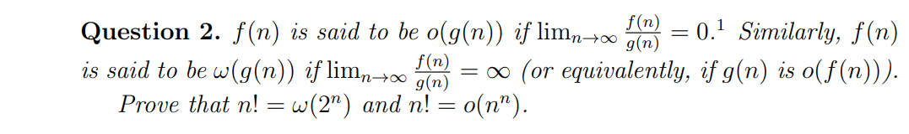


### 证明 $n! = \omega(2^n)$

我们需要证明
$$
\lim_{n \to \infty} \frac{n!}{2^n} = \infty
$$


我们将比值展开：
$$
\frac{n!}{2^n} = \frac{1 \cdot 2 \cdot 3 \cdot 4 \cdot \dots \cdot n}{2 \cdot 2 \cdot 2 \cdot 2 \cdot \dots \cdot 2} = \mathbf{\color{red}{\left( \frac{1}{2} \cdot \frac{2}{2} \cdot \frac{3}{2} \right)}} \cdot \frac{4}{2} \cdot \frac{5}{2} \cdot \dots \cdot \frac{n}{2}
$$
当 $n > 3$ 时，观察每一项：

- 前三项之积为 $\dfrac{1 \cdot 2 \cdot 3}{8} = \dfrac{6}{8} = \mathbf{\color{red}{0.75}}$。
- 对于所有 $k \ge 4$ 的项，都有 $\dfrac{k}{2} \ge \dfrac{4}{2} = 2$。

因此，对于 $n \ge 4$：
$$
\frac{n!}{2^n} \ge 0.75 \cdot 2^{n-3}
$$

> 往下压缩，但是仍然能趋向于$\infin$ ，因此原式必然趋于无穷。

随着 $n \to \infty$，后面指数项必然趋向于无穷，这导致右边为无穷

所以
$$
\lim_{n \to \infty} \dfrac{n!}{2^n} = \infty
$$
即 
$$
n! = \omega(2^n)
$$

### 证明 $n! = o(n^n)$

我们需要证明 
$$
\lim_{n \to \infty} \frac{n!}{n^n} = 0
$$
展开，得到
$$
\begin{aligned}
\frac{n!}{n^n} &= \frac{1 \cdot 2 \cdot 3 \cdot \dots \cdot (n-1) \cdot n}{n \cdot n \cdot n \cdot \dots \cdot n \cdot n}\\\\
\frac{n!}{n^n} &= \left( \frac{1}{n} \right) \cdot \left( \frac{2}{n} \cdot \frac{3}{n} \cdot \dots \cdot \frac{n}{n} \right)
\end{aligned}
$$


发现，所有项都 $\le 1$ ，因此，我们保留第一项


$$
\begin{aligned}
\frac{n!}{n^n} &\le \frac1n\cdot 1^{n-1}=\frac1n\\\\
0 < \frac{n!}{n^n} &\le \frac{1}{n}

\end{aligned}
$$
根据夹逼定理：
$$
\lim_{n \to \infty} 0 = 0\\
\lim_{n \to \infty} \frac{1}{n} = 0
$$
所以
$$
\lim_{n \to \infty} \frac{n!}{n^n} = 0
$$


## [3] 渐进度归类

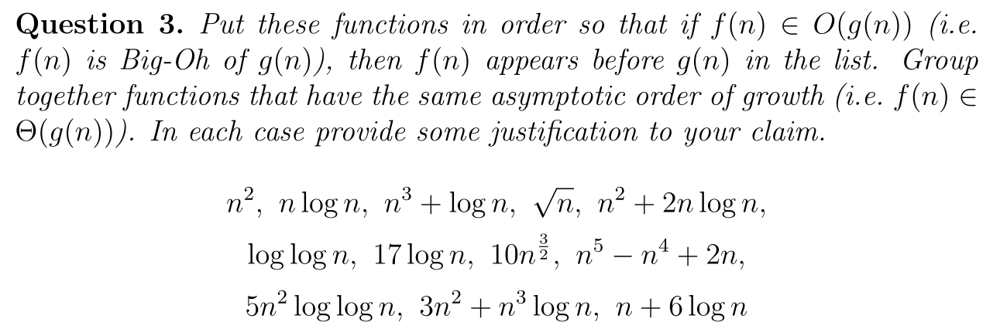

这一题要求按照**渐近增长率（Asymptotic Growth Rate）**从小到大排列这些函数。如果两个函数的增长阶数相同（即 $f(n) \in \Theta(g(n))$），则将它们归为一组。


| **排序** | **函数列表**                 | **增长阶 (Θ)**            | **理由 / 简化依据**                                          |
| -------- | ---------------------------- | ------------------------- | ------------------------------------------------------------ |
| **1**    | $\log \log n$                | $\Theta(\log \log n)$     | 对数增长的对数，是列表中增长最慢的函数。                     |
| **2**    | $17 \log n$                  | $\Theta(\log n)$          | 常数因子 $17$ 不影响渐进阶；对数级增长。                     |
| **3**    | $\sqrt{n}$                   | $\Theta(n^{1/2})$         | 即 $n^{0.5}$，增长速度快于对数但慢于线性。                   |
| **4**    | $n + 6 \log n$               | $\Theta(n)$               | 线性项 $n$ 支配了对数项 $6 \log n$。                         |
| **5**    | $n \log n$                   | $\Theta(n \log n)$        | 线性对数增长，比线性快，但比平方慢。                         |
| **6**    | $10n^{3/2}$                  | $\Theta(n^{1.5})$         | 幂函数，指数为 $1.5$，介于 $1$ 和 $2$ 之间。                 |
| **7**    | $n^2$**,** $n^2 + 2n \log n$ | $\Theta(n^2)$             | 两个函数主导项均为 $n^2$。注：$n^2$ 支配 $2n \log n$。       |
| **8**    | $5n^2 \log \log n$           | $\Theta(n^2 \log \log n)$ | 比 $n^2$ 多了一个 $\log \log n$ 因子，但由于 $\log \log n < n^\epsilon$，它仍小于 $n^3$。 |
| **9**    | $n^3 + \log n$               | $\Theta(n^3)$             | 三次幂项 $n^3$ 支配对数项 $\log n$。                         |
| **10**   | $3n^2 + n^3 \log n$          | $\Theta(n^3 \log n)$      | 主导项是 $n^3 \log n$，比 $n^3$ 快，比 $n^4$ 慢。            |
| **11**   | $n^5 - n^4 + 2n$             | $\Theta(n^5)$             | 高次幂项 $n^5$ 决定了整体的增长速度。                        |


> 任何正幂次的 $n$（即使是 $n^{0.001}$）最终都会增长得比任何对数函数（如 $(\log n)^{100}$）快


## [4] 数学归纳法2

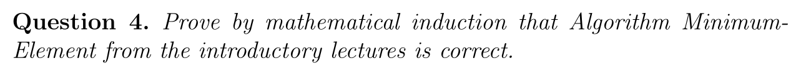

```java
/** Find the minimum of elements in the array A. **/
min ← A[1]
for j ← 2 to length[A]
	do
		/* Compare element A[j] to current min
		and store it if it’s smaller. */
		if A[j] < min
			then min ← A[j]
return min
```


我们假设 $P(k)$ 为数组 `[1,k]` 的最小值

**Base Case**

如果 $k=1$ ，因为 `min ← A[1]` ，无循环，因此结论正确。


**Inductive Hypothesis**

假设 $k=n$ 成立，此时最小值为$P(n)$


**Inductive Step**

我们需要证明当 $k=n+1$ 是否成立，根据代码，如果 `A[n+1]` $>P(k)$ ，那么在第$n+1$次循环时，最小值会更改为$P(k+1)$，否则，不更改。

证明完毕。


# Week 2 练习

## [1] $O(n)$ 寻找最大子数组

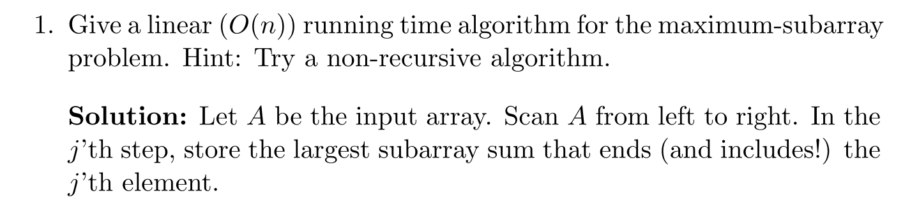


课上，PPT讲了一种 $O(n \log n)$ 分治的方法，但是这个方法又慢又难懂。最好的方法是用前缀和，假设 `prefixSum[]` 数组是 `nums[]` 的前缀，那么我们只需要维护一个变量 `min`，代表`nums[i]`之前遇到的最小值，更新答案为 `answer = Math.max(answer, nums[i]-min)` 然后更新 min 就可以了

因为子数组最大和是连续的，但是如果转化为前缀和，只需要知道最大的两个点即可。这样我们遍历的时候就能确定右端点，`min`是维护左端点。


```java
public static int maxSubarraySum(int[] nums) {
    int[] prefixSum = new int[nums.length + 1];
    for (int i = 1; i < prefixSum.length; i++) prefixSum[i] = prefixSum[i - 1] + nums[i - 1];
    int min = prefixSum[0];
    int answer = nums[0]; // 因为子数组是非空的，不允许为 prefixSum[0]
    for (int i = 1; i < prefixSum.length; i++) {
        answer = Math.max(answer, prefixSum[i] - min);
        min = Math.min(min, prefixSum[i]);
    }
    return answer;
}
```


可以发现计算前缀和的过程与计算的过程可以合并


```java
public static int maxSubarraySum(int[] nums) {
    int[] prefixSum = new int[nums.length + 1];
    int min = prefixSum[0];
    int answer = nums[0];
    for (int i = 1; i < prefixSum.length; i++) {
        prefixSum[i] = prefixSum[i - 1] + nums[i - 1];
        answer = Math.max(answer, prefixSum[i] - min);
        min = Math.min(min, prefixSum[i]);
    }
    return answer;
}
```


然后又发现实际上前缀数组是用不到的，只需要知道当前前缀和即可，用 `prefixSum`维护


```java
public static int maxSubarraySum(int[] nums) {
    int min = 0;
    int answer = nums[0];
    int prefixSum = 0;
    for (int i = 1; i < nums.length + 1; i++) {
        prefixSum = prefixSum + nums[i - 1];
        answer = Math.max(answer, prefixSum - min);
        min = Math.min(min, prefixSum);
    }
    return answer;
}
```


## [2] 分治法求最小值

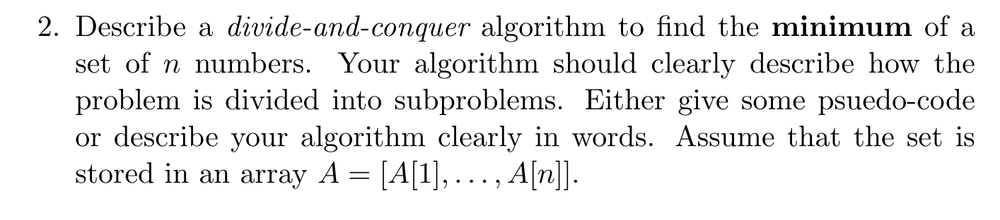


用分治的方法找到一个集合中的最小值，这个在课堂上提到过，我们只需分到低，返回的时候返回左、右集合中的最小值即可。


```java
public static int minValue(int[] nums, int start, int end) {
    if(start==end) return nums[start];
    int left = minValue(nums, start, (start+end)/2);
    int right = minValue(nums, (start+end)/2+1, end);
    return Math.min(left, right);
}
```


## [3] 主定理考察

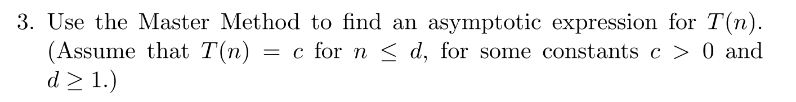

使用主方法找到 $T(n)$ 的渐进表达式（Asymptotic Expression）
$$
\begin{aligned}
(a) \quad & T(n) = 2T\left(\dfrac{n}{2}\right) + \log n \\\\
&\text{这里 } n^{\log_b a} = n^{\log_2 2} = n \text{ 和 } \log n \text{ 比较 (} n \text{ 更大)，结果是 } O(n) \\\\

(b) \quad & T(n) = 7T\left(\dfrac{n}{3}\right) + n^2 \\\\
&\text{这里 } n^{\log_b a} = n^{\log_3 7} \approx n^{1.77} \text{ 和 } n^2 \text{ 比较 (} n^2 \text{ 更大)，结果是 } O(n^2) \\\\

(c) \quad & T(n) = 9T\left(\dfrac{n}{3}\right) + n^3 \log n \\\\
&\text{这里 } n^{\log_b a} = n^{\log_3 9} = n^2 \text{ 和 } n^3 \log n \text{ 比较 (} n^3 \text{ 更大)，结果是 } O(n^3 \log n) \\\\

(d) \quad & T(n) = 16T\left(\dfrac{n}{2}\right) + (n \log n)^4 \\\\
&\text{这里 } n^{\log_b a} = n^{\log_2 16} = n^4 \text{ 和 } n^4 \log^4 n \text{ 比较 (相等，叠加 } \log \text{)，结果是 } O(n^4 \log^5 n) \\\\

(e) \quad & T(n) = 4T\left(\dfrac{n}{2}\right) + n^2 \\\\
&\text{这里 } n^{\log_b a} = n^{\log_2 4} = n^2 \text{ 和 } n^2 \text{ 比较 (相等)，结果是 } O(n^2 \log n) \\\\

(f) \quad & T(n) = 2T\left(\dfrac{n}{2}\right) + 10n \\\\
&\text{这里 } n^{\log_b a} = n^{\log_2 2} = n \text{ 和 } 10n \text{ 比较 (相等)，结果是 } O(n \log n) \\\\

(g) \quad & T(n) = 8T\left(\dfrac{n}{2}\right) + 1000n^2 \\\\
&\text{这里 } n^{\log_b a} = n^{\log_2 8} = n^3 \text{ 和 } 1000n^2 \text{ 比较 (} n^3 \text{ 更大)，结果是 } O(n^3) \\\\

(h) \quad & T(n) = 3T\left(\dfrac{n}{3}\right) + \sqrt{n} \\\\
&\text{这里 } n^{\log_b a} = n^{\log_3 3} = n \text{ 和 } \sqrt{n} \text{ 比较 (} n \text{ 更大)，结果是 } O(n) \\\\

(i) \quad & T(n) = 2T\left(\dfrac{n}{2}\right) + n \log n \\\\
&\text{这里 } n^{\log_b a} = n^{\log_2 2} = n \text{ 和 } n \log n \text{ 比较 (相等，叠加 } \log \text{)，结果是 } O(n \log^2 n) \\\\

(j) \quad & T(n) = 3T\left(\dfrac{n}{2}\right) + n^2 \\\\
&\text{这里 } n^{\log_b a} = n^{\log_2 3} \approx n^{1.58} \text{ 和 } n^2 \text{ 比较 (} n^2 \text{ 更大)，结果是 } O(n^2) \\\\

(k) \quad & T(n) = T\left(\dfrac{n}{2}\right) + 2^n \\\\
&\text{这里 } n^{\log_b a} = n^{\log_2 1} = 1 \text{ 和 } 2^n \text{ 比较 (} 2^n \text{ 极大)，结果是 } O(2^n)
\end{aligned}
$$


# Week 3 练习

## [1] 数学期望考察

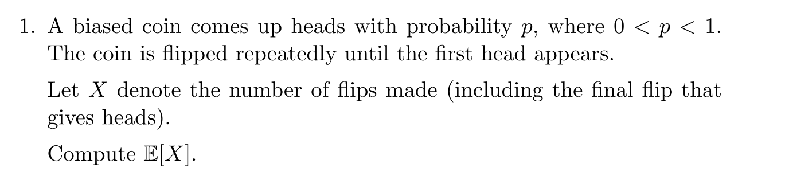

这里这个硬币正面的概率是 $p$，求首次出现正面的数学期望。因为我们课堂上讲过，如果我们不使用极限的方法，我们可以用这个方法：
$$
\mathbb{E}(X)=p\cdot 1 + (1-p)\cdot(1+\mathbb{E}(X))\\
\mathbb{E}(X) = \dfrac1p
$$

> #### 情况 A：第一次就抛出了正面（概率为 $p$）
>
> - **发生了什么：** 游戏结束。
> - **总次数：** 1 次。
> - **贡献项：** $p \cdot 1$
>
> #### 情况 B：第一次抛出了反面（概率为 $1-p$）
>
> - **发生了什么：** 你浪费了 1 次机会，且此时的状态和刚开始时**完全一样**。
> - **总次数：** 你已经抛了 1 次，再加上“从头开始达到目标”所需的平均次数 $\mathbb{E}(X)$。
> - **次数表达：** $1 + \mathbb{E}(X)$。
> - **贡献项：** $(1-p) \cdot (1 + \mathbb{E}(X))$


## [2] 数学期望考察2

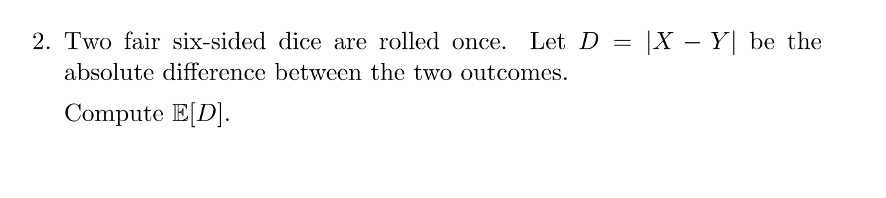


这个只需要列表，$2\times2$ 的表格就可以很好解决，而且直观！

|       | **1** | **2** | **3** | **4** | **5** | **6** |
| ----- | ----- | ----- | ----- | ----- | ----- | ----- |
| **1** | 0     | 1     | 2     | 3     | 4     | 5     |
| **2** | 1     | 0     | 1     | 2     | 3     | 4     |
| **3** | 2     | 1     | 0     | 1     | 2     | 3     |
| **4** | 3     | 2     | 1     | 0     | 1     | 2     |
| **5** | 4     | 3     | 2     | 1     | 0     | 1     |
| **6** | 5     | 4     | 3     | 2     | 1     | 0     |


$$
\mathbb{E}[D] = \dfrac{2(1+3+6+10+15)}{36} = \dfrac{70}{36} = \dfrac{35}{18}
$$


## [3] 设计算法并阐述复杂度

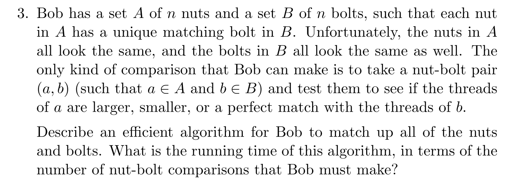

这个问题描述的是算法导论中经典的**“螺母与螺栓（Nuts and Bolts）”问题**。

简单来说，它的核心挑战在于：**你不能直接拿螺母和螺母比，也不能拿螺栓和螺栓比。** 你只能拿一个螺母去试螺栓（看是大了、小了还是正好匹配）。

下面详细拆解这个算法的逻辑和为什么它的复杂度是 $O(n \log n)$。


这个算法巧妙地模仿了**快速排序（QuickSort）**的划分过程：

**第一步：选螺母当“基准”（Pivot）。**

随机挑一个螺母 $n_i$。拿它去比所有的螺栓。这会产生三个结果：比 $n_i$ 小的螺栓、比 $n_i$ 大的螺栓，以及**唯一匹配**的那个螺栓 $b_i$。

**第二步：用找到的螺栓 $b_i$ 反向划分。**

既然找到了匹配的螺栓 $b_i$，现在拿这个 $b_i$ 去比剩下的所有螺母。这又会将螺母分成两拨：比 $b_i$ 小的和比 $b_i$ 大的。

**第三步：分治（Divide and Conquer）。**

现在你有了：

- 两拨“较小”的组（螺母和螺栓数量严格相等）。

- 两拨“较大”的组（数量也严格相等）。

- 一个已经配对成功的 $(n_i, b_i)$。

  接下来，只需要递归地在小数组和大数组里重复这个过程。


## [4] 计算时间复杂度

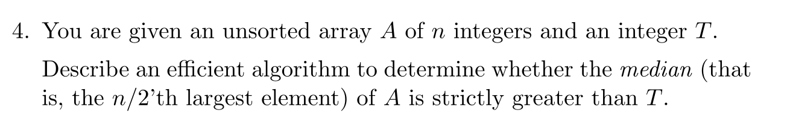

给定无需数组 $\mathbf A$ 和一个数 $T$，如何确保 $\mathbf A$ 的中位数严格大于 $T$ 呢？

我们可以使用 $O(n)$ 线性扫描，如果扫描到这个数大于 $T$ 那么计数器+1，最后返回 `counter<n/2`


# Week 4 练习

## [1] 复杂度分析 - 查找重复数

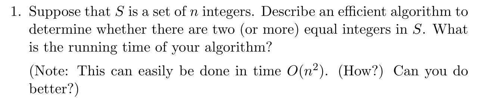

考虑一个$n$个数的集合，如何确定这个集合有没有重复数呢？

暴力方法 $O(n^2)$

排序方法 $O(n\log n)$

> 实际上可以用哈希，但是课程中没有提到，哈希可以做到 $O(n)$


## [2] 复杂度分析 - 集合重复

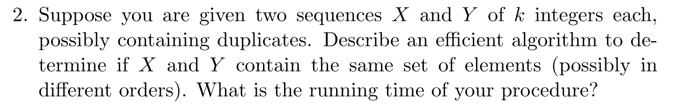

题目Note：该集合内的元素可以重复，所以将其看成一个带有重复数字的数组！


暴力方法 $O(n^2)$

排序方法 $O(n\log n)$

> HashMap $O(n)$


## [3] 两数之和

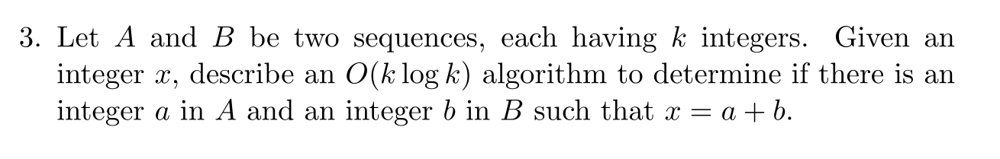

这个就是两数之和，通过移动变量和哈希可以达到 $O(n)$ 复杂度，因为课程没有介绍哈希，因此使用排序的方法。


第一种方法是 排序+二分，这个很好理解，两个集合排序，遍历左边，找出右边 $b=x-a$ ， 用二分找，总体时间复杂度 $O(n\log n)$


第二种方法是 排序+双指针，这个也很好理解，两个集合排序，指针`indexA` 指向 A 集合的最左边，指针 `indexB`指向集合B的最右边，根据 **和** 调整左右指针。总体时间复杂度 $O(n \log n)$


## [4] 投票算法

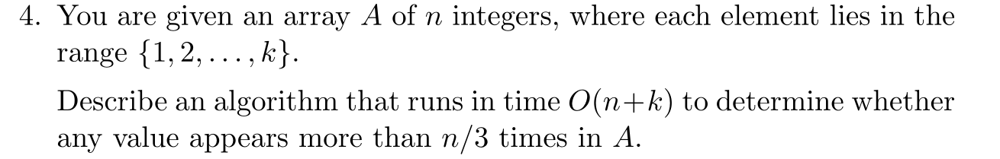

现在无序数组 $A$ 的每一个元素的范围是 $[1,k]$，这个题目是投票算法的变体。

投票场景：选出一个数拥有超过 $ > n/2$ 的频率，对于这个场景，我们采用的是**[Boyer-Moore 投票算法](https://www.bilibili.com/video/BV1Co4y1y7LL)**。

其中时间复杂度 $O(n)$，空间上只需要维护`<候选人，票数>`一个计数器即可，空间复杂度 $O(1)$


那么在这个题目中，因为我们要找到是否存在任何频率 $> n/3$ 的数字，我们要做的就是维护两个这样的`<候选人，票数>`**计数器**，但是值得一提的是，题目要求的时间复杂度是 $O(n+k)$，题目本意是让我们使用类似于频率桶的算法，但是摩尔算法可以达到时间复杂度 $O(n)$并且空间复杂度$O(1)$，所以更加优秀！


步骤如下，遍历 `for(int x : array)`：

- 如果候选人1或者2有位置（`voteCount = 0`） 直接顶替，break
- 现在，候选人都有位置了，看看 `x` 是否是其中的候选人，如果是就 `++` 对应的候选人
- 如果`x`都不是这俩候选人，这俩候选人**都要**`--`


结束后，还需要重新遍历一次`array`确保这两个候选人票数确实$>n/3$


# Week 5 练习

## [1] 01背包 + 分数背包

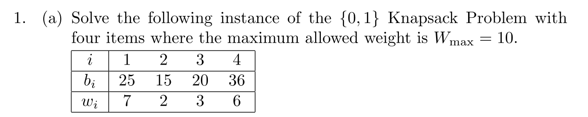

01背包答案：

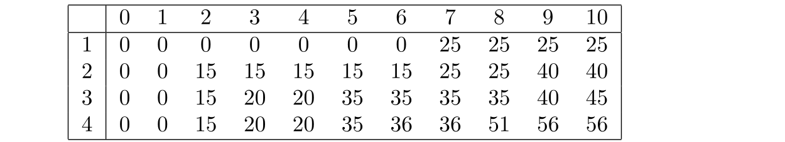


分数背包答案：
$$
15+20+\dfrac56(36)=65
$$


## [2] 01背包+分数背包2

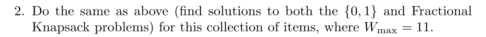

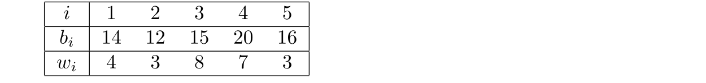

01背包答案：

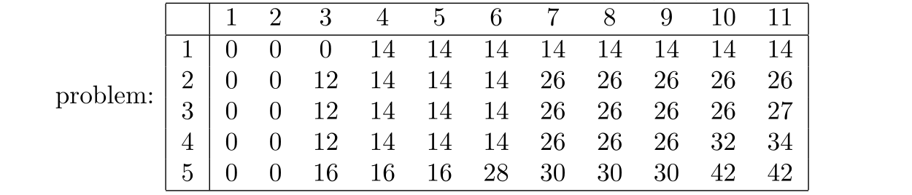

分数背包答案：
$$
42+\dfrac 17 (20)=44\dfrac67
$$


## [3] 贪心VS动态规划

描述一种高效的贪心算法，用于在给定四个面值（27, 9, 3, 1）的情况下，用最少数量的硬币凑出指定金额。请论证为什么你的算法是正确的。

用贪心，按顺序尽可能拿！

1. 先尽可能拿27的若干张
2. 然后再尽可能拿9的若干张
3. 接着尽可能拿3的若干张
4. 最后拿完1

---


假设有一家邮局出售三种不同面额的邮票：1p、7p 和 10p。通过举出一个会让贪心算法出错的输入用例，证明这种自然的贪心算法（也就是你在上一题中设计的那个）并不一定能得出正确答案。设计一个动态规划算法来找出凑齐 $N$ 便士邮资所需的最少邮票数量。该算法的运行时间是多少？


在面值为 **{10, 7, 1}** 的系统中，贪心算法会失效。

必须使用dp，状态转移方程：
$$
dp[i] = 1 + \min(dp[i-1], dp[i-7], dp[i-10])
$$
复杂度 $O(N)$


---

为什么一个可以用贪心，一个不行？

**面值结构：倍数关系 vs. 随机关系！**这是导致算法选择不同的**根本原因**。

**第一题 (27, 9, 3, 1)**：这是一组**几何级数**（即 $3^3, 3^2, 3^1, 3^0$）。每一个大的面值都是前一个面值的**整数倍**。

- **结论**：在这种结构下，低面值硬币无论怎么凑，只要没达到高面值的金额，硬币数量永远比直接用一个高面值硬币要多。所以放心大胆地选最大的。

**第二题 (10, 7, 1)**：这是一组**非倍数关系**。$10$ 不是 $7$ 的倍数。

- **结论**：这种不规则的结构会制造“陷阱”。比如凑 $14$，如果你拿了一个 $10$，剩下的 $4$ 必须用 $4$ 个 $1$ 来凑（共 $5$ 枚）；但如果你放弃最大的 $10$，改选两个 $7$，只需要 $2$ 枚。


## [4] 最长递增子序列


**最长递增子序列 (Longest Increasing Subsequence, LIS)。**这是一个经典的动态规划问题！

给定一个实数序列 $A_1, A_2, \dots, A_n$，确定一个长度最大的子序列（不一定连续），使得该子序列中的数值构成一个严格递增的序列。

例如，给定整数序列：
$$
-3, 4, 14, 0, -1, 3, 5, 2, 5, 10
$$
由 $4, 5, 10$ 组成的子序列是一个递增子序列，$-3, 0, 3, 5, 10$ 也是一个递增子序列。你的任务是找到一个最长的子序列，使得其中的数值是严格递增的。（原始序列中可能会有重复数字，但最长子序列中不能包含重复数字，因为它必须是严格递增的。）


### [4.1] n^2 的dp思路


动态规划思路：

- **状态定义**：设 $\texttt{dp[i]}$ 是以第 $i$ 个数字**结尾**的最长递增子序列的长度。
- 转移方程：扫面 $i$ 前面的所有$\texttt{dp[j]}$
  - $\texttt{A[j]<A[i]}$ 那么，$\texttt{dp[i]=Math.max(dp[j]+1,dp[i])}$ 
  - 否则，跳过
  - 同步更新答案 


复杂度 $O(n^2)$，题目对应 [300. 最长递增子序列](https://leetcode.cn/problems/longest-increasing-subsequence/)


```java
public static int lengthOfLIS(int[] A) {
    int[] dp = new int[A.length];
    dp[0]=1;
    int answer = 1;
    for(int i = 0 ; i < dp.length;i++){
        dp[i]=1;
        for(int j = 0 ; j < i ; j ++ )
            if(A[j]<A[i]) dp[i] = Math.max(dp[i],dp[j]+1);
        answer = Math.max(answer,dp[i]);
    }
    return answer;
}
```


### [4.2] nlogn 的dp思路

先前的dp思路是， $\texttt{dp[i]}$ 代表 $i$ 为结尾的 LIS 长度，如果希望优化时间复杂度，我们可以尝试调换**状态()**和**状态值**！

我们可以换成 $\texttt{g[i]}$代表长度为 $\texttt{i+1}$ 的 LIS 结尾最小的数字

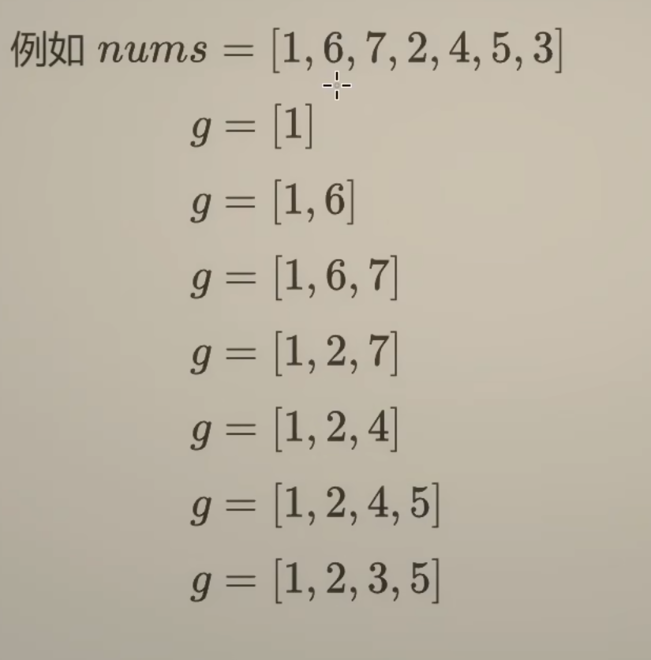

我们可以考虑用一个栈的方法，由于遍历 $n$，二分查找 $\log n$，时间复杂度就是 $O(n\log n)$，$\texttt{g[]}$ 的严格递增使得这种方法允许二分查找！


```java
public static int lengthOfLIS(int[] A) {
    int[] g = new int[A.length];
    int index = 0;
    g[0] = A[0];
    for (int i = 1 ; i < A.length ; i ++ ) {
        int insert = Arrays.binarySearch(g, 0, index + 1, A[i]);
        if(insert>=0) continue;
        insert = -(insert + 1);
        g[insert] = A[i];
        if(insert>index) index = insert;
    }
    return index+1;
}
```


# Week 8 联系

## [1] 欧几里得

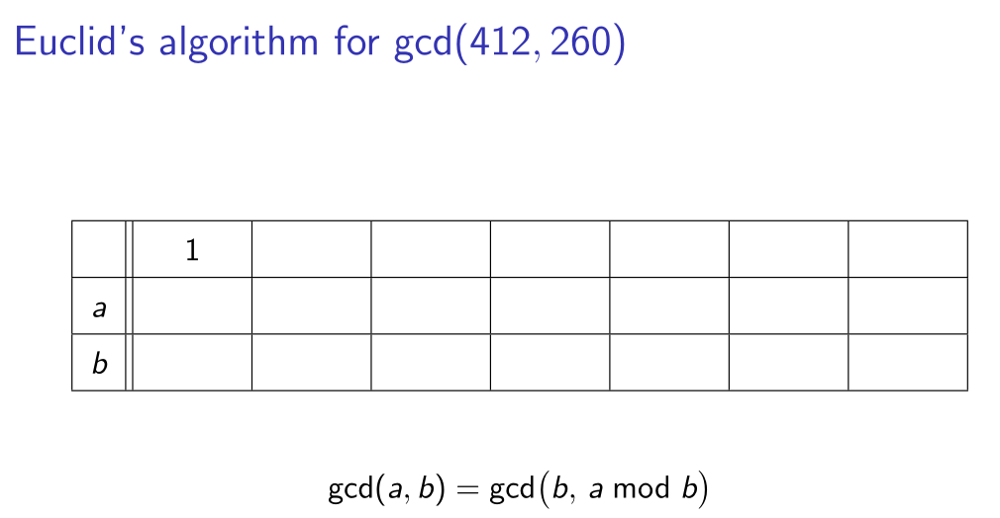

只要会扩展欧几里得，这个就会填。

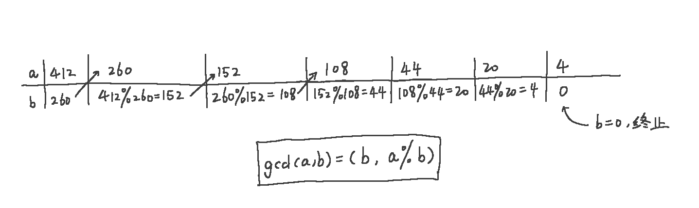

## [2] 扩展欧几里得

扩展欧几里得实际上需要先进行一次欧几里得，算出 a 和 b，然后回溯。

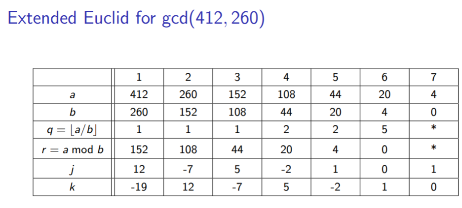

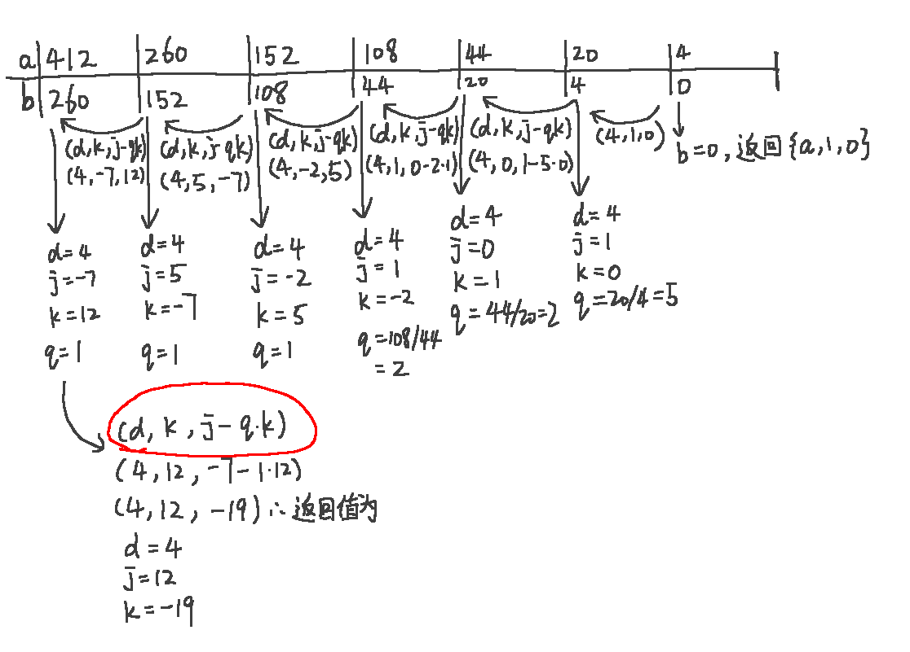

## [3] （扩展）欧几里得应用题

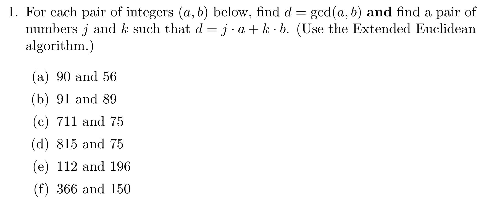

此处，
$$
d=\mathtt{gcd(a,b)}
$$
需要我们找出合理的 $\mathtt{j,k}$ 满足 $\mathtt{j\cdot a + k \cdot b}$， 我们拿一个例子举例：$\mathtt{a=90, b=56}$。

首先，利用欧几里得算法算出 $\mathtt{d=gcd(90,56)=2}$

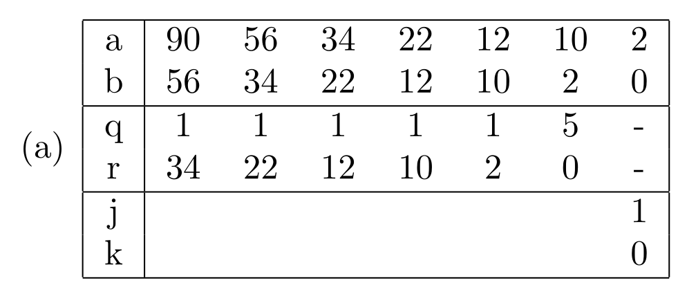

随后，利用扩展欧几里得，算出全表。得到 $\mathtt{(90,56)}$对应的$\mathtt{(j,k)=(5,-8)}$

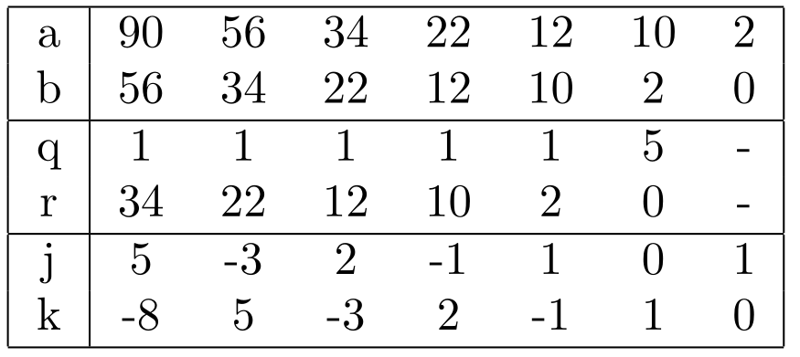

这样就找出了对应的 $\mathtt{(j,k)}$！必然有：
$$
\mathtt{d=gcd(90,56)=2\iff d=(5)\cdot90+(-8)\cdot56}
$$


在链式中， $\mathtt{d=gcd(90,56)=gcd(56,34)=gcd(34,22)=gcd(12,10)=gcd(10,2)=gcd(2,0)}$ ，他们**==对应的==** $\mathtt{(j,k)}$ 都能让他们组成：
$$
\mathtt{d=j\cdot a + k \cdot b}
$$

## [4] RSA - 加密

我们先回顾一下 RSA 如何选取公钥和私钥的：

先选两个**大质数$p$和$q$**，并定义欧拉函数 $\phi(n)=(p-1)(q-1)$

选择两个数，$e$ 和 $d$，这两个数就是公钥和私钥！$e$ 和 $d$ 需要满足如下性质

- $1<e<\phi(n)$

- $e$ 和 $\phi(n)$ 互质，也即 $gcd(e,\phi(n))=1$

- $ed\equiv1(\text{~~mod~~} \phi(n))$

  > **==已知$e$的时候可以用扩展欧几里得算法来求出 $d$==**
  >
  > $ed\equiv1(\text{~~mod~~} \phi(n))$ 的意思是，$ed $ 除以 $\phi(n)$ 余 $1$。

定义 $N=p\cdot q$，就有了加密和解密：
$$
C = M^{\color{red}{e}}\text{~~mod~~}N\\
M = C^{\color{red}{d}}\text{~~mod~~}N
$$

---


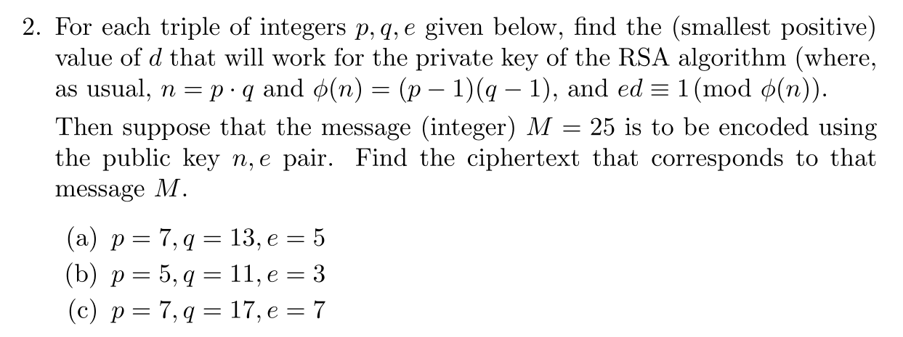

例如例子（a），我们知道 $\mathtt{p=7,q=13}$ 那么 $\mathtt{\phi(n)=(7-1)(13-1)=72}$，我们还知道了 $\mathtt{e=5}$，我们知道：
$$
\mathtt{ed\equiv1(\text{~~mod~~} \phi(n))}
$$
在知道 $\mathtt{e,\phi(n)}$ 的情况下，如何求 $\mathtt d$ 呢？

求解 $\mathtt{ed \equiv 1 \pmod{\phi(n)} }$ 等价于求解：
$$
\begin{aligned}
\mathtt{ed-1=}&\mathtt{t\cdot \phi(n)}\\
\mathtt{ed+t\cdot \phi(n)=}&\mathtt{1}\\
\mathtt{5d+t\cdot72=}&\mathtt{1}
\end{aligned}
$$


**第一步：**

用扩展欧几里得算法求 $\mathtt{gcd(e,\phi(n))=\gcd(5,\ 72)} $

需要求出整数 $\mathtt{j,\ k} $ 使得：
$$
\mathtt{j \cdot 5 + k \cdot 72 = \gcd(5,\ 72)}
$$
**辗转相除（求 q 和 r）：**

| $\mathtt{a} $ | $\mathtt{72} $ | $\mathtt{5} $ | $\mathtt{2} $ | $\mathtt{1} $ |
| :-----------: | :------------: | :-----------: | :-----------: | :-----------: |
| $\mathtt{b} $ | $\mathtt{5} $  | $\mathtt{2} $ | $\mathtt{1} $ | $\mathtt{0} $ |
| $\mathtt{q} $ | $\mathtt{14} $ | $\mathtt{2} $ | $\mathtt{2} $ | $\mathtt{-} $ |
| $\mathtt{r} $ | $\mathtt{2} $  | $\mathtt{1} $ | $\mathtt{0} $ | $\mathtt{-} $ |

所以 $\mathtt{\gcd(5,\ 72) = 1} $（满足 RSA 条件：$e$ 和 $\phi(n)$ 互质，也即 $gcd(e,\phi(n))=1$）。

**第二步：填表**

|       a       | $\mathtt{72} $ | $\mathtt{5} $  | $\mathtt{2} $ | $\mathtt{1} $ |
| :-----------: | :------------: | :------------: | :-----------: | :-----------: |
| $\mathtt{b} $ | $\mathtt{5} $  | $\mathtt{2} $  | $\mathtt{1} $ | $\mathtt{0} $ |
| $\mathtt{q} $ | $\mathtt{14} $ | $\mathtt{2} $  | $\mathtt{2} $ | $\mathtt{-} $ |
| $\mathtt{r} $ | $\mathtt{2} $  | $\mathtt{1} $  | $\mathtt{0} $ | $\mathtt{-} $ |
| $\mathtt{j} $ | $\mathtt{-3} $ | $\mathtt{1} $  | $\mathtt{0} $ | $\mathtt{1} $ |
| $\mathtt{k} $ | $\mathtt{43} $ | $\mathtt{-3} $ | $\mathtt{1} $ | $\mathtt{0} $ |

**第三步：验证裴蜀等式**
$$
\mathtt{(-3) \cdot 72 + 43 \cdot 5 = -216 + 215 = -1}
$$

> [!CAUTION]
>
> 等式得到的是 $\mathtt{-1} $ 而不是 $\mathtt{1} $。这是因为表格里 $\mathtt{j,\ k} $ 对应的是 $\mathtt{j \cdot a + k \cdot b} $，即 $\mathtt{(-3) \cdot 72 + 43 \cdot 5 = -1} $。

两边同时取负号：
$$
\mathtt{3 \cdot 72 + (-43) \cdot 5 = 1}
$$
也就是：
$$
\begin{aligned}
\mathtt{(-43) \cdot 5 }&\mathtt{\equiv 1 \pmod{72}}\\
\mathtt{(-43)\cdot e }&\mathtt{\equiv 1 \pmod{\phi(n)}}
\end{aligned}
$$
**第四步：把 $\mathtt{d}$ 化为正数**

加上 $\mathtt{72} $ 得到正数表示：
$$
\mathtt{d = -43 + 72 = 29}
$$
**第五步：验证**
$$
\mathtt{e⋅d=5⋅29=145=2⋅72+1}
$$
**第六步：加密**
$$
C = M^{\color{red}{e}}\text{~~mod~~}N\\
M = C^{\color{red}{d}}\text{~~mod~~}N
$$
计算，$n = p · q = 91$，因此 $C=25^5 \mod 91$

- 逐步算（每一步都先取模，避免数字过大）
- 快速幂：

|       步骤       |          计算           |   模 91 结果   |
| :--------------: | :---------------------: | :------------: |
| $\mathtt{25^1} $ |     $\mathtt{25} $      | $\mathtt{25} $ |
| $\mathtt{25^2} $ | $\mathtt{25^2 = 625} $  | $\mathtt{79} $ |
| $\mathtt{25^4} $ | $\mathtt{79^2 = 6241} $ | $\mathtt{53} $ |

最后：
$$
\mathtt{25^5 \equiv 25^4 \cdot 25^1 \equiv 53 \cdot 25 = 1325 \equiv 51 \pmod{91}}
$$


总结步骤：

- 求出 $n=pq$，现在知道 $\phi(n),e,n$ 求 $d$
- 因为 $ed\equiv 1 (\mod \phi(n))$ 也就是意味着$e\cdot j + phi(n)\cdot k = 1$，而恰好 $gcd(e,\phi(n))=1$
- 因此，也就意味着 $e\cdot j + phi(n)\cdot k = gcd(e,\phi(n))$
- 这可以使用扩展欧几里得来求出 $j$，也就是 $e$ 的系数。 求出来之后就意味着$e\cdot j \equiv 1 (\mod \phi(n))$，这里就相当于把 $d$ 求出来了（如果是负数，就加上 $\phi(n)$）
- 最后通过快速幂去求 $C$


## [5] RSA - 解密

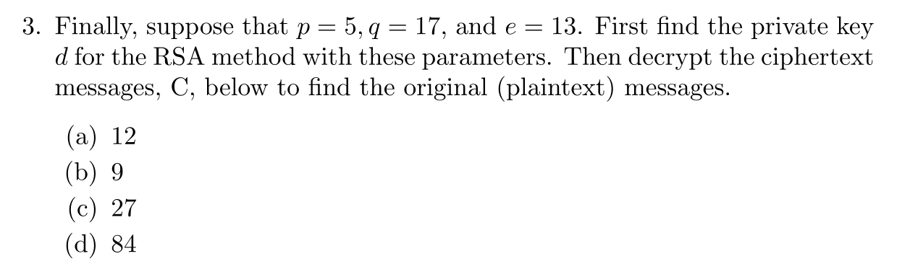

同样，运用上述所学，我们求出 $d$ 之后就可以解密了。


