# 202526-COMP202 - Complexity of Algorithms

完成本模块时，需要：

- 能够熟练运用基本数据结构（堆、图等）解决经典算法问题（搜索、排序、图算法、安全问题）
- 了解基本数论应用
- 熟悉**形式理论（Formal Theories）**，这些理论提供了证据，证明许多重要的计算问题本质上是难以处理的，例如 **NP 完全**


成绩构成：

| **Assessments**        | **When is it released?** | **Weighting** | **Details**                                  |
| :--------------------- | :----------------------- | :------------ | :------------------------------------------- |
| Class test             | 2026/03/10 (Week 7)      | 15%           | 个人现场测试，范围是第五周之前（包括第五周） |
| Programming assignment | 2026/03/16 到 2026/04/24 | 15%           | Python + CodeGrade                           |
| Final exam             | 2026/05/20               | 70%           | 期末                                         |


# 大 $O$ 表示

## [1] 定义

给定**正函数（Positive Function）** $f(n)$ 和 $g(n)$ ，如果存在$c>0$ 和 $n_0\ge0$，使得
$$
\begin{aligned}

f(n)\le	c\cdot g(n)~~~~~~~~\forall n\ge n_0

\end{aligned}
$$
那么，我们认为
$$
f(n) \in O(g(n))
$$

> 该知识点在大二学过，参考INT102，以下是一些补充

$n_0$ 的含义是要求数据不被较小范围的数据影响，如下图

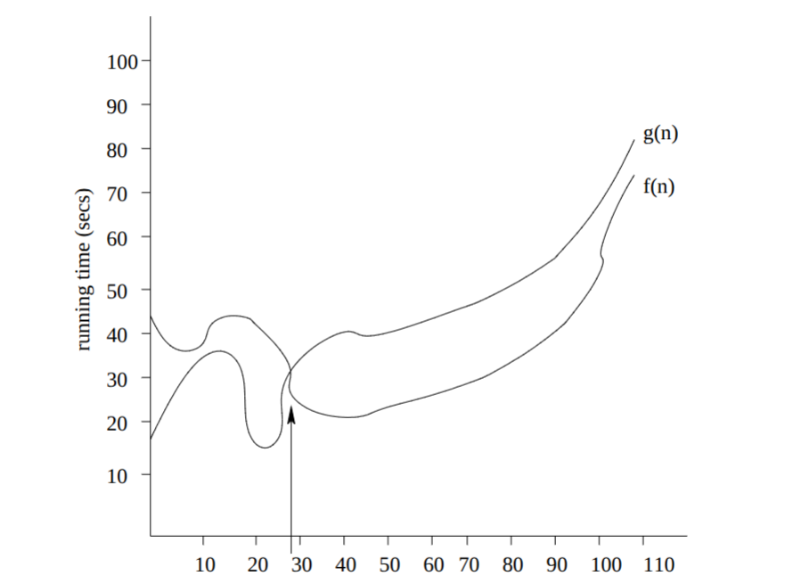


### [1.1] 例题1
> [!NOTE]
>
> 如何快速找到 $c$ 和 $n_0$？
>
> - 令 $c$ 为**最高次幂项**系数$+1$
> - 代入 $c$ 计算出对应 $n_0$

证明 $7n-4 \in O(n)$

> 证明如下
> $$
> \begin{aligned}
> f(n)&=7n-4\\\\
> g(n)&=n\\\\
> 令~c &= 7+1=8\\\\
> 因此需要找出f(n_0)&\le8\cdot g(n_0)也就是\\\\
> 7n_0-4 & \le 8n_0\\\\
> n_0 & \ge -4\\\\
> \end{aligned}
> $$
> 因此我们取 $n_0\ge-4$ 都可以，但是$n_0\ge0$，因此取 $0$ 即可
>
> 我们说，$7n-4\in O(n)$ 因为$\forall n\ge 0$ 都有
> $$
> f(n) \le 8\cdot g(n)
> $$


### [1.2] 例题2

> [!NOTE]
>
> ==另一种方法也很简单，直接重复**最高次项**==

证明 $3n^2+n+16 \in O(n^2)$

> 证明如下
> $$
> \begin{aligned}
> f(n)&=3n^2+n+16\\\\
> g(n)&=n^2\\\\
> 3n^2_0+n_0+16 &\le 3n^2_0+n^2_0+n^2_0=5n^2_0
> \end{aligned}
> $$
> 此处，我们得出 $c=5$ , $n_0\ge4$ ，因此，$\forall n\ge4$
> $$
> f(n)\le 5 \cdot g(n)
> $$


实际上，当我们确定 $c=5$ 后，只要 $n_0$ 足够大，上式一定成立，例如$n_0=999\_999\_999$

### [1.3] 例题3

证明 $13n^2+7n\log{n}+3\in O(n^3)$

> 证明如下，使用重复最高次项，得出
> $$
> 3n^2_0+7n_0\log{n_0}+3 \le21n^2_0
> $$
> 此处，$c=21$，对于足够大的 $n_0$ ，对于 $\forall n\ge n_0$ 总有
> $$
> f(n) \le 21 \cdot g(n)
> $$


这样我们可以证明，只有最高次项决定了 $f(n)$ 属于哪个 $O(g(n))$，不过，$f(n)$ 也可以同时属于多个 $O(g(n))$

例如，我们假设 $f(n)=n^3+n\log{n}$

- $f(n)\in O(n^3)$
- $f(n)\in O(n^4)$
- $f(n) \in O(n^5)$
- ......

因此，我们可以说

- $\sqrt{n} = n^{\frac12} \in O(n)$
- $3\log{n}+\log{\log{n}} \in O(\log{n})$
- $\dfrac5n \in O(\dfrac1n)$
- $\dfrac5n \in O(\dfrac{1}{\sqrt{n}})$

> 解释：
> $$
> \begin{aligned}
> \dfrac5n &=5\cdot n^{-1}\\
> \dfrac{1}{\sqrt{n}} &= n^{-\frac12}
> \end{aligned}
> $$
> 此处， $-\dfrac12\ge-1$


## [2] 更多表示


| **记号**                | **含义**                    | **关注点**                             |
| ----------------------- | --------------------------- | -------------------------------------- |
| **$O(g(n))$** 上界      | 运行时间 $\le$ 某个标准     | 保证算法不会比这更慢（最坏情况）       |
| **$\Omega(g(n))$** 下界 | 运行时间 $\ge$ 某个标准     | 保证算法至少需要这么多时间（最好情况） |
| **$\Theta(g(n))$**      | 运行时间 $\approx$ 某个标准 | 算法的精确增长水平                     |


$$
O(~log (n)~) < O(\sqrt n) < O(n) < O(n log n) < O(n²) < O(2^n)
$$


> $\Omega$ 读作 ***Omega***
>
> $\Theta$ 读作 ***Theta***

如果 $f(n)$ 是 $O(g(n))$ 且 $f(n)$ 是 $\Omega(g(n))$ 那么我们说 $f(n)$ 是 $\Theta(g(n))$

> 此时 $g(n)\in O(f(n))$ 且 $f(n) \in O(g(n))$


> [!NOTE]
>
> 给定正函数 $f(n)$ 和 $g(n)$，如果存在常数 $c > 0$ 和 $n_0 \ge 0$，使得：
> $$
> f(n) \ge c \cdot g(n) \quad \forall n \ge n_0
> $$
> 那么，我们认为：
> $$
> f(n) \in \Omega(g(n))
> $$
> 针对任何多项式，我们只需要让 $c$ 尽可能小 ，计算出 $n_0$ 即可


### [2.1] 例题1

让$c=1$，计算出 $n_0$，我们可以证明

- $3\log{n}+\log\log n \in \Omega \log n$

- $\dfrac23n^2-n \in \Omega(n^2)$

  > 此处，我们让 $c$ 选择为一个比 $\dfrac23$ 小的数，例如 $\dfrac13$
  >
  > 这样我们就必然可以证明
  > $$
  > \dfrac 23 n^2-n \ge \dfrac 13 n^2
  > $$
  > 最后找出对应$n_0$ 即可

- $2n^3-n+7 \in \Theta(n^3)$

  > 因为 $f(n)\in O(n^3)$ 且 $f(n) \in \Omega(n^3)$

## [3] 归纳法 Induction

归纳法用于证明一些东西，步骤如下：

- 先从最小（下界）开始，证明这个下界成立
- 假设$n=k$成立，然后我们看看 $n=k+1$ 是否成立
- 如果$n=k+1$也成立，那么，我们通过如下条件：
  - 下界成立
  - 如果$n=k$成立，必然有$n=k+1$成立
- 就可以推到出，$\forall n\ge$ 下界，都成立。


### [3.1] 例子

证明
$$
1+...+n=\dfrac{n(n+1)}{2} \forall n\ge 1
$$
首先，判断 $n=1$ 下界是否成立，显然成立

其次，假设 $n=k$ 成立
$$
1+...+k = \dfrac{k(k+1)}{2}
$$
最后，求证 $n=k+1$ 是否成立，也就是判断如下等式是否成立
$$
1+...+k+(k+1) = \dfrac{(k+1)(k+2)}{2}
$$
两式相减，得到
$$
\begin{aligned}
k+1&=\dfrac{(k+1)(k+2)-k(k+1)}{2}\\
k+1&=\dfrac{2(k+1)}{2}
\end{aligned}
$$
显然成立

> 当然这种方法不太严谨，在实际过程中，可以用 LHS 和 RHS 来推导


## [4] 反证法 Proof by Contraction

> 如果**反设（Assumption to the Contrary）** 不成立，那么原设成立
>
> 反之，也可以推翻原设

**命题（Proposition）**如下：
$$
如果ab是奇数,且a和b是自然数,那么a是奇数或者b是偶数
$$
**提出**

我们要否定结论“$a$ 是奇数 或 $b$ 是偶数”。

根据逻辑代数中的德·摩根定律，$\neg(A \lor B) \iff \neg A \land \neg B$。

所以结论的否定（反设）是：

> **$a$ 不是奇数（即 $a$ 是偶数） 且 $b$ 不是偶数（即 $b$ 是奇数）。**


**进行推导**

基于反设，我们可以将 $a$ 和 $b$ 表示为：

- 令 $a = 2k$ （因为 $a$ 是偶数，$k \in \mathbb{N}$）
- 令 $b = 2m + 1$ （因为 $b$ 是奇数，$m \in \mathbb{N} \cup \{0\}$）

现在我们来计算它们的积 $ab$：
$$
ab = (2k)(2m + 1)\\
ab = 4km + 2k\\
ab = 2(2km + k)
$$


**发现矛盾**

- 由于 $k, m$ 都是整数，所以 $2km + k$ 也是整数。
- 根据计算结果，$ab$ 显而易见是一个**偶数**（能被 2 整除）。
- 然而，题目给出的已知条件是 **“$ab$ 是奇数”**。
- 这产生了明显的矛盾：$ab$ 不能既是偶数又是奇数


**得出结论**

因为从反设出发导致了矛盾，所以反设不成立。 故原命题成立：**如果 $ab$ 是奇数，那么 $a$ 必为奇数或 $b$ 必为偶数。**


如果我们为了证明一个结论是对的，我们可以使用反证法，证明反设是错误的

如果我们为了推倒一个结论（证明他是错的），我们也可以使用反证法，给出一个反例


# 分治思想

分：Divide

治：Conquer

分治可以分为这三个步骤：

- 分解（Divide）：分解为多个**子集合**
- 递归（Recur）：递归地解决**子集合**
- 治理/合并（Conquer）整合子集合

## [1] 归并排序

**归并排序（Merge Sort）**是一种经典的**分治思想**的实现。

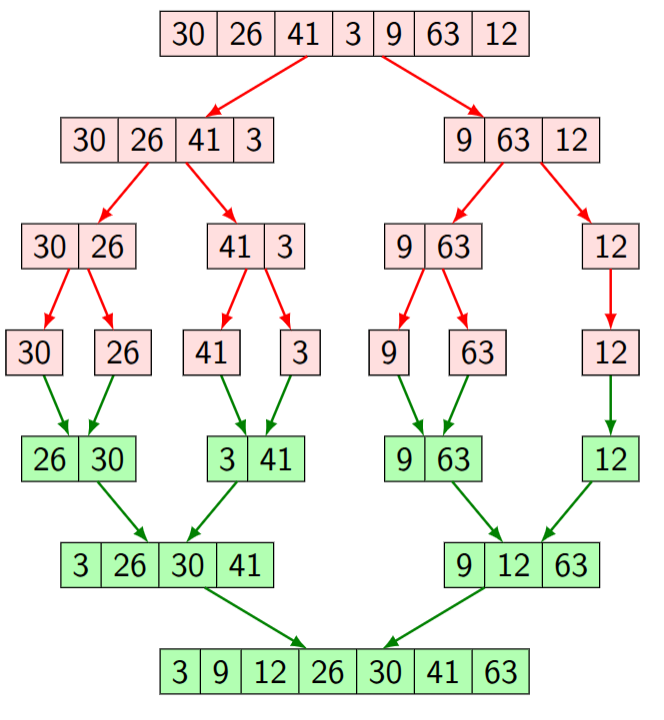

在归并排序中Divide + Recur 的时间复杂度是 $O(\log n)$ 级别的

- Conquer 的时候，例如 `[26,30]` 合并 `[3,41]`，使用双指针，基于单调前提，时间复杂度是$O(n_1+n_2)$ 级别的。

  > [!NOTE]
  >
  > 此处 $\sum n_i=n$ 因此总体时间复杂度为 $O(n\log n)$


```java
public static void mergeSort(int[] array, int begin, int end) {
    if (begin >= end) return;
    int middle = (begin + end) >>> 1;
    mergeSort(array, begin, middle);
    mergeSort(array, middle + 1, end);
    int left = begin;
    int right = middle + 1;
    int index = -1;
    int[] temp = new int[end - begin + 1];
    while (left <= middle && right <= end)
        if (array[left] <= array[right]) temp[++index] = array[left++];
        else temp[++index] = array[right++];
    while (left <= middle) temp[++index] = array[left++];
    while (right <= end) temp[++index] = array[right++];
    System.arraycopy(temp, 0, array, begin, temp.length);
}
```


## [2] 归并排序递归式

我们定义函数 $T(n)$ 代表在大小为 $n$ 的输入上可能的**最差**运行时间，接下来，我们用归并排序举例子！

我们把 $T(n)$ 称作**递归式（Recurrence）**
$$
\begin{aligned}
T(n)=
\begin{cases}
c&\text{if}&n\le1\\
2T(\dfrac n2)+d\cdot n&\text{if}&n\ge1
\end{cases}
\end{aligned}
$$
这里的 $c$ 和 $d$ 是小常数，具体来讲类似于上面提到的 $d = n_1 + n_2$ ，或者，我们可以直接把$d\cdot n$写为$n$

严格来说，应当写成
$$
\begin{aligned}
T(n)=
\begin{cases}
c&\text{if}&n\le1\\
T(\lfloor n / 2\rfloor)+T(\lceil n / 2\rceil)+d n&\text{if}&n\ge1
\end{cases}
\end{aligned}
$$


## [3] 二分搜索递归式

> Binary Search 二分搜索

显然，二分搜索的实现复杂度是$O(\log n)$，他的递归式是怎么样的？
$$
\begin{aligned}
T(n)=
\begin{cases}
c&\text{if}&n\le1\\
T(\dfrac n2)+c&\text{if}&n\ge1
\end{cases}
\end{aligned}
$$


## [4] 递归式算时间复杂度

对于归并排序的递归式，如何计算时间复杂度？
$$
\begin{aligned}
T(n)=
\begin{cases}
c&\text{if}&n\le1\\
2T(\dfrac n2)+c\cdot n&\text{if}&n\ge1
\end{cases}
\end{aligned}
$$

> 此处直接简写 $d=c$

使用**带入法（Substitution Method）**：
$$
\begin{aligned}
T(n) &= 2\cdot T(\dfrac{n}{2}) +c\cdot n= 2\cdot[2\cdot T(\dfrac{n}{4})+c\cdot \dfrac n2]+c\\
&=4\cdot T(\dfrac{n}{4})+2c\cdot n\\
&=8\cdot T(\dfrac n4) + 3c\cdot n\\
&=...\\
&=2^x\cdot T(\dfrac{n}{2^x})+x\cdot c\cdot n

\end{aligned}
$$
因为此处最终只会存在 $n=2^x\iff x=\log n$ 因此带入，得到
$$
\begin{aligned}
T(n) &= 2^{\log n} \cdot T(\dfrac{n}{2^{\log n}}) + c\cdot n\log n\\
&=nc+c\cdot n\log n \iff O(n\log n)
\end{aligned}
$$


## [5] 分治求最大子数组

课件的题目是一个Leetcode的原题：[121. 买卖股票的最佳时机](https://leetcode.cn/problems/best-time-to-buy-and-sell-stock/)

> 给定一个数组 `prices` ，它的第 `i` 个元素 `prices[i]` 表示一支给定股票第 `i` 天的价格。
>
> 你只能选择 **某一天** 买入这只股票，并选择在 **未来的某一个不同的日子** 卖出该股票。设计一个算法来计算你所能获取的最大利润。

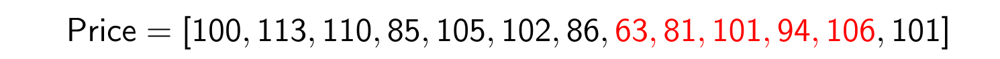

最简单的方法是用动态规划，维护 `min` 代表当前遍历之前最小值，遍历过程不断更新答案和`min`即可。时间复杂度 $O(n)$


如果使用分治呢？我们考虑一个子数组，这个自数组记录了前后差值。因此这个问题就变为了分治法求**最大子数组**

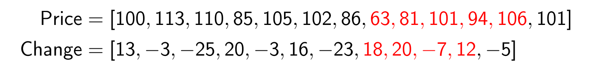

使用分治法的核心思想是将数组一分为二，那么**最大利润**只可能出现在以下三种情况之一：

1. **最大利润在左半部分**
2. **最大利润在右半部分**
3. **跨越左右部分（边界条件）**

$$
\text{result} = \max(\text{左半部最大值}, \text{右半部最大值}, \text{跨越中点最大值})
$$


跨越的理解：**因为它是“跨越”中点的，所以它必须包含中点左边的最后一个数字，和中点右边的第一个数字。** 它不能断开。

**步骤一：计算出左侧最大和 (Left Side Max)**

- **怎么做：** 从中点（mid）开始，**向左倒着遍历**。
- **逻辑：** 比如 `[... A, B, C | ...]`，一定要包含 C，然后看 `C` 大，还是 `C+B` 大，还是 `C+B+A` 大。记录下这个过程中出现过的最大总和。
- *注意：这必须是以中点为结尾的连续子数组。*

**步骤二：计算出右侧最大和 (Right Side Max)**

- **怎么做：** 从中点右边的第一个数（mid+1）开始，**向右正向遍历**。
- **逻辑：** 比如 `[... | D, E, F ...]`，一定要包含 D，然后看 `D` 大，还是 `D+E` 大，还是 `D+E+F` 大。记录下这个过程中出现过的最大总和。
- *注意：这必须是以中点右侧第一个数为开头的连续子数组。*

**步骤三：记录跨越最大**

- `[... A, B, C | D, E, F ...]` 往两边扫描，扫一个最大值出来（**以中点为中心，强制向两边延伸去扫描原数组**）
- 此处复杂度 $O(n\log{n})$

**步骤四：返回左中右最大值**


因为这个解法和归并一致，因此时间复杂度是 $O(n \log n)$，因此其实并非最佳！

如果这个问题一定要转化为子数组，或者说这个问题是给定一个子数组，求最大子数组的和（Maximum-subarray Problem），那么最优的解法是考虑使用**前缀和**，参考Leetcode 的题目 [53. 最大子数组和](https://leetcode.cn/problems/maximum-subarray/) 

但是如果是前缀和，那其实又从 `Change` 变为了 `Price`，这样就没有必要了

> 前缀和求子数组最大，本质上就是不断更新答案为当前前缀减去之前最小前缀（由`min`维护，也要同步更新）


## [6] 其他

PPT还介绍了矩阵乘法，从朴素的矩阵乘法到 Strassen 算法（分治优化）

| **算法**          | **递归式**              | **时间复杂度**                         |
| ----------------- | ----------------------- | -------------------------------------- |
| **朴素分治**      | $T(n) = 8T(n/2) + bn^2$ | $O(n^3)$                               |
| **Strassen 算法** | $T(n) = 7T(n/2) + bn^2$ | $O(n^{\log_2 7}) \approx O(n^{2.808})$ |

> [!NOTE]
>
> 这里考过，问 Strassen 算法的时间复杂度是多少


## [7] 综合推导主定理

### [7.1] 推导

我们提到了很多递归式，但是我们能否总结出一般的方法呢？我们把这个一般方法称为**主定理（Master Method）。**
$$
\begin{aligned}
\mathbf{\color{red}T(n)} & \mathbf{\color{red}{=aT\left(\dfrac{n}{b}\right) + f(n) }}
= a\left[aT\left(\dfrac{n}{b^2}\right) + f\left(\dfrac{n}{b}\right)\right] + f(n) \\
&= a^2 T\left(\dfrac{n}{b^2}\right) + af\left(\dfrac{n}{b}\right) + f(n) \\
&= a^3 T\left(\dfrac{n}{b^3}\right) + a^2 f\left(\dfrac{n}{b^2}\right) + af\left(\dfrac{n}{b}\right) + f(n) \\
&= a^4 T\left(\dfrac{n}{b^4}\right) + a^3 f\left(\dfrac{n}{b^3}\right) + a^2 f\left(\dfrac{n}{b^2}\right) + af\left(\dfrac{n}{b}\right) + f(n) \\
&= \dots
\end{aligned}
$$
显然，我们看到规律！

我们先算一下一共会出现多少层，我们设层数为$x$，最终必然有 $n=b^x\iff x=\log_bn$

然后带入，得到
$$
\begin{aligned}
\mathbf{\color{red}T(n)} & \mathbf{\color{red}{=aT\left(\dfrac{n}{b}\right) + f(n) }}
= a\left[aT\left(\dfrac{n}{b^2}\right) + f\left(\dfrac{n}{b}\right)\right] + f(n) \\
&= a^2 T\left(\dfrac{n}{b^2}\right) + af\left(\dfrac{n}{b}\right) + f(n) \\
&= a^3 T\left(\dfrac{n}{b^3}\right) + a^2 f\left(\dfrac{n}{b^2}\right) + af\left(\dfrac{n}{b}\right) + f(n) \\
&= a^4 T\left(\dfrac{n}{b^4}\right) + a^3 f\left(\dfrac{n}{b^3}\right) + a^2 f\left(\dfrac{n}{b^2}\right) + af\left(\dfrac{n}{b}\right) + f(n) \\
&= \dots\\
&{=a^{x}T(1)+\sum _{j=0}^{x-1}a^{j}f(\dfrac n{b^{j}})}\\
\end{aligned}
$$
此处，$x=\log_bn$，为了进一步化简，$a^x=a^{\log_b n}=n^{\log_b a}$ 替换，得到**==最终结论==**
$$
\begin{aligned}
\mathbf{\color{red}T(n)} & \mathbf{\color{red}{=aT\left(\dfrac{n}{b}\right) + f(n) }}
= a\left[aT\left(\dfrac{n}{b^2}\right) + f\left(\dfrac{n}{b}\right)\right] + f(n) \\
&= a^2 T\left(\dfrac{n}{b^2}\right) + af\left(\dfrac{n}{b}\right) + f(n) \\
&= a^3 T\left(\dfrac{n}{b^3}\right) + a^2 f\left(\dfrac{n}{b^2}\right) + af\left(\dfrac{n}{b}\right) + f(n) \\
&= a^4 T\left(\dfrac{n}{b^4}\right) + a^3 f\left(\dfrac{n}{b^3}\right) + a^2 f\left(\dfrac{n}{b^2}\right) + af\left(\dfrac{n}{b}\right) + f(n) \\
&= \dots\\
&{=a^{x}T(1)+\sum _{j=0}^{x-1}a^{j}f(\dfrac n{b^{j}})}\\
&\mathbf{\color{red}=n^{\log_b a}T(1)+\sum_{j=0}^{\log_b(n)-1}a^j f(\dfrac n{b^j})}
\end{aligned}
$$

### [7.2] 时间复杂度

如何从如下公式，推导时间复杂度？
$$
\begin{aligned}
\mathbf{\color{red}T(n)} & \mathbf{\color{red}{=aT\left(\dfrac{n}{b}\right) + f(n) }}\\
&\mathbf{\color{red}=n^{\log_b a}+\sum_{j=0}^{\log_b(n)-1}a^j f(\dfrac n{b^j})}
\end{aligned}
$$
直接给出结论：有三种情况

---

#### 情况一：递归部分占主导 (Leaf-heavy)

- **条件**：如果 $f(n)$ 的增长速度显著慢于 $n^{\log_b a}$（慢了一个多项式量级 $n^\epsilon$）。
- **结论**：总复杂度由递归过程决定。
- **结果**：$T(n) = \Theta(n^{\log_b a})$

> **例子**：
> $$
> T(n) = 8T(\dfrac n 2) + 1000n^2
> $$
> **分析**：
>
> - $a = 8, b = 2$，计算 $n^{\log_b a} = n^{\log_2 8} = n^3$。
> - 比较：$f(n) = 1000n^2$ 的增长速度**远慢于** $n^3$。
> - 符合 $f(n) = O(n^{3-\epsilon})$（取 $\epsilon=1$）。
>
> **结果**：$T(n) = \Theta(n^3)$。

---

#### ==情况二：两者平衡 (Balanced)==

- **条件**：如果 $f(n)$ 与 $n^{\log_b a}$ 的增长速度基本一致（或者只差一个 $\log^k n$ 因子）。
- **结论**：递归树的每一层工作量大致相等。
- **结果**：$T(n) = \Theta(n^{\log_b a} \log^{\mathbf{\color{red}k+1}} n)$。

> 这是最常见的情况，每一层的工作量分布比较均匀。
>
> #### 例子1
>
> 归并排序 (Merge Sort) ： 
> $$
> T(n) = 2T(\dfrac n 2) + n\\或者\\T(n) = 2T(\dfrac n 2) + cn
> $$
> **分析**：
>
> - $a = 2, b = 2$，计算 $n^{\log_b a} = n^{\log_2 2} = n^1$。
> - 比较：$f(n) = n$，两者**完全相等**。
> - 符合 $f(n) = \Theta(n^{\log_b a} \log^{k+1} n)$（其中 $k=0$）。
>
> **结果**：$T(n) = \Theta(n \log n)$。
>
> 
>
> ---
>
> #### 例子2
>
> $$
> T(n)=2T(\dfrac n2) + n\log n
> $$
>
> 结果：此处 $k=1$ （差了1个 $\log$）因此 $O(n\log^2n)$
>
> 
>
> > [!NOTE]
> >
> > 这里的 $k$ 为什么是0？怎么算的？其实$k$ 就是 $n^{\log_b a} $ 和 $f(n)$ 相差的$\log$ 的次方！
> >
> > 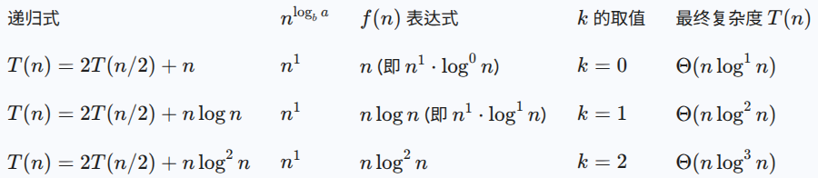

---

#### 情况三：额外工作占主导 (Root-heavy)

- **条件**：如果 $f(n)$ 的增长速度显著快于 $n^{\log_b a} $，且满足一个“正则性条件”，也即$af(\dfrac n b ) \le \delta f(n)$，保证越往下走工作量越小。
- **结论**：总复杂度主要由分解和合并步骤决定。
- **结果**：$T(n) = \Theta(f(n))$。

> **例子**：$T(n) = 3T(\dfrac n 4) + n^2$
>
> **分析**：
>
> - $a = 3, b = 4$，计算 $n^{\log_4 3} \approx n^{0.79}$。
> - 比较：$f(n) = n^2$ 的增长速度**远快于** $n^{0.79}$。
>
> **结果**：$T(n) = \Theta(n^2)$。


## [8] 变式

递归方程为：
$$
T(n) = 2T(n^{\frac 12}) + \log n
$$
**难点**：这里的自变量是 $n^{\frac 12 }$ 而不是常见的 $\dfrac nb$ 形式，因此无法直接使用主定理。

为了将根号形式转化为线性除法形式，我们令： **$k = \log n$** （这意味着 $n = 2^k$）

将 $n = 2^k$ 代入原方程：
$$
T(2^k) = 2T(2^{\frac k 2}) + k
$$
为了看得更清楚，我们定义一个新函数 **$S(k) = T(2^k)$**。 那么方程就变成了：
$$
S(k) = 2S(\frac k 2) + k
$$

> [!CAUTION]
>
> 此处，$S(m)=T(2^k)$，当自变量（定义域）从$2^{[k]} \to 2^{[\frac k 2]}$ 时，$m\to \frac m 2$，所以上式是这么来的


现在这个 $S(k)$ 的形式符合主定理的标准形式，算出$$S(k) = O(k \log k)$$

最后，我们需要把 $k$ 替换回 $\log n$：
$$
\begin{aligned}
S(k)=T(2^k)&=T(n)\\
&=O(k \log k)\\
&=O(\log n \log \log n)
\end{aligned}
$$

## [9] 整数的快速乘法

> 不考
>
> 但 Karatsuba 算法的基本事实要记：把两个 n-bit 数乘法拆成 3 个子问题（不是 4），这属于 Week 2 Divide & Conquer 的一部分。Nikhil 说的是"快速整数乘法"整段课件不用复习，但 Karatsuba 的基本概念（Class Test Q5 考过的那种）仍属于 D&C 范畴可能要了解。

对于两个 $n$ 位的整数，朴素方法相乘会导致 $O(n^2)$ 复杂度。

使用**整数的快速乘法**，复杂度会变为 $O(n^{\log_2{3}})$

具体步骤查看 [Week2lecture-slides.pdf](PPT/Week2lecture-slides.pdf) **[Page 33-39]**

**Karatsuba** 算法：$n\times n$ 时间复杂度 $O(n^{log_23})$！这个在课堂测试考过！！！


> 假设我们要计算两个 $n$ 位整数 $x$ 和 $y$ 的乘积。我们将它们各拆分为两部分：
>
> - $x = a \cdot 10^{\frac n 2} + b$
> - $y = c \cdot 10^{\frac n 2} + d$
>
> 传统的展开式如下：
> $$
> x \cdot y = (a \cdot 10^{\frac n 2} + b)(c \cdot 10^{\frac n 2} + d) = ac \cdot 10^n + (ad + bc) \cdot 10^{\frac n 2} + bd
> $$
> 
>
> 在这里，我们需要计算 **4 次** $n/2$ 位数的乘法：$ac, ad, bc, bd$。这就是为什么朴素算法是 $O(n^2)$。
>
> #### Karatsuba 的“神来之笔”
>
> Karatsuba 意识到，我们其实并不需要分别知道 $ad$ 和 $bc$ 的值，我们只需要它们的 **和** $(ad + bc)$。
>
> 他利用了这样一个等式：
> $$
> (a + b)(c + d) = ac + ad + bc + bd
> $$
> 
>
> 从而得出：
> $$
> ad + bc = (a + b)(c + d) - ac - bd
> $$
> 
>
> 这意味着，我们只需要计算 **3 次** 乘法：
>
> 1. $P_1 = ac$
> 2. $P_2 = bd$
> 3. $P_3 = (a + b)(c + d)$
>
> 最后的结果就是：
> $$
> x \cdot y = P_1 \cdot 10^n + (P_3 - P_1 - P_2) \cdot 10^{\frac n 2} + P_2
> $$
> 根据主定理（Master Theorem），如果我们把一个规模为 $n$ 的问题分解为 $3$ 个规模为 $n/2$ 的子问题，其递推公式为：
> $$
> T(n) = 3T(\frac n 2) + O(n)
> $$
> 也就是，
> $$
> T(n) = O(n^{\log_2 3}) \approx O(n^{1.585})
> $$


# 概率和随机算法

## [1] 基本概念

### [1.1] 样本空间和概率函数

样本空间（Sample Space）

- 所有可能出现的结果的集合
- 例如骰子：`S={1,2,3,4,5,6}`

事件（Event）

- 是样本空间 $S$ 的一个子集


**概率函数 $Pr$ (Probability Function)** 

- 一个函数，把事件 $A$ 映射到 $[0, 1]$ 这个区间

- $Pr(\text{扔出偶数}) = 0.5$ （也就是 50%）
- $Pr(\text{扔出1}) = \dfrac 16$


$$
Pr(\O) = 0\\
Pr(S)=1
$$
如果 $A,B \subseteq S$ 且 $A\cap B=\O $ 那么意味着
$$
Pr(A\cup B)=Pr(A)+Pr(B)
$$
例如：正面、反面两个事件相互独立，但是共同组成了概率空间


### [1.2] 独立事件

Independent Event
$$
A和B是独立事件\iff Pr(A\cap B)=Pr(A)\cdot Pr(B)
$$

- **事件 $\mathcal{A}$**：第一个骰子掷出 6。
- **事件 $\mathcal{B}$**：第二个骰子掷出 3。
- **事件 $\mathcal{C}$**：两个骰子的点数之和为 10。


$$
Pr(A) = \dfrac16\\
Pr(B) = \dfrac16\\
Pr(C) = \dfrac3{36}\\
$$
因为 $Pr(A \cap B) = 1/36$ 因此A和B是独立事件，但是和C就不是...


### [1.3] 条件概率

Conditional Probability

在事件 $\mathcal{B}$ 发生的情况下求事件 $\mathcal{A}$ 发生的概率：
$$
P(A|B) = \dfrac{P(A\cap B)}{B}
$$


### [1.4] 随机变量和期望值

Random Variable & Expected Value

随机变量是一个**函数** $X$，它把“样本空间 $\mathcal{S}$ 中的结果”映射到“实数”，我们假设为 $i$，那么就可以这样表示：
$$
P(X=i)=\dfrac12
$$
这个 $i$ 提供的数学期望就是 $i\times \dfrac12$。因此数学期望的公式就是
$$
\mathbb{E}(X) = \sum i \cdot Pr(X=i)
$$
对于任何两个随机变量 $X$ and $Y$，它们“**和的期望**”等于“**期望的和**”，这是期望值最强大的性质：期望的线性性质 (Linearity of Expectation)
$$
\mathbb{E}(X + Y) = \mathbb{E}(X) + \mathbb{E}(Y)
$$

> **例子**：假设你把一个大算法拆成两步。
>
> - 第一步耗时 $X$（随机）。
> - 第二步耗时 $Y$（随机）。
> - 总平均耗时 = 第一步平均耗时 + 第二步平均耗时。


设 $X$ 表示直到出现正面为止所必须进行的抛掷次数（包括最后一次抛掷）。那么$X$是一个取值于$\{1, 2, 3, ...\}$的随机变量，求 $\mathbb E (X)$

情况大概是：1、01、001、0001、00001、.....

因此：
$$
\mathbb{E}(X)=\sum_{i=1}^{\infty} i \cdot Pr(X=i)=\sum_{i=1}^{\infty} i \cdot\left(\frac{1}{2}\right)^{i}
$$
用微积分可以知道这个答案是 $\mathbb E (x) = 2$，但是如果不会微积分：

回顾1、01、001、0001、00001、.....

**情况一：抛出正面（Heads）**

- **概率**：$1/2$
- **消耗次数**：1次
- **结果**：游戏结束。
- **贡献值**：$1$

**情况二：抛出反面（Tails）**

- **概率**：$1/2$
- **消耗次数**：1次（当前的这一次） + **剩余需要的期望次数**。
- **关键点**：当你抛出反面后，游戏并没有结束，一切回到了原点（"Reset"）。你现在面临的状况和游戏刚开始时一模一样：你仍然需要抛出一个正面。因此，从现在开始，你还需要抛的期望次数**仍然是 $\mathbb{E}(X)$**。
- **贡献值**：$1 + \mathbb{E}(X)$

因此
$$
\mathbb{E}(X) = \frac{1}{2} \cdot 1 + \frac{1}{2} \cdot (1 + \mathbb{E}(X))\\\\
\mathbb{E}(X) = 2
$$

## [2] 快速排序

快速排序在遇到一些极端的输入样例会导致 TEL

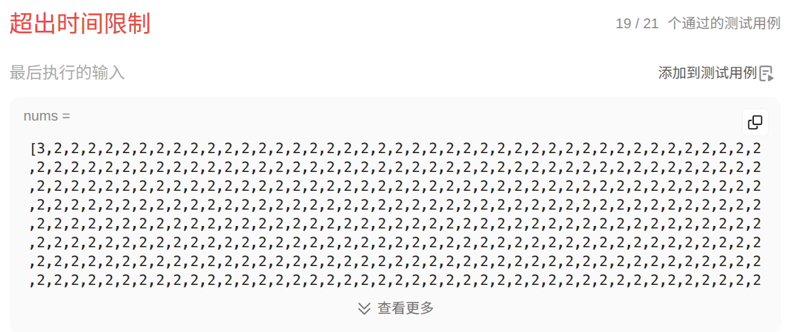

因为基准元素的选择对快速排序有一定影响，考虑使用随机`pivot`可以缓解这个问题...

```java
public static void quickSort(int[] array, int begin, int end, Random rand) {
    if(begin>=end) return;
    int left = begin;
    int right = end;
    swap(array, begin, rand.nextInt(begin, end + 1));
    while (left < right) {
        while (left < right && array[right] >= array[begin]) right--;
        while (left < right && array[left] <= array[begin]) left++;
        swap(array, left, right);
    }
    swap(array, begin, right);
    quickSort(array,begin,left-1,rand);
    quickSort(array,left+1,end,rand);
}
public static void swap(int[] array, int x, int y) {
    int temp = array[x];
    array[x] = array[y];
    array[y] = temp;
}
```


显然，快速排序的时间复杂度是 $O(n\log{}n)$ 的，他和归并排序一样，空间复杂度 $O(1)$，归并排序空间复杂度 $O(n)$，即便如此，在特殊数据下，选择排序仍然远远慢于归并排序

选择排序：


归并排序：


> Leetcode 测试：[912. 排序数组](https://leetcode.cn/problems/sort-an-array/)


# 更多排序

可以证明，基于比较的排序时间复杂度最优是 $O(n \log{n})$。现在，我们介绍**优先队列（Priority Queue）排序**。


## [1] 完全二叉树

完全二叉树性质如下：

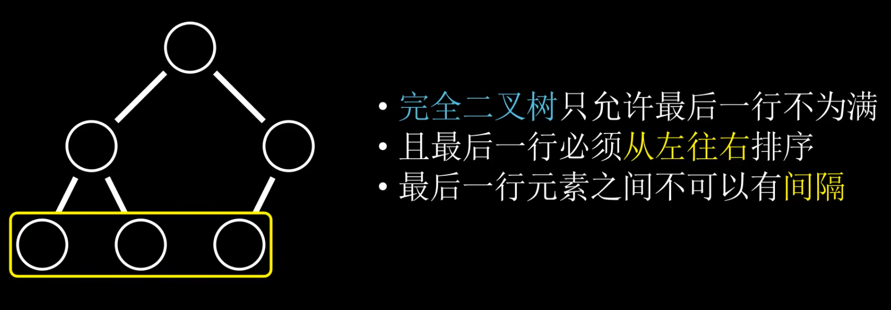

## [2] 堆

 看这个视频，**[了解堆和优先队列](https://www.bilibili.com/video/BV1AF411G7cA)**

### [2.1] 堆的两个性质

堆必须符合以下两个性质

1. 堆必须是一个完全二叉树
2. 堆必须要有对序性（比如这个堆是小根堆，还是大根堆）

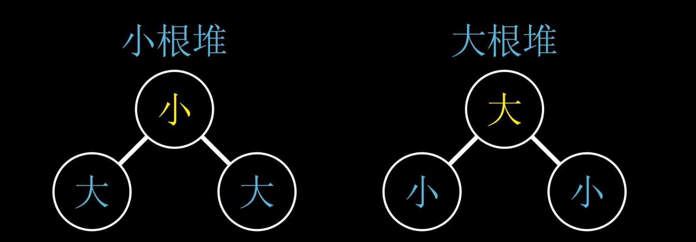


### [2.2] 表示堆

堆可以用一维数组描述：

规律：如果父节点为`i`，那么左子节点为`2i+1`，右子节点为`2i+2`

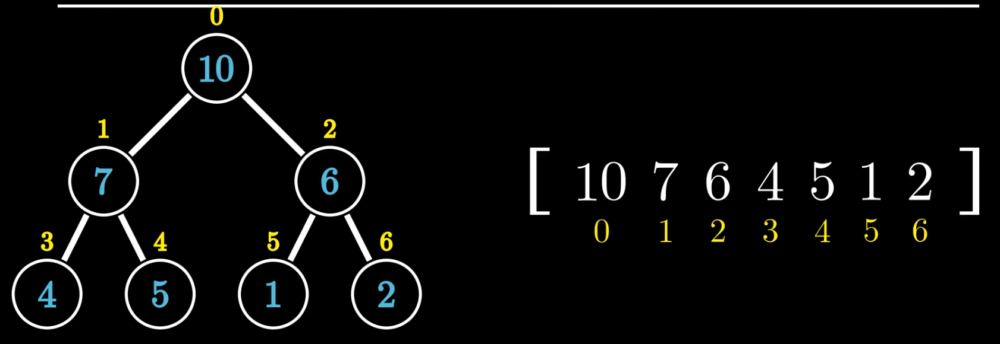

### [2.3] 维护堆

如何维护堆？分为两个操作：下滤和上滤

#### [2.3.1] 下滤

如果维护的是大根堆，那么只需要不断比较`1`的最大子节点，如果1小于这个最大子节点，交换，继续

| 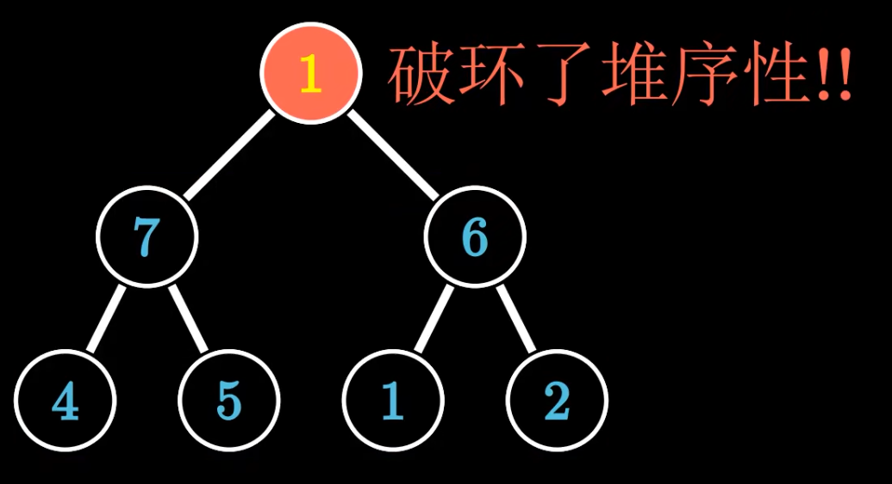 | 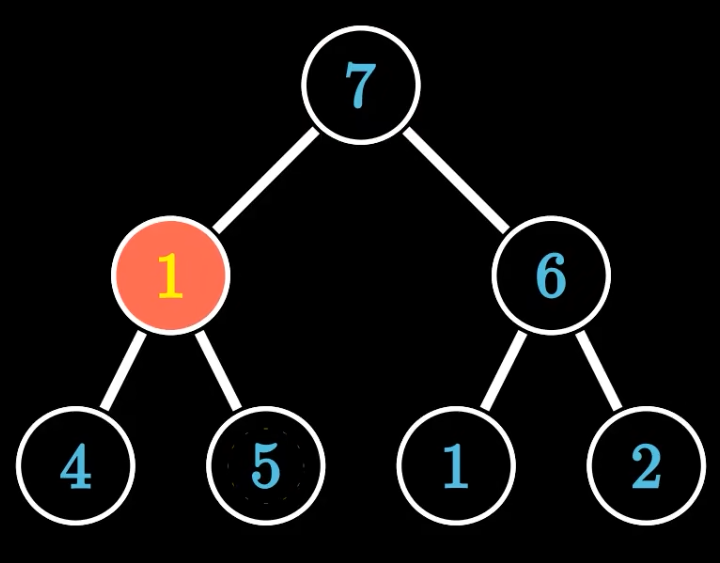 | 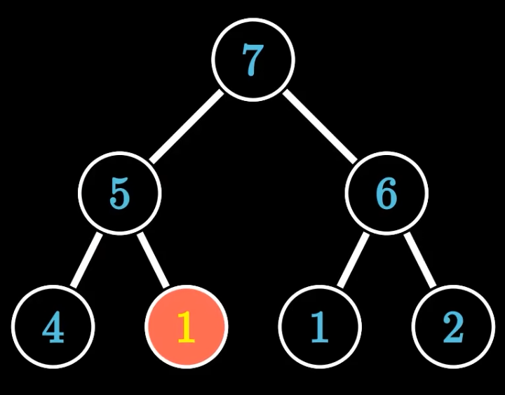 |
| :----------------------------------------------------------: | :----------------------------------------------------------: | :----------------------------------------------------------: |

下滤操作时间复杂度 $O(\log n)$

#### [2.3.2] 上滤

上虑则不需要选出最大子元素，只需要和父元素比较！显而易见，如果是维护大根堆，只需要比较父元素是否小于自己，如果父元素小，那么交换

| 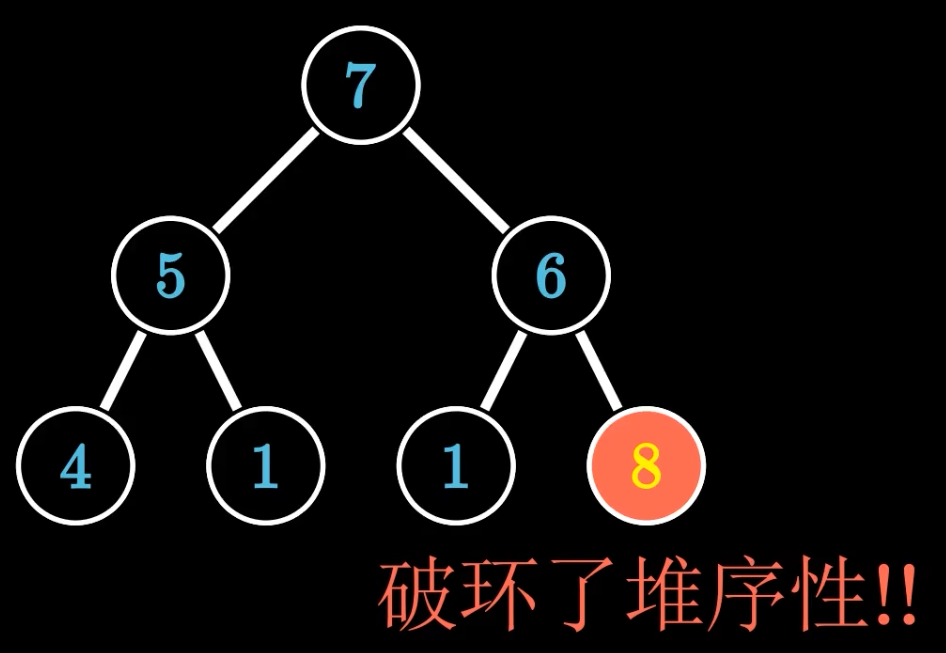 | 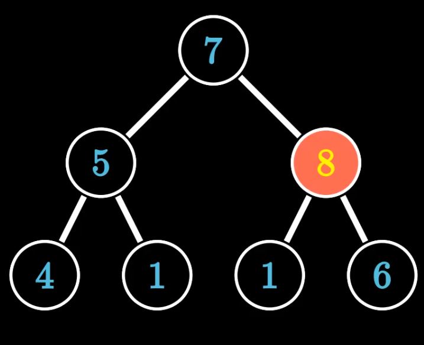 | 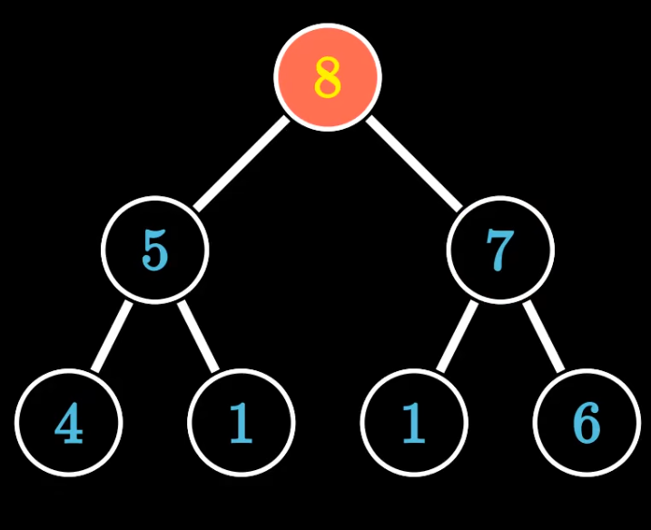 |
| :----------------------------------------------------------: | :----------------------------------------------------------: | :----------------------------------------------------------: |


时间复杂度是 $O(\log n)$

**上虑操作可以用于插入新数据**

---

| 操作               | 用了什么                 | 复杂度     | 为什么                                  |
| ------------------ | ------------------------ | ---------- | --------------------------------------- |
| Insert             | 上滤 (sift-up)           | O(log n)   | 元素放末尾，最多冒泡到根 = 树高         |
| Remove-Max         | 下滤 (sift-down)         | O(log n)   | 根换了后最多沉到底 = 树高               |
| Build-Heap（朴素） | n 次 Insert（上滤）      | O(n log n) | n 个元素，每个 O(log n)                 |
| Build-Heap（优化） | 自底向上 heapify（下滤） | O(n)       | 下层节点多但下沉距离短，总和收敛到 O(n) |
| HeapSort           | n 次 Remove-Max（下滤）  | O(n log n) | n 轮，每轮 O(log n)                     |

>   **关键：优化建堆为什么是 O(n) 不是 O(n log n)**
>
>   虽然下滤单次是 O(log n)，但自底向上建堆时——叶子节点（占一半）下沉 0 层，倒数第二层（占 1/4）下沉 1 层，依此类推：
>
>   $$\sum_{h=0}^{\log n} \frac{n}{2^{h+1}} \cdot h = O(n)$$
>
>   这个级数收敛到 O(n)。Nikhil 在 Revision lecture 里说了这个教程内容不考（00:13:01 "That's not necessary"），但理解要对。


### [2.4] 无序数组转为堆

显然，对于每一个元素，我们插入尾部，然后从下往上进行【上滤】操作

除此之外，我们除了可以插入尾巴，还可以插入头部，进行【下滤】操作。首先数组直接转为堆，然后迭代地：

1. 对于`3`（堆顶）而言，先要保证子节点是最小堆，然后自己下滤操作
2. 子节点 `4`和`5` 而言，先要保证他们的子节点也是最小堆，然后对自己进行下滤操作

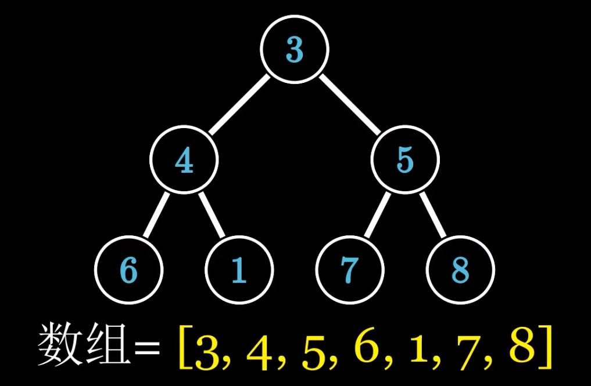


==下滤建堆的方法复杂度为 $O(n)$==

上滤建堆的方法复杂度为 $O(n\log n)$

## [3] 优先队列

先介绍一下 Java 中的 Priority Queue...

- 优先队列可以看作一个队列，但是有优先级！在普通的 `Queue` 中，大家都遵守“先来后到”（FIFO）的原则。但在 `PriorityQueue` 里，**谁的优先级高（默认是元素越小，优先级越高），谁就先出队**。
- **无界队列**：它的容量可以动态扩容，虽然你可以指定初始容量。
- **排序机制**：元素不是随机排列的，而是通过**自然排序**（implement `Comparable`）或**比较器**（`Comparator`）来决定先后顺序。
- **不允许 `null`**：由于需要不断进行元素比较，存入 `null` 会抛出 `NullPointerException`。
- **非线程安全**：如果多个线程同时访问，请使用 `PriorityBlockingQueue`。


| **操作**       |       **方法**        | **时间复杂度** | **说明**                       |
| :------------- | :-------------------: | :------------: | :----------------------------- |
| **插入**       | `add(e)` / `offer(e)` |  $O(\log n)$   | 将元素插入堆并重新调整         |
| **获取队头**   |       `peek()`        |     $O(1)$     | 仅查看，不弹出（永远是最小的） |
| **弹出队头**   |       `poll()`        |  $O(\log n)$   | 移除最小值并重新调整堆         |
| **删除特定值** |     `remove(obj)`     |     $O(n)$     | 找到该元素并删除，涉及线性搜索 |


优先队列可以使用最小堆实现：

- 插入元素和维护堆一致
- 构建优先队列可以使用构建堆的方式（复杂度$O(n)$，使用下滤操作）
- 弹出最小元素则弹出堆头，并且让最后一个元素放在根节点，然后下滤，时间复杂度 $O(\log n)$


### [3.1] 优先队列(堆)排序底层

只需要用 $O(n)$ 的复杂度建堆，用 $O(n\log n)$ 的复杂度弹出即可

具体来说，使用下滤的方法（复杂度$O(n)$）构建出这样一个最小堆

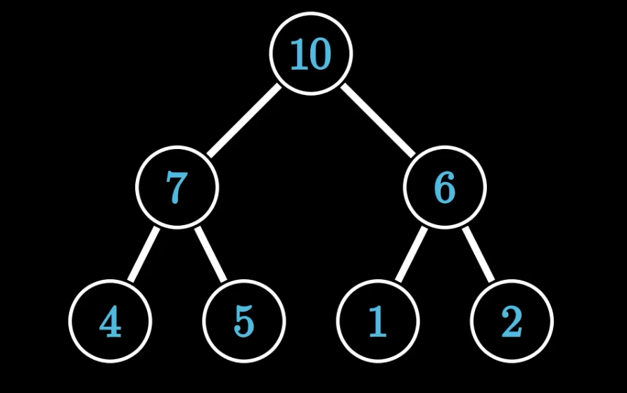

但是现在只是满足堆的性质，并不满足数组升序（例如同一层`7`和`6`）前后顺序是不一样的

但是大根堆能保证：堆顶一定是最大的，因此我们可以确定堆定这个元素一定位于数组末尾，因此和`2` 调换，我们即可确定堆顶10的位置！（此时记录堆长度-1）

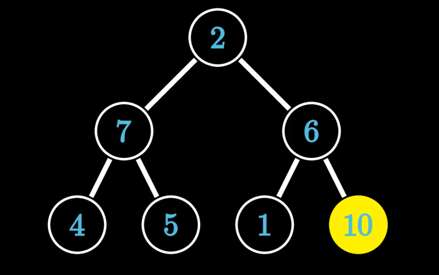

然后接下来对2进行下滤操作，重新构建堆

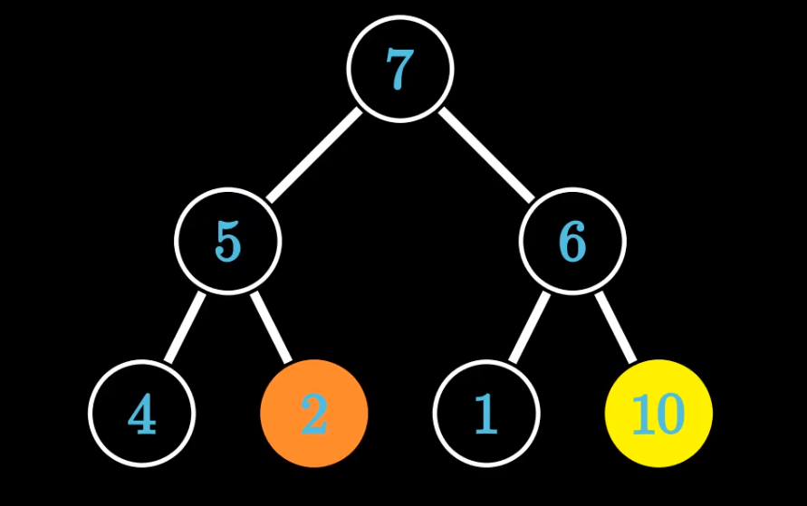

构建完毕之后，能确认堆定7是最大的元素，因此他放在末尾！然后重复操作...

| 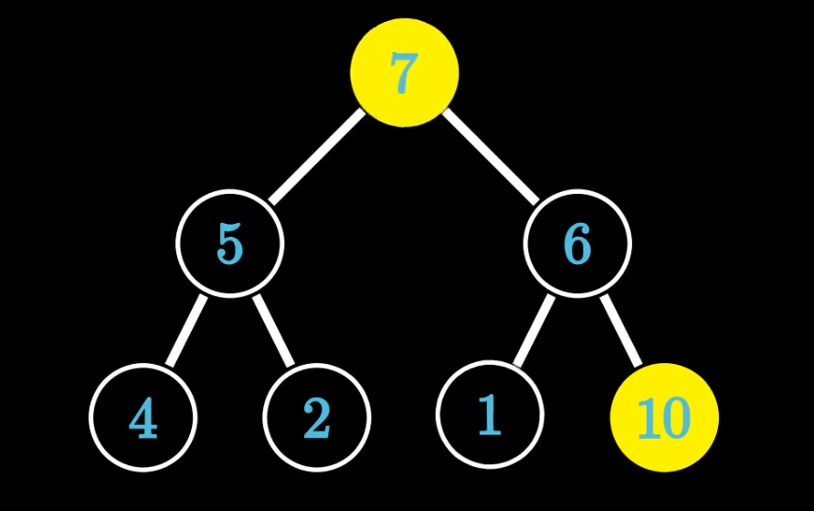 | 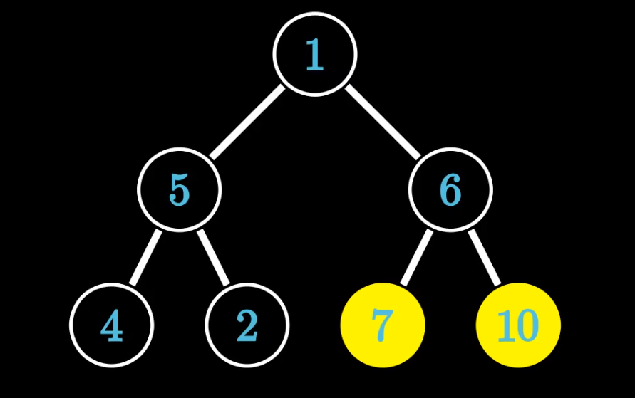 |
| :----------------------------------------------------------: | :----------------------------------------------------------: |


所以大根堆构建之后我们可以算出一个从小到大非严格递增的数组！


### [3.2] 优先队列高层调用

在Java中已经封装了 `Priority Queue` 因此我们直接使用优先队列操作即可！

```java
public int[] sortArray(int[] nums) {
    PriorityQueue<Integer> pq = new PriorityQueue<>(Arrays.stream(nums).boxed().collect(Collectors.toList())); // O(n)
    for (int i = 0; i < nums.length; i++) nums[i] = pq.poll(); // O(n log n)
    return nums;
}
```


## [4] 计数排序 和 基数排序

### [4.1] 计数排序

Counting sort

计数排序是一个非常特殊的算法，因为它**不是基于比较**的排序。

它的时间复杂度通常表示为：**$O(n + k)$**。

其中：

- **$n$**：待排序数组的元素个数。
- **$k$**：待排序数据的**范围**（即：最大值 - 最小值 + 1）。

| **步骤**              | **操作内容**                                                 | **时间复杂度** |
| --------------------- | ------------------------------------------------------------ | -------------- |
| **1. 寻找范围**       | 遍历一遍数组，找到最大值和最小值。                           | $O(n)$         |
| **2. 计数**           | 创建一个长度为 $k$ 的计数数组，统计每个数出现的次数。        | $O(n)$         |
| **3. 累加（前缀和）** | 对计数数组进行累加，确定每个元素的最终位置（为了保证稳定性）。 | $O(k)$         |
| **4. 反向填充**       | 将元素放回目标数组。                                         | $O(n)$         |

计数排序最重要的应用场景其实是作为 **基数排序（Radix Sort）** 的子过程。

### [4.2] 基数排序

Radix Sort

应用计数排序，只需要逐位比较即可

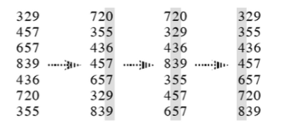

基数排序的时间复杂度为：**$O(d \cdot (n + k))$**

- **$n$**：待排序元素的个数。
- **$k$**：每一位可能的取值范围（基数）。如果是十进制整数，$k=10$；如果是 26 个字母，$k=26$。
- **$d$**：最大数字的位数（迭代次数）。$d \approx \log_k(\text{max\_value})$。

简化一下：$O(dn)$


# 贪心和动态规划

Greedy and Dynamic Programming

## [1] 背包问题

Knapsack Problem

背包问题可以说是动态规划的入门。背包问题使用贪心的解法并不一定是正确的，这是贪心的局限性！

红色：贪心（10）

绿色：动态规划（9）

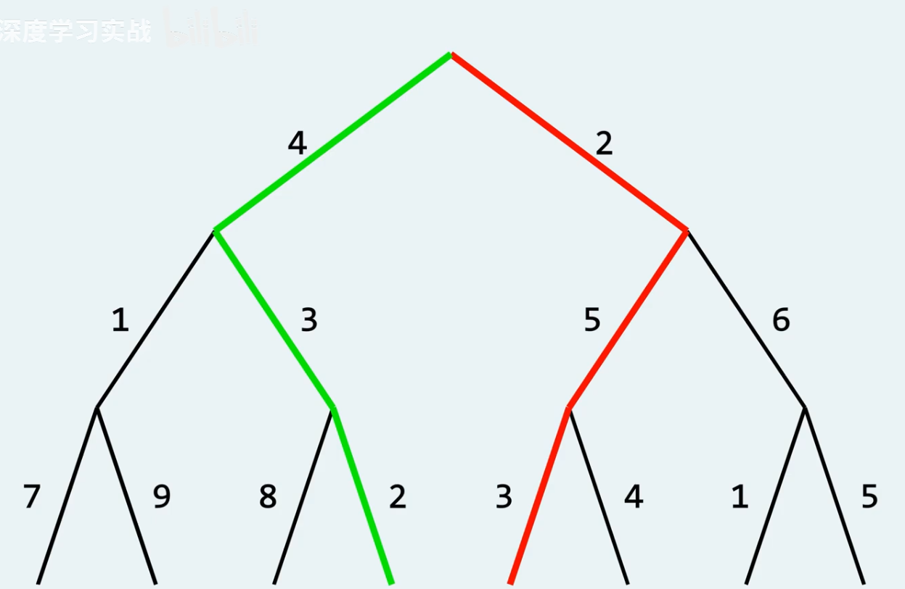

### [1.1] 0/1 背包问题

0/1 Knapsack Problem

给定容量背包，每个物品只能拿**一次（因此是0/1背包）**，那么如何决策才能让背包价值最大？

首先必须要定义 $F(x)$ 代表背包容量为 $x$ 的时候能提供的最大价值，我们最终的结果是 $F(n)$ 其中 $n$ 是背包给定的容量，可以使用一个一维数组实现！


因为每一个物品只能拿一次，**我们遍历每一个物品$i$**，当前物品价值为$V(i)$，重量为 $W(i)$

其中 $F(x)$ 是上一次的背包，我们新开一个数组 $G(x)$ 代表当前新的背包，来考虑要不要添加当前物品 $i$，遍历$x$从`[0,n]`：
$$
\begin{aligned}
G(x)=max
\begin{cases}
F(x-W(i))+V(i)&拿这个物品\\
F(x)&不拿这个物品
\end{cases}

\end{aligned}
$$
$F(x)$随着$x$ 变大，背包中可能存在多种其他大大小小的物品，我们只需要比较，如果腾出一个空间 $x-W(i)$ 去加入当前物品价值 $V(i)$到底值不值得。

结束 $x$从`[0,n]`之后，只需要让 $F=G$ 刷新即可， $G$ 重新申请为新空间


这种情况是为了防止 $F(x)$ 写入的数据污染后面的决策！

| 背包大小：                 | 0    | 1    | 2    | 3    | 4    | 5    | 6    |
| -------------------------- | ---- | ---- | ---- | ---- | ---- | ---- | ---- |
| 初始大小                   | 0    | 0    | 0    | 0    | 0    | 0    | 0    |
| 第一个物品：物品容量2价值3 | 0    | 0    | 3    | 3    | 3    | 3    | 3    |


当然，我们可以不用多开一个 $G$ ，但是这样的话，F必须从后往前写！因为腾出空间 $x-W(i)$ 往前检查的过程和从后往前写是恰好不冲突的。


### [1.2] 完全背包

完全背包允许一个物品使用多次，因此，这里我们不需要使用新的数组 $G$，对于 $F(x)$
$$
\begin{aligned}
F(x)=max
\begin{cases}
F(x-W(i))+V(i)&拿这个物品\\
F(x)&不拿这个物品
\end{cases}

\end{aligned}
$$
并且我们允许**脏写**，此处脏写实际上意味着允许重复拿当前物品！

### [1.3] 分数背包问题

Fractional Knapsack Problem (FKP)

0/1 背包问题，但是物品可分，例如$V=10$的物品$W=2$，那么可以只拿走一半，也就是 $V=5$，$W=1$。

那么这种问题直接使用贪心策略而不是动态规划，每次都拿最具有性价比的即可。

## [2] 记忆化dp

记忆化在dp中的作用是**剪枝**，最经典的例子是递归斐波那契数列
$$
F(x)=F(x-1)+F(x-2)
$$
如果不剪枝，不记忆化搜索，那么这个复杂度将会爆炸。 例如 $F(10)$ 我们可能计算了非常多次 $F(5)$，但是实际上这个状态的值是固定的，因此添加记忆化只需要用一个数组去记录即可。

```java
class Solution {
    private final int[] array = new int[31];

    public int fib(int n) {
        if (n == 0) return 0;
        if (n == 1 || n == 2) return 1;
        int first  = array[n - 1] == 0 ? array[n - 1] = fib(n - 1) : array[n - 1]; // 记忆化
        int second = array[n - 2] == 0 ? array[n - 2] = fib(n - 2) : array[n - 2];
        return first + second;
    }
}
```


除此之外，斐波那契数列可以用矩阵倍增法优化到 $\log(n)$ 的时间复杂度。

| **方法**       | **时间复杂度** | **核心思想**               |
| -------------- | -------------- | -------------------------- |
| 暴力递归       | $O(2^n)$       | 直接翻译定义               |
| **记忆化 DP**  | $O(n)$         | 空间换时间，消除重叠子问题 |
| **矩阵快速幂** | $O(\log n)$    | 结合律 + 二进制拆分指数    |

### [2.1] Fibonacci 闭式 & 二进制位数

**闭式 (Closed Form)**：

Fibonacci 的通项公式（来自生成函数推导）：

$$F(n) = \frac{1}{\sqrt{5}}\left(\phi^n - \hat{\phi}^n\right), \quad \phi = \frac{1+\sqrt{5}}{2} \approx 1.618$$

由于 $|\hat{\phi}| < 1$，$\hat{\phi}^n \to 0$，所以主导项是 $\phi^n$：

$$F(n) \approx \frac{\phi^n}{\sqrt{5}} \approx 1.618^n$$

即 **F(n) 以指数级增长**。

**二进制位数**：

表示数字 $k$ 需要的二进制位数 $\approx \log_2 k$。所以：

$$\text{bits}(F(n)) \approx \log_2(\phi^n) = n \cdot \log_2(\phi)$$

$\log_2(1.618) \approx 0.694$ 是常数，在大 O 中吸收：

$$\text{bits}(F(n)) = O(n)$$

**结论**：F(n) 本身指数爆炸，但存储它只需要 $O(n)$ 位。第 100 个斐波那契数约 $1.6^{100}$，但二进制只需要 ~70 位。

**不考**：生成函数的完整推导（对角线化）、闭式证明细节（Nikhil `00:17:57` "you can skip the proof"）。


## [3] 区间调度问题

简单来说，这是一个关于“**如何当时间管理大师**”的问题：

- 如果你有很多个任务想做，但每个任务都有固定的开始和结束时间，且你同一时间只能做一件事
- 你应该如何安排，才能在有限的时间内完成**尽可能多数量**的任务？


**输入**：一个集合 $T$，包含 $n$ 个任务。每个任务 $i$ 都有一个开始时间 $s_i$ 和结束时间 $f_i$。

**兼容性（非冲突）**：两个任务 $i$ 和 $j$ 如果时间不重叠（即其中一个任务的结束时间小于或等于另一个的开始时间），则称它们是兼容的。

**目标**：找到一个最大的子集，使得子集内的所有任务彼此兼容。


**策略：最早结束时间优先 (Earliest Finish Time First)**

1. **==排序$O(n \log{n})$==**：将所有任务按照**结束时间 $f_i$** 从小到大排序。
2. **选择**：
   - **首先选择结束时间最早的任务**。
   - 然后剔除所有与该任务冲突（开始时间早于当前任务结束时间）的任务。
   - 在剩下的任务中，继续重复上述过程，直到没有任务可选。



```mermaid
gantt

    dateFormat  X
    axisFormat  %s

    section 已选择
    .:crit, t1, 1, 4
    .:crit, milestone, m1, after t1, 0d

    . :crit, t3, 4, 8
    . :crit, milestone, m3, after t3, 0d

    . :crit, t5, 8, 11
    . :crit, milestone, m5, after t5, 0d

    section 未选择
    .:t2, 3, 5
    . :milestone, m2, after t2, 0d

    . :t4, 6, 9
    . :milestone, m4, after t4, 0d
```


时间复杂度 $O(n\log n)$ 也即排序的时间复杂度。


# 图论

## [1] 基础定义

有向图 Directed Graph 也叫做：**流网络** Flow Network

相邻（Adjacent）：两个连接的点，这两个点是相邻的

相关联（Incident）：一个边的端点，可以说，这个端点和边是相关联的

度数（Degree）：顶点$v$的度数$dev(v)$是与$V$相关联的边的数量

简单图（Simple Graph）：没有自环、没有重边。

Walk：一个顶点和边交替组成的序列，代表一个路径。其中开始和结束都是顶点

Path：是一个Walk，但是无重复顶点！

Circuit：是一个Walk，但是起点和终点相同

Cycle：是一个Circuit，但是无重复定点！

子图（Subgraph）：子图$H$的顶点、边 是原图 $G$ 的定点、边 集合的子集

生成（Spanning Subgraph）：$G$的生成子图指的是，$G$的子图$H$，但是$H$必须包含$G$的所有顶点

连通（Connected）：任意两个定点之间都存在一个路径，那么这个图是连通的

连通分量：如果图$G$是不连通的，那么它的极大连通子图被称为$G$的**连通分量（Connected Components）**。

森林（Forest）：无环图

树（Tree）：连通的森林，例如二叉树

加权图（Weighted Graph）：边带有权重的图

单源最短路径（SSSP， Single Source Shortest Path）：给定一个点，你需要（分别）给出这个点$V$到其他所有点的最短路径，**==对应的算法是Dijkstra 算法，但是无法处理带有负数权重的边！！==**对于含有负数权重的边，需要采用Bellman-Ford算法，但是要求必须是**有向图**（如果是无向图那就存在$-\infin$，因为可以一个环一直减，这是显而易见的）。


## [2] 定理

定理1：对于具有$m$条边的无向图，所有点的度**的总和**是 $2m$

定流2：对于具有$m$条边的**有向图**，所有点的**入度的总和** $=$ 所有点的**出度的总和**

定理3：对于有$n$个定点和$m$条边的简单图而言

- 如果图是无向图，那么$m\le\dfrac{n(n-1)}{2}$
- 如果图是有向的，那么$m\le n(n-1)$


定理4：对于有$n$个定点和$m$条边的**无向图**而言

- 如果是连通的，那么$m\ge n-1$
- 如果是一棵树，那么$m=n-1$
- 如果是森林，那么$m\le n-1$。


| 邻接表                                                       | 邻接矩阵                                                     |
| ------------------------------------------------------------ | ------------------------------------------------------------ |
| 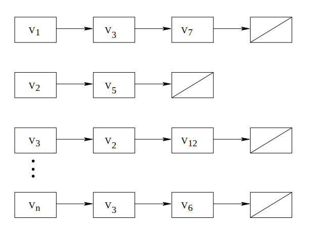 | 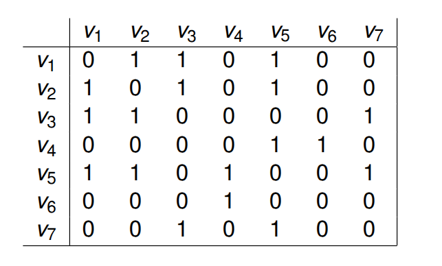 |


## [3] Bellman-Ford

Bellman Ford 算法用于处理负权边的情况，当然也必须是有向图。该算法用于处理 SSSP 问题。

其时间复杂度是 $O(V\cdot E)$ 其中$V$是节点数量，**$E$ 代表的是边数**，一般我们需要进行 $V-1$ 轮，每一轮都要遍历$E$条边，所以时间复杂度就是$O(V\cdot E)$。

> 对于 全源最短路径（APSP，All Pairs Shortest Path）问题，APSP的目标是任意到任意，我们可以对每个点都运行$O(V\cdot E)$的Bellman-Ford 算法，这样的时间复杂度就是 $O(V^2 \cdot E)$ 了！
>
> 因为 $E$ 的大小是波动的，其取值范围是 $E = [V-1,V^2]$，所以我们可以说 APSP 的时间复杂度
>
> - 对于稠密图（Dense Graph）一般是 $O(V^4)$
> - 对于稀疏图（Sparse Graph）一般是 $O(V^3)$


 Bellman-Ford 算法**无需**考虑哪条边先遍历，最后 $V-1$ 轮后所有值都会正确收敛

$V$ 是节点数！

初始化如下：

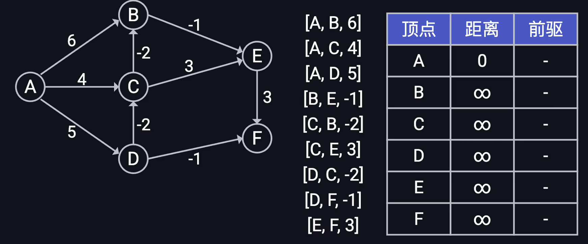

然后遍历更新即可。在完成所有轮后，还需要额外遍历一次，如果发现某个值变小了，证明该顶点无法 正确收敛，其最短路径是 $-\infin$！


算法可以提前结束 $\iff$ 下一轮和上一轮的所有值都一样。


## [4] Bellman-Ford APSP 矩阵倍增法

**矩阵倍增法**（Matrix Doubling / Repeated Squaring）用于优化APSP（APSP = All-Pairs Shortest Paths）的时间复杂度！

我们知道 APSP 算法如果按照之前的方法，时间复杂度是 $O(V^4)$，我们考虑最坏情况，就是对每一个点都独立的运行一次 Bellman-Ford算法！

有什么办法可以加速呢？

在普通的矩阵乘法中，我们求的是 $C_{ij} = \sum (A_{ik} \times B_{kj})$。而在处理最短路径时，我们将操作替换为：

- **乘法 $\times$ 变为 加法 $+$**
- **加法 $\sum$ 变为 取最小值 $\min$**

即所谓的 **$(\min, +)$ 算术**。图片中的 $\odot$ 符号就代表这种特殊的运算：
$$
L^{(2)}_{ij} = \min_{1 \le k \le n} \{ L^{(1)}_{ik} + W_{kj} \}
$$


这表示：从 $i$ 到 $j$ 经过最多 2 条边的最短路径，等于“从 $i$ 到某个中间点 $k$ 经过 1 条边的距离”加上“从 $k$ 到 $j$ 经过 1 条边的距离”的最小值。


如果你一轮一轮地计算（$L^{(1)} \to L^{(2)} \to L^{(3)} \dots \to L^{(n-1)}$），每一轮增加 1 条边，这本质上就是 **Bellman-Ford** 的逻辑，总复杂度会是 $O(n^4)$（因为每轮 $O(n^3)$，跑 $n$ 轮）。

但由于这种 $\odot$ 运算满足**结合律**（即讲义第一行提到的 $A \odot (B \odot C) = (A \odot B) \odot C$），我们可以像计算 $x^8 = ((x^2)^2)^2$ 那样进行加速：

- **$L^{(1)} = W$**：最多经过 1 条边的最短路。
- **$L^{(2)} = L^{(1)} \odot L^{(1)}$**：最多经过 2 条边的最短路。
- **$L^{(4)} = L^{(2)} \odot L^{(2)}$**：最多经过 4 条边的最短路。
- **... 每次翻倍 ...**
- **$L^{(n-1)}$**：最终结果。由于任何不含负环的最短路径最多只有 $n-1$ 条边，算到这里就结束了。


**单次运算耗时：** 计算一次 $L^{(m)} \odot L^{(m)}$ 需要三重循环（类似于矩阵乘法），复杂度是 **$O(n^3)$**。

**运算次数：** 因为每次路径长度翻倍（1, 2, 4, 8...），到达 $n-1$ 只需要进行 **$\log(n-1)$** 次运算。

**总时间复杂度：** $O(n^3)$ 乘以运算次数，即 **$O(n^3 \log n)$**。


因此，为了实现这个方法，我们可以使用邻接矩阵来实现 APSP 的 Bellman-Ford 算法！

通过**矩阵倍增法（Matrix Doubling / Repeated Squaring）**时间复杂度将为了 $O(n^3\log n )$


但是，如果我们使用 Floyd-Warshall 的 $O(n^3)$ 会更快。当然，由于矩阵倍增法是矩阵运算，在GPU上运行会更快，这取决于实际情况！


## [5] 最大流问题

### [5.1] 什么是网络流

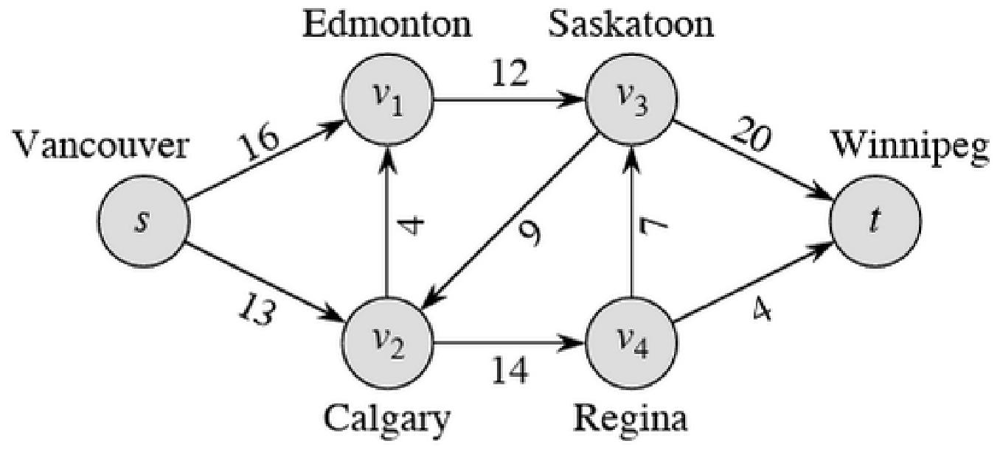

网络流是一种有向图。对于每个边都有一个**非负的**容量 $c(u,v)$ ，经过这条边发送的容量不能超过这个值。

s和t是两个特殊点，一个入度为0，一个出度为0！

在最大流问题中，我们给定一个带有源点s和汇点t的流网络G，并且希望找到从**s到t的最大流量**。

对于上图，输出是这样的

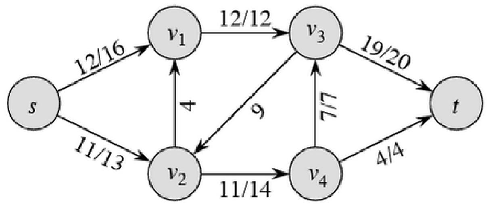


有几种算法可以解决最大流问题。

我们将要研究的一种方法是 Ford-Fulkerson 算法


### [5.2] Ford-Fulkerson 算法

一个前置的概念是**残差（==Residual==）网络**，具体来讲，就是：当前这个网络中，还可以传输多少流量（非瓶颈部分），参考**[这个视频](https://www.bilibili.com/video/BV1GitBznEof)**。

和**[这个视频（更清晰）](https://www.bilibili.com/video/BV1Pv41157xh)**

最大流最小割定理：网络流中的最大容量 = 最小切割容量

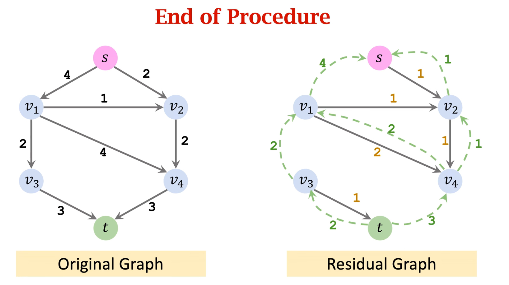


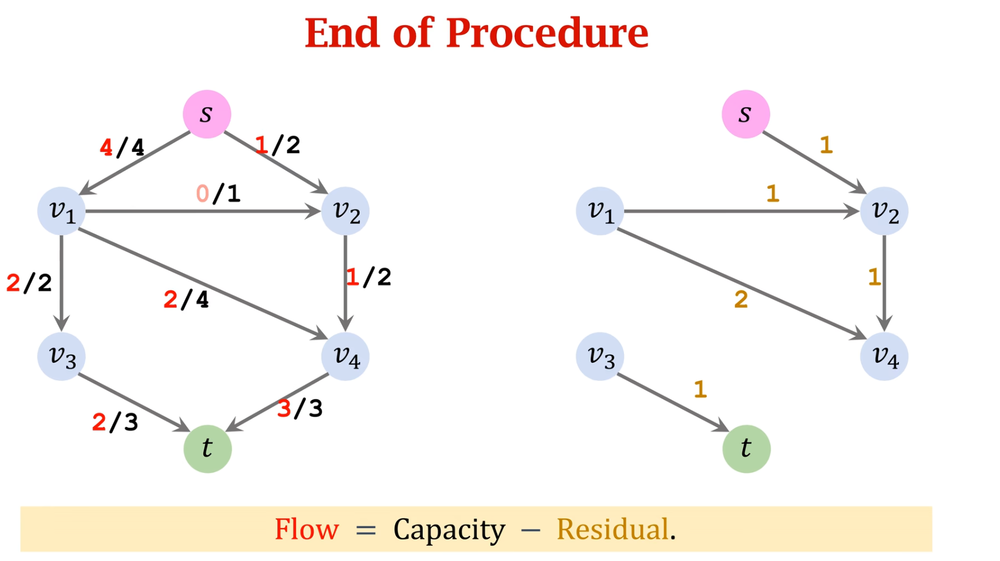

最大流量就是看起点出度的残差值之和，在这里也即 $\mathbf{4+1=5}$


分析复杂度：Fork-Fulkerson 算法每一轮流量至少增加 $\mathbf{1}$ 份，因此迭代次数**不可能**超过最大流的大小

让 $m$ 是这个图中的边数，那么寻找一条可行的路径，时间复杂度是 $O(m)$ 因此每一轮循环的时间复杂度是 $O(m)$

让 $f$ 是最大流数，那么 Fork-Fulkerson 最坏情况下的时间复杂度是 $O(f\cdot m)$

算法主要就是

1. 创建残差网络
2. 用增广路 Augmenting Path $O(m)$ 算法找到一个可行的路径，找出最小值（瓶颈）
3. 该路径全部减去 **瓶颈值**，然后添加反向边（`+=` 操作）


Ford-Fulerson算法出来后16年，该算法的优化版本出现了，也就是使用广度优先搜索的 Edmonds-Karp 算法

- Ford-Fulerson 允许用任意的算法寻找路径，例如BFS和DFS，复杂度为 $O(m+n)=O(m)$
- Edmonds-Karp 和他唯一的区别就是搜索路径的时候用**最短路**，需要把图看成无权图（Unweighted Graph），权重都为$\mathbf{1}$！
- Edmonds-Karp 算法时间复杂度是$O(\mathbf{nm}\cdot m)=O(nm^2)$，其中$m$是边数，$n$是点数，而不依赖于网络流的最大大小 $f$。最多循环 $nm$轮，没一轮和Ford-Fulkerson 算法一致都是 $O(m)$复杂度


### [5.3] 伪代码

```python
Ford-Fulkerson(G, s, t)
  ▷ Input: A network G and vertices, s, t
  ▷ Output: A maximum flow
  for each edge (u, v) ∈ E(G)
      do f[u, v] ← 0
  Initialize residual network G_f = G
  while there exists an augmenting path P from s to t
      do Δ_f(P) ← min { Δ_f(u, v) : (u, v) ∈ P }
      for each edge (u, v) ∈ P
          Update the flow (forwards and backwards edges)
      Update the residual network based on new flow
```


## [6] 二分图和匈牙利算法

二分图就是**[视频](https://www.bilibili.com/video/BV1UB4y1g7Te)**呈现的图，匈牙利算法可以找出最大匹配

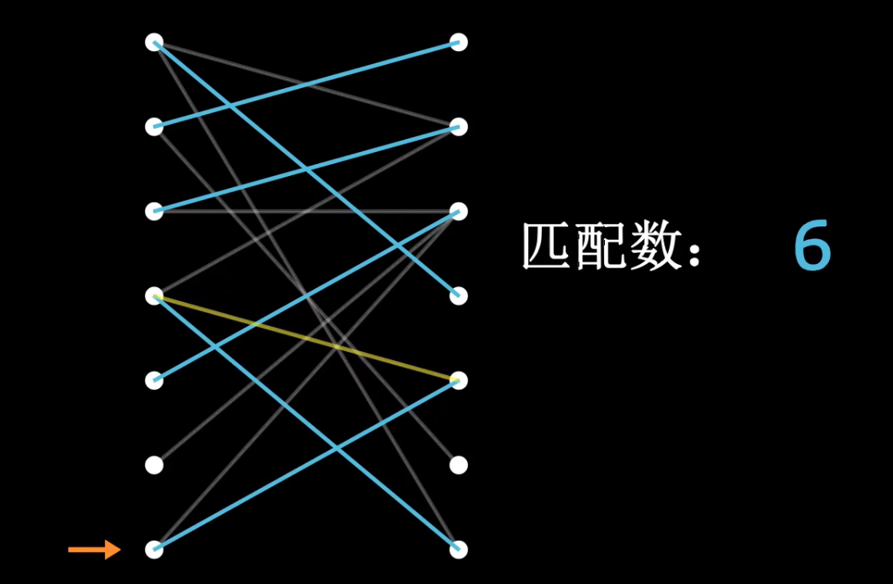

​	当然，我们也可以使用 Ford-Fulkerson 算法去找，因为二分图是无向图，我们要做的就是

- 将$X$中的所有顶点连接到$S$（源点），将$Y$中的所有顶点连接到$T$（汇总点）。所有边的方向为从$S$到$X$、从$X$到$Y$以及从$Y$到$T$
- 所有边的权重为 $\mathbf{1}$

这样，时间复杂度就是 $O(m\cdot f)$，其中$f$是最大流大小，其中 $f$ 等于$O(n)$ ，其中 $n$ 是顶点总数，因为权重为 $\mathbf{1}$ 所以最大流就是 $O(n)$

因此实际时间复杂度就是 $O(mn)$，每一轮使用 $O(m)$ 复杂度搜索增广路，一共$n$轮（最多）。


# RSA 加密

我们已经非常熟悉对称加密（Symmetric Encryption）和非对称加密（Asymmetric Encryption）！


## [1] 对称加密

什么是对称加密？

对称加密的加密和解密都共享一个密钥。

- 比如，替换密码（Substitution Cipher），属于对称加密
  - 假设有一个函数 $y=\pi(x)$ 进行加密，那么解密只需要 $x=\pi ^{-1}(y)$
- 凯撒密码（Caesar Cipher）就是替代密码早期的例子
  - 函数是 $y = (x+ k) \text{~~mod~~} n$其中$n$是字母表大小，$k(1\le k\le n)$是密钥！
- 对称加密可以通过分析 Frequency来破解


我们注意到XOR（异或） $\oplus$ 这个性质恰好就是对称加密所需要的，两次抑或可相互抵消，并且可以调换位置。

这就引申出了一次性密码本（One-time Pad）！一个随机的比特串 $K$ 的长度和要发送消息的长度一致，然后直接$\oplus$ 就完成了加密，然后再 $\oplus$ 就完成了解密。

> 相同为0 不同为 1


假设明文是 $M$，密钥 $K$，密文是 $C$，很显然：
$$
C\oplus K = (M\oplus K)\oplus K = M \oplus ( K\oplus K) = M
$$


| 优点                                 | 缺点                                   |
| ------------------------------------ | -------------------------------------- |
| 计算效率高，因为按位异或操作易于执行 | 爱丽丝和鲍勃必须共享一个非常长的密钥K  |
| 非常安全（前提是K是随机选择的）！！  | 安全性取决于密钥仅使用一次这一事实！！ |


实际上，我们更倾向于可以重复使用的密钥，并且我们使用的密钥要比我们必须传输的消息短得多。怎么办？

而且传输这个，密钥，也需要加密！这陷入死循环....


因此，我们有必要考虑公钥加密（例如非对称加密RSA）！


## [2] 公钥加密

两个函数， $E()$ 代表Encrypt，加密。 $D()$代表Decrypt，解密。

这两个函数要有如下性质：
$$
D(E(M))=M\\
E(D(M))=M
$$
从 $E$ 推导到 $D$ 是不可行的。这个特性尤为重要。它意味着，了解加密方法并**不会让人知晓解密方案**。任何人都可以加密，但只有持有者本人知道如何解密。

因此，$E$ 被称为**单向函数（One way function）**，有时也被称为**陷门函数（Trapdoor function）**。


除了正常加密解密 $D(E(M))=M$这个特性之外，$E(D(M))=M$这个还可以用来当作数字签名，也就是知道解密方法的人，他自己对信息摘要进行一次$D$操作，别人只要$E$一次（用公钥），就可以完全验证，这个确实是 解密者发送的！


### [2.1] 数学解释

#### [2.1.1] 整除概念

定义符号 $a ~|~ b$ 代表 $b=n\cdot a$，这是一个整除的概念

> 因为翻译的问题，这里不说谁整除谁，但是就是这个意思， $b\ge a$


那么有如下公式
$$
a~|~b~~且~~b~|~c \iff a ~| ~c\\
a~|~b~~且~~a~|~c \iff a ~| ~(b\cdot n_1 + c\cdot n_2)\\
a~|~b~~且~~b~|~a \iff a=b ~~或者~~a=-b
$$


#### [2.1.2] 质数和互质

什么是质数？对于一个自然数 $n$ 而言，如果他是质数：

- $n\ge 2$
- $n$ 的唯一除数是 $1$ 和**他自身**

> 我们把这两个唯一除数也叫做 Trivial Divisor（除数、约数）


#### [2.1.3] GCD

Greatest Common Divisor 最大公约数
$$
d=gcd(a,b)
$$
此处 $d$ 就是 $a$ 和 $b$ 能够同时整除的最大整数， GCD 有一些性质

- $gcd(0,0)$ 是未定义的
- $gcd(0,a) =a$ 对于 $\forall a> 0$
- $gcd(a,b) = gcd(|a|,|b|)$


显然，$d$ 可以表示为 $a$ 和 $b$ 的线性组合
$$
d = a\cdot n_1 + b \cdot n_2
$$
两个互质的数 $a$ 和 $b$ 他们
$$
gcd(a,b)=1
$$


#### [2.1.4] 取余和同余

取余：`mod` ， 也即 modulo 

> Java 中的 `%` 是取模，例如 `-10 % 3 = -1`，但是在数学中取余，结果是 `2`，所以如果 Java 需要对负数进行取余操作，应当：
>
> ```java
> long result = Math.floorMod(-10,3);
> ```
>
> 或者
>
> ```java
> public static long mod(long x, long y) {
>     return (x % y + y) % y;
> }
> ```


**同余（Congruences）** 的概念如下：

如果
$$
a~~\text{mod}~~N=b~~\text{mod}~~N
$$
我们认为 
$$
a \equiv b (\text{~~mod~~} N)
$$
也就是 a 和 b **同余**！重要性质是：
$$
a\equiv b ~~\text{mod ~~N} \iff a-b=k\cdot N\\
$$


#### [2.1.5] 欧几里得辗转相除法

Euclid's Algorithm

该算法用于求 $gcd(a,b)$，用到了一个重要性质：
$$
gcd(a,b) = gcd(b,a\text{~~mod~~}b)
$$

```java
public static long gcd(long a, long b){
    if(b==0) return a;
    return gcd(b,a%b);
}
```


时间复杂度  $O(\texttt{Math.max(a,b)})$

> 此处 max 和 min 都可以。下同。

#### [2.1.6] 扩展欧几里得算法

> 考试不考

我们不仅希望得到 $d=gcd(a,b)$，我们还希望找到 $j,k$，也就是线性组合：
$$
d = aj+bk
$$
我们定义返回的结果是 `(d,j,k)`：

```java
public static long[] extendedGCD(long a, long b) {
    if (b == 0) return new long[]{a, 1, 0}; 
    long[] result = extendedGCD(b, a % b); // [d,j,k]
    long q = a / b;
    // return (d,k,j-qk)
    return new long[]{result[0], result[2], result[1] - q * result[2]};
}
```


在这之中有一个中间量`q`，就是当前输入相除


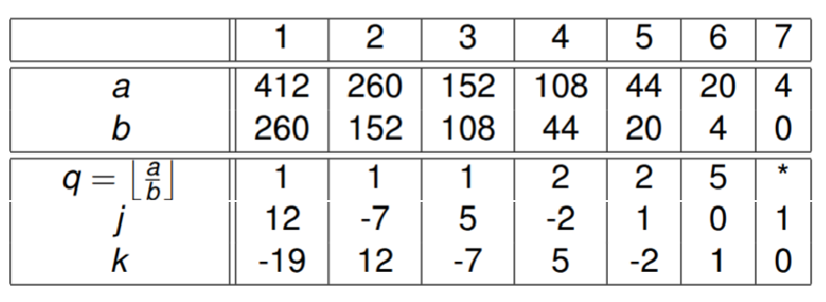


可以动手模拟一下，例如，当前 `a=20, b=4`，然后调用 `extendedGCD(4, 20 mod 4 ) = extendedGCD(4,0)`，会直接返回 `{a,1,0}`也就是`{4,1,0}`。

然后 `a=20, b=4` 这一轮，得到 `d=4, j=1, k=0, q=20/4=5`，那么返回`{d,k,j-qk}`也就是`{4,0,1-0*5}={4,0,1}`

所以表格中的记录方法是当前 iteration 返回的 `j, k`值。

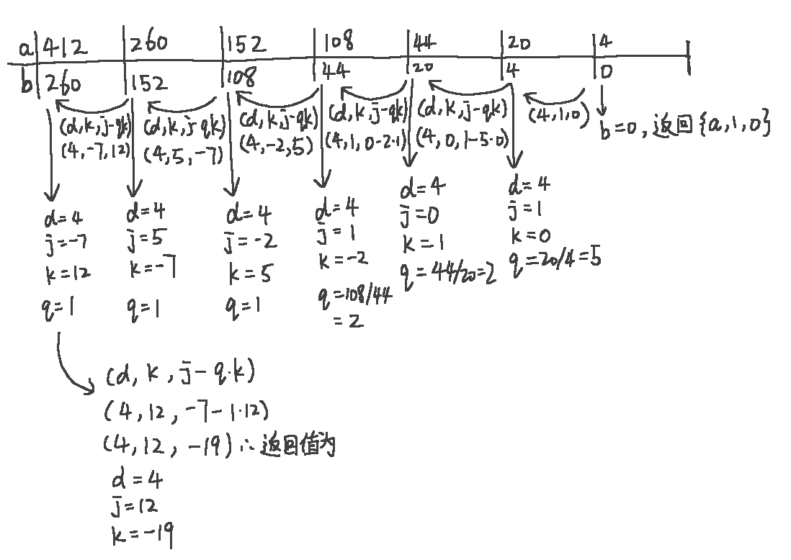

> [!NOTE]
>
> 上面的表格对应的列中的 `q j k` 填写的是**返回值**

例2：

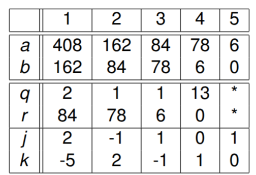


> 这里的 r 其实就是 `gcd(b,r), r = a % b`，因为我觉得冗余所以上一个例子没有写 

时间复杂度  $O(\texttt{log Math.min(a,b)})$

### [2.2] RSA

我们已经知道RSA是怎么加密的了，让我们来看看怎么选出对应的公钥和私钥！

先选两个大质数$p$和$q$，并定义欧拉函数 $\phi(n)=(p-1)(q-1)$

选择两个数，$e$ 和 $d$，这两个数就是公钥和私钥！$e$ 和 $d$ 需要满足如下性质

- $1<e<\phi(n)$

- $e$ 和 $\phi(n)$ 互质，也即 $gcd(e,\phi(n))=1$

- $ed\equiv1(\text{~~mod~~} \phi(n))$

  > 已知$e$的时候可以用扩展欧几里得算法来求出 $d$

定义 $N=p\cdot q$，就有了加密和解密：
$$
C = M^{\color{red}{e}}\text{~~mod~~}N\\
M = C^{\color{red}{d}}\text{~~mod~~}N
$$


RSA的正确性是因为，$\forall x \in (0,N)$，都有
$$
x^{ed}\equiv x \text{~~(mod N)}
$$


#### [2.2.1] 破解RSA是困难的

请注意，即使知道e，我们也无法算出d，除非我们知道\(\phi(n)\)！

大多数密码学家认为，破解RSA需要计算\(\phi(n)\)，而这又需要对n进行因式分解。因式分解**尚未被证明是困难的**，但在过去几百年里，有许多（非常多）人都研究过这个问题。

例如，为了分解\(2^{512}-1\)这个155位的数字，动用了一些复杂的数学运算和由700台计算机（包括一台超级计算机）组成的网络，花费了四个月的时间。


随着分解更大数字的能力不断提升，我们只需要选择更大的质数p和q，使得\(n=p \cdot q\)超出当前的分解能力范围。


### [2.3] 数字签名

数字签名就是持有私钥 d 的人对消息先进行**解密操作**，然后大家用公钥 e 进行**加密操作** ，这样大家就能验证这个消息是不是持有私钥 d 的这个人发出来的。

## [3] 快速幂

Fast Exponentiation

RSA算法中一个可能的瓶颈是计算
$$
x^k \text{~~mod~~} N
$$
我们可以通过一种基于“重复平方”的算法做得更快！

例如，如果我们想计算\(x^{16}\)，我们可以先求出\(x^{2}\)，然后是\((x^{2})^{2}=x^{4}\)，接着是\((x^{4})^{2}=x^{8}\)，最后是\((x^{8})^{2}=x^{16}\)。这只需要四次乘法，而“朴素方法”则需要十五次。


```java
public static long fastExponentiation(int x, int k, int N){
    int r = 1;
    int t = x;
    while (k!=0){
        if(k%2==1) r = r * t % N;
        t = t * t % N;
        k /= 2;
    }
    return r;
}
```


```
开始计算: 3^13 mod 11
--------------------------------------------------
k (指数)    | k%2   | t (当前底数)  | r (当前积)   
--------------------------------------------------
13         | 1     | 3            | 3         
6          | 0     | 9            | 3         
3          | 1     | 4            | 1         
1          | 1     | 5            | 5         
--------------------------------------------------
最终计算结果: 5
```


我们要计算 $3^{13}$，首先看 $13$ 的二进制是 `1101`。
$$
3^{13} = 3^{(1 \cdot 2^3 + 1 \cdot 2^2 + 0 \cdot 2^1 + 1 \cdot 2^0)} = 3^8 \cdot 3^4 \cdot 3^1
$$


在代码里，你会发现两个平行的任务：

- **`t` 的演变**：它在不断平方（$3^1 \to 3^2 \to 3^4 \to 3^8 \dots$）。**每一轮循环 `t` 都会变大。**
- **`r` 的任务**：它是个“购物车”。只有当对应的二进制位是 **1** 时，才把当前的 `t` 丢进购物车乘起来。


13 可以用二进制表示 `1101`，也就意味着他用对应的二进制 `8 4 2 1` 可以看出我们应该选 `8+4+1`，自然的，$3^13$ 也就可以表示为 $3^8\cdot3^4\cdot3^1$，因此，对于`r`，他是一个累加器。


我们的代码就可以写成这样：

```java
public static long fastExponentiation(int x, int k, int N){
    int r = 1;
    int t = x;
    while (k!=0){
        // 如果当前是1,那么把t放入购物车，累乘！
        if((k&1)==1) r = r * t % N; 
        t = t * t % N; // t演变： 3^1 3^2 3^4 3^8 ...
        k = k >> 1; // k 往右移1位，也就是/2,但是>>更直观且更快。
    }
    return r;
}
```


## [4] RSA 时间复杂度分析

时间复杂度：

- $O(\log k)$
- **解释：** 在 RSA 中，所有的操作（加密、解密、签名、验签）本质上都是在做 $x^k \pmod n$。


空间复杂度：

- $O(\log n)$
- **解释：** 因为每一轮运算都做了取模操作 $\pmod n$，中间结果永远不会超过 $n$。
- **关键点：** 哪怕 $n$ 是个 2048 位的巨数，操作数的长度也始终被限制在 $O(\log n)$ 位，不会发生“数值爆炸”。


RSA 的四种基本操作（加密、解密、签名、验签）在处理每个数据块时，其算术运算复杂度均为 $O(\log n)$。


# P 与 NP 问题

> 定义简要阅读即可

什么是**难的问题**？

有些计算问题,我们尝试去解决时,发现非常困难。比如讲义后面提到的 哈密顿回路问题 和 0-1 背包问题——对于这些问题,目前所有已知的算法在最坏情况下都需要"指数级"的时间(比如 2ⁿ),当输入规模稍微变大时,就算用超级计算机也算不出来。


**我们找不到高效的算法**

这里的"高效" (efficient) 在理论计算机科学中有特定含义,就是指 **多项式时间算法**(运行时间是 n、n²、n³ 这种多项式形式,而不是 2ⁿ 这种指数形式)。

尽管全世界的数学家和计算机科学家研究了几十年,**没有人能为这些问题找到多项式时间的算法**。


**找不到高效算法，但我们似乎不能说明，他难**

这是最有意思的一点。你可能会想:"找不到高效算法,那不就说明它们就是难吗?"

——**不是的**。"找不到"和"证明不存在"是两回事。

打个比方:就像你在一个黑屋子里找钥匙,找了很久没找到,这并不能证明屋子里没有钥匙——可能只是你还没找到正确的位置。

同样地,也许这些问题其实有一个聪明的多项式时间算法,只是人类目前还没想出来。我们既无法找到这样的算法(说明它"可能"很难),也无法严格证明这样的算法不存在(说明它"确实"很难)。


## [1] 什么是P与NP

我们可以简单的认为， P问题就是能快速**==算出==**答案的问题，在多项式时间内解决。

> 最小生成树、最短路径、最大流等、**分数背包**

而NP问题则是可以快速**==检查==**答案的问题。你能在多项式时间内检查它对不对。

> 哈密顿回路——给你一条路径,你可以快速检查它是否真的经过每个顶点恰好一次。
>
> {0,1}背包、3-SAT、哈密顿回路、子集和（NP完全）


**显而易见:P ⊆ NP(P 是 NP 的子集)**

> 因为如果一个问题你能快速算出答案,那你当然也能快速验证答案
>

关键问题:NP 里的问题,是不是都在 P 里 ？？？（P = NP吗？？）

虽然几乎所有计算机科学家都**相信** P ≠ NP,但**没有人能证明它**。


没人能为**任何一个 NP-完全问题**(比如 3-SAT、哈密顿回路、子集和等)找到多项式时间算法,从而证明 P = NP

```
┌─────────────────────────────────────┐
│  NP                                 │
│                                     │
│  ┌─────────┐      ┌──────────────┐  │
│  │   P     │      │  NP-complete │  │
│  │         │      │              │  │
│  └─────────┘      └──────────────┘  │
│                                     │
│         ← NP-中间问题 →              │
│        (NP-intermediate)            │
└─────────────────────────────────────┘
```


## [2] 什么是NP完全问题

要证明 P = NP,需要找到一个 **NP-完全** 问题的多项式时间算法。

- 一个问题 M 是 NP-完全的,意味着 NP 中**所有**问题都可以多项式时间**归约**到 M
- 也就是说:NP-完全问题是 NP 中"最难的那一类"

如果**任何一个** NP-完全问题被找到了多项式时间算法,那么 NP 中**所有**问题(通过归约)都能用多项式时间解决,从而 **P = NP**。

反之,只要有**一个** NP-完全问题被证明**不存在**多项式时间算法,就证明了 **P ≠ NP**。


## [3] 为什么01背包是NP完全

我们学过 {0,1} 背包的**动态规划算法**,运行时间是 **Θ(nW)**,其中:

- n 是物品数量
- **W 是背包容量**

看起来这是"多项式时间"啊?那为什么还说它是 NP-完全的?

**答案在于"输入规模"的精确定义。**

### [3.1] 输入规模的陷阱

输入规模是用**二进制表示**来衡量的。

假设 W = 1,000,000(一百万):

- 用二进制表示 W （背包容量）只需要约 **20 位** (log₂ 1000000 ≈ 20)
- 所以 W （背包容量） 在输入中的"规模"是 ~20,不是 1,000,000

因此真正的输入规模是 **n + log W**,而不是 n + W。

那么 Θ(nW) 实际上是:
$$
nW = n \cdot 2^{\log_2 W}
$$
这是关于输入规模 (n + log W) 的**指数**函数!

{0,1} 背包的 DP 算法被称为 **伪多项式时间算法 (pseudo-polynomial time algorithm)**:

- 如果把数字 W "看作"普通输入参数,它是多项式时间
- 但按照严格的"二进制输入规模"标准,它是指数时间
- "伪"就是这个意思——**看起来**是多项式,实际上不是

> 某些 NP-完全问题(如背包、子集和)有伪多项式算法,只要数字不太大就能实际求解。这类问题被称为 **弱 NP-完全 (weakly NP-complete)**。
>
> 而像 3-SAT、哈密顿回路这样的问题,**连伪多项式算法都不存在**(假设 P ≠ NP),它们被称为 **强 NP-完全 (strongly NP-complete)**。

## [4] 决策/优化问题

NP-完全性理论要用"决策问题"来定义,而不是用我们日常更关心的"优化问题"

### [4.1] 两类问题的区别

**决策问题 (Decision Problem)**

- 输出只有两种:**Yes** 或 **No**
- 像一道**对错题**
- 例子:"图 G 中是否存在权重 ≤ k 的生成树?" → 是 / 否

**优化问题 (Optimization Problem)**

- 要找出某个函数的**最大值或最小值**
- 输出是一个具体的数值或方案
- 例子:"图 G 中最小生成树的权重是多少?" → 一个具体数值


优化问题如何"转换"为决策问题？

讲义介绍的标准技巧:**加一个参数 k**。

| 优化问题           | 决策问题                     |
| ------------------ | ---------------------------- |
| 找最小生成树的权重 | 是否存在权重 ≤ k 的生成树?   |
| 找最大背包价值     | 是否存在价值 ≥ k 的物品子集? |
| 找最大团的大小     | 图中是否存在大小 ≥ k 的团?   |
| 找最短路径长度     | 是否存在长度 ≤ k 的路径?     |

如果优化问题容易，显然，决策问题也容易。决策问题**不会比优化问题更难**。

**如果决策问题难,那么对应的优化问题必然也难**


### [4.2] 两种问题复杂度等价

重点：决策容易 ⟹ 优化也容易(关键!)

为什么？！**用决策问题做"二分搜索"**。


假设你有一个能快速回答"是否存在价值 ≥ k 的解?"的算法(高效的决策问题解法),如何用它找到**精确**的最大价值?每问一次,搜索区间**减半**。需要多少次?
$$
\text{次数} \approx \log_2 B
$$
**关键观察**:每次询问只需调用一次决策算法。如果决策算法是多项式时间,总时间就是:
$$
\log_2 B \times (\text{决策算法的多项式时间})
$$
仍然是多项式时间! ✅

这个看似简单的技巧告诉我们:**决策版本和优化版本在复杂度上是"等价"的**。

- 决策问题在 P 中 ⟺ 优化问题也"在 P 中"(松散意义上)
- 决策问题是 NP-完全的 ⟹ 优化问题也是"难的"

## [5] 高效证书 (Efficient Certification)

要正式定义 NP 类，得先理解一个核心概念——**证书 (certificate)**。

> 这是整个 NP 理论的灵魂：**"自己解出来" 和 "别人给你答案让你检查" 是两件不同难度的事**。

### [5.1] 直觉：解题 vs 验证

举个生活例子：

| 行为                       | 难度   |
| -------------------------- | ------ |
| 自己解一道数独             | 半小时 |
| 检查别人填好的数独是否正确 | 几分钟 |

**解题难，验证容易** —— 这就是 NP 问题的本质特征。

### [5.2] 哈密顿回路的例子

假设有人（讲义原文很有意思，叫 "good guessing, divine intervention"，靠运气或者神明）告诉你：

> "这条路径就是哈密顿回路: v₁ → v₃ → v₇ → v₂ → ... → v₁"

你只需机械地检查三件事：

1. **每条边都真实存在于 G 中** （查邻接表）
2. **确实形成一条回路** （终点回到起点）
3. **每个顶点恰好访问一次** （计数）

这三件事都能在多项式时间内完成。**这条被给出的路径就是该 "yes" 实例的证书 (certificate)**。

### [5.3] {0,1} 背包的例子

有人给你一个物品子集 S = {物品 2, 物品 5, 物品 7}, 你只需:

1. 算总重量: w₂ + w₅ + w₇ ≤ W?
2. 算总价值: b₂ + b₅ + b₇ ≥ k?

两个加法、两个比较, 多项式时间搞定。这个子集就是证书。

### [5.4] 证书的关键性质

**1. 证书只对 "yes" 答案存在**

我们说 "NP 问题有高效证书", 是指当答案是 yes 时, 存在一个东西可以快速证明它是 yes。

> 至于 "no" 答案怎么快速证明 —— 那是 **co-NP** 的领域（见后面 [8]）, 是另一个故事。

**2. 证书必须 "短"**

不能太长。证书 t 的长度 |t| 必须满足 |t| ≤ q(|s|), 其中 q 是多项式。

- 哈密顿回路的证书是 n 个顶点的序列, 长度是 n ✓
- 背包的证书是物品子集, 长度最多是 n ✓

> 如果允许证书无限长, "NP" 就没意义了 —— 可以把所有可能的答案都塞进证书里。

**3. 证书 + 验证算法 = 两件东西**

不要只想着 "证书"。NP 的定义有两部分:

- 一个**证书** t（数据）
- 一个**验证算法** B（程序）

验证算法 B 接受 (s, t): s 是原问题, t 是候选证书; B 在多项式时间内判断 t 是否是 s 的有效证书。

## [6] NP 的形式定义

### [6.1] 证书版本定义 (slide 15)

> **定义**: 决策问题 X 属于 NP, 当且仅当存在一个多项式时间算法 B 和一个多项式函数 q(·), 使得对任意输入 s:
>
> s 的答案是 yes ⟺ 存在一个串 t, 满足 |t| ≤ q(|s|) 且 B(s, t) = yes

把这个定义拆开看, 三个角色:

| 符号 | 含义                   | 类比                  |
| ---- | ---------------------- | --------------------- |
| s    | 问题输入               | 题目本身（如图 G）    |
| t    | 候选证书               | 别人给你的 "答案候选" |
| B    | 验证算法               | 你脑子里的检查程序    |
| q(·) | 一个多项式（长度限制） | 限制证书别太长        |

### [6.2] "当且仅当" 的双向理解

这个 ⟺ 很关键, 拆成两条:

**正向**: 如果 s 的真实答案是 yes ⟹ **必然存在**一个不太长的证书 t 让 B(s, t) = yes

**反向**: 如果 s 的真实答案是 no ⟹ **不存在**任何 t 能骗过 B（B 必须能识破所有假证书）

> 也就是说: **验证算法不能被假证书骗过去**。 真实答案是 no 时, 不管别人塞给你多么花哨的 "证据", 你的 B 跑完之后必须输出 no。

## [7] NP 的另一个等价定义（非确定性算法版）

### [7.1] 什么是非确定性算法

> 一个能在执行过程中 "猜测" 某些非确定性比特的算法, 叫做非确定性算法。 如果存在某种猜法让算法最终输出 yes, 我们说它 "**非确定性地接受**" 了输入 s。

举例（哈密顿回路）:

```
非确定性算法:
1. 非确定性地 "猜" 一个顶点序列 v₁, v₂, ..., vₙ
2. 检查这个序列是不是真的哈密顿回路
3. 如果是, 输出 yes
```

### [7.2] 关键澄清: 不是 "运气"

⚠️ 容易踩的坑: 不要把非确定性算法理解为 "靠运气猜, 可能猜对可能猜错"。

**精确理解**:

> 非确定性算法 **同时尝试所有可能的猜法**, 只要 **存在一种** 让结果是 yes 的猜法, 就算 "接受"。

比喻:

- ❌ 概率算法（运气）: 掷骰子选路走, 可能成功可能失败
- ✅ 非确定性算法: **完美猜测者**, 从不失手, 因为它 "看遍" 了所有可能

### [7.3] 但这不就是指数级的吗？？

> ⚠️ **这是初学者最容易困惑的点**

是的, 如果你把非确定性算法理解成 "开 n! 个线程并行检查", 那它根本不是真正的多项式时间。

**答案**: 非确定性算法 **不是真实的物理机器**, 而是一个 **数学定义/理论工具**。

它的定义是这样的:

> "非确定性算法在多项式时间内接受 s" 意思是 —— **存在一条** 选择路径（一种猜法）, 让算法 **沿着这条路径** 在多项式步骤内到达 yes

我们衡量的是 **"最短的幸运路径多长"**, 不是 **"整棵搜索树多大"**。

```
                  输入 s
              /     |     \
           猜A    猜B    猜C        ← 每个节点是一次 "猜"
          / |    / |    / |
         ...   ...   ...           ← 整棵树是指数级
         yes  no   no   yes
         ↑
    只要存在一条路径到 yes,
    就算 "非确定性接受",
    而这条路径本身只有多项式长
```

> **它不真的运行**, 它只是数学上断言: "**存在** 这样一条路径"。 真实计算机要模拟它, 当然需要指数时间（这正是大家相信 P ≠ NP 的原因）。

### [7.4] 两种定义的对应关系

证书版 (slide 15) 和 非确定性版 (slide 17) 完全等价:

| 证书版 (slide 15)        | 非确定性版 (slide 17)      |
| ------------------------ | -------------------------- |
| 别人 **给** 你一个证书 t | 算法 **自己猜** 出候选解 t |
| 用 B(s, t) 验证          | 用确定性步骤验证           |
| 存在好的证书让 B 接受    | 存在好的猜法让算法接受     |
| 验证时间是多项式         | 单条幸运路径长度是多项式   |

> 现代教材更喜欢用 **证书版**, 因为它避开了 "幻想机器" 的麻烦, 一切都在真实计算机上发生。

### [7.5] 为什么叫 "NP"

NP = **N**on-deterministic **P**olynomial time（非确定性多项式时间）

> ⚠️ 常见误解: 很多人以为 NP = "Not Polynomial", **错误**。 事实上 P ⊆ NP, 多项式时间的问题也都在 NP 里。

## [8] co-NP 类

### [8.1] 定义

NP 关心 "yes" 答案的快速验证。但有些问题正好相反 —— **"no" 答案才容易验证**。

> **co-NP**: 所有 "对 no 答案有高效证书" 的决策问题的集合。

### [8.2] 经典例子: 判定素数

问题: 给定正整数 n, n 是素数吗？

- 如果 n **不是** 素数, 容易给出证书: 两个整数 k, ℓ (都 > 1), 使得 k · ℓ = n
  - 验证: 做一次乘法, 多项式时间 ✓
- 如果 n **是** 素数, 要给出 "没有任何因子" 的证据反而不那么直接

所以 "n 是素数？" 这个问题天然属于 co-NP。

> 顺带一提: 后来的 AKS 算法证明了素数判定其实也在 P 里, 但 co-NP 的定义本身不依赖这个事实。

### [8.3] P, NP, co-NP 的关系

```
    NP        co-NP
  ┌───────┬──────┐
  │       │      │
  │   ┌───┴──┐   │
  │   │   P  │   │      ← P 在两者交集中
  │   └───┬──┘   │
  │       │      │
  └───────┘──────┘
```

- **P ⊆ NP ∩ co-NP** （如果能直接解, "yes" 和 "no" 都能快速验证）
- **NP = co-NP？** —— 也是开放问题, 普遍相信不等


### [9] 多项式时间归约 (Polynomial-time Reducibility)

#### [9.1] 什么是归约？

归约的核心思想就一句话：

> **"把一个问题翻译成另一个问题"**。

假设你有两个问题:

- **L**: 我想解决的问题（比如"判断图 G 有没有 Hamiltonian 回路"）
- **M**: 我已经有解法的问题（比如"判断 SAT 公式是否可满足"）

如果存在一个**快速的翻译器** f, 能把 L 的输入"翻译"成 M 的输入, 并且翻译后 yes/no 答案不变 ——

> 那么我就可以**借用 M 的算法来解 L**: L 的输入 s → 用 f 翻译成 f(s) → 把 f(s) 喂给 M 的算法 → M 给出的答案就是 L 的答案

记法: **L ⟶ M** (读作 "L 归约到 M")

##### 关键要求

这个"翻译器" f 必须满足两个条件:

1. **翻译要快**: f 本身得是多项式时间的（不然翻译比解题还慢, 就没意义了）
2. **翻译要准**: s 在 L 中是 yes ⟺ f(s) 在 M 中也是 yes（不能翻译错了）


**L ⟶ M 意味着 M 至少和 L 一样难**, 而不是反过来。


## [10] NP-hard 与 NP-complete

### [10.1] 定义

> **NP-hard**: 问题 M 是 NP-hard, 如果 NP 中 **所有** 问题 L 都满足 L ⟶ M。
>
> **NP-complete**: M 既是 NP-hard, **又属于 NP 本身**。

简单理解:

- **NP-hard** = "至少和 NP 中最难的问题一样难" （可能更难, 甚至不在 NP 里）
- **NP-complete** = "NP 里最难的那一类" （NP-hard ∩ NP）


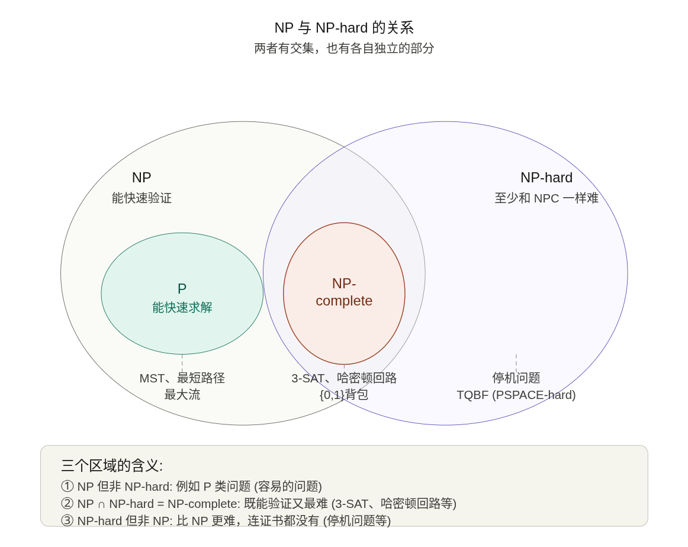

### [10.2] 为什么 NP-complete 重要

NP-complete 问题之间是 "一荣俱荣, 一损俱损" 的关系:

> 只要任何一个 NP-complete 问题被找到多项式时间算法 ⟹ **所有** NP 问题都能多项式时间解决 ⟹ **P = NP**

反过来:

> 只要任何一个 NP-complete 问题被证明不存在多项式时间算法 ⟹ **P ≠ NP**

所以全世界数学家、计算机科学家都在盯着这一类问题。

## [11] Cook-Levin 定理

### [11.1] 定理内容

> **Cook-Levin 定理**: **Circuit-SAT 是 NP-complete**。

这是 **历史上第一个被证明的 NP-complete 问题**, 整个 NP-completeness 理论的起点。

### [11.2] Circuit-SAT 是什么

**布尔电路 (Boolean Circuit)**: 一个有向图, 每个节点是一个逻辑门（AND, OR, NOT）, 边表示输入/输出关系。

**Circuit-SAT 问题**: 给定一个布尔电路（单输出节点）, 是否存在一组输入赋值, 使输出为 1?

### [11.3] 证明思路

> 任何 "合理的" 算法的计算步骤, 都可以被适当构造的（多项式时间和大小的）布尔电路模拟。

也就是说: **所有 NP 问题的非确定性算法都能被翻译成 Circuit-SAT 实例**。因此 NP 中所有问题都可归约到 Circuit-SAT, 即 Circuit-SAT 是 NP-hard。再加上它本身在 NP 里（猜一个输入赋值, 验证电路输出, 多项式时间）, 所以 NP-complete。

## [12] 证明新问题为 NP-complete 的方法

假设要证明问题 X 是 NP-complete:

**步骤 1**: 证明 X ∈ NP

- 找出 X 的高效证书 (efficient certifier), 或
- 说明 X 有非确定性多项式时间算法

**步骤 2**: 找一个 **已知** 的 NP-complete 问题 Y, 证明 Y ⟶ X

> 注意方向: **从已知难的归约到要证明的**, 不是反过来。 这样才能说 "X 至少和 Y 一样难, 而 Y 是 NP-complete, 所以 X 也是"。

### [12.1] 三种常见归约技巧

| 技巧                              | 含义                                                       |
| --------------------------------- | ---------------------------------------------------------- |
| **Restriction（限制）**           | 说明已知 NP-complete 问题是 X 的一个特例                   |
| **Local replacement（局部替换）** | 把 Y 的实例拆成基本单元, 每个单元局部地转换为 X 的基本单元 |
| **Component Design（组件设计）**  | 为 X 构造 "组件", 使其能模拟 Y 中的关键结构特性            |

## [13] 经典 NP-complete 问题集合

### [13.1] 已遇到过的

- **Hamiltonian Cycle (哈密顿回路)**: 是否存在经过每个顶点恰好一次的回路？
- **Circuit-SAT**: 见 [11.2]
- **Subset Sum (子集和)**: 给定整数集 S, 是否存在非空子集 T ⊆ S, 元素之和为 0?
- **{0,1} Knapsack**: 见前面 [3]

### [13.2] Vertex Cover 与 Clique

> **Vertex Cover (顶点覆盖)**: 给定图 G 和整数 k, 是否存在 |S| ≤ k 的顶点集 S, 使得 E 中每条边都至少有一个端点在 S 中？

> **Clique (团)**: 给定图 G 和整数 k, 是否存在 |S| ≥ k 的顶点集 S, 使得 S 中任意两顶点都有边相连？

讲义里展示了 **Vertex Cover ⟶ Clique** 的归约（具体在 slide 34 之后的注释版）。

### [13.3] CNF-SAT 与 3-SAT

**合取范式 (CNF)**: 用 AND 连接若干 clause, 每个 clause 用 OR 连接若干 literal (变量 xᵢ 或其否定 x̄ᵢ)。

例子: $$ (\overline{x_1} \vee x_2 \vee x_4) \wedge (x_1 \vee \overline{x_3}) \wedge (x_2 \vee x_3 \vee \overline{x_4}) $$

**CNF-SAT**: 给定 CNF 公式, 是否存在变量赋值使整体为真？

**3-SAT**: CNF-SAT 的特例, 每个 clause **恰好** 含 3 个 literal。

> **Fact**: CNF-SAT 和 3-SAT 都是 NP-complete。
>
> 但 **2-SAT 在 P 里** —— 每个 clause 只有 2 个 literal 时, 有多项式时间算法。 从 2 到 3, 复杂度发生了质的飞跃。

### [13.4] {0,1} 整数规划

> 给定一组线性不等式 (变量 xᵢ ∈ {0,1}), 是否存在赋值满足所有不等式且使目标函数 c₁x₁ + ... + cₙxₙ ≥ k？

NP-complete。

### [13.5] 3-Coloring (3-COL)

> 给定图 G, 能否用 3 种颜色给顶点染色, 使相邻顶点颜色不同？

更一般地, **k-COL** 对 k ≥ 3 都是 NP-complete。

> 有趣的是 **2-COL 在 P 里** —— 即判定一个图是否二部图, 用 BFS 就能多项式时间解决。又是 2 → 3 的质变。

## [14] 总结一张图

```
       决策问题宇宙
┌──────────────────────────────────────────┐
│                                          │
│   ┌────────────────────────┐             │
│   │           NP           │             │
│   │                        │             │
│   │  ┌──────┐   ┌────────┐ │             │
│   │  │  P   │   │   NP-  │ │             │
│   │  │      │   │complete│ │             │
│   │  └──────┘   └────────┘ │             │
│   │                        │             │
│   └────────────────────────┘             │
│        ↑                                 │
│        co-NP 在另一边                     │
│        P ⊆ NP ∩ co-NP                    │
│                                          │
│     NP-hard 可能延伸到 NP 外               │
└──────────────────────────────────────────┘

未解决的世纪难题:
  • P = NP?
  • NP = co-NP?
```


# 近似算法 (Approximation Algorithms)

> 这是 NP-completeness 的自然延续: 既然很多优化问题是 NP-hard 的（除非 P=NP, 否则求不出最优解）, 那就**放弃精确, 追求近似** —— 在多项式时间内给出一个 "足够接近最优" 的解。

## [1] 动机

**核心矛盾**:

很多优化问题（如 TSP、Vertex Cover、{0,1} 背包等）都是 NP-hard 的

> 不存在多项式时间算法精确求解（除非 P=NP）

**解决思路**:

> 不求最优, 求 "**接近最优**"。在合理时间内给出一个**有保证**的近似解。

> 罗素的话: "所有精确科学都被'近似'的思想所主宰"。

## [2] 近似算法的定义

### [2.1] 最小化问题

> **factor-α 近似算法 (minimization)**:
>
> 设 Π 是最小化问题, α ≥ 1。 factor-α 近似算法是一个**多项式时间**算法, 对**任意**输入 I, 都能给出解 s 满足:
>
> $$\frac{\text{ALG}}{\text{OPT}} \le \alpha$$
>
> 其中 ALG = 算法解的值, OPT = 最优解的值。

通俗理解:

- α = 2: 算法的解**最多是最优解的 2 倍**
- α 越接近 1, 近似越精确
- α = 1: 完美（直接求出最优解）

### [2.2] 最大化问题

> 最大化问题反过来: **0 < α ≤ 1**, 满足:
>
> $$\frac{\text{ALG}}{\text{OPT}} \ge \alpha$$

通俗理解:

- α = 0.5: 算法**至少拿到最优解的一半**
- α 越接近 1, 近似越精确

### [2.3] 两种问题的方向对比

|            | 最小化         | 最大化             |
| ---------- | -------------- | ------------------ |
| ALG vs OPT | ALG ≥ OPT      | ALG ≤ OPT          |
| α 范围     | α ≥ 1          | 0 < α ≤ 1          |
| 不等式     | ALG/OPT ≤ α    | ALG/OPT ≥ α        |
| α 的含义   | "最多差多少倍" | "至少达到多少比例" |

> ⚠️ 不管哪种问题, **α 越接近 1 越好**, α = 1 等价于精确求解。

### [2.4] 关键: factor-α 是 "最坏情况保证"

> ❌ 误解: "factor-2 算法每次返回最优解的 2 倍"
>
> ✅ 正确: factor-2 只是**最坏情况上限**, 实际可能远好于这个比例。

## [3] Vertex Cover 问题

### [3.1] 问题定义

> **Vertex Cover (顶点覆盖)**:
>
> **输入**: 图 G = (V, E) **输出**: 最小顶点子集 V' ⊆ V, 使得每条边 uv ∈ E 至少有一个端点在 V' 中（即每条边都被 "覆盖"）

事实: **求最小 Vertex Cover 是 NP-hard 的**。

> 所以我们退而求其次, 设计**近似算法**。

## [4] 设计近似算法的核心思路

### [4.1] 核心矛盾

要证明 ALG/OPT ≤ α, 需要知道 OPT。 但求 OPT 是 NP-hard 的, 算不出来。

> **鸡生蛋问题**: 我们既要近似 OPT, 又算不出 OPT 来对比。

### [4.2] 关键技巧: 找一个下界 L

> 找一个**容易计算**的 L, 满足 **L ≤ OPT**。 因为 L ≤ OPT, 所以 L 放在分母上会让分数变大:
>
> $$\frac{\text{ALG}}{\text{OPT}} \le \frac{\text{ALG}}{L}$$

**策略**: 只要能证明 **ALG ≤ α · L**, 就自动得到:

$$\frac{\text{ALG}}{\text{OPT}} \le \frac{\text{ALG}}{L} \le \alpha \quad \checkmark$$

> 类比: 想证 "我每月开销不超过工资一半", 但工资数不知道。如果知道**工资至少 5000**（下界）, 又证明**开销不超过 2500**, 结论自动成立。

## [5] Vertex Cover 的下界: 匹配

### [5.1] 什么是匹配

> **匹配 (Matching)** M ⊆ E: 一组边的集合, 其中**任意两条边没有公共端点**（互不相邻）。

> **极大匹配 (maximal matching)**: 不能再加入任何边而仍保持匹配性质（局部极大, 贪心可得）。
>
> ⚠️ 区分 "极大" (maximal) 和 "最大" (maximum):
>
> - 极大: 不能再扩展（贪心即可）
> - 最大: 边数最多（更难, 但多项式时间可解）
>
> Vertex Cover 算法用的是**极大**匹配。

### [5.2] 关键观察: OPT ≥ |M|

**为什么任何匹配 M 都满足 OPT ≥ |M|?**

> 1. 任何顶点覆盖 V' 必须覆盖 M 中的每一条边
> 2. M 中的边**互不相邻** → 一个顶点最多覆盖 M 中的一条边
> 3. 要覆盖 M 的 |M| 条边, **至少需要 |M| 个顶点**

所以对**任何**匹配 M, 都有: **OPT ≥ |M|**

> 这就是我们要的下界! **L = |M|**

## [6] Vertex Cover 的 2-近似算法

### [6.1] 算法

```
VertexCover(G):
  M ← ∅
  for each edge e ∈ E(G):
    if e 与 M 中的任何边都不相邻:
      M ← M ∪ {e}             # 贪心构造极大匹配
  return { u, v | uv ∈ M }    # 返回 M 中所有边的端点
```

简单贪心扫描所有边, 构造一个**极大匹配** M, 然后返回 M 中所有边的端点。

### [6.2] 算法的两个核心性质

**性质 1**: 返回的顶点集是合法的顶点覆盖

> 反证: 若某条边 e = uv 未被覆盖, 则 u 和 v 都不在返回集中 → e 不在 M 中, 且与 M 中所有边都不相邻 → 本可以把 e 加入 M, 矛盾于 M 是**极大**匹配。

**性质 2**: ALG = 2·|M|

> M 中边互不相邻 → 端点互不重复 → 返回的顶点数恰好是 2·|M|。

### [6.3] 证明 factor-2

把所有东西串起来:

$$ \underbrace{\text{ALG} = 2 \cdot |M|}*{\text{算法的输出}} \le \underbrace{2 \cdot \text{OPT}}*{\text{因为 } |M| \le \text{OPT}} $$

所以:

$$\frac{\text{ALG}}{\text{OPT}} \le 2 \quad \checkmark$$

### [6.4] 证明的灵魂: 一石二鸟

> 同一个匹配 M 同时承担**两个角色**:
>
> - **2|M|** 是算法的输出（上界）
> - **|M|** 是 OPT 的下界 两边一夹, 比例锁在 2 以内。

> 这种 "**用同一个结构同时上界算法和下界 OPT**" 是近似算法分析的经典技巧。

## [7] Vertex Cover 的可近似性 (Approximability)

> 这个简单的算法给出了 Vertex Cover **目前已知最好的常数因子近似**。 听起来简单, 但学术界几十年都没找到更好的常数因子算法。

**下界结果**（说明做更好有多难）:

- 若 P ≠ NP: Vertex Cover **无法在 1.3606 以内**近似
- 若 **Unique Games Conjecture** 成立: 无法在 **2 - ε** 以内近似（任意小 ε > 0）

> 也就是说, **factor 2 可能已经是天花板**。

## [8] Steiner Tree 问题

> 不考

### [8.1] 问题定义

> **Steiner Tree (施泰纳树)**:
>
> **输入**:
>
> - 带权图 G, 每条边 e 有代价 c(e)
> - 顶点分为两类:
>   - **终端节点 (terminals)** T: 必须被连接
>   - **施泰纳节点 (Steiner vertices)** S: 可选, 用来"中转"
>
> **输出**: 子树 B, 满足:
>
> - 包含所有终端: T ⊆ V(B)
> - **代价最小**: c(B) = Σ c(e) 在所有可行子树中最小

直觉: 想象终端是"城市必须连通", Steiner 节点是"可选的中转站"。

> ⚠️ 注意区分:
>
> - **MST (最小生成树)**: 要求覆盖**所有**顶点
> - **Steiner Tree**: 只要求覆盖**终端**, Steiner 节点可选

**Steiner Tree 是 NP-hard 的**。

### [8.2] Metric Steiner Tree

> **Metric Steiner Tree**: Steiner Tree 的特例, 要求:
>
> - 图 **G 是完全图**（任意两点都有边）
> - 代价满足**度量性质（三角不等式）**: 对任意 u, v, w:
>
> $$c(u, w) \le c(u, v) + c(v, w)$$

**关键事实**（讲义不证明）:

> 设计 Metric Steiner Tree 的近似算法就**足够了** —— 一般 Steiner Tree 可以归约到它。

## [9] Steiner Tree 的 2-近似算法

### [9.1] 算法

> 在 **G[T]** 上求最小生成树 (MST)。 其中 G[T] 是仅由终端节点导出的子图。

也就是说: **完全无视 Steiner 节点**, 只在终端之间求 MST。

### [9.2] 定理

> 对于 Metric Steiner Tree 的任意实例, 设 B 是 G[T] 的 MST, 则 **c(B) ≤ 2 · OPT**。

### [9.3] 证明思路 (四步走)

设 B* 是**最优** Steiner Tree（代价为 OPT）。

**第 1 步: 加倍**

> 把 B* 的每条边复制一份, 得到图 B'。
>
> **c(B') = 2 · OPT**

**第 2 步: 欧拉游 (Euler tour)**

> B' 中每个顶点度数都是偶数 → 存在欧拉游 T'（DFS 即可构造）, 遍历每条边恰好一次。
>
> **c(T') = c(B') = 2 · OPT**

**第 3 步: 短路 (short-cutting)**

> 把 T' 中的 Steiner 节点和重复访问的终端**跳过**, 得到只访问每个终端一次的路径 H。
>
> 因为图是**度量的**, 三角不等式保证 "走捷径不会变贵":
>
> **c(H) ≤ c(T') = 2 · OPT**

**第 4 步: MST 不会更差**

> H 是 G[T] 上的一棵生成树（连接所有终端）。 B 是 G[T] 的**最小**生成树。 所以:
>
> **c(B) ≤ c(H) ≤ 2 · OPT** ✓

### [9.4] 证明链条总结

$$ c(B) \le c(H) \le c(T') = c(B') = 2 \cdot \text{OPT} $$

每一步的关键点:

| 步骤  | 转换                | 关键性质              |
| ----- | ------------------- | --------------------- |
| 1 → 2 | B* 加倍 → 欧拉游 T' | 偶度图有欧拉回路      |
| 2 → 3 | T' 短路 → 路径 H    | 度量性质 (三角不等式) |
| 3 → 4 | H → MST B           | B 是最小的生成树      |

## [10] 总结: 近似算法的核心方法论

通过 Vertex Cover 和 Steiner Tree 这两个例子, 可以提炼出近似算法分析的几个核心技巧:

### [10.1] 下界法 (Lower Bound Method)

> **不要直接逼近 OPT** —— 你都不知道它是什么。 找一个**容易算的下界 L ≤ OPT**, 比较 ALG 和 L。

- Vertex Cover 中: L = |M| (匹配的大小)
- Steiner Tree 中: 隐含的下界是 OPT 自身的两倍遍历

### [10.2] 一石二鸟构造

> 设计一个结构, 让它**同时**:
>
> - 给出**算法输出的上界**（ALG ≤ 某值）
> - 给出 **OPT 的下界**（某值 ≤ OPT）

- Vertex Cover 中: 匹配 M 同时给出 ALG = 2|M| 和 OPT ≥ |M|

### [10.3] 归约到简化版

> 复杂问题先转化为有良好性质的特例, 再设计算法。

- Steiner Tree 归约到 Metric Steiner Tree, 利用三角不等式简化分析

### [10.4] 结构性论证

> 构造一系列变换, 每一步不增加（或可控地增加）代价, 把最优解链接到算法解。

- Steiner Tree 中: B* → B' → T' → H → B 的四步链

## [11] 近似算法的展望

> 今天, 近似算法已被应用到上百个优化问题, 涉及:
>
> - 物流 (logistics)
> - 网络设计 (network design)
> - 调度 (scheduling)
> - 数据挖掘 (data mining)
> - 机器学习 (machine learning)
>
> 这是一个充满美丽想法的活跃研究领域。


