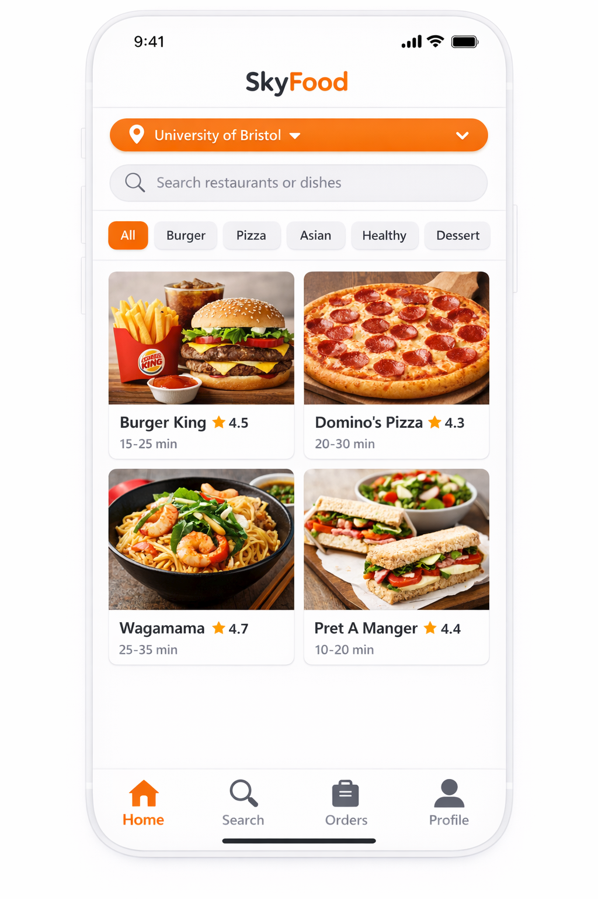
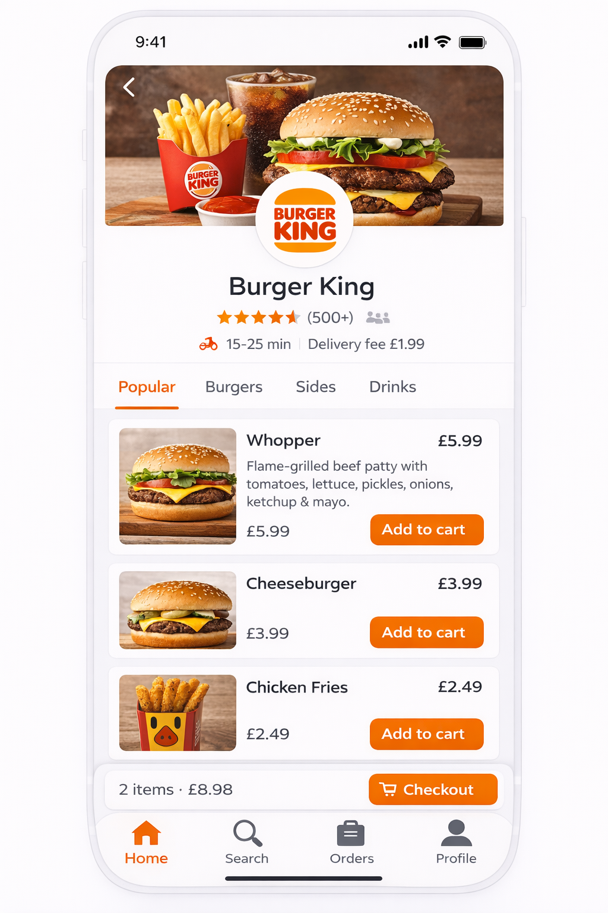
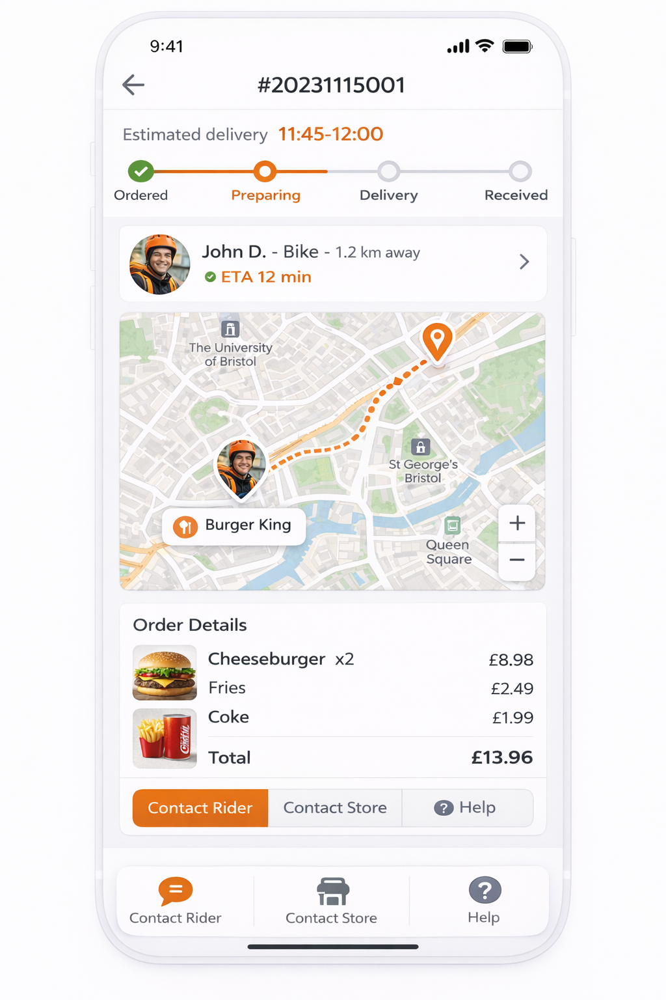
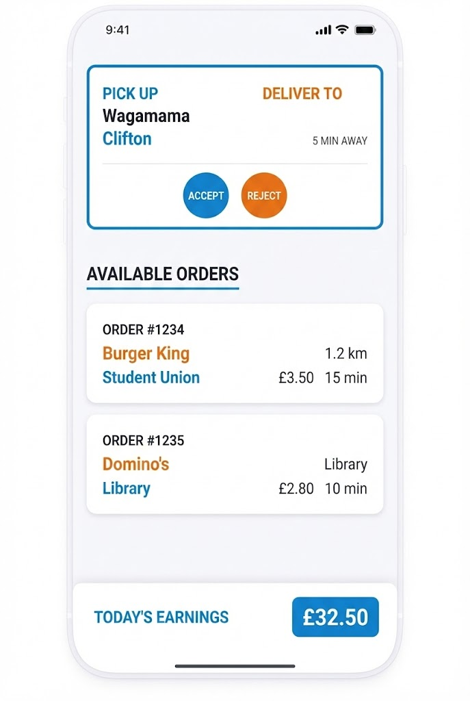
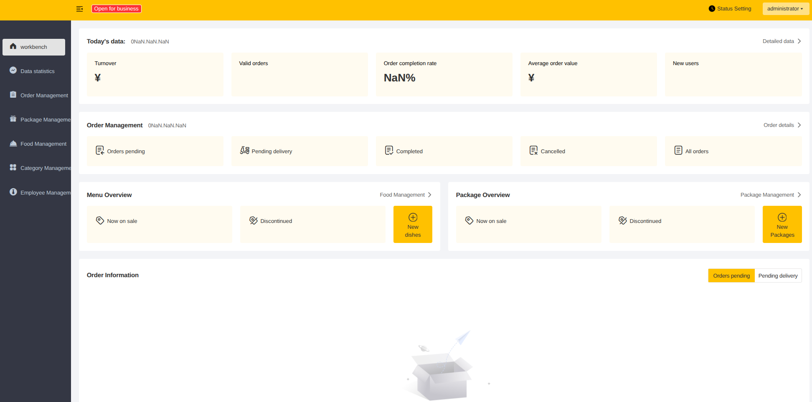
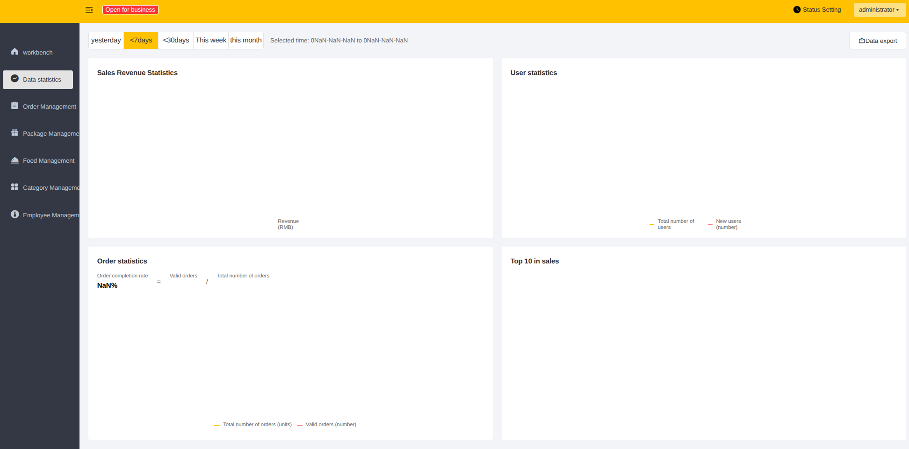
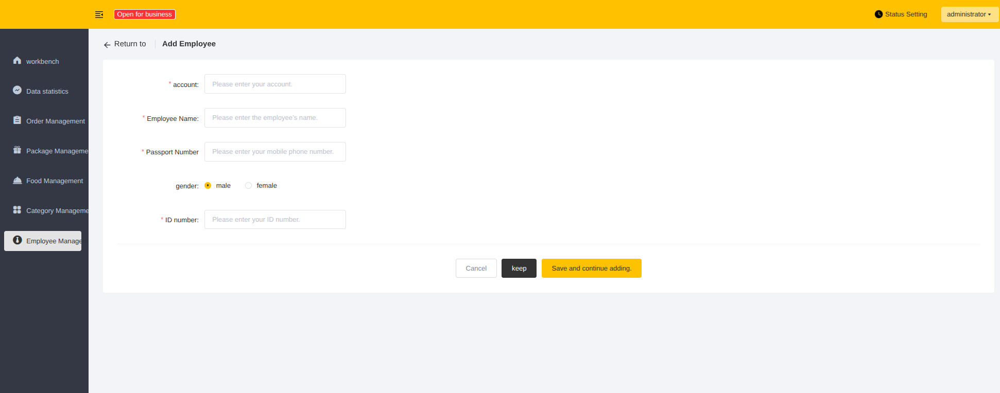
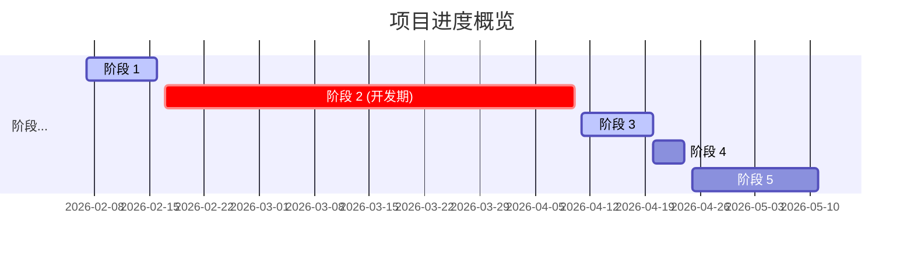
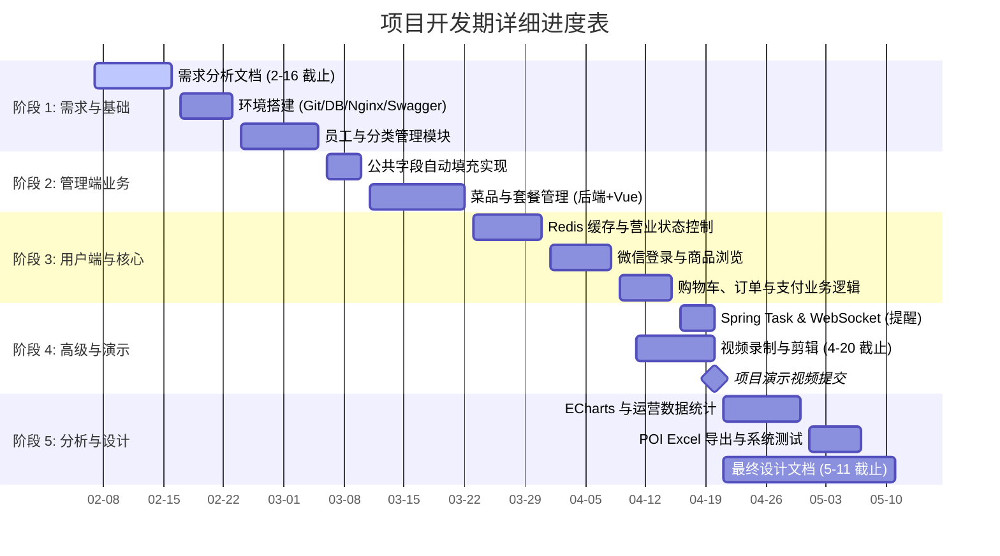
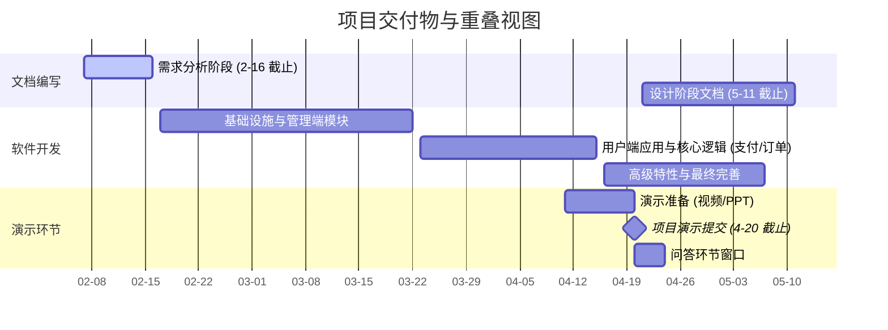

# Title

Liv Take Out

# Project Description

**我们会做什么？**

本项目旨在开发“苍穹外卖”，这是一套专为餐饮行业设计的企业级外卖管理系统。与简单的点餐软件不同，该系统同时服务于两个核心用户群体：餐厅顾客（点餐方）和餐厅管理者（运营方）。项目的目标是将从“下单”到“交付”的整个工作流程数字化，替代传统的人工操作。

系统基于双端架构构建：

1. **顾客交互：** 我将开发一个用户友好的移动端接口（小程序），允许顾客浏览菜单并下单。
2. **业务逻辑与管理：** 我将构建一个强大的Web后端管理后台。它充当餐厅的“大脑”，处理来自顾客的数据，实时管理库存状态，并处理订单流转（如接单、拒单或安排配送）。

**成品长什么样？ (Key Features)** 最终产品将包含两个同步的应用程序：

- **顾客端（点餐App）：** 一个可视化的电子菜单，用户可以浏览菜品、自定义口味、下单并实时追踪配送状态。
- **商户端（管理后台）：** 供餐厅员工使用的控制面板，主要功能包括：
  - **订单处理：** 实时显示新订单，员工可一键接单或拒单。
  - **菜品管理：** 能够轻松添加新菜品、调整价格或标记“售罄”。
  - **数据可视化：** 自动生成营业额、热销排名和用户统计图表，辅助店主进行商业决策。

# Aims & Objectives

**Aims (项目总目标)** 本项目的目标是构建一个**智能化的餐饮外卖服务平台**，旨在通过技术手段替代传统的餐厅人工操作。我们的核心目的是连接“移动端的顾客”与“电脑端的商家”，解决传统点餐中记错单、送餐慢、账目乱的问题，为用户提供像点外卖一样简单的就餐体验，同时帮助商家提高工作效率。

**Objectives (具体实施指标)** 为了实现上述目标，我们将具体开发两个独立的操作系统：

**1. 商家管理后台 (网页端)** 这是一个给餐厅老板和员工使用的管理系统，包含以下具体功能：

- **电子菜单管理：** 允许商家在后台上传菜品图片、修改价格、设置“套餐”搭配，以及对菜品进行分类（如“热菜”、“饮料”）。
- **实时订单处理：** 当顾客下单时，系统会自动发出“来单提醒”的声音，员工可以点击屏幕进行接单、拒单或处理催单请求。
- **员工权限管理：** 让餐厅老板可以为不同员工开设账号，并管理他们的操作权限。
- **经营数据统计：** 自动生成销售报表，直观展示当天的营业额和销量排名，让老板对生意一目了然。

**2. 顾客点餐程序 (移动端)** 这是一个给普通消费者使用的手机界面（微信小程序、或者APP），包含以下具体功能：

- **自助点餐：** 用户可以浏览图文并茂的菜单，查看菜品详情，并将其加入购物车。
- **订单与支付：** 支持用户登录、确认下单、在线支付，并能随时查看“历史订单”记录。
- **状态追踪与互动：** 用户可以实时查看饭菜是“制作中”还是“配送中”，如果等太久，可以使用“催单”功能提醒商家。
- **地址管理：** 允许用户保存和编辑常用的送餐地址，方便下次快速下单。

# Development & Implementation Summary

A. Describing system components (系统组件描述)

本系统由三个相互协作的核心模块构成，分别服务于不同的业务角色：

1. **管理端 (Web 门户):** 这是餐厅管理者和员工的“中央控制台”。它提供了一个可视化的网页后台，让管理者能够轻松进行员工账号管理、菜单分类调整、菜品上下架、套餐组合配置。更重要的是，它集成了**实时订单看板**和**数据统计报表**，帮助商家监控生意状况。
2. **客户端 (微信小程序):** 这是顾客手中的“移动点餐机”。依托于微信生态，顾客无需下载安装App即可使用。它提供了直观的商品浏览、购物车编辑、微信一键登录与支付、历史订单查询及地址管理功能。此外，它还包含“用户催单”功能，允许顾客在等待过久时提醒商家。
3. **后端服务 (Server):** 这是整个系统的“大脑”。它运行在服务器上，负责处理所有的业务逻辑（如计算价格、校验库存）并进行数据存储，默默支撑着上述两个前端界面的运行。

B. Explaining how components are linked (组件连接方式)

系统各部分通过以下机制像齿轮一样紧密咬合：

- **标准接口连接 (RESTful API):** 前端（手机/网页）与后端（服务器）之间通过标准的网络接口进行对话。它们使用 **JSON**（一种通用的文本数据格式）来打包传输数据，确保了前后端互不干扰，独立运作。
- **流量网关 (Nginx):** 我们部署了 Nginx 作为系统的“守门员”（反向代理）。当用户请求到达时，Nginx 先进行安全过滤和流量分配，再将合法的请求转发给后端，确保系统在高并发下的稳定性。
- **实时双向通道 (WebSocket):** 为了实现“秒级”的**来单提醒**，我们在浏览器和服务器之间建立了一条**WebSocket**专用通道。这就像一条直通热线，一旦有新订单，服务器能主动、立即向商家后台推送语音播报和弹窗，而不需要商家手动刷新页面。
- **数字通行证 (JWT):** 为了安全，用户登录后会获得一个加密的 **JWT 令牌**。这相当于一张“电子门票”，用户后续的每一个请求（如下单、查单）都必须出示这张门票，后端校验通过后才会放行。

C. Stating technologies or tools (技术栈清单)

项目选用行业主流且成熟的 **Java 技术栈** 构建：

- **前端交互层:**
  - 管理端：**Vue.js + ElementUI** (构建美观统一的网页后台)。
  - 客户端：**微信小程序原生开发** (确保移动端流畅体验)。
  - 数据展示：**Apache ECharts** (用于生成动态销量图表)。
- **后端逻辑层:**
  - 核心框架：**Spring Boot** (快速构建企业级应用)。
  - 数据库交互：**MyBatis Plus** (高效管理数据库操作)。
  - 缓存加速：**Redis** (提升高频数据的读取速度)。
- **开发辅助工具:**
  - 版本管理：**Git**。
  - 依赖管理：**Maven**。
  - 接口文档：**Knife4j** (自动化生成API文档)。

没问题，我们做减法。

在这一节中，不需要罗列所有用到的技术（如Git或MySQL，因为这些是标准配置，不需要辩解）。我们只挑选 **“如果不选它，体验就会变差”** 的关键技术，重点阐述它们如何解决具体的**痛点**。

以下是精简后的版本，只保留了对**商家效率**和**顾客体验**有决定性影响的 4 个核心选型：

D. Justifying design or technology choices (关键技术选型理由)

为了确保系统在高并发的用餐高峰期依然稳定流畅，我们在关键环节采用了针对性的技术方案：

**1. 解决“点餐慢”的问题：Redis 缓存技术**

- **挑战：** 菜单数据（菜品列表、图片地址）是顾客访问最高频的内容。如果每次都去查询主数据库，在午餐高峰期会导致页面加载缓慢，甚至卡顿。
- **解决方案：** 我们引入 **Redis** 作为高速缓存，将店铺状态和菜单分类存储在内存中。
- **效果：** 实现了菜单的“秒级加载”。无论多少人同时浏览，页面都能瞬间打开，极大减少了顾客的等待焦虑。

**2. 解决“漏单/接单慢”的问题：WebSocket 实时通信**

- **挑战：** 传统的网页技术需要商家手动刷新页面才能看到新订单，这在忙碌的后厨极易导致漏单或接单延迟。
- **解决方案：** 我们放弃了传统的轮询方式，采用 **WebSocket** 建立双向长连接。
- **效果：** 实现了**毫秒级**的来单提醒。顾客下单的瞬间，厨房屏幕会自动弹出提示并伴随语音播报，确保商家第一时间响应，不再漏掉任何一单。

**3. 解决“图片加载慢”的问题：阿里云 OSS 对象存储**

- **挑战：** 餐饮应用包含大量高清菜品图片。如果将图片直接存放在应用服务器上，会占用大量带宽，导致系统变慢。
- **解决方案：** 我们将图片资源托管在 **阿里云 OSS** 云存储服务上。
- **效果：** 实现了**动静分离**。应用服务器只处理订单逻辑，繁重的图片加载任务由云端完成，不仅让图片加载速度提升了一倍，也保证了交易系统的稳定性。

**4. 解决“系统崩溃”的问题：Nginx 负载均衡**

- **挑战：** 在每日中午 12 点的用餐洪峰期，瞬间涌入的流量可能会冲垮单一服务器。
- **解决方案：** 我们部署 **Nginx** 作为反向代理服务器。
- **效果：** 它充当了“流量交警”的角色，能够平滑地分配网络请求，防止服务器过载瘫痪，确保在多人同时点餐的高压环境下，系统依然坚如磐石。

E. Describing development workflow (开发流程描述)

我们的开发遵循标准的软件工程流程，以确保质量：

1. **需求分析:** 首先，我们将产品构想转化为详细的《需求规格说明书》，明确每一个功能点。
2. **设计阶段:** 接着进行“蓝图绘制”。这包括设计直观的 **UI 界面**，规划数据库结构（**ER 图**），以及定义前后端交互的 **RESTful 接口标准**。
3. **编码实现:** 依据设计图，开发人员开始编写代码。在此期间，我们会同步编写**单元测试**，确保写好的每一个小功能（如计算总价）都是正确的。
4. **集成测试:** 所有模块开发完成后，我们将前端和后端连接起来进行联调，模拟真实点餐流程进行全面测试，修复潜在问题。
5. **部署运维:** 最后，配置服务器环境，将系统正式发布上线，保障其持续稳定运行。

# UI/ UX

## 移动端(用户)

对于移动端，我们打算使用Wechat小程序实现。现在我们以App的形式呈现，但基本功能是一致的！其功能主要包括微信登陆、地址管理、拨打电话、菜品规格选择、购物车、下单、订单支付、个人中心等，如果可能，甚至存在骑手接单的界面（但通常有外包公司提供这一块服务，我们仍然在下图中展示出来了）

因为政策和各种原因，我们开发的APP难以上架AppleStore，因此，我们后期实际会通过微信小程序的方式来实现！这也是一种便捷的形式，其UI/ UX和下述图类似。

## 网页端（商家）

网页端的功能针对商家开发，基本功能有：管理员登录、订单管理、分类管理、菜品管理、套餐管理、统计分析、财务管理、客户管理、通知中心、外部系统对接等

# Data Sources

数据类型和功能用途
①用户数据：注册信息（用户名、手机号、配送地址等）、点餐历史、评价内容
功能用途：用户账户管理、个性化菜品推荐、配送地址校验。
②商家数据：店铺信息（名称、地址、分类、营业时间等）、菜品（名称、价格、库存、无版权图片）
功能用途：商家展示、菜单浏览、库存管理。
③订单数据：订单状态（待接单 / 配送中 / 已完成）、模拟支付记录、配送追踪信息
功能用途：实现订单生命周期管理。
④评价数据：用户对商家 / 菜品的评分（1-5 星）、文字评价
功能用途：辅助用户决策、展示商家信誉。

数据获取方式与权限合规性
①用户数据由用户注册时自主填写，仅存储于项目数据库，不对外共享来确保个人信息的保密性。
②商家数据采用自制测试数据，我们小组将手动创建10-15家模拟商家（原创名称/分类）+15道菜品（原创描述、价格，图片来自无版权素材网站）来避免使用真实商家数据，规避侵权风险。
③订单与评价数据将由项目运行过程中生成，我们将邀请同学或小组成员来进行下单和评价的测试，而这些数据将属于项目内非公开数据。
我们之所以选择自制数据，是因为真实外卖平台的公开数据受平台版权保护，自制数据更安全可控并且能精准匹配小程序功能测试需求。此外，公共领域的数据集，例如真实用户和商家数据可能涉及隐私侵权的风险，而使用自制数据可以避免这些风险并且足以支撑项目功能的验证。

# Testing & Evaluation

**1. 高级别测试**

**功能测试**：

用户端：注册 / 登录、商家浏览、模拟支付、地址修改、订单查询等；

商家端：编写店铺信息、菜品上下架、订单处理；

数据交互：前后端数据同步，例如用户下单后商家端应实时接收订单。

**兼容性测试**：测试小程序在主流设备（iOS 14+/Android 10+）及微信版本（v8.0+）中的运行流畅度并且重点验证界面显示与功能响应。

**用户体验测试**：邀请 6-8名非本小组内的同学作为 Beta 测试者，通过评估问卷（5 分制）收集 “界面易用性“和“全流程流畅度” 等反馈来评估 UI/UX 设计的合理性。

**2. Beta 测试的伦理合规性**

在邀请测试者的时候，要明确说明项目为非商业用途，测试者可自愿参与或者退出。此外，问卷数据将采用匿名形式，数据仅用于项目评估，不对外泄露。

**3. 评估指标**

①功能完整性：核心流程（用户下单→商家接单→订单完成）的无错误运行率≥95%；

②用户体验满意度：测试者对 “界面易用性”和“全流程流畅度” 的平均评分≥4/5（5 分制）；

③兼容性：测试在主流设备上的微信版本中功能正常运行率达100%。

这一部分的内容非常重要，但在原来的版本中过于口语化（如“不坑用户”、“做个好人”）。

我们需要将其转化为**专业的项目文档语言**，同时保持**清晰（Clear）\**和\**具体（Specific）**，让评估者看到你们对伦理问题的重视和严谨的执行方案。

以下是简化并专业化后的版本：

# Ethical Considerations

本项目严格遵循大学的研究伦理准则，将用户隐私与公平性视为核心设计原则。我们在开发与调研过程中，承诺执行以下四项关键措施：

**1. 参与者保护与知情同意 (Participant Protection)** 在涉及真人的问卷调研（预计50人）与可用性测试（预计8人）中，我们将严格执行“知情同意”程序：

- **透明原则：** 调研开始前，明确告知参与者数据将如何被收集、存储及销毁，绝不隐瞒真实目的。
- **自愿与退出：** 所有参与必须基于自愿（Opt-in），参与者拥有无条件的“随时退出权”。如果测试过程中参与者感到不适，我们将立即停止并删除其相关数据，且不影响其获得的报酬。

**2. 数据隐私与最小化 (Data Privacy & Minimization)** 我们承诺只收集维持服务运行所必须的数据，坚决执行“数据最小化”原则：

- **采集限制：** 仅收集配送必要的业务数据（如地址、电话），尽可能减少无关敏感隐私。
- **匿名与销毁：** 调研数据将进行匿名化处理，并加密存储于安全的云端，项目结束后立即销毁。
- **被遗忘权：** 内置“账号注销”功能，用户可随时一键删除账户，系统将物理删除其所有历史订单与个人信息，而非仅做隐藏处理。

**3. 算法公平性 (Algorithmic Fairness)** 为了防止技术被滥用，我们对系统的核心算法设定了严格的道德约束：

- **杜绝“杀熟”：** 我们承诺配送费计算逻辑对所有用户一视同仁，绝不基于用户的手机型号或消费历史进行差异化定价。
- **推荐公正：** 商家推荐机制基于距离和评分，而非竞价排名。系统给予新入驻商家合理的曝光保护期，避免垄断，确保良性竞争。

**4. 风险控制与应急响应 (Risk Mitigation)** 针对潜在的数据安全风险，我们制定了明确的应急预案：

- **测试隔离：** 开发环境与真实数据严格隔离，确保测试代码不会影响真实用户的隐私。
- **泄露响应：** 一旦发生数据意外泄露，我们将立即切断相关服务，在1小时内通知受影响用户，并提供数据重置等补救措施。

# BCS Project Criteria Alignment

本项目是一个关于**软件工程实践**的完整案例。它不仅仅是一个外卖软件，更是对计算机科学核心能力的综合展示。以下是我们Group18如何满足 BCS 准则的具体说明：

**1. 专业的开发方法 (Professional Development)** 没有随意堆砌代码，而是采用工业界标准的**分层架构设计**。

- **具体做法：** 将系统拆分为三层——“表示层”（用户看到的界面）、“业务逻辑层”（处理订单的规则）和“数据层”（存储信息的数据库）。
- **为什么这么做：** 这种设计让代码结构清晰，修改其中一层（比如改界面）不会导致整个系统崩溃，体现了高可维护性的软件工程原则。

**2. 技术的合理应用 (Technical Competence)** 在项目中，通过 **API (应用程序接口)** 实现了前后端的独立交互。

- **Clarify：** 这就像餐厅的前台（前端）和厨房（后端）之间通过标准化的订单（API）沟通，而不是前台直接冲进厨房做饭。
- **Specify：** 这种解耦设计保证了系统的灵活性，未来如果想把微信小程序换成 App，后端的“厨房”完全不需要重盖。

**3. 创新与解决问题 (Innovation & Problem Solving)** 创新不在于发明新的编程语言，而在于**对复杂系统的轻量化重构**。

- **具体做法：** 相比于市面上功能臃肿的巨型外卖平台，剥离了广告、社区等非核心功能，专注于**“订单生命周期管理”**。
- **价值：** 这探索了一种适合中小规模餐饮企业的低成本数字化方案，证明了“小而美”的系统在特定场景下比“大而全”更高效。

**4. 评估与决策 (Evaluation & Decision Making)** 项目过程中，始终在做技术权衡（Trade-off）。

- **例子：** 在选择数据库和部署方案时，考虑到项目规模和资源限制，没有盲目追求最昂贵的服务器架构，而是选择了性价比最高的 **MySQL + Redis** 组合。
- **结果：** 经过功能测试和场景模拟，该方案成功支撑了预期的并发量，证明了技术选型是基于实际需求而非盲目跟风。

**5. 个人管理与反思 (Self-Management & Reflection)** 作为一个独立完成的项目，全程负责从需求规划、编码实现到最终测试的每一个环节。

- **自我批评：** 虽然核心功能（如点餐、接单）运行完美，但也意识到在**极端高并发**（如万人同时抢单）下的性能测试还不够深入，且用户体验测试的样本量（50人）还可以更大。
- **未来改进：** 这为未来的学习指明了方向——即在系统鲁棒性（Stability）和大规模自动化测试方面继续深造。

# Project Plan & Risks

一、 项目进度规划表 (2026年2月 - 5月)

| **阶段 (Phase)**     | **任务模块 (Task Modules)**                | **预计工期**      | **关键节点 / 依赖关系**                             |
| -------------------- | ------------------------------------------ | ----------------- | --------------------------------------------------- |
| **阶段 1: 需求分析** | **需求分析文档**                           | 2月7日 - 2月16日  | **截止日期：2月16日**。必须包含用例图和功能清单。   |
| **阶段 2: 基础开发** | 环境搭建、员工与分类管理、Redis 基础       | 2月17日 - 3月10日 | 依赖阶段 1。完成数据库初始化和基础增删改查。        |
| **阶段 3: 核心业务** | 菜品/套餐管理、微信登录、购物车、订单处理  | 3月11日 - 4月5日  | **重叠环节**：后端开发必须与前端集成同步。          |
| **阶段 4: 高级特性** | 缓存优化、Spring Task、WebSocket、统计分析 | 4月6日 - 4月15日  | 依赖核心业务。为 ECharts 统计准备数据。             |
| **阶段 5: 演示准备** | **项目演示视频**                           | 4月11日 - 4月20日 | **截止日期：4月20日**。包括录屏、剪辑和 PPT 准备。  |
| **阶段 6: 最终设计** | **设计文档**                               | 4月21日 - 5月11日 | **截止日期：5月11日**。涵盖类图、时序图和架构设计。 |

二、 风险管理矩阵

| **风险 (Risk)**                 | **应急措施 / 预防计划**                                      | **可能性** | **影响 (Impact)**                                            |
| ------------------------------- | ------------------------------------------------------------ | ---------- | ------------------------------------------------------------ |
| **时间不足与学业负担过重**      | 优先实现核心业务逻辑（如：员工管理、下单与支付）。建立每日内部进度同步节点。在其他课程考试或雅思（IELTS）准备期前提前完成里程碑任务。 | 高         | 极高：未能在截止日期（2月16日、4月20日或5月11日）前提交成果，将直接导致每项任务损失总分值的 12% 至 15%。 |
| **编程与技术知识差距**          | 预留 1-2 周时间让成员掌握 **Spring Boot** 和 **Vue.js** 框架。严格遵守提供的开发手册，并使用 Swagger 进行严谨的接口自测。对于 WebSocket 或微信支付等复杂模块，提前进行研究或准备模拟数据作为替代。 | 高         | 高：代码质量差或功能失效将导致在“项目演示”和“软件实现”评估类别中被大幅扣分。 |
| **Git 冲突与沟通不畅**          | 由于团队采用直接在 `Main` 分支开发的流程，成员必须在每次 `push` 前执行 `git pull`。使用实时通讯平台通知团队当前正在编辑的文件，以防止对同一源代码进行并发修改。 | 高         | 高：存在代码回退或意外覆盖已完成模块的风险，需要耗费大量时间解决冲突并造成严重的进度拖延。 |
| **环境不一致与软件故障**        | 统一所有成员的开发环境（如：JDK 11/17、MySQL 5.7/8.0 和 Maven 3.6+）。确保 Nginx 配置版本一致，并统一使用 JetBrains IDE 等开发软件。 | 中         | 中：增加集成期间的调试成本，并可能导致录制演示或现场问答环节时系统崩溃。 |
| **工作量分配不均 / 参与度问题** | 通过任务清单明确每个成员的职责并定期监控进度。如果成员因参加实习面试（如字节跳动或宝马）而无法分身，应在内部重新分配任务以确保核心开发的连续性。 | 中         | 中：可能影响系统设计的连贯性，并可能导致同伴评价（Peer Assessment）环节得分较低。 |
| **需求误读**                    | 在 2月16日截止日期前对所有功能需求进行最终小组审查。确保所有后续开发严格遵守需求分析文档中定义的系统角色和功能模块。 | 中         | 高：导致的软件可能无法满足课程评估标准，从而需要进行高昂且耗时的结构重组。 |
| **第三方支付 API 失效**         | 实现沙箱环境或模拟数据方案。准备一个使用静态本地响应的备选演示视频，以确保在外部 API 受限时仍能展示“下单与支付”流程的业务逻辑。 | 中         | 高：核心业务流程无法完成，导致无法在评估期间演示完整的系统功能。 |
| **硬件故障与代码/数据丢失**     | 强制要求每日向远程仓库（GitHub/GitLab）推送代码。将关键文档和数据库 SQL 脚本同步到共享云存储，如 OneDrive 或 Google Drive。 | 低         | 极高：源代码或数据结构的永久丢失将导致项目失败，因为团队将无法提交实现或演示材料。 |

# Key Literature & Background Reading & References

Background Research

- [The shifting market for food delivery](https://www.mckinsey.com/industries/technology-media-and-telecommunications/our-insights/the-changing-market-for-food-delivery)
- [Optimized web-based online food ordering system: Design and implementation (Egereonu, 2024)](https://journals.stmjournals.com/ijcsl/article=2024/view=177654/)
- [Best UX Practices for Food Delivery Apps (Addicta)](https://addictaco.com/best-ux-practices-for-food-delivery-apps/)
- [Allergen Information Interaction Design in Food Delivery Application (IEEE, 2025)](https://ieeexplore.ieee.org/document/10829878)

**API & Technical Documentation**

- [Spring Boot Reference Documentation](https://docs.spring.io/spring-boot/index.html)
- [Knife4j/Swagger UI](https://doc.xiaominfo.com/)
- [Redis Documentation](https://redis.io/docs/latest/)
- [MyBatis-Plus Official Documentation](https://baomidou.com/en/introduce/)
- [MySQL 8.0 Reference Manual](https://dev.mysql.com/doc/refman/8.0/en/)
- [WeChat Mini Program Documentation](https://developers.weixin.qq.com/miniprogram/dev/framework/)
- [WeChat Pay Developer Documentation](https://pay.weixin.qq.com/wiki/doc/api/index.html)
- [Alibaba Cloud OSS SDK (Java)](https://www.alibabacloud.com/help/en/oss/developer-reference/java-installation)
- [Vue.js Guide](https://vuejs.org/guide/introduction.html)
- [Element UI Component Reference](https://element.eleme.io/#/en-US)
- [Apache ECharts Documentation](https://echarts.apache.org/en/index.html)
- [Apache POI (Excel Handling)](https://poi.apache.org/)
- [Nginx Documentation](https://nginx.org/en/docs/)
- [Axios HTTP Client](https://axios-http.com/docs/intro)
- [Project Lombok Features](https://projectlombok.org/features/)

- Addicta, n.d. *Best UX Practices for Food Delivery Apps*. [online] Available at: https://addictaco.com/best-ux-practices-for-food-delivery-apps/ [Accessed 14 February 2026].
- Alibaba Cloud, 2026. *OSS SDK for Java Installation*. [online] Alibaba Cloud Document Center. Available at: https://www.alibabacloud.com/help/en/oss/developer-reference/java-installation [Accessed 14 February 2026].
- Apache ECharts, 2026. *Apache ECharts Documentation*. [online] Apache Software Foundation. Available at: https://echarts.apache.org/en/index.html [Accessed 14 February 2026].
- Apache POI, 2026. *Apache POI - the Java API for Microsoft Documents*. [online] Apache Software Foundation. Available at: https://poi.apache.org/ [Accessed 14 February 2026].
- Axios, 2026. *Axios: Promise based HTTP client for the browser and node.js*. [online] Available at: https://axios-http.com/docs/intro [Accessed 14 February 2026].
- Baomidou, 2026. *MyBatis-Plus Introduction*. [online] MyBatis-Plus. Available at: https://baomidou.com/en/introduce/ [Accessed 14 February 2026].
- Egereonu, I., 2024. Optimized web-based online food ordering system: Design and implementation. *International Journal of Computer Science and Logic*, [online] Available at: https://journals.stmjournals.com/ijcsl/article=2024/view=177654/ [Accessed 14 February 2026].
- ElemeFE, 2026. *Element UI Component Reference*. [online] Element UI. Available at: https://element.eleme.io/#/en-US [Accessed 14 February 2026].
- IEEE Xplore, 2025. *Allergen Information Interaction Design in Food Delivery Application*. [online] IEEE. Available at: https://ieeexplore.ieee.org/document/10829878 [Accessed 14 February 2026].
- McKinsey & Company, 2021. *The shifting market for food delivery*. [online] McKinsey & Company. Available at: https://www.mckinsey.com/industries/technology-media-and-telecommunications/our-insights/the-changing-market-for-food-delivery [Accessed 14 February 2026].
- Nginx, 2026. *Nginx Documentation*. [online] F5, Inc. Available at: https://nginx.org/en/docs/ [Accessed 14 February 2026].
- Oracle, 2026. *MySQL 8.0 Reference Manual*. [online] Oracle Corporation. Available at: https://dev.mysql.com/doc/refman/8.0/en/ [Accessed 14 February 2026].
- Project Lombok, 2026. *Lombok Features*. [online] Project Lombok. Available at: https://projectlombok.org/features/ [Accessed 14 February 2026].
- Redis Ltd, 2026. *Redis Documentation*. [online] Redis. Available at: https://redis.io/docs/latest/ [Accessed 14 February 2026].
- Spring IO, 2026. *Spring Boot Reference Documentation*. [online] VMware, Inc. Available at: https://docs.spring.io/spring-boot/index.html [Accessed 14 February 2026].
- Tencent, 2026a. *WeChat Mini Program Documentation*. [online] WeChat Official Documentation. Available at: https://developers.weixin.qq.com/miniprogram/dev/framework/ [Accessed 14 February 2026].
- Tencent, 2026b. *WeChat Pay Developer Documentation*. [online] WeChat Pay. Available at: https://pay.weixin.qq.com/wiki/doc/api/index.html [Accessed 14 February 2026].
- Vue.js, 2026. *Vue.js Guide: Introduction*. [online] Vue.js. Available at: https://vuejs.org/guide/introduction.html [Accessed 14 February 2026].
- Xiaominfo, 2026. *Knife4j Documentation*. [online] Xiaominfo. Available at: https://doc.xiaominfo.com/ [Accessed 14 February 2026].

