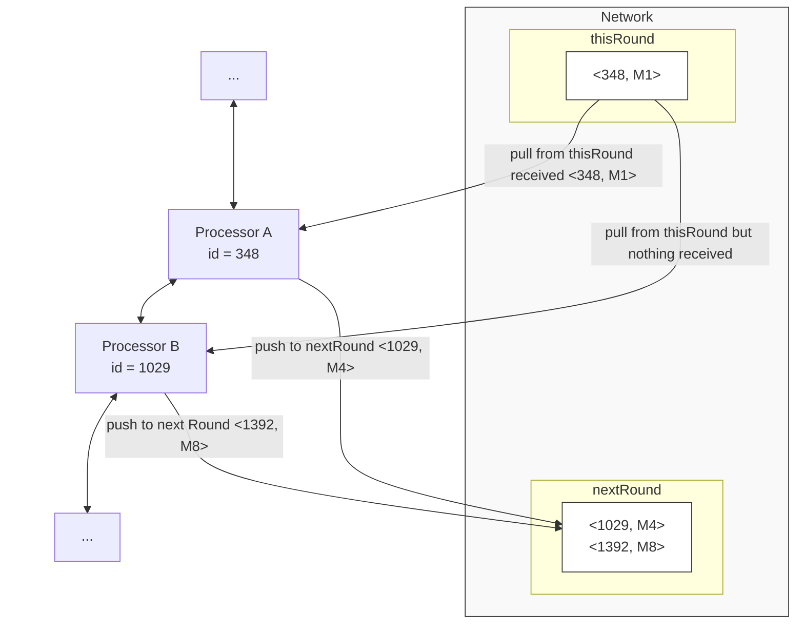

COMP212 Assignment 1 Report: Coordination and Leader Election

# 算法描述 (Algorithm Descriptions)

因为异步LCR算法（无子网）和环中环异步LCR算法是一个循序渐进的过程。后者（环中环异步LCR）算法是**包含异步LCR算法的**，只要我们不考虑子网（或者说将接口数量设置为0）即可。因此，接下来将介绍如何从异步LCR算法推广到带有子网的异步LCR算法！

## [0] 术语描述

整体的网络结构可以分为两种处理器，接口处理器和非接口处理器。我们下面把“环中环”的子环称之为子网。其中接口处理器数量和子网数量相同，每一个子网拥有若干大小的**非接口处理器**，一个接口处理器管理她自身的子网环结构。

此外，我们称一个处理器首次发送消息的轮为**苏醒轮**，或者该处理器在本轮苏醒。

处理器等同于节点，在下文使用处理器代称。

## [1] 苏醒逻辑

在普通的LCR算法中，默认启动轮是`round=0`，但是在异步LCR算法中，启动轮可能不确定！首先，对于异步LCR算法而言，难点在于：未苏醒的`processor`**无法**接收消息，也无法回应消息！

如果使用普通LCR算法（例如每个处理器只有起始轮和收到`id`比自己的`myId`更大的时候才广播），就会导致数据丢失，从而让整个环陷入死循环。

> 我们可以考虑2个处理器的例子，假设处理器$a$ 具有更大的`myId`但是启动较快，$b$具有更小的`myId`但是启动较慢，那么当$a$苏醒并发送自身的`myId`，$b$并未收到，而当$b$苏醒时，发送自身的`myId`给$a$，$a$会忽略，此后陷入类似于死锁的境地：$a$正在等待$b$转发更大的`myId`，而$b$因为**消息丢失**而没有收到更大的`myId`，同时`b`也在等待$a$发送更大的`myId`。因为$a$收到$b$传来的`myId`更小，因此直接忽略了，从而无响应。

为了解决这个问题，我们规定每一个处理器发送消息前必须确认对方已经苏醒，否则不发送。

因此我们只需要为每一个处理器添加若干标志位：

| 变量名称      | 类型      | 说明                      |
| ------------- | --------- | ------------------------- |
| `nextWakenUp` | `boolean` | 下一个`processor`是否苏醒 |
| `prevWakeUp`  | `boolean` | 上一个`processor`是否苏醒 |

当然，我们规定每一个`processor`苏醒的时候，都应该向**next**`processor`和**prev**`processor`发送“我已苏醒”的信号。这样的情况下，如果我们希望发送自己的`myId`给下一个处理器，必须先判断它是否苏醒，如果它没有苏醒，那么我们就不应该向他发送任何数据（以防止丢失），直到我们收到了它苏醒的信号。

对应的消息类型则是：

| 变量名称                         | 说明                                                         |
| -------------------------------- | ------------------------------------------------------------ |
| `TELL_NEXT_ACTIVATION_SIGN_SLOT` | 如果当前处理器希望告诉下一个处理器自己本轮苏醒，使用这个消息类型 |
| `TELL_PREV_ACTIVATION_SIGN_SLOT` | 如果当前处理器希望告诉上一个处理器自己本轮苏醒，使用这个消息类型 |

> 参见`Constant`包中的`Slot.java`

但是在这种情况下仍然存在一些问题，例如，我们考虑 $a$ 和 $b$ 两个处理器，前者苏醒快，后者苏醒慢，当$a$ 苏醒的时候，$b$ 没有苏醒，因此无法收到 $a$ 的苏醒消息。当 $b$ 苏醒的时候，$a$ 因为接受到了 $b$ 的苏醒消息，因此 $a$ 确认$b$ 苏醒了。 但是此时$b$ 并不知道$a$ 苏醒了！因为 $b$ 并不直到自己发送给 $a$ 的消夏是否送达，这回导致信息不对等。

因此，我们还需要添加一个**确认对方苏醒**的消息类型！这样，只要$a$发送"我确认收到你(处理器$b$)的苏醒了"，那么$b$自然可以认为$a$是苏醒的。

| 变量名称                        | 说明                                   |
| ------------------------------- | -------------------------------------- |
| `ACK_NEXT_ACTIVATION_SIGN_SLOT` | 告诉上一个处理器，我收到了你的苏醒信号 |
| `ACK_PREV_ACTIVATION_SIGN_SLOT` | 告诉下一个处理器，我收到了你的苏醒信号 |

> 因为当我们发送给下一个处理器自身苏醒信号的时候，我们使用的是`NEXT`字段，因此对于上一个处理器而言，他要发送的字段则是`ACK_NEXT`！

这样，我们能够保证，对于异步启动的LCR，经过若干轮后，所有的处理器都能将对方设置为已苏醒！这个推论可以由数学归纳法来证明。我们假设处理器 $a$ 存在上一个处理器和下一个处理器（有可能指向同一个处理器，在边界情况，这个网络只有两个处理器），存在以下三种情况

- $a$ 是最先苏醒的
  - 情况1，$a$的下一个处理器苏醒，$a$ 接受到了下一个处理器的苏醒请求，标记下一个处理器为已苏醒，并且回应，然后$a$的上一个处理器苏醒，同理。
  - 情况2，$a$ 的上一个处理器苏醒，步骤同上
  - 因此，当$a$ 先苏醒的情况下，$a$ 必然能够成功将上一个和下一个处理器都设置为已苏醒！
- $a$ 后于上一个处理器苏醒，但是先于下一个处理器苏醒（或者反之）
  - $a$ 先于下一个处理器苏醒，必然的，若干轮后，$a$接收到下一个处理器的苏醒请求，则能够正确设置下一个处理器是苏醒的
  - $a$ 后于上一个处理器苏醒，此时$a$错过了上一个处理器苏醒的消息，但是只要当 $a$ 苏醒的时候给上一个处理器发送自己苏醒的消息，上一个处理器回应$a$`ACK`信号，$a$即可设置上一个处理器是苏醒的
- $a$ 是最后苏醒的
  - 在这种情况，只要$a$苏醒，给上一个和下一个处理器发送自己苏醒的请求后，上一个和下一个处理器只要返回`ACK`信号，$a$即可知道他们都苏醒了

因此，不论什么情况，$a$最后总能成功识别到 上一个和下一个处理器的苏醒状态，并且最小化网络传输！

根据归纳法，我们可以推广到整个环形网络，因此这个算法是正确的。

## [2] 传递信息

在本算法中，除了苏醒是双向传递的之外，其他信息的传递都是单向的，这么做的目的是为了简化代码，`Processor`类中只有一个输入缓存，也就是`Message[] receivedSlots`，如果要设计为双向通信，那么`Message`类就要设计得更多以避免消息覆盖，逻辑判断更多，导致代码耦合更严重。因此此处直接使用单向逻辑，我们就可以保证收到的`leaderId`一定是单向传输的结果。

对于每一个处理器，其苏醒之后会向双方发送苏醒通知。但是每一个处理器只会往**下一个**处理器传递`leaderId`，而不会向上一个处理器发送`leaderId`，原因如上。但是，这样仍然能保证算法正常运行，因为同步LCR已经验证是正确的算法，异步LCR只是添加了异步等待，每一个处理器保证下一个处理器苏醒的情况下才发送消息，避免了消息丢失。

## [3] 子网

如果要让异步LCR算法升级为包含子网的算法，在保证异步LCR算法正确性的前提下，对子网采用异步LCR（保证正确性），在子网没有选举出`leader`之前，接口处理器保持**未苏醒**状态即可，在这种情况下只需要把接口处理器的`startRound`设置为无穷大，一旦子网选举完成，`startRound`则设置为当前轮以激活选举，并且将自身`myId`设置为子网的最大选举`id`以代表子网进行`myId`的转发。

额外的逻辑修改是，当一个接口处理器接收到`myId`的时候，他会判断该`id`是否是子网选举出的最大`myId`，如果是，那么接口处理器则是新的`leader`处理器，他**代表了**自己子网中一个`id`为`myId`的处理器当选为全网的`leader`处理器。

## [4] 终止

当选举完毕后，`leader`处理器应当发送一个`Termination`信号，这是一个**消息类型**

| 变量名称           | 说明     |
| ------------------ | -------- |
| `TERMINATION_SLOT` | 终止信号 |

只有`leader`处理器最初发送该信号（然后自身终止），随后其他所有处理器一旦收到`termination`信号，则立刻终止并转发该信号。我们最终能保证

1. 每一个处理器只要收到当前终止信号，必然能保证当前处理器的`leaderId`是实际意义上真正的`leaderId`，这也可以使用数学归纳法来证明
2. 若干轮后，整个网络中的处理器必会终止

对于第二点，因为终止信号是`leader`处理器发出的，那就意味着他的`myId`（或者其子网选举出来后的`id`）已经遍历完整个网络主环了，此时不可能存在未苏醒的处理器，因此`<TERMINATION>`信号也不需要判断对方是否终止

因此，同样的对于第一点而言，既然领导者的`myId`（最大`id`）已经完成一个循环了，根据自身逻辑只会保留最大`id`，这救恩能够说明第一点正确性（这和普通LCR算法证明一致）

## [5] 汇总

基于如上证明和推到，我们最终得到这样一个算法，参见`processor.run()`方法，对于每一轮，每一个处理器的逻辑如下：

- 如果处理器是非接口处理器
  - 如果没有到达苏醒轮，直接返回（不做任何处理）
  - 否则，**作为首轮转发**
- 如果当前处理器是接口处理器
  - 如果子网还没有结束选举，模拟子网的一轮选举
  - 检查子网是否存在下一轮
    - 如果不存在下一轮，说明子网选举结束，将自己的`myId`设置为子网选举出的`id`并代表子网参与主环选举，并且设置`startRound`为当前网络轮
    - 如果存在下一轮，那么将`startRound`设置为下一轮（或者无穷大）
  - 如果`startRound`是当前网络轮，那么**作为首轮转发**
  - 否则，直接返回
- 首轮转发逻辑：
  - 应当告知上一个处理器和下一个处理器，自己苏醒了，因此消息写入发送缓存（发送缓存分为下一个处理器的发送缓存和上一个处理器的发送缓存，此处不做区分，具体区分在代码中）
  - 应当告知下一个处理器自己的`myId`，因此写入发送缓存
- 接收缓存中
  - 如果存在终止信号，直接转发给下一个处理器该终止信号，并将当前处理器设置为终止
  - 如果接收到新的`id`，这个逻辑和LCR一致
    - 如果`id`是自己（或者当前子网选举出的`id`），那么当前处理器是 `leader` 处理器，发送给下一个处理器终止信号并且结束自身
    - 如果当前`id`比自己记录的`leaderId`更小，那么忽略
    - 如果当前`id`比自己记录的`leaderId`更大，那么应当转发这个`id`给下一个处理器，写入发送缓存
  - 如果收到了上一个或者下一个处理器的苏醒消息，应当回应对应的`ACK`消息
- 分别发送两个**发送缓存**给下一个和上一个处理器

# 代码架构

## [1] Simulator 类

模拟器在代码中是`NetworkAndSimulator`包下的`Simulator.java`类，每一个 `Simulator.java`对象（下称`simulator`）维护如下变量

| 变量名称       | 类型              | 说明               |
| -------------- | ----------------- | ------------------ |
| `rings`        | `List<Processor>` | 一个双向环         |
| `hasNextRound` | `boolean`         | 是否还能运行下一轮 |

模拟器持有**完整的环**，这个环可以是主环，也可以子网，但是`simulator`只会遍历自身变量 `List<>` 中的每一个 `processor` 对象，调用其`run()`方法，而真正的逻辑控制由`processor` 本身控制，`processor`本身对整个环的信息是不可见的，**因此模拟器仅仅用于模拟在一轮中每一个`processor`都进行了某些操作，它并不参与实际的`processor`通信逻辑控制！**

对于非接口处理器，我们只需要将其视为 异步LCR 中的普通处理器即可，但是对于接口处理器，我们做如下更改，参见`processor.setAsInterfaceProcessor()`方法：

1. `startRound`初始化为最大值，只道子网选举完成才设置为当前网络轮
2. 无`leaderId`（实现中设置为最小值，但是不影响）
3. 当前类型设置为接口处理器

此外，Simulator 类还提供了 `.generateMainRing()`方法，用于构造环。该方法接受如下主要参数

| 变量名称                   | 类型            | 说明                                                       |
| -------------------------- | --------------- | ---------------------------------------------------------- |
| `mainRingSize`             | `int`           | 主环大小                                                   |
| `startBound`               | `int`           | 每一个处理器的启动时间被随机为$[0,\text{startBound}]$      |
| `interfaceProcessorNumber` | `int`           | 接口处理器的数量（主环中选择该数量的处理器作为接口处理器） |
| `subnetSize`               | `List<Integer>` | 对应了每一个接口处理器的子网的大小                         |
| `shuffledId`               | `int[]`         | 唯一的随机`id`的乱序数组                                   |

对于随机分配`id`的算法则是采用了`Tool`包下的`Shuffle.java`中的方法，指定生成长度`size`随后对数组顺序填充`0`到`size-1`的数字，使用`Random`类对象遍历每一个下标，与任意一个下标进行对换。时间复杂度 $O(n)$。  这个 `id` 数组共享于全部的处理器，所有处理器都可获得唯一的 `id`，对于接口处理器而言，会再次生成一个 `Simulator.java` 类作为子网属性！其中只需要规定主环大小即可。

## [2] Processor 类

`Processor.java`类对象核心方法是`.run()`方法，它实现了带子网的异步LCR！其中，`processor`含有如下的**核心**成员变量

| 变量名称          | 类型              | 说明                                                         |
| ----------------- | ----------------- | ------------------------------------------------------------ |
| `myId`            | `int`             | 非接口处理器获得的**唯一** `id`，接口处理器也会获得一个唯一id（但是不进行传播，最终会变为子网选举出的最大`id`以代表子网进行传播） |
| `startRound`      | `int`             | 苏醒轮，非接口处理器苏醒轮由`Simulator.java`传参决定，接口处理器苏醒轮除此之外还**取决于子网何时能完成选举！** |
| `leaderId`        | `int`             | 当前处理器记录的领导者`id`                                   |
| `status`          | `ProcessorStatus` | 处理器状态，有`UNKNOWN`、`LEADER`和`LOST`三种状态，分别代表当前处理器未知，领导以及落选！ |
| `subnetSimulator` | `Simulator`       | 针对接口处理器，子网模拟，该模拟器维护了一个子网，同样，接口处理器只能通过 `subnetSimulator`调用其`nextRound`方法以完成一轮模拟，无法获取每一个子网处理器的具体信息（封装）！ |

`Processor` 类对象最多可达下一个或者上一个`Processor`并通过 `.getMyId()` 获取下一个/上一个 处理器的 `ID`，实现了真实的模拟。

## [3] Network 类

`Network` 用于降低代码复杂度，统一管理整个网络，但是，值得注意的是，我们规定 `Processor` 类对象之能发送或者接受 上/下 一个处理器的请求，而无法跨处理器发送（实际上在实现中也无法做到！）主要原理是用过`HashMap`实现的，键是某个处理器的`id`，值则是某个（可能是上一个处理器或者下一个处理器）发送给该处理器的信息。 `Network` 通过构建两个变量`thisRound`和`nextRound`来时间异步错位，这样做的目的是本轮处理器发送的信息可以模拟为正在网络中传输，还未到达下一个处理器，这样下一个处理器从网络拉取信息的时候就不会拉取到最新的信息而是本轮的信息！

例如，`Processor A` 先拉取网络中的信息，发现自己更新了`leaderId`，因此发送给下一个 `Processor B` 一个 `M1` 的信息，那么本轮`Processor B` 从网络中拉取的时候，什么都找不到，除非到下一轮。此外，当`Processor A` 拉取网络中的信息`<348,M1>`之后，网络会删除这个信息。当`Network`运行`nextRound()`方法的时候，会清空`thisRound`并将`nextRound`所有信息放入当前哈希表中，并且清空`nextRound`，这样不仅模拟了异步，也保证了网络无法缓存任何消息！

如果希望多次模拟不干扰，请使用`Network.reset()`方法重置网络！

# 实验设置 (Experimental Setup)
可供研究的参数很多，例如主环大小、每个处理器的启动时间、接口处理器的数量、每个子网的大小等等。在此处，我们不讨论`ID`分布，该分布使用随机分布，接下来我们从网络结构（例如有无子网）和网络规模（处理器数量）进行研究。

## [1] 仅增加处理器数量

网络规模：从处理器为$1$开始模拟到 $1000$，但是请注意，由于计算机算力问题，在代码实现中（`Experiment.java`类）采用了`MULTIPLIER=1`，如下假设使用 `MULTIPLIER = 10` 也即规模变为10倍（1开始到10000）！

### [1.1] Task A: 无子网结构

我们探讨无子网（也就是无接口）状态下，主环处理器数作为变量对算法复杂度的影响。

这相当于是，延迟启动LCR（无子网）在固定的随机启动时间内对算法复杂度的影响，参数如下：

| 参数                       | 值          |
| -------------------------- | ----------- |
| `mainRingSize`             | $[1,10000]$ |
| `startBound`               | 200         |
| `interfaceProcessorNumber` | 0           |

### [1.2] Task B: 有子网结构

我们探讨有子网的情况下，固定子网数量百分比（也就是固定接口数量百分比）状态下，主环处理器数作为变量对算法复杂度的影响。

假设子网（或者接口）数量是主环数量的 $10\%$，并且规定每个子网大小均为 $[3,20]$ 中的一个值。

| 参数                       | 值                 |
| -------------------------- | ------------------ |
| `mainRingSize`             | $[1,10000]$        |
| `startBound`               | 200                |
| `interfaceProcessorNumber` | `0.1*mainRingSize` |
| `List<Integer> subnetSize` | $[3,20]$           |

## [2] 固定总处理器数

在总处理器固定（接口处理器和非接口处理器，包括子网）的情况下，我们仍然可以调整一些参数进行研究

### [2.1] Task C: 增加子网处理器数量

固定接口处理器数量，但是增加子网处理器数量

固定总处理器大小为$10000$，包括：接口处理器+非接口处理器。假设接口处理器为 1000 个，并假设每个子网至少拥有3个处理器，那么子网处理器数量和为 $[3000,9000]$，这样非接口处理器数量则呈现反比的$6000$到$0$！

此处变量为子网处理器数量，假设为 $x$，那么主环大小应当为 $10000-x$

| 参数                       | 值        |
| -------------------------- | --------- |
| `mainRingSize`             | $10000-x$ |
| `startBound`               | 200       |
| `interfaceProcessorNumber` | 1000      |
| `List<Integer> subnetSize` | 总计$x$   |

为了实现`List<Integer> subnetSize`的平均分配，使用`Shuffle`类中的`generateRandomAssigned`方法。

### [2.2] Task D: 增加接口处理器数量

固定子网处理器数量，但是增加接口数量

固定总处理器大小为10000，包括：接口处理器+非接口处理器。假设子网处理器数量为6000个，接口处理器数量则为 $[1,2000]$ 个（因为每个处理器至少有3个子网），设接口处理器数量为 $x$，那么主环大小为 $10000-6000-x = 4000-x$

| 参数                       | 值           |
| -------------------------- | ------------ |
| `mainRingSize`             | $4000-x$     |
| `startBound`               | 200          |
| `interfaceProcessorNumber` | $x$          |
| `List<Integer> subnetSize` | 总计固定6000 |

# 实验评估与结果发现 

## [1] 实验正确性证明

在 `Simulator` 类中存在方法 `validation()`，如果不符合“所有处理器都落选，除了leader处理器，且所有处理器的`leaderId`都为那个最大的`leaderId`”，那么就会抛出运行时异常阻止程序运行，该函数在一下两个地方被调用以确保该算法的正确性

1. 每次接口处理器的内网完成选举后，会调用该函数校验正确性
2. 在`Experiment.java`中每次迭代一轮后，网络重置前都会验证以保证该数据$(x,y_1,y_2)$的正确性。

## [2] 性能评估

本次实验评估了算法在不同网络配置下的正确性和性能，并使用`numpy`对数据做简单的回归分析。在每次执行中，模拟器均记录了直到算法终止所需的轮数（Rounds）和传输的消息总数（Transmission）。为了明确算法的时间和通信渐进复杂度，我们将实验数据绘制成图，并与 $n$、$n \log n$ 或 $n^2$ 等标准复杂度函数进行了拟合对比。

### [2.1] 任务A分析 (Task A: 无子网结构)

在此任务中，我们模拟了无子网（即无接口处理器）状态下，主环（Main Ring）大小从 1 增加至 1000 时，延迟启动LCR算法的复杂度表现。
* **轮数 (Rounds)**：根据图表拟合结果（红线），轮数 $y$ 与主环大小 $x$ 的关系拟合为 $y = -1.36 \times 10^{-5}x^2 + 2.0158x + 182.77$。由于二次项系数极小，轮数实际上呈现高度的 **$O(n)$ 线性增长**。这符合 LCR 算法在环形网络中消息传递的物理限制，即消息绕环一周所需的轮数与环的大小成正比。
* **消息传输量 (Transmission)**：消息总数的拟合曲线（蓝线）为 $y = 0.0011x^2 + 7.8367x - 134.58$。这表明在随机分配 ID 和具有异步启动时间（[0, 200]）的设定下，消息通信复杂度符合 **$O(n^2)$ 二次增长**。这与标准 LCR 算法在最坏或平均情况下的通信复杂度理论值相吻合。由于二次项系数较小，甚至接近于$O(n)$的时间复杂度。

### [2.2] 任务B分析 (Task B: 有子网结构)

本任务引入了环中环网络结构。在接口处理器固定为主环大小 10% 且子网大小在 [3, 20] 随机分布的情况下，我们观察主环处理器数量增长对性能的影响。
* **复杂度趋势**：加入子网后，轮数和消息传输量均呈现出与任务 A 相似的增长趋势，轮数依然近似 $O(n)$，消息传输量符合 $O(n^2)$（$y = 0.0015x^2 + 13.4552x - 167.58$）。
* **性能损耗**：由于网络中新增了大量非接口处理器（即子网中的处理器），且子网与主环均在执行终止型 LCR 算法，整体的消息基数和轮数基数相比任务 A 有显著上升。但是由于二次项系数较小，Transmission 仍然接近于$O(n)$的时间复杂度。

### [2.3] 任务C分析 (Task C: 固定总数，增加子网处理器)

在总处理器数量（10000）和接口处理器数量（1000）固定的前提下，我们通过增加子网处理器数量（图表 x 轴范围 300-900）来观察性能变化。
* **性能优化**：随着子网处理器数量的增加，主环的规模相应缩小。图表显示，**轮数和消息传输量均呈现明显的下降趋势**。
* **原因剖析**：由于各个环形子网之间是隐式连接的，它们可以并行执行领导者选举算法。主环规模的缩小极大减轻了主环上 $O(n^2)$ 消息复杂度的惩罚。因此，将更多的计算节点下放到并行的子网中，能有效降低整个系统的通信和时间开销。

### [2.4] 任务D分析 (Task D: 固定总数，增加接口处理器)

在总处理器数量（10000）和子网处理器总数（6000）固定的前提下，我们通过增加接口处理器数量（图表 x 轴范围 0-200）来观察性能表现。
* **轮数 $O(\log n)$ 下降**：随着接口数量增加，平均每个子网的规模变小，主环规模也变小。轮数呈现出优异的对数级 $O(\log n)$ 下降（拟合曲线：$y = -181.4369 \ln(x) + 1597.66$）。
* **消息量 $O(n^2)$ 下降**：消息传输量也随着接口数量的增加呈现二次函数 $O(n^2)$ 级别的锐减。
* **结构优势**：增加接口处理器意味着将庞大的子网进一步切分为更多、更小型的并行子环。这不仅加速了子网内部的选举速度，也促使主环能更快地通过共享变量获取选举结果，展现了“环中环”拓扑在极度细分下的卓越性能。

## [3] 性能总结

综合以上四个任务的实验数据，我们可以得出以下关于该算法时间（轮数）和通信（消息数）复杂度的结论：
1. **基础复杂度**：在没有任何拓扑优化的单环结构中，异步启动且终止的 LCR 算法表现出 $O(n)$ 的时间复杂度和 $O(n^2)$ 的通信复杂度。
2. **网络结构的影响**：系统的整体性能高度依赖于网络的结构设置。将巨大的单环拆分为“主环+多子网”的环中环结构，并尽可能增加并行的接口节点数量、缩小单一环的规模，可以极大地优化系统的平均及最坏性能表现。

# 结论 (Conclusion)

本次作业成功开发并模拟了在 Java 环境下的分布式环中环领导者选举算法。通过多次不同配置的模拟实验，我们验证了算法的正确性：无论网络结构如何变化、初始 ID 如何随机分布，算法最终都能成功选举出所有非接口节点初始 ID 中的最大值。

同时，通过对实验数据的可视化和曲线拟合，我们深刻认识到分布式系统的拓扑结构对算法性能的决定性作用。合理地增加接口处理器数量并优化子网规模，能够有效地将串行通信转化为并行计算，从而大幅降低算法的时间延迟和消息冗余。本实验不仅巩固了对传统及分布式系统进行关键评估的知识，也为未来分布式协议的开发提供了有价值的参考。

