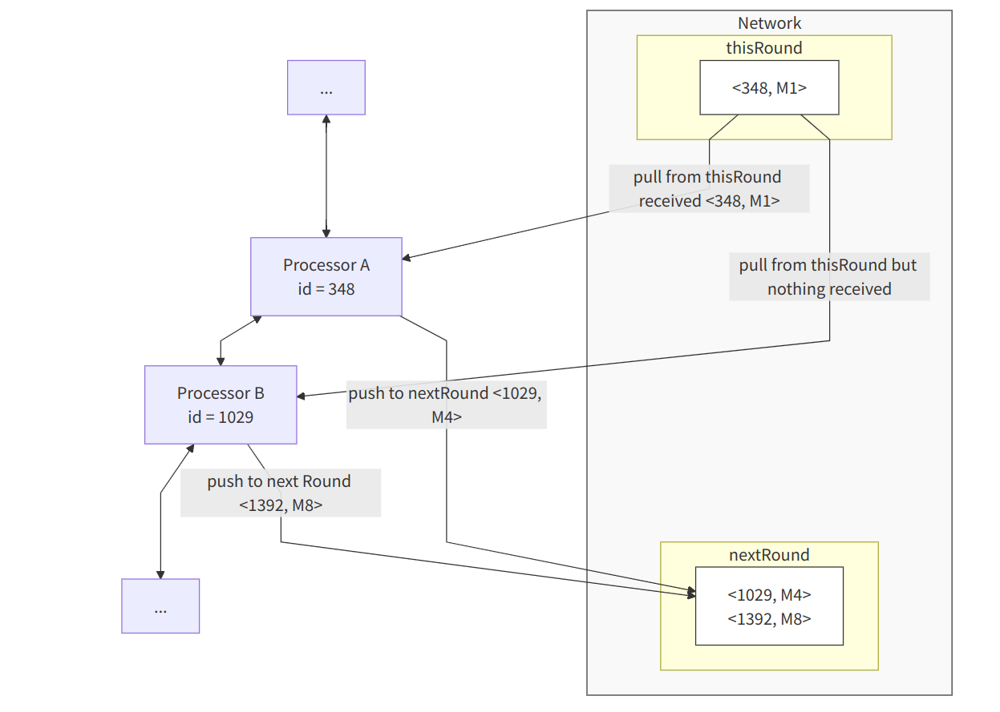
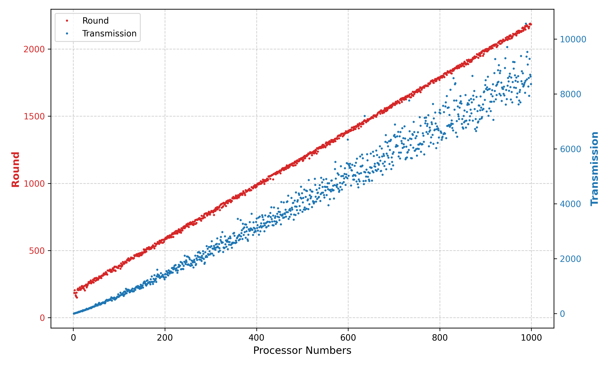
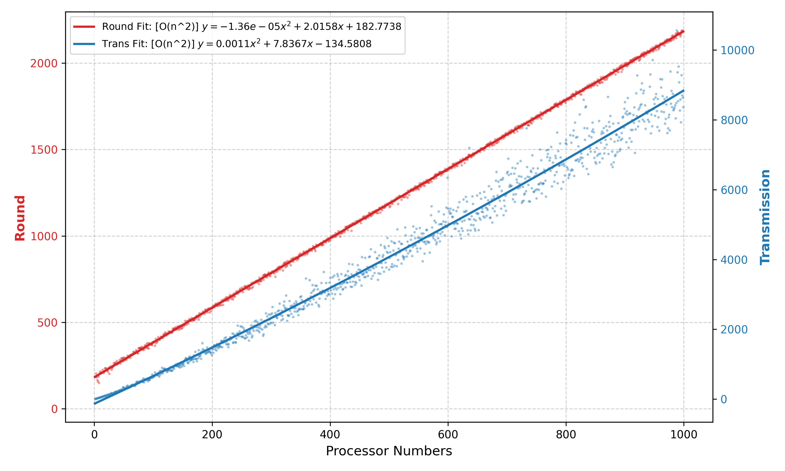
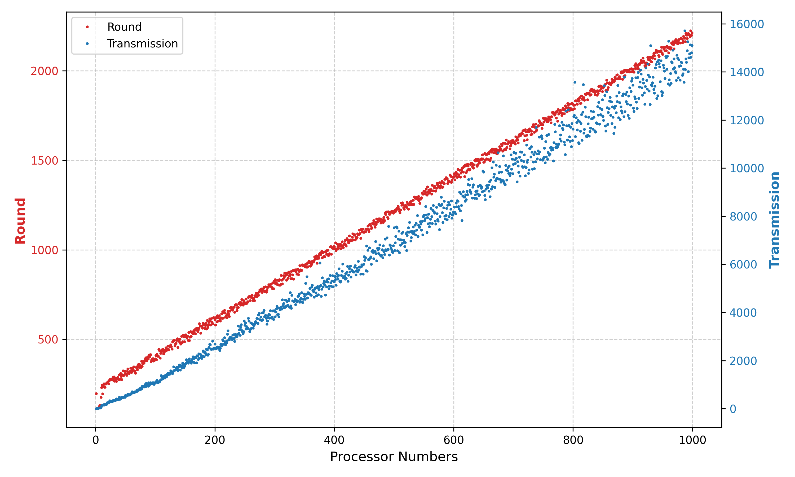
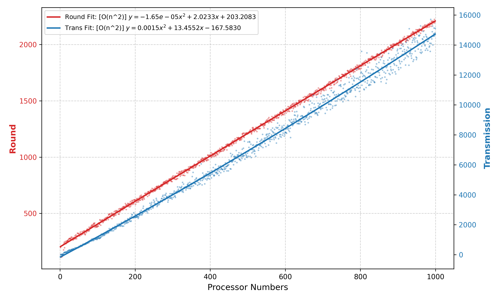
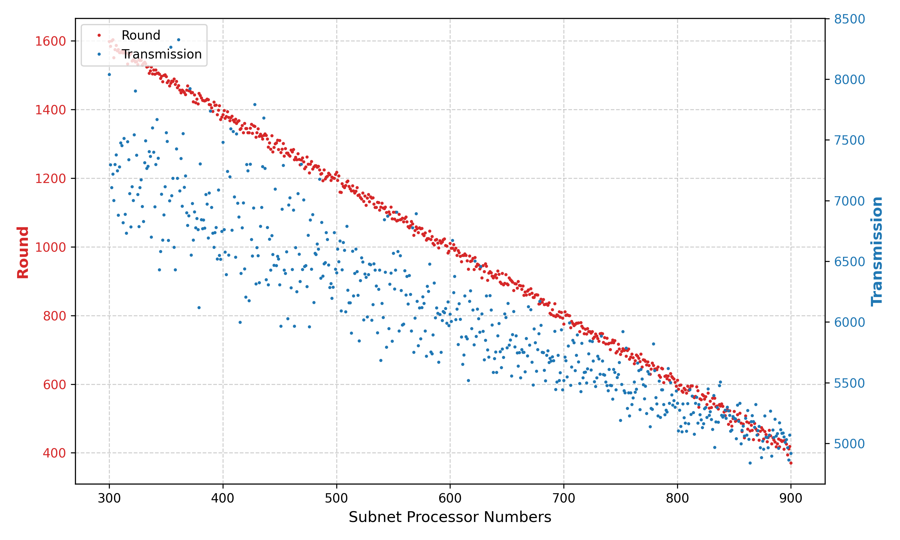
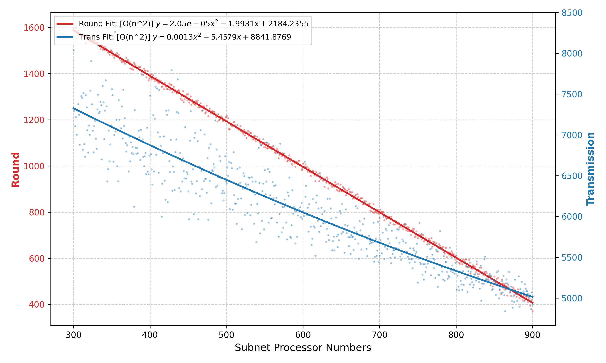
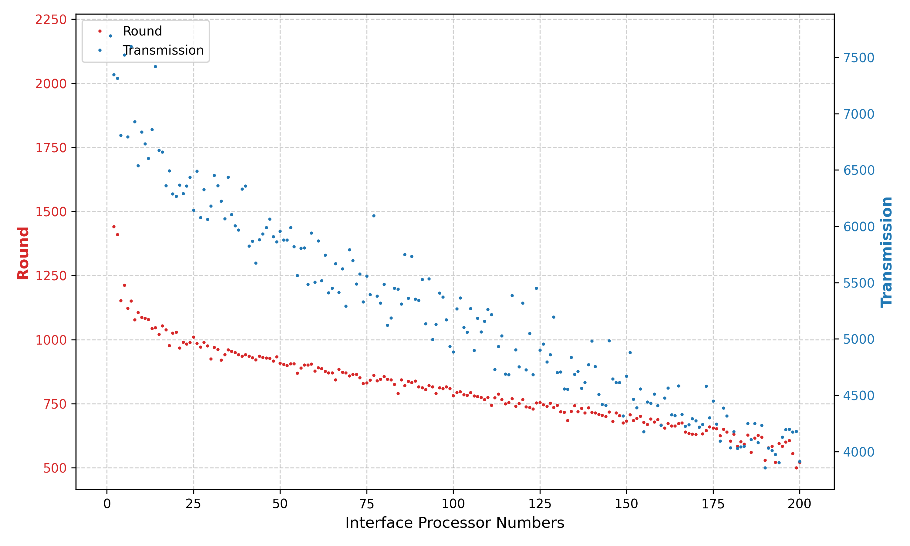
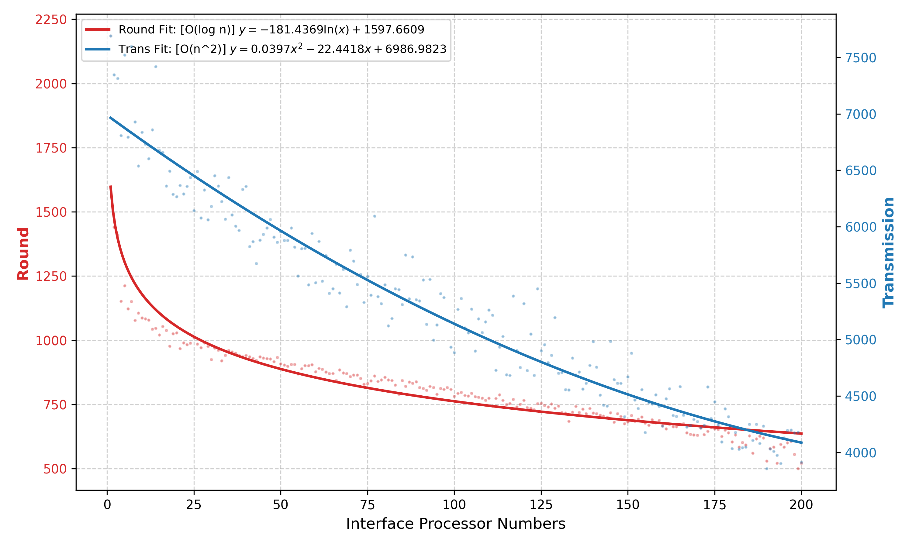

COMP212 Assignment 1 Report: Coordination and Leader Election

# Algorithm Descriptions

The asynchronous LCR algorithm (without subnets) and the ring-of-rings asynchronous LCR algorithm represent a progressive development process. The latter (ring-of-rings) **includes the basic asynchronous LCR algorithm**; we simply need to treat the case where there are no subnets (or set the number of interfaces to zero). Therefore, the following sections describe how the asynchronous LCR algorithm is generalized to an asynchronous LCR algorithm with subnets.

## [0] Terminology

The overall network structure consists of two types of processors: **interface processors** and **non-interface processors**. We refer to the inner rings within the "ring-of-rings" as **subnets**. The number of interface processors equals the number of subnets. Each subnet contains several **non-interface processors**, and one interface processor manages its own subnet ring structure.

Additionally, the round in which a processor first sends a message is called the **awakening round**, or we say the processor **wakes up** in this round.

"Processor" is synonymous with "node"; "processor" is used throughout this text.

## [1] Awakening Logic

In a standard LCR algorithm, the default starting round is `round=0`. However, in an asynchronous LCR algorithm, the starting round may be uncertain. The primary difficulty for the asynchronous LCR algorithm is that an unawakened `processor` **cannot** receive or respond to messages.

If a standard LCR algorithm is used (e.g., each processor only broadcasts at the starting round or when it receives an `id` larger than its own `myId`), data loss occurs, causing the entire ring to enter an infinite loop.

> Consider an example with two processors: assume processor  has a larger `myId` but starts early, while  has a smaller `myId` but starts late. When  wakes up and sends its `myId`,  does not receive it. When  wakes up and sends its `myId` to ,  ignores it because it is smaller. Subsequently, they enter a deadlock-like state:  waits for  to forward a larger `myId`, while  never receives a larger `myId` due to **message loss**, and  is also waiting for  to send a larger `myId`. Since  receives a smaller `myId` from , it ignores it and remains unresponsive.

To solve this, we stipulate that every processor must confirm the other party has awakened before sending messages; otherwise, it will not send.

We add several flags to each processor:

| Variable Name | Type | Description |
| --- | --- | --- |
| `nextWakenUp` | `boolean` | Whether the next `processor` has awakened |
| `prevWakeUp` | `boolean` | Whether the prev `processor` has awakened |

When a `processor` wakes up, it must send an "I have awakened" signal to both its **next** and **prev** processors. If a processor wishes to send its `myId` to the next processor, it must first check if the neighbor has awakened. If not, no data is sent (to prevent loss) until the awakening signal is received.

The corresponding message types are:

| Variable Name | Description |
| --- | --- |
| `TELL_NEXT_ACTIVATION_SIGN_SLOT` | Used when the current processor tells the next processor it has awakened |
| `TELL_PREV_ACTIVATION_SIGN_SLOT` | Used when the current processor tells the previous processor it has awakened |

> See `Slot.java` in the `Constant` package.

However, issues remain. For example, if  wakes up earlier than ,  cannot receive 's awakening message because  is not yet active. When  eventually wakes up,  receives 's signal and marks  as awakened. But  does not know  is active because  doesn't know if its message reached , leading to information asymmetry.

Therefore, we add a **Confirm Awakening** message type. Once  sends "I confirm I received your (processor ) awakening signal,"  can safely assume  is awake.

| Variable Name | Description |
| --- | --- |
| `ACK_NEXT_ACTIVATION_SIGN_SLOT` | Tells the previous processor: I received your awakening sign |
| `ACK_PREV_ACTIVATION_SIGN_SLOT` | Tells the next processor: I received your awakening sign |

> Note: When we send an awakening signal to the next processor, we use the `NEXT` field; therefore, the previous processor must respond using the `ACK_NEXT` field.

This ensures that in an asynchronously started LCR, after several rounds, all processors will correctly mark their neighbors as awakened. This can be proved by mathematical induction. Assume processor  has a previous and a next processor (which may be the same in a two-node boundary case). Three scenarios exist:

* ** is the first to wake up**:
* Case 1: 's next processor wakes up.  receives the request, marks the next as awakened, and responds. Then 's previous processor wakes up, following the same logic.
* Case 2: 's previous processor wakes up first. The steps are the same.
* Result: If  wakes up first, it eventually sets both neighbors to awakened successfully.

* ** wakes up after the previous but before the next (or vice-versa)**:
*  wakes up before the next: Eventually,  receives the next processor's request and sets its status correctly.
*  wakes up after the previous:  missed the previous processor's initial signal, but once  wakes up and sends its own signal, the previous processor responds with an `ACK`, allowing  to mark it as awakened.

* ** is the last to wake up**:
* Once  wakes up and sends requests to both neighbors, they return `ACK` signals, informing  that they are both awake.

Thus, regardless of the timing,  eventually identifies the awakening status of its neighbors while minimizing network transmissions. By induction, this applies to the entire ring, proving the algorithm's correctness.

## [2] Information Transmission

In this algorithm, while awakening signals are transmitted bidirectionally, all other information is unidirectional. This design choice simplifies the code. The `Processor` class has only one input buffer, `Message[] receivedSlots`. Bidirectional communication would require more complex `Message` design to avoid overwriting and increase logic coupling. By using unidirectional logic, we ensure that the received `leaderId` is the result of a single-direction traversal.

Every processor sends awakening notifications to both sides upon waking up. However, a processor only passes the `leaderId` to the **next** processor. Since synchronous LCR is already proven correct, the asynchronous version simply adds asynchronous waiting: each processor ensures the next is awake before sending, preventing message loss.

## [3] Subnets

To upgrade the asynchronous LCR to include subnets, we apply the asynchronous LCR within the subnet to ensure correctness. Before the subnet elects a leader, the interface processor remains in an **unawakened** state (by setting `startRound` to infinity). Once the subnet election is complete, the `startRound` is set to the current round to activate the main ring election, and its `myId` is set to the maximum `id` elected by the subnet to represent the subnet in the main ring.

Additional logic: When an interface processor receives a `myId`, it checks if it matches the subnet's maximum `id`. If it does, the interface processor becomes the `leader`, representing the node from its subnet that won the global election.

## [4] Termination

When the election concludes, the `leader` sends a `Termination` signal, which is a specific message type.

| Variable Name | Description |
| --- | --- |
| `TERMINATION_SLOT` | Termination signal |

Only the `leader` initially sends this signal (then terminates itself). Subsequently, all other processors terminate and forward the signal immediately upon receipt. We can guarantee:

1. Once a processor receives the termination signal, its current `leaderId` is guaranteed to be the actual global `leaderId` (provable by induction).
2. After a finite number of rounds, all processors in the network will terminate.

For the second point: since the signal is issued by the `leader`, it means its `myId` has already traversed the entire main ring. At this stage, no unawakened processors can exist, so the `<TERMINATION>` signal does not need to check if the next node has terminated.

For the first point: since the leader's `myId` (the maximum `id`) has completed a full cycle and the logic only retains the maximum `id`, the correctness is consistent with the standard LCR proof.

## [5] Summary

Based on the proof above, we arrive at the following algorithm implemented in `processor.run()`. For each round, the logic for each processor is:

* **If the processor is a non-interface processor**:
* If the awakening round hasn't been reached, return (do nothing).
* Otherwise, perform **first-round forwarding**.

* **If the processor is an interface processor**:
* If the subnet election is not finished, simulate one round of the subnet election.
* Check if the subnet has a next round:
* If not, the subnet election is finished. Set `myId` to the subnet's winner `id`, represent the subnet in the main ring, and set `startRound` to the current network round.
* If it does, set `startRound` to the next round (or infinity).

* If `startRound` is the current network round, perform **first-round forwarding**.
* Otherwise, return.

* **First-round forwarding logic**:
* Notify the previous and next processors of awakening (write to send buffers).
* Send `myId` to the next processor.

* **In the receive buffer**:
* If a termination signal exists, forward it to the next processor and terminate.
* If a new `id` is received (LCR logic):
* If `id` matches itself (or the subnet winner), the processor is the `leader`. Send termination signal to the next node and terminate.
* If `id` < current `leaderId`, ignore.
* If `id` > current `leaderId`, update `leaderId` and forward to the next processor.

* If an awakening message is received from neighbors, respond with the corresponding `ACK`.

* **Send the two buffers** to the next and previous processors respectively.

# Code Architecture

## [1] Simulator Class

The simulator is the `Simulator.java` class in the `NetworkAndSimulator` package. Each `Simulator` object maintains:

| Variable Name | Type | Description |
| --- | --- | --- |
| `rings` | `List<Processor>` | A bidirectional ring |
| `hasNextRound` | `boolean` | Whether the simulation can run another round |

The simulator holds the **entire ring** (main ring or subnet). It iterates through the `List<>` of `processor` objects, calling their `run()` methods. The actual logic is controlled by the `processor` itself; the `processor` has no visibility into the entire ring. **Thus, the simulator only simulates that each processor performs operations in a round; it does not participate in actual communication logic!**

For non-interface processors, they are treated as standard processors in an asynchronous LCR. For interface processors, we modify them via `processor.setAsInterfaceProcessor()`:

1. `startRound` initialized to maximum, only set to current round after subnet completion.
2. No initial `leaderId` (set to minimum).
3. Type set to interface processor.

The `Simulator` class provides `.generateMainRing()` to construct the ring with parameters:

| Variable Name | Type | Description |
| --- | --- | --- |
| `mainRingSize` | `int` | Size of the main ring |
| `startBound` | `int` | Start time randomized within  |
| `interfaceProcessorNumber` | `int` | Number of interface processors in the main ring |
| `subnetSize` | `List<Integer>` | Size of the subnet for each interface processor |
| `shuffledId` | `int[]` | A shuffled array of unique random IDs |

The ID distribution uses `Shuffle.java` from the `Tool` package. It fills an array from  to  and performs an  shuffle. This ID array is shared among all processors to ensure uniqueness. Interface processors generate an additional `Simulator.java` instance as a subnet attribute.

## [2] Processor Class

The core method of `Processor.java` is `.run()`, implementing the asynchronous LCR with subnets. Key member variables:

| Variable Name | Type | Description |
| --- | --- | --- |
| `myId` | `int` | Unique ID for non-interface processors; interface processors use this for the subnet winner ID later. |
| `startRound` | `int` | Awakening round. For interface processors, this depends on when the subnet finishes its election. |
| `leaderId` | `int` | The ID of the leader recorded by the current processor. |
| `status` | `ProcessorStatus` | Status: `UNKNOWN`, `LEADER`, or `LOST`. |
| `subnetSimulator` | `Simulator` | Subnet simulation for interface processors. Used to call `nextRound` without accessing subnet internal data. |

A `Processor` can only access the next/previous `Processor` via `.getMyId()`, simulating a realistic distributed environment.

## [3] Network Class

`Network` manages the network to reduce code complexity. Processors can only send/receive requests to/from neighbors. This is implemented via a `HashMap` where the key is a processor's `id` and the value is the message sent to it. `Network` uses `thisRound` and `nextRound` variables to simulate asynchronous delays: a message sent this round is not available to the recipient until the next round.

When a processor pulls `<348, M1>`, the network deletes it. When `nextRound()` is called, `thisRound` is cleared, `nextRound` data is moved to `thisRound`, and `nextRound` is cleared. This ensures the network does not cache old messages.

Use `Network.reset()` to clear the network between different simulations.

# Experimental Setup

Parameters studied include main ring size, startup time, number of interface processors, and subnet sizes. We assume a random ID distribution and focus on network structure and scale.

## [1] Increasing Processor Count

Network size: Simulated from $1 to $1000 processors. However, note that due to computing power limitations, the code implementation (`Experiment.java` class) uses `MULTIPLIER=1`. The following assumes that `MULTIPLIER = 10` is used, which means the size becomes 10 times (from 1 to 10000)!

### [1.1] Task A: No Subnet Structure

We explore the impact of the number of main ring processors as a variable on the algorithm complexity in the subnet-less (i.e., interface-less) state.

This is equivalent to the impact of delayed-start LCR (subnet-less) on the algorithm complexity within a fixed random start time, with the following parameters:

| Parameter | Value |
| --- | --- |
| `mainRingSize` | $[1,10000]$ |
| `startBound` | 200 |
| `interfaceProcessorNumber` | 0 |

### [1.2] Task B: With Subnet Structure

We explore the impact of the number of main ring processors as a variable on algorithm complexity when there are subnets and a fixed percentage of subnets (i.e., a fixed percentage of interfaces).

Assume the number of subnets (or interfaces) is $10%$ of the number of main rings, and that the size of each subnet is a value in the range $[3,20]$.

| Parameter | Value |
| --- | --- |
| `mainRingSize` | $[1,10000]$ |
| `startBound` | 200 |
| `interfaceProcessorNumber` | `0.1*mainRingSize` |
| `List<Integer> subnetSize` | $[3,20]$ |

## [2] Fixed Total Processor Count

With total processors (interface + non-interface + subnet) fixed at 10,000.

### [2.1] Task C: Increasing Subnet Processor Count

Fixed 1,000 interface processors; increasing the total number of processors within subnets ().

| Parameter | Value |
| --- | --- |
| `mainRingSize` | $10000-x$ |
| `startBound` | 200 |
| `interfaceProcessorNumber` | 1000 |
| `List<Integer> subnetSize` | sum up to $x$ |

Uses `generateRandomAssigned` from `Shuffle.java` for even distribution.

### [2.2] Task D: Increasing Interface Processor Count

Fixed 6,000 total subnet processors; varying the number of interface processors ().

| Parameter | Description | Value | Meaning |
| --- | --- | --- | --- |
| `mainRingSize` | Main Ring Size | $4000-x$ |  |
| `startBound` | Start Time Bound | 200 | Random start in  |
| `interfaceProcessorNumber` | Number of Interface Processors | $x$ | Variable, range  |
| `List<Integer> subnetSize` | Subnet Sizes | Total 6000 | 6000 processors assigned to subnets |

# Experimental Evaluation & Findings

## [1] Correctness Proof

The `Simulator` class includes a `validation()` method. It throws a runtime exception if any processor (except the leader) is not "lost" or if any processor's `leaderId` is not the global maximum. It is called:

1. After each subnet election.
2. After each iteration in `Experiment.java` before the network is reset.

## [2] Performance Evaluation

We used `numpy` for regression analysis. We recorded Rounds and total Transmissions and compared them against standard complexities like , , and .

### [2.1] Task A Analysis (No Subnet)

* **Rounds**: The fit is . With a negligible quadratic coefficient, rounds show **linear  growth**, matching the physical limit of a message traversing the ring.
* **Transmission**: The fit is , indicating ** growth** for message complexity, which aligns with standard LCR theory for average/worst-case scenarios.

### [2.2] Task B Analysis (With Subnets)

* **Complexity Trend**: Similar to Task A, rounds are  and transmissions follow  ().
* **Performance Overhead**: Adding subnets increases the base number of processors and rounds, as both subnets and the main ring run the LCR algorithm. However, Transmissions remain close to linear due to the small quadratic coefficient.

### [2.3] Task C Analysis (Fixed Total, Increasing Subnet Processors)

* **Optimization**: As subnet processor count increases, the main ring size shrinks. **Both rounds and transmissions decrease significantly**.
* **Reason**: Subnets execute leader elections in parallel. Shrinking the main ring reduces the  message complexity penalty on the primary ring. Offloading nodes to parallel subnets reduces overall system cost.

### [2.4] Task D Analysis (Fixed Total, Increasing Interface Count)

* **Logarithmic Round Decrease**: As the number of interfaces increases, both subnet and main ring sizes decrease. Rounds show an ** logarithmic decrease** ().
* **Quadratic Message Decrease**: Transmissions drop sharply following an  curve.
* **Structural Advantage**: More interface processors partition subnets into smaller, parallel rings, accelerating the overall global election process.

## [3] Performance Summary

1. **Base Complexity**: Single-ring asynchronous LCR exhibits  time and  communication complexity.
2. **Structural Impact**: Performance is highly dependent on topology. Breaking a large ring into a "main ring + multiple subnets" structure—and maximizing interface nodes—greatly optimizes average and worst-case performance.

# Conclusion

This assignment successfully simulated a distributed ring-of-rings leader election algorithm in Java. We verified that the algorithm correctly identifies the maximum ID regardless of network configuration or ID distribution.

The data visualization and curve fitting demonstrate that topology is a deciding factor in performance. Increasing interface processors and optimizing subnet sizes transforms serial communication into parallel computation, drastically reducing latency and message redundancy. This experiment provides valuable insights for developing future distributed protocols.