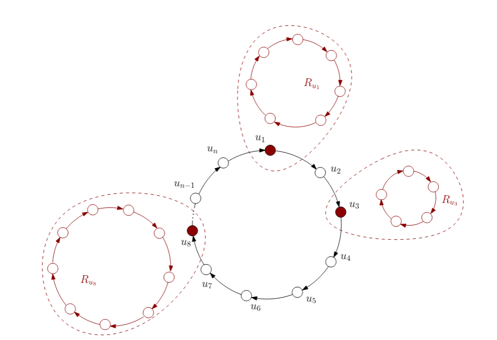

# 计算机科学与信息学院
# COMP212 - 2026 - CA 作业 1
## 协调与领导者选举
### 使用 Java 开发、模拟和评估分布式协议

### 评估信息

| 项目                             | 内容                                                         |
| :------------------------------- | :----------------------------------------------------------- |
| **作业编号**                     | 1 (共 2 个)                                                  |
| **权重**                         | 15%                                                          |
| **作业发布日期**                 | 2026年2月5日                                                 |
| **截止日期**                     | **2026年3月6日，英国时间 17:00**                             |
| **提交方式**                     | 通过 CANVAS 电子提交                                         |
| **评估的学习成果**               | (1) 对分布式系统主要原则的鉴赏：进程、通信、命名、同步、一致性、容错和安全性。 (2) [注：原文未列出2，直接跳到3]  (3) 与一般计算机科学，特别是分布式计算相关的基本事实、概念、原则和理论的知识和理解。 (4) 对标准和机制的扎实知识，通过这些标准和机制可以批判性地评估和分析传统及分布式系统，以确定它们在多大程度上符合当前和未来发展的定义标准。 |
| **评估目的**                     | 本作业旨在评估对分布式系统中协调和领导者选举的理解，以及使用 Java 编程语言开发、模拟和评估分布式协议的能力。 |
| **评分标准**                     | 每个问题的分数已在相应问题下注明。                           |
| **是否必须提交以满足模块要求？** | 否                                                           |
| **评估截止日期的延期**           | 根据利物浦大学（UoL）附加考量政策执行。                      |

---

## 1 总体评分方案

COMP212 的课程作业由两个作业组成，共占最终成绩的 30%。
各个作业的贡献如下：

* **作业 1：** 15%
* **作业 2：** 15%
* **总计：** 30%

## 2 目标

本作业要求你在 Java 中设计并实现一种用于**环中环（ring of rings）**网络的领导者选举分布式算法，然后通过实验验证其正确性并评估其性能。

## 3 课程作业描述

本作业中考虑的网络是一个**环中环**结构，定义如下（阅读定义时请参见图 1）：

1.  有一个由 $n$ 个处理器组成的主环 $G$，$V=\{u_{1},u_{2},...,u_{n}\}$。
2.  存在一个非空的**接口处理器**子集 $V^{\prime}\subseteq V$，使得每个 $v\in V^{\prime}$ 都关联一个独特的环形子网 $R_{v}$。我们将剩余的处理器称为**非接口处理器**；这些包括 $G$ 中的非接口处理器以及环形子网中的处理器。
3.  最初，每个非接口处理器 $u$ 都有一个存储在变量 $myID_{u}$ 中的唯一 ID，而每个接口处理器 $v$ 的 $myID_{v}:=-1$，表示其 ID 将通过其子网确定。
4.  子网不通过通信链路连接到主环，相反，每个 $R_{v}$ 通过共享变量隐式连接到其接口 $v$。特别是，我们假设每当 $R_{v}$ 中的被选处理器 $w$ 设置变量 $leaderID_{w}$ 的值时，则 $myID_{v}:=leaderID_{w}$。也就是说，一旦在 $R_{v}$ 中选出了处理器 $w$，接口 $v$ 就会通过共享变量 $leaderID_{w}$ 知道被选处理器的 ID。由此可见，每个接口处理器最终都可以从其子网获得一个当选的 ID。

在我们的设置中，处理器预先不知道主环或任何子网中的处理器数量，但它们知道网络的一般结构，并且除了接口处理器之外的所有处理器都配备了唯一的 ID。这些 ID 不一定是连续的，为了简单起见，你可以假设它们选自 $\{1,2,...,\alpha N\}$，其中 $\alpha\ge1$ 是一个小常数，N 是非接口处理器的总数（例如，对于 $\alpha=3$，N 个非接口处理器将每次从 $\{1,2,...,3N-1,3N\}$ 中分配唯一的 ID）。

处理器以**同步轮次（synchronous rounds）**执行，就像我们在课堂上讨论的每个例子一样。

---

**图 1 说明：**

一个环中环网络。

* 红色节点代表**接口处理器**，其环形子网包含在虚线区域内。
* 白色节点代表 N 个**非接口处理器**，每个最初都有一个唯一的 ID。
* 环中环中领导者选举算法的目标是最终选出所有非接口节点初始 ID 中的最大 ID。

---

### 3.1 实现异步启动和终止的 LCR 算法 - 占作业分数的 30%

作为第一步，你需要实现 LCR 算法的一个变体，用于环形网络（尚未涉及环中环）中的领导者选举。标准 LCR 的伪代码可以在讲义中找到，为了方便起见，这里也给出了（算法 1）。

> **算法 1：LCR（同步启动且非终止版本）**
> *环形网络*
> *处理器 $u_{i}$ 的代码，$i\in\{1,2,...,n\}$*
>
> **初始化：**
> * $u_{i}$ 知道其自己的唯一 ID，存储在 $myID_{i}$ 中
> * $sendID_{i}:=myID_{i}$
> * status: "unknown"
>
> **过程：**
> 1: **if** round $=1$ **then**
> 2:     send $\langle sendID_{i}\rangle$ 给顺时针邻居
> 3: **else** // round > 1
> 4:     收到来自逆时针邻居的 $(inID)$
> 5:     **if** $inID > myID_{i}$ **then**
> 6:         $sendID_{i}:=inID$
> 7:         send $\langle sendID_{i}\rangle$ 给顺时针邻居
> 8:     **else if** $inID = myID_{i}$ **then**
> 9:         status: "leader"
> 10:    **else if** $inID < myID_{i}$ **then**
> 11:        不做任何事
> 12:    **end if**
> 13: **end if**

你需要实现 LCR 算法的**异步启动（asynchronous-start）**和**终止（terminating）**版本，除了标准 LCR 之外，还需满足：

1.  每个处理器 $u_{i}$ 都有一个关联的启动轮次 $r_{i}\ge1$，处理器在第 $r_{i}$ 轮开始时唤醒并开始执行算法。在 $r_{i}$ 轮之前，处理器 $u_{i}$ 处于睡眠状态，传输给它的任何消息都会丢失。
2.  所有处理器最终都必须**终止**并知道被选出的 ID。

### 3.2 实现环中环的领导者选举算法 - 占作业分数的 40%

接下来，你需要构思并实现一个用于**环中环网络**的领导者选举算法。你的算法应利用你在上一步中开发的 LCR 算法的异步启动和终止变体。它应该最终选出所有初始分配 ID 中的最大 ID，让主环的所有处理器都知道被选出的 ID，并使主环的所有处理器终止。

**提示：** 环形子网将执行**终止版 LCR**，而主环将执行其**异步启动变体**。你也可以假设所有环都是双向的，处理器仍然具有顺时针（和逆时针）方向感。你可以利用这一点来避免一些消息重传，但这并不是必须的。

### 3.3 实验评估与报告 - 占作业分数的 30%

实现环中环的领导者选举算法后，下一步是对其正确性和性能进行实验评估。

**正确性和性能：**
在规模不断增加的网络（直至合理的执行时间，取决于你的设备）和不同的结构（考虑参数：接口节点的数量和位置、子网的大小）中执行你的算法，并为每个给定设置从各种 ID 分配开始。例如，你可以在特定构造的 ID 分配（例如，顺时针或逆时针递增的 ID）和随机 ID 分配上执行你的算法。

* 在每次执行中，你的模拟器应检查最终是否选出了所有初始 ID 中的最大 ID。当然，这不能替代对算法正确性的正式证明，因为你无法在所有可能的输入配置上测试它，但这至少是它可能按预期工作的初步迹象。
* 在每次执行中，你的模拟器还应记录**轮次数**和**传输的消息总数**，直到终止。

收集模拟数据后，按如下方式绘制图表：
对于每个选定的网络结构和 ID 分配类型的组合（例如，固定数量、大小和位置的子网以及随机 ID），x 轴将代表一个增加的规模参数（例如，主环的大小 $n$ 或非接口节点的数量 $N$），y 轴将代表复杂度度量（轮次数或消息数）。你的图表还可以与标准复杂度函数（如 $n$、$n \log n$ 或 $n^{2}$）进行比较，以便尽可能清楚地显示算法的渐近复杂度。

生成**至少 4 个图表**（每个研究不同的参数组合），这将有助于你对算法的时间和通信复杂度得出有意义的结论。你可以使用 gnuplot、JavaPlot 或任何你熟悉的绘图软件。

最后一步是准备一份简明的**报告（最多 5 页，包括图表）**，清晰地描述你的算法、模拟器的主要功能、进行的实验集以及实验评估的发现。特别是在后一部分，你应该尝试就 (i) 算法的正确性和 (ii) 其在时间和消息方面的性能（例如，算法的最差/最好/平均性能作为 $n$ 的函数是什么？）得出结论。

## 4 截止日期和提交说明

* **截止日期：** 本作业的提交截止日期是 **2026年3月6日星期五，英国时间 17:00**。
* **提交内容：**
    (a) 你所有程序的 Java 源代码，
    (b) 一个 README 文件（纯文本），描述如何编译/运行你的代码以重现作业要求的各种结果，以及
    (c) 一份简明、自包含的 PDF 格式报告（包括所有内容最多 5 页），描述你的算法、实验和结论。
* **文件格式：** 将上述所有文件压缩成一个 **ZIP 文件**（电子提交系统不接受其他文件格式），并将文件名指定为 `Surname-Name-ID.zip`（姓-名-学号.zip）。
    **极其重要：** 请务必在压缩包中包含上述描述的所有文件，而不仅仅是源代码！
* **提交路径：** 通过 CANVAS 上 COMP212-202526 课程的 "Assignments"（作业）标签页提交。

祝大家由好运！

