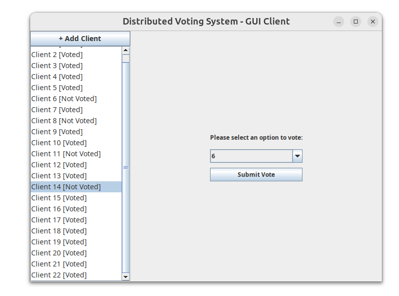
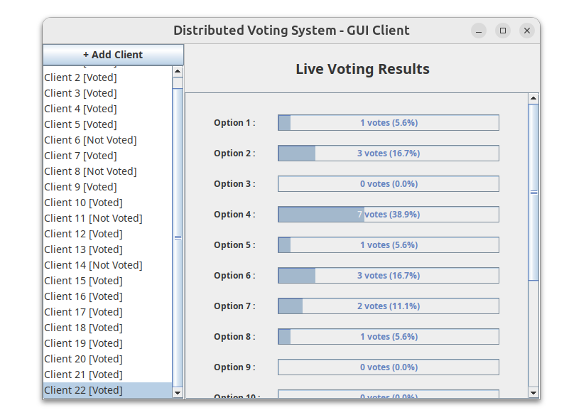
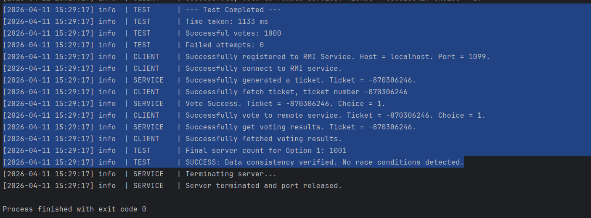
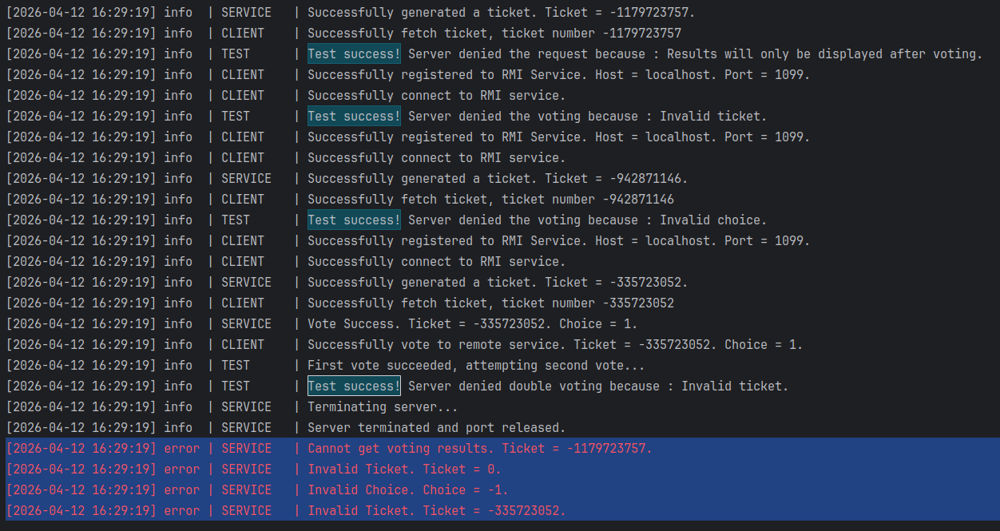

# Distributed Voting System

This project is a distributed voting system implemented based on Java RMI (Remote Method Invocation). The system supports simultaneous voting by multiple clients and ensures strong consistency and thread safety (no race conditions) of server-side data under high-concurrency scenarios.

## Core Features
* **Client-Server Architecture**: Implements remote procedure calls based on Java RMI.
* **High Concurrency Safety**: The server implements strict concurrency control for the voting logic, verified through comprehensive concurrency test cases.
* **Real-time Visual GUI**: Provides a graphical user interface, supports dynamically adding multiple Clients, and generates real-time chart feedback of voting results.

## Environment Dependencies
* Java 8 (JDK 1.8)

## How to Run

The project has 3 core executable classes: `VotingGUI.java` (Visual Client) and `ConcurrencyTest.java` (Concurrency Performance Test) and `AccessControlTest.java`(Test if the server will deny illegal access with wrong parameter or illegal invoke.)
*(Note: Neither Java class requires manually starting the Server side, as the corresponding code has been integrated into both classes respectively)*

### 1. Run GUI (Graphical User Interface)
`VotingGUI.java` is used to present the distributed process of **Client** voting and obtaining results in the form of a GUI.





**Operation Instructions**: Click `Add Client` in the upper left corner to simulate multi-client concurrency; the right panel will display statistical charts in real time after voting.

### 2. Run High Concurrency Test
`ConcurrencyTest.java` is used to test the stability of the system under extreme high-concurrency RMI access, ensuring no Race Conditions.



> As shown, all concurrency tests passed successfully.

#### Log Viewing
Test results will be output to the terminal. If you need to view detailed logs:
* Terminal execution: Logs are saved in `logs/voting.log`.
* IntelliJ IDEA execution: Logs can be found in the `logs` folder in the project's root directory.

### 3. Run Access Control Test:

> Test if the server will deny the illegal access

by running this you can

1. test if the server denied fetching result before voting
2. test if the server denied the vote if ticket invalid
3. test if the server denied the illegal choice
4. test if the server denied double voting (using the same ticket twice)



As you can see all test passed! The server refused the illegal access and output the corresponding **ERROR** log.

## Startup Instructions

If using the command line to compile this project, please enter the `src` folder first.

**Run GUI:**

```bash
javac VotingGUI.java
java VotingGUI
```

**Run High Concurrency Test:**

```bash
javac ConcurrencyTest.java
java ConcurrencyTest
```

**Run Access Control Test:**

```bash
javac AccessControlTest.java
java AccessControlTest
```

**Run in IntelliJ IDEA:**

Import the project normally, mark the `src` folder as `Sources Root`, and then run `VotingGUI` or `ConcurrencyTest` respectively.

