# Introduction

| 作业          | 截至日期                                    | 占比 |
| ------------- | ------------------------------------------- | ---- |
| Assignment I  | 2026年2月9日 <br />2026 年 3 月 6 日 17:00  | 15%  |
| Assignment II | 2026年3月16日<br />2026 年 4 月 14 日 17:00 | 15%  |
| 期末（MCQ）   | 2026 年 5 月 13 日                          | 70%  |

> **适合7天延迟**


**分布式系统定义**

A collection of independent computers that appears to its users as a single **coherent** system

分布式系统是一系列独立的计算机，但是对于用户而言，是**连贯的**系统。


并行计算（Parallel Computing）例如集群计算和多处理器系统也是分布式系统，包括ATM取款机（分布式信息处理系统）。


# 分布式算法 - 基础介绍

## [1] Process 和同步网络

在模型中，一个进程 Process（其实就是节点） $u$ 被定义为一个数学结构，包含三个核心要素：

- **状态集 ($states_u$)**：进程可能处于的所有状态的集合。
  > - 包含**初始状态 ($start_u$)** 和 **终止状态 ($halt_u$)**。
- **消息生成函数 ($msgs_u$)**：
  
  > - 定义为：$msgs_u: states_u \times out\text{-}nbrs_u \to M \cup \{null\}$
  > - **含义**：进程根据当前**状态**和目标**出邻居**（out-neighbours），决定发送什么**消息** ($M$)。如果没有消息要发，则为 $null$。
- **状态转移函数 ($trans_u$)**：
  > - 定义为：$trans_u: states_u \times \{M \cup \{null\}\}^{|in\text{-}nbrs_u|} \to states_u$
  > - **含义**：进程根据**当前状态**和从所有**入邻居**（in-neighbours）接收到的消息组合，转换到一个**新状态**。


同步网络描述了多个进程如何协同工作，其核心特征是**“步调一致” (Lock-step)**。

- 运行周期：**轮 (Round)**

  > 在同步模型中，系统的演进是以“轮”为单位的。每一轮包含两个步骤：
  >
  > 详细步骤分解
  >
  > - **Step 1：消息阶段**
  >   1. 应用**消息生成函数**：每个进程根据自己当前的状态计算要发送的消息。
  >   2. **生成消息**：为所有的出邻居准备好对应的消息。
  >   3. **传输**：消息通过通信信道发送出去。
  > - **Step 2：计算阶段**
  >   1. 应用**状态转移函数**：每个进程处理收到的消息，并根据这些消息更新自己的内部状态。
  >   2. **清理**：从信道中移除所有已处理的消息，为下一轮做准备。


如下图：

- states

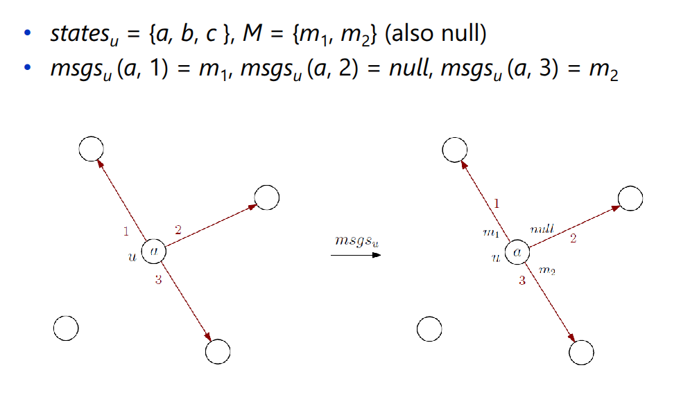

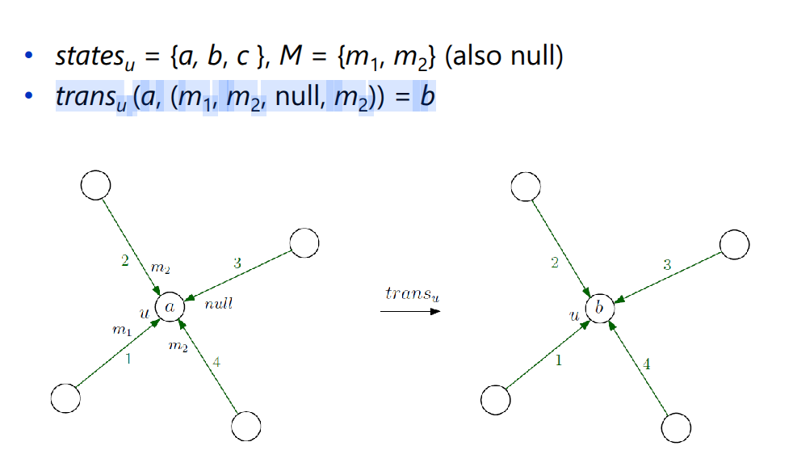


### [1.1] 轮次模型

之前在同步网络中，我们提到了 **Round** 的概念，而**替代轮次模型（Alternative Round）**本质上，就是研究节点如何以“轮”（Round）为单位进行同步通信和计算的模型。

在这种模型下，整个网络的运行被切分为一个个离散的时间片。该模型将每一轮的行为拆解为四个严格顺序执行的动作：

- **读取（Read incoming messages）**：节点查看自己的“收件箱”，读取上一轮其他节点发来的所有信息。
- **更新（Update state）**：节点根据刚读到的信息，结合自己原有的状态，进行逻辑运算并更新自己的状态（例如：更新路由表、改变算法变量等）。
- **生成（Generate messages）**：节点根据新状态产生需要发出的消息，并将其放入“发送缓冲区”。
- **传输（Transmit over channels）**：这是唯一的**网络行为**。系统将所有节点准备好的消息通过物理链路发送出去。这一步完成后，本轮结束，进入下一轮。

> 步骤 1-3（本地计算），步骤 4（网络传输）


## [2] 生成树广播

Spanning Tree **Boardcast**

为了实现广播效果，我们可以使用 Spanning Tree 和 Flooding，此处我们讨论 **Spanning Tree 生成树**。

- 生成树广播是一种算法，虽然这个网络**存在环**，但是可以通过生成出一个**生成树**，对所有节点进行广播！
- 生成树的边集合 $E'$ 属于 $E$ 。 因此这个图 $G=(V,E)$ 的生成树是 $T=(V,E')$


**根节点 $u_0$ 是 Leader**，每一个节点 $u_i$ 都知道：

- 自己的**一个** 父节点
- 自己的子节点**集**

每个节点**只知道与自己直接相关的部分**，因此我们说，进程（以一种分布的方式）知道生成树$T$

> **Processors know `T` in a distributed way.**

每一个节点都有 **Input Buffer** 和 **Output Buffer** 用于读取父节点信息、传播给子节点

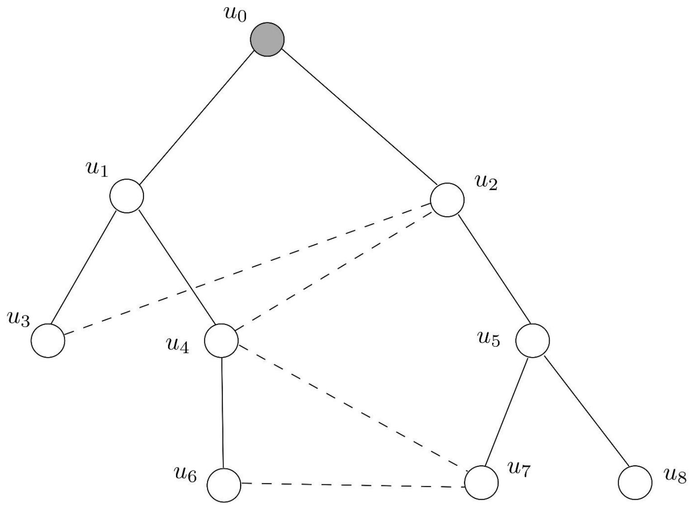


**如何实现呢？**

每一个Processor（节点），都会持续（同步地）执行如下信息：

现在，$u_0$ 要发送信息`<M>`

- 如果当前节点是 Leader（根）节点，发送给所有子节点，然后**终止。**
- 如果是**非** Leader 节点，那么就等待父节点消息，一旦受到，发送给自己的所有子节点，然后**终止。**

> 这里的终止并非结束程序，而是类似于`break;` 的跳出循环。

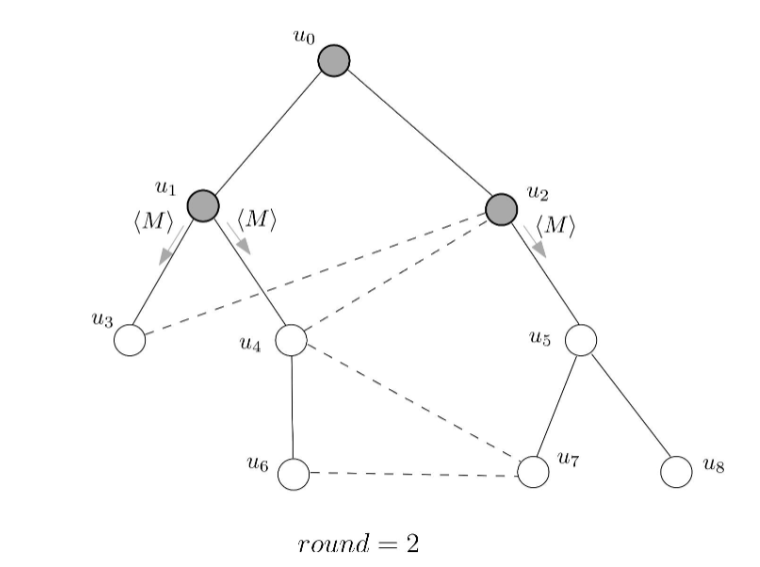


### [2.1] 证明生成树算法的正确性

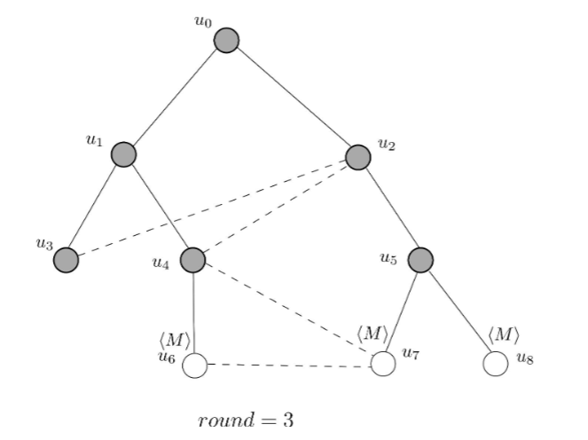

如何证明 Spanning Tree 的算法是正确的？

要证明这个算法是正确的，需要满足两个条件：

- **覆盖性**：网络中的每一个节点 $u_i$ 最终都会收到消息 $\langle M \rangle$。
- **终止性**：每个节点在收到消息后都会在当前回合结束时终止（停止运行），不会陷入死循环。

由于算法规定“一旦收到消息就终止”，所以证明的重点就变成了：**如何确保每一个节点 $u_i$ 都能收到消息？**


> 证明的核心在于**生成树（Spanning Tree）**的数学性质：
>
> - **唯一路径**：在一个生成树 $T$ 中，任意两个节点之间都存在**唯一的一条路径**。
> - **起点与终点**：假设广播从源节点 $u_0$（树的根节点）开始。对于网络中任意一个不等于起点的节点 $u_i$（即 $u_i \neq u_0$），在树 $T$ 中一定存在一条从 $u_0$ 到 $u_i$ 的路径。
> - **逐跳转发 (Hop-by-hop)**：根据算法的设计，消息 $\langle M \rangle$ 会沿着这条路径一站一站地向下发送。
>   - $u_0$ 发给它的子节点。
>   - 子节点再发给它们的子节点。
>   - 最终，消息一定会沿着那条唯一的路径抵达 $u_i$。
>
> ```
> Proof. Take any ui ≠ u0 . As the tree T is spanning, there is a single tree-path from u0 to ui . By the way the algorithms works, ⟨M⟩ will be forwarded hop-by-hop on the path until it reaches ui . And this holds for all ui in the network. 
> ```


当然，这可以使用**归纳（Induction Hypothesis）**证明

- 先证明 Base Case：对于 Leader，他一定会发送给 子节点信息，**然后终止。**
- 假设子节点 $u_i$ 收到信息，他会发送给 $u_{i+1}$ 信息，**然后终止。**
- 证明：$u_{i+1}$ 也会这么做，显然成立，因为 $u_{i+1}$ 收到信息，一定会发送给他的子节点，**然后终止。**


### [2.2] 时间/通信 复杂度

生成树的时间复杂度？

考虑 $T$ 的深度是 $d$，节点数量是 $n$

- 最好的时间复杂度是 $d$
- 最坏的时间复杂度是 $n-1$ （链式）


生成树的**通信复杂度（Communication Complexity）**？
$$
\text{总通信复杂度} = \text{消息数量} \times \text{单条消息大小}
$$


What is the largest message transmitted?

单条消息最大大小如何计算？

> [!NOTE]
>
> 在生成树结构中，信息`<M>`是原封不动转发的，因此，**传输的最大消息大小 (Size of largest message)**由 $\langle M \rangle$ 的大小决定，通常以 **bits（位）** 为单位。
>
> 比如，如果有$n$ 个节点，传输`<M>` 为他们的编号id，这通常需要 $O(\log n)$ bits.


**消息数量如何计算？**

> **消息数量**：$n-1$ 条（因为除了根节点，每个节点都接收且仅接收一次消息）。


<a id="without_spanning_tree"></a>

## [3] 无给定生成树的广播

如果生成树未知，如何计算出生成树？例如，最小生成树。当然，现在我们不考虑最小生成树算法，我们先找出一个生成树！

生成树构建算法规则如下：

**初始状态**：所有节点最初都处于**唤醒（awake）**状态。

**如果节点处于唤醒状态，且刚刚从某些邻居那里收到了消息 $\langle M \rangle$：**

- 从这些邻居中**任意**选择一个作为你的**父节点（parent）**，并通知对方。
- 将消息 $\langle M \rangle$ **转发**给其余的邻居。
- **等待一个轮次（round）以收集潜在的子节点（children），然后进入**休眠（sleep）**状态。

**如果有邻居通知你，你是他们的父节点：**

- 将这些处理器（节点）加入你的**子节点（children）列表**中。
- 进入**休眠（sleep）**状态。

**如果你处于休眠状态：**

- 不执行任何操作（即该节点已完成在树中的定位）。


首先，初始状态如下

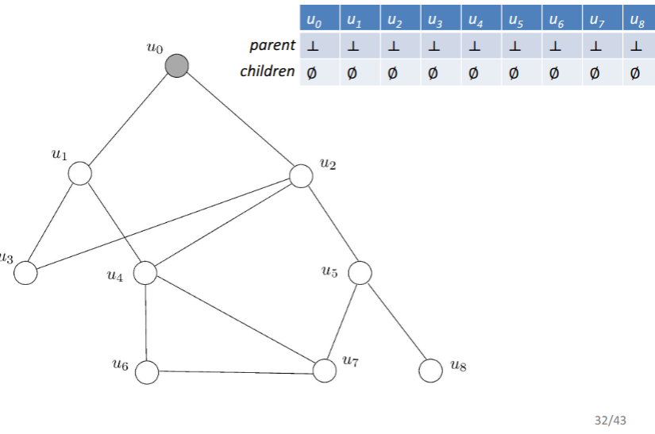

$u_0$ 发送消息给他的所有临近节点

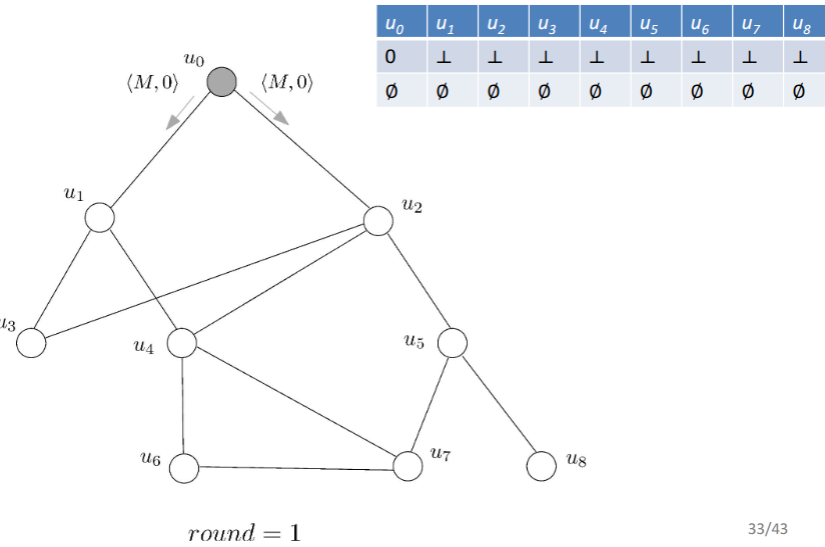

临近节点收到了！例如，$u_1$，他现在已激活，并且收到了$u_0$的消息，那么他就认为$u_0$是他的父节点，因此告诉$u_0$！

$u_0$ 此时需要等待1轮，收集他潜在的子节点返回的信息。

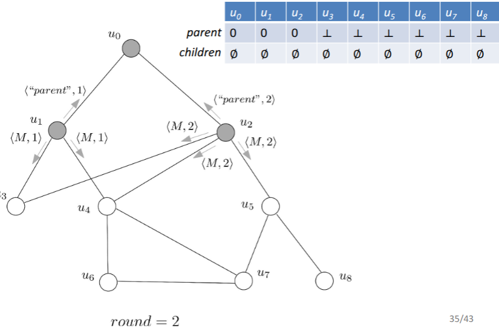

消息也同步传到了下面三个节点

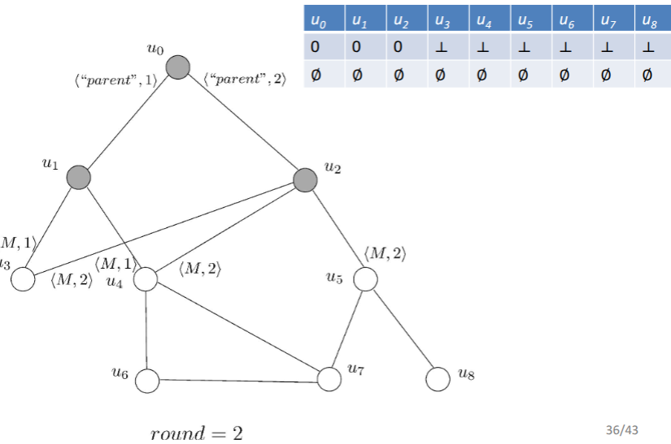

下图中，$u_4$接受到了来自$u_1$和$u_2$同时发过来的消息，那么他就任意选择一个作为自己的父节点来构建最小生成树。

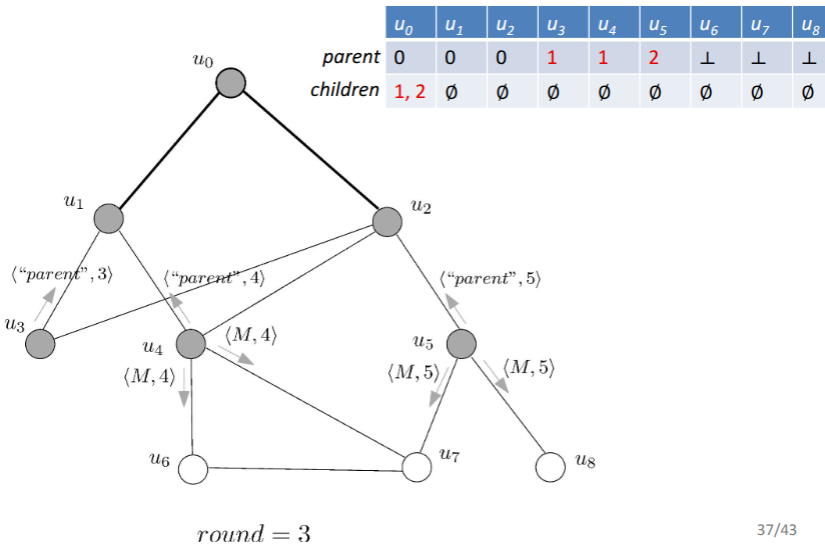

> 我们观察$u_0$，在 ROUND 1 的时候， $u_0$ 发送消息，然后到达 $u_1$ ，但是 $u_1$ 还没有读
>
> ROUND 2 的时候， $u_1$ 处理信息，然后告诉$u_0$ 你是我的父节点，发送消息，信息达到 $u_0$，但是$u_0$ 还没有读
>
> 在 ROUND 3 的时候，$u_0$ 接收，才知道 $u_1$ 是自己的子节点。
>
> 因此，如果 $u_0$ 从 ROUND = X 开始，那么会等一轮，结束轮次为 ROUND = X + 2


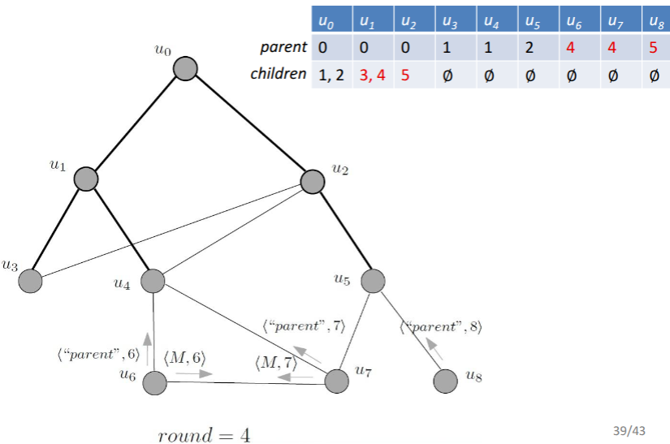

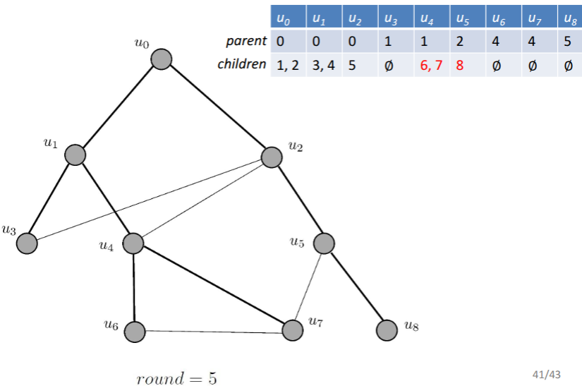


如果树的深度是4，那么要经过5轮

> 比如，如果这个树只有 $u_0$ 和 $u_1$ 、$u_2$，根据上面的分析，这个树开始于 ROUND 1，结束于 ROUND (1+2) = ROUND 3


# 分布式算法 - 选举算法

## [1] 为什么需要选举

在分布式系统中，虽然我们追求去中心化，但往往需要一个**协调者 (Coordinator)** 来管理全局事务。

Coordinator 有什么用？

- 担任时间服务器、协调提交协议、作为分布式计算的主进程或主数据库服务器。

**面临的问题：** 如果这个协调者挂了（故障），系统就会陷入瘫痪。

**解决方案：** 系统必须执行**选举算法**，从剩下的进程中选出一个新的协调者。

> 两个工业界的重量级例子：
>
> - **Apache ZooKeeper：** 一个高性能的分布式协调服务。它使用“Leader”服务器来处理所有写请求，并确保整个 Hadoop 集群的同步。如果 Leader 倒下，它会自动选出新 Leader。
> - **Google Chubby：** 谷歌内部使用的分布式锁服务。Google File System (GFS) 和 MapReduce 都依赖它来选举“Master”节点。


从理论角度定义选举算法的目标：

- **唯一性：** 从系统中所有处理器中选出**唯一一个**领导者（Leader/Coordinator/Master）。

  > 也就是，只能唯一，不允许多个 Coordinator！

- **共识性：** 这是“共识问题 (Consensus)”的一个特例。

- **最终一致：** 所有的**处理器（Processor 或者称之为节点）**最终都必须对“谁是领导者”达成一致。

  > 每个 Processor 都必须知道谁是领导者，消歧义！

## [2] 对称网络不可能实现选举

选举问题的复杂程度取决于系统的**初始假设**，不同的假设会导致完全不同的算法设计：

- **网络拓扑：** 是普通网络还是特定的环形网络 (Ring)？
- **标识符 (IDs)：** 处理器是完全一样的（Identical），还是每个都有唯一的 ID？
- **终止条件：** 处理器是否需要知道谁被选中了？没被选中的是否需要输出“我落选了”并终止？
- **先验知识：** 处理器是否预先知道网络规模（如总数 $n$）？


| 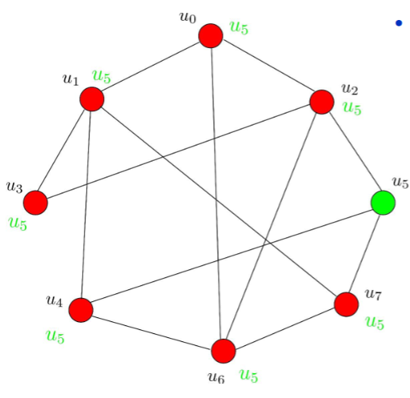 | 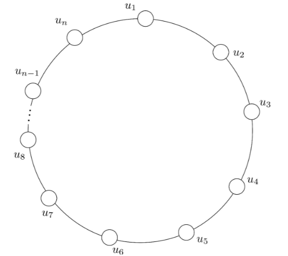 | 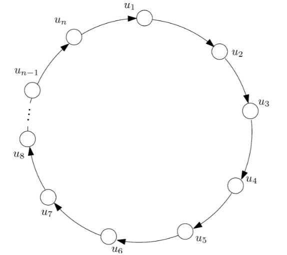 |
| ------------------------------------------------------------ | ------------------------------------------------------------ | ------------------------------------------------------------ |

> 令牌环网络 (Token Ring)，这种机制最早出现在局域网（LAN）的令牌环协议中。
>
> **令牌 (Token) 的作用：** 网络中只有一个“令牌”在不停地循环。**只有持有令牌的节点**才有权利发起计算或发送数据（例如：向网络中的打印机发送任务）。
>
> 解决的问题： 如果没有令牌机制，两个或多个节点同时尝试通信，信号会产生干扰和冲突。
>
> **核心问题：令牌丢失！** 在实际运行中，由于硬件故障或网络波动，这个唯一的令牌**可能会丢失**。
>
> **解决方案：** 当令牌消失后，系统就没有“领导者”来管理通信了。此时，所有的处理器必须执行一个算法来**重新生成一个新令牌**。


**在对称（Symmetric）的环形网络中，能否实现领导者选举？**

结论可能会让你有些意外：在特定的严苛条件下，这是**不可能**实现的。

**“最小化（Minimal）”**的假设环境：

- **有向环 (Directed ring)：** 消息只能按一个方向传递。
- **初始状态完全一致 (Initially identical)：** 这是关键点。意味着所有处理器没有任何区别，它们没有唯一的 ID（如 PID 或 MAC 地址），且运行的代码和初始状态完全相同。

**核心问题：** 在这种所有节点都一模一样的情况下，是否存在一种算法能选出一个唯一的 Leader？**No!**


**为什么？如何证明？**

**理由（打破对称性难题）：** 在分布式算法中，选举的本质是“**打破对称性**”。

证明：如果所有节点初始状态一致，且执行相同的确定性算法，那么在每一轮通信后，它们的状态依然会保持一致。

> 如果算法让节点 A 认为自己是 Leader，那么由于节点 B、C、D 的环境和逻辑与 A 完全对称，它们也会在同一时刻认为自己是 Leader。
>
> 这就违背了选举“唯一性”的原则。

## [3] 环选举：LCR算法

> 由 Le Lann, Chang, 和 Roberts 提出，所以叫做 LCR......

既然完全对称的系统无法选举，LCR 算法引入了一个关键假设：

- **唯一标识符 (Unique IDs)：** 每个处理器都有一个独一无二的 ID（如 1, 5, 42...）。
- **未知网络规模：** 处理器**==不需要==**提前知道环里一共有多少个节点（即不知道 $n$）。
- **工作机制：** 算法只通过**传输**和**比较** ID 来运行。
- **终止状态：** 只有最终被选中的 Leader 会输出“我是 Leader”并终止，其他节点不产生输出也不终止。


LCR 算法的核心逻辑非常直观，可以概括为**“强者生存”**：

**发起选举：** 每个节点都顺时针发送自己的 ID 给邻居。

**比较与转发：** 当一个节点收到一个 ID 时，会将其与自己的 ID 进行比较：

- **如果收到的 ID > 自己的 ID：** 说明外面有比我更适合当 Leader 的，于是**转发**这个收到的 ID。
- **如果收到的 ID < 自己的 ID：** 说明这个 ID 没戏，直接**丢弃**，不往后传。
- **如果收到的 ID = 自己的 ID：** 说明这个 ID 已经绕了环一圈完整地回来了！此时该节点**宣布自己是 Leader**。

> **最大 ID 的节点**发出的消息永远不会被丢弃，最终能走完一圈回到起点。
>
> **不是 最大 ID 的节点**发出的消息迟早会遇到一个更大的 ID 节点并被“拦截”。


每个处理器（或者叫做节点） $u_i$ 维护三个状态变量：

- **$myID_i$：** 存储自己的唯一 ID。
- **$sendID_i$：** 准备发送给下一个节点的 ID（可以是自己的，也可以是转发别人的，或者为 null）。
- **$status_i$：** 当前状态，初始为 "unknown"，一旦胜出则变为 "leader"。


### [3.1] 伪代码

> Algorithm LCR
> Code for processor u_i, i ∈ {1, 2, ... , n}:

```java

Initially:                                      // 最开始初始化
  u_i knows its own unique id stored in myID_i  // [i] 知道自己的唯一ID
  sendID_i := myID_i                            // 【发送id】默认先设置为自己的
  status_i := "unknown"                         // 状态最开始不知道

if round = 1 then
  send <sendID_i> to unique out-neighbour       // 第一轮，发送【发送id】
else                                            // 其他轮
  upon receiving <inID> from unique in-neighbour// 收到消息后
  if inID > myID_i then                         // 收到了比自己大的id,转发这个更大的id
    sendID_i := inID                            
    send <sendID_i> to unique out-neighbour
  else if inID = myID_i then                    // 收到了自己的id,那么把自己设置为leader
    status_i := "leader"
  else if inID < myID_i then                    // 收到的id比自己小，那就什么也不干
    do nothing
```


### [3.2] 复杂度

时间复杂度：$n+1$轮，也就是$O(n)$

通信复杂度：

- 消息大小：$O(\log n)$，其中$n$是最大 ID 比特位

- 消息数量：最坏情况是 $O(n^2)$

  > 什么样会导致 $O(n^2)$？
  >
  > 这是一个 $O(n)$ 的例子：
  > $$
  > 1\to2\to3\to4
  > $$
  > 这是一个 $O(n^2)$ 的例子：
  > $$
  > 4\to3\to2\to1
  > $$
  > 也就是倒序！比如节点2，他发送了3，后面又收到4，他忏悔不应该发送3的！可惜他无法提前预知，者导致了 $O(n^2)$ 的复杂度


## [4] 通用网络选举

> **Beyond Rings** - Leader Election in General Network

这部分内容将不再局限于简单的“环”这种特殊形状，而是要讨论更复杂、更现实的网络结构。

当然，我们要求这个网络必须是**强连通（Strongly Connected）**的

> [!NOTE]
>
> 什么是**强连通（Strongly Connected）**？
>
> 对于网络中的任意两个处理器 $u$ 和 $v$，都存在从 $u$ 到 $v$ 的路径，同时也存在从 $v$ 到 $u$ 的路径。
>
> 显然，环形网络也是强连通的，不过比较特使
>


**选举唯一领导者：** 目标依然是从分布式系统中的所有处理器中选出**唯一一个**领导者。

> 为什么在这种情况下我们不能使用 LCR 算法？
>
> - 在环中，ID 只要没被拦截，最终一定会回到起点。
> - 在通用网络中，一个 ID 可能会通过多条路径传播，或者陷入死循环却回不到原点，节点也不知道该把 ID 传给哪个邻居才能确保“绕场一周”。
>
> 简单的 LCR 无法处理通用网络中的**路径重叠**和**消息冗余**问题。

条件：**唯一 ID！** 即使是在通用网络中，处理器仍然需要拥有**唯一的 ID** 才能打破对称性并完成选举。


### [4.1] FloodMax 算法

<a id="what_is_diameter"></a>

算法前提1：**网络直径 (Diameter)**

- 在通用网络中，处理器需要一个关键信息：**网络直径 $D$**。

- **定义**：网络中任意两点之间最短路径的最大值。

  > 怎么理解？
  >
  > ```python
  > for a in nodeSet:
  >     for b in nodeSet:
  >         ans = Math.max(ans,minDistance(a,b))
  > ```

- **意义**：在分布式系统中，直径代表了信息从网络的一端传遍整个网络所需要的**最少轮次**。

算法前提2：

- FloodMax 要求每个处理器都有唯一ID


核心思想：不断传播并记录自己所“听”到的最大 ID。

整个算法非常直观，分为以下几个步骤：

1. **记录状态：** 每个节点记录一个变量 `maxID`，初始值为自己的 ID。
2. **泛洪传播（进行 $D$ 轮）：** **在每一轮中，每个节点都把自己的 `maxID` 发送给所有的邻居。**
   - 收到邻居发来的 ID 后，将其与自己的 `maxID` 比较，只保留较大的那个。
3. **判定结果：** 在 **$D$ 轮结束后**，每个节点查看最终的 `maxID`。
   - 如果 `maxID` 等于自己的 ID，则宣布自己是 **Leader**。
   - 否则，宣布自己是 **Non-leader**。

> 为了实现这个逻辑，每个处理器（节点） $u_i$ 同样需要维护：
>
> - `myID`：自己的 ID。
> - `maxID`：目前听到的最大 ID。
> - `status`：状态（`unknown`，`leader`，`non-leader`）。

#### [4.1.1] 算法实现

> 算法 FloodMax
> 处理器 u_i 的代码，i ∈ {1, 2, ... , n}:

```java
Initially:
  u_i knows its own unique id stored in myID_i
  maxID_i := myID_i
  status_i := "unknown"
 
if round = 1 then
  send <maxID_i> to all out-neighbours
else
  upon receiving <inIDs> from in-neighbours
  maxID_i := max({maxID_i} ∪ inIDs)          // maxID更新一下
  if round ≤ D then
    send <maxID_i> to all out-neighbours
  else
    if maxID_i = myID_i then
      status_i := "leader"
    else
      status_i := "non-leader"
```


#### [4.1.2] 复杂度

> **轮数（$D$）**：网络直径，即消息传遍全网所需的最长时间。
>
> **节点数（$n$）**：网络中处理器的总数。
>
> **边数（$m$）**：网络中连接的总数（即通信通道的数量）。
>
> $m$ 的最大值：在一个拥有 $n$ 个节点的图中，如果是完全网络，边的数量 $m$ 公式为 $\dfrac{n(n-1)}{2}$。因此，边数 $m$ 被视为 **$O(n^2)$**。
>
> 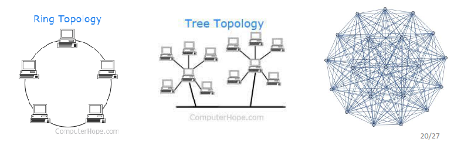


时间复杂度：$D+1$轮，因此是 $O(D)$

通信复杂度：

- 消息大小：$O(\log n)$ 

- 消息数量：$O(D\cdot m)$ 其中 $m$ 是网络中链路的数量

> 通信复杂度中的消息数量必然是 $D\cdot m$，如果完全图，那么时间复杂度会到达 $O(n^3)$


### [4.2] OptFloodMax 算法

这是对 FloodMax 算法的优化（Optimization），因此叫做 OptFloodMax 算法。

FloodMax 是通过“每一轮都向邻居发消息”来扩散最大 ID 的，如何通过**减少不必要的通信**来提升效率？

与标准的 FloodMax 不同，OptFloodMax 不再“盲目”泛洪：

- **不再每轮发送：** 在原算法中，即使一个节点的 `maxID` 没有变化，它也会在每一轮重复向邻居发送同样的值。

- **仅在更新时发送：** 处理器只有在**听到一个新的、更大的 ID** 并更新了自己的 `maxID` 时，才会向邻居发送这个新值。

  > **直观理解：** 如果我这轮没听到更大的  ID，那我就闭嘴；只有当我听到了更厉害的 ID，我才负责把它“扩散”出去。

明显的好处：减少消息总量

不明显的点：最坏情况复杂度（Worst-case complexity）

> “目前尚不明显这一改进是否能提高**最坏情况**下的消息复杂度”
>
> 这意味着在某些极端糟糕的 ID 排列下，OptFloodMax 可能仍然需要发送和原算法相同数量级的消息。


#### [4.2.1] 伪代码

> Algorithm OptFloodMax
> Code for processor u_i, i ∈ {1, 2, ... , n}:

```java

Initially:
  u_i knows its own unique id stored in myID_i
  maxID_i := myID_i
  status_i := "unknown"
  newInfo_i := true

if round = 1 then
  send <maxID_i> to all out-neighbours
else
  upon receiving <inIDs> from in-neighbours
  if max(inIDs) > maxID_i then                // 只有接受到的id确实更大，才更新并传播
    maxID_i := max({maxID_i} ∪ inIDs)
    newInfo_i := true                         // 用一个flag来标记
  else
    newInfo_i := false

  if round ≤ D and newInfo_i = true then
    send <maxID_i> to all out-neighbours
  else if round = D + 1 then
    if maxID_i = myID_i then
      status_i := "leader"
    else
      status_i := "non-leader"
```


#### [4.2.1] 复杂度

> **轮数（$D$）**：网络直径，即消息传遍全网所需的最长时间。
>
> **节点数（$n$）**：网络中处理器的总数。
>
> **边数（$m$）**：网络中连接的总数（即通信通道的数量）。

时间复杂度和通信复杂度在最坏情况和 FlooxMax 一样，因此没有改变


时间复杂度：$D+1$轮，因此是 $O(D)$

通信复杂度：

- 消息大小：$O(\log n)$ 

- 消息数量：$O(D\cdot m)$ 其中 $m$ 是网络中链路的数量

> 通信复杂度中的消息数量必然是 $D\cdot m$，完全网络最坏情况 $O(n^3)$
>
> 证明：
>
> 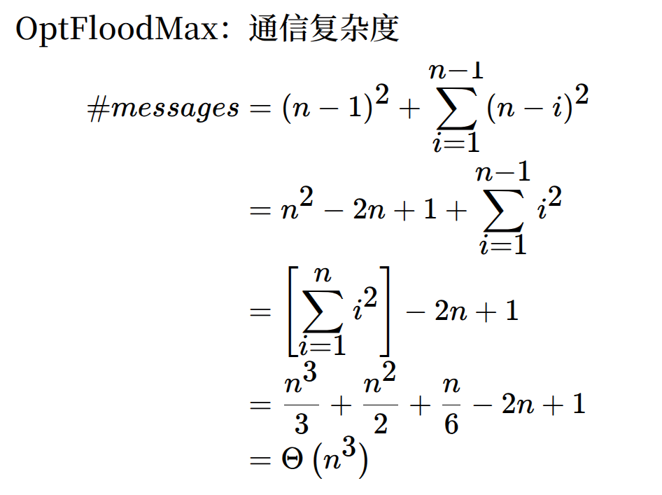


因此，OptFloodMax **在许多情况下减少消息数量，但是不会改善最坏情况下的复杂度！**

> 不过，对于那些并非总能遇到最坏情况的实际系统和应用来说，这样的改进非常重要


# 分布式算法 - BFS以及其树的构建

Breadth-First Search (BFS) 广度优先搜索

在一个网络中，如果 $u_0$ 希望发消息给其他处理器，并且生成树没有构建出来，那么怎么办呢？

之前我们提到一种[无给定生成树的广播](#without_spanning_tree)！

**传统做法的局限：** 之前的算法（上述高亮）假设网络中已经有了一个确定的根节点 $u_0$（Leader）。$u_0$ 发起广播，其他节点只需“跟随”并转发。

**现实挑战：** 在真正的分布式系统（如 P2P 网络）中，所有节点最初是平等的，没有预设的 $u_0$。

**目标：** 我们能否去掉“预设根节点”这个假设，在“群龙无首”的情况下，依然构建出一棵唯一的 BFS 生成树？


**解决思路：全员竞选 (All in Parallel)**

既然没有指定的根，算法采用的策略是**“让所有人都尝试成为根”**。

**并行启动：** 网络中的 $n$ 个节点，每一个都假装自己是根，并发起属于自己的 BFS 广播。

**身份标识：** 为了区分不同的 BFS 浪潮，每个节点广播时都会带上自己的**唯一 ID**。

**冲突点：** 一个中间节点（Internal Node）会同时收到来自不同“潜在根”的消息。它该信谁？该存储谁的信息？该转发谁的消息？

- 方法一：全部转发 (Store and forward “everything”)
- 方法二：强者生存 (Maximum Prevails)


## [1] 没有根节点构建树的两种策略

### [1.1] 全部转发

Store and forward everything

这是最“暴力”但信息最全的方法。

机制：

- 每个节点都保留**所有**它听到的根节点的信息。
- 如果网络有 $n$ 个节点，就会并行构建 $n$ 棵不同的生成树。

节点的角色：

- 对于它**自己**发起的 BFS，它是**根 (Root)**。
- 对于其他 $n-1$ 个节点发起的 BFS，它是**中间节点或叶子节点**。

存储代价：

- 节点必须维护 $n$ 套变量。

### [1.2] 强者生存

 Maximum Prevails

这是一种优化策略，也是分布式系统中常用的**“选举”**逻辑

- 节点只维护和转发**当前听到的 ID 最大**的那个根节点的信息。

- 如果节点当前认为“根是 ID 5”，但突然收到了来自“ID 9”的消息。

  > 因为 $9 > 5$，节点会**丢弃**关于 ID 5 的所有信息（或者停止转发 ID 5），转而奉 ID 9 为新的根，并加入 ID 9 的生成树。

- 如果它收到“ID 3”的消息，因为它比当前的 5 小，直接忽略。

结果：

- 最终，拥有全网**最大 ID** 的那个节点发起的 BFS 会“吞噬”所有其他较小的 BFS。
- 网络收敛为一棵以“最大 ID 节点”为根的单一生成树。


## [2] 代码

Algorithm MaxBFS
Code for processor $u_i, i ∈ {0, 1, ..., n - 1}$

```python
Initially:
  parent := ⊥, children := ∅, maxRoot := myID, root := true

# 第一轮，parent是自己，然后转发自己的id
if round = 1 then: 
  send ⟨myID⟩ to all neighbours
  parent := myID

# 一旦收到了 rootID_j
upon receiving ⟨rootID_j⟩ from neighbours N:
  if maxRoot < max_j{rootID_j} then: # 如果收到了一个很大的
    if root = true then root := false # 自己不是root
    maxRoot := max_j{rootID_j} # 然后把 maxRoot 改为 j 的根节点ID： rootID_j
    parent := j ∈ N where j just sent maxRoot # 把 parent 改为 j
    children := ∅                            # 现在没有孩子，之前的孩子作废（drop了）
    send ⟨"parent"⟩ to j                     # 告诉 j 你是我的 parent
    # 除了j，之外，告诉其他邻居，maxRoot是谁
    send ⟨maxRoot⟩ to all neighbours except those from which you just received it
  else:
    do nothing # 如果 rootID_j 比自己收到的 maxRoot 小，那么忽略！

# 从邻居那里收到了 <parent> 命令，那么就把邻居都放入自己的 children 集合！
upon receiving ⟨"parent"⟩ from neighbours N:
  add all u_j ∈ N to children
```


**可以见到，点 4 一开始认的是11 ， 后面认的是17**

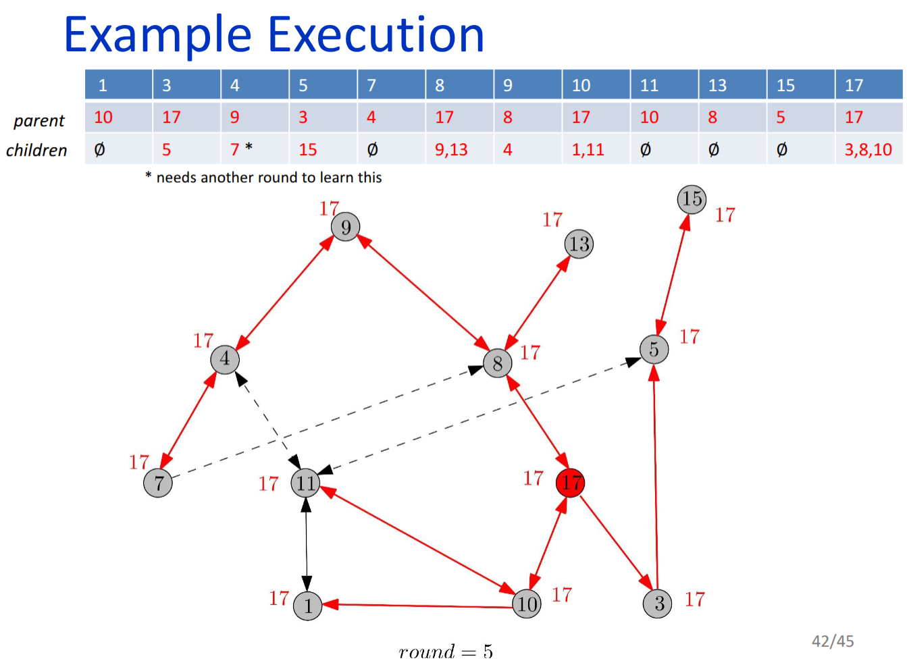


## [3] 分析

### [3.1] 付出汇报分析

**代价：** 构建生成树的过程（Tree Construction）是昂贵的，需要大量的消息交换。

**收益：** 但这只是**一次性**的投入 ("pay once")。一旦树建立好了，以后每次需要广播消息，直接沿着树发就行了，不需要再重新竞选或建树。

**应用：** 就像铺设电缆，铺的时候很累，但铺好后打电话就很方便。


### [3.2]全局计算

 Global Computation

**反向传播 (Convergecast)：**

- 广播是 Root $\to$ Leaves（从上往下）。
- **Convergecast（反向广播-多对一）** 是 Leaves $\to$ Root（从下往上）。


思考：ID 最大的节点虽然实际上已经统领全网，但它自己可能不知道网络有多大（不知道 $n$），也不知道网络有[多宽（不知道直径 $D$）](#what_is_diameter)。**它怎么确定外面没有藏着一个 ID 更大的节点呢？**

**提示：**如果我们使用 **"Store Everything" (保留所有树/ 全部转发)** 的方法，解决这个问题会更简单（因为每个节点都知道全网的信息流）。如果是 MaxBFS，通常需要额外的确认机制（比如从叶子节点向上反馈“子树已稳定”的信号）。

- **并行建树：** 每个节点 $u_i$ 都建立一棵以自己为根的 BFS 树（这里必须用 "Store Everything" 方法，让每棵树都完整生长）。
- **测算深度：** 每个节点 $u_i$ 算出自己这棵树的深度 $d_i$（即它到最远节点的距离）。
- **汇总 (Convergecast)：** 所有节点把自己的 $d_i$ 告诉大家（或者汇总到一个中心节点）。
- **求最大值：** 网络直径 $D = \max \{ d_0, d_1, \dots, d_{n-1} \}$。
- **结论：** 通过这种暴力并行的 BFS，全网所有节点最终都能知道这个网络的直径是多少。


目标 A：选举（Leader Election）—— 只选出谁最大  

| 难度     | 假设                  | 算法                                  | 时间 | 通信                      |
| -------- | --------------------- | ------------------------------------- | ---- | ------------------------- |
| 低       | 有向环 + 唯一ID       | **LCR**                               | n+1  | Θ(n²) 最坏 / 2n-1 最好    |
| 中       | 强连通有向图 + 知道 D | **FloodMax**                          | D+1  | D·m                       |
| 中(优化) | 强连通有向图 + 知道 D | **OptFloodMax**                       | D+1  | D·m(多数情况更少，最坏同) |
| 高       | 强连通 + 不知道 D     | 先 Store Everything 算 D，再 FloodMax | —    | —                         |

目标 B：建树（BFS Tree Construction）—— 建立通信结构

| 难度     | 假设                   | 算法                              | 时间        | 通信                |
| -------- | ---------------------- | --------------------------------- | ----------- | ------------------- |
| 低       | 有根 u0 + 已有生成树 T | **Spanning Tree Broadcast**       | d（树深度） | n-1                 |
| 中       | 有根 u0 + 无树         | **Broadcast & Tree Construction** | O(D)        | O(m)                |
| 高       | 无根                   | **MaxBFS**（Maximum Prevails）    | O(D)        | O(m)                |
| 高(替代) | 无根                   | **Everything**（全转发 n 棵树）   | O(D)        | O(n·m)，存 n 套变量 |


# 分布式系统 - 种类介绍

**分布式系统需要理论支撑**

- 理论可以为现有系统提供见解（Insight）
- 理论可以对任何潜在的系统进行论证（argue）

> 证明某些可能、某些不可能的结果


三种结构，比如环形、树形、完全网络（Complete Network）


**分布式系统的八大谬误 (False Assumptions)**

这是业界经典的总结，初学者容易犯的错：

1. 网络是可靠的。
2. 网络是安全的。
3. 拓扑（Topology）结构不会变。
4. 延迟（Latency）为零。
5. 带宽（Bandwitdth）无限。
6. 传输成本为零。
7. 只有一个管理员。


## [1] 分布式系统目标

**分布式系统目标**

- 简单连接（Easy Connection）
- 透明性（Transparency）
- 开放性（Openness）
- 可靠性（Reliability）
- 性能（Performance）
- **可扩展（Scalable）**

### [1.1] 连接用户与资源

Connecting Users and Resources

**资源类型**：不仅仅是打印机或文件，还包括计算能力、数据、传感器等。

**为什么要共享**：

- **经济**：不用每个人都买一台打印机。
- **协作**：Groupware（群件）让不同地方的人一起工作。

**带来的麻烦**：一旦联网共享，就面临**安全问题**（谁能看？）、**协调问题**（两个人同时改一个文件咋办？）以及**公平性**（不能让一个人占着所有带宽）。


### [1.2] 透明性

Transparency

**定义**：用户在使用分布式系统时，感觉就像在使用一台**单机**。

透明性可以用如下表格来理解！

| **透明性类型**          | **解释 (隐藏了什么？)**                | **例子**                                                     |
| ----------------------- | -------------------------------------- | ------------------------------------------------------------ |
| **Access** (访问)       | 隐藏数据表示差异和访问方式。           | 你不管连的是 Windows 还是 Linux 服务器，读文件的方式都一样。 |
| **Location** (位置)     | 隐藏资源的物理位置。                   | 你访问 `google.com`，不需要知道服务器是在美国还是爱尔兰。    |
| **Migration** (迁移)    | 隐藏资源可以在不同位置间移动的事实。   | 虚拟机从一台物理服务器迁到另一台，你感觉不到。               |
| **Relocation** (重定位) | 隐藏资源**在使用过程中**被移动的事实。 | 你正在下载文件，服务器后台换了，下载没断。                   |
| **Replication** (复制)  | 隐藏资源有多个副本。                   | 你的实际上数据存了3份，但是你只看到1个文件。                 |
| **Concurrency** (并发)  | 隐藏多用户同时竞争资源。               | 你和同学同时抢课，系统没崩溃，你感觉像只有自己在操作。       |
| **Failure** (故障)      | 隐藏故障和恢复过程。                   | 某个服务器挂了，系统自动切换到备用，你不知道刚才出事了。     |
| **Persistence** (持久)  | 隐藏数据是在内存还是硬盘。             | 写代码时你只管变量，不管它此刻存在哪。                       |

**透明性的局限 (Degree of Transparency)：**

- **完全透明是不可能的，也不总是好的。**
- **例子**：如果你的服务器在地球另一端，**Location Transparency** 可能会掩盖“光速延迟”这个物理事实，导致程序看起来像卡死了（其实只是远）。
- **权衡**：透明度太高通常会牺牲性能。


### [1.3] 开放性

Openness

**定义**：系统遵循标准的规则（语法和语义）。

**关键点**：

- **互操作性 (Interoperability)**：来自不同厂商的实现可以一起工作（比如小米手机能连苹果的 WiFi，因为都遵守 802.11 协议）。
- **可移植性 (Portability)**：软件从 A 机器搬到 B 机器不用改代码。

**注意**：Open（开放标准）不等于 Free（免费）。


### [1.4] 可靠性

 Reliability

- **可用性 (Availability)**：系统随时待命。
- **容错 (Fault tolerance)**：即使部分组件坏了，系统还能跑（Mask failures）。


### [1.5] 性能

Performance

目标是通过并行计算提高效率。

**挑战**：网络延迟、缺乏全局时钟（Global Synchrony）、异构性（机器配置不一样）。


### [1.6] 可扩展性 

Scalability

这是现代系统最大的挑战。幻灯片提到了三个维度：

1. **Size (规模)**：用户或进程数量增加，系统还能撑住吗？
2. **Geographical (地理)**：节点距离远了，延迟高了，系统还能用吗？
3. **Administrative (管理)**：跨越不同的管理域（比如跨公司、跨国家），还能协调吗？

**反面教材（不能扩展的做法）：**

- **集中式服务（Centralized Service）**：所有人都连一台服务器（瓶颈）。
- **集中式数据（Centralized Data）**：像电话本只有一本（查的人多了就排队）。
- **集中式算法（Centralized Algorithms）**：路由需要知道全网信息（网络太大了算不过来）。

#### [1.6.1] 可扩展性的技术 (Scaling Techniques)：

| 技术                    | 做什么               | 例子                                     |
| ----------------------- | -------------------- | ---------------------------------------- |
| **Async Communication** | 不等回复，隐藏延迟   | 客户端本地校验表单，不逐字段问服务器     |
| **Distribution**        | 分而治之，一人管一块 | DNS：`.com` 一组服务器管，`.cn` 另一组管 |
| **Replication**         | 多拷几份，就近放置   | CDN、Web 缓存；代价是副本间一致性问题    |


## [2] 分布式系统的分类和架构

从**软件**和**硬件**两个角度看

### [2.1] 硬件层面的分类

在物理硬件上，多台计算机或处理器是如何连接的？主要分为两类：

- 多处理器系统 (Multiprocessors) - "共享内存"
- 多计算机系统 (Multicomputers) - "私有内存"

字面意思，非常好理解！

#### [2.1.1] 多处理器系统

所有CPU共享同一个物理内存（Shared Memory）。

**通信方式：** CPU之间通过读写同一块内存区域来交换数据（就像大家围在一张桌子上共用一个笔记本）。

很难扩展（Bad Scalability）。因为总线（Bus）带宽（Bandwidth）有限，CPU太多会造成拥堵。**通常用于高性能计算（HPC）或大型工作站。**

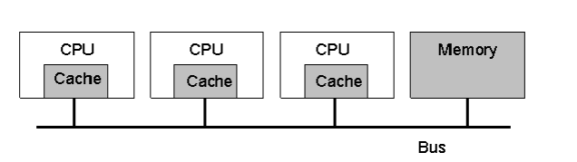


#### [2.2.2] 多计算机系统

每台机器有自己独立的内存和操作系统。

**通信方式：** **消息传递（Message Passing）**。机器之间通过网络发送数据包来交流（就像大家在不同的房间，必须发邮件沟通）。

**分类：**

- **同构 (Homogeneous):** 像数据中心的集群，机器配置一样，通过高速局域网连接。尝试实现完全透明性（图左）
- **异构 (Heterogeneous):** 像互联网，机器配置各异，通过广域网连接。这需要更复杂的软件来协调。更原始，缺乏透明度，但是更容易添加/移除机器（如互联网中那样）（图右）

> 这里的同构、异构指的是【底层硬件】！


### [2.2] 软件层面的分类

硬件连接好了，我们需要操作系统来管理它们。PPT对比了三种不同的软件架构：

- 分布式操作系统 (DOS - Distributed Operating Systems)
- 网络操作系统 (NOS - Network Operating System)
- 中间件 (Middleware) —— **现代分布式系统的核心**


#### [2.2.1] DOS - 分布式操作系统

**理念：** 追求极致的**透明性 (Transparency)**。

**表现：** 试图把多台计算机伪装成一台超级计算机。**用户完全感觉不到这背后有多台机器**（比如你不需要知道你的文件存在哪台机器的哪个硬盘上，系统会自动管理）。

**缺点：** 极难实现，通常要求硬件完全一致（同构），扩展性差，现在很少通用。

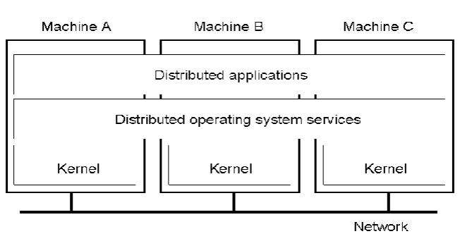

#### [2.2.2] NOS - 网络操作系统

**理念：** 也就是传统的联网计算机（比如早期的Windows NT或Unix网络）。

**表现：** **透明度很低**。用户清楚地知道“我在使用机器A，我要去访问机器B的文件”。每台机器都有独立的操作系统，只是增加了网络功能（如SSH, FTP）。

**优点：** 容易构建，支持**异构硬件**，易于添加/移除机器。

**缺点：** 对开发者和用户来说太麻烦，你需要自己处理很多网络细节。

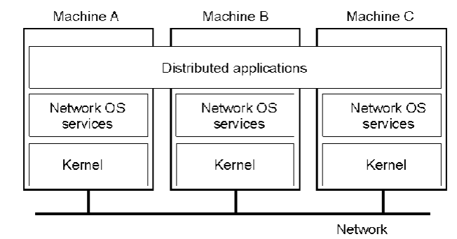

#### [2.2.3] Middleware

中间件 (Middleware) —— **现代分布式系统的核心**

**理念：** 它是 DOS 和 NOS 的折中方案，集成了两者的优点。  

**位置：** 它运行在 NOS 之上，**应用程序之下**

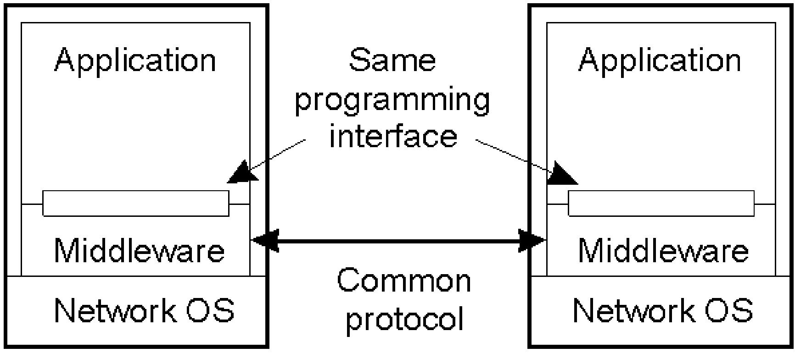


- 它向应用程序提供通用的接口
- **屏蔽底层差异：** 无论底层是Windows还是Linux，是同构还是异构，**中间件让上层应用看起来像是在同一个系统中运行。**
- **实现目标：** 在异构的网络环境（NOS的强项）上，实现类似单机系统的易用性和透明性（DOS的强项）。


#### [2.2.4] 对比

| **特性**     | **分布式操作系统 (DOS)**  | **网络操作系统 (NOS)**  | **中间件系统 (Middleware)** |
| ------------ | ------------------------- | ----------------------- | --------------------------- |
| **透明度**   | 非常高 (看起来像一台机器) | 低 (用户知道有多台机器) | 高 (致力于隐藏底层细节)     |
| **操作系统** | 所有节点必须一致          | 可以不同                | 可以不同                    |
| **通信方式** | 共享内存或消息            | 文件传递/远程登录       | 模型特定 (如RPC)            |
| **可扩展性** | 差 (No)                   | 好 (Yes)                | 视具体实现而定 (Varies)     |
| **开放性**   | 封闭 (Closed)             | 开放 (Open)             | 开放 (Open)                 |


# 分布式系统 - 通信

Communication

## [1] 网络分层和套接字回顾

我们在计算机网络中学过 TCP （图左）和 UDP（图右）

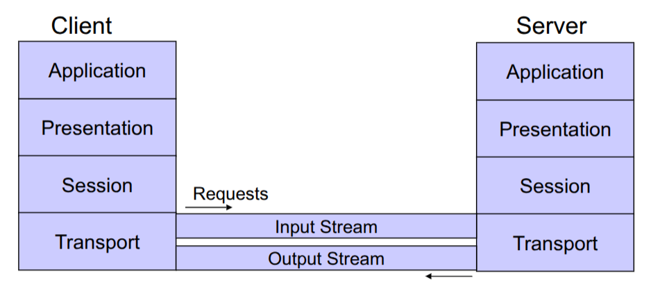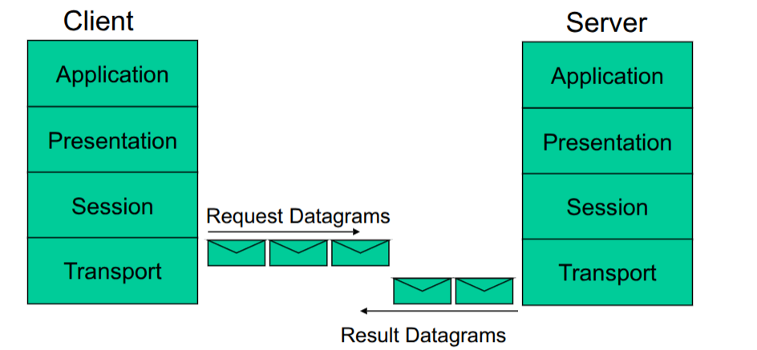


我们不详细学UDP！我们还学过Client-Server模型

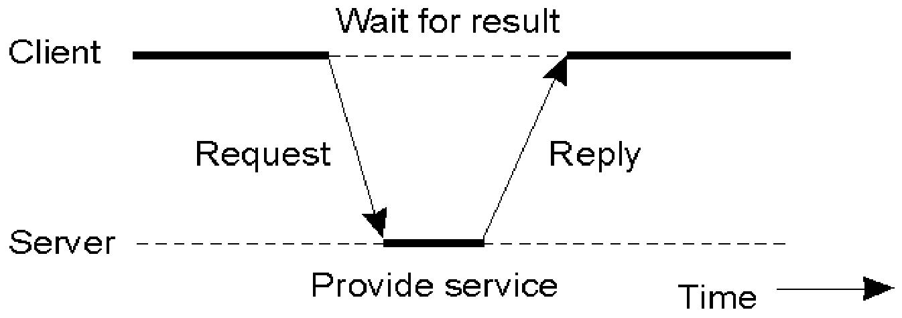

回顾一下计算机网络中学过的，**分层协议（Layered Protocols）**

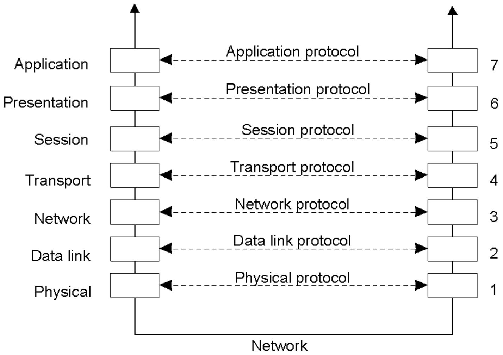

我们学过 Application / Transport/ Network/ Link / Physical 这五个层。剩下的Presentation和Session层现在过时了，已经被中间层取代了！我们回顾一下这些层...

应用层 Application Layer 

- HTTP（超文本传输协议）、FTP（文件传输协议）、DNS
- 进程 Process 绑定 Socket，然后网络上就可以通过 Socket通信了！

传输层 Transport Layer 

- TCP（HTTP，POP,IMAP）、UDP（DNS是使用UDP传输的，但是他在Application层，VoIP）
- 将消息拆分成足够小的片段以便传输，编号，并且要恢复正确顺序到达！！
- 传输层通信是 Application 开发者能够用到的最低协议

网络层 Network Layer

- 提供 Router 机制
- IP（Internet Protocols）

链路层 Data Link Layer

- 帧 Frame
- 主要功能是纠错，Checksum

物理层 Physical

- 涉及0和1的传输！


**Socket（套接字）**、**Port（端口）** **如何找到服务（Endpoint Identification）**


可以把这部分理解为“快递系统”：

- **IP地址** = 大楼地址。

- **端口 (Port)** = 大楼里的具体房间号。端口例如`8080`是不知道IP的！所以一般需要 IP+端口！

  > 一个逻辑上的数字（0-65535），用来标识计算机上正在运行的**具体应用程序**。
  >
  > 你的电脑只有一个网线（IP），但同时开着浏览器、微信、游戏。TCP协议通过端口号知道数据包该交给谁（浏览器用80，SSH用22）。

- **Socket** = 写着完整地址（IP+端口号）的收发据点。


问题：如何找到服务的“端点”？ (Identifying End-points)

既然服务器需要守在一个端口上，客户端怎么知道该去连哪个端口呢？PPT列出了三种解决方案：

方法 1：静态分配 (Statically Assigned) 

- **原理：** 全世界统一标准，某些著名服务固定使用特定端口。
- **例子：**
  - **HTTP:** 总是使用 **80**。
  - **Telnet:** PPT写的是21，但**标准其实是 23** (21通常是FTP)。*注意：考试时请以老师或PPT为准，但实际工作中Telnet是23。*
- **优点：** 简单，大家都知道。
- **缺点：** 端口号有限，不够灵活。

这两个幻灯片主要讲解了网络通信中最基础也是最重要的概念：**Socket（套接字）**、**Port（端口）** 以及**如何找到服务（Endpoint Identification）**。

可以把这部分理解为“快递系统”：

- **IP地址** = 大楼地址。
- **端口 (Port)** = 大楼里的具体房间号。
- **Socket** = 写着完整地址（大楼+房间号）的收发据点。

| **特性**     | **方法 1：静态分配(Statically Assigned)**                    | **方法 2：动态分配(Dynamically Assigned)**                   | **方法 3：超级服务器(Super-server)**                         |
| ------------ | ------------------------------------------------------------ | ------------------------------------------------------------ | ------------------------------------------------------------ |
| **核心原理** | 全世界统一标准，著名服务固定使用特定端口号。                 | 机器上运行一个特殊的**守护进程 (Daemon)** 来管理端口映射。   | 一个主进程同时监听多个端口，**按需启动**服务。               |
| **工作流程** | 客户端直接连接众所周知的端口（如80），无需询问。             | 1. 服务启动向 Daemon 注册。 2. 客户端询问 Daemon：“某服务在哪？” 3. 得到端口号后，客户端再连接。 | 1. `inetd` 监听端口。 2. 请求到达，`inetd` 被唤醒。 3. `inetd` 临时启动真正的服务进程处理请求。 4. 处理完后服务关闭。 |
| **优点**     | **简单直接**，大家都知道，无需额外交互。                     | **灵活**，不需要固定占用特定端口，适合非标准服务。           | **节省资源**。只有在有人访问时才占用内存，平时服务是不运行的。 |
| **缺点**     | **不灵活**，端口号资源有限（0-1023是保留端口）。             | 需要额外的查询步骤（开销稍大），依赖 Daemon 的稳定性。       | 响应速度可能稍慢（因为每次都要新起进程），适合轻量级服务。   |
| **典型示例** | • **HTTP**: 80 <br />• **Telnet**: 23 (PPT标为21) *(注：考试按PPT，实操按标准)* | • Port Mapper<br /> • Directory Service                      | • UNIX `inetd` <br />• `xinetd`                              |

第二种和第三种：

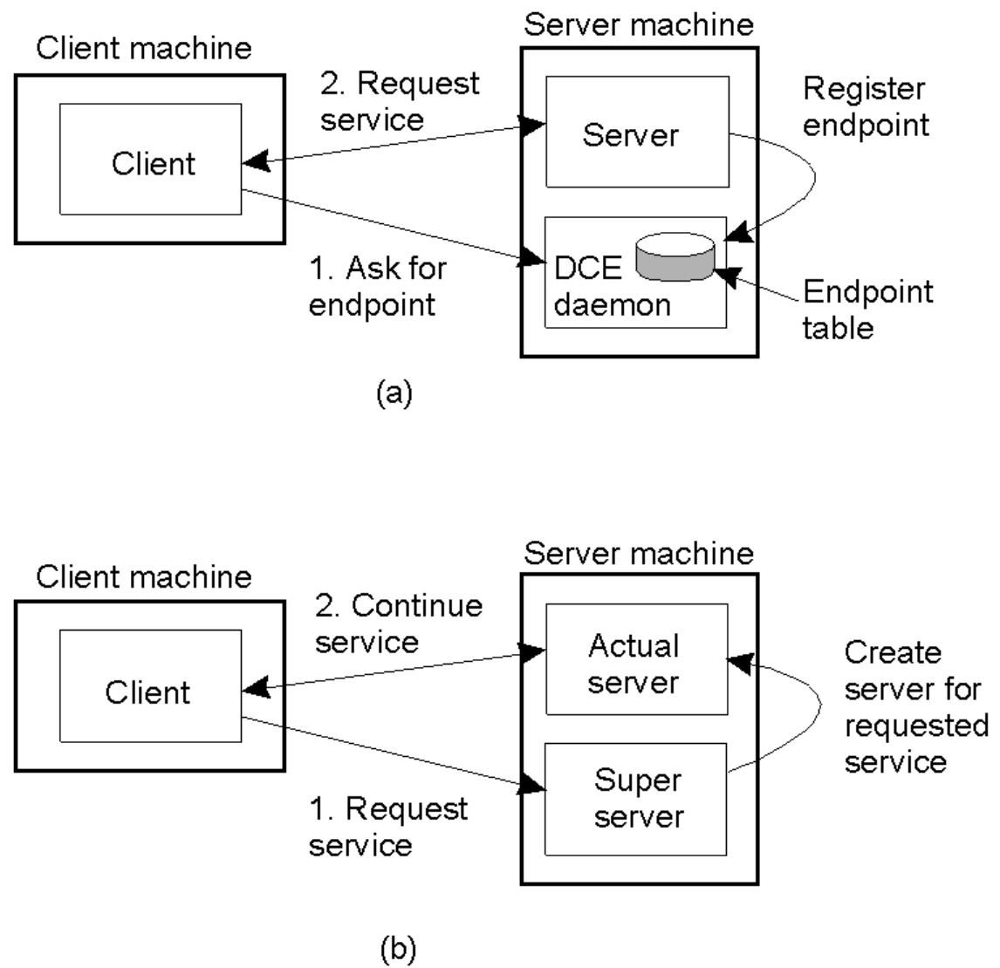


回顾，我们在Java中联系过 Socket 和 ServerSocket

Socket是双向的，创建方法如下

```java
Socket socket = new Socket("www.csc.liv.ac.uk",80);//主机名+端口
```

那么 ServerSocket 则是建立一个监听的 Socket

```java
ServerSocket serverSocket = new ServerSocket(8080);// 在这个 port 上建立一个 socket 来监听
```

一旦监听到，可以使用`.accept()`方法分别服务每个用户对象！此方法会暂停服务器，直到有客户端尝试连接到它。方法返回一个 `Socket` 对象（已经连接好了！）

简单的客户端和服务端实例：

```java
public class SimpleSimulation {
    private static final class ServerExample{
        public static void main(String[] args) throws Exception {
            ServerSocket serverSocket = new ServerSocket(8089);
            while (true){
                Socket accept = serverSocket.accept();
                InputStream inputStream = accept.getInputStream();
                OutputStream outputStream = accept.getOutputStream();
                byte[] bytes = new byte[1024];
                int read = inputStream.read(bytes);
                System.out.println("Server read:"+new String(bytes,0,read));
                outputStream.write("Server has received your reply! Thanks for connecting!".getBytes());
                outputStream.flush();
            }
        }
    }

    public static final class ClientExample{
        public static void main(String[] args) throws Exception {
            Socket socket = new Socket("127.0.0.1", 8089);
            InputStream inputStream = socket.getInputStream();
            OutputStream outputStream = socket.getOutputStream();
            outputStream.write("Hi, I am the client!".getBytes());
            byte[] bytes = new byte[1024];
            int read = inputStream.read(bytes);
            System.out.println("Client received the reply from server! "+new String(bytes,0,read));
        }
    }
}
```


但是，我们如何通过Socket发送Java对象呢？我们知道可以序列化，但是问题是，接收方并不一定知道这是一个普通字符串还是序列化后的字符串！

此时，我们有必要考虑中间层了（Middleware = Presentation Layer + Sesison Layer）！

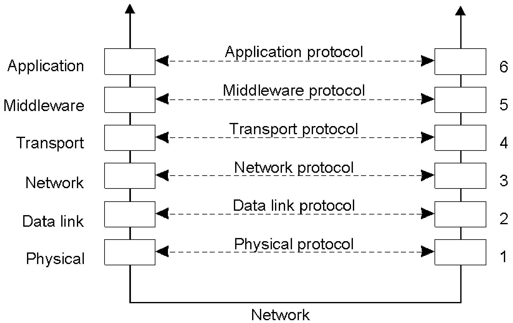


## [2] 中间件通信

> [!NOTE]
>
> 此处为LECTURE 10， 省略了 HTTP 1.0

中间件通信包含：

- RPC （Remote Procedure Calls）远程过程调用
- RMI （Remote Method Invocation） 远程方法调用
- Message-based Communication 基于消息的通信
- Stream 流


### [2.1] RPC 远程过程调用

RPC 的核心目标是：**让“调用远端机器上的函数”变得像“调用本地函数”一样简单。**

RPC 的出现主要为了解决以下问题：

- **消灭 Socket：** 在没有 RPC 之前，程序员必须手动处理 Socket 连接、数据包序列化（将对象转成字节流）、网络超时等极其繁琐的细节。
- **屏蔽底层细节：** RPC 把所有网络通信的“脏活累活”都封装起来了。分布式系统的程序员不再需要关心：
  - 对方的 IP 地址是怎么连接的。
  - 数据是怎么通过网线传过去的。
  - 两台机器的 CPU 架构是否不同（比如字节序是大端还是小端）。

因此，这实现了透明性：程序员调用远程和调用本地看起来就是一样的


**RPC 的工作原理（概念模型）**

虽然 PPT 里说“概念上简单”，但它背后有一套精巧的机制：

1. **Client (客户端):** 调用一个本地的代理函数（称为 **Stub/存根**）。
2. **Stub (存根):** 将函数的参数打包（Marshaling）成网络消息，发给远程服务器。这个是在客户端进行的！！
3. **Server (服务端):** 接收消息，解包参数，执行真正的函数逻辑。
4. **结果返回:** 服务端将结果再次打包，发回给客户端，Stub 接收并返回给程序。

客户端的 Stub 是在本地机器上实现接口，然后调用远程服务，但是服务器的Stub是真的干活的，执行实际的运行的！！


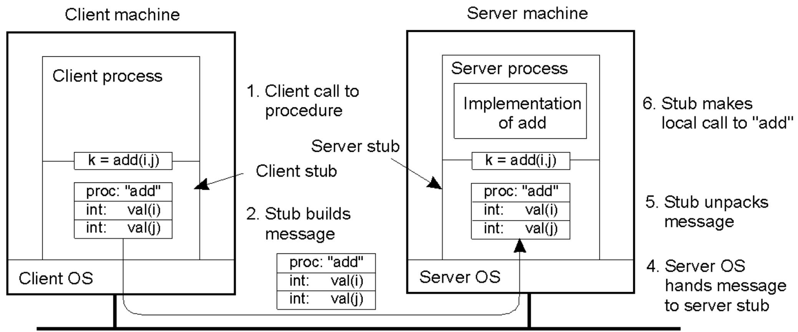

挑战：

1. 两个机器的架构可能不同（RPC同构效果好，异构效果差）
2. 每台机器可能有不同的**地址空间（Adress Space）**
3. 如何正确传参？
4. 两台机器可能存在不同的字符编码（Byte-ordering），比如ASCII/EBCDIC等，RPC要解决这个问题增加了复杂性。
5. 如果其中一台、或者全部机器，突然崩溃了，怎么处理？


如下图，使用python模拟RPC调用。左侧是 Server, 右侧是 Client

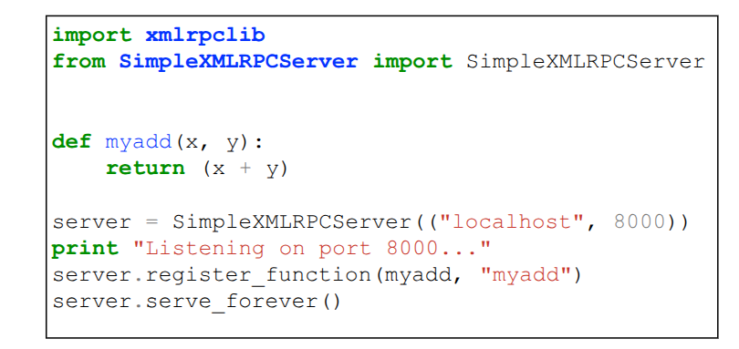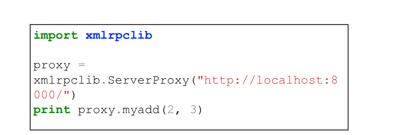

类似于接口文档，像这种远程调用的文档，我们需要给一个规范：IDL（Interface Definition Language）接口定义语言

IDL 语言是中立的，不预设任何一种语言，但是实际上IDL看起来更像是C（例如Google的Protocol Buffer）


### [2.2] RMI 远程方法调用

允许一个在 JVM中的 Object 调用另一个 JVM 中的 Object，我们说这种是分布式对象（Distributed Object）

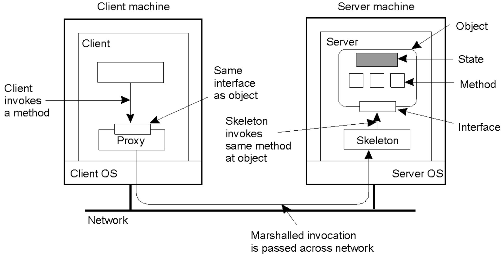

这里的 Proxy 可以理解为：RPC中客户端的 Stub

同理，Skeleton 可以理解为：RPC中服务端的 Stub


关于下图，不用太细致了解，只需要知道远程调用方法（RMI）中传参可以传递 Reference 也可以传递 Value！

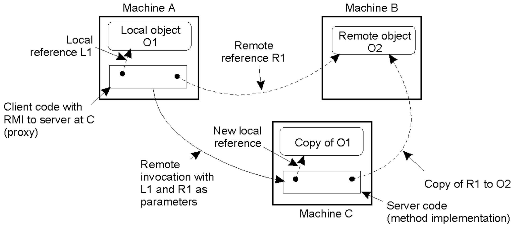


#### [2.2.1] Java 实现

客户端和服务器都有一个规范的接口：

```java
// 首先我们定义了一个接口，这个接口只有一个方法，返回当前时间毫秒数
public static interface Second extends Remote {
    long getMilliseconds() throws RemoteException;
}
```


服务器自己实现了接口，客户端没实现：

```java
// 继承 UnicastRemoteObject 类 + 实现接口
public static final class SecondImpl extends UnicastRemoteObject implements Second {
    public SecondImpl() throws RemoteException {} // 空参构造
    @Override // 实现 Second 接口方法
    public long getMilliseconds() throws RemoteException {
        return new Date().getTime();
    }
}
```


服务器：

```java
public static final class Server{
    public static void main(String[] args) throws Exception {
        java.rmi.registry.LocateRegistry.createRegistry(1099); // 脚本启动注册表，这是必需的但是PPT没写
        SecondImpl remoteObject = new SecondImpl();
        // 最后，告知RMI命名服务，已创建的（远程）对象被赋予字符串名称“Dater”。
        // 一旦远程对象在本地主机的RMI注册表中注册（绑定）
        // 远程（或本地）主机上的调用者就可以通过名称 Dater 查找该远程对象，获取其引用
        // 然后调用该对象上的远程方法。
        Naming.rebind("Dater",remoteObject);
    }
}
```


客户端：

```java
public static final class TimeClient{
    public static void main(String[] args) throws Exception {
        Second secondInterface = (Second) Naming.lookup("rmi://localhost:1099/Dater"); // 这里要 Cast
        // 虽然我们没有实现这个方法，但是 RMI 里面的 Object 实现了，是远程调用！
        System.out.println(secondInterface.getMilliseconds()); 
    }
}
```


> [!CAUTION]
>
> 只有实现了 `Serializable` 接口的类（以及基本类，例如`Integer`等）才能够作为参数传递给RMI
>
> 顺带一提 ` new Date().getTime()` 和 `System.currentTimeMillis()` 都是获取当前时间毫秒数，不知道为什么 PPT 要用多一个对象的方法调用。但是我们还是遵循PPT


#### [2.2.2] 关于RMI的更多细节

相当于接口返回了一个自定义类的对象，例如`MyClass` 对象，那么显然这个`MyClass`需要实现序列化，并且客户端和服务器都要有。

如果客户端没有 `TimeTeller` 这个类的代码，它该怎么办？直接下载运行安全吗？

Java RMI 中最强大的特性之一：**动态代码加载 (Dynamic Code Loading)**，以及由此引发的**安全问题**和**解决方案**。


**核心优势：灵活性 (Flexibility) & 动态加载**

- **以前的痛点**：在普通程序中，客户端必须提前安装好所有可能用到的类（比如 `TimeTeller.class` 必须存在客户端硬盘里）。
- **RMI 的做法**：支持 **动态代码加载 (Dynamic Code Loading)**。
  - 如果客户端调用了一个远程方法，返回了一个它从来没见过的对象（客户端本地没有这个类的定义），RMI 可以让客户端**自动**从服务器（或指定的 Code Repository）下载这个类的 **字节码 (Bytecodes)**。
  - 这使得系统非常灵活：客户端不需要预先安装所有软件，需要什么就去下载什么运行。

**核心劣势：安全隐患 (Security Concerns)**

- **风险**：“盲目信任下载的代码……并不是一个好主意”。
- **原因**：如果你允许客户端自动下载代码并执行，万一服务器被黑了，发给你一段恶意代码（比如格式化硬盘、窃取数据），客户端一运行就完蛋了。


**解决方案：安全管理器 (Security Manager)**

为了解决上述风险，Java 引入了严格的安全模型（JDK 1.2+）：

- **`RMISecurityManager`**：这是一个“安保人员”。如果你的程序需要从网络下载代码执行，Java 强制要求你必须安装这个管理器。

只需要在服务器端和客户端的 `main` 方法最开始，都加上：

```java
if (System.getSecurityManager() == null) {
    System.setSecurityManager(new RMISecurityManager());
}
```


什么是**策略文件 (Policy File)**？

开启了“安检模式”后，Java 默认会禁止几乎所有危险操作（比如禁止联网、禁止读写文件）。为了让程序能正常跑起来，你需要给它发放“通行证”，这就是 **Policy File**。

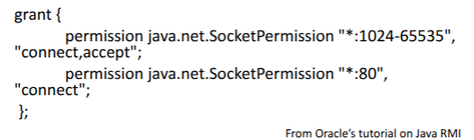


Java RMI扩展了Java，以Java语言为分布式对象提供支持，它允许对象调用远程对象上的方法，所使用的语法与本地调用相同。

教程：https://docs.oracle.com/javase/tutorial/rmi/


### [2.3] MOM 面向消息的中间件

面向消息的中间件  Message-oriented Middleware

RPC/RMI在分布式系统中隐藏通信方面表现出色，但在某些情况下，它们并不好！

- 如果收方处于“唤醒”状态并等待通信，会发生什么情况？
- RPC/RMI默认的“同步、阻塞”特性往往过于受限。

在这种情况下，就需要：面向消息的中间件！

在这之前，先了解一些术语！

- 持久通信（Persistence Communications）：
  - 一旦发送，**“发送方”可以停止执行**。
  - “接收方”此时无需处于运行状态——通信系统会根据需要缓存消息（直至能够送达）。比如电子邮件！或者短信系统（发完你手机关机了，对方仍然可以受到）。
- 瞬时通信 （Transient Communications）：
  - 消息只在发送者和接收者**都在运行**的时候才存在。一旦链路断了或者一方挂了，消息就**丢了**。例如 RPC 和 RMI。


| **特性**       | **持久通信 (Persistent)**         | **瞬时通信 (Transient)**     |
| -------------- | --------------------------------- | ---------------------------- |
| **发送者状态** | 发完即可停止运行                  | 必须保持运行直到发送完成     |
| **接收者状态** | 发送时不需要在线                  | 发送时必须在线               |
| **消息存储**   | 有中间件/服务器缓存               | 无（或仅极短时间的网络缓存） |
| **典型例子**   | 邮件 (Email)、消息队列 (RabbitMQ) | 打电话、RPC、Socket 连接     |


此外，我们还需要了解**异步通信（Asynchronous Communucations）**和**同步通信（Synchronous Communications）**

- 异步通信就是发送完就干其他事情了，可以认为是发送这个动作是新开了一个线程去干，剩下的工作继续做

- 同步通信就是**发送方会阻塞**，在进行任何其他工作之前等待接收方的回复

  > 这往往是RPC/RMI技术的默认模型


我们可以思考一下：

- 持久异步通信（a）
- 持久同步通信（b）
- 瞬时异步通信（c）
- 基于接收的（Receipt-based）瞬时同步通信（d）

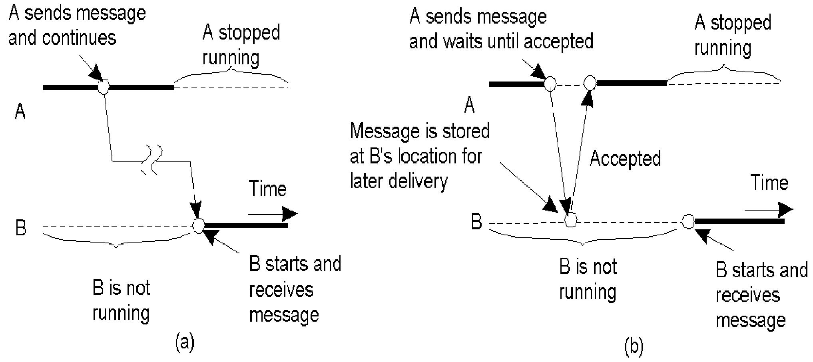

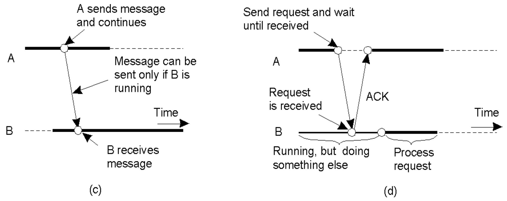

- 基于消息传递的（Delivery-based）瞬时同步通信（e）
- 基于响应的（Response-based）瞬时同步通信（f）

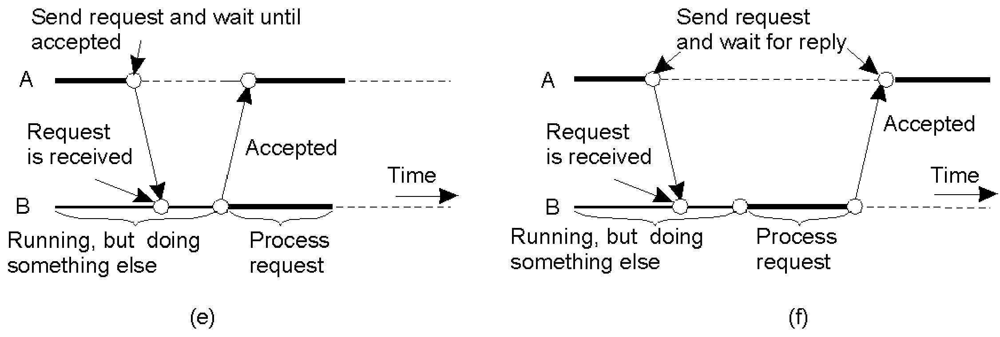

#### [2.3.1] MPI 消息传递接口

Message-Passing Interface

简单来说，这是**超级计算机**（高性能计算）领域最通用的沟通标准。如果说 RMI 是 Java 对象之间的对话，那 MPI 就是成千上万个 CPU 核心之间为了协同工作而进行的对话。

它是干什么的？

- **场景**：专门用于 **高性能计算 (HPC  High-performance Computation)** 和 **多计算机系统**（比如天气预报、核模拟、物理建模）。
- **目的**：让成百上千台计算机（节点）像一台机器一样工作，互相交换数据。

**为何不用TCP/IP**

- 虽然它**可以**跑在 TCP/IP（互联网协议）上，但在超级计算机里，它通常直接运行在**专用的高速网络硬件**上（如 InfiniBand）。这比普通的 TCP/IP 快得多，延迟更低。

**通信方式 (Message-based & Transient)**

- **基于消息（Message-based）**：不像多线程共享内存（Shared Memory），MPI 是一个个独立的进程，A 想要给 B 数据，必须显式地“打包”发过去。
- **瞬时通信 (Transient)**：MPI 是典型的**瞬时通信**。发送方和接收方**必须同时在线配合**。如果接收方没准备好，发送方可能就会堵塞（Block）或者报错，消息不会像邮件一样存在服务器上等。
- **4种形式**：它支持所有瞬时通信的变体（同步/异步，阻塞/非阻塞）。

**复杂但强大**

- 它非常庞大，提供了超过 100 个函数。
- 不仅仅是简单的“发送”和“接收”，还包括高级功能，比如“广播”（Broadcast，一个人发给所有人）、“归约”（Reduce，把所有人的结果汇总计算）等。


> 所有制造超级计算机的大厂（IBM, Intel, Cray 等）都原生支持这个标准。只要写好 MPI 程序，在这些机器上都能运行。


#### [2.3.2] Message Queue

面向消息队列（Message-oriented Queue）唯一的保证是：你的消息最终会进入接收者的 Message Queue！

> 至于什么时候到，不保证。发送者和接收者完全独立，不需要知道对方的死活，甚至不需要知道对方的 IP，只要知道“队列”在哪里就行。
>
> 你甚至可以认为这就是 **Kafka**，但是 Kafka 消费完就删掉了

这是**低耦合（Loosely Coupe）**通信


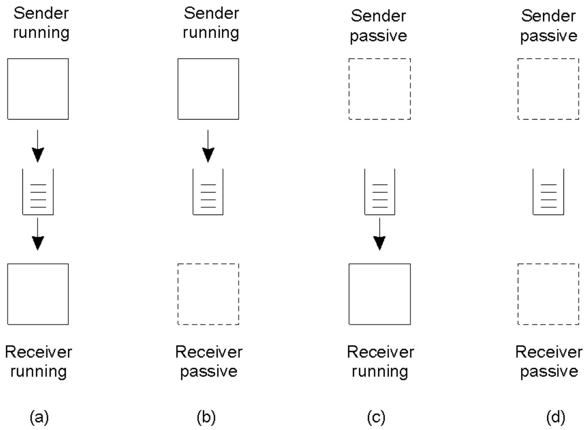


Queue有一些操作，可以参照 Java 的 `Deque` 方法来理解

- `Put`：把一条消息添加到指定的队列**末尾**，这就是 **“发信”**。发送者调用这个方法，把数据扔进队列，然后就可以继续做别的事了（非阻塞）。这是最基础的发送操作。
- `Get`：从队列头部取走第一条消息。如果队列是空的，程序会 **阻塞 (Block)**，也就是一直卡在那里死等，直到有新消息进来为止。
- `Poll`：去检查一下队列头（`queue.pollFirst()`）有没有消息。如果有，就取走；如果没有，**立刻返回**（不等待），程序继续往下执行。
- ` Notify`：不用主动去查，而是安装一个 **处理程序 (Handler/Callback)**。当有新消息进入队列时，系统会自动 **打电话通知** 来处理。最高效的异步处理方式，完全不浪费 CPU 时间去检查空队列。


消息具体是怎么从 A 传到 B 的

参照下图：

程序只需要放入队列，或者从队列`poll`即可。

**队列管理器 (Queue Manager)** 负责把消息从一个队列移动到另一个队列。**两种存在形式**：

1. **直接交互**：它直接和你的应用程序（App）对接，接收你的发信请求。
2. **中继 (Relay)**：它也可以充当“路由器”，只负责把消息转发给下一个管理器，自己不处理业务。

Queue 系统同时维护了一个**地址映射**类似于DNS

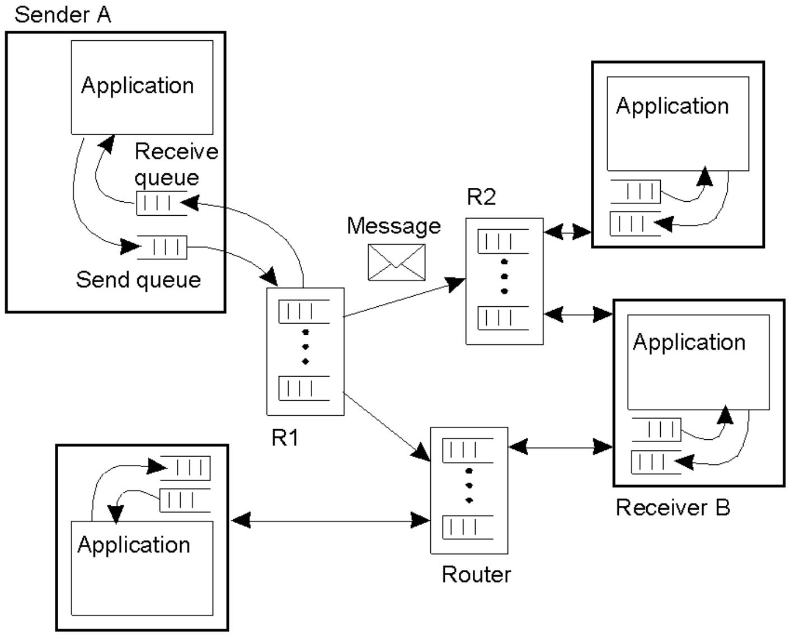


支持  Message Queue 的应用程序很多，例如电子邮件、工作流、批处理（Batch Processing）...

> 最重要的MQ应用领域：将广泛分散的数据库应用程序集合进行集成（这用传统的RPC/RMI技术几乎是不可能实现的）

#### [2.3.3] Message Broker

如果说之前的 **Queue Manager** 只是“快递员”（只负责把包裹送到，不管包裹里是什么），那么 **Message Broker** 就是一个**“翻译官”**或**“加工厂”**。


在理想世界里，所有系统都用同一种语言说话（比如都用 JSON）。但在现实（Distributed Information System）中，我们往往要面对大量的 **遗留系统 (Legacy Systems)**。你不能总是指望“白纸一张 (blank page)”开始写代码，你必须和公司里那些跑了10年的老系统对接。老系统可能用 XML 或古老的二进制格式，新系统用 JSON。强迫老系统改代码去适应新标准太贵、太麻烦了。


 解决方案：Message Broker（消息代理）

为了解决上述问题，我们引入了 **Message Broker**。

- **核心职责**：它的工作不仅仅是转发消息，而是要**转换 (Convert)** 消息格式。
- **目标**：把发来的消息，“翻译”成接收方能看懂的格式。


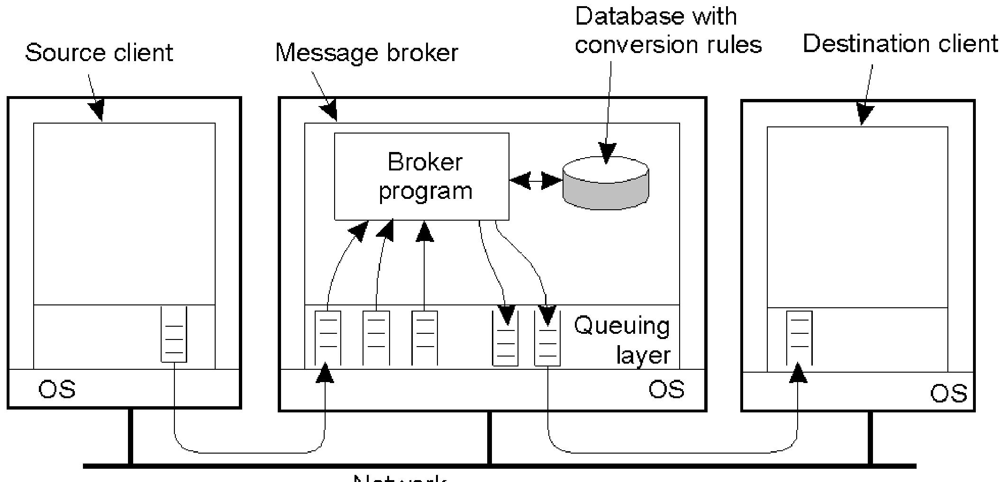


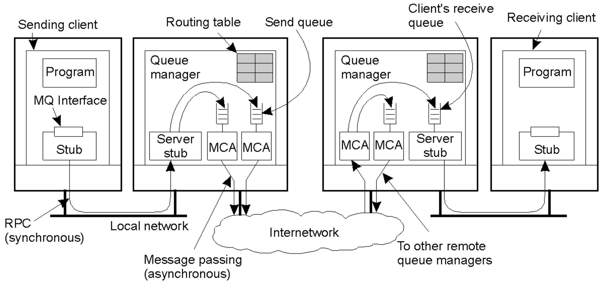


## [3] 流通信

之前的 RMI 和 消息队列（Message Queuing）关注的是 **“数据的正确性”**（数据发过去就行，早一秒晚一秒没关系）。 

而流式通信（如视频会议、直播）关注的是 **“时间的正确性”**（数据必须按时到达，晚了就没用了）。

**核心挑战：时间就是一切 (Timing is crucial)**

> 如果你下载一个文件（异步），快一点慢一点无所谓，最后文件完整就行。
>
> 但在看直播时，如果第30帧画面比第29帧晚了1秒才到，画面就会卡顿。音频如果晚了，声音就会变调或听不清。

PPT 区分了三种数据传输的方式，**只有最后一种适合流媒体**：

- **异步 (Asynchronous)**：完全不管时间，只管传。比如发邮件、下载文件。

- **同步 (Synchronous)**：规定了一个**最大**延迟。只要不超过这个时间就行，但可能会忽快忽慢。

- **等时/同步 (Isochronous) —— 重点！**

  - **定义**：数据必须**准时**到达。

  - **特点**：既有**最大**延迟限制，也有**最小**延迟限制。这被称为 **“有界抖动” (Bounded Jitter)**。

  - 这是流媒体系统（Multimedia Systems）必须具备的能力。


### [3.1] 简单流 vs. 复杂流

**简单流**：只有一种数据序列，比如单纯的语音通话（只有声音）。

**复杂流**：由多个相关的流组成。

- **例子**：一部电影 = 1个视频流 + 2个音频流（立体声） + 1个字幕流。
- **难点**：**同步 (Synchronization)**。你必须确保嘴型（视频）和声音（音频）对得上（Lip-sync）。如果处理不好，就会出现“声画不同步”的问题。


### [3.2] 服务质量 (QoS) 与 缓冲 (Buffering)

为了保证流媒体流畅，系统需要保障 **QoS (Quality of Service)**。其中最常用的手段是 **缓冲 (Buffering)**。

**问题：抖动 (Jitter)**

- 网络是不稳定的。有时候数据包来得快（1ms），有时候来得慢（100ms）。这叫“抖动”。

**解决：缓冲区 (Buffer)**

- **原理**：看最后一张图的下方。
  - 数据包像乱序的雨点一样到达（Packet arrives at buffer）。
  - 我们先把它们存在一个“水桶”（Buffer）里。
  - 然后按照固定的匀速从“水桶”里拿出来播放（Packet removed from buffer）。

**代价 (Trade-off)**：

- **延迟 (Initial Delay)**：为了填满这个“水桶”，你在点击播放后，必须等几秒钟（Loading...），视频才会开始。
- **规律**：Buffer 越大，抗抖动能力越强（越不容易卡顿），但其实始等待时间（延迟）越长。

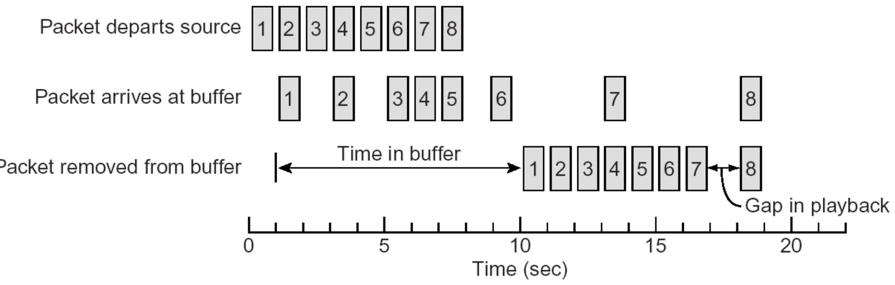


### [3.3] 丢包问题

网络是**不可靠的（Best-effort service）**，传输过程中经常会丢包。既然丢包无法避免，我们就要想办法**让丢包看起来不那么明显**。

图中有两种传输策略的对比：

**策略 (a)：顺序发送 (The Bad Way)**

- **做法**：按顺序发送数据包 1, 2, 3, 4...。
- **后果**：如果网络抖动，连续丢失了一组包（比如 9, 10, 11, 12）。在接收端，你会发现**连续的一大段时间**（Gap of lost frames）是空白的。
- **体验**：看视频时突然卡住两秒，或者黑屏，体验很差。

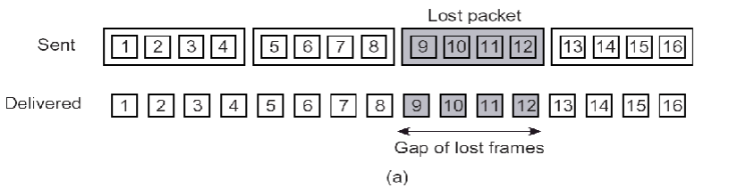

**策略 (b)：交错发送 (The Smart Way / Interleaving)**

- **做法**：打乱顺序发送。比如先发 1, 5, 9, 13，再发 2, 6, 10, 14...。
- **后果**：假设还是那一瞬间网络不好，丢了一组包（3, 7, 11, 15）。但当接收端把数据重新排列还原后，你会发现丢失的帧是**分散的**（Lost frames are scattered）。
- **体验**：虽然也丢了数据，但只是每一帧里少了一点点信息（比如画质稍微模糊了一点点），但视频**不会卡顿**，人眼几乎察觉不到。这叫“平滑了错误”。

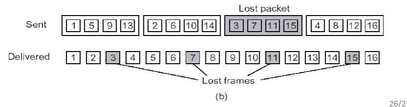

分布式系统里怎么传数据，取决于你的需求。

- 要马上结果？用 **RMI**。

- 要解耦、削峰？用 **MOM (Kafka)**。

  > 削峰就是**把瞬间爆发的巨大流量先存起来，然后再让后台系统按照自己能承受的速度慢慢处理。**

- 要传音视频？用 **Streams**。


## [4] 代码迁移

传统的分布式系统（像之前的 RMI）通常是“**传数据**”（把数据搬来搬去），而代码迁移是“**传代码**”（把程序逻辑搬到另一台机器上去运行）。

### [3.1] 为什么要迁移代码

虽然迁移代码可能很麻烦且开销大，但最大的理由是 **为了更好的性能 (Better Performance)**。

- **负载均衡**：如果这台机器忙不过来了（Heavily loaded），就把计算任务（代码）扔到另一台比较闲的机器（Lightly loaded）上去跑。

### [3.2] 代码迁移的两种典型场景

PPT 举了两个方向相反的例子，核心逻辑都是 **“谁离资源近，就让谁处理”**：

- **客户端 -> 服务器 (Client to Server)**：
  - **场景**：处理大量数据。
  - **例子**：假设服务器有一个巨大的数据库。如果想分析数据，把整个数据库下载到客户端再分析太慢了（网络传输太贵）。
  - **做法**：把分析代码（客户端的一部分）发送给服务器，在服务器本地跑。
  - **好处**：**移代码不移数据**。代码通常很小，数据很大，这样省带宽。
- **服务器 -> 客户端 (Server to Client)**：
  - **场景**：用户交互与验证。
  - **例子**：网页表单验证（JavaScript）。
  - **做法**：服务器把验证逻辑（代码）发给浏览器，用户填完表单直接在本地检查（比如“密码必须大于8位”）。
  - **好处**：**减少服务器打扰**。不用每次填错都发请求给服务器，减轻服务器压力，用户响应也更快。


## [5] 架构与进程

### [5.1]  客户端-服务器模型基础

我们都知道这个模型！

服务器的处理方式：

- **迭代式 (Iterative)：**一次只处理一个请求，处理完才接下一个（串行）。
- **并发式 (Concurrent)：**主服务器进程只负责接收请求，然后创建子线程或子进程去处理，主进程立刻去接下一个请求（并行）。


状态管理：

- **无状态 (Stateless)：**不保存客户端信息（如 Web 服务器），容易实现但功能受限 。
- **有状态 (Stateful)：**保存客户端信息（如文件服务器保存打开的文件状态），性能好但崩溃恢复难 。


### [5.3]  两层架构演变为三层架构

**典型的三层架构模型 ：**

- 用户界面层 (User-interface level)：直接和用户交互 。 **前端**
- 处理层 (Processing level)：核心业务逻辑 。 **后端**
- 数据层 (Data level)：维护持久化数据（数据库）。 **数据库**


两层架构 (Two-tiered)：仅仅讨论了**客户端**和**服务器**如何分配这三层功能。

- 
  瘦客户端 (Thin Client)：客户端只负责显示，逻辑都在服务器（图a-c），**客户前端，服务器后端、数据库**

- 
  胖客户端 (Fat Client)：客户端负责大部分应用程序逻辑，服务器只负责数据库（图d-e）。**客户前端、后端，服务器数据库**

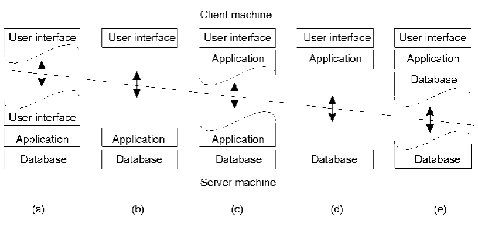


两层架构后面演变成**三层架构（Three-tiered Architecture）**

- **第一层：用户界面层 (User-interface Level)**

  > 变回了“瘦客户端”，只负责画面的展示（User Interface presentation） 。比如浏览器，它不处理复杂的计算，只负责显示 HTML。

- **第二层：处理层 (Processing Level)** —— **这是新增的核心层**

  > 你的淘宝购物车结算逻辑、银行转账的校验逻辑，都跑在这里。它接收客户端的请求，计算完后，如果有需要存取数据，再去麻烦第三层。

- **第三层：数据层 (Data level)**

  > 只负责**原始数据** (Raw data) 的存储和查询 。它不再关心业务逻辑，只管读写硬盘

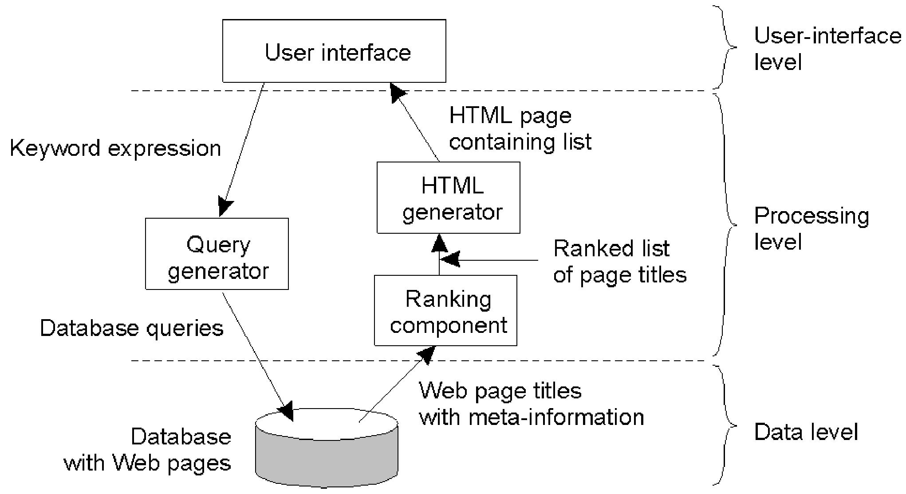


### [5.4] 多层架构

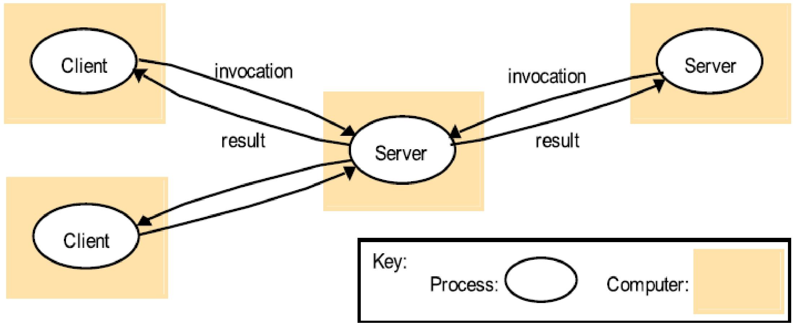


Cooperating Servers 

协作服务器架构

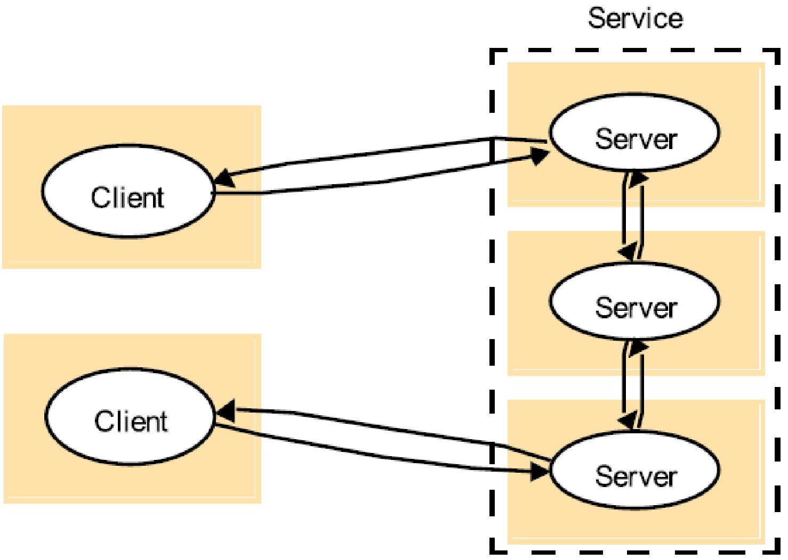

---


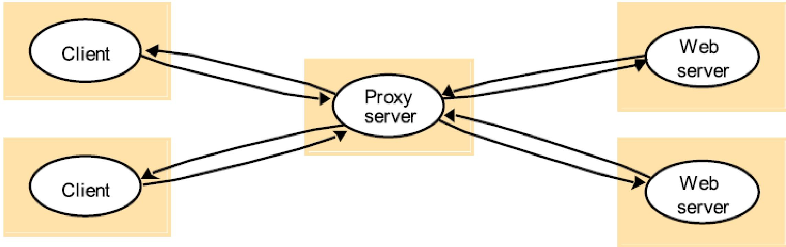


### [5.5] 逻辑拆分

简单来说，就是当一台机器干不过来的时候，你应该怎么加机器。

#### [5.5.1] 垂直分布

Vertical Distribution

**核心逻辑**：**按功能拆分** (Functional Splitting)。

把系统中**不同职责**的部分，放在不同的机器上跑。这其实就是刚才的 **“三层架构”**。

- 机器 A 专门负责显示（Client）。
- 机器 B 专门负责计算（App Server）。
- 机器 C 专门负责存数据（DB Server）。

> **比喻**：一家餐厅里，有人专门切菜，有人专门炒菜，有人专门端盘子。大家分工不同，配合完成工作。

#### [5.5.2] 水平分布

**核心逻辑**：**按数量拆分/复制** (Replication / Sharding)

**解释**：当垂直拆分后，如果负责计算的机器 B 还是忙不过来怎么办？那就搞 10 台一模一样的机器 B，大家一起干**同样的事**。

- 这就叫 **==集群 (Clustering)==** 或者 **服务器农场 (Server ==Farms==)**。

  > 比如我们学校的`lxfarm`

- 或者把大数据切成小块（Sharding），每台机器只处理其中的一部分数据（比如 P2P 下载）。

> **比喻**：超市的收银台。如果一个收银员忙不过来，就多开几个收银台。所有收银员做的工作是**完全一样**的，只是为了分担人流。


因此，现代架构长这样

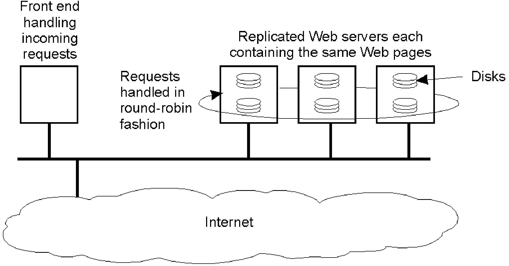

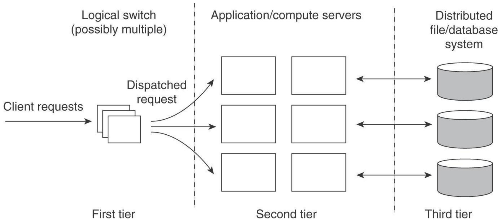


### [5.5] 其他架构

我们知道了P2P，这个省略


**网页小程序**

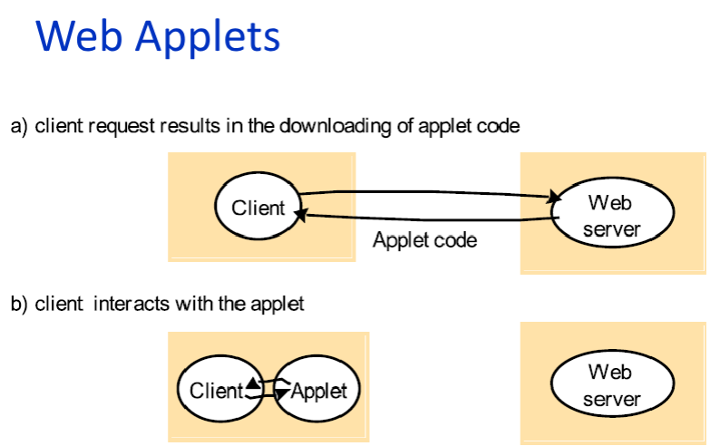


# 分布式系统 - 命名技术

分布式系统中，如何对资源进行标记和定位？：**标识符（Identifiers）**、**名字（Names）和统一资源定位符（URL）**！

## [1] 标识符、名字、URL

标识符 (Identifiers) ：**标识符是给计算机看的**，它是最严格的一种命名方式。它具有以下三个核心特性

- **唯一性 (One-to-one mapping):** 一个标识符只对应一个实体，一个实体也只有一个标识符。
- **不可重用 (Never reused):** 就算原来的实体消失了，这个标识符也不会分给别人。它永远指向同一个东西。
- **可寻址性:** 它通常可以被转换成对象的物理地址（内存地址或磁盘位置）。
- **例子:** **NFS 文件句柄:** 计算机内部用来找文件的长字符串。
  - **Java RMI 引用:** 远程调用对象时使用的唯一 ID。


名字 (Names)：名字是给人看的，通常是易读的字符串。它比标识符更灵活，可以想象成网址，或者路径！

- **解析 (Resolution):**  Names不能直接定位资源，必须通过“名字服务”（如 **DNS**）转换成标识符或地址。
- **延迟绑定 (Deferred Binding):** 例如 `www.liverpool.ac.uk`，即使学校更换了服务器硬件或改变了 IP 地址，这个 Names 依然有效。
- **更具意义:** 对人类友好，比如 `/etc/passwd` 比一串十六进制数字好记多了。
- **例子:** 域名（https://www.google.com）、文件路径、进程号。

名字解析过程：

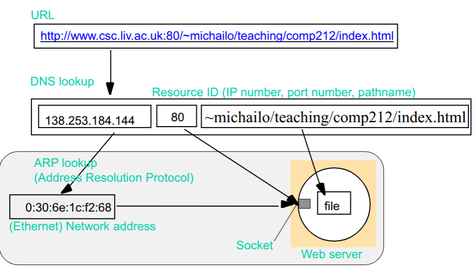


统一资源定位符 (URL) ：URL 是互联网上最常见的资源标识方式，它结合了协议和位置

**类型化:** 头部指明了访问协议（如 `http`, `ftp`, `nfs`）。

**服务特定:** URL 的一部分取决于具体的服务逻辑（比如特定的网页路径）。

**局限性:** 资源不能在域（Domains）之间移动。这意味着如果你的资源从 `a.com` 搬到了 `b.com`，原有的 URL 就失效了。


域名（Domain Name）是 URL 的核心组成部分之一，他们存在重叠！


## [2] 命名空间和命名图

Namespaces and Name Graphs

命名空间是名字的集合。它的存在是为了解决以下问题：

- **避免冲突 (No Clashes):** 就像两个班级里都可以有一个叫“小明”的学生，只要加上班级前缀（命名空间），就不会找错人。
- **结构化 (Structured):** 允许将相关的名字分组。
- **灵活性:** 即使底层结构变了（比如服务器搬迁），只要名字的层级关系不变，旧的程序依然能通过原有的名字找到资源。
- **管理信任:** 不同的命名空间可以由不同的机构管理（比如 `.edu` 由教育机构管理，`.com` 由商业机构管理）。


命名图 (Name Graphs) ：

为了在计算机里实现命名空间，我们使用一种数据结构：**有向图（Directed Graph）**。它主要由两种“节点”组成：

- **叶子节点 (Leaf Nodes):** 真正的资源。它存储的是关于实体的具体信息（比如文件内容、IP 地址）。它没有往外的箭头了。
- **目录节点 (Directory Nodes):** 相当于“文件夹”。它不存资源，只存一系列**带标签的边（Edges）**。这些边指向其他的目录节点或叶子节点。


关键概念：路径 (Path)

- **根节点 (Root Node):** 整个命名空间的起点。
- **绝对路径 (Absolute Path):** 从根节点开始的完整路径（如 `/etc/passwd`）。
- **相对路径 (Relative Path):** 从当前所在目录节点开始的路径。


经典例子：文件系统 (File Systems)！文件系统是命名图最直观的体现：

- **`/` (根目录)** 是 Root Node。
- **文件夹** 是 Directory Nodes。
- **具体的文件** 就是 Leaf Nodes。

## [3] 名字变体和挂载

Naming Variation and Mounting

### [3.1] 名字变体

**全局 vs 本地**

| **维度**     | **全局名字 (Global Name)**             | **本地名字 (Local Name)**                |
| ------------ | -------------------------------------- | ---------------------------------------- |
| **解释基准** | 始终相对于同一个**全局根节点**         | 取决于该名字**在哪里**被使用             |
| **一致性**   | 无论调用者身处何处，指向的实体永远相同 | 指向的实体随上下文、位置或用户而变       |
| **透明度**   | 高（位置无关性）                       | 低（位置依赖）                           |
| **典型例子** | `http://www.liverpool.ac.uk`           | `localhost`、`~/Documents`、`./temp.txt` |


命名图的形态

- **树状 (Tree):** 最基础的分层结构。
- **有向无环图 (DAG):** 允许一个节点有多个“父节点”，即**一个资源可以有多个路径（名字）指向它**（类似 Linux 中的硬链接）。


### [3.2] 命名空间的合并：挂载

Mounting

在分布式系统中，资源散落在不同的服务器上。为了让用户感觉像是在操作一个统一的系统，我们需要把“别人的”命名空间整合进“我的”命名空间里。这个过程叫**挂载（Mounting）**。

- **挂载点 (Mount Point):** 在本地命名空间里的一个普通目录节点。
- **挂载协议:** 它不仅仅是一个名字，它还存储了连接远程资源所需的所有“情报”。


当你尝试访问一个挂载的远程目录（例如笔记中的 `nfs://flits.cs.vu.nl//home/steen`）时，系统需要解析以下信息：

1. **访问协议 (Access Protocol):** 告诉系统用什么语言说话。例如 `nfs`（网络文件系统）。
2. **服务器名称 (Server Name):** 告诉系统去哪台机器找。例如 `flits.cs.vu.nl`，这会被解析成一个 IP 地址。
3. **挂载点名称 (Mounting Point):** 告诉远程服务器，你想访问它那里的哪个节点。例如服务器上的 `/home/steen`。


如下图是NFS协议的挂在过程

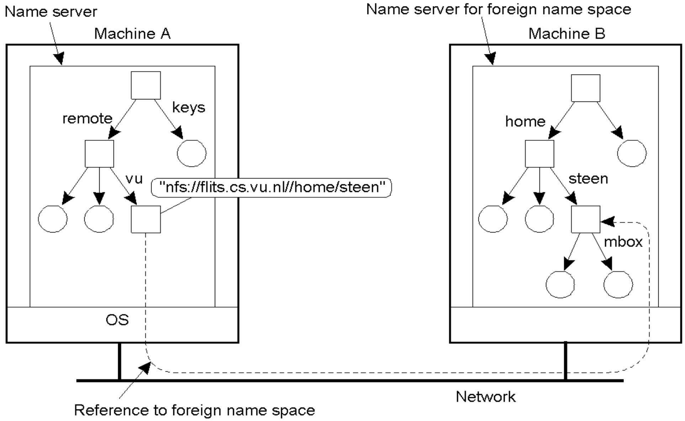


为什么要 Mounting？我们不可以直接单中心服务器吗？

想象一下，如果全球几十亿人上网查网址，都要去问同一台位于美国的超级电脑：

- **单点故障 (Single point of failure):** 如果这台电脑坏了、断网了或者着火了，全球互联网瞬间瘫痪。
- **流量爆炸 (Traffic volume):** 这一台机器根本处理不了全球每秒钟数亿次的查询请求。
- **距离带来的延迟 (Performance):** 你在利物浦（Liverpool）发个请求给美国的服务器，由于物理距离，网页加载会非常慢。
- **维护困难 (Maintenance):** 全球每秒都有新网站诞生或 IP 变更，单台机器的数据库根本更新不过来。
- **不可扩展 (Doesn’t scale):** 互联网还在长大，单台机器的硬件提升总会有极限。


那么，理想的名字服务器应该是什么样？

为了解决上面的问题，互联网名字服务（如 DNS）采用了**分布式**的设计方案：

- **可扩展性 (Scalability):** 增加更多的用户和服务器，系统性能不会大幅下降。
- **去中心化维护 (Decentralised maintenance):** 利物浦大学维护自己的域名服务器，Google 维护自己的，大家各管各的，最后拼成一个整体。
- **鲁棒性与容错性 (Robustness, fault-tolerance):** 挂掉几台服务器，剩下的依然能工作。
- **全局范围 (Global scope):** 就像之前提到的 **Global Name**，无论你在哪，查询 `liverpool.ac.uk` 得到的结果必须是一致的。


## [4] DNS

我们已经学过DNS是什么了，Domain Name System，现在再回顾一次！

DNS 是一套分布式的“基础设施”，我们可以从三个层面来简要理解DNS

### [4.1] DNS 结构

#### [4.1.1] DNS 结构

结构：**分层的分布式数据库**

DNS 像“金字塔”一样分层管理。

- **顶级是根服务器**，下面是管理 `.com` 或 `.uk` 的服务器，再往下是具体机构（如利物浦大学 `liv.ac.uk`）的服务器。
- 这种结构实现了笔记中提到的**可扩展性**：如果要增加一个新的域名后缀，只需要在相应层级加一台服务器，而不需要改动整个互联网。

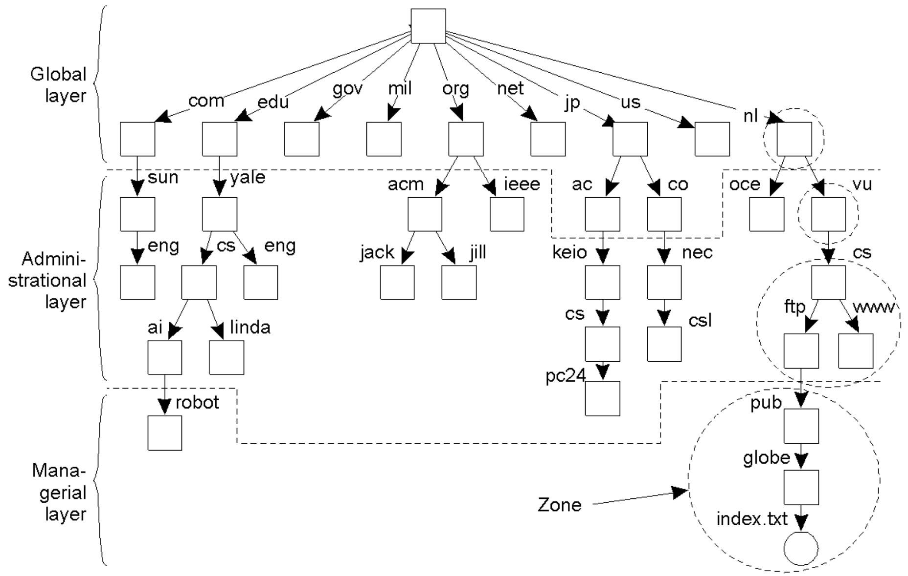

#### [4.1.2]  DNS 管理

管理：去中心化 (Decentralised)

- **谁产生数据，谁负责：** 利物浦大学的 IT 部门负责维护 `www.liverpool.ac.uk` 指向哪个 IP，而不需要向全球互联网总部申请。
- 这种**分散控制**保证了信息更新的效率，没人能掌控整个互联网的命名权。


#### [4.1.3] DNS 技术

技术：应用层协议 (Application-layer Protocol)

这是考试常考的一个点：虽然 DNS 是互联网的“核心功能”，但它运行在 **OSI 模型的应用层**。

- **运作方式：** 你的浏览器（作为 Host）通过特定的“暗号”（DNS 协议）向域名服务器发消息：“嘿，帮我翻译一下这个名字。”
- **依赖：** 它通常使用 UDP 协议（53端口）进行快速查询。回顾计算机网络，DNS就是使用UDP而不是TCP的！


### [4.2] DNS 分类

DNS 系统不是平级的，而是有等级制度的：

**权威名称服务器 (Authoritative Name Servers):**  **真相的来源：** 

- 它们存储了数据库的实际部分。对于某个特定的主机（比如 `www.liverpool.ac.uk`），权威服务器手里攥着它的 **IP 地址**。

- **翻译官：** 它们直接负责把名字翻译成地址，并回答针对该主机的查询。

**根名称服务器 (Root Name Server):**

- **总指挥部：** 它位于分层结构的顶端，知道针对特定子域名（如 `.com` 或 `.uk`）的权威服务器在哪里。
- **控制权：** 当你注册一个域名时，本质上是在根服务器中获得了一个条目，从而能够控制该名称的解析指向。


### [4.3] DNS 查找

DNS Loopup

这是考试中的高频考点，核心区别在于**“谁来跑腿”**


第一种，迭代查询 (Iterative Name Resolution) 

- **逻辑：** 客户端（Client）问服务器 A，服务器 A 说：“我不知道这个名字，但你可以去问服务器 B，这是它的地址。”
- **特点：** 服务器只给出它已知的信息（即下一个该联系谁）。
- **责任：** **客户端**比较累，需要根据拿到的地址一个一个亲自去问，直到找到答案。

> 踢皮球
>


第二种，递归查询 (Recursive Name Resolution) 

- **逻辑：** 客户端问服务器 A，服务器 A 会说：“你等下，我帮你去问。” 然后 A 会代替客户端去问 B、C、D。
- **特点：** 只给客户端返回最终结果（要么是 IP，要么是“没找到”）。
- **责任：** **服务器**比较累，查询的重担（Burden）完全在被联系的服务器身上。

递归查询在线路比较长的时候占有优势！！


#### [4.3.1] 小实验

我们可以使用（Ubuntu.Linux）终端来看一下效果。因为我们使用的是校园网，我们必须先解析校园内网的DNS服务器地址！

```bash
~$ resolvectl status | grep "DNS Servers"
       DNS Servers: 138.253.110.104 138.253.110.103
```


然后，我们使用该DNS，去连接`google.com`

```bash
~$ dig @138.253.110.104 google.com

; <<>> DiG 9.18.39-0ubuntu0.24.04.2-Ubuntu <<>> @138.253.110.104 google.com
; (1 server found)
;; global options: +cmd
;; Got answer:
;; ->>HEADER<<- opcode: QUERY, status: NOERROR, id: 56422
# opcode: QUERY: 操作码。表示这是一次标准的查询请求。
# status: NOERROR: 响应状态。表示查询非常成功。
# id: 56422: 事务 ID。
# 由于 DNS 通常使用无连接的 UDP 协议，客户端通过这个 ID 来匹配“哪个回包”对应“哪个发包”。这确保了在并发请求时的唯一性。
;; flags: qr rd ra; QUERY: 1, ANSWER: 6, AUTHORITY: 0, ADDITIONAL: 1
# qr (Query Response)：代表这是一个响应包。
# 这里的 rd 就是 recursion desired表示电脑希望请求递归查询
# 这里的 ra 就是 recursion avaliable 代表能够使用递归查询！！
# Answer 6 就是找到了6个分布服务器

;; OPT PSEUDOSECTION:
; EDNS: version: 0, flags:; udp: 1220
; COOKIE: b2cc96c1a27503e30100000069a184d6ef569591f7f93f90 (good)
;; QUESTION SECTION:
;google.com.			IN	A

;; ANSWER SECTION:
google.com.		255	IN	A	142.250.140.138
google.com.		255	IN	A	142.250.140.139
google.com.		255	IN	A	142.250.140.100
google.com.		255	IN	A	142.250.140.101
google.com.		255	IN	A	142.250.140.102
google.com.		255	IN	A	142.250.140.113
# 返回了 6 个不同的 IP 地址
# 为什么会有多个地址？这是为了负载均衡和鲁棒性 (Robustness)。
# 如果其中一个 Google 服务器宕机，你的电脑可以尝试列表中的其他地址，避免单点故障。

;; Query time: 15 msec
;; SERVER: 138.253.110.104#53(138.253.110.104) (UDP)
;; WHEN: Fri Feb 27 11:49:42 GMT 2026
;; MSG SIZE  rcvd: 163

```


### [4.4] DNS 缓存TTL技术


|                                 | **作用与原理**                                         | **控制台输出**                                            | **分布式系统意义**                   |
| ------------------------------- | ------------------------------------------------------ | --------------------------------------------------------- | ------------------------------------ |
| **缓存命中 (Cache Hit)**        | 服务器直接从内存返回重复查询的结果，无需再次全球寻址。 | `Query time: 11 msec` (极快) 且包含 `ANSWER SECTION`。    | 提高**可扩展性**，减轻根服务器压力。 |
| **TTL (生存时间)**              | 由数据所有者控制的倒计时，随每条记录发送。             | `google.com. 192 IN A...` (从之前的 `255` 降到了 `192`)。 | 在**性能**与**一致性**之间取得平衡。 |
| **负面缓存 (Negative Caching)** | 记录并缓存失败的查询（如拼写错误），避免重复犯错。     | (模拟) 连续查询 `bilibili.com` 从130ms变为11ms。          | 防止无效流量浪费网络资源。           |
| **陈旧数据 (Stale Data)**       | 在 TTL 归零前，即使原始数据已变，缓存仍提供旧信息。    | 在那 `192` 秒内，你拿到的永远是这 6 个固定的 IP。         | 导致**弱一致性**，更新信息有延迟。   |
| **迭代复用 (NS Reuse)**         | 缓存顶级域（如 `.com`）的服务器位置，加速同类查询。    | `dig +trace` 时，某些中间层解析速度极快。                 | 优化查询路径，复用中间解析成果。     |


### [4.5] DNS 术语

- DNS 中的子树（Subtree）称为域（Domain）

- DNS 中的路径（Path）称为域名（Domain Name）

  > 这两者可以是绝对的（Absolute）也可以是相对的（Relative）

- 除了最底层节点之外，每个节点都运行着一个DNS服务器
- 节点上的信息被组织为**资源记录（Resource Record）**

在DNS命名空间中，构成节点内容（并由服务器维护）的最重要的**==资源记录（Resource Record）类型==**

| **记录类型**                 | **关联实体**  | **描述**                                                     |
| ---------------------------- | ------------- | ------------------------------------------------------------ |
| **SOA** (Start of Authority) | 区域 (Zone)   | **起始授权机构**。存储该 DNS 区域的基础信息（如主服务器、管理员邮箱、序列号等）。 |
| **A** (Address)              | 主机 (Host)   | **地址记录**。将主机名（域名）直接映射到其对应的 **IPv4 地址**。这是最常见的记录。 |
| **MX** (Mail Exchange)       | 域名 (Domain) | **邮件交换记录**。指向负责处理该域名电子邮件的邮件服务器。   |
| **SRV** (Service)            | 域名 (Domain) | **服务记录**。指向处理特定服务的服务器（常用于 VoIP 或活动目录服务）。 |
| **NS** (Name Server)         | 区域 (Zone)   | **名称服务器记录**。指定由哪台 DNS 服务器来解析这个区域。在迭代查询中起“指路”作用。 |
| **CNAME** (Canonical Name)   | 节点 (Node)   | **别名记录**。类似于“快捷方式”或“符号链接”，将一个别名指向其真实（规范）名称。 |
| **PTR** (Pointer)            | 主机 (Host)   | **指针记录**。与 A 记录相反，执行**反向解析**，即通过 IP 地址查询主机名。 |
| **HINFO** (Host Info)        | 主机 (Host)   | **主机信息**。存储关于该主机的硬件和操作系统等说明性信息。   |
| **TXT**                      | 任何类型      | **文本记录**。存储任何有用的文本信息（常用于域名所有权验证、SPF 垃圾邮件防护等）。 |

我们可以在https://mxtoolbox.com/中解析一个网址

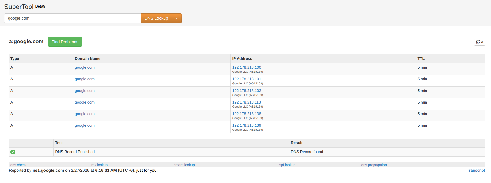


### [4.6] DNS 反向解析

DNS的功能是为计算机解析域名（Domain），从域名获得IP地址，所以DNS才叫做域名系统。


但是DNS也能够反向解析，也就是从IP地址获取域名，让我们尝试一下！


```bash
# 尝试解析google
~$ host 138.253.110.104
104.110.253.138.in-addr.arpa domain name pointer ct-1050-1.liv.ac.uk.

# 尝试解析bilibili
~$ host a.w.bilicdn1.com.
a.w.bilicdn1.com is an alias for i.w.bilicdn1.com.

~$ host i.w.bilicdn1.com.
i.w.bilicdn1.com has address 103.151.151.134
```


## [5] 服务目录

目录服务 (Directory Service)

### [5.1] 什么是目录服务

**定义**：它是网络资源的“**黄页**”（Yellow Pages）。

> “黄页”（Yellow Pages）在网络中是指一种服务：
>
> 允许你通过**描述或属性**（即资源“是什么”或“具有什么特征”）来检索资源的服务，而不仅仅是像 DNS 那样必须通过精确的“名字”来查找地址。
>
> **与 DNS 的区别**：
>
> - DNS 虽然持有部分描述性数据，但不完整。
> - DNS 的组织方式不是为了搜索这些数据而设计的。

**功能**：检索满足给定描述的所有名称集合。

**例子**：X.500、LDAP、微软 Active Directory 服务。


### [5.2] 目录服务 的共同特征

- **层级结构**：所有目录服务都使用**分层结构**来存储网络对象的信息。
- **区分点**：不同实现方式之间的区别在于它们所追踪的**对象类型**不同。

### [5.3] X.500 和 LDAP

| **特性**       | **X.500**                           | **LDAP (轻量级目录访问协议)**    |
| -------------- | ----------------------------------- | -------------------------------- |
| **定义/地位**  | 定义了全球目录服务的**标准框架**。  | 目录服务的**开放标准**和协议集。 |
| **发布机构**   | **ISO** 和 **ITU** (国际电信联盟)。 | 开放标准 (Open Standard)。       |
| **核心用途**   | 用于跨站点排列信息的**编目服务**。  | 用于访问信息目录的**协议集**。   |
| **功能复杂度** | 完整且复杂。                        | 功能比 X.500 **更简单**。        |
| **查询性能**   | 相对较重。                          | **查询更小**，响应时间**更短**。 |
| **网络影响**   | 相对较高。                          | **网络流量更低**。               |


### [5.4] 实现场景

服务目录有什么现实中可以实现的场景和作用呢？

**实际应用：管理大型网络的“救星”**

管理大型计算机网络非常困难，目录服务通过以下方式解决这些“噩梦”：

- **用户管理**：记录用户是谁，以及他们的权限、个人资料和策略。
- **资源管理**：记录有哪些可用资源，例如在不同房间设置不同的默认打印机。
- **应用设置**：存储各种网络设置，如默认网关、邮件服务器和防火墙配置。
- **组织结构**：通过**层级化组织**来管理上述所有信息。


微软 Active Directory (AD) ：这是目前最主流的目录服务实现之一，使用 **LDAP** 向服务器发送查询。


**发现服务 (Discovery Service)**

发现服务是一种更高级的**目录服务**，它具备以下特质：

- **自动更新**：随着网络配置的变化自动更新。
- **即时性**：满足自发性网络（Spontaneous Networks）中客户端的需求。
- **移动支持**：帮助移动中的客户端发现当前范围内的所需服务（例如在酒店找到最适合打印图像的打印机）。
- **例子**：Jini（现名 Apache River）、服务位置协议（SLP）、简单服务发现协议（SSDP，UPnP 的一部分）等。


# 分布式系统 - 同步技术

一般发生在并发时，我们学习数据库的时候也讲过数据库的并发控制

问题：不同计算机时钟读数可能不同，导致不一致的状态

三种解决方案：

1. 时钟同步 Clock Synchronisation 
2. 逻辑时钟 Logical Clocks
3. **Transaction**


## [1] 解决同步问题

根据资源和需求的不同，有三种经典算法：

| **场景**              | **推荐算法**                                                 |
| --------------------- | ------------------------------------------------------------ |
| **有 UTC 时间服务器** | **Cristian 算法** (1989)：客户端向 UTC 服务器请求时间。时钟同步算法 |
| **没有 UTC 源可用**   | **Berkeley 算法**：多台机器之间互相协调，达成一个平均时间的共识。时钟同步算法 |
| **准确时间并不重要**  | **Lamport 算法**：**不关心几点几分，只关心事件发生的先后顺序（逻辑时钟）。**逻辑时钟算法 |


### [1.1] 时钟同步

**事件追溯**：记录某个事件在计算机上发生的具体时间。

**时钟同步算法的应用**：

- **并发控制**：基于时间戳排序（Timestamp Ordering）来管理多个操作的执行顺序。
- **请求真实性**：例如在 Kerberos 协议中，利用时间戳验证请求是否合法且未过期。

**核心挑战：时钟偏移**

- **独立性**：分布式系统中的每台计算机都有自己独立的内部时钟。
- **必然误差**：即使最初将所有计算机的时钟都设置为相同时间，随着时间推移，它们的读数最终也会产生显著差异，除非进行持续的修正。


在单处理器系统中，时间很容易确定；但在分布式系统中，让所有机器达成时间共识并非易事。

由于时钟偏移的存在，多台计算机通常不会拥有完全相同的当前时间值。

**测量难题**：实际上，人类直到 1958 年 1 月 1 日（所谓的“时间起点”）才开始利用全球原子钟精确测量时间。


**世界标准时间 (UTC)**

UTC 是目前计算机进行时间同步的国际标准。它基于精度极高的**国际原子时间**（漂移率仅为 $10^{-13}$），并根据天文时间进行偶尔调整。通过陆地无线电台和卫星（如 GPS）进行广播。当然GPS误差更小。


#### [1.1.1] Cristian算法

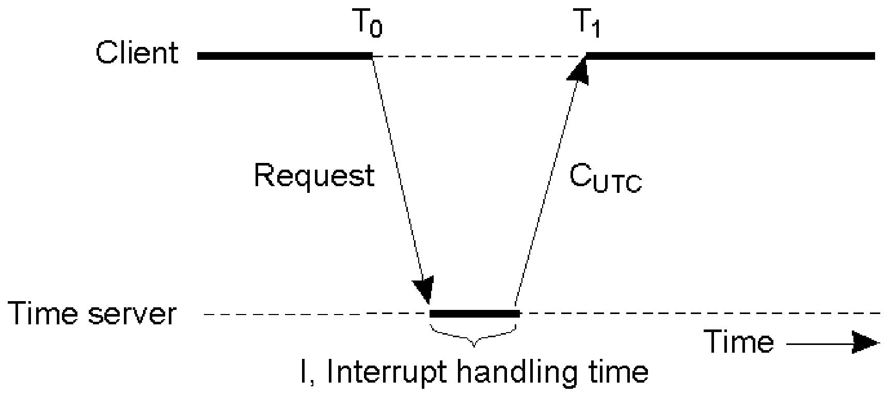


1. 每台计算机都会定期向“时间服务器”请求当前时间
2. 服务器会尽快返回当前时间\(C_{UTC }\)
3. 客户端将其时钟设置为\(C_{UTC }\)


主要问题：如果时间服务器的时间比客户端的时间晚，**会导致客户端的时间倒流！（**这是不可能发生的——时间不会倒流。）

当然，解决这个问题可以使用一些校准的计算...


#### [1.1.2] Berkeley 算法

**Berkeley 算法**是一种在**没有外部准确时间源（如 UTC）**的情况下，让一组计算机达成“内部时间共识”的经典算法


角色分配：系统在计算机群组中指定一个节点为**主节点 (Master)**，其余节点为**从节点 (Slaves)**。

三步走核心流程：

第一步：主节点定期向所有从节点发送请求，询问它们的当前时间。

- **补偿延迟**：主节点会测量消息的**往返时间 (Round Trip Time, RTT)**，以此来估算从节点在收到请求那一刻的真实时钟值。

第二步：主节点获取所有节点的时钟后（包括它自己的），计算这些时间的**算术平均值**。

- 注意：为了防止极个别时钟故障（走得太快或太慢）干扰整体，算法通常会剔除那些偏差过大的数值。

第三步：**这是 Berkeley 算法最聪明的一点**，主节点不发送“现在是几点”，而是发送**每个从节点需要调整的差值**。

- **原因**：发送具体的“时间点”会再次受到网络传输延迟的影响，而发送“你的表慢了 2 秒，请调快”这种**相对调整值**更加精准。


容错机制 (Fault Tolerance)：**主节点失效**...如果主节点宕机，剩余的从节点会通过**选举 (Election)** 产生一个新的主节点来接管同步工作。这保证了分布式系统的稳健性。


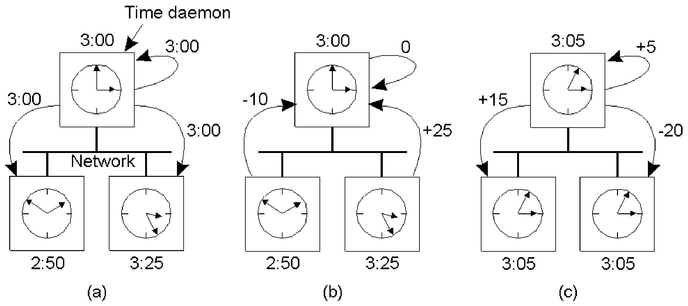


#### [1.1.3] 其他算法

Cristian 和 Berkeley 算法都是**集中式算法（Centralised Algorithm）**！

那必然也有去中心化的算法，例如NTP，也就是互联网的网络时间协议（Internet's **N**etwork **T**ime **P**rotocols）

NTP 可以将时钟同步到 1-50 毫秒的精度范围内，这也是去中心化算法中应用最广泛的算法。


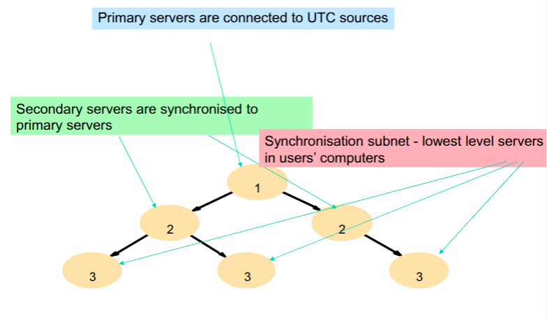

### [1.2] 逻辑时钟

逻辑时钟是基于**相对时间的同步**，请注意，（通过这种机制）相对时间无需与实时时间有任何关联！既然是相对的，可以认为**现在**就是时间起点！

重要的是，分布式系统中的各个进程要就某些事件发生的顺序达成一致，所以真的时间不重要，时间只是一个工具而已，这种“时钟”被称为逻辑时钟。


但是可能存在的问题：即使时钟已同步，由于网络延迟，更新也可能以不同的顺序到达

#### [1.2.1] Lamport 算法

Lamport 定义了三条简单的规则来确定事件的先后：

- **进程内顺序**：如果 A 和 B 在同一个进程中，且 A 先于 B 发生，则 $A \to B$。
- **消息传递**：如果 A 是发送消息的事件，B 是接收同一消息的事件，则 $A \to B$（因为消息不可能在发送前被接收，且传输需要时间）。
- **传递性**：如果 $A \to B$ 且 $B \to C$，那么 $A \to C$。


**解决“时间倒流”问题：**

在分布式系统中，如果进程 A 发送消息时带上的时间戳比进程 B 接收时的本地时间还要大，逻辑上就会出现“发送晚于接收”的矛盾，这是不允许的。

**Lamport 的解决方案**：

- 当进程接收到消息时，如果消息的时间戳大于或等于本地时间，接收进程必须**将自己的时钟向前调**，设置为“发送时间戳 + 1”。
- **结果**：这保证了“Happened-Before”关系在逻辑上成立，并使所有时钟相对于彼此保持同步状态。


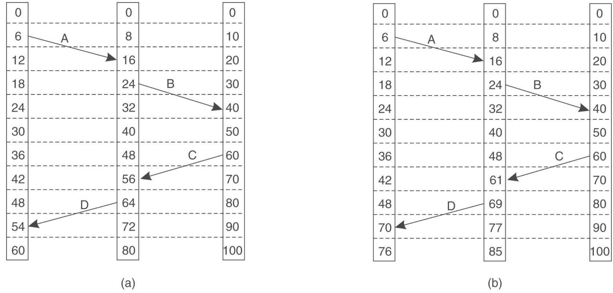


如何利用 **Lamport 逻辑时钟** 实现分布式系统中的**全序多播（Totally-Ordered Multicast）**，确保所有接收者以完全相同的顺序处理消息

什么是劝序多播：一种多播操作，要求所有消息以**相同的顺序**交付给每一个接收者。

**核心难点**：在分布式系统中，由于网络延迟，不同服务器（如服务器 A 和 B）接收消息的物理顺序可能相反（A 先收到 m1，B 先收到 m2）。


为了达成共识，系统采用了以下机制：

- **打时间戳**：每条消息都带上发送者的当前**逻辑时间**作为时间戳。
- **本地队列**：接收进程将收到的消息放入一个按**时间戳排序**的本地队列中。
- **假设前提**：假设同一发送者发出的消息按序到达，且消息不会丢失。


只有当满足以下条件时，消息才会从队列提交给应用程序执行：

- **全员确认 (ACK)**：接收者收到消息后，向所有其他进程发送 ACK。
- **队列头部**：该消息必须位于本地队列的头部。
- **确认完毕**：该消息已被所有参与进程确认（ACK 的时间戳需大于消息时间戳），确保不会再有时间戳更小的“早前消息”由于网络延迟而迟到。


**全序多播（Totally-Ordered Multicast）**是如何通过“等一等”来达成一致的，我们把这个过程拆解为四个逻辑阶段。

> [!NOTE]
>
> #### [1] 初始阶段：带着“编号”出发
>
> 假设有两个客户端同时发送消息：
>
> - **客户端 1** 发送消息 $m1$，带有逻辑时间戳 $10$。
> - **客户端 2** 发送消息 $m2$，带有逻辑时间戳 $11$。
>
> #### [2] 接收阶段：由于网络延迟产生的“混乱”
>
> 在分布式系统中，网络是不稳定的。这导致了服务器看到的顺序不一样：
>
> - **服务器 A**：先收到 $m1$，后收到 $m2$。
> - **服务器 B**：先收到 $m2$，后收到 $m1$。
>
> **关键动作**：服务器收到消息后，**不会立即执行**，而是将其放入一个**本地队列**，并严格按照时间戳（$10 < 11$）进行排序。
>
> - 此时，**两台服务器的本地队列顺序都会变成 [$m1, m2$]**。
>
> #### [3] 确认阶段：交换“我看过了”的证明
>
> 为了确保没有更早的消息在路上（比如一个时间戳为 $9$ 的消息还没寄到），服务器之间必须交换确认信息（ACK）：
>
> - **服务器 A** 向所有人（包括自己）多播针对 $m1$ 和 $m2$ 的确认。
> - **服务器 B** 同样向所有人多播针对 $m1$ 和 $m2$ 的确认。
>
> #### [4] 交付阶段：满足两个条件才能执行
>
> 这是最关键的一步。只有当某个消息满足以下**两个硬性条件**时，服务器才会把它交给应用程序执行：
>
> 1. **它位于队列的最前端**：目前是 $m1$。
> 2. **它已经获得了所有参与者的确认**：服务器 A 必须收到来自服务器 B 的关于 $m1$ 的确认；服务器 B 也要等到 A 的确认。


# 分布式系统 - 容错

Fault Tolerance

容错性：系统能够掩盖故障的发生和恢复过程的特性。如果一个系统在出现故障时仍能继续运行，那么它就是具有容错能力的。


容错和可靠性（Dependability）密切相关！要让一个数据库系统有可靠性，应当满足：

1. Availability 可用性：系统可立即投入使用
2. Reliability 可靠性：系统能够连续运行且无**故障（Failure）**
3. Safety 安全性：如果系统发生**故障**，不会出现灾难性后果
4. Maintainability  可维护性：当系统出现**故障**时，能够轻松快速地修复（有时甚至不会让用户察觉到故障）
5. Security 安全性：保护系统免受各种威胁


上文提到了很多故障（Failure），那么，什么是故障呢？当系统无法兑现其承诺时，就可以说它发生了故障。

故障的类型如下

- Trainsient Fault 瞬时故障：发生一次后就消失，例如比特丢失错位等等，这些可以用协议修复！
- Intermitten Fault 间歇性故障：可能会反复出现，比如接触不良
- Permanent Fault 永久性故障：一直存在直到修复，比如芯片烧毁...


| **故障类型**                                                 | **描述**                                                     |
| ------------------------------------------------------------ | ------------------------------------------------------------ |
| **崩溃 (Crash)** 故障                                        | 服务器停止运行，但在停机之前一直保持正常工作。               |
| **遗漏 (Omission)** 故障 <br />1. 接收遗漏 <br />2. 发送遗漏 | 服务器未能对传入的请求做出响应：<br />1. 服务器未能接收传入的消息<br />2. 服务器未能发送传出的消息 |
| **时序 (Timing)** 故障                                       | 服务器的响应时间超出了指定的时间间隔（过早或过晚）。         |
| **响应 (Response)** 故障<br />1. 数值故障<br />2. 状态转换故障 | 服务器的响应是不正确的：<br />1. 响应的数值错误 <br />2. 服务器偏离了正确的控制流 |
| **任意 (Arbitrary)**  又称 **拜占庭 (Byzantine)** 故障       | 服务器可能在任意时间产生任意响应（甚至包含恶意行为）。       |


故障无法避免，那么最好的办法就是使用**冗余技术（Redundancy）**。我们以前学过一些基本的冗余技术，下面列举一些：

- 信息冗余 Information Redundancy
  - 额外比特为校验，例如**Hamming codes** 和 **Parity bits（奇偶校验位）**
- 时间冗余 Time Redundancy
  - 执行操作之后，如果有必要，就再执行一次，比较适合瞬时故障（例如重传）
- 物理冗余 Physical Redundancy
  - 例如数据库中的冗余：Replication！


物理冗余其实存在于很多地方，例如高铁的固定的钉子，实际上，保证铁路不脱轨，不需要那么多钉子，但是为了防止钉子松动，或者不可抗力，通常会增加更多钉子！在比如，你的两只耳朵，两个眼睛...等等...

再看一个电路的例子，其最直接的目的在于：**确保即使其中一个组件发生故障，整个系统仍能输出正确的结果**

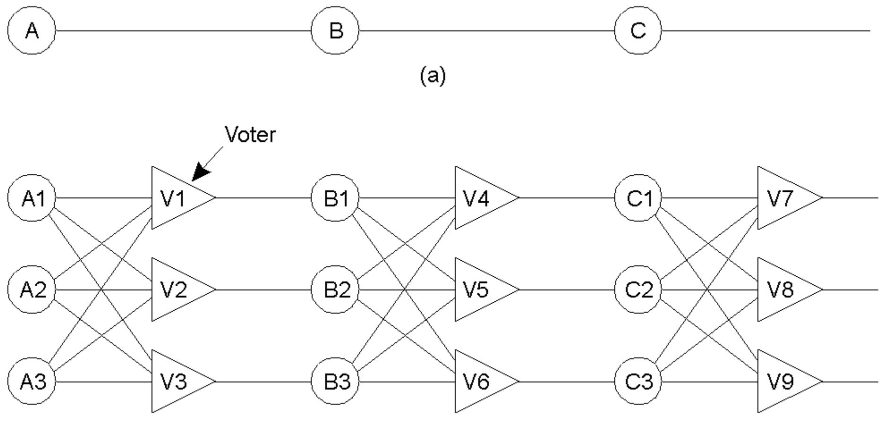

三重模块冗余：每个设备都进行三次复制。如果一个表决器的两个或三个输入相同，那么输出就等于该输入（多数胜出）。请注意，表决器本身可能出现故障，因此每个阶段都需要一个独立的表决器。

> **屏蔽单点故障**：假设组件 $A2$ 因为硬件损坏输出了错误信号，表决器 $V1, V2, V3$ 会同时收到来自 $A1$ (正确)、$A2$ (错误) 和 $A3$ (正确) 的信号。
>
> **多数表决逻辑**：表决器会采用“2比1”的投票结果，将正确的信号传递给下一级（组件 $B1, B2, B3$），从而完美地“掩盖”掉 $A2$ 的错误。
>
> **级联容错**：图中的结构更加高级，它在每一级之间都加入了表决器。这意味着即使 $A1$ 坏了，$B2$ 也坏了，只要每一级中坏掉的组件不超过一个，整个电路依然能正常工作。


接下来进入正题，分布式系统如实现 Fault Tolerance？

## [1] 分布式系统实现容错

### [1.1] 进程韧性

Process Resilience

**进程组 (Process Groups)**：不依赖单个进程，而是将多个执行相同任务的进程组织成一个小组。如果组内一个进程挂了，其他成员可以接管工作。

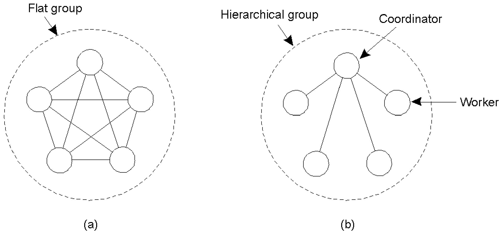

在 Flat Group 中每个进程都是平等的，决策由集体做出，不存在单点故障，但是因为需要一致性共识，就像Assignment I 那样，实现起来其实挺麻烦的

一种更好的方法就是使用 Hierarchical Group，那么这像是一个树，类似于DNS那种，虽然可以快速做出决定，但是存在单点故障！


### [1.2] 可靠的客户端/服务器通信

Reliable C/S Communications

在不稳定的网络中，通信可能会中断。

**掩盖崩溃与遗漏故障 (Masking Failures)**：通过重传机制、确认机制（ACK）或者超时处理，来“屏蔽”掉网络丢包（遗漏故障）或服务器临时宕机（崩溃故障）带来的影响，让客户端觉得连接始终是可靠的。


### [1.3] 可靠的 组通信

Reliable **Group Communication**

当一个消息需要发送给组内所有成员时，情况变得复杂。

**成员变更一致性**：如果消息发送过程中，突然有新成员加入（Join）或旧成员退出（Leave/Crash），系统必须确保所有成员对“谁在组里”以及“收到了哪些消息”有一致的看法（View Synchrony）。

听起来简单，但实际上却出奇地棘手，因为多播服务**本质上往往并不可靠（inherently unreliable）**


什么是可靠的组通信？

理想状态：所有进程运行正常

这是最简单的情况。

- **核心要求**：消息必须被递交给当前组内的**每一个**成员。
- **前提条件**：假设没有进程中途加入或离开（No join/leave）。
- **实现方式**：通常通过“多播（Multicast）”实现。只要网络没断，发送者把消息发出去，大家都能收到。


现实状态：进程可能发生故障

在分布式系统中，进程崩溃是常态，这使得通信变得复杂。

- **全有或全无（Atomic Multicast）**：必须确保所有健康的成员都收到了消息。
  - 如果发送者在发了一半时崩溃了，系统需要协议来保证：要么剩下的成员协作完成分发，要么大家都没收到。
- **视图同步（View Synchrony）**：这是最关键的一点。在递交消息之前，所有成员必须对“**现在组里到底有哪些人**”达成共识。
  - 例如：如果进程 $A$ 在收到消息前退出了，剩下的成员 $B$ 和 $C$ 必须一致同意：“我们是在 $A$ 离开后才收到的这条消息”。


如何实现这种全有全无呢？我们考虑原子多播！

**原子多播 (Atomic Multicasting)** 是分布式系统中一种非常强力的通信保障机制。它的核心逻辑可以总结为两点：**“全有或全无”** 以及 **“严格有序”**。


### [1.4] 分布式提交

Distributed `COMMIT`

这主要用于分布式数据库或事务处理。

- **全有或全无 (All or None)**：当一个操作涉及多个节点时（例如转账），必须保证要么所有节点都成功修改了数据，要么在任何一个节点失败时，所有节点都回滚到初始状态。
- **常见协议**：两阶段提交（2PC）和三阶段提交（3PC）。


这个在上学期数据库中提到，比较复杂，有图解。


### [1.5] 恢复策略

Recovery Strategies

当错误已经发生并被检测到后，系统如何“活过来”？

- **后向恢复 (Backward Recovery)**：将系统恢复到之前的某个正确状态（检查点 Checkpointing）。就像打游戏存快照，死掉了读档重来。
- **前向恢复 (Forward Recovery)**：不回退，而是通过冗余信息尝试修复当前错误状态，直接进入下一个正确状态。


这个也是数据库的知识！回滚策略，但是可能引发级联回滚，因此我们可以使用 **Coordinated Checkpoint**，协调检查点

所有进程同步以共同将其状态写入本地稳定存储——不存在级联回滚

## [2] 容错算法

### [2.1] 协同攻击不可能定理

“协同攻击不可能定理”（Impossibility of Coordinated Attack），在计算机科学中也常被称为**两军问题（Two Generals' Problem）**。


假设有两个Processor $P1$ 和 $P2$，它们知道整个网络结构（在这里这个网络只有2个Processor），且必须同时执行某个行动（输出 YES 或 NO）。**通信链路是不稳定的，消息可能随时丢失。**这个理论告诉我们，在分布式系统中，如果底层通信是不可靠的（比如可能无限期丢包），那么**绝对的共识**（Common Knowledge）在逻辑上是不可能实现的。


#### [2.1.1] 证明

如何证明？

这个证明采用了**“消去法”（Chain Argument）**，展示了无论通信多少次，风险依然存在：

- **共识的基础：** 如果一切顺利（无丢包），且大家输入都是 0，最终应输出 NO；如果输入都是 1，最终应输出 YES。
- **最后一条消息的悖论：** 假设达成共识需要发送 $N$ 条消息。
  - 发送第 $N$ 条消息的人（比如 $P1$）永远不知道这条消息是否真的送达了。
  - 由于通信不可靠，$P1$ 必须做好“消息丢了”也能达成共识的准备。
  - **结果：** 既然第 $N$ 条消息有没有都行，那么达成共识其实只需要 $N-1$ 条消息。
- **连锁反应：** 依此类推，我们可以把消息数量一直缩减到 0 条。也就是说，**在没有任何消息交换的情况下，它们也必须能达成共识。**


根据这个结论：

- 如果即便丢了所有消息，只要初始是 (0,0)，大家就得输出 NO。
- 如果即便丢了所有消息，只要初始是 (1,1)，大家就得输出 YES。
- **那么问题来了：** 当输入是混合的（$P1$ 是 1，$P2$ 是 0），且**所有消息都丢了**时：
  - $P1$ 只知道自己的 1，由于没收到消息，它表现得像在 (1,1) 的情况下一样，输出了 **YES**。
  - $P2$ 只知道自己的 0，由于没收到消息，它表现得像在 (0,0) 的情况下一样，输出了 **NO**。
- **结论：** 两人输出不一致，**共识失败**。


> 共识：
>
> - 一致性 (Agreement)：大家输出一样
> - 有效性 (Validity)：
>   - 如果大家都输入 0，那么共识的结果必须是 0（输出 NO）。
>   - 如果大家都输入 1，那么共识的结果必须是 1（输出 YES）。
>   - 这防止了系统“偷懒”——比如无论输入什么，大家都强制输出 NO，这虽然达成了一致，但没有意义。所以不出现这种情况！！
> - 终止性 (Termination)：所有非故障进程最终都能在有限的时间内做出决定。


### [2.2] 处理器故障

这次我们进入了分布式共识的另一个经典场景：**处理器故障（Processor Failures）**，但假设**通信链路是可靠的**。

这与之前的“两军问题”（链路丢包）不同。在链路可靠但节点可能挂掉的情况下，共识在一定条件下是**可能**达成的。

**FloodSet 算法** 就是解决这类“崩溃/停机故障”（Crash/Stop Failures）的经典方案。


背景：一个处理器在向大家广播消息时，**发了一半突然挂了**。这种**信息不对称**是导致不一致的根源。

前提假设：全连接网络（Complete Network）

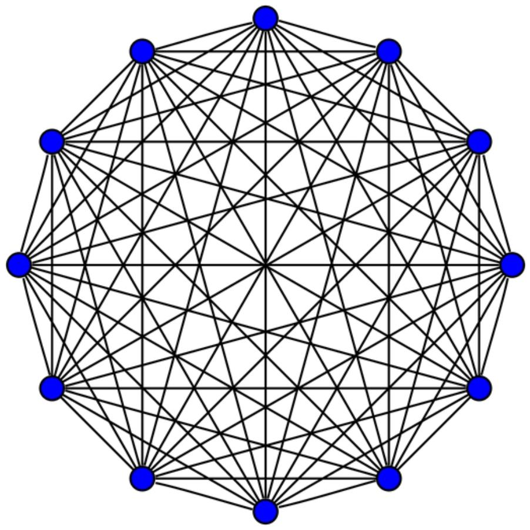

#### [2.2.1] FloodSet 算法

FloodSet 算法是为了达成共识。

FloodSet 的思路非常暴力且直观：**既然可能有人发一半挂了，那我们就多传几轮，让信息彻底“淹没”（Flood）整个网络。**

运行机制：

1. **集合 $W$：** 每个进程维护一个集合 $W$，**记录它目前为止听到的所有初始值**。
2. **轮次 $f+1$：** 算法必须运行 $f+1$ 轮（$f$ 是系统最大允许的故障节点数）。
3. **广播与合并：** 每一轮，大家都把自己的 $W$ 发给所有人，然后把收到的新值加进自己的 $W$ 里。（先发送，后接收！！）
4. **最终决策：**
   - 如果 $W$ 最终只有一个元素（说明大家看到的初始值全一样），就选它。
   - 如果 $W$ 有多个元素（说明出现了分歧），就选默认值 $s_0$。


> #### 为什么运行 $f+1$ 轮就一定会有 Clean Round？
>
> 假设系统最多只能有 $f$ 个处理器崩溃：
>
> - 如果每轮都至少有一个人崩溃，那么 $f$ 轮就会死掉 $f$ 个人。
> - 当我们运行到第 $f+1$ 轮时，由于崩溃的名额已经用完了（或者已经没有新的人可以崩溃了），这第 $f+1$ 轮**一定**是干净的。也就是Clean Round。
>
> ### $s_0$ 的具体含义
>
> - **来源：** 它必须是从所有可能的输入集合 $X$ 中挑选出来的一个固定值。
> - **一致性：** 所有的处理器在运行算法之前，代码里都写死了同一个 $s_0$。
> - **例子：** 如果输入集合 $X = \{0, 1\}$，我们可以约定 $s_0 = 0$。
>   - 如果 $X = \{\text{攻击}, \text{撤退}\}$，我们可以约定 $s_0 = \text{撤退}$。
>
> 在 $f+1$ 轮结束后，所有没挂掉的处理器手里的集合 $W$ 都是一样的。但是，这个 $W$ 里面可能有多个值（比如 $W = \{0, 1\}$），这说明：
>
> 1. **有人提议了 0，有人提议了 1。**
> 2. **出现了分歧。**
>
> 既然出现了分歧，我们就需要一个“裁判”来决定最终输出什么。由于分布式系统中没有中心化的裁判，我们就用**预设的逻辑**来当裁判：
>
> “只要我们发现意见不统一（$W$ 中元素多于一个），我们就**统一**听从那个保底的约定 $s_0$。”


#### [2.2.2] FloodSet 算法正确性分析

**一致性 (Agreement)：** 经过 $f+1$ 轮，所有非故障进程最终拿到的集合 $W$ 是完全相同的。既然 $W$ 相同，根据同样的决策规则（判断是否为单元素集合），大家最后输出的值必然相同。

**有效性 (Validity)：** 如果所有人初始值都是 $s$，那么无论怎么交换，$W$ 里永远只有 $\{s\}$。最终大家都会输出 $s$，满足要求。

**终止性 (Termination)：** 算法只跑固定的 $f+1$ 轮，一定会结束。


####  [2.2.3] 伪代码

```python
Initially:
    u_i knows its input(u_i) and a default value s_0 ∈ X
    W_i := {input(u_i)}
    decision_i := '?'
    Also has access to the current round and knows the upper bound f on #faults

if round ≤ f + 1 then
    // 以下步骤由所有处理器执行，
    // 即在没有收到任何消息的第 1 轮中也会执行
    send ⟨W_i⟩ to all processors             // 由于网络是全连接的，此步一次性发给所有人

    upon receiving ⟨inW_j⟩s from in-neighbours  // 收到来自所有活跃处理器的一个或多个 W 集合
        W_i := W_i ∪ inW_j                   // 记录已知集合与接收集合的并集

if round = f + 1 then
    if |W_i| = 1 then                        // 如果 W 是单元素集合
        decision_i := s, where W_i = {s}     // 输出 W 中的唯一元素
    else                                     // W 包含至少 2 个元素
        decision_i := s_0                    // 在这种情况下，决定使用默认值
```


轮次：$f+1$

消息：$O((f+1)n^2)$


# 分布式系统 - Transactions

## [1] 介绍

### [1.1] 为什么需要事务

- **同步与共享**：服务器通常使用多线程并发处理客户端请求 。如果不同线程同时修改同一个数据库或文件，会导致数据不一致 。
- **原子性需求**：有些操作（如银行转账）必须作为一个整体完成 。要么全部成功，要么在出现故障时完全不产生任何影响（即“半成功”是不可接受的） 。
- **故障处理**：分布式系统面临存储写入失败、服务器崩溃、消息丢失或重复等风险，事务提供了恢复机制 。


### [1.2] ACID

事务必须满足四个关键特性 ：

- **原子性 (Atomicity)**：整个事务被视为一个整体，不可分割 。
- **一致性 (Consistency)**：事务执行前后的“不变性”必须保持一致 。
- **隔离性 (Isolation)**：并发运行的事务之间互不干扰，看起来像是按顺序执行的（即可序列化） 。
- **持久性 (Durability)**：一旦事务提交，其结果就是永久性的 。


### [1.3] 事务的分类

- **扁平事务 (Flat Transactions)**：最基本的模型，但由于过于死板（不能提交部分结果）而有局限性 。
- **嵌套事务 (Nested Transactions)**：主事务产生子事务来处理具体工作 。缺点：当子事务提交后父事务又中止主事务时，就会产生问题。情况会变得混乱，但仍可处理。
- **分布式事务 (Distributed Transactions)**：子事务在分布式的不同数据存储上运行，机制较为复杂 。


a) 嵌套事务——逻辑上分解为子事务的层次结构

b) 分布式事务——逻辑上是一种扁平的、不可分割的事务，它对分布式数据进行操作

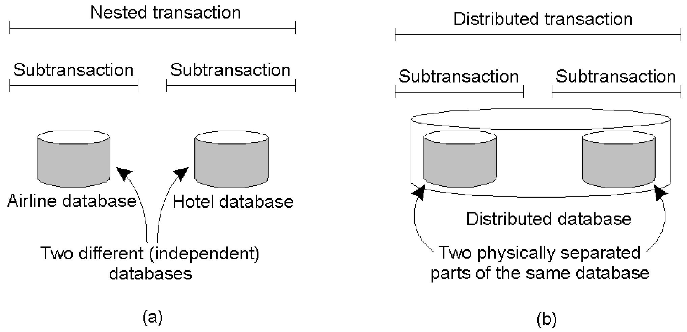


### [1.4] 冲突管理和回滚

**读写冲突**：只有当两个事务都是“只读”时才不冲突 。只要涉及“写”操作，顺序就会影响结果，从而产生冲突 。

**管理架构**：系统通过**事务管理器**、**调度器**（负责锁或时间戳）和**数据管理器**来协同工作 。

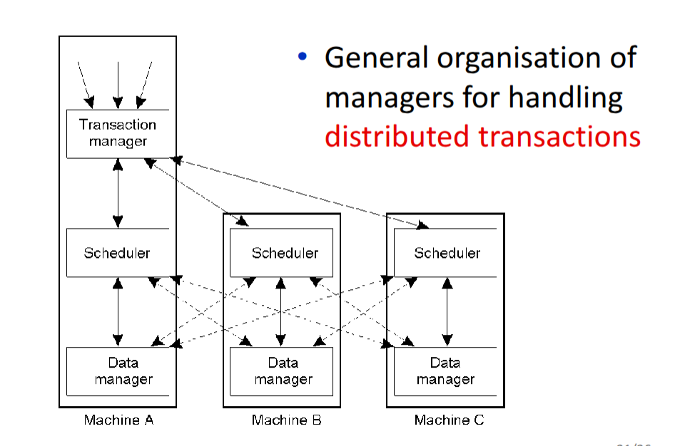


当事务失败或需要回滚时，有两种常见方法 ：

- **私有工作空间 (Private Workspace)**：为事务提供一份文件的副本，在提交前所有修改都在副本上进行 。缺点是复制成本高 。
- **预写日志 (Writeahead Log)**：在修改实际文件之前，先将更改记录到日志中 。如果事务中止，可以利用日志恢复到原始状态 。


### [1.5] 术语

Critical Section：临界区。 是一段**不可重入（Non-re-entrance）**的代码，在任何给定时间内只能由一个进程执行

- **安全性（Safety）：** 同一时刻最多只有一个进程在临界区内执行 。
- **活性（Liveness）：** 进入和退出临界区的请求最终必须成功，这意味着系统不存在死锁和饥饿现象 。

Mutual Exclusion：互斥

Semaphore：用于实现互斥的整数

在Java中，有 Synchronized 方法


### [1.6] 死锁处理

死锁可以有一些预防的方法

1. **预定义（Pre-define）**的顺序获取所有锁
   - 这会导致过早锁定和降低并发读
2. 死锁检测，检测到有死锁就牺牲一个进程！难点：难以确定牺牲哪个进程
3. 超时（Timeouts），如果吃有锁超过规定时间，认定为死锁。难点：难以确定时间界限


## [2] 分布中的互斥算法

| **算法类型**                               | **基本原理**                                                 | **优点**                  | **缺点**                                                | 图例                                                         |
| ------------------------------------------ | ------------------------------------------------------------ | ------------------------- | ------------------------------------------------------- | ------------------------------------------------------------ |
| **集中式算法**<br />Centrailized Algorithm | 由单一协调者控制临界区的进入权限 。<br />进入的时候向Coordinator发送请求，退出的时候向Coordinator发送消息。<br />Coordinator根据情况选择是否允许放行 | 易于实现、公平、无饥饿 。 | **单点故障**、繁忙系统中的性能瓶颈 。                   | 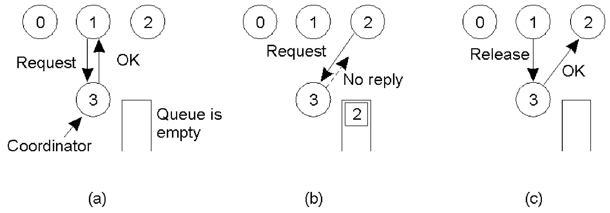 |
| **令牌环算法**<br />Token-ring Algorithm   | 进程组织成逻辑环，**只有持有循环“令牌”的进程才能进入临界区 。** | 互斥有保障且公平 。       | 令牌可能丢失（难以检测和再生），进程故障会导致环断裂 。 | 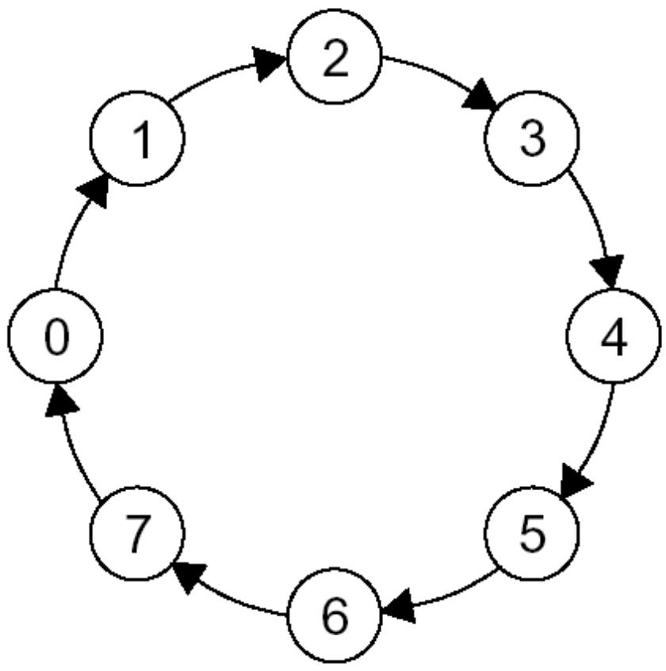 |
| **分布式算法 (Ricart-Agrawala)**           | 见下                                                         | 见下                      | 见下                                                    |                                                              |


### [2.1] 分布式算法

#### [2.1.1] 算法详情

对于分布式算法，详细的操作如下：

对于发送方：

* **如何获准进入：** 进程发送请求后，必须等待**所有**其他进程都回复 “OK” 消息 。只有集齐了所有人的许可，它才能正式进入临界区 。


* **退出后的动作：** 当进程执行完临界区任务准备退出时，它会查看自己的等待队列，向队列中所有的进程发送 “OK” 消息，并清空队列 。这相当于释放了之前被它“扣住”的权限。

对于接收方：

- 情况 1： receiver 既不在临界区内，也不想进入临界区 
  - **处理：** 立即向发送者回复一个 “OK” 消息 。

- 情况 2： receiver 正在临界区内 
  - **处理：** 不予回复，并将该请求放入自己的等待队列（queue）中 。

- 情况 3： receiver 也想进入临界区，但还没进去 

  - **处理：** 比较时间戳（Timestamp） 。


  * **低时间戳获胜：** 如果收到的请求时间戳更小，说明对方先提出的申请，则 receiver 发送 “OK” 。


  * **receiver 获胜：** 如果 receiver 自己的申请时间戳更小，则不予回复，并将对方的请求入队 。


#### [2.1.2] 优缺点总结 

**优点：**

- **可行性：** 通过时间戳的全序排列（Total Ordering）确保了互斥，不会产生冲突 。


* 
**去中心化：** 没有单点故障问题（No single point of failure） 。


**缺点：**


* 
  **多点故障风险：** 系统中任何一个进程崩溃，都会导致其他进程因收不到“OK”而无法进入临界区（崩溃被误解为拒绝进入） 。


* 
**维护成本高：** 每个进程都需要维护一份完整的组成员名单，这在大型动态系统中很困难 。


* 
**性能瓶颈：** 如果某个进程负载过高处理过慢，会拖慢整个系统的并发速度 。


### [2.2] 共享内存中的互斥

Processor 通过公共内存区域中的共享变量进行通信

背景：一组处理器偶尔需要访问某些资源，但是该资源不能被多个处理器同时使用！

每个处理器可能需要执行一个临界区（代码段），以便**互斥+无死锁**。

处理器代码结构如下：

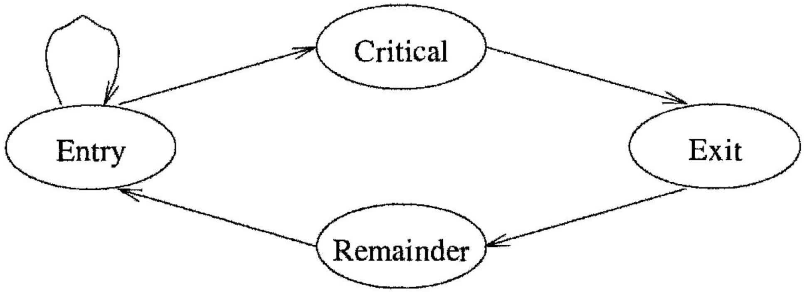


Entry 指的是：为**尝试进入临界区**而准备执行的代码

Exit：离开临界区后执行的代码

在高级语言（如 Java）中，**Entry** 和 **Exit** 通常由虚拟机（JVM）自动处理，而 **Critical** 和 **Remainder** 则由开发者编写。

```java
public class Counter {
    public synchronized void runCritical() {
        // --- [3. Critical Section / 临界区] ---
        // 这里的代码受到保护，同一时间只能有一个线程进入
    }

    public void startWork() {
        while (true) {
            // --- [4. Remainder Section / 剩余区] ---
            // 这里的代码不涉及共享资源，所有线程都可以并发执行
            int a = 10;
            int b = 20;
            
            // --- [1. Entry Section / 进入区] ---
            // 当线程调用此方法时，它会执行“准备工作”：尝试获取该对象的锁（Monitor）。
            // 如果锁被占用，线程会在这里等待（Trying）。
            runCritical(); 

            // --- [2. Exit Section / 退出区] ---
            // 当 runCritical() 方法执行完毕（即花括号结束处），
            // JVM 会自动执行释放锁的操作，以便让其他正在 Entry 区等待的线程进入。
            
            
            // --- [4. Remainder Section / 剩余区] ---
            // 这里的代码不涉及共享资源，所有线程都可以并发执行
            a = 30;
            b = 40;
        }
    }
}
```


### [2.3] 衡量互斥算法

衡量一个互斥算法的好坏，可以从如下三个方面看


| **特性**                                       | **描述**                 | **目标**   | **失败的表现**             |
| ---------------------------------------------- | ------------------------ | ---------- | -------------------------- |
| **互斥** Mutual Exclusive                      | 同一时间只有一个进程     | 保护数据   | 竞争冒险、数据损坏         |
| **无死锁** No Deadlock                         | 至少有一个进程能成功     | 系统吞吐量 | 系统完全停止响应（卡死）   |
| **无锁定（无饥饿）** No Lockout/ No Starvation | 每一个请求的进程都能成功 | 个体公平性 | 饥饿（某个进程永远在等待） |

想象一个极度不公平的饭店：

- 如果饭店规定“一次只能进一个客人”，它满足了**互斥**。
- 如果饭店“一直在叫号，总有客人能进去吃”，它满足了**无死锁**。
- 饥饿情况：如果饭店“只给 VIP 客户插队，普通客户排了一辈子也没吃上”，那么它**不满足无锁定（No Lockout）**（虽然它满足无死锁）。


#### [2.3.1] 无死锁 Test & Set

用一个 Binary `test&set` Register（二进制 `test&set` 寄存器） 就可以解决死锁问题

`test&set`支持两种**==原子操作==：**

1. test&set(V)：这是一个原子操作（即在执行过程中不会被其他线程中断）。它执行两件事：
   - 读取 $V$ 的当前值并返回（存入 `temp`） 。
   - 立即将 $V$ 的值设为 **1** 。
2. **`reset(V)`**：将 $V$ 设回 **0**，相当于“开锁” 。

```java
// 初始状态 V = 0 

(Entry Section / 进入区):
    // 循环执行 test&set，直到它返回 0 
    wait until test&set(V) == 0; [cite: 314]

(Critical Section / 临界区):
    // 执行受保护的代码 [cite: 315]

(Exit Section / 退出区):
    reset(V); // 将 V 设为 0，释放锁 [cite: 317]

(Remainder Section / 剩余区):
    // 执行其余不相关的代码 [cite: 318]
```


#### [2.3.2] 无锁定 RMW

保证公平性、防止饥饿的互斥算法：使用的核心武器是比 Test&Set 更强大的 **Read-Modify-Write (RMW) 寄存器**

k

这部分讲义介绍了一个能够实现**无锁定（No Lockout）**——即保证公平性、防止饥饿的互斥算法。它使用的核心武器是比 Test&Set 更强大的 **Read-Modify-Write (RMW) 寄存器** 。

我们可以把这个算法想象成**“银行柜台排队取号系统”**。

---

核心工具：RMW 寄存器

RMW 操作的强大之处在于它可以在**一个原子步骤**内读取旧值并写入新值，期间任何其他处理器都无法介入 。

* 
**共享变量 $V$**：包含两个字段 `first`（当前正在服务的号码）和 `last`（下一个发放的号码） 。


* **初始化**：$V = \langle 0, 0 \rangle$，表示从 0 号开始发票，当前也在服务 0 号 。

---

算法流程：取号与叫号

**第一步：Entry (取号入队)**

当一个处理器想进入临界区时，它执行一次原子操作：

1. 
**取号**：读取 `V.last` 作为自己的票号（`position`） 。


2. 
**加 1**：同时将 `V.last` 加 1，为下一个人做准备 。


3. 
**等待**：不断读取 `V.first`（叫号显示屏），直到显示屏上的数字等于自己的票号 。


**第二步：Critical Section (办理业务)**

当自己的票号被叫到时，进入临界区执行代码 。

**第三步：Exit (办理完毕/叫下一位)**

退出临界区时，执行另一个原子操作：

* 
**更新显示屏**：将 `V.first` 加 1 。


* 
**结果**：这会自动激活正在排队等待该号码的下一个处理器 。


---

如何保证“无锁定（无饥饿）”？

* **先来后到（FIFO）**：因为每个处理器拿到的票号是递增且唯一的，所以它们必须严格按照取号的顺序进入临界区 。


* **没有插队**：不像 Test&Set 那样靠“抢”，这里每个人都有固定的位置，因此**没有任何处理器会被无限期推迟** 。


---

读/写寄存器与 Lamport 面包店算法

如果硬件只支持基础的**读/写寄存器**（读和写是独立的）：

* 
**能力较弱**：处理器无法在不被干扰的情况下完成“读取并立即修改” 。


* 
**成本更高**：为了实现无死锁，至少需要 $n$ 个独立的读/写寄存器（$n$ 是处理器数量） 。


* 
**Lamport's Bakery Algorithm**：这就是在只有基础读/写寄存器的情况下，模仿上述“票据系统”实现的互斥算法 。它同样保证了无锁定，但需要 $O(n)$ 级别的空间复杂度 。


---

**总结对比：**

| 特性           | Test&Set             | RMW (Ticket)           |
| :------------- | :------------------- | :--------------------- |
| **原子性**     | 简单（设为1）        | 复杂（自定义函数 $f$） |
| **公平性**     | 可能存在锁定（靠抢） | **保证无锁定**（排队） |
| **寄存器数量** | 1个                  | 1个（但含两个字段）    |


## [3] 一致性与复制

为什么要**复制数据（Replicated Data）**？

1. 提高**可靠性（Reliability）**：有副本，一台炸了另一台也能顶替
2. 提升**性能（Performance）**：并发读取负载均衡等等！


但是，要保持所有这些副本的一致性不是一件容易的事情！！

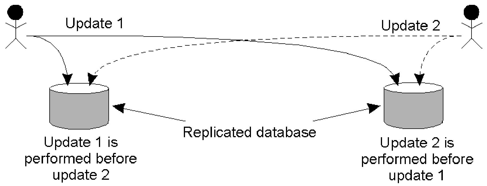

> 由于网络延迟，更新可能会以不同的顺序到达！


什么是**复制透明性（Replication Transparency）**？

复制透明性意味着系统对外部表现得像是一个**逻辑对象**，而不是多个物理副本 。

> **不透明的情况**：系统要求你手动选择“服务器 A”、“服务器 B”或“服务器 C”来上传文件，并且你需要自己记录哪个服务器上的版本是最新的。
>
> **透明的情况（Replication Transparency）**：你只看到一个“我的文件.docx”。无论你身处何地，系统会自动为你选择最快的服务器，并在后台同步所有副本，而你自始至终只觉得自己是在操作一份文件。


虽然系统追求透明性，但由于网络断开等原因（如日历应用离线使用），本地副本可能会与其他副本产生不一致 。

- **离线状态**：允许暂时不一致，待重新连接时进行对账（Reconciliation） 。
- **在线状态**：连接中的客户端通过不同副本访问时，应获得一致的结果 。


### [3.1] 以数据为中心的一致性模型

**以数据为中心的一致性模型（Data-Centric Consistency Models）**


**基本假设**：数据存储被看作是一组分布式的共享数据。每个进程拥有整个数据存储的一个**本地副本（Replica）。**因为每个进程都有本地副本，读取操作可以在本地直接完成，无需经过网络，速度极快。

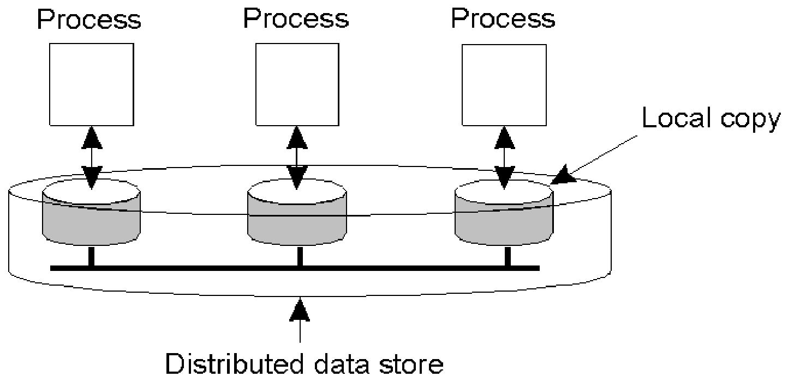

**写入传播 (Write Propagation)**：这是挑战所在。一旦某个进程修改了它的本地副本，这个**写入操作必须传播到所有远程副本**，以保证大家看到的数据是一致的

为了处理“写入传播”带来的复杂性，研究者定义了不同的**一致性模型**。


### [3.2] 我们的研究目的

**全序排序的代价 (Cost of Global Ordering)**：在整个系统中保证所有操作的绝对先后顺序是非常昂贵的，这会严重降低系统的**可扩展性（Scalability）**


对于某些应用来说，追求完美的排序可能没有必要！！因此，研究人员会提出**更弱的一致性要求 (Weaker consistency requirements)**，以换取更快的响应速度。例如，如何通过**更新协议 (Update protocols)** 来使各个副本达成一致？


因此，一致性模型分为两大类：

- **无需显式同步操作(No explicit synchronisation)**的模型
- **需要显式同步操作(With explicit synchronisation)**的模型


#### [3.2.1] 无需显式同步操作

这些模型主要通过限制操作的**观察顺序**来定义。

| **模型**                       | **核心逻辑**                                                 | **特点**                                                   |
| ------------------------------ | ------------------------------------------------------------ | ---------------------------------------------------------- |
| **严格一致性 (Strict)**        | 所有共享访问都遵循绝对的物理时间顺序。                       | 理想化模型，现实中极难实现。                               |
| **可线性化 (Linearisability)** | 所有进程看到的顺序一致，且操作根据（非唯一的）全局时间戳排序。 | 极强的一致性，确保操作在调用和返回之间某个时间点原子发生。 |
| **顺序一致性 (Sequential)**    | 所有进程看到的访问顺序一致，但不要求与物理时间对齐。         | 只要大家看到的“故事线”是一样的即可。                       |
| **因果一致性 (Causal)**        | 所有进程以同样的顺序看到**有因果关系**的访问。               | 无关的操作顺序可以不同，比顺序一致性更弱。                 |
| **FIFO (先进先出)**            | 进程看来自某个特定进程的写入顺序与它们被执行的顺序一致。     | 不同进程间的写入顺序可能在不同观察者看来是不一样的。       |


---


顺序一致性：**所有进程必须看到相同的操作交替顺序**

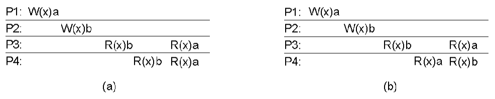

a) 图是允许的，对于 P3 和 P4 而言，虽然时间不同，但是都是先`b`后`a`！

b) 图则是不允许的，因为顺序错了！

我们只保证顺序，而不保证时间！


#### [3.2.2] 需要显式同步操作

这些模型更具“效率”，它们允许数据在平时不一致，只在特定的**同步点**进行对齐。


- **弱一致性 (Weak)**：只有在执行了显式的同步操作（如 `sync()`）后，才能保证共享数据是一致的。
- **释放一致性 (Release)**：当一个进程**退出临界区**（释放锁）时，它所做的修改会被同步到其他副本。
- **进入一致性 (Entry)**：当一个进程**进入临界区**（获取锁）时，它会确保它即将访问的相关共享数据是最新的。


**Weak/Release/Entry** 在现代分布式数据库和多核处理器中非常常见，因为它们避免了昂贵的持续实时同步。


---

弱一致性：

**非实时同步**：系统不强求每个独立数据的变动都立即在所有副本中达到一致。

**同步点（Synchronization, S）**：只有在执行了**显式的同步操作（图中标记为 S）**之后，才能保证共享数据达到一致状态。

**适用场景**：当独立的访问非常少，而操作通常以**集群**出现时，这种模型非常有用且高效。


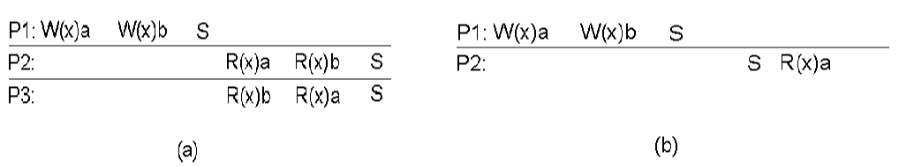


**图 (a)：有效的一致性序列**

- **操作过程**：P1 连续写入了 $a$ 和 $b$，然后执行了同步 $S$。
- **观察结果**：P2 看到的顺序是 $(a, b)$，而 P3 看到的顺序是 $(b, a)$。
- **为什么有效？** 因为此时 P2 和 P3 **尚未执行同步操作 $S$**。在没有同步之前，系统对变量 $x$ 的值不提供任何一致性保证，因此不同的进程看到不同的写入顺序是允许的。

**图 (b)：无效的一致性序列**

- **操作过程**：P1 写入 $a, b$ 并执行 $S$。随后，P2 **先执行了同步 $S$**，然后再去读取 $x$。
- **观察结果**：P2 读到了旧值 $a$。
- **为什么无效？** 因为 P2 已经完成了同步。根据弱一致性合同，同步操作之后，进程应该能够看到之前已经完成并同步的所有修改。既然 P1 的最新写入是 $b$，那么 P2 在同步后**必须读到 $b$ 而不是 $a$**。


### [3.3] 以用户为中心的一致性模型

我们之前提到了以数据为中心的一致性模型，那么用户为中心和它的区别是什么？

- **以数据为中心 (Data-Centric)**：关注的是在存在并发读写操作时，如何维护一个**全局一致的数据存储**。
- **以用户为中心 (Client-Centric)**：其特征是**缺乏并发更新**。


为什么需要这种模型？（现实背景）

许多大规模系统并不需要严格的实时同步，因为它们可以容忍一定程度的不一致性：

- **数据库系统**：大部分操作是读取。
- **DNS（域名系统）**：几乎不会发生写-写冲突。
- **WWW（万维网）**：大量使用客户端缓存，即便返回稍微过时的页面（stale pages），大多数用户也能接受。
- **最终一致性 (Eventual Consistency)**：这些系统的共同特点是副本之间会**随着时间推移逐渐达成一致**。**==唯一的硬性要求是：所有更新最终必须保证传播到所有副本。==**


最终一致性的移动问题：

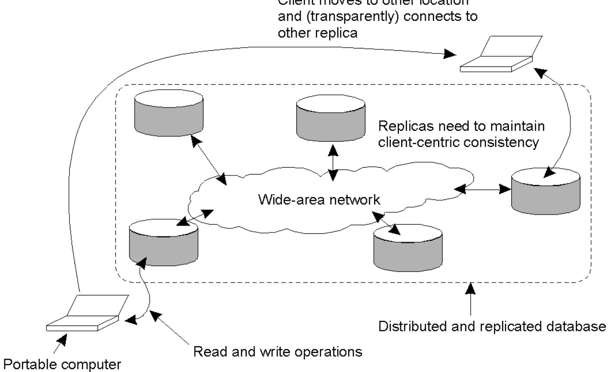

> **场景**：一个移动用户在不同的地点连接到分布式数据库的不同副本（例如：你在伦敦发了条动态，然后坐火车到利物浦刷新页面）
>
> 那么你在利物浦刷新之后能否看到你在伦敦的动态，就决定了这个系统是否满足“以用户为中心的一致性”！


当系统能够保证**单个客户端**以一致的方式观察到其对数据存储的访问时，我们就说实现了**“以用户为中心的一致性”**！


## [4] 分布协议

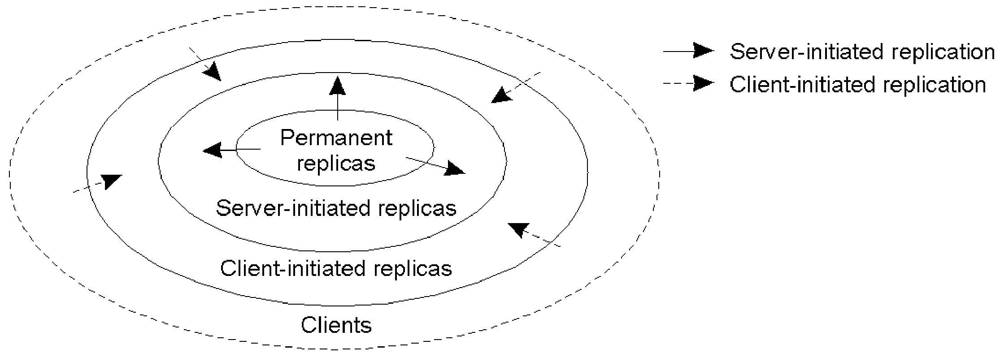


无论选择哪种一致性模型，我们都需要决定数据存储**副本（Replica）**的放置位置、时间以及由谁来放置。

### [4.1] 三种副本类型

副本有三种类型：

1. 永久副本（Permanant Replica）：数量通常较少，以工作站集群（COWs）或镜像系统的形式组织。（例如 Web 服务器或备份数据库服务器）
2. 服务器**发起（Initiated）**的副本：这类副本是服务端为了提升性能而主动创建的
   - 通常由 Web 托管公司使用，根据用户需求将副本在地理位置上靠近用户 。
   - 常被称为**“推送缓存”（Push Caches）** 
   - 服务器会监控流量，发现某个地区（如伦敦）访问量激增，就会主动把数据“推”到伦敦的边缘服务器上。
   - **典型例子**：内容分发网络（CDN）的预热机制。
3. 客户端发起的副本 (Client-initiated Replicas)：这类副本是由于客户端的请求而产生的，完全由用户端驱动。
   - 只有在用户请求数据后，数据才会被缓存。其效果高度依赖于缓存数据不会过快“过期”（Stale）
   - **典型例子**：**浏览器缓存 (Browser Caches)**


### [4.2] 副本变化后的同步

当一个副本发生数据更新后，如何将这些变化同步到其他副本。

这涉及到**更新传播的内容**以及**由谁发起同步（Push and Pull）**两个层面！


#### [4.2.1] 更新传播内容

 Update Propagation

根据传输内容的不同，有三种主要策略：

**传播更新通知 (Propagate the Notification)**

- **原理**：不发送实际数据，只告诉其他副本“数据已过期（Invalid）”。
- **适用场景**：常用于缓存系统（使缓存失效）。
- **优势**：当**读写比很小**（写多读少）时非常有效，因为没必要每次都传数据，等有人真的要读时再拉取最新的即可。


**传输实际数据 (Transfer the data)**

- **原理**：将修改后的新数据直接从一个副本传给另一个。
- **适用场景**：当**读写比很高**（读多写少）时效果很好。
- **实现**：通常会记录变更日志并聚合多次更新后再传输。


**传播更新操作 (Propagate the update operation)**

- **原理**：又称**主动复制 (Active Replication)**。不传数据，而是把“加 10”或“更新姓名”这个**操作指令**传过去，让各副本在本地重新执行一遍。
- **优势**：节省带宽（指令通常比数据包小），但需要更多的本地处理能力。


#### [4.2.2] Push and Pull 协议

这决定了通信的**发起者**是谁：

推送模式 (Push-based / Server-based)

- **机制**：由服务器“自动”发送更新，客户端无需主动请求。
- **特点**：
  - 适用于对**一致性要求极高**的场景。
  - 常用于**永久性副本**和**服务器发起的副本**之间（因为它们之间通常有更紧密的管理关系）。

拉取模式 (Pull-based / Client-based)

- **机制**：由客户端（如浏览器缓存）主动向服务器询问并请求更新。
- **特点**：
  - **不请求就不更新**！
  - 服务器不需要记录哪些客户端存了副本，节省了服务器开销，但客户端读到的可能是旧数据。


| **维度**       | **推送 (Push)**          | **拉取 (Pull)**      |
| -------------- | ------------------------ | -------------------- |
| **发起者**     | 服务端                   | 客户端               |
| **实时性**     | 高（数据主动送达）       | 低（取决于请求频率） |
| **服务器负担** | 需维护客户端列表，开销大 | 负载较轻             |
| **典型应用**   | 数据库镜像同步           | 浏览器网页缓存       |


### [4.3] 租约 

Leases

**租约（Leases）**是一种灵活的**合同**机制：服务器承诺在租约到期前，主动向客户端推送更新。这结合了推送的低延迟和拉取的低维护成本。

为了让系统更高效，讲义提到了三种**自适应租约（Adaptive Leases）**策略：

| **策略名称**                                            | **核心逻辑**                                                 | **具体做法**                                                 |
| ------------------------------------------------------- | ------------------------------------------------------------ | ------------------------------------------------------------ |
| **基于年龄的租约** <br />(Age-based)                    | 如果一个对象在一段时间内没有变化，那么它在不久的将来很可能也不会改变。 | 为这类数据提供**更长**的租约时间。                           |
| **基于更新频率的租约**<br />(Renewal-frequency)         | 客户端请求特定对象的频率越高，说明该数据对该客户端越“热门”。 | 为该客户端（及该对象）提供**更长**的租约时间，以便持续推送更新。 |
| **基于状态空间开销的租约** <br />(State-space overhead) | 服务器负载越重（需要维护的客户端状态越多），系统开销就越大。 | **缩短**租约时间，以减少服务器需要维护的客户端列表数量。     |


**推送**适合对实时性要求极高的核心副本。

**拉取**适合海量的普通用户缓存（如浏览器）。

**租约**则通过动态调整，让服务器能把有限的“推送名额”留给最需要、最活跃的客户端，是一种非常聪明的资源优化手段。


租约与同步问题：如果客户端和服务器的时钟没有严格同步会怎样？

- 客户端可能会对其时钟与服务器时钟的同步程度持“悲观”态度，并**尝试在当前租约到期前获取新的租约**。


## [5] 一致性协议

### [5.1] 流行病协议

流行病协议（Epidemic Protocols）：它在分布式系统中主要用于实现**最终一致性（Eventual Consistency）**。


正如名字所示，这种协议模仿了病毒或流行病在人群中传播的方式，目标是让更新在副本中快速扩散。

**核心目标**

- **高效传播**：以**尽可能少的消息数量**，将更新传播到所有的副本中。
- **“感染”机制**：一旦一个副本获得了更新，它就会变成“感染源”，继续向其他“未感染”的副本传播数据，直到整个系统都达到一致。


**更新传播中的“删除”难题**

在流行病模型中，**删除数据（Removing data）**是非常棘手的问题：

- **误判风险**：由于数据是异步传播的，如果一个副本删除了某项数据，而另一个旧副本（Old copy）还没删，那么这个旧副本可能会把该数据当成“新内容”再次传播给已经删除过的副本。
- **结果**：这会导致被删除的数据像“僵尸”一样，在系统中反反复复出现，无法被彻底清除。

> **技术笔记**：在实际的分布式系统中（如 Cassandra），为了解决这个问题，通常会使用一种叫作 **Tombstone（墓碑）** 的机制，即给被删除的数据打上一个标记，告诉大家：“这一项已经死了，不要再把它当成新数据传回来”。


为什么Epidemic Protocols 在分布式系统中很重要？

- **鲁棒性**：即使部分节点掉线，协议依然能通过其他路径完成传播。
- **可扩展性**：它不需要一个中心服务器来管理，非常适合像 **DNS** 或 **大规模 Web 系统** 这样节点极多的环境。


### [5.2] 基于主副本的协议

**基于主副本的协议（Primary-Based Protocols）**：这种协议通过指定一个“负责人”来简化并发冲突的处理。

这里的【主副本】指的是主要的**副本**！

在基于主副本的协议中，每个数据项都会关联到一个特定的“主”副本（Primary）。

- **协调写操作**：该主副本负责协调对该数据项的所有**写操作（Writes）**。
- **分类**：根据写操作执行的具体位置，可以分为两种类型：
  1. **远程写（Remote-Write）协议**
  2. **本地写（Local-Write）协议**


#### [5.2.1] 远程写协议

这是最基础的模式，主要特点如下：

- **单点执行**：所有的写操作都在**一个单一的（远程）服务器**上执行。
- **操作逻辑**：无论客户端连接到哪个副本，只要涉及到写操作，请求都会被转发到主服务器处理。处理完成后，再由主服务器将更新传播到其他副本。
- **应用场景**：这种模型通常与传统的**客户端/服务器（Client/Server）系统**相关联。

**为什么使用这种协议？**

- **优点**：实现简单。因为只有一个地方负责写，所以不会出现两个副本同时修改同一个数据而产生的冲突（即解决了“写-写冲突”）。
- **缺点**：主服务器容易成为性能瓶颈，且如果主服务器宕机，整个系统的写功能就会瘫痪。


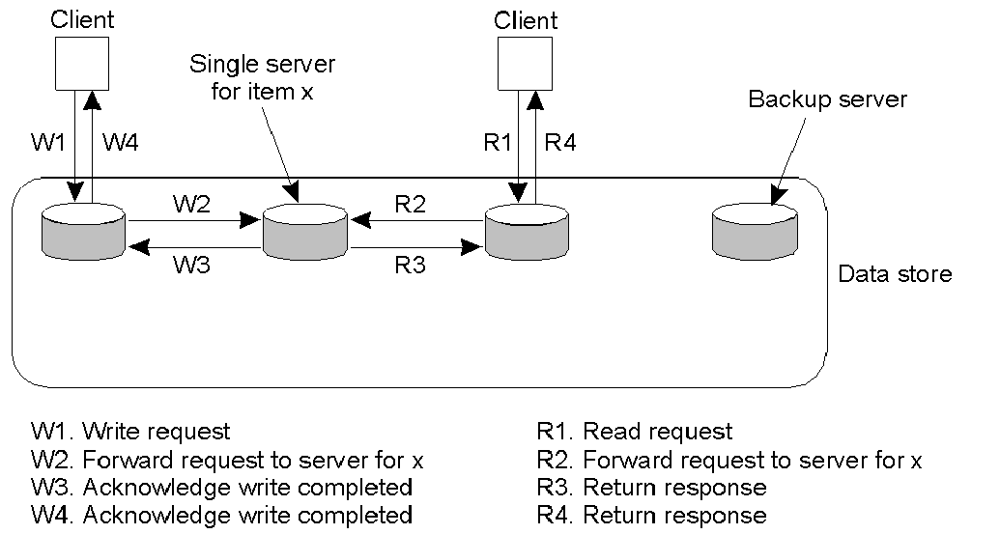


远程写协议还有一个变体就是**主备协议（Primary-Backup Protocols）**


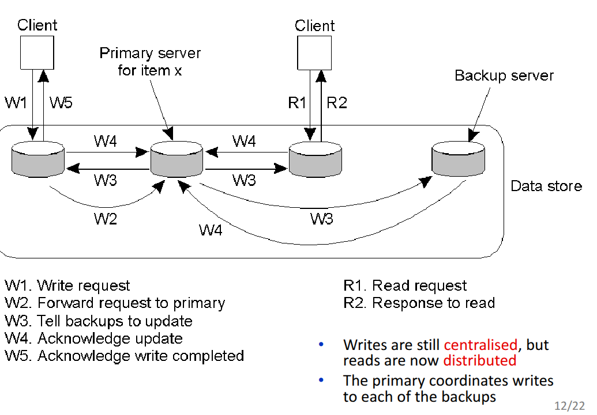

区别：

1. 现在 Backup Server 也要同步
2. 虽然现在写入是集中的（Centralised）但是**读取是分布式的！**


主备协议的缺点：

- **阻塞式协议 (Blocking write protocol)**：如果使用阻塞模式，主副本在完成所有备份副本的更新并收到确认之前，不会向客户端返回成功。在地理位置分散的系统中，这会导致明显的延迟。

主备协议的优点：

- 易于实现顺序一致性 (The Good - Consistency)：由于所有的写操作都受主副本控制，主副本可以确保所有的写请求按照**完全相同的顺序**发送给每一个备份副本。
- 通过使用**非阻塞式写入协议 (Non-blocking write protocol)**，主副本在本地完成操作后即可回复客户端，而无需等待所有备份同步完成。
- **潜在风险**：虽然速度快了，但会导致客户端无法立刻确认更新是否已经成功同步到备份副本中。


> 请参考Kafka的更新策略：阻塞推送和非阻塞推送


#### [5.2.2] 本地写入协议

Local-Write Protocols

**本地写入协议**与之前提到的**远程写入协议**最大的区别在于，主副本的权限是动态迁移的 

**单一副本维持**：在任何给定时间，系统依然只维持一个特定的副本作为主副本 

**主副本地位可转移**：该协议中“主副本”的身份（Status）是**可以转移**的 。

**写入触发迁移**：当某个副本（Replica）收到写请求时，该数据项会被**传输（Transferred）**到这个正在进行写入操作的副本上 。


这种协议也被称为“**完全迁移方法（Fully migrating approach）**” 

- **请求**：客户端向离它最近的副本发起写操作。
- **迁移**：如果该副本不是主副本，它会向当前持有主副本权限的节点请求数据和权限，并将数据项完整地“搬”到本地。
- **本地执行**：现在该副本成为了新的“主副本”，写操作直接在本地完成。
- **后续**：该节点将继续作为主副本，直到下一个节点发起写请求并把权限抢走。

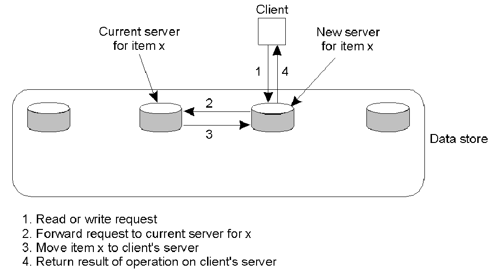


**远程写（Remote-Write）**：数据不动，人（请求）动。适合读取多、写入少的传统系统 。

**本地写（Local-Write）**：人（请求）在哪，数据动。适合某个节点在一段时间内会进行大量连续写入的场景 。


##### 迁移主副本协议

变体：**迁移主副本协议（Migrating Primary-Backup Protocol）**

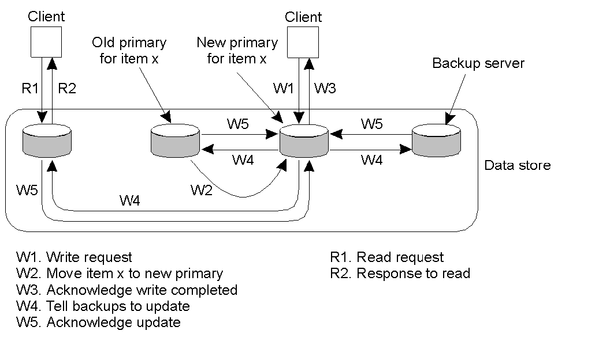


- **W1 (写请求)**：客户端向其就近的服务器发送写请求。
- **W2 (权限与数据迁移)**：该服务器发现自己不是主副本，于是联系“旧主副本（Old primary）”，将数据项 $x$ 及其主副本权限迁移到自己这里。
- **W3 (确认写入)**：数据在本地修改完成后，新主副本立即向客户端返回“写入完成”的确认。
- **W4 (通知备份更新)**：随后，这个新的主副本负责通知数据存储中的其他备份服务器进行更新。
- **W5 (备份确认)**：备份服务器完成更新后，向新主副本返回确认信息。


由于主副本已经迁移到了客户端所在的局部网络中，读取操作变得极其高效：

- **R1 & R2 (就近读取)**：客户端可以直接从本地的这个“新主副本”读取数据，无需跨越复杂的网络去访问远程服务器。


写入是集中的，读取现在是分布式的了！


##### 副本写协议

虽然本地写协议通过迁移主副本地位提高了写入效率，但它带来了一个致命的寻址问题：任何进程在读写之前必须回答“**数据项现在到底在哪？**”

> 在极端情况下，进程花在“寻找数据”上的时间甚至比实际使用数据的时间还要长。

**副本写协议 (Replicated-Write Protocols)**：与**迁移主副本协议**不同，副本写协议（也称为“分布式写协议”）允许在**任何副本**上直接执行写操作。


**主动复制 (Active Replication)**

这是副本写协议的一个典型例子，由一个特殊进程在每个副本上执行更新操作。其核心挑战是如何保证所有副本的更新顺序一致：

- **逻辑时钟方案**：可以使用 **Lamport 时间戳** 来实现全序排序，但在分布式系统中其扩展性较差。
- **定序器方案 (Sequencer)**：一种变体是**使用一个专门的进程（定序器）为每个更新分配唯一的 ID 编号，然后传播到所有副本**。


**主动复制中的难题：重复调用 (Replicated Invocations)**

当对象本身也是被复制的多个副本时，会出现重复调用的问题：

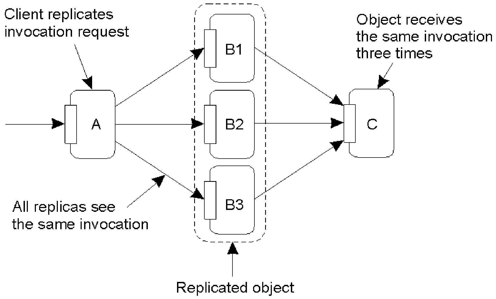

**场景描述**：假设对象 $A$ 调用对象 $B$，而 $B$ 又是副本化的（有多个实例）。如果 $B$ 的每个副本都去调用对象 $C$，那么 $C$ 就会被错误地调用多次（例如 3 次）。


**解决方案 (Solutions)**

讲义提出了通过**协调者（Coordinator）**来解决重复调用的方案：

- **调用端协调**：由 $B$ 的一个协调者负责将调用请求转发给 $C$，确保 $C$ 只收到一次请求。
- **返回端协调**：$C$ 执行完后，由一个协调者负责将结果返回给 $B$ 的所有副本，并最终只向 $A$ 返回一个结果。

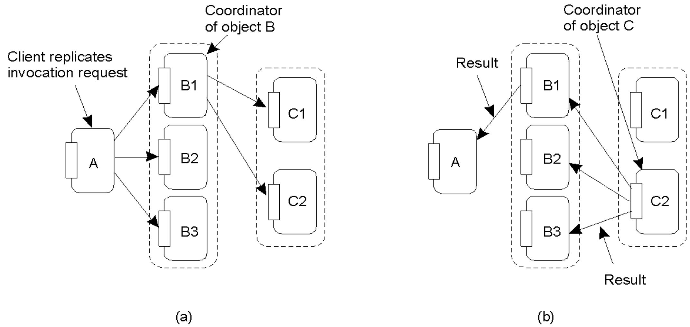


# 分布式系统 - 安全

安全威胁的类型：

- 拦截（Interception）：没有授权地访问数据
  - 比如通信**窃听（Eavesdropping）**、非法复制数据
- 中断（Interruption）：让服务不可用
  - 比如 DDos 攻击，让文件丢失（Lost）或者文件损坏（Corrupted）
- 修改（Modification）：对数据的未授权和篡改
  - 比如更改传输的数据，修改程序以达到某些目的
- 伪造（Fabrication）：非正常的**额外活动（Additional Activity）**
  - 比如入侵者向数据库添加条目（注意这里的Activity类似于活动记录，比如Gemini的Activity，实际上就是你的对话记录。这里的额外Activity其实就是额外的记录）


安全机制：

- 加密（Encryption）：比如对称加密、非对称
- 身份认证（Authentication）：验证身份的，例如常用的APP：Authenticator
- 授权（Authorization）：验证你的**操作**是否被允许
- 审计（Auditing）：类似于日志，log，谁对什么做了什么，记录Activity用的，并不是直接的保护措施，但是有助于追踪和分析安全漏洞


任何分布式中都必须有一个基本的安全技术：密码学（Cryptography）！

PPT降到了凯撒密码（Caeser Cipher），我们知道是一个对称加密的例子，通过频率（Frequency）可能可以破解

以及一次性密码本（One-time Pads）

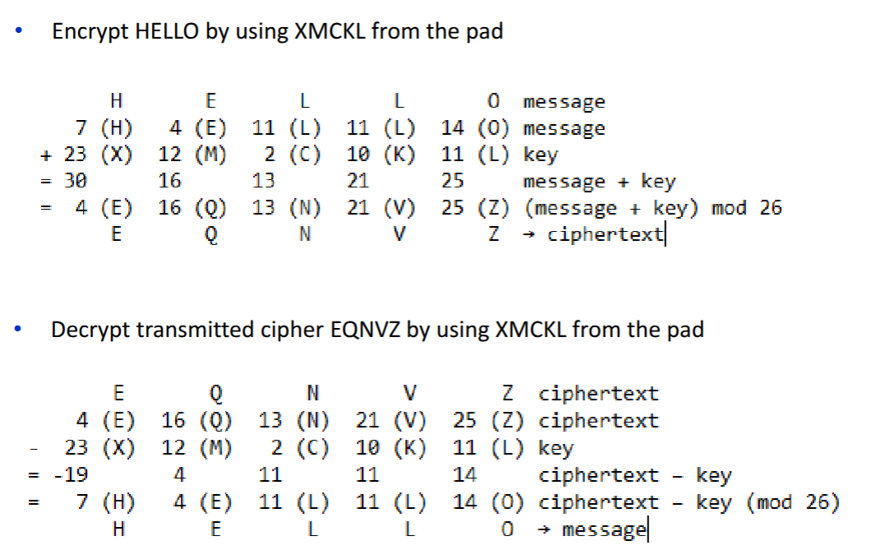

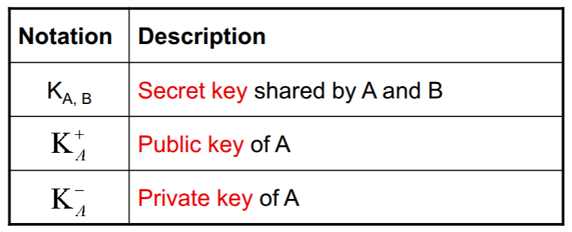

我们还知道对称加密DES、三重DES、AES

还知道，非对称加密RSA

RSA混合对称加密，成功做到了**身份验证（Authentication）、消息完整性（Message Integrity）、保密性（Confidentiality）**！


## [1] 相互进行 Authentication

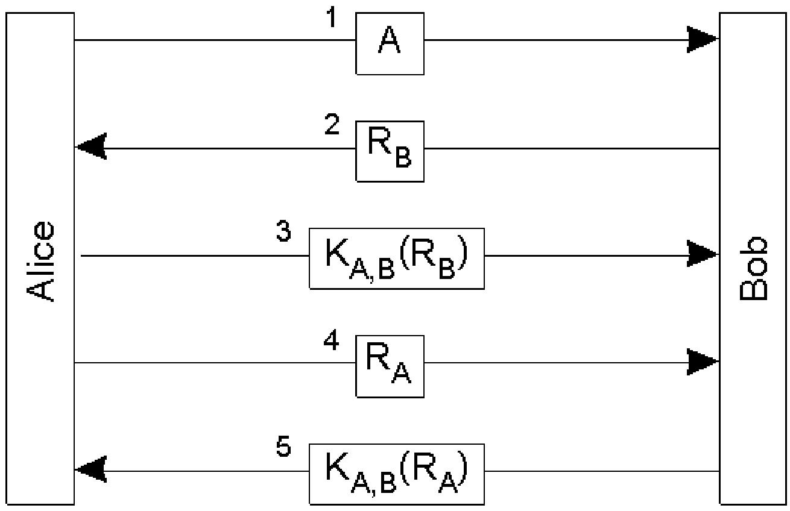


**消息 1 ($A$)**：Alice 发送自己的身份标识，告诉 Bob：“我是 Alice，我想和你通信。”

**消息 2 ($R_B$)**：Bob 生成一个随机数 $R_B$ 发给 Alice，这叫作**“挑战” (Challenge)**。

> Bob 要接受她，那么就先要认可这个真的是Alice！！所以就开始挑战她！

**消息 3 ($K_{A,B}(R_B)$)**：Alice 使用共享密钥 $K_{A,B}$ 对 $R_B$ 进行加密并传回。

- **逻辑**：Bob 收到后用 $K_{A,B}$ 解密。如果解密结果等于他刚才发出的 $R_B$，Bob 就能确定对方真的是 Alice（因为只有她有密钥）。

**消息 4 ($R_A$)**：Alice 发送自己的随机数 $R_A$，反过来挑战 Bob。

**消息 5 ($K_{A,B}(R_A)$)**：Bob 使用相同的共享密钥 $K_{A,B}$ 对 $R_A$ 加密并传回。

- **逻辑**：Alice 解密验证。如果结果匹配，Alice 就能确定对方真的是 Bob。


## [2] 认证攻击

上述相互Authentication用了5论，我们能否简化呢？？我们来看看：

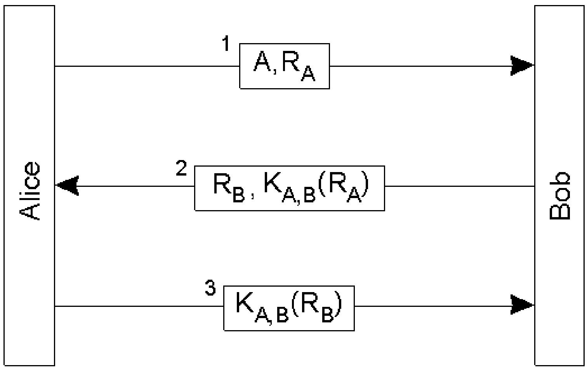


现在 Alice 希望和 Bob 通话！为了提高效率，本图将一些步骤合并了：

1. **消息 1 ($A, R_A$)**：Alice 发起请求，同时直接把自己的随机数（挑战值）$R_A$ 发给了 Bob。
2. **消息 2 ($R_B, K_{A,B}(R_A)$)**：Bob 做出回应。他同时做了两件事：
   - 给出了自己的挑战值 $R_B$。
   - 使用共享密钥加密了 $R_A$，以此向 Alice 证明“我真的是 Bob”。
3. **消息 3 ($K_{A,B}(R_B)$)**：Alice 加密 $R_B$ 发回。
   - 这向 Bob 证明了“我真的是 Alice”。

**特点**：比五步协议少了两条消息，效率更高，看似很完美，但是存在漏洞！

比如下面这个中间人攻击！

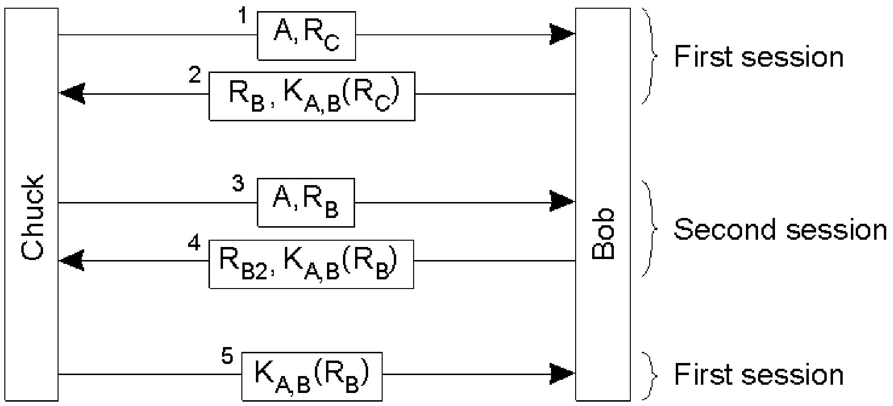


1. **第一阶段 (First Session)**：

   - Chuck 冒充 Alice 发起会话，给 Bob 发送一个随机数 $R_C$。

   - Bob 回复了挑战值 $R_B$，并顺便帮 Chuck 加密了 $R_C$。**此时 Chuck 的目标是拿到 $K_{A,B}(R_B)$，但他自己算不出来。**

     > 如果Bob拿到了 $K_{A,B}(R_B)$，那么就可以骗过Bob了，但是Chunk并没有对称密钥！

2. **第二阶段 (Second Session - “反射”)**：

   - Chuck 并不完成第一个会话，而是立刻**新开一个会话**给 Bob。

   - 在这个新会话里，Chuck 耍了个花招：他把 Bob 刚才发给他的 $R_B$ 当作自己的挑战值发还给 Bob！

   - Bob 以为这是个新请求，于是再次按照协议办事，把这个 $R_B$ 加密后发回。**注意：Bob 此时帮 Chuck 算出了 $K_{A,B}(R_B)$！**

     > 为什么？因为这是一个对称加密！

3. **完成攻击**：

   - Chuck 拿到了解药（加密后的 $R_B$），回到第一个会话，发送第 5 条消息。
   - Bob 验证成功，认为第一个会话里的 Chuck 就是真的 Alice。


# 分布式系统 - 虚拟化和云计算

## [1] 保护环

Protection Rings

保护环是一种硬件机制，用于保护数据和功能免受故障和恶意行为影响！

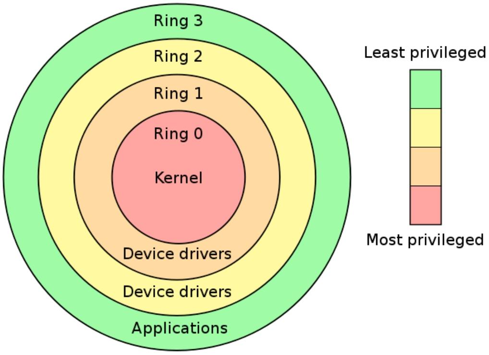

根据这个环，我们可以设计一些不同安全级别的接口

- 硬件$\iff$软件  General Machine Instructions（可以被任何程序调用！最低特权）
- 硬件$\iff$软件 Privileged Machine Instruction （只能由OS或者特权程序调用）

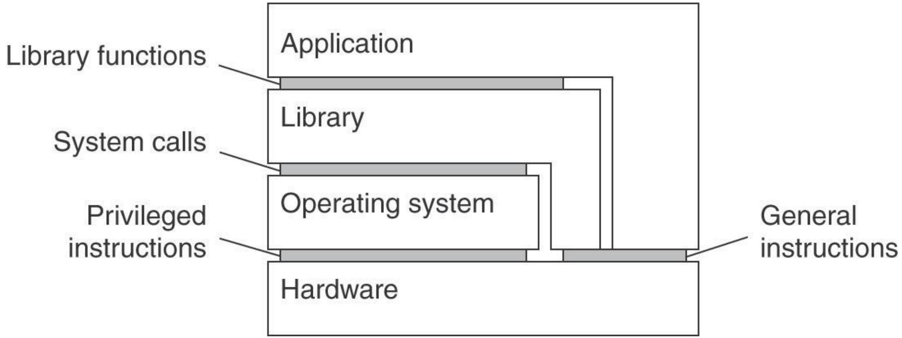

以及，除了接口，还可以设计一些不同安全级别的**调用**

- System calls 操作系统调用：请求访问内核的
- Library calls 库调用：通常指的是API（Application Programming Interface，应用程序编程接口）


## [2] 虚拟化

Virtualization

我们在大二计网讲过了这个，我们需要为程序提供一个抽象的、虚拟的连续空间！（虽然物理上可能不连续）

有很多虚拟化的例子：JVM、虚拟内存、虚拟机（VMware）

**进程级虚拟化** vs **系统级虚拟化**：

“如何让一个程序到处运行” VS “如何在一台电脑上运行多个系统”

> 类似于`.jar`可以在很多系统运行！

### [2.1] 进程级虚拟化

Process Virtualization


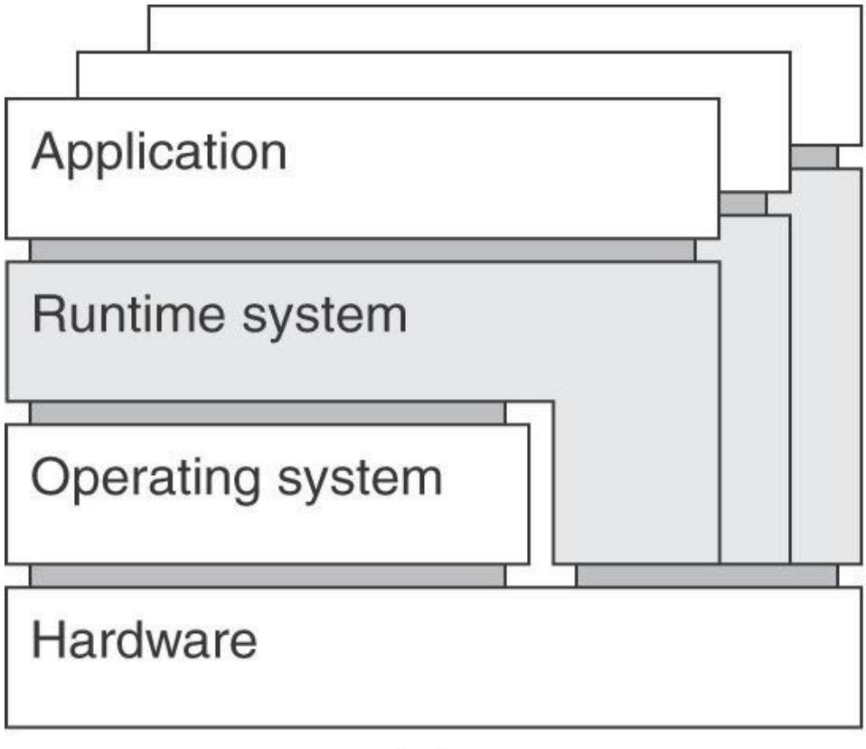

最典型的例子就是Java虚拟机（JVM）


### [2.2] 系统级虚拟化

System Virtualization

这一页描述的是**针对整个硬件环境**的虚拟化。

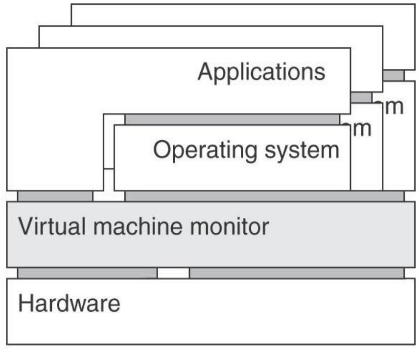

**核心逻辑**：它引入了一个关键层——**虚拟机监视器 (Virtual Machine Monitor, VMM)**，也叫 **Hypervisor**。它直接管理硬件资源。

**架构特点**：

- **VMM** 屏蔽了真实物理硬件，并向上面模拟出多套完整的硬件接口。
- 每个虚拟机（VM）里都可以跑一个**完整的操作系统 (Guest OS)**，而且这些 OS 之间是相互隔离、独立运行的。

**最典型的例子**：**VMware**


### [2.3] 服务器虚拟化

Server Visualization

如果在一个物理计算机上运行服务器，很容易发生故障（硬件故障，这样服务器全炸了）！

可以分布在计算机集群（Cluster）上，优势：

1. 容错（Fault Tolerant）
2. 可扩展性（Salability）
3. 稳定性（Stability）


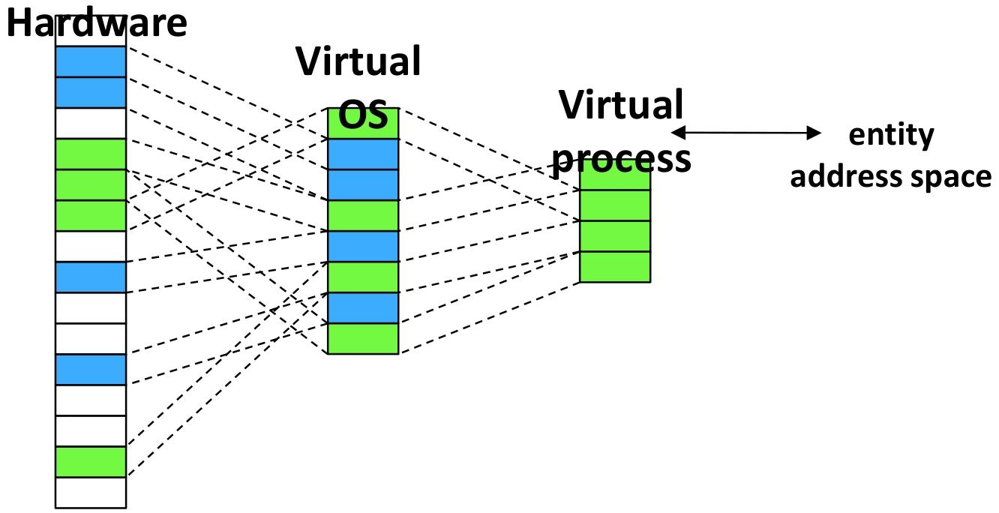


## [3] VMM 和系统快照

**Virtual Machine Monitor**

VMM 的三大金标准 (Popek and Goldberg 原则)

这是 1974 年提出的经典理论，判定一个系统是否是真正的 VMM：

- **等价性 (Equivalence)**：虚拟机里的系统运行起来必须和在真实硬件上一模一样，表现不能有差异。
- **资源控制 (Resource Control)**：VMM 拥有最高权限，**必须能完全掌控所有硬件资源（CPU、内存等）**，虚拟机不能绕过 VMM 直接操作硬件。
- **效率 (Efficiency)**：**性能要高**。绝大部分指令应该由硬件直接执行，只有遇到敏感操作时才让 VMM 介入，否则系统会慢得无法使用。


**VMM 是如何“接管”系统的？**

由于操作系统（Guest OS）通常认为自己拥有最高权限，VMM 必须通过各种手段“骗”过它或“约束”它：

- **硬件辅助虚拟化 (Hardware Support)**：
  - **原理**：利用现代 CPU（如 Intel VT-x, AMD-V）提供的特殊模式。
  - **Ring `-1`**：传统 OS 跑在 Ring 0。硬件虚拟化创造了一个比 Ring 0 权限更高的层（Ring -1），专门给 VMM 住，从而实现绝对控制。
- **软件实现方式**：
  - **修改 Guest OS (准虚拟化 / Paravirtualization)**：比如 **Xen**。主动修改虚拟机里的系统内核，让它知道自己是虚拟的，遇到敏感操作主动发信号给 VMM。
  - **二进制翻译 (Binary Translation)**：在程序运行时，动态地把虚拟机里想做的“危险动作”修改成“安全动作”。
  - **软件仿真 (Emulation)**：用软件模拟出一整套硬件，兼容性最好但速度**最慢**（类似于手机上的复古游戏机模拟器）。


系统快照（System Snapshot）是什么？就是一个文件，可以转移，复制，之类的。参考**阿里云实例**迁移等。


| **虚拟化方案**                | **类型**            | **运行基础 (Host/Hardware)** | **核心特点**                                                 |
| ----------------------------- | ------------------- | ---------------------------- | ------------------------------------------------------------ |
| **VMware Workstation/Player** | 托管型 (Hosted)     | Windows/Linux 宿主系统       | 主要用于桌面端开发和测试。                                   |
| **VMware ESX/ESXi**           | 裸机型 (Bare-metal) | 直接运行在物理硬件上         | 企业级方案，效率极高。                                       |
| **Microsoft Hyper-V**         | 裸机型 (Bare-metal) | 直接运行在硬件上             | 需一个 Windows Server 分区；提供 Linux 驱动以增强性能。      |
| **VirtualBox**                | 托管型 (Hosted)     | Windows/Linux/macOS 宿主系统 | 开源为主；支持软件模拟 (Ring 1) 或硬件辅助 (Ring -1)。       |
| **Xen**                       | 裸机型 (Bare-metal) | 直接运行在硬件上             | 需一个“Master” OS 管理；支持准虚拟化 (Guest OS 有感知) 和硬件辅助。 |


## [4] 云计算

### 云计算与虚拟化概览

**云端虚拟机的特性**：计算能力与存储空间按需调整，用户获得虚拟机的完全使用权！基础设施由服务提供商负责底层维护

**典型案例：Amazon EC2**

**关于扩展性（Scalability）的要点**

- **核心误区**：仅将服务迁移到云端并不等同于自动实现了扩展性。
- **云的作用**：云仅提供实现**规模扩展**（Size）和**地理扩展**（Geographical）的**手段**。
- **管理责任**：开发者/用户仍需主动管理和设计**系统的扩展逻辑**。


虚拟化与云计算的优缺点分析：

| **优点 (Advantages)**              | **缺点 (Disadvantages)**             |
| ---------------------------------- | ------------------------------------ |
| **高弹性**：资源按需扩缩容         | **性能损耗**：难达到物理极限性能     |
| **低成本**：减少硬件与维护开支     | **安全隐私**：多租户环境存在风险     |
| **高可靠**：支持隔离、故障快速迁移 | **失去控制**：对底层硬件无掌控权     |
| **强兼容**：支持旧系统与新环境测试 | **网络依赖**：必须持续高带宽联网     |
| **透明化**：管理简单，环境一键清理 | **迁移困难**：供应商锁定，迁回本地难 |


​	
